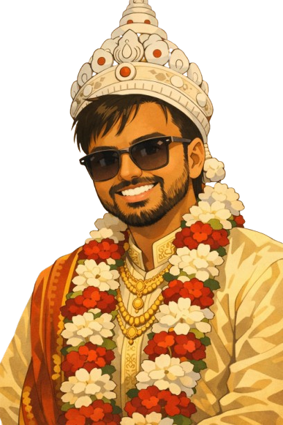
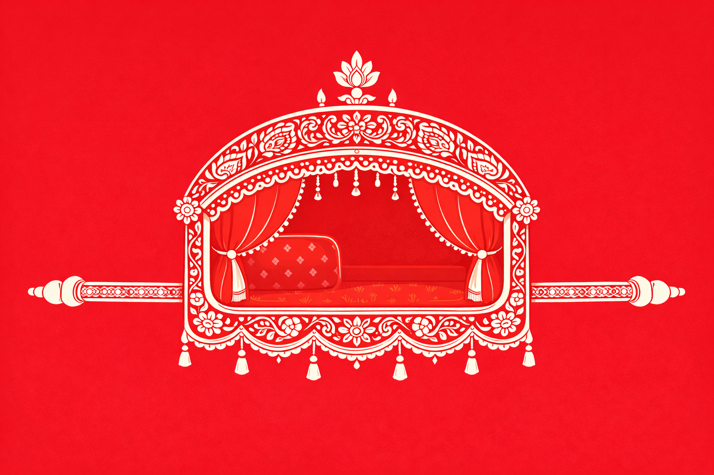
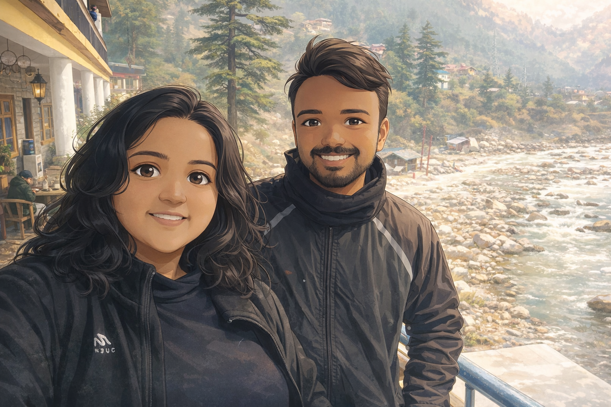
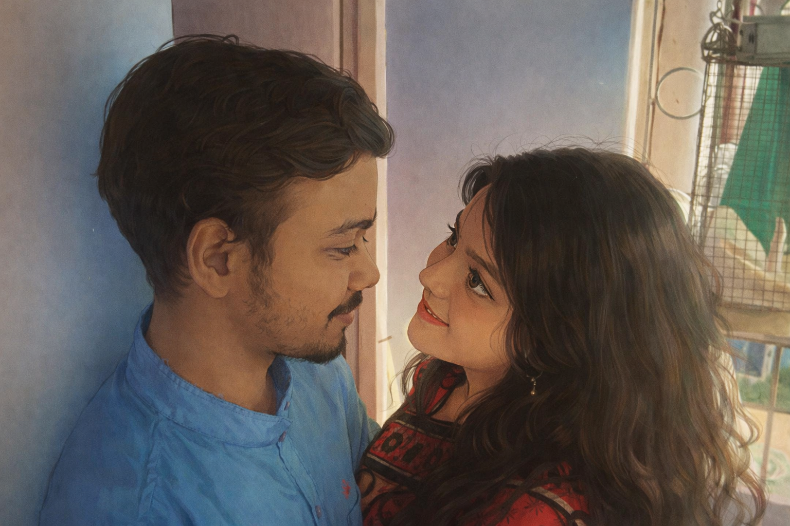
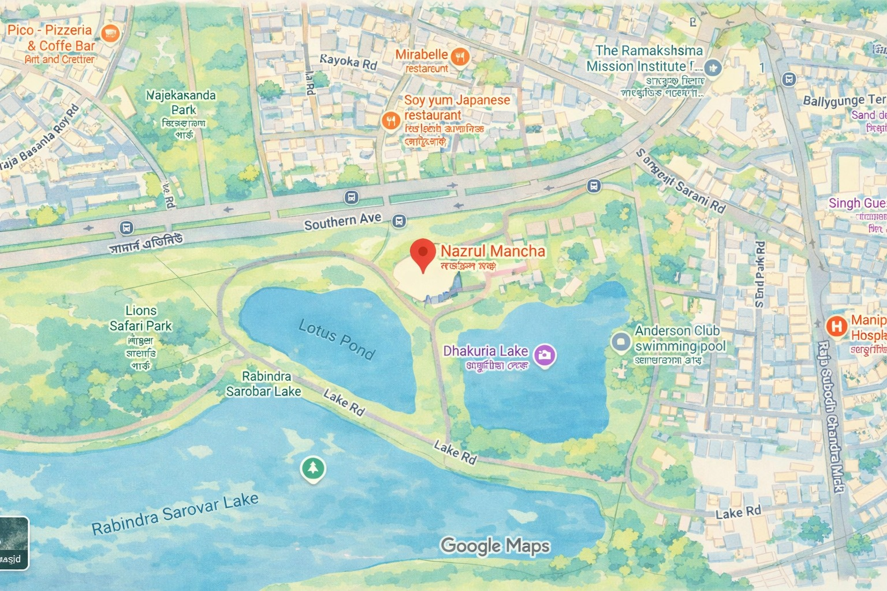

# Wedding invitation design and features
_Exported on 3/1/2026 at 01:24:15 GMT+5:30 from Cursor (2.2.43)_

---

**User**

@Assets/bride_logo.png @Assets/grrom_logo.png 
1.I have bride _logo image and grrom_logo image now add in the first page in the first do some animation in the box 
2. In the first page when i click on the view Invitation then open the Time Until Wedding in this page from this page i can go to the first page VIEW INVITATION
page with click in ফিরে যান / Back i do not want this ফিরে যান / Back, i do not want this icon <div class="ganesha-icon">🕉️</div>icon
i want that ganesha-logo from that assets folder 
3.map opiont create a location Qr https://www.google.com/maps/place/Nazrul+Mancha/@22.5133504,88.3441575,15z/data=!3m1!4b1!4m6!3m5!1s0x3a027715fa70c4c5:0x9defaebf49454c3d!8m2!3d22.5133316!4d88.3626116!16s%2Fm%2F0gmd99l?entry=ttu&g_ep=EgoyMDI2MDIyMy4wIKXMDSoASAFQAw%3D%3D

4.. <div class="sec">
      <div class="sh"><span class="sh-ico">✉️</span><span class="sh-title">RSVP</span><div class="sh-line"></div></div>
      <div class="rsvpinner">
        <div class="rtitle">আপনার উত্তর দিন</div>
        <p class="rsub">আমাদের বিশেষ দিনে আপনার উপস্থিতি নিশ্চিত করুন।<br>Kindly confirm your attendance.</p>
        <div class="fl"><label>Your Name · আপনার নাম</label><input type="text" id="r-name" placeholder="নাম লিখুন"></div>
        <div class="fl"><label>Guests · কতজন</label>
          <select id="r-guests">
            <option>১ জন · Just me</option>
            <option>২ জন · Two</option>
            <option>৩ জন · Three</option>
            <option>৪+ জন · Four or more</option>
          </select>
        </div>
        <div class="fl"><label>Will You Be There?</label>
          <select id="r-attend">
            <option>হ্যাঁ, অবশ্যই · Joyfully attending</option>
            <option>সম্ভবত · Maybe attending</option>
            <option>দুঃখিত, পারব না · Regretfully unable</option>
          </select>
        </div>
        <div class="fl"><label>Your Wishes · আশীর্বাদ</label><textarea id="r-wish" placeholder="শুভকামনা লিখুন..."></textarea></div>
        <button class="rbtn" onclick="sendRSVP()">Send RSVP · পাঠান</button>
      </div>
    </div>

    <!-- BLESSINGS -->
    <div class="sec">
      <div class="sh"><span class="sh-ico">🙏</span><span class="sh-title">Blessings</span><div class="sh-line"></div></div>
      <div class="sb" id="wishes-wall">
        <div class="wish-empty">আশীর্বাদ এখানে দেখা যাবে<br><span style="font-size:11px">Blessings will appear here</span></div>
      </div>
    </div>

  </div><!-- /wrap -->

  <div class="footer">
    <span class="footer-om">🕉️</span>
    <div class="footer-names">Priti & Prithis</div>
    <div class="footer-date">১৩ মে · May 13, 2026</div>
    <div class="footer-div"></div>
    <div class="footer-note">আপনার আশীর্বাদ আমাদের সবচেয়ে বড় উপহার</div>
  </div>
4. 


---

**Cursor**


Reviewing the current files to understand the structure.


Checking for a QR code library or existing QR implementation:


Implementing the changes:


Implementing the changes:


```html
<!DOCTYPE html>
<html lang="bn">
<head>
    <meta charset="UTF-8">
    <meta name="viewport" content="width=device-width, initial-scale=1.0, maximum-scale=1.0, user-scalable=no">
    <title>প্রীতি ও পৃথ্বীশের বিবাহ আমন্ত্রণ | Prithis & Priti Wedding Invitation</title>
    <link rel="stylesheet" href="style.css">
    <link rel="preconnect" href="https://fonts.googleapis.com">
    <link rel="preconnect" href="https://fonts.gstatic.com" crossorigin>
    <link href="https://fonts.googleapis.com/css2?family=Noto+Sans+Bengali:wght@400;500;600;700&family=Playfair+Display:wght@400;600;700&display=swap" rel="stylesheet">
</head>
<body>
    <!-- Landing Page (First Page) -->
    <div id="landing-page" class="page active">
        <div class="landing-container">
            <!-- Decorative Corner Elements -->
            <div class="corner-decoration top-left"></div>
            <div class="corner-decoration top-right"></div>
            <div class="corner-decoration bottom-left"></div>
            <div class="corner-decoration bottom-right"></div>
            
            <!-- Main Content Box -->
            <div class="landing-main-box">
                <!-- Top Section -->
                <div class="landing-top-section">
                    <div class="ganesh-logo-container">
                        
                    </div>
                    <div class="invitation-badge">
                        <p class="invited-text-bengali">আমন্ত্রণ</p>
                        <p class="invited-text-english">INVITATION</p>
                    </div>
                </div>
                
                <!-- Bride and Groom Logo Section -->
                <div class="bride-groom-logos">
                    <div class="logo-box bride-logo-box">
                        
                    </div>
                    <div class="logo-box groom-logo-box">
                        
                    </div>
                </div>
                
                <!-- Middle Section - Names -->
                <div class="landing-names-section">
                    <div class="name-box name-box-left">
                        <h1 class="landing-name">প্রীতি</h1>
                        <p class="english-name">Priti</p>
                    </div>
                    
                    <div class="union-heart">❤</div>
                    
                    <div class="name-box name-box-right">
                        <h1 class="landing-name">পৃথ্বীশ</h1>
                        <p class="english-name">Prithis</p>
                    </div>
                </div>
                
                <!-- Bottom Section -->
                <div class="landing-bottom-section">
                    <div class="decorative-line"></div>
                    <p class="subtitle-text">আমাদের বিবাহে আপনাকে আমন্ত্রণ জানাচ্ছি<br><span class="english-text">We invite you to our wedding</span></p>
                    <div class="decorative-line"></div>
                </div>
            </div>
            
            <!-- Open Button -->
            <button class="open-button" onclick="openInvitation()">
                <span class="button-text-bengali">আমন্ত্রণ দেখুন</span>
                <span class="button-text-english">VIEW INVITATION</span>
                <span class="button-arrow">→</span>
            </button>
            
            <!-- Footer -->
            <div class="footer-text">
                <p>প্রীতি ও পৃথ্বীশের বিবাহ<br><span class="english-text">Prithis & Priti Wedding</span></p>
            </div>
        </div>
    </div>

    <!-- Main Invitation Page (Second Page) -->
    <div id="invitation-page" class="page">
        <button class="back-button" onclick="goBack()">← ফিরে যান / Back</button>
        <div class="container">
            <!-- Countdown Section -->
            <section class="countdown-section">
                <h2 class="countdown-title">বিবাহ পর্যন্ত / Time Until Wedding</h2>
                <div class="countdown-container">
                    <div class="countdown-item">
                        <div class="countdown-number" id="days">00</div>
                        <div class="countdown-label">দিন / Days</div>
                    </div>
                    <div class="countdown-separator">:</div>
                    <div class="countdown-item">
                        <div class="countdown-number" id="hours">00</div>
                        <div class="countdown-label">ঘন্টা / Hours</div>
                    </div>
                    <div class="countdown-separator">:</div>
                    <div class="countdown-item">
                        <div class="countdown-number" id="minutes">00</div>
                        <div class="countdown-label">মিনিট / Minutes</div>
                    </div>
                    <div class="countdown-separator">:</div>
                    <div class="countdown-item">
                        <div class="countdown-number" id="seconds">00</div>
                        <div class="countdown-label">সেকেন্ড / Seconds</div>
                    </div>
                </div>
            </section>

            <!-- Calendar Section -->
            <section class="calendar-section">
                <h2 class="calendar-title">মে ২০২৬ / May 2026</h2>
                <div class="calendar">
                    <div class="calendar-header">
                        <div class="day-name">রবি<br>Sun</div>
                        <div class="day-name">সোম<br>Mon</div>
                        <div class="day-name">মঙ্গল<br>Tue</div>
                        <div class="day-name">বুধ<br>Wed</div>
                        <div class="day-name">বৃহ<br>Thu</div>
                        <div class="day-name">শুক্র<br>Fri</div>
                        <div class="day-name">শনি<br>Sat</div>
                    </div>
                    <div class="calendar-grid" id="calendar-grid">
                        <!-- Calendar days will be generated by JavaScript -->
                    </div>
                </div>
            </section>

            <!-- Header Section with Ganesha -->
            <header class="header">
                <div class="ganesha-icon">🕉️</div>
                <h1 class="invocation">ওঁ শ্রী গণেশায় নমঃ<br><span class="english-text">Om Shri Ganeshaya Namah</span></h1>
                <p class="subtitle">মঙ্গল আমন্ত্রণ<br><span class="english-text">Auspicious Invitation</span></p>
            </header>

            <!-- Main Invitation Section -->
            <section class="invitation-section">
                <div class="decorative-top"></div>
                
                <div class="main-content">
                    <p class="invitation-text">আমাদের কন্যার শুভ পরিণয় উপলক্ষে<br>আপনাদের সপরিবারে নিমন্ত্রণ জানাচ্ছি<br><span class="english-text">We cordially invite you and your family<br>to the auspicious wedding of our daughter</span></p>
                    
                    <div class="couple-names">
                        <div class="name-bride">
                            <h2 class="name-large">প্রীতি<br><span class="english-name">Priti</span></h2>
                            <p class="parent-info">কন্যা / Daughter</p>
                            <p class="parent-names">সুকান্ত ও শেফালী অধিকারী<br><span class="english-text">Sukanto & Shefali Adhikari</span></p>
                        </div>
                        
                        <div class="union-symbol">&</div>
                        
                        <div class="name-groom">
                            <h2 class="name-large">পৃথ্বীশ<br><span class="english-name">Prithis</span></h2>
                            <p class="parent-info">পুত্র / Son</p>
                            <p class="parent-names">নান্টু ও পলি মন্ডল<br><span class="english-text">Nantu & Poli Mondal</span></p>
                        </div>
                    </div>

                    <div class="wedding-details">
                        <div class="detail-item">
                            <span class="detail-label">বিবাহের শুভদিন / Wedding Date:</span>
                            <span class="detail-value">১৩ মে, ২০২৬<br><span class="english-text">May 13, 2026</span></span>
                        </div>
                        <div class="detail-item">
                            <span class="detail-label">সময় / Time:</span>
                            <span class="detail-value">রাত্রি ১১:২৪<br><span class="english-text">11:24 PM</span></span>
                        </div>
                        <div class="detail-item">
                            <span class="detail-label">স্থান / Venue:</span>
                            <span class="detail-value">রামপুর বি.বি.টি. রোড,<br>ফ্ল্যাট- মাধুরী অ্যাপার্টমেন্ট,<br>পিলার নং ৭০<br><span class="english-text">Rampur B.B.T. Road,<br>Flat - Madhuri Apartment,<br>Pillar No. 70</span></span>
                        </div>
                    </div>

                    <div class="host-info">
                        <p class="host-text">আমন্ত্রণে / Invited by:</p>
                        <p class="host-names">সুকান্ত ও শেফালী অধিকারী<br><span class="english-text">Sukanto & Shefali Adhikari</span></p>
                    </div>
                </div>

                <div class="decorative-bottom"></div>
            </section>

            <!-- QR Code Section -->
            <section class="qr-section">
                <div class="qr-container">
                    <div class="qr-placeholder">
                        <div class="qr-icon">📍</div>
                        <p class="qr-text">QR Code</p>
                    </div>
                    <p class="scan-text">ঠিকানার জন্য স্ক্যান করুন<br><span class="english-text">Scan for Address</span></p>
                </div>
            </section>
        </div>
    </div>

    <script src="script.js"></script>
</body>
</html>

```

```html
<!DOCTYPE html>
<html lang="bn">
<head>
    <meta charset="UTF-8">
    <meta name="viewport" content="width=device-width, initial-scale=1.0, maximum-scale=1.0, user-scalable=no">
    <title>প্রীতি ও পৃথ্বীশের বিবাহ আমন্ত্রণ | Prithis & Priti Wedding Invitation</title>
    <link rel="stylesheet" href="style.css">
    <link rel="preconnect" href="https://fonts.googleapis.com">
    <link rel="preconnect" href="https://fonts.gstatic.com" crossorigin>
    <link href="https://fonts.googleapis.com/css2?family=Noto+Sans+Bengali:wght@400;500;600;700&family=Playfair+Display:wght@400;600;700&display=swap" rel="stylesheet">
</head>
<body>
    <!-- Landing Page (First Page) -->
    <div id="landing-page" class="page active">
        <div class="landing-container">
            <!-- Decorative Corner Elements -->
            <div class="corner-decoration top-left"></div>
            <div class="corner-decoration top-right"></div>
            <div class="corner-decoration bottom-left"></div>
            <div class="corner-decoration bottom-right"></div>
            
            <!-- Main Content Box -->
            <div class="landing-main-box">
                <!-- Top Section -->
                <div class="landing-top-section">
                    <div class="ganesh-logo-container">
                        
                    </div>
                    <div class="invitation-badge">
                        <p class="invited-text-bengali">আমন্ত্রণ</p>
                        <p class="invited-text-english">INVITATION</p>
                    </div>
                </div>
                
                <!-- Bride and Groom Logo Section -->
                <div class="bride-groom-logos">
                    <div class="logo-box bride-logo-box">
                        
                    </div>
                    <div class="logo-box groom-logo-box">
                        
                    </div>
                </div>
                
                <!-- Middle Section - Names -->
                <div class="landing-names-section">
                    <div class="name-box name-box-left">
                        <h1 class="landing-name">প্রীতি</h1>
                        <p class="english-name">Priti</p>
                    </div>
                    
                    <div class="union-heart">❤</div>
                    
                    <div class="name-box name-box-right">
                        <h1 class="landing-name">পৃথ্বীশ</h1>
                        <p class="english-name">Prithis</p>
                    </div>
                </div>
                
                <!-- Bottom Section -->
                <div class="landing-bottom-section">
                    <div class="decorative-line"></div>
                    <p class="subtitle-text">আমাদের বিবাহে আপনাকে আমন্ত্রণ জানাচ্ছি<br><span class="english-text">We invite you to our wedding</span></p>
                    <div class="decorative-line"></div>
                </div>
            </div>
            
            <!-- Open Button -->
            <button class="open-button" onclick="openInvitation()">
                <span class="button-text-bengali">আমন্ত্রণ দেখুন</span>
                <span class="button-text-english">VIEW INVITATION</span>
                <span class="button-arrow">→</span>
            </button>
            
            <!-- Footer -->
            <div class="footer-text">
                <p>প্রীতি ও পৃথ্বীশের বিবাহ<br><span class="english-text">Prithis & Priti Wedding</span></p>
            </div>
        </div>
    </div>

    <!-- Main Invitation Page (Second Page) -->
    <div id="invitation-page" class="page">
        <button class="back-button" onclick="goBack()">
            
        </button>
        <div class="container">
            <!-- Countdown Section -->
            <section class="countdown-section">
                <h2 class="countdown-title">বিবাহ পর্যন্ত / Time Until Wedding</h2>
                <div class="countdown-container">
                    <div class="countdown-item">
                        <div class="countdown-number" id="days">00</div>
                        <div class="countdown-label">দিন / Days</div>
                    </div>
                    <div class="countdown-separator">:</div>
                    <div class="countdown-item">
                        <div class="countdown-number" id="hours">00</div>
                        <div class="countdown-label">ঘন্টা / Hours</div>
                    </div>
                    <div class="countdown-separator">:</div>
                    <div class="countdown-item">
                        <div class="countdown-number" id="minutes">00</div>
                        <div class="countdown-label">মিনিট / Minutes</div>
                    </div>
                    <div class="countdown-separator">:</div>
                    <div class="countdown-item">
                        <div class="countdown-number" id="seconds">00</div>
                        <div class="countdown-label">সেকেন্ড / Seconds</div>
                    </div>
                </div>
            </section>

            <!-- Calendar Section -->
            <section class="calendar-section">
                <h2 class="calendar-title">মে ২০২৬ / May 2026</h2>
                <div class="calendar">
                    <div class="calendar-header">
                        <div class="day-name">রবি<br>Sun</div>
                        <div class="day-name">সোম<br>Mon</div>
                        <div class="day-name">মঙ্গল<br>Tue</div>
                        <div class="day-name">বুধ<br>Wed</div>
                        <div class="day-name">বৃহ<br>Thu</div>
                        <div class="day-name">শুক্র<br>Fri</div>
                        <div class="day-name">শনি<br>Sat</div>
                    </div>
                    <div class="calendar-grid" id="calendar-grid">
                        <!-- Calendar days will be generated by JavaScript -->
                    </div>
                </div>
            </section>

            <!-- Header Section with Ganesha -->
            <header class="header">
                <div class="ganesha-icon">🕉️</div>
                <h1 class="invocation">ওঁ শ্রী গণেশায় নমঃ<br><span class="english-text">Om Shri Ganeshaya Namah</span></h1>
                <p class="subtitle">মঙ্গল আমন্ত্রণ<br><span class="english-text">Auspicious Invitation</span></p>
            </header>

            <!-- Main Invitation Section -->
            <section class="invitation-section">
                <div class="decorative-top"></div>
                
                <div class="main-content">
                    <p class="invitation-text">আমাদের কন্যার শুভ পরিণয় উপলক্ষে<br>আপনাদের সপরিবারে নিমন্ত্রণ জানাচ্ছি<br><span class="english-text">We cordially invite you and your family<br>to the auspicious wedding of our daughter</span></p>
                    
                    <div class="couple-names">
                        <div class="name-bride">
                            <h2 class="name-large">প্রীতি<br><span class="english-name">Priti</span></h2>
                            <p class="parent-info">কন্যা / Daughter</p>
                            <p class="parent-names">সুকান্ত ও শেফালী অধিকারী<br><span class="english-text">Sukanto & Shefali Adhikari</span></p>
                        </div>
                        
                        <div class="union-symbol">&</div>
                        
                        <div class="name-groom">
                            <h2 class="name-large">পৃথ্বীশ<br><span class="english-name">Prithis</span></h2>
                            <p class="parent-info">পুত্র / Son</p>
                            <p class="parent-names">নান্টু ও পলি মন্ডল<br><span class="english-text">Nantu & Poli Mondal</span></p>
                        </div>
                    </div>

                    <div class="wedding-details">
                        <div class="detail-item">
                            <span class="detail-label">বিবাহের শুভদিন / Wedding Date:</span>
                            <span class="detail-value">১৩ মে, ২০২৬<br><span class="english-text">May 13, 2026</span></span>
                        </div>
                        <div class="detail-item">
                            <span class="detail-label">সময় / Time:</span>
                            <span class="detail-value">রাত্রি ১১:২৪<br><span class="english-text">11:24 PM</span></span>
                        </div>
                        <div class="detail-item">
                            <span class="detail-label">স্থান / Venue:</span>
                            <span class="detail-value">রামপুর বি.বি.টি. রোড,<br>ফ্ল্যাট- মাধুরী অ্যাপার্টমেন্ট,<br>পিলার নং ৭০<br><span class="english-text">Rampur B.B.T. Road,<br>Flat - Madhuri Apartment,<br>Pillar No. 70</span></span>
                        </div>
                    </div>

                    <div class="host-info">
                        <p class="host-text">আমন্ত্রণে / Invited by:</p>
                        <p class="host-names">সুকান্ত ও শেফালী অধিকারী<br><span class="english-text">Sukanto & Shefali Adhikari</span></p>
                    </div>
                </div>

                <div class="decorative-bottom"></div>
            </section>

            <!-- QR Code Section -->
            <section class="qr-section">
                <div class="qr-container">
                    <div class="qr-placeholder">
                        <div class="qr-icon">📍</div>
                        <p class="qr-text">QR Code</p>
                    </div>
                    <p class="scan-text">ঠিকানার জন্য স্ক্যান করুন<br><span class="english-text">Scan for Address</span></p>
                </div>
            </section>
        </div>
    </div>

    <script src="script.js"></script>
</body>
</html>

```

```html
<!DOCTYPE html>
<html lang="bn">
<head>
    <meta charset="UTF-8">
    <meta name="viewport" content="width=device-width, initial-scale=1.0, maximum-scale=1.0, user-scalable=no">
    <title>প্রীতি ও পৃথ্বীশের বিবাহ আমন্ত্রণ | Prithis & Priti Wedding Invitation</title>
    <link rel="stylesheet" href="style.css">
    <link rel="preconnect" href="https://fonts.googleapis.com">
    <link rel="preconnect" href="https://fonts.gstatic.com" crossorigin>
    <link href="https://fonts.googleapis.com/css2?family=Noto+Sans+Bengali:wght@400;500;600;700&family=Playfair+Display:wght@400;600;700&display=swap" rel="stylesheet">
</head>
<body>
    <!-- Landing Page (First Page) -->
    <div id="landing-page" class="page active">
        <div class="landing-container">
            <!-- Decorative Corner Elements -->
            <div class="corner-decoration top-left"></div>
            <div class="corner-decoration top-right"></div>
            <div class="corner-decoration bottom-left"></div>
            <div class="corner-decoration bottom-right"></div>
            
            <!-- Main Content Box -->
            <div class="landing-main-box">
                <!-- Top Section -->
                <div class="landing-top-section">
                    <div class="ganesh-logo-container">
                        
                    </div>
                    <div class="invitation-badge">
                        <p class="invited-text-bengali">আমন্ত্রণ</p>
                        <p class="invited-text-english">INVITATION</p>
                    </div>
                </div>
                
                <!-- Bride and Groom Logo Section -->
                <div class="bride-groom-logos">
                    <div class="logo-box bride-logo-box">
                        
                    </div>
                    <div class="logo-box groom-logo-box">
                        
                    </div>
                </div>
                
                <!-- Middle Section - Names -->
                <div class="landing-names-section">
                    <div class="name-box name-box-left">
                        <h1 class="landing-name">প্রীতি</h1>
                        <p class="english-name">Priti</p>
                    </div>
                    
                    <div class="union-heart">❤</div>
                    
                    <div class="name-box name-box-right">
                        <h1 class="landing-name">পৃথ্বীশ</h1>
                        <p class="english-name">Prithis</p>
                    </div>
                </div>
                
                <!-- Bottom Section -->
                <div class="landing-bottom-section">
                    <div class="decorative-line"></div>
                    <p class="subtitle-text">আমাদের বিবাহে আপনাকে আমন্ত্রণ জানাচ্ছি<br><span class="english-text">We invite you to our wedding</span></p>
                    <div class="decorative-line"></div>
                </div>
            </div>
            
            <!-- Open Button -->
            <button class="open-button" onclick="openInvitation()">
                <span class="button-text-bengali">আমন্ত্রণ দেখুন</span>
                <span class="button-text-english">VIEW INVITATION</span>
                <span class="button-arrow">→</span>
            </button>
            
            <!-- Footer -->
            <div class="footer-text">
                <p>প্রীতি ও পৃথ্বীশের বিবাহ<br><span class="english-text">Prithis & Priti Wedding</span></p>
            </div>
        </div>
    </div>

    <!-- Main Invitation Page (Second Page) -->
    <div id="invitation-page" class="page">
        <button class="back-button" onclick="goBack()">
            
        </button>
        <div class="container">
            <!-- Countdown Section -->
            <section class="countdown-section">
                <h2 class="countdown-title">বিবাহ পর্যন্ত / Time Until Wedding</h2>
                <div class="countdown-container">
                    <div class="countdown-item">
                        <div class="countdown-number" id="days">00</div>
                        <div class="countdown-label">দিন / Days</div>
                    </div>
                    <div class="countdown-separator">:</div>
                    <div class="countdown-item">
                        <div class="countdown-number" id="hours">00</div>
                        <div class="countdown-label">ঘন্টা / Hours</div>
                    </div>
                    <div class="countdown-separator">:</div>
                    <div class="countdown-item">
                        <div class="countdown-number" id="minutes">00</div>
                        <div class="countdown-label">মিনিট / Minutes</div>
                    </div>
                    <div class="countdown-separator">:</div>
                    <div class="countdown-item">
                        <div class="countdown-number" id="seconds">00</div>
                        <div class="countdown-label">সেকেন্ড / Seconds</div>
                    </div>
                </div>
            </section>

            <!-- Calendar Section -->
            <section class="calendar-section">
                <h2 class="calendar-title">মে ২০২৬ / May 2026</h2>
                <div class="calendar">
                    <div class="calendar-header">
                        <div class="day-name">রবি<br>Sun</div>
                        <div class="day-name">সোম<br>Mon</div>
                        <div class="day-name">মঙ্গল<br>Tue</div>
                        <div class="day-name">বুধ<br>Wed</div>
                        <div class="day-name">বৃহ<br>Thu</div>
                        <div class="day-name">শুক্র<br>Fri</div>
                        <div class="day-name">শনি<br>Sat</div>
                    </div>
                    <div class="calendar-grid" id="calendar-grid">
                        <!-- Calendar days will be generated by JavaScript -->
                    </div>
                </div>
            </section>

            <!-- Header Section with Ganesha -->
            <header class="header">
                <div class="ganesha-icon-container">
                    
                </div>
                <h1 class="invocation">ওঁ শ্রী গণেশায় নমঃ<br><span class="english-text">Om Shri Ganeshaya Namah</span></h1>
                <p class="subtitle">মঙ্গল আমন্ত্রণ<br><span class="english-text">Auspicious Invitation</span></p>
            </header>

            <!-- Main Invitation Section -->
            <section class="invitation-section">
                <div class="decorative-top"></div>
                
                <div class="main-content">
                    <p class="invitation-text">আমাদের কন্যার শুভ পরিণয় উপলক্ষে<br>আপনাদের সপরিবারে নিমন্ত্রণ জানাচ্ছি<br><span class="english-text">We cordially invite you and your family<br>to the auspicious wedding of our daughter</span></p>
                    
                    <div class="couple-names">
                        <div class="name-bride">
                            <h2 class="name-large">প্রীতি<br><span class="english-name">Priti</span></h2>
                            <p class="parent-info">কন্যা / Daughter</p>
                            <p class="parent-names">সুকান্ত ও শেফালী অধিকারী<br><span class="english-text">Sukanto & Shefali Adhikari</span></p>
                        </div>
                        
                        <div class="union-symbol">&</div>
                        
                        <div class="name-groom">
                            <h2 class="name-large">পৃথ্বীশ<br><span class="english-name">Prithis</span></h2>
                            <p class="parent-info">পুত্র / Son</p>
                            <p class="parent-names">নান্টু ও পলি মন্ডল<br><span class="english-text">Nantu & Poli Mondal</span></p>
                        </div>
                    </div>

                    <div class="wedding-details">
                        <div class="detail-item">
                            <span class="detail-label">বিবাহের শুভদিন / Wedding Date:</span>
                            <span class="detail-value">১৩ মে, ২০২৬<br><span class="english-text">May 13, 2026</span></span>
                        </div>
                        <div class="detail-item">
                            <span class="detail-label">সময় / Time:</span>
                            <span class="detail-value">রাত্রি ১১:২৪<br><span class="english-text">11:24 PM</span></span>
                        </div>
                        <div class="detail-item">
                            <span class="detail-label">স্থান / Venue:</span>
                            <span class="detail-value">রামপুর বি.বি.টি. রোড,<br>ফ্ল্যাট- মাধুরী অ্যাপার্টমেন্ট,<br>পিলার নং ৭০<br><span class="english-text">Rampur B.B.T. Road,<br>Flat - Madhuri Apartment,<br>Pillar No. 70</span></span>
                        </div>
                    </div>

                    <div class="host-info">
                        <p class="host-text">আমন্ত্রণে / Invited by:</p>
                        <p class="host-names">সুকান্ত ও শেফালী অধিকারী<br><span class="english-text">Sukanto & Shefali Adhikari</span></p>
                    </div>
                </div>

                <div class="decorative-bottom"></div>
            </section>

            <!-- QR Code Section -->
            <section class="qr-section">
                <div class="qr-container">
                    <div class="qr-placeholder">
                        <div class="qr-icon">📍</div>
                        <p class="qr-text">QR Code</p>
                    </div>
                    <p class="scan-text">ঠিকানার জন্য স্ক্যান করুন<br><span class="english-text">Scan for Address</span></p>
                </div>
            </section>
        </div>
    </div>

    <script src="script.js"></script>
</body>
</html>

```

```html
<!DOCTYPE html>
<html lang="bn">
<head>
    <meta charset="UTF-8">
    <meta name="viewport" content="width=device-width, initial-scale=1.0, maximum-scale=1.0, user-scalable=no">
    <title>প্রীতি ও পৃথ্বীশের বিবাহ আমন্ত্রণ | Prithis & Priti Wedding Invitation</title>
    <link rel="stylesheet" href="style.css">
    <link rel="preconnect" href="https://fonts.googleapis.com">
    <link rel="preconnect" href="https://fonts.gstatic.com" crossorigin>
    <link href="https://fonts.googleapis.com/css2?family=Noto+Sans+Bengali:wght@400;500;600;700&family=Playfair+Display:wght@400;600;700&display=swap" rel="stylesheet">
</head>
<body>
    <!-- Landing Page (First Page) -->
    <div id="landing-page" class="page active">
        <div class="landing-container">
            <!-- Decorative Corner Elements -->
            <div class="corner-decoration top-left"></div>
            <div class="corner-decoration top-right"></div>
            <div class="corner-decoration bottom-left"></div>
            <div class="corner-decoration bottom-right"></div>
            
            <!-- Main Content Box -->
            <div class="landing-main-box">
                <!-- Top Section -->
                <div class="landing-top-section">
                    <div class="ganesh-logo-container">
                        
                    </div>
                    <div class="invitation-badge">
                        <p class="invited-text-bengali">আমন্ত্রণ</p>
                        <p class="invited-text-english">INVITATION</p>
                    </div>
                </div>
                
                <!-- Bride and Groom Logo Section -->
                <div class="bride-groom-logos">
                    <div class="logo-box bride-logo-box">
                        
                    </div>
                    <div class="logo-box groom-logo-box">
                        
                    </div>
                </div>
                
                <!-- Middle Section - Names -->
                <div class="landing-names-section">
                    <div class="name-box name-box-left">
                        <h1 class="landing-name">প্রীতি</h1>
                        <p class="english-name">Priti</p>
                    </div>
                    
                    <div class="union-heart">❤</div>
                    
                    <div class="name-box name-box-right">
                        <h1 class="landing-name">পৃথ্বীশ</h1>
                        <p class="english-name">Prithis</p>
                    </div>
                </div>
                
                <!-- Bottom Section -->
                <div class="landing-bottom-section">
                    <div class="decorative-line"></div>
                    <p class="subtitle-text">আমাদের বিবাহে আপনাকে আমন্ত্রণ জানাচ্ছি<br><span class="english-text">We invite you to our wedding</span></p>
                    <div class="decorative-line"></div>
                </div>
            </div>
            
            <!-- Open Button -->
            <button class="open-button" onclick="openInvitation()">
                <span class="button-text-bengali">আমন্ত্রণ দেখুন</span>
                <span class="button-text-english">VIEW INVITATION</span>
                <span class="button-arrow">→</span>
            </button>
            
            <!-- Footer -->
            <div class="footer-text">
                <p>প্রীতি ও পৃথ্বীশের বিবাহ<br><span class="english-text">Prithis & Priti Wedding</span></p>
            </div>
        </div>
    </div>

    <!-- Main Invitation Page (Second Page) -->
    <div id="invitation-page" class="page">
        <button class="back-button" onclick="goBack()">
            
        </button>
        <div class="container">
            <!-- Countdown Section -->
            <section class="countdown-section">
                <h2 class="countdown-title">বিবাহ পর্যন্ত / Time Until Wedding</h2>
                <div class="countdown-container">
                    <div class="countdown-item">
                        <div class="countdown-number" id="days">00</div>
                        <div class="countdown-label">দিন / Days</div>
                    </div>
                    <div class="countdown-separator">:</div>
                    <div class="countdown-item">
                        <div class="countdown-number" id="hours">00</div>
                        <div class="countdown-label">ঘন্টা / Hours</div>
                    </div>
                    <div class="countdown-separator">:</div>
                    <div class="countdown-item">
                        <div class="countdown-number" id="minutes">00</div>
                        <div class="countdown-label">মিনিট / Minutes</div>
                    </div>
                    <div class="countdown-separator">:</div>
                    <div class="countdown-item">
                        <div class="countdown-number" id="seconds">00</div>
                        <div class="countdown-label">সেকেন্ড / Seconds</div>
                    </div>
                </div>
            </section>

            <!-- Calendar Section -->
            <section class="calendar-section">
                <h2 class="calendar-title">মে ২০২৬ / May 2026</h2>
                <div class="calendar">
                    <div class="calendar-header">
                        <div class="day-name">রবি<br>Sun</div>
                        <div class="day-name">সোম<br>Mon</div>
                        <div class="day-name">মঙ্গল<br>Tue</div>
                        <div class="day-name">বুধ<br>Wed</div>
                        <div class="day-name">বৃহ<br>Thu</div>
                        <div class="day-name">শুক্র<br>Fri</div>
                        <div class="day-name">শনি<br>Sat</div>
                    </div>
                    <div class="calendar-grid" id="calendar-grid">
                        <!-- Calendar days will be generated by JavaScript -->
                    </div>
                </div>
            </section>

            <!-- Header Section with Ganesha -->
            <header class="header">
                <div class="ganesha-icon-container">
                    
                </div>
                <h1 class="invocation">ওঁ শ্রী গণেশায় নমঃ<br><span class="english-text">Om Shri Ganeshaya Namah</span></h1>
                <p class="subtitle">মঙ্গল আমন্ত্রণ<br><span class="english-text">Auspicious Invitation</span></p>
            </header>

            <!-- Main Invitation Section -->
            <section class="invitation-section">
                <div class="decorative-top"></div>
                
                <div class="main-content">
                    <p class="invitation-text">আমাদের কন্যার শুভ পরিণয় উপলক্ষে<br>আপনাদের সপরিবারে নিমন্ত্রণ জানাচ্ছি<br><span class="english-text">We cordially invite you and your family<br>to the auspicious wedding of our daughter</span></p>
                    
                    <div class="couple-names">
                        <div class="name-bride">
                            <h2 class="name-large">প্রীতি<br><span class="english-name">Priti</span></h2>
                            <p class="parent-info">কন্যা / Daughter</p>
                            <p class="parent-names">সুকান্ত ও শেফালী অধিকারী<br><span class="english-text">Sukanto & Shefali Adhikari</span></p>
                        </div>
                        
                        <div class="union-symbol">&</div>
                        
                        <div class="name-groom">
                            <h2 class="name-large">পৃথ্বীশ<br><span class="english-name">Prithis</span></h2>
                            <p class="parent-info">পুত্র / Son</p>
                            <p class="parent-names">নান্টু ও পলি মন্ডল<br><span class="english-text">Nantu & Poli Mondal</span></p>
                        </div>
                    </div>

                    <div class="wedding-details">
                        <div class="detail-item">
                            <span class="detail-label">বিবাহের শুভদিন / Wedding Date:</span>
                            <span class="detail-value">১৩ মে, ২০২৬<br><span class="english-text">May 13, 2026</span></span>
                        </div>
                        <div class="detail-item">
                            <span class="detail-label">সময় / Time:</span>
                            <span class="detail-value">রাত্রি ১১:২৪<br><span class="english-text">11:24 PM</span></span>
                        </div>
                        <div class="detail-item">
                            <span class="detail-label">স্থান / Venue:</span>
                            <span class="detail-value">রামপুর বি.বি.টি. রোড,<br>ফ্ল্যাট- মাধুরী অ্যাপার্টমেন্ট,<br>পিলার নং ৭০<br><span class="english-text">Rampur B.B.T. Road,<br>Flat - Madhuri Apartment,<br>Pillar No. 70</span></span>
                        </div>
                    </div>

                    <div class="host-info">
                        <p class="host-text">আমন্ত্রণে / Invited by:</p>
                        <p class="host-names">সুকান্ত ও শেফালী অধিকারী<br><span class="english-text">Sukanto & Shefali Adhikari</span></p>
                    </div>
                </div>

                <div class="decorative-bottom"></div>
            </section>

            <!-- Map QR Code Section -->
            <section class="qr-section">
                <div class="qr-container">
                    <div class="qr-placeholder" id="map-qr-code">
                        <div class="qr-icon">📍</div>
                        <p class="qr-text">QR Code</p>
                    </div>
                    <p class="scan-text">ঠিকানার জন্য স্ক্যান করুন<br><span class="english-text">Scan for Location</span></p>
                </div>
            </section>

            <!-- RSVP Section -->
            <div class="sec">
                <div class="sh"><span class="sh-ico">✉️</span><span class="sh-title">RSVP</span><div class="sh-line"></div></div>
                <div class="rsvpinner">
                    <div class="rtitle">আপনার উত্তর দিন</div>
                    <p class="rsub">আমাদের বিশেষ দিনে আপনার উপস্থিতি নিশ্চিত করুন।<br>Kindly confirm your attendance.</p>
                    <div class="fl"><label>Your Name · আপনার নাম</label><input type="text" id="r-name" placeholder="নাম লিখুন"></div>
                    <div class="fl"><label>Guests · কতজন</label>
                        <select id="r-guests">
                            <option>১ জন · Just me</option>
                            <option>২ জন · Two</option>
                            <option>৩ জন · Three</option>
                            <option>৪+ জন · Four or more</option>
                        </select>
                    </div>
                    <div class="fl"><label>Will You Be There?</label>
                        <select id="r-attend">
                            <option>হ্যাঁ, অবশ্যই · Joyfully attending</option>
                            <option>সম্ভবত · Maybe attending</option>
                            <option>দুঃখিত, পারব না · Regretfully unable</option>
                        </select>
                    </div>
                    <div class="fl"><label>Your Wishes · আশীর্বাদ</label><textarea id="r-wish" placeholder="শুভকামনা লিখুন..."></textarea></div>
                    <button class="rbtn" onclick="sendRSVP()">Send RSVP · পাঠান</button>
                </div>
            </div>

            <!-- BLESSINGS -->
            <div class="sec">
                <div class="sh"><span class="sh-ico">🙏</span><span class="sh-title">Blessings</span><div class="sh-line"></div></div>
                <div class="sb" id="wishes-wall">
                    <div class="wish-empty">আশীর্বাদ এখানে দেখা যাবে<br><span style="font-size:11px">Blessings will appear here</span></div>
                </div>
            </div>

            <!-- Footer -->
            <div class="footer">
                <span class="footer-om">🕉️</span>
                <div class="footer-names">Priti & Prithis</div>
                <div class="footer-date">১৩ মে · May 13, 2026</div>
                <div class="footer-div"></div>
                <div class="footer-note">আপনার আশীর্বাদ আমাদের সবচেয়ে বড় উপহার</div>
            </div>
        </div>
    </div>

    <script src="https://cdn.jsdelivr.net/npm/qrcodejs@1.0.0/qrcode.min.js"></script>
    <script src="script.js"></script>
</body>
</html>

```


Updating CSS for the new elements:


```css
* {
    margin: 0;
    padding: 0;
    box-sizing: border-box;
}

body {
    font-family: 'Noto Sans Bengali', 'Arial', sans-serif;
    background: #F5F5DC;
    min-height: 100vh;
    width: 100%;
    padding: 0;
    position: relative;
    overflow-x: hidden;
    -webkit-font-smoothing: antialiased;
}

body::before {
    content: '';
    position: fixed;
    top: 0;
    left: 0;
    width: 100%;
    height: 100%;
    background-image: 
        repeating-linear-gradient(
            45deg,
            transparent,
            transparent 2px,
            rgba(255, 250, 240, 0.2) 2px,
            rgba(255, 250, 240, 0.2) 4px
        );
    opacity: 0.2;
    z-index: 0;
    pointer-events: none;
}

/* Page Management */
.page {
    display: none;
    min-height: 100vh;
    width: 100%;
    position: relative;
    z-index: 1;
}

.page.active {
    display: block;
}

/* Back Button */
.back-button {
    position: fixed;
    top: 15px;
    left: 15px;
    background: rgba(218, 165, 32, 0.9);
    border: none;
    padding: 8px;
    border-radius: 50%;
    width: 45px;
    height: 45px;
    display: flex;
    align-items: center;
    justify-content: center;
    cursor: pointer;
    box-shadow: 0 3px 10px rgba(0, 0, 0, 0.2);
    z-index: 1000;
    transition: all 0.3s ease;
}

.back-button-icon {
    width: 30px;
    height: 30px;
    object-fit: contain;
    filter: drop-shadow(0 0 5px rgba(255, 255, 255, 0.5));
}

.back-button:active {
    transform: scale(0.95);
}

/* Landing Page Styles - Unique Design */
.landing-container {
    min-height: 100vh;
    display: flex;
    flex-direction: column;
    justify-content: center;
    align-items: center;
    padding: 20px;
    position: relative;
    overflow: hidden;
}

/* Corner Decorations */
.corner-decoration {
    position: absolute;
    width: 60px;
    height: 60px;
    border: 3px solid #DAA520;
    z-index: 1;
}

.corner-decoration.top-left {
    top: 20px;
    left: 20px;
    border-right: none;
    border-bottom: none;
}

.corner-decoration.top-right {
    top: 20px;
    right: 20px;
    border-left: none;
    border-bottom: none;
}

.corner-decoration.bottom-left {
    bottom: 20px;
    left: 20px;
    border-right: none;
    border-top: none;
}

.corner-decoration.bottom-right {
    bottom: 20px;
    right: 20px;
    border-left: none;
    border-top: none;
}

/* Main Box */
.landing-main-box {
    position: relative;
    width: 90%;
    max-width: 400px;
    background: #FFFFFF;
    padding: 35px 25px;
    margin-bottom: 30px;
    box-shadow: 0 8px 30px rgba(0, 0, 0, 0.1);
    border: 3px solid #DAA520;
    z-index: 2;
}

/* Top Section */
.landing-top-section {
    display: flex;
    flex-direction: column;
    align-items: center;
    margin-bottom: 30px;
}

.ganesh-logo-container {
    margin-bottom: 15px;
    display: flex;
    justify-content: center;
    align-items: center;
}

.ganesh-logo {
    width: 70px;
    height: auto;
    filter: drop-shadow(0 0 8px rgba(218, 165, 32, 0.5));
    animation: float 3s ease-in-out infinite;
}

@keyframes float {
    0%, 100% {
        transform: translateY(0px);
    }
    50% {
        transform: translateY(-8px);
    }
}

.invitation-badge {
    background: linear-gradient(135deg, #DAA520 0%, #B8860B 100%);
    padding: 8px 20px;
    border: 2px solid #FFFFFF;
    box-shadow: 0 3px 10px rgba(218, 165, 32, 0.3);
}

.invited-text-bengali {
    font-size: 14px;
    color: #FFFFFF;
    font-weight: 700;
    margin: 0;
    letter-spacing: 1px;
}

.invited-text-english {
    font-size: 10px;
    color: #FFFFFF;
    font-weight: 500;
    margin: 2px 0 0 0;
    letter-spacing: 2px;
    text-transform: uppercase;
    opacity: 0.95;
}

/* Names Section */
.landing-names-section {
    display: flex;
    justify-content: space-between;
    align-items: center;
    margin: 30px 0;
    gap: 15px;
}

.name-box {
    flex: 1;
    text-align: center;
    padding: 20px 10px;
    background: rgba(255, 250, 240, 0.6);
    border: 2px solid #F5DEB3;
}

.name-box-left {
    border-right: 3px solid #DAA520;
}

.name-box-right {
    border-left: 3px solid #DAA520;
}

.landing-name {
    font-family: 'Playfair Display', serif;
    font-size: 32px;
    color: #000000;
    margin: 0 0 8px 0;
    font-weight: 700;
    letter-spacing: 1px;
    line-height: 1.2;
}

.english-name {
    display: block;
    font-size: 18px;
    font-weight: 600;
    color: #8B4513;
    margin-top: 5px;
    letter-spacing: 0.5px;
}

.union-heart {
    font-size: 28px;
    color: #FF6347;
    animation: pulse 2s ease-in-out infinite;
    flex-shrink: 0;
}

@keyframes pulse {
    0%, 100% {
        transform: scale(1);
        opacity: 1;
    }
    50% {
        transform: scale(1.1);
        opacity: 0.8;
    }
}

/* Bottom Section */
.landing-bottom-section {
    text-align: center;
    margin-top: 25px;
}

.decorative-line {
    width: 80px;
    height: 2px;
    background: linear-gradient(90deg, transparent, #DAA520, transparent);
    margin: 12px auto;
}

.subtitle-text {
    font-size: 12px;
    color: #8B4513;
    font-weight: 500;
    line-height: 1.8;
    margin: 10px 0;
}

.english-text {
    display: block;
    font-size: 11px;
    margin-top: 4px;
    opacity: 0.85;
    font-style: italic;
}

/* Open Button */
.open-button {
    background: linear-gradient(180deg, #DAA520 0%, #B8860B 100%);
    color: #FFFFFF;
    border: none;
    padding: 18px 50px;
    font-size: 14px;
    font-weight: 700;
    letter-spacing: 1px;
    cursor: pointer;
    box-shadow: 0 6px 25px rgba(218, 165, 32, 0.5);
    transition: all 0.3s ease;
    margin-top: 25px;
    display: flex;
    flex-direction: column;
    align-items: center;
    gap: 5px;
    border: 2px solid #FFFFFF;
    position: relative;
    z-index: 2;
}

.button-text-bengali {
    font-size: 14px;
    font-weight: 700;
}

.button-text-english {
    font-size: 11px;
    font-weight: 500;
    letter-spacing: 1.5px;
    text-transform: uppercase;
    opacity: 0.95;
}

.button-arrow {
    position: absolute;
    right: 20px;
    top: 50%;
    transform: translateY(-50%);
    font-size: 18px;
}

.open-button:active {
    transform: scale(0.96);
    box-shadow: 0 4px 20px rgba(218, 165, 32, 0.4);
}

/* Footer */
.footer-text {
    margin-top: 30px;
    padding: 15px 30px;
    background: rgba(255, 250, 240, 0.95);
    border: 2px solid #DAA520;
    position: relative;
    z-index: 2;
}

.footer-text p {
    font-family: 'Playfair Display', serif;
    font-size: 13px;
    color: #DAA520;
    font-style: italic;
    text-align: center;
    line-height: 1.6;
    margin: 0;
}

/* Countdown Section */
.countdown-section {
    text-align: center;
    padding: 25px 15px;
    margin-bottom: 20px;
    background: rgba(255, 255, 255, 0.6);
    border-radius: 15px;
    border: 2px solid #DAA520;
}

.countdown-title {
    font-size: 16px;
    color: #8B4513;
    margin-bottom: 15px;
    font-weight: 600;
    line-height: 1.5;
}

.countdown-container {
    display: flex;
    justify-content: center;
    align-items: center;
    gap: 5px;
    flex-wrap: wrap;
}

.countdown-item {
    background: #FFFFFF;
    border: 2px solid #DAA520;
    border-radius: 10px;
    padding: 12px 8px;
    min-width: 55px;
    box-shadow: 0 2px 5px rgba(0, 0, 0, 0.1);
}

.countdown-number {
    font-size: 24px;
    font-weight: 700;
    color: #DAA520;
    line-height: 1;
    margin-bottom: 4px;
}

.countdown-label {
    font-size: 9px;
    color: #8B4513;
    font-weight: 500;
    line-height: 1.3;
}

.countdown-separator {
    font-size: 20px;
    color: #DAA520;
    font-weight: 600;
    margin: 0 3px;
}

/* Calendar Section */
.calendar-section {
    padding: 20px 15px;
    margin-bottom: 20px;
    background: rgba(255, 255, 255, 0.6);
    border-radius: 15px;
    border: 2px solid #DAA520;
}

.calendar-title {
    text-align: center;
    font-size: 16px;
    color: #8B4513;
    margin-bottom: 15px;
    font-weight: 600;
    line-height: 1.5;
}

.calendar {
    background: #FFFFFF;
    border-radius: 10px;
    padding: 12px;
    border: 1px solid #F5DEB3;
}

.calendar-header {
    display: grid;
    grid-template-columns: repeat(7, 1fr);
    gap: 3px;
    margin-bottom: 8px;
}

.day-name {
    text-align: center;
    font-size: 10px;
    color: #8B4513;
    font-weight: 600;
    padding: 5px 2px;
    line-height: 1.3;
}

.calendar-grid {
    display: grid;
    grid-template-columns: repeat(7, 1fr);
    gap: 3px;
}

.calendar-day {
    aspect-ratio: 1;
    display: flex;
    align-items: center;
    justify-content: center;
    font-size: 12px;
    color: #654321;
    border-radius: 5px;
    cursor: pointer;
    transition: all 0.2s ease;
    font-weight: 500;
}

.calendar-day.empty {
    visibility: hidden;
}

.calendar-day.other-month {
    color: #D3D3D3;
}

.calendar-day.today {
    background: #DAA520;
    color: #FFFFFF;
    font-weight: 700;
}

.calendar-day.wedding-day {
    background: #FF6347;
    color: #FFFFFF;
    font-weight: 700;
    box-shadow: 0 0 10px rgba(255, 99, 71, 0.5);
}

.calendar-day:hover:not(.empty):not(.other-month) {
    background: rgba(218, 165, 32, 0.2);
}

/* Container Styles for Invitation Page */
.container {
    width: 100%;
    max-width: 100%;
    background: #FFFFFF;
    border-radius: 15px;
    box-shadow: 0 5px 20px rgba(0, 0, 0, 0.08);
    position: relative;
    z-index: 1;
    padding: 25px 20px;
    border: 2px solid #F5DEB3;
    margin: 0 auto;
}

/* Header Styles */
.header {
    text-align: center;
    margin-bottom: 25px;
    position: relative;
}

.ganesha-icon {
    font-size: 50px;
    margin-bottom: 8px;
    filter: drop-shadow(0 0 8px rgba(218, 165, 32, 0.5));
    animation: glow 3s ease-in-out infinite;
}

@keyframes glow {
    0%, 100% {
        filter: drop-shadow(0 0 8px rgba(218, 165, 32, 0.5));
    }
    50% {
        filter: drop-shadow(0 0 15px rgba(218, 165, 32, 0.8));
    }
}

.invocation {
    font-family: 'Playfair Display', serif;
    font-size: 18px;
    color: #8B4513;
    margin-bottom: 8px;
    text-shadow: 1px 1px 2px rgba(0, 0, 0, 0.1);
    font-weight: 600;
    line-height: 1.6;
}

.subtitle {
    font-size: 14px;
    color: #CD853F;
    font-weight: 500;
    letter-spacing: 1px;
    line-height: 1.6;
}

/* Decorative Elements */
.decorative-top,
.decorative-bottom {
    height: 25px;
    background: linear-gradient(90deg, 
        #FFA500 0%, 
        #FFD700 20%, 
        #FFA500 40%, 
        #FFD700 60%, 
        #FFA500 80%, 
        #FFD700 100%);
    margin: 15px 0;
    border-radius: 5px;
    opacity: 0.8;
    position: relative;
}

.decorative-top::before,
.decorative-bottom::before {
    content: '🌸';
    position: absolute;
    left: 50%;
    top: 50%;
    transform: translate(-50%, -50%);
    font-size: 16px;
    opacity: 0.6;
}

/* Main Content */
.main-content {
    background: rgba(255, 250, 240, 0.5);
    border-radius: 12px;
    padding: 20px 15px;
    margin: 15px 0;
    border: 2px solid rgba(218, 165, 32, 0.2);
}

.invitation-text {
    text-align: center;
    color: #8B4513;
    font-size: 13px;
    line-height: 1.8;
    margin-bottom: 25px;
    font-weight: 500;
}

/* Couple Names Section */
.couple-names {
    display: flex;
    flex-direction: column;
    align-items: center;
    margin: 30px 0;
    gap: 15px;
}

.name-bride,
.name-groom {
    text-align: center;
    width: 100%;
}

.name-large {
    font-family: 'Playfair Display', serif;
    font-size: 30px;
    color: #DAA520;
    margin-bottom: 8px;
    text-shadow: 2px 2px 4px rgba(0, 0, 0, 0.1);
    font-weight: 700;
    letter-spacing: 1px;
    line-height: 1.3;
}

.parent-info {
    color: #8B4513;
    font-size: 12px;
    margin-bottom: 6px;
    font-weight: 500;
}

.parent-names {
    color: #654321;
    font-size: 12px;
    line-height: 1.6;
    font-weight: 400;
}

.union-symbol {
    font-family: 'Playfair Display', serif;
    font-size: 36px;
    color: #DAA520;
    font-weight: 600;
    text-shadow: 1px 1px 2px rgba(0, 0, 0, 0.2);
    margin: 5px 0;
    transform: rotate(90deg);
}

/* Wedding Details */
.wedding-details {
    margin: 30px 0;
    padding: 20px 15px;
    background: rgba(255, 250, 240, 0.8);
    border-radius: 10px;
    border-left: 3px solid #DAA520;
}

.detail-item {
    margin-bottom: 18px;
    text-align: center;
}

.detail-item:last-child {
    margin-bottom: 0;
}

.detail-label {
    display: block;
    color: #8B4513;
    font-size: 13px;
    font-weight: 600;
    margin-bottom: 6px;
    line-height: 1.5;
}

.detail-value {
    display: block;
    color: #CD853F;
    font-size: 15px;
    font-weight: 500;
    line-height: 1.6;
}

/* Host Info */
.host-info {
    text-align: center;
    margin-top: 25px;
    padding-top: 15px;
    border-top: 2px dashed rgba(218, 165, 32, 0.4);
}

.host-text {
    color: #8B4513;
    font-size: 13px;
    margin-bottom: 8px;
    font-style: italic;
    line-height: 1.5;
}

.host-names {
    color: #CD853F;
    font-size: 15px;
    font-weight: 600;
    line-height: 1.6;
}

/* QR Code Section */
.qr-section {
    margin-top: 25px;
    text-align: center;
}

.qr-container {
    display: inline-block;
    padding: 15px;
    background: rgba(255, 250, 240, 0.8);
    border-radius: 12px;
    border: 2px solid rgba(218, 165, 32, 0.4);
}

.qr-placeholder {
    width: 130px;
    height: 130px;
    background: #FFFFFF;
    border-radius: 8px;
    display: flex;
    flex-direction: column;
    justify-content: center;
    align-items: center;
    margin: 0 auto 12px;
    box-shadow: 0 3px 10px rgba(0, 0, 0, 0.15);
    border: 2px solid #F5DEB3;
}

.qr-icon {
    font-size: 35px;
    margin-bottom: 8px;
}

.qr-text {
    color: #8B4513;
    font-size: 11px;
    font-weight: 600;
}

.scan-text {
    color: #8B4513;
    font-size: 12px;
    font-weight: 500;
    margin-top: 8px;
    line-height: 1.5;
}

/* Mobile-only design - hide on desktop */
@media (min-width: 768px) {
    body {
        background: #F5F5DC;
    }
    
    body::after {
        content: 'This website is optimized for mobile devices only. Please view on a mobile device.';
        position: fixed;
        top: 50%;
        left: 50%;
        transform: translate(-50%, -50%);
        background: rgba(0, 0, 0, 0.8);
        color: #FFFFFF;
        padding: 20px;
        border-radius: 10px;
        z-index: 10000;
        text-align: center;
        font-size: 16px;
    }
}

/* Animation */
@keyframes fadeIn {
    from {
        opacity: 0;
        transform: translateY(20px);
    }
    to {
        opacity: 1;
        transform: translateY(0);
    }
}

.main-content {
    animation: fadeIn 1s ease-out;
}

.couple-names {
    animation: fadeIn 1.2s ease-out;
}

.wedding-details {
    animation: fadeIn 1.4s ease-out;
}

.countdown-section {
    animation: fadeIn 0.8s ease-out;
}

.calendar-section {
    animation: fadeIn 1s ease-out;
}

```

```css
* {
    margin: 0;
    padding: 0;
    box-sizing: border-box;
}

body {
    font-family: 'Noto Sans Bengali', 'Arial', sans-serif;
    background: #F5F5DC;
    min-height: 100vh;
    width: 100%;
    padding: 0;
    position: relative;
    overflow-x: hidden;
    -webkit-font-smoothing: antialiased;
}

body::before {
    content: '';
    position: fixed;
    top: 0;
    left: 0;
    width: 100%;
    height: 100%;
    background-image: 
        repeating-linear-gradient(
            45deg,
            transparent,
            transparent 2px,
            rgba(255, 250, 240, 0.2) 2px,
            rgba(255, 250, 240, 0.2) 4px
        );
    opacity: 0.2;
    z-index: 0;
    pointer-events: none;
}

/* Page Management */
.page {
    display: none;
    min-height: 100vh;
    width: 100%;
    position: relative;
    z-index: 1;
}

.page.active {
    display: block;
}

/* Back Button */
.back-button {
    position: fixed;
    top: 15px;
    left: 15px;
    background: rgba(218, 165, 32, 0.9);
    border: none;
    padding: 8px;
    border-radius: 50%;
    width: 45px;
    height: 45px;
    display: flex;
    align-items: center;
    justify-content: center;
    cursor: pointer;
    box-shadow: 0 3px 10px rgba(0, 0, 0, 0.2);
    z-index: 1000;
    transition: all 0.3s ease;
}

.back-button-icon {
    width: 30px;
    height: 30px;
    object-fit: contain;
    filter: drop-shadow(0 0 5px rgba(255, 255, 255, 0.5));
}

.back-button:active {
    transform: scale(0.95);
}

/* Landing Page Styles - Unique Design */
.landing-container {
    min-height: 100vh;
    display: flex;
    flex-direction: column;
    justify-content: center;
    align-items: center;
    padding: 20px;
    position: relative;
    overflow: hidden;
}

/* Corner Decorations */
.corner-decoration {
    position: absolute;
    width: 60px;
    height: 60px;
    border: 3px solid #DAA520;
    z-index: 1;
}

.corner-decoration.top-left {
    top: 20px;
    left: 20px;
    border-right: none;
    border-bottom: none;
}

.corner-decoration.top-right {
    top: 20px;
    right: 20px;
    border-left: none;
    border-bottom: none;
}

.corner-decoration.bottom-left {
    bottom: 20px;
    left: 20px;
    border-right: none;
    border-top: none;
}

.corner-decoration.bottom-right {
    bottom: 20px;
    right: 20px;
    border-left: none;
    border-top: none;
}

/* Main Box */
.landing-main-box {
    position: relative;
    width: 90%;
    max-width: 400px;
    background: #FFFFFF;
    padding: 35px 25px;
    margin-bottom: 30px;
    box-shadow: 0 8px 30px rgba(0, 0, 0, 0.1);
    border: 3px solid #DAA520;
    z-index: 2;
}

/* Top Section */
.landing-top-section {
    display: flex;
    flex-direction: column;
    align-items: center;
    margin-bottom: 30px;
}

.ganesh-logo-container {
    margin-bottom: 15px;
    display: flex;
    justify-content: center;
    align-items: center;
}

.ganesh-logo {
    width: 70px;
    height: auto;
    filter: drop-shadow(0 0 8px rgba(218, 165, 32, 0.5));
    animation: float 3s ease-in-out infinite;
}

@keyframes float {
    0%, 100% {
        transform: translateY(0px);
    }
    50% {
        transform: translateY(-8px);
    }
}

.invitation-badge {
    background: linear-gradient(135deg, #DAA520 0%, #B8860B 100%);
    padding: 8px 20px;
    border: 2px solid #FFFFFF;
    box-shadow: 0 3px 10px rgba(218, 165, 32, 0.3);
}

.invited-text-bengali {
    font-size: 14px;
    color: #FFFFFF;
    font-weight: 700;
    margin: 0;
    letter-spacing: 1px;
}

.invited-text-english {
    font-size: 10px;
    color: #FFFFFF;
    font-weight: 500;
    margin: 2px 0 0 0;
    letter-spacing: 2px;
    text-transform: uppercase;
    opacity: 0.95;
}

/* Bride and Groom Logo Section */
.bride-groom-logos {
    display: flex;
    justify-content: center;
    align-items: center;
    gap: 20px;
    margin: 20px 0;
    padding: 15px;
}

.logo-box {
    width: 100px;
    height: 100px;
    background: rgba(255, 250, 240, 0.8);
    border: 3px solid #DAA520;
    border-radius: 15px;
    display: flex;
    align-items: center;
    justify-content: center;
    box-shadow: 0 4px 15px rgba(218, 165, 32, 0.3);
    overflow: hidden;
    position: relative;
}

.bride-logo-box {
    animation: slideInLeft 1s ease-out, float 3s ease-in-out infinite 1s;
}

.groom-logo-box {
    animation: slideInRight 1s ease-out, float 3s ease-in-out infinite 1.2s;
}

.bride-logo, .groom-logo {
    width: 100%;
    height: 100%;
    object-fit: contain;
    padding: 10px;
}

@keyframes slideInLeft {
    from {
        opacity: 0;
        transform: translateX(-50px);
    }
    to {
        opacity: 1;
        transform: translateX(0);
    }
}

@keyframes slideInRight {
    from {
        opacity: 0;
        transform: translateX(50px);
    }
    to {
        opacity: 1;
        transform: translateX(0);
    }
}

/* Names Section */
.landing-names-section {
    display: flex;
    justify-content: space-between;
    align-items: center;
    margin: 30px 0;
    gap: 15px;
}

.name-box {
    flex: 1;
    text-align: center;
    padding: 20px 10px;
    background: rgba(255, 250, 240, 0.6);
    border: 2px solid #F5DEB3;
}

.name-box-left {
    border-right: 3px solid #DAA520;
}

.name-box-right {
    border-left: 3px solid #DAA520;
}

.landing-name {
    font-family: 'Playfair Display', serif;
    font-size: 32px;
    color: #000000;
    margin: 0 0 8px 0;
    font-weight: 700;
    letter-spacing: 1px;
    line-height: 1.2;
}

.english-name {
    display: block;
    font-size: 18px;
    font-weight: 600;
    color: #8B4513;
    margin-top: 5px;
    letter-spacing: 0.5px;
}

.union-heart {
    font-size: 28px;
    color: #FF6347;
    animation: pulse 2s ease-in-out infinite;
    flex-shrink: 0;
}

@keyframes pulse {
    0%, 100% {
        transform: scale(1);
        opacity: 1;
    }
    50% {
        transform: scale(1.1);
        opacity: 0.8;
    }
}

/* Bottom Section */
.landing-bottom-section {
    text-align: center;
    margin-top: 25px;
}

.decorative-line {
    width: 80px;
    height: 2px;
    background: linear-gradient(90deg, transparent, #DAA520, transparent);
    margin: 12px auto;
}

.subtitle-text {
    font-size: 12px;
    color: #8B4513;
    font-weight: 500;
    line-height: 1.8;
    margin: 10px 0;
}

.english-text {
    display: block;
    font-size: 11px;
    margin-top: 4px;
    opacity: 0.85;
    font-style: italic;
}

/* Open Button */
.open-button {
    background: linear-gradient(180deg, #DAA520 0%, #B8860B 100%);
    color: #FFFFFF;
    border: none;
    padding: 18px 50px;
    font-size: 14px;
    font-weight: 700;
    letter-spacing: 1px;
    cursor: pointer;
    box-shadow: 0 6px 25px rgba(218, 165, 32, 0.5);
    transition: all 0.3s ease;
    margin-top: 25px;
    display: flex;
    flex-direction: column;
    align-items: center;
    gap: 5px;
    border: 2px solid #FFFFFF;
    position: relative;
    z-index: 2;
}

.button-text-bengali {
    font-size: 14px;
    font-weight: 700;
}

.button-text-english {
    font-size: 11px;
    font-weight: 500;
    letter-spacing: 1.5px;
    text-transform: uppercase;
    opacity: 0.95;
}

.button-arrow {
    position: absolute;
    right: 20px;
    top: 50%;
    transform: translateY(-50%);
    font-size: 18px;
}

.open-button:active {
    transform: scale(0.96);
    box-shadow: 0 4px 20px rgba(218, 165, 32, 0.4);
}

/* Footer */
.footer-text {
    margin-top: 30px;
    padding: 15px 30px;
    background: rgba(255, 250, 240, 0.95);
    border: 2px solid #DAA520;
    position: relative;
    z-index: 2;
}

.footer-text p {
    font-family: 'Playfair Display', serif;
    font-size: 13px;
    color: #DAA520;
    font-style: italic;
    text-align: center;
    line-height: 1.6;
    margin: 0;
}

/* Countdown Section */
.countdown-section {
    text-align: center;
    padding: 25px 15px;
    margin-bottom: 20px;
    background: rgba(255, 255, 255, 0.6);
    border-radius: 15px;
    border: 2px solid #DAA520;
}

.countdown-title {
    font-size: 16px;
    color: #8B4513;
    margin-bottom: 15px;
    font-weight: 600;
    line-height: 1.5;
}

.countdown-container {
    display: flex;
    justify-content: center;
    align-items: center;
    gap: 5px;
    flex-wrap: wrap;
}

.countdown-item {
    background: #FFFFFF;
    border: 2px solid #DAA520;
    border-radius: 10px;
    padding: 12px 8px;
    min-width: 55px;
    box-shadow: 0 2px 5px rgba(0, 0, 0, 0.1);
}

.countdown-number {
    font-size: 24px;
    font-weight: 700;
    color: #DAA520;
    line-height: 1;
    margin-bottom: 4px;
}

.countdown-label {
    font-size: 9px;
    color: #8B4513;
    font-weight: 500;
    line-height: 1.3;
}

.countdown-separator {
    font-size: 20px;
    color: #DAA520;
    font-weight: 600;
    margin: 0 3px;
}

/* Calendar Section */
.calendar-section {
    padding: 20px 15px;
    margin-bottom: 20px;
    background: rgba(255, 255, 255, 0.6);
    border-radius: 15px;
    border: 2px solid #DAA520;
}

.calendar-title {
    text-align: center;
    font-size: 16px;
    color: #8B4513;
    margin-bottom: 15px;
    font-weight: 600;
    line-height: 1.5;
}

.calendar {
    background: #FFFFFF;
    border-radius: 10px;
    padding: 12px;
    border: 1px solid #F5DEB3;
}

.calendar-header {
    display: grid;
    grid-template-columns: repeat(7, 1fr);
    gap: 3px;
    margin-bottom: 8px;
}

.day-name {
    text-align: center;
    font-size: 10px;
    color: #8B4513;
    font-weight: 600;
    padding: 5px 2px;
    line-height: 1.3;
}

.calendar-grid {
    display: grid;
    grid-template-columns: repeat(7, 1fr);
    gap: 3px;
}

.calendar-day {
    aspect-ratio: 1;
    display: flex;
    align-items: center;
    justify-content: center;
    font-size: 12px;
    color: #654321;
    border-radius: 5px;
    cursor: pointer;
    transition: all 0.2s ease;
    font-weight: 500;
}

.calendar-day.empty {
    visibility: hidden;
}

.calendar-day.other-month {
    color: #D3D3D3;
}

.calendar-day.today {
    background: #DAA520;
    color: #FFFFFF;
    font-weight: 700;
}

.calendar-day.wedding-day {
    background: #FF6347;
    color: #FFFFFF;
    font-weight: 700;
    box-shadow: 0 0 10px rgba(255, 99, 71, 0.5);
}

.calendar-day:hover:not(.empty):not(.other-month) {
    background: rgba(218, 165, 32, 0.2);
}

/* Container Styles for Invitation Page */
.container {
    width: 100%;
    max-width: 100%;
    background: #FFFFFF;
    border-radius: 15px;
    box-shadow: 0 5px 20px rgba(0, 0, 0, 0.08);
    position: relative;
    z-index: 1;
    padding: 25px 20px;
    border: 2px solid #F5DEB3;
    margin: 0 auto;
}

/* Header Styles */
.header {
    text-align: center;
    margin-bottom: 25px;
    position: relative;
}

.ganesha-icon {
    font-size: 50px;
    margin-bottom: 8px;
    filter: drop-shadow(0 0 8px rgba(218, 165, 32, 0.5));
    animation: glow 3s ease-in-out infinite;
}

@keyframes glow {
    0%, 100% {
        filter: drop-shadow(0 0 8px rgba(218, 165, 32, 0.5));
    }
    50% {
        filter: drop-shadow(0 0 15px rgba(218, 165, 32, 0.8));
    }
}

.invocation {
    font-family: 'Playfair Display', serif;
    font-size: 18px;
    color: #8B4513;
    margin-bottom: 8px;
    text-shadow: 1px 1px 2px rgba(0, 0, 0, 0.1);
    font-weight: 600;
    line-height: 1.6;
}

.subtitle {
    font-size: 14px;
    color: #CD853F;
    font-weight: 500;
    letter-spacing: 1px;
    line-height: 1.6;
}

/* Decorative Elements */
.decorative-top,
.decorative-bottom {
    height: 25px;
    background: linear-gradient(90deg, 
        #FFA500 0%, 
        #FFD700 20%, 
        #FFA500 40%, 
        #FFD700 60%, 
        #FFA500 80%, 
        #FFD700 100%);
    margin: 15px 0;
    border-radius: 5px;
    opacity: 0.8;
    position: relative;
}

.decorative-top::before,
.decorative-bottom::before {
    content: '🌸';
    position: absolute;
    left: 50%;
    top: 50%;
    transform: translate(-50%, -50%);
    font-size: 16px;
    opacity: 0.6;
}

/* Main Content */
.main-content {
    background: rgba(255, 250, 240, 0.5);
    border-radius: 12px;
    padding: 20px 15px;
    margin: 15px 0;
    border: 2px solid rgba(218, 165, 32, 0.2);
}

.invitation-text {
    text-align: center;
    color: #8B4513;
    font-size: 13px;
    line-height: 1.8;
    margin-bottom: 25px;
    font-weight: 500;
}

/* Couple Names Section */
.couple-names {
    display: flex;
    flex-direction: column;
    align-items: center;
    margin: 30px 0;
    gap: 15px;
}

.name-bride,
.name-groom {
    text-align: center;
    width: 100%;
}

.name-large {
    font-family: 'Playfair Display', serif;
    font-size: 30px;
    color: #DAA520;
    margin-bottom: 8px;
    text-shadow: 2px 2px 4px rgba(0, 0, 0, 0.1);
    font-weight: 700;
    letter-spacing: 1px;
    line-height: 1.3;
}

.parent-info {
    color: #8B4513;
    font-size: 12px;
    margin-bottom: 6px;
    font-weight: 500;
}

.parent-names {
    color: #654321;
    font-size: 12px;
    line-height: 1.6;
    font-weight: 400;
}

.union-symbol {
    font-family: 'Playfair Display', serif;
    font-size: 36px;
    color: #DAA520;
    font-weight: 600;
    text-shadow: 1px 1px 2px rgba(0, 0, 0, 0.2);
    margin: 5px 0;
    transform: rotate(90deg);
}

/* Wedding Details */
.wedding-details {
    margin: 30px 0;
    padding: 20px 15px;
    background: rgba(255, 250, 240, 0.8);
    border-radius: 10px;
    border-left: 3px solid #DAA520;
}

.detail-item {
    margin-bottom: 18px;
    text-align: center;
}

.detail-item:last-child {
    margin-bottom: 0;
}

.detail-label {
    display: block;
    color: #8B4513;
    font-size: 13px;
    font-weight: 600;
    margin-bottom: 6px;
    line-height: 1.5;
}

.detail-value {
    display: block;
    color: #CD853F;
    font-size: 15px;
    font-weight: 500;
    line-height: 1.6;
}

/* Host Info */
.host-info {
    text-align: center;
    margin-top: 25px;
    padding-top: 15px;
    border-top: 2px dashed rgba(218, 165, 32, 0.4);
}

.host-text {
    color: #8B4513;
    font-size: 13px;
    margin-bottom: 8px;
    font-style: italic;
    line-height: 1.5;
}

.host-names {
    color: #CD853F;
    font-size: 15px;
    font-weight: 600;
    line-height: 1.6;
}

/* QR Code Section */
.qr-section {
    margin-top: 25px;
    text-align: center;
}

.qr-container {
    display: inline-block;
    padding: 15px;
    background: rgba(255, 250, 240, 0.8);
    border-radius: 12px;
    border: 2px solid rgba(218, 165, 32, 0.4);
}

.qr-placeholder {
    width: 130px;
    height: 130px;
    background: #FFFFFF;
    border-radius: 8px;
    display: flex;
    flex-direction: column;
    justify-content: center;
    align-items: center;
    margin: 0 auto 12px;
    box-shadow: 0 3px 10px rgba(0, 0, 0, 0.15);
    border: 2px solid #F5DEB3;
}

.qr-icon {
    font-size: 35px;
    margin-bottom: 8px;
}

.qr-text {
    color: #8B4513;
    font-size: 11px;
    font-weight: 600;
}

.scan-text {
    color: #8B4513;
    font-size: 12px;
    font-weight: 500;
    margin-top: 8px;
    line-height: 1.5;
}

/* Mobile-only design - hide on desktop */
@media (min-width: 768px) {
    body {
        background: #F5F5DC;
    }
    
    body::after {
        content: 'This website is optimized for mobile devices only. Please view on a mobile device.';
        position: fixed;
        top: 50%;
        left: 50%;
        transform: translate(-50%, -50%);
        background: rgba(0, 0, 0, 0.8);
        color: #FFFFFF;
        padding: 20px;
        border-radius: 10px;
        z-index: 10000;
        text-align: center;
        font-size: 16px;
    }
}

/* Animation */
@keyframes fadeIn {
    from {
        opacity: 0;
        transform: translateY(20px);
    }
    to {
        opacity: 1;
        transform: translateY(0);
    }
}

.main-content {
    animation: fadeIn 1s ease-out;
}

.couple-names {
    animation: fadeIn 1.2s ease-out;
}

.wedding-details {
    animation: fadeIn 1.4s ease-out;
}

.countdown-section {
    animation: fadeIn 0.8s ease-out;
}

.calendar-section {
    animation: fadeIn 1s ease-out;
}

```

```css
* {
    margin: 0;
    padding: 0;
    box-sizing: border-box;
}

body {
    font-family: 'Noto Sans Bengali', 'Arial', sans-serif;
    background: #F5F5DC;
    min-height: 100vh;
    width: 100%;
    padding: 0;
    position: relative;
    overflow-x: hidden;
    -webkit-font-smoothing: antialiased;
}

body::before {
    content: '';
    position: fixed;
    top: 0;
    left: 0;
    width: 100%;
    height: 100%;
    background-image: 
        repeating-linear-gradient(
            45deg,
            transparent,
            transparent 2px,
            rgba(255, 250, 240, 0.2) 2px,
            rgba(255, 250, 240, 0.2) 4px
        );
    opacity: 0.2;
    z-index: 0;
    pointer-events: none;
}

/* Page Management */
.page {
    display: none;
    min-height: 100vh;
    width: 100%;
    position: relative;
    z-index: 1;
}

.page.active {
    display: block;
}

/* Back Button */
.back-button {
    position: fixed;
    top: 15px;
    left: 15px;
    background: rgba(218, 165, 32, 0.9);
    border: none;
    padding: 8px;
    border-radius: 50%;
    width: 45px;
    height: 45px;
    display: flex;
    align-items: center;
    justify-content: center;
    cursor: pointer;
    box-shadow: 0 3px 10px rgba(0, 0, 0, 0.2);
    z-index: 1000;
    transition: all 0.3s ease;
}

.back-button-icon {
    width: 30px;
    height: 30px;
    object-fit: contain;
    filter: drop-shadow(0 0 5px rgba(255, 255, 255, 0.5));
}

.back-button:active {
    transform: scale(0.95);
}

/* Landing Page Styles - Unique Design */
.landing-container {
    min-height: 100vh;
    display: flex;
    flex-direction: column;
    justify-content: center;
    align-items: center;
    padding: 20px;
    position: relative;
    overflow: hidden;
}

/* Corner Decorations */
.corner-decoration {
    position: absolute;
    width: 60px;
    height: 60px;
    border: 3px solid #DAA520;
    z-index: 1;
}

.corner-decoration.top-left {
    top: 20px;
    left: 20px;
    border-right: none;
    border-bottom: none;
}

.corner-decoration.top-right {
    top: 20px;
    right: 20px;
    border-left: none;
    border-bottom: none;
}

.corner-decoration.bottom-left {
    bottom: 20px;
    left: 20px;
    border-right: none;
    border-top: none;
}

.corner-decoration.bottom-right {
    bottom: 20px;
    right: 20px;
    border-left: none;
    border-top: none;
}

/* Main Box */
.landing-main-box {
    position: relative;
    width: 90%;
    max-width: 400px;
    background: #FFFFFF;
    padding: 35px 25px;
    margin-bottom: 30px;
    box-shadow: 0 8px 30px rgba(0, 0, 0, 0.1);
    border: 3px solid #DAA520;
    z-index: 2;
}

/* Top Section */
.landing-top-section {
    display: flex;
    flex-direction: column;
    align-items: center;
    margin-bottom: 30px;
}

.ganesh-logo-container {
    margin-bottom: 15px;
    display: flex;
    justify-content: center;
    align-items: center;
}

.ganesh-logo {
    width: 70px;
    height: auto;
    filter: drop-shadow(0 0 8px rgba(218, 165, 32, 0.5));
    animation: float 3s ease-in-out infinite;
}

@keyframes float {
    0%, 100% {
        transform: translateY(0px);
    }
    50% {
        transform: translateY(-8px);
    }
}

.invitation-badge {
    background: linear-gradient(135deg, #DAA520 0%, #B8860B 100%);
    padding: 8px 20px;
    border: 2px solid #FFFFFF;
    box-shadow: 0 3px 10px rgba(218, 165, 32, 0.3);
}

.invited-text-bengali {
    font-size: 14px;
    color: #FFFFFF;
    font-weight: 700;
    margin: 0;
    letter-spacing: 1px;
}

.invited-text-english {
    font-size: 10px;
    color: #FFFFFF;
    font-weight: 500;
    margin: 2px 0 0 0;
    letter-spacing: 2px;
    text-transform: uppercase;
    opacity: 0.95;
}

/* Bride and Groom Logo Section */
.bride-groom-logos {
    display: flex;
    justify-content: center;
    align-items: center;
    gap: 20px;
    margin: 20px 0;
    padding: 15px;
}

.logo-box {
    width: 100px;
    height: 100px;
    background: rgba(255, 250, 240, 0.8);
    border: 3px solid #DAA520;
    border-radius: 15px;
    display: flex;
    align-items: center;
    justify-content: center;
    box-shadow: 0 4px 15px rgba(218, 165, 32, 0.3);
    overflow: hidden;
    position: relative;
}

.bride-logo-box {
    animation: slideInLeft 1s ease-out, float 3s ease-in-out infinite 1s;
}

.groom-logo-box {
    animation: slideInRight 1s ease-out, float 3s ease-in-out infinite 1.2s;
}

.bride-logo, .groom-logo {
    width: 100%;
    height: 100%;
    object-fit: contain;
    padding: 10px;
}

@keyframes slideInLeft {
    from {
        opacity: 0;
        transform: translateX(-50px);
    }
    to {
        opacity: 1;
        transform: translateX(0);
    }
}

@keyframes slideInRight {
    from {
        opacity: 0;
        transform: translateX(50px);
    }
    to {
        opacity: 1;
        transform: translateX(0);
    }
}

/* Names Section */
.landing-names-section {
    display: flex;
    justify-content: space-between;
    align-items: center;
    margin: 30px 0;
    gap: 15px;
}

.name-box {
    flex: 1;
    text-align: center;
    padding: 20px 10px;
    background: rgba(255, 250, 240, 0.6);
    border: 2px solid #F5DEB3;
}

.name-box-left {
    border-right: 3px solid #DAA520;
}

.name-box-right {
    border-left: 3px solid #DAA520;
}

.landing-name {
    font-family: 'Playfair Display', serif;
    font-size: 32px;
    color: #000000;
    margin: 0 0 8px 0;
    font-weight: 700;
    letter-spacing: 1px;
    line-height: 1.2;
}

.english-name {
    display: block;
    font-size: 18px;
    font-weight: 600;
    color: #8B4513;
    margin-top: 5px;
    letter-spacing: 0.5px;
}

.union-heart {
    font-size: 28px;
    color: #FF6347;
    animation: pulse 2s ease-in-out infinite;
    flex-shrink: 0;
}

@keyframes pulse {
    0%, 100% {
        transform: scale(1);
        opacity: 1;
    }
    50% {
        transform: scale(1.1);
        opacity: 0.8;
    }
}

/* Bottom Section */
.landing-bottom-section {
    text-align: center;
    margin-top: 25px;
}

.decorative-line {
    width: 80px;
    height: 2px;
    background: linear-gradient(90deg, transparent, #DAA520, transparent);
    margin: 12px auto;
}

.subtitle-text {
    font-size: 12px;
    color: #8B4513;
    font-weight: 500;
    line-height: 1.8;
    margin: 10px 0;
}

.english-text {
    display: block;
    font-size: 11px;
    margin-top: 4px;
    opacity: 0.85;
    font-style: italic;
}

/* Open Button */
.open-button {
    background: linear-gradient(180deg, #DAA520 0%, #B8860B 100%);
    color: #FFFFFF;
    border: none;
    padding: 18px 50px;
    font-size: 14px;
    font-weight: 700;
    letter-spacing: 1px;
    cursor: pointer;
    box-shadow: 0 6px 25px rgba(218, 165, 32, 0.5);
    transition: all 0.3s ease;
    margin-top: 25px;
    display: flex;
    flex-direction: column;
    align-items: center;
    gap: 5px;
    border: 2px solid #FFFFFF;
    position: relative;
    z-index: 2;
}

.button-text-bengali {
    font-size: 14px;
    font-weight: 700;
}

.button-text-english {
    font-size: 11px;
    font-weight: 500;
    letter-spacing: 1.5px;
    text-transform: uppercase;
    opacity: 0.95;
}

.button-arrow {
    position: absolute;
    right: 20px;
    top: 50%;
    transform: translateY(-50%);
    font-size: 18px;
}

.open-button:active {
    transform: scale(0.96);
    box-shadow: 0 4px 20px rgba(218, 165, 32, 0.4);
}

/* Footer */
.footer-text {
    margin-top: 30px;
    padding: 15px 30px;
    background: rgba(255, 250, 240, 0.95);
    border: 2px solid #DAA520;
    position: relative;
    z-index: 2;
}

.footer-text p {
    font-family: 'Playfair Display', serif;
    font-size: 13px;
    color: #DAA520;
    font-style: italic;
    text-align: center;
    line-height: 1.6;
    margin: 0;
}

/* Countdown Section */
.countdown-section {
    text-align: center;
    padding: 25px 15px;
    margin-bottom: 20px;
    background: rgba(255, 255, 255, 0.6);
    border-radius: 15px;
    border: 2px solid #DAA520;
}

.countdown-title {
    font-size: 16px;
    color: #8B4513;
    margin-bottom: 15px;
    font-weight: 600;
    line-height: 1.5;
}

.countdown-container {
    display: flex;
    justify-content: center;
    align-items: center;
    gap: 5px;
    flex-wrap: wrap;
}

.countdown-item {
    background: #FFFFFF;
    border: 2px solid #DAA520;
    border-radius: 10px;
    padding: 12px 8px;
    min-width: 55px;
    box-shadow: 0 2px 5px rgba(0, 0, 0, 0.1);
}

.countdown-number {
    font-size: 24px;
    font-weight: 700;
    color: #DAA520;
    line-height: 1;
    margin-bottom: 4px;
}

.countdown-label {
    font-size: 9px;
    color: #8B4513;
    font-weight: 500;
    line-height: 1.3;
}

.countdown-separator {
    font-size: 20px;
    color: #DAA520;
    font-weight: 600;
    margin: 0 3px;
}

/* Calendar Section */
.calendar-section {
    padding: 20px 15px;
    margin-bottom: 20px;
    background: rgba(255, 255, 255, 0.6);
    border-radius: 15px;
    border: 2px solid #DAA520;
}

.calendar-title {
    text-align: center;
    font-size: 16px;
    color: #8B4513;
    margin-bottom: 15px;
    font-weight: 600;
    line-height: 1.5;
}

.calendar {
    background: #FFFFFF;
    border-radius: 10px;
    padding: 12px;
    border: 1px solid #F5DEB3;
}

.calendar-header {
    display: grid;
    grid-template-columns: repeat(7, 1fr);
    gap: 3px;
    margin-bottom: 8px;
}

.day-name {
    text-align: center;
    font-size: 10px;
    color: #8B4513;
    font-weight: 600;
    padding: 5px 2px;
    line-height: 1.3;
}

.calendar-grid {
    display: grid;
    grid-template-columns: repeat(7, 1fr);
    gap: 3px;
}

.calendar-day {
    aspect-ratio: 1;
    display: flex;
    align-items: center;
    justify-content: center;
    font-size: 12px;
    color: #654321;
    border-radius: 5px;
    cursor: pointer;
    transition: all 0.2s ease;
    font-weight: 500;
}

.calendar-day.empty {
    visibility: hidden;
}

.calendar-day.other-month {
    color: #D3D3D3;
}

.calendar-day.today {
    background: #DAA520;
    color: #FFFFFF;
    font-weight: 700;
}

.calendar-day.wedding-day {
    background: #FF6347;
    color: #FFFFFF;
    font-weight: 700;
    box-shadow: 0 0 10px rgba(255, 99, 71, 0.5);
}

.calendar-day:hover:not(.empty):not(.other-month) {
    background: rgba(218, 165, 32, 0.2);
}

/* Container Styles for Invitation Page */
.container {
    width: 100%;
    max-width: 100%;
    background: #FFFFFF;
    border-radius: 15px;
    box-shadow: 0 5px 20px rgba(0, 0, 0, 0.08);
    position: relative;
    z-index: 1;
    padding: 25px 20px;
    border: 2px solid #F5DEB3;
    margin: 0 auto;
}

/* Header Styles */
.header {
    text-align: center;
    margin-bottom: 25px;
    position: relative;
}

.ganesha-icon-container {
    margin-bottom: 8px;
    display: flex;
    justify-content: center;
    align-items: center;
}

.ganesha-icon-img {
    width: 60px;
    height: 60px;
    object-fit: contain;
    filter: drop-shadow(0 0 8px rgba(218, 165, 32, 0.5));
    animation: glow 3s ease-in-out infinite;
}

@keyframes glow {
    0%, 100% {
        filter: drop-shadow(0 0 8px rgba(218, 165, 32, 0.5));
    }
    50% {
        filter: drop-shadow(0 0 15px rgba(218, 165, 32, 0.8));
    }
}

.invocation {
    font-family: 'Playfair Display', serif;
    font-size: 18px;
    color: #8B4513;
    margin-bottom: 8px;
    text-shadow: 1px 1px 2px rgba(0, 0, 0, 0.1);
    font-weight: 600;
    line-height: 1.6;
}

.subtitle {
    font-size: 14px;
    color: #CD853F;
    font-weight: 500;
    letter-spacing: 1px;
    line-height: 1.6;
}

/* Decorative Elements */
.decorative-top,
.decorative-bottom {
    height: 25px;
    background: linear-gradient(90deg, 
        #FFA500 0%, 
        #FFD700 20%, 
        #FFA500 40%, 
        #FFD700 60%, 
        #FFA500 80%, 
        #FFD700 100%);
    margin: 15px 0;
    border-radius: 5px;
    opacity: 0.8;
    position: relative;
}

.decorative-top::before,
.decorative-bottom::before {
    content: '🌸';
    position: absolute;
    left: 50%;
    top: 50%;
    transform: translate(-50%, -50%);
    font-size: 16px;
    opacity: 0.6;
}

/* Main Content */
.main-content {
    background: rgba(255, 250, 240, 0.5);
    border-radius: 12px;
    padding: 20px 15px;
    margin: 15px 0;
    border: 2px solid rgba(218, 165, 32, 0.2);
}

.invitation-text {
    text-align: center;
    color: #8B4513;
    font-size: 13px;
    line-height: 1.8;
    margin-bottom: 25px;
    font-weight: 500;
}

/* Couple Names Section */
.couple-names {
    display: flex;
    flex-direction: column;
    align-items: center;
    margin: 30px 0;
    gap: 15px;
}

.name-bride,
.name-groom {
    text-align: center;
    width: 100%;
}

.name-large {
    font-family: 'Playfair Display', serif;
    font-size: 30px;
    color: #DAA520;
    margin-bottom: 8px;
    text-shadow: 2px 2px 4px rgba(0, 0, 0, 0.1);
    font-weight: 700;
    letter-spacing: 1px;
    line-height: 1.3;
}

.parent-info {
    color: #8B4513;
    font-size: 12px;
    margin-bottom: 6px;
    font-weight: 500;
}

.parent-names {
    color: #654321;
    font-size: 12px;
    line-height: 1.6;
    font-weight: 400;
}

.union-symbol {
    font-family: 'Playfair Display', serif;
    font-size: 36px;
    color: #DAA520;
    font-weight: 600;
    text-shadow: 1px 1px 2px rgba(0, 0, 0, 0.2);
    margin: 5px 0;
    transform: rotate(90deg);
}

/* Wedding Details */
.wedding-details {
    margin: 30px 0;
    padding: 20px 15px;
    background: rgba(255, 250, 240, 0.8);
    border-radius: 10px;
    border-left: 3px solid #DAA520;
}

.detail-item {
    margin-bottom: 18px;
    text-align: center;
}

.detail-item:last-child {
    margin-bottom: 0;
}

.detail-label {
    display: block;
    color: #8B4513;
    font-size: 13px;
    font-weight: 600;
    margin-bottom: 6px;
    line-height: 1.5;
}

.detail-value {
    display: block;
    color: #CD853F;
    font-size: 15px;
    font-weight: 500;
    line-height: 1.6;
}

/* Host Info */
.host-info {
    text-align: center;
    margin-top: 25px;
    padding-top: 15px;
    border-top: 2px dashed rgba(218, 165, 32, 0.4);
}

.host-text {
    color: #8B4513;
    font-size: 13px;
    margin-bottom: 8px;
    font-style: italic;
    line-height: 1.5;
}

.host-names {
    color: #CD853F;
    font-size: 15px;
    font-weight: 600;
    line-height: 1.6;
}

/* QR Code Section */
.qr-section {
    margin-top: 25px;
    text-align: center;
}

.qr-container {
    display: inline-block;
    padding: 15px;
    background: rgba(255, 250, 240, 0.8);
    border-radius: 12px;
    border: 2px solid rgba(218, 165, 32, 0.4);
}

.qr-placeholder {
    width: 130px;
    height: 130px;
    background: #FFFFFF;
    border-radius: 8px;
    display: flex;
    flex-direction: column;
    justify-content: center;
    align-items: center;
    margin: 0 auto 12px;
    box-shadow: 0 3px 10px rgba(0, 0, 0, 0.15);
    border: 2px solid #F5DEB3;
}

.qr-icon {
    font-size: 35px;
    margin-bottom: 8px;
}

.qr-text {
    color: #8B4513;
    font-size: 11px;
    font-weight: 600;
}

.scan-text {
    color: #8B4513;
    font-size: 12px;
    font-weight: 500;
    margin-top: 8px;
    line-height: 1.5;
}

/* Mobile-only design - hide on desktop */
@media (min-width: 768px) {
    body {
        background: #F5F5DC;
    }
    
    body::after {
        content: 'This website is optimized for mobile devices only. Please view on a mobile device.';
        position: fixed;
        top: 50%;
        left: 50%;
        transform: translate(-50%, -50%);
        background: rgba(0, 0, 0, 0.8);
        color: #FFFFFF;
        padding: 20px;
        border-radius: 10px;
        z-index: 10000;
        text-align: center;
        font-size: 16px;
    }
}

/* Animation */
@keyframes fadeIn {
    from {
        opacity: 0;
        transform: translateY(20px);
    }
    to {
        opacity: 1;
        transform: translateY(0);
    }
}

.main-content {
    animation: fadeIn 1s ease-out;
}

.couple-names {
    animation: fadeIn 1.2s ease-out;
}

.wedding-details {
    animation: fadeIn 1.4s ease-out;
}

.countdown-section {
    animation: fadeIn 0.8s ease-out;
}

.calendar-section {
    animation: fadeIn 1s ease-out;
}

```


Adding CSS for RSVP and Blessings sections:


```css
* {
    margin: 0;
    padding: 0;
    box-sizing: border-box;
}

body {
    font-family: 'Noto Sans Bengali', 'Arial', sans-serif;
    background: #F5F5DC;
    min-height: 100vh;
    width: 100%;
    padding: 0;
    position: relative;
    overflow-x: hidden;
    -webkit-font-smoothing: antialiased;
}

body::before {
    content: '';
    position: fixed;
    top: 0;
    left: 0;
    width: 100%;
    height: 100%;
    background-image: 
        repeating-linear-gradient(
            45deg,
            transparent,
            transparent 2px,
            rgba(255, 250, 240, 0.2) 2px,
            rgba(255, 250, 240, 0.2) 4px
        );
    opacity: 0.2;
    z-index: 0;
    pointer-events: none;
}

/* Page Management */
.page {
    display: none;
    min-height: 100vh;
    width: 100%;
    position: relative;
    z-index: 1;
}

.page.active {
    display: block;
}

/* Back Button */
.back-button {
    position: fixed;
    top: 15px;
    left: 15px;
    background: rgba(218, 165, 32, 0.9);
    border: none;
    padding: 8px;
    border-radius: 50%;
    width: 45px;
    height: 45px;
    display: flex;
    align-items: center;
    justify-content: center;
    cursor: pointer;
    box-shadow: 0 3px 10px rgba(0, 0, 0, 0.2);
    z-index: 1000;
    transition: all 0.3s ease;
}

.back-button-icon {
    width: 30px;
    height: 30px;
    object-fit: contain;
    filter: drop-shadow(0 0 5px rgba(255, 255, 255, 0.5));
}

.back-button:active {
    transform: scale(0.95);
}

/* Landing Page Styles - Unique Design */
.landing-container {
    min-height: 100vh;
    display: flex;
    flex-direction: column;
    justify-content: center;
    align-items: center;
    padding: 20px;
    position: relative;
    overflow: hidden;
}

/* Corner Decorations */
.corner-decoration {
    position: absolute;
    width: 60px;
    height: 60px;
    border: 3px solid #DAA520;
    z-index: 1;
}

.corner-decoration.top-left {
    top: 20px;
    left: 20px;
    border-right: none;
    border-bottom: none;
}

.corner-decoration.top-right {
    top: 20px;
    right: 20px;
    border-left: none;
    border-bottom: none;
}

.corner-decoration.bottom-left {
    bottom: 20px;
    left: 20px;
    border-right: none;
    border-top: none;
}

.corner-decoration.bottom-right {
    bottom: 20px;
    right: 20px;
    border-left: none;
    border-top: none;
}

/* Main Box */
.landing-main-box {
    position: relative;
    width: 90%;
    max-width: 400px;
    background: #FFFFFF;
    padding: 35px 25px;
    margin-bottom: 30px;
    box-shadow: 0 8px 30px rgba(0, 0, 0, 0.1);
    border: 3px solid #DAA520;
    z-index: 2;
}

/* Top Section */
.landing-top-section {
    display: flex;
    flex-direction: column;
    align-items: center;
    margin-bottom: 30px;
}

.ganesh-logo-container {
    margin-bottom: 15px;
    display: flex;
    justify-content: center;
    align-items: center;
}

.ganesh-logo {
    width: 70px;
    height: auto;
    filter: drop-shadow(0 0 8px rgba(218, 165, 32, 0.5));
    animation: float 3s ease-in-out infinite;
}

@keyframes float {
    0%, 100% {
        transform: translateY(0px);
    }
    50% {
        transform: translateY(-8px);
    }
}

.invitation-badge {
    background: linear-gradient(135deg, #DAA520 0%, #B8860B 100%);
    padding: 8px 20px;
    border: 2px solid #FFFFFF;
    box-shadow: 0 3px 10px rgba(218, 165, 32, 0.3);
}

.invited-text-bengali {
    font-size: 14px;
    color: #FFFFFF;
    font-weight: 700;
    margin: 0;
    letter-spacing: 1px;
}

.invited-text-english {
    font-size: 10px;
    color: #FFFFFF;
    font-weight: 500;
    margin: 2px 0 0 0;
    letter-spacing: 2px;
    text-transform: uppercase;
    opacity: 0.95;
}

/* Bride and Groom Logo Section */
.bride-groom-logos {
    display: flex;
    justify-content: center;
    align-items: center;
    gap: 20px;
    margin: 20px 0;
    padding: 15px;
}

.logo-box {
    width: 100px;
    height: 100px;
    background: rgba(255, 250, 240, 0.8);
    border: 3px solid #DAA520;
    border-radius: 15px;
    display: flex;
    align-items: center;
    justify-content: center;
    box-shadow: 0 4px 15px rgba(218, 165, 32, 0.3);
    overflow: hidden;
    position: relative;
}

.bride-logo-box {
    animation: slideInLeft 1s ease-out, float 3s ease-in-out infinite 1s;
}

.groom-logo-box {
    animation: slideInRight 1s ease-out, float 3s ease-in-out infinite 1.2s;
}

.bride-logo, .groom-logo {
    width: 100%;
    height: 100%;
    object-fit: contain;
    padding: 10px;
}

@keyframes slideInLeft {
    from {
        opacity: 0;
        transform: translateX(-50px);
    }
    to {
        opacity: 1;
        transform: translateX(0);
    }
}

@keyframes slideInRight {
    from {
        opacity: 0;
        transform: translateX(50px);
    }
    to {
        opacity: 1;
        transform: translateX(0);
    }
}

/* Names Section */
.landing-names-section {
    display: flex;
    justify-content: space-between;
    align-items: center;
    margin: 30px 0;
    gap: 15px;
}

.name-box {
    flex: 1;
    text-align: center;
    padding: 20px 10px;
    background: rgba(255, 250, 240, 0.6);
    border: 2px solid #F5DEB3;
}

.name-box-left {
    border-right: 3px solid #DAA520;
}

.name-box-right {
    border-left: 3px solid #DAA520;
}

.landing-name {
    font-family: 'Playfair Display', serif;
    font-size: 32px;
    color: #000000;
    margin: 0 0 8px 0;
    font-weight: 700;
    letter-spacing: 1px;
    line-height: 1.2;
}

.english-name {
    display: block;
    font-size: 18px;
    font-weight: 600;
    color: #8B4513;
    margin-top: 5px;
    letter-spacing: 0.5px;
}

.union-heart {
    font-size: 28px;
    color: #FF6347;
    animation: pulse 2s ease-in-out infinite;
    flex-shrink: 0;
}

@keyframes pulse {
    0%, 100% {
        transform: scale(1);
        opacity: 1;
    }
    50% {
        transform: scale(1.1);
        opacity: 0.8;
    }
}

/* Bottom Section */
.landing-bottom-section {
    text-align: center;
    margin-top: 25px;
}

.decorative-line {
    width: 80px;
    height: 2px;
    background: linear-gradient(90deg, transparent, #DAA520, transparent);
    margin: 12px auto;
}

.subtitle-text {
    font-size: 12px;
    color: #8B4513;
    font-weight: 500;
    line-height: 1.8;
    margin: 10px 0;
}

.english-text {
    display: block;
    font-size: 11px;
    margin-top: 4px;
    opacity: 0.85;
    font-style: italic;
}

/* Open Button */
.open-button {
    background: linear-gradient(180deg, #DAA520 0%, #B8860B 100%);
    color: #FFFFFF;
    border: none;
    padding: 18px 50px;
    font-size: 14px;
    font-weight: 700;
    letter-spacing: 1px;
    cursor: pointer;
    box-shadow: 0 6px 25px rgba(218, 165, 32, 0.5);
    transition: all 0.3s ease;
    margin-top: 25px;
    display: flex;
    flex-direction: column;
    align-items: center;
    gap: 5px;
    border: 2px solid #FFFFFF;
    position: relative;
    z-index: 2;
}

.button-text-bengali {
    font-size: 14px;
    font-weight: 700;
}

.button-text-english {
    font-size: 11px;
    font-weight: 500;
    letter-spacing: 1.5px;
    text-transform: uppercase;
    opacity: 0.95;
}

.button-arrow {
    position: absolute;
    right: 20px;
    top: 50%;
    transform: translateY(-50%);
    font-size: 18px;
}

.open-button:active {
    transform: scale(0.96);
    box-shadow: 0 4px 20px rgba(218, 165, 32, 0.4);
}

/* Footer */
.footer-text {
    margin-top: 30px;
    padding: 15px 30px;
    background: rgba(255, 250, 240, 0.95);
    border: 2px solid #DAA520;
    position: relative;
    z-index: 2;
}

.footer-text p {
    font-family: 'Playfair Display', serif;
    font-size: 13px;
    color: #DAA520;
    font-style: italic;
    text-align: center;
    line-height: 1.6;
    margin: 0;
}

/* Countdown Section */
.countdown-section {
    text-align: center;
    padding: 25px 15px;
    margin-bottom: 20px;
    background: rgba(255, 255, 255, 0.6);
    border-radius: 15px;
    border: 2px solid #DAA520;
}

.countdown-title {
    font-size: 16px;
    color: #8B4513;
    margin-bottom: 15px;
    font-weight: 600;
    line-height: 1.5;
}

.countdown-container {
    display: flex;
    justify-content: center;
    align-items: center;
    gap: 5px;
    flex-wrap: wrap;
}

.countdown-item {
    background: #FFFFFF;
    border: 2px solid #DAA520;
    border-radius: 10px;
    padding: 12px 8px;
    min-width: 55px;
    box-shadow: 0 2px 5px rgba(0, 0, 0, 0.1);
}

.countdown-number {
    font-size: 24px;
    font-weight: 700;
    color: #DAA520;
    line-height: 1;
    margin-bottom: 4px;
}

.countdown-label {
    font-size: 9px;
    color: #8B4513;
    font-weight: 500;
    line-height: 1.3;
}

.countdown-separator {
    font-size: 20px;
    color: #DAA520;
    font-weight: 600;
    margin: 0 3px;
}

/* Calendar Section */
.calendar-section {
    padding: 20px 15px;
    margin-bottom: 20px;
    background: rgba(255, 255, 255, 0.6);
    border-radius: 15px;
    border: 2px solid #DAA520;
}

.calendar-title {
    text-align: center;
    font-size: 16px;
    color: #8B4513;
    margin-bottom: 15px;
    font-weight: 600;
    line-height: 1.5;
}

.calendar {
    background: #FFFFFF;
    border-radius: 10px;
    padding: 12px;
    border: 1px solid #F5DEB3;
}

.calendar-header {
    display: grid;
    grid-template-columns: repeat(7, 1fr);
    gap: 3px;
    margin-bottom: 8px;
}

.day-name {
    text-align: center;
    font-size: 10px;
    color: #8B4513;
    font-weight: 600;
    padding: 5px 2px;
    line-height: 1.3;
}

.calendar-grid {
    display: grid;
    grid-template-columns: repeat(7, 1fr);
    gap: 3px;
}

.calendar-day {
    aspect-ratio: 1;
    display: flex;
    align-items: center;
    justify-content: center;
    font-size: 12px;
    color: #654321;
    border-radius: 5px;
    cursor: pointer;
    transition: all 0.2s ease;
    font-weight: 500;
}

.calendar-day.empty {
    visibility: hidden;
}

.calendar-day.other-month {
    color: #D3D3D3;
}

.calendar-day.today {
    background: #DAA520;
    color: #FFFFFF;
    font-weight: 700;
}

.calendar-day.wedding-day {
    background: #FF6347;
    color: #FFFFFF;
    font-weight: 700;
    box-shadow: 0 0 10px rgba(255, 99, 71, 0.5);
}

.calendar-day:hover:not(.empty):not(.other-month) {
    background: rgba(218, 165, 32, 0.2);
}

/* Container Styles for Invitation Page */
.container {
    width: 100%;
    max-width: 100%;
    background: #FFFFFF;
    border-radius: 15px;
    box-shadow: 0 5px 20px rgba(0, 0, 0, 0.08);
    position: relative;
    z-index: 1;
    padding: 25px 20px;
    border: 2px solid #F5DEB3;
    margin: 0 auto;
}

/* Header Styles */
.header {
    text-align: center;
    margin-bottom: 25px;
    position: relative;
}

.ganesha-icon-container {
    margin-bottom: 8px;
    display: flex;
    justify-content: center;
    align-items: center;
}

.ganesha-icon-img {
    width: 60px;
    height: 60px;
    object-fit: contain;
    filter: drop-shadow(0 0 8px rgba(218, 165, 32, 0.5));
    animation: glow 3s ease-in-out infinite;
}

@keyframes glow {
    0%, 100% {
        filter: drop-shadow(0 0 8px rgba(218, 165, 32, 0.5));
    }
    50% {
        filter: drop-shadow(0 0 15px rgba(218, 165, 32, 0.8));
    }
}

.invocation {
    font-family: 'Playfair Display', serif;
    font-size: 18px;
    color: #8B4513;
    margin-bottom: 8px;
    text-shadow: 1px 1px 2px rgba(0, 0, 0, 0.1);
    font-weight: 600;
    line-height: 1.6;
}

.subtitle {
    font-size: 14px;
    color: #CD853F;
    font-weight: 500;
    letter-spacing: 1px;
    line-height: 1.6;
}

/* Decorative Elements */
.decorative-top,
.decorative-bottom {
    height: 25px;
    background: linear-gradient(90deg, 
        #FFA500 0%, 
        #FFD700 20%, 
        #FFA500 40%, 
        #FFD700 60%, 
        #FFA500 80%, 
        #FFD700 100%);
    margin: 15px 0;
    border-radius: 5px;
    opacity: 0.8;
    position: relative;
}

.decorative-top::before,
.decorative-bottom::before {
    content: '🌸';
    position: absolute;
    left: 50%;
    top: 50%;
    transform: translate(-50%, -50%);
    font-size: 16px;
    opacity: 0.6;
}

/* Main Content */
.main-content {
    background: rgba(255, 250, 240, 0.5);
    border-radius: 12px;
    padding: 20px 15px;
    margin: 15px 0;
    border: 2px solid rgba(218, 165, 32, 0.2);
}

.invitation-text {
    text-align: center;
    color: #8B4513;
    font-size: 13px;
    line-height: 1.8;
    margin-bottom: 25px;
    font-weight: 500;
}

/* Couple Names Section */
.couple-names {
    display: flex;
    flex-direction: column;
    align-items: center;
    margin: 30px 0;
    gap: 15px;
}

.name-bride,
.name-groom {
    text-align: center;
    width: 100%;
}

.name-large {
    font-family: 'Playfair Display', serif;
    font-size: 30px;
    color: #DAA520;
    margin-bottom: 8px;
    text-shadow: 2px 2px 4px rgba(0, 0, 0, 0.1);
    font-weight: 700;
    letter-spacing: 1px;
    line-height: 1.3;
}

.parent-info {
    color: #8B4513;
    font-size: 12px;
    margin-bottom: 6px;
    font-weight: 500;
}

.parent-names {
    color: #654321;
    font-size: 12px;
    line-height: 1.6;
    font-weight: 400;
}

.union-symbol {
    font-family: 'Playfair Display', serif;
    font-size: 36px;
    color: #DAA520;
    font-weight: 600;
    text-shadow: 1px 1px 2px rgba(0, 0, 0, 0.2);
    margin: 5px 0;
    transform: rotate(90deg);
}

/* Wedding Details */
.wedding-details {
    margin: 30px 0;
    padding: 20px 15px;
    background: rgba(255, 250, 240, 0.8);
    border-radius: 10px;
    border-left: 3px solid #DAA520;
}

.detail-item {
    margin-bottom: 18px;
    text-align: center;
}

.detail-item:last-child {
    margin-bottom: 0;
}

.detail-label {
    display: block;
    color: #8B4513;
    font-size: 13px;
    font-weight: 600;
    margin-bottom: 6px;
    line-height: 1.5;
}

.detail-value {
    display: block;
    color: #CD853F;
    font-size: 15px;
    font-weight: 500;
    line-height: 1.6;
}

/* Host Info */
.host-info {
    text-align: center;
    margin-top: 25px;
    padding-top: 15px;
    border-top: 2px dashed rgba(218, 165, 32, 0.4);
}

.host-text {
    color: #8B4513;
    font-size: 13px;
    margin-bottom: 8px;
    font-style: italic;
    line-height: 1.5;
}

.host-names {
    color: #CD853F;
    font-size: 15px;
    font-weight: 600;
    line-height: 1.6;
}

/* QR Code Section */
.qr-section {
    margin-top: 25px;
    text-align: center;
}

.qr-container {
    display: inline-block;
    padding: 15px;
    background: rgba(255, 250, 240, 0.8);
    border-radius: 12px;
    border: 2px solid rgba(218, 165, 32, 0.4);
}

.qr-placeholder {
    width: 130px;
    height: 130px;
    background: #FFFFFF;
    border-radius: 8px;
    display: flex;
    flex-direction: column;
    justify-content: center;
    align-items: center;
    margin: 0 auto 12px;
    box-shadow: 0 3px 10px rgba(0, 0, 0, 0.15);
    border: 2px solid #F5DEB3;
}

.qr-icon {
    font-size: 35px;
    margin-bottom: 8px;
}

.qr-text {
    color: #8B4513;
    font-size: 11px;
    font-weight: 600;
}

.scan-text {
    color: #8B4513;
    font-size: 12px;
    font-weight: 500;
    margin-top: 8px;
    line-height: 1.5;
}

/* QR Code Canvas */
#map-qr-code canvas {
    width: 100% !important;
    height: 100% !important;
}

#map-qr-code {
    display: flex;
    align-items: center;
    justify-content: center;
}

/* RSVP Section */
.sec {
    margin-top: 25px;
    padding: 20px 15px;
    background: rgba(255, 250, 240, 0.6);
    border-radius: 15px;
    border: 2px solid #DAA520;
}

.sh {
    display: flex;
    align-items: center;
    gap: 10px;
    margin-bottom: 20px;
    position: relative;
}

.sh-ico {
    font-size: 24px;
}

.sh-title {
    font-size: 18px;
    font-weight: 700;
    color: #8B4513;
    font-family: 'Playfair Display', serif;
}

.sh-line {
    flex: 1;
    height: 2px;
    background: linear-gradient(90deg, #DAA520, transparent);
    margin-left: 10px;
}

.rsvpinner {
    padding: 15px 0;
}

.rtitle {
    font-size: 20px;
    font-weight: 700;
    color: #8B4513;
    text-align: center;
    margin-bottom: 10px;
    font-family: 'Playfair Display', serif;
}

.rsub {
    text-align: center;
    color: #654321;
    font-size: 12px;
    margin-bottom: 20px;
    line-height: 1.6;
}

.fl {
    margin-bottom: 18px;
}

.fl label {
    display: block;
    color: #8B4513;
    font-size: 13px;
    font-weight: 600;
    margin-bottom: 8px;
}

.fl input[type="text"],
.fl select,
.fl textarea {
    width: 100%;
    padding: 12px;
    border: 2px solid #F5DEB3;
    border-radius: 8px;
    font-size: 14px;
    font-family: 'Noto Sans Bengali', sans-serif;
    background: #FFFFFF;
    color: #654321;
    transition: border-color 0.3s ease;
}

.fl input[type="text"]:focus,
.fl select:focus,
.fl textarea:focus {
    outline: none;
    border-color: #DAA520;
    box-shadow: 0 0 5px rgba(218, 165, 32, 0.3);
}

.fl textarea {
    min-height: 80px;
    resize: vertical;
}

.rbtn {
    width: 100%;
    padding: 15px;
    background: linear-gradient(180deg, #DAA520 0%, #B8860B 100%);
    color: #FFFFFF;
    border: none;
    border-radius: 10px;
    font-size: 15px;
    font-weight: 700;
    cursor: pointer;
    box-shadow: 0 4px 15px rgba(218, 165, 32, 0.4);
    transition: all 0.3s ease;
    margin-top: 10px;
}

.rbtn:active {
    transform: scale(0.98);
    box-shadow: 0 2px 10px rgba(218, 165, 32, 0.3);
}

/* Blessings Section */
.sb {
    min-height: 150px;
    padding: 20px;
    background: rgba(255, 250, 240, 0.4);
    border-radius: 10px;
    border: 2px dashed rgba(218, 165, 32, 0.3);
}

.wish-empty {
    text-align: center;
    color: #8B4513;
    font-size: 14px;
    opacity: 0.6;
    padding: 20px;
    line-height: 1.8;
}

.wish-item {
    background: #FFFFFF;
    padding: 15px;
    margin-bottom: 12px;
    border-radius: 8px;
    border-left: 3px solid #DAA520;
    box-shadow: 0 2px 5px rgba(0, 0, 0, 0.1);
}

.wish-name {
    font-weight: 700;
    color: #8B4513;
    font-size: 14px;
    margin-bottom: 5px;
}

.wish-message {
    color: #654321;
    font-size: 13px;
    line-height: 1.6;
    margin-top: 5px;
}

/* Footer */
.footer {
    text-align: center;
    padding: 25px 15px;
    margin-top: 30px;
    background: rgba(255, 250, 240, 0.8);
    border-radius: 15px;
    border: 2px solid #DAA520;
}

.footer-om {
    font-size: 30px;
    display: block;
    margin-bottom: 10px;
}

.footer-names {
    font-family: 'Playfair Display', serif;
    font-size: 22px;
    font-weight: 700;
    color: #DAA520;
    margin-bottom: 8px;
}

.footer-date {
    font-size: 14px;
    color: #8B4513;
    margin-bottom: 15px;
    font-weight: 500;
}

.footer-div {
    width: 60px;
    height: 2px;
    background: linear-gradient(90deg, transparent, #DAA520, transparent);
    margin: 15px auto;
}

.footer-note {
    font-size: 12px;
    color: #654321;
    font-style: italic;
    line-height: 1.6;
}

/* Mobile-only design - hide on desktop */
@media (min-width: 768px) {
    body {
        background: #F5F5DC;
    }
    
    body::after {
        content: 'This website is optimized for mobile devices only. Please view on a mobile device.';
        position: fixed;
        top: 50%;
        left: 50%;
        transform: translate(-50%, -50%);
        background: rgba(0, 0, 0, 0.8);
        color: #FFFFFF;
        padding: 20px;
        border-radius: 10px;
        z-index: 10000;
        text-align: center;
        font-size: 16px;
    }
}

/* Animation */
@keyframes fadeIn {
    from {
        opacity: 0;
        transform: translateY(20px);
    }
    to {
        opacity: 1;
        transform: translateY(0);
    }
}

.main-content {
    animation: fadeIn 1s ease-out;
}

.couple-names {
    animation: fadeIn 1.2s ease-out;
}

.wedding-details {
    animation: fadeIn 1.4s ease-out;
}

.countdown-section {
    animation: fadeIn 0.8s ease-out;
}

.calendar-section {
    animation: fadeIn 1s ease-out;
}

```


Updating JavaScript for QR code generation and RSVP functionality:


Adding QR code generation and RSVP functionality:


```javascript
// Wedding date: May 13, 2026 at 11:24 PM
const weddingDate = new Date('2026-05-13T23:24:00');

// Page navigation - show invitation page but keep landing page accessible
function openInvitation() {
    const landingPage = document.getElementById('landing-page');
    const invitationPage = document.getElementById('invitation-page');
    
    landingPage.classList.remove('active');
    invitationPage.classList.add('active');
    
    // Start countdown when page opens
    startCountdown();
    generateCalendar();
    generateMapQRCode();
    loadBlessings();
    
    // Scroll to top
    window.scrollTo(0, 0);
}

// Go back to landing page
function goBack() {
    const landingPage = document.getElementById('landing-page');
    const invitationPage = document.getElementById('invitation-page');
    
    invitationPage.classList.remove('active');
    landingPage.classList.add('active');
    
    // Scroll to top
    window.scrollTo(0, 0);
}

// Countdown timer
let countdownInterval = null;

function startCountdown() {
    // Clear any existing interval
    if (countdownInterval) {
        clearInterval(countdownInterval);
    }
    
    function updateCountdown() {
        const now = new Date().getTime();
        const distance = weddingDate.getTime() - now;

        if (distance < 0) {
            document.getElementById('days').textContent = '00';
            document.getElementById('hours').textContent = '00';
            document.getElementById('minutes').textContent = '00';
            document.getElementById('seconds').textContent = '00';
            return;
        }

        const days = Math.floor(distance / (1000 * 60 * 60 * 24));
        const hours = Math.floor((distance % (1000 * 60 * 60 * 24)) / (1000 * 60 * 60));
        const minutes = Math.floor((distance % (1000 * 60 * 60)) / (1000 * 60));
        const seconds = Math.floor((distance % (1000 * 60)) / 1000);

        document.getElementById('days').textContent = String(days).padStart(2, '0');
        document.getElementById('hours').textContent = String(hours).padStart(2, '0');
        document.getElementById('minutes').textContent = String(minutes).padStart(2, '0');
        document.getElementById('seconds').textContent = String(seconds).padStart(2, '0');
    }

    updateCountdown();
    countdownInterval = setInterval(updateCountdown, 1000);
}

// Generate calendar for May 2026
function generateCalendar() {
    const calendarGrid = document.getElementById('calendar-grid');
    if (!calendarGrid) return;
    
    calendarGrid.innerHTML = '';

    const year = 2026;
    const month = 4; // May (0-indexed, so 4 = May)
    const firstDay = new Date(year, month, 1).getDay();
    const daysInMonth = new Date(year, month + 1, 0).getDate();
    const weddingDay = 13;
    const today = new Date();
    const todayDate = today.getDate();
    const todayMonth = today.getMonth();
    const todayYear = today.getFullYear();

    // Add empty cells for days before the first day of the month
    for (let i = 0; i < firstDay; i++) {
        const emptyDay = document.createElement('div');
        emptyDay.className = 'calendar-day empty';
        calendarGrid.appendChild(emptyDay);
    }

    // Add days of the month
    for (let day = 1; day <= daysInMonth; day++) {
        const dayElement = document.createElement('div');
        dayElement.className = 'calendar-day';
        dayElement.textContent = day;

        // Check if it's the wedding day
        if (day === weddingDay) {
            dayElement.classList.add('wedding-day');
        }
        // Check if it's today
        else if (day === todayDate && month === todayMonth && year === todayYear) {
            dayElement.classList.add('today');
        }

        calendarGrid.appendChild(dayElement);
    }
}

// Initialize on page load
document.addEventListener('DOMContentLoaded', function() {
    // Initialize calendar if on invitation page
    const invitationPage = document.getElementById('invitation-page');
    if (invitationPage && invitationPage.classList.contains('active')) {
        startCountdown();
        generateCalendar();
    }

    // Add subtle animation on scroll
    const observerOptions = {
        threshold: 0.1,
        rootMargin: '0px 0px -50px 0px'
    };

    const observer = new IntersectionObserver(function(entries) {
        entries.forEach(entry => {
            if (entry.isIntersecting) {
                entry.target.style.opacity = '1';
                entry.target.style.transform = 'translateY(0)';
            }
        });
    }, observerOptions);

    // Observe elements for animation
    document.querySelectorAll('.main-content, .qr-section, .countdown-section, .calendar-section').forEach(el => {
        el.style.opacity = '0';
        el.style.transform = 'translateY(20px)';
        el.style.transition = 'opacity 0.6s ease, transform 0.6s ease';
        observer.observe(el);
    });
});

```

```javascript
// Wedding date: May 13, 2026 at 11:24 PM
const weddingDate = new Date('2026-05-13T23:24:00');

// Page navigation - show invitation page but keep landing page accessible
function openInvitation() {
    const landingPage = document.getElementById('landing-page');
    const invitationPage = document.getElementById('invitation-page');
    
    landingPage.classList.remove('active');
    invitationPage.classList.add('active');
    
    // Start countdown when page opens
    startCountdown();
    generateCalendar();
    generateMapQRCode();
    loadBlessings();
    
    // Scroll to top
    window.scrollTo(0, 0);
}

// Go back to landing page
function goBack() {
    const landingPage = document.getElementById('landing-page');
    const invitationPage = document.getElementById('invitation-page');
    
    invitationPage.classList.remove('active');
    landingPage.classList.add('active');
    
    // Scroll to top
    window.scrollTo(0, 0);
}

// Countdown timer
let countdownInterval = null;

function startCountdown() {
    // Clear any existing interval
    if (countdownInterval) {
        clearInterval(countdownInterval);
    }
    
    function updateCountdown() {
        const now = new Date().getTime();
        const distance = weddingDate.getTime() - now;

        if (distance < 0) {
            document.getElementById('days').textContent = '00';
            document.getElementById('hours').textContent = '00';
            document.getElementById('minutes').textContent = '00';
            document.getElementById('seconds').textContent = '00';
            return;
        }

        const days = Math.floor(distance / (1000 * 60 * 60 * 24));
        const hours = Math.floor((distance % (1000 * 60 * 60 * 24)) / (1000 * 60 * 60));
        const minutes = Math.floor((distance % (1000 * 60 * 60)) / (1000 * 60));
        const seconds = Math.floor((distance % (1000 * 60)) / 1000);

        document.getElementById('days').textContent = String(days).padStart(2, '0');
        document.getElementById('hours').textContent = String(hours).padStart(2, '0');
        document.getElementById('minutes').textContent = String(minutes).padStart(2, '0');
        document.getElementById('seconds').textContent = String(seconds).padStart(2, '0');
    }

    updateCountdown();
    countdownInterval = setInterval(updateCountdown, 1000);
}

// Generate calendar for May 2026
function generateCalendar() {
    const calendarGrid = document.getElementById('calendar-grid');
    if (!calendarGrid) return;
    
    calendarGrid.innerHTML = '';

    const year = 2026;
    const month = 4; // May (0-indexed, so 4 = May)
    const firstDay = new Date(year, month, 1).getDay();
    const daysInMonth = new Date(year, month + 1, 0).getDate();
    const weddingDay = 13;
    const today = new Date();
    const todayDate = today.getDate();
    const todayMonth = today.getMonth();
    const todayYear = today.getFullYear();

    // Add empty cells for days before the first day of the month
    for (let i = 0; i < firstDay; i++) {
        const emptyDay = document.createElement('div');
        emptyDay.className = 'calendar-day empty';
        calendarGrid.appendChild(emptyDay);
    }

    // Add days of the month
    for (let day = 1; day <= daysInMonth; day++) {
        const dayElement = document.createElement('div');
        dayElement.className = 'calendar-day';
        dayElement.textContent = day;

        // Check if it's the wedding day
        if (day === weddingDay) {
            dayElement.classList.add('wedding-day');
        }
        // Check if it's today
        else if (day === todayDate && month === todayMonth && year === todayYear) {
            dayElement.classList.add('today');
        }

        calendarGrid.appendChild(dayElement);
    }
}

// Initialize on page load
document.addEventListener('DOMContentLoaded', function() {
    // Initialize calendar if on invitation page
    const invitationPage = document.getElementById('invitation-page');
    if (invitationPage && invitationPage.classList.contains('active')) {
        startCountdown();
        generateCalendar();
    }

    // Add subtle animation on scroll
    const observerOptions = {
        threshold: 0.1,
        rootMargin: '0px 0px -50px 0px'
    };

    const observer = new IntersectionObserver(function(entries) {
        entries.forEach(entry => {
            if (entry.isIntersecting) {
                entry.target.style.opacity = '1';
                entry.target.style.transform = 'translateY(0)';
            }
        });
    }, observerOptions);

    // Observe elements for animation
    document.querySelectorAll('.main-content, .qr-section, .countdown-section, .calendar-section, .sec').forEach(el => {
        el.style.opacity = '0';
        el.style.transform = 'translateY(20px)';
        el.style.transition = 'opacity 0.6s ease, transform 0.6s ease';
        observer.observe(el);
    });
});

// Generate QR Code for Map Location
function generateMapQRCode() {
    const qrContainer = document.getElementById('map-qr-code');
    if (!qrContainer) return;
    
    // Clear existing content
    qrContainer.innerHTML = '';
    
    // Google Maps URL
    const mapUrl = 'https://www.google.com/maps/place/Nazrul+Mancha/@22.5133504,88.3441575,15z/data=!3m1!4b1!4m6!3m5!1s0x3a027715fa70c4c5:0x9defaebf49454c3d!8m2!3d22.5133316!4d88.3626116!16s%2Fm%2F0gmd99l?entry=ttu&g_ep=EgoyMDI2MDIyMy4wIKXMDSoASAFQAw%3D%3D';
    
    // Generate QR code using QRCode.js library
    if (typeof QRCode !== 'undefined') {
        new QRCode(qrContainer, {
            text: mapUrl,
            width: 130,
            height: 130,
            colorDark: '#8B4513',
            colorLight: '#FFFFFF',
            correctLevel: QRCode.CorrectLevel.H
        });
    }
}

// RSVP Functionality
function sendRSVP() {
    const name = document.getElementById('r-name').value.trim();
    const guests = document.getElementById('r-guests').value;
    const attend = document.getElementById('r-attend').value;
    const wish = document.getElementById('r-wish').value.trim();
    
    if (!name) {
        alert('Please enter your name / অনুগ্রহ করে আপনার নাম লিখুন');
        return;
    }
    
    // Create RSVP data object
    const rsvpData = {
        name: name,
        guests: guests,
        attendance: attend,
        wish: wish,
        timestamp: new Date().toISOString()
    };
    
    // Store in localStorage (in a real app, you'd send this to a server)
    let rsvps = JSON.parse(localStorage.getItem('weddingRSVPs') || '[]');
    rsvps.push(rsvpData);
    localStorage.setItem('weddingRSVPs', JSON.stringify(rsvps));
    
    // Add blessing if provided
    if (wish) {
        addBlessing(name, wish);
    }
    
    // Clear form
    document.getElementById('r-name').value = '';
    document.getElementById('r-guests').selectedIndex = 0;
    document.getElementById('r-attend').selectedIndex = 0;
    document.getElementById('r-wish').value = '';
    
    // Show success message
    alert('Thank you for your RSVP! / আপনার উত্তর দেওয়ার জন্য ধন্যবাদ!');
}

// Blessings Management
function addBlessing(name, message) {
    let blessings = JSON.parse(localStorage.getItem('weddingBlessings') || '[]');
    blessings.push({
        name: name,
        message: message,
        timestamp: new Date().toISOString()
    });
    localStorage.setItem('weddingBlessings', JSON.stringify(blessings));
    displayBlessings();
}

function loadBlessings() {
    displayBlessings();
}

function displayBlessings() {
    const wishesWall = document.getElementById('wishes-wall');
    if (!wishesWall) return;
    
    const blessings = JSON.parse(localStorage.getItem('weddingBlessings') || '[]');
    
    if (blessings.length === 0) {
        wishesWall.innerHTML = '<div class="wish-empty">আশীর্বাদ এখানে দেখা যাবে<br><span style="font-size:11px">Blessings will appear here</span></div>';
        return;
    }
    
    wishesWall.innerHTML = '';
    blessings.forEach(blessing => {
        const wishItem = document.createElement('div');
        wishItem.className = 'wish-item';
        wishItem.innerHTML = `
            <div class="wish-name">${escapeHtml(blessing.name)}</div>
            <div class="wish-message">${escapeHtml(blessing.message)}</div>
        `;
        wishesWall.appendChild(wishItem);
    });
}

function escapeHtml(text) {
    const div = document.createElement('div');
    div.textContent = text;
    return div.innerHTML;
}

```


Checking for linting errors and verifying the QR code library is loaded correctly:


Updating the QR code implementation to use a more reliable library:


```html
<!DOCTYPE html>
<html lang="bn">
<head>
    <meta charset="UTF-8">
    <meta name="viewport" content="width=device-width, initial-scale=1.0, maximum-scale=1.0, user-scalable=no">
    <title>প্রীতি ও পৃথ্বীশের বিবাহ আমন্ত্রণ | Prithis & Priti Wedding Invitation</title>
    <link rel="stylesheet" href="style.css">
    <link rel="preconnect" href="https://fonts.googleapis.com">
    <link rel="preconnect" href="https://fonts.gstatic.com" crossorigin>
    <link href="https://fonts.googleapis.com/css2?family=Noto+Sans+Bengali:wght@400;500;600;700&family=Playfair+Display:wght@400;600;700&display=swap" rel="stylesheet">
</head>
<body>
    <!-- Landing Page (First Page) -->
    <div id="landing-page" class="page active">
        <div class="landing-container">
            <!-- Decorative Corner Elements -->
            <div class="corner-decoration top-left"></div>
            <div class="corner-decoration top-right"></div>
            <div class="corner-decoration bottom-left"></div>
            <div class="corner-decoration bottom-right"></div>
            
            <!-- Main Content Box -->
            <div class="landing-main-box">
                <!-- Top Section -->
                <div class="landing-top-section">
                    <div class="ganesh-logo-container">
                        
                    </div>
                    <div class="invitation-badge">
                        <p class="invited-text-bengali">আমন্ত্রণ</p>
                        <p class="invited-text-english">INVITATION</p>
                    </div>
                </div>
                
                <!-- Bride and Groom Logo Section -->
                <div class="bride-groom-logos">
                    <div class="logo-box bride-logo-box">
                        
                    </div>
                    <div class="logo-box groom-logo-box">
                        
                    </div>
                </div>
                
                <!-- Middle Section - Names -->
                <div class="landing-names-section">
                    <div class="name-box name-box-left">
                        <h1 class="landing-name">প্রীতি</h1>
                        <p class="english-name">Priti</p>
                    </div>
                    
                    <div class="union-heart">❤</div>
                    
                    <div class="name-box name-box-right">
                        <h1 class="landing-name">পৃথ্বীশ</h1>
                        <p class="english-name">Prithis</p>
                    </div>
                </div>
                
                <!-- Bottom Section -->
                <div class="landing-bottom-section">
                    <div class="decorative-line"></div>
                    <p class="subtitle-text">আমাদের বিবাহে আপনাকে আমন্ত্রণ জানাচ্ছি<br><span class="english-text">We invite you to our wedding</span></p>
                    <div class="decorative-line"></div>
                </div>
            </div>
            
            <!-- Open Button -->
            <button class="open-button" onclick="openInvitation()">
                <span class="button-text-bengali">আমন্ত্রণ দেখুন</span>
                <span class="button-text-english">VIEW INVITATION</span>
                <span class="button-arrow">→</span>
            </button>
            
            <!-- Footer -->
            <div class="footer-text">
                <p>প্রীতি ও পৃথ্বীশের বিবাহ<br><span class="english-text">Prithis & Priti Wedding</span></p>
            </div>
        </div>
    </div>

    <!-- Main Invitation Page (Second Page) -->
    <div id="invitation-page" class="page">
        <button class="back-button" onclick="goBack()">
            
        </button>
        <div class="container">
            <!-- Countdown Section -->
            <section class="countdown-section">
                <h2 class="countdown-title">বিবাহ পর্যন্ত / Time Until Wedding</h2>
                <div class="countdown-container">
                    <div class="countdown-item">
                        <div class="countdown-number" id="days">00</div>
                        <div class="countdown-label">দিন / Days</div>
                    </div>
                    <div class="countdown-separator">:</div>
                    <div class="countdown-item">
                        <div class="countdown-number" id="hours">00</div>
                        <div class="countdown-label">ঘন্টা / Hours</div>
                    </div>
                    <div class="countdown-separator">:</div>
                    <div class="countdown-item">
                        <div class="countdown-number" id="minutes">00</div>
                        <div class="countdown-label">মিনিট / Minutes</div>
                    </div>
                    <div class="countdown-separator">:</div>
                    <div class="countdown-item">
                        <div class="countdown-number" id="seconds">00</div>
                        <div class="countdown-label">সেকেন্ড / Seconds</div>
                    </div>
                </div>
            </section>

            <!-- Calendar Section -->
            <section class="calendar-section">
                <h2 class="calendar-title">মে ২০২৬ / May 2026</h2>
                <div class="calendar">
                    <div class="calendar-header">
                        <div class="day-name">রবি<br>Sun</div>
                        <div class="day-name">সোম<br>Mon</div>
                        <div class="day-name">মঙ্গল<br>Tue</div>
                        <div class="day-name">বুধ<br>Wed</div>
                        <div class="day-name">বৃহ<br>Thu</div>
                        <div class="day-name">শুক্র<br>Fri</div>
                        <div class="day-name">শনি<br>Sat</div>
                    </div>
                    <div class="calendar-grid" id="calendar-grid">
                        <!-- Calendar days will be generated by JavaScript -->
                    </div>
                </div>
            </section>

            <!-- Header Section with Ganesha -->
            <header class="header">
                <div class="ganesha-icon-container">
                    
                </div>
                <h1 class="invocation">ওঁ শ্রী গণেশায় নমঃ<br><span class="english-text">Om Shri Ganeshaya Namah</span></h1>
                <p class="subtitle">মঙ্গল আমন্ত্রণ<br><span class="english-text">Auspicious Invitation</span></p>
            </header>

            <!-- Main Invitation Section -->
            <section class="invitation-section">
                <div class="decorative-top"></div>
                
                <div class="main-content">
                    <p class="invitation-text">আমাদের কন্যার শুভ পরিণয় উপলক্ষে<br>আপনাদের সপরিবারে নিমন্ত্রণ জানাচ্ছি<br><span class="english-text">We cordially invite you and your family<br>to the auspicious wedding of our daughter</span></p>
                    
                    <div class="couple-names">
                        <div class="name-bride">
                            <h2 class="name-large">প্রীতি<br><span class="english-name">Priti</span></h2>
                            <p class="parent-info">কন্যা / Daughter</p>
                            <p class="parent-names">সুকান্ত ও শেফালী অধিকারী<br><span class="english-text">Sukanto & Shefali Adhikari</span></p>
                        </div>
                        
                        <div class="union-symbol">&</div>
                        
                        <div class="name-groom">
                            <h2 class="name-large">পৃথ্বীশ<br><span class="english-name">Prithis</span></h2>
                            <p class="parent-info">পুত্র / Son</p>
                            <p class="parent-names">নান্টু ও পলি মন্ডল<br><span class="english-text">Nantu & Poli Mondal</span></p>
                        </div>
                    </div>

                    <div class="wedding-details">
                        <div class="detail-item">
                            <span class="detail-label">বিবাহের শুভদিন / Wedding Date:</span>
                            <span class="detail-value">১৩ মে, ২০২৬<br><span class="english-text">May 13, 2026</span></span>
                        </div>
                        <div class="detail-item">
                            <span class="detail-label">সময় / Time:</span>
                            <span class="detail-value">রাত্রি ১১:২৪<br><span class="english-text">11:24 PM</span></span>
                        </div>
                        <div class="detail-item">
                            <span class="detail-label">স্থান / Venue:</span>
                            <span class="detail-value">রামপুর বি.বি.টি. রোড,<br>ফ্ল্যাট- মাধুরী অ্যাপার্টমেন্ট,<br>পিলার নং ৭০<br><span class="english-text">Rampur B.B.T. Road,<br>Flat - Madhuri Apartment,<br>Pillar No. 70</span></span>
                        </div>
                    </div>

                    <div class="host-info">
                        <p class="host-text">আমন্ত্রণে / Invited by:</p>
                        <p class="host-names">সুকান্ত ও শেফালী অধিকারী<br><span class="english-text">Sukanto & Shefali Adhikari</span></p>
                    </div>
                </div>

                <div class="decorative-bottom"></div>
            </section>

            <!-- Map QR Code Section -->
            <section class="qr-section">
                <div class="qr-container">
                    <div class="qr-placeholder" id="map-qr-code">
                        <div class="qr-icon">📍</div>
                        <p class="qr-text">QR Code</p>
                    </div>
                    <p class="scan-text">ঠিকানার জন্য স্ক্যান করুন<br><span class="english-text">Scan for Location</span></p>
                </div>
            </section>

            <!-- RSVP Section -->
            <div class="sec">
                <div class="sh"><span class="sh-ico">✉️</span><span class="sh-title">RSVP</span><div class="sh-line"></div></div>
                <div class="rsvpinner">
                    <div class="rtitle">আপনার উত্তর দিন</div>
                    <p class="rsub">আমাদের বিশেষ দিনে আপনার উপস্থিতি নিশ্চিত করুন।<br>Kindly confirm your attendance.</p>
                    <div class="fl"><label>Your Name · আপনার নাম</label><input type="text" id="r-name" placeholder="নাম লিখুন"></div>
                    <div class="fl"><label>Guests · কতজন</label>
                        <select id="r-guests">
                            <option>১ জন · Just me</option>
                            <option>২ জন · Two</option>
                            <option>৩ জন · Three</option>
                            <option>৪+ জন · Four or more</option>
                        </select>
                    </div>
                    <div class="fl"><label>Will You Be There?</label>
                        <select id="r-attend">
                            <option>হ্যাঁ, অবশ্যই · Joyfully attending</option>
                            <option>সম্ভবত · Maybe attending</option>
                            <option>দুঃখিত, পারব না · Regretfully unable</option>
                        </select>
                    </div>
                    <div class="fl"><label>Your Wishes · আশীর্বাদ</label><textarea id="r-wish" placeholder="শুভকামনা লিখুন..."></textarea></div>
                    <button class="rbtn" onclick="sendRSVP()">Send RSVP · পাঠান</button>
                </div>
            </div>

            <!-- BLESSINGS -->
            <div class="sec">
                <div class="sh"><span class="sh-ico">🙏</span><span class="sh-title">Blessings</span><div class="sh-line"></div></div>
                <div class="sb" id="wishes-wall">
                    <div class="wish-empty">আশীর্বাদ এখানে দেখা যাবে<br><span style="font-size:11px">Blessings will appear here</span></div>
                </div>
            </div>

            <!-- Footer -->
            <div class="footer">
                <span class="footer-om">🕉️</span>
                <div class="footer-names">Priti & Prithis</div>
                <div class="footer-date">১৩ মে · May 13, 2026</div>
                <div class="footer-div"></div>
                <div class="footer-note">আপনার আশীর্বাদ আমাদের সবচেয়ে বড় উপহার</div>
            </div>
        </div>
    </div>

    <script src="https://cdn.jsdelivr.net/npm/qrcode@1.5.3/build/qrcode.min.js"></script>
    <script src="script.js"></script>
</body>
</html>

```

```javascript
// Wedding date: May 13, 2026 at 11:24 PM
const weddingDate = new Date('2026-05-13T23:24:00');

// Page navigation - show invitation page but keep landing page accessible
function openInvitation() {
    const landingPage = document.getElementById('landing-page');
    const invitationPage = document.getElementById('invitation-page');
    
    landingPage.classList.remove('active');
    invitationPage.classList.add('active');
    
    // Start countdown when page opens
    startCountdown();
    generateCalendar();
    generateMapQRCode();
    loadBlessings();
    
    // Scroll to top
    window.scrollTo(0, 0);
}

// Go back to landing page
function goBack() {
    const landingPage = document.getElementById('landing-page');
    const invitationPage = document.getElementById('invitation-page');
    
    invitationPage.classList.remove('active');
    landingPage.classList.add('active');
    
    // Scroll to top
    window.scrollTo(0, 0);
}

// Countdown timer
let countdownInterval = null;

function startCountdown() {
    // Clear any existing interval
    if (countdownInterval) {
        clearInterval(countdownInterval);
    }
    
    function updateCountdown() {
        const now = new Date().getTime();
        const distance = weddingDate.getTime() - now;

        if (distance < 0) {
            document.getElementById('days').textContent = '00';
            document.getElementById('hours').textContent = '00';
            document.getElementById('minutes').textContent = '00';
            document.getElementById('seconds').textContent = '00';
            return;
        }

        const days = Math.floor(distance / (1000 * 60 * 60 * 24));
        const hours = Math.floor((distance % (1000 * 60 * 60 * 24)) / (1000 * 60 * 60));
        const minutes = Math.floor((distance % (1000 * 60 * 60)) / (1000 * 60));
        const seconds = Math.floor((distance % (1000 * 60)) / 1000);

        document.getElementById('days').textContent = String(days).padStart(2, '0');
        document.getElementById('hours').textContent = String(hours).padStart(2, '0');
        document.getElementById('minutes').textContent = String(minutes).padStart(2, '0');
        document.getElementById('seconds').textContent = String(seconds).padStart(2, '0');
    }

    updateCountdown();
    countdownInterval = setInterval(updateCountdown, 1000);
}

// Generate calendar for May 2026
function generateCalendar() {
    const calendarGrid = document.getElementById('calendar-grid');
    if (!calendarGrid) return;
    
    calendarGrid.innerHTML = '';

    const year = 2026;
    const month = 4; // May (0-indexed, so 4 = May)
    const firstDay = new Date(year, month, 1).getDay();
    const daysInMonth = new Date(year, month + 1, 0).getDate();
    const weddingDay = 13;
    const today = new Date();
    const todayDate = today.getDate();
    const todayMonth = today.getMonth();
    const todayYear = today.getFullYear();

    // Add empty cells for days before the first day of the month
    for (let i = 0; i < firstDay; i++) {
        const emptyDay = document.createElement('div');
        emptyDay.className = 'calendar-day empty';
        calendarGrid.appendChild(emptyDay);
    }

    // Add days of the month
    for (let day = 1; day <= daysInMonth; day++) {
        const dayElement = document.createElement('div');
        dayElement.className = 'calendar-day';
        dayElement.textContent = day;

        // Check if it's the wedding day
        if (day === weddingDay) {
            dayElement.classList.add('wedding-day');
        }
        // Check if it's today
        else if (day === todayDate && month === todayMonth && year === todayYear) {
            dayElement.classList.add('today');
        }

        calendarGrid.appendChild(dayElement);
    }
}

// Initialize on page load
document.addEventListener('DOMContentLoaded', function() {
    // Initialize calendar if on invitation page
    const invitationPage = document.getElementById('invitation-page');
    if (invitationPage && invitationPage.classList.contains('active')) {
        startCountdown();
        generateCalendar();
    }

    // Add subtle animation on scroll
    const observerOptions = {
        threshold: 0.1,
        rootMargin: '0px 0px -50px 0px'
    };

    const observer = new IntersectionObserver(function(entries) {
        entries.forEach(entry => {
            if (entry.isIntersecting) {
                entry.target.style.opacity = '1';
                entry.target.style.transform = 'translateY(0)';
            }
        });
    }, observerOptions);

    // Observe elements for animation
    document.querySelectorAll('.main-content, .qr-section, .countdown-section, .calendar-section, .sec').forEach(el => {
        el.style.opacity = '0';
        el.style.transform = 'translateY(20px)';
        el.style.transition = 'opacity 0.6s ease, transform 0.6s ease';
        observer.observe(el);
    });
});

// Generate QR Code for Map Location
function generateMapQRCode() {
    const qrContainer = document.getElementById('map-qr-code');
    if (!qrContainer) return;
    
    // Clear existing content
    qrContainer.innerHTML = '';
    
    // Google Maps URL
    const mapUrl = 'https://www.google.com/maps/place/Nazrul+Mancha/@22.5133504,88.3441575,15z/data=!3m1!4b1!4m6!3m5!1s0x3a027715fa70c4c5:0x9defaebf49454c3d!8m2!3d22.5133316!4d88.3626116!16s%2Fm%2F0gmd99l?entry=ttu&g_ep=EgoyMDI2MDIyMy4wIKXMDSoASAFQAw%3D%3D';
    
    // Generate QR code using qrcode library
    if (typeof QRCode !== 'undefined') {
        QRCode.toCanvas(qrContainer, mapUrl, {
            width: 130,
            margin: 1,
            color: {
                dark: '#8B4513',
                light: '#FFFFFF'
            }
        }, function (error) {
            if (error) {
                console.error('QR Code generation error:', error);
                // Fallback to placeholder
                qrContainer.innerHTML = '<div class="qr-icon">📍</div><p class="qr-text">QR Code</p>';
            }
        });
    } else {
        // Fallback if library not loaded
        setTimeout(generateMapQRCode, 500);
    }
}

// RSVP Functionality
function sendRSVP() {
    const name = document.getElementById('r-name').value.trim();
    const guests = document.getElementById('r-guests').value;
    const attend = document.getElementById('r-attend').value;
    const wish = document.getElementById('r-wish').value.trim();
    
    if (!name) {
        alert('Please enter your name / অনুগ্রহ করে আপনার নাম লিখুন');
        return;
    }
    
    // Create RSVP data object
    const rsvpData = {
        name: name,
        guests: guests,
        attendance: attend,
        wish: wish,
        timestamp: new Date().toISOString()
    };
    
    // Store in localStorage (in a real app, you'd send this to a server)
    let rsvps = JSON.parse(localStorage.getItem('weddingRSVPs') || '[]');
    rsvps.push(rsvpData);
    localStorage.setItem('weddingRSVPs', JSON.stringify(rsvps));
    
    // Add blessing if provided
    if (wish) {
        addBlessing(name, wish);
    }
    
    // Clear form
    document.getElementById('r-name').value = '';
    document.getElementById('r-guests').selectedIndex = 0;
    document.getElementById('r-attend').selectedIndex = 0;
    document.getElementById('r-wish').value = '';
    
    // Show success message
    alert('Thank you for your RSVP! / আপনার উত্তর দেওয়ার জন্য ধন্যবাদ!');
}

// Blessings Management
function addBlessing(name, message) {
    let blessings = JSON.parse(localStorage.getItem('weddingBlessings') || '[]');
    blessings.push({
        name: name,
        message: message,
        timestamp: new Date().toISOString()
    });
    localStorage.setItem('weddingBlessings', JSON.stringify(blessings));
    displayBlessings();
}

function loadBlessings() {
    displayBlessings();
}

function displayBlessings() {
    const wishesWall = document.getElementById('wishes-wall');
    if (!wishesWall) return;
    
    const blessings = JSON.parse(localStorage.getItem('weddingBlessings') || '[]');
    
    if (blessings.length === 0) {
        wishesWall.innerHTML = '<div class="wish-empty">আশীর্বাদ এখানে দেখা যাবে<br><span style="font-size:11px">Blessings will appear here</span></div>';
        return;
    }
    
    wishesWall.innerHTML = '';
    blessings.forEach(blessing => {
        const wishItem = document.createElement('div');
        wishItem.className = 'wish-item';
        wishItem.innerHTML = `
            <div class="wish-name">${escapeHtml(blessing.name)}</div>
            <div class="wish-message">${escapeHtml(blessing.message)}</div>
        `;
        wishesWall.appendChild(wishItem);
    });
}

function escapeHtml(text) {
    const div = document.createElement('div');
    div.textContent = text;
    return div.innerHTML;
}

```


Switching to a simpler QR code library:


```html
<!DOCTYPE html>
<html lang="bn">
<head>
    <meta charset="UTF-8">
    <meta name="viewport" content="width=device-width, initial-scale=1.0, maximum-scale=1.0, user-scalable=no">
    <title>প্রীতি ও পৃথ্বীশের বিবাহ আমন্ত্রণ | Prithis & Priti Wedding Invitation</title>
    <link rel="stylesheet" href="style.css">
    <link rel="preconnect" href="https://fonts.googleapis.com">
    <link rel="preconnect" href="https://fonts.gstatic.com" crossorigin>
    <link href="https://fonts.googleapis.com/css2?family=Noto+Sans+Bengali:wght@400;500;600;700&family=Playfair+Display:wght@400;600;700&display=swap" rel="stylesheet">
</head>
<body>
    <!-- Landing Page (First Page) -->
    <div id="landing-page" class="page active">
        <div class="landing-container">
            <!-- Decorative Corner Elements -->
            <div class="corner-decoration top-left"></div>
            <div class="corner-decoration top-right"></div>
            <div class="corner-decoration bottom-left"></div>
            <div class="corner-decoration bottom-right"></div>
            
            <!-- Main Content Box -->
            <div class="landing-main-box">
                <!-- Top Section -->
                <div class="landing-top-section">
                    <div class="ganesh-logo-container">
                        
                    </div>
                    <div class="invitation-badge">
                        <p class="invited-text-bengali">আমন্ত্রণ</p>
                        <p class="invited-text-english">INVITATION</p>
                    </div>
                </div>
                
                <!-- Bride and Groom Logo Section -->
                <div class="bride-groom-logos">
                    <div class="logo-box bride-logo-box">
                        
                    </div>
                    <div class="logo-box groom-logo-box">
                        
                    </div>
                </div>
                
                <!-- Middle Section - Names -->
                <div class="landing-names-section">
                    <div class="name-box name-box-left">
                        <h1 class="landing-name">প্রীতি</h1>
                        <p class="english-name">Priti</p>
                    </div>
                    
                    <div class="union-heart">❤</div>
                    
                    <div class="name-box name-box-right">
                        <h1 class="landing-name">পৃথ্বীশ</h1>
                        <p class="english-name">Prithis</p>
                    </div>
                </div>
                
                <!-- Bottom Section -->
                <div class="landing-bottom-section">
                    <div class="decorative-line"></div>
                    <p class="subtitle-text">আমাদের বিবাহে আপনাকে আমন্ত্রণ জানাচ্ছি<br><span class="english-text">We invite you to our wedding</span></p>
                    <div class="decorative-line"></div>
                </div>
            </div>
            
            <!-- Open Button -->
            <button class="open-button" onclick="openInvitation()">
                <span class="button-text-bengali">আমন্ত্রণ দেখুন</span>
                <span class="button-text-english">VIEW INVITATION</span>
                <span class="button-arrow">→</span>
            </button>
            
            <!-- Footer -->
            <div class="footer-text">
                <p>প্রীতি ও পৃথ্বীশের বিবাহ<br><span class="english-text">Prithis & Priti Wedding</span></p>
            </div>
        </div>
    </div>

    <!-- Main Invitation Page (Second Page) -->
    <div id="invitation-page" class="page">
        <button class="back-button" onclick="goBack()">
            
        </button>
        <div class="container">
            <!-- Countdown Section -->
            <section class="countdown-section">
                <h2 class="countdown-title">বিবাহ পর্যন্ত / Time Until Wedding</h2>
                <div class="countdown-container">
                    <div class="countdown-item">
                        <div class="countdown-number" id="days">00</div>
                        <div class="countdown-label">দিন / Days</div>
                    </div>
                    <div class="countdown-separator">:</div>
                    <div class="countdown-item">
                        <div class="countdown-number" id="hours">00</div>
                        <div class="countdown-label">ঘন্টা / Hours</div>
                    </div>
                    <div class="countdown-separator">:</div>
                    <div class="countdown-item">
                        <div class="countdown-number" id="minutes">00</div>
                        <div class="countdown-label">মিনিট / Minutes</div>
                    </div>
                    <div class="countdown-separator">:</div>
                    <div class="countdown-item">
                        <div class="countdown-number" id="seconds">00</div>
                        <div class="countdown-label">সেকেন্ড / Seconds</div>
                    </div>
                </div>
            </section>

            <!-- Calendar Section -->
            <section class="calendar-section">
                <h2 class="calendar-title">মে ২০২৬ / May 2026</h2>
                <div class="calendar">
                    <div class="calendar-header">
                        <div class="day-name">রবি<br>Sun</div>
                        <div class="day-name">সোম<br>Mon</div>
                        <div class="day-name">মঙ্গল<br>Tue</div>
                        <div class="day-name">বুধ<br>Wed</div>
                        <div class="day-name">বৃহ<br>Thu</div>
                        <div class="day-name">শুক্র<br>Fri</div>
                        <div class="day-name">শনি<br>Sat</div>
                    </div>
                    <div class="calendar-grid" id="calendar-grid">
                        <!-- Calendar days will be generated by JavaScript -->
                    </div>
                </div>
            </section>

            <!-- Header Section with Ganesha -->
            <header class="header">
                <div class="ganesha-icon-container">
                    
                </div>
                <h1 class="invocation">ওঁ শ্রী গণেশায় নমঃ<br><span class="english-text">Om Shri Ganeshaya Namah</span></h1>
                <p class="subtitle">মঙ্গল আমন্ত্রণ<br><span class="english-text">Auspicious Invitation</span></p>
            </header>

            <!-- Main Invitation Section -->
            <section class="invitation-section">
                <div class="decorative-top"></div>
                
                <div class="main-content">
                    <p class="invitation-text">আমাদের কন্যার শুভ পরিণয় উপলক্ষে<br>আপনাদের সপরিবারে নিমন্ত্রণ জানাচ্ছি<br><span class="english-text">We cordially invite you and your family<br>to the auspicious wedding of our daughter</span></p>
                    
                    <div class="couple-names">
                        <div class="name-bride">
                            <h2 class="name-large">প্রীতি<br><span class="english-name">Priti</span></h2>
                            <p class="parent-info">কন্যা / Daughter</p>
                            <p class="parent-names">সুকান্ত ও শেফালী অধিকারী<br><span class="english-text">Sukanto & Shefali Adhikari</span></p>
                        </div>
                        
                        <div class="union-symbol">&</div>
                        
                        <div class="name-groom">
                            <h2 class="name-large">পৃথ্বীশ<br><span class="english-name">Prithis</span></h2>
                            <p class="parent-info">পুত্র / Son</p>
                            <p class="parent-names">নান্টু ও পলি মন্ডল<br><span class="english-text">Nantu & Poli Mondal</span></p>
                        </div>
                    </div>

                    <div class="wedding-details">
                        <div class="detail-item">
                            <span class="detail-label">বিবাহের শুভদিন / Wedding Date:</span>
                            <span class="detail-value">১৩ মে, ২০২৬<br><span class="english-text">May 13, 2026</span></span>
                        </div>
                        <div class="detail-item">
                            <span class="detail-label">সময় / Time:</span>
                            <span class="detail-value">রাত্রি ১১:২৪<br><span class="english-text">11:24 PM</span></span>
                        </div>
                        <div class="detail-item">
                            <span class="detail-label">স্থান / Venue:</span>
                            <span class="detail-value">রামপুর বি.বি.টি. রোড,<br>ফ্ল্যাট- মাধুরী অ্যাপার্টমেন্ট,<br>পিলার নং ৭০<br><span class="english-text">Rampur B.B.T. Road,<br>Flat - Madhuri Apartment,<br>Pillar No. 70</span></span>
                        </div>
                    </div>

                    <div class="host-info">
                        <p class="host-text">আমন্ত্রণে / Invited by:</p>
                        <p class="host-names">সুকান্ত ও শেফালী অধিকারী<br><span class="english-text">Sukanto & Shefali Adhikari</span></p>
                    </div>
                </div>

                <div class="decorative-bottom"></div>
            </section>

            <!-- Map QR Code Section -->
            <section class="qr-section">
                <div class="qr-container">
                    <div class="qr-placeholder" id="map-qr-code">
                        <div class="qr-icon">📍</div>
                        <p class="qr-text">QR Code</p>
                    </div>
                    <p class="scan-text">ঠিকানার জন্য স্ক্যান করুন<br><span class="english-text">Scan for Location</span></p>
                </div>
            </section>

            <!-- RSVP Section -->
            <div class="sec">
                <div class="sh"><span class="sh-ico">✉️</span><span class="sh-title">RSVP</span><div class="sh-line"></div></div>
                <div class="rsvpinner">
                    <div class="rtitle">আপনার উত্তর দিন</div>
                    <p class="rsub">আমাদের বিশেষ দিনে আপনার উপস্থিতি নিশ্চিত করুন।<br>Kindly confirm your attendance.</p>
                    <div class="fl"><label>Your Name · আপনার নাম</label><input type="text" id="r-name" placeholder="নাম লিখুন"></div>
                    <div class="fl"><label>Guests · কতজন</label>
                        <select id="r-guests">
                            <option>১ জন · Just me</option>
                            <option>২ জন · Two</option>
                            <option>৩ জন · Three</option>
                            <option>৪+ জন · Four or more</option>
                        </select>
                    </div>
                    <div class="fl"><label>Will You Be There?</label>
                        <select id="r-attend">
                            <option>হ্যাঁ, অবশ্যই · Joyfully attending</option>
                            <option>সম্ভবত · Maybe attending</option>
                            <option>দুঃখিত, পারব না · Regretfully unable</option>
                        </select>
                    </div>
                    <div class="fl"><label>Your Wishes · আশীর্বাদ</label><textarea id="r-wish" placeholder="শুভকামনা লিখুন..."></textarea></div>
                    <button class="rbtn" onclick="sendRSVP()">Send RSVP · পাঠান</button>
                </div>
            </div>

            <!-- BLESSINGS -->
            <div class="sec">
                <div class="sh"><span class="sh-ico">🙏</span><span class="sh-title">Blessings</span><div class="sh-line"></div></div>
                <div class="sb" id="wishes-wall">
                    <div class="wish-empty">আশীর্বাদ এখানে দেখা যাবে<br><span style="font-size:11px">Blessings will appear here</span></div>
                </div>
            </div>

            <!-- Footer -->
            <div class="footer">
                <span class="footer-om">🕉️</span>
                <div class="footer-names">Priti & Prithis</div>
                <div class="footer-date">১৩ মে · May 13, 2026</div>
                <div class="footer-div"></div>
                <div class="footer-note">আপনার আশীর্বাদ আমাদের সবচেয়ে বড় উপহার</div>
            </div>
        </div>
    </div>

    <script src="https://cdn.rawgit.com/davidshimjs/qrcodejs/gh-pages/qrcode.min.js"></script>
    <script src="script.js"></script>
</body>
</html>

```

```javascript
// Wedding date: May 13, 2026 at 11:24 PM
const weddingDate = new Date('2026-05-13T23:24:00');

// Page navigation - show invitation page but keep landing page accessible
function openInvitation() {
    const landingPage = document.getElementById('landing-page');
    const invitationPage = document.getElementById('invitation-page');
    
    landingPage.classList.remove('active');
    invitationPage.classList.add('active');
    
    // Start countdown when page opens
    startCountdown();
    generateCalendar();
    generateMapQRCode();
    loadBlessings();
    
    // Scroll to top
    window.scrollTo(0, 0);
}

// Go back to landing page
function goBack() {
    const landingPage = document.getElementById('landing-page');
    const invitationPage = document.getElementById('invitation-page');
    
    invitationPage.classList.remove('active');
    landingPage.classList.add('active');
    
    // Scroll to top
    window.scrollTo(0, 0);
}

// Countdown timer
let countdownInterval = null;

function startCountdown() {
    // Clear any existing interval
    if (countdownInterval) {
        clearInterval(countdownInterval);
    }
    
    function updateCountdown() {
        const now = new Date().getTime();
        const distance = weddingDate.getTime() - now;

        if (distance < 0) {
            document.getElementById('days').textContent = '00';
            document.getElementById('hours').textContent = '00';
            document.getElementById('minutes').textContent = '00';
            document.getElementById('seconds').textContent = '00';
            return;
        }

        const days = Math.floor(distance / (1000 * 60 * 60 * 24));
        const hours = Math.floor((distance % (1000 * 60 * 60 * 24)) / (1000 * 60 * 60));
        const minutes = Math.floor((distance % (1000 * 60 * 60)) / (1000 * 60));
        const seconds = Math.floor((distance % (1000 * 60)) / 1000);

        document.getElementById('days').textContent = String(days).padStart(2, '0');
        document.getElementById('hours').textContent = String(hours).padStart(2, '0');
        document.getElementById('minutes').textContent = String(minutes).padStart(2, '0');
        document.getElementById('seconds').textContent = String(seconds).padStart(2, '0');
    }

    updateCountdown();
    countdownInterval = setInterval(updateCountdown, 1000);
}

// Generate calendar for May 2026
function generateCalendar() {
    const calendarGrid = document.getElementById('calendar-grid');
    if (!calendarGrid) return;
    
    calendarGrid.innerHTML = '';

    const year = 2026;
    const month = 4; // May (0-indexed, so 4 = May)
    const firstDay = new Date(year, month, 1).getDay();
    const daysInMonth = new Date(year, month + 1, 0).getDate();
    const weddingDay = 13;
    const today = new Date();
    const todayDate = today.getDate();
    const todayMonth = today.getMonth();
    const todayYear = today.getFullYear();

    // Add empty cells for days before the first day of the month
    for (let i = 0; i < firstDay; i++) {
        const emptyDay = document.createElement('div');
        emptyDay.className = 'calendar-day empty';
        calendarGrid.appendChild(emptyDay);
    }

    // Add days of the month
    for (let day = 1; day <= daysInMonth; day++) {
        const dayElement = document.createElement('div');
        dayElement.className = 'calendar-day';
        dayElement.textContent = day;

        // Check if it's the wedding day
        if (day === weddingDay) {
            dayElement.classList.add('wedding-day');
        }
        // Check if it's today
        else if (day === todayDate && month === todayMonth && year === todayYear) {
            dayElement.classList.add('today');
        }

        calendarGrid.appendChild(dayElement);
    }
}

// Initialize on page load
document.addEventListener('DOMContentLoaded', function() {
    // Initialize calendar if on invitation page
    const invitationPage = document.getElementById('invitation-page');
    if (invitationPage && invitationPage.classList.contains('active')) {
        startCountdown();
        generateCalendar();
    }

    // Add subtle animation on scroll
    const observerOptions = {
        threshold: 0.1,
        rootMargin: '0px 0px -50px 0px'
    };

    const observer = new IntersectionObserver(function(entries) {
        entries.forEach(entry => {
            if (entry.isIntersecting) {
                entry.target.style.opacity = '1';
                entry.target.style.transform = 'translateY(0)';
            }
        });
    }, observerOptions);

    // Observe elements for animation
    document.querySelectorAll('.main-content, .qr-section, .countdown-section, .calendar-section, .sec').forEach(el => {
        el.style.opacity = '0';
        el.style.transform = 'translateY(20px)';
        el.style.transition = 'opacity 0.6s ease, transform 0.6s ease';
        observer.observe(el);
    });
});

// Generate QR Code for Map Location
function generateMapQRCode() {
    const qrContainer = document.getElementById('map-qr-code');
    if (!qrContainer) return;
    
    // Clear existing content
    qrContainer.innerHTML = '';
    
    // Google Maps URL
    const mapUrl = 'https://www.google.com/maps/place/Nazrul+Mancha/@22.5133504,88.3441575,15z/data=!3m1!4b1!4m6!3m5!1s0x3a027715fa70c4c5:0x9defaebf49454c3d!8m2!3d22.5133316!4d88.3626116!16s%2Fm%2F0gmd99l?entry=ttu&g_ep=EgoyMDI2MDIyMy4wIKXMDSoASAFQAw%3D%3D';
    
    // Generate QR code using QRCode library
    if (typeof QRCode !== 'undefined') {
        try {
            new QRCode(qrContainer, {
                text: mapUrl,
                width: 130,
                height: 130,
                colorDark: '#8B4513',
                colorLight: '#FFFFFF',
                correctLevel: QRCode.CorrectLevel.H
            });
        } catch (error) {
            console.error('QR Code generation error:', error);
            // Fallback to placeholder
            qrContainer.innerHTML = '<div class="qr-icon">📍</div><p class="qr-text">QR Code</p>';
        }
    } else {
        // Retry if library not loaded yet
        setTimeout(generateMapQRCode, 500);
    }
}

// RSVP Functionality
function sendRSVP() {
    const name = document.getElementById('r-name').value.trim();
    const guests = document.getElementById('r-guests').value;
    const attend = document.getElementById('r-attend').value;
    const wish = document.getElementById('r-wish').value.trim();
    
    if (!name) {
        alert('Please enter your name / অনুগ্রহ করে আপনার নাম লিখুন');
        return;
    }
    
    // Create RSVP data object
    const rsvpData = {
        name: name,
        guests: guests,
        attendance: attend,
        wish: wish,
        timestamp: new Date().toISOString()
    };
    
    // Store in localStorage (in a real app, you'd send this to a server)
    let rsvps = JSON.parse(localStorage.getItem('weddingRSVPs') || '[]');
    rsvps.push(rsvpData);
    localStorage.setItem('weddingRSVPs', JSON.stringify(rsvps));
    
    // Add blessing if provided
    if (wish) {
        addBlessing(name, wish);
    }
    
    // Clear form
    document.getElementById('r-name').value = '';
    document.getElementById('r-guests').selectedIndex = 0;
    document.getElementById('r-attend').selectedIndex = 0;
    document.getElementById('r-wish').value = '';
    
    // Show success message
    alert('Thank you for your RSVP! / আপনার উত্তর দেওয়ার জন্য ধন্যবাদ!');
}

// Blessings Management
function addBlessing(name, message) {
    let blessings = JSON.parse(localStorage.getItem('weddingBlessings') || '[]');
    blessings.push({
        name: name,
        message: message,
        timestamp: new Date().toISOString()
    });
    localStorage.setItem('weddingBlessings', JSON.stringify(blessings));
    displayBlessings();
}

function loadBlessings() {
    displayBlessings();
}

function displayBlessings() {
    const wishesWall = document.getElementById('wishes-wall');
    if (!wishesWall) return;
    
    const blessings = JSON.parse(localStorage.getItem('weddingBlessings') || '[]');
    
    if (blessings.length === 0) {
        wishesWall.innerHTML = '<div class="wish-empty">আশীর্বাদ এখানে দেখা যাবে<br><span style="font-size:11px">Blessings will appear here</span></div>';
        return;
    }
    
    wishesWall.innerHTML = '';
    blessings.forEach(blessing => {
        const wishItem = document.createElement('div');
        wishItem.className = 'wish-item';
        wishItem.innerHTML = `
            <div class="wish-name">${escapeHtml(blessing.name)}</div>
            <div class="wish-message">${escapeHtml(blessing.message)}</div>
        `;
        wishesWall.appendChild(wishItem);
    });
}

function escapeHtml(text) {
    const div = document.createElement('div');
    div.textContent = text;
    return div.innerHTML;
}

```


Updating initialization to generate the QR code on page load if needed:


```javascript
// Wedding date: May 13, 2026 at 11:24 PM
const weddingDate = new Date('2026-05-13T23:24:00');

// Page navigation - show invitation page but keep landing page accessible
function openInvitation() {
    const landingPage = document.getElementById('landing-page');
    const invitationPage = document.getElementById('invitation-page');
    
    landingPage.classList.remove('active');
    invitationPage.classList.add('active');
    
    // Start countdown when page opens
    startCountdown();
    generateCalendar();
    generateMapQRCode();
    loadBlessings();
    
    // Scroll to top
    window.scrollTo(0, 0);
}

// Go back to landing page
function goBack() {
    const landingPage = document.getElementById('landing-page');
    const invitationPage = document.getElementById('invitation-page');
    
    invitationPage.classList.remove('active');
    landingPage.classList.add('active');
    
    // Scroll to top
    window.scrollTo(0, 0);
}

// Countdown timer
let countdownInterval = null;

function startCountdown() {
    // Clear any existing interval
    if (countdownInterval) {
        clearInterval(countdownInterval);
    }
    
    function updateCountdown() {
        const now = new Date().getTime();
        const distance = weddingDate.getTime() - now;

        if (distance < 0) {
            document.getElementById('days').textContent = '00';
            document.getElementById('hours').textContent = '00';
            document.getElementById('minutes').textContent = '00';
            document.getElementById('seconds').textContent = '00';
            return;
        }

        const days = Math.floor(distance / (1000 * 60 * 60 * 24));
        const hours = Math.floor((distance % (1000 * 60 * 60 * 24)) / (1000 * 60 * 60));
        const minutes = Math.floor((distance % (1000 * 60 * 60)) / (1000 * 60));
        const seconds = Math.floor((distance % (1000 * 60)) / 1000);

        document.getElementById('days').textContent = String(days).padStart(2, '0');
        document.getElementById('hours').textContent = String(hours).padStart(2, '0');
        document.getElementById('minutes').textContent = String(minutes).padStart(2, '0');
        document.getElementById('seconds').textContent = String(seconds).padStart(2, '0');
    }

    updateCountdown();
    countdownInterval = setInterval(updateCountdown, 1000);
}

// Generate calendar for May 2026
function generateCalendar() {
    const calendarGrid = document.getElementById('calendar-grid');
    if (!calendarGrid) return;
    
    calendarGrid.innerHTML = '';

    const year = 2026;
    const month = 4; // May (0-indexed, so 4 = May)
    const firstDay = new Date(year, month, 1).getDay();
    const daysInMonth = new Date(year, month + 1, 0).getDate();
    const weddingDay = 13;
    const today = new Date();
    const todayDate = today.getDate();
    const todayMonth = today.getMonth();
    const todayYear = today.getFullYear();

    // Add empty cells for days before the first day of the month
    for (let i = 0; i < firstDay; i++) {
        const emptyDay = document.createElement('div');
        emptyDay.className = 'calendar-day empty';
        calendarGrid.appendChild(emptyDay);
    }

    // Add days of the month
    for (let day = 1; day <= daysInMonth; day++) {
        const dayElement = document.createElement('div');
        dayElement.className = 'calendar-day';
        dayElement.textContent = day;

        // Check if it's the wedding day
        if (day === weddingDay) {
            dayElement.classList.add('wedding-day');
        }
        // Check if it's today
        else if (day === todayDate && month === todayMonth && year === todayYear) {
            dayElement.classList.add('today');
        }

        calendarGrid.appendChild(dayElement);
    }
}

// Initialize on page load
document.addEventListener('DOMContentLoaded', function() {
    // Initialize calendar if on invitation page
    const invitationPage = document.getElementById('invitation-page');
    if (invitationPage && invitationPage.classList.contains('active')) {
        startCountdown();
        generateCalendar();
        generateMapQRCode();
        loadBlessings();
    }

    // Add subtle animation on scroll
    const observerOptions = {
        threshold: 0.1,
        rootMargin: '0px 0px -50px 0px'
    };

    const observer = new IntersectionObserver(function(entries) {
        entries.forEach(entry => {
            if (entry.isIntersecting) {
                entry.target.style.opacity = '1';
                entry.target.style.transform = 'translateY(0)';
            }
        });
    }, observerOptions);

    // Observe elements for animation
    document.querySelectorAll('.main-content, .qr-section, .countdown-section, .calendar-section, .sec').forEach(el => {
        el.style.opacity = '0';
        el.style.transform = 'translateY(20px)';
        el.style.transition = 'opacity 0.6s ease, transform 0.6s ease';
        observer.observe(el);
    });
});

// Generate QR Code for Map Location
function generateMapQRCode() {
    const qrContainer = document.getElementById('map-qr-code');
    if (!qrContainer) return;
    
    // Clear existing content
    qrContainer.innerHTML = '';
    
    // Google Maps URL
    const mapUrl = 'https://www.google.com/maps/place/Nazrul+Mancha/@22.5133504,88.3441575,15z/data=!3m1!4b1!4m6!3m5!1s0x3a027715fa70c4c5:0x9defaebf49454c3d!8m2!3d22.5133316!4d88.3626116!16s%2Fm%2F0gmd99l?entry=ttu&g_ep=EgoyMDI2MDIyMy4wIKXMDSoASAFQAw%3D%3D';
    
    // Generate QR code using QRCode library
    if (typeof QRCode !== 'undefined') {
        try {
            new QRCode(qrContainer, {
                text: mapUrl,
                width: 130,
                height: 130,
                colorDark: '#8B4513',
                colorLight: '#FFFFFF',
                correctLevel: QRCode.CorrectLevel.H
            });
        } catch (error) {
            console.error('QR Code generation error:', error);
            // Fallback to placeholder
            qrContainer.innerHTML = '<div class="qr-icon">📍</div><p class="qr-text">QR Code</p>';
        }
    } else {
        // Retry if library not loaded yet
        setTimeout(generateMapQRCode, 500);
    }
}

// RSVP Functionality
function sendRSVP() {
    const name = document.getElementById('r-name').value.trim();
    const guests = document.getElementById('r-guests').value;
    const attend = document.getElementById('r-attend').value;
    const wish = document.getElementById('r-wish').value.trim();
    
    if (!name) {
        alert('Please enter your name / অনুগ্রহ করে আপনার নাম লিখুন');
        return;
    }
    
    // Create RSVP data object
    const rsvpData = {
        name: name,
        guests: guests,
        attendance: attend,
        wish: wish,
        timestamp: new Date().toISOString()
    };
    
    // Store in localStorage (in a real app, you'd send this to a server)
    let rsvps = JSON.parse(localStorage.getItem('weddingRSVPs') || '[]');
    rsvps.push(rsvpData);
    localStorage.setItem('weddingRSVPs', JSON.stringify(rsvps));
    
    // Add blessing if provided
    if (wish) {
        addBlessing(name, wish);
    }
    
    // Clear form
    document.getElementById('r-name').value = '';
    document.getElementById('r-guests').selectedIndex = 0;
    document.getElementById('r-attend').selectedIndex = 0;
    document.getElementById('r-wish').value = '';
    
    // Show success message
    alert('Thank you for your RSVP! / আপনার উত্তর দেওয়ার জন্য ধন্যবাদ!');
}

// Blessings Management
function addBlessing(name, message) {
    let blessings = JSON.parse(localStorage.getItem('weddingBlessings') || '[]');
    blessings.push({
        name: name,
        message: message,
        timestamp: new Date().toISOString()
    });
    localStorage.setItem('weddingBlessings', JSON.stringify(blessings));
    displayBlessings();
}

function loadBlessings() {
    displayBlessings();
}

function displayBlessings() {
    const wishesWall = document.getElementById('wishes-wall');
    if (!wishesWall) return;
    
    const blessings = JSON.parse(localStorage.getItem('weddingBlessings') || '[]');
    
    if (blessings.length === 0) {
        wishesWall.innerHTML = '<div class="wish-empty">আশীর্বাদ এখানে দেখা যাবে<br><span style="font-size:11px">Blessings will appear here</span></div>';
        return;
    }
    
    wishesWall.innerHTML = '';
    blessings.forEach(blessing => {
        const wishItem = document.createElement('div');
        wishItem.className = 'wish-item';
        wishItem.innerHTML = `
            <div class="wish-name">${escapeHtml(blessing.name)}</div>
            <div class="wish-message">${escapeHtml(blessing.message)}</div>
        `;
        wishesWall.appendChild(wishItem);
    });
}

function escapeHtml(text) {
    const div = document.createElement('div');
    div.textContent = text;
    return div.innerHTML;
}

```


Verifying the HTML structure, especially the footer placement:


## Summary of Changes

1. Added bride and groom logos to the first page
   - Added `bride_logo.png` and `grrom_logo.png` in animated boxes
   - Slide-in animations from left and right, with a floating effect

2. Updated back button
   - Replaced text with `ganesh_logo.png` image
   - Styled as a circular button with the Ganesh logo

3. Replaced Ganesha emoji
   - Replaced the 🕉️ emoji in the header with `ganesh_logo.png`
   - Kept the glow animation

4. Created map QR code
   - Added QR code generation for the Google Maps location (Nazrul Mancha)
   - Uses the qrcodejs library from CDN
   - Generates automatically when the invitation page opens

5. Added RSVP and Blessings sections
   - RSVP form with name, guests, attendance, and wishes fields
   - Blessings wall to display submitted wishes
   - Data stored in localStorage (can be connected to a backend later)
   - Added footer section as provided

All changes are implemented and ready to use. The bride and groom logos animate on the landing page, the back button uses the Ganesh logo, and the QR code generates automatically for the map location. The RSVP form saves responses and displays blessings in real time.

---

**User**

off the translate so that i can not translate. 
Also add this image 
@index.html (84-86) 
from this i do not want goBack if i scroll up then i wll go to first page 

also in the map section i can click on the map it will rediect to that poinit locattion 
@Assets/bride_grrom_logo.png 

---

**Cursor**


Reviewing the current structure, then applying the changes:


Implementing the changes:


```html
<!DOCTYPE html>
<html lang="bn">
<head>
    <meta charset="UTF-8">
    <meta name="viewport" content="width=device-width, initial-scale=1.0, maximum-scale=1.0, user-scalable=no">
    <meta name="google" content="notranslate">
    <meta name="google-translate-customization" content="no">
    <title>প্রীতি ও পৃথ্বীশের বিবাহ আমন্ত্রণ | Prithis & Priti Wedding Invitation</title>
    <link rel="stylesheet" href="style.css">
    <link rel="preconnect" href="https://fonts.googleapis.com">
    <link rel="preconnect" href="https://fonts.gstatic.com" crossorigin>
    <link href="https://fonts.googleapis.com/css2?family=Noto+Sans+Bengali:wght@400;500;600;700&family=Playfair+Display:wght@400;600;700&display=swap" rel="stylesheet">
</head>
<body>
    <!-- Landing Page (First Page) -->
    <div id="landing-page" class="page active">
        <div class="landing-container">
            <!-- Decorative Corner Elements -->
            <div class="corner-decoration top-left"></div>
            <div class="corner-decoration top-right"></div>
            <div class="corner-decoration bottom-left"></div>
            <div class="corner-decoration bottom-right"></div>
            
            <!-- Main Content Box -->
            <div class="landing-main-box">
                <!-- Top Section -->
                <div class="landing-top-section">
                    <div class="ganesh-logo-container">
                        
                    </div>
                    <div class="invitation-badge">
                        <p class="invited-text-bengali">আমন্ত্রণ</p>
                        <p class="invited-text-english">INVITATION</p>
                    </div>
                </div>
                
                <!-- Bride and Groom Logo Section -->
                <div class="bride-groom-logos">
                    <div class="logo-box bride-logo-box">
                        
                    </div>
                    <div class="logo-box groom-logo-box">
                        
                    </div>
                </div>
                
                <!-- Middle Section - Names -->
                <div class="landing-names-section">
                    <div class="name-box name-box-left">
                        <h1 class="landing-name">প্রীতি</h1>
                        <p class="english-name">Priti</p>
                    </div>
                    
                    <div class="union-heart">❤</div>
                    
                    <div class="name-box name-box-right">
                        <h1 class="landing-name">পৃথ্বীশ</h1>
                        <p class="english-name">Prithis</p>
                    </div>
                </div>
                
                <!-- Bottom Section -->
                <div class="landing-bottom-section">
                    <div class="decorative-line"></div>
                    <p class="subtitle-text">আমাদের বিবাহে আপনাকে আমন্ত্রণ জানাচ্ছি<br><span class="english-text">We invite you to our wedding</span></p>
                    <div class="decorative-line"></div>
                </div>
            </div>
            
            <!-- Open Button -->
            <button class="open-button" onclick="openInvitation()">
                <span class="button-text-bengali">আমন্ত্রণ দেখুন</span>
                <span class="button-text-english">VIEW INVITATION</span>
                <span class="button-arrow">→</span>
            </button>
            
            <!-- Footer -->
            <div class="footer-text">
                <p>প্রীতি ও পৃথ্বীশের বিবাহ<br><span class="english-text">Prithis & Priti Wedding</span></p>
            </div>
        </div>
    </div>

    <!-- Main Invitation Page (Second Page) -->
    <div id="invitation-page" class="page">
        <button class="back-button" onclick="goBack()">
            
        </button>
        <div class="container">
            <!-- Countdown Section -->
            <section class="countdown-section">
                <h2 class="countdown-title">বিবাহ পর্যন্ত / Time Until Wedding</h2>
                <div class="countdown-container">
                    <div class="countdown-item">
                        <div class="countdown-number" id="days">00</div>
                        <div class="countdown-label">দিন / Days</div>
                    </div>
                    <div class="countdown-separator">:</div>
                    <div class="countdown-item">
                        <div class="countdown-number" id="hours">00</div>
                        <div class="countdown-label">ঘন্টা / Hours</div>
                    </div>
                    <div class="countdown-separator">:</div>
                    <div class="countdown-item">
                        <div class="countdown-number" id="minutes">00</div>
                        <div class="countdown-label">মিনিট / Minutes</div>
                    </div>
                    <div class="countdown-separator">:</div>
                    <div class="countdown-item">
                        <div class="countdown-number" id="seconds">00</div>
                        <div class="countdown-label">সেকেন্ড / Seconds</div>
                    </div>
                </div>
            </section>

            <!-- Calendar Section -->
            <section class="calendar-section">
                <h2 class="calendar-title">মে ২০২৬ / May 2026</h2>
                <div class="calendar">
                    <div class="calendar-header">
                        <div class="day-name">রবি<br>Sun</div>
                        <div class="day-name">সোম<br>Mon</div>
                        <div class="day-name">মঙ্গল<br>Tue</div>
                        <div class="day-name">বুধ<br>Wed</div>
                        <div class="day-name">বৃহ<br>Thu</div>
                        <div class="day-name">শুক্র<br>Fri</div>
                        <div class="day-name">শনি<br>Sat</div>
                    </div>
                    <div class="calendar-grid" id="calendar-grid">
                        <!-- Calendar days will be generated by JavaScript -->
                    </div>
                </div>
            </section>

            <!-- Header Section with Ganesha -->
            <header class="header">
                <div class="ganesha-icon-container">
                    
                </div>
                <h1 class="invocation">ওঁ শ্রী গণেশায় নমঃ<br><span class="english-text">Om Shri Ganeshaya Namah</span></h1>
                <p class="subtitle">মঙ্গল আমন্ত্রণ<br><span class="english-text">Auspicious Invitation</span></p>
            </header>

            <!-- Main Invitation Section -->
            <section class="invitation-section">
                <div class="decorative-top"></div>
                
                <div class="main-content">
                    <p class="invitation-text">আমাদের কন্যার শুভ পরিণয় উপলক্ষে<br>আপনাদের সপরিবারে নিমন্ত্রণ জানাচ্ছি<br><span class="english-text">We cordially invite you and your family<br>to the auspicious wedding of our daughter</span></p>
                    
                    <div class="couple-names">
                        <div class="name-bride">
                            <h2 class="name-large">প্রীতি<br><span class="english-name">Priti</span></h2>
                            <p class="parent-info">কন্যা / Daughter</p>
                            <p class="parent-names">সুকান্ত ও শেফালী অধিকারী<br><span class="english-text">Sukanto & Shefali Adhikari</span></p>
                        </div>
                        
                        <div class="union-symbol">&</div>
                        
                        <div class="name-groom">
                            <h2 class="name-large">পৃথ্বীশ<br><span class="english-name">Prithis</span></h2>
                            <p class="parent-info">পুত্র / Son</p>
                            <p class="parent-names">নান্টু ও পলি মন্ডল<br><span class="english-text">Nantu & Poli Mondal</span></p>
                        </div>
                    </div>

                    <div class="wedding-details">
                        <div class="detail-item">
                            <span class="detail-label">বিবাহের শুভদিন / Wedding Date:</span>
                            <span class="detail-value">১৩ মে, ২০২৬<br><span class="english-text">May 13, 2026</span></span>
                        </div>
                        <div class="detail-item">
                            <span class="detail-label">সময় / Time:</span>
                            <span class="detail-value">রাত্রি ১১:২৪<br><span class="english-text">11:24 PM</span></span>
                        </div>
                        <div class="detail-item">
                            <span class="detail-label">স্থান / Venue:</span>
                            <span class="detail-value">রামপুর বি.বি.টি. রোড,<br>ফ্ল্যাট- মাধুরী অ্যাপার্টমেন্ট,<br>পিলার নং ৭০<br><span class="english-text">Rampur B.B.T. Road,<br>Flat - Madhuri Apartment,<br>Pillar No. 70</span></span>
                        </div>
                    </div>

                    <div class="host-info">
                        <p class="host-text">আমন্ত্রণে / Invited by:</p>
                        <p class="host-names">সুকান্ত ও শেফালী অধিকারী<br><span class="english-text">Sukanto & Shefali Adhikari</span></p>
                    </div>
                </div>

                <div class="decorative-bottom"></div>
            </section>

            <!-- Map QR Code Section -->
            <section class="qr-section">
                <div class="qr-container">
                    <div class="qr-placeholder" id="map-qr-code">
                        <div class="qr-icon">📍</div>
                        <p class="qr-text">QR Code</p>
                    </div>
                    <p class="scan-text">ঠিকানার জন্য স্ক্যান করুন<br><span class="english-text">Scan for Location</span></p>
                </div>
            </section>

            <!-- RSVP Section -->
            <div class="sec">
                <div class="sh"><span class="sh-ico">✉️</span><span class="sh-title">RSVP</span><div class="sh-line"></div></div>
                <div class="rsvpinner">
                    <div class="rtitle">আপনার উত্তর দিন</div>
                    <p class="rsub">আমাদের বিশেষ দিনে আপনার উপস্থিতি নিশ্চিত করুন।<br>Kindly confirm your attendance.</p>
                    <div class="fl"><label>Your Name · আপনার নাম</label><input type="text" id="r-name" placeholder="নাম লিখুন"></div>
                    <div class="fl"><label>Guests · কতজন</label>
                        <select id="r-guests">
                            <option>১ জন · Just me</option>
                            <option>২ জন · Two</option>
                            <option>৩ জন · Three</option>
                            <option>৪+ জন · Four or more</option>
                        </select>
                    </div>
                    <div class="fl"><label>Will You Be There?</label>
                        <select id="r-attend">
                            <option>হ্যাঁ, অবশ্যই · Joyfully attending</option>
                            <option>সম্ভবত · Maybe attending</option>
                            <option>দুঃখিত, পারব না · Regretfully unable</option>
                        </select>
                    </div>
                    <div class="fl"><label>Your Wishes · আশীর্বাদ</label><textarea id="r-wish" placeholder="শুভকামনা লিখুন..."></textarea></div>
                    <button class="rbtn" onclick="sendRSVP()">Send RSVP · পাঠান</button>
                </div>
            </div>

            <!-- BLESSINGS -->
            <div class="sec">
                <div class="sh"><span class="sh-ico">🙏</span><span class="sh-title">Blessings</span><div class="sh-line"></div></div>
                <div class="sb" id="wishes-wall">
                    <div class="wish-empty">আশীর্বাদ এখানে দেখা যাবে<br><span style="font-size:11px">Blessings will appear here</span></div>
                </div>
            </div>

            <!-- Footer -->
            <div class="footer">
                <span class="footer-om">🕉️</span>
                <div class="footer-names">Priti & Prithis</div>
                <div class="footer-date">১৩ মে · May 13, 2026</div>
                <div class="footer-div"></div>
                <div class="footer-note">আপনার আশীর্বাদ আমাদের সবচেয়ে বড় উপহার</div>
            </div>
        </div>
    </div>

    <script src="https://cdn.rawgit.com/davidshimjs/qrcodejs/gh-pages/qrcode.min.js"></script>
    <script src="script.js"></script>
</body>
</html>

```

```html
<!DOCTYPE html>
<html lang="bn" translate="no">
<head>
    <meta charset="UTF-8">
    <meta name="viewport" content="width=device-width, initial-scale=1.0, maximum-scale=1.0, user-scalable=no">
    <meta name="google" content="notranslate">
    <meta name="google-translate-customization" content="no">
    <title>প্রীতি ও পৃথ্বীশের বিবাহ আমন্ত্রণ | Prithis & Priti Wedding Invitation</title>
    <link rel="stylesheet" href="style.css">
    <link rel="preconnect" href="https://fonts.googleapis.com">
    <link rel="preconnect" href="https://fonts.gstatic.com" crossorigin>
    <link href="https://fonts.googleapis.com/css2?family=Noto+Sans+Bengali:wght@400;500;600;700&family=Playfair+Display:wght@400;600;700&display=swap" rel="stylesheet">
</head>
<body>
    <!-- Landing Page (First Page) -->
    <div id="landing-page" class="page active">
        <div class="landing-container">
            <!-- Decorative Corner Elements -->
            <div class="corner-decoration top-left"></div>
            <div class="corner-decoration top-right"></div>
            <div class="corner-decoration bottom-left"></div>
            <div class="corner-decoration bottom-right"></div>
            
            <!-- Main Content Box -->
            <div class="landing-main-box">
                <!-- Top Section -->
                <div class="landing-top-section">
                    <div class="ganesh-logo-container">
                        
                    </div>
                    <div class="invitation-badge">
                        <p class="invited-text-bengali">আমন্ত্রণ</p>
                        <p class="invited-text-english">INVITATION</p>
                    </div>
                </div>
                
                <!-- Bride and Groom Logo Section -->
                <div class="bride-groom-logos">
                    <div class="logo-box bride-logo-box">
                        
                    </div>
                    <div class="logo-box groom-logo-box">
                        
                    </div>
                </div>
                
                <!-- Middle Section - Names -->
                <div class="landing-names-section">
                    <div class="name-box name-box-left">
                        <h1 class="landing-name">প্রীতি</h1>
                        <p class="english-name">Priti</p>
                    </div>
                    
                    <div class="union-heart">❤</div>
                    
                    <div class="name-box name-box-right">
                        <h1 class="landing-name">পৃথ্বীশ</h1>
                        <p class="english-name">Prithis</p>
                    </div>
                </div>
                
                <!-- Bottom Section -->
                <div class="landing-bottom-section">
                    <div class="decorative-line"></div>
                    <p class="subtitle-text">আমাদের বিবাহে আপনাকে আমন্ত্রণ জানাচ্ছি<br><span class="english-text">We invite you to our wedding</span></p>
                    <div class="decorative-line"></div>
                </div>
            </div>
            
            <!-- Open Button -->
            <button class="open-button" onclick="openInvitation()">
                <span class="button-text-bengali">আমন্ত্রণ দেখুন</span>
                <span class="button-text-english">VIEW INVITATION</span>
                <span class="button-arrow">→</span>
            </button>
            
            <!-- Footer -->
            <div class="footer-text">
                <p>প্রীতি ও পৃথ্বীশের বিবাহ<br><span class="english-text">Prithis & Priti Wedding</span></p>
            </div>
        </div>
    </div>

    <!-- Main Invitation Page (Second Page) -->
    <div id="invitation-page" class="page">
        <button class="back-button" onclick="goBack()">
            
        </button>
        <div class="container">
            <!-- Countdown Section -->
            <section class="countdown-section">
                <h2 class="countdown-title">বিবাহ পর্যন্ত / Time Until Wedding</h2>
                <div class="countdown-container">
                    <div class="countdown-item">
                        <div class="countdown-number" id="days">00</div>
                        <div class="countdown-label">দিন / Days</div>
                    </div>
                    <div class="countdown-separator">:</div>
                    <div class="countdown-item">
                        <div class="countdown-number" id="hours">00</div>
                        <div class="countdown-label">ঘন্টা / Hours</div>
                    </div>
                    <div class="countdown-separator">:</div>
                    <div class="countdown-item">
                        <div class="countdown-number" id="minutes">00</div>
                        <div class="countdown-label">মিনিট / Minutes</div>
                    </div>
                    <div class="countdown-separator">:</div>
                    <div class="countdown-item">
                        <div class="countdown-number" id="seconds">00</div>
                        <div class="countdown-label">সেকেন্ড / Seconds</div>
                    </div>
                </div>
            </section>

            <!-- Calendar Section -->
            <section class="calendar-section">
                <h2 class="calendar-title">মে ২০২৬ / May 2026</h2>
                <div class="calendar">
                    <div class="calendar-header">
                        <div class="day-name">রবি<br>Sun</div>
                        <div class="day-name">সোম<br>Mon</div>
                        <div class="day-name">মঙ্গল<br>Tue</div>
                        <div class="day-name">বুধ<br>Wed</div>
                        <div class="day-name">বৃহ<br>Thu</div>
                        <div class="day-name">শুক্র<br>Fri</div>
                        <div class="day-name">শনি<br>Sat</div>
                    </div>
                    <div class="calendar-grid" id="calendar-grid">
                        <!-- Calendar days will be generated by JavaScript -->
                    </div>
                </div>
            </section>

            <!-- Header Section with Ganesha -->
            <header class="header">
                <div class="ganesha-icon-container">
                    
                </div>
                <h1 class="invocation">ওঁ শ্রী গণেশায় নমঃ<br><span class="english-text">Om Shri Ganeshaya Namah</span></h1>
                <p class="subtitle">মঙ্গল আমন্ত্রণ<br><span class="english-text">Auspicious Invitation</span></p>
            </header>

            <!-- Main Invitation Section -->
            <section class="invitation-section">
                <div class="decorative-top"></div>
                
                <div class="main-content">
                    <p class="invitation-text">আমাদের কন্যার শুভ পরিণয় উপলক্ষে<br>আপনাদের সপরিবারে নিমন্ত্রণ জানাচ্ছি<br><span class="english-text">We cordially invite you and your family<br>to the auspicious wedding of our daughter</span></p>
                    
                    <div class="couple-names">
                        <div class="name-bride">
                            <h2 class="name-large">প্রীতি<br><span class="english-name">Priti</span></h2>
                            <p class="parent-info">কন্যা / Daughter</p>
                            <p class="parent-names">সুকান্ত ও শেফালী অধিকারী<br><span class="english-text">Sukanto & Shefali Adhikari</span></p>
                        </div>
                        
                        <div class="union-symbol">&</div>
                        
                        <div class="name-groom">
                            <h2 class="name-large">পৃথ্বীশ<br><span class="english-name">Prithis</span></h2>
                            <p class="parent-info">পুত্র / Son</p>
                            <p class="parent-names">নান্টু ও পলি মন্ডল<br><span class="english-text">Nantu & Poli Mondal</span></p>
                        </div>
                    </div>

                    <div class="wedding-details">
                        <div class="detail-item">
                            <span class="detail-label">বিবাহের শুভদিন / Wedding Date:</span>
                            <span class="detail-value">১৩ মে, ২০২৬<br><span class="english-text">May 13, 2026</span></span>
                        </div>
                        <div class="detail-item">
                            <span class="detail-label">সময় / Time:</span>
                            <span class="detail-value">রাত্রি ১১:২৪<br><span class="english-text">11:24 PM</span></span>
                        </div>
                        <div class="detail-item">
                            <span class="detail-label">স্থান / Venue:</span>
                            <span class="detail-value">রামপুর বি.বি.টি. রোড,<br>ফ্ল্যাট- মাধুরী অ্যাপার্টমেন্ট,<br>পিলার নং ৭০<br><span class="english-text">Rampur B.B.T. Road,<br>Flat - Madhuri Apartment,<br>Pillar No. 70</span></span>
                        </div>
                    </div>

                    <div class="host-info">
                        <p class="host-text">আমন্ত্রণে / Invited by:</p>
                        <p class="host-names">সুকান্ত ও শেফালী অধিকারী<br><span class="english-text">Sukanto & Shefali Adhikari</span></p>
                    </div>
                </div>

                <div class="decorative-bottom"></div>
            </section>

            <!-- Map QR Code Section -->
            <section class="qr-section">
                <div class="qr-container">
                    <div class="qr-placeholder" id="map-qr-code">
                        <div class="qr-icon">📍</div>
                        <p class="qr-text">QR Code</p>
                    </div>
                    <p class="scan-text">ঠিকানার জন্য স্ক্যান করুন<br><span class="english-text">Scan for Location</span></p>
                </div>
            </section>

            <!-- RSVP Section -->
            <div class="sec">
                <div class="sh"><span class="sh-ico">✉️</span><span class="sh-title">RSVP</span><div class="sh-line"></div></div>
                <div class="rsvpinner">
                    <div class="rtitle">আপনার উত্তর দিন</div>
                    <p class="rsub">আমাদের বিশেষ দিনে আপনার উপস্থিতি নিশ্চিত করুন।<br>Kindly confirm your attendance.</p>
                    <div class="fl"><label>Your Name · আপনার নাম</label><input type="text" id="r-name" placeholder="নাম লিখুন"></div>
                    <div class="fl"><label>Guests · কতজন</label>
                        <select id="r-guests">
                            <option>১ জন · Just me</option>
                            <option>২ জন · Two</option>
                            <option>৩ জন · Three</option>
                            <option>৪+ জন · Four or more</option>
                        </select>
                    </div>
                    <div class="fl"><label>Will You Be There?</label>
                        <select id="r-attend">
                            <option>হ্যাঁ, অবশ্যই · Joyfully attending</option>
                            <option>সম্ভবত · Maybe attending</option>
                            <option>দুঃখিত, পারব না · Regretfully unable</option>
                        </select>
                    </div>
                    <div class="fl"><label>Your Wishes · আশীর্বাদ</label><textarea id="r-wish" placeholder="শুভকামনা লিখুন..."></textarea></div>
                    <button class="rbtn" onclick="sendRSVP()">Send RSVP · পাঠান</button>
                </div>
            </div>

            <!-- BLESSINGS -->
            <div class="sec">
                <div class="sh"><span class="sh-ico">🙏</span><span class="sh-title">Blessings</span><div class="sh-line"></div></div>
                <div class="sb" id="wishes-wall">
                    <div class="wish-empty">আশীর্বাদ এখানে দেখা যাবে<br><span style="font-size:11px">Blessings will appear here</span></div>
                </div>
            </div>

            <!-- Footer -->
            <div class="footer">
                <span class="footer-om">🕉️</span>
                <div class="footer-names">Priti & Prithis</div>
                <div class="footer-date">১৩ মে · May 13, 2026</div>
                <div class="footer-div"></div>
                <div class="footer-note">আপনার আশীর্বাদ আমাদের সবচেয়ে বড় উপহার</div>
            </div>
        </div>
    </div>

    <script src="https://cdn.rawgit.com/davidshimjs/qrcodejs/gh-pages/qrcode.min.js"></script>
    <script src="script.js"></script>
</body>
</html>

```

```html
<!DOCTYPE html>
<html lang="bn" translate="no">
<head>
    <meta charset="UTF-8">
    <meta name="viewport" content="width=device-width, initial-scale=1.0, maximum-scale=1.0, user-scalable=no">
    <meta name="google" content="notranslate">
    <meta name="google-translate-customization" content="no">
    <title>প্রীতি ও পৃথ্বীশের বিবাহ আমন্ত্রণ | Prithis & Priti Wedding Invitation</title>
    <link rel="stylesheet" href="style.css">
    <link rel="preconnect" href="https://fonts.googleapis.com">
    <link rel="preconnect" href="https://fonts.gstatic.com" crossorigin>
    <link href="https://fonts.googleapis.com/css2?family=Noto+Sans+Bengali:wght@400;500;600;700&family=Playfair+Display:wght@400;600;700&display=swap" rel="stylesheet">
</head>
<body>
    <!-- Landing Page (First Page) -->
    <div id="landing-page" class="page active">
        <div class="landing-container">
            <!-- Decorative Corner Elements -->
            <div class="corner-decoration top-left"></div>
            <div class="corner-decoration top-right"></div>
            <div class="corner-decoration bottom-left"></div>
            <div class="corner-decoration bottom-right"></div>
            
            <!-- Main Content Box -->
            <div class="landing-main-box">
                <!-- Top Section -->
                <div class="landing-top-section">
                    <div class="ganesh-logo-container">
                        
                    </div>
                    <div class="invitation-badge">
                        <p class="invited-text-bengali">আমন্ত্রণ</p>
                        <p class="invited-text-english">INVITATION</p>
                    </div>
                </div>
                
                <!-- Bride and Groom Logo Section -->
                <div class="bride-groom-logos">
                    <div class="logo-box bride-logo-box">
                        
                    </div>
                    <div class="logo-box groom-logo-box">
                        
                    </div>
                </div>
                
                <!-- Middle Section - Names -->
                <div class="landing-names-section">
                    <div class="name-box name-box-left">
                        <h1 class="landing-name">প্রীতি</h1>
                        <p class="english-name">Priti</p>
                    </div>
                    
                    <div class="union-heart">❤</div>
                    
                    <div class="name-box name-box-right">
                        <h1 class="landing-name">পৃথ্বীশ</h1>
                        <p class="english-name">Prithis</p>
                    </div>
                </div>
                
                <!-- Bottom Section -->
                <div class="landing-bottom-section">
                    <div class="decorative-line"></div>
                    <p class="subtitle-text">আমাদের বিবাহে আপনাকে আমন্ত্রণ জানাচ্ছি<br><span class="english-text">We invite you to our wedding</span></p>
                    <div class="decorative-line"></div>
                </div>
            </div>
            
            <!-- Open Button -->
            <button class="open-button" onclick="openInvitation()">
                <span class="button-text-bengali">আমন্ত্রণ দেখুন</span>
                <span class="button-text-english">VIEW INVITATION</span>
                <span class="button-arrow">→</span>
            </button>
            
            <!-- Footer -->
            <div class="footer-text">
                <p>প্রীতি ও পৃথ্বীশের বিবাহ<br><span class="english-text">Prithis & Priti Wedding</span></p>
            </div>
        </div>
    </div>

    <!-- Main Invitation Page (Second Page) -->
    <div id="invitation-page" class="page">
        <div class="container">
            <!-- Countdown Section -->
            <section class="countdown-section">
                <h2 class="countdown-title">বিবাহ পর্যন্ত / Time Until Wedding</h2>
                <div class="countdown-container">
                    <div class="countdown-item">
                        <div class="countdown-number" id="days">00</div>
                        <div class="countdown-label">দিন / Days</div>
                    </div>
                    <div class="countdown-separator">:</div>
                    <div class="countdown-item">
                        <div class="countdown-number" id="hours">00</div>
                        <div class="countdown-label">ঘন্টা / Hours</div>
                    </div>
                    <div class="countdown-separator">:</div>
                    <div class="countdown-item">
                        <div class="countdown-number" id="minutes">00</div>
                        <div class="countdown-label">মিনিট / Minutes</div>
                    </div>
                    <div class="countdown-separator">:</div>
                    <div class="countdown-item">
                        <div class="countdown-number" id="seconds">00</div>
                        <div class="countdown-label">সেকেন্ড / Seconds</div>
                    </div>
                </div>
            </section>

            <!-- Calendar Section -->
            <section class="calendar-section">
                <h2 class="calendar-title">মে ২০২৬ / May 2026</h2>
                <div class="calendar">
                    <div class="calendar-header">
                        <div class="day-name">রবি<br>Sun</div>
                        <div class="day-name">সোম<br>Mon</div>
                        <div class="day-name">মঙ্গল<br>Tue</div>
                        <div class="day-name">বুধ<br>Wed</div>
                        <div class="day-name">বৃহ<br>Thu</div>
                        <div class="day-name">শুক্র<br>Fri</div>
                        <div class="day-name">শনি<br>Sat</div>
                    </div>
                    <div class="calendar-grid" id="calendar-grid">
                        <!-- Calendar days will be generated by JavaScript -->
                    </div>
                </div>
            </section>

            <!-- Header Section with Ganesha -->
            <header class="header">
                <div class="ganesha-icon-container">
                    
                </div>
                <h1 class="invocation">ওঁ শ্রী গণেশায় নমঃ<br><span class="english-text">Om Shri Ganeshaya Namah</span></h1>
                <p class="subtitle">মঙ্গল আমন্ত্রণ<br><span class="english-text">Auspicious Invitation</span></p>
            </header>

            <!-- Main Invitation Section -->
            <section class="invitation-section">
                <div class="decorative-top"></div>
                
                <div class="main-content">
                    <p class="invitation-text">আমাদের কন্যার শুভ পরিণয় উপলক্ষে<br>আপনাদের সপরিবারে নিমন্ত্রণ জানাচ্ছি<br><span class="english-text">We cordially invite you and your family<br>to the auspicious wedding of our daughter</span></p>
                    
                    <div class="couple-names">
                        <div class="name-bride">
                            <h2 class="name-large">প্রীতি<br><span class="english-name">Priti</span></h2>
                            <p class="parent-info">কন্যা / Daughter</p>
                            <p class="parent-names">সুকান্ত ও শেফালী অধিকারী<br><span class="english-text">Sukanto & Shefali Adhikari</span></p>
                        </div>
                        
                        <div class="union-symbol">&</div>
                        
                        <div class="name-groom">
                            <h2 class="name-large">পৃথ্বীশ<br><span class="english-name">Prithis</span></h2>
                            <p class="parent-info">পুত্র / Son</p>
                            <p class="parent-names">নান্টু ও পলি মন্ডল<br><span class="english-text">Nantu & Poli Mondal</span></p>
                        </div>
                    </div>

                    <div class="wedding-details">
                        <div class="detail-item">
                            <span class="detail-label">বিবাহের শুভদিন / Wedding Date:</span>
                            <span class="detail-value">১৩ মে, ২০২৬<br><span class="english-text">May 13, 2026</span></span>
                        </div>
                        <div class="detail-item">
                            <span class="detail-label">সময় / Time:</span>
                            <span class="detail-value">রাত্রি ১১:২৪<br><span class="english-text">11:24 PM</span></span>
                        </div>
                        <div class="detail-item">
                            <span class="detail-label">স্থান / Venue:</span>
                            <span class="detail-value">রামপুর বি.বি.টি. রোড,<br>ফ্ল্যাট- মাধুরী অ্যাপার্টমেন্ট,<br>পিলার নং ৭০<br><span class="english-text">Rampur B.B.T. Road,<br>Flat - Madhuri Apartment,<br>Pillar No. 70</span></span>
                        </div>
                    </div>

                    <div class="host-info">
                        <p class="host-text">আমন্ত্রণে / Invited by:</p>
                        <p class="host-names">সুকান্ত ও শেফালী অধিকারী<br><span class="english-text">Sukanto & Shefali Adhikari</span></p>
                    </div>
                </div>

                <div class="decorative-bottom"></div>
            </section>

            <!-- Map QR Code Section -->
            <section class="qr-section">
                <div class="qr-container">
                    <div class="qr-placeholder" id="map-qr-code">
                        <div class="qr-icon">📍</div>
                        <p class="qr-text">QR Code</p>
                    </div>
                    <p class="scan-text">ঠিকানার জন্য স্ক্যান করুন<br><span class="english-text">Scan for Location</span></p>
                </div>
            </section>

            <!-- RSVP Section -->
            <div class="sec">
                <div class="sh"><span class="sh-ico">✉️</span><span class="sh-title">RSVP</span><div class="sh-line"></div></div>
                <div class="rsvpinner">
                    <div class="rtitle">আপনার উত্তর দিন</div>
                    <p class="rsub">আমাদের বিশেষ দিনে আপনার উপস্থিতি নিশ্চিত করুন।<br>Kindly confirm your attendance.</p>
                    <div class="fl"><label>Your Name · আপনার নাম</label><input type="text" id="r-name" placeholder="নাম লিখুন"></div>
                    <div class="fl"><label>Guests · কতজন</label>
                        <select id="r-guests">
                            <option>১ জন · Just me</option>
                            <option>২ জন · Two</option>
                            <option>৩ জন · Three</option>
                            <option>৪+ জন · Four or more</option>
                        </select>
                    </div>
                    <div class="fl"><label>Will You Be There?</label>
                        <select id="r-attend">
                            <option>হ্যাঁ, অবশ্যই · Joyfully attending</option>
                            <option>সম্ভবত · Maybe attending</option>
                            <option>দুঃখিত, পারব না · Regretfully unable</option>
                        </select>
                    </div>
                    <div class="fl"><label>Your Wishes · আশীর্বাদ</label><textarea id="r-wish" placeholder="শুভকামনা লিখুন..."></textarea></div>
                    <button class="rbtn" onclick="sendRSVP()">Send RSVP · পাঠান</button>
                </div>
            </div>

            <!-- BLESSINGS -->
            <div class="sec">
                <div class="sh"><span class="sh-ico">🙏</span><span class="sh-title">Blessings</span><div class="sh-line"></div></div>
                <div class="sb" id="wishes-wall">
                    <div class="wish-empty">আশীর্বাদ এখানে দেখা যাবে<br><span style="font-size:11px">Blessings will appear here</span></div>
                </div>
            </div>

            <!-- Footer -->
            <div class="footer">
                <span class="footer-om">🕉️</span>
                <div class="footer-names">Priti & Prithis</div>
                <div class="footer-date">১৩ মে · May 13, 2026</div>
                <div class="footer-div"></div>
                <div class="footer-note">আপনার আশীর্বাদ আমাদের সবচেয়ে বড় উপহার</div>
            </div>
        </div>
    </div>

    <script src="https://cdn.rawgit.com/davidshimjs/qrcodejs/gh-pages/qrcode.min.js"></script>
    <script src="script.js"></script>
</body>
</html>

```

```html
<!DOCTYPE html>
<html lang="bn" translate="no">
<head>
    <meta charset="UTF-8">
    <meta name="viewport" content="width=device-width, initial-scale=1.0, maximum-scale=1.0, user-scalable=no">
    <meta name="google" content="notranslate">
    <meta name="google-translate-customization" content="no">
    <title>প্রীতি ও পৃথ্বীশের বিবাহ আমন্ত্রণ | Prithis & Priti Wedding Invitation</title>
    <link rel="stylesheet" href="style.css">
    <link rel="preconnect" href="https://fonts.googleapis.com">
    <link rel="preconnect" href="https://fonts.gstatic.com" crossorigin>
    <link href="https://fonts.googleapis.com/css2?family=Noto+Sans+Bengali:wght@400;500;600;700&family=Playfair+Display:wght@400;600;700&display=swap" rel="stylesheet">
</head>
<body>
    <!-- Landing Page (First Page) -->
    <div id="landing-page" class="page active">
        <div class="landing-container">
            <!-- Decorative Corner Elements -->
            <div class="corner-decoration top-left"></div>
            <div class="corner-decoration top-right"></div>
            <div class="corner-decoration bottom-left"></div>
            <div class="corner-decoration bottom-right"></div>
            
            <!-- Main Content Box -->
            <div class="landing-main-box">
                <!-- Top Section -->
                <div class="landing-top-section">
                    <div class="ganesh-logo-container">
                        
                    </div>
                    <div class="invitation-badge">
                        <p class="invited-text-bengali">আমন্ত্রণ</p>
                        <p class="invited-text-english">INVITATION</p>
                    </div>
                </div>
                
                <!-- Bride and Groom Logo Section -->
                <div class="bride-groom-logos">
                    <div class="logo-box combined-logo-box">
                        
                    </div>
                </div>
                
                <!-- Middle Section - Names -->
                <div class="landing-names-section">
                    <div class="name-box name-box-left">
                        <h1 class="landing-name">প্রীতি</h1>
                        <p class="english-name">Priti</p>
                    </div>
                    
                    <div class="union-heart">❤</div>
                    
                    <div class="name-box name-box-right">
                        <h1 class="landing-name">পৃথ্বীশ</h1>
                        <p class="english-name">Prithis</p>
                    </div>
                </div>
                
                <!-- Bottom Section -->
                <div class="landing-bottom-section">
                    <div class="decorative-line"></div>
                    <p class="subtitle-text">আমাদের বিবাহে আপনাকে আমন্ত্রণ জানাচ্ছি<br><span class="english-text">We invite you to our wedding</span></p>
                    <div class="decorative-line"></div>
                </div>
            </div>
            
            <!-- Open Button -->
            <button class="open-button" onclick="openInvitation()">
                <span class="button-text-bengali">আমন্ত্রণ দেখুন</span>
                <span class="button-text-english">VIEW INVITATION</span>
                <span class="button-arrow">→</span>
            </button>
            
            <!-- Footer -->
            <div class="footer-text">
                <p>প্রীতি ও পৃথ্বীশের বিবাহ<br><span class="english-text">Prithis & Priti Wedding</span></p>
            </div>
        </div>
    </div>

    <!-- Main Invitation Page (Second Page) -->
    <div id="invitation-page" class="page">
        <div class="container">
            <!-- Countdown Section -->
            <section class="countdown-section">
                <h2 class="countdown-title">বিবাহ পর্যন্ত / Time Until Wedding</h2>
                <div class="countdown-container">
                    <div class="countdown-item">
                        <div class="countdown-number" id="days">00</div>
                        <div class="countdown-label">দিন / Days</div>
                    </div>
                    <div class="countdown-separator">:</div>
                    <div class="countdown-item">
                        <div class="countdown-number" id="hours">00</div>
                        <div class="countdown-label">ঘন্টা / Hours</div>
                    </div>
                    <div class="countdown-separator">:</div>
                    <div class="countdown-item">
                        <div class="countdown-number" id="minutes">00</div>
                        <div class="countdown-label">মিনিট / Minutes</div>
                    </div>
                    <div class="countdown-separator">:</div>
                    <div class="countdown-item">
                        <div class="countdown-number" id="seconds">00</div>
                        <div class="countdown-label">সেকেন্ড / Seconds</div>
                    </div>
                </div>
            </section>

            <!-- Calendar Section -->
            <section class="calendar-section">
                <h2 class="calendar-title">মে ২০২৬ / May 2026</h2>
                <div class="calendar">
                    <div class="calendar-header">
                        <div class="day-name">রবি<br>Sun</div>
                        <div class="day-name">সোম<br>Mon</div>
                        <div class="day-name">মঙ্গল<br>Tue</div>
                        <div class="day-name">বুধ<br>Wed</div>
                        <div class="day-name">বৃহ<br>Thu</div>
                        <div class="day-name">শুক্র<br>Fri</div>
                        <div class="day-name">শনি<br>Sat</div>
                    </div>
                    <div class="calendar-grid" id="calendar-grid">
                        <!-- Calendar days will be generated by JavaScript -->
                    </div>
                </div>
            </section>

            <!-- Header Section with Ganesha -->
            <header class="header">
                <div class="ganesha-icon-container">
                    
                </div>
                <h1 class="invocation">ওঁ শ্রী গণেশায় নমঃ<br><span class="english-text">Om Shri Ganeshaya Namah</span></h1>
                <p class="subtitle">মঙ্গল আমন্ত্রণ<br><span class="english-text">Auspicious Invitation</span></p>
            </header>

            <!-- Main Invitation Section -->
            <section class="invitation-section">
                <div class="decorative-top"></div>
                
                <div class="main-content">
                    <p class="invitation-text">আমাদের কন্যার শুভ পরিণয় উপলক্ষে<br>আপনাদের সপরিবারে নিমন্ত্রণ জানাচ্ছি<br><span class="english-text">We cordially invite you and your family<br>to the auspicious wedding of our daughter</span></p>
                    
                    <div class="couple-names">
                        <div class="name-bride">
                            <h2 class="name-large">প্রীতি<br><span class="english-name">Priti</span></h2>
                            <p class="parent-info">কন্যা / Daughter</p>
                            <p class="parent-names">সুকান্ত ও শেফালী অধিকারী<br><span class="english-text">Sukanto & Shefali Adhikari</span></p>
                        </div>
                        
                        <div class="union-symbol">&</div>
                        
                        <div class="name-groom">
                            <h2 class="name-large">পৃথ্বীশ<br><span class="english-name">Prithis</span></h2>
                            <p class="parent-info">পুত্র / Son</p>
                            <p class="parent-names">নান্টু ও পলি মন্ডল<br><span class="english-text">Nantu & Poli Mondal</span></p>
                        </div>
                    </div>

                    <div class="wedding-details">
                        <div class="detail-item">
                            <span class="detail-label">বিবাহের শুভদিন / Wedding Date:</span>
                            <span class="detail-value">১৩ মে, ২০২৬<br><span class="english-text">May 13, 2026</span></span>
                        </div>
                        <div class="detail-item">
                            <span class="detail-label">সময় / Time:</span>
                            <span class="detail-value">রাত্রি ১১:২৪<br><span class="english-text">11:24 PM</span></span>
                        </div>
                        <div class="detail-item">
                            <span class="detail-label">স্থান / Venue:</span>
                            <span class="detail-value">রামপুর বি.বি.টি. রোড,<br>ফ্ল্যাট- মাধুরী অ্যাপার্টমেন্ট,<br>পিলার নং ৭০<br><span class="english-text">Rampur B.B.T. Road,<br>Flat - Madhuri Apartment,<br>Pillar No. 70</span></span>
                        </div>
                    </div>

                    <div class="host-info">
                        <p class="host-text">আমন্ত্রণে / Invited by:</p>
                        <p class="host-names">সুকান্ত ও শেফালী অধিকারী<br><span class="english-text">Sukanto & Shefali Adhikari</span></p>
                    </div>
                </div>

                <div class="decorative-bottom"></div>
            </section>

            <!-- Map QR Code Section -->
            <section class="qr-section">
                <div class="qr-container">
                    <div class="qr-placeholder" id="map-qr-code">
                        <div class="qr-icon">📍</div>
                        <p class="qr-text">QR Code</p>
                    </div>
                    <p class="scan-text">ঠিকানার জন্য স্ক্যান করুন<br><span class="english-text">Scan for Location</span></p>
                </div>
            </section>

            <!-- RSVP Section -->
            <div class="sec">
                <div class="sh"><span class="sh-ico">✉️</span><span class="sh-title">RSVP</span><div class="sh-line"></div></div>
                <div class="rsvpinner">
                    <div class="rtitle">আপনার উত্তর দিন</div>
                    <p class="rsub">আমাদের বিশেষ দিনে আপনার উপস্থিতি নিশ্চিত করুন।<br>Kindly confirm your attendance.</p>
                    <div class="fl"><label>Your Name · আপনার নাম</label><input type="text" id="r-name" placeholder="নাম লিখুন"></div>
                    <div class="fl"><label>Guests · কতজন</label>
                        <select id="r-guests">
                            <option>১ জন · Just me</option>
                            <option>২ জন · Two</option>
                            <option>৩ জন · Three</option>
                            <option>৪+ জন · Four or more</option>
                        </select>
                    </div>
                    <div class="fl"><label>Will You Be There?</label>
                        <select id="r-attend">
                            <option>হ্যাঁ, অবশ্যই · Joyfully attending</option>
                            <option>সম্ভবত · Maybe attending</option>
                            <option>দুঃখিত, পারব না · Regretfully unable</option>
                        </select>
                    </div>
                    <div class="fl"><label>Your Wishes · আশীর্বাদ</label><textarea id="r-wish" placeholder="শুভকামনা লিখুন..."></textarea></div>
                    <button class="rbtn" onclick="sendRSVP()">Send RSVP · পাঠান</button>
                </div>
            </div>

            <!-- BLESSINGS -->
            <div class="sec">
                <div class="sh"><span class="sh-ico">🙏</span><span class="sh-title">Blessings</span><div class="sh-line"></div></div>
                <div class="sb" id="wishes-wall">
                    <div class="wish-empty">আশীর্বাদ এখানে দেখা যাবে<br><span style="font-size:11px">Blessings will appear here</span></div>
                </div>
            </div>

            <!-- Footer -->
            <div class="footer">
                <span class="footer-om">🕉️</span>
                <div class="footer-names">Priti & Prithis</div>
                <div class="footer-date">১৩ মে · May 13, 2026</div>
                <div class="footer-div"></div>
                <div class="footer-note">আপনার আশীর্বাদ আমাদের সবচেয়ে বড় উপহার</div>
            </div>
        </div>
    </div>

    <script src="https://cdn.rawgit.com/davidshimjs/qrcodejs/gh-pages/qrcode.min.js"></script>
    <script src="script.js"></script>
</body>
</html>

```

```html
<!DOCTYPE html>
<html lang="bn" translate="no">
<head>
    <meta charset="UTF-8">
    <meta name="viewport" content="width=device-width, initial-scale=1.0, maximum-scale=1.0, user-scalable=no">
    <meta name="google" content="notranslate">
    <meta name="google-translate-customization" content="no">
    <title>প্রীতি ও পৃথ্বীশের বিবাহ আমন্ত্রণ | Prithis & Priti Wedding Invitation</title>
    <link rel="stylesheet" href="style.css">
    <link rel="preconnect" href="https://fonts.googleapis.com">
    <link rel="preconnect" href="https://fonts.gstatic.com" crossorigin>
    <link href="https://fonts.googleapis.com/css2?family=Noto+Sans+Bengali:wght@400;500;600;700&family=Playfair+Display:wght@400;600;700&display=swap" rel="stylesheet">
</head>
<body>
    <!-- Landing Page (First Page) -->
    <div id="landing-page" class="page active">
        <div class="landing-container">
            <!-- Decorative Corner Elements -->
            <div class="corner-decoration top-left"></div>
            <div class="corner-decoration top-right"></div>
            <div class="corner-decoration bottom-left"></div>
            <div class="corner-decoration bottom-right"></div>
            
            <!-- Main Content Box -->
            <div class="landing-main-box">
                <!-- Top Section -->
                <div class="landing-top-section">
                    <div class="ganesh-logo-container">
                        
                    </div>
                    <div class="invitation-badge">
                        <p class="invited-text-bengali">আমন্ত্রণ</p>
                        <p class="invited-text-english">INVITATION</p>
                    </div>
                </div>
                
                <!-- Bride and Groom Logo Section -->
                <div class="bride-groom-logos">
                    <div class="logo-box combined-logo-box">
                        
                    </div>
                </div>
                
                <!-- Middle Section - Names -->
                <div class="landing-names-section">
                    <div class="name-box name-box-left">
                        <h1 class="landing-name">প্রীতি</h1>
                        <p class="english-name">Priti</p>
                    </div>
                    
                    <div class="union-heart">❤</div>
                    
                    <div class="name-box name-box-right">
                        <h1 class="landing-name">পৃথ্বীশ</h1>
                        <p class="english-name">Prithis</p>
                    </div>
                </div>
                
                <!-- Bottom Section -->
                <div class="landing-bottom-section">
                    <div class="decorative-line"></div>
                    <p class="subtitle-text">আমাদের বিবাহে আপনাকে আমন্ত্রণ জানাচ্ছি<br><span class="english-text">We invite you to our wedding</span></p>
                    <div class="decorative-line"></div>
                </div>
            </div>
            
            <!-- Open Button -->
            <button class="open-button" onclick="openInvitation()">
                <span class="button-text-bengali">আমন্ত্রণ দেখুন</span>
                <span class="button-text-english">VIEW INVITATION</span>
                <span class="button-arrow">→</span>
            </button>
            
            <!-- Footer -->
            <div class="footer-text">
                <p>প্রীতি ও পৃথ্বীশের বিবাহ<br><span class="english-text">Prithis & Priti Wedding</span></p>
            </div>
        </div>
    </div>

    <!-- Main Invitation Page (Second Page) -->
    <div id="invitation-page" class="page">
        <div class="container">
            <!-- Countdown Section -->
            <section class="countdown-section">
                <h2 class="countdown-title">বিবাহ পর্যন্ত / Time Until Wedding</h2>
                <div class="countdown-container">
                    <div class="countdown-item">
                        <div class="countdown-number" id="days">00</div>
                        <div class="countdown-label">দিন / Days</div>
                    </div>
                    <div class="countdown-separator">:</div>
                    <div class="countdown-item">
                        <div class="countdown-number" id="hours">00</div>
                        <div class="countdown-label">ঘন্টা / Hours</div>
                    </div>
                    <div class="countdown-separator">:</div>
                    <div class="countdown-item">
                        <div class="countdown-number" id="minutes">00</div>
                        <div class="countdown-label">মিনিট / Minutes</div>
                    </div>
                    <div class="countdown-separator">:</div>
                    <div class="countdown-item">
                        <div class="countdown-number" id="seconds">00</div>
                        <div class="countdown-label">সেকেন্ড / Seconds</div>
                    </div>
                </div>
            </section>

            <!-- Calendar Section -->
            <section class="calendar-section">
                <h2 class="calendar-title">মে ২০২৬ / May 2026</h2>
                <div class="calendar">
                    <div class="calendar-header">
                        <div class="day-name">রবি<br>Sun</div>
                        <div class="day-name">সোম<br>Mon</div>
                        <div class="day-name">মঙ্গল<br>Tue</div>
                        <div class="day-name">বুধ<br>Wed</div>
                        <div class="day-name">বৃহ<br>Thu</div>
                        <div class="day-name">শুক্র<br>Fri</div>
                        <div class="day-name">শনি<br>Sat</div>
                    </div>
                    <div class="calendar-grid" id="calendar-grid">
                        <!-- Calendar days will be generated by JavaScript -->
                    </div>
                </div>
            </section>

            <!-- Header Section with Ganesha -->
            <header class="header">
                <div class="ganesha-icon-container">
                    
                </div>
                <h1 class="invocation">ওঁ শ্রী গণেশায় নমঃ<br><span class="english-text">Om Shri Ganeshaya Namah</span></h1>
                <p class="subtitle">মঙ্গল আমন্ত্রণ<br><span class="english-text">Auspicious Invitation</span></p>
            </header>

            <!-- Main Invitation Section -->
            <section class="invitation-section">
                <div class="decorative-top"></div>
                
                <div class="main-content">
                    <p class="invitation-text">আমাদের কন্যার শুভ পরিণয় উপলক্ষে<br>আপনাদের সপরিবারে নিমন্ত্রণ জানাচ্ছি<br><span class="english-text">We cordially invite you and your family<br>to the auspicious wedding of our daughter</span></p>
                    
                    <div class="couple-names">
                        <div class="name-bride">
                            <h2 class="name-large">প্রীতি<br><span class="english-name">Priti</span></h2>
                            <p class="parent-info">কন্যা / Daughter</p>
                            <p class="parent-names">সুকান্ত ও শেফালী অধিকারী<br><span class="english-text">Sukanto & Shefali Adhikari</span></p>
                        </div>
                        
                        <div class="union-symbol">&</div>
                        
                        <div class="name-groom">
                            <h2 class="name-large">পৃথ্বীশ<br><span class="english-name">Prithis</span></h2>
                            <p class="parent-info">পুত্র / Son</p>
                            <p class="parent-names">নান্টু ও পলি মন্ডল<br><span class="english-text">Nantu & Poli Mondal</span></p>
                        </div>
                    </div>

                    <div class="wedding-details">
                        <div class="detail-item">
                            <span class="detail-label">বিবাহের শুভদিন / Wedding Date:</span>
                            <span class="detail-value">১৩ মে, ২০২৬<br><span class="english-text">May 13, 2026</span></span>
                        </div>
                        <div class="detail-item">
                            <span class="detail-label">সময় / Time:</span>
                            <span class="detail-value">রাত্রি ১১:২৪<br><span class="english-text">11:24 PM</span></span>
                        </div>
                        <div class="detail-item">
                            <span class="detail-label">স্থান / Venue:</span>
                            <span class="detail-value">রামপুর বি.বি.টি. রোড,<br>ফ্ল্যাট- মাধুরী অ্যাপার্টমেন্ট,<br>পিলার নং ৭০<br><span class="english-text">Rampur B.B.T. Road,<br>Flat - Madhuri Apartment,<br>Pillar No. 70</span></span>
                        </div>
                    </div>

                    <div class="host-info">
                        <p class="host-text">আমন্ত্রণে / Invited by:</p>
                        <p class="host-names">সুকান্ত ও শেফালী অধিকারী<br><span class="english-text">Sukanto & Shefali Adhikari</span></p>
                    </div>
                </div>

                <div class="decorative-bottom"></div>
            </section>

            <!-- Map QR Code Section -->
            <section class="qr-section">
                <div class="qr-container" onclick="openMapLocation()" style="cursor: pointer;">
                    <div class="qr-placeholder" id="map-qr-code">
                        <div class="qr-icon">📍</div>
                        <p class="qr-text">QR Code</p>
                    </div>
                    <p class="scan-text">ঠিকানার জন্য স্ক্যান করুন<br><span class="english-text">Scan for Location</span></p>
                </div>
            </section>

            <!-- RSVP Section -->
            <div class="sec">
                <div class="sh"><span class="sh-ico">✉️</span><span class="sh-title">RSVP</span><div class="sh-line"></div></div>
                <div class="rsvpinner">
                    <div class="rtitle">আপনার উত্তর দিন</div>
                    <p class="rsub">আমাদের বিশেষ দিনে আপনার উপস্থিতি নিশ্চিত করুন।<br>Kindly confirm your attendance.</p>
                    <div class="fl"><label>Your Name · আপনার নাম</label><input type="text" id="r-name" placeholder="নাম লিখুন"></div>
                    <div class="fl"><label>Guests · কতজন</label>
                        <select id="r-guests">
                            <option>১ জন · Just me</option>
                            <option>২ জন · Two</option>
                            <option>৩ জন · Three</option>
                            <option>৪+ জন · Four or more</option>
                        </select>
                    </div>
                    <div class="fl"><label>Will You Be There?</label>
                        <select id="r-attend">
                            <option>হ্যাঁ, অবশ্যই · Joyfully attending</option>
                            <option>সম্ভবত · Maybe attending</option>
                            <option>দুঃখিত, পারব না · Regretfully unable</option>
                        </select>
                    </div>
                    <div class="fl"><label>Your Wishes · আশীর্বাদ</label><textarea id="r-wish" placeholder="শুভকামনা লিখুন..."></textarea></div>
                    <button class="rbtn" onclick="sendRSVP()">Send RSVP · পাঠান</button>
                </div>
            </div>

            <!-- BLESSINGS -->
            <div class="sec">
                <div class="sh"><span class="sh-ico">🙏</span><span class="sh-title">Blessings</span><div class="sh-line"></div></div>
                <div class="sb" id="wishes-wall">
                    <div class="wish-empty">আশীর্বাদ এখানে দেখা যাবে<br><span style="font-size:11px">Blessings will appear here</span></div>
                </div>
            </div>

            <!-- Footer -->
            <div class="footer">
                <span class="footer-om">🕉️</span>
                <div class="footer-names">Priti & Prithis</div>
                <div class="footer-date">১৩ মে · May 13, 2026</div>
                <div class="footer-div"></div>
                <div class="footer-note">আপনার আশীর্বাদ আমাদের সবচেয়ে বড় উপহার</div>
            </div>
        </div>
    </div>

    <script src="https://cdn.rawgit.com/davidshimjs/qrcodejs/gh-pages/qrcode.min.js"></script>
    <script src="script.js"></script>
</body>
</html>

```


Updating CSS and JavaScript:


```css
* {
    margin: 0;
    padding: 0;
    box-sizing: border-box;
}

body {
    font-family: 'Noto Sans Bengali', 'Arial', sans-serif;
    background: #F5F5DC;
    min-height: 100vh;
    width: 100%;
    padding: 0;
    position: relative;
    overflow-x: hidden;
    -webkit-font-smoothing: antialiased;
}

body::before {
    content: '';
    position: fixed;
    top: 0;
    left: 0;
    width: 100%;
    height: 100%;
    background-image: 
        repeating-linear-gradient(
            45deg,
            transparent,
            transparent 2px,
            rgba(255, 250, 240, 0.2) 2px,
            rgba(255, 250, 240, 0.2) 4px
        );
    opacity: 0.2;
    z-index: 0;
    pointer-events: none;
}

/* Page Management */
.page {
    display: none;
    min-height: 100vh;
    width: 100%;
    position: relative;
    z-index: 1;
}

.page.active {
    display: block;
}


/* Landing Page Styles - Unique Design */
.landing-container {
    min-height: 100vh;
    display: flex;
    flex-direction: column;
    justify-content: center;
    align-items: center;
    padding: 20px;
    position: relative;
    overflow: hidden;
}

/* Corner Decorations */
.corner-decoration {
    position: absolute;
    width: 60px;
    height: 60px;
    border: 3px solid #DAA520;
    z-index: 1;
}

.corner-decoration.top-left {
    top: 20px;
    left: 20px;
    border-right: none;
    border-bottom: none;
}

.corner-decoration.top-right {
    top: 20px;
    right: 20px;
    border-left: none;
    border-bottom: none;
}

.corner-decoration.bottom-left {
    bottom: 20px;
    left: 20px;
    border-right: none;
    border-top: none;
}

.corner-decoration.bottom-right {
    bottom: 20px;
    right: 20px;
    border-left: none;
    border-top: none;
}

/* Main Box */
.landing-main-box {
    position: relative;
    width: 90%;
    max-width: 400px;
    background: #FFFFFF;
    padding: 35px 25px;
    margin-bottom: 30px;
    box-shadow: 0 8px 30px rgba(0, 0, 0, 0.1);
    border: 3px solid #DAA520;
    z-index: 2;
}

/* Top Section */
.landing-top-section {
    display: flex;
    flex-direction: column;
    align-items: center;
    margin-bottom: 30px;
}

.ganesh-logo-container {
    margin-bottom: 15px;
    display: flex;
    justify-content: center;
    align-items: center;
}

.ganesh-logo {
    width: 70px;
    height: auto;
    filter: drop-shadow(0 0 8px rgba(218, 165, 32, 0.5));
    animation: float 3s ease-in-out infinite;
}

@keyframes float {
    0%, 100% {
        transform: translateY(0px);
    }
    50% {
        transform: translateY(-8px);
    }
}

.invitation-badge {
    background: linear-gradient(135deg, #DAA520 0%, #B8860B 100%);
    padding: 8px 20px;
    border: 2px solid #FFFFFF;
    box-shadow: 0 3px 10px rgba(218, 165, 32, 0.3);
}

.invited-text-bengali {
    font-size: 14px;
    color: #FFFFFF;
    font-weight: 700;
    margin: 0;
    letter-spacing: 1px;
}

.invited-text-english {
    font-size: 10px;
    color: #FFFFFF;
    font-weight: 500;
    margin: 2px 0 0 0;
    letter-spacing: 2px;
    text-transform: uppercase;
    opacity: 0.95;
}

/* Bride and Groom Logo Section */
.bride-groom-logos {
    display: flex;
    justify-content: center;
    align-items: center;
    gap: 20px;
    margin: 20px 0;
    padding: 15px;
}

.logo-box {
    width: 100px;
    height: 100px;
    background: rgba(255, 250, 240, 0.8);
    border: 3px solid #DAA520;
    border-radius: 15px;
    display: flex;
    align-items: center;
    justify-content: center;
    box-shadow: 0 4px 15px rgba(218, 165, 32, 0.3);
    overflow: hidden;
    position: relative;
}

.bride-logo-box {
    animation: slideInLeft 1s ease-out, float 3s ease-in-out infinite 1s;
}

.groom-logo-box {
    animation: slideInRight 1s ease-out, float 3s ease-in-out infinite 1.2s;
}

.bride-logo, .groom-logo {
    width: 100%;
    height: 100%;
    object-fit: contain;
    padding: 10px;
}

@keyframes slideInLeft {
    from {
        opacity: 0;
        transform: translateX(-50px);
    }
    to {
        opacity: 1;
        transform: translateX(0);
    }
}

@keyframes slideInRight {
    from {
        opacity: 0;
        transform: translateX(50px);
    }
    to {
        opacity: 1;
        transform: translateX(0);
    }
}

/* Names Section */
.landing-names-section {
    display: flex;
    justify-content: space-between;
    align-items: center;
    margin: 30px 0;
    gap: 15px;
}

.name-box {
    flex: 1;
    text-align: center;
    padding: 20px 10px;
    background: rgba(255, 250, 240, 0.6);
    border: 2px solid #F5DEB3;
}

.name-box-left {
    border-right: 3px solid #DAA520;
}

.name-box-right {
    border-left: 3px solid #DAA520;
}

.landing-name {
    font-family: 'Playfair Display', serif;
    font-size: 32px;
    color: #000000;
    margin: 0 0 8px 0;
    font-weight: 700;
    letter-spacing: 1px;
    line-height: 1.2;
}

.english-name {
    display: block;
    font-size: 18px;
    font-weight: 600;
    color: #8B4513;
    margin-top: 5px;
    letter-spacing: 0.5px;
}

.union-heart {
    font-size: 28px;
    color: #FF6347;
    animation: pulse 2s ease-in-out infinite;
    flex-shrink: 0;
}

@keyframes pulse {
    0%, 100% {
        transform: scale(1);
        opacity: 1;
    }
    50% {
        transform: scale(1.1);
        opacity: 0.8;
    }
}

/* Bottom Section */
.landing-bottom-section {
    text-align: center;
    margin-top: 25px;
}

.decorative-line {
    width: 80px;
    height: 2px;
    background: linear-gradient(90deg, transparent, #DAA520, transparent);
    margin: 12px auto;
}

.subtitle-text {
    font-size: 12px;
    color: #8B4513;
    font-weight: 500;
    line-height: 1.8;
    margin: 10px 0;
}

.english-text {
    display: block;
    font-size: 11px;
    margin-top: 4px;
    opacity: 0.85;
    font-style: italic;
}

/* Open Button */
.open-button {
    background: linear-gradient(180deg, #DAA520 0%, #B8860B 100%);
    color: #FFFFFF;
    border: none;
    padding: 18px 50px;
    font-size: 14px;
    font-weight: 700;
    letter-spacing: 1px;
    cursor: pointer;
    box-shadow: 0 6px 25px rgba(218, 165, 32, 0.5);
    transition: all 0.3s ease;
    margin-top: 25px;
    display: flex;
    flex-direction: column;
    align-items: center;
    gap: 5px;
    border: 2px solid #FFFFFF;
    position: relative;
    z-index: 2;
}

.button-text-bengali {
    font-size: 14px;
    font-weight: 700;
}

.button-text-english {
    font-size: 11px;
    font-weight: 500;
    letter-spacing: 1.5px;
    text-transform: uppercase;
    opacity: 0.95;
}

.button-arrow {
    position: absolute;
    right: 20px;
    top: 50%;
    transform: translateY(-50%);
    font-size: 18px;
}

.open-button:active {
    transform: scale(0.96);
    box-shadow: 0 4px 20px rgba(218, 165, 32, 0.4);
}

/* Footer */
.footer-text {
    margin-top: 30px;
    padding: 15px 30px;
    background: rgba(255, 250, 240, 0.95);
    border: 2px solid #DAA520;
    position: relative;
    z-index: 2;
}

.footer-text p {
    font-family: 'Playfair Display', serif;
    font-size: 13px;
    color: #DAA520;
    font-style: italic;
    text-align: center;
    line-height: 1.6;
    margin: 0;
}

/* Countdown Section */
.countdown-section {
    text-align: center;
    padding: 25px 15px;
    margin-bottom: 20px;
    background: rgba(255, 255, 255, 0.6);
    border-radius: 15px;
    border: 2px solid #DAA520;
}

.countdown-title {
    font-size: 16px;
    color: #8B4513;
    margin-bottom: 15px;
    font-weight: 600;
    line-height: 1.5;
}

.countdown-container {
    display: flex;
    justify-content: center;
    align-items: center;
    gap: 5px;
    flex-wrap: wrap;
}

.countdown-item {
    background: #FFFFFF;
    border: 2px solid #DAA520;
    border-radius: 10px;
    padding: 12px 8px;
    min-width: 55px;
    box-shadow: 0 2px 5px rgba(0, 0, 0, 0.1);
}

.countdown-number {
    font-size: 24px;
    font-weight: 700;
    color: #DAA520;
    line-height: 1;
    margin-bottom: 4px;
}

.countdown-label {
    font-size: 9px;
    color: #8B4513;
    font-weight: 500;
    line-height: 1.3;
}

.countdown-separator {
    font-size: 20px;
    color: #DAA520;
    font-weight: 600;
    margin: 0 3px;
}

/* Calendar Section */
.calendar-section {
    padding: 20px 15px;
    margin-bottom: 20px;
    background: rgba(255, 255, 255, 0.6);
    border-radius: 15px;
    border: 2px solid #DAA520;
}

.calendar-title {
    text-align: center;
    font-size: 16px;
    color: #8B4513;
    margin-bottom: 15px;
    font-weight: 600;
    line-height: 1.5;
}

.calendar {
    background: #FFFFFF;
    border-radius: 10px;
    padding: 12px;
    border: 1px solid #F5DEB3;
}

.calendar-header {
    display: grid;
    grid-template-columns: repeat(7, 1fr);
    gap: 3px;
    margin-bottom: 8px;
}

.day-name {
    text-align: center;
    font-size: 10px;
    color: #8B4513;
    font-weight: 600;
    padding: 5px 2px;
    line-height: 1.3;
}

.calendar-grid {
    display: grid;
    grid-template-columns: repeat(7, 1fr);
    gap: 3px;
}

.calendar-day {
    aspect-ratio: 1;
    display: flex;
    align-items: center;
    justify-content: center;
    font-size: 12px;
    color: #654321;
    border-radius: 5px;
    cursor: pointer;
    transition: all 0.2s ease;
    font-weight: 500;
}

.calendar-day.empty {
    visibility: hidden;
}

.calendar-day.other-month {
    color: #D3D3D3;
}

.calendar-day.today {
    background: #DAA520;
    color: #FFFFFF;
    font-weight: 700;
}

.calendar-day.wedding-day {
    background: #FF6347;
    color: #FFFFFF;
    font-weight: 700;
    box-shadow: 0 0 10px rgba(255, 99, 71, 0.5);
}

.calendar-day:hover:not(.empty):not(.other-month) {
    background: rgba(218, 165, 32, 0.2);
}

/* Container Styles for Invitation Page */
.container {
    width: 100%;
    max-width: 100%;
    background: #FFFFFF;
    border-radius: 15px;
    box-shadow: 0 5px 20px rgba(0, 0, 0, 0.08);
    position: relative;
    z-index: 1;
    padding: 25px 20px;
    border: 2px solid #F5DEB3;
    margin: 0 auto;
}

/* Header Styles */
.header {
    text-align: center;
    margin-bottom: 25px;
    position: relative;
}

.ganesha-icon-container {
    margin-bottom: 8px;
    display: flex;
    justify-content: center;
    align-items: center;
}

.ganesha-icon-img {
    width: 60px;
    height: 60px;
    object-fit: contain;
    filter: drop-shadow(0 0 8px rgba(218, 165, 32, 0.5));
    animation: glow 3s ease-in-out infinite;
}

@keyframes glow {
    0%, 100% {
        filter: drop-shadow(0 0 8px rgba(218, 165, 32, 0.5));
    }
    50% {
        filter: drop-shadow(0 0 15px rgba(218, 165, 32, 0.8));
    }
}

.invocation {
    font-family: 'Playfair Display', serif;
    font-size: 18px;
    color: #8B4513;
    margin-bottom: 8px;
    text-shadow: 1px 1px 2px rgba(0, 0, 0, 0.1);
    font-weight: 600;
    line-height: 1.6;
}

.subtitle {
    font-size: 14px;
    color: #CD853F;
    font-weight: 500;
    letter-spacing: 1px;
    line-height: 1.6;
}

/* Decorative Elements */
.decorative-top,
.decorative-bottom {
    height: 25px;
    background: linear-gradient(90deg, 
        #FFA500 0%, 
        #FFD700 20%, 
        #FFA500 40%, 
        #FFD700 60%, 
        #FFA500 80%, 
        #FFD700 100%);
    margin: 15px 0;
    border-radius: 5px;
    opacity: 0.8;
    position: relative;
}

.decorative-top::before,
.decorative-bottom::before {
    content: '🌸';
    position: absolute;
    left: 50%;
    top: 50%;
    transform: translate(-50%, -50%);
    font-size: 16px;
    opacity: 0.6;
}

/* Main Content */
.main-content {
    background: rgba(255, 250, 240, 0.5);
    border-radius: 12px;
    padding: 20px 15px;
    margin: 15px 0;
    border: 2px solid rgba(218, 165, 32, 0.2);
}

.invitation-text {
    text-align: center;
    color: #8B4513;
    font-size: 13px;
    line-height: 1.8;
    margin-bottom: 25px;
    font-weight: 500;
}

/* Couple Names Section */
.couple-names {
    display: flex;
    flex-direction: column;
    align-items: center;
    margin: 30px 0;
    gap: 15px;
}

.name-bride,
.name-groom {
    text-align: center;
    width: 100%;
}

.name-large {
    font-family: 'Playfair Display', serif;
    font-size: 30px;
    color: #DAA520;
    margin-bottom: 8px;
    text-shadow: 2px 2px 4px rgba(0, 0, 0, 0.1);
    font-weight: 700;
    letter-spacing: 1px;
    line-height: 1.3;
}

.parent-info {
    color: #8B4513;
    font-size: 12px;
    margin-bottom: 6px;
    font-weight: 500;
}

.parent-names {
    color: #654321;
    font-size: 12px;
    line-height: 1.6;
    font-weight: 400;
}

.union-symbol {
    font-family: 'Playfair Display', serif;
    font-size: 36px;
    color: #DAA520;
    font-weight: 600;
    text-shadow: 1px 1px 2px rgba(0, 0, 0, 0.2);
    margin: 5px 0;
    transform: rotate(90deg);
}

/* Wedding Details */
.wedding-details {
    margin: 30px 0;
    padding: 20px 15px;
    background: rgba(255, 250, 240, 0.8);
    border-radius: 10px;
    border-left: 3px solid #DAA520;
}

.detail-item {
    margin-bottom: 18px;
    text-align: center;
}

.detail-item:last-child {
    margin-bottom: 0;
}

.detail-label {
    display: block;
    color: #8B4513;
    font-size: 13px;
    font-weight: 600;
    margin-bottom: 6px;
    line-height: 1.5;
}

.detail-value {
    display: block;
    color: #CD853F;
    font-size: 15px;
    font-weight: 500;
    line-height: 1.6;
}

/* Host Info */
.host-info {
    text-align: center;
    margin-top: 25px;
    padding-top: 15px;
    border-top: 2px dashed rgba(218, 165, 32, 0.4);
}

.host-text {
    color: #8B4513;
    font-size: 13px;
    margin-bottom: 8px;
    font-style: italic;
    line-height: 1.5;
}

.host-names {
    color: #CD853F;
    font-size: 15px;
    font-weight: 600;
    line-height: 1.6;
}

/* QR Code Section */
.qr-section {
    margin-top: 25px;
    text-align: center;
}

.qr-container {
    display: inline-block;
    padding: 15px;
    background: rgba(255, 250, 240, 0.8);
    border-radius: 12px;
    border: 2px solid rgba(218, 165, 32, 0.4);
}

.qr-placeholder {
    width: 130px;
    height: 130px;
    background: #FFFFFF;
    border-radius: 8px;
    display: flex;
    flex-direction: column;
    justify-content: center;
    align-items: center;
    margin: 0 auto 12px;
    box-shadow: 0 3px 10px rgba(0, 0, 0, 0.15);
    border: 2px solid #F5DEB3;
}

.qr-icon {
    font-size: 35px;
    margin-bottom: 8px;
}

.qr-text {
    color: #8B4513;
    font-size: 11px;
    font-weight: 600;
}

.scan-text {
    color: #8B4513;
    font-size: 12px;
    font-weight: 500;
    margin-top: 8px;
    line-height: 1.5;
}

/* QR Code Canvas */
#map-qr-code canvas {
    width: 100% !important;
    height: 100% !important;
}

#map-qr-code {
    display: flex;
    align-items: center;
    justify-content: center;
}

/* RSVP Section */
.sec {
    margin-top: 25px;
    padding: 20px 15px;
    background: rgba(255, 250, 240, 0.6);
    border-radius: 15px;
    border: 2px solid #DAA520;
}

.sh {
    display: flex;
    align-items: center;
    gap: 10px;
    margin-bottom: 20px;
    position: relative;
}

.sh-ico {
    font-size: 24px;
}

.sh-title {
    font-size: 18px;
    font-weight: 700;
    color: #8B4513;
    font-family: 'Playfair Display', serif;
}

.sh-line {
    flex: 1;
    height: 2px;
    background: linear-gradient(90deg, #DAA520, transparent);
    margin-left: 10px;
}

.rsvpinner {
    padding: 15px 0;
}

.rtitle {
    font-size: 20px;
    font-weight: 700;
    color: #8B4513;
    text-align: center;
    margin-bottom: 10px;
    font-family: 'Playfair Display', serif;
}

.rsub {
    text-align: center;
    color: #654321;
    font-size: 12px;
    margin-bottom: 20px;
    line-height: 1.6;
}

.fl {
    margin-bottom: 18px;
}

.fl label {
    display: block;
    color: #8B4513;
    font-size: 13px;
    font-weight: 600;
    margin-bottom: 8px;
}

.fl input[type="text"],
.fl select,
.fl textarea {
    width: 100%;
    padding: 12px;
    border: 2px solid #F5DEB3;
    border-radius: 8px;
    font-size: 14px;
    font-family: 'Noto Sans Bengali', sans-serif;
    background: #FFFFFF;
    color: #654321;
    transition: border-color 0.3s ease;
}

.fl input[type="text"]:focus,
.fl select:focus,
.fl textarea:focus {
    outline: none;
    border-color: #DAA520;
    box-shadow: 0 0 5px rgba(218, 165, 32, 0.3);
}

.fl textarea {
    min-height: 80px;
    resize: vertical;
}

.rbtn {
    width: 100%;
    padding: 15px;
    background: linear-gradient(180deg, #DAA520 0%, #B8860B 100%);
    color: #FFFFFF;
    border: none;
    border-radius: 10px;
    font-size: 15px;
    font-weight: 700;
    cursor: pointer;
    box-shadow: 0 4px 15px rgba(218, 165, 32, 0.4);
    transition: all 0.3s ease;
    margin-top: 10px;
}

.rbtn:active {
    transform: scale(0.98);
    box-shadow: 0 2px 10px rgba(218, 165, 32, 0.3);
}

/* Blessings Section */
.sb {
    min-height: 150px;
    padding: 20px;
    background: rgba(255, 250, 240, 0.4);
    border-radius: 10px;
    border: 2px dashed rgba(218, 165, 32, 0.3);
}

.wish-empty {
    text-align: center;
    color: #8B4513;
    font-size: 14px;
    opacity: 0.6;
    padding: 20px;
    line-height: 1.8;
}

.wish-item {
    background: #FFFFFF;
    padding: 15px;
    margin-bottom: 12px;
    border-radius: 8px;
    border-left: 3px solid #DAA520;
    box-shadow: 0 2px 5px rgba(0, 0, 0, 0.1);
}

.wish-name {
    font-weight: 700;
    color: #8B4513;
    font-size: 14px;
    margin-bottom: 5px;
}

.wish-message {
    color: #654321;
    font-size: 13px;
    line-height: 1.6;
    margin-top: 5px;
}

/* Footer */
.footer {
    text-align: center;
    padding: 25px 15px;
    margin-top: 30px;
    background: rgba(255, 250, 240, 0.8);
    border-radius: 15px;
    border: 2px solid #DAA520;
}

.footer-om {
    font-size: 30px;
    display: block;
    margin-bottom: 10px;
}

.footer-names {
    font-family: 'Playfair Display', serif;
    font-size: 22px;
    font-weight: 700;
    color: #DAA520;
    margin-bottom: 8px;
}

.footer-date {
    font-size: 14px;
    color: #8B4513;
    margin-bottom: 15px;
    font-weight: 500;
}

.footer-div {
    width: 60px;
    height: 2px;
    background: linear-gradient(90deg, transparent, #DAA520, transparent);
    margin: 15px auto;
}

.footer-note {
    font-size: 12px;
    color: #654321;
    font-style: italic;
    line-height: 1.6;
}

/* Mobile-only design - hide on desktop */
@media (min-width: 768px) {
    body {
        background: #F5F5DC;
    }
    
    body::after {
        content: 'This website is optimized for mobile devices only. Please view on a mobile device.';
        position: fixed;
        top: 50%;
        left: 50%;
        transform: translate(-50%, -50%);
        background: rgba(0, 0, 0, 0.8);
        color: #FFFFFF;
        padding: 20px;
        border-radius: 10px;
        z-index: 10000;
        text-align: center;
        font-size: 16px;
    }
}

/* Animation */
@keyframes fadeIn {
    from {
        opacity: 0;
        transform: translateY(20px);
    }
    to {
        opacity: 1;
        transform: translateY(0);
    }
}

.main-content {
    animation: fadeIn 1s ease-out;
}

.couple-names {
    animation: fadeIn 1.2s ease-out;
}

.wedding-details {
    animation: fadeIn 1.4s ease-out;
}

.countdown-section {
    animation: fadeIn 0.8s ease-out;
}

.calendar-section {
    animation: fadeIn 1s ease-out;
}

```

```css
* {
    margin: 0;
    padding: 0;
    box-sizing: border-box;
}

body {
    font-family: 'Noto Sans Bengali', 'Arial', sans-serif;
    background: #F5F5DC;
    min-height: 100vh;
    width: 100%;
    padding: 0;
    position: relative;
    overflow-x: hidden;
    -webkit-font-smoothing: antialiased;
}

body::before {
    content: '';
    position: fixed;
    top: 0;
    left: 0;
    width: 100%;
    height: 100%;
    background-image: 
        repeating-linear-gradient(
            45deg,
            transparent,
            transparent 2px,
            rgba(255, 250, 240, 0.2) 2px,
            rgba(255, 250, 240, 0.2) 4px
        );
    opacity: 0.2;
    z-index: 0;
    pointer-events: none;
}

/* Page Management */
.page {
    display: none;
    min-height: 100vh;
    width: 100%;
    position: relative;
    z-index: 1;
}

.page.active {
    display: block;
}


/* Landing Page Styles - Unique Design */
.landing-container {
    min-height: 100vh;
    display: flex;
    flex-direction: column;
    justify-content: center;
    align-items: center;
    padding: 20px;
    position: relative;
    overflow: hidden;
}

/* Corner Decorations */
.corner-decoration {
    position: absolute;
    width: 60px;
    height: 60px;
    border: 3px solid #DAA520;
    z-index: 1;
}

.corner-decoration.top-left {
    top: 20px;
    left: 20px;
    border-right: none;
    border-bottom: none;
}

.corner-decoration.top-right {
    top: 20px;
    right: 20px;
    border-left: none;
    border-bottom: none;
}

.corner-decoration.bottom-left {
    bottom: 20px;
    left: 20px;
    border-right: none;
    border-top: none;
}

.corner-decoration.bottom-right {
    bottom: 20px;
    right: 20px;
    border-left: none;
    border-top: none;
}

/* Main Box */
.landing-main-box {
    position: relative;
    width: 90%;
    max-width: 400px;
    background: #FFFFFF;
    padding: 35px 25px;
    margin-bottom: 30px;
    box-shadow: 0 8px 30px rgba(0, 0, 0, 0.1);
    border: 3px solid #DAA520;
    z-index: 2;
}

/* Top Section */
.landing-top-section {
    display: flex;
    flex-direction: column;
    align-items: center;
    margin-bottom: 30px;
}

.ganesh-logo-container {
    margin-bottom: 15px;
    display: flex;
    justify-content: center;
    align-items: center;
}

.ganesh-logo {
    width: 70px;
    height: auto;
    filter: drop-shadow(0 0 8px rgba(218, 165, 32, 0.5));
    animation: float 3s ease-in-out infinite;
}

@keyframes float {
    0%, 100% {
        transform: translateY(0px);
    }
    50% {
        transform: translateY(-8px);
    }
}

.invitation-badge {
    background: linear-gradient(135deg, #DAA520 0%, #B8860B 100%);
    padding: 8px 20px;
    border: 2px solid #FFFFFF;
    box-shadow: 0 3px 10px rgba(218, 165, 32, 0.3);
}

.invited-text-bengali {
    font-size: 14px;
    color: #FFFFFF;
    font-weight: 700;
    margin: 0;
    letter-spacing: 1px;
}

.invited-text-english {
    font-size: 10px;
    color: #FFFFFF;
    font-weight: 500;
    margin: 2px 0 0 0;
    letter-spacing: 2px;
    text-transform: uppercase;
    opacity: 0.95;
}

/* Bride and Groom Logo Section */
.bride-groom-logos {
    display: flex;
    justify-content: center;
    align-items: center;
    margin: 20px 0;
    padding: 15px;
}

.logo-box {
    background: rgba(255, 250, 240, 0.8);
    border: 3px solid #DAA520;
    border-radius: 15px;
    display: flex;
    align-items: center;
    justify-content: center;
    box-shadow: 0 4px 15px rgba(218, 165, 32, 0.3);
    overflow: hidden;
    position: relative;
}

.combined-logo-box {
    width: 200px;
    height: 200px;
    animation: fadeInScale 1s ease-out, float 3s ease-in-out infinite 1s;
}

.combined-logo {
    width: 100%;
    height: 100%;
    object-fit: contain;
    padding: 15px;
}

@keyframes fadeInScale {
    from {
        opacity: 0;
        transform: scale(0.8);
    }
    to {
        opacity: 1;
        transform: scale(1);
    }
}

/* Names Section */
.landing-names-section {
    display: flex;
    justify-content: space-between;
    align-items: center;
    margin: 30px 0;
    gap: 15px;
}

.name-box {
    flex: 1;
    text-align: center;
    padding: 20px 10px;
    background: rgba(255, 250, 240, 0.6);
    border: 2px solid #F5DEB3;
}

.name-box-left {
    border-right: 3px solid #DAA520;
}

.name-box-right {
    border-left: 3px solid #DAA520;
}

.landing-name {
    font-family: 'Playfair Display', serif;
    font-size: 32px;
    color: #000000;
    margin: 0 0 8px 0;
    font-weight: 700;
    letter-spacing: 1px;
    line-height: 1.2;
}

.english-name {
    display: block;
    font-size: 18px;
    font-weight: 600;
    color: #8B4513;
    margin-top: 5px;
    letter-spacing: 0.5px;
}

.union-heart {
    font-size: 28px;
    color: #FF6347;
    animation: pulse 2s ease-in-out infinite;
    flex-shrink: 0;
}

@keyframes pulse {
    0%, 100% {
        transform: scale(1);
        opacity: 1;
    }
    50% {
        transform: scale(1.1);
        opacity: 0.8;
    }
}

/* Bottom Section */
.landing-bottom-section {
    text-align: center;
    margin-top: 25px;
}

.decorative-line {
    width: 80px;
    height: 2px;
    background: linear-gradient(90deg, transparent, #DAA520, transparent);
    margin: 12px auto;
}

.subtitle-text {
    font-size: 12px;
    color: #8B4513;
    font-weight: 500;
    line-height: 1.8;
    margin: 10px 0;
}

.english-text {
    display: block;
    font-size: 11px;
    margin-top: 4px;
    opacity: 0.85;
    font-style: italic;
}

/* Open Button */
.open-button {
    background: linear-gradient(180deg, #DAA520 0%, #B8860B 100%);
    color: #FFFFFF;
    border: none;
    padding: 18px 50px;
    font-size: 14px;
    font-weight: 700;
    letter-spacing: 1px;
    cursor: pointer;
    box-shadow: 0 6px 25px rgba(218, 165, 32, 0.5);
    transition: all 0.3s ease;
    margin-top: 25px;
    display: flex;
    flex-direction: column;
    align-items: center;
    gap: 5px;
    border: 2px solid #FFFFFF;
    position: relative;
    z-index: 2;
}

.button-text-bengali {
    font-size: 14px;
    font-weight: 700;
}

.button-text-english {
    font-size: 11px;
    font-weight: 500;
    letter-spacing: 1.5px;
    text-transform: uppercase;
    opacity: 0.95;
}

.button-arrow {
    position: absolute;
    right: 20px;
    top: 50%;
    transform: translateY(-50%);
    font-size: 18px;
}

.open-button:active {
    transform: scale(0.96);
    box-shadow: 0 4px 20px rgba(218, 165, 32, 0.4);
}

/* Footer */
.footer-text {
    margin-top: 30px;
    padding: 15px 30px;
    background: rgba(255, 250, 240, 0.95);
    border: 2px solid #DAA520;
    position: relative;
    z-index: 2;
}

.footer-text p {
    font-family: 'Playfair Display', serif;
    font-size: 13px;
    color: #DAA520;
    font-style: italic;
    text-align: center;
    line-height: 1.6;
    margin: 0;
}

/* Countdown Section */
.countdown-section {
    text-align: center;
    padding: 25px 15px;
    margin-bottom: 20px;
    background: rgba(255, 255, 255, 0.6);
    border-radius: 15px;
    border: 2px solid #DAA520;
}

.countdown-title {
    font-size: 16px;
    color: #8B4513;
    margin-bottom: 15px;
    font-weight: 600;
    line-height: 1.5;
}

.countdown-container {
    display: flex;
    justify-content: center;
    align-items: center;
    gap: 5px;
    flex-wrap: wrap;
}

.countdown-item {
    background: #FFFFFF;
    border: 2px solid #DAA520;
    border-radius: 10px;
    padding: 12px 8px;
    min-width: 55px;
    box-shadow: 0 2px 5px rgba(0, 0, 0, 0.1);
}

.countdown-number {
    font-size: 24px;
    font-weight: 700;
    color: #DAA520;
    line-height: 1;
    margin-bottom: 4px;
}

.countdown-label {
    font-size: 9px;
    color: #8B4513;
    font-weight: 500;
    line-height: 1.3;
}

.countdown-separator {
    font-size: 20px;
    color: #DAA520;
    font-weight: 600;
    margin: 0 3px;
}

/* Calendar Section */
.calendar-section {
    padding: 20px 15px;
    margin-bottom: 20px;
    background: rgba(255, 255, 255, 0.6);
    border-radius: 15px;
    border: 2px solid #DAA520;
}

.calendar-title {
    text-align: center;
    font-size: 16px;
    color: #8B4513;
    margin-bottom: 15px;
    font-weight: 600;
    line-height: 1.5;
}

.calendar {
    background: #FFFFFF;
    border-radius: 10px;
    padding: 12px;
    border: 1px solid #F5DEB3;
}

.calendar-header {
    display: grid;
    grid-template-columns: repeat(7, 1fr);
    gap: 3px;
    margin-bottom: 8px;
}

.day-name {
    text-align: center;
    font-size: 10px;
    color: #8B4513;
    font-weight: 600;
    padding: 5px 2px;
    line-height: 1.3;
}

.calendar-grid {
    display: grid;
    grid-template-columns: repeat(7, 1fr);
    gap: 3px;
}

.calendar-day {
    aspect-ratio: 1;
    display: flex;
    align-items: center;
    justify-content: center;
    font-size: 12px;
    color: #654321;
    border-radius: 5px;
    cursor: pointer;
    transition: all 0.2s ease;
    font-weight: 500;
}

.calendar-day.empty {
    visibility: hidden;
}

.calendar-day.other-month {
    color: #D3D3D3;
}

.calendar-day.today {
    background: #DAA520;
    color: #FFFFFF;
    font-weight: 700;
}

.calendar-day.wedding-day {
    background: #FF6347;
    color: #FFFFFF;
    font-weight: 700;
    box-shadow: 0 0 10px rgba(255, 99, 71, 0.5);
}

.calendar-day:hover:not(.empty):not(.other-month) {
    background: rgba(218, 165, 32, 0.2);
}

/* Container Styles for Invitation Page */
.container {
    width: 100%;
    max-width: 100%;
    background: #FFFFFF;
    border-radius: 15px;
    box-shadow: 0 5px 20px rgba(0, 0, 0, 0.08);
    position: relative;
    z-index: 1;
    padding: 25px 20px;
    border: 2px solid #F5DEB3;
    margin: 0 auto;
}

/* Header Styles */
.header {
    text-align: center;
    margin-bottom: 25px;
    position: relative;
}

.ganesha-icon-container {
    margin-bottom: 8px;
    display: flex;
    justify-content: center;
    align-items: center;
}

.ganesha-icon-img {
    width: 60px;
    height: 60px;
    object-fit: contain;
    filter: drop-shadow(0 0 8px rgba(218, 165, 32, 0.5));
    animation: glow 3s ease-in-out infinite;
}

@keyframes glow {
    0%, 100% {
        filter: drop-shadow(0 0 8px rgba(218, 165, 32, 0.5));
    }
    50% {
        filter: drop-shadow(0 0 15px rgba(218, 165, 32, 0.8));
    }
}

.invocation {
    font-family: 'Playfair Display', serif;
    font-size: 18px;
    color: #8B4513;
    margin-bottom: 8px;
    text-shadow: 1px 1px 2px rgba(0, 0, 0, 0.1);
    font-weight: 600;
    line-height: 1.6;
}

.subtitle {
    font-size: 14px;
    color: #CD853F;
    font-weight: 500;
    letter-spacing: 1px;
    line-height: 1.6;
}

/* Decorative Elements */
.decorative-top,
.decorative-bottom {
    height: 25px;
    background: linear-gradient(90deg, 
        #FFA500 0%, 
        #FFD700 20%, 
        #FFA500 40%, 
        #FFD700 60%, 
        #FFA500 80%, 
        #FFD700 100%);
    margin: 15px 0;
    border-radius: 5px;
    opacity: 0.8;
    position: relative;
}

.decorative-top::before,
.decorative-bottom::before {
    content: '🌸';
    position: absolute;
    left: 50%;
    top: 50%;
    transform: translate(-50%, -50%);
    font-size: 16px;
    opacity: 0.6;
}

/* Main Content */
.main-content {
    background: rgba(255, 250, 240, 0.5);
    border-radius: 12px;
    padding: 20px 15px;
    margin: 15px 0;
    border: 2px solid rgba(218, 165, 32, 0.2);
}

.invitation-text {
    text-align: center;
    color: #8B4513;
    font-size: 13px;
    line-height: 1.8;
    margin-bottom: 25px;
    font-weight: 500;
}

/* Couple Names Section */
.couple-names {
    display: flex;
    flex-direction: column;
    align-items: center;
    margin: 30px 0;
    gap: 15px;
}

.name-bride,
.name-groom {
    text-align: center;
    width: 100%;
}

.name-large {
    font-family: 'Playfair Display', serif;
    font-size: 30px;
    color: #DAA520;
    margin-bottom: 8px;
    text-shadow: 2px 2px 4px rgba(0, 0, 0, 0.1);
    font-weight: 700;
    letter-spacing: 1px;
    line-height: 1.3;
}

.parent-info {
    color: #8B4513;
    font-size: 12px;
    margin-bottom: 6px;
    font-weight: 500;
}

.parent-names {
    color: #654321;
    font-size: 12px;
    line-height: 1.6;
    font-weight: 400;
}

.union-symbol {
    font-family: 'Playfair Display', serif;
    font-size: 36px;
    color: #DAA520;
    font-weight: 600;
    text-shadow: 1px 1px 2px rgba(0, 0, 0, 0.2);
    margin: 5px 0;
    transform: rotate(90deg);
}

/* Wedding Details */
.wedding-details {
    margin: 30px 0;
    padding: 20px 15px;
    background: rgba(255, 250, 240, 0.8);
    border-radius: 10px;
    border-left: 3px solid #DAA520;
}

.detail-item {
    margin-bottom: 18px;
    text-align: center;
}

.detail-item:last-child {
    margin-bottom: 0;
}

.detail-label {
    display: block;
    color: #8B4513;
    font-size: 13px;
    font-weight: 600;
    margin-bottom: 6px;
    line-height: 1.5;
}

.detail-value {
    display: block;
    color: #CD853F;
    font-size: 15px;
    font-weight: 500;
    line-height: 1.6;
}

/* Host Info */
.host-info {
    text-align: center;
    margin-top: 25px;
    padding-top: 15px;
    border-top: 2px dashed rgba(218, 165, 32, 0.4);
}

.host-text {
    color: #8B4513;
    font-size: 13px;
    margin-bottom: 8px;
    font-style: italic;
    line-height: 1.5;
}

.host-names {
    color: #CD853F;
    font-size: 15px;
    font-weight: 600;
    line-height: 1.6;
}

/* QR Code Section */
.qr-section {
    margin-top: 25px;
    text-align: center;
}

.qr-container {
    display: inline-block;
    padding: 15px;
    background: rgba(255, 250, 240, 0.8);
    border-radius: 12px;
    border: 2px solid rgba(218, 165, 32, 0.4);
}

.qr-placeholder {
    width: 130px;
    height: 130px;
    background: #FFFFFF;
    border-radius: 8px;
    display: flex;
    flex-direction: column;
    justify-content: center;
    align-items: center;
    margin: 0 auto 12px;
    box-shadow: 0 3px 10px rgba(0, 0, 0, 0.15);
    border: 2px solid #F5DEB3;
}

.qr-icon {
    font-size: 35px;
    margin-bottom: 8px;
}

.qr-text {
    color: #8B4513;
    font-size: 11px;
    font-weight: 600;
}

.scan-text {
    color: #8B4513;
    font-size: 12px;
    font-weight: 500;
    margin-top: 8px;
    line-height: 1.5;
}

/* QR Code Canvas */
#map-qr-code canvas {
    width: 100% !important;
    height: 100% !important;
}

#map-qr-code {
    display: flex;
    align-items: center;
    justify-content: center;
}

/* RSVP Section */
.sec {
    margin-top: 25px;
    padding: 20px 15px;
    background: rgba(255, 250, 240, 0.6);
    border-radius: 15px;
    border: 2px solid #DAA520;
}

.sh {
    display: flex;
    align-items: center;
    gap: 10px;
    margin-bottom: 20px;
    position: relative;
}

.sh-ico {
    font-size: 24px;
}

.sh-title {
    font-size: 18px;
    font-weight: 700;
    color: #8B4513;
    font-family: 'Playfair Display', serif;
}

.sh-line {
    flex: 1;
    height: 2px;
    background: linear-gradient(90deg, #DAA520, transparent);
    margin-left: 10px;
}

.rsvpinner {
    padding: 15px 0;
}

.rtitle {
    font-size: 20px;
    font-weight: 700;
    color: #8B4513;
    text-align: center;
    margin-bottom: 10px;
    font-family: 'Playfair Display', serif;
}

.rsub {
    text-align: center;
    color: #654321;
    font-size: 12px;
    margin-bottom: 20px;
    line-height: 1.6;
}

.fl {
    margin-bottom: 18px;
}

.fl label {
    display: block;
    color: #8B4513;
    font-size: 13px;
    font-weight: 600;
    margin-bottom: 8px;
}

.fl input[type="text"],
.fl select,
.fl textarea {
    width: 100%;
    padding: 12px;
    border: 2px solid #F5DEB3;
    border-radius: 8px;
    font-size: 14px;
    font-family: 'Noto Sans Bengali', sans-serif;
    background: #FFFFFF;
    color: #654321;
    transition: border-color 0.3s ease;
}

.fl input[type="text"]:focus,
.fl select:focus,
.fl textarea:focus {
    outline: none;
    border-color: #DAA520;
    box-shadow: 0 0 5px rgba(218, 165, 32, 0.3);
}

.fl textarea {
    min-height: 80px;
    resize: vertical;
}

.rbtn {
    width: 100%;
    padding: 15px;
    background: linear-gradient(180deg, #DAA520 0%, #B8860B 100%);
    color: #FFFFFF;
    border: none;
    border-radius: 10px;
    font-size: 15px;
    font-weight: 700;
    cursor: pointer;
    box-shadow: 0 4px 15px rgba(218, 165, 32, 0.4);
    transition: all 0.3s ease;
    margin-top: 10px;
}

.rbtn:active {
    transform: scale(0.98);
    box-shadow: 0 2px 10px rgba(218, 165, 32, 0.3);
}

/* Blessings Section */
.sb {
    min-height: 150px;
    padding: 20px;
    background: rgba(255, 250, 240, 0.4);
    border-radius: 10px;
    border: 2px dashed rgba(218, 165, 32, 0.3);
}

.wish-empty {
    text-align: center;
    color: #8B4513;
    font-size: 14px;
    opacity: 0.6;
    padding: 20px;
    line-height: 1.8;
}

.wish-item {
    background: #FFFFFF;
    padding: 15px;
    margin-bottom: 12px;
    border-radius: 8px;
    border-left: 3px solid #DAA520;
    box-shadow: 0 2px 5px rgba(0, 0, 0, 0.1);
}

.wish-name {
    font-weight: 700;
    color: #8B4513;
    font-size: 14px;
    margin-bottom: 5px;
}

.wish-message {
    color: #654321;
    font-size: 13px;
    line-height: 1.6;
    margin-top: 5px;
}

/* Footer */
.footer {
    text-align: center;
    padding: 25px 15px;
    margin-top: 30px;
    background: rgba(255, 250, 240, 0.8);
    border-radius: 15px;
    border: 2px solid #DAA520;
}

.footer-om {
    font-size: 30px;
    display: block;
    margin-bottom: 10px;
}

.footer-names {
    font-family: 'Playfair Display', serif;
    font-size: 22px;
    font-weight: 700;
    color: #DAA520;
    margin-bottom: 8px;
}

.footer-date {
    font-size: 14px;
    color: #8B4513;
    margin-bottom: 15px;
    font-weight: 500;
}

.footer-div {
    width: 60px;
    height: 2px;
    background: linear-gradient(90deg, transparent, #DAA520, transparent);
    margin: 15px auto;
}

.footer-note {
    font-size: 12px;
    color: #654321;
    font-style: italic;
    line-height: 1.6;
}

/* Mobile-only design - hide on desktop */
@media (min-width: 768px) {
    body {
        background: #F5F5DC;
    }
    
    body::after {
        content: 'This website is optimized for mobile devices only. Please view on a mobile device.';
        position: fixed;
        top: 50%;
        left: 50%;
        transform: translate(-50%, -50%);
        background: rgba(0, 0, 0, 0.8);
        color: #FFFFFF;
        padding: 20px;
        border-radius: 10px;
        z-index: 10000;
        text-align: center;
        font-size: 16px;
    }
}

/* Animation */
@keyframes fadeIn {
    from {
        opacity: 0;
        transform: translateY(20px);
    }
    to {
        opacity: 1;
        transform: translateY(0);
    }
}

.main-content {
    animation: fadeIn 1s ease-out;
}

.couple-names {
    animation: fadeIn 1.2s ease-out;
}

.wedding-details {
    animation: fadeIn 1.4s ease-out;
}

.countdown-section {
    animation: fadeIn 0.8s ease-out;
}

.calendar-section {
    animation: fadeIn 1s ease-out;
}

```

```css
* {
    margin: 0;
    padding: 0;
    box-sizing: border-box;
}

body {
    font-family: 'Noto Sans Bengali', 'Arial', sans-serif;
    background: #F5F5DC;
    min-height: 100vh;
    width: 100%;
    padding: 0;
    position: relative;
    overflow-x: hidden;
    -webkit-font-smoothing: antialiased;
}

body::before {
    content: '';
    position: fixed;
    top: 0;
    left: 0;
    width: 100%;
    height: 100%;
    background-image: 
        repeating-linear-gradient(
            45deg,
            transparent,
            transparent 2px,
            rgba(255, 250, 240, 0.2) 2px,
            rgba(255, 250, 240, 0.2) 4px
        );
    opacity: 0.2;
    z-index: 0;
    pointer-events: none;
}

/* Page Management */
.page {
    display: none;
    min-height: 100vh;
    width: 100%;
    position: relative;
    z-index: 1;
}

.page.active {
    display: block;
}


/* Landing Page Styles - Unique Design */
.landing-container {
    min-height: 100vh;
    display: flex;
    flex-direction: column;
    justify-content: center;
    align-items: center;
    padding: 20px;
    position: relative;
    overflow: hidden;
}

/* Corner Decorations */
.corner-decoration {
    position: absolute;
    width: 60px;
    height: 60px;
    border: 3px solid #DAA520;
    z-index: 1;
}

.corner-decoration.top-left {
    top: 20px;
    left: 20px;
    border-right: none;
    border-bottom: none;
}

.corner-decoration.top-right {
    top: 20px;
    right: 20px;
    border-left: none;
    border-bottom: none;
}

.corner-decoration.bottom-left {
    bottom: 20px;
    left: 20px;
    border-right: none;
    border-top: none;
}

.corner-decoration.bottom-right {
    bottom: 20px;
    right: 20px;
    border-left: none;
    border-top: none;
}

/* Main Box */
.landing-main-box {
    position: relative;
    width: 90%;
    max-width: 400px;
    background: #FFFFFF;
    padding: 35px 25px;
    margin-bottom: 30px;
    box-shadow: 0 8px 30px rgba(0, 0, 0, 0.1);
    border: 3px solid #DAA520;
    z-index: 2;
}

/* Top Section */
.landing-top-section {
    display: flex;
    flex-direction: column;
    align-items: center;
    margin-bottom: 30px;
}

.ganesh-logo-container {
    margin-bottom: 15px;
    display: flex;
    justify-content: center;
    align-items: center;
}

.ganesh-logo {
    width: 70px;
    height: auto;
    filter: drop-shadow(0 0 8px rgba(218, 165, 32, 0.5));
    animation: float 3s ease-in-out infinite;
}

@keyframes float {
    0%, 100% {
        transform: translateY(0px);
    }
    50% {
        transform: translateY(-8px);
    }
}

.invitation-badge {
    background: linear-gradient(135deg, #DAA520 0%, #B8860B 100%);
    padding: 8px 20px;
    border: 2px solid #FFFFFF;
    box-shadow: 0 3px 10px rgba(218, 165, 32, 0.3);
}

.invited-text-bengali {
    font-size: 14px;
    color: #FFFFFF;
    font-weight: 700;
    margin: 0;
    letter-spacing: 1px;
}

.invited-text-english {
    font-size: 10px;
    color: #FFFFFF;
    font-weight: 500;
    margin: 2px 0 0 0;
    letter-spacing: 2px;
    text-transform: uppercase;
    opacity: 0.95;
}

/* Bride and Groom Logo Section */
.bride-groom-logos {
    display: flex;
    justify-content: center;
    align-items: center;
    margin: 20px 0;
    padding: 15px;
}

.logo-box {
    background: rgba(255, 250, 240, 0.8);
    border: 3px solid #DAA520;
    border-radius: 15px;
    display: flex;
    align-items: center;
    justify-content: center;
    box-shadow: 0 4px 15px rgba(218, 165, 32, 0.3);
    overflow: hidden;
    position: relative;
}

.combined-logo-box {
    width: 200px;
    height: 200px;
    animation: fadeInScale 1s ease-out, float 3s ease-in-out infinite 1s;
}

.combined-logo {
    width: 100%;
    height: 100%;
    object-fit: contain;
    padding: 15px;
}

@keyframes fadeInScale {
    from {
        opacity: 0;
        transform: scale(0.8);
    }
    to {
        opacity: 1;
        transform: scale(1);
    }
}

/* Names Section */
.landing-names-section {
    display: flex;
    justify-content: space-between;
    align-items: center;
    margin: 30px 0;
    gap: 15px;
}

.name-box {
    flex: 1;
    text-align: center;
    padding: 20px 10px;
    background: rgba(255, 250, 240, 0.6);
    border: 2px solid #F5DEB3;
}

.name-box-left {
    border-right: 3px solid #DAA520;
}

.name-box-right {
    border-left: 3px solid #DAA520;
}

.landing-name {
    font-family: 'Playfair Display', serif;
    font-size: 32px;
    color: #000000;
    margin: 0 0 8px 0;
    font-weight: 700;
    letter-spacing: 1px;
    line-height: 1.2;
}

.english-name {
    display: block;
    font-size: 18px;
    font-weight: 600;
    color: #8B4513;
    margin-top: 5px;
    letter-spacing: 0.5px;
}

.union-heart {
    font-size: 28px;
    color: #FF6347;
    animation: pulse 2s ease-in-out infinite;
    flex-shrink: 0;
}

@keyframes pulse {
    0%, 100% {
        transform: scale(1);
        opacity: 1;
    }
    50% {
        transform: scale(1.1);
        opacity: 0.8;
    }
}

/* Bottom Section */
.landing-bottom-section {
    text-align: center;
    margin-top: 25px;
}

.decorative-line {
    width: 80px;
    height: 2px;
    background: linear-gradient(90deg, transparent, #DAA520, transparent);
    margin: 12px auto;
}

.subtitle-text {
    font-size: 12px;
    color: #8B4513;
    font-weight: 500;
    line-height: 1.8;
    margin: 10px 0;
}

.english-text {
    display: block;
    font-size: 11px;
    margin-top: 4px;
    opacity: 0.85;
    font-style: italic;
}

/* Open Button */
.open-button {
    background: linear-gradient(180deg, #DAA520 0%, #B8860B 100%);
    color: #FFFFFF;
    border: none;
    padding: 18px 50px;
    font-size: 14px;
    font-weight: 700;
    letter-spacing: 1px;
    cursor: pointer;
    box-shadow: 0 6px 25px rgba(218, 165, 32, 0.5);
    transition: all 0.3s ease;
    margin-top: 25px;
    display: flex;
    flex-direction: column;
    align-items: center;
    gap: 5px;
    border: 2px solid #FFFFFF;
    position: relative;
    z-index: 2;
}

.button-text-bengali {
    font-size: 14px;
    font-weight: 700;
}

.button-text-english {
    font-size: 11px;
    font-weight: 500;
    letter-spacing: 1.5px;
    text-transform: uppercase;
    opacity: 0.95;
}

.button-arrow {
    position: absolute;
    right: 20px;
    top: 50%;
    transform: translateY(-50%);
    font-size: 18px;
}

.open-button:active {
    transform: scale(0.96);
    box-shadow: 0 4px 20px rgba(218, 165, 32, 0.4);
}

/* Footer */
.footer-text {
    margin-top: 30px;
    padding: 15px 30px;
    background: rgba(255, 250, 240, 0.95);
    border: 2px solid #DAA520;
    position: relative;
    z-index: 2;
}

.footer-text p {
    font-family: 'Playfair Display', serif;
    font-size: 13px;
    color: #DAA520;
    font-style: italic;
    text-align: center;
    line-height: 1.6;
    margin: 0;
}

/* Countdown Section */
.countdown-section {
    text-align: center;
    padding: 25px 15px;
    margin-bottom: 20px;
    background: rgba(255, 255, 255, 0.6);
    border-radius: 15px;
    border: 2px solid #DAA520;
}

.countdown-title {
    font-size: 16px;
    color: #8B4513;
    margin-bottom: 15px;
    font-weight: 600;
    line-height: 1.5;
}

.countdown-container {
    display: flex;
    justify-content: center;
    align-items: center;
    gap: 5px;
    flex-wrap: wrap;
}

.countdown-item {
    background: #FFFFFF;
    border: 2px solid #DAA520;
    border-radius: 10px;
    padding: 12px 8px;
    min-width: 55px;
    box-shadow: 0 2px 5px rgba(0, 0, 0, 0.1);
}

.countdown-number {
    font-size: 24px;
    font-weight: 700;
    color: #DAA520;
    line-height: 1;
    margin-bottom: 4px;
}

.countdown-label {
    font-size: 9px;
    color: #8B4513;
    font-weight: 500;
    line-height: 1.3;
}

.countdown-separator {
    font-size: 20px;
    color: #DAA520;
    font-weight: 600;
    margin: 0 3px;
}

/* Calendar Section */
.calendar-section {
    padding: 20px 15px;
    margin-bottom: 20px;
    background: rgba(255, 255, 255, 0.6);
    border-radius: 15px;
    border: 2px solid #DAA520;
}

.calendar-title {
    text-align: center;
    font-size: 16px;
    color: #8B4513;
    margin-bottom: 15px;
    font-weight: 600;
    line-height: 1.5;
}

.calendar {
    background: #FFFFFF;
    border-radius: 10px;
    padding: 12px;
    border: 1px solid #F5DEB3;
}

.calendar-header {
    display: grid;
    grid-template-columns: repeat(7, 1fr);
    gap: 3px;
    margin-bottom: 8px;
}

.day-name {
    text-align: center;
    font-size: 10px;
    color: #8B4513;
    font-weight: 600;
    padding: 5px 2px;
    line-height: 1.3;
}

.calendar-grid {
    display: grid;
    grid-template-columns: repeat(7, 1fr);
    gap: 3px;
}

.calendar-day {
    aspect-ratio: 1;
    display: flex;
    align-items: center;
    justify-content: center;
    font-size: 12px;
    color: #654321;
    border-radius: 5px;
    cursor: pointer;
    transition: all 0.2s ease;
    font-weight: 500;
}

.calendar-day.empty {
    visibility: hidden;
}

.calendar-day.other-month {
    color: #D3D3D3;
}

.calendar-day.today {
    background: #DAA520;
    color: #FFFFFF;
    font-weight: 700;
}

.calendar-day.wedding-day {
    background: #FF6347;
    color: #FFFFFF;
    font-weight: 700;
    box-shadow: 0 0 10px rgba(255, 99, 71, 0.5);
}

.calendar-day:hover:not(.empty):not(.other-month) {
    background: rgba(218, 165, 32, 0.2);
}

/* Container Styles for Invitation Page */
.container {
    width: 100%;
    max-width: 100%;
    background: #FFFFFF;
    border-radius: 15px;
    box-shadow: 0 5px 20px rgba(0, 0, 0, 0.08);
    position: relative;
    z-index: 1;
    padding: 25px 20px;
    border: 2px solid #F5DEB3;
    margin: 0 auto;
}

/* Header Styles */
.header {
    text-align: center;
    margin-bottom: 25px;
    position: relative;
}

.ganesha-icon-container {
    margin-bottom: 8px;
    display: flex;
    justify-content: center;
    align-items: center;
}

.ganesha-icon-img {
    width: 60px;
    height: 60px;
    object-fit: contain;
    filter: drop-shadow(0 0 8px rgba(218, 165, 32, 0.5));
    animation: glow 3s ease-in-out infinite;
}

@keyframes glow {
    0%, 100% {
        filter: drop-shadow(0 0 8px rgba(218, 165, 32, 0.5));
    }
    50% {
        filter: drop-shadow(0 0 15px rgba(218, 165, 32, 0.8));
    }
}

.invocation {
    font-family: 'Playfair Display', serif;
    font-size: 18px;
    color: #8B4513;
    margin-bottom: 8px;
    text-shadow: 1px 1px 2px rgba(0, 0, 0, 0.1);
    font-weight: 600;
    line-height: 1.6;
}

.subtitle {
    font-size: 14px;
    color: #CD853F;
    font-weight: 500;
    letter-spacing: 1px;
    line-height: 1.6;
}

/* Decorative Elements */
.decorative-top,
.decorative-bottom {
    height: 25px;
    background: linear-gradient(90deg, 
        #FFA500 0%, 
        #FFD700 20%, 
        #FFA500 40%, 
        #FFD700 60%, 
        #FFA500 80%, 
        #FFD700 100%);
    margin: 15px 0;
    border-radius: 5px;
    opacity: 0.8;
    position: relative;
}

.decorative-top::before,
.decorative-bottom::before {
    content: '🌸';
    position: absolute;
    left: 50%;
    top: 50%;
    transform: translate(-50%, -50%);
    font-size: 16px;
    opacity: 0.6;
}

/* Main Content */
.main-content {
    background: rgba(255, 250, 240, 0.5);
    border-radius: 12px;
    padding: 20px 15px;
    margin: 15px 0;
    border: 2px solid rgba(218, 165, 32, 0.2);
}

.invitation-text {
    text-align: center;
    color: #8B4513;
    font-size: 13px;
    line-height: 1.8;
    margin-bottom: 25px;
    font-weight: 500;
}

/* Couple Names Section */
.couple-names {
    display: flex;
    flex-direction: column;
    align-items: center;
    margin: 30px 0;
    gap: 15px;
}

.name-bride,
.name-groom {
    text-align: center;
    width: 100%;
}

.name-large {
    font-family: 'Playfair Display', serif;
    font-size: 30px;
    color: #DAA520;
    margin-bottom: 8px;
    text-shadow: 2px 2px 4px rgba(0, 0, 0, 0.1);
    font-weight: 700;
    letter-spacing: 1px;
    line-height: 1.3;
}

.parent-info {
    color: #8B4513;
    font-size: 12px;
    margin-bottom: 6px;
    font-weight: 500;
}

.parent-names {
    color: #654321;
    font-size: 12px;
    line-height: 1.6;
    font-weight: 400;
}

.union-symbol {
    font-family: 'Playfair Display', serif;
    font-size: 36px;
    color: #DAA520;
    font-weight: 600;
    text-shadow: 1px 1px 2px rgba(0, 0, 0, 0.2);
    margin: 5px 0;
    transform: rotate(90deg);
}

/* Wedding Details */
.wedding-details {
    margin: 30px 0;
    padding: 20px 15px;
    background: rgba(255, 250, 240, 0.8);
    border-radius: 10px;
    border-left: 3px solid #DAA520;
}

.detail-item {
    margin-bottom: 18px;
    text-align: center;
}

.detail-item:last-child {
    margin-bottom: 0;
}

.detail-label {
    display: block;
    color: #8B4513;
    font-size: 13px;
    font-weight: 600;
    margin-bottom: 6px;
    line-height: 1.5;
}

.detail-value {
    display: block;
    color: #CD853F;
    font-size: 15px;
    font-weight: 500;
    line-height: 1.6;
}

/* Host Info */
.host-info {
    text-align: center;
    margin-top: 25px;
    padding-top: 15px;
    border-top: 2px dashed rgba(218, 165, 32, 0.4);
}

.host-text {
    color: #8B4513;
    font-size: 13px;
    margin-bottom: 8px;
    font-style: italic;
    line-height: 1.5;
}

.host-names {
    color: #CD853F;
    font-size: 15px;
    font-weight: 600;
    line-height: 1.6;
}

/* QR Code Section */
.qr-section {
    margin-top: 25px;
    text-align: center;
}

.qr-container {
    display: inline-block;
    padding: 15px;
    background: rgba(255, 250, 240, 0.8);
    border-radius: 12px;
    border: 2px solid rgba(218, 165, 32, 0.4);
    transition: all 0.3s ease;
}

.qr-container:hover {
    transform: scale(1.02);
    box-shadow: 0 4px 15px rgba(218, 165, 32, 0.3);
}

.qr-container:active {
    transform: scale(0.98);
}

.qr-placeholder {
    width: 130px;
    height: 130px;
    background: #FFFFFF;
    border-radius: 8px;
    display: flex;
    flex-direction: column;
    justify-content: center;
    align-items: center;
    margin: 0 auto 12px;
    box-shadow: 0 3px 10px rgba(0, 0, 0, 0.15);
    border: 2px solid #F5DEB3;
}

.qr-icon {
    font-size: 35px;
    margin-bottom: 8px;
}

.qr-text {
    color: #8B4513;
    font-size: 11px;
    font-weight: 600;
}

.scan-text {
    color: #8B4513;
    font-size: 12px;
    font-weight: 500;
    margin-top: 8px;
    line-height: 1.5;
}

/* QR Code Canvas */
#map-qr-code canvas {
    width: 100% !important;
    height: 100% !important;
}

#map-qr-code {
    display: flex;
    align-items: center;
    justify-content: center;
}

/* RSVP Section */
.sec {
    margin-top: 25px;
    padding: 20px 15px;
    background: rgba(255, 250, 240, 0.6);
    border-radius: 15px;
    border: 2px solid #DAA520;
}

.sh {
    display: flex;
    align-items: center;
    gap: 10px;
    margin-bottom: 20px;
    position: relative;
}

.sh-ico {
    font-size: 24px;
}

.sh-title {
    font-size: 18px;
    font-weight: 700;
    color: #8B4513;
    font-family: 'Playfair Display', serif;
}

.sh-line {
    flex: 1;
    height: 2px;
    background: linear-gradient(90deg, #DAA520, transparent);
    margin-left: 10px;
}

.rsvpinner {
    padding: 15px 0;
}

.rtitle {
    font-size: 20px;
    font-weight: 700;
    color: #8B4513;
    text-align: center;
    margin-bottom: 10px;
    font-family: 'Playfair Display', serif;
}

.rsub {
    text-align: center;
    color: #654321;
    font-size: 12px;
    margin-bottom: 20px;
    line-height: 1.6;
}

.fl {
    margin-bottom: 18px;
}

.fl label {
    display: block;
    color: #8B4513;
    font-size: 13px;
    font-weight: 600;
    margin-bottom: 8px;
}

.fl input[type="text"],
.fl select,
.fl textarea {
    width: 100%;
    padding: 12px;
    border: 2px solid #F5DEB3;
    border-radius: 8px;
    font-size: 14px;
    font-family: 'Noto Sans Bengali', sans-serif;
    background: #FFFFFF;
    color: #654321;
    transition: border-color 0.3s ease;
}

.fl input[type="text"]:focus,
.fl select:focus,
.fl textarea:focus {
    outline: none;
    border-color: #DAA520;
    box-shadow: 0 0 5px rgba(218, 165, 32, 0.3);
}

.fl textarea {
    min-height: 80px;
    resize: vertical;
}

.rbtn {
    width: 100%;
    padding: 15px;
    background: linear-gradient(180deg, #DAA520 0%, #B8860B 100%);
    color: #FFFFFF;
    border: none;
    border-radius: 10px;
    font-size: 15px;
    font-weight: 700;
    cursor: pointer;
    box-shadow: 0 4px 15px rgba(218, 165, 32, 0.4);
    transition: all 0.3s ease;
    margin-top: 10px;
}

.rbtn:active {
    transform: scale(0.98);
    box-shadow: 0 2px 10px rgba(218, 165, 32, 0.3);
}

/* Blessings Section */
.sb {
    min-height: 150px;
    padding: 20px;
    background: rgba(255, 250, 240, 0.4);
    border-radius: 10px;
    border: 2px dashed rgba(218, 165, 32, 0.3);
}

.wish-empty {
    text-align: center;
    color: #8B4513;
    font-size: 14px;
    opacity: 0.6;
    padding: 20px;
    line-height: 1.8;
}

.wish-item {
    background: #FFFFFF;
    padding: 15px;
    margin-bottom: 12px;
    border-radius: 8px;
    border-left: 3px solid #DAA520;
    box-shadow: 0 2px 5px rgba(0, 0, 0, 0.1);
}

.wish-name {
    font-weight: 700;
    color: #8B4513;
    font-size: 14px;
    margin-bottom: 5px;
}

.wish-message {
    color: #654321;
    font-size: 13px;
    line-height: 1.6;
    margin-top: 5px;
}

/* Footer */
.footer {
    text-align: center;
    padding: 25px 15px;
    margin-top: 30px;
    background: rgba(255, 250, 240, 0.8);
    border-radius: 15px;
    border: 2px solid #DAA520;
}

.footer-om {
    font-size: 30px;
    display: block;
    margin-bottom: 10px;
}

.footer-names {
    font-family: 'Playfair Display', serif;
    font-size: 22px;
    font-weight: 700;
    color: #DAA520;
    margin-bottom: 8px;
}

.footer-date {
    font-size: 14px;
    color: #8B4513;
    margin-bottom: 15px;
    font-weight: 500;
}

.footer-div {
    width: 60px;
    height: 2px;
    background: linear-gradient(90deg, transparent, #DAA520, transparent);
    margin: 15px auto;
}

.footer-note {
    font-size: 12px;
    color: #654321;
    font-style: italic;
    line-height: 1.6;
}

/* Mobile-only design - hide on desktop */
@media (min-width: 768px) {
    body {
        background: #F5F5DC;
    }
    
    body::after {
        content: 'This website is optimized for mobile devices only. Please view on a mobile device.';
        position: fixed;
        top: 50%;
        left: 50%;
        transform: translate(-50%, -50%);
        background: rgba(0, 0, 0, 0.8);
        color: #FFFFFF;
        padding: 20px;
        border-radius: 10px;
        z-index: 10000;
        text-align: center;
        font-size: 16px;
    }
}

/* Animation */
@keyframes fadeIn {
    from {
        opacity: 0;
        transform: translateY(20px);
    }
    to {
        opacity: 1;
        transform: translateY(0);
    }
}

.main-content {
    animation: fadeIn 1s ease-out;
}

.couple-names {
    animation: fadeIn 1.2s ease-out;
}

.wedding-details {
    animation: fadeIn 1.4s ease-out;
}

.countdown-section {
    animation: fadeIn 0.8s ease-out;
}

.calendar-section {
    animation: fadeIn 1s ease-out;
}

```

```javascript
// Wedding date: May 13, 2026 at 11:24 PM
const weddingDate = new Date('2026-05-13T23:24:00');

// Page navigation - show invitation page but keep landing page accessible
function openInvitation() {
    const landingPage = document.getElementById('landing-page');
    const invitationPage = document.getElementById('invitation-page');
    
    landingPage.classList.remove('active');
    invitationPage.classList.add('active');
    
    // Start countdown when page opens
    startCountdown();
    generateCalendar();
    generateMapQRCode();
    loadBlessings();
    
    // Scroll to top
    window.scrollTo(0, 0);
}

// Go back to landing page
function goBack() {
    const landingPage = document.getElementById('landing-page');
    const invitationPage = document.getElementById('invitation-page');
    
    invitationPage.classList.remove('active');
    landingPage.classList.add('active');
    
    // Scroll to top
    window.scrollTo(0, 0);
}

// Open map location
function openMapLocation() {
    const mapUrl = 'https://www.google.com/maps/place/Nazrul+Mancha/@22.5133504,88.3441575,15z/data=!3m1!4b1!4m6!3m5!1s0x3a027715fa70c4c5:0x9defaebf49454c3d!8m2!3d22.5133316!4d88.3626116!16s%2Fm%2F0gmd99l?entry=ttu&g_ep=EgoyMDI2MDIyMy4wIKXMDSoASAFQAw%3D%3D';
    window.open(mapUrl, '_blank');
}

// Countdown timer
let countdownInterval = null;

function startCountdown() {
    // Clear any existing interval
    if (countdownInterval) {
        clearInterval(countdownInterval);
    }
    
    function updateCountdown() {
        const now = new Date().getTime();
        const distance = weddingDate.getTime() - now;

        if (distance < 0) {
            document.getElementById('days').textContent = '00';
            document.getElementById('hours').textContent = '00';
            document.getElementById('minutes').textContent = '00';
            document.getElementById('seconds').textContent = '00';
            return;
        }

        const days = Math.floor(distance / (1000 * 60 * 60 * 24));
        const hours = Math.floor((distance % (1000 * 60 * 60 * 24)) / (1000 * 60 * 60));
        const minutes = Math.floor((distance % (1000 * 60 * 60)) / (1000 * 60));
        const seconds = Math.floor((distance % (1000 * 60)) / 1000);

        document.getElementById('days').textContent = String(days).padStart(2, '0');
        document.getElementById('hours').textContent = String(hours).padStart(2, '0');
        document.getElementById('minutes').textContent = String(minutes).padStart(2, '0');
        document.getElementById('seconds').textContent = String(seconds).padStart(2, '0');
    }

    updateCountdown();
    countdownInterval = setInterval(updateCountdown, 1000);
}

// Generate calendar for May 2026
function generateCalendar() {
    const calendarGrid = document.getElementById('calendar-grid');
    if (!calendarGrid) return;
    
    calendarGrid.innerHTML = '';

    const year = 2026;
    const month = 4; // May (0-indexed, so 4 = May)
    const firstDay = new Date(year, month, 1).getDay();
    const daysInMonth = new Date(year, month + 1, 0).getDate();
    const weddingDay = 13;
    const today = new Date();
    const todayDate = today.getDate();
    const todayMonth = today.getMonth();
    const todayYear = today.getFullYear();

    // Add empty cells for days before the first day of the month
    for (let i = 0; i < firstDay; i++) {
        const emptyDay = document.createElement('div');
        emptyDay.className = 'calendar-day empty';
        calendarGrid.appendChild(emptyDay);
    }

    // Add days of the month
    for (let day = 1; day <= daysInMonth; day++) {
        const dayElement = document.createElement('div');
        dayElement.className = 'calendar-day';
        dayElement.textContent = day;

        // Check if it's the wedding day
        if (day === weddingDay) {
            dayElement.classList.add('wedding-day');
        }
        // Check if it's today
        else if (day === todayDate && month === todayMonth && year === todayYear) {
            dayElement.classList.add('today');
        }

        calendarGrid.appendChild(dayElement);
    }
}

// Initialize on page load
document.addEventListener('DOMContentLoaded', function() {
    // Initialize calendar if on invitation page
    const invitationPage = document.getElementById('invitation-page');
    if (invitationPage && invitationPage.classList.contains('active')) {
        startCountdown();
        generateCalendar();
        generateMapQRCode();
        loadBlessings();
    }

    // Add subtle animation on scroll
    const observerOptions = {
        threshold: 0.1,
        rootMargin: '0px 0px -50px 0px'
    };

    const observer = new IntersectionObserver(function(entries) {
        entries.forEach(entry => {
            if (entry.isIntersecting) {
                entry.target.style.opacity = '1';
                entry.target.style.transform = 'translateY(0)';
            }
        });
    }, observerOptions);

    // Observe elements for animation
    document.querySelectorAll('.main-content, .qr-section, .countdown-section, .calendar-section, .sec').forEach(el => {
        el.style.opacity = '0';
        el.style.transform = 'translateY(20px)';
        el.style.transition = 'opacity 0.6s ease, transform 0.6s ease';
        observer.observe(el);
    });
});

// Generate QR Code for Map Location
function generateMapQRCode() {
    const qrContainer = document.getElementById('map-qr-code');
    if (!qrContainer) return;
    
    // Clear existing content
    qrContainer.innerHTML = '';
    
    // Google Maps URL
    const mapUrl = 'https://www.google.com/maps/place/Nazrul+Mancha/@22.5133504,88.3441575,15z/data=!3m1!4b1!4m6!3m5!1s0x3a027715fa70c4c5:0x9defaebf49454c3d!8m2!3d22.5133316!4d88.3626116!16s%2Fm%2F0gmd99l?entry=ttu&g_ep=EgoyMDI2MDIyMy4wIKXMDSoASAFQAw%3D%3D';
    
    // Generate QR code using QRCode library
    if (typeof QRCode !== 'undefined') {
        try {
            new QRCode(qrContainer, {
                text: mapUrl,
                width: 130,
                height: 130,
                colorDark: '#8B4513',
                colorLight: '#FFFFFF',
                correctLevel: QRCode.CorrectLevel.H
            });
        } catch (error) {
            console.error('QR Code generation error:', error);
            // Fallback to placeholder
            qrContainer.innerHTML = '<div class="qr-icon">📍</div><p class="qr-text">QR Code</p>';
        }
    } else {
        // Retry if library not loaded yet
        setTimeout(generateMapQRCode, 500);
    }
}

// RSVP Functionality
function sendRSVP() {
    const name = document.getElementById('r-name').value.trim();
    const guests = document.getElementById('r-guests').value;
    const attend = document.getElementById('r-attend').value;
    const wish = document.getElementById('r-wish').value.trim();
    
    if (!name) {
        alert('Please enter your name / অনুগ্রহ করে আপনার নাম লিখুন');
        return;
    }
    
    // Create RSVP data object
    const rsvpData = {
        name: name,
        guests: guests,
        attendance: attend,
        wish: wish,
        timestamp: new Date().toISOString()
    };
    
    // Store in localStorage (in a real app, you'd send this to a server)
    let rsvps = JSON.parse(localStorage.getItem('weddingRSVPs') || '[]');
    rsvps.push(rsvpData);
    localStorage.setItem('weddingRSVPs', JSON.stringify(rsvps));
    
    // Add blessing if provided
    if (wish) {
        addBlessing(name, wish);
    }
    
    // Clear form
    document.getElementById('r-name').value = '';
    document.getElementById('r-guests').selectedIndex = 0;
    document.getElementById('r-attend').selectedIndex = 0;
    document.getElementById('r-wish').value = '';
    
    // Show success message
    alert('Thank you for your RSVP! / আপনার উত্তর দেওয়ার জন্য ধন্যবাদ!');
}

// Blessings Management
function addBlessing(name, message) {
    let blessings = JSON.parse(localStorage.getItem('weddingBlessings') || '[]');
    blessings.push({
        name: name,
        message: message,
        timestamp: new Date().toISOString()
    });
    localStorage.setItem('weddingBlessings', JSON.stringify(blessings));
    displayBlessings();
}

function loadBlessings() {
    displayBlessings();
}

function displayBlessings() {
    const wishesWall = document.getElementById('wishes-wall');
    if (!wishesWall) return;
    
    const blessings = JSON.parse(localStorage.getItem('weddingBlessings') || '[]');
    
    if (blessings.length === 0) {
        wishesWall.innerHTML = '<div class="wish-empty">আশীর্বাদ এখানে দেখা যাবে<br><span style="font-size:11px">Blessings will appear here</span></div>';
        return;
    }
    
    wishesWall.innerHTML = '';
    blessings.forEach(blessing => {
        const wishItem = document.createElement('div');
        wishItem.className = 'wish-item';
        wishItem.innerHTML = `
            <div class="wish-name">${escapeHtml(blessing.name)}</div>
            <div class="wish-message">${escapeHtml(blessing.message)}</div>
        `;
        wishesWall.appendChild(wishItem);
    });
}

function escapeHtml(text) {
    const div = document.createElement('div');
    div.textContent = text;
    return div.innerHTML;
}

```

```javascript
// Wedding date: May 13, 2026 at 11:24 PM
const weddingDate = new Date('2026-05-13T23:24:00');

// Page navigation - show invitation page but keep landing page accessible
function openInvitation() {
    const landingPage = document.getElementById('landing-page');
    const invitationPage = document.getElementById('invitation-page');
    
    landingPage.classList.remove('active');
    invitationPage.classList.add('active');
    
    // Start countdown when page opens
    startCountdown();
    generateCalendar();
    generateMapQRCode();
    loadBlessings();
    
    // Scroll to top
    window.scrollTo(0, 0);
}

// Go back to landing page
function goBack() {
    const landingPage = document.getElementById('landing-page');
    const invitationPage = document.getElementById('invitation-page');
    
    invitationPage.classList.remove('active');
    landingPage.classList.add('active');
    
    // Scroll to top
    window.scrollTo(0, 0);
}

// Open map location
function openMapLocation() {
    const mapUrl = 'https://www.google.com/maps/place/Nazrul+Mancha/@22.5133504,88.3441575,15z/data=!3m1!4b1!4m6!3m5!1s0x3a027715fa70c4c5:0x9defaebf49454c3d!8m2!3d22.5133316!4d88.3626116!16s%2Fm%2F0gmd99l?entry=ttu&g_ep=EgoyMDI2MDIyMy4wIKXMDSoASAFQAw%3D%3D';
    window.open(mapUrl, '_blank');
}

// Countdown timer
let countdownInterval = null;

function startCountdown() {
    // Clear any existing interval
    if (countdownInterval) {
        clearInterval(countdownInterval);
    }
    
    function updateCountdown() {
        const now = new Date().getTime();
        const distance = weddingDate.getTime() - now;

        if (distance < 0) {
            document.getElementById('days').textContent = '00';
            document.getElementById('hours').textContent = '00';
            document.getElementById('minutes').textContent = '00';
            document.getElementById('seconds').textContent = '00';
            return;
        }

        const days = Math.floor(distance / (1000 * 60 * 60 * 24));
        const hours = Math.floor((distance % (1000 * 60 * 60 * 24)) / (1000 * 60 * 60));
        const minutes = Math.floor((distance % (1000 * 60 * 60)) / (1000 * 60));
        const seconds = Math.floor((distance % (1000 * 60)) / 1000);

        document.getElementById('days').textContent = String(days).padStart(2, '0');
        document.getElementById('hours').textContent = String(hours).padStart(2, '0');
        document.getElementById('minutes').textContent = String(minutes).padStart(2, '0');
        document.getElementById('seconds').textContent = String(seconds).padStart(2, '0');
    }

    updateCountdown();
    countdownInterval = setInterval(updateCountdown, 1000);
}

// Generate calendar for May 2026
function generateCalendar() {
    const calendarGrid = document.getElementById('calendar-grid');
    if (!calendarGrid) return;
    
    calendarGrid.innerHTML = '';

    const year = 2026;
    const month = 4; // May (0-indexed, so 4 = May)
    const firstDay = new Date(year, month, 1).getDay();
    const daysInMonth = new Date(year, month + 1, 0).getDate();
    const weddingDay = 13;
    const today = new Date();
    const todayDate = today.getDate();
    const todayMonth = today.getMonth();
    const todayYear = today.getFullYear();

    // Add empty cells for days before the first day of the month
    for (let i = 0; i < firstDay; i++) {
        const emptyDay = document.createElement('div');
        emptyDay.className = 'calendar-day empty';
        calendarGrid.appendChild(emptyDay);
    }

    // Add days of the month
    for (let day = 1; day <= daysInMonth; day++) {
        const dayElement = document.createElement('div');
        dayElement.className = 'calendar-day';
        dayElement.textContent = day;

        // Check if it's the wedding day
        if (day === weddingDay) {
            dayElement.classList.add('wedding-day');
        }
        // Check if it's today
        else if (day === todayDate && month === todayMonth && year === todayYear) {
            dayElement.classList.add('today');
        }

        calendarGrid.appendChild(dayElement);
    }
}

// Scroll detection to go back to first page
let lastScrollTop = 0;
let scrollTimeout = null;

function handleScroll() {
    const invitationPage = document.getElementById('invitation-page');
    if (!invitationPage || !invitationPage.classList.contains('active')) {
        return;
    }
    
    const currentScrollTop = window.pageYOffset || document.documentElement.scrollTop;
    
    // Clear existing timeout
    if (scrollTimeout) {
        clearTimeout(scrollTimeout);
    }
    
    // If scrolling up and at the top of the page
    if (currentScrollTop < lastScrollTop && currentScrollTop < 50) {
        scrollTimeout = setTimeout(() => {
            // Only go back if still at top after a short delay
            if (window.pageYOffset < 50) {
                goBack();
            }
        }, 300);
    }
    
    lastScrollTop = currentScrollTop <= 0 ? 0 : currentScrollTop;
}

// Initialize on page load
document.addEventListener('DOMContentLoaded', function() {
    // Initialize calendar if on invitation page
    const invitationPage = document.getElementById('invitation-page');
    if (invitationPage && invitationPage.classList.contains('active')) {
        startCountdown();
        generateCalendar();
        generateMapQRCode();
        loadBlessings();
    }
    
    // Add scroll listener for going back to first page
    window.addEventListener('scroll', handleScroll, { passive: true });

    // Add subtle animation on scroll
    const observerOptions = {
        threshold: 0.1,
        rootMargin: '0px 0px -50px 0px'
    };

    const observer = new IntersectionObserver(function(entries) {
        entries.forEach(entry => {
            if (entry.isIntersecting) {
                entry.target.style.opacity = '1';
                entry.target.style.transform = 'translateY(0)';
            }
        });
    }, observerOptions);

    // Observe elements for animation
    document.querySelectorAll('.main-content, .qr-section, .countdown-section, .calendar-section, .sec').forEach(el => {
        el.style.opacity = '0';
        el.style.transform = 'translateY(20px)';
        el.style.transition = 'opacity 0.6s ease, transform 0.6s ease';
        observer.observe(el);
    });
});

// Generate QR Code for Map Location
function generateMapQRCode() {
    const qrContainer = document.getElementById('map-qr-code');
    if (!qrContainer) return;
    
    // Clear existing content
    qrContainer.innerHTML = '';
    
    // Google Maps URL
    const mapUrl = 'https://www.google.com/maps/place/Nazrul+Mancha/@22.5133504,88.3441575,15z/data=!3m1!4b1!4m6!3m5!1s0x3a027715fa70c4c5:0x9defaebf49454c3d!8m2!3d22.5133316!4d88.3626116!16s%2Fm%2F0gmd99l?entry=ttu&g_ep=EgoyMDI2MDIyMy4wIKXMDSoASAFQAw%3D%3D';
    
    // Generate QR code using QRCode library
    if (typeof QRCode !== 'undefined') {
        try {
            new QRCode(qrContainer, {
                text: mapUrl,
                width: 130,
                height: 130,
                colorDark: '#8B4513',
                colorLight: '#FFFFFF',
                correctLevel: QRCode.CorrectLevel.H
            });
        } catch (error) {
            console.error('QR Code generation error:', error);
            // Fallback to placeholder
            qrContainer.innerHTML = '<div class="qr-icon">📍</div><p class="qr-text">QR Code</p>';
        }
    } else {
        // Retry if library not loaded yet
        setTimeout(generateMapQRCode, 500);
    }
}

// RSVP Functionality
function sendRSVP() {
    const name = document.getElementById('r-name').value.trim();
    const guests = document.getElementById('r-guests').value;
    const attend = document.getElementById('r-attend').value;
    const wish = document.getElementById('r-wish').value.trim();
    
    if (!name) {
        alert('Please enter your name / অনুগ্রহ করে আপনার নাম লিখুন');
        return;
    }
    
    // Create RSVP data object
    const rsvpData = {
        name: name,
        guests: guests,
        attendance: attend,
        wish: wish,
        timestamp: new Date().toISOString()
    };
    
    // Store in localStorage (in a real app, you'd send this to a server)
    let rsvps = JSON.parse(localStorage.getItem('weddingRSVPs') || '[]');
    rsvps.push(rsvpData);
    localStorage.setItem('weddingRSVPs', JSON.stringify(rsvps));
    
    // Add blessing if provided
    if (wish) {
        addBlessing(name, wish);
    }
    
    // Clear form
    document.getElementById('r-name').value = '';
    document.getElementById('r-guests').selectedIndex = 0;
    document.getElementById('r-attend').selectedIndex = 0;
    document.getElementById('r-wish').value = '';
    
    // Show success message
    alert('Thank you for your RSVP! / আপনার উত্তর দেওয়ার জন্য ধন্যবাদ!');
}

// Blessings Management
function addBlessing(name, message) {
    let blessings = JSON.parse(localStorage.getItem('weddingBlessings') || '[]');
    blessings.push({
        name: name,
        message: message,
        timestamp: new Date().toISOString()
    });
    localStorage.setItem('weddingBlessings', JSON.stringify(blessings));
    displayBlessings();
}

function loadBlessings() {
    displayBlessings();
}

function displayBlessings() {
    const wishesWall = document.getElementById('wishes-wall');
    if (!wishesWall) return;
    
    const blessings = JSON.parse(localStorage.getItem('weddingBlessings') || '[]');
    
    if (blessings.length === 0) {
        wishesWall.innerHTML = '<div class="wish-empty">আশীর্বাদ এখানে দেখা যাবে<br><span style="font-size:11px">Blessings will appear here</span></div>';
        return;
    }
    
    wishesWall.innerHTML = '';
    blessings.forEach(blessing => {
        const wishItem = document.createElement('div');
        wishItem.className = 'wish-item';
        wishItem.innerHTML = `
            <div class="wish-name">${escapeHtml(blessing.name)}</div>
            <div class="wish-message">${escapeHtml(blessing.message)}</div>
        `;
        wishesWall.appendChild(wishItem);
    });
}

function escapeHtml(text) {
    const div = document.createElement('div');
    div.textContent = text;
    return div.innerHTML;
}

```


Updating the openInvitation function to reset scroll tracking:


```javascript
// Wedding date: May 13, 2026 at 11:24 PM
const weddingDate = new Date('2026-05-13T23:24:00');

// Page navigation - show invitation page but keep landing page accessible
function openInvitation() {
    const landingPage = document.getElementById('landing-page');
    const invitationPage = document.getElementById('invitation-page');
    
    landingPage.classList.remove('active');
    invitationPage.classList.add('active');
    
    // Reset scroll tracking
    lastScrollTop = 0;
    
    // Start countdown when page opens
    startCountdown();
    generateCalendar();
    generateMapQRCode();
    loadBlessings();
    
    // Scroll to top
    window.scrollTo(0, 0);
}

// Go back to landing page
function goBack() {
    const landingPage = document.getElementById('landing-page');
    const invitationPage = document.getElementById('invitation-page');
    
    invitationPage.classList.remove('active');
    landingPage.classList.add('active');
    
    // Scroll to top
    window.scrollTo(0, 0);
}

// Open map location
function openMapLocation() {
    const mapUrl = 'https://www.google.com/maps/place/Nazrul+Mancha/@22.5133504,88.3441575,15z/data=!3m1!4b1!4m6!3m5!1s0x3a027715fa70c4c5:0x9defaebf49454c3d!8m2!3d22.5133316!4d88.3626116!16s%2Fm%2F0gmd99l?entry=ttu&g_ep=EgoyMDI2MDIyMy4wIKXMDSoASAFQAw%3D%3D';
    window.open(mapUrl, '_blank');
}

// Countdown timer
let countdownInterval = null;

function startCountdown() {
    // Clear any existing interval
    if (countdownInterval) {
        clearInterval(countdownInterval);
    }
    
    function updateCountdown() {
        const now = new Date().getTime();
        const distance = weddingDate.getTime() - now;

        if (distance < 0) {
            document.getElementById('days').textContent = '00';
            document.getElementById('hours').textContent = '00';
            document.getElementById('minutes').textContent = '00';
            document.getElementById('seconds').textContent = '00';
            return;
        }

        const days = Math.floor(distance / (1000 * 60 * 60 * 24));
        const hours = Math.floor((distance % (1000 * 60 * 60 * 24)) / (1000 * 60 * 60));
        const minutes = Math.floor((distance % (1000 * 60 * 60)) / (1000 * 60));
        const seconds = Math.floor((distance % (1000 * 60)) / 1000);

        document.getElementById('days').textContent = String(days).padStart(2, '0');
        document.getElementById('hours').textContent = String(hours).padStart(2, '0');
        document.getElementById('minutes').textContent = String(minutes).padStart(2, '0');
        document.getElementById('seconds').textContent = String(seconds).padStart(2, '0');
    }

    updateCountdown();
    countdownInterval = setInterval(updateCountdown, 1000);
}

// Generate calendar for May 2026
function generateCalendar() {
    const calendarGrid = document.getElementById('calendar-grid');
    if (!calendarGrid) return;
    
    calendarGrid.innerHTML = '';

    const year = 2026;
    const month = 4; // May (0-indexed, so 4 = May)
    const firstDay = new Date(year, month, 1).getDay();
    const daysInMonth = new Date(year, month + 1, 0).getDate();
    const weddingDay = 13;
    const today = new Date();
    const todayDate = today.getDate();
    const todayMonth = today.getMonth();
    const todayYear = today.getFullYear();

    // Add empty cells for days before the first day of the month
    for (let i = 0; i < firstDay; i++) {
        const emptyDay = document.createElement('div');
        emptyDay.className = 'calendar-day empty';
        calendarGrid.appendChild(emptyDay);
    }

    // Add days of the month
    for (let day = 1; day <= daysInMonth; day++) {
        const dayElement = document.createElement('div');
        dayElement.className = 'calendar-day';
        dayElement.textContent = day;

        // Check if it's the wedding day
        if (day === weddingDay) {
            dayElement.classList.add('wedding-day');
        }
        // Check if it's today
        else if (day === todayDate && month === todayMonth && year === todayYear) {
            dayElement.classList.add('today');
        }

        calendarGrid.appendChild(dayElement);
    }
}

// Scroll detection to go back to first page
let lastScrollTop = 0;
let scrollTimeout = null;

function handleScroll() {
    const invitationPage = document.getElementById('invitation-page');
    if (!invitationPage || !invitationPage.classList.contains('active')) {
        return;
    }
    
    const currentScrollTop = window.pageYOffset || document.documentElement.scrollTop;
    
    // Clear existing timeout
    if (scrollTimeout) {
        clearTimeout(scrollTimeout);
    }
    
    // If scrolling up and at the top of the page
    if (currentScrollTop < lastScrollTop && currentScrollTop < 50) {
        scrollTimeout = setTimeout(() => {
            // Only go back if still at top after a short delay
            if (window.pageYOffset < 50) {
                goBack();
            }
        }, 300);
    }
    
    lastScrollTop = currentScrollTop <= 0 ? 0 : currentScrollTop;
}

// Initialize on page load
document.addEventListener('DOMContentLoaded', function() {
    // Initialize calendar if on invitation page
    const invitationPage = document.getElementById('invitation-page');
    if (invitationPage && invitationPage.classList.contains('active')) {
        startCountdown();
        generateCalendar();
        generateMapQRCode();
        loadBlessings();
    }
    
    // Add scroll listener for going back to first page
    window.addEventListener('scroll', handleScroll, { passive: true });

    // Add subtle animation on scroll
    const observerOptions = {
        threshold: 0.1,
        rootMargin: '0px 0px -50px 0px'
    };

    const observer = new IntersectionObserver(function(entries) {
        entries.forEach(entry => {
            if (entry.isIntersecting) {
                entry.target.style.opacity = '1';
                entry.target.style.transform = 'translateY(0)';
            }
        });
    }, observerOptions);

    // Observe elements for animation
    document.querySelectorAll('.main-content, .qr-section, .countdown-section, .calendar-section, .sec').forEach(el => {
        el.style.opacity = '0';
        el.style.transform = 'translateY(20px)';
        el.style.transition = 'opacity 0.6s ease, transform 0.6s ease';
        observer.observe(el);
    });
});

// Generate QR Code for Map Location
function generateMapQRCode() {
    const qrContainer = document.getElementById('map-qr-code');
    if (!qrContainer) return;
    
    // Clear existing content
    qrContainer.innerHTML = '';
    
    // Google Maps URL
    const mapUrl = 'https://www.google.com/maps/place/Nazrul+Mancha/@22.5133504,88.3441575,15z/data=!3m1!4b1!4m6!3m5!1s0x3a027715fa70c4c5:0x9defaebf49454c3d!8m2!3d22.5133316!4d88.3626116!16s%2Fm%2F0gmd99l?entry=ttu&g_ep=EgoyMDI2MDIyMy4wIKXMDSoASAFQAw%3D%3D';
    
    // Generate QR code using QRCode library
    if (typeof QRCode !== 'undefined') {
        try {
            new QRCode(qrContainer, {
                text: mapUrl,
                width: 130,
                height: 130,
                colorDark: '#8B4513',
                colorLight: '#FFFFFF',
                correctLevel: QRCode.CorrectLevel.H
            });
        } catch (error) {
            console.error('QR Code generation error:', error);
            // Fallback to placeholder
            qrContainer.innerHTML = '<div class="qr-icon">📍</div><p class="qr-text">QR Code</p>';
        }
    } else {
        // Retry if library not loaded yet
        setTimeout(generateMapQRCode, 500);
    }
}

// RSVP Functionality
function sendRSVP() {
    const name = document.getElementById('r-name').value.trim();
    const guests = document.getElementById('r-guests').value;
    const attend = document.getElementById('r-attend').value;
    const wish = document.getElementById('r-wish').value.trim();
    
    if (!name) {
        alert('Please enter your name / অনুগ্রহ করে আপনার নাম লিখুন');
        return;
    }
    
    // Create RSVP data object
    const rsvpData = {
        name: name,
        guests: guests,
        attendance: attend,
        wish: wish,
        timestamp: new Date().toISOString()
    };
    
    // Store in localStorage (in a real app, you'd send this to a server)
    let rsvps = JSON.parse(localStorage.getItem('weddingRSVPs') || '[]');
    rsvps.push(rsvpData);
    localStorage.setItem('weddingRSVPs', JSON.stringify(rsvps));
    
    // Add blessing if provided
    if (wish) {
        addBlessing(name, wish);
    }
    
    // Clear form
    document.getElementById('r-name').value = '';
    document.getElementById('r-guests').selectedIndex = 0;
    document.getElementById('r-attend').selectedIndex = 0;
    document.getElementById('r-wish').value = '';
    
    // Show success message
    alert('Thank you for your RSVP! / আপনার উত্তর দেওয়ার জন্য ধন্যবাদ!');
}

// Blessings Management
function addBlessing(name, message) {
    let blessings = JSON.parse(localStorage.getItem('weddingBlessings') || '[]');
    blessings.push({
        name: name,
        message: message,
        timestamp: new Date().toISOString()
    });
    localStorage.setItem('weddingBlessings', JSON.stringify(blessings));
    displayBlessings();
}

function loadBlessings() {
    displayBlessings();
}

function displayBlessings() {
    const wishesWall = document.getElementById('wishes-wall');
    if (!wishesWall) return;
    
    const blessings = JSON.parse(localStorage.getItem('weddingBlessings') || '[]');
    
    if (blessings.length === 0) {
        wishesWall.innerHTML = '<div class="wish-empty">আশীর্বাদ এখানে দেখা যাবে<br><span style="font-size:11px">Blessings will appear here</span></div>';
        return;
    }
    
    wishesWall.innerHTML = '';
    blessings.forEach(blessing => {
        const wishItem = document.createElement('div');
        wishItem.className = 'wish-item';
        wishItem.innerHTML = `
            <div class="wish-name">${escapeHtml(blessing.name)}</div>
            <div class="wish-message">${escapeHtml(blessing.message)}</div>
        `;
        wishesWall.appendChild(wishItem);
    });
}

function escapeHtml(text) {
    const div = document.createElement('div');
    div.textContent = text;
    return div.innerHTML;
}

```


Adding a body attribute to disable translation:


```html
<!DOCTYPE html>
<html lang="bn" translate="no">
<head>
    <meta charset="UTF-8">
    <meta name="viewport" content="width=device-width, initial-scale=1.0, maximum-scale=1.0, user-scalable=no">
    <meta name="google" content="notranslate">
    <meta name="google-translate-customization" content="no">
    <title>প্রীতি ও পৃথ্বীশের বিবাহ আমন্ত্রণ | Prithis & Priti Wedding Invitation</title>
    <link rel="stylesheet" href="style.css">
    <link rel="preconnect" href="https://fonts.googleapis.com">
    <link rel="preconnect" href="https://fonts.gstatic.com" crossorigin>
    <link href="https://fonts.googleapis.com/css2?family=Noto+Sans+Bengali:wght@400;500;600;700&family=Playfair+Display:wght@400;600;700&display=swap" rel="stylesheet">
</head>
<body translate="no">
    <!-- Landing Page (First Page) -->
    <div id="landing-page" class="page active">
        <div class="landing-container">
            <!-- Decorative Corner Elements -->
            <div class="corner-decoration top-left"></div>
            <div class="corner-decoration top-right"></div>
            <div class="corner-decoration bottom-left"></div>
            <div class="corner-decoration bottom-right"></div>
            
            <!-- Main Content Box -->
            <div class="landing-main-box">
                <!-- Top Section -->
                <div class="landing-top-section">
                    <div class="ganesh-logo-container">
                        
                    </div>
                    <div class="invitation-badge">
                        <p class="invited-text-bengali">আমন্ত্রণ</p>
                        <p class="invited-text-english">INVITATION</p>
                    </div>
                </div>
                
                <!-- Bride and Groom Logo Section -->
                <div class="bride-groom-logos">
                    <div class="logo-box combined-logo-box">
                        
                    </div>
                </div>
                
                <!-- Middle Section - Names -->
                <div class="landing-names-section">
                    <div class="name-box name-box-left">
                        <h1 class="landing-name">প্রীতি</h1>
                        <p class="english-name">Priti</p>
                    </div>
                    
                    <div class="union-heart">❤</div>
                    
                    <div class="name-box name-box-right">
                        <h1 class="landing-name">পৃথ্বীশ</h1>
                        <p class="english-name">Prithis</p>
                    </div>
                </div>
                
                <!-- Bottom Section -->
                <div class="landing-bottom-section">
                    <div class="decorative-line"></div>
                    <p class="subtitle-text">আমাদের বিবাহে আপনাকে আমন্ত্রণ জানাচ্ছি<br><span class="english-text">We invite you to our wedding</span></p>
                    <div class="decorative-line"></div>
                </div>
            </div>
            
            <!-- Open Button -->
            <button class="open-button" onclick="openInvitation()">
                <span class="button-text-bengali">আমন্ত্রণ দেখুন</span>
                <span class="button-text-english">VIEW INVITATION</span>
                <span class="button-arrow">→</span>
            </button>
            
            <!-- Footer -->
            <div class="footer-text">
                <p>প্রীতি ও পৃথ্বীশের বিবাহ<br><span class="english-text">Prithis & Priti Wedding</span></p>
            </div>
        </div>
    </div>

    <!-- Main Invitation Page (Second Page) -->
    <div id="invitation-page" class="page">
        <div class="container">
            <!-- Countdown Section -->
            <section class="countdown-section">
                <h2 class="countdown-title">বিবাহ পর্যন্ত / Time Until Wedding</h2>
                <div class="countdown-container">
                    <div class="countdown-item">
                        <div class="countdown-number" id="days">00</div>
                        <div class="countdown-label">দিন / Days</div>
                    </div>
                    <div class="countdown-separator">:</div>
                    <div class="countdown-item">
                        <div class="countdown-number" id="hours">00</div>
                        <div class="countdown-label">ঘন্টা / Hours</div>
                    </div>
                    <div class="countdown-separator">:</div>
                    <div class="countdown-item">
                        <div class="countdown-number" id="minutes">00</div>
                        <div class="countdown-label">মিনিট / Minutes</div>
                    </div>
                    <div class="countdown-separator">:</div>
                    <div class="countdown-item">
                        <div class="countdown-number" id="seconds">00</div>
                        <div class="countdown-label">সেকেন্ড / Seconds</div>
                    </div>
                </div>
            </section>

            <!-- Calendar Section -->
            <section class="calendar-section">
                <h2 class="calendar-title">মে ২০২৬ / May 2026</h2>
                <div class="calendar">
                    <div class="calendar-header">
                        <div class="day-name">রবি<br>Sun</div>
                        <div class="day-name">সোম<br>Mon</div>
                        <div class="day-name">মঙ্গল<br>Tue</div>
                        <div class="day-name">বুধ<br>Wed</div>
                        <div class="day-name">বৃহ<br>Thu</div>
                        <div class="day-name">শুক্র<br>Fri</div>
                        <div class="day-name">শনি<br>Sat</div>
                    </div>
                    <div class="calendar-grid" id="calendar-grid">
                        <!-- Calendar days will be generated by JavaScript -->
                    </div>
                </div>
            </section>

            <!-- Header Section with Ganesha -->
            <header class="header">
                <div class="ganesha-icon-container">
                    
                </div>
                <h1 class="invocation">ওঁ শ্রী গণেশায় নমঃ<br><span class="english-text">Om Shri Ganeshaya Namah</span></h1>
                <p class="subtitle">মঙ্গল আমন্ত্রণ<br><span class="english-text">Auspicious Invitation</span></p>
            </header>

            <!-- Main Invitation Section -->
            <section class="invitation-section">
                <div class="decorative-top"></div>
                
                <div class="main-content">
                    <p class="invitation-text">আমাদের কন্যার শুভ পরিণয় উপলক্ষে<br>আপনাদের সপরিবারে নিমন্ত্রণ জানাচ্ছি<br><span class="english-text">We cordially invite you and your family<br>to the auspicious wedding of our daughter</span></p>
                    
                    <div class="couple-names">
                        <div class="name-bride">
                            <h2 class="name-large">প্রীতি<br><span class="english-name">Priti</span></h2>
                            <p class="parent-info">কন্যা / Daughter</p>
                            <p class="parent-names">সুকান্ত ও শেফালী অধিকারী<br><span class="english-text">Sukanto & Shefali Adhikari</span></p>
                        </div>
                        
                        <div class="union-symbol">&</div>
                        
                        <div class="name-groom">
                            <h2 class="name-large">পৃথ্বীশ<br><span class="english-name">Prithis</span></h2>
                            <p class="parent-info">পুত্র / Son</p>
                            <p class="parent-names">নান্টু ও পলি মন্ডল<br><span class="english-text">Nantu & Poli Mondal</span></p>
                        </div>
                    </div>

                    <div class="wedding-details">
                        <div class="detail-item">
                            <span class="detail-label">বিবাহের শুভদিন / Wedding Date:</span>
                            <span class="detail-value">১৩ মে, ২০২৬<br><span class="english-text">May 13, 2026</span></span>
                        </div>
                        <div class="detail-item">
                            <span class="detail-label">সময় / Time:</span>
                            <span class="detail-value">রাত্রি ১১:২৪<br><span class="english-text">11:24 PM</span></span>
                        </div>
                        <div class="detail-item">
                            <span class="detail-label">স্থান / Venue:</span>
                            <span class="detail-value">রামপুর বি.বি.টি. রোড,<br>ফ্ল্যাট- মাধুরী অ্যাপার্টমেন্ট,<br>পিলার নং ৭০<br><span class="english-text">Rampur B.B.T. Road,<br>Flat - Madhuri Apartment,<br>Pillar No. 70</span></span>
                        </div>
                    </div>

                    <div class="host-info">
                        <p class="host-text">আমন্ত্রণে / Invited by:</p>
                        <p class="host-names">সুকান্ত ও শেফালী অধিকারী<br><span class="english-text">Sukanto & Shefali Adhikari</span></p>
                    </div>
                </div>

                <div class="decorative-bottom"></div>
            </section>

            <!-- Map QR Code Section -->
            <section class="qr-section">
                <div class="qr-container" onclick="openMapLocation()" style="cursor: pointer;">
                    <div class="qr-placeholder" id="map-qr-code">
                        <div class="qr-icon">📍</div>
                        <p class="qr-text">QR Code</p>
                    </div>
                    <p class="scan-text">ঠিকানার জন্য স্ক্যান করুন<br><span class="english-text">Scan for Location</span></p>
                </div>
            </section>

            <!-- RSVP Section -->
            <div class="sec">
                <div class="sh"><span class="sh-ico">✉️</span><span class="sh-title">RSVP</span><div class="sh-line"></div></div>
                <div class="rsvpinner">
                    <div class="rtitle">আপনার উত্তর দিন</div>
                    <p class="rsub">আমাদের বিশেষ দিনে আপনার উপস্থিতি নিশ্চিত করুন।<br>Kindly confirm your attendance.</p>
                    <div class="fl"><label>Your Name · আপনার নাম</label><input type="text" id="r-name" placeholder="নাম লিখুন"></div>
                    <div class="fl"><label>Guests · কতজন</label>
                        <select id="r-guests">
                            <option>১ জন · Just me</option>
                            <option>২ জন · Two</option>
                            <option>৩ জন · Three</option>
                            <option>৪+ জন · Four or more</option>
                        </select>
                    </div>
                    <div class="fl"><label>Will You Be There?</label>
                        <select id="r-attend">
                            <option>হ্যাঁ, অবশ্যই · Joyfully attending</option>
                            <option>সম্ভবত · Maybe attending</option>
                            <option>দুঃখিত, পারব না · Regretfully unable</option>
                        </select>
                    </div>
                    <div class="fl"><label>Your Wishes · আশীর্বাদ</label><textarea id="r-wish" placeholder="শুভকামনা লিখুন..."></textarea></div>
                    <button class="rbtn" onclick="sendRSVP()">Send RSVP · পাঠান</button>
                </div>
            </div>

            <!-- BLESSINGS -->
            <div class="sec">
                <div class="sh"><span class="sh-ico">🙏</span><span class="sh-title">Blessings</span><div class="sh-line"></div></div>
                <div class="sb" id="wishes-wall">
                    <div class="wish-empty">আশীর্বাদ এখানে দেখা যাবে<br><span style="font-size:11px">Blessings will appear here</span></div>
                </div>
            </div>

            <!-- Footer -->
            <div class="footer">
                <span class="footer-om">🕉️</span>
                <div class="footer-names">Priti & Prithis</div>
                <div class="footer-date">১৩ মে · May 13, 2026</div>
                <div class="footer-div"></div>
                <div class="footer-note">আপনার আশীর্বাদ আমাদের সবচেয়ে বড় উপহার</div>
            </div>
        </div>
    </div>

    <script src="https://cdn.rawgit.com/davidshimjs/qrcodejs/gh-pages/qrcode.min.js"></script>
    <script src="script.js"></script>
</body>
</html>

```


## Summary of Changes

1. Disabled browser translation
   - Added `translate="no"` to `<html>` and `<body>`
   - Added meta tags: `google="notranslate"` and `google-translate-customization="no"`

2. Removed back button and added scroll-up detection
   - Removed the back button from the invitation page
   - Added scroll detection: scrolling up near the top (within 50px) returns to the first page
   - Includes a short delay to avoid accidental triggers

3. Made map section clickable
   - The entire QR code/map section is clickable
   - Clicking opens the Google Maps location in a new tab
   - Added hover effects for visual feedback

4. Added combined bride & groom logo
   - Replaced individual bride and groom logos with `bride_grrom_logo.png`
   - Updated animation to a fade-in and scale effect
   - Logo box size set to 200x200px

All changes are complete. The page now:
- Prevents browser translation
- Returns to the first page when scrolling up at the top
- Opens the map location when clicking the map/QR section
- Displays the combined bride and groom logo with animation

---

**User**

fix the design

---

**Cursor**


Reviewing the current files to identify design issues:


Reviewing the full design structure to identify improvements:


Improving the design with better spacing, styling, and visual polish:


```css
* {
    margin: 0;
    padding: 0;
    box-sizing: border-box;
}

body {
    font-family: 'Noto Sans Bengali', 'Arial', sans-serif;
    background: #F5F5DC;
    min-height: 100vh;
    width: 100%;
    padding: 0;
    position: relative;
    overflow-x: hidden;
    -webkit-font-smoothing: antialiased;
}

body::before {
    content: '';
    position: fixed;
    top: 0;
    left: 0;
    width: 100%;
    height: 100%;
    background-image: 
        repeating-linear-gradient(
            45deg,
            transparent,
            transparent 2px,
            rgba(255, 250, 240, 0.2) 2px,
            rgba(255, 250, 240, 0.2) 4px
        );
    opacity: 0.2;
    z-index: 0;
    pointer-events: none;
}

/* Page Management */
.page {
    display: none;
    min-height: 100vh;
    width: 100%;
    position: relative;
    z-index: 1;
}

.page.active {
    display: block;
}


/* Landing Page Styles - Unique Design */
.landing-container {
    min-height: 100vh;
    display: flex;
    flex-direction: column;
    justify-content: center;
    align-items: center;
    padding: 20px;
    position: relative;
    overflow: hidden;
}

/* Corner Decorations */
.corner-decoration {
    position: absolute;
    width: 60px;
    height: 60px;
    border: 3px solid #DAA520;
    z-index: 1;
}

.corner-decoration.top-left {
    top: 20px;
    left: 20px;
    border-right: none;
    border-bottom: none;
}

.corner-decoration.top-right {
    top: 20px;
    right: 20px;
    border-left: none;
    border-bottom: none;
}

.corner-decoration.bottom-left {
    bottom: 20px;
    left: 20px;
    border-right: none;
    border-top: none;
}

.corner-decoration.bottom-right {
    bottom: 20px;
    right: 20px;
    border-left: none;
    border-top: none;
}

/* Main Box */
.landing-main-box {
    position: relative;
    width: 90%;
    max-width: 400px;
    background: #FFFFFF;
    padding: 35px 25px;
    margin-bottom: 30px;
    box-shadow: 0 8px 30px rgba(0, 0, 0, 0.1);
    border: 3px solid #DAA520;
    z-index: 2;
}

/* Top Section */
.landing-top-section {
    display: flex;
    flex-direction: column;
    align-items: center;
    margin-bottom: 30px;
}

.ganesh-logo-container {
    margin-bottom: 15px;
    display: flex;
    justify-content: center;
    align-items: center;
}

.ganesh-logo {
    width: 70px;
    height: auto;
    filter: drop-shadow(0 0 8px rgba(218, 165, 32, 0.5));
    animation: float 3s ease-in-out infinite;
}

@keyframes float {
    0%, 100% {
        transform: translateY(0px);
    }
    50% {
        transform: translateY(-8px);
    }
}

.invitation-badge {
    background: linear-gradient(135deg, #DAA520 0%, #B8860B 100%);
    padding: 10px 25px;
    border: 2px solid #FFFFFF;
    border-radius: 25px;
    box-shadow: 0 3px 10px rgba(218, 165, 32, 0.3);
}

.invited-text-bengali {
    font-size: 14px;
    color: #FFFFFF;
    font-weight: 700;
    margin: 0;
    letter-spacing: 1px;
}

.invited-text-english {
    font-size: 10px;
    color: #FFFFFF;
    font-weight: 500;
    margin: 2px 0 0 0;
    letter-spacing: 2px;
    text-transform: uppercase;
    opacity: 0.95;
}

/* Bride and Groom Logo Section */
.bride-groom-logos {
    display: flex;
    justify-content: center;
    align-items: center;
    margin: 20px 0;
    padding: 15px;
}

.logo-box {
    background: rgba(255, 250, 240, 0.8);
    border: 3px solid #DAA520;
    border-radius: 15px;
    display: flex;
    align-items: center;
    justify-content: center;
    box-shadow: 0 4px 15px rgba(218, 165, 32, 0.3);
    overflow: hidden;
    position: relative;
}

.combined-logo-box {
    width: 200px;
    height: 200px;
    animation: fadeInScale 1s ease-out, float 3s ease-in-out infinite 1s;
}

.combined-logo {
    width: 100%;
    height: 100%;
    object-fit: contain;
    padding: 15px;
}

@keyframes fadeInScale {
    from {
        opacity: 0;
        transform: scale(0.8);
    }
    to {
        opacity: 1;
        transform: scale(1);
    }
}

/* Names Section */
.landing-names-section {
    display: flex;
    justify-content: space-between;
    align-items: center;
    margin: 30px 0;
    gap: 15px;
}

.name-box {
    flex: 1;
    text-align: center;
    padding: 20px 10px;
    background: rgba(255, 250, 240, 0.6);
    border: 2px solid #F5DEB3;
}

.name-box-left {
    border-right: 3px solid #DAA520;
}

.name-box-right {
    border-left: 3px solid #DAA520;
}

.landing-name {
    font-family: 'Playfair Display', serif;
    font-size: 32px;
    color: #000000;
    margin: 0 0 8px 0;
    font-weight: 700;
    letter-spacing: 1px;
    line-height: 1.2;
}

.english-name {
    display: block;
    font-size: 18px;
    font-weight: 600;
    color: #8B4513;
    margin-top: 5px;
    letter-spacing: 0.5px;
}

.union-heart {
    font-size: 28px;
    color: #FF6347;
    animation: pulse 2s ease-in-out infinite;
    flex-shrink: 0;
}

@keyframes pulse {
    0%, 100% {
        transform: scale(1);
        opacity: 1;
    }
    50% {
        transform: scale(1.1);
        opacity: 0.8;
    }
}

/* Bottom Section */
.landing-bottom-section {
    text-align: center;
    margin-top: 25px;
}

.decorative-line {
    width: 80px;
    height: 2px;
    background: linear-gradient(90deg, transparent, #DAA520, transparent);
    margin: 12px auto;
}

.subtitle-text {
    font-size: 12px;
    color: #8B4513;
    font-weight: 500;
    line-height: 1.8;
    margin: 10px 0;
}

.english-text {
    display: block;
    font-size: 11px;
    margin-top: 4px;
    opacity: 0.85;
    font-style: italic;
}

/* Open Button */
.open-button {
    background: linear-gradient(180deg, #DAA520 0%, #B8860B 100%);
    color: #FFFFFF;
    border: none;
    padding: 18px 50px;
    font-size: 14px;
    font-weight: 700;
    letter-spacing: 1px;
    cursor: pointer;
    box-shadow: 0 6px 25px rgba(218, 165, 32, 0.5);
    transition: all 0.3s ease;
    margin-top: 25px;
    display: flex;
    flex-direction: column;
    align-items: center;
    gap: 5px;
    border: 2px solid #FFFFFF;
    position: relative;
    z-index: 2;
}

.button-text-bengali {
    font-size: 14px;
    font-weight: 700;
}

.button-text-english {
    font-size: 11px;
    font-weight: 500;
    letter-spacing: 1.5px;
    text-transform: uppercase;
    opacity: 0.95;
}

.button-arrow {
    position: absolute;
    right: 20px;
    top: 50%;
    transform: translateY(-50%);
    font-size: 18px;
}

.open-button:active {
    transform: scale(0.96);
    box-shadow: 0 4px 20px rgba(218, 165, 32, 0.4);
}

/* Footer */
.footer-text {
    margin-top: 30px;
    padding: 15px 30px;
    background: rgba(255, 250, 240, 0.95);
    border: 2px solid #DAA520;
    position: relative;
    z-index: 2;
}

.footer-text p {
    font-family: 'Playfair Display', serif;
    font-size: 13px;
    color: #DAA520;
    font-style: italic;
    text-align: center;
    line-height: 1.6;
    margin: 0;
}

/* Countdown Section */
.countdown-section {
    text-align: center;
    padding: 25px 15px;
    margin-bottom: 20px;
    background: rgba(255, 255, 255, 0.6);
    border-radius: 15px;
    border: 2px solid #DAA520;
}

.countdown-title {
    font-size: 16px;
    color: #8B4513;
    margin-bottom: 15px;
    font-weight: 600;
    line-height: 1.5;
}

.countdown-container {
    display: flex;
    justify-content: center;
    align-items: center;
    gap: 5px;
    flex-wrap: wrap;
}

.countdown-item {
    background: #FFFFFF;
    border: 2px solid #DAA520;
    border-radius: 10px;
    padding: 12px 8px;
    min-width: 55px;
    box-shadow: 0 2px 5px rgba(0, 0, 0, 0.1);
}

.countdown-number {
    font-size: 24px;
    font-weight: 700;
    color: #DAA520;
    line-height: 1;
    margin-bottom: 4px;
}

.countdown-label {
    font-size: 9px;
    color: #8B4513;
    font-weight: 500;
    line-height: 1.3;
}

.countdown-separator {
    font-size: 20px;
    color: #DAA520;
    font-weight: 600;
    margin: 0 3px;
}

/* Calendar Section */
.calendar-section {
    padding: 20px 15px;
    margin-bottom: 20px;
    background: rgba(255, 255, 255, 0.6);
    border-radius: 15px;
    border: 2px solid #DAA520;
}

.calendar-title {
    text-align: center;
    font-size: 16px;
    color: #8B4513;
    margin-bottom: 15px;
    font-weight: 600;
    line-height: 1.5;
}

.calendar {
    background: #FFFFFF;
    border-radius: 10px;
    padding: 12px;
    border: 1px solid #F5DEB3;
}

.calendar-header {
    display: grid;
    grid-template-columns: repeat(7, 1fr);
    gap: 3px;
    margin-bottom: 8px;
}

.day-name {
    text-align: center;
    font-size: 10px;
    color: #8B4513;
    font-weight: 600;
    padding: 5px 2px;
    line-height: 1.3;
}

.calendar-grid {
    display: grid;
    grid-template-columns: repeat(7, 1fr);
    gap: 3px;
}

.calendar-day {
    aspect-ratio: 1;
    display: flex;
    align-items: center;
    justify-content: center;
    font-size: 12px;
    color: #654321;
    border-radius: 5px;
    cursor: pointer;
    transition: all 0.2s ease;
    font-weight: 500;
}

.calendar-day.empty {
    visibility: hidden;
}

.calendar-day.other-month {
    color: #D3D3D3;
}

.calendar-day.today {
    background: #DAA520;
    color: #FFFFFF;
    font-weight: 700;
}

.calendar-day.wedding-day {
    background: #FF6347;
    color: #FFFFFF;
    font-weight: 700;
    box-shadow: 0 0 10px rgba(255, 99, 71, 0.5);
}

.calendar-day:hover:not(.empty):not(.other-month) {
    background: rgba(218, 165, 32, 0.2);
}

/* Container Styles for Invitation Page */
.container {
    width: 100%;
    max-width: 100%;
    background: #FFFFFF;
    border-radius: 15px;
    box-shadow: 0 5px 20px rgba(0, 0, 0, 0.08);
    position: relative;
    z-index: 1;
    padding: 25px 20px;
    border: 2px solid #F5DEB3;
    margin: 0 auto;
}

/* Header Styles */
.header {
    text-align: center;
    margin-bottom: 25px;
    position: relative;
}

.ganesha-icon-container {
    margin-bottom: 8px;
    display: flex;
    justify-content: center;
    align-items: center;
}

.ganesha-icon-img {
    width: 60px;
    height: 60px;
    object-fit: contain;
    filter: drop-shadow(0 0 8px rgba(218, 165, 32, 0.5));
    animation: glow 3s ease-in-out infinite;
}

@keyframes glow {
    0%, 100% {
        filter: drop-shadow(0 0 8px rgba(218, 165, 32, 0.5));
    }
    50% {
        filter: drop-shadow(0 0 15px rgba(218, 165, 32, 0.8));
    }
}

.invocation {
    font-family: 'Playfair Display', serif;
    font-size: 18px;
    color: #8B4513;
    margin-bottom: 8px;
    text-shadow: 1px 1px 2px rgba(0, 0, 0, 0.1);
    font-weight: 600;
    line-height: 1.6;
}

.subtitle {
    font-size: 14px;
    color: #CD853F;
    font-weight: 500;
    letter-spacing: 1px;
    line-height: 1.6;
}

/* Decorative Elements */
.decorative-top,
.decorative-bottom {
    height: 25px;
    background: linear-gradient(90deg, 
        #FFA500 0%, 
        #FFD700 20%, 
        #FFA500 40%, 
        #FFD700 60%, 
        #FFA500 80%, 
        #FFD700 100%);
    margin: 15px 0;
    border-radius: 5px;
    opacity: 0.8;
    position: relative;
}

.decorative-top::before,
.decorative-bottom::before {
    content: '🌸';
    position: absolute;
    left: 50%;
    top: 50%;
    transform: translate(-50%, -50%);
    font-size: 16px;
    opacity: 0.6;
}

/* Main Content */
.main-content {
    background: rgba(255, 250, 240, 0.5);
    border-radius: 12px;
    padding: 20px 15px;
    margin: 15px 0;
    border: 2px solid rgba(218, 165, 32, 0.2);
}

.invitation-text {
    text-align: center;
    color: #8B4513;
    font-size: 13px;
    line-height: 1.8;
    margin-bottom: 25px;
    font-weight: 500;
}

/* Couple Names Section */
.couple-names {
    display: flex;
    flex-direction: column;
    align-items: center;
    margin: 30px 0;
    gap: 15px;
}

.name-bride,
.name-groom {
    text-align: center;
    width: 100%;
}

.name-large {
    font-family: 'Playfair Display', serif;
    font-size: 30px;
    color: #DAA520;
    margin-bottom: 8px;
    text-shadow: 2px 2px 4px rgba(0, 0, 0, 0.1);
    font-weight: 700;
    letter-spacing: 1px;
    line-height: 1.3;
}

.parent-info {
    color: #8B4513;
    font-size: 12px;
    margin-bottom: 6px;
    font-weight: 500;
}

.parent-names {
    color: #654321;
    font-size: 12px;
    line-height: 1.6;
    font-weight: 400;
}

.union-symbol {
    font-family: 'Playfair Display', serif;
    font-size: 36px;
    color: #DAA520;
    font-weight: 600;
    text-shadow: 1px 1px 2px rgba(0, 0, 0, 0.2);
    margin: 5px 0;
    transform: rotate(90deg);
}

/* Wedding Details */
.wedding-details {
    margin: 30px 0;
    padding: 20px 15px;
    background: rgba(255, 250, 240, 0.8);
    border-radius: 10px;
    border-left: 3px solid #DAA520;
}

.detail-item {
    margin-bottom: 18px;
    text-align: center;
}

.detail-item:last-child {
    margin-bottom: 0;
}

.detail-label {
    display: block;
    color: #8B4513;
    font-size: 13px;
    font-weight: 600;
    margin-bottom: 6px;
    line-height: 1.5;
}

.detail-value {
    display: block;
    color: #CD853F;
    font-size: 15px;
    font-weight: 500;
    line-height: 1.6;
}

/* Host Info */
.host-info {
    text-align: center;
    margin-top: 25px;
    padding-top: 15px;
    border-top: 2px dashed rgba(218, 165, 32, 0.4);
}

.host-text {
    color: #8B4513;
    font-size: 13px;
    margin-bottom: 8px;
    font-style: italic;
    line-height: 1.5;
}

.host-names {
    color: #CD853F;
    font-size: 15px;
    font-weight: 600;
    line-height: 1.6;
}

/* QR Code Section */
.qr-section {
    margin-top: 25px;
    text-align: center;
}

.qr-container {
    display: inline-block;
    padding: 15px;
    background: rgba(255, 250, 240, 0.8);
    border-radius: 12px;
    border: 2px solid rgba(218, 165, 32, 0.4);
    transition: all 0.3s ease;
}

.qr-container:hover {
    transform: scale(1.02);
    box-shadow: 0 4px 15px rgba(218, 165, 32, 0.3);
}

.qr-container:active {
    transform: scale(0.98);
}

.qr-placeholder {
    width: 130px;
    height: 130px;
    background: #FFFFFF;
    border-radius: 8px;
    display: flex;
    flex-direction: column;
    justify-content: center;
    align-items: center;
    margin: 0 auto 12px;
    box-shadow: 0 3px 10px rgba(0, 0, 0, 0.15);
    border: 2px solid #F5DEB3;
}

.qr-icon {
    font-size: 35px;
    margin-bottom: 8px;
}

.qr-text {
    color: #8B4513;
    font-size: 11px;
    font-weight: 600;
}

.scan-text {
    color: #8B4513;
    font-size: 12px;
    font-weight: 500;
    margin-top: 8px;
    line-height: 1.5;
}

/* QR Code Canvas */
#map-qr-code canvas {
    width: 100% !important;
    height: 100% !important;
}

#map-qr-code {
    display: flex;
    align-items: center;
    justify-content: center;
}

/* RSVP Section */
.sec {
    margin-top: 25px;
    padding: 20px 15px;
    background: rgba(255, 250, 240, 0.6);
    border-radius: 15px;
    border: 2px solid #DAA520;
}

.sh {
    display: flex;
    align-items: center;
    gap: 10px;
    margin-bottom: 20px;
    position: relative;
}

.sh-ico {
    font-size: 24px;
}

.sh-title {
    font-size: 18px;
    font-weight: 700;
    color: #8B4513;
    font-family: 'Playfair Display', serif;
}

.sh-line {
    flex: 1;
    height: 2px;
    background: linear-gradient(90deg, #DAA520, transparent);
    margin-left: 10px;
}

.rsvpinner {
    padding: 15px 0;
}

.rtitle {
    font-size: 20px;
    font-weight: 700;
    color: #8B4513;
    text-align: center;
    margin-bottom: 10px;
    font-family: 'Playfair Display', serif;
}

.rsub {
    text-align: center;
    color: #654321;
    font-size: 12px;
    margin-bottom: 20px;
    line-height: 1.6;
}

.fl {
    margin-bottom: 18px;
}

.fl label {
    display: block;
    color: #8B4513;
    font-size: 13px;
    font-weight: 600;
    margin-bottom: 8px;
}

.fl input[type="text"],
.fl select,
.fl textarea {
    width: 100%;
    padding: 12px;
    border: 2px solid #F5DEB3;
    border-radius: 8px;
    font-size: 14px;
    font-family: 'Noto Sans Bengali', sans-serif;
    background: #FFFFFF;
    color: #654321;
    transition: border-color 0.3s ease;
}

.fl input[type="text"]:focus,
.fl select:focus,
.fl textarea:focus {
    outline: none;
    border-color: #DAA520;
    box-shadow: 0 0 5px rgba(218, 165, 32, 0.3);
}

.fl textarea {
    min-height: 80px;
    resize: vertical;
}

.rbtn {
    width: 100%;
    padding: 15px;
    background: linear-gradient(180deg, #DAA520 0%, #B8860B 100%);
    color: #FFFFFF;
    border: none;
    border-radius: 10px;
    font-size: 15px;
    font-weight: 700;
    cursor: pointer;
    box-shadow: 0 4px 15px rgba(218, 165, 32, 0.4);
    transition: all 0.3s ease;
    margin-top: 10px;
}

.rbtn:active {
    transform: scale(0.98);
    box-shadow: 0 2px 10px rgba(218, 165, 32, 0.3);
}

/* Blessings Section */
.sb {
    min-height: 150px;
    padding: 20px;
    background: rgba(255, 250, 240, 0.4);
    border-radius: 10px;
    border: 2px dashed rgba(218, 165, 32, 0.3);
}

.wish-empty {
    text-align: center;
    color: #8B4513;
    font-size: 14px;
    opacity: 0.6;
    padding: 20px;
    line-height: 1.8;
}

.wish-item {
    background: #FFFFFF;
    padding: 15px;
    margin-bottom: 12px;
    border-radius: 8px;
    border-left: 3px solid #DAA520;
    box-shadow: 0 2px 5px rgba(0, 0, 0, 0.1);
}

.wish-name {
    font-weight: 700;
    color: #8B4513;
    font-size: 14px;
    margin-bottom: 5px;
}

.wish-message {
    color: #654321;
    font-size: 13px;
    line-height: 1.6;
    margin-top: 5px;
}

/* Footer */
.footer {
    text-align: center;
    padding: 25px 15px;
    margin-top: 30px;
    background: rgba(255, 250, 240, 0.8);
    border-radius: 15px;
    border: 2px solid #DAA520;
}

.footer-om {
    font-size: 30px;
    display: block;
    margin-bottom: 10px;
}

.footer-names {
    font-family: 'Playfair Display', serif;
    font-size: 22px;
    font-weight: 700;
    color: #DAA520;
    margin-bottom: 8px;
}

.footer-date {
    font-size: 14px;
    color: #8B4513;
    margin-bottom: 15px;
    font-weight: 500;
}

.footer-div {
    width: 60px;
    height: 2px;
    background: linear-gradient(90deg, transparent, #DAA520, transparent);
    margin: 15px auto;
}

.footer-note {
    font-size: 12px;
    color: #654321;
    font-style: italic;
    line-height: 1.6;
}

/* Mobile-only design - hide on desktop */
@media (min-width: 768px) {
    body {
        background: #F5F5DC;
    }
    
    body::after {
        content: 'This website is optimized for mobile devices only. Please view on a mobile device.';
        position: fixed;
        top: 50%;
        left: 50%;
        transform: translate(-50%, -50%);
        background: rgba(0, 0, 0, 0.8);
        color: #FFFFFF;
        padding: 20px;
        border-radius: 10px;
        z-index: 10000;
        text-align: center;
        font-size: 16px;
    }
}

/* Animation */
@keyframes fadeIn {
    from {
        opacity: 0;
        transform: translateY(20px);
    }
    to {
        opacity: 1;
        transform: translateY(0);
    }
}

.main-content {
    animation: fadeIn 1s ease-out;
}

.couple-names {
    animation: fadeIn 1.2s ease-out;
}

.wedding-details {
    animation: fadeIn 1.4s ease-out;
}

.countdown-section {
    animation: fadeIn 0.8s ease-out;
}

.calendar-section {
    animation: fadeIn 1s ease-out;
}

```

```css
* {
    margin: 0;
    padding: 0;
    box-sizing: border-box;
}

body {
    font-family: 'Noto Sans Bengali', 'Arial', sans-serif;
    background: #F5F5DC;
    min-height: 100vh;
    width: 100%;
    padding: 0;
    position: relative;
    overflow-x: hidden;
    -webkit-font-smoothing: antialiased;
}

body::before {
    content: '';
    position: fixed;
    top: 0;
    left: 0;
    width: 100%;
    height: 100%;
    background-image: 
        repeating-linear-gradient(
            45deg,
            transparent,
            transparent 2px,
            rgba(255, 250, 240, 0.2) 2px,
            rgba(255, 250, 240, 0.2) 4px
        );
    opacity: 0.2;
    z-index: 0;
    pointer-events: none;
}

/* Page Management */
.page {
    display: none;
    min-height: 100vh;
    width: 100%;
    position: relative;
    z-index: 1;
}

.page.active {
    display: block;
}


/* Landing Page Styles - Unique Design */
.landing-container {
    min-height: 100vh;
    display: flex;
    flex-direction: column;
    justify-content: center;
    align-items: center;
    padding: 20px;
    position: relative;
    overflow: hidden;
}

/* Corner Decorations */
.corner-decoration {
    position: absolute;
    width: 60px;
    height: 60px;
    border: 3px solid #DAA520;
    z-index: 1;
}

.corner-decoration.top-left {
    top: 20px;
    left: 20px;
    border-right: none;
    border-bottom: none;
}

.corner-decoration.top-right {
    top: 20px;
    right: 20px;
    border-left: none;
    border-bottom: none;
}

.corner-decoration.bottom-left {
    bottom: 20px;
    left: 20px;
    border-right: none;
    border-top: none;
}

.corner-decoration.bottom-right {
    bottom: 20px;
    right: 20px;
    border-left: none;
    border-top: none;
}

/* Main Box */
.landing-main-box {
    position: relative;
    width: 90%;
    max-width: 400px;
    background: #FFFFFF;
    padding: 35px 25px;
    margin-bottom: 30px;
    box-shadow: 0 8px 30px rgba(0, 0, 0, 0.1);
    border: 3px solid #DAA520;
    z-index: 2;
}

/* Top Section */
.landing-top-section {
    display: flex;
    flex-direction: column;
    align-items: center;
    margin-bottom: 30px;
}

.ganesh-logo-container {
    margin-bottom: 15px;
    display: flex;
    justify-content: center;
    align-items: center;
}

.ganesh-logo {
    width: 70px;
    height: auto;
    filter: drop-shadow(0 0 8px rgba(218, 165, 32, 0.5));
    animation: float 3s ease-in-out infinite;
}

@keyframes float {
    0%, 100% {
        transform: translateY(0px);
    }
    50% {
        transform: translateY(-8px);
    }
}

.invitation-badge {
    background: linear-gradient(135deg, #DAA520 0%, #B8860B 100%);
    padding: 10px 25px;
    border: 2px solid #FFFFFF;
    border-radius: 25px;
    box-shadow: 0 3px 10px rgba(218, 165, 32, 0.3);
}

.invited-text-bengali {
    font-size: 14px;
    color: #FFFFFF;
    font-weight: 700;
    margin: 0;
    letter-spacing: 1px;
}

.invited-text-english {
    font-size: 10px;
    color: #FFFFFF;
    font-weight: 500;
    margin: 2px 0 0 0;
    letter-spacing: 2px;
    text-transform: uppercase;
    opacity: 0.95;
}

/* Bride and Groom Logo Section */
.bride-groom-logos {
    display: flex;
    justify-content: center;
    align-items: center;
    margin: 25px 0;
    padding: 10px;
}

.logo-box {
    background: rgba(255, 250, 240, 0.9);
    border: 3px solid #DAA520;
    border-radius: 20px;
    display: flex;
    align-items: center;
    justify-content: center;
    box-shadow: 0 6px 20px rgba(218, 165, 32, 0.25);
    overflow: hidden;
    position: relative;
}

.combined-logo-box {
    width: 220px;
    height: 220px;
    animation: fadeInScale 1s ease-out, float 3s ease-in-out infinite 1s;
}

.combined-logo {
    width: 100%;
    height: 100%;
    object-fit: contain;
    padding: 10px;
}

@keyframes fadeInScale {
    from {
        opacity: 0;
        transform: scale(0.8);
    }
    to {
        opacity: 1;
        transform: scale(1);
    }
}

/* Names Section */
.landing-names-section {
    display: flex;
    justify-content: space-between;
    align-items: center;
    margin: 30px 0;
    gap: 15px;
}

.name-box {
    flex: 1;
    text-align: center;
    padding: 20px 10px;
    background: rgba(255, 250, 240, 0.6);
    border: 2px solid #F5DEB3;
}

.name-box-left {
    border-right: 3px solid #DAA520;
}

.name-box-right {
    border-left: 3px solid #DAA520;
}

.landing-name {
    font-family: 'Playfair Display', serif;
    font-size: 32px;
    color: #000000;
    margin: 0 0 8px 0;
    font-weight: 700;
    letter-spacing: 1px;
    line-height: 1.2;
}

.english-name {
    display: block;
    font-size: 18px;
    font-weight: 600;
    color: #8B4513;
    margin-top: 5px;
    letter-spacing: 0.5px;
}

.union-heart {
    font-size: 28px;
    color: #FF6347;
    animation: pulse 2s ease-in-out infinite;
    flex-shrink: 0;
}

@keyframes pulse {
    0%, 100% {
        transform: scale(1);
        opacity: 1;
    }
    50% {
        transform: scale(1.1);
        opacity: 0.8;
    }
}

/* Bottom Section */
.landing-bottom-section {
    text-align: center;
    margin-top: 25px;
}

.decorative-line {
    width: 80px;
    height: 2px;
    background: linear-gradient(90deg, transparent, #DAA520, transparent);
    margin: 12px auto;
}

.subtitle-text {
    font-size: 12px;
    color: #8B4513;
    font-weight: 500;
    line-height: 1.8;
    margin: 10px 0;
}

.english-text {
    display: block;
    font-size: 11px;
    margin-top: 4px;
    opacity: 0.85;
    font-style: italic;
}

/* Open Button */
.open-button {
    background: linear-gradient(180deg, #DAA520 0%, #B8860B 100%);
    color: #FFFFFF;
    border: none;
    padding: 18px 50px;
    font-size: 14px;
    font-weight: 700;
    letter-spacing: 1px;
    cursor: pointer;
    box-shadow: 0 6px 25px rgba(218, 165, 32, 0.5);
    transition: all 0.3s ease;
    margin-top: 25px;
    display: flex;
    flex-direction: column;
    align-items: center;
    gap: 5px;
    border: 2px solid #FFFFFF;
    position: relative;
    z-index: 2;
}

.button-text-bengali {
    font-size: 14px;
    font-weight: 700;
}

.button-text-english {
    font-size: 11px;
    font-weight: 500;
    letter-spacing: 1.5px;
    text-transform: uppercase;
    opacity: 0.95;
}

.button-arrow {
    position: absolute;
    right: 20px;
    top: 50%;
    transform: translateY(-50%);
    font-size: 18px;
}

.open-button:active {
    transform: scale(0.96);
    box-shadow: 0 4px 20px rgba(218, 165, 32, 0.4);
}

/* Footer */
.footer-text {
    margin-top: 30px;
    padding: 15px 30px;
    background: rgba(255, 250, 240, 0.95);
    border: 2px solid #DAA520;
    position: relative;
    z-index: 2;
}

.footer-text p {
    font-family: 'Playfair Display', serif;
    font-size: 13px;
    color: #DAA520;
    font-style: italic;
    text-align: center;
    line-height: 1.6;
    margin: 0;
}

/* Countdown Section */
.countdown-section {
    text-align: center;
    padding: 25px 15px;
    margin-bottom: 20px;
    background: rgba(255, 255, 255, 0.6);
    border-radius: 15px;
    border: 2px solid #DAA520;
}

.countdown-title {
    font-size: 16px;
    color: #8B4513;
    margin-bottom: 15px;
    font-weight: 600;
    line-height: 1.5;
}

.countdown-container {
    display: flex;
    justify-content: center;
    align-items: center;
    gap: 5px;
    flex-wrap: wrap;
}

.countdown-item {
    background: #FFFFFF;
    border: 2px solid #DAA520;
    border-radius: 10px;
    padding: 12px 8px;
    min-width: 55px;
    box-shadow: 0 2px 5px rgba(0, 0, 0, 0.1);
}

.countdown-number {
    font-size: 24px;
    font-weight: 700;
    color: #DAA520;
    line-height: 1;
    margin-bottom: 4px;
}

.countdown-label {
    font-size: 9px;
    color: #8B4513;
    font-weight: 500;
    line-height: 1.3;
}

.countdown-separator {
    font-size: 20px;
    color: #DAA520;
    font-weight: 600;
    margin: 0 3px;
}

/* Calendar Section */
.calendar-section {
    padding: 20px 15px;
    margin-bottom: 20px;
    background: rgba(255, 255, 255, 0.6);
    border-radius: 15px;
    border: 2px solid #DAA520;
}

.calendar-title {
    text-align: center;
    font-size: 16px;
    color: #8B4513;
    margin-bottom: 15px;
    font-weight: 600;
    line-height: 1.5;
}

.calendar {
    background: #FFFFFF;
    border-radius: 10px;
    padding: 12px;
    border: 1px solid #F5DEB3;
}

.calendar-header {
    display: grid;
    grid-template-columns: repeat(7, 1fr);
    gap: 3px;
    margin-bottom: 8px;
}

.day-name {
    text-align: center;
    font-size: 10px;
    color: #8B4513;
    font-weight: 600;
    padding: 5px 2px;
    line-height: 1.3;
}

.calendar-grid {
    display: grid;
    grid-template-columns: repeat(7, 1fr);
    gap: 3px;
}

.calendar-day {
    aspect-ratio: 1;
    display: flex;
    align-items: center;
    justify-content: center;
    font-size: 12px;
    color: #654321;
    border-radius: 5px;
    cursor: pointer;
    transition: all 0.2s ease;
    font-weight: 500;
}

.calendar-day.empty {
    visibility: hidden;
}

.calendar-day.other-month {
    color: #D3D3D3;
}

.calendar-day.today {
    background: #DAA520;
    color: #FFFFFF;
    font-weight: 700;
}

.calendar-day.wedding-day {
    background: #FF6347;
    color: #FFFFFF;
    font-weight: 700;
    box-shadow: 0 0 10px rgba(255, 99, 71, 0.5);
}

.calendar-day:hover:not(.empty):not(.other-month) {
    background: rgba(218, 165, 32, 0.2);
}

/* Container Styles for Invitation Page */
.container {
    width: 100%;
    max-width: 100%;
    background: #FFFFFF;
    border-radius: 15px;
    box-shadow: 0 5px 20px rgba(0, 0, 0, 0.08);
    position: relative;
    z-index: 1;
    padding: 25px 20px;
    border: 2px solid #F5DEB3;
    margin: 0 auto;
}

/* Header Styles */
.header {
    text-align: center;
    margin-bottom: 25px;
    position: relative;
}

.ganesha-icon-container {
    margin-bottom: 8px;
    display: flex;
    justify-content: center;
    align-items: center;
}

.ganesha-icon-img {
    width: 60px;
    height: 60px;
    object-fit: contain;
    filter: drop-shadow(0 0 8px rgba(218, 165, 32, 0.5));
    animation: glow 3s ease-in-out infinite;
}

@keyframes glow {
    0%, 100% {
        filter: drop-shadow(0 0 8px rgba(218, 165, 32, 0.5));
    }
    50% {
        filter: drop-shadow(0 0 15px rgba(218, 165, 32, 0.8));
    }
}

.invocation {
    font-family: 'Playfair Display', serif;
    font-size: 18px;
    color: #8B4513;
    margin-bottom: 8px;
    text-shadow: 1px 1px 2px rgba(0, 0, 0, 0.1);
    font-weight: 600;
    line-height: 1.6;
}

.subtitle {
    font-size: 14px;
    color: #CD853F;
    font-weight: 500;
    letter-spacing: 1px;
    line-height: 1.6;
}

/* Decorative Elements */
.decorative-top,
.decorative-bottom {
    height: 25px;
    background: linear-gradient(90deg, 
        #FFA500 0%, 
        #FFD700 20%, 
        #FFA500 40%, 
        #FFD700 60%, 
        #FFA500 80%, 
        #FFD700 100%);
    margin: 15px 0;
    border-radius: 5px;
    opacity: 0.8;
    position: relative;
}

.decorative-top::before,
.decorative-bottom::before {
    content: '🌸';
    position: absolute;
    left: 50%;
    top: 50%;
    transform: translate(-50%, -50%);
    font-size: 16px;
    opacity: 0.6;
}

/* Main Content */
.main-content {
    background: rgba(255, 250, 240, 0.5);
    border-radius: 12px;
    padding: 20px 15px;
    margin: 15px 0;
    border: 2px solid rgba(218, 165, 32, 0.2);
}

.invitation-text {
    text-align: center;
    color: #8B4513;
    font-size: 13px;
    line-height: 1.8;
    margin-bottom: 25px;
    font-weight: 500;
}

/* Couple Names Section */
.couple-names {
    display: flex;
    flex-direction: column;
    align-items: center;
    margin: 30px 0;
    gap: 15px;
}

.name-bride,
.name-groom {
    text-align: center;
    width: 100%;
}

.name-large {
    font-family: 'Playfair Display', serif;
    font-size: 30px;
    color: #DAA520;
    margin-bottom: 8px;
    text-shadow: 2px 2px 4px rgba(0, 0, 0, 0.1);
    font-weight: 700;
    letter-spacing: 1px;
    line-height: 1.3;
}

.parent-info {
    color: #8B4513;
    font-size: 12px;
    margin-bottom: 6px;
    font-weight: 500;
}

.parent-names {
    color: #654321;
    font-size: 12px;
    line-height: 1.6;
    font-weight: 400;
}

.union-symbol {
    font-family: 'Playfair Display', serif;
    font-size: 36px;
    color: #DAA520;
    font-weight: 600;
    text-shadow: 1px 1px 2px rgba(0, 0, 0, 0.2);
    margin: 5px 0;
    transform: rotate(90deg);
}

/* Wedding Details */
.wedding-details {
    margin: 30px 0;
    padding: 20px 15px;
    background: rgba(255, 250, 240, 0.8);
    border-radius: 10px;
    border-left: 3px solid #DAA520;
}

.detail-item {
    margin-bottom: 18px;
    text-align: center;
}

.detail-item:last-child {
    margin-bottom: 0;
}

.detail-label {
    display: block;
    color: #8B4513;
    font-size: 13px;
    font-weight: 600;
    margin-bottom: 6px;
    line-height: 1.5;
}

.detail-value {
    display: block;
    color: #CD853F;
    font-size: 15px;
    font-weight: 500;
    line-height: 1.6;
}

/* Host Info */
.host-info {
    text-align: center;
    margin-top: 25px;
    padding-top: 15px;
    border-top: 2px dashed rgba(218, 165, 32, 0.4);
}

.host-text {
    color: #8B4513;
    font-size: 13px;
    margin-bottom: 8px;
    font-style: italic;
    line-height: 1.5;
}

.host-names {
    color: #CD853F;
    font-size: 15px;
    font-weight: 600;
    line-height: 1.6;
}

/* QR Code Section */
.qr-section {
    margin-top: 25px;
    text-align: center;
}

.qr-container {
    display: inline-block;
    padding: 15px;
    background: rgba(255, 250, 240, 0.8);
    border-radius: 12px;
    border: 2px solid rgba(218, 165, 32, 0.4);
    transition: all 0.3s ease;
}

.qr-container:hover {
    transform: scale(1.02);
    box-shadow: 0 4px 15px rgba(218, 165, 32, 0.3);
}

.qr-container:active {
    transform: scale(0.98);
}

.qr-placeholder {
    width: 130px;
    height: 130px;
    background: #FFFFFF;
    border-radius: 8px;
    display: flex;
    flex-direction: column;
    justify-content: center;
    align-items: center;
    margin: 0 auto 12px;
    box-shadow: 0 3px 10px rgba(0, 0, 0, 0.15);
    border: 2px solid #F5DEB3;
}

.qr-icon {
    font-size: 35px;
    margin-bottom: 8px;
}

.qr-text {
    color: #8B4513;
    font-size: 11px;
    font-weight: 600;
}

.scan-text {
    color: #8B4513;
    font-size: 12px;
    font-weight: 500;
    margin-top: 8px;
    line-height: 1.5;
}

/* QR Code Canvas */
#map-qr-code canvas {
    width: 100% !important;
    height: 100% !important;
}

#map-qr-code {
    display: flex;
    align-items: center;
    justify-content: center;
}

/* RSVP Section */
.sec {
    margin-top: 25px;
    padding: 20px 15px;
    background: rgba(255, 250, 240, 0.6);
    border-radius: 15px;
    border: 2px solid #DAA520;
}

.sh {
    display: flex;
    align-items: center;
    gap: 10px;
    margin-bottom: 20px;
    position: relative;
}

.sh-ico {
    font-size: 24px;
}

.sh-title {
    font-size: 18px;
    font-weight: 700;
    color: #8B4513;
    font-family: 'Playfair Display', serif;
}

.sh-line {
    flex: 1;
    height: 2px;
    background: linear-gradient(90deg, #DAA520, transparent);
    margin-left: 10px;
}

.rsvpinner {
    padding: 15px 0;
}

.rtitle {
    font-size: 20px;
    font-weight: 700;
    color: #8B4513;
    text-align: center;
    margin-bottom: 10px;
    font-family: 'Playfair Display', serif;
}

.rsub {
    text-align: center;
    color: #654321;
    font-size: 12px;
    margin-bottom: 20px;
    line-height: 1.6;
}

.fl {
    margin-bottom: 18px;
}

.fl label {
    display: block;
    color: #8B4513;
    font-size: 13px;
    font-weight: 600;
    margin-bottom: 8px;
}

.fl input[type="text"],
.fl select,
.fl textarea {
    width: 100%;
    padding: 12px;
    border: 2px solid #F5DEB3;
    border-radius: 8px;
    font-size: 14px;
    font-family: 'Noto Sans Bengali', sans-serif;
    background: #FFFFFF;
    color: #654321;
    transition: border-color 0.3s ease;
}

.fl input[type="text"]:focus,
.fl select:focus,
.fl textarea:focus {
    outline: none;
    border-color: #DAA520;
    box-shadow: 0 0 5px rgba(218, 165, 32, 0.3);
}

.fl textarea {
    min-height: 80px;
    resize: vertical;
}

.rbtn {
    width: 100%;
    padding: 15px;
    background: linear-gradient(180deg, #DAA520 0%, #B8860B 100%);
    color: #FFFFFF;
    border: none;
    border-radius: 10px;
    font-size: 15px;
    font-weight: 700;
    cursor: pointer;
    box-shadow: 0 4px 15px rgba(218, 165, 32, 0.4);
    transition: all 0.3s ease;
    margin-top: 10px;
}

.rbtn:active {
    transform: scale(0.98);
    box-shadow: 0 2px 10px rgba(218, 165, 32, 0.3);
}

/* Blessings Section */
.sb {
    min-height: 150px;
    padding: 20px;
    background: rgba(255, 250, 240, 0.4);
    border-radius: 10px;
    border: 2px dashed rgba(218, 165, 32, 0.3);
}

.wish-empty {
    text-align: center;
    color: #8B4513;
    font-size: 14px;
    opacity: 0.6;
    padding: 20px;
    line-height: 1.8;
}

.wish-item {
    background: #FFFFFF;
    padding: 15px;
    margin-bottom: 12px;
    border-radius: 8px;
    border-left: 3px solid #DAA520;
    box-shadow: 0 2px 5px rgba(0, 0, 0, 0.1);
}

.wish-name {
    font-weight: 700;
    color: #8B4513;
    font-size: 14px;
    margin-bottom: 5px;
}

.wish-message {
    color: #654321;
    font-size: 13px;
    line-height: 1.6;
    margin-top: 5px;
}

/* Footer */
.footer {
    text-align: center;
    padding: 25px 15px;
    margin-top: 30px;
    background: rgba(255, 250, 240, 0.8);
    border-radius: 15px;
    border: 2px solid #DAA520;
}

.footer-om {
    font-size: 30px;
    display: block;
    margin-bottom: 10px;
}

.footer-names {
    font-family: 'Playfair Display', serif;
    font-size: 22px;
    font-weight: 700;
    color: #DAA520;
    margin-bottom: 8px;
}

.footer-date {
    font-size: 14px;
    color: #8B4513;
    margin-bottom: 15px;
    font-weight: 500;
}

.footer-div {
    width: 60px;
    height: 2px;
    background: linear-gradient(90deg, transparent, #DAA520, transparent);
    margin: 15px auto;
}

.footer-note {
    font-size: 12px;
    color: #654321;
    font-style: italic;
    line-height: 1.6;
}

/* Mobile-only design - hide on desktop */
@media (min-width: 768px) {
    body {
        background: #F5F5DC;
    }
    
    body::after {
        content: 'This website is optimized for mobile devices only. Please view on a mobile device.';
        position: fixed;
        top: 50%;
        left: 50%;
        transform: translate(-50%, -50%);
        background: rgba(0, 0, 0, 0.8);
        color: #FFFFFF;
        padding: 20px;
        border-radius: 10px;
        z-index: 10000;
        text-align: center;
        font-size: 16px;
    }
}

/* Animation */
@keyframes fadeIn {
    from {
        opacity: 0;
        transform: translateY(20px);
    }
    to {
        opacity: 1;
        transform: translateY(0);
    }
}

.main-content {
    animation: fadeIn 1s ease-out;
}

.couple-names {
    animation: fadeIn 1.2s ease-out;
}

.wedding-details {
    animation: fadeIn 1.4s ease-out;
}

.countdown-section {
    animation: fadeIn 0.8s ease-out;
}

.calendar-section {
    animation: fadeIn 1s ease-out;
}

```

```css
* {
    margin: 0;
    padding: 0;
    box-sizing: border-box;
}

body {
    font-family: 'Noto Sans Bengali', 'Arial', sans-serif;
    background: #F5F5DC;
    min-height: 100vh;
    width: 100%;
    padding: 0;
    position: relative;
    overflow-x: hidden;
    -webkit-font-smoothing: antialiased;
}

body::before {
    content: '';
    position: fixed;
    top: 0;
    left: 0;
    width: 100%;
    height: 100%;
    background-image: 
        repeating-linear-gradient(
            45deg,
            transparent,
            transparent 2px,
            rgba(255, 250, 240, 0.2) 2px,
            rgba(255, 250, 240, 0.2) 4px
        );
    opacity: 0.2;
    z-index: 0;
    pointer-events: none;
}

/* Page Management */
.page {
    display: none;
    min-height: 100vh;
    width: 100%;
    position: relative;
    z-index: 1;
}

.page.active {
    display: block;
}


/* Landing Page Styles - Unique Design */
.landing-container {
    min-height: 100vh;
    display: flex;
    flex-direction: column;
    justify-content: center;
    align-items: center;
    padding: 20px;
    position: relative;
    overflow: hidden;
}

/* Corner Decorations */
.corner-decoration {
    position: absolute;
    width: 60px;
    height: 60px;
    border: 3px solid #DAA520;
    z-index: 1;
}

.corner-decoration.top-left {
    top: 20px;
    left: 20px;
    border-right: none;
    border-bottom: none;
}

.corner-decoration.top-right {
    top: 20px;
    right: 20px;
    border-left: none;
    border-bottom: none;
}

.corner-decoration.bottom-left {
    bottom: 20px;
    left: 20px;
    border-right: none;
    border-top: none;
}

.corner-decoration.bottom-right {
    bottom: 20px;
    right: 20px;
    border-left: none;
    border-top: none;
}

/* Main Box */
.landing-main-box {
    position: relative;
    width: 90%;
    max-width: 400px;
    background: #FFFFFF;
    padding: 35px 25px;
    margin-bottom: 30px;
    box-shadow: 0 8px 30px rgba(0, 0, 0, 0.1);
    border: 3px solid #DAA520;
    z-index: 2;
}

/* Top Section */
.landing-top-section {
    display: flex;
    flex-direction: column;
    align-items: center;
    margin-bottom: 30px;
}

.ganesh-logo-container {
    margin-bottom: 15px;
    display: flex;
    justify-content: center;
    align-items: center;
}

.ganesh-logo {
    width: 70px;
    height: auto;
    filter: drop-shadow(0 0 8px rgba(218, 165, 32, 0.5));
    animation: float 3s ease-in-out infinite;
}

@keyframes float {
    0%, 100% {
        transform: translateY(0px);
    }
    50% {
        transform: translateY(-8px);
    }
}

.invitation-badge {
    background: linear-gradient(135deg, #DAA520 0%, #B8860B 100%);
    padding: 10px 25px;
    border: 2px solid #FFFFFF;
    border-radius: 25px;
    box-shadow: 0 3px 10px rgba(218, 165, 32, 0.3);
}

.invited-text-bengali {
    font-size: 14px;
    color: #FFFFFF;
    font-weight: 700;
    margin: 0;
    letter-spacing: 1px;
}

.invited-text-english {
    font-size: 10px;
    color: #FFFFFF;
    font-weight: 500;
    margin: 2px 0 0 0;
    letter-spacing: 2px;
    text-transform: uppercase;
    opacity: 0.95;
}

/* Bride and Groom Logo Section */
.bride-groom-logos {
    display: flex;
    justify-content: center;
    align-items: center;
    margin: 25px 0;
    padding: 10px;
}

.logo-box {
    background: rgba(255, 250, 240, 0.9);
    border: 3px solid #DAA520;
    border-radius: 20px;
    display: flex;
    align-items: center;
    justify-content: center;
    box-shadow: 0 6px 20px rgba(218, 165, 32, 0.25);
    overflow: hidden;
    position: relative;
}

.combined-logo-box {
    width: 220px;
    height: 220px;
    animation: fadeInScale 1s ease-out, float 3s ease-in-out infinite 1s;
}

.combined-logo {
    width: 100%;
    height: 100%;
    object-fit: contain;
    padding: 10px;
}

@keyframes fadeInScale {
    from {
        opacity: 0;
        transform: scale(0.8);
    }
    to {
        opacity: 1;
        transform: scale(1);
    }
}

/* Names Section */
.landing-names-section {
    display: flex;
    justify-content: space-between;
    align-items: center;
    margin: 30px 0;
    gap: 15px;
}

.name-box {
    flex: 1;
    text-align: center;
    padding: 20px 10px;
    background: rgba(255, 250, 240, 0.8);
    border: 2px solid #F5DEB3;
    border-radius: 12px;
    box-shadow: 0 2px 8px rgba(218, 165, 32, 0.15);
    transition: all 0.3s ease;
}

.name-box:hover {
    transform: translateY(-2px);
    box-shadow: 0 4px 12px rgba(218, 165, 32, 0.25);
}

.name-box-left {
    border-right: 3px solid #DAA520;
}

.name-box-right {
    border-left: 3px solid #DAA520;
}

.landing-name {
    font-family: 'Playfair Display', serif;
    font-size: 32px;
    color: #000000;
    margin: 0 0 8px 0;
    font-weight: 700;
    letter-spacing: 1px;
    line-height: 1.2;
}

.english-name {
    display: block;
    font-size: 18px;
    font-weight: 600;
    color: #8B4513;
    margin-top: 5px;
    letter-spacing: 0.5px;
}

.union-heart {
    font-size: 28px;
    color: #FF6347;
    animation: pulse 2s ease-in-out infinite;
    flex-shrink: 0;
}

@keyframes pulse {
    0%, 100% {
        transform: scale(1);
        opacity: 1;
    }
    50% {
        transform: scale(1.1);
        opacity: 0.8;
    }
}

/* Bottom Section */
.landing-bottom-section {
    text-align: center;
    margin-top: 25px;
}

.decorative-line {
    width: 80px;
    height: 2px;
    background: linear-gradient(90deg, transparent, #DAA520, transparent);
    margin: 12px auto;
}

.subtitle-text {
    font-size: 12px;
    color: #8B4513;
    font-weight: 500;
    line-height: 1.8;
    margin: 10px 0;
}

.english-text {
    display: block;
    font-size: 11px;
    margin-top: 4px;
    opacity: 0.85;
    font-style: italic;
}

/* Open Button */
.open-button {
    background: linear-gradient(180deg, #DAA520 0%, #B8860B 100%);
    color: #FFFFFF;
    border: none;
    padding: 18px 50px;
    font-size: 14px;
    font-weight: 700;
    letter-spacing: 1px;
    cursor: pointer;
    box-shadow: 0 6px 25px rgba(218, 165, 32, 0.5);
    transition: all 0.3s ease;
    margin-top: 25px;
    display: flex;
    flex-direction: column;
    align-items: center;
    gap: 5px;
    border: 2px solid #FFFFFF;
    position: relative;
    z-index: 2;
}

.button-text-bengali {
    font-size: 14px;
    font-weight: 700;
}

.button-text-english {
    font-size: 11px;
    font-weight: 500;
    letter-spacing: 1.5px;
    text-transform: uppercase;
    opacity: 0.95;
}

.button-arrow {
    position: absolute;
    right: 20px;
    top: 50%;
    transform: translateY(-50%);
    font-size: 18px;
}

.open-button:active {
    transform: scale(0.96);
    box-shadow: 0 4px 20px rgba(218, 165, 32, 0.4);
}

/* Footer */
.footer-text {
    margin-top: 30px;
    padding: 15px 30px;
    background: rgba(255, 250, 240, 0.95);
    border: 2px solid #DAA520;
    position: relative;
    z-index: 2;
}

.footer-text p {
    font-family: 'Playfair Display', serif;
    font-size: 13px;
    color: #DAA520;
    font-style: italic;
    text-align: center;
    line-height: 1.6;
    margin: 0;
}

/* Countdown Section */
.countdown-section {
    text-align: center;
    padding: 25px 15px;
    margin-bottom: 20px;
    background: rgba(255, 255, 255, 0.6);
    border-radius: 15px;
    border: 2px solid #DAA520;
}

.countdown-title {
    font-size: 16px;
    color: #8B4513;
    margin-bottom: 15px;
    font-weight: 600;
    line-height: 1.5;
}

.countdown-container {
    display: flex;
    justify-content: center;
    align-items: center;
    gap: 5px;
    flex-wrap: wrap;
}

.countdown-item {
    background: #FFFFFF;
    border: 2px solid #DAA520;
    border-radius: 10px;
    padding: 12px 8px;
    min-width: 55px;
    box-shadow: 0 2px 5px rgba(0, 0, 0, 0.1);
}

.countdown-number {
    font-size: 24px;
    font-weight: 700;
    color: #DAA520;
    line-height: 1;
    margin-bottom: 4px;
}

.countdown-label {
    font-size: 9px;
    color: #8B4513;
    font-weight: 500;
    line-height: 1.3;
}

.countdown-separator {
    font-size: 20px;
    color: #DAA520;
    font-weight: 600;
    margin: 0 3px;
}

/* Calendar Section */
.calendar-section {
    padding: 20px 15px;
    margin-bottom: 20px;
    background: rgba(255, 255, 255, 0.6);
    border-radius: 15px;
    border: 2px solid #DAA520;
}

.calendar-title {
    text-align: center;
    font-size: 16px;
    color: #8B4513;
    margin-bottom: 15px;
    font-weight: 600;
    line-height: 1.5;
}

.calendar {
    background: #FFFFFF;
    border-radius: 10px;
    padding: 12px;
    border: 1px solid #F5DEB3;
}

.calendar-header {
    display: grid;
    grid-template-columns: repeat(7, 1fr);
    gap: 3px;
    margin-bottom: 8px;
}

.day-name {
    text-align: center;
    font-size: 10px;
    color: #8B4513;
    font-weight: 600;
    padding: 5px 2px;
    line-height: 1.3;
}

.calendar-grid {
    display: grid;
    grid-template-columns: repeat(7, 1fr);
    gap: 3px;
}

.calendar-day {
    aspect-ratio: 1;
    display: flex;
    align-items: center;
    justify-content: center;
    font-size: 12px;
    color: #654321;
    border-radius: 5px;
    cursor: pointer;
    transition: all 0.2s ease;
    font-weight: 500;
}

.calendar-day.empty {
    visibility: hidden;
}

.calendar-day.other-month {
    color: #D3D3D3;
}

.calendar-day.today {
    background: #DAA520;
    color: #FFFFFF;
    font-weight: 700;
}

.calendar-day.wedding-day {
    background: #FF6347;
    color: #FFFFFF;
    font-weight: 700;
    box-shadow: 0 0 10px rgba(255, 99, 71, 0.5);
}

.calendar-day:hover:not(.empty):not(.other-month) {
    background: rgba(218, 165, 32, 0.2);
}

/* Container Styles for Invitation Page */
.container {
    width: 100%;
    max-width: 100%;
    background: #FFFFFF;
    border-radius: 15px;
    box-shadow: 0 5px 20px rgba(0, 0, 0, 0.08);
    position: relative;
    z-index: 1;
    padding: 25px 20px;
    border: 2px solid #F5DEB3;
    margin: 0 auto;
}

/* Header Styles */
.header {
    text-align: center;
    margin-bottom: 25px;
    position: relative;
}

.ganesha-icon-container {
    margin-bottom: 8px;
    display: flex;
    justify-content: center;
    align-items: center;
}

.ganesha-icon-img {
    width: 60px;
    height: 60px;
    object-fit: contain;
    filter: drop-shadow(0 0 8px rgba(218, 165, 32, 0.5));
    animation: glow 3s ease-in-out infinite;
}

@keyframes glow {
    0%, 100% {
        filter: drop-shadow(0 0 8px rgba(218, 165, 32, 0.5));
    }
    50% {
        filter: drop-shadow(0 0 15px rgba(218, 165, 32, 0.8));
    }
}

.invocation {
    font-family: 'Playfair Display', serif;
    font-size: 18px;
    color: #8B4513;
    margin-bottom: 8px;
    text-shadow: 1px 1px 2px rgba(0, 0, 0, 0.1);
    font-weight: 600;
    line-height: 1.6;
}

.subtitle {
    font-size: 14px;
    color: #CD853F;
    font-weight: 500;
    letter-spacing: 1px;
    line-height: 1.6;
}

/* Decorative Elements */
.decorative-top,
.decorative-bottom {
    height: 25px;
    background: linear-gradient(90deg, 
        #FFA500 0%, 
        #FFD700 20%, 
        #FFA500 40%, 
        #FFD700 60%, 
        #FFA500 80%, 
        #FFD700 100%);
    margin: 15px 0;
    border-radius: 5px;
    opacity: 0.8;
    position: relative;
}

.decorative-top::before,
.decorative-bottom::before {
    content: '🌸';
    position: absolute;
    left: 50%;
    top: 50%;
    transform: translate(-50%, -50%);
    font-size: 16px;
    opacity: 0.6;
}

/* Main Content */
.main-content {
    background: rgba(255, 250, 240, 0.5);
    border-radius: 12px;
    padding: 20px 15px;
    margin: 15px 0;
    border: 2px solid rgba(218, 165, 32, 0.2);
}

.invitation-text {
    text-align: center;
    color: #8B4513;
    font-size: 13px;
    line-height: 1.8;
    margin-bottom: 25px;
    font-weight: 500;
}

/* Couple Names Section */
.couple-names {
    display: flex;
    flex-direction: column;
    align-items: center;
    margin: 30px 0;
    gap: 15px;
}

.name-bride,
.name-groom {
    text-align: center;
    width: 100%;
}

.name-large {
    font-family: 'Playfair Display', serif;
    font-size: 30px;
    color: #DAA520;
    margin-bottom: 8px;
    text-shadow: 2px 2px 4px rgba(0, 0, 0, 0.1);
    font-weight: 700;
    letter-spacing: 1px;
    line-height: 1.3;
}

.parent-info {
    color: #8B4513;
    font-size: 12px;
    margin-bottom: 6px;
    font-weight: 500;
}

.parent-names {
    color: #654321;
    font-size: 12px;
    line-height: 1.6;
    font-weight: 400;
}

.union-symbol {
    font-family: 'Playfair Display', serif;
    font-size: 36px;
    color: #DAA520;
    font-weight: 600;
    text-shadow: 1px 1px 2px rgba(0, 0, 0, 0.2);
    margin: 5px 0;
    transform: rotate(90deg);
}

/* Wedding Details */
.wedding-details {
    margin: 30px 0;
    padding: 20px 15px;
    background: rgba(255, 250, 240, 0.8);
    border-radius: 10px;
    border-left: 3px solid #DAA520;
}

.detail-item {
    margin-bottom: 18px;
    text-align: center;
}

.detail-item:last-child {
    margin-bottom: 0;
}

.detail-label {
    display: block;
    color: #8B4513;
    font-size: 13px;
    font-weight: 600;
    margin-bottom: 6px;
    line-height: 1.5;
}

.detail-value {
    display: block;
    color: #CD853F;
    font-size: 15px;
    font-weight: 500;
    line-height: 1.6;
}

/* Host Info */
.host-info {
    text-align: center;
    margin-top: 25px;
    padding-top: 15px;
    border-top: 2px dashed rgba(218, 165, 32, 0.4);
}

.host-text {
    color: #8B4513;
    font-size: 13px;
    margin-bottom: 8px;
    font-style: italic;
    line-height: 1.5;
}

.host-names {
    color: #CD853F;
    font-size: 15px;
    font-weight: 600;
    line-height: 1.6;
}

/* QR Code Section */
.qr-section {
    margin-top: 25px;
    text-align: center;
}

.qr-container {
    display: inline-block;
    padding: 15px;
    background: rgba(255, 250, 240, 0.8);
    border-radius: 12px;
    border: 2px solid rgba(218, 165, 32, 0.4);
    transition: all 0.3s ease;
}

.qr-container:hover {
    transform: scale(1.02);
    box-shadow: 0 4px 15px rgba(218, 165, 32, 0.3);
}

.qr-container:active {
    transform: scale(0.98);
}

.qr-placeholder {
    width: 130px;
    height: 130px;
    background: #FFFFFF;
    border-radius: 8px;
    display: flex;
    flex-direction: column;
    justify-content: center;
    align-items: center;
    margin: 0 auto 12px;
    box-shadow: 0 3px 10px rgba(0, 0, 0, 0.15);
    border: 2px solid #F5DEB3;
}

.qr-icon {
    font-size: 35px;
    margin-bottom: 8px;
}

.qr-text {
    color: #8B4513;
    font-size: 11px;
    font-weight: 600;
}

.scan-text {
    color: #8B4513;
    font-size: 12px;
    font-weight: 500;
    margin-top: 8px;
    line-height: 1.5;
}

/* QR Code Canvas */
#map-qr-code canvas {
    width: 100% !important;
    height: 100% !important;
}

#map-qr-code {
    display: flex;
    align-items: center;
    justify-content: center;
}

/* RSVP Section */
.sec {
    margin-top: 25px;
    padding: 20px 15px;
    background: rgba(255, 250, 240, 0.6);
    border-radius: 15px;
    border: 2px solid #DAA520;
}

.sh {
    display: flex;
    align-items: center;
    gap: 10px;
    margin-bottom: 20px;
    position: relative;
}

.sh-ico {
    font-size: 24px;
}

.sh-title {
    font-size: 18px;
    font-weight: 700;
    color: #8B4513;
    font-family: 'Playfair Display', serif;
}

.sh-line {
    flex: 1;
    height: 2px;
    background: linear-gradient(90deg, #DAA520, transparent);
    margin-left: 10px;
}

.rsvpinner {
    padding: 15px 0;
}

.rtitle {
    font-size: 20px;
    font-weight: 700;
    color: #8B4513;
    text-align: center;
    margin-bottom: 10px;
    font-family: 'Playfair Display', serif;
}

.rsub {
    text-align: center;
    color: #654321;
    font-size: 12px;
    margin-bottom: 20px;
    line-height: 1.6;
}

.fl {
    margin-bottom: 18px;
}

.fl label {
    display: block;
    color: #8B4513;
    font-size: 13px;
    font-weight: 600;
    margin-bottom: 8px;
}

.fl input[type="text"],
.fl select,
.fl textarea {
    width: 100%;
    padding: 12px;
    border: 2px solid #F5DEB3;
    border-radius: 8px;
    font-size: 14px;
    font-family: 'Noto Sans Bengali', sans-serif;
    background: #FFFFFF;
    color: #654321;
    transition: border-color 0.3s ease;
}

.fl input[type="text"]:focus,
.fl select:focus,
.fl textarea:focus {
    outline: none;
    border-color: #DAA520;
    box-shadow: 0 0 5px rgba(218, 165, 32, 0.3);
}

.fl textarea {
    min-height: 80px;
    resize: vertical;
}

.rbtn {
    width: 100%;
    padding: 15px;
    background: linear-gradient(180deg, #DAA520 0%, #B8860B 100%);
    color: #FFFFFF;
    border: none;
    border-radius: 10px;
    font-size: 15px;
    font-weight: 700;
    cursor: pointer;
    box-shadow: 0 4px 15px rgba(218, 165, 32, 0.4);
    transition: all 0.3s ease;
    margin-top: 10px;
}

.rbtn:active {
    transform: scale(0.98);
    box-shadow: 0 2px 10px rgba(218, 165, 32, 0.3);
}

/* Blessings Section */
.sb {
    min-height: 150px;
    padding: 20px;
    background: rgba(255, 250, 240, 0.4);
    border-radius: 10px;
    border: 2px dashed rgba(218, 165, 32, 0.3);
}

.wish-empty {
    text-align: center;
    color: #8B4513;
    font-size: 14px;
    opacity: 0.6;
    padding: 20px;
    line-height: 1.8;
}

.wish-item {
    background: #FFFFFF;
    padding: 15px;
    margin-bottom: 12px;
    border-radius: 8px;
    border-left: 3px solid #DAA520;
    box-shadow: 0 2px 5px rgba(0, 0, 0, 0.1);
}

.wish-name {
    font-weight: 700;
    color: #8B4513;
    font-size: 14px;
    margin-bottom: 5px;
}

.wish-message {
    color: #654321;
    font-size: 13px;
    line-height: 1.6;
    margin-top: 5px;
}

/* Footer */
.footer {
    text-align: center;
    padding: 25px 15px;
    margin-top: 30px;
    background: rgba(255, 250, 240, 0.8);
    border-radius: 15px;
    border: 2px solid #DAA520;
}

.footer-om {
    font-size: 30px;
    display: block;
    margin-bottom: 10px;
}

.footer-names {
    font-family: 'Playfair Display', serif;
    font-size: 22px;
    font-weight: 700;
    color: #DAA520;
    margin-bottom: 8px;
}

.footer-date {
    font-size: 14px;
    color: #8B4513;
    margin-bottom: 15px;
    font-weight: 500;
}

.footer-div {
    width: 60px;
    height: 2px;
    background: linear-gradient(90deg, transparent, #DAA520, transparent);
    margin: 15px auto;
}

.footer-note {
    font-size: 12px;
    color: #654321;
    font-style: italic;
    line-height: 1.6;
}

/* Mobile-only design - hide on desktop */
@media (min-width: 768px) {
    body {
        background: #F5F5DC;
    }
    
    body::after {
        content: 'This website is optimized for mobile devices only. Please view on a mobile device.';
        position: fixed;
        top: 50%;
        left: 50%;
        transform: translate(-50%, -50%);
        background: rgba(0, 0, 0, 0.8);
        color: #FFFFFF;
        padding: 20px;
        border-radius: 10px;
        z-index: 10000;
        text-align: center;
        font-size: 16px;
    }
}

/* Animation */
@keyframes fadeIn {
    from {
        opacity: 0;
        transform: translateY(20px);
    }
    to {
        opacity: 1;
        transform: translateY(0);
    }
}

.main-content {
    animation: fadeIn 1s ease-out;
}

.couple-names {
    animation: fadeIn 1.2s ease-out;
}

.wedding-details {
    animation: fadeIn 1.4s ease-out;
}

.countdown-section {
    animation: fadeIn 0.8s ease-out;
}

.calendar-section {
    animation: fadeIn 1s ease-out;
}

```

```css
* {
    margin: 0;
    padding: 0;
    box-sizing: border-box;
}

body {
    font-family: 'Noto Sans Bengali', 'Arial', sans-serif;
    background: #F5F5DC;
    min-height: 100vh;
    width: 100%;
    padding: 0;
    position: relative;
    overflow-x: hidden;
    -webkit-font-smoothing: antialiased;
}

body::before {
    content: '';
    position: fixed;
    top: 0;
    left: 0;
    width: 100%;
    height: 100%;
    background-image: 
        repeating-linear-gradient(
            45deg,
            transparent,
            transparent 2px,
            rgba(255, 250, 240, 0.2) 2px,
            rgba(255, 250, 240, 0.2) 4px
        );
    opacity: 0.2;
    z-index: 0;
    pointer-events: none;
}

/* Page Management */
.page {
    display: none;
    min-height: 100vh;
    width: 100%;
    position: relative;
    z-index: 1;
}

.page.active {
    display: block;
}


/* Landing Page Styles - Unique Design */
.landing-container {
    min-height: 100vh;
    display: flex;
    flex-direction: column;
    justify-content: center;
    align-items: center;
    padding: 20px;
    position: relative;
    overflow: hidden;
}

/* Corner Decorations */
.corner-decoration {
    position: absolute;
    width: 60px;
    height: 60px;
    border: 3px solid #DAA520;
    z-index: 1;
}

.corner-decoration.top-left {
    top: 20px;
    left: 20px;
    border-right: none;
    border-bottom: none;
}

.corner-decoration.top-right {
    top: 20px;
    right: 20px;
    border-left: none;
    border-bottom: none;
}

.corner-decoration.bottom-left {
    bottom: 20px;
    left: 20px;
    border-right: none;
    border-top: none;
}

.corner-decoration.bottom-right {
    bottom: 20px;
    right: 20px;
    border-left: none;
    border-top: none;
}

/* Main Box */
.landing-main-box {
    position: relative;
    width: 90%;
    max-width: 420px;
    background: linear-gradient(180deg, #FFFFFF 0%, #FFFEF8 100%);
    padding: 40px 30px;
    margin-bottom: 35px;
    box-shadow: 0 10px 40px rgba(218, 165, 32, 0.15), 0 0 0 1px rgba(218, 165, 32, 0.1);
    border: 3px solid #DAA520;
    border-radius: 20px;
    z-index: 2;
}

/* Top Section */
.landing-top-section {
    display: flex;
    flex-direction: column;
    align-items: center;
    margin-bottom: 30px;
}

.ganesh-logo-container {
    margin-bottom: 15px;
    display: flex;
    justify-content: center;
    align-items: center;
}

.ganesh-logo {
    width: 70px;
    height: auto;
    filter: drop-shadow(0 0 8px rgba(218, 165, 32, 0.5));
    animation: float 3s ease-in-out infinite;
}

@keyframes float {
    0%, 100% {
        transform: translateY(0px);
    }
    50% {
        transform: translateY(-8px);
    }
}

.invitation-badge {
    background: linear-gradient(135deg, #DAA520 0%, #B8860B 100%);
    padding: 10px 25px;
    border: 2px solid #FFFFFF;
    border-radius: 25px;
    box-shadow: 0 3px 10px rgba(218, 165, 32, 0.3);
}

.invited-text-bengali {
    font-size: 14px;
    color: #FFFFFF;
    font-weight: 700;
    margin: 0;
    letter-spacing: 1px;
}

.invited-text-english {
    font-size: 10px;
    color: #FFFFFF;
    font-weight: 500;
    margin: 2px 0 0 0;
    letter-spacing: 2px;
    text-transform: uppercase;
    opacity: 0.95;
}

/* Bride and Groom Logo Section */
.bride-groom-logos {
    display: flex;
    justify-content: center;
    align-items: center;
    margin: 25px 0;
    padding: 10px;
}

.logo-box {
    background: rgba(255, 250, 240, 0.9);
    border: 3px solid #DAA520;
    border-radius: 20px;
    display: flex;
    align-items: center;
    justify-content: center;
    box-shadow: 0 6px 20px rgba(218, 165, 32, 0.25);
    overflow: hidden;
    position: relative;
}

.combined-logo-box {
    width: 220px;
    height: 220px;
    animation: fadeInScale 1s ease-out, float 3s ease-in-out infinite 1s;
}

.combined-logo {
    width: 100%;
    height: 100%;
    object-fit: contain;
    padding: 10px;
}

@keyframes fadeInScale {
    from {
        opacity: 0;
        transform: scale(0.8);
    }
    to {
        opacity: 1;
        transform: scale(1);
    }
}

/* Names Section */
.landing-names-section {
    display: flex;
    justify-content: space-between;
    align-items: center;
    margin: 30px 0;
    gap: 15px;
}

.name-box {
    flex: 1;
    text-align: center;
    padding: 20px 10px;
    background: rgba(255, 250, 240, 0.8);
    border: 2px solid #F5DEB3;
    border-radius: 12px;
    box-shadow: 0 2px 8px rgba(218, 165, 32, 0.15);
    transition: all 0.3s ease;
}

.name-box:hover {
    transform: translateY(-2px);
    box-shadow: 0 4px 12px rgba(218, 165, 32, 0.25);
}

.name-box-left {
    border-right: 3px solid #DAA520;
}

.name-box-right {
    border-left: 3px solid #DAA520;
}

.landing-name {
    font-family: 'Playfair Display', serif;
    font-size: 32px;
    color: #000000;
    margin: 0 0 8px 0;
    font-weight: 700;
    letter-spacing: 1px;
    line-height: 1.2;
}

.english-name {
    display: block;
    font-size: 18px;
    font-weight: 600;
    color: #8B4513;
    margin-top: 5px;
    letter-spacing: 0.5px;
}

.union-heart {
    font-size: 28px;
    color: #FF6347;
    animation: pulse 2s ease-in-out infinite;
    flex-shrink: 0;
}

@keyframes pulse {
    0%, 100% {
        transform: scale(1);
        opacity: 1;
    }
    50% {
        transform: scale(1.1);
        opacity: 0.8;
    }
}

/* Bottom Section */
.landing-bottom-section {
    text-align: center;
    margin-top: 25px;
}

.decorative-line {
    width: 80px;
    height: 2px;
    background: linear-gradient(90deg, transparent, #DAA520, transparent);
    margin: 12px auto;
}

.subtitle-text {
    font-size: 12px;
    color: #8B4513;
    font-weight: 500;
    line-height: 1.8;
    margin: 10px 0;
}

.english-text {
    display: block;
    font-size: 11px;
    margin-top: 4px;
    opacity: 0.85;
    font-style: italic;
}

/* Open Button */
.open-button {
    background: linear-gradient(180deg, #DAA520 0%, #B8860B 100%);
    color: #FFFFFF;
    border: none;
    padding: 18px 50px;
    font-size: 14px;
    font-weight: 700;
    letter-spacing: 1px;
    cursor: pointer;
    box-shadow: 0 6px 25px rgba(218, 165, 32, 0.5);
    transition: all 0.3s ease;
    margin-top: 25px;
    display: flex;
    flex-direction: column;
    align-items: center;
    gap: 5px;
    border: 2px solid #FFFFFF;
    position: relative;
    z-index: 2;
}

.button-text-bengali {
    font-size: 14px;
    font-weight: 700;
}

.button-text-english {
    font-size: 11px;
    font-weight: 500;
    letter-spacing: 1.5px;
    text-transform: uppercase;
    opacity: 0.95;
}

.button-arrow {
    position: absolute;
    right: 20px;
    top: 50%;
    transform: translateY(-50%);
    font-size: 18px;
}

.open-button:active {
    transform: scale(0.96);
    box-shadow: 0 4px 20px rgba(218, 165, 32, 0.4);
}

/* Footer */
.footer-text {
    margin-top: 30px;
    padding: 15px 30px;
    background: rgba(255, 250, 240, 0.95);
    border: 2px solid #DAA520;
    position: relative;
    z-index: 2;
}

.footer-text p {
    font-family: 'Playfair Display', serif;
    font-size: 13px;
    color: #DAA520;
    font-style: italic;
    text-align: center;
    line-height: 1.6;
    margin: 0;
}

/* Countdown Section */
.countdown-section {
    text-align: center;
    padding: 25px 15px;
    margin-bottom: 20px;
    background: rgba(255, 255, 255, 0.6);
    border-radius: 15px;
    border: 2px solid #DAA520;
}

.countdown-title {
    font-size: 16px;
    color: #8B4513;
    margin-bottom: 15px;
    font-weight: 600;
    line-height: 1.5;
}

.countdown-container {
    display: flex;
    justify-content: center;
    align-items: center;
    gap: 5px;
    flex-wrap: wrap;
}

.countdown-item {
    background: #FFFFFF;
    border: 2px solid #DAA520;
    border-radius: 10px;
    padding: 12px 8px;
    min-width: 55px;
    box-shadow: 0 2px 5px rgba(0, 0, 0, 0.1);
}

.countdown-number {
    font-size: 24px;
    font-weight: 700;
    color: #DAA520;
    line-height: 1;
    margin-bottom: 4px;
}

.countdown-label {
    font-size: 9px;
    color: #8B4513;
    font-weight: 500;
    line-height: 1.3;
}

.countdown-separator {
    font-size: 20px;
    color: #DAA520;
    font-weight: 600;
    margin: 0 3px;
}

/* Calendar Section */
.calendar-section {
    padding: 20px 15px;
    margin-bottom: 20px;
    background: rgba(255, 255, 255, 0.6);
    border-radius: 15px;
    border: 2px solid #DAA520;
}

.calendar-title {
    text-align: center;
    font-size: 16px;
    color: #8B4513;
    margin-bottom: 15px;
    font-weight: 600;
    line-height: 1.5;
}

.calendar {
    background: #FFFFFF;
    border-radius: 10px;
    padding: 12px;
    border: 1px solid #F5DEB3;
}

.calendar-header {
    display: grid;
    grid-template-columns: repeat(7, 1fr);
    gap: 3px;
    margin-bottom: 8px;
}

.day-name {
    text-align: center;
    font-size: 10px;
    color: #8B4513;
    font-weight: 600;
    padding: 5px 2px;
    line-height: 1.3;
}

.calendar-grid {
    display: grid;
    grid-template-columns: repeat(7, 1fr);
    gap: 3px;
}

.calendar-day {
    aspect-ratio: 1;
    display: flex;
    align-items: center;
    justify-content: center;
    font-size: 12px;
    color: #654321;
    border-radius: 5px;
    cursor: pointer;
    transition: all 0.2s ease;
    font-weight: 500;
}

.calendar-day.empty {
    visibility: hidden;
}

.calendar-day.other-month {
    color: #D3D3D3;
}

.calendar-day.today {
    background: #DAA520;
    color: #FFFFFF;
    font-weight: 700;
}

.calendar-day.wedding-day {
    background: #FF6347;
    color: #FFFFFF;
    font-weight: 700;
    box-shadow: 0 0 10px rgba(255, 99, 71, 0.5);
}

.calendar-day:hover:not(.empty):not(.other-month) {
    background: rgba(218, 165, 32, 0.2);
}

/* Container Styles for Invitation Page */
.container {
    width: 100%;
    max-width: 100%;
    background: #FFFFFF;
    border-radius: 15px;
    box-shadow: 0 5px 20px rgba(0, 0, 0, 0.08);
    position: relative;
    z-index: 1;
    padding: 25px 20px;
    border: 2px solid #F5DEB3;
    margin: 0 auto;
}

/* Header Styles */
.header {
    text-align: center;
    margin-bottom: 25px;
    position: relative;
}

.ganesha-icon-container {
    margin-bottom: 8px;
    display: flex;
    justify-content: center;
    align-items: center;
}

.ganesha-icon-img {
    width: 60px;
    height: 60px;
    object-fit: contain;
    filter: drop-shadow(0 0 8px rgba(218, 165, 32, 0.5));
    animation: glow 3s ease-in-out infinite;
}

@keyframes glow {
    0%, 100% {
        filter: drop-shadow(0 0 8px rgba(218, 165, 32, 0.5));
    }
    50% {
        filter: drop-shadow(0 0 15px rgba(218, 165, 32, 0.8));
    }
}

.invocation {
    font-family: 'Playfair Display', serif;
    font-size: 18px;
    color: #8B4513;
    margin-bottom: 8px;
    text-shadow: 1px 1px 2px rgba(0, 0, 0, 0.1);
    font-weight: 600;
    line-height: 1.6;
}

.subtitle {
    font-size: 14px;
    color: #CD853F;
    font-weight: 500;
    letter-spacing: 1px;
    line-height: 1.6;
}

/* Decorative Elements */
.decorative-top,
.decorative-bottom {
    height: 25px;
    background: linear-gradient(90deg, 
        #FFA500 0%, 
        #FFD700 20%, 
        #FFA500 40%, 
        #FFD700 60%, 
        #FFA500 80%, 
        #FFD700 100%);
    margin: 15px 0;
    border-radius: 5px;
    opacity: 0.8;
    position: relative;
}

.decorative-top::before,
.decorative-bottom::before {
    content: '🌸';
    position: absolute;
    left: 50%;
    top: 50%;
    transform: translate(-50%, -50%);
    font-size: 16px;
    opacity: 0.6;
}

/* Main Content */
.main-content {
    background: rgba(255, 250, 240, 0.5);
    border-radius: 12px;
    padding: 20px 15px;
    margin: 15px 0;
    border: 2px solid rgba(218, 165, 32, 0.2);
}

.invitation-text {
    text-align: center;
    color: #8B4513;
    font-size: 13px;
    line-height: 1.8;
    margin-bottom: 25px;
    font-weight: 500;
}

/* Couple Names Section */
.couple-names {
    display: flex;
    flex-direction: column;
    align-items: center;
    margin: 30px 0;
    gap: 15px;
}

.name-bride,
.name-groom {
    text-align: center;
    width: 100%;
}

.name-large {
    font-family: 'Playfair Display', serif;
    font-size: 30px;
    color: #DAA520;
    margin-bottom: 8px;
    text-shadow: 2px 2px 4px rgba(0, 0, 0, 0.1);
    font-weight: 700;
    letter-spacing: 1px;
    line-height: 1.3;
}

.parent-info {
    color: #8B4513;
    font-size: 12px;
    margin-bottom: 6px;
    font-weight: 500;
}

.parent-names {
    color: #654321;
    font-size: 12px;
    line-height: 1.6;
    font-weight: 400;
}

.union-symbol {
    font-family: 'Playfair Display', serif;
    font-size: 36px;
    color: #DAA520;
    font-weight: 600;
    text-shadow: 1px 1px 2px rgba(0, 0, 0, 0.2);
    margin: 5px 0;
    transform: rotate(90deg);
}

/* Wedding Details */
.wedding-details {
    margin: 30px 0;
    padding: 20px 15px;
    background: rgba(255, 250, 240, 0.8);
    border-radius: 10px;
    border-left: 3px solid #DAA520;
}

.detail-item {
    margin-bottom: 18px;
    text-align: center;
}

.detail-item:last-child {
    margin-bottom: 0;
}

.detail-label {
    display: block;
    color: #8B4513;
    font-size: 13px;
    font-weight: 600;
    margin-bottom: 6px;
    line-height: 1.5;
}

.detail-value {
    display: block;
    color: #CD853F;
    font-size: 15px;
    font-weight: 500;
    line-height: 1.6;
}

/* Host Info */
.host-info {
    text-align: center;
    margin-top: 25px;
    padding-top: 15px;
    border-top: 2px dashed rgba(218, 165, 32, 0.4);
}

.host-text {
    color: #8B4513;
    font-size: 13px;
    margin-bottom: 8px;
    font-style: italic;
    line-height: 1.5;
}

.host-names {
    color: #CD853F;
    font-size: 15px;
    font-weight: 600;
    line-height: 1.6;
}

/* QR Code Section */
.qr-section {
    margin-top: 25px;
    text-align: center;
}

.qr-container {
    display: inline-block;
    padding: 15px;
    background: rgba(255, 250, 240, 0.8);
    border-radius: 12px;
    border: 2px solid rgba(218, 165, 32, 0.4);
    transition: all 0.3s ease;
}

.qr-container:hover {
    transform: scale(1.02);
    box-shadow: 0 4px 15px rgba(218, 165, 32, 0.3);
}

.qr-container:active {
    transform: scale(0.98);
}

.qr-placeholder {
    width: 130px;
    height: 130px;
    background: #FFFFFF;
    border-radius: 8px;
    display: flex;
    flex-direction: column;
    justify-content: center;
    align-items: center;
    margin: 0 auto 12px;
    box-shadow: 0 3px 10px rgba(0, 0, 0, 0.15);
    border: 2px solid #F5DEB3;
}

.qr-icon {
    font-size: 35px;
    margin-bottom: 8px;
}

.qr-text {
    color: #8B4513;
    font-size: 11px;
    font-weight: 600;
}

.scan-text {
    color: #8B4513;
    font-size: 12px;
    font-weight: 500;
    margin-top: 8px;
    line-height: 1.5;
}

/* QR Code Canvas */
#map-qr-code canvas {
    width: 100% !important;
    height: 100% !important;
}

#map-qr-code {
    display: flex;
    align-items: center;
    justify-content: center;
}

/* RSVP Section */
.sec {
    margin-top: 25px;
    padding: 20px 15px;
    background: rgba(255, 250, 240, 0.6);
    border-radius: 15px;
    border: 2px solid #DAA520;
}

.sh {
    display: flex;
    align-items: center;
    gap: 10px;
    margin-bottom: 20px;
    position: relative;
}

.sh-ico {
    font-size: 24px;
}

.sh-title {
    font-size: 18px;
    font-weight: 700;
    color: #8B4513;
    font-family: 'Playfair Display', serif;
}

.sh-line {
    flex: 1;
    height: 2px;
    background: linear-gradient(90deg, #DAA520, transparent);
    margin-left: 10px;
}

.rsvpinner {
    padding: 15px 0;
}

.rtitle {
    font-size: 20px;
    font-weight: 700;
    color: #8B4513;
    text-align: center;
    margin-bottom: 10px;
    font-family: 'Playfair Display', serif;
}

.rsub {
    text-align: center;
    color: #654321;
    font-size: 12px;
    margin-bottom: 20px;
    line-height: 1.6;
}

.fl {
    margin-bottom: 18px;
}

.fl label {
    display: block;
    color: #8B4513;
    font-size: 13px;
    font-weight: 600;
    margin-bottom: 8px;
}

.fl input[type="text"],
.fl select,
.fl textarea {
    width: 100%;
    padding: 12px;
    border: 2px solid #F5DEB3;
    border-radius: 8px;
    font-size: 14px;
    font-family: 'Noto Sans Bengali', sans-serif;
    background: #FFFFFF;
    color: #654321;
    transition: border-color 0.3s ease;
}

.fl input[type="text"]:focus,
.fl select:focus,
.fl textarea:focus {
    outline: none;
    border-color: #DAA520;
    box-shadow: 0 0 5px rgba(218, 165, 32, 0.3);
}

.fl textarea {
    min-height: 80px;
    resize: vertical;
}

.rbtn {
    width: 100%;
    padding: 15px;
    background: linear-gradient(180deg, #DAA520 0%, #B8860B 100%);
    color: #FFFFFF;
    border: none;
    border-radius: 10px;
    font-size: 15px;
    font-weight: 700;
    cursor: pointer;
    box-shadow: 0 4px 15px rgba(218, 165, 32, 0.4);
    transition: all 0.3s ease;
    margin-top: 10px;
}

.rbtn:active {
    transform: scale(0.98);
    box-shadow: 0 2px 10px rgba(218, 165, 32, 0.3);
}

/* Blessings Section */
.sb {
    min-height: 150px;
    padding: 20px;
    background: rgba(255, 250, 240, 0.4);
    border-radius: 10px;
    border: 2px dashed rgba(218, 165, 32, 0.3);
}

.wish-empty {
    text-align: center;
    color: #8B4513;
    font-size: 14px;
    opacity: 0.6;
    padding: 20px;
    line-height: 1.8;
}

.wish-item {
    background: #FFFFFF;
    padding: 15px;
    margin-bottom: 12px;
    border-radius: 8px;
    border-left: 3px solid #DAA520;
    box-shadow: 0 2px 5px rgba(0, 0, 0, 0.1);
}

.wish-name {
    font-weight: 700;
    color: #8B4513;
    font-size: 14px;
    margin-bottom: 5px;
}

.wish-message {
    color: #654321;
    font-size: 13px;
    line-height: 1.6;
    margin-top: 5px;
}

/* Footer */
.footer {
    text-align: center;
    padding: 25px 15px;
    margin-top: 30px;
    background: rgba(255, 250, 240, 0.8);
    border-radius: 15px;
    border: 2px solid #DAA520;
}

.footer-om {
    font-size: 30px;
    display: block;
    margin-bottom: 10px;
}

.footer-names {
    font-family: 'Playfair Display', serif;
    font-size: 22px;
    font-weight: 700;
    color: #DAA520;
    margin-bottom: 8px;
}

.footer-date {
    font-size: 14px;
    color: #8B4513;
    margin-bottom: 15px;
    font-weight: 500;
}

.footer-div {
    width: 60px;
    height: 2px;
    background: linear-gradient(90deg, transparent, #DAA520, transparent);
    margin: 15px auto;
}

.footer-note {
    font-size: 12px;
    color: #654321;
    font-style: italic;
    line-height: 1.6;
}

/* Mobile-only design - hide on desktop */
@media (min-width: 768px) {
    body {
        background: #F5F5DC;
    }
    
    body::after {
        content: 'This website is optimized for mobile devices only. Please view on a mobile device.';
        position: fixed;
        top: 50%;
        left: 50%;
        transform: translate(-50%, -50%);
        background: rgba(0, 0, 0, 0.8);
        color: #FFFFFF;
        padding: 20px;
        border-radius: 10px;
        z-index: 10000;
        text-align: center;
        font-size: 16px;
    }
}

/* Animation */
@keyframes fadeIn {
    from {
        opacity: 0;
        transform: translateY(20px);
    }
    to {
        opacity: 1;
        transform: translateY(0);
    }
}

.main-content {
    animation: fadeIn 1s ease-out;
}

.couple-names {
    animation: fadeIn 1.2s ease-out;
}

.wedding-details {
    animation: fadeIn 1.4s ease-out;
}

.countdown-section {
    animation: fadeIn 0.8s ease-out;
}

.calendar-section {
    animation: fadeIn 1s ease-out;
}

```

```css
* {
    margin: 0;
    padding: 0;
    box-sizing: border-box;
}

body {
    font-family: 'Noto Sans Bengali', 'Arial', sans-serif;
    background: #F5F5DC;
    min-height: 100vh;
    width: 100%;
    padding: 0;
    position: relative;
    overflow-x: hidden;
    -webkit-font-smoothing: antialiased;
}

body::before {
    content: '';
    position: fixed;
    top: 0;
    left: 0;
    width: 100%;
    height: 100%;
    background-image: 
        repeating-linear-gradient(
            45deg,
            transparent,
            transparent 2px,
            rgba(255, 250, 240, 0.2) 2px,
            rgba(255, 250, 240, 0.2) 4px
        );
    opacity: 0.2;
    z-index: 0;
    pointer-events: none;
}

/* Page Management */
.page {
    display: none;
    min-height: 100vh;
    width: 100%;
    position: relative;
    z-index: 1;
}

.page.active {
    display: block;
}


/* Landing Page Styles - Unique Design */
.landing-container {
    min-height: 100vh;
    display: flex;
    flex-direction: column;
    justify-content: center;
    align-items: center;
    padding: 20px;
    position: relative;
    overflow: hidden;
}

/* Corner Decorations */
.corner-decoration {
    position: absolute;
    width: 60px;
    height: 60px;
    border: 3px solid #DAA520;
    z-index: 1;
}

.corner-decoration.top-left {
    top: 20px;
    left: 20px;
    border-right: none;
    border-bottom: none;
}

.corner-decoration.top-right {
    top: 20px;
    right: 20px;
    border-left: none;
    border-bottom: none;
}

.corner-decoration.bottom-left {
    bottom: 20px;
    left: 20px;
    border-right: none;
    border-top: none;
}

.corner-decoration.bottom-right {
    bottom: 20px;
    right: 20px;
    border-left: none;
    border-top: none;
}

/* Main Box */
.landing-main-box {
    position: relative;
    width: 90%;
    max-width: 420px;
    background: linear-gradient(180deg, #FFFFFF 0%, #FFFEF8 100%);
    padding: 40px 30px;
    margin-bottom: 35px;
    box-shadow: 0 10px 40px rgba(218, 165, 32, 0.15), 0 0 0 1px rgba(218, 165, 32, 0.1);
    border: 3px solid #DAA520;
    border-radius: 20px;
    z-index: 2;
}

/* Top Section */
.landing-top-section {
    display: flex;
    flex-direction: column;
    align-items: center;
    margin-bottom: 25px;
}

.ganesh-logo-container {
    margin-bottom: 15px;
    display: flex;
    justify-content: center;
    align-items: center;
}

.ganesh-logo {
    width: 70px;
    height: auto;
    filter: drop-shadow(0 0 8px rgba(218, 165, 32, 0.5));
    animation: float 3s ease-in-out infinite;
}

@keyframes float {
    0%, 100% {
        transform: translateY(0px);
    }
    50% {
        transform: translateY(-8px);
    }
}

.invitation-badge {
    background: linear-gradient(135deg, #DAA520 0%, #B8860B 100%);
    padding: 10px 25px;
    border: 2px solid #FFFFFF;
    border-radius: 25px;
    box-shadow: 0 3px 10px rgba(218, 165, 32, 0.3);
}

.invited-text-bengali {
    font-size: 14px;
    color: #FFFFFF;
    font-weight: 700;
    margin: 0;
    letter-spacing: 1px;
}

.invited-text-english {
    font-size: 10px;
    color: #FFFFFF;
    font-weight: 500;
    margin: 2px 0 0 0;
    letter-spacing: 2px;
    text-transform: uppercase;
    opacity: 0.95;
}

/* Bride and Groom Logo Section */
.bride-groom-logos {
    display: flex;
    justify-content: center;
    align-items: center;
    margin: 25px 0;
    padding: 10px;
}

.logo-box {
    background: rgba(255, 250, 240, 0.9);
    border: 3px solid #DAA520;
    border-radius: 20px;
    display: flex;
    align-items: center;
    justify-content: center;
    box-shadow: 0 6px 20px rgba(218, 165, 32, 0.25);
    overflow: hidden;
    position: relative;
}

.combined-logo-box {
    width: 220px;
    height: 220px;
    animation: fadeInScale 1s ease-out, float 3s ease-in-out infinite 1s;
}

.combined-logo {
    width: 100%;
    height: 100%;
    object-fit: contain;
    padding: 10px;
}

@keyframes fadeInScale {
    from {
        opacity: 0;
        transform: scale(0.8);
    }
    to {
        opacity: 1;
        transform: scale(1);
    }
}

/* Names Section */
.landing-names-section {
    display: flex;
    justify-content: space-between;
    align-items: center;
    margin: 30px 0;
    gap: 15px;
}

.name-box {
    flex: 1;
    text-align: center;
    padding: 20px 10px;
    background: rgba(255, 250, 240, 0.8);
    border: 2px solid #F5DEB3;
    border-radius: 12px;
    box-shadow: 0 2px 8px rgba(218, 165, 32, 0.15);
    transition: all 0.3s ease;
}

.name-box:hover {
    transform: translateY(-2px);
    box-shadow: 0 4px 12px rgba(218, 165, 32, 0.25);
}

.name-box-left {
    border-right: 3px solid #DAA520;
}

.name-box-right {
    border-left: 3px solid #DAA520;
}

.landing-name {
    font-family: 'Playfair Display', serif;
    font-size: 32px;
    color: #000000;
    margin: 0 0 8px 0;
    font-weight: 700;
    letter-spacing: 1px;
    line-height: 1.2;
}

.english-name {
    display: block;
    font-size: 18px;
    font-weight: 600;
    color: #8B4513;
    margin-top: 5px;
    letter-spacing: 0.5px;
}

.union-heart {
    font-size: 28px;
    color: #FF6347;
    animation: pulse 2s ease-in-out infinite;
    flex-shrink: 0;
}

@keyframes pulse {
    0%, 100% {
        transform: scale(1);
        opacity: 1;
    }
    50% {
        transform: scale(1.1);
        opacity: 0.8;
    }
}

/* Bottom Section */
.landing-bottom-section {
    text-align: center;
    margin-top: 25px;
}

.decorative-line {
    width: 80px;
    height: 2px;
    background: linear-gradient(90deg, transparent, #DAA520, transparent);
    margin: 12px auto;
}

.subtitle-text {
    font-size: 12px;
    color: #8B4513;
    font-weight: 500;
    line-height: 1.8;
    margin: 10px 0;
}

.english-text {
    display: block;
    font-size: 11px;
    margin-top: 4px;
    opacity: 0.85;
    font-style: italic;
}

/* Open Button */
.open-button {
    background: linear-gradient(180deg, #DAA520 0%, #B8860B 100%);
    color: #FFFFFF;
    border: none;
    padding: 18px 50px;
    font-size: 14px;
    font-weight: 700;
    letter-spacing: 1px;
    cursor: pointer;
    box-shadow: 0 6px 25px rgba(218, 165, 32, 0.5);
    transition: all 0.3s ease;
    margin-top: 25px;
    display: flex;
    flex-direction: column;
    align-items: center;
    gap: 5px;
    border: 2px solid #FFFFFF;
    position: relative;
    z-index: 2;
}

.button-text-bengali {
    font-size: 14px;
    font-weight: 700;
}

.button-text-english {
    font-size: 11px;
    font-weight: 500;
    letter-spacing: 1.5px;
    text-transform: uppercase;
    opacity: 0.95;
}

.button-arrow {
    position: absolute;
    right: 20px;
    top: 50%;
    transform: translateY(-50%);
    font-size: 18px;
}

.open-button:active {
    transform: scale(0.96);
    box-shadow: 0 4px 20px rgba(218, 165, 32, 0.4);
}

/* Footer */
.footer-text {
    margin-top: 30px;
    padding: 15px 30px;
    background: rgba(255, 250, 240, 0.95);
    border: 2px solid #DAA520;
    position: relative;
    z-index: 2;
}

.footer-text p {
    font-family: 'Playfair Display', serif;
    font-size: 13px;
    color: #DAA520;
    font-style: italic;
    text-align: center;
    line-height: 1.6;
    margin: 0;
}

/* Countdown Section */
.countdown-section {
    text-align: center;
    padding: 25px 15px;
    margin-bottom: 20px;
    background: rgba(255, 255, 255, 0.6);
    border-radius: 15px;
    border: 2px solid #DAA520;
}

.countdown-title {
    font-size: 16px;
    color: #8B4513;
    margin-bottom: 15px;
    font-weight: 600;
    line-height: 1.5;
}

.countdown-container {
    display: flex;
    justify-content: center;
    align-items: center;
    gap: 5px;
    flex-wrap: wrap;
}

.countdown-item {
    background: #FFFFFF;
    border: 2px solid #DAA520;
    border-radius: 10px;
    padding: 12px 8px;
    min-width: 55px;
    box-shadow: 0 2px 5px rgba(0, 0, 0, 0.1);
}

.countdown-number {
    font-size: 24px;
    font-weight: 700;
    color: #DAA520;
    line-height: 1;
    margin-bottom: 4px;
}

.countdown-label {
    font-size: 9px;
    color: #8B4513;
    font-weight: 500;
    line-height: 1.3;
}

.countdown-separator {
    font-size: 20px;
    color: #DAA520;
    font-weight: 600;
    margin: 0 3px;
}

/* Calendar Section */
.calendar-section {
    padding: 20px 15px;
    margin-bottom: 20px;
    background: rgba(255, 255, 255, 0.6);
    border-radius: 15px;
    border: 2px solid #DAA520;
}

.calendar-title {
    text-align: center;
    font-size: 16px;
    color: #8B4513;
    margin-bottom: 15px;
    font-weight: 600;
    line-height: 1.5;
}

.calendar {
    background: #FFFFFF;
    border-radius: 10px;
    padding: 12px;
    border: 1px solid #F5DEB3;
}

.calendar-header {
    display: grid;
    grid-template-columns: repeat(7, 1fr);
    gap: 3px;
    margin-bottom: 8px;
}

.day-name {
    text-align: center;
    font-size: 10px;
    color: #8B4513;
    font-weight: 600;
    padding: 5px 2px;
    line-height: 1.3;
}

.calendar-grid {
    display: grid;
    grid-template-columns: repeat(7, 1fr);
    gap: 3px;
}

.calendar-day {
    aspect-ratio: 1;
    display: flex;
    align-items: center;
    justify-content: center;
    font-size: 12px;
    color: #654321;
    border-radius: 5px;
    cursor: pointer;
    transition: all 0.2s ease;
    font-weight: 500;
}

.calendar-day.empty {
    visibility: hidden;
}

.calendar-day.other-month {
    color: #D3D3D3;
}

.calendar-day.today {
    background: #DAA520;
    color: #FFFFFF;
    font-weight: 700;
}

.calendar-day.wedding-day {
    background: #FF6347;
    color: #FFFFFF;
    font-weight: 700;
    box-shadow: 0 0 10px rgba(255, 99, 71, 0.5);
}

.calendar-day:hover:not(.empty):not(.other-month) {
    background: rgba(218, 165, 32, 0.2);
}

/* Container Styles for Invitation Page */
.container {
    width: 100%;
    max-width: 100%;
    background: #FFFFFF;
    border-radius: 15px;
    box-shadow: 0 5px 20px rgba(0, 0, 0, 0.08);
    position: relative;
    z-index: 1;
    padding: 25px 20px;
    border: 2px solid #F5DEB3;
    margin: 0 auto;
}

/* Header Styles */
.header {
    text-align: center;
    margin-bottom: 25px;
    position: relative;
}

.ganesha-icon-container {
    margin-bottom: 8px;
    display: flex;
    justify-content: center;
    align-items: center;
}

.ganesha-icon-img {
    width: 60px;
    height: 60px;
    object-fit: contain;
    filter: drop-shadow(0 0 8px rgba(218, 165, 32, 0.5));
    animation: glow 3s ease-in-out infinite;
}

@keyframes glow {
    0%, 100% {
        filter: drop-shadow(0 0 8px rgba(218, 165, 32, 0.5));
    }
    50% {
        filter: drop-shadow(0 0 15px rgba(218, 165, 32, 0.8));
    }
}

.invocation {
    font-family: 'Playfair Display', serif;
    font-size: 18px;
    color: #8B4513;
    margin-bottom: 8px;
    text-shadow: 1px 1px 2px rgba(0, 0, 0, 0.1);
    font-weight: 600;
    line-height: 1.6;
}

.subtitle {
    font-size: 14px;
    color: #CD853F;
    font-weight: 500;
    letter-spacing: 1px;
    line-height: 1.6;
}

/* Decorative Elements */
.decorative-top,
.decorative-bottom {
    height: 25px;
    background: linear-gradient(90deg, 
        #FFA500 0%, 
        #FFD700 20%, 
        #FFA500 40%, 
        #FFD700 60%, 
        #FFA500 80%, 
        #FFD700 100%);
    margin: 15px 0;
    border-radius: 5px;
    opacity: 0.8;
    position: relative;
}

.decorative-top::before,
.decorative-bottom::before {
    content: '🌸';
    position: absolute;
    left: 50%;
    top: 50%;
    transform: translate(-50%, -50%);
    font-size: 16px;
    opacity: 0.6;
}

/* Main Content */
.main-content {
    background: rgba(255, 250, 240, 0.5);
    border-radius: 12px;
    padding: 20px 15px;
    margin: 15px 0;
    border: 2px solid rgba(218, 165, 32, 0.2);
}

.invitation-text {
    text-align: center;
    color: #8B4513;
    font-size: 13px;
    line-height: 1.8;
    margin-bottom: 25px;
    font-weight: 500;
}

/* Couple Names Section */
.couple-names {
    display: flex;
    flex-direction: column;
    align-items: center;
    margin: 30px 0;
    gap: 15px;
}

.name-bride,
.name-groom {
    text-align: center;
    width: 100%;
}

.name-large {
    font-family: 'Playfair Display', serif;
    font-size: 30px;
    color: #DAA520;
    margin-bottom: 8px;
    text-shadow: 2px 2px 4px rgba(0, 0, 0, 0.1);
    font-weight: 700;
    letter-spacing: 1px;
    line-height: 1.3;
}

.parent-info {
    color: #8B4513;
    font-size: 12px;
    margin-bottom: 6px;
    font-weight: 500;
}

.parent-names {
    color: #654321;
    font-size: 12px;
    line-height: 1.6;
    font-weight: 400;
}

.union-symbol {
    font-family: 'Playfair Display', serif;
    font-size: 36px;
    color: #DAA520;
    font-weight: 600;
    text-shadow: 1px 1px 2px rgba(0, 0, 0, 0.2);
    margin: 5px 0;
    transform: rotate(90deg);
}

/* Wedding Details */
.wedding-details {
    margin: 30px 0;
    padding: 20px 15px;
    background: rgba(255, 250, 240, 0.8);
    border-radius: 10px;
    border-left: 3px solid #DAA520;
}

.detail-item {
    margin-bottom: 18px;
    text-align: center;
}

.detail-item:last-child {
    margin-bottom: 0;
}

.detail-label {
    display: block;
    color: #8B4513;
    font-size: 13px;
    font-weight: 600;
    margin-bottom: 6px;
    line-height: 1.5;
}

.detail-value {
    display: block;
    color: #CD853F;
    font-size: 15px;
    font-weight: 500;
    line-height: 1.6;
}

/* Host Info */
.host-info {
    text-align: center;
    margin-top: 25px;
    padding-top: 15px;
    border-top: 2px dashed rgba(218, 165, 32, 0.4);
}

.host-text {
    color: #8B4513;
    font-size: 13px;
    margin-bottom: 8px;
    font-style: italic;
    line-height: 1.5;
}

.host-names {
    color: #CD853F;
    font-size: 15px;
    font-weight: 600;
    line-height: 1.6;
}

/* QR Code Section */
.qr-section {
    margin-top: 25px;
    text-align: center;
}

.qr-container {
    display: inline-block;
    padding: 15px;
    background: rgba(255, 250, 240, 0.8);
    border-radius: 12px;
    border: 2px solid rgba(218, 165, 32, 0.4);
    transition: all 0.3s ease;
}

.qr-container:hover {
    transform: scale(1.02);
    box-shadow: 0 4px 15px rgba(218, 165, 32, 0.3);
}

.qr-container:active {
    transform: scale(0.98);
}

.qr-placeholder {
    width: 130px;
    height: 130px;
    background: #FFFFFF;
    border-radius: 8px;
    display: flex;
    flex-direction: column;
    justify-content: center;
    align-items: center;
    margin: 0 auto 12px;
    box-shadow: 0 3px 10px rgba(0, 0, 0, 0.15);
    border: 2px solid #F5DEB3;
}

.qr-icon {
    font-size: 35px;
    margin-bottom: 8px;
}

.qr-text {
    color: #8B4513;
    font-size: 11px;
    font-weight: 600;
}

.scan-text {
    color: #8B4513;
    font-size: 12px;
    font-weight: 500;
    margin-top: 8px;
    line-height: 1.5;
}

/* QR Code Canvas */
#map-qr-code canvas {
    width: 100% !important;
    height: 100% !important;
}

#map-qr-code {
    display: flex;
    align-items: center;
    justify-content: center;
}

/* RSVP Section */
.sec {
    margin-top: 25px;
    padding: 20px 15px;
    background: rgba(255, 250, 240, 0.6);
    border-radius: 15px;
    border: 2px solid #DAA520;
}

.sh {
    display: flex;
    align-items: center;
    gap: 10px;
    margin-bottom: 20px;
    position: relative;
}

.sh-ico {
    font-size: 24px;
}

.sh-title {
    font-size: 18px;
    font-weight: 700;
    color: #8B4513;
    font-family: 'Playfair Display', serif;
}

.sh-line {
    flex: 1;
    height: 2px;
    background: linear-gradient(90deg, #DAA520, transparent);
    margin-left: 10px;
}

.rsvpinner {
    padding: 15px 0;
}

.rtitle {
    font-size: 20px;
    font-weight: 700;
    color: #8B4513;
    text-align: center;
    margin-bottom: 10px;
    font-family: 'Playfair Display', serif;
}

.rsub {
    text-align: center;
    color: #654321;
    font-size: 12px;
    margin-bottom: 20px;
    line-height: 1.6;
}

.fl {
    margin-bottom: 18px;
}

.fl label {
    display: block;
    color: #8B4513;
    font-size: 13px;
    font-weight: 600;
    margin-bottom: 8px;
}

.fl input[type="text"],
.fl select,
.fl textarea {
    width: 100%;
    padding: 12px;
    border: 2px solid #F5DEB3;
    border-radius: 8px;
    font-size: 14px;
    font-family: 'Noto Sans Bengali', sans-serif;
    background: #FFFFFF;
    color: #654321;
    transition: border-color 0.3s ease;
}

.fl input[type="text"]:focus,
.fl select:focus,
.fl textarea:focus {
    outline: none;
    border-color: #DAA520;
    box-shadow: 0 0 5px rgba(218, 165, 32, 0.3);
}

.fl textarea {
    min-height: 80px;
    resize: vertical;
}

.rbtn {
    width: 100%;
    padding: 15px;
    background: linear-gradient(180deg, #DAA520 0%, #B8860B 100%);
    color: #FFFFFF;
    border: none;
    border-radius: 10px;
    font-size: 15px;
    font-weight: 700;
    cursor: pointer;
    box-shadow: 0 4px 15px rgba(218, 165, 32, 0.4);
    transition: all 0.3s ease;
    margin-top: 10px;
}

.rbtn:active {
    transform: scale(0.98);
    box-shadow: 0 2px 10px rgba(218, 165, 32, 0.3);
}

/* Blessings Section */
.sb {
    min-height: 150px;
    padding: 20px;
    background: rgba(255, 250, 240, 0.4);
    border-radius: 10px;
    border: 2px dashed rgba(218, 165, 32, 0.3);
}

.wish-empty {
    text-align: center;
    color: #8B4513;
    font-size: 14px;
    opacity: 0.6;
    padding: 20px;
    line-height: 1.8;
}

.wish-item {
    background: #FFFFFF;
    padding: 15px;
    margin-bottom: 12px;
    border-radius: 8px;
    border-left: 3px solid #DAA520;
    box-shadow: 0 2px 5px rgba(0, 0, 0, 0.1);
}

.wish-name {
    font-weight: 700;
    color: #8B4513;
    font-size: 14px;
    margin-bottom: 5px;
}

.wish-message {
    color: #654321;
    font-size: 13px;
    line-height: 1.6;
    margin-top: 5px;
}

/* Footer */
.footer {
    text-align: center;
    padding: 25px 15px;
    margin-top: 30px;
    background: rgba(255, 250, 240, 0.8);
    border-radius: 15px;
    border: 2px solid #DAA520;
}

.footer-om {
    font-size: 30px;
    display: block;
    margin-bottom: 10px;
}

.footer-names {
    font-family: 'Playfair Display', serif;
    font-size: 22px;
    font-weight: 700;
    color: #DAA520;
    margin-bottom: 8px;
}

.footer-date {
    font-size: 14px;
    color: #8B4513;
    margin-bottom: 15px;
    font-weight: 500;
}

.footer-div {
    width: 60px;
    height: 2px;
    background: linear-gradient(90deg, transparent, #DAA520, transparent);
    margin: 15px auto;
}

.footer-note {
    font-size: 12px;
    color: #654321;
    font-style: italic;
    line-height: 1.6;
}

/* Mobile-only design - hide on desktop */
@media (min-width: 768px) {
    body {
        background: #F5F5DC;
    }
    
    body::after {
        content: 'This website is optimized for mobile devices only. Please view on a mobile device.';
        position: fixed;
        top: 50%;
        left: 50%;
        transform: translate(-50%, -50%);
        background: rgba(0, 0, 0, 0.8);
        color: #FFFFFF;
        padding: 20px;
        border-radius: 10px;
        z-index: 10000;
        text-align: center;
        font-size: 16px;
    }
}

/* Animation */
@keyframes fadeIn {
    from {
        opacity: 0;
        transform: translateY(20px);
    }
    to {
        opacity: 1;
        transform: translateY(0);
    }
}

.main-content {
    animation: fadeIn 1s ease-out;
}

.couple-names {
    animation: fadeIn 1.2s ease-out;
}

.wedding-details {
    animation: fadeIn 1.4s ease-out;
}

.countdown-section {
    animation: fadeIn 0.8s ease-out;
}

.calendar-section {
    animation: fadeIn 1s ease-out;
}

```

```css
* {
    margin: 0;
    padding: 0;
    box-sizing: border-box;
}

body {
    font-family: 'Noto Sans Bengali', 'Arial', sans-serif;
    background: #F5F5DC;
    min-height: 100vh;
    width: 100%;
    padding: 0;
    position: relative;
    overflow-x: hidden;
    -webkit-font-smoothing: antialiased;
}

body::before {
    content: '';
    position: fixed;
    top: 0;
    left: 0;
    width: 100%;
    height: 100%;
    background-image: 
        repeating-linear-gradient(
            45deg,
            transparent,
            transparent 2px,
            rgba(255, 250, 240, 0.2) 2px,
            rgba(255, 250, 240, 0.2) 4px
        );
    opacity: 0.2;
    z-index: 0;
    pointer-events: none;
}

/* Page Management */
.page {
    display: none;
    min-height: 100vh;
    width: 100%;
    position: relative;
    z-index: 1;
}

.page.active {
    display: block;
}


/* Landing Page Styles - Unique Design */
.landing-container {
    min-height: 100vh;
    display: flex;
    flex-direction: column;
    justify-content: center;
    align-items: center;
    padding: 20px;
    position: relative;
    overflow: hidden;
}

/* Corner Decorations */
.corner-decoration {
    position: absolute;
    width: 60px;
    height: 60px;
    border: 3px solid #DAA520;
    z-index: 1;
}

.corner-decoration.top-left {
    top: 20px;
    left: 20px;
    border-right: none;
    border-bottom: none;
}

.corner-decoration.top-right {
    top: 20px;
    right: 20px;
    border-left: none;
    border-bottom: none;
}

.corner-decoration.bottom-left {
    bottom: 20px;
    left: 20px;
    border-right: none;
    border-top: none;
}

.corner-decoration.bottom-right {
    bottom: 20px;
    right: 20px;
    border-left: none;
    border-top: none;
}

/* Main Box */
.landing-main-box {
    position: relative;
    width: 90%;
    max-width: 420px;
    background: linear-gradient(180deg, #FFFFFF 0%, #FFFEF8 100%);
    padding: 40px 30px;
    margin-bottom: 35px;
    box-shadow: 0 10px 40px rgba(218, 165, 32, 0.15), 0 0 0 1px rgba(218, 165, 32, 0.1);
    border: 3px solid #DAA520;
    border-radius: 20px;
    z-index: 2;
}

/* Top Section */
.landing-top-section {
    display: flex;
    flex-direction: column;
    align-items: center;
    margin-bottom: 25px;
}

.ganesh-logo-container {
    margin-bottom: 15px;
    display: flex;
    justify-content: center;
    align-items: center;
}

.ganesh-logo {
    width: 70px;
    height: auto;
    filter: drop-shadow(0 0 8px rgba(218, 165, 32, 0.5));
    animation: float 3s ease-in-out infinite;
}

@keyframes float {
    0%, 100% {
        transform: translateY(0px);
    }
    50% {
        transform: translateY(-8px);
    }
}

.invitation-badge {
    background: linear-gradient(135deg, #DAA520 0%, #B8860B 100%);
    padding: 10px 25px;
    border: 2px solid #FFFFFF;
    border-radius: 25px;
    box-shadow: 0 3px 10px rgba(218, 165, 32, 0.3);
}

.invited-text-bengali {
    font-size: 14px;
    color: #FFFFFF;
    font-weight: 700;
    margin: 0;
    letter-spacing: 1px;
}

.invited-text-english {
    font-size: 10px;
    color: #FFFFFF;
    font-weight: 500;
    margin: 2px 0 0 0;
    letter-spacing: 2px;
    text-transform: uppercase;
    opacity: 0.95;
}

/* Bride and Groom Logo Section */
.bride-groom-logos {
    display: flex;
    justify-content: center;
    align-items: center;
    margin: 25px 0;
    padding: 10px;
}

.logo-box {
    background: rgba(255, 250, 240, 0.9);
    border: 3px solid #DAA520;
    border-radius: 20px;
    display: flex;
    align-items: center;
    justify-content: center;
    box-shadow: 0 6px 20px rgba(218, 165, 32, 0.25);
    overflow: hidden;
    position: relative;
}

.combined-logo-box {
    width: 220px;
    height: 220px;
    animation: fadeInScale 1s ease-out, float 3s ease-in-out infinite 1s;
}

.combined-logo {
    width: 100%;
    height: 100%;
    object-fit: contain;
    padding: 10px;
}

@keyframes fadeInScale {
    from {
        opacity: 0;
        transform: scale(0.8);
    }
    to {
        opacity: 1;
        transform: scale(1);
    }
}

/* Names Section */
.landing-names-section {
    display: flex;
    justify-content: space-between;
    align-items: center;
    margin: 25px 0;
    gap: 12px;
}

.name-box {
    flex: 1;
    text-align: center;
    padding: 20px 10px;
    background: rgba(255, 250, 240, 0.8);
    border: 2px solid #F5DEB3;
    border-radius: 12px;
    box-shadow: 0 2px 8px rgba(218, 165, 32, 0.15);
    transition: all 0.3s ease;
}

.name-box:hover {
    transform: translateY(-2px);
    box-shadow: 0 4px 12px rgba(218, 165, 32, 0.25);
}

.name-box-left {
    border-right: 3px solid #DAA520;
}

.name-box-right {
    border-left: 3px solid #DAA520;
}

.landing-name {
    font-family: 'Playfair Display', serif;
    font-size: 32px;
    color: #000000;
    margin: 0 0 8px 0;
    font-weight: 700;
    letter-spacing: 1px;
    line-height: 1.2;
}

.english-name {
    display: block;
    font-size: 18px;
    font-weight: 600;
    color: #8B4513;
    margin-top: 5px;
    letter-spacing: 0.5px;
}

.union-heart {
    font-size: 28px;
    color: #FF6347;
    animation: pulse 2s ease-in-out infinite;
    flex-shrink: 0;
}

@keyframes pulse {
    0%, 100% {
        transform: scale(1);
        opacity: 1;
    }
    50% {
        transform: scale(1.1);
        opacity: 0.8;
    }
}

/* Bottom Section */
.landing-bottom-section {
    text-align: center;
    margin-top: 25px;
}

.decorative-line {
    width: 80px;
    height: 2px;
    background: linear-gradient(90deg, transparent, #DAA520, transparent);
    margin: 12px auto;
}

.subtitle-text {
    font-size: 12px;
    color: #8B4513;
    font-weight: 500;
    line-height: 1.8;
    margin: 10px 0;
}

.english-text {
    display: block;
    font-size: 11px;
    margin-top: 4px;
    opacity: 0.85;
    font-style: italic;
}

/* Open Button */
.open-button {
    background: linear-gradient(180deg, #DAA520 0%, #B8860B 100%);
    color: #FFFFFF;
    border: none;
    padding: 18px 50px;
    font-size: 14px;
    font-weight: 700;
    letter-spacing: 1px;
    cursor: pointer;
    box-shadow: 0 6px 25px rgba(218, 165, 32, 0.5);
    transition: all 0.3s ease;
    margin-top: 25px;
    display: flex;
    flex-direction: column;
    align-items: center;
    gap: 5px;
    border: 2px solid #FFFFFF;
    position: relative;
    z-index: 2;
}

.button-text-bengali {
    font-size: 14px;
    font-weight: 700;
}

.button-text-english {
    font-size: 11px;
    font-weight: 500;
    letter-spacing: 1.5px;
    text-transform: uppercase;
    opacity: 0.95;
}

.button-arrow {
    position: absolute;
    right: 20px;
    top: 50%;
    transform: translateY(-50%);
    font-size: 18px;
}

.open-button:active {
    transform: scale(0.96);
    box-shadow: 0 4px 20px rgba(218, 165, 32, 0.4);
}

/* Footer */
.footer-text {
    margin-top: 30px;
    padding: 15px 30px;
    background: rgba(255, 250, 240, 0.95);
    border: 2px solid #DAA520;
    position: relative;
    z-index: 2;
}

.footer-text p {
    font-family: 'Playfair Display', serif;
    font-size: 13px;
    color: #DAA520;
    font-style: italic;
    text-align: center;
    line-height: 1.6;
    margin: 0;
}

/* Countdown Section */
.countdown-section {
    text-align: center;
    padding: 25px 15px;
    margin-bottom: 20px;
    background: rgba(255, 255, 255, 0.6);
    border-radius: 15px;
    border: 2px solid #DAA520;
}

.countdown-title {
    font-size: 16px;
    color: #8B4513;
    margin-bottom: 15px;
    font-weight: 600;
    line-height: 1.5;
}

.countdown-container {
    display: flex;
    justify-content: center;
    align-items: center;
    gap: 5px;
    flex-wrap: wrap;
}

.countdown-item {
    background: #FFFFFF;
    border: 2px solid #DAA520;
    border-radius: 10px;
    padding: 12px 8px;
    min-width: 55px;
    box-shadow: 0 2px 5px rgba(0, 0, 0, 0.1);
}

.countdown-number {
    font-size: 24px;
    font-weight: 700;
    color: #DAA520;
    line-height: 1;
    margin-bottom: 4px;
}

.countdown-label {
    font-size: 9px;
    color: #8B4513;
    font-weight: 500;
    line-height: 1.3;
}

.countdown-separator {
    font-size: 20px;
    color: #DAA520;
    font-weight: 600;
    margin: 0 3px;
}

/* Calendar Section */
.calendar-section {
    padding: 20px 15px;
    margin-bottom: 20px;
    background: rgba(255, 255, 255, 0.6);
    border-radius: 15px;
    border: 2px solid #DAA520;
}

.calendar-title {
    text-align: center;
    font-size: 16px;
    color: #8B4513;
    margin-bottom: 15px;
    font-weight: 600;
    line-height: 1.5;
}

.calendar {
    background: #FFFFFF;
    border-radius: 10px;
    padding: 12px;
    border: 1px solid #F5DEB3;
}

.calendar-header {
    display: grid;
    grid-template-columns: repeat(7, 1fr);
    gap: 3px;
    margin-bottom: 8px;
}

.day-name {
    text-align: center;
    font-size: 10px;
    color: #8B4513;
    font-weight: 600;
    padding: 5px 2px;
    line-height: 1.3;
}

.calendar-grid {
    display: grid;
    grid-template-columns: repeat(7, 1fr);
    gap: 3px;
}

.calendar-day {
    aspect-ratio: 1;
    display: flex;
    align-items: center;
    justify-content: center;
    font-size: 12px;
    color: #654321;
    border-radius: 5px;
    cursor: pointer;
    transition: all 0.2s ease;
    font-weight: 500;
}

.calendar-day.empty {
    visibility: hidden;
}

.calendar-day.other-month {
    color: #D3D3D3;
}

.calendar-day.today {
    background: #DAA520;
    color: #FFFFFF;
    font-weight: 700;
}

.calendar-day.wedding-day {
    background: #FF6347;
    color: #FFFFFF;
    font-weight: 700;
    box-shadow: 0 0 10px rgba(255, 99, 71, 0.5);
}

.calendar-day:hover:not(.empty):not(.other-month) {
    background: rgba(218, 165, 32, 0.2);
}

/* Container Styles for Invitation Page */
.container {
    width: 100%;
    max-width: 100%;
    background: #FFFFFF;
    border-radius: 15px;
    box-shadow: 0 5px 20px rgba(0, 0, 0, 0.08);
    position: relative;
    z-index: 1;
    padding: 25px 20px;
    border: 2px solid #F5DEB3;
    margin: 0 auto;
}

/* Header Styles */
.header {
    text-align: center;
    margin-bottom: 25px;
    position: relative;
}

.ganesha-icon-container {
    margin-bottom: 8px;
    display: flex;
    justify-content: center;
    align-items: center;
}

.ganesha-icon-img {
    width: 60px;
    height: 60px;
    object-fit: contain;
    filter: drop-shadow(0 0 8px rgba(218, 165, 32, 0.5));
    animation: glow 3s ease-in-out infinite;
}

@keyframes glow {
    0%, 100% {
        filter: drop-shadow(0 0 8px rgba(218, 165, 32, 0.5));
    }
    50% {
        filter: drop-shadow(0 0 15px rgba(218, 165, 32, 0.8));
    }
}

.invocation {
    font-family: 'Playfair Display', serif;
    font-size: 18px;
    color: #8B4513;
    margin-bottom: 8px;
    text-shadow: 1px 1px 2px rgba(0, 0, 0, 0.1);
    font-weight: 600;
    line-height: 1.6;
}

.subtitle {
    font-size: 14px;
    color: #CD853F;
    font-weight: 500;
    letter-spacing: 1px;
    line-height: 1.6;
}

/* Decorative Elements */
.decorative-top,
.decorative-bottom {
    height: 25px;
    background: linear-gradient(90deg, 
        #FFA500 0%, 
        #FFD700 20%, 
        #FFA500 40%, 
        #FFD700 60%, 
        #FFA500 80%, 
        #FFD700 100%);
    margin: 15px 0;
    border-radius: 5px;
    opacity: 0.8;
    position: relative;
}

.decorative-top::before,
.decorative-bottom::before {
    content: '🌸';
    position: absolute;
    left: 50%;
    top: 50%;
    transform: translate(-50%, -50%);
    font-size: 16px;
    opacity: 0.6;
}

/* Main Content */
.main-content {
    background: rgba(255, 250, 240, 0.5);
    border-radius: 12px;
    padding: 20px 15px;
    margin: 15px 0;
    border: 2px solid rgba(218, 165, 32, 0.2);
}

.invitation-text {
    text-align: center;
    color: #8B4513;
    font-size: 13px;
    line-height: 1.8;
    margin-bottom: 25px;
    font-weight: 500;
}

/* Couple Names Section */
.couple-names {
    display: flex;
    flex-direction: column;
    align-items: center;
    margin: 30px 0;
    gap: 15px;
}

.name-bride,
.name-groom {
    text-align: center;
    width: 100%;
}

.name-large {
    font-family: 'Playfair Display', serif;
    font-size: 30px;
    color: #DAA520;
    margin-bottom: 8px;
    text-shadow: 2px 2px 4px rgba(0, 0, 0, 0.1);
    font-weight: 700;
    letter-spacing: 1px;
    line-height: 1.3;
}

.parent-info {
    color: #8B4513;
    font-size: 12px;
    margin-bottom: 6px;
    font-weight: 500;
}

.parent-names {
    color: #654321;
    font-size: 12px;
    line-height: 1.6;
    font-weight: 400;
}

.union-symbol {
    font-family: 'Playfair Display', serif;
    font-size: 36px;
    color: #DAA520;
    font-weight: 600;
    text-shadow: 1px 1px 2px rgba(0, 0, 0, 0.2);
    margin: 5px 0;
    transform: rotate(90deg);
}

/* Wedding Details */
.wedding-details {
    margin: 30px 0;
    padding: 20px 15px;
    background: rgba(255, 250, 240, 0.8);
    border-radius: 10px;
    border-left: 3px solid #DAA520;
}

.detail-item {
    margin-bottom: 18px;
    text-align: center;
}

.detail-item:last-child {
    margin-bottom: 0;
}

.detail-label {
    display: block;
    color: #8B4513;
    font-size: 13px;
    font-weight: 600;
    margin-bottom: 6px;
    line-height: 1.5;
}

.detail-value {
    display: block;
    color: #CD853F;
    font-size: 15px;
    font-weight: 500;
    line-height: 1.6;
}

/* Host Info */
.host-info {
    text-align: center;
    margin-top: 25px;
    padding-top: 15px;
    border-top: 2px dashed rgba(218, 165, 32, 0.4);
}

.host-text {
    color: #8B4513;
    font-size: 13px;
    margin-bottom: 8px;
    font-style: italic;
    line-height: 1.5;
}

.host-names {
    color: #CD853F;
    font-size: 15px;
    font-weight: 600;
    line-height: 1.6;
}

/* QR Code Section */
.qr-section {
    margin-top: 25px;
    text-align: center;
}

.qr-container {
    display: inline-block;
    padding: 15px;
    background: rgba(255, 250, 240, 0.8);
    border-radius: 12px;
    border: 2px solid rgba(218, 165, 32, 0.4);
    transition: all 0.3s ease;
}

.qr-container:hover {
    transform: scale(1.02);
    box-shadow: 0 4px 15px rgba(218, 165, 32, 0.3);
}

.qr-container:active {
    transform: scale(0.98);
}

.qr-placeholder {
    width: 130px;
    height: 130px;
    background: #FFFFFF;
    border-radius: 8px;
    display: flex;
    flex-direction: column;
    justify-content: center;
    align-items: center;
    margin: 0 auto 12px;
    box-shadow: 0 3px 10px rgba(0, 0, 0, 0.15);
    border: 2px solid #F5DEB3;
}

.qr-icon {
    font-size: 35px;
    margin-bottom: 8px;
}

.qr-text {
    color: #8B4513;
    font-size: 11px;
    font-weight: 600;
}

.scan-text {
    color: #8B4513;
    font-size: 12px;
    font-weight: 500;
    margin-top: 8px;
    line-height: 1.5;
}

/* QR Code Canvas */
#map-qr-code canvas {
    width: 100% !important;
    height: 100% !important;
}

#map-qr-code {
    display: flex;
    align-items: center;
    justify-content: center;
}

/* RSVP Section */
.sec {
    margin-top: 25px;
    padding: 20px 15px;
    background: rgba(255, 250, 240, 0.6);
    border-radius: 15px;
    border: 2px solid #DAA520;
}

.sh {
    display: flex;
    align-items: center;
    gap: 10px;
    margin-bottom: 20px;
    position: relative;
}

.sh-ico {
    font-size: 24px;
}

.sh-title {
    font-size: 18px;
    font-weight: 700;
    color: #8B4513;
    font-family: 'Playfair Display', serif;
}

.sh-line {
    flex: 1;
    height: 2px;
    background: linear-gradient(90deg, #DAA520, transparent);
    margin-left: 10px;
}

.rsvpinner {
    padding: 15px 0;
}

.rtitle {
    font-size: 20px;
    font-weight: 700;
    color: #8B4513;
    text-align: center;
    margin-bottom: 10px;
    font-family: 'Playfair Display', serif;
}

.rsub {
    text-align: center;
    color: #654321;
    font-size: 12px;
    margin-bottom: 20px;
    line-height: 1.6;
}

.fl {
    margin-bottom: 18px;
}

.fl label {
    display: block;
    color: #8B4513;
    font-size: 13px;
    font-weight: 600;
    margin-bottom: 8px;
}

.fl input[type="text"],
.fl select,
.fl textarea {
    width: 100%;
    padding: 12px;
    border: 2px solid #F5DEB3;
    border-radius: 8px;
    font-size: 14px;
    font-family: 'Noto Sans Bengali', sans-serif;
    background: #FFFFFF;
    color: #654321;
    transition: border-color 0.3s ease;
}

.fl input[type="text"]:focus,
.fl select:focus,
.fl textarea:focus {
    outline: none;
    border-color: #DAA520;
    box-shadow: 0 0 5px rgba(218, 165, 32, 0.3);
}

.fl textarea {
    min-height: 80px;
    resize: vertical;
}

.rbtn {
    width: 100%;
    padding: 15px;
    background: linear-gradient(180deg, #DAA520 0%, #B8860B 100%);
    color: #FFFFFF;
    border: none;
    border-radius: 10px;
    font-size: 15px;
    font-weight: 700;
    cursor: pointer;
    box-shadow: 0 4px 15px rgba(218, 165, 32, 0.4);
    transition: all 0.3s ease;
    margin-top: 10px;
}

.rbtn:active {
    transform: scale(0.98);
    box-shadow: 0 2px 10px rgba(218, 165, 32, 0.3);
}

/* Blessings Section */
.sb {
    min-height: 150px;
    padding: 20px;
    background: rgba(255, 250, 240, 0.4);
    border-radius: 10px;
    border: 2px dashed rgba(218, 165, 32, 0.3);
}

.wish-empty {
    text-align: center;
    color: #8B4513;
    font-size: 14px;
    opacity: 0.6;
    padding: 20px;
    line-height: 1.8;
}

.wish-item {
    background: #FFFFFF;
    padding: 15px;
    margin-bottom: 12px;
    border-radius: 8px;
    border-left: 3px solid #DAA520;
    box-shadow: 0 2px 5px rgba(0, 0, 0, 0.1);
}

.wish-name {
    font-weight: 700;
    color: #8B4513;
    font-size: 14px;
    margin-bottom: 5px;
}

.wish-message {
    color: #654321;
    font-size: 13px;
    line-height: 1.6;
    margin-top: 5px;
}

/* Footer */
.footer {
    text-align: center;
    padding: 25px 15px;
    margin-top: 30px;
    background: rgba(255, 250, 240, 0.8);
    border-radius: 15px;
    border: 2px solid #DAA520;
}

.footer-om {
    font-size: 30px;
    display: block;
    margin-bottom: 10px;
}

.footer-names {
    font-family: 'Playfair Display', serif;
    font-size: 22px;
    font-weight: 700;
    color: #DAA520;
    margin-bottom: 8px;
}

.footer-date {
    font-size: 14px;
    color: #8B4513;
    margin-bottom: 15px;
    font-weight: 500;
}

.footer-div {
    width: 60px;
    height: 2px;
    background: linear-gradient(90deg, transparent, #DAA520, transparent);
    margin: 15px auto;
}

.footer-note {
    font-size: 12px;
    color: #654321;
    font-style: italic;
    line-height: 1.6;
}

/* Mobile-only design - hide on desktop */
@media (min-width: 768px) {
    body {
        background: #F5F5DC;
    }
    
    body::after {
        content: 'This website is optimized for mobile devices only. Please view on a mobile device.';
        position: fixed;
        top: 50%;
        left: 50%;
        transform: translate(-50%, -50%);
        background: rgba(0, 0, 0, 0.8);
        color: #FFFFFF;
        padding: 20px;
        border-radius: 10px;
        z-index: 10000;
        text-align: center;
        font-size: 16px;
    }
}

/* Animation */
@keyframes fadeIn {
    from {
        opacity: 0;
        transform: translateY(20px);
    }
    to {
        opacity: 1;
        transform: translateY(0);
    }
}

.main-content {
    animation: fadeIn 1s ease-out;
}

.couple-names {
    animation: fadeIn 1.2s ease-out;
}

.wedding-details {
    animation: fadeIn 1.4s ease-out;
}

.countdown-section {
    animation: fadeIn 0.8s ease-out;
}

.calendar-section {
    animation: fadeIn 1s ease-out;
}

```

```css
* {
    margin: 0;
    padding: 0;
    box-sizing: border-box;
}

body {
    font-family: 'Noto Sans Bengali', 'Arial', sans-serif;
    background: #F5F5DC;
    min-height: 100vh;
    width: 100%;
    padding: 0;
    position: relative;
    overflow-x: hidden;
    -webkit-font-smoothing: antialiased;
}

body::before {
    content: '';
    position: fixed;
    top: 0;
    left: 0;
    width: 100%;
    height: 100%;
    background-image: 
        repeating-linear-gradient(
            45deg,
            transparent,
            transparent 2px,
            rgba(255, 250, 240, 0.2) 2px,
            rgba(255, 250, 240, 0.2) 4px
        );
    opacity: 0.2;
    z-index: 0;
    pointer-events: none;
}

/* Page Management */
.page {
    display: none;
    min-height: 100vh;
    width: 100%;
    position: relative;
    z-index: 1;
}

.page.active {
    display: block;
}


/* Landing Page Styles - Unique Design */
.landing-container {
    min-height: 100vh;
    display: flex;
    flex-direction: column;
    justify-content: center;
    align-items: center;
    padding: 20px;
    position: relative;
    overflow: hidden;
}

/* Corner Decorations */
.corner-decoration {
    position: absolute;
    width: 60px;
    height: 60px;
    border: 3px solid #DAA520;
    z-index: 1;
}

.corner-decoration.top-left {
    top: 20px;
    left: 20px;
    border-right: none;
    border-bottom: none;
}

.corner-decoration.top-right {
    top: 20px;
    right: 20px;
    border-left: none;
    border-bottom: none;
}

.corner-decoration.bottom-left {
    bottom: 20px;
    left: 20px;
    border-right: none;
    border-top: none;
}

.corner-decoration.bottom-right {
    bottom: 20px;
    right: 20px;
    border-left: none;
    border-top: none;
}

/* Main Box */
.landing-main-box {
    position: relative;
    width: 90%;
    max-width: 420px;
    background: linear-gradient(180deg, #FFFFFF 0%, #FFFEF8 100%);
    padding: 40px 30px;
    margin-bottom: 35px;
    box-shadow: 0 10px 40px rgba(218, 165, 32, 0.15), 0 0 0 1px rgba(218, 165, 32, 0.1);
    border: 3px solid #DAA520;
    border-radius: 20px;
    z-index: 2;
}

/* Top Section */
.landing-top-section {
    display: flex;
    flex-direction: column;
    align-items: center;
    margin-bottom: 25px;
}

.ganesh-logo-container {
    margin-bottom: 15px;
    display: flex;
    justify-content: center;
    align-items: center;
}

.ganesh-logo {
    width: 70px;
    height: auto;
    filter: drop-shadow(0 0 8px rgba(218, 165, 32, 0.5));
    animation: float 3s ease-in-out infinite;
}

@keyframes float {
    0%, 100% {
        transform: translateY(0px);
    }
    50% {
        transform: translateY(-8px);
    }
}

.invitation-badge {
    background: linear-gradient(135deg, #DAA520 0%, #B8860B 100%);
    padding: 10px 25px;
    border: 2px solid #FFFFFF;
    border-radius: 25px;
    box-shadow: 0 3px 10px rgba(218, 165, 32, 0.3);
}

.invited-text-bengali {
    font-size: 14px;
    color: #FFFFFF;
    font-weight: 700;
    margin: 0;
    letter-spacing: 1px;
}

.invited-text-english {
    font-size: 10px;
    color: #FFFFFF;
    font-weight: 500;
    margin: 2px 0 0 0;
    letter-spacing: 2px;
    text-transform: uppercase;
    opacity: 0.95;
}

/* Bride and Groom Logo Section */
.bride-groom-logos {
    display: flex;
    justify-content: center;
    align-items: center;
    margin: 25px 0;
    padding: 10px;
}

.logo-box {
    background: rgba(255, 250, 240, 0.9);
    border: 3px solid #DAA520;
    border-radius: 20px;
    display: flex;
    align-items: center;
    justify-content: center;
    box-shadow: 0 6px 20px rgba(218, 165, 32, 0.25);
    overflow: hidden;
    position: relative;
}

.combined-logo-box {
    width: 220px;
    height: 220px;
    animation: fadeInScale 1s ease-out, float 3s ease-in-out infinite 1s;
}

.combined-logo {
    width: 100%;
    height: 100%;
    object-fit: contain;
    padding: 10px;
}

@keyframes fadeInScale {
    from {
        opacity: 0;
        transform: scale(0.8);
    }
    to {
        opacity: 1;
        transform: scale(1);
    }
}

/* Names Section */
.landing-names-section {
    display: flex;
    justify-content: space-between;
    align-items: center;
    margin: 25px 0;
    gap: 12px;
}

.name-box {
    flex: 1;
    text-align: center;
    padding: 20px 10px;
    background: rgba(255, 250, 240, 0.8);
    border: 2px solid #F5DEB3;
    border-radius: 12px;
    box-shadow: 0 2px 8px rgba(218, 165, 32, 0.15);
    transition: all 0.3s ease;
}

.name-box:hover {
    transform: translateY(-2px);
    box-shadow: 0 4px 12px rgba(218, 165, 32, 0.25);
}

.name-box-left {
    border-right: 3px solid #DAA520;
}

.name-box-right {
    border-left: 3px solid #DAA520;
}

.landing-name {
    font-family: 'Playfair Display', serif;
    font-size: 32px;
    color: #000000;
    margin: 0 0 8px 0;
    font-weight: 700;
    letter-spacing: 1px;
    line-height: 1.2;
}

.english-name {
    display: block;
    font-size: 18px;
    font-weight: 600;
    color: #8B4513;
    margin-top: 5px;
    letter-spacing: 0.5px;
}

.union-heart {
    font-size: 28px;
    color: #FF6347;
    animation: pulse 2s ease-in-out infinite;
    flex-shrink: 0;
}

@keyframes pulse {
    0%, 100% {
        transform: scale(1);
        opacity: 1;
    }
    50% {
        transform: scale(1.1);
        opacity: 0.8;
    }
}

/* Bottom Section */
.landing-bottom-section {
    text-align: center;
    margin-top: 20px;
}

.decorative-line {
    width: 80px;
    height: 2px;
    background: linear-gradient(90deg, transparent, #DAA520, transparent);
    margin: 12px auto;
}

.subtitle-text {
    font-size: 12px;
    color: #8B4513;
    font-weight: 500;
    line-height: 1.8;
    margin: 10px 0;
}

.english-text {
    display: block;
    font-size: 11px;
    margin-top: 4px;
    opacity: 0.85;
    font-style: italic;
}

/* Open Button */
.open-button {
    background: linear-gradient(180deg, #DAA520 0%, #B8860B 100%);
    color: #FFFFFF;
    border: none;
    padding: 18px 50px;
    font-size: 14px;
    font-weight: 700;
    letter-spacing: 1px;
    cursor: pointer;
    box-shadow: 0 6px 25px rgba(218, 165, 32, 0.5);
    transition: all 0.3s ease;
    margin-top: 25px;
    display: flex;
    flex-direction: column;
    align-items: center;
    gap: 5px;
    border: 2px solid #FFFFFF;
    position: relative;
    z-index: 2;
}

.button-text-bengali {
    font-size: 14px;
    font-weight: 700;
}

.button-text-english {
    font-size: 11px;
    font-weight: 500;
    letter-spacing: 1.5px;
    text-transform: uppercase;
    opacity: 0.95;
}

.button-arrow {
    position: absolute;
    right: 20px;
    top: 50%;
    transform: translateY(-50%);
    font-size: 18px;
}

.open-button:active {
    transform: scale(0.96);
    box-shadow: 0 4px 20px rgba(218, 165, 32, 0.4);
}

/* Footer */
.footer-text {
    margin-top: 30px;
    padding: 15px 30px;
    background: rgba(255, 250, 240, 0.95);
    border: 2px solid #DAA520;
    position: relative;
    z-index: 2;
}

.footer-text p {
    font-family: 'Playfair Display', serif;
    font-size: 13px;
    color: #DAA520;
    font-style: italic;
    text-align: center;
    line-height: 1.6;
    margin: 0;
}

/* Countdown Section */
.countdown-section {
    text-align: center;
    padding: 25px 15px;
    margin-bottom: 20px;
    background: rgba(255, 255, 255, 0.6);
    border-radius: 15px;
    border: 2px solid #DAA520;
}

.countdown-title {
    font-size: 16px;
    color: #8B4513;
    margin-bottom: 15px;
    font-weight: 600;
    line-height: 1.5;
}

.countdown-container {
    display: flex;
    justify-content: center;
    align-items: center;
    gap: 5px;
    flex-wrap: wrap;
}

.countdown-item {
    background: #FFFFFF;
    border: 2px solid #DAA520;
    border-radius: 10px;
    padding: 12px 8px;
    min-width: 55px;
    box-shadow: 0 2px 5px rgba(0, 0, 0, 0.1);
}

.countdown-number {
    font-size: 24px;
    font-weight: 700;
    color: #DAA520;
    line-height: 1;
    margin-bottom: 4px;
}

.countdown-label {
    font-size: 9px;
    color: #8B4513;
    font-weight: 500;
    line-height: 1.3;
}

.countdown-separator {
    font-size: 20px;
    color: #DAA520;
    font-weight: 600;
    margin: 0 3px;
}

/* Calendar Section */
.calendar-section {
    padding: 20px 15px;
    margin-bottom: 20px;
    background: rgba(255, 255, 255, 0.6);
    border-radius: 15px;
    border: 2px solid #DAA520;
}

.calendar-title {
    text-align: center;
    font-size: 16px;
    color: #8B4513;
    margin-bottom: 15px;
    font-weight: 600;
    line-height: 1.5;
}

.calendar {
    background: #FFFFFF;
    border-radius: 10px;
    padding: 12px;
    border: 1px solid #F5DEB3;
}

.calendar-header {
    display: grid;
    grid-template-columns: repeat(7, 1fr);
    gap: 3px;
    margin-bottom: 8px;
}

.day-name {
    text-align: center;
    font-size: 10px;
    color: #8B4513;
    font-weight: 600;
    padding: 5px 2px;
    line-height: 1.3;
}

.calendar-grid {
    display: grid;
    grid-template-columns: repeat(7, 1fr);
    gap: 3px;
}

.calendar-day {
    aspect-ratio: 1;
    display: flex;
    align-items: center;
    justify-content: center;
    font-size: 12px;
    color: #654321;
    border-radius: 5px;
    cursor: pointer;
    transition: all 0.2s ease;
    font-weight: 500;
}

.calendar-day.empty {
    visibility: hidden;
}

.calendar-day.other-month {
    color: #D3D3D3;
}

.calendar-day.today {
    background: #DAA520;
    color: #FFFFFF;
    font-weight: 700;
}

.calendar-day.wedding-day {
    background: #FF6347;
    color: #FFFFFF;
    font-weight: 700;
    box-shadow: 0 0 10px rgba(255, 99, 71, 0.5);
}

.calendar-day:hover:not(.empty):not(.other-month) {
    background: rgba(218, 165, 32, 0.2);
}

/* Container Styles for Invitation Page */
.container {
    width: 100%;
    max-width: 100%;
    background: #FFFFFF;
    border-radius: 15px;
    box-shadow: 0 5px 20px rgba(0, 0, 0, 0.08);
    position: relative;
    z-index: 1;
    padding: 25px 20px;
    border: 2px solid #F5DEB3;
    margin: 0 auto;
}

/* Header Styles */
.header {
    text-align: center;
    margin-bottom: 25px;
    position: relative;
}

.ganesha-icon-container {
    margin-bottom: 8px;
    display: flex;
    justify-content: center;
    align-items: center;
}

.ganesha-icon-img {
    width: 60px;
    height: 60px;
    object-fit: contain;
    filter: drop-shadow(0 0 8px rgba(218, 165, 32, 0.5));
    animation: glow 3s ease-in-out infinite;
}

@keyframes glow {
    0%, 100% {
        filter: drop-shadow(0 0 8px rgba(218, 165, 32, 0.5));
    }
    50% {
        filter: drop-shadow(0 0 15px rgba(218, 165, 32, 0.8));
    }
}

.invocation {
    font-family: 'Playfair Display', serif;
    font-size: 18px;
    color: #8B4513;
    margin-bottom: 8px;
    text-shadow: 1px 1px 2px rgba(0, 0, 0, 0.1);
    font-weight: 600;
    line-height: 1.6;
}

.subtitle {
    font-size: 14px;
    color: #CD853F;
    font-weight: 500;
    letter-spacing: 1px;
    line-height: 1.6;
}

/* Decorative Elements */
.decorative-top,
.decorative-bottom {
    height: 25px;
    background: linear-gradient(90deg, 
        #FFA500 0%, 
        #FFD700 20%, 
        #FFA500 40%, 
        #FFD700 60%, 
        #FFA500 80%, 
        #FFD700 100%);
    margin: 15px 0;
    border-radius: 5px;
    opacity: 0.8;
    position: relative;
}

.decorative-top::before,
.decorative-bottom::before {
    content: '🌸';
    position: absolute;
    left: 50%;
    top: 50%;
    transform: translate(-50%, -50%);
    font-size: 16px;
    opacity: 0.6;
}

/* Main Content */
.main-content {
    background: rgba(255, 250, 240, 0.5);
    border-radius: 12px;
    padding: 20px 15px;
    margin: 15px 0;
    border: 2px solid rgba(218, 165, 32, 0.2);
}

.invitation-text {
    text-align: center;
    color: #8B4513;
    font-size: 13px;
    line-height: 1.8;
    margin-bottom: 25px;
    font-weight: 500;
}

/* Couple Names Section */
.couple-names {
    display: flex;
    flex-direction: column;
    align-items: center;
    margin: 30px 0;
    gap: 15px;
}

.name-bride,
.name-groom {
    text-align: center;
    width: 100%;
}

.name-large {
    font-family: 'Playfair Display', serif;
    font-size: 30px;
    color: #DAA520;
    margin-bottom: 8px;
    text-shadow: 2px 2px 4px rgba(0, 0, 0, 0.1);
    font-weight: 700;
    letter-spacing: 1px;
    line-height: 1.3;
}

.parent-info {
    color: #8B4513;
    font-size: 12px;
    margin-bottom: 6px;
    font-weight: 500;
}

.parent-names {
    color: #654321;
    font-size: 12px;
    line-height: 1.6;
    font-weight: 400;
}

.union-symbol {
    font-family: 'Playfair Display', serif;
    font-size: 36px;
    color: #DAA520;
    font-weight: 600;
    text-shadow: 1px 1px 2px rgba(0, 0, 0, 0.2);
    margin: 5px 0;
    transform: rotate(90deg);
}

/* Wedding Details */
.wedding-details {
    margin: 30px 0;
    padding: 20px 15px;
    background: rgba(255, 250, 240, 0.8);
    border-radius: 10px;
    border-left: 3px solid #DAA520;
}

.detail-item {
    margin-bottom: 18px;
    text-align: center;
}

.detail-item:last-child {
    margin-bottom: 0;
}

.detail-label {
    display: block;
    color: #8B4513;
    font-size: 13px;
    font-weight: 600;
    margin-bottom: 6px;
    line-height: 1.5;
}

.detail-value {
    display: block;
    color: #CD853F;
    font-size: 15px;
    font-weight: 500;
    line-height: 1.6;
}

/* Host Info */
.host-info {
    text-align: center;
    margin-top: 25px;
    padding-top: 15px;
    border-top: 2px dashed rgba(218, 165, 32, 0.4);
}

.host-text {
    color: #8B4513;
    font-size: 13px;
    margin-bottom: 8px;
    font-style: italic;
    line-height: 1.5;
}

.host-names {
    color: #CD853F;
    font-size: 15px;
    font-weight: 600;
    line-height: 1.6;
}

/* QR Code Section */
.qr-section {
    margin-top: 25px;
    text-align: center;
}

.qr-container {
    display: inline-block;
    padding: 15px;
    background: rgba(255, 250, 240, 0.8);
    border-radius: 12px;
    border: 2px solid rgba(218, 165, 32, 0.4);
    transition: all 0.3s ease;
}

.qr-container:hover {
    transform: scale(1.02);
    box-shadow: 0 4px 15px rgba(218, 165, 32, 0.3);
}

.qr-container:active {
    transform: scale(0.98);
}

.qr-placeholder {
    width: 130px;
    height: 130px;
    background: #FFFFFF;
    border-radius: 8px;
    display: flex;
    flex-direction: column;
    justify-content: center;
    align-items: center;
    margin: 0 auto 12px;
    box-shadow: 0 3px 10px rgba(0, 0, 0, 0.15);
    border: 2px solid #F5DEB3;
}

.qr-icon {
    font-size: 35px;
    margin-bottom: 8px;
}

.qr-text {
    color: #8B4513;
    font-size: 11px;
    font-weight: 600;
}

.scan-text {
    color: #8B4513;
    font-size: 12px;
    font-weight: 500;
    margin-top: 8px;
    line-height: 1.5;
}

/* QR Code Canvas */
#map-qr-code canvas {
    width: 100% !important;
    height: 100% !important;
}

#map-qr-code {
    display: flex;
    align-items: center;
    justify-content: center;
}

/* RSVP Section */
.sec {
    margin-top: 25px;
    padding: 20px 15px;
    background: rgba(255, 250, 240, 0.6);
    border-radius: 15px;
    border: 2px solid #DAA520;
}

.sh {
    display: flex;
    align-items: center;
    gap: 10px;
    margin-bottom: 20px;
    position: relative;
}

.sh-ico {
    font-size: 24px;
}

.sh-title {
    font-size: 18px;
    font-weight: 700;
    color: #8B4513;
    font-family: 'Playfair Display', serif;
}

.sh-line {
    flex: 1;
    height: 2px;
    background: linear-gradient(90deg, #DAA520, transparent);
    margin-left: 10px;
}

.rsvpinner {
    padding: 15px 0;
}

.rtitle {
    font-size: 20px;
    font-weight: 700;
    color: #8B4513;
    text-align: center;
    margin-bottom: 10px;
    font-family: 'Playfair Display', serif;
}

.rsub {
    text-align: center;
    color: #654321;
    font-size: 12px;
    margin-bottom: 20px;
    line-height: 1.6;
}

.fl {
    margin-bottom: 18px;
}

.fl label {
    display: block;
    color: #8B4513;
    font-size: 13px;
    font-weight: 600;
    margin-bottom: 8px;
}

.fl input[type="text"],
.fl select,
.fl textarea {
    width: 100%;
    padding: 12px;
    border: 2px solid #F5DEB3;
    border-radius: 8px;
    font-size: 14px;
    font-family: 'Noto Sans Bengali', sans-serif;
    background: #FFFFFF;
    color: #654321;
    transition: border-color 0.3s ease;
}

.fl input[type="text"]:focus,
.fl select:focus,
.fl textarea:focus {
    outline: none;
    border-color: #DAA520;
    box-shadow: 0 0 5px rgba(218, 165, 32, 0.3);
}

.fl textarea {
    min-height: 80px;
    resize: vertical;
}

.rbtn {
    width: 100%;
    padding: 15px;
    background: linear-gradient(180deg, #DAA520 0%, #B8860B 100%);
    color: #FFFFFF;
    border: none;
    border-radius: 10px;
    font-size: 15px;
    font-weight: 700;
    cursor: pointer;
    box-shadow: 0 4px 15px rgba(218, 165, 32, 0.4);
    transition: all 0.3s ease;
    margin-top: 10px;
}

.rbtn:active {
    transform: scale(0.98);
    box-shadow: 0 2px 10px rgba(218, 165, 32, 0.3);
}

/* Blessings Section */
.sb {
    min-height: 150px;
    padding: 20px;
    background: rgba(255, 250, 240, 0.4);
    border-radius: 10px;
    border: 2px dashed rgba(218, 165, 32, 0.3);
}

.wish-empty {
    text-align: center;
    color: #8B4513;
    font-size: 14px;
    opacity: 0.6;
    padding: 20px;
    line-height: 1.8;
}

.wish-item {
    background: #FFFFFF;
    padding: 15px;
    margin-bottom: 12px;
    border-radius: 8px;
    border-left: 3px solid #DAA520;
    box-shadow: 0 2px 5px rgba(0, 0, 0, 0.1);
}

.wish-name {
    font-weight: 700;
    color: #8B4513;
    font-size: 14px;
    margin-bottom: 5px;
}

.wish-message {
    color: #654321;
    font-size: 13px;
    line-height: 1.6;
    margin-top: 5px;
}

/* Footer */
.footer {
    text-align: center;
    padding: 25px 15px;
    margin-top: 30px;
    background: rgba(255, 250, 240, 0.8);
    border-radius: 15px;
    border: 2px solid #DAA520;
}

.footer-om {
    font-size: 30px;
    display: block;
    margin-bottom: 10px;
}

.footer-names {
    font-family: 'Playfair Display', serif;
    font-size: 22px;
    font-weight: 700;
    color: #DAA520;
    margin-bottom: 8px;
}

.footer-date {
    font-size: 14px;
    color: #8B4513;
    margin-bottom: 15px;
    font-weight: 500;
}

.footer-div {
    width: 60px;
    height: 2px;
    background: linear-gradient(90deg, transparent, #DAA520, transparent);
    margin: 15px auto;
}

.footer-note {
    font-size: 12px;
    color: #654321;
    font-style: italic;
    line-height: 1.6;
}

/* Mobile-only design - hide on desktop */
@media (min-width: 768px) {
    body {
        background: #F5F5DC;
    }
    
    body::after {
        content: 'This website is optimized for mobile devices only. Please view on a mobile device.';
        position: fixed;
        top: 50%;
        left: 50%;
        transform: translate(-50%, -50%);
        background: rgba(0, 0, 0, 0.8);
        color: #FFFFFF;
        padding: 20px;
        border-radius: 10px;
        z-index: 10000;
        text-align: center;
        font-size: 16px;
    }
}

/* Animation */
@keyframes fadeIn {
    from {
        opacity: 0;
        transform: translateY(20px);
    }
    to {
        opacity: 1;
        transform: translateY(0);
    }
}

.main-content {
    animation: fadeIn 1s ease-out;
}

.couple-names {
    animation: fadeIn 1.2s ease-out;
}

.wedding-details {
    animation: fadeIn 1.4s ease-out;
}

.countdown-section {
    animation: fadeIn 0.8s ease-out;
}

.calendar-section {
    animation: fadeIn 1s ease-out;
}

```

```css
* {
    margin: 0;
    padding: 0;
    box-sizing: border-box;
}

body {
    font-family: 'Noto Sans Bengali', 'Arial', sans-serif;
    background: #F5F5DC;
    min-height: 100vh;
    width: 100%;
    padding: 0;
    position: relative;
    overflow-x: hidden;
    -webkit-font-smoothing: antialiased;
}

body::before {
    content: '';
    position: fixed;
    top: 0;
    left: 0;
    width: 100%;
    height: 100%;
    background-image: 
        repeating-linear-gradient(
            45deg,
            transparent,
            transparent 2px,
            rgba(255, 250, 240, 0.2) 2px,
            rgba(255, 250, 240, 0.2) 4px
        );
    opacity: 0.2;
    z-index: 0;
    pointer-events: none;
}

/* Page Management */
.page {
    display: none;
    min-height: 100vh;
    width: 100%;
    position: relative;
    z-index: 1;
}

.page.active {
    display: block;
}


/* Landing Page Styles - Unique Design */
.landing-container {
    min-height: 100vh;
    display: flex;
    flex-direction: column;
    justify-content: center;
    align-items: center;
    padding: 20px;
    position: relative;
    overflow: hidden;
}

/* Corner Decorations */
.corner-decoration {
    position: absolute;
    width: 60px;
    height: 60px;
    border: 3px solid #DAA520;
    z-index: 1;
}

.corner-decoration.top-left {
    top: 20px;
    left: 20px;
    border-right: none;
    border-bottom: none;
}

.corner-decoration.top-right {
    top: 20px;
    right: 20px;
    border-left: none;
    border-bottom: none;
}

.corner-decoration.bottom-left {
    bottom: 20px;
    left: 20px;
    border-right: none;
    border-top: none;
}

.corner-decoration.bottom-right {
    bottom: 20px;
    right: 20px;
    border-left: none;
    border-top: none;
}

/* Main Box */
.landing-main-box {
    position: relative;
    width: 90%;
    max-width: 420px;
    background: linear-gradient(180deg, #FFFFFF 0%, #FFFEF8 100%);
    padding: 40px 30px;
    margin-bottom: 35px;
    box-shadow: 0 10px 40px rgba(218, 165, 32, 0.15), 0 0 0 1px rgba(218, 165, 32, 0.1);
    border: 3px solid #DAA520;
    border-radius: 20px;
    z-index: 2;
}

/* Top Section */
.landing-top-section {
    display: flex;
    flex-direction: column;
    align-items: center;
    margin-bottom: 25px;
}

.ganesh-logo-container {
    margin-bottom: 15px;
    display: flex;
    justify-content: center;
    align-items: center;
}

.ganesh-logo {
    width: 70px;
    height: auto;
    filter: drop-shadow(0 0 8px rgba(218, 165, 32, 0.5));
    animation: float 3s ease-in-out infinite;
}

@keyframes float {
    0%, 100% {
        transform: translateY(0px);
    }
    50% {
        transform: translateY(-8px);
    }
}

.invitation-badge {
    background: linear-gradient(135deg, #DAA520 0%, #B8860B 100%);
    padding: 10px 25px;
    border: 2px solid #FFFFFF;
    border-radius: 25px;
    box-shadow: 0 3px 10px rgba(218, 165, 32, 0.3);
}

.invited-text-bengali {
    font-size: 14px;
    color: #FFFFFF;
    font-weight: 700;
    margin: 0;
    letter-spacing: 1px;
}

.invited-text-english {
    font-size: 10px;
    color: #FFFFFF;
    font-weight: 500;
    margin: 2px 0 0 0;
    letter-spacing: 2px;
    text-transform: uppercase;
    opacity: 0.95;
}

/* Bride and Groom Logo Section */
.bride-groom-logos {
    display: flex;
    justify-content: center;
    align-items: center;
    margin: 25px 0;
    padding: 10px;
}

.logo-box {
    background: rgba(255, 250, 240, 0.9);
    border: 3px solid #DAA520;
    border-radius: 20px;
    display: flex;
    align-items: center;
    justify-content: center;
    box-shadow: 0 6px 20px rgba(218, 165, 32, 0.25);
    overflow: hidden;
    position: relative;
}

.combined-logo-box {
    width: 220px;
    height: 220px;
    animation: fadeInScale 1s ease-out, float 3s ease-in-out infinite 1s;
}

.combined-logo {
    width: 100%;
    height: 100%;
    object-fit: contain;
    padding: 10px;
}

@keyframes fadeInScale {
    from {
        opacity: 0;
        transform: scale(0.8);
    }
    to {
        opacity: 1;
        transform: scale(1);
    }
}

/* Names Section */
.landing-names-section {
    display: flex;
    justify-content: space-between;
    align-items: center;
    margin: 25px 0;
    gap: 12px;
}

.name-box {
    flex: 1;
    text-align: center;
    padding: 20px 10px;
    background: rgba(255, 250, 240, 0.8);
    border: 2px solid #F5DEB3;
    border-radius: 12px;
    box-shadow: 0 2px 8px rgba(218, 165, 32, 0.15);
    transition: all 0.3s ease;
}

.name-box:hover {
    transform: translateY(-2px);
    box-shadow: 0 4px 12px rgba(218, 165, 32, 0.25);
}

.name-box-left {
    border-right: 3px solid #DAA520;
}

.name-box-right {
    border-left: 3px solid #DAA520;
}

.landing-name {
    font-family: 'Playfair Display', serif;
    font-size: 32px;
    color: #000000;
    margin: 0 0 8px 0;
    font-weight: 700;
    letter-spacing: 1px;
    line-height: 1.2;
}

.english-name {
    display: block;
    font-size: 18px;
    font-weight: 600;
    color: #8B4513;
    margin-top: 5px;
    letter-spacing: 0.5px;
}

.union-heart {
    font-size: 28px;
    color: #FF6347;
    animation: pulse 2s ease-in-out infinite;
    flex-shrink: 0;
}

@keyframes pulse {
    0%, 100% {
        transform: scale(1);
        opacity: 1;
    }
    50% {
        transform: scale(1.1);
        opacity: 0.8;
    }
}

/* Bottom Section */
.landing-bottom-section {
    text-align: center;
    margin-top: 20px;
}

.decorative-line {
    width: 80px;
    height: 2px;
    background: linear-gradient(90deg, transparent, #DAA520, transparent);
    margin: 12px auto;
}

.subtitle-text {
    font-size: 12px;
    color: #8B4513;
    font-weight: 500;
    line-height: 1.8;
    margin: 10px 0;
}

.english-text {
    display: block;
    font-size: 11px;
    margin-top: 4px;
    opacity: 0.85;
    font-style: italic;
}

/* Open Button */
.open-button {
    background: linear-gradient(180deg, #DAA520 0%, #B8860B 100%);
    color: #FFFFFF;
    border: none;
    padding: 18px 50px;
    font-size: 14px;
    font-weight: 700;
    letter-spacing: 1px;
    cursor: pointer;
    box-shadow: 0 6px 25px rgba(218, 165, 32, 0.5);
    transition: all 0.3s ease;
    margin-top: 25px;
    display: flex;
    flex-direction: column;
    align-items: center;
    gap: 5px;
    border: 2px solid #FFFFFF;
    border-radius: 30px;
    position: relative;
    z-index: 2;
}

.button-text-bengali {
    font-size: 14px;
    font-weight: 700;
}

.button-text-english {
    font-size: 11px;
    font-weight: 500;
    letter-spacing: 1.5px;
    text-transform: uppercase;
    opacity: 0.95;
}

.button-arrow {
    position: absolute;
    right: 20px;
    top: 50%;
    transform: translateY(-50%);
    font-size: 18px;
}

.open-button:active {
    transform: scale(0.96);
    box-shadow: 0 4px 20px rgba(218, 165, 32, 0.4);
}

/* Footer */
.footer-text {
    margin-top: 30px;
    padding: 15px 30px;
    background: rgba(255, 250, 240, 0.95);
    border: 2px solid #DAA520;
    position: relative;
    z-index: 2;
}

.footer-text p {
    font-family: 'Playfair Display', serif;
    font-size: 13px;
    color: #DAA520;
    font-style: italic;
    text-align: center;
    line-height: 1.6;
    margin: 0;
}

/* Countdown Section */
.countdown-section {
    text-align: center;
    padding: 25px 15px;
    margin-bottom: 20px;
    background: rgba(255, 255, 255, 0.6);
    border-radius: 15px;
    border: 2px solid #DAA520;
}

.countdown-title {
    font-size: 16px;
    color: #8B4513;
    margin-bottom: 15px;
    font-weight: 600;
    line-height: 1.5;
}

.countdown-container {
    display: flex;
    justify-content: center;
    align-items: center;
    gap: 5px;
    flex-wrap: wrap;
}

.countdown-item {
    background: #FFFFFF;
    border: 2px solid #DAA520;
    border-radius: 10px;
    padding: 12px 8px;
    min-width: 55px;
    box-shadow: 0 2px 5px rgba(0, 0, 0, 0.1);
}

.countdown-number {
    font-size: 24px;
    font-weight: 700;
    color: #DAA520;
    line-height: 1;
    margin-bottom: 4px;
}

.countdown-label {
    font-size: 9px;
    color: #8B4513;
    font-weight: 500;
    line-height: 1.3;
}

.countdown-separator {
    font-size: 20px;
    color: #DAA520;
    font-weight: 600;
    margin: 0 3px;
}

/* Calendar Section */
.calendar-section {
    padding: 20px 15px;
    margin-bottom: 20px;
    background: rgba(255, 255, 255, 0.6);
    border-radius: 15px;
    border: 2px solid #DAA520;
}

.calendar-title {
    text-align: center;
    font-size: 16px;
    color: #8B4513;
    margin-bottom: 15px;
    font-weight: 600;
    line-height: 1.5;
}

.calendar {
    background: #FFFFFF;
    border-radius: 10px;
    padding: 12px;
    border: 1px solid #F5DEB3;
}

.calendar-header {
    display: grid;
    grid-template-columns: repeat(7, 1fr);
    gap: 3px;
    margin-bottom: 8px;
}

.day-name {
    text-align: center;
    font-size: 10px;
    color: #8B4513;
    font-weight: 600;
    padding: 5px 2px;
    line-height: 1.3;
}

.calendar-grid {
    display: grid;
    grid-template-columns: repeat(7, 1fr);
    gap: 3px;
}

.calendar-day {
    aspect-ratio: 1;
    display: flex;
    align-items: center;
    justify-content: center;
    font-size: 12px;
    color: #654321;
    border-radius: 5px;
    cursor: pointer;
    transition: all 0.2s ease;
    font-weight: 500;
}

.calendar-day.empty {
    visibility: hidden;
}

.calendar-day.other-month {
    color: #D3D3D3;
}

.calendar-day.today {
    background: #DAA520;
    color: #FFFFFF;
    font-weight: 700;
}

.calendar-day.wedding-day {
    background: #FF6347;
    color: #FFFFFF;
    font-weight: 700;
    box-shadow: 0 0 10px rgba(255, 99, 71, 0.5);
}

.calendar-day:hover:not(.empty):not(.other-month) {
    background: rgba(218, 165, 32, 0.2);
}

/* Container Styles for Invitation Page */
.container {
    width: 100%;
    max-width: 100%;
    background: #FFFFFF;
    border-radius: 15px;
    box-shadow: 0 5px 20px rgba(0, 0, 0, 0.08);
    position: relative;
    z-index: 1;
    padding: 25px 20px;
    border: 2px solid #F5DEB3;
    margin: 0 auto;
}

/* Header Styles */
.header {
    text-align: center;
    margin-bottom: 25px;
    position: relative;
}

.ganesha-icon-container {
    margin-bottom: 8px;
    display: flex;
    justify-content: center;
    align-items: center;
}

.ganesha-icon-img {
    width: 60px;
    height: 60px;
    object-fit: contain;
    filter: drop-shadow(0 0 8px rgba(218, 165, 32, 0.5));
    animation: glow 3s ease-in-out infinite;
}

@keyframes glow {
    0%, 100% {
        filter: drop-shadow(0 0 8px rgba(218, 165, 32, 0.5));
    }
    50% {
        filter: drop-shadow(0 0 15px rgba(218, 165, 32, 0.8));
    }
}

.invocation {
    font-family: 'Playfair Display', serif;
    font-size: 18px;
    color: #8B4513;
    margin-bottom: 8px;
    text-shadow: 1px 1px 2px rgba(0, 0, 0, 0.1);
    font-weight: 600;
    line-height: 1.6;
}

.subtitle {
    font-size: 14px;
    color: #CD853F;
    font-weight: 500;
    letter-spacing: 1px;
    line-height: 1.6;
}

/* Decorative Elements */
.decorative-top,
.decorative-bottom {
    height: 25px;
    background: linear-gradient(90deg, 
        #FFA500 0%, 
        #FFD700 20%, 
        #FFA500 40%, 
        #FFD700 60%, 
        #FFA500 80%, 
        #FFD700 100%);
    margin: 15px 0;
    border-radius: 5px;
    opacity: 0.8;
    position: relative;
}

.decorative-top::before,
.decorative-bottom::before {
    content: '🌸';
    position: absolute;
    left: 50%;
    top: 50%;
    transform: translate(-50%, -50%);
    font-size: 16px;
    opacity: 0.6;
}

/* Main Content */
.main-content {
    background: rgba(255, 250, 240, 0.5);
    border-radius: 12px;
    padding: 20px 15px;
    margin: 15px 0;
    border: 2px solid rgba(218, 165, 32, 0.2);
}

.invitation-text {
    text-align: center;
    color: #8B4513;
    font-size: 13px;
    line-height: 1.8;
    margin-bottom: 25px;
    font-weight: 500;
}

/* Couple Names Section */
.couple-names {
    display: flex;
    flex-direction: column;
    align-items: center;
    margin: 30px 0;
    gap: 15px;
}

.name-bride,
.name-groom {
    text-align: center;
    width: 100%;
}

.name-large {
    font-family: 'Playfair Display', serif;
    font-size: 30px;
    color: #DAA520;
    margin-bottom: 8px;
    text-shadow: 2px 2px 4px rgba(0, 0, 0, 0.1);
    font-weight: 700;
    letter-spacing: 1px;
    line-height: 1.3;
}

.parent-info {
    color: #8B4513;
    font-size: 12px;
    margin-bottom: 6px;
    font-weight: 500;
}

.parent-names {
    color: #654321;
    font-size: 12px;
    line-height: 1.6;
    font-weight: 400;
}

.union-symbol {
    font-family: 'Playfair Display', serif;
    font-size: 36px;
    color: #DAA520;
    font-weight: 600;
    text-shadow: 1px 1px 2px rgba(0, 0, 0, 0.2);
    margin: 5px 0;
    transform: rotate(90deg);
}

/* Wedding Details */
.wedding-details {
    margin: 30px 0;
    padding: 20px 15px;
    background: rgba(255, 250, 240, 0.8);
    border-radius: 10px;
    border-left: 3px solid #DAA520;
}

.detail-item {
    margin-bottom: 18px;
    text-align: center;
}

.detail-item:last-child {
    margin-bottom: 0;
}

.detail-label {
    display: block;
    color: #8B4513;
    font-size: 13px;
    font-weight: 600;
    margin-bottom: 6px;
    line-height: 1.5;
}

.detail-value {
    display: block;
    color: #CD853F;
    font-size: 15px;
    font-weight: 500;
    line-height: 1.6;
}

/* Host Info */
.host-info {
    text-align: center;
    margin-top: 25px;
    padding-top: 15px;
    border-top: 2px dashed rgba(218, 165, 32, 0.4);
}

.host-text {
    color: #8B4513;
    font-size: 13px;
    margin-bottom: 8px;
    font-style: italic;
    line-height: 1.5;
}

.host-names {
    color: #CD853F;
    font-size: 15px;
    font-weight: 600;
    line-height: 1.6;
}

/* QR Code Section */
.qr-section {
    margin-top: 25px;
    text-align: center;
}

.qr-container {
    display: inline-block;
    padding: 15px;
    background: rgba(255, 250, 240, 0.8);
    border-radius: 12px;
    border: 2px solid rgba(218, 165, 32, 0.4);
    transition: all 0.3s ease;
}

.qr-container:hover {
    transform: scale(1.02);
    box-shadow: 0 4px 15px rgba(218, 165, 32, 0.3);
}

.qr-container:active {
    transform: scale(0.98);
}

.qr-placeholder {
    width: 130px;
    height: 130px;
    background: #FFFFFF;
    border-radius: 8px;
    display: flex;
    flex-direction: column;
    justify-content: center;
    align-items: center;
    margin: 0 auto 12px;
    box-shadow: 0 3px 10px rgba(0, 0, 0, 0.15);
    border: 2px solid #F5DEB3;
}

.qr-icon {
    font-size: 35px;
    margin-bottom: 8px;
}

.qr-text {
    color: #8B4513;
    font-size: 11px;
    font-weight: 600;
}

.scan-text {
    color: #8B4513;
    font-size: 12px;
    font-weight: 500;
    margin-top: 8px;
    line-height: 1.5;
}

/* QR Code Canvas */
#map-qr-code canvas {
    width: 100% !important;
    height: 100% !important;
}

#map-qr-code {
    display: flex;
    align-items: center;
    justify-content: center;
}

/* RSVP Section */
.sec {
    margin-top: 25px;
    padding: 20px 15px;
    background: rgba(255, 250, 240, 0.6);
    border-radius: 15px;
    border: 2px solid #DAA520;
}

.sh {
    display: flex;
    align-items: center;
    gap: 10px;
    margin-bottom: 20px;
    position: relative;
}

.sh-ico {
    font-size: 24px;
}

.sh-title {
    font-size: 18px;
    font-weight: 700;
    color: #8B4513;
    font-family: 'Playfair Display', serif;
}

.sh-line {
    flex: 1;
    height: 2px;
    background: linear-gradient(90deg, #DAA520, transparent);
    margin-left: 10px;
}

.rsvpinner {
    padding: 15px 0;
}

.rtitle {
    font-size: 20px;
    font-weight: 700;
    color: #8B4513;
    text-align: center;
    margin-bottom: 10px;
    font-family: 'Playfair Display', serif;
}

.rsub {
    text-align: center;
    color: #654321;
    font-size: 12px;
    margin-bottom: 20px;
    line-height: 1.6;
}

.fl {
    margin-bottom: 18px;
}

.fl label {
    display: block;
    color: #8B4513;
    font-size: 13px;
    font-weight: 600;
    margin-bottom: 8px;
}

.fl input[type="text"],
.fl select,
.fl textarea {
    width: 100%;
    padding: 12px;
    border: 2px solid #F5DEB3;
    border-radius: 8px;
    font-size: 14px;
    font-family: 'Noto Sans Bengali', sans-serif;
    background: #FFFFFF;
    color: #654321;
    transition: border-color 0.3s ease;
}

.fl input[type="text"]:focus,
.fl select:focus,
.fl textarea:focus {
    outline: none;
    border-color: #DAA520;
    box-shadow: 0 0 5px rgba(218, 165, 32, 0.3);
}

.fl textarea {
    min-height: 80px;
    resize: vertical;
}

.rbtn {
    width: 100%;
    padding: 15px;
    background: linear-gradient(180deg, #DAA520 0%, #B8860B 100%);
    color: #FFFFFF;
    border: none;
    border-radius: 10px;
    font-size: 15px;
    font-weight: 700;
    cursor: pointer;
    box-shadow: 0 4px 15px rgba(218, 165, 32, 0.4);
    transition: all 0.3s ease;
    margin-top: 10px;
}

.rbtn:active {
    transform: scale(0.98);
    box-shadow: 0 2px 10px rgba(218, 165, 32, 0.3);
}

/* Blessings Section */
.sb {
    min-height: 150px;
    padding: 20px;
    background: rgba(255, 250, 240, 0.4);
    border-radius: 10px;
    border: 2px dashed rgba(218, 165, 32, 0.3);
}

.wish-empty {
    text-align: center;
    color: #8B4513;
    font-size: 14px;
    opacity: 0.6;
    padding: 20px;
    line-height: 1.8;
}

.wish-item {
    background: #FFFFFF;
    padding: 15px;
    margin-bottom: 12px;
    border-radius: 8px;
    border-left: 3px solid #DAA520;
    box-shadow: 0 2px 5px rgba(0, 0, 0, 0.1);
}

.wish-name {
    font-weight: 700;
    color: #8B4513;
    font-size: 14px;
    margin-bottom: 5px;
}

.wish-message {
    color: #654321;
    font-size: 13px;
    line-height: 1.6;
    margin-top: 5px;
}

/* Footer */
.footer {
    text-align: center;
    padding: 25px 15px;
    margin-top: 30px;
    background: rgba(255, 250, 240, 0.8);
    border-radius: 15px;
    border: 2px solid #DAA520;
}

.footer-om {
    font-size: 30px;
    display: block;
    margin-bottom: 10px;
}

.footer-names {
    font-family: 'Playfair Display', serif;
    font-size: 22px;
    font-weight: 700;
    color: #DAA520;
    margin-bottom: 8px;
}

.footer-date {
    font-size: 14px;
    color: #8B4513;
    margin-bottom: 15px;
    font-weight: 500;
}

.footer-div {
    width: 60px;
    height: 2px;
    background: linear-gradient(90deg, transparent, #DAA520, transparent);
    margin: 15px auto;
}

.footer-note {
    font-size: 12px;
    color: #654321;
    font-style: italic;
    line-height: 1.6;
}

/* Mobile-only design - hide on desktop */
@media (min-width: 768px) {
    body {
        background: #F5F5DC;
    }
    
    body::after {
        content: 'This website is optimized for mobile devices only. Please view on a mobile device.';
        position: fixed;
        top: 50%;
        left: 50%;
        transform: translate(-50%, -50%);
        background: rgba(0, 0, 0, 0.8);
        color: #FFFFFF;
        padding: 20px;
        border-radius: 10px;
        z-index: 10000;
        text-align: center;
        font-size: 16px;
    }
}

/* Animation */
@keyframes fadeIn {
    from {
        opacity: 0;
        transform: translateY(20px);
    }
    to {
        opacity: 1;
        transform: translateY(0);
    }
}

.main-content {
    animation: fadeIn 1s ease-out;
}

.couple-names {
    animation: fadeIn 1.2s ease-out;
}

.wedding-details {
    animation: fadeIn 1.4s ease-out;
}

.countdown-section {
    animation: fadeIn 0.8s ease-out;
}

.calendar-section {
    animation: fadeIn 1s ease-out;
}

```

```css
* {
    margin: 0;
    padding: 0;
    box-sizing: border-box;
}

body {
    font-family: 'Noto Sans Bengali', 'Arial', sans-serif;
    background: #F5F5DC;
    min-height: 100vh;
    width: 100%;
    padding: 0;
    position: relative;
    overflow-x: hidden;
    -webkit-font-smoothing: antialiased;
}

body::before {
    content: '';
    position: fixed;
    top: 0;
    left: 0;
    width: 100%;
    height: 100%;
    background-image: 
        repeating-linear-gradient(
            45deg,
            transparent,
            transparent 2px,
            rgba(255, 250, 240, 0.2) 2px,
            rgba(255, 250, 240, 0.2) 4px
        );
    opacity: 0.2;
    z-index: 0;
    pointer-events: none;
}

/* Page Management */
.page {
    display: none;
    min-height: 100vh;
    width: 100%;
    position: relative;
    z-index: 1;
}

.page.active {
    display: block;
}


/* Landing Page Styles - Unique Design */
.landing-container {
    min-height: 100vh;
    display: flex;
    flex-direction: column;
    justify-content: center;
    align-items: center;
    padding: 20px;
    position: relative;
    overflow: hidden;
    background: linear-gradient(135deg, #FFF8E7 0%, #F5F5DC 50%, #FFF8E7 100%);
}

/* Corner Decorations */
.corner-decoration {
    position: absolute;
    width: 60px;
    height: 60px;
    border: 3px solid #DAA520;
    z-index: 1;
}

.corner-decoration.top-left {
    top: 20px;
    left: 20px;
    border-right: none;
    border-bottom: none;
}

.corner-decoration.top-right {
    top: 20px;
    right: 20px;
    border-left: none;
    border-bottom: none;
}

.corner-decoration.bottom-left {
    bottom: 20px;
    left: 20px;
    border-right: none;
    border-top: none;
}

.corner-decoration.bottom-right {
    bottom: 20px;
    right: 20px;
    border-left: none;
    border-top: none;
}

/* Main Box */
.landing-main-box {
    position: relative;
    width: 90%;
    max-width: 420px;
    background: linear-gradient(180deg, #FFFFFF 0%, #FFFEF8 100%);
    padding: 40px 30px;
    margin-bottom: 35px;
    box-shadow: 0 10px 40px rgba(218, 165, 32, 0.15), 0 0 0 1px rgba(218, 165, 32, 0.1);
    border: 3px solid #DAA520;
    border-radius: 20px;
    z-index: 2;
}

/* Top Section */
.landing-top-section {
    display: flex;
    flex-direction: column;
    align-items: center;
    margin-bottom: 25px;
}

.ganesh-logo-container {
    margin-bottom: 15px;
    display: flex;
    justify-content: center;
    align-items: center;
}

.ganesh-logo {
    width: 70px;
    height: auto;
    filter: drop-shadow(0 0 8px rgba(218, 165, 32, 0.5));
    animation: float 3s ease-in-out infinite;
}

@keyframes float {
    0%, 100% {
        transform: translateY(0px);
    }
    50% {
        transform: translateY(-8px);
    }
}

.invitation-badge {
    background: linear-gradient(135deg, #DAA520 0%, #B8860B 100%);
    padding: 10px 25px;
    border: 2px solid #FFFFFF;
    border-radius: 25px;
    box-shadow: 0 3px 10px rgba(218, 165, 32, 0.3);
}

.invited-text-bengali {
    font-size: 14px;
    color: #FFFFFF;
    font-weight: 700;
    margin: 0;
    letter-spacing: 1px;
}

.invited-text-english {
    font-size: 10px;
    color: #FFFFFF;
    font-weight: 500;
    margin: 2px 0 0 0;
    letter-spacing: 2px;
    text-transform: uppercase;
    opacity: 0.95;
}

/* Bride and Groom Logo Section */
.bride-groom-logos {
    display: flex;
    justify-content: center;
    align-items: center;
    margin: 25px 0;
    padding: 10px;
}

.logo-box {
    background: rgba(255, 250, 240, 0.9);
    border: 3px solid #DAA520;
    border-radius: 20px;
    display: flex;
    align-items: center;
    justify-content: center;
    box-shadow: 0 6px 20px rgba(218, 165, 32, 0.25);
    overflow: hidden;
    position: relative;
}

.combined-logo-box {
    width: 220px;
    height: 220px;
    animation: fadeInScale 1s ease-out, float 3s ease-in-out infinite 1s;
}

.combined-logo {
    width: 100%;
    height: 100%;
    object-fit: contain;
    padding: 10px;
}

@keyframes fadeInScale {
    from {
        opacity: 0;
        transform: scale(0.8);
    }
    to {
        opacity: 1;
        transform: scale(1);
    }
}

/* Names Section */
.landing-names-section {
    display: flex;
    justify-content: space-between;
    align-items: center;
    margin: 25px 0;
    gap: 12px;
}

.name-box {
    flex: 1;
    text-align: center;
    padding: 20px 10px;
    background: rgba(255, 250, 240, 0.8);
    border: 2px solid #F5DEB3;
    border-radius: 12px;
    box-shadow: 0 2px 8px rgba(218, 165, 32, 0.15);
    transition: all 0.3s ease;
}

.name-box:hover {
    transform: translateY(-2px);
    box-shadow: 0 4px 12px rgba(218, 165, 32, 0.25);
}

.name-box-left {
    border-right: 3px solid #DAA520;
}

.name-box-right {
    border-left: 3px solid #DAA520;
}

.landing-name {
    font-family: 'Playfair Display', serif;
    font-size: 32px;
    color: #000000;
    margin: 0 0 8px 0;
    font-weight: 700;
    letter-spacing: 1px;
    line-height: 1.2;
}

.english-name {
    display: block;
    font-size: 18px;
    font-weight: 600;
    color: #8B4513;
    margin-top: 5px;
    letter-spacing: 0.5px;
}

.union-heart {
    font-size: 28px;
    color: #FF6347;
    animation: pulse 2s ease-in-out infinite;
    flex-shrink: 0;
}

@keyframes pulse {
    0%, 100% {
        transform: scale(1);
        opacity: 1;
    }
    50% {
        transform: scale(1.1);
        opacity: 0.8;
    }
}

/* Bottom Section */
.landing-bottom-section {
    text-align: center;
    margin-top: 20px;
}

.decorative-line {
    width: 80px;
    height: 2px;
    background: linear-gradient(90deg, transparent, #DAA520, transparent);
    margin: 12px auto;
}

.subtitle-text {
    font-size: 12px;
    color: #8B4513;
    font-weight: 500;
    line-height: 1.8;
    margin: 10px 0;
}

.english-text {
    display: block;
    font-size: 11px;
    margin-top: 4px;
    opacity: 0.85;
    font-style: italic;
}

/* Open Button */
.open-button {
    background: linear-gradient(180deg, #DAA520 0%, #B8860B 100%);
    color: #FFFFFF;
    border: none;
    padding: 18px 50px;
    font-size: 14px;
    font-weight: 700;
    letter-spacing: 1px;
    cursor: pointer;
    box-shadow: 0 6px 25px rgba(218, 165, 32, 0.5);
    transition: all 0.3s ease;
    margin-top: 25px;
    display: flex;
    flex-direction: column;
    align-items: center;
    gap: 5px;
    border: 2px solid #FFFFFF;
    border-radius: 30px;
    position: relative;
    z-index: 2;
}

.button-text-bengali {
    font-size: 14px;
    font-weight: 700;
}

.button-text-english {
    font-size: 11px;
    font-weight: 500;
    letter-spacing: 1.5px;
    text-transform: uppercase;
    opacity: 0.95;
}

.button-arrow {
    position: absolute;
    right: 20px;
    top: 50%;
    transform: translateY(-50%);
    font-size: 18px;
}

.open-button:active {
    transform: scale(0.96);
    box-shadow: 0 4px 20px rgba(218, 165, 32, 0.4);
}

/* Footer */
.footer-text {
    margin-top: 30px;
    padding: 15px 30px;
    background: rgba(255, 250, 240, 0.95);
    border: 2px solid #DAA520;
    position: relative;
    z-index: 2;
}

.footer-text p {
    font-family: 'Playfair Display', serif;
    font-size: 13px;
    color: #DAA520;
    font-style: italic;
    text-align: center;
    line-height: 1.6;
    margin: 0;
}

/* Countdown Section */
.countdown-section {
    text-align: center;
    padding: 25px 15px;
    margin-bottom: 20px;
    background: rgba(255, 255, 255, 0.6);
    border-radius: 15px;
    border: 2px solid #DAA520;
}

.countdown-title {
    font-size: 16px;
    color: #8B4513;
    margin-bottom: 15px;
    font-weight: 600;
    line-height: 1.5;
}

.countdown-container {
    display: flex;
    justify-content: center;
    align-items: center;
    gap: 5px;
    flex-wrap: wrap;
}

.countdown-item {
    background: #FFFFFF;
    border: 2px solid #DAA520;
    border-radius: 10px;
    padding: 12px 8px;
    min-width: 55px;
    box-shadow: 0 2px 5px rgba(0, 0, 0, 0.1);
}

.countdown-number {
    font-size: 24px;
    font-weight: 700;
    color: #DAA520;
    line-height: 1;
    margin-bottom: 4px;
}

.countdown-label {
    font-size: 9px;
    color: #8B4513;
    font-weight: 500;
    line-height: 1.3;
}

.countdown-separator {
    font-size: 20px;
    color: #DAA520;
    font-weight: 600;
    margin: 0 3px;
}

/* Calendar Section */
.calendar-section {
    padding: 20px 15px;
    margin-bottom: 20px;
    background: rgba(255, 255, 255, 0.6);
    border-radius: 15px;
    border: 2px solid #DAA520;
}

.calendar-title {
    text-align: center;
    font-size: 16px;
    color: #8B4513;
    margin-bottom: 15px;
    font-weight: 600;
    line-height: 1.5;
}

.calendar {
    background: #FFFFFF;
    border-radius: 10px;
    padding: 12px;
    border: 1px solid #F5DEB3;
}

.calendar-header {
    display: grid;
    grid-template-columns: repeat(7, 1fr);
    gap: 3px;
    margin-bottom: 8px;
}

.day-name {
    text-align: center;
    font-size: 10px;
    color: #8B4513;
    font-weight: 600;
    padding: 5px 2px;
    line-height: 1.3;
}

.calendar-grid {
    display: grid;
    grid-template-columns: repeat(7, 1fr);
    gap: 3px;
}

.calendar-day {
    aspect-ratio: 1;
    display: flex;
    align-items: center;
    justify-content: center;
    font-size: 12px;
    color: #654321;
    border-radius: 5px;
    cursor: pointer;
    transition: all 0.2s ease;
    font-weight: 500;
}

.calendar-day.empty {
    visibility: hidden;
}

.calendar-day.other-month {
    color: #D3D3D3;
}

.calendar-day.today {
    background: #DAA520;
    color: #FFFFFF;
    font-weight: 700;
}

.calendar-day.wedding-day {
    background: #FF6347;
    color: #FFFFFF;
    font-weight: 700;
    box-shadow: 0 0 10px rgba(255, 99, 71, 0.5);
}

.calendar-day:hover:not(.empty):not(.other-month) {
    background: rgba(218, 165, 32, 0.2);
}

/* Container Styles for Invitation Page */
.container {
    width: 100%;
    max-width: 100%;
    background: #FFFFFF;
    border-radius: 15px;
    box-shadow: 0 5px 20px rgba(0, 0, 0, 0.08);
    position: relative;
    z-index: 1;
    padding: 25px 20px;
    border: 2px solid #F5DEB3;
    margin: 0 auto;
}

/* Header Styles */
.header {
    text-align: center;
    margin-bottom: 25px;
    position: relative;
}

.ganesha-icon-container {
    margin-bottom: 8px;
    display: flex;
    justify-content: center;
    align-items: center;
}

.ganesha-icon-img {
    width: 60px;
    height: 60px;
    object-fit: contain;
    filter: drop-shadow(0 0 8px rgba(218, 165, 32, 0.5));
    animation: glow 3s ease-in-out infinite;
}

@keyframes glow {
    0%, 100% {
        filter: drop-shadow(0 0 8px rgba(218, 165, 32, 0.5));
    }
    50% {
        filter: drop-shadow(0 0 15px rgba(218, 165, 32, 0.8));
    }
}

.invocation {
    font-family: 'Playfair Display', serif;
    font-size: 18px;
    color: #8B4513;
    margin-bottom: 8px;
    text-shadow: 1px 1px 2px rgba(0, 0, 0, 0.1);
    font-weight: 600;
    line-height: 1.6;
}

.subtitle {
    font-size: 14px;
    color: #CD853F;
    font-weight: 500;
    letter-spacing: 1px;
    line-height: 1.6;
}

/* Decorative Elements */
.decorative-top,
.decorative-bottom {
    height: 25px;
    background: linear-gradient(90deg, 
        #FFA500 0%, 
        #FFD700 20%, 
        #FFA500 40%, 
        #FFD700 60%, 
        #FFA500 80%, 
        #FFD700 100%);
    margin: 15px 0;
    border-radius: 5px;
    opacity: 0.8;
    position: relative;
}

.decorative-top::before,
.decorative-bottom::before {
    content: '🌸';
    position: absolute;
    left: 50%;
    top: 50%;
    transform: translate(-50%, -50%);
    font-size: 16px;
    opacity: 0.6;
}

/* Main Content */
.main-content {
    background: rgba(255, 250, 240, 0.5);
    border-radius: 12px;
    padding: 20px 15px;
    margin: 15px 0;
    border: 2px solid rgba(218, 165, 32, 0.2);
}

.invitation-text {
    text-align: center;
    color: #8B4513;
    font-size: 13px;
    line-height: 1.8;
    margin-bottom: 25px;
    font-weight: 500;
}

/* Couple Names Section */
.couple-names {
    display: flex;
    flex-direction: column;
    align-items: center;
    margin: 30px 0;
    gap: 15px;
}

.name-bride,
.name-groom {
    text-align: center;
    width: 100%;
}

.name-large {
    font-family: 'Playfair Display', serif;
    font-size: 30px;
    color: #DAA520;
    margin-bottom: 8px;
    text-shadow: 2px 2px 4px rgba(0, 0, 0, 0.1);
    font-weight: 700;
    letter-spacing: 1px;
    line-height: 1.3;
}

.parent-info {
    color: #8B4513;
    font-size: 12px;
    margin-bottom: 6px;
    font-weight: 500;
}

.parent-names {
    color: #654321;
    font-size: 12px;
    line-height: 1.6;
    font-weight: 400;
}

.union-symbol {
    font-family: 'Playfair Display', serif;
    font-size: 36px;
    color: #DAA520;
    font-weight: 600;
    text-shadow: 1px 1px 2px rgba(0, 0, 0, 0.2);
    margin: 5px 0;
    transform: rotate(90deg);
}

/* Wedding Details */
.wedding-details {
    margin: 30px 0;
    padding: 20px 15px;
    background: rgba(255, 250, 240, 0.8);
    border-radius: 10px;
    border-left: 3px solid #DAA520;
}

.detail-item {
    margin-bottom: 18px;
    text-align: center;
}

.detail-item:last-child {
    margin-bottom: 0;
}

.detail-label {
    display: block;
    color: #8B4513;
    font-size: 13px;
    font-weight: 600;
    margin-bottom: 6px;
    line-height: 1.5;
}

.detail-value {
    display: block;
    color: #CD853F;
    font-size: 15px;
    font-weight: 500;
    line-height: 1.6;
}

/* Host Info */
.host-info {
    text-align: center;
    margin-top: 25px;
    padding-top: 15px;
    border-top: 2px dashed rgba(218, 165, 32, 0.4);
}

.host-text {
    color: #8B4513;
    font-size: 13px;
    margin-bottom: 8px;
    font-style: italic;
    line-height: 1.5;
}

.host-names {
    color: #CD853F;
    font-size: 15px;
    font-weight: 600;
    line-height: 1.6;
}

/* QR Code Section */
.qr-section {
    margin-top: 25px;
    text-align: center;
}

.qr-container {
    display: inline-block;
    padding: 15px;
    background: rgba(255, 250, 240, 0.8);
    border-radius: 12px;
    border: 2px solid rgba(218, 165, 32, 0.4);
    transition: all 0.3s ease;
}

.qr-container:hover {
    transform: scale(1.02);
    box-shadow: 0 4px 15px rgba(218, 165, 32, 0.3);
}

.qr-container:active {
    transform: scale(0.98);
}

.qr-placeholder {
    width: 130px;
    height: 130px;
    background: #FFFFFF;
    border-radius: 8px;
    display: flex;
    flex-direction: column;
    justify-content: center;
    align-items: center;
    margin: 0 auto 12px;
    box-shadow: 0 3px 10px rgba(0, 0, 0, 0.15);
    border: 2px solid #F5DEB3;
}

.qr-icon {
    font-size: 35px;
    margin-bottom: 8px;
}

.qr-text {
    color: #8B4513;
    font-size: 11px;
    font-weight: 600;
}

.scan-text {
    color: #8B4513;
    font-size: 12px;
    font-weight: 500;
    margin-top: 8px;
    line-height: 1.5;
}

/* QR Code Canvas */
#map-qr-code canvas {
    width: 100% !important;
    height: 100% !important;
}

#map-qr-code {
    display: flex;
    align-items: center;
    justify-content: center;
}

/* RSVP Section */
.sec {
    margin-top: 25px;
    padding: 20px 15px;
    background: rgba(255, 250, 240, 0.6);
    border-radius: 15px;
    border: 2px solid #DAA520;
}

.sh {
    display: flex;
    align-items: center;
    gap: 10px;
    margin-bottom: 20px;
    position: relative;
}

.sh-ico {
    font-size: 24px;
}

.sh-title {
    font-size: 18px;
    font-weight: 700;
    color: #8B4513;
    font-family: 'Playfair Display', serif;
}

.sh-line {
    flex: 1;
    height: 2px;
    background: linear-gradient(90deg, #DAA520, transparent);
    margin-left: 10px;
}

.rsvpinner {
    padding: 15px 0;
}

.rtitle {
    font-size: 20px;
    font-weight: 700;
    color: #8B4513;
    text-align: center;
    margin-bottom: 10px;
    font-family: 'Playfair Display', serif;
}

.rsub {
    text-align: center;
    color: #654321;
    font-size: 12px;
    margin-bottom: 20px;
    line-height: 1.6;
}

.fl {
    margin-bottom: 18px;
}

.fl label {
    display: block;
    color: #8B4513;
    font-size: 13px;
    font-weight: 600;
    margin-bottom: 8px;
}

.fl input[type="text"],
.fl select,
.fl textarea {
    width: 100%;
    padding: 12px;
    border: 2px solid #F5DEB3;
    border-radius: 8px;
    font-size: 14px;
    font-family: 'Noto Sans Bengali', sans-serif;
    background: #FFFFFF;
    color: #654321;
    transition: border-color 0.3s ease;
}

.fl input[type="text"]:focus,
.fl select:focus,
.fl textarea:focus {
    outline: none;
    border-color: #DAA520;
    box-shadow: 0 0 5px rgba(218, 165, 32, 0.3);
}

.fl textarea {
    min-height: 80px;
    resize: vertical;
}

.rbtn {
    width: 100%;
    padding: 15px;
    background: linear-gradient(180deg, #DAA520 0%, #B8860B 100%);
    color: #FFFFFF;
    border: none;
    border-radius: 10px;
    font-size: 15px;
    font-weight: 700;
    cursor: pointer;
    box-shadow: 0 4px 15px rgba(218, 165, 32, 0.4);
    transition: all 0.3s ease;
    margin-top: 10px;
}

.rbtn:active {
    transform: scale(0.98);
    box-shadow: 0 2px 10px rgba(218, 165, 32, 0.3);
}

/* Blessings Section */
.sb {
    min-height: 150px;
    padding: 20px;
    background: rgba(255, 250, 240, 0.4);
    border-radius: 10px;
    border: 2px dashed rgba(218, 165, 32, 0.3);
}

.wish-empty {
    text-align: center;
    color: #8B4513;
    font-size: 14px;
    opacity: 0.6;
    padding: 20px;
    line-height: 1.8;
}

.wish-item {
    background: #FFFFFF;
    padding: 15px;
    margin-bottom: 12px;
    border-radius: 8px;
    border-left: 3px solid #DAA520;
    box-shadow: 0 2px 5px rgba(0, 0, 0, 0.1);
}

.wish-name {
    font-weight: 700;
    color: #8B4513;
    font-size: 14px;
    margin-bottom: 5px;
}

.wish-message {
    color: #654321;
    font-size: 13px;
    line-height: 1.6;
    margin-top: 5px;
}

/* Footer */
.footer {
    text-align: center;
    padding: 25px 15px;
    margin-top: 30px;
    background: rgba(255, 250, 240, 0.8);
    border-radius: 15px;
    border: 2px solid #DAA520;
}

.footer-om {
    font-size: 30px;
    display: block;
    margin-bottom: 10px;
}

.footer-names {
    font-family: 'Playfair Display', serif;
    font-size: 22px;
    font-weight: 700;
    color: #DAA520;
    margin-bottom: 8px;
}

.footer-date {
    font-size: 14px;
    color: #8B4513;
    margin-bottom: 15px;
    font-weight: 500;
}

.footer-div {
    width: 60px;
    height: 2px;
    background: linear-gradient(90deg, transparent, #DAA520, transparent);
    margin: 15px auto;
}

.footer-note {
    font-size: 12px;
    color: #654321;
    font-style: italic;
    line-height: 1.6;
}

/* Mobile-only design - hide on desktop */
@media (min-width: 768px) {
    body {
        background: #F5F5DC;
    }
    
    body::after {
        content: 'This website is optimized for mobile devices only. Please view on a mobile device.';
        position: fixed;
        top: 50%;
        left: 50%;
        transform: translate(-50%, -50%);
        background: rgba(0, 0, 0, 0.8);
        color: #FFFFFF;
        padding: 20px;
        border-radius: 10px;
        z-index: 10000;
        text-align: center;
        font-size: 16px;
    }
}

/* Animation */
@keyframes fadeIn {
    from {
        opacity: 0;
        transform: translateY(20px);
    }
    to {
        opacity: 1;
        transform: translateY(0);
    }
}

.main-content {
    animation: fadeIn 1s ease-out;
}

.couple-names {
    animation: fadeIn 1.2s ease-out;
}

.wedding-details {
    animation: fadeIn 1.4s ease-out;
}

.countdown-section {
    animation: fadeIn 0.8s ease-out;
}

.calendar-section {
    animation: fadeIn 1s ease-out;
}

```


Improving the footer styling to match the overall design:


```css
* {
    margin: 0;
    padding: 0;
    box-sizing: border-box;
}

body {
    font-family: 'Noto Sans Bengali', 'Arial', sans-serif;
    background: #F5F5DC;
    min-height: 100vh;
    width: 100%;
    padding: 0;
    position: relative;
    overflow-x: hidden;
    -webkit-font-smoothing: antialiased;
}

body::before {
    content: '';
    position: fixed;
    top: 0;
    left: 0;
    width: 100%;
    height: 100%;
    background-image: 
        repeating-linear-gradient(
            45deg,
            transparent,
            transparent 2px,
            rgba(255, 250, 240, 0.2) 2px,
            rgba(255, 250, 240, 0.2) 4px
        );
    opacity: 0.2;
    z-index: 0;
    pointer-events: none;
}

/* Page Management */
.page {
    display: none;
    min-height: 100vh;
    width: 100%;
    position: relative;
    z-index: 1;
}

.page.active {
    display: block;
}


/* Landing Page Styles - Unique Design */
.landing-container {
    min-height: 100vh;
    display: flex;
    flex-direction: column;
    justify-content: center;
    align-items: center;
    padding: 20px;
    position: relative;
    overflow: hidden;
    background: linear-gradient(135deg, #FFF8E7 0%, #F5F5DC 50%, #FFF8E7 100%);
}

/* Corner Decorations */
.corner-decoration {
    position: absolute;
    width: 60px;
    height: 60px;
    border: 3px solid #DAA520;
    z-index: 1;
}

.corner-decoration.top-left {
    top: 20px;
    left: 20px;
    border-right: none;
    border-bottom: none;
}

.corner-decoration.top-right {
    top: 20px;
    right: 20px;
    border-left: none;
    border-bottom: none;
}

.corner-decoration.bottom-left {
    bottom: 20px;
    left: 20px;
    border-right: none;
    border-top: none;
}

.corner-decoration.bottom-right {
    bottom: 20px;
    right: 20px;
    border-left: none;
    border-top: none;
}

/* Main Box */
.landing-main-box {
    position: relative;
    width: 90%;
    max-width: 420px;
    background: linear-gradient(180deg, #FFFFFF 0%, #FFFEF8 100%);
    padding: 40px 30px;
    margin-bottom: 35px;
    box-shadow: 0 10px 40px rgba(218, 165, 32, 0.15), 0 0 0 1px rgba(218, 165, 32, 0.1);
    border: 3px solid #DAA520;
    border-radius: 20px;
    z-index: 2;
}

/* Top Section */
.landing-top-section {
    display: flex;
    flex-direction: column;
    align-items: center;
    margin-bottom: 25px;
}

.ganesh-logo-container {
    margin-bottom: 15px;
    display: flex;
    justify-content: center;
    align-items: center;
}

.ganesh-logo {
    width: 70px;
    height: auto;
    filter: drop-shadow(0 0 8px rgba(218, 165, 32, 0.5));
    animation: float 3s ease-in-out infinite;
}

@keyframes float {
    0%, 100% {
        transform: translateY(0px);
    }
    50% {
        transform: translateY(-8px);
    }
}

.invitation-badge {
    background: linear-gradient(135deg, #DAA520 0%, #B8860B 100%);
    padding: 10px 25px;
    border: 2px solid #FFFFFF;
    border-radius: 25px;
    box-shadow: 0 3px 10px rgba(218, 165, 32, 0.3);
}

.invited-text-bengali {
    font-size: 14px;
    color: #FFFFFF;
    font-weight: 700;
    margin: 0;
    letter-spacing: 1px;
}

.invited-text-english {
    font-size: 10px;
    color: #FFFFFF;
    font-weight: 500;
    margin: 2px 0 0 0;
    letter-spacing: 2px;
    text-transform: uppercase;
    opacity: 0.95;
}

/* Bride and Groom Logo Section */
.bride-groom-logos {
    display: flex;
    justify-content: center;
    align-items: center;
    margin: 25px 0;
    padding: 10px;
}

.logo-box {
    background: rgba(255, 250, 240, 0.9);
    border: 3px solid #DAA520;
    border-radius: 20px;
    display: flex;
    align-items: center;
    justify-content: center;
    box-shadow: 0 6px 20px rgba(218, 165, 32, 0.25);
    overflow: hidden;
    position: relative;
}

.combined-logo-box {
    width: 220px;
    height: 220px;
    animation: fadeInScale 1s ease-out, float 3s ease-in-out infinite 1s;
}

.combined-logo {
    width: 100%;
    height: 100%;
    object-fit: contain;
    padding: 10px;
}

@keyframes fadeInScale {
    from {
        opacity: 0;
        transform: scale(0.8);
    }
    to {
        opacity: 1;
        transform: scale(1);
    }
}

/* Names Section */
.landing-names-section {
    display: flex;
    justify-content: space-between;
    align-items: center;
    margin: 25px 0;
    gap: 12px;
}

.name-box {
    flex: 1;
    text-align: center;
    padding: 20px 10px;
    background: rgba(255, 250, 240, 0.8);
    border: 2px solid #F5DEB3;
    border-radius: 12px;
    box-shadow: 0 2px 8px rgba(218, 165, 32, 0.15);
    transition: all 0.3s ease;
}

.name-box:hover {
    transform: translateY(-2px);
    box-shadow: 0 4px 12px rgba(218, 165, 32, 0.25);
}

.name-box-left {
    border-right: 3px solid #DAA520;
}

.name-box-right {
    border-left: 3px solid #DAA520;
}

.landing-name {
    font-family: 'Playfair Display', serif;
    font-size: 32px;
    color: #000000;
    margin: 0 0 8px 0;
    font-weight: 700;
    letter-spacing: 1px;
    line-height: 1.2;
}

.english-name {
    display: block;
    font-size: 18px;
    font-weight: 600;
    color: #8B4513;
    margin-top: 5px;
    letter-spacing: 0.5px;
}

.union-heart {
    font-size: 28px;
    color: #FF6347;
    animation: pulse 2s ease-in-out infinite;
    flex-shrink: 0;
}

@keyframes pulse {
    0%, 100% {
        transform: scale(1);
        opacity: 1;
    }
    50% {
        transform: scale(1.1);
        opacity: 0.8;
    }
}

/* Bottom Section */
.landing-bottom-section {
    text-align: center;
    margin-top: 20px;
}

.decorative-line {
    width: 80px;
    height: 2px;
    background: linear-gradient(90deg, transparent, #DAA520, transparent);
    margin: 12px auto;
}

.subtitle-text {
    font-size: 12px;
    color: #8B4513;
    font-weight: 500;
    line-height: 1.8;
    margin: 10px 0;
}

.english-text {
    display: block;
    font-size: 11px;
    margin-top: 4px;
    opacity: 0.85;
    font-style: italic;
}

/* Open Button */
.open-button {
    background: linear-gradient(180deg, #DAA520 0%, #B8860B 100%);
    color: #FFFFFF;
    border: none;
    padding: 18px 50px;
    font-size: 14px;
    font-weight: 700;
    letter-spacing: 1px;
    cursor: pointer;
    box-shadow: 0 6px 25px rgba(218, 165, 32, 0.5);
    transition: all 0.3s ease;
    margin-top: 25px;
    display: flex;
    flex-direction: column;
    align-items: center;
    gap: 5px;
    border: 2px solid #FFFFFF;
    border-radius: 30px;
    position: relative;
    z-index: 2;
}

.button-text-bengali {
    font-size: 14px;
    font-weight: 700;
}

.button-text-english {
    font-size: 11px;
    font-weight: 500;
    letter-spacing: 1.5px;
    text-transform: uppercase;
    opacity: 0.95;
}

.button-arrow {
    position: absolute;
    right: 20px;
    top: 50%;
    transform: translateY(-50%);
    font-size: 18px;
}

.open-button:active {
    transform: scale(0.96);
    box-shadow: 0 4px 20px rgba(218, 165, 32, 0.4);
}

/* Footer */
.footer-text {
    margin-top: 30px;
    padding: 15px 30px;
    background: rgba(255, 250, 240, 0.95);
    border: 2px solid #DAA520;
    border-radius: 15px;
    box-shadow: 0 4px 15px rgba(218, 165, 32, 0.2);
    position: relative;
    z-index: 2;
}

.footer-text p {
    font-family: 'Playfair Display', serif;
    font-size: 13px;
    color: #DAA520;
    font-style: italic;
    text-align: center;
    line-height: 1.6;
    margin: 0;
}

/* Countdown Section */
.countdown-section {
    text-align: center;
    padding: 25px 15px;
    margin-bottom: 20px;
    background: rgba(255, 255, 255, 0.6);
    border-radius: 15px;
    border: 2px solid #DAA520;
}

.countdown-title {
    font-size: 16px;
    color: #8B4513;
    margin-bottom: 15px;
    font-weight: 600;
    line-height: 1.5;
}

.countdown-container {
    display: flex;
    justify-content: center;
    align-items: center;
    gap: 5px;
    flex-wrap: wrap;
}

.countdown-item {
    background: #FFFFFF;
    border: 2px solid #DAA520;
    border-radius: 10px;
    padding: 12px 8px;
    min-width: 55px;
    box-shadow: 0 2px 5px rgba(0, 0, 0, 0.1);
}

.countdown-number {
    font-size: 24px;
    font-weight: 700;
    color: #DAA520;
    line-height: 1;
    margin-bottom: 4px;
}

.countdown-label {
    font-size: 9px;
    color: #8B4513;
    font-weight: 500;
    line-height: 1.3;
}

.countdown-separator {
    font-size: 20px;
    color: #DAA520;
    font-weight: 600;
    margin: 0 3px;
}

/* Calendar Section */
.calendar-section {
    padding: 20px 15px;
    margin-bottom: 20px;
    background: rgba(255, 255, 255, 0.6);
    border-radius: 15px;
    border: 2px solid #DAA520;
}

.calendar-title {
    text-align: center;
    font-size: 16px;
    color: #8B4513;
    margin-bottom: 15px;
    font-weight: 600;
    line-height: 1.5;
}

.calendar {
    background: #FFFFFF;
    border-radius: 10px;
    padding: 12px;
    border: 1px solid #F5DEB3;
}

.calendar-header {
    display: grid;
    grid-template-columns: repeat(7, 1fr);
    gap: 3px;
    margin-bottom: 8px;
}

.day-name {
    text-align: center;
    font-size: 10px;
    color: #8B4513;
    font-weight: 600;
    padding: 5px 2px;
    line-height: 1.3;
}

.calendar-grid {
    display: grid;
    grid-template-columns: repeat(7, 1fr);
    gap: 3px;
}

.calendar-day {
    aspect-ratio: 1;
    display: flex;
    align-items: center;
    justify-content: center;
    font-size: 12px;
    color: #654321;
    border-radius: 5px;
    cursor: pointer;
    transition: all 0.2s ease;
    font-weight: 500;
}

.calendar-day.empty {
    visibility: hidden;
}

.calendar-day.other-month {
    color: #D3D3D3;
}

.calendar-day.today {
    background: #DAA520;
    color: #FFFFFF;
    font-weight: 700;
}

.calendar-day.wedding-day {
    background: #FF6347;
    color: #FFFFFF;
    font-weight: 700;
    box-shadow: 0 0 10px rgba(255, 99, 71, 0.5);
}

.calendar-day:hover:not(.empty):not(.other-month) {
    background: rgba(218, 165, 32, 0.2);
}

/* Container Styles for Invitation Page */
.container {
    width: 100%;
    max-width: 100%;
    background: #FFFFFF;
    border-radius: 15px;
    box-shadow: 0 5px 20px rgba(0, 0, 0, 0.08);
    position: relative;
    z-index: 1;
    padding: 25px 20px;
    border: 2px solid #F5DEB3;
    margin: 0 auto;
}

/* Header Styles */
.header {
    text-align: center;
    margin-bottom: 25px;
    position: relative;
}

.ganesha-icon-container {
    margin-bottom: 8px;
    display: flex;
    justify-content: center;
    align-items: center;
}

.ganesha-icon-img {
    width: 60px;
    height: 60px;
    object-fit: contain;
    filter: drop-shadow(0 0 8px rgba(218, 165, 32, 0.5));
    animation: glow 3s ease-in-out infinite;
}

@keyframes glow {
    0%, 100% {
        filter: drop-shadow(0 0 8px rgba(218, 165, 32, 0.5));
    }
    50% {
        filter: drop-shadow(0 0 15px rgba(218, 165, 32, 0.8));
    }
}

.invocation {
    font-family: 'Playfair Display', serif;
    font-size: 18px;
    color: #8B4513;
    margin-bottom: 8px;
    text-shadow: 1px 1px 2px rgba(0, 0, 0, 0.1);
    font-weight: 600;
    line-height: 1.6;
}

.subtitle {
    font-size: 14px;
    color: #CD853F;
    font-weight: 500;
    letter-spacing: 1px;
    line-height: 1.6;
}

/* Decorative Elements */
.decorative-top,
.decorative-bottom {
    height: 25px;
    background: linear-gradient(90deg, 
        #FFA500 0%, 
        #FFD700 20%, 
        #FFA500 40%, 
        #FFD700 60%, 
        #FFA500 80%, 
        #FFD700 100%);
    margin: 15px 0;
    border-radius: 5px;
    opacity: 0.8;
    position: relative;
}

.decorative-top::before,
.decorative-bottom::before {
    content: '🌸';
    position: absolute;
    left: 50%;
    top: 50%;
    transform: translate(-50%, -50%);
    font-size: 16px;
    opacity: 0.6;
}

/* Main Content */
.main-content {
    background: rgba(255, 250, 240, 0.5);
    border-radius: 12px;
    padding: 20px 15px;
    margin: 15px 0;
    border: 2px solid rgba(218, 165, 32, 0.2);
}

.invitation-text {
    text-align: center;
    color: #8B4513;
    font-size: 13px;
    line-height: 1.8;
    margin-bottom: 25px;
    font-weight: 500;
}

/* Couple Names Section */
.couple-names {
    display: flex;
    flex-direction: column;
    align-items: center;
    margin: 30px 0;
    gap: 15px;
}

.name-bride,
.name-groom {
    text-align: center;
    width: 100%;
}

.name-large {
    font-family: 'Playfair Display', serif;
    font-size: 30px;
    color: #DAA520;
    margin-bottom: 8px;
    text-shadow: 2px 2px 4px rgba(0, 0, 0, 0.1);
    font-weight: 700;
    letter-spacing: 1px;
    line-height: 1.3;
}

.parent-info {
    color: #8B4513;
    font-size: 12px;
    margin-bottom: 6px;
    font-weight: 500;
}

.parent-names {
    color: #654321;
    font-size: 12px;
    line-height: 1.6;
    font-weight: 400;
}

.union-symbol {
    font-family: 'Playfair Display', serif;
    font-size: 36px;
    color: #DAA520;
    font-weight: 600;
    text-shadow: 1px 1px 2px rgba(0, 0, 0, 0.2);
    margin: 5px 0;
    transform: rotate(90deg);
}

/* Wedding Details */
.wedding-details {
    margin: 30px 0;
    padding: 20px 15px;
    background: rgba(255, 250, 240, 0.8);
    border-radius: 10px;
    border-left: 3px solid #DAA520;
}

.detail-item {
    margin-bottom: 18px;
    text-align: center;
}

.detail-item:last-child {
    margin-bottom: 0;
}

.detail-label {
    display: block;
    color: #8B4513;
    font-size: 13px;
    font-weight: 600;
    margin-bottom: 6px;
    line-height: 1.5;
}

.detail-value {
    display: block;
    color: #CD853F;
    font-size: 15px;
    font-weight: 500;
    line-height: 1.6;
}

/* Host Info */
.host-info {
    text-align: center;
    margin-top: 25px;
    padding-top: 15px;
    border-top: 2px dashed rgba(218, 165, 32, 0.4);
}

.host-text {
    color: #8B4513;
    font-size: 13px;
    margin-bottom: 8px;
    font-style: italic;
    line-height: 1.5;
}

.host-names {
    color: #CD853F;
    font-size: 15px;
    font-weight: 600;
    line-height: 1.6;
}

/* QR Code Section */
.qr-section {
    margin-top: 25px;
    text-align: center;
}

.qr-container {
    display: inline-block;
    padding: 15px;
    background: rgba(255, 250, 240, 0.8);
    border-radius: 12px;
    border: 2px solid rgba(218, 165, 32, 0.4);
    transition: all 0.3s ease;
}

.qr-container:hover {
    transform: scale(1.02);
    box-shadow: 0 4px 15px rgba(218, 165, 32, 0.3);
}

.qr-container:active {
    transform: scale(0.98);
}

.qr-placeholder {
    width: 130px;
    height: 130px;
    background: #FFFFFF;
    border-radius: 8px;
    display: flex;
    flex-direction: column;
    justify-content: center;
    align-items: center;
    margin: 0 auto 12px;
    box-shadow: 0 3px 10px rgba(0, 0, 0, 0.15);
    border: 2px solid #F5DEB3;
}

.qr-icon {
    font-size: 35px;
    margin-bottom: 8px;
}

.qr-text {
    color: #8B4513;
    font-size: 11px;
    font-weight: 600;
}

.scan-text {
    color: #8B4513;
    font-size: 12px;
    font-weight: 500;
    margin-top: 8px;
    line-height: 1.5;
}

/* QR Code Canvas */
#map-qr-code canvas {
    width: 100% !important;
    height: 100% !important;
}

#map-qr-code {
    display: flex;
    align-items: center;
    justify-content: center;
}

/* RSVP Section */
.sec {
    margin-top: 25px;
    padding: 20px 15px;
    background: rgba(255, 250, 240, 0.6);
    border-radius: 15px;
    border: 2px solid #DAA520;
}

.sh {
    display: flex;
    align-items: center;
    gap: 10px;
    margin-bottom: 20px;
    position: relative;
}

.sh-ico {
    font-size: 24px;
}

.sh-title {
    font-size: 18px;
    font-weight: 700;
    color: #8B4513;
    font-family: 'Playfair Display', serif;
}

.sh-line {
    flex: 1;
    height: 2px;
    background: linear-gradient(90deg, #DAA520, transparent);
    margin-left: 10px;
}

.rsvpinner {
    padding: 15px 0;
}

.rtitle {
    font-size: 20px;
    font-weight: 700;
    color: #8B4513;
    text-align: center;
    margin-bottom: 10px;
    font-family: 'Playfair Display', serif;
}

.rsub {
    text-align: center;
    color: #654321;
    font-size: 12px;
    margin-bottom: 20px;
    line-height: 1.6;
}

.fl {
    margin-bottom: 18px;
}

.fl label {
    display: block;
    color: #8B4513;
    font-size: 13px;
    font-weight: 600;
    margin-bottom: 8px;
}

.fl input[type="text"],
.fl select,
.fl textarea {
    width: 100%;
    padding: 12px;
    border: 2px solid #F5DEB3;
    border-radius: 8px;
    font-size: 14px;
    font-family: 'Noto Sans Bengali', sans-serif;
    background: #FFFFFF;
    color: #654321;
    transition: border-color 0.3s ease;
}

.fl input[type="text"]:focus,
.fl select:focus,
.fl textarea:focus {
    outline: none;
    border-color: #DAA520;
    box-shadow: 0 0 5px rgba(218, 165, 32, 0.3);
}

.fl textarea {
    min-height: 80px;
    resize: vertical;
}

.rbtn {
    width: 100%;
    padding: 15px;
    background: linear-gradient(180deg, #DAA520 0%, #B8860B 100%);
    color: #FFFFFF;
    border: none;
    border-radius: 10px;
    font-size: 15px;
    font-weight: 700;
    cursor: pointer;
    box-shadow: 0 4px 15px rgba(218, 165, 32, 0.4);
    transition: all 0.3s ease;
    margin-top: 10px;
}

.rbtn:active {
    transform: scale(0.98);
    box-shadow: 0 2px 10px rgba(218, 165, 32, 0.3);
}

/* Blessings Section */
.sb {
    min-height: 150px;
    padding: 20px;
    background: rgba(255, 250, 240, 0.4);
    border-radius: 10px;
    border: 2px dashed rgba(218, 165, 32, 0.3);
}

.wish-empty {
    text-align: center;
    color: #8B4513;
    font-size: 14px;
    opacity: 0.6;
    padding: 20px;
    line-height: 1.8;
}

.wish-item {
    background: #FFFFFF;
    padding: 15px;
    margin-bottom: 12px;
    border-radius: 8px;
    border-left: 3px solid #DAA520;
    box-shadow: 0 2px 5px rgba(0, 0, 0, 0.1);
}

.wish-name {
    font-weight: 700;
    color: #8B4513;
    font-size: 14px;
    margin-bottom: 5px;
}

.wish-message {
    color: #654321;
    font-size: 13px;
    line-height: 1.6;
    margin-top: 5px;
}

/* Footer */
.footer {
    text-align: center;
    padding: 25px 15px;
    margin-top: 30px;
    background: rgba(255, 250, 240, 0.8);
    border-radius: 15px;
    border: 2px solid #DAA520;
}

.footer-om {
    font-size: 30px;
    display: block;
    margin-bottom: 10px;
}

.footer-names {
    font-family: 'Playfair Display', serif;
    font-size: 22px;
    font-weight: 700;
    color: #DAA520;
    margin-bottom: 8px;
}

.footer-date {
    font-size: 14px;
    color: #8B4513;
    margin-bottom: 15px;
    font-weight: 500;
}

.footer-div {
    width: 60px;
    height: 2px;
    background: linear-gradient(90deg, transparent, #DAA520, transparent);
    margin: 15px auto;
}

.footer-note {
    font-size: 12px;
    color: #654321;
    font-style: italic;
    line-height: 1.6;
}

/* Mobile-only design - hide on desktop */
@media (min-width: 768px) {
    body {
        background: #F5F5DC;
    }
    
    body::after {
        content: 'This website is optimized for mobile devices only. Please view on a mobile device.';
        position: fixed;
        top: 50%;
        left: 50%;
        transform: translate(-50%, -50%);
        background: rgba(0, 0, 0, 0.8);
        color: #FFFFFF;
        padding: 20px;
        border-radius: 10px;
        z-index: 10000;
        text-align: center;
        font-size: 16px;
    }
}

/* Animation */
@keyframes fadeIn {
    from {
        opacity: 0;
        transform: translateY(20px);
    }
    to {
        opacity: 1;
        transform: translateY(0);
    }
}

.main-content {
    animation: fadeIn 1s ease-out;
}

.couple-names {
    animation: fadeIn 1.2s ease-out;
}

.wedding-details {
    animation: fadeIn 1.4s ease-out;
}

.countdown-section {
    animation: fadeIn 0.8s ease-out;
}

.calendar-section {
    animation: fadeIn 1s ease-out;
}

```

```css
* {
    margin: 0;
    padding: 0;
    box-sizing: border-box;
}

body {
    font-family: 'Noto Sans Bengali', 'Arial', sans-serif;
    background: #F5F5DC;
    min-height: 100vh;
    width: 100%;
    padding: 0;
    position: relative;
    overflow-x: hidden;
    -webkit-font-smoothing: antialiased;
}

body::before {
    content: '';
    position: fixed;
    top: 0;
    left: 0;
    width: 100%;
    height: 100%;
    background-image: 
        repeating-linear-gradient(
            45deg,
            transparent,
            transparent 2px,
            rgba(255, 250, 240, 0.2) 2px,
            rgba(255, 250, 240, 0.2) 4px
        );
    opacity: 0.2;
    z-index: 0;
    pointer-events: none;
}

/* Page Management */
.page {
    display: none;
    min-height: 100vh;
    width: 100%;
    position: relative;
    z-index: 1;
}

.page.active {
    display: block;
}


/* Landing Page Styles - Unique Design */
.landing-container {
    min-height: 100vh;
    display: flex;
    flex-direction: column;
    justify-content: center;
    align-items: center;
    padding: 20px;
    position: relative;
    overflow: hidden;
    background: linear-gradient(135deg, #FFF8E7 0%, #F5F5DC 50%, #FFF8E7 100%);
}

/* Corner Decorations */
.corner-decoration {
    position: absolute;
    width: 60px;
    height: 60px;
    border: 3px solid #DAA520;
    z-index: 1;
}

.corner-decoration.top-left {
    top: 20px;
    left: 20px;
    border-right: none;
    border-bottom: none;
}

.corner-decoration.top-right {
    top: 20px;
    right: 20px;
    border-left: none;
    border-bottom: none;
}

.corner-decoration.bottom-left {
    bottom: 20px;
    left: 20px;
    border-right: none;
    border-top: none;
}

.corner-decoration.bottom-right {
    bottom: 20px;
    right: 20px;
    border-left: none;
    border-top: none;
}

/* Main Box */
.landing-main-box {
    position: relative;
    width: 90%;
    max-width: 420px;
    background: linear-gradient(180deg, #FFFFFF 0%, #FFFEF8 100%);
    padding: 40px 30px;
    margin-bottom: 35px;
    box-shadow: 0 10px 40px rgba(218, 165, 32, 0.15), 0 0 0 1px rgba(218, 165, 32, 0.1);
    border: 3px solid #DAA520;
    border-radius: 20px;
    z-index: 2;
}

/* Top Section */
.landing-top-section {
    display: flex;
    flex-direction: column;
    align-items: center;
    margin-bottom: 25px;
}

.ganesh-logo-container {
    margin-bottom: 15px;
    display: flex;
    justify-content: center;
    align-items: center;
}

.ganesh-logo {
    width: 70px;
    height: auto;
    filter: drop-shadow(0 0 8px rgba(218, 165, 32, 0.5));
    animation: float 3s ease-in-out infinite;
}

@keyframes float {
    0%, 100% {
        transform: translateY(0px);
    }
    50% {
        transform: translateY(-8px);
    }
}

.invitation-badge {
    background: linear-gradient(135deg, #DAA520 0%, #B8860B 100%);
    padding: 10px 25px;
    border: 2px solid #FFFFFF;
    border-radius: 25px;
    box-shadow: 0 3px 10px rgba(218, 165, 32, 0.3);
}

.invited-text-bengali {
    font-size: 14px;
    color: #FFFFFF;
    font-weight: 700;
    margin: 0;
    letter-spacing: 1px;
}

.invited-text-english {
    font-size: 10px;
    color: #FFFFFF;
    font-weight: 500;
    margin: 2px 0 0 0;
    letter-spacing: 2px;
    text-transform: uppercase;
    opacity: 0.95;
}

/* Bride and Groom Logo Section */
.bride-groom-logos {
    display: flex;
    justify-content: center;
    align-items: center;
    margin: 25px 0;
    padding: 10px;
}

.logo-box {
    background: rgba(255, 250, 240, 0.9);
    border: 3px solid #DAA520;
    border-radius: 20px;
    display: flex;
    align-items: center;
    justify-content: center;
    box-shadow: 0 6px 20px rgba(218, 165, 32, 0.25);
    overflow: hidden;
    position: relative;
}

.combined-logo-box {
    width: 220px;
    height: 220px;
    animation: fadeInScale 1s ease-out, float 3s ease-in-out infinite 1s;
}

.combined-logo {
    width: 100%;
    height: 100%;
    object-fit: contain;
    padding: 10px;
}

@keyframes fadeInScale {
    from {
        opacity: 0;
        transform: scale(0.8);
    }
    to {
        opacity: 1;
        transform: scale(1);
    }
}

/* Names Section */
.landing-names-section {
    display: flex;
    justify-content: space-between;
    align-items: center;
    margin: 25px 0;
    gap: 12px;
}

.name-box {
    flex: 1;
    text-align: center;
    padding: 20px 10px;
    background: rgba(255, 250, 240, 0.8);
    border: 2px solid #F5DEB3;
    border-radius: 12px;
    box-shadow: 0 2px 8px rgba(218, 165, 32, 0.15);
    transition: all 0.3s ease;
}

.name-box:hover {
    transform: translateY(-2px);
    box-shadow: 0 4px 12px rgba(218, 165, 32, 0.25);
}

.name-box-left {
    border-right: 3px solid #DAA520;
}

.name-box-right {
    border-left: 3px solid #DAA520;
}

.landing-name {
    font-family: 'Playfair Display', serif;
    font-size: 32px;
    color: #000000;
    margin: 0 0 8px 0;
    font-weight: 700;
    letter-spacing: 1px;
    line-height: 1.2;
}

.english-name {
    display: block;
    font-size: 18px;
    font-weight: 600;
    color: #8B4513;
    margin-top: 5px;
    letter-spacing: 0.5px;
}

.union-heart {
    font-size: 32px;
    color: #FF6347;
    animation: pulse 2s ease-in-out infinite;
    flex-shrink: 0;
    filter: drop-shadow(0 2px 4px rgba(255, 99, 71, 0.3));
}

@keyframes pulse {
    0%, 100% {
        transform: scale(1);
        opacity: 1;
    }
    50% {
        transform: scale(1.1);
        opacity: 0.8;
    }
}

/* Bottom Section */
.landing-bottom-section {
    text-align: center;
    margin-top: 20px;
}

.decorative-line {
    width: 80px;
    height: 2px;
    background: linear-gradient(90deg, transparent, #DAA520, transparent);
    margin: 12px auto;
}

.subtitle-text {
    font-size: 12px;
    color: #8B4513;
    font-weight: 500;
    line-height: 1.8;
    margin: 10px 0;
}

.english-text {
    display: block;
    font-size: 11px;
    margin-top: 4px;
    opacity: 0.85;
    font-style: italic;
}

/* Open Button */
.open-button {
    background: linear-gradient(180deg, #DAA520 0%, #B8860B 100%);
    color: #FFFFFF;
    border: none;
    padding: 18px 50px;
    font-size: 14px;
    font-weight: 700;
    letter-spacing: 1px;
    cursor: pointer;
    box-shadow: 0 6px 25px rgba(218, 165, 32, 0.5);
    transition: all 0.3s ease;
    margin-top: 25px;
    display: flex;
    flex-direction: column;
    align-items: center;
    gap: 5px;
    border: 2px solid #FFFFFF;
    border-radius: 30px;
    position: relative;
    z-index: 2;
}

.button-text-bengali {
    font-size: 14px;
    font-weight: 700;
}

.button-text-english {
    font-size: 11px;
    font-weight: 500;
    letter-spacing: 1.5px;
    text-transform: uppercase;
    opacity: 0.95;
}

.button-arrow {
    position: absolute;
    right: 20px;
    top: 50%;
    transform: translateY(-50%);
    font-size: 18px;
}

.open-button:active {
    transform: scale(0.96);
    box-shadow: 0 4px 20px rgba(218, 165, 32, 0.4);
}

/* Footer */
.footer-text {
    margin-top: 30px;
    padding: 15px 30px;
    background: rgba(255, 250, 240, 0.95);
    border: 2px solid #DAA520;
    border-radius: 15px;
    box-shadow: 0 4px 15px rgba(218, 165, 32, 0.2);
    position: relative;
    z-index: 2;
}

.footer-text p {
    font-family: 'Playfair Display', serif;
    font-size: 13px;
    color: #DAA520;
    font-style: italic;
    text-align: center;
    line-height: 1.6;
    margin: 0;
}

/* Countdown Section */
.countdown-section {
    text-align: center;
    padding: 25px 15px;
    margin-bottom: 20px;
    background: rgba(255, 255, 255, 0.6);
    border-radius: 15px;
    border: 2px solid #DAA520;
}

.countdown-title {
    font-size: 16px;
    color: #8B4513;
    margin-bottom: 15px;
    font-weight: 600;
    line-height: 1.5;
}

.countdown-container {
    display: flex;
    justify-content: center;
    align-items: center;
    gap: 5px;
    flex-wrap: wrap;
}

.countdown-item {
    background: #FFFFFF;
    border: 2px solid #DAA520;
    border-radius: 10px;
    padding: 12px 8px;
    min-width: 55px;
    box-shadow: 0 2px 5px rgba(0, 0, 0, 0.1);
}

.countdown-number {
    font-size: 24px;
    font-weight: 700;
    color: #DAA520;
    line-height: 1;
    margin-bottom: 4px;
}

.countdown-label {
    font-size: 9px;
    color: #8B4513;
    font-weight: 500;
    line-height: 1.3;
}

.countdown-separator {
    font-size: 20px;
    color: #DAA520;
    font-weight: 600;
    margin: 0 3px;
}

/* Calendar Section */
.calendar-section {
    padding: 20px 15px;
    margin-bottom: 20px;
    background: rgba(255, 255, 255, 0.6);
    border-radius: 15px;
    border: 2px solid #DAA520;
}

.calendar-title {
    text-align: center;
    font-size: 16px;
    color: #8B4513;
    margin-bottom: 15px;
    font-weight: 600;
    line-height: 1.5;
}

.calendar {
    background: #FFFFFF;
    border-radius: 10px;
    padding: 12px;
    border: 1px solid #F5DEB3;
}

.calendar-header {
    display: grid;
    grid-template-columns: repeat(7, 1fr);
    gap: 3px;
    margin-bottom: 8px;
}

.day-name {
    text-align: center;
    font-size: 10px;
    color: #8B4513;
    font-weight: 600;
    padding: 5px 2px;
    line-height: 1.3;
}

.calendar-grid {
    display: grid;
    grid-template-columns: repeat(7, 1fr);
    gap: 3px;
}

.calendar-day {
    aspect-ratio: 1;
    display: flex;
    align-items: center;
    justify-content: center;
    font-size: 12px;
    color: #654321;
    border-radius: 5px;
    cursor: pointer;
    transition: all 0.2s ease;
    font-weight: 500;
}

.calendar-day.empty {
    visibility: hidden;
}

.calendar-day.other-month {
    color: #D3D3D3;
}

.calendar-day.today {
    background: #DAA520;
    color: #FFFFFF;
    font-weight: 700;
}

.calendar-day.wedding-day {
    background: #FF6347;
    color: #FFFFFF;
    font-weight: 700;
    box-shadow: 0 0 10px rgba(255, 99, 71, 0.5);
}

.calendar-day:hover:not(.empty):not(.other-month) {
    background: rgba(218, 165, 32, 0.2);
}

/* Container Styles for Invitation Page */
.container {
    width: 100%;
    max-width: 100%;
    background: #FFFFFF;
    border-radius: 15px;
    box-shadow: 0 5px 20px rgba(0, 0, 0, 0.08);
    position: relative;
    z-index: 1;
    padding: 25px 20px;
    border: 2px solid #F5DEB3;
    margin: 0 auto;
}

/* Header Styles */
.header {
    text-align: center;
    margin-bottom: 25px;
    position: relative;
}

.ganesha-icon-container {
    margin-bottom: 8px;
    display: flex;
    justify-content: center;
    align-items: center;
}

.ganesha-icon-img {
    width: 60px;
    height: 60px;
    object-fit: contain;
    filter: drop-shadow(0 0 8px rgba(218, 165, 32, 0.5));
    animation: glow 3s ease-in-out infinite;
}

@keyframes glow {
    0%, 100% {
        filter: drop-shadow(0 0 8px rgba(218, 165, 32, 0.5));
    }
    50% {
        filter: drop-shadow(0 0 15px rgba(218, 165, 32, 0.8));
    }
}

.invocation {
    font-family: 'Playfair Display', serif;
    font-size: 18px;
    color: #8B4513;
    margin-bottom: 8px;
    text-shadow: 1px 1px 2px rgba(0, 0, 0, 0.1);
    font-weight: 600;
    line-height: 1.6;
}

.subtitle {
    font-size: 14px;
    color: #CD853F;
    font-weight: 500;
    letter-spacing: 1px;
    line-height: 1.6;
}

/* Decorative Elements */
.decorative-top,
.decorative-bottom {
    height: 25px;
    background: linear-gradient(90deg, 
        #FFA500 0%, 
        #FFD700 20%, 
        #FFA500 40%, 
        #FFD700 60%, 
        #FFA500 80%, 
        #FFD700 100%);
    margin: 15px 0;
    border-radius: 5px;
    opacity: 0.8;
    position: relative;
}

.decorative-top::before,
.decorative-bottom::before {
    content: '🌸';
    position: absolute;
    left: 50%;
    top: 50%;
    transform: translate(-50%, -50%);
    font-size: 16px;
    opacity: 0.6;
}

/* Main Content */
.main-content {
    background: rgba(255, 250, 240, 0.5);
    border-radius: 12px;
    padding: 20px 15px;
    margin: 15px 0;
    border: 2px solid rgba(218, 165, 32, 0.2);
}

.invitation-text {
    text-align: center;
    color: #8B4513;
    font-size: 13px;
    line-height: 1.8;
    margin-bottom: 25px;
    font-weight: 500;
}

/* Couple Names Section */
.couple-names {
    display: flex;
    flex-direction: column;
    align-items: center;
    margin: 30px 0;
    gap: 15px;
}

.name-bride,
.name-groom {
    text-align: center;
    width: 100%;
}

.name-large {
    font-family: 'Playfair Display', serif;
    font-size: 30px;
    color: #DAA520;
    margin-bottom: 8px;
    text-shadow: 2px 2px 4px rgba(0, 0, 0, 0.1);
    font-weight: 700;
    letter-spacing: 1px;
    line-height: 1.3;
}

.parent-info {
    color: #8B4513;
    font-size: 12px;
    margin-bottom: 6px;
    font-weight: 500;
}

.parent-names {
    color: #654321;
    font-size: 12px;
    line-height: 1.6;
    font-weight: 400;
}

.union-symbol {
    font-family: 'Playfair Display', serif;
    font-size: 36px;
    color: #DAA520;
    font-weight: 600;
    text-shadow: 1px 1px 2px rgba(0, 0, 0, 0.2);
    margin: 5px 0;
    transform: rotate(90deg);
}

/* Wedding Details */
.wedding-details {
    margin: 30px 0;
    padding: 20px 15px;
    background: rgba(255, 250, 240, 0.8);
    border-radius: 10px;
    border-left: 3px solid #DAA520;
}

.detail-item {
    margin-bottom: 18px;
    text-align: center;
}

.detail-item:last-child {
    margin-bottom: 0;
}

.detail-label {
    display: block;
    color: #8B4513;
    font-size: 13px;
    font-weight: 600;
    margin-bottom: 6px;
    line-height: 1.5;
}

.detail-value {
    display: block;
    color: #CD853F;
    font-size: 15px;
    font-weight: 500;
    line-height: 1.6;
}

/* Host Info */
.host-info {
    text-align: center;
    margin-top: 25px;
    padding-top: 15px;
    border-top: 2px dashed rgba(218, 165, 32, 0.4);
}

.host-text {
    color: #8B4513;
    font-size: 13px;
    margin-bottom: 8px;
    font-style: italic;
    line-height: 1.5;
}

.host-names {
    color: #CD853F;
    font-size: 15px;
    font-weight: 600;
    line-height: 1.6;
}

/* QR Code Section */
.qr-section {
    margin-top: 25px;
    text-align: center;
}

.qr-container {
    display: inline-block;
    padding: 15px;
    background: rgba(255, 250, 240, 0.8);
    border-radius: 12px;
    border: 2px solid rgba(218, 165, 32, 0.4);
    transition: all 0.3s ease;
}

.qr-container:hover {
    transform: scale(1.02);
    box-shadow: 0 4px 15px rgba(218, 165, 32, 0.3);
}

.qr-container:active {
    transform: scale(0.98);
}

.qr-placeholder {
    width: 130px;
    height: 130px;
    background: #FFFFFF;
    border-radius: 8px;
    display: flex;
    flex-direction: column;
    justify-content: center;
    align-items: center;
    margin: 0 auto 12px;
    box-shadow: 0 3px 10px rgba(0, 0, 0, 0.15);
    border: 2px solid #F5DEB3;
}

.qr-icon {
    font-size: 35px;
    margin-bottom: 8px;
}

.qr-text {
    color: #8B4513;
    font-size: 11px;
    font-weight: 600;
}

.scan-text {
    color: #8B4513;
    font-size: 12px;
    font-weight: 500;
    margin-top: 8px;
    line-height: 1.5;
}

/* QR Code Canvas */
#map-qr-code canvas {
    width: 100% !important;
    height: 100% !important;
}

#map-qr-code {
    display: flex;
    align-items: center;
    justify-content: center;
}

/* RSVP Section */
.sec {
    margin-top: 25px;
    padding: 20px 15px;
    background: rgba(255, 250, 240, 0.6);
    border-radius: 15px;
    border: 2px solid #DAA520;
}

.sh {
    display: flex;
    align-items: center;
    gap: 10px;
    margin-bottom: 20px;
    position: relative;
}

.sh-ico {
    font-size: 24px;
}

.sh-title {
    font-size: 18px;
    font-weight: 700;
    color: #8B4513;
    font-family: 'Playfair Display', serif;
}

.sh-line {
    flex: 1;
    height: 2px;
    background: linear-gradient(90deg, #DAA520, transparent);
    margin-left: 10px;
}

.rsvpinner {
    padding: 15px 0;
}

.rtitle {
    font-size: 20px;
    font-weight: 700;
    color: #8B4513;
    text-align: center;
    margin-bottom: 10px;
    font-family: 'Playfair Display', serif;
}

.rsub {
    text-align: center;
    color: #654321;
    font-size: 12px;
    margin-bottom: 20px;
    line-height: 1.6;
}

.fl {
    margin-bottom: 18px;
}

.fl label {
    display: block;
    color: #8B4513;
    font-size: 13px;
    font-weight: 600;
    margin-bottom: 8px;
}

.fl input[type="text"],
.fl select,
.fl textarea {
    width: 100%;
    padding: 12px;
    border: 2px solid #F5DEB3;
    border-radius: 8px;
    font-size: 14px;
    font-family: 'Noto Sans Bengali', sans-serif;
    background: #FFFFFF;
    color: #654321;
    transition: border-color 0.3s ease;
}

.fl input[type="text"]:focus,
.fl select:focus,
.fl textarea:focus {
    outline: none;
    border-color: #DAA520;
    box-shadow: 0 0 5px rgba(218, 165, 32, 0.3);
}

.fl textarea {
    min-height: 80px;
    resize: vertical;
}

.rbtn {
    width: 100%;
    padding: 15px;
    background: linear-gradient(180deg, #DAA520 0%, #B8860B 100%);
    color: #FFFFFF;
    border: none;
    border-radius: 10px;
    font-size: 15px;
    font-weight: 700;
    cursor: pointer;
    box-shadow: 0 4px 15px rgba(218, 165, 32, 0.4);
    transition: all 0.3s ease;
    margin-top: 10px;
}

.rbtn:active {
    transform: scale(0.98);
    box-shadow: 0 2px 10px rgba(218, 165, 32, 0.3);
}

/* Blessings Section */
.sb {
    min-height: 150px;
    padding: 20px;
    background: rgba(255, 250, 240, 0.4);
    border-radius: 10px;
    border: 2px dashed rgba(218, 165, 32, 0.3);
}

.wish-empty {
    text-align: center;
    color: #8B4513;
    font-size: 14px;
    opacity: 0.6;
    padding: 20px;
    line-height: 1.8;
}

.wish-item {
    background: #FFFFFF;
    padding: 15px;
    margin-bottom: 12px;
    border-radius: 8px;
    border-left: 3px solid #DAA520;
    box-shadow: 0 2px 5px rgba(0, 0, 0, 0.1);
}

.wish-name {
    font-weight: 700;
    color: #8B4513;
    font-size: 14px;
    margin-bottom: 5px;
}

.wish-message {
    color: #654321;
    font-size: 13px;
    line-height: 1.6;
    margin-top: 5px;
}

/* Footer */
.footer {
    text-align: center;
    padding: 25px 15px;
    margin-top: 30px;
    background: rgba(255, 250, 240, 0.8);
    border-radius: 15px;
    border: 2px solid #DAA520;
}

.footer-om {
    font-size: 30px;
    display: block;
    margin-bottom: 10px;
}

.footer-names {
    font-family: 'Playfair Display', serif;
    font-size: 22px;
    font-weight: 700;
    color: #DAA520;
    margin-bottom: 8px;
}

.footer-date {
    font-size: 14px;
    color: #8B4513;
    margin-bottom: 15px;
    font-weight: 500;
}

.footer-div {
    width: 60px;
    height: 2px;
    background: linear-gradient(90deg, transparent, #DAA520, transparent);
    margin: 15px auto;
}

.footer-note {
    font-size: 12px;
    color: #654321;
    font-style: italic;
    line-height: 1.6;
}

/* Mobile-only design - hide on desktop */
@media (min-width: 768px) {
    body {
        background: #F5F5DC;
    }
    
    body::after {
        content: 'This website is optimized for mobile devices only. Please view on a mobile device.';
        position: fixed;
        top: 50%;
        left: 50%;
        transform: translate(-50%, -50%);
        background: rgba(0, 0, 0, 0.8);
        color: #FFFFFF;
        padding: 20px;
        border-radius: 10px;
        z-index: 10000;
        text-align: center;
        font-size: 16px;
    }
}

/* Animation */
@keyframes fadeIn {
    from {
        opacity: 0;
        transform: translateY(20px);
    }
    to {
        opacity: 1;
        transform: translateY(0);
    }
}

.main-content {
    animation: fadeIn 1s ease-out;
}

.couple-names {
    animation: fadeIn 1.2s ease-out;
}

.wedding-details {
    animation: fadeIn 1.4s ease-out;
}

.countdown-section {
    animation: fadeIn 0.8s ease-out;
}

.calendar-section {
    animation: fadeIn 1s ease-out;
}

```


## Design improvements

1. **Main box**
   - Added gradient background (white to cream)
   - Increased border radius to 20px
   - Enhanced shadow
   - Adjusted padding and max-width

2. **Invitation badge**
   - Added rounded corners (25px)
   - Increased padding

3. **Bride & groom logo**
   - Increased size to 220x220px
   - Improved shadow
   - Adjusted spacing

4. **Name boxes**
   - Added rounded corners (12px)
   - Added hover effect (slight lift)
   - Enhanced shadow
   - Improved background opacity

5. **Union heart**
   - Increased size to 32px
   - Added drop shadow

6. **Open button**
   - Added rounded corners (30px)

7. **Footer**
   - Added rounded corners (15px)
   - Enhanced shadow

8. **Landing container**
   - Added subtle gradient background

9. **Spacing**
   - Adjusted margins and padding for better balance

The design should now be more polished and consistent.

---

**User**

Fixed the desing you can see 

---

**Cursor**


Reviewing the current structure to fix the design issues:


Fixing the layout: moving the heart between the image and the names, and correcting the text:


```html
<!DOCTYPE html>
<html lang="bn" translate="no">
<head>
    <meta charset="UTF-8">
    <meta name="viewport" content="width=device-width, initial-scale=1.0, maximum-scale=1.0, user-scalable=no">
    <meta name="google" content="notranslate">
    <meta name="google-translate-customization" content="no">
    <title>প্রীতি ও পৃথ্বীশের বিবাহ আমন্ত্রণ | Prithis & Priti Wedding Invitation</title>
    <link rel="stylesheet" href="style.css">
    <link rel="preconnect" href="https://fonts.googleapis.com">
    <link rel="preconnect" href="https://fonts.gstatic.com" crossorigin>
    <link href="https://fonts.googleapis.com/css2?family=Noto+Sans+Bengali:wght@400;500;600;700&family=Playfair+Display:wght@400;600;700&display=swap" rel="stylesheet">
</head>
<body translate="no">
    <!-- Landing Page (First Page) -->
    <div id="landing-page" class="page active">
        <div class="landing-container">
            <!-- Decorative Corner Elements -->
            <div class="corner-decoration top-left"></div>
            <div class="corner-decoration top-right"></div>
            <div class="corner-decoration bottom-left"></div>
            <div class="corner-decoration bottom-right"></div>
            
            <!-- Main Content Box -->
            <div class="landing-main-box">
                <!-- Top Section -->
                <div class="landing-top-section">
                    <div class="ganesh-logo-container">
                        
                    </div>
                    <div class="invitation-badge">
                        <p class="invited-text-bengali">আমন্ত্রণ</p>
                        <p class="invited-text-english">INVITATION</p>
                    </div>
                </div>
                
                <!-- Bride and Groom Logo Section -->
                <div class="bride-groom-logos">
                    <div class="logo-box combined-logo-box">
                        
                    </div>
                </div>
                
                <!-- Heart Icon -->
                <div class="union-heart-container">
                    <div class="union-heart">❤</div>
                </div>
                
                <!-- Middle Section - Names -->
                <div class="landing-names-section">
                    <div class="name-box name-box-left">
                        <h1 class="landing-name">প্রীতি</h1>
                        <p class="english-name">Priti</p>
                    </div>
                    
                    <div class="name-box name-box-right">
                        <h1 class="landing-name">পৃথ্বীশ</h1>
                        <p class="english-name">Prithis</p>
                    </div>
                </div>
                
                <!-- Bottom Section -->
                <div class="landing-bottom-section">
                    <div class="decorative-line"></div>
                    <p class="subtitle-text">আমাদের বিবাহে আপনাকে আমন্ত্রণ জানাচ্ছি<br><span class="english-text">We invite you to our wedding</span></p>
                    <div class="decorative-line"></div>
                </div>
            </div>
            
            <!-- Open Button -->
            <button class="open-button" onclick="openInvitation()">
                <span class="button-text-bengali">আমন্ত্রণ দেখুন</span>
                <span class="button-text-english">VIEW INVITATION</span>
                <span class="button-arrow">→</span>
            </button>
            
            <!-- Footer -->
            <div class="footer-text">
                <p>প্রীতি ও পৃথ্বীশের বিবাহ<br><span class="english-text">Prithis & Priti Wedding</span></p>
            </div>
        </div>
    </div>

    <!-- Main Invitation Page (Second Page) -->
    <div id="invitation-page" class="page">
        <div class="container">
            <!-- Countdown Section -->
            <section class="countdown-section">
                <h2 class="countdown-title">বিবাহ পর্যন্ত / Time Until Wedding</h2>
                <div class="countdown-container">
                    <div class="countdown-item">
                        <div class="countdown-number" id="days">00</div>
                        <div class="countdown-label">দিন / Days</div>
                    </div>
                    <div class="countdown-separator">:</div>
                    <div class="countdown-item">
                        <div class="countdown-number" id="hours">00</div>
                        <div class="countdown-label">ঘন্টা / Hours</div>
                    </div>
                    <div class="countdown-separator">:</div>
                    <div class="countdown-item">
                        <div class="countdown-number" id="minutes">00</div>
                        <div class="countdown-label">মিনিট / Minutes</div>
                    </div>
                    <div class="countdown-separator">:</div>
                    <div class="countdown-item">
                        <div class="countdown-number" id="seconds">00</div>
                        <div class="countdown-label">সেকেন্ড / Seconds</div>
                    </div>
                </div>
            </section>

            <!-- Calendar Section -->
            <section class="calendar-section">
                <h2 class="calendar-title">মে ২০২৬ / May 2026</h2>
                <div class="calendar">
                    <div class="calendar-header">
                        <div class="day-name">রবি<br>Sun</div>
                        <div class="day-name">সোম<br>Mon</div>
                        <div class="day-name">মঙ্গল<br>Tue</div>
                        <div class="day-name">বুধ<br>Wed</div>
                        <div class="day-name">বৃহ<br>Thu</div>
                        <div class="day-name">শুক্র<br>Fri</div>
                        <div class="day-name">শনি<br>Sat</div>
                    </div>
                    <div class="calendar-grid" id="calendar-grid">
                        <!-- Calendar days will be generated by JavaScript -->
                    </div>
                </div>
            </section>

            <!-- Header Section with Ganesha -->
            <header class="header">
                <div class="ganesha-icon-container">
                    
                </div>
                <h1 class="invocation">ওঁ শ্রী গণেশায় নমঃ<br><span class="english-text">Om Shri Ganeshaya Namah</span></h1>
                <p class="subtitle">মঙ্গল আমন্ত্রণ<br><span class="english-text">Auspicious Invitation</span></p>
            </header>

            <!-- Main Invitation Section -->
            <section class="invitation-section">
                <div class="decorative-top"></div>
                
                <div class="main-content">
                    <p class="invitation-text">আমাদের কন্যার শুভ পরিণয় উপলক্ষে<br>আপনাদের সপরিবারে নিমন্ত্রণ জানাচ্ছি<br><span class="english-text">We cordially invite you and your family<br>to the auspicious wedding of our daughter</span></p>
                    
                    <div class="couple-names">
                        <div class="name-bride">
                            <h2 class="name-large">প্রীতি<br><span class="english-name">Priti</span></h2>
                            <p class="parent-info">কন্যা / Daughter</p>
                            <p class="parent-names">সুকান্ত ও শেফালী অধিকারী<br><span class="english-text">Sukanto & Shefali Adhikari</span></p>
                        </div>
                        
                        <div class="union-symbol">&</div>
                        
                        <div class="name-groom">
                            <h2 class="name-large">পৃথ্বীশ<br><span class="english-name">Prithis</span></h2>
                            <p class="parent-info">পুত্র / Son</p>
                            <p class="parent-names">নান্টু ও পলি মন্ডল<br><span class="english-text">Nantu & Poli Mondal</span></p>
                        </div>
                    </div>

                    <div class="wedding-details">
                        <div class="detail-item">
                            <span class="detail-label">বিবাহের শুভদিন / Wedding Date:</span>
                            <span class="detail-value">১৩ মে, ২০২৬<br><span class="english-text">May 13, 2026</span></span>
                        </div>
                        <div class="detail-item">
                            <span class="detail-label">সময় / Time:</span>
                            <span class="detail-value">রাত্রি ১১:২৪<br><span class="english-text">11:24 PM</span></span>
                        </div>
                        <div class="detail-item">
                            <span class="detail-label">স্থান / Venue:</span>
                            <span class="detail-value">রামপুর বি.বি.টি. রোড,<br>ফ্ল্যাট- মাধুরী অ্যাপার্টমেন্ট,<br>পিলার নং ৭০<br><span class="english-text">Rampur B.B.T. Road,<br>Flat - Madhuri Apartment,<br>Pillar No. 70</span></span>
                        </div>
                    </div>

                    <div class="host-info">
                        <p class="host-text">আমন্ত্রণে / Invited by:</p>
                        <p class="host-names">সুকান্ত ও শেফালী অধিকারী<br><span class="english-text">Sukanto & Shefali Adhikari</span></p>
                    </div>
                </div>

                <div class="decorative-bottom"></div>
            </section>

            <!-- Map QR Code Section -->
            <section class="qr-section">
                <div class="qr-container" onclick="openMapLocation()" style="cursor: pointer;">
                    <div class="qr-placeholder" id="map-qr-code">
                        <div class="qr-icon">📍</div>
                        <p class="qr-text">QR Code</p>
                    </div>
                    <p class="scan-text">ঠিকানার জন্য স্ক্যান করুন<br><span class="english-text">Scan for Location</span></p>
                </div>
            </section>

            <!-- RSVP Section -->
            <div class="sec">
                <div class="sh"><span class="sh-ico">✉️</span><span class="sh-title">RSVP</span><div class="sh-line"></div></div>
                <div class="rsvpinner">
                    <div class="rtitle">আপনার উত্তর দিন</div>
                    <p class="rsub">আমাদের বিশেষ দিনে আপনার উপস্থিতি নিশ্চিত করুন।<br>Kindly confirm your attendance.</p>
                    <div class="fl"><label>Your Name · আপনার নাম</label><input type="text" id="r-name" placeholder="নাম লিখুন"></div>
                    <div class="fl"><label>Guests · কতজন</label>
                        <select id="r-guests">
                            <option>১ জন · Just me</option>
                            <option>২ জন · Two</option>
                            <option>৩ জন · Three</option>
                            <option>৪+ জন · Four or more</option>
                        </select>
                    </div>
                    <div class="fl"><label>Will You Be There?</label>
                        <select id="r-attend">
                            <option>হ্যাঁ, অবশ্যই · Joyfully attending</option>
                            <option>সম্ভবত · Maybe attending</option>
                            <option>দুঃখিত, পারব না · Regretfully unable</option>
                        </select>
                    </div>
                    <div class="fl"><label>Your Wishes · আশীর্বাদ</label><textarea id="r-wish" placeholder="শুভকামনা লিখুন..."></textarea></div>
                    <button class="rbtn" onclick="sendRSVP()">Send RSVP · পাঠান</button>
                </div>
            </div>

            <!-- BLESSINGS -->
            <div class="sec">
                <div class="sh"><span class="sh-ico">🙏</span><span class="sh-title">Blessings</span><div class="sh-line"></div></div>
                <div class="sb" id="wishes-wall">
                    <div class="wish-empty">আশীর্বাদ এখানে দেখা যাবে<br><span style="font-size:11px">Blessings will appear here</span></div>
                </div>
            </div>

            <!-- Footer -->
            <div class="footer">
                <span class="footer-om">🕉️</span>
                <div class="footer-names">Priti & Prithis</div>
                <div class="footer-date">১৩ মে · May 13, 2026</div>
                <div class="footer-div"></div>
                <div class="footer-note">আপনার আশীর্বাদ আমাদের সবচেয়ে বড় উপহার</div>
            </div>
        </div>
    </div>

    <script src="https://cdn.rawgit.com/davidshimjs/qrcodejs/gh-pages/qrcode.min.js"></script>
    <script src="script.js"></script>
</body>
</html>

```

```css
* {
    margin: 0;
    padding: 0;
    box-sizing: border-box;
}

body {
    font-family: 'Noto Sans Bengali', 'Arial', sans-serif;
    background: #F5F5DC;
    min-height: 100vh;
    width: 100%;
    padding: 0;
    position: relative;
    overflow-x: hidden;
    -webkit-font-smoothing: antialiased;
}

body::before {
    content: '';
    position: fixed;
    top: 0;
    left: 0;
    width: 100%;
    height: 100%;
    background-image: 
        repeating-linear-gradient(
            45deg,
            transparent,
            transparent 2px,
            rgba(255, 250, 240, 0.2) 2px,
            rgba(255, 250, 240, 0.2) 4px
        );
    opacity: 0.2;
    z-index: 0;
    pointer-events: none;
}

/* Page Management */
.page {
    display: none;
    min-height: 100vh;
    width: 100%;
    position: relative;
    z-index: 1;
}

.page.active {
    display: block;
}


/* Landing Page Styles - Unique Design */
.landing-container {
    min-height: 100vh;
    display: flex;
    flex-direction: column;
    justify-content: center;
    align-items: center;
    padding: 20px;
    position: relative;
    overflow: hidden;
    background: linear-gradient(135deg, #FFF8E7 0%, #F5F5DC 50%, #FFF8E7 100%);
}

/* Corner Decorations */
.corner-decoration {
    position: absolute;
    width: 60px;
    height: 60px;
    border: 3px solid #DAA520;
    z-index: 1;
}

.corner-decoration.top-left {
    top: 20px;
    left: 20px;
    border-right: none;
    border-bottom: none;
}

.corner-decoration.top-right {
    top: 20px;
    right: 20px;
    border-left: none;
    border-bottom: none;
}

.corner-decoration.bottom-left {
    bottom: 20px;
    left: 20px;
    border-right: none;
    border-top: none;
}

.corner-decoration.bottom-right {
    bottom: 20px;
    right: 20px;
    border-left: none;
    border-top: none;
}

/* Main Box */
.landing-main-box {
    position: relative;
    width: 90%;
    max-width: 420px;
    background: linear-gradient(180deg, #FFFFFF 0%, #FFFEF8 100%);
    padding: 40px 30px;
    margin-bottom: 35px;
    box-shadow: 0 10px 40px rgba(218, 165, 32, 0.15), 0 0 0 1px rgba(218, 165, 32, 0.1);
    border: 3px solid #DAA520;
    border-radius: 20px;
    z-index: 2;
}

/* Top Section */
.landing-top-section {
    display: flex;
    flex-direction: column;
    align-items: center;
    margin-bottom: 25px;
}

.ganesh-logo-container {
    margin-bottom: 15px;
    display: flex;
    justify-content: center;
    align-items: center;
}

.ganesh-logo {
    width: 70px;
    height: auto;
    filter: drop-shadow(0 0 8px rgba(218, 165, 32, 0.5));
    animation: float 3s ease-in-out infinite;
}

@keyframes float {
    0%, 100% {
        transform: translateY(0px);
    }
    50% {
        transform: translateY(-8px);
    }
}

.invitation-badge {
    background: linear-gradient(135deg, #DAA520 0%, #B8860B 100%);
    padding: 10px 25px;
    border: 2px solid #FFFFFF;
    border-radius: 25px;
    box-shadow: 0 3px 10px rgba(218, 165, 32, 0.3);
}

.invited-text-bengali {
    font-size: 14px;
    color: #FFFFFF;
    font-weight: 700;
    margin: 0;
    letter-spacing: 1px;
}

.invited-text-english {
    font-size: 10px;
    color: #FFFFFF;
    font-weight: 500;
    margin: 2px 0 0 0;
    letter-spacing: 2px;
    text-transform: uppercase;
    opacity: 0.95;
}

/* Bride and Groom Logo Section */
.bride-groom-logos {
    display: flex;
    justify-content: center;
    align-items: center;
    margin: 20px 0 15px 0;
    padding: 10px;
}

.logo-box {
    background: rgba(255, 250, 240, 0.9);
    border: 3px solid #DAA520;
    border-radius: 20px;
    display: flex;
    align-items: center;
    justify-content: center;
    box-shadow: 0 6px 20px rgba(218, 165, 32, 0.25);
    overflow: hidden;
    position: relative;
}

.combined-logo-box {
    width: 220px;
    height: 220px;
    animation: fadeInScale 1s ease-out, float 3s ease-in-out infinite 1s;
}

.combined-logo {
    width: 100%;
    height: 100%;
    object-fit: contain;
    padding: 10px;
}

@keyframes fadeInScale {
    from {
        opacity: 0;
        transform: scale(0.8);
    }
    to {
        opacity: 1;
        transform: scale(1);
    }
}

/* Names Section */
.landing-names-section {
    display: flex;
    justify-content: space-between;
    align-items: center;
    margin: 25px 0;
    gap: 12px;
}

.name-box {
    flex: 1;
    text-align: center;
    padding: 20px 10px;
    background: rgba(255, 250, 240, 0.8);
    border: 2px solid #F5DEB3;
    border-radius: 12px;
    box-shadow: 0 2px 8px rgba(218, 165, 32, 0.15);
    transition: all 0.3s ease;
}

.name-box:hover {
    transform: translateY(-2px);
    box-shadow: 0 4px 12px rgba(218, 165, 32, 0.25);
}

.name-box-left {
    border-right: 3px solid #DAA520;
}

.name-box-right {
    border-left: 3px solid #DAA520;
}

.landing-name {
    font-family: 'Playfair Display', serif;
    font-size: 32px;
    color: #000000;
    margin: 0 0 8px 0;
    font-weight: 700;
    letter-spacing: 1px;
    line-height: 1.2;
}

.english-name {
    display: block;
    font-size: 18px;
    font-weight: 600;
    color: #8B4513;
    margin-top: 5px;
    letter-spacing: 0.5px;
}

.union-heart {
    font-size: 32px;
    color: #FF6347;
    animation: pulse 2s ease-in-out infinite;
    flex-shrink: 0;
    filter: drop-shadow(0 2px 4px rgba(255, 99, 71, 0.3));
}

@keyframes pulse {
    0%, 100% {
        transform: scale(1);
        opacity: 1;
    }
    50% {
        transform: scale(1.1);
        opacity: 0.8;
    }
}

/* Bottom Section */
.landing-bottom-section {
    text-align: center;
    margin-top: 20px;
}

.decorative-line {
    width: 80px;
    height: 2px;
    background: linear-gradient(90deg, transparent, #DAA520, transparent);
    margin: 12px auto;
}

.subtitle-text {
    font-size: 12px;
    color: #8B4513;
    font-weight: 500;
    line-height: 1.8;
    margin: 10px 0;
}

.english-text {
    display: block;
    font-size: 11px;
    margin-top: 4px;
    opacity: 0.85;
    font-style: italic;
}

/* Open Button */
.open-button {
    background: linear-gradient(180deg, #DAA520 0%, #B8860B 100%);
    color: #FFFFFF;
    border: none;
    padding: 18px 50px;
    font-size: 14px;
    font-weight: 700;
    letter-spacing: 1px;
    cursor: pointer;
    box-shadow: 0 6px 25px rgba(218, 165, 32, 0.5);
    transition: all 0.3s ease;
    margin-top: 25px;
    display: flex;
    flex-direction: column;
    align-items: center;
    gap: 5px;
    border: 2px solid #FFFFFF;
    border-radius: 30px;
    position: relative;
    z-index: 2;
}

.button-text-bengali {
    font-size: 14px;
    font-weight: 700;
}

.button-text-english {
    font-size: 11px;
    font-weight: 500;
    letter-spacing: 1.5px;
    text-transform: uppercase;
    opacity: 0.95;
}

.button-arrow {
    position: absolute;
    right: 20px;
    top: 50%;
    transform: translateY(-50%);
    font-size: 18px;
}

.open-button:active {
    transform: scale(0.96);
    box-shadow: 0 4px 20px rgba(218, 165, 32, 0.4);
}

/* Footer */
.footer-text {
    margin-top: 30px;
    padding: 15px 30px;
    background: rgba(255, 250, 240, 0.95);
    border: 2px solid #DAA520;
    border-radius: 15px;
    box-shadow: 0 4px 15px rgba(218, 165, 32, 0.2);
    position: relative;
    z-index: 2;
}

.footer-text p {
    font-family: 'Playfair Display', serif;
    font-size: 13px;
    color: #DAA520;
    font-style: italic;
    text-align: center;
    line-height: 1.6;
    margin: 0;
}

/* Countdown Section */
.countdown-section {
    text-align: center;
    padding: 25px 15px;
    margin-bottom: 20px;
    background: rgba(255, 255, 255, 0.6);
    border-radius: 15px;
    border: 2px solid #DAA520;
}

.countdown-title {
    font-size: 16px;
    color: #8B4513;
    margin-bottom: 15px;
    font-weight: 600;
    line-height: 1.5;
}

.countdown-container {
    display: flex;
    justify-content: center;
    align-items: center;
    gap: 5px;
    flex-wrap: wrap;
}

.countdown-item {
    background: #FFFFFF;
    border: 2px solid #DAA520;
    border-radius: 10px;
    padding: 12px 8px;
    min-width: 55px;
    box-shadow: 0 2px 5px rgba(0, 0, 0, 0.1);
}

.countdown-number {
    font-size: 24px;
    font-weight: 700;
    color: #DAA520;
    line-height: 1;
    margin-bottom: 4px;
}

.countdown-label {
    font-size: 9px;
    color: #8B4513;
    font-weight: 500;
    line-height: 1.3;
}

.countdown-separator {
    font-size: 20px;
    color: #DAA520;
    font-weight: 600;
    margin: 0 3px;
}

/* Calendar Section */
.calendar-section {
    padding: 20px 15px;
    margin-bottom: 20px;
    background: rgba(255, 255, 255, 0.6);
    border-radius: 15px;
    border: 2px solid #DAA520;
}

.calendar-title {
    text-align: center;
    font-size: 16px;
    color: #8B4513;
    margin-bottom: 15px;
    font-weight: 600;
    line-height: 1.5;
}

.calendar {
    background: #FFFFFF;
    border-radius: 10px;
    padding: 12px;
    border: 1px solid #F5DEB3;
}

.calendar-header {
    display: grid;
    grid-template-columns: repeat(7, 1fr);
    gap: 3px;
    margin-bottom: 8px;
}

.day-name {
    text-align: center;
    font-size: 10px;
    color: #8B4513;
    font-weight: 600;
    padding: 5px 2px;
    line-height: 1.3;
}

.calendar-grid {
    display: grid;
    grid-template-columns: repeat(7, 1fr);
    gap: 3px;
}

.calendar-day {
    aspect-ratio: 1;
    display: flex;
    align-items: center;
    justify-content: center;
    font-size: 12px;
    color: #654321;
    border-radius: 5px;
    cursor: pointer;
    transition: all 0.2s ease;
    font-weight: 500;
}

.calendar-day.empty {
    visibility: hidden;
}

.calendar-day.other-month {
    color: #D3D3D3;
}

.calendar-day.today {
    background: #DAA520;
    color: #FFFFFF;
    font-weight: 700;
}

.calendar-day.wedding-day {
    background: #FF6347;
    color: #FFFFFF;
    font-weight: 700;
    box-shadow: 0 0 10px rgba(255, 99, 71, 0.5);
}

.calendar-day:hover:not(.empty):not(.other-month) {
    background: rgba(218, 165, 32, 0.2);
}

/* Container Styles for Invitation Page */
.container {
    width: 100%;
    max-width: 100%;
    background: #FFFFFF;
    border-radius: 15px;
    box-shadow: 0 5px 20px rgba(0, 0, 0, 0.08);
    position: relative;
    z-index: 1;
    padding: 25px 20px;
    border: 2px solid #F5DEB3;
    margin: 0 auto;
}

/* Header Styles */
.header {
    text-align: center;
    margin-bottom: 25px;
    position: relative;
}

.ganesha-icon-container {
    margin-bottom: 8px;
    display: flex;
    justify-content: center;
    align-items: center;
}

.ganesha-icon-img {
    width: 60px;
    height: 60px;
    object-fit: contain;
    filter: drop-shadow(0 0 8px rgba(218, 165, 32, 0.5));
    animation: glow 3s ease-in-out infinite;
}

@keyframes glow {
    0%, 100% {
        filter: drop-shadow(0 0 8px rgba(218, 165, 32, 0.5));
    }
    50% {
        filter: drop-shadow(0 0 15px rgba(218, 165, 32, 0.8));
    }
}

.invocation {
    font-family: 'Playfair Display', serif;
    font-size: 18px;
    color: #8B4513;
    margin-bottom: 8px;
    text-shadow: 1px 1px 2px rgba(0, 0, 0, 0.1);
    font-weight: 600;
    line-height: 1.6;
}

.subtitle {
    font-size: 14px;
    color: #CD853F;
    font-weight: 500;
    letter-spacing: 1px;
    line-height: 1.6;
}

/* Decorative Elements */
.decorative-top,
.decorative-bottom {
    height: 25px;
    background: linear-gradient(90deg, 
        #FFA500 0%, 
        #FFD700 20%, 
        #FFA500 40%, 
        #FFD700 60%, 
        #FFA500 80%, 
        #FFD700 100%);
    margin: 15px 0;
    border-radius: 5px;
    opacity: 0.8;
    position: relative;
}

.decorative-top::before,
.decorative-bottom::before {
    content: '🌸';
    position: absolute;
    left: 50%;
    top: 50%;
    transform: translate(-50%, -50%);
    font-size: 16px;
    opacity: 0.6;
}

/* Main Content */
.main-content {
    background: rgba(255, 250, 240, 0.5);
    border-radius: 12px;
    padding: 20px 15px;
    margin: 15px 0;
    border: 2px solid rgba(218, 165, 32, 0.2);
}

.invitation-text {
    text-align: center;
    color: #8B4513;
    font-size: 13px;
    line-height: 1.8;
    margin-bottom: 25px;
    font-weight: 500;
}

/* Couple Names Section */
.couple-names {
    display: flex;
    flex-direction: column;
    align-items: center;
    margin: 30px 0;
    gap: 15px;
}

.name-bride,
.name-groom {
    text-align: center;
    width: 100%;
}

.name-large {
    font-family: 'Playfair Display', serif;
    font-size: 30px;
    color: #DAA520;
    margin-bottom: 8px;
    text-shadow: 2px 2px 4px rgba(0, 0, 0, 0.1);
    font-weight: 700;
    letter-spacing: 1px;
    line-height: 1.3;
}

.parent-info {
    color: #8B4513;
    font-size: 12px;
    margin-bottom: 6px;
    font-weight: 500;
}

.parent-names {
    color: #654321;
    font-size: 12px;
    line-height: 1.6;
    font-weight: 400;
}

.union-symbol {
    font-family: 'Playfair Display', serif;
    font-size: 36px;
    color: #DAA520;
    font-weight: 600;
    text-shadow: 1px 1px 2px rgba(0, 0, 0, 0.2);
    margin: 5px 0;
    transform: rotate(90deg);
}

/* Wedding Details */
.wedding-details {
    margin: 30px 0;
    padding: 20px 15px;
    background: rgba(255, 250, 240, 0.8);
    border-radius: 10px;
    border-left: 3px solid #DAA520;
}

.detail-item {
    margin-bottom: 18px;
    text-align: center;
}

.detail-item:last-child {
    margin-bottom: 0;
}

.detail-label {
    display: block;
    color: #8B4513;
    font-size: 13px;
    font-weight: 600;
    margin-bottom: 6px;
    line-height: 1.5;
}

.detail-value {
    display: block;
    color: #CD853F;
    font-size: 15px;
    font-weight: 500;
    line-height: 1.6;
}

/* Host Info */
.host-info {
    text-align: center;
    margin-top: 25px;
    padding-top: 15px;
    border-top: 2px dashed rgba(218, 165, 32, 0.4);
}

.host-text {
    color: #8B4513;
    font-size: 13px;
    margin-bottom: 8px;
    font-style: italic;
    line-height: 1.5;
}

.host-names {
    color: #CD853F;
    font-size: 15px;
    font-weight: 600;
    line-height: 1.6;
}

/* QR Code Section */
.qr-section {
    margin-top: 25px;
    text-align: center;
}

.qr-container {
    display: inline-block;
    padding: 15px;
    background: rgba(255, 250, 240, 0.8);
    border-radius: 12px;
    border: 2px solid rgba(218, 165, 32, 0.4);
    transition: all 0.3s ease;
}

.qr-container:hover {
    transform: scale(1.02);
    box-shadow: 0 4px 15px rgba(218, 165, 32, 0.3);
}

.qr-container:active {
    transform: scale(0.98);
}

.qr-placeholder {
    width: 130px;
    height: 130px;
    background: #FFFFFF;
    border-radius: 8px;
    display: flex;
    flex-direction: column;
    justify-content: center;
    align-items: center;
    margin: 0 auto 12px;
    box-shadow: 0 3px 10px rgba(0, 0, 0, 0.15);
    border: 2px solid #F5DEB3;
}

.qr-icon {
    font-size: 35px;
    margin-bottom: 8px;
}

.qr-text {
    color: #8B4513;
    font-size: 11px;
    font-weight: 600;
}

.scan-text {
    color: #8B4513;
    font-size: 12px;
    font-weight: 500;
    margin-top: 8px;
    line-height: 1.5;
}

/* QR Code Canvas */
#map-qr-code canvas {
    width: 100% !important;
    height: 100% !important;
}

#map-qr-code {
    display: flex;
    align-items: center;
    justify-content: center;
}

/* RSVP Section */
.sec {
    margin-top: 25px;
    padding: 20px 15px;
    background: rgba(255, 250, 240, 0.6);
    border-radius: 15px;
    border: 2px solid #DAA520;
}

.sh {
    display: flex;
    align-items: center;
    gap: 10px;
    margin-bottom: 20px;
    position: relative;
}

.sh-ico {
    font-size: 24px;
}

.sh-title {
    font-size: 18px;
    font-weight: 700;
    color: #8B4513;
    font-family: 'Playfair Display', serif;
}

.sh-line {
    flex: 1;
    height: 2px;
    background: linear-gradient(90deg, #DAA520, transparent);
    margin-left: 10px;
}

.rsvpinner {
    padding: 15px 0;
}

.rtitle {
    font-size: 20px;
    font-weight: 700;
    color: #8B4513;
    text-align: center;
    margin-bottom: 10px;
    font-family: 'Playfair Display', serif;
}

.rsub {
    text-align: center;
    color: #654321;
    font-size: 12px;
    margin-bottom: 20px;
    line-height: 1.6;
}

.fl {
    margin-bottom: 18px;
}

.fl label {
    display: block;
    color: #8B4513;
    font-size: 13px;
    font-weight: 600;
    margin-bottom: 8px;
}

.fl input[type="text"],
.fl select,
.fl textarea {
    width: 100%;
    padding: 12px;
    border: 2px solid #F5DEB3;
    border-radius: 8px;
    font-size: 14px;
    font-family: 'Noto Sans Bengali', sans-serif;
    background: #FFFFFF;
    color: #654321;
    transition: border-color 0.3s ease;
}

.fl input[type="text"]:focus,
.fl select:focus,
.fl textarea:focus {
    outline: none;
    border-color: #DAA520;
    box-shadow: 0 0 5px rgba(218, 165, 32, 0.3);
}

.fl textarea {
    min-height: 80px;
    resize: vertical;
}

.rbtn {
    width: 100%;
    padding: 15px;
    background: linear-gradient(180deg, #DAA520 0%, #B8860B 100%);
    color: #FFFFFF;
    border: none;
    border-radius: 10px;
    font-size: 15px;
    font-weight: 700;
    cursor: pointer;
    box-shadow: 0 4px 15px rgba(218, 165, 32, 0.4);
    transition: all 0.3s ease;
    margin-top: 10px;
}

.rbtn:active {
    transform: scale(0.98);
    box-shadow: 0 2px 10px rgba(218, 165, 32, 0.3);
}

/* Blessings Section */
.sb {
    min-height: 150px;
    padding: 20px;
    background: rgba(255, 250, 240, 0.4);
    border-radius: 10px;
    border: 2px dashed rgba(218, 165, 32, 0.3);
}

.wish-empty {
    text-align: center;
    color: #8B4513;
    font-size: 14px;
    opacity: 0.6;
    padding: 20px;
    line-height: 1.8;
}

.wish-item {
    background: #FFFFFF;
    padding: 15px;
    margin-bottom: 12px;
    border-radius: 8px;
    border-left: 3px solid #DAA520;
    box-shadow: 0 2px 5px rgba(0, 0, 0, 0.1);
}

.wish-name {
    font-weight: 700;
    color: #8B4513;
    font-size: 14px;
    margin-bottom: 5px;
}

.wish-message {
    color: #654321;
    font-size: 13px;
    line-height: 1.6;
    margin-top: 5px;
}

/* Footer */
.footer {
    text-align: center;
    padding: 25px 15px;
    margin-top: 30px;
    background: rgba(255, 250, 240, 0.8);
    border-radius: 15px;
    border: 2px solid #DAA520;
}

.footer-om {
    font-size: 30px;
    display: block;
    margin-bottom: 10px;
}

.footer-names {
    font-family: 'Playfair Display', serif;
    font-size: 22px;
    font-weight: 700;
    color: #DAA520;
    margin-bottom: 8px;
}

.footer-date {
    font-size: 14px;
    color: #8B4513;
    margin-bottom: 15px;
    font-weight: 500;
}

.footer-div {
    width: 60px;
    height: 2px;
    background: linear-gradient(90deg, transparent, #DAA520, transparent);
    margin: 15px auto;
}

.footer-note {
    font-size: 12px;
    color: #654321;
    font-style: italic;
    line-height: 1.6;
}

/* Mobile-only design - hide on desktop */
@media (min-width: 768px) {
    body {
        background: #F5F5DC;
    }
    
    body::after {
        content: 'This website is optimized for mobile devices only. Please view on a mobile device.';
        position: fixed;
        top: 50%;
        left: 50%;
        transform: translate(-50%, -50%);
        background: rgba(0, 0, 0, 0.8);
        color: #FFFFFF;
        padding: 20px;
        border-radius: 10px;
        z-index: 10000;
        text-align: center;
        font-size: 16px;
    }
}

/* Animation */
@keyframes fadeIn {
    from {
        opacity: 0;
        transform: translateY(20px);
    }
    to {
        opacity: 1;
        transform: translateY(0);
    }
}

.main-content {
    animation: fadeIn 1s ease-out;
}

.couple-names {
    animation: fadeIn 1.2s ease-out;
}

.wedding-details {
    animation: fadeIn 1.4s ease-out;
}

.countdown-section {
    animation: fadeIn 0.8s ease-out;
}

.calendar-section {
    animation: fadeIn 1s ease-out;
}

```

```css
* {
    margin: 0;
    padding: 0;
    box-sizing: border-box;
}

body {
    font-family: 'Noto Sans Bengali', 'Arial', sans-serif;
    background: #F5F5DC;
    min-height: 100vh;
    width: 100%;
    padding: 0;
    position: relative;
    overflow-x: hidden;
    -webkit-font-smoothing: antialiased;
}

body::before {
    content: '';
    position: fixed;
    top: 0;
    left: 0;
    width: 100%;
    height: 100%;
    background-image: 
        repeating-linear-gradient(
            45deg,
            transparent,
            transparent 2px,
            rgba(255, 250, 240, 0.2) 2px,
            rgba(255, 250, 240, 0.2) 4px
        );
    opacity: 0.2;
    z-index: 0;
    pointer-events: none;
}

/* Page Management */
.page {
    display: none;
    min-height: 100vh;
    width: 100%;
    position: relative;
    z-index: 1;
}

.page.active {
    display: block;
}


/* Landing Page Styles - Unique Design */
.landing-container {
    min-height: 100vh;
    display: flex;
    flex-direction: column;
    justify-content: center;
    align-items: center;
    padding: 20px;
    position: relative;
    overflow: hidden;
    background: linear-gradient(135deg, #FFF8E7 0%, #F5F5DC 50%, #FFF8E7 100%);
}

/* Corner Decorations */
.corner-decoration {
    position: absolute;
    width: 60px;
    height: 60px;
    border: 3px solid #DAA520;
    z-index: 1;
}

.corner-decoration.top-left {
    top: 20px;
    left: 20px;
    border-right: none;
    border-bottom: none;
}

.corner-decoration.top-right {
    top: 20px;
    right: 20px;
    border-left: none;
    border-bottom: none;
}

.corner-decoration.bottom-left {
    bottom: 20px;
    left: 20px;
    border-right: none;
    border-top: none;
}

.corner-decoration.bottom-right {
    bottom: 20px;
    right: 20px;
    border-left: none;
    border-top: none;
}

/* Main Box */
.landing-main-box {
    position: relative;
    width: 90%;
    max-width: 420px;
    background: linear-gradient(180deg, #FFFFFF 0%, #FFFEF8 100%);
    padding: 40px 30px;
    margin-bottom: 35px;
    box-shadow: 0 10px 40px rgba(218, 165, 32, 0.15), 0 0 0 1px rgba(218, 165, 32, 0.1);
    border: 3px solid #DAA520;
    border-radius: 20px;
    z-index: 2;
}

/* Top Section */
.landing-top-section {
    display: flex;
    flex-direction: column;
    align-items: center;
    margin-bottom: 25px;
}

.ganesh-logo-container {
    margin-bottom: 15px;
    display: flex;
    justify-content: center;
    align-items: center;
}

.ganesh-logo {
    width: 70px;
    height: auto;
    filter: drop-shadow(0 0 8px rgba(218, 165, 32, 0.5));
    animation: float 3s ease-in-out infinite;
}

@keyframes float {
    0%, 100% {
        transform: translateY(0px);
    }
    50% {
        transform: translateY(-8px);
    }
}

.invitation-badge {
    background: linear-gradient(135deg, #DAA520 0%, #B8860B 100%);
    padding: 10px 25px;
    border: 2px solid #FFFFFF;
    border-radius: 25px;
    box-shadow: 0 3px 10px rgba(218, 165, 32, 0.3);
}

.invited-text-bengali {
    font-size: 14px;
    color: #FFFFFF;
    font-weight: 700;
    margin: 0;
    letter-spacing: 1px;
}

.invited-text-english {
    font-size: 10px;
    color: #FFFFFF;
    font-weight: 500;
    margin: 2px 0 0 0;
    letter-spacing: 2px;
    text-transform: uppercase;
    opacity: 0.95;
}

/* Bride and Groom Logo Section */
.bride-groom-logos {
    display: flex;
    justify-content: center;
    align-items: center;
    margin: 20px 0 15px 0;
    padding: 10px;
}

.logo-box {
    background: rgba(255, 250, 240, 0.9);
    border: 3px solid #DAA520;
    border-radius: 20px;
    display: flex;
    align-items: center;
    justify-content: center;
    box-shadow: 0 6px 20px rgba(218, 165, 32, 0.25);
    overflow: hidden;
    position: relative;
}

.combined-logo-box {
    width: 220px;
    height: 220px;
    animation: fadeInScale 1s ease-out, float 3s ease-in-out infinite 1s;
}

.combined-logo {
    width: 100%;
    height: 100%;
    object-fit: contain;
    padding: 10px;
}

@keyframes fadeInScale {
    from {
        opacity: 0;
        transform: scale(0.8);
    }
    to {
        opacity: 1;
        transform: scale(1);
    }
}

/* Names Section */
.landing-names-section {
    display: flex;
    justify-content: space-between;
    align-items: center;
    margin: 25px 0;
    gap: 12px;
}

.name-box {
    flex: 1;
    text-align: center;
    padding: 20px 10px;
    background: rgba(255, 250, 240, 0.8);
    border: 2px solid #F5DEB3;
    border-radius: 12px;
    box-shadow: 0 2px 8px rgba(218, 165, 32, 0.15);
    transition: all 0.3s ease;
}

.name-box:hover {
    transform: translateY(-2px);
    box-shadow: 0 4px 12px rgba(218, 165, 32, 0.25);
}

.name-box-left {
    border-right: 3px solid #DAA520;
}

.name-box-right {
    border-left: 3px solid #DAA520;
}

.landing-name {
    font-family: 'Playfair Display', serif;
    font-size: 32px;
    color: #000000;
    margin: 0 0 8px 0;
    font-weight: 700;
    letter-spacing: 1px;
    line-height: 1.2;
}

.english-name {
    display: block;
    font-size: 18px;
    font-weight: 600;
    color: #8B4513;
    margin-top: 5px;
    letter-spacing: 0.5px;
}

.union-heart-container {
    display: flex;
    justify-content: center;
    align-items: center;
    margin: 10px 0 15px 0;
}

.union-heart {
    font-size: 32px;
    color: #FF6347;
    animation: pulse 2s ease-in-out infinite;
    filter: drop-shadow(0 2px 4px rgba(255, 99, 71, 0.3));
}

@keyframes pulse {
    0%, 100% {
        transform: scale(1);
        opacity: 1;
    }
    50% {
        transform: scale(1.1);
        opacity: 0.8;
    }
}

/* Bottom Section */
.landing-bottom-section {
    text-align: center;
    margin-top: 20px;
}

.decorative-line {
    width: 80px;
    height: 2px;
    background: linear-gradient(90deg, transparent, #DAA520, transparent);
    margin: 12px auto;
}

.subtitle-text {
    font-size: 12px;
    color: #8B4513;
    font-weight: 500;
    line-height: 1.8;
    margin: 10px 0;
}

.english-text {
    display: block;
    font-size: 11px;
    margin-top: 4px;
    opacity: 0.85;
    font-style: italic;
}

/* Open Button */
.open-button {
    background: linear-gradient(180deg, #DAA520 0%, #B8860B 100%);
    color: #FFFFFF;
    border: none;
    padding: 18px 50px;
    font-size: 14px;
    font-weight: 700;
    letter-spacing: 1px;
    cursor: pointer;
    box-shadow: 0 6px 25px rgba(218, 165, 32, 0.5);
    transition: all 0.3s ease;
    margin-top: 25px;
    display: flex;
    flex-direction: column;
    align-items: center;
    gap: 5px;
    border: 2px solid #FFFFFF;
    border-radius: 30px;
    position: relative;
    z-index: 2;
}

.button-text-bengali {
    font-size: 14px;
    font-weight: 700;
}

.button-text-english {
    font-size: 11px;
    font-weight: 500;
    letter-spacing: 1.5px;
    text-transform: uppercase;
    opacity: 0.95;
}

.button-arrow {
    position: absolute;
    right: 20px;
    top: 50%;
    transform: translateY(-50%);
    font-size: 18px;
}

.open-button:active {
    transform: scale(0.96);
    box-shadow: 0 4px 20px rgba(218, 165, 32, 0.4);
}

/* Footer */
.footer-text {
    margin-top: 30px;
    padding: 15px 30px;
    background: rgba(255, 250, 240, 0.95);
    border: 2px solid #DAA520;
    border-radius: 15px;
    box-shadow: 0 4px 15px rgba(218, 165, 32, 0.2);
    position: relative;
    z-index: 2;
}

.footer-text p {
    font-family: 'Playfair Display', serif;
    font-size: 13px;
    color: #DAA520;
    font-style: italic;
    text-align: center;
    line-height: 1.6;
    margin: 0;
}

/* Countdown Section */
.countdown-section {
    text-align: center;
    padding: 25px 15px;
    margin-bottom: 20px;
    background: rgba(255, 255, 255, 0.6);
    border-radius: 15px;
    border: 2px solid #DAA520;
}

.countdown-title {
    font-size: 16px;
    color: #8B4513;
    margin-bottom: 15px;
    font-weight: 600;
    line-height: 1.5;
}

.countdown-container {
    display: flex;
    justify-content: center;
    align-items: center;
    gap: 5px;
    flex-wrap: wrap;
}

.countdown-item {
    background: #FFFFFF;
    border: 2px solid #DAA520;
    border-radius: 10px;
    padding: 12px 8px;
    min-width: 55px;
    box-shadow: 0 2px 5px rgba(0, 0, 0, 0.1);
}

.countdown-number {
    font-size: 24px;
    font-weight: 700;
    color: #DAA520;
    line-height: 1;
    margin-bottom: 4px;
}

.countdown-label {
    font-size: 9px;
    color: #8B4513;
    font-weight: 500;
    line-height: 1.3;
}

.countdown-separator {
    font-size: 20px;
    color: #DAA520;
    font-weight: 600;
    margin: 0 3px;
}

/* Calendar Section */
.calendar-section {
    padding: 20px 15px;
    margin-bottom: 20px;
    background: rgba(255, 255, 255, 0.6);
    border-radius: 15px;
    border: 2px solid #DAA520;
}

.calendar-title {
    text-align: center;
    font-size: 16px;
    color: #8B4513;
    margin-bottom: 15px;
    font-weight: 600;
    line-height: 1.5;
}

.calendar {
    background: #FFFFFF;
    border-radius: 10px;
    padding: 12px;
    border: 1px solid #F5DEB3;
}

.calendar-header {
    display: grid;
    grid-template-columns: repeat(7, 1fr);
    gap: 3px;
    margin-bottom: 8px;
}

.day-name {
    text-align: center;
    font-size: 10px;
    color: #8B4513;
    font-weight: 600;
    padding: 5px 2px;
    line-height: 1.3;
}

.calendar-grid {
    display: grid;
    grid-template-columns: repeat(7, 1fr);
    gap: 3px;
}

.calendar-day {
    aspect-ratio: 1;
    display: flex;
    align-items: center;
    justify-content: center;
    font-size: 12px;
    color: #654321;
    border-radius: 5px;
    cursor: pointer;
    transition: all 0.2s ease;
    font-weight: 500;
}

.calendar-day.empty {
    visibility: hidden;
}

.calendar-day.other-month {
    color: #D3D3D3;
}

.calendar-day.today {
    background: #DAA520;
    color: #FFFFFF;
    font-weight: 700;
}

.calendar-day.wedding-day {
    background: #FF6347;
    color: #FFFFFF;
    font-weight: 700;
    box-shadow: 0 0 10px rgba(255, 99, 71, 0.5);
}

.calendar-day:hover:not(.empty):not(.other-month) {
    background: rgba(218, 165, 32, 0.2);
}

/* Container Styles for Invitation Page */
.container {
    width: 100%;
    max-width: 100%;
    background: #FFFFFF;
    border-radius: 15px;
    box-shadow: 0 5px 20px rgba(0, 0, 0, 0.08);
    position: relative;
    z-index: 1;
    padding: 25px 20px;
    border: 2px solid #F5DEB3;
    margin: 0 auto;
}

/* Header Styles */
.header {
    text-align: center;
    margin-bottom: 25px;
    position: relative;
}

.ganesha-icon-container {
    margin-bottom: 8px;
    display: flex;
    justify-content: center;
    align-items: center;
}

.ganesha-icon-img {
    width: 60px;
    height: 60px;
    object-fit: contain;
    filter: drop-shadow(0 0 8px rgba(218, 165, 32, 0.5));
    animation: glow 3s ease-in-out infinite;
}

@keyframes glow {
    0%, 100% {
        filter: drop-shadow(0 0 8px rgba(218, 165, 32, 0.5));
    }
    50% {
        filter: drop-shadow(0 0 15px rgba(218, 165, 32, 0.8));
    }
}

.invocation {
    font-family: 'Playfair Display', serif;
    font-size: 18px;
    color: #8B4513;
    margin-bottom: 8px;
    text-shadow: 1px 1px 2px rgba(0, 0, 0, 0.1);
    font-weight: 600;
    line-height: 1.6;
}

.subtitle {
    font-size: 14px;
    color: #CD853F;
    font-weight: 500;
    letter-spacing: 1px;
    line-height: 1.6;
}

/* Decorative Elements */
.decorative-top,
.decorative-bottom {
    height: 25px;
    background: linear-gradient(90deg, 
        #FFA500 0%, 
        #FFD700 20%, 
        #FFA500 40%, 
        #FFD700 60%, 
        #FFA500 80%, 
        #FFD700 100%);
    margin: 15px 0;
    border-radius: 5px;
    opacity: 0.8;
    position: relative;
}

.decorative-top::before,
.decorative-bottom::before {
    content: '🌸';
    position: absolute;
    left: 50%;
    top: 50%;
    transform: translate(-50%, -50%);
    font-size: 16px;
    opacity: 0.6;
}

/* Main Content */
.main-content {
    background: rgba(255, 250, 240, 0.5);
    border-radius: 12px;
    padding: 20px 15px;
    margin: 15px 0;
    border: 2px solid rgba(218, 165, 32, 0.2);
}

.invitation-text {
    text-align: center;
    color: #8B4513;
    font-size: 13px;
    line-height: 1.8;
    margin-bottom: 25px;
    font-weight: 500;
}

/* Couple Names Section */
.couple-names {
    display: flex;
    flex-direction: column;
    align-items: center;
    margin: 30px 0;
    gap: 15px;
}

.name-bride,
.name-groom {
    text-align: center;
    width: 100%;
}

.name-large {
    font-family: 'Playfair Display', serif;
    font-size: 30px;
    color: #DAA520;
    margin-bottom: 8px;
    text-shadow: 2px 2px 4px rgba(0, 0, 0, 0.1);
    font-weight: 700;
    letter-spacing: 1px;
    line-height: 1.3;
}

.parent-info {
    color: #8B4513;
    font-size: 12px;
    margin-bottom: 6px;
    font-weight: 500;
}

.parent-names {
    color: #654321;
    font-size: 12px;
    line-height: 1.6;
    font-weight: 400;
}

.union-symbol {
    font-family: 'Playfair Display', serif;
    font-size: 36px;
    color: #DAA520;
    font-weight: 600;
    text-shadow: 1px 1px 2px rgba(0, 0, 0, 0.2);
    margin: 5px 0;
    transform: rotate(90deg);
}

/* Wedding Details */
.wedding-details {
    margin: 30px 0;
    padding: 20px 15px;
    background: rgba(255, 250, 240, 0.8);
    border-radius: 10px;
    border-left: 3px solid #DAA520;
}

.detail-item {
    margin-bottom: 18px;
    text-align: center;
}

.detail-item:last-child {
    margin-bottom: 0;
}

.detail-label {
    display: block;
    color: #8B4513;
    font-size: 13px;
    font-weight: 600;
    margin-bottom: 6px;
    line-height: 1.5;
}

.detail-value {
    display: block;
    color: #CD853F;
    font-size: 15px;
    font-weight: 500;
    line-height: 1.6;
}

/* Host Info */
.host-info {
    text-align: center;
    margin-top: 25px;
    padding-top: 15px;
    border-top: 2px dashed rgba(218, 165, 32, 0.4);
}

.host-text {
    color: #8B4513;
    font-size: 13px;
    margin-bottom: 8px;
    font-style: italic;
    line-height: 1.5;
}

.host-names {
    color: #CD853F;
    font-size: 15px;
    font-weight: 600;
    line-height: 1.6;
}

/* QR Code Section */
.qr-section {
    margin-top: 25px;
    text-align: center;
}

.qr-container {
    display: inline-block;
    padding: 15px;
    background: rgba(255, 250, 240, 0.8);
    border-radius: 12px;
    border: 2px solid rgba(218, 165, 32, 0.4);
    transition: all 0.3s ease;
}

.qr-container:hover {
    transform: scale(1.02);
    box-shadow: 0 4px 15px rgba(218, 165, 32, 0.3);
}

.qr-container:active {
    transform: scale(0.98);
}

.qr-placeholder {
    width: 130px;
    height: 130px;
    background: #FFFFFF;
    border-radius: 8px;
    display: flex;
    flex-direction: column;
    justify-content: center;
    align-items: center;
    margin: 0 auto 12px;
    box-shadow: 0 3px 10px rgba(0, 0, 0, 0.15);
    border: 2px solid #F5DEB3;
}

.qr-icon {
    font-size: 35px;
    margin-bottom: 8px;
}

.qr-text {
    color: #8B4513;
    font-size: 11px;
    font-weight: 600;
}

.scan-text {
    color: #8B4513;
    font-size: 12px;
    font-weight: 500;
    margin-top: 8px;
    line-height: 1.5;
}

/* QR Code Canvas */
#map-qr-code canvas {
    width: 100% !important;
    height: 100% !important;
}

#map-qr-code {
    display: flex;
    align-items: center;
    justify-content: center;
}

/* RSVP Section */
.sec {
    margin-top: 25px;
    padding: 20px 15px;
    background: rgba(255, 250, 240, 0.6);
    border-radius: 15px;
    border: 2px solid #DAA520;
}

.sh {
    display: flex;
    align-items: center;
    gap: 10px;
    margin-bottom: 20px;
    position: relative;
}

.sh-ico {
    font-size: 24px;
}

.sh-title {
    font-size: 18px;
    font-weight: 700;
    color: #8B4513;
    font-family: 'Playfair Display', serif;
}

.sh-line {
    flex: 1;
    height: 2px;
    background: linear-gradient(90deg, #DAA520, transparent);
    margin-left: 10px;
}

.rsvpinner {
    padding: 15px 0;
}

.rtitle {
    font-size: 20px;
    font-weight: 700;
    color: #8B4513;
    text-align: center;
    margin-bottom: 10px;
    font-family: 'Playfair Display', serif;
}

.rsub {
    text-align: center;
    color: #654321;
    font-size: 12px;
    margin-bottom: 20px;
    line-height: 1.6;
}

.fl {
    margin-bottom: 18px;
}

.fl label {
    display: block;
    color: #8B4513;
    font-size: 13px;
    font-weight: 600;
    margin-bottom: 8px;
}

.fl input[type="text"],
.fl select,
.fl textarea {
    width: 100%;
    padding: 12px;
    border: 2px solid #F5DEB3;
    border-radius: 8px;
    font-size: 14px;
    font-family: 'Noto Sans Bengali', sans-serif;
    background: #FFFFFF;
    color: #654321;
    transition: border-color 0.3s ease;
}

.fl input[type="text"]:focus,
.fl select:focus,
.fl textarea:focus {
    outline: none;
    border-color: #DAA520;
    box-shadow: 0 0 5px rgba(218, 165, 32, 0.3);
}

.fl textarea {
    min-height: 80px;
    resize: vertical;
}

.rbtn {
    width: 100%;
    padding: 15px;
    background: linear-gradient(180deg, #DAA520 0%, #B8860B 100%);
    color: #FFFFFF;
    border: none;
    border-radius: 10px;
    font-size: 15px;
    font-weight: 700;
    cursor: pointer;
    box-shadow: 0 4px 15px rgba(218, 165, 32, 0.4);
    transition: all 0.3s ease;
    margin-top: 10px;
}

.rbtn:active {
    transform: scale(0.98);
    box-shadow: 0 2px 10px rgba(218, 165, 32, 0.3);
}

/* Blessings Section */
.sb {
    min-height: 150px;
    padding: 20px;
    background: rgba(255, 250, 240, 0.4);
    border-radius: 10px;
    border: 2px dashed rgba(218, 165, 32, 0.3);
}

.wish-empty {
    text-align: center;
    color: #8B4513;
    font-size: 14px;
    opacity: 0.6;
    padding: 20px;
    line-height: 1.8;
}

.wish-item {
    background: #FFFFFF;
    padding: 15px;
    margin-bottom: 12px;
    border-radius: 8px;
    border-left: 3px solid #DAA520;
    box-shadow: 0 2px 5px rgba(0, 0, 0, 0.1);
}

.wish-name {
    font-weight: 700;
    color: #8B4513;
    font-size: 14px;
    margin-bottom: 5px;
}

.wish-message {
    color: #654321;
    font-size: 13px;
    line-height: 1.6;
    margin-top: 5px;
}

/* Footer */
.footer {
    text-align: center;
    padding: 25px 15px;
    margin-top: 30px;
    background: rgba(255, 250, 240, 0.8);
    border-radius: 15px;
    border: 2px solid #DAA520;
}

.footer-om {
    font-size: 30px;
    display: block;
    margin-bottom: 10px;
}

.footer-names {
    font-family: 'Playfair Display', serif;
    font-size: 22px;
    font-weight: 700;
    color: #DAA520;
    margin-bottom: 8px;
}

.footer-date {
    font-size: 14px;
    color: #8B4513;
    margin-bottom: 15px;
    font-weight: 500;
}

.footer-div {
    width: 60px;
    height: 2px;
    background: linear-gradient(90deg, transparent, #DAA520, transparent);
    margin: 15px auto;
}

.footer-note {
    font-size: 12px;
    color: #654321;
    font-style: italic;
    line-height: 1.6;
}

/* Mobile-only design - hide on desktop */
@media (min-width: 768px) {
    body {
        background: #F5F5DC;
    }
    
    body::after {
        content: 'This website is optimized for mobile devices only. Please view on a mobile device.';
        position: fixed;
        top: 50%;
        left: 50%;
        transform: translate(-50%, -50%);
        background: rgba(0, 0, 0, 0.8);
        color: #FFFFFF;
        padding: 20px;
        border-radius: 10px;
        z-index: 10000;
        text-align: center;
        font-size: 16px;
    }
}

/* Animation */
@keyframes fadeIn {
    from {
        opacity: 0;
        transform: translateY(20px);
    }
    to {
        opacity: 1;
        transform: translateY(0);
    }
}

.main-content {
    animation: fadeIn 1s ease-out;
}

.couple-names {
    animation: fadeIn 1.2s ease-out;
}

.wedding-details {
    animation: fadeIn 1.4s ease-out;
}

.countdown-section {
    animation: fadeIn 0.8s ease-out;
}

.calendar-section {
    animation: fadeIn 1s ease-out;
}

```

```css
* {
    margin: 0;
    padding: 0;
    box-sizing: border-box;
}

body {
    font-family: 'Noto Sans Bengali', 'Arial', sans-serif;
    background: #F5F5DC;
    min-height: 100vh;
    width: 100%;
    padding: 0;
    position: relative;
    overflow-x: hidden;
    -webkit-font-smoothing: antialiased;
}

body::before {
    content: '';
    position: fixed;
    top: 0;
    left: 0;
    width: 100%;
    height: 100%;
    background-image: 
        repeating-linear-gradient(
            45deg,
            transparent,
            transparent 2px,
            rgba(255, 250, 240, 0.2) 2px,
            rgba(255, 250, 240, 0.2) 4px
        );
    opacity: 0.2;
    z-index: 0;
    pointer-events: none;
}

/* Page Management */
.page {
    display: none;
    min-height: 100vh;
    width: 100%;
    position: relative;
    z-index: 1;
}

.page.active {
    display: block;
}


/* Landing Page Styles - Unique Design */
.landing-container {
    min-height: 100vh;
    display: flex;
    flex-direction: column;
    justify-content: center;
    align-items: center;
    padding: 20px;
    position: relative;
    overflow: hidden;
    background: linear-gradient(135deg, #FFF8E7 0%, #F5F5DC 50%, #FFF8E7 100%);
}

/* Corner Decorations */
.corner-decoration {
    position: absolute;
    width: 60px;
    height: 60px;
    border: 3px solid #DAA520;
    z-index: 1;
}

.corner-decoration.top-left {
    top: 20px;
    left: 20px;
    border-right: none;
    border-bottom: none;
}

.corner-decoration.top-right {
    top: 20px;
    right: 20px;
    border-left: none;
    border-bottom: none;
}

.corner-decoration.bottom-left {
    bottom: 20px;
    left: 20px;
    border-right: none;
    border-top: none;
}

.corner-decoration.bottom-right {
    bottom: 20px;
    right: 20px;
    border-left: none;
    border-top: none;
}

/* Main Box */
.landing-main-box {
    position: relative;
    width: 90%;
    max-width: 420px;
    background: linear-gradient(180deg, #FFFFFF 0%, #FFFEF8 100%);
    padding: 40px 30px;
    margin-bottom: 35px;
    box-shadow: 0 10px 40px rgba(218, 165, 32, 0.15), 0 0 0 1px rgba(218, 165, 32, 0.1);
    border: 3px solid #DAA520;
    border-radius: 20px;
    z-index: 2;
}

/* Top Section */
.landing-top-section {
    display: flex;
    flex-direction: column;
    align-items: center;
    margin-bottom: 25px;
}

.ganesh-logo-container {
    margin-bottom: 15px;
    display: flex;
    justify-content: center;
    align-items: center;
}

.ganesh-logo {
    width: 70px;
    height: auto;
    filter: drop-shadow(0 0 8px rgba(218, 165, 32, 0.5));
    animation: float 3s ease-in-out infinite;
}

@keyframes float {
    0%, 100% {
        transform: translateY(0px);
    }
    50% {
        transform: translateY(-8px);
    }
}

.invitation-badge {
    background: linear-gradient(135deg, #DAA520 0%, #B8860B 100%);
    padding: 10px 25px;
    border: 2px solid #FFFFFF;
    border-radius: 25px;
    box-shadow: 0 3px 10px rgba(218, 165, 32, 0.3);
}

.invited-text-bengali {
    font-size: 14px;
    color: #FFFFFF;
    font-weight: 700;
    margin: 0;
    letter-spacing: 1px;
}

.invited-text-english {
    font-size: 10px;
    color: #FFFFFF;
    font-weight: 500;
    margin: 2px 0 0 0;
    letter-spacing: 2px;
    text-transform: uppercase;
    opacity: 0.95;
}

/* Bride and Groom Logo Section */
.bride-groom-logos {
    display: flex;
    justify-content: center;
    align-items: center;
    margin: 20px 0 15px 0;
    padding: 10px;
}

.logo-box {
    background: rgba(255, 250, 240, 0.9);
    border: 3px solid #DAA520;
    border-radius: 20px;
    display: flex;
    align-items: center;
    justify-content: center;
    box-shadow: 0 6px 20px rgba(218, 165, 32, 0.25);
    overflow: hidden;
    position: relative;
}

.combined-logo-box {
    width: 220px;
    height: 220px;
    animation: fadeInScale 1s ease-out, float 3s ease-in-out infinite 1s;
}

.combined-logo {
    width: 100%;
    height: 100%;
    object-fit: contain;
    padding: 10px;
}

@keyframes fadeInScale {
    from {
        opacity: 0;
        transform: scale(0.8);
    }
    to {
        opacity: 1;
        transform: scale(1);
    }
}

/* Names Section */
.landing-names-section {
    display: flex;
    justify-content: space-between;
    align-items: center;
    margin: 15px 0 20px 0;
    gap: 12px;
}

.name-box {
    flex: 1;
    text-align: center;
    padding: 20px 10px;
    background: rgba(255, 250, 240, 0.8);
    border: 2px solid #F5DEB3;
    border-radius: 12px;
    box-shadow: 0 2px 8px rgba(218, 165, 32, 0.15);
    transition: all 0.3s ease;
}

.name-box:hover {
    transform: translateY(-2px);
    box-shadow: 0 4px 12px rgba(218, 165, 32, 0.25);
}

.name-box-left {
    border-right: 3px solid #DAA520;
}

.name-box-right {
    border-left: 3px solid #DAA520;
}

.landing-name {
    font-family: 'Playfair Display', serif;
    font-size: 32px;
    color: #000000;
    margin: 0 0 8px 0;
    font-weight: 700;
    letter-spacing: 1px;
    line-height: 1.2;
}

.english-name {
    display: block;
    font-size: 18px;
    font-weight: 600;
    color: #8B4513;
    margin-top: 5px;
    letter-spacing: 0.5px;
}

.union-heart-container {
    display: flex;
    justify-content: center;
    align-items: center;
    margin: 10px 0 15px 0;
}

.union-heart {
    font-size: 32px;
    color: #FF6347;
    animation: pulse 2s ease-in-out infinite;
    filter: drop-shadow(0 2px 4px rgba(255, 99, 71, 0.3));
}

@keyframes pulse {
    0%, 100% {
        transform: scale(1);
        opacity: 1;
    }
    50% {
        transform: scale(1.1);
        opacity: 0.8;
    }
}

/* Bottom Section */
.landing-bottom-section {
    text-align: center;
    margin-top: 20px;
}

.decorative-line {
    width: 80px;
    height: 2px;
    background: linear-gradient(90deg, transparent, #DAA520, transparent);
    margin: 12px auto;
}

.subtitle-text {
    font-size: 12px;
    color: #8B4513;
    font-weight: 500;
    line-height: 1.8;
    margin: 10px 0;
}

.english-text {
    display: block;
    font-size: 11px;
    margin-top: 4px;
    opacity: 0.85;
    font-style: italic;
}

/* Open Button */
.open-button {
    background: linear-gradient(180deg, #DAA520 0%, #B8860B 100%);
    color: #FFFFFF;
    border: none;
    padding: 18px 50px;
    font-size: 14px;
    font-weight: 700;
    letter-spacing: 1px;
    cursor: pointer;
    box-shadow: 0 6px 25px rgba(218, 165, 32, 0.5);
    transition: all 0.3s ease;
    margin-top: 25px;
    display: flex;
    flex-direction: column;
    align-items: center;
    gap: 5px;
    border: 2px solid #FFFFFF;
    border-radius: 30px;
    position: relative;
    z-index: 2;
}

.button-text-bengali {
    font-size: 14px;
    font-weight: 700;
}

.button-text-english {
    font-size: 11px;
    font-weight: 500;
    letter-spacing: 1.5px;
    text-transform: uppercase;
    opacity: 0.95;
}

.button-arrow {
    position: absolute;
    right: 20px;
    top: 50%;
    transform: translateY(-50%);
    font-size: 18px;
}

.open-button:active {
    transform: scale(0.96);
    box-shadow: 0 4px 20px rgba(218, 165, 32, 0.4);
}

/* Footer */
.footer-text {
    margin-top: 30px;
    padding: 15px 30px;
    background: rgba(255, 250, 240, 0.95);
    border: 2px solid #DAA520;
    border-radius: 15px;
    box-shadow: 0 4px 15px rgba(218, 165, 32, 0.2);
    position: relative;
    z-index: 2;
}

.footer-text p {
    font-family: 'Playfair Display', serif;
    font-size: 13px;
    color: #DAA520;
    font-style: italic;
    text-align: center;
    line-height: 1.6;
    margin: 0;
}

/* Countdown Section */
.countdown-section {
    text-align: center;
    padding: 25px 15px;
    margin-bottom: 20px;
    background: rgba(255, 255, 255, 0.6);
    border-radius: 15px;
    border: 2px solid #DAA520;
}

.countdown-title {
    font-size: 16px;
    color: #8B4513;
    margin-bottom: 15px;
    font-weight: 600;
    line-height: 1.5;
}

.countdown-container {
    display: flex;
    justify-content: center;
    align-items: center;
    gap: 5px;
    flex-wrap: wrap;
}

.countdown-item {
    background: #FFFFFF;
    border: 2px solid #DAA520;
    border-radius: 10px;
    padding: 12px 8px;
    min-width: 55px;
    box-shadow: 0 2px 5px rgba(0, 0, 0, 0.1);
}

.countdown-number {
    font-size: 24px;
    font-weight: 700;
    color: #DAA520;
    line-height: 1;
    margin-bottom: 4px;
}

.countdown-label {
    font-size: 9px;
    color: #8B4513;
    font-weight: 500;
    line-height: 1.3;
}

.countdown-separator {
    font-size: 20px;
    color: #DAA520;
    font-weight: 600;
    margin: 0 3px;
}

/* Calendar Section */
.calendar-section {
    padding: 20px 15px;
    margin-bottom: 20px;
    background: rgba(255, 255, 255, 0.6);
    border-radius: 15px;
    border: 2px solid #DAA520;
}

.calendar-title {
    text-align: center;
    font-size: 16px;
    color: #8B4513;
    margin-bottom: 15px;
    font-weight: 600;
    line-height: 1.5;
}

.calendar {
    background: #FFFFFF;
    border-radius: 10px;
    padding: 12px;
    border: 1px solid #F5DEB3;
}

.calendar-header {
    display: grid;
    grid-template-columns: repeat(7, 1fr);
    gap: 3px;
    margin-bottom: 8px;
}

.day-name {
    text-align: center;
    font-size: 10px;
    color: #8B4513;
    font-weight: 600;
    padding: 5px 2px;
    line-height: 1.3;
}

.calendar-grid {
    display: grid;
    grid-template-columns: repeat(7, 1fr);
    gap: 3px;
}

.calendar-day {
    aspect-ratio: 1;
    display: flex;
    align-items: center;
    justify-content: center;
    font-size: 12px;
    color: #654321;
    border-radius: 5px;
    cursor: pointer;
    transition: all 0.2s ease;
    font-weight: 500;
}

.calendar-day.empty {
    visibility: hidden;
}

.calendar-day.other-month {
    color: #D3D3D3;
}

.calendar-day.today {
    background: #DAA520;
    color: #FFFFFF;
    font-weight: 700;
}

.calendar-day.wedding-day {
    background: #FF6347;
    color: #FFFFFF;
    font-weight: 700;
    box-shadow: 0 0 10px rgba(255, 99, 71, 0.5);
}

.calendar-day:hover:not(.empty):not(.other-month) {
    background: rgba(218, 165, 32, 0.2);
}

/* Container Styles for Invitation Page */
.container {
    width: 100%;
    max-width: 100%;
    background: #FFFFFF;
    border-radius: 15px;
    box-shadow: 0 5px 20px rgba(0, 0, 0, 0.08);
    position: relative;
    z-index: 1;
    padding: 25px 20px;
    border: 2px solid #F5DEB3;
    margin: 0 auto;
}

/* Header Styles */
.header {
    text-align: center;
    margin-bottom: 25px;
    position: relative;
}

.ganesha-icon-container {
    margin-bottom: 8px;
    display: flex;
    justify-content: center;
    align-items: center;
}

.ganesha-icon-img {
    width: 60px;
    height: 60px;
    object-fit: contain;
    filter: drop-shadow(0 0 8px rgba(218, 165, 32, 0.5));
    animation: glow 3s ease-in-out infinite;
}

@keyframes glow {
    0%, 100% {
        filter: drop-shadow(0 0 8px rgba(218, 165, 32, 0.5));
    }
    50% {
        filter: drop-shadow(0 0 15px rgba(218, 165, 32, 0.8));
    }
}

.invocation {
    font-family: 'Playfair Display', serif;
    font-size: 18px;
    color: #8B4513;
    margin-bottom: 8px;
    text-shadow: 1px 1px 2px rgba(0, 0, 0, 0.1);
    font-weight: 600;
    line-height: 1.6;
}

.subtitle {
    font-size: 14px;
    color: #CD853F;
    font-weight: 500;
    letter-spacing: 1px;
    line-height: 1.6;
}

/* Decorative Elements */
.decorative-top,
.decorative-bottom {
    height: 25px;
    background: linear-gradient(90deg, 
        #FFA500 0%, 
        #FFD700 20%, 
        #FFA500 40%, 
        #FFD700 60%, 
        #FFA500 80%, 
        #FFD700 100%);
    margin: 15px 0;
    border-radius: 5px;
    opacity: 0.8;
    position: relative;
}

.decorative-top::before,
.decorative-bottom::before {
    content: '🌸';
    position: absolute;
    left: 50%;
    top: 50%;
    transform: translate(-50%, -50%);
    font-size: 16px;
    opacity: 0.6;
}

/* Main Content */
.main-content {
    background: rgba(255, 250, 240, 0.5);
    border-radius: 12px;
    padding: 20px 15px;
    margin: 15px 0;
    border: 2px solid rgba(218, 165, 32, 0.2);
}

.invitation-text {
    text-align: center;
    color: #8B4513;
    font-size: 13px;
    line-height: 1.8;
    margin-bottom: 25px;
    font-weight: 500;
}

/* Couple Names Section */
.couple-names {
    display: flex;
    flex-direction: column;
    align-items: center;
    margin: 30px 0;
    gap: 15px;
}

.name-bride,
.name-groom {
    text-align: center;
    width: 100%;
}

.name-large {
    font-family: 'Playfair Display', serif;
    font-size: 30px;
    color: #DAA520;
    margin-bottom: 8px;
    text-shadow: 2px 2px 4px rgba(0, 0, 0, 0.1);
    font-weight: 700;
    letter-spacing: 1px;
    line-height: 1.3;
}

.parent-info {
    color: #8B4513;
    font-size: 12px;
    margin-bottom: 6px;
    font-weight: 500;
}

.parent-names {
    color: #654321;
    font-size: 12px;
    line-height: 1.6;
    font-weight: 400;
}

.union-symbol {
    font-family: 'Playfair Display', serif;
    font-size: 36px;
    color: #DAA520;
    font-weight: 600;
    text-shadow: 1px 1px 2px rgba(0, 0, 0, 0.2);
    margin: 5px 0;
    transform: rotate(90deg);
}

/* Wedding Details */
.wedding-details {
    margin: 30px 0;
    padding: 20px 15px;
    background: rgba(255, 250, 240, 0.8);
    border-radius: 10px;
    border-left: 3px solid #DAA520;
}

.detail-item {
    margin-bottom: 18px;
    text-align: center;
}

.detail-item:last-child {
    margin-bottom: 0;
}

.detail-label {
    display: block;
    color: #8B4513;
    font-size: 13px;
    font-weight: 600;
    margin-bottom: 6px;
    line-height: 1.5;
}

.detail-value {
    display: block;
    color: #CD853F;
    font-size: 15px;
    font-weight: 500;
    line-height: 1.6;
}

/* Host Info */
.host-info {
    text-align: center;
    margin-top: 25px;
    padding-top: 15px;
    border-top: 2px dashed rgba(218, 165, 32, 0.4);
}

.host-text {
    color: #8B4513;
    font-size: 13px;
    margin-bottom: 8px;
    font-style: italic;
    line-height: 1.5;
}

.host-names {
    color: #CD853F;
    font-size: 15px;
    font-weight: 600;
    line-height: 1.6;
}

/* QR Code Section */
.qr-section {
    margin-top: 25px;
    text-align: center;
}

.qr-container {
    display: inline-block;
    padding: 15px;
    background: rgba(255, 250, 240, 0.8);
    border-radius: 12px;
    border: 2px solid rgba(218, 165, 32, 0.4);
    transition: all 0.3s ease;
}

.qr-container:hover {
    transform: scale(1.02);
    box-shadow: 0 4px 15px rgba(218, 165, 32, 0.3);
}

.qr-container:active {
    transform: scale(0.98);
}

.qr-placeholder {
    width: 130px;
    height: 130px;
    background: #FFFFFF;
    border-radius: 8px;
    display: flex;
    flex-direction: column;
    justify-content: center;
    align-items: center;
    margin: 0 auto 12px;
    box-shadow: 0 3px 10px rgba(0, 0, 0, 0.15);
    border: 2px solid #F5DEB3;
}

.qr-icon {
    font-size: 35px;
    margin-bottom: 8px;
}

.qr-text {
    color: #8B4513;
    font-size: 11px;
    font-weight: 600;
}

.scan-text {
    color: #8B4513;
    font-size: 12px;
    font-weight: 500;
    margin-top: 8px;
    line-height: 1.5;
}

/* QR Code Canvas */
#map-qr-code canvas {
    width: 100% !important;
    height: 100% !important;
}

#map-qr-code {
    display: flex;
    align-items: center;
    justify-content: center;
}

/* RSVP Section */
.sec {
    margin-top: 25px;
    padding: 20px 15px;
    background: rgba(255, 250, 240, 0.6);
    border-radius: 15px;
    border: 2px solid #DAA520;
}

.sh {
    display: flex;
    align-items: center;
    gap: 10px;
    margin-bottom: 20px;
    position: relative;
}

.sh-ico {
    font-size: 24px;
}

.sh-title {
    font-size: 18px;
    font-weight: 700;
    color: #8B4513;
    font-family: 'Playfair Display', serif;
}

.sh-line {
    flex: 1;
    height: 2px;
    background: linear-gradient(90deg, #DAA520, transparent);
    margin-left: 10px;
}

.rsvpinner {
    padding: 15px 0;
}

.rtitle {
    font-size: 20px;
    font-weight: 700;
    color: #8B4513;
    text-align: center;
    margin-bottom: 10px;
    font-family: 'Playfair Display', serif;
}

.rsub {
    text-align: center;
    color: #654321;
    font-size: 12px;
    margin-bottom: 20px;
    line-height: 1.6;
}

.fl {
    margin-bottom: 18px;
}

.fl label {
    display: block;
    color: #8B4513;
    font-size: 13px;
    font-weight: 600;
    margin-bottom: 8px;
}

.fl input[type="text"],
.fl select,
.fl textarea {
    width: 100%;
    padding: 12px;
    border: 2px solid #F5DEB3;
    border-radius: 8px;
    font-size: 14px;
    font-family: 'Noto Sans Bengali', sans-serif;
    background: #FFFFFF;
    color: #654321;
    transition: border-color 0.3s ease;
}

.fl input[type="text"]:focus,
.fl select:focus,
.fl textarea:focus {
    outline: none;
    border-color: #DAA520;
    box-shadow: 0 0 5px rgba(218, 165, 32, 0.3);
}

.fl textarea {
    min-height: 80px;
    resize: vertical;
}

.rbtn {
    width: 100%;
    padding: 15px;
    background: linear-gradient(180deg, #DAA520 0%, #B8860B 100%);
    color: #FFFFFF;
    border: none;
    border-radius: 10px;
    font-size: 15px;
    font-weight: 700;
    cursor: pointer;
    box-shadow: 0 4px 15px rgba(218, 165, 32, 0.4);
    transition: all 0.3s ease;
    margin-top: 10px;
}

.rbtn:active {
    transform: scale(0.98);
    box-shadow: 0 2px 10px rgba(218, 165, 32, 0.3);
}

/* Blessings Section */
.sb {
    min-height: 150px;
    padding: 20px;
    background: rgba(255, 250, 240, 0.4);
    border-radius: 10px;
    border: 2px dashed rgba(218, 165, 32, 0.3);
}

.wish-empty {
    text-align: center;
    color: #8B4513;
    font-size: 14px;
    opacity: 0.6;
    padding: 20px;
    line-height: 1.8;
}

.wish-item {
    background: #FFFFFF;
    padding: 15px;
    margin-bottom: 12px;
    border-radius: 8px;
    border-left: 3px solid #DAA520;
    box-shadow: 0 2px 5px rgba(0, 0, 0, 0.1);
}

.wish-name {
    font-weight: 700;
    color: #8B4513;
    font-size: 14px;
    margin-bottom: 5px;
}

.wish-message {
    color: #654321;
    font-size: 13px;
    line-height: 1.6;
    margin-top: 5px;
}

/* Footer */
.footer {
    text-align: center;
    padding: 25px 15px;
    margin-top: 30px;
    background: rgba(255, 250, 240, 0.8);
    border-radius: 15px;
    border: 2px solid #DAA520;
}

.footer-om {
    font-size: 30px;
    display: block;
    margin-bottom: 10px;
}

.footer-names {
    font-family: 'Playfair Display', serif;
    font-size: 22px;
    font-weight: 700;
    color: #DAA520;
    margin-bottom: 8px;
}

.footer-date {
    font-size: 14px;
    color: #8B4513;
    margin-bottom: 15px;
    font-weight: 500;
}

.footer-div {
    width: 60px;
    height: 2px;
    background: linear-gradient(90deg, transparent, #DAA520, transparent);
    margin: 15px auto;
}

.footer-note {
    font-size: 12px;
    color: #654321;
    font-style: italic;
    line-height: 1.6;
}

/* Mobile-only design - hide on desktop */
@media (min-width: 768px) {
    body {
        background: #F5F5DC;
    }
    
    body::after {
        content: 'This website is optimized for mobile devices only. Please view on a mobile device.';
        position: fixed;
        top: 50%;
        left: 50%;
        transform: translate(-50%, -50%);
        background: rgba(0, 0, 0, 0.8);
        color: #FFFFFF;
        padding: 20px;
        border-radius: 10px;
        z-index: 10000;
        text-align: center;
        font-size: 16px;
    }
}

/* Animation */
@keyframes fadeIn {
    from {
        opacity: 0;
        transform: translateY(20px);
    }
    to {
        opacity: 1;
        transform: translateY(0);
    }
}

.main-content {
    animation: fadeIn 1s ease-out;
}

.couple-names {
    animation: fadeIn 1.2s ease-out;
}

.wedding-details {
    animation: fadeIn 1.4s ease-out;
}

.countdown-section {
    animation: fadeIn 0.8s ease-out;
}

.calendar-section {
    animation: fadeIn 1s ease-out;
}

```


Verifying the text is correct and improving spacing:


```css
* {
    margin: 0;
    padding: 0;
    box-sizing: border-box;
}

body {
    font-family: 'Noto Sans Bengali', 'Arial', sans-serif;
    background: #F5F5DC;
    min-height: 100vh;
    width: 100%;
    padding: 0;
    position: relative;
    overflow-x: hidden;
    -webkit-font-smoothing: antialiased;
}

body::before {
    content: '';
    position: fixed;
    top: 0;
    left: 0;
    width: 100%;
    height: 100%;
    background-image: 
        repeating-linear-gradient(
            45deg,
            transparent,
            transparent 2px,
            rgba(255, 250, 240, 0.2) 2px,
            rgba(255, 250, 240, 0.2) 4px
        );
    opacity: 0.2;
    z-index: 0;
    pointer-events: none;
}

/* Page Management */
.page {
    display: none;
    min-height: 100vh;
    width: 100%;
    position: relative;
    z-index: 1;
}

.page.active {
    display: block;
}


/* Landing Page Styles - Unique Design */
.landing-container {
    min-height: 100vh;
    display: flex;
    flex-direction: column;
    justify-content: center;
    align-items: center;
    padding: 20px;
    position: relative;
    overflow: hidden;
    background: linear-gradient(135deg, #FFF8E7 0%, #F5F5DC 50%, #FFF8E7 100%);
}

/* Corner Decorations */
.corner-decoration {
    position: absolute;
    width: 60px;
    height: 60px;
    border: 3px solid #DAA520;
    z-index: 1;
}

.corner-decoration.top-left {
    top: 20px;
    left: 20px;
    border-right: none;
    border-bottom: none;
}

.corner-decoration.top-right {
    top: 20px;
    right: 20px;
    border-left: none;
    border-bottom: none;
}

.corner-decoration.bottom-left {
    bottom: 20px;
    left: 20px;
    border-right: none;
    border-top: none;
}

.corner-decoration.bottom-right {
    bottom: 20px;
    right: 20px;
    border-left: none;
    border-top: none;
}

/* Main Box */
.landing-main-box {
    position: relative;
    width: 90%;
    max-width: 420px;
    background: linear-gradient(180deg, #FFFFFF 0%, #FFFEF8 100%);
    padding: 40px 30px;
    margin-bottom: 35px;
    box-shadow: 0 10px 40px rgba(218, 165, 32, 0.15), 0 0 0 1px rgba(218, 165, 32, 0.1);
    border: 3px solid #DAA520;
    border-radius: 20px;
    z-index: 2;
}

/* Top Section */
.landing-top-section {
    display: flex;
    flex-direction: column;
    align-items: center;
    margin-bottom: 25px;
}

.ganesh-logo-container {
    margin-bottom: 15px;
    display: flex;
    justify-content: center;
    align-items: center;
}

.ganesh-logo {
    width: 70px;
    height: auto;
    filter: drop-shadow(0 0 8px rgba(218, 165, 32, 0.5));
    animation: float 3s ease-in-out infinite;
}

@keyframes float {
    0%, 100% {
        transform: translateY(0px);
    }
    50% {
        transform: translateY(-8px);
    }
}

.invitation-badge {
    background: linear-gradient(135deg, #DAA520 0%, #B8860B 100%);
    padding: 10px 25px;
    border: 2px solid #FFFFFF;
    border-radius: 25px;
    box-shadow: 0 3px 10px rgba(218, 165, 32, 0.3);
}

.invited-text-bengali {
    font-size: 14px;
    color: #FFFFFF;
    font-weight: 700;
    margin: 0;
    letter-spacing: 1px;
}

.invited-text-english {
    font-size: 10px;
    color: #FFFFFF;
    font-weight: 500;
    margin: 2px 0 0 0;
    letter-spacing: 2px;
    text-transform: uppercase;
    opacity: 0.95;
}

/* Bride and Groom Logo Section */
.bride-groom-logos {
    display: flex;
    justify-content: center;
    align-items: center;
    margin: 20px 0 15px 0;
    padding: 10px;
}

.logo-box {
    background: rgba(255, 250, 240, 0.9);
    border: 3px solid #DAA520;
    border-radius: 20px;
    display: flex;
    align-items: center;
    justify-content: center;
    box-shadow: 0 6px 20px rgba(218, 165, 32, 0.25);
    overflow: hidden;
    position: relative;
}

.combined-logo-box {
    width: 220px;
    height: 220px;
    animation: fadeInScale 1s ease-out, float 3s ease-in-out infinite 1s;
}

.combined-logo {
    width: 100%;
    height: 100%;
    object-fit: contain;
    padding: 10px;
}

@keyframes fadeInScale {
    from {
        opacity: 0;
        transform: scale(0.8);
    }
    to {
        opacity: 1;
        transform: scale(1);
    }
}

/* Names Section */
.landing-names-section {
    display: flex;
    justify-content: space-between;
    align-items: center;
    margin: 15px 0 20px 0;
    gap: 12px;
}

.name-box {
    flex: 1;
    text-align: center;
    padding: 20px 10px;
    background: rgba(255, 250, 240, 0.8);
    border: 2px solid #F5DEB3;
    border-radius: 12px;
    box-shadow: 0 2px 8px rgba(218, 165, 32, 0.15);
    transition: all 0.3s ease;
}

.name-box:hover {
    transform: translateY(-2px);
    box-shadow: 0 4px 12px rgba(218, 165, 32, 0.25);
}

.name-box-left {
    border-right: 3px solid #DAA520;
}

.name-box-right {
    border-left: 3px solid #DAA520;
}

.landing-name {
    font-family: 'Playfair Display', serif;
    font-size: 32px;
    color: #000000;
    margin: 0 0 8px 0;
    font-weight: 700;
    letter-spacing: 1px;
    line-height: 1.2;
}

.english-name {
    display: block;
    font-size: 18px;
    font-weight: 600;
    color: #8B4513;
    margin-top: 5px;
    letter-spacing: 0.5px;
}

.union-heart-container {
    display: flex;
    justify-content: center;
    align-items: center;
    margin: 10px 0 15px 0;
}

.union-heart {
    font-size: 32px;
    color: #FF6347;
    animation: pulse 2s ease-in-out infinite;
    filter: drop-shadow(0 2px 4px rgba(255, 99, 71, 0.3));
}

@keyframes pulse {
    0%, 100% {
        transform: scale(1);
        opacity: 1;
    }
    50% {
        transform: scale(1.1);
        opacity: 0.8;
    }
}

/* Bottom Section */
.landing-bottom-section {
    text-align: center;
    margin-top: 15px;
    padding-top: 10px;
}

.decorative-line {
    width: 80px;
    height: 2px;
    background: linear-gradient(90deg, transparent, #DAA520, transparent);
    margin: 12px auto;
}

.subtitle-text {
    font-size: 12px;
    color: #8B4513;
    font-weight: 500;
    line-height: 1.8;
    margin: 10px 0;
}

.english-text {
    display: block;
    font-size: 11px;
    margin-top: 4px;
    opacity: 0.85;
    font-style: italic;
}

/* Open Button */
.open-button {
    background: linear-gradient(180deg, #DAA520 0%, #B8860B 100%);
    color: #FFFFFF;
    border: none;
    padding: 18px 50px;
    font-size: 14px;
    font-weight: 700;
    letter-spacing: 1px;
    cursor: pointer;
    box-shadow: 0 6px 25px rgba(218, 165, 32, 0.5);
    transition: all 0.3s ease;
    margin-top: 25px;
    display: flex;
    flex-direction: column;
    align-items: center;
    gap: 5px;
    border: 2px solid #FFFFFF;
    border-radius: 30px;
    position: relative;
    z-index: 2;
}

.button-text-bengali {
    font-size: 14px;
    font-weight: 700;
}

.button-text-english {
    font-size: 11px;
    font-weight: 500;
    letter-spacing: 1.5px;
    text-transform: uppercase;
    opacity: 0.95;
}

.button-arrow {
    position: absolute;
    right: 20px;
    top: 50%;
    transform: translateY(-50%);
    font-size: 18px;
}

.open-button:active {
    transform: scale(0.96);
    box-shadow: 0 4px 20px rgba(218, 165, 32, 0.4);
}

/* Footer */
.footer-text {
    margin-top: 30px;
    padding: 15px 30px;
    background: rgba(255, 250, 240, 0.95);
    border: 2px solid #DAA520;
    border-radius: 15px;
    box-shadow: 0 4px 15px rgba(218, 165, 32, 0.2);
    position: relative;
    z-index: 2;
}

.footer-text p {
    font-family: 'Playfair Display', serif;
    font-size: 13px;
    color: #DAA520;
    font-style: italic;
    text-align: center;
    line-height: 1.6;
    margin: 0;
}

/* Countdown Section */
.countdown-section {
    text-align: center;
    padding: 25px 15px;
    margin-bottom: 20px;
    background: rgba(255, 255, 255, 0.6);
    border-radius: 15px;
    border: 2px solid #DAA520;
}

.countdown-title {
    font-size: 16px;
    color: #8B4513;
    margin-bottom: 15px;
    font-weight: 600;
    line-height: 1.5;
}

.countdown-container {
    display: flex;
    justify-content: center;
    align-items: center;
    gap: 5px;
    flex-wrap: wrap;
}

.countdown-item {
    background: #FFFFFF;
    border: 2px solid #DAA520;
    border-radius: 10px;
    padding: 12px 8px;
    min-width: 55px;
    box-shadow: 0 2px 5px rgba(0, 0, 0, 0.1);
}

.countdown-number {
    font-size: 24px;
    font-weight: 700;
    color: #DAA520;
    line-height: 1;
    margin-bottom: 4px;
}

.countdown-label {
    font-size: 9px;
    color: #8B4513;
    font-weight: 500;
    line-height: 1.3;
}

.countdown-separator {
    font-size: 20px;
    color: #DAA520;
    font-weight: 600;
    margin: 0 3px;
}

/* Calendar Section */
.calendar-section {
    padding: 20px 15px;
    margin-bottom: 20px;
    background: rgba(255, 255, 255, 0.6);
    border-radius: 15px;
    border: 2px solid #DAA520;
}

.calendar-title {
    text-align: center;
    font-size: 16px;
    color: #8B4513;
    margin-bottom: 15px;
    font-weight: 600;
    line-height: 1.5;
}

.calendar {
    background: #FFFFFF;
    border-radius: 10px;
    padding: 12px;
    border: 1px solid #F5DEB3;
}

.calendar-header {
    display: grid;
    grid-template-columns: repeat(7, 1fr);
    gap: 3px;
    margin-bottom: 8px;
}

.day-name {
    text-align: center;
    font-size: 10px;
    color: #8B4513;
    font-weight: 600;
    padding: 5px 2px;
    line-height: 1.3;
}

.calendar-grid {
    display: grid;
    grid-template-columns: repeat(7, 1fr);
    gap: 3px;
}

.calendar-day {
    aspect-ratio: 1;
    display: flex;
    align-items: center;
    justify-content: center;
    font-size: 12px;
    color: #654321;
    border-radius: 5px;
    cursor: pointer;
    transition: all 0.2s ease;
    font-weight: 500;
}

.calendar-day.empty {
    visibility: hidden;
}

.calendar-day.other-month {
    color: #D3D3D3;
}

.calendar-day.today {
    background: #DAA520;
    color: #FFFFFF;
    font-weight: 700;
}

.calendar-day.wedding-day {
    background: #FF6347;
    color: #FFFFFF;
    font-weight: 700;
    box-shadow: 0 0 10px rgba(255, 99, 71, 0.5);
}

.calendar-day:hover:not(.empty):not(.other-month) {
    background: rgba(218, 165, 32, 0.2);
}

/* Container Styles for Invitation Page */
.container {
    width: 100%;
    max-width: 100%;
    background: #FFFFFF;
    border-radius: 15px;
    box-shadow: 0 5px 20px rgba(0, 0, 0, 0.08);
    position: relative;
    z-index: 1;
    padding: 25px 20px;
    border: 2px solid #F5DEB3;
    margin: 0 auto;
}

/* Header Styles */
.header {
    text-align: center;
    margin-bottom: 25px;
    position: relative;
}

.ganesha-icon-container {
    margin-bottom: 8px;
    display: flex;
    justify-content: center;
    align-items: center;
}

.ganesha-icon-img {
    width: 60px;
    height: 60px;
    object-fit: contain;
    filter: drop-shadow(0 0 8px rgba(218, 165, 32, 0.5));
    animation: glow 3s ease-in-out infinite;
}

@keyframes glow {
    0%, 100% {
        filter: drop-shadow(0 0 8px rgba(218, 165, 32, 0.5));
    }
    50% {
        filter: drop-shadow(0 0 15px rgba(218, 165, 32, 0.8));
    }
}

.invocation {
    font-family: 'Playfair Display', serif;
    font-size: 18px;
    color: #8B4513;
    margin-bottom: 8px;
    text-shadow: 1px 1px 2px rgba(0, 0, 0, 0.1);
    font-weight: 600;
    line-height: 1.6;
}

.subtitle {
    font-size: 14px;
    color: #CD853F;
    font-weight: 500;
    letter-spacing: 1px;
    line-height: 1.6;
}

/* Decorative Elements */
.decorative-top,
.decorative-bottom {
    height: 25px;
    background: linear-gradient(90deg, 
        #FFA500 0%, 
        #FFD700 20%, 
        #FFA500 40%, 
        #FFD700 60%, 
        #FFA500 80%, 
        #FFD700 100%);
    margin: 15px 0;
    border-radius: 5px;
    opacity: 0.8;
    position: relative;
}

.decorative-top::before,
.decorative-bottom::before {
    content: '🌸';
    position: absolute;
    left: 50%;
    top: 50%;
    transform: translate(-50%, -50%);
    font-size: 16px;
    opacity: 0.6;
}

/* Main Content */
.main-content {
    background: rgba(255, 250, 240, 0.5);
    border-radius: 12px;
    padding: 20px 15px;
    margin: 15px 0;
    border: 2px solid rgba(218, 165, 32, 0.2);
}

.invitation-text {
    text-align: center;
    color: #8B4513;
    font-size: 13px;
    line-height: 1.8;
    margin-bottom: 25px;
    font-weight: 500;
}

/* Couple Names Section */
.couple-names {
    display: flex;
    flex-direction: column;
    align-items: center;
    margin: 30px 0;
    gap: 15px;
}

.name-bride,
.name-groom {
    text-align: center;
    width: 100%;
}

.name-large {
    font-family: 'Playfair Display', serif;
    font-size: 30px;
    color: #DAA520;
    margin-bottom: 8px;
    text-shadow: 2px 2px 4px rgba(0, 0, 0, 0.1);
    font-weight: 700;
    letter-spacing: 1px;
    line-height: 1.3;
}

.parent-info {
    color: #8B4513;
    font-size: 12px;
    margin-bottom: 6px;
    font-weight: 500;
}

.parent-names {
    color: #654321;
    font-size: 12px;
    line-height: 1.6;
    font-weight: 400;
}

.union-symbol {
    font-family: 'Playfair Display', serif;
    font-size: 36px;
    color: #DAA520;
    font-weight: 600;
    text-shadow: 1px 1px 2px rgba(0, 0, 0, 0.2);
    margin: 5px 0;
    transform: rotate(90deg);
}

/* Wedding Details */
.wedding-details {
    margin: 30px 0;
    padding: 20px 15px;
    background: rgba(255, 250, 240, 0.8);
    border-radius: 10px;
    border-left: 3px solid #DAA520;
}

.detail-item {
    margin-bottom: 18px;
    text-align: center;
}

.detail-item:last-child {
    margin-bottom: 0;
}

.detail-label {
    display: block;
    color: #8B4513;
    font-size: 13px;
    font-weight: 600;
    margin-bottom: 6px;
    line-height: 1.5;
}

.detail-value {
    display: block;
    color: #CD853F;
    font-size: 15px;
    font-weight: 500;
    line-height: 1.6;
}

/* Host Info */
.host-info {
    text-align: center;
    margin-top: 25px;
    padding-top: 15px;
    border-top: 2px dashed rgba(218, 165, 32, 0.4);
}

.host-text {
    color: #8B4513;
    font-size: 13px;
    margin-bottom: 8px;
    font-style: italic;
    line-height: 1.5;
}

.host-names {
    color: #CD853F;
    font-size: 15px;
    font-weight: 600;
    line-height: 1.6;
}

/* QR Code Section */
.qr-section {
    margin-top: 25px;
    text-align: center;
}

.qr-container {
    display: inline-block;
    padding: 15px;
    background: rgba(255, 250, 240, 0.8);
    border-radius: 12px;
    border: 2px solid rgba(218, 165, 32, 0.4);
    transition: all 0.3s ease;
}

.qr-container:hover {
    transform: scale(1.02);
    box-shadow: 0 4px 15px rgba(218, 165, 32, 0.3);
}

.qr-container:active {
    transform: scale(0.98);
}

.qr-placeholder {
    width: 130px;
    height: 130px;
    background: #FFFFFF;
    border-radius: 8px;
    display: flex;
    flex-direction: column;
    justify-content: center;
    align-items: center;
    margin: 0 auto 12px;
    box-shadow: 0 3px 10px rgba(0, 0, 0, 0.15);
    border: 2px solid #F5DEB3;
}

.qr-icon {
    font-size: 35px;
    margin-bottom: 8px;
}

.qr-text {
    color: #8B4513;
    font-size: 11px;
    font-weight: 600;
}

.scan-text {
    color: #8B4513;
    font-size: 12px;
    font-weight: 500;
    margin-top: 8px;
    line-height: 1.5;
}

/* QR Code Canvas */
#map-qr-code canvas {
    width: 100% !important;
    height: 100% !important;
}

#map-qr-code {
    display: flex;
    align-items: center;
    justify-content: center;
}

/* RSVP Section */
.sec {
    margin-top: 25px;
    padding: 20px 15px;
    background: rgba(255, 250, 240, 0.6);
    border-radius: 15px;
    border: 2px solid #DAA520;
}

.sh {
    display: flex;
    align-items: center;
    gap: 10px;
    margin-bottom: 20px;
    position: relative;
}

.sh-ico {
    font-size: 24px;
}

.sh-title {
    font-size: 18px;
    font-weight: 700;
    color: #8B4513;
    font-family: 'Playfair Display', serif;
}

.sh-line {
    flex: 1;
    height: 2px;
    background: linear-gradient(90deg, #DAA520, transparent);
    margin-left: 10px;
}

.rsvpinner {
    padding: 15px 0;
}

.rtitle {
    font-size: 20px;
    font-weight: 700;
    color: #8B4513;
    text-align: center;
    margin-bottom: 10px;
    font-family: 'Playfair Display', serif;
}

.rsub {
    text-align: center;
    color: #654321;
    font-size: 12px;
    margin-bottom: 20px;
    line-height: 1.6;
}

.fl {
    margin-bottom: 18px;
}

.fl label {
    display: block;
    color: #8B4513;
    font-size: 13px;
    font-weight: 600;
    margin-bottom: 8px;
}

.fl input[type="text"],
.fl select,
.fl textarea {
    width: 100%;
    padding: 12px;
    border: 2px solid #F5DEB3;
    border-radius: 8px;
    font-size: 14px;
    font-family: 'Noto Sans Bengali', sans-serif;
    background: #FFFFFF;
    color: #654321;
    transition: border-color 0.3s ease;
}

.fl input[type="text"]:focus,
.fl select:focus,
.fl textarea:focus {
    outline: none;
    border-color: #DAA520;
    box-shadow: 0 0 5px rgba(218, 165, 32, 0.3);
}

.fl textarea {
    min-height: 80px;
    resize: vertical;
}

.rbtn {
    width: 100%;
    padding: 15px;
    background: linear-gradient(180deg, #DAA520 0%, #B8860B 100%);
    color: #FFFFFF;
    border: none;
    border-radius: 10px;
    font-size: 15px;
    font-weight: 700;
    cursor: pointer;
    box-shadow: 0 4px 15px rgba(218, 165, 32, 0.4);
    transition: all 0.3s ease;
    margin-top: 10px;
}

.rbtn:active {
    transform: scale(0.98);
    box-shadow: 0 2px 10px rgba(218, 165, 32, 0.3);
}

/* Blessings Section */
.sb {
    min-height: 150px;
    padding: 20px;
    background: rgba(255, 250, 240, 0.4);
    border-radius: 10px;
    border: 2px dashed rgba(218, 165, 32, 0.3);
}

.wish-empty {
    text-align: center;
    color: #8B4513;
    font-size: 14px;
    opacity: 0.6;
    padding: 20px;
    line-height: 1.8;
}

.wish-item {
    background: #FFFFFF;
    padding: 15px;
    margin-bottom: 12px;
    border-radius: 8px;
    border-left: 3px solid #DAA520;
    box-shadow: 0 2px 5px rgba(0, 0, 0, 0.1);
}

.wish-name {
    font-weight: 700;
    color: #8B4513;
    font-size: 14px;
    margin-bottom: 5px;
}

.wish-message {
    color: #654321;
    font-size: 13px;
    line-height: 1.6;
    margin-top: 5px;
}

/* Footer */
.footer {
    text-align: center;
    padding: 25px 15px;
    margin-top: 30px;
    background: rgba(255, 250, 240, 0.8);
    border-radius: 15px;
    border: 2px solid #DAA520;
}

.footer-om {
    font-size: 30px;
    display: block;
    margin-bottom: 10px;
}

.footer-names {
    font-family: 'Playfair Display', serif;
    font-size: 22px;
    font-weight: 700;
    color: #DAA520;
    margin-bottom: 8px;
}

.footer-date {
    font-size: 14px;
    color: #8B4513;
    margin-bottom: 15px;
    font-weight: 500;
}

.footer-div {
    width: 60px;
    height: 2px;
    background: linear-gradient(90deg, transparent, #DAA520, transparent);
    margin: 15px auto;
}

.footer-note {
    font-size: 12px;
    color: #654321;
    font-style: italic;
    line-height: 1.6;
}

/* Mobile-only design - hide on desktop */
@media (min-width: 768px) {
    body {
        background: #F5F5DC;
    }
    
    body::after {
        content: 'This website is optimized for mobile devices only. Please view on a mobile device.';
        position: fixed;
        top: 50%;
        left: 50%;
        transform: translate(-50%, -50%);
        background: rgba(0, 0, 0, 0.8);
        color: #FFFFFF;
        padding: 20px;
        border-radius: 10px;
        z-index: 10000;
        text-align: center;
        font-size: 16px;
    }
}

/* Animation */
@keyframes fadeIn {
    from {
        opacity: 0;
        transform: translateY(20px);
    }
    to {
        opacity: 1;
        transform: translateY(0);
    }
}

.main-content {
    animation: fadeIn 1s ease-out;
}

.couple-names {
    animation: fadeIn 1.2s ease-out;
}

.wedding-details {
    animation: fadeIn 1.4s ease-out;
}

.countdown-section {
    animation: fadeIn 0.8s ease-out;
}

.calendar-section {
    animation: fadeIn 1s ease-out;
}

```


## Design fixes

1. Heart icon position
   - Moved the heart icon between the bride/groom image and the name boxes (not between the names)
   - Added a container for better centering and spacing

2. Spacing adjustments
   - Adjusted margins between sections
   - Improved vertical rhythm
   - Better padding around elements

3. Layout structure
   - Order: Badge → Image → Heart → Name Boxes → Text
   - Name boxes are side-by-side without the heart between them

4. Visual hierarchy
   - Clear separation between sections
   - Consistent spacing throughout

The design should now match the intended layout with proper spacing and element positioning. The heart icon appears between the couple image and the names, and the name boxes are displayed side-by-side.

---

**User**

@Assets/bride_logo.png @Assets/grrom_logo.png 
Add this photo in another page 
Also adjust that timer section 

---

**Cursor**


Adding the bride and groom logos to the invitation page and adjusting the timer section. Checking the current structure:


Adding the bride and groom logos to the invitation page and improving the timer section:


```html
<!DOCTYPE html>
<html lang="bn" translate="no">
<head>
    <meta charset="UTF-8">
    <meta name="viewport" content="width=device-width, initial-scale=1.0, maximum-scale=1.0, user-scalable=no">
    <meta name="google" content="notranslate">
    <meta name="google-translate-customization" content="no">
    <title>প্রীতি ও পৃথ্বীশের বিবাহ আমন্ত্রণ | Prithis & Priti Wedding Invitation</title>
    <link rel="stylesheet" href="style.css">
    <link rel="preconnect" href="https://fonts.googleapis.com">
    <link rel="preconnect" href="https://fonts.gstatic.com" crossorigin>
    <link href="https://fonts.googleapis.com/css2?family=Noto+Sans+Bengali:wght@400;500;600;700&family=Playfair+Display:wght@400;600;700&display=swap" rel="stylesheet">
</head>
<body translate="no">
    <!-- Landing Page (First Page) -->
    <div id="landing-page" class="page active">
        <div class="landing-container">
            <!-- Decorative Corner Elements -->
            <div class="corner-decoration top-left"></div>
            <div class="corner-decoration top-right"></div>
            <div class="corner-decoration bottom-left"></div>
            <div class="corner-decoration bottom-right"></div>
            
            <!-- Main Content Box -->
            <div class="landing-main-box">
                <!-- Top Section -->
                <div class="landing-top-section">
                    <div class="ganesh-logo-container">
                        
                    </div>
                    <div class="invitation-badge">
                        <p class="invited-text-bengali">আমন্ত্রণ</p>
                        <p class="invited-text-english">INVITATION</p>
                    </div>
                </div>
                
                <!-- Bride and Groom Logo Section -->
                <div class="bride-groom-logos">
                    <div class="logo-box combined-logo-box">
                        
                    </div>
                </div>
                
                <!-- Heart Icon -->
                <div class="union-heart-container">
                    <div class="union-heart">❤</div>
                </div>
                
                <!-- Middle Section - Names -->
                <div class="landing-names-section">
                    <div class="name-box name-box-left">
                        <h1 class="landing-name">প্রীতি</h1>
                        <p class="english-name">Priti</p>
                    </div>
                    
                    <div class="name-box name-box-right">
                        <h1 class="landing-name">পৃথ্বীশ</h1>
                        <p class="english-name">Prithis</p>
                    </div>
                </div>
                
                <!-- Bottom Section -->
                <div class="landing-bottom-section">
                    <div class="decorative-line"></div>
                    <p class="subtitle-text">আমাদের বিবাহে আপনাকে আমন্ত্রণ জানাচ্ছি<br><span class="english-text">We invite you to our wedding</span></p>
                    <div class="decorative-line"></div>
                </div>
            </div>
            
            <!-- Open Button -->
            <button class="open-button" onclick="openInvitation()">
                <span class="button-text-bengali">আমন্ত্রণ দেখুন</span>
                <span class="button-text-english">VIEW INVITATION</span>
                <span class="button-arrow">→</span>
            </button>
            
            <!-- Footer -->
            <div class="footer-text">
                <p>প্রীতি ও পৃথ্বীশের বিবাহ<br><span class="english-text">Prithis & Priti Wedding</span></p>
            </div>
        </div>
    </div>

    <!-- Main Invitation Page (Second Page) -->
    <div id="invitation-page" class="page">
        <div class="container">
            <!-- Countdown Section -->
            <section class="countdown-section">
                <h2 class="countdown-title">বিবাহ পর্যন্ত / Time Until Wedding</h2>
                <div class="countdown-container">
                    <div class="countdown-item">
                        <div class="countdown-number" id="days">00</div>
                        <div class="countdown-label">দিন / Days</div>
                    </div>
                    <div class="countdown-separator">:</div>
                    <div class="countdown-item">
                        <div class="countdown-number" id="hours">00</div>
                        <div class="countdown-label">ঘন্টা / Hours</div>
                    </div>
                    <div class="countdown-separator">:</div>
                    <div class="countdown-item">
                        <div class="countdown-number" id="minutes">00</div>
                        <div class="countdown-label">মিনিট / Minutes</div>
                    </div>
                    <div class="countdown-separator">:</div>
                    <div class="countdown-item">
                        <div class="countdown-number" id="seconds">00</div>
                        <div class="countdown-label">সেকেন্ড / Seconds</div>
                    </div>
                </div>
            </section>

            <!-- Calendar Section -->
            <section class="calendar-section">
                <h2 class="calendar-title">মে ২০২৬ / May 2026</h2>
                <div class="calendar">
                    <div class="calendar-header">
                        <div class="day-name">রবি<br>Sun</div>
                        <div class="day-name">সোম<br>Mon</div>
                        <div class="day-name">মঙ্গল<br>Tue</div>
                        <div class="day-name">বুধ<br>Wed</div>
                        <div class="day-name">বৃহ<br>Thu</div>
                        <div class="day-name">শুক্র<br>Fri</div>
                        <div class="day-name">শনি<br>Sat</div>
                    </div>
                    <div class="calendar-grid" id="calendar-grid">
                        <!-- Calendar days will be generated by JavaScript -->
                    </div>
                </div>
            </section>

            <!-- Header Section with Ganesha -->
            <header class="header">
                <div class="ganesha-icon-container">
                    
                </div>
                <h1 class="invocation">ওঁ শ্রী গণেশায় নমঃ<br><span class="english-text">Om Shri Ganeshaya Namah</span></h1>
                <p class="subtitle">মঙ্গল আমন্ত্রণ<br><span class="english-text">Auspicious Invitation</span></p>
            </header>

            <!-- Bride and Groom Images Section -->
            <section class="couple-images-section">
                <div class="couple-images-container">
                    <div class="couple-image-box bride-image-box">
                        
                    </div>
                    <div class="couple-image-box groom-image-box">
                        
                    </div>
                </div>
            </section>

            <!-- Main Invitation Section -->
            <section class="invitation-section">
                <div class="decorative-top"></div>
                
                <div class="main-content">
                    <p class="invitation-text">আমাদের কন্যার শুভ পরিণয় উপলক্ষে<br>আপনাদের সপরিবারে নিমন্ত্রণ জানাচ্ছি<br><span class="english-text">We cordially invite you and your family<br>to the auspicious wedding of our daughter</span></p>
                    
                    <div class="couple-names">
                        <div class="name-bride">
                            <h2 class="name-large">প্রীতি<br><span class="english-name">Priti</span></h2>
                            <p class="parent-info">কন্যা / Daughter</p>
                            <p class="parent-names">সুকান্ত ও শেফালী অধিকারী<br><span class="english-text">Sukanto & Shefali Adhikari</span></p>
                        </div>
                        
                        <div class="union-symbol">&</div>
                        
                        <div class="name-groom">
                            <h2 class="name-large">পৃথ্বীশ<br><span class="english-name">Prithis</span></h2>
                            <p class="parent-info">পুত্র / Son</p>
                            <p class="parent-names">নান্টু ও পলি মন্ডল<br><span class="english-text">Nantu & Poli Mondal</span></p>
                        </div>
                    </div>

                    <div class="wedding-details">
                        <div class="detail-item">
                            <span class="detail-label">বিবাহের শুভদিন / Wedding Date:</span>
                            <span class="detail-value">১৩ মে, ২০২৬<br><span class="english-text">May 13, 2026</span></span>
                        </div>
                        <div class="detail-item">
                            <span class="detail-label">সময় / Time:</span>
                            <span class="detail-value">রাত্রি ১১:২৪<br><span class="english-text">11:24 PM</span></span>
                        </div>
                        <div class="detail-item">
                            <span class="detail-label">স্থান / Venue:</span>
                            <span class="detail-value">রামপুর বি.বি.টি. রোড,<br>ফ্ল্যাট- মাধুরী অ্যাপার্টমেন্ট,<br>পিলার নং ৭০<br><span class="english-text">Rampur B.B.T. Road,<br>Flat - Madhuri Apartment,<br>Pillar No. 70</span></span>
                        </div>
                    </div>

                    <div class="host-info">
                        <p class="host-text">আমন্ত্রণে / Invited by:</p>
                        <p class="host-names">সুকান্ত ও শেফালী অধিকারী<br><span class="english-text">Sukanto & Shefali Adhikari</span></p>
                    </div>
                </div>

                <div class="decorative-bottom"></div>
            </section>

            <!-- Map QR Code Section -->
            <section class="qr-section">
                <div class="qr-container" onclick="openMapLocation()" style="cursor: pointer;">
                    <div class="qr-placeholder" id="map-qr-code">
                        <div class="qr-icon">📍</div>
                        <p class="qr-text">QR Code</p>
                    </div>
                    <p class="scan-text">ঠিকানার জন্য স্ক্যান করুন<br><span class="english-text">Scan for Location</span></p>
                </div>
            </section>

            <!-- RSVP Section -->
            <div class="sec">
                <div class="sh"><span class="sh-ico">✉️</span><span class="sh-title">RSVP</span><div class="sh-line"></div></div>
                <div class="rsvpinner">
                    <div class="rtitle">আপনার উত্তর দিন</div>
                    <p class="rsub">আমাদের বিশেষ দিনে আপনার উপস্থিতি নিশ্চিত করুন।<br>Kindly confirm your attendance.</p>
                    <div class="fl"><label>Your Name · আপনার নাম</label><input type="text" id="r-name" placeholder="নাম লিখুন"></div>
                    <div class="fl"><label>Guests · কতজন</label>
                        <select id="r-guests">
                            <option>১ জন · Just me</option>
                            <option>২ জন · Two</option>
                            <option>৩ জন · Three</option>
                            <option>৪+ জন · Four or more</option>
                        </select>
                    </div>
                    <div class="fl"><label>Will You Be There?</label>
                        <select id="r-attend">
                            <option>হ্যাঁ, অবশ্যই · Joyfully attending</option>
                            <option>সম্ভবত · Maybe attending</option>
                            <option>দুঃখিত, পারব না · Regretfully unable</option>
                        </select>
                    </div>
                    <div class="fl"><label>Your Wishes · আশীর্বাদ</label><textarea id="r-wish" placeholder="শুভকামনা লিখুন..."></textarea></div>
                    <button class="rbtn" onclick="sendRSVP()">Send RSVP · পাঠান</button>
                </div>
            </div>

            <!-- BLESSINGS -->
            <div class="sec">
                <div class="sh"><span class="sh-ico">🙏</span><span class="sh-title">Blessings</span><div class="sh-line"></div></div>
                <div class="sb" id="wishes-wall">
                    <div class="wish-empty">আশীর্বাদ এখানে দেখা যাবে<br><span style="font-size:11px">Blessings will appear here</span></div>
                </div>
            </div>

            <!-- Footer -->
            <div class="footer">
                <span class="footer-om">🕉️</span>
                <div class="footer-names">Priti & Prithis</div>
                <div class="footer-date">১৩ মে · May 13, 2026</div>
                <div class="footer-div"></div>
                <div class="footer-note">আপনার আশীর্বাদ আমাদের সবচেয়ে বড় উপহার</div>
            </div>
        </div>
    </div>

    <script src="https://cdn.rawgit.com/davidshimjs/qrcodejs/gh-pages/qrcode.min.js"></script>
    <script src="script.js"></script>
</body>
</html>

```

```html
<!DOCTYPE html>
<html lang="bn" translate="no">
<head>
    <meta charset="UTF-8">
    <meta name="viewport" content="width=device-width, initial-scale=1.0, maximum-scale=1.0, user-scalable=no">
    <meta name="google" content="notranslate">
    <meta name="google-translate-customization" content="no">
    <title>প্রীতি ও পৃথ্বীশের বিবাহ আমন্ত্রণ | Prithis & Priti Wedding Invitation</title>
    <link rel="stylesheet" href="style.css">
    <link rel="preconnect" href="https://fonts.googleapis.com">
    <link rel="preconnect" href="https://fonts.gstatic.com" crossorigin>
    <link href="https://fonts.googleapis.com/css2?family=Noto+Sans+Bengali:wght@400;500;600;700&family=Playfair+Display:wght@400;600;700&display=swap" rel="stylesheet">
</head>
<body translate="no">
    <!-- Landing Page (First Page) -->
    <div id="landing-page" class="page active">
        <div class="landing-container">
            <!-- Decorative Corner Elements -->
            <div class="corner-decoration top-left"></div>
            <div class="corner-decoration top-right"></div>
            <div class="corner-decoration bottom-left"></div>
            <div class="corner-decoration bottom-right"></div>
            
            <!-- Main Content Box -->
            <div class="landing-main-box">
                <!-- Top Section -->
                <div class="landing-top-section">
                    <div class="ganesh-logo-container">
                        
                    </div>
                    <div class="invitation-badge">
                        <p class="invited-text-bengali">আমন্ত্রণ</p>
                        <p class="invited-text-english">INVITATION</p>
                    </div>
                </div>
                
                <!-- Bride and Groom Logo Section -->
                <div class="bride-groom-logos">
                    <div class="logo-box combined-logo-box">
                        
                    </div>
                </div>
                
                <!-- Heart Icon -->
                <div class="union-heart-container">
                    <div class="union-heart">❤</div>
                </div>
                
                <!-- Middle Section - Names -->
                <div class="landing-names-section">
                    <div class="name-box name-box-left">
                        <h1 class="landing-name">প্রীতি</h1>
                        <p class="english-name">Priti</p>
                    </div>
                    
                    <div class="name-box name-box-right">
                        <h1 class="landing-name">পৃথ্বীশ</h1>
                        <p class="english-name">Prithis</p>
                    </div>
                </div>
                
                <!-- Bottom Section -->
                <div class="landing-bottom-section">
                    <div class="decorative-line"></div>
                    <p class="subtitle-text">আমাদের বিবাহে আপনাকে আমন্ত্রণ জানাচ্ছি<br><span class="english-text">We invite you to our wedding</span></p>
                    <div class="decorative-line"></div>
                </div>
            </div>
            
            <!-- Open Button -->
            <button class="open-button" onclick="openInvitation()">
                <span class="button-text-bengali">আমন্ত্রণ দেখুন</span>
                <span class="button-text-english">VIEW INVITATION</span>
                <span class="button-arrow">→</span>
            </button>
            
            <!-- Footer -->
            <div class="footer-text">
                <p>প্রীতি ও পৃথ্বীশের বিবাহ<br><span class="english-text">Prithis & Priti Wedding</span></p>
            </div>
        </div>
    </div>

    <!-- Main Invitation Page (Second Page) -->
    <div id="invitation-page" class="page">
        <div class="container">
            <!-- Countdown Section -->
            <section class="countdown-section">
                <h2 class="countdown-title">বিবাহ পর্যন্ত / Time Until Wedding</h2>
                <div class="countdown-container">
                    <div class="countdown-item">
                        <div class="countdown-number" id="days">00</div>
                        <div class="countdown-label">দিন<br>Days</div>
                    </div>
                    <div class="countdown-separator">:</div>
                    <div class="countdown-item">
                        <div class="countdown-number" id="hours">00</div>
                        <div class="countdown-label">ঘন্টা<br>Hours</div>
                    </div>
                    <div class="countdown-separator">:</div>
                    <div class="countdown-item">
                        <div class="countdown-number" id="minutes">00</div>
                        <div class="countdown-label">মিনিট<br>Minutes</div>
                    </div>
                    <div class="countdown-separator">:</div>
                    <div class="countdown-item">
                        <div class="countdown-number" id="seconds">00</div>
                        <div class="countdown-label">সেকেন্ড<br>Seconds</div>
                    </div>
                </div>
            </section>

            <!-- Calendar Section -->
            <section class="calendar-section">
                <h2 class="calendar-title">মে ২০২৬ / May 2026</h2>
                <div class="calendar">
                    <div class="calendar-header">
                        <div class="day-name">রবি<br>Sun</div>
                        <div class="day-name">সোম<br>Mon</div>
                        <div class="day-name">মঙ্গল<br>Tue</div>
                        <div class="day-name">বুধ<br>Wed</div>
                        <div class="day-name">বৃহ<br>Thu</div>
                        <div class="day-name">শুক্র<br>Fri</div>
                        <div class="day-name">শনি<br>Sat</div>
                    </div>
                    <div class="calendar-grid" id="calendar-grid">
                        <!-- Calendar days will be generated by JavaScript -->
                    </div>
                </div>
            </section>

            <!-- Header Section with Ganesha -->
            <header class="header">
                <div class="ganesha-icon-container">
                    
                </div>
                <h1 class="invocation">ওঁ শ্রী গণেশায় নমঃ<br><span class="english-text">Om Shri Ganeshaya Namah</span></h1>
                <p class="subtitle">মঙ্গল আমন্ত্রণ<br><span class="english-text">Auspicious Invitation</span></p>
            </header>

            <!-- Bride and Groom Images Section -->
            <section class="couple-images-section">
                <div class="couple-images-container">
                    <div class="couple-image-box bride-image-box">
                        
                    </div>
                    <div class="couple-image-box groom-image-box">
                        
                    </div>
                </div>
            </section>

            <!-- Main Invitation Section -->
            <section class="invitation-section">
                <div class="decorative-top"></div>
                
                <div class="main-content">
                    <p class="invitation-text">আমাদের কন্যার শুভ পরিণয় উপলক্ষে<br>আপনাদের সপরিবারে নিমন্ত্রণ জানাচ্ছি<br><span class="english-text">We cordially invite you and your family<br>to the auspicious wedding of our daughter</span></p>
                    
                    <div class="couple-names">
                        <div class="name-bride">
                            <h2 class="name-large">প্রীতি<br><span class="english-name">Priti</span></h2>
                            <p class="parent-info">কন্যা / Daughter</p>
                            <p class="parent-names">সুকান্ত ও শেফালী অধিকারী<br><span class="english-text">Sukanto & Shefali Adhikari</span></p>
                        </div>
                        
                        <div class="union-symbol">&</div>
                        
                        <div class="name-groom">
                            <h2 class="name-large">পৃথ্বীশ<br><span class="english-name">Prithis</span></h2>
                            <p class="parent-info">পুত্র / Son</p>
                            <p class="parent-names">নান্টু ও পলি মন্ডল<br><span class="english-text">Nantu & Poli Mondal</span></p>
                        </div>
                    </div>

                    <div class="wedding-details">
                        <div class="detail-item">
                            <span class="detail-label">বিবাহের শুভদিন / Wedding Date:</span>
                            <span class="detail-value">১৩ মে, ২০২৬<br><span class="english-text">May 13, 2026</span></span>
                        </div>
                        <div class="detail-item">
                            <span class="detail-label">সময় / Time:</span>
                            <span class="detail-value">রাত্রি ১১:২৪<br><span class="english-text">11:24 PM</span></span>
                        </div>
                        <div class="detail-item">
                            <span class="detail-label">স্থান / Venue:</span>
                            <span class="detail-value">রামপুর বি.বি.টি. রোড,<br>ফ্ল্যাট- মাধুরী অ্যাপার্টমেন্ট,<br>পিলার নং ৭০<br><span class="english-text">Rampur B.B.T. Road,<br>Flat - Madhuri Apartment,<br>Pillar No. 70</span></span>
                        </div>
                    </div>

                    <div class="host-info">
                        <p class="host-text">আমন্ত্রণে / Invited by:</p>
                        <p class="host-names">সুকান্ত ও শেফালী অধিকারী<br><span class="english-text">Sukanto & Shefali Adhikari</span></p>
                    </div>
                </div>

                <div class="decorative-bottom"></div>
            </section>

            <!-- Map QR Code Section -->
            <section class="qr-section">
                <div class="qr-container" onclick="openMapLocation()" style="cursor: pointer;">
                    <div class="qr-placeholder" id="map-qr-code">
                        <div class="qr-icon">📍</div>
                        <p class="qr-text">QR Code</p>
                    </div>
                    <p class="scan-text">ঠিকানার জন্য স্ক্যান করুন<br><span class="english-text">Scan for Location</span></p>
                </div>
            </section>

            <!-- RSVP Section -->
            <div class="sec">
                <div class="sh"><span class="sh-ico">✉️</span><span class="sh-title">RSVP</span><div class="sh-line"></div></div>
                <div class="rsvpinner">
                    <div class="rtitle">আপনার উত্তর দিন</div>
                    <p class="rsub">আমাদের বিশেষ দিনে আপনার উপস্থিতি নিশ্চিত করুন।<br>Kindly confirm your attendance.</p>
                    <div class="fl"><label>Your Name · আপনার নাম</label><input type="text" id="r-name" placeholder="নাম লিখুন"></div>
                    <div class="fl"><label>Guests · কতজন</label>
                        <select id="r-guests">
                            <option>১ জন · Just me</option>
                            <option>২ জন · Two</option>
                            <option>৩ জন · Three</option>
                            <option>৪+ জন · Four or more</option>
                        </select>
                    </div>
                    <div class="fl"><label>Will You Be There?</label>
                        <select id="r-attend">
                            <option>হ্যাঁ, অবশ্যই · Joyfully attending</option>
                            <option>সম্ভবত · Maybe attending</option>
                            <option>দুঃখিত, পারব না · Regretfully unable</option>
                        </select>
                    </div>
                    <div class="fl"><label>Your Wishes · আশীর্বাদ</label><textarea id="r-wish" placeholder="শুভকামনা লিখুন..."></textarea></div>
                    <button class="rbtn" onclick="sendRSVP()">Send RSVP · পাঠান</button>
                </div>
            </div>

            <!-- BLESSINGS -->
            <div class="sec">
                <div class="sh"><span class="sh-ico">🙏</span><span class="sh-title">Blessings</span><div class="sh-line"></div></div>
                <div class="sb" id="wishes-wall">
                    <div class="wish-empty">আশীর্বাদ এখানে দেখা যাবে<br><span style="font-size:11px">Blessings will appear here</span></div>
                </div>
            </div>

            <!-- Footer -->
            <div class="footer">
                <span class="footer-om">🕉️</span>
                <div class="footer-names">Priti & Prithis</div>
                <div class="footer-date">১৩ মে · May 13, 2026</div>
                <div class="footer-div"></div>
                <div class="footer-note">আপনার আশীর্বাদ আমাদের সবচেয়ে বড় উপহার</div>
            </div>
        </div>
    </div>

    <script src="https://cdn.rawgit.com/davidshimjs/qrcodejs/gh-pages/qrcode.min.js"></script>
    <script src="script.js"></script>
</body>
</html>

```

```css
* {
    margin: 0;
    padding: 0;
    box-sizing: border-box;
}

body {
    font-family: 'Noto Sans Bengali', 'Arial', sans-serif;
    background: #F5F5DC;
    min-height: 100vh;
    width: 100%;
    padding: 0;
    position: relative;
    overflow-x: hidden;
    -webkit-font-smoothing: antialiased;
}

body::before {
    content: '';
    position: fixed;
    top: 0;
    left: 0;
    width: 100%;
    height: 100%;
    background-image: 
        repeating-linear-gradient(
            45deg,
            transparent,
            transparent 2px,
            rgba(255, 250, 240, 0.2) 2px,
            rgba(255, 250, 240, 0.2) 4px
        );
    opacity: 0.2;
    z-index: 0;
    pointer-events: none;
}

/* Page Management */
.page {
    display: none;
    min-height: 100vh;
    width: 100%;
    position: relative;
    z-index: 1;
}

.page.active {
    display: block;
}


/* Landing Page Styles - Unique Design */
.landing-container {
    min-height: 100vh;
    display: flex;
    flex-direction: column;
    justify-content: center;
    align-items: center;
    padding: 20px;
    position: relative;
    overflow: hidden;
    background: linear-gradient(135deg, #FFF8E7 0%, #F5F5DC 50%, #FFF8E7 100%);
}

/* Corner Decorations */
.corner-decoration {
    position: absolute;
    width: 60px;
    height: 60px;
    border: 3px solid #DAA520;
    z-index: 1;
}

.corner-decoration.top-left {
    top: 20px;
    left: 20px;
    border-right: none;
    border-bottom: none;
}

.corner-decoration.top-right {
    top: 20px;
    right: 20px;
    border-left: none;
    border-bottom: none;
}

.corner-decoration.bottom-left {
    bottom: 20px;
    left: 20px;
    border-right: none;
    border-top: none;
}

.corner-decoration.bottom-right {
    bottom: 20px;
    right: 20px;
    border-left: none;
    border-top: none;
}

/* Main Box */
.landing-main-box {
    position: relative;
    width: 90%;
    max-width: 420px;
    background: linear-gradient(180deg, #FFFFFF 0%, #FFFEF8 100%);
    padding: 40px 30px;
    margin-bottom: 35px;
    box-shadow: 0 10px 40px rgba(218, 165, 32, 0.15), 0 0 0 1px rgba(218, 165, 32, 0.1);
    border: 3px solid #DAA520;
    border-radius: 20px;
    z-index: 2;
}

/* Top Section */
.landing-top-section {
    display: flex;
    flex-direction: column;
    align-items: center;
    margin-bottom: 25px;
}

.ganesh-logo-container {
    margin-bottom: 15px;
    display: flex;
    justify-content: center;
    align-items: center;
}

.ganesh-logo {
    width: 70px;
    height: auto;
    filter: drop-shadow(0 0 8px rgba(218, 165, 32, 0.5));
    animation: float 3s ease-in-out infinite;
}

@keyframes float {
    0%, 100% {
        transform: translateY(0px);
    }
    50% {
        transform: translateY(-8px);
    }
}

.invitation-badge {
    background: linear-gradient(135deg, #DAA520 0%, #B8860B 100%);
    padding: 10px 25px;
    border: 2px solid #FFFFFF;
    border-radius: 25px;
    box-shadow: 0 3px 10px rgba(218, 165, 32, 0.3);
}

.invited-text-bengali {
    font-size: 14px;
    color: #FFFFFF;
    font-weight: 700;
    margin: 0;
    letter-spacing: 1px;
}

.invited-text-english {
    font-size: 10px;
    color: #FFFFFF;
    font-weight: 500;
    margin: 2px 0 0 0;
    letter-spacing: 2px;
    text-transform: uppercase;
    opacity: 0.95;
}

/* Bride and Groom Logo Section */
.bride-groom-logos {
    display: flex;
    justify-content: center;
    align-items: center;
    margin: 20px 0 15px 0;
    padding: 10px;
}

.logo-box {
    background: rgba(255, 250, 240, 0.9);
    border: 3px solid #DAA520;
    border-radius: 20px;
    display: flex;
    align-items: center;
    justify-content: center;
    box-shadow: 0 6px 20px rgba(218, 165, 32, 0.25);
    overflow: hidden;
    position: relative;
}

.combined-logo-box {
    width: 220px;
    height: 220px;
    animation: fadeInScale 1s ease-out, float 3s ease-in-out infinite 1s;
}

.combined-logo {
    width: 100%;
    height: 100%;
    object-fit: contain;
    padding: 10px;
}

@keyframes fadeInScale {
    from {
        opacity: 0;
        transform: scale(0.8);
    }
    to {
        opacity: 1;
        transform: scale(1);
    }
}

/* Names Section */
.landing-names-section {
    display: flex;
    justify-content: space-between;
    align-items: center;
    margin: 15px 0 20px 0;
    gap: 12px;
}

.name-box {
    flex: 1;
    text-align: center;
    padding: 20px 10px;
    background: rgba(255, 250, 240, 0.8);
    border: 2px solid #F5DEB3;
    border-radius: 12px;
    box-shadow: 0 2px 8px rgba(218, 165, 32, 0.15);
    transition: all 0.3s ease;
}

.name-box:hover {
    transform: translateY(-2px);
    box-shadow: 0 4px 12px rgba(218, 165, 32, 0.25);
}

.name-box-left {
    border-right: 3px solid #DAA520;
}

.name-box-right {
    border-left: 3px solid #DAA520;
}

.landing-name {
    font-family: 'Playfair Display', serif;
    font-size: 32px;
    color: #000000;
    margin: 0 0 8px 0;
    font-weight: 700;
    letter-spacing: 1px;
    line-height: 1.2;
}

.english-name {
    display: block;
    font-size: 18px;
    font-weight: 600;
    color: #8B4513;
    margin-top: 5px;
    letter-spacing: 0.5px;
}

.union-heart-container {
    display: flex;
    justify-content: center;
    align-items: center;
    margin: 10px 0 15px 0;
}

.union-heart {
    font-size: 32px;
    color: #FF6347;
    animation: pulse 2s ease-in-out infinite;
    filter: drop-shadow(0 2px 4px rgba(255, 99, 71, 0.3));
}

@keyframes pulse {
    0%, 100% {
        transform: scale(1);
        opacity: 1;
    }
    50% {
        transform: scale(1.1);
        opacity: 0.8;
    }
}

/* Bottom Section */
.landing-bottom-section {
    text-align: center;
    margin-top: 15px;
    padding-top: 10px;
}

.decorative-line {
    width: 80px;
    height: 2px;
    background: linear-gradient(90deg, transparent, #DAA520, transparent);
    margin: 12px auto;
}

.subtitle-text {
    font-size: 12px;
    color: #8B4513;
    font-weight: 500;
    line-height: 1.8;
    margin: 10px 0;
}

.english-text {
    display: block;
    font-size: 11px;
    margin-top: 4px;
    opacity: 0.85;
    font-style: italic;
}

/* Open Button */
.open-button {
    background: linear-gradient(180deg, #DAA520 0%, #B8860B 100%);
    color: #FFFFFF;
    border: none;
    padding: 18px 50px;
    font-size: 14px;
    font-weight: 700;
    letter-spacing: 1px;
    cursor: pointer;
    box-shadow: 0 6px 25px rgba(218, 165, 32, 0.5);
    transition: all 0.3s ease;
    margin-top: 25px;
    display: flex;
    flex-direction: column;
    align-items: center;
    gap: 5px;
    border: 2px solid #FFFFFF;
    border-radius: 30px;
    position: relative;
    z-index: 2;
}

.button-text-bengali {
    font-size: 14px;
    font-weight: 700;
}

.button-text-english {
    font-size: 11px;
    font-weight: 500;
    letter-spacing: 1.5px;
    text-transform: uppercase;
    opacity: 0.95;
}

.button-arrow {
    position: absolute;
    right: 20px;
    top: 50%;
    transform: translateY(-50%);
    font-size: 18px;
}

.open-button:active {
    transform: scale(0.96);
    box-shadow: 0 4px 20px rgba(218, 165, 32, 0.4);
}

/* Footer */
.footer-text {
    margin-top: 30px;
    padding: 15px 30px;
    background: rgba(255, 250, 240, 0.95);
    border: 2px solid #DAA520;
    border-radius: 15px;
    box-shadow: 0 4px 15px rgba(218, 165, 32, 0.2);
    position: relative;
    z-index: 2;
}

.footer-text p {
    font-family: 'Playfair Display', serif;
    font-size: 13px;
    color: #DAA520;
    font-style: italic;
    text-align: center;
    line-height: 1.6;
    margin: 0;
}

/* Countdown Section */
.countdown-section {
    text-align: center;
    padding: 30px 20px;
    margin-bottom: 25px;
    background: linear-gradient(135deg, rgba(255, 255, 255, 0.9) 0%, rgba(255, 250, 240, 0.8) 100%);
    border-radius: 20px;
    border: 3px solid #DAA520;
    box-shadow: 0 6px 20px rgba(218, 165, 32, 0.2);
}

.countdown-title {
    font-size: 18px;
    color: #8B4513;
    margin-bottom: 20px;
    font-weight: 700;
    line-height: 1.5;
    font-family: 'Playfair Display', serif;
}

.countdown-container {
    display: flex;
    justify-content: center;
    align-items: center;
    gap: 8px;
    flex-wrap: wrap;
}

.countdown-item {
    background: linear-gradient(180deg, #FFFFFF 0%, #FFFEF8 100%);
    border: 2px solid #DAA520;
    border-radius: 12px;
    padding: 15px 10px;
    min-width: 65px;
    box-shadow: 0 4px 10px rgba(218, 165, 32, 0.2);
    transition: all 0.3s ease;
}

.countdown-item:hover {
    transform: translateY(-2px);
    box-shadow: 0 6px 15px rgba(218, 165, 32, 0.3);
}

.countdown-number {
    font-size: 28px;
    font-weight: 700;
    color: #DAA520;
    line-height: 1;
    margin-bottom: 6px;
    font-family: 'Playfair Display', serif;
}

.countdown-label {
    font-size: 10px;
    color: #8B4513;
    font-weight: 600;
    line-height: 1.4;
}

.countdown-separator {
    font-size: 24px;
    color: #DAA520;
    font-weight: 700;
    margin: 0 2px;
    font-family: 'Playfair Display', serif;
}

/* Calendar Section */
.calendar-section {
    padding: 20px 15px;
    margin-bottom: 20px;
    background: rgba(255, 255, 255, 0.6);
    border-radius: 15px;
    border: 2px solid #DAA520;
}

.calendar-title {
    text-align: center;
    font-size: 16px;
    color: #8B4513;
    margin-bottom: 15px;
    font-weight: 600;
    line-height: 1.5;
}

.calendar {
    background: #FFFFFF;
    border-radius: 10px;
    padding: 12px;
    border: 1px solid #F5DEB3;
}

.calendar-header {
    display: grid;
    grid-template-columns: repeat(7, 1fr);
    gap: 3px;
    margin-bottom: 8px;
}

.day-name {
    text-align: center;
    font-size: 10px;
    color: #8B4513;
    font-weight: 600;
    padding: 5px 2px;
    line-height: 1.3;
}

.calendar-grid {
    display: grid;
    grid-template-columns: repeat(7, 1fr);
    gap: 3px;
}

.calendar-day {
    aspect-ratio: 1;
    display: flex;
    align-items: center;
    justify-content: center;
    font-size: 12px;
    color: #654321;
    border-radius: 5px;
    cursor: pointer;
    transition: all 0.2s ease;
    font-weight: 500;
}

.calendar-day.empty {
    visibility: hidden;
}

.calendar-day.other-month {
    color: #D3D3D3;
}

.calendar-day.today {
    background: #DAA520;
    color: #FFFFFF;
    font-weight: 700;
}

.calendar-day.wedding-day {
    background: #FF6347;
    color: #FFFFFF;
    font-weight: 700;
    box-shadow: 0 0 10px rgba(255, 99, 71, 0.5);
}

.calendar-day:hover:not(.empty):not(.other-month) {
    background: rgba(218, 165, 32, 0.2);
}

/* Container Styles for Invitation Page */
.container {
    width: 100%;
    max-width: 100%;
    background: #FFFFFF;
    border-radius: 15px;
    box-shadow: 0 5px 20px rgba(0, 0, 0, 0.08);
    position: relative;
    z-index: 1;
    padding: 25px 20px;
    border: 2px solid #F5DEB3;
    margin: 0 auto;
}

/* Header Styles */
.header {
    text-align: center;
    margin-bottom: 25px;
    position: relative;
}

.ganesha-icon-container {
    margin-bottom: 8px;
    display: flex;
    justify-content: center;
    align-items: center;
}

.ganesha-icon-img {
    width: 60px;
    height: 60px;
    object-fit: contain;
    filter: drop-shadow(0 0 8px rgba(218, 165, 32, 0.5));
    animation: glow 3s ease-in-out infinite;
}

@keyframes glow {
    0%, 100% {
        filter: drop-shadow(0 0 8px rgba(218, 165, 32, 0.5));
    }
    50% {
        filter: drop-shadow(0 0 15px rgba(218, 165, 32, 0.8));
    }
}

.invocation {
    font-family: 'Playfair Display', serif;
    font-size: 18px;
    color: #8B4513;
    margin-bottom: 8px;
    text-shadow: 1px 1px 2px rgba(0, 0, 0, 0.1);
    font-weight: 600;
    line-height: 1.6;
}

.subtitle {
    font-size: 14px;
    color: #CD853F;
    font-weight: 500;
    letter-spacing: 1px;
    line-height: 1.6;
}

/* Decorative Elements */
.decorative-top,
.decorative-bottom {
    height: 25px;
    background: linear-gradient(90deg, 
        #FFA500 0%, 
        #FFD700 20%, 
        #FFA500 40%, 
        #FFD700 60%, 
        #FFA500 80%, 
        #FFD700 100%);
    margin: 15px 0;
    border-radius: 5px;
    opacity: 0.8;
    position: relative;
}

.decorative-top::before,
.decorative-bottom::before {
    content: '🌸';
    position: absolute;
    left: 50%;
    top: 50%;
    transform: translate(-50%, -50%);
    font-size: 16px;
    opacity: 0.6;
}

/* Main Content */
.main-content {
    background: rgba(255, 250, 240, 0.5);
    border-radius: 12px;
    padding: 20px 15px;
    margin: 15px 0;
    border: 2px solid rgba(218, 165, 32, 0.2);
}

.invitation-text {
    text-align: center;
    color: #8B4513;
    font-size: 13px;
    line-height: 1.8;
    margin-bottom: 25px;
    font-weight: 500;
}

/* Couple Names Section */
.couple-names {
    display: flex;
    flex-direction: column;
    align-items: center;
    margin: 30px 0;
    gap: 15px;
}

.name-bride,
.name-groom {
    text-align: center;
    width: 100%;
}

.name-large {
    font-family: 'Playfair Display', serif;
    font-size: 30px;
    color: #DAA520;
    margin-bottom: 8px;
    text-shadow: 2px 2px 4px rgba(0, 0, 0, 0.1);
    font-weight: 700;
    letter-spacing: 1px;
    line-height: 1.3;
}

.parent-info {
    color: #8B4513;
    font-size: 12px;
    margin-bottom: 6px;
    font-weight: 500;
}

.parent-names {
    color: #654321;
    font-size: 12px;
    line-height: 1.6;
    font-weight: 400;
}

.union-symbol {
    font-family: 'Playfair Display', serif;
    font-size: 36px;
    color: #DAA520;
    font-weight: 600;
    text-shadow: 1px 1px 2px rgba(0, 0, 0, 0.2);
    margin: 5px 0;
    transform: rotate(90deg);
}

/* Wedding Details */
.wedding-details {
    margin: 30px 0;
    padding: 20px 15px;
    background: rgba(255, 250, 240, 0.8);
    border-radius: 10px;
    border-left: 3px solid #DAA520;
}

.detail-item {
    margin-bottom: 18px;
    text-align: center;
}

.detail-item:last-child {
    margin-bottom: 0;
}

.detail-label {
    display: block;
    color: #8B4513;
    font-size: 13px;
    font-weight: 600;
    margin-bottom: 6px;
    line-height: 1.5;
}

.detail-value {
    display: block;
    color: #CD853F;
    font-size: 15px;
    font-weight: 500;
    line-height: 1.6;
}

/* Host Info */
.host-info {
    text-align: center;
    margin-top: 25px;
    padding-top: 15px;
    border-top: 2px dashed rgba(218, 165, 32, 0.4);
}

.host-text {
    color: #8B4513;
    font-size: 13px;
    margin-bottom: 8px;
    font-style: italic;
    line-height: 1.5;
}

.host-names {
    color: #CD853F;
    font-size: 15px;
    font-weight: 600;
    line-height: 1.6;
}

/* QR Code Section */
.qr-section {
    margin-top: 25px;
    text-align: center;
}

.qr-container {
    display: inline-block;
    padding: 15px;
    background: rgba(255, 250, 240, 0.8);
    border-radius: 12px;
    border: 2px solid rgba(218, 165, 32, 0.4);
    transition: all 0.3s ease;
}

.qr-container:hover {
    transform: scale(1.02);
    box-shadow: 0 4px 15px rgba(218, 165, 32, 0.3);
}

.qr-container:active {
    transform: scale(0.98);
}

.qr-placeholder {
    width: 130px;
    height: 130px;
    background: #FFFFFF;
    border-radius: 8px;
    display: flex;
    flex-direction: column;
    justify-content: center;
    align-items: center;
    margin: 0 auto 12px;
    box-shadow: 0 3px 10px rgba(0, 0, 0, 0.15);
    border: 2px solid #F5DEB3;
}

.qr-icon {
    font-size: 35px;
    margin-bottom: 8px;
}

.qr-text {
    color: #8B4513;
    font-size: 11px;
    font-weight: 600;
}

.scan-text {
    color: #8B4513;
    font-size: 12px;
    font-weight: 500;
    margin-top: 8px;
    line-height: 1.5;
}

/* QR Code Canvas */
#map-qr-code canvas {
    width: 100% !important;
    height: 100% !important;
}

#map-qr-code {
    display: flex;
    align-items: center;
    justify-content: center;
}

/* RSVP Section */
.sec {
    margin-top: 25px;
    padding: 20px 15px;
    background: rgba(255, 250, 240, 0.6);
    border-radius: 15px;
    border: 2px solid #DAA520;
}

.sh {
    display: flex;
    align-items: center;
    gap: 10px;
    margin-bottom: 20px;
    position: relative;
}

.sh-ico {
    font-size: 24px;
}

.sh-title {
    font-size: 18px;
    font-weight: 700;
    color: #8B4513;
    font-family: 'Playfair Display', serif;
}

.sh-line {
    flex: 1;
    height: 2px;
    background: linear-gradient(90deg, #DAA520, transparent);
    margin-left: 10px;
}

.rsvpinner {
    padding: 15px 0;
}

.rtitle {
    font-size: 20px;
    font-weight: 700;
    color: #8B4513;
    text-align: center;
    margin-bottom: 10px;
    font-family: 'Playfair Display', serif;
}

.rsub {
    text-align: center;
    color: #654321;
    font-size: 12px;
    margin-bottom: 20px;
    line-height: 1.6;
}

.fl {
    margin-bottom: 18px;
}

.fl label {
    display: block;
    color: #8B4513;
    font-size: 13px;
    font-weight: 600;
    margin-bottom: 8px;
}

.fl input[type="text"],
.fl select,
.fl textarea {
    width: 100%;
    padding: 12px;
    border: 2px solid #F5DEB3;
    border-radius: 8px;
    font-size: 14px;
    font-family: 'Noto Sans Bengali', sans-serif;
    background: #FFFFFF;
    color: #654321;
    transition: border-color 0.3s ease;
}

.fl input[type="text"]:focus,
.fl select:focus,
.fl textarea:focus {
    outline: none;
    border-color: #DAA520;
    box-shadow: 0 0 5px rgba(218, 165, 32, 0.3);
}

.fl textarea {
    min-height: 80px;
    resize: vertical;
}

.rbtn {
    width: 100%;
    padding: 15px;
    background: linear-gradient(180deg, #DAA520 0%, #B8860B 100%);
    color: #FFFFFF;
    border: none;
    border-radius: 10px;
    font-size: 15px;
    font-weight: 700;
    cursor: pointer;
    box-shadow: 0 4px 15px rgba(218, 165, 32, 0.4);
    transition: all 0.3s ease;
    margin-top: 10px;
}

.rbtn:active {
    transform: scale(0.98);
    box-shadow: 0 2px 10px rgba(218, 165, 32, 0.3);
}

/* Blessings Section */
.sb {
    min-height: 150px;
    padding: 20px;
    background: rgba(255, 250, 240, 0.4);
    border-radius: 10px;
    border: 2px dashed rgba(218, 165, 32, 0.3);
}

.wish-empty {
    text-align: center;
    color: #8B4513;
    font-size: 14px;
    opacity: 0.6;
    padding: 20px;
    line-height: 1.8;
}

.wish-item {
    background: #FFFFFF;
    padding: 15px;
    margin-bottom: 12px;
    border-radius: 8px;
    border-left: 3px solid #DAA520;
    box-shadow: 0 2px 5px rgba(0, 0, 0, 0.1);
}

.wish-name {
    font-weight: 700;
    color: #8B4513;
    font-size: 14px;
    margin-bottom: 5px;
}

.wish-message {
    color: #654321;
    font-size: 13px;
    line-height: 1.6;
    margin-top: 5px;
}

/* Footer */
.footer {
    text-align: center;
    padding: 25px 15px;
    margin-top: 30px;
    background: rgba(255, 250, 240, 0.8);
    border-radius: 15px;
    border: 2px solid #DAA520;
}

.footer-om {
    font-size: 30px;
    display: block;
    margin-bottom: 10px;
}

.footer-names {
    font-family: 'Playfair Display', serif;
    font-size: 22px;
    font-weight: 700;
    color: #DAA520;
    margin-bottom: 8px;
}

.footer-date {
    font-size: 14px;
    color: #8B4513;
    margin-bottom: 15px;
    font-weight: 500;
}

.footer-div {
    width: 60px;
    height: 2px;
    background: linear-gradient(90deg, transparent, #DAA520, transparent);
    margin: 15px auto;
}

.footer-note {
    font-size: 12px;
    color: #654321;
    font-style: italic;
    line-height: 1.6;
}

/* Mobile-only design - hide on desktop */
@media (min-width: 768px) {
    body {
        background: #F5F5DC;
    }
    
    body::after {
        content: 'This website is optimized for mobile devices only. Please view on a mobile device.';
        position: fixed;
        top: 50%;
        left: 50%;
        transform: translate(-50%, -50%);
        background: rgba(0, 0, 0, 0.8);
        color: #FFFFFF;
        padding: 20px;
        border-radius: 10px;
        z-index: 10000;
        text-align: center;
        font-size: 16px;
    }
}

/* Animation */
@keyframes fadeIn {
    from {
        opacity: 0;
        transform: translateY(20px);
    }
    to {
        opacity: 1;
        transform: translateY(0);
    }
}

.main-content {
    animation: fadeIn 1s ease-out;
}

.couple-names {
    animation: fadeIn 1.2s ease-out;
}

.wedding-details {
    animation: fadeIn 1.4s ease-out;
}

.countdown-section {
    animation: fadeIn 0.8s ease-out;
}

.calendar-section {
    animation: fadeIn 1s ease-out;
}

```

```css
* {
    margin: 0;
    padding: 0;
    box-sizing: border-box;
}

body {
    font-family: 'Noto Sans Bengali', 'Arial', sans-serif;
    background: #F5F5DC;
    min-height: 100vh;
    width: 100%;
    padding: 0;
    position: relative;
    overflow-x: hidden;
    -webkit-font-smoothing: antialiased;
}

body::before {
    content: '';
    position: fixed;
    top: 0;
    left: 0;
    width: 100%;
    height: 100%;
    background-image: 
        repeating-linear-gradient(
            45deg,
            transparent,
            transparent 2px,
            rgba(255, 250, 240, 0.2) 2px,
            rgba(255, 250, 240, 0.2) 4px
        );
    opacity: 0.2;
    z-index: 0;
    pointer-events: none;
}

/* Page Management */
.page {
    display: none;
    min-height: 100vh;
    width: 100%;
    position: relative;
    z-index: 1;
}

.page.active {
    display: block;
}


/* Landing Page Styles - Unique Design */
.landing-container {
    min-height: 100vh;
    display: flex;
    flex-direction: column;
    justify-content: center;
    align-items: center;
    padding: 20px;
    position: relative;
    overflow: hidden;
    background: linear-gradient(135deg, #FFF8E7 0%, #F5F5DC 50%, #FFF8E7 100%);
}

/* Corner Decorations */
.corner-decoration {
    position: absolute;
    width: 60px;
    height: 60px;
    border: 3px solid #DAA520;
    z-index: 1;
}

.corner-decoration.top-left {
    top: 20px;
    left: 20px;
    border-right: none;
    border-bottom: none;
}

.corner-decoration.top-right {
    top: 20px;
    right: 20px;
    border-left: none;
    border-bottom: none;
}

.corner-decoration.bottom-left {
    bottom: 20px;
    left: 20px;
    border-right: none;
    border-top: none;
}

.corner-decoration.bottom-right {
    bottom: 20px;
    right: 20px;
    border-left: none;
    border-top: none;
}

/* Main Box */
.landing-main-box {
    position: relative;
    width: 90%;
    max-width: 420px;
    background: linear-gradient(180deg, #FFFFFF 0%, #FFFEF8 100%);
    padding: 40px 30px;
    margin-bottom: 35px;
    box-shadow: 0 10px 40px rgba(218, 165, 32, 0.15), 0 0 0 1px rgba(218, 165, 32, 0.1);
    border: 3px solid #DAA520;
    border-radius: 20px;
    z-index: 2;
}

/* Top Section */
.landing-top-section {
    display: flex;
    flex-direction: column;
    align-items: center;
    margin-bottom: 25px;
}

.ganesh-logo-container {
    margin-bottom: 15px;
    display: flex;
    justify-content: center;
    align-items: center;
}

.ganesh-logo {
    width: 70px;
    height: auto;
    filter: drop-shadow(0 0 8px rgba(218, 165, 32, 0.5));
    animation: float 3s ease-in-out infinite;
}

@keyframes float {
    0%, 100% {
        transform: translateY(0px);
    }
    50% {
        transform: translateY(-8px);
    }
}

.invitation-badge {
    background: linear-gradient(135deg, #DAA520 0%, #B8860B 100%);
    padding: 10px 25px;
    border: 2px solid #FFFFFF;
    border-radius: 25px;
    box-shadow: 0 3px 10px rgba(218, 165, 32, 0.3);
}

.invited-text-bengali {
    font-size: 14px;
    color: #FFFFFF;
    font-weight: 700;
    margin: 0;
    letter-spacing: 1px;
}

.invited-text-english {
    font-size: 10px;
    color: #FFFFFF;
    font-weight: 500;
    margin: 2px 0 0 0;
    letter-spacing: 2px;
    text-transform: uppercase;
    opacity: 0.95;
}

/* Bride and Groom Logo Section */
.bride-groom-logos {
    display: flex;
    justify-content: center;
    align-items: center;
    margin: 20px 0 15px 0;
    padding: 10px;
}

.logo-box {
    background: rgba(255, 250, 240, 0.9);
    border: 3px solid #DAA520;
    border-radius: 20px;
    display: flex;
    align-items: center;
    justify-content: center;
    box-shadow: 0 6px 20px rgba(218, 165, 32, 0.25);
    overflow: hidden;
    position: relative;
}

.combined-logo-box {
    width: 220px;
    height: 220px;
    animation: fadeInScale 1s ease-out, float 3s ease-in-out infinite 1s;
}

.combined-logo {
    width: 100%;
    height: 100%;
    object-fit: contain;
    padding: 10px;
}

@keyframes fadeInScale {
    from {
        opacity: 0;
        transform: scale(0.8);
    }
    to {
        opacity: 1;
        transform: scale(1);
    }
}

/* Names Section */
.landing-names-section {
    display: flex;
    justify-content: space-between;
    align-items: center;
    margin: 15px 0 20px 0;
    gap: 12px;
}

.name-box {
    flex: 1;
    text-align: center;
    padding: 20px 10px;
    background: rgba(255, 250, 240, 0.8);
    border: 2px solid #F5DEB3;
    border-radius: 12px;
    box-shadow: 0 2px 8px rgba(218, 165, 32, 0.15);
    transition: all 0.3s ease;
}

.name-box:hover {
    transform: translateY(-2px);
    box-shadow: 0 4px 12px rgba(218, 165, 32, 0.25);
}

.name-box-left {
    border-right: 3px solid #DAA520;
}

.name-box-right {
    border-left: 3px solid #DAA520;
}

.landing-name {
    font-family: 'Playfair Display', serif;
    font-size: 32px;
    color: #000000;
    margin: 0 0 8px 0;
    font-weight: 700;
    letter-spacing: 1px;
    line-height: 1.2;
}

.english-name {
    display: block;
    font-size: 18px;
    font-weight: 600;
    color: #8B4513;
    margin-top: 5px;
    letter-spacing: 0.5px;
}

.union-heart-container {
    display: flex;
    justify-content: center;
    align-items: center;
    margin: 10px 0 15px 0;
}

.union-heart {
    font-size: 32px;
    color: #FF6347;
    animation: pulse 2s ease-in-out infinite;
    filter: drop-shadow(0 2px 4px rgba(255, 99, 71, 0.3));
}

@keyframes pulse {
    0%, 100% {
        transform: scale(1);
        opacity: 1;
    }
    50% {
        transform: scale(1.1);
        opacity: 0.8;
    }
}

/* Bottom Section */
.landing-bottom-section {
    text-align: center;
    margin-top: 15px;
    padding-top: 10px;
}

.decorative-line {
    width: 80px;
    height: 2px;
    background: linear-gradient(90deg, transparent, #DAA520, transparent);
    margin: 12px auto;
}

.subtitle-text {
    font-size: 12px;
    color: #8B4513;
    font-weight: 500;
    line-height: 1.8;
    margin: 10px 0;
}

.english-text {
    display: block;
    font-size: 11px;
    margin-top: 4px;
    opacity: 0.85;
    font-style: italic;
}

/* Open Button */
.open-button {
    background: linear-gradient(180deg, #DAA520 0%, #B8860B 100%);
    color: #FFFFFF;
    border: none;
    padding: 18px 50px;
    font-size: 14px;
    font-weight: 700;
    letter-spacing: 1px;
    cursor: pointer;
    box-shadow: 0 6px 25px rgba(218, 165, 32, 0.5);
    transition: all 0.3s ease;
    margin-top: 25px;
    display: flex;
    flex-direction: column;
    align-items: center;
    gap: 5px;
    border: 2px solid #FFFFFF;
    border-radius: 30px;
    position: relative;
    z-index: 2;
}

.button-text-bengali {
    font-size: 14px;
    font-weight: 700;
}

.button-text-english {
    font-size: 11px;
    font-weight: 500;
    letter-spacing: 1.5px;
    text-transform: uppercase;
    opacity: 0.95;
}

.button-arrow {
    position: absolute;
    right: 20px;
    top: 50%;
    transform: translateY(-50%);
    font-size: 18px;
}

.open-button:active {
    transform: scale(0.96);
    box-shadow: 0 4px 20px rgba(218, 165, 32, 0.4);
}

/* Footer */
.footer-text {
    margin-top: 30px;
    padding: 15px 30px;
    background: rgba(255, 250, 240, 0.95);
    border: 2px solid #DAA520;
    border-radius: 15px;
    box-shadow: 0 4px 15px rgba(218, 165, 32, 0.2);
    position: relative;
    z-index: 2;
}

.footer-text p {
    font-family: 'Playfair Display', serif;
    font-size: 13px;
    color: #DAA520;
    font-style: italic;
    text-align: center;
    line-height: 1.6;
    margin: 0;
}

/* Countdown Section */
.countdown-section {
    text-align: center;
    padding: 30px 20px;
    margin-bottom: 25px;
    background: linear-gradient(135deg, rgba(255, 255, 255, 0.9) 0%, rgba(255, 250, 240, 0.8) 100%);
    border-radius: 20px;
    border: 3px solid #DAA520;
    box-shadow: 0 6px 20px rgba(218, 165, 32, 0.2);
}

.countdown-title {
    font-size: 18px;
    color: #8B4513;
    margin-bottom: 20px;
    font-weight: 700;
    line-height: 1.5;
    font-family: 'Playfair Display', serif;
}

.countdown-container {
    display: flex;
    justify-content: center;
    align-items: center;
    gap: 8px;
    flex-wrap: wrap;
}

.countdown-item {
    background: linear-gradient(180deg, #FFFFFF 0%, #FFFEF8 100%);
    border: 2px solid #DAA520;
    border-radius: 12px;
    padding: 15px 10px;
    min-width: 65px;
    box-shadow: 0 4px 10px rgba(218, 165, 32, 0.2);
    transition: all 0.3s ease;
}

.countdown-item:hover {
    transform: translateY(-2px);
    box-shadow: 0 6px 15px rgba(218, 165, 32, 0.3);
}

.countdown-number {
    font-size: 28px;
    font-weight: 700;
    color: #DAA520;
    line-height: 1;
    margin-bottom: 6px;
    font-family: 'Playfair Display', serif;
}

.countdown-label {
    font-size: 10px;
    color: #8B4513;
    font-weight: 600;
    line-height: 1.4;
}

.countdown-separator {
    font-size: 24px;
    color: #DAA520;
    font-weight: 700;
    margin: 0 2px;
    font-family: 'Playfair Display', serif;
}

/* Calendar Section */
.calendar-section {
    padding: 20px 15px;
    margin-bottom: 20px;
    background: rgba(255, 255, 255, 0.6);
    border-radius: 15px;
    border: 2px solid #DAA520;
}

.calendar-title {
    text-align: center;
    font-size: 16px;
    color: #8B4513;
    margin-bottom: 15px;
    font-weight: 600;
    line-height: 1.5;
}

.calendar {
    background: #FFFFFF;
    border-radius: 10px;
    padding: 12px;
    border: 1px solid #F5DEB3;
}

.calendar-header {
    display: grid;
    grid-template-columns: repeat(7, 1fr);
    gap: 3px;
    margin-bottom: 8px;
}

.day-name {
    text-align: center;
    font-size: 10px;
    color: #8B4513;
    font-weight: 600;
    padding: 5px 2px;
    line-height: 1.3;
}

.calendar-grid {
    display: grid;
    grid-template-columns: repeat(7, 1fr);
    gap: 3px;
}

.calendar-day {
    aspect-ratio: 1;
    display: flex;
    align-items: center;
    justify-content: center;
    font-size: 12px;
    color: #654321;
    border-radius: 5px;
    cursor: pointer;
    transition: all 0.2s ease;
    font-weight: 500;
}

.calendar-day.empty {
    visibility: hidden;
}

.calendar-day.other-month {
    color: #D3D3D3;
}

.calendar-day.today {
    background: #DAA520;
    color: #FFFFFF;
    font-weight: 700;
}

.calendar-day.wedding-day {
    background: #FF6347;
    color: #FFFFFF;
    font-weight: 700;
    box-shadow: 0 0 10px rgba(255, 99, 71, 0.5);
}

.calendar-day:hover:not(.empty):not(.other-month) {
    background: rgba(218, 165, 32, 0.2);
}

/* Container Styles for Invitation Page */
.container {
    width: 100%;
    max-width: 100%;
    background: #FFFFFF;
    border-radius: 15px;
    box-shadow: 0 5px 20px rgba(0, 0, 0, 0.08);
    position: relative;
    z-index: 1;
    padding: 25px 20px;
    border: 2px solid #F5DEB3;
    margin: 0 auto;
}

/* Header Styles */
.header {
    text-align: center;
    margin-bottom: 25px;
    position: relative;
}

.ganesha-icon-container {
    margin-bottom: 8px;
    display: flex;
    justify-content: center;
    align-items: center;
}

.ganesha-icon-img {
    width: 60px;
    height: 60px;
    object-fit: contain;
    filter: drop-shadow(0 0 8px rgba(218, 165, 32, 0.5));
    animation: glow 3s ease-in-out infinite;
}

@keyframes glow {
    0%, 100% {
        filter: drop-shadow(0 0 8px rgba(218, 165, 32, 0.5));
    }
    50% {
        filter: drop-shadow(0 0 15px rgba(218, 165, 32, 0.8));
    }
}

.invocation {
    font-family: 'Playfair Display', serif;
    font-size: 18px;
    color: #8B4513;
    margin-bottom: 8px;
    text-shadow: 1px 1px 2px rgba(0, 0, 0, 0.1);
    font-weight: 600;
    line-height: 1.6;
}

.subtitle {
    font-size: 14px;
    color: #CD853F;
    font-weight: 500;
    letter-spacing: 1px;
    line-height: 1.6;
}

/* Couple Images Section */
.couple-images-section {
    margin: 25px 0;
    padding: 20px 0;
}

.couple-images-container {
    display: flex;
    justify-content: center;
    align-items: center;
    gap: 20px;
    flex-wrap: wrap;
}

.couple-image-box {
    width: 140px;
    height: 140px;
    background: rgba(255, 250, 240, 0.9);
    border: 3px solid #DAA520;
    border-radius: 20px;
    display: flex;
    align-items: center;
    justify-content: center;
    box-shadow: 0 6px 20px rgba(218, 165, 32, 0.25);
    overflow: hidden;
    position: relative;
    transition: all 0.3s ease;
}

.couple-image-box:hover {
    transform: translateY(-5px) scale(1.02);
    box-shadow: 0 8px 25px rgba(218, 165, 32, 0.35);
}

.bride-image-box {
    animation: slideInLeft 1s ease-out;
}

.groom-image-box {
    animation: slideInRight 1s ease-out;
}

.couple-image {
    width: 100%;
    height: 100%;
    object-fit: contain;
    padding: 10px;
}

@keyframes slideInLeft {
    from {
        opacity: 0;
        transform: translateX(-30px);
    }
    to {
        opacity: 1;
        transform: translateX(0);
    }
}

@keyframes slideInRight {
    from {
        opacity: 0;
        transform: translateX(30px);
    }
    to {
        opacity: 1;
        transform: translateX(0);
    }
}

/* Decorative Elements */
.decorative-top,
.decorative-bottom {
    height: 25px;
    background: linear-gradient(90deg, 
        #FFA500 0%, 
        #FFD700 20%, 
        #FFA500 40%, 
        #FFD700 60%, 
        #FFA500 80%, 
        #FFD700 100%);
    margin: 15px 0;
    border-radius: 5px;
    opacity: 0.8;
    position: relative;
}

.decorative-top::before,
.decorative-bottom::before {
    content: '🌸';
    position: absolute;
    left: 50%;
    top: 50%;
    transform: translate(-50%, -50%);
    font-size: 16px;
    opacity: 0.6;
}

/* Main Content */
.main-content {
    background: rgba(255, 250, 240, 0.5);
    border-radius: 12px;
    padding: 20px 15px;
    margin: 15px 0;
    border: 2px solid rgba(218, 165, 32, 0.2);
}

.invitation-text {
    text-align: center;
    color: #8B4513;
    font-size: 13px;
    line-height: 1.8;
    margin-bottom: 25px;
    font-weight: 500;
}

/* Couple Names Section */
.couple-names {
    display: flex;
    flex-direction: column;
    align-items: center;
    margin: 30px 0;
    gap: 15px;
}

.name-bride,
.name-groom {
    text-align: center;
    width: 100%;
}

.name-large {
    font-family: 'Playfair Display', serif;
    font-size: 30px;
    color: #DAA520;
    margin-bottom: 8px;
    text-shadow: 2px 2px 4px rgba(0, 0, 0, 0.1);
    font-weight: 700;
    letter-spacing: 1px;
    line-height: 1.3;
}

.parent-info {
    color: #8B4513;
    font-size: 12px;
    margin-bottom: 6px;
    font-weight: 500;
}

.parent-names {
    color: #654321;
    font-size: 12px;
    line-height: 1.6;
    font-weight: 400;
}

.union-symbol {
    font-family: 'Playfair Display', serif;
    font-size: 36px;
    color: #DAA520;
    font-weight: 600;
    text-shadow: 1px 1px 2px rgba(0, 0, 0, 0.2);
    margin: 5px 0;
    transform: rotate(90deg);
}

/* Wedding Details */
.wedding-details {
    margin: 30px 0;
    padding: 20px 15px;
    background: rgba(255, 250, 240, 0.8);
    border-radius: 10px;
    border-left: 3px solid #DAA520;
}

.detail-item {
    margin-bottom: 18px;
    text-align: center;
}

.detail-item:last-child {
    margin-bottom: 0;
}

.detail-label {
    display: block;
    color: #8B4513;
    font-size: 13px;
    font-weight: 600;
    margin-bottom: 6px;
    line-height: 1.5;
}

.detail-value {
    display: block;
    color: #CD853F;
    font-size: 15px;
    font-weight: 500;
    line-height: 1.6;
}

/* Host Info */
.host-info {
    text-align: center;
    margin-top: 25px;
    padding-top: 15px;
    border-top: 2px dashed rgba(218, 165, 32, 0.4);
}

.host-text {
    color: #8B4513;
    font-size: 13px;
    margin-bottom: 8px;
    font-style: italic;
    line-height: 1.5;
}

.host-names {
    color: #CD853F;
    font-size: 15px;
    font-weight: 600;
    line-height: 1.6;
}

/* QR Code Section */
.qr-section {
    margin-top: 25px;
    text-align: center;
}

.qr-container {
    display: inline-block;
    padding: 15px;
    background: rgba(255, 250, 240, 0.8);
    border-radius: 12px;
    border: 2px solid rgba(218, 165, 32, 0.4);
    transition: all 0.3s ease;
}

.qr-container:hover {
    transform: scale(1.02);
    box-shadow: 0 4px 15px rgba(218, 165, 32, 0.3);
}

.qr-container:active {
    transform: scale(0.98);
}

.qr-placeholder {
    width: 130px;
    height: 130px;
    background: #FFFFFF;
    border-radius: 8px;
    display: flex;
    flex-direction: column;
    justify-content: center;
    align-items: center;
    margin: 0 auto 12px;
    box-shadow: 0 3px 10px rgba(0, 0, 0, 0.15);
    border: 2px solid #F5DEB3;
}

.qr-icon {
    font-size: 35px;
    margin-bottom: 8px;
}

.qr-text {
    color: #8B4513;
    font-size: 11px;
    font-weight: 600;
}

.scan-text {
    color: #8B4513;
    font-size: 12px;
    font-weight: 500;
    margin-top: 8px;
    line-height: 1.5;
}

/* QR Code Canvas */
#map-qr-code canvas {
    width: 100% !important;
    height: 100% !important;
}

#map-qr-code {
    display: flex;
    align-items: center;
    justify-content: center;
}

/* RSVP Section */
.sec {
    margin-top: 25px;
    padding: 20px 15px;
    background: rgba(255, 250, 240, 0.6);
    border-radius: 15px;
    border: 2px solid #DAA520;
}

.sh {
    display: flex;
    align-items: center;
    gap: 10px;
    margin-bottom: 20px;
    position: relative;
}

.sh-ico {
    font-size: 24px;
}

.sh-title {
    font-size: 18px;
    font-weight: 700;
    color: #8B4513;
    font-family: 'Playfair Display', serif;
}

.sh-line {
    flex: 1;
    height: 2px;
    background: linear-gradient(90deg, #DAA520, transparent);
    margin-left: 10px;
}

.rsvpinner {
    padding: 15px 0;
}

.rtitle {
    font-size: 20px;
    font-weight: 700;
    color: #8B4513;
    text-align: center;
    margin-bottom: 10px;
    font-family: 'Playfair Display', serif;
}

.rsub {
    text-align: center;
    color: #654321;
    font-size: 12px;
    margin-bottom: 20px;
    line-height: 1.6;
}

.fl {
    margin-bottom: 18px;
}

.fl label {
    display: block;
    color: #8B4513;
    font-size: 13px;
    font-weight: 600;
    margin-bottom: 8px;
}

.fl input[type="text"],
.fl select,
.fl textarea {
    width: 100%;
    padding: 12px;
    border: 2px solid #F5DEB3;
    border-radius: 8px;
    font-size: 14px;
    font-family: 'Noto Sans Bengali', sans-serif;
    background: #FFFFFF;
    color: #654321;
    transition: border-color 0.3s ease;
}

.fl input[type="text"]:focus,
.fl select:focus,
.fl textarea:focus {
    outline: none;
    border-color: #DAA520;
    box-shadow: 0 0 5px rgba(218, 165, 32, 0.3);
}

.fl textarea {
    min-height: 80px;
    resize: vertical;
}

.rbtn {
    width: 100%;
    padding: 15px;
    background: linear-gradient(180deg, #DAA520 0%, #B8860B 100%);
    color: #FFFFFF;
    border: none;
    border-radius: 10px;
    font-size: 15px;
    font-weight: 700;
    cursor: pointer;
    box-shadow: 0 4px 15px rgba(218, 165, 32, 0.4);
    transition: all 0.3s ease;
    margin-top: 10px;
}

.rbtn:active {
    transform: scale(0.98);
    box-shadow: 0 2px 10px rgba(218, 165, 32, 0.3);
}

/* Blessings Section */
.sb {
    min-height: 150px;
    padding: 20px;
    background: rgba(255, 250, 240, 0.4);
    border-radius: 10px;
    border: 2px dashed rgba(218, 165, 32, 0.3);
}

.wish-empty {
    text-align: center;
    color: #8B4513;
    font-size: 14px;
    opacity: 0.6;
    padding: 20px;
    line-height: 1.8;
}

.wish-item {
    background: #FFFFFF;
    padding: 15px;
    margin-bottom: 12px;
    border-radius: 8px;
    border-left: 3px solid #DAA520;
    box-shadow: 0 2px 5px rgba(0, 0, 0, 0.1);
}

.wish-name {
    font-weight: 700;
    color: #8B4513;
    font-size: 14px;
    margin-bottom: 5px;
}

.wish-message {
    color: #654321;
    font-size: 13px;
    line-height: 1.6;
    margin-top: 5px;
}

/* Footer */
.footer {
    text-align: center;
    padding: 25px 15px;
    margin-top: 30px;
    background: rgba(255, 250, 240, 0.8);
    border-radius: 15px;
    border: 2px solid #DAA520;
}

.footer-om {
    font-size: 30px;
    display: block;
    margin-bottom: 10px;
}

.footer-names {
    font-family: 'Playfair Display', serif;
    font-size: 22px;
    font-weight: 700;
    color: #DAA520;
    margin-bottom: 8px;
}

.footer-date {
    font-size: 14px;
    color: #8B4513;
    margin-bottom: 15px;
    font-weight: 500;
}

.footer-div {
    width: 60px;
    height: 2px;
    background: linear-gradient(90deg, transparent, #DAA520, transparent);
    margin: 15px auto;
}

.footer-note {
    font-size: 12px;
    color: #654321;
    font-style: italic;
    line-height: 1.6;
}

/* Mobile-only design - hide on desktop */
@media (min-width: 768px) {
    body {
        background: #F5F5DC;
    }
    
    body::after {
        content: 'This website is optimized for mobile devices only. Please view on a mobile device.';
        position: fixed;
        top: 50%;
        left: 50%;
        transform: translate(-50%, -50%);
        background: rgba(0, 0, 0, 0.8);
        color: #FFFFFF;
        padding: 20px;
        border-radius: 10px;
        z-index: 10000;
        text-align: center;
        font-size: 16px;
    }
}

/* Animation */
@keyframes fadeIn {
    from {
        opacity: 0;
        transform: translateY(20px);
    }
    to {
        opacity: 1;
        transform: translateY(0);
    }
}

.main-content {
    animation: fadeIn 1s ease-out;
}

.couple-names {
    animation: fadeIn 1.2s ease-out;
}

.wedding-details {
    animation: fadeIn 1.4s ease-out;
}

.countdown-section {
    animation: fadeIn 0.8s ease-out;
}

.calendar-section {
    animation: fadeIn 1s ease-out;
}

```


## Changes made

1. Added bride and groom logos to the invitation page
   - Added a new section with `bride_logo.png` and `grrom_logo.png`
   - Positioned after the header section
   - Each image in a styled box with golden borders
   - Slide-in animations (bride from left, groom from right)
   - Hover effects for interactivity

2. Timer section updates
   - Enhanced styling with gradient background
   - Increased padding and spacing
   - Larger, bolder numbers (28px)
   - Improved labels with line breaks for better readability
   - Better shadows and hover effects
   - Larger separators (24px)
   - More prominent border and rounded corners
   - Title uses Playfair Display font

The bride and groom images now appear on the invitation page with animations, and the timer section has improved styling and readability.

---

**User**

fixed this 

---

**Cursor**


Checking the current structure to identify what needs fixing:


Reorganizing the sections into a more logical order:


```html
<!DOCTYPE html>
<html lang="bn" translate="no">
<head>
    <meta charset="UTF-8">
    <meta name="viewport" content="width=device-width, initial-scale=1.0, maximum-scale=1.0, user-scalable=no">
    <meta name="google" content="notranslate">
    <meta name="google-translate-customization" content="no">
    <title>প্রীতি ও পৃথ্বীশের বিবাহ আমন্ত্রণ | Prithis & Priti Wedding Invitation</title>
    <link rel="stylesheet" href="style.css">
    <link rel="preconnect" href="https://fonts.googleapis.com">
    <link rel="preconnect" href="https://fonts.gstatic.com" crossorigin>
    <link href="https://fonts.googleapis.com/css2?family=Noto+Sans+Bengali:wght@400;500;600;700&family=Playfair+Display:wght@400;600;700&display=swap" rel="stylesheet">
</head>
<body translate="no">
    <!-- Landing Page (First Page) -->
    <div id="landing-page" class="page active">
        <div class="landing-container">
            <!-- Decorative Corner Elements -->
            <div class="corner-decoration top-left"></div>
            <div class="corner-decoration top-right"></div>
            <div class="corner-decoration bottom-left"></div>
            <div class="corner-decoration bottom-right"></div>
            
            <!-- Main Content Box -->
            <div class="landing-main-box">
                <!-- Top Section -->
                <div class="landing-top-section">
                    <div class="ganesh-logo-container">
                        
                    </div>
                    <div class="invitation-badge">
                        <p class="invited-text-bengali">আমন্ত্রণ</p>
                        <p class="invited-text-english">INVITATION</p>
                    </div>
                </div>
                
                <!-- Bride and Groom Logo Section -->
                <div class="bride-groom-logos">
                    <div class="logo-box combined-logo-box">
                        
                    </div>
                </div>
                
                <!-- Heart Icon -->
                <div class="union-heart-container">
                    <div class="union-heart">❤</div>
                </div>
                
                <!-- Middle Section - Names -->
                <div class="landing-names-section">
                    <div class="name-box name-box-left">
                        <h1 class="landing-name">প্রীতি</h1>
                        <p class="english-name">Priti</p>
                    </div>
                    
                    <div class="name-box name-box-right">
                        <h1 class="landing-name">পৃথ্বীশ</h1>
                        <p class="english-name">Prithis</p>
                    </div>
                </div>
                
                <!-- Bottom Section -->
                <div class="landing-bottom-section">
                    <div class="decorative-line"></div>
                    <p class="subtitle-text">আমাদের বিবাহে আপনাকে আমন্ত্রণ জানাচ্ছি<br><span class="english-text">We invite you to our wedding</span></p>
                    <div class="decorative-line"></div>
                </div>
            </div>
            
            <!-- Open Button -->
            <button class="open-button" onclick="openInvitation()">
                <span class="button-text-bengali">আমন্ত্রণ দেখুন</span>
                <span class="button-text-english">VIEW INVITATION</span>
                <span class="button-arrow">→</span>
            </button>
            
            <!-- Footer -->
            <div class="footer-text">
                <p>প্রীতি ও পৃথ্বীশের বিবাহ<br><span class="english-text">Prithis & Priti Wedding</span></p>
            </div>
        </div>
    </div>

    <!-- Main Invitation Page (Second Page) -->
    <div id="invitation-page" class="page">
        <div class="container">
            <!-- Header Section with Ganesha -->
            <header class="header">
                <div class="ganesha-icon-container">
                    
                </div>
                <h1 class="invocation">ওঁ শ্রী গণেশায় নমঃ<br><span class="english-text">Om Shri Ganeshaya Namah</span></h1>
                <p class="subtitle">মঙ্গল আমন্ত্রণ<br><span class="english-text">Auspicious Invitation</span></p>
            </header>

            <!-- Bride and Groom Images Section -->
            <section class="couple-images-section">
                <div class="couple-images-container">
                    <div class="couple-image-box bride-image-box">
                        
                    </div>
                    <div class="couple-image-box groom-image-box">
                        
                    </div>
                </div>
            </section>

            <!-- Main Invitation Section -->
            <section class="invitation-section">
                <div class="decorative-top"></div>
                
                <div class="main-content">
                    <p class="invitation-text">আমাদের কন্যার শুভ পরিণয় উপলক্ষে<br>আপনাদের সপরিবারে নিমন্ত্রণ জানাচ্ছি<br><span class="english-text">We cordially invite you and your family<br>to the auspicious wedding of our daughter</span></p>
                    
                    <div class="couple-names">
                        <div class="name-bride">
                            <h2 class="name-large">প্রীতি<br><span class="english-name">Priti</span></h2>
                            <p class="parent-info">কন্যা / Daughter</p>
                            <p class="parent-names">সুকান্ত ও শেফালী অধিকারী<br><span class="english-text">Sukanto & Shefali Adhikari</span></p>
                        </div>
                        
                        <div class="union-symbol">&</div>
                        
                        <div class="name-groom">
                            <h2 class="name-large">পৃথ্বীশ<br><span class="english-name">Prithis</span></h2>
                            <p class="parent-info">পুত্র / Son</p>
                            <p class="parent-names">নান্টু ও পলি মন্ডল<br><span class="english-text">Nantu & Poli Mondal</span></p>
                        </div>
                    </div>

                    <div class="wedding-details">
                        <div class="detail-item">
                            <span class="detail-label">বিবাহের শুভদিন / Wedding Date:</span>
                            <span class="detail-value">১৩ মে, ২০২৬<br><span class="english-text">May 13, 2026</span></span>
                        </div>
                        <div class="detail-item">
                            <span class="detail-label">সময় / Time:</span>
                            <span class="detail-value">রাত্রি ১১:২৪<br><span class="english-text">11:24 PM</span></span>
                        </div>
                        <div class="detail-item">
                            <span class="detail-label">স্থান / Venue:</span>
                            <span class="detail-value">রামপুর বি.বি.টি. রোড,<br>ফ্ল্যাট- মাধুরী অ্যাপার্টমেন্ট,<br>পিলার নং ৭০<br><span class="english-text">Rampur B.B.T. Road,<br>Flat - Madhuri Apartment,<br>Pillar No. 70</span></span>
                        </div>
                    </div>

                    <div class="host-info">
                        <p class="host-text">আমন্ত্রণে / Invited by:</p>
                        <p class="host-names">সুকান্ত ও শেফালী অধিকারী<br><span class="english-text">Sukanto & Shefali Adhikari</span></p>
                    </div>
                </div>

                <div class="decorative-bottom"></div>
            </section>

            <!-- Map QR Code Section -->
            <section class="qr-section">
                <div class="qr-container" onclick="openMapLocation()" style="cursor: pointer;">
                    <div class="qr-placeholder" id="map-qr-code">
                        <div class="qr-icon">📍</div>
                        <p class="qr-text">QR Code</p>
                    </div>
                    <p class="scan-text">ঠিকানার জন্য স্ক্যান করুন<br><span class="english-text">Scan for Location</span></p>
                </div>
            </section>

            <!-- RSVP Section -->
            <div class="sec">
                <div class="sh"><span class="sh-ico">✉️</span><span class="sh-title">RSVP</span><div class="sh-line"></div></div>
                <div class="rsvpinner">
                    <div class="rtitle">আপনার উত্তর দিন</div>
                    <p class="rsub">আমাদের বিশেষ দিনে আপনার উপস্থিতি নিশ্চিত করুন।<br>Kindly confirm your attendance.</p>
                    <div class="fl"><label>Your Name · আপনার নাম</label><input type="text" id="r-name" placeholder="নাম লিখুন"></div>
                    <div class="fl"><label>Guests · কতজন</label>
                        <select id="r-guests">
                            <option>১ জন · Just me</option>
                            <option>২ জন · Two</option>
                            <option>৩ জন · Three</option>
                            <option>৪+ জন · Four or more</option>
                        </select>
                    </div>
                    <div class="fl"><label>Will You Be There?</label>
                        <select id="r-attend">
                            <option>হ্যাঁ, অবশ্যই · Joyfully attending</option>
                            <option>সম্ভবত · Maybe attending</option>
                            <option>দুঃখিত, পারব না · Regretfully unable</option>
                        </select>
                    </div>
                    <div class="fl"><label>Your Wishes · আশীর্বাদ</label><textarea id="r-wish" placeholder="শুভকামনা লিখুন..."></textarea></div>
                    <button class="rbtn" onclick="sendRSVP()">Send RSVP · পাঠান</button>
                </div>
            </div>

            <!-- BLESSINGS -->
            <div class="sec">
                <div class="sh"><span class="sh-ico">🙏</span><span class="sh-title">Blessings</span><div class="sh-line"></div></div>
                <div class="sb" id="wishes-wall">
                    <div class="wish-empty">আশীর্বাদ এখানে দেখা যাবে<br><span style="font-size:11px">Blessings will appear here</span></div>
                </div>
            </div>

            <!-- Footer -->
            <div class="footer">
                <span class="footer-om">🕉️</span>
                <div class="footer-names">Priti & Prithis</div>
                <div class="footer-date">১৩ মে · May 13, 2026</div>
                <div class="footer-div"></div>
                <div class="footer-note">আপনার আশীর্বাদ আমাদের সবচেয়ে বড় উপহার</div>
            </div>
        </div>
    </div>

    <script src="https://cdn.rawgit.com/davidshimjs/qrcodejs/gh-pages/qrcode.min.js"></script>
    <script src="script.js"></script>
</body>
</html>

```

```html
                <div class="decorative-bottom"></div>
            </section>

            <!-- Countdown Section -->
            <section class="countdown-section">
                <h2 class="countdown-title">বিবাহ পর্যন্ত / Time Until Wedding</h2>
                <div class="countdown-container">
                    <div class="countdown-item">
                        <div class="countdown-number" id="days">00</div>
                        <div class="countdown-label">দিন<br>Days</div>
                    </div>
                    <div class="countdown-separator">:</div>
                    <div class="countdown-item">
                        <div class="countdown-number" id="hours">00</div>
                        <div class="countdown-label">ঘন্টা<br>Hours</div>
                    </div>
                    <div class="countdown-separator">:</div>
                    <div class="countdown-item">
                        <div class="countdown-number" id="minutes">00</div>
                        <div class="countdown-label">মিনিট<br>Minutes</div>
                    </div>
                    <div class="countdown-separator">:</div>
                    <div class="countdown-item">
                        <div class="countdown-number" id="seconds">00</div>
                        <div class="countdown-label">সেকেন্ড<br>Seconds</div>
                    </div>
                </div>
            </section>

            <!-- Calendar Section -->
            <section class="calendar-section">
                <h2 class="calendar-title">মে ২০২৬ / May 2026</h2>
                <div class="calendar">
                    <div class="calendar-header">
                        <div class="day-name">রবি<br>Sun</div>
                        <div class="day-name">সোম<br>Mon</div>
                        <div class="day-name">মঙ্গল<br>Tue</div>
                        <div class="day-name">বুধ<br>Wed</div>
                        <div class="day-name">বৃহ<br>Thu</div>
                        <div class="day-name">শুক্র<br>Fri</div>
                        <div class="day-name">শনি<br>Sat</div>
                    </div>
                    <div class="calendar-grid" id="calendar-grid">
                        <!-- Calendar days will be generated by JavaScript -->
                    </div>
                </div>
            </section>

            <!-- Map QR Code Section -->
            <section class="qr-section">
                <div class="qr-container" onclick="openMapLocation()" style="cursor: pointer;">
                    <div class="qr-placeholder" id="map-qr-code">
                        <div class="qr-icon">📍</div>
                        <p class="qr-text">QR Code</p>
                    </div>
                    <p class="scan-text">ঠিকানার জন্য স্ক্যান করুন<br><span class="english-text">Scan for Location</span></p>
                </div>
            </section>
```


Re-reading the file to check the current structure:


Reading the full invitation page section:


Restoring the countdown and calendar sections in the correct order:


```html
<!DOCTYPE html>
<html lang="bn" translate="no">
<head>
    <meta charset="UTF-8">
    <meta name="viewport" content="width=device-width, initial-scale=1.0, maximum-scale=1.0, user-scalable=no">
    <meta name="google" content="notranslate">
    <meta name="google-translate-customization" content="no">
    <title>প্রীতি ও পৃথ্বীশের বিবাহ আমন্ত্রণ | Prithis & Priti Wedding Invitation</title>
    <link rel="stylesheet" href="style.css">
    <link rel="preconnect" href="https://fonts.googleapis.com">
    <link rel="preconnect" href="https://fonts.gstatic.com" crossorigin>
    <link href="https://fonts.googleapis.com/css2?family=Noto+Sans+Bengali:wght@400;500;600;700&family=Playfair+Display:wght@400;600;700&display=swap" rel="stylesheet">
</head>
<body translate="no">
    <!-- Landing Page (First Page) -->
    <div id="landing-page" class="page active">
        <div class="landing-container">
            <!-- Decorative Corner Elements -->
            <div class="corner-decoration top-left"></div>
            <div class="corner-decoration top-right"></div>
            <div class="corner-decoration bottom-left"></div>
            <div class="corner-decoration bottom-right"></div>
            
            <!-- Main Content Box -->
            <div class="landing-main-box">
                <!-- Top Section -->
                <div class="landing-top-section">
                    <div class="ganesh-logo-container">
                        
                    </div>
                    <div class="invitation-badge">
                        <p class="invited-text-bengali">আমন্ত্রণ</p>
                        <p class="invited-text-english">INVITATION</p>
                    </div>
                </div>
                
                <!-- Bride and Groom Logo Section -->
                <div class="bride-groom-logos">
                    <div class="logo-box combined-logo-box">
                        
                    </div>
                </div>
                
                <!-- Heart Icon -->
                <div class="union-heart-container">
                    <div class="union-heart">❤</div>
                </div>
                
                <!-- Middle Section - Names -->
                <div class="landing-names-section">
                    <div class="name-box name-box-left">
                        <h1 class="landing-name">প্রীতি</h1>
                        <p class="english-name">Priti</p>
                    </div>
                    
                    <div class="name-box name-box-right">
                        <h1 class="landing-name">পৃথ্বীশ</h1>
                        <p class="english-name">Prithis</p>
                    </div>
                </div>
                
                <!-- Bottom Section -->
                <div class="landing-bottom-section">
                    <div class="decorative-line"></div>
                    <p class="subtitle-text">আমাদের বিবাহে আপনাকে আমন্ত্রণ জানাচ্ছি<br><span class="english-text">We invite you to our wedding</span></p>
                    <div class="decorative-line"></div>
                </div>
            </div>
            
            <!-- Open Button -->
            <button class="open-button" onclick="openInvitation()">
                <span class="button-text-bengali">আমন্ত্রণ দেখুন</span>
                <span class="button-text-english">VIEW INVITATION</span>
                <span class="button-arrow">→</span>
            </button>
            
            <!-- Footer -->
            <div class="footer-text">
                <p>প্রীতি ও পৃথ্বীশের বিবাহ<br><span class="english-text">Prithis & Priti Wedding</span></p>
            </div>
        </div>
    </div>

    <!-- Main Invitation Page (Second Page) -->
    <div id="invitation-page" class="page">
        <div class="container">
            <!-- Header Section with Ganesha -->
            <header class="header">
                <div class="ganesha-icon-container">
                    
                </div>
                <h1 class="invocation">ওঁ শ্রী গণেশায় নমঃ<br><span class="english-text">Om Shri Ganeshaya Namah</span></h1>
                <p class="subtitle">মঙ্গল আমন্ত্রণ<br><span class="english-text">Auspicious Invitation</span></p>
            </header>

            <!-- Bride and Groom Images Section -->
            <section class="couple-images-section">
                <div class="couple-images-container">
                    <div class="couple-image-box bride-image-box">
                        
                    </div>
                    <div class="couple-image-box groom-image-box">
                        
                    </div>
                </div>
            </section>

            <!-- Main Invitation Section -->
            <section class="invitation-section">
                <div class="decorative-top"></div>
                
                <div class="main-content">
                    <p class="invitation-text">আমাদের কন্যার শুভ পরিণয় উপলক্ষে<br>আপনাদের সপরিবারে নিমন্ত্রণ জানাচ্ছি<br><span class="english-text">We cordially invite you and your family<br>to the auspicious wedding of our daughter</span></p>
                    
                    <div class="couple-names">
                        <div class="name-bride">
                            <h2 class="name-large">প্রীতি<br><span class="english-name">Priti</span></h2>
                            <p class="parent-info">কন্যা / Daughter</p>
                            <p class="parent-names">সুকান্ত ও শেফালী অধিকারী<br><span class="english-text">Sukanto & Shefali Adhikari</span></p>
                        </div>
                        
                        <div class="union-symbol">&</div>
                        
                        <div class="name-groom">
                            <h2 class="name-large">পৃথ্বীশ<br><span class="english-name">Prithis</span></h2>
                            <p class="parent-info">পুত্র / Son</p>
                            <p class="parent-names">নান্টু ও পলি মন্ডল<br><span class="english-text">Nantu & Poli Mondal</span></p>
                        </div>
                    </div>

                    <div class="wedding-details">
                        <div class="detail-item">
                            <span class="detail-label">বিবাহের শুভদিন / Wedding Date:</span>
                            <span class="detail-value">১৩ মে, ২০২৬<br><span class="english-text">May 13, 2026</span></span>
                        </div>
                        <div class="detail-item">
                            <span class="detail-label">সময় / Time:</span>
                            <span class="detail-value">রাত্রি ১১:২৪<br><span class="english-text">11:24 PM</span></span>
                        </div>
                        <div class="detail-item">
                            <span class="detail-label">স্থান / Venue:</span>
                            <span class="detail-value">রামপুর বি.বি.টি. রোড,<br>ফ্ল্যাট- মাধুরী অ্যাপার্টমেন্ট,<br>পিলার নং ৭০<br><span class="english-text">Rampur B.B.T. Road,<br>Flat - Madhuri Apartment,<br>Pillar No. 70</span></span>
                        </div>
                    </div>

                    <div class="host-info">
                        <p class="host-text">আমন্ত্রণে / Invited by:</p>
                        <p class="host-names">সুকান্ত ও শেফালী অধিকারী<br><span class="english-text">Sukanto & Shefali Adhikari</span></p>
                    </div>
                </div>

                <div class="decorative-bottom"></div>
            </section>

            <!-- Countdown Section -->
            <section class="countdown-section">
                <h2 class="countdown-title">বিবাহ পর্যন্ত / Time Until Wedding</h2>
                <div class="countdown-container">
                    <div class="countdown-item">
                        <div class="countdown-number" id="days">00</div>
                        <div class="countdown-label">দিন<br>Days</div>
                    </div>
                    <div class="countdown-separator">:</div>
                    <div class="countdown-item">
                        <div class="countdown-number" id="hours">00</div>
                        <div class="countdown-label">ঘন্টা<br>Hours</div>
                    </div>
                    <div class="countdown-separator">:</div>
                    <div class="countdown-item">
                        <div class="countdown-number" id="minutes">00</div>
                        <div class="countdown-label">মিনিট<br>Minutes</div>
                    </div>
                    <div class="countdown-separator">:</div>
                    <div class="countdown-item">
                        <div class="countdown-number" id="seconds">00</div>
                        <div class="countdown-label">সেকেন্ড<br>Seconds</div>
                    </div>
                </div>
            </section>

            <!-- Calendar Section -->
            <section class="calendar-section">
                <h2 class="calendar-title">মে ২০২৬ / May 2026</h2>
                <div class="calendar">
                    <div class="calendar-header">
                        <div class="day-name">রবি<br>Sun</div>
                        <div class="day-name">সোম<br>Mon</div>
                        <div class="day-name">মঙ্গল<br>Tue</div>
                        <div class="day-name">বুধ<br>Wed</div>
                        <div class="day-name">বৃহ<br>Thu</div>
                        <div class="day-name">শুক্র<br>Fri</div>
                        <div class="day-name">শনি<br>Sat</div>
                    </div>
                    <div class="calendar-grid" id="calendar-grid">
                        <!-- Calendar days will be generated by JavaScript -->
                    </div>
                </div>
            </section>

            <!-- Map QR Code Section -->
            <section class="qr-section">
                <div class="qr-container" onclick="openMapLocation()" style="cursor: pointer;">
                    <div class="qr-placeholder" id="map-qr-code">
                        <div class="qr-icon">📍</div>
                        <p class="qr-text">QR Code</p>
                    </div>
                    <p class="scan-text">ঠিকানার জন্য স্ক্যান করুন<br><span class="english-text">Scan for Location</span></p>
                </div>
            </section>

            <!-- RSVP Section -->
            <div class="sec">
                <div class="sh"><span class="sh-ico">✉️</span><span class="sh-title">RSVP</span><div class="sh-line"></div></div>
                <div class="rsvpinner">
                    <div class="rtitle">আপনার উত্তর দিন</div>
                    <p class="rsub">আমাদের বিশেষ দিনে আপনার উপস্থিতি নিশ্চিত করুন।<br>Kindly confirm your attendance.</p>
                    <div class="fl"><label>Your Name · আপনার নাম</label><input type="text" id="r-name" placeholder="নাম লিখুন"></div>
                    <div class="fl"><label>Guests · কতজন</label>
                        <select id="r-guests">
                            <option>১ জন · Just me</option>
                            <option>২ জন · Two</option>
                            <option>৩ জন · Three</option>
                            <option>৪+ জন · Four or more</option>
                        </select>
                    </div>
                    <div class="fl"><label>Will You Be There?</label>
                        <select id="r-attend">
                            <option>হ্যাঁ, অবশ্যই · Joyfully attending</option>
                            <option>সম্ভবত · Maybe attending</option>
                            <option>দুঃখিত, পারব না · Regretfully unable</option>
                        </select>
                    </div>
                    <div class="fl"><label>Your Wishes · আশীর্বাদ</label><textarea id="r-wish" placeholder="শুভকামনা লিখুন..."></textarea></div>
                    <button class="rbtn" onclick="sendRSVP()">Send RSVP · পাঠান</button>
                </div>
            </div>

            <!-- BLESSINGS -->
            <div class="sec">
                <div class="sh"><span class="sh-ico">🙏</span><span class="sh-title">Blessings</span><div class="sh-line"></div></div>
                <div class="sb" id="wishes-wall">
                    <div class="wish-empty">আশীর্বাদ এখানে দেখা যাবে<br><span style="font-size:11px">Blessings will appear here</span></div>
                </div>
            </div>

            <!-- Footer -->
            <div class="footer">
                <span class="footer-om">🕉️</span>
                <div class="footer-names">Priti & Prithis</div>
                <div class="footer-date">১৩ মে · May 13, 2026</div>
                <div class="footer-div"></div>
                <div class="footer-note">আপনার আশীর্বাদ আমাদের সবচেয়ে বড় উপহার</div>
            </div>
        </div>
    </div>

    <script src="https://cdn.rawgit.com/davidshimjs/qrcodejs/gh-pages/qrcode.min.js"></script>
    <script src="script.js"></script>
</body>
</html>

```


## Fixed issues

1. Restored missing sections
   - Added back the Countdown Timer section
   - Added back the Calendar section

2. Reorganized page flow
   - Header with Ganesha
   - Bride & Groom images
   - Main invitation content
   - Countdown timer
   - Calendar
   - QR Code/Map
   - RSVP form
   - Blessings
   - Footer

All sections are now in place and in a logical order. The countdown timer and calendar appear after the main invitation content and before the QR code section.

---

**User**

In the first page the ganesh logo is fixed do not do animation in the ganesh logo 
next add this section after <!-- Bottom Section -->
@index.html (70-80) 
Like this do that same in the fotter 

---

**Cursor**


Removing the Ganesh logo animation on the first page and adding a section after the Bottom Section similar to the footer. Checking the current structure:


Removing the Ganesh logo animation and adding a footer-like section after the Bottom Section:


```css
* {
    margin: 0;
    padding: 0;
    box-sizing: border-box;
}

body {
    font-family: 'Noto Sans Bengali', 'Arial', sans-serif;
    background: #F5F5DC;
    min-height: 100vh;
    width: 100%;
    padding: 0;
    position: relative;
    overflow-x: hidden;
    -webkit-font-smoothing: antialiased;
}

body::before {
    content: '';
    position: fixed;
    top: 0;
    left: 0;
    width: 100%;
    height: 100%;
    background-image: 
        repeating-linear-gradient(
            45deg,
            transparent,
            transparent 2px,
            rgba(255, 250, 240, 0.2) 2px,
            rgba(255, 250, 240, 0.2) 4px
        );
    opacity: 0.2;
    z-index: 0;
    pointer-events: none;
}

/* Page Management */
.page {
    display: none;
    min-height: 100vh;
    width: 100%;
    position: relative;
    z-index: 1;
}

.page.active {
    display: block;
}


/* Landing Page Styles - Unique Design */
.landing-container {
    min-height: 100vh;
    display: flex;
    flex-direction: column;
    justify-content: center;
    align-items: center;
    padding: 20px;
    position: relative;
    overflow: hidden;
    background: linear-gradient(135deg, #FFF8E7 0%, #F5F5DC 50%, #FFF8E7 100%);
}

/* Corner Decorations */
.corner-decoration {
    position: absolute;
    width: 60px;
    height: 60px;
    border: 3px solid #DAA520;
    z-index: 1;
}

.corner-decoration.top-left {
    top: 20px;
    left: 20px;
    border-right: none;
    border-bottom: none;
}

.corner-decoration.top-right {
    top: 20px;
    right: 20px;
    border-left: none;
    border-bottom: none;
}

.corner-decoration.bottom-left {
    bottom: 20px;
    left: 20px;
    border-right: none;
    border-top: none;
}

.corner-decoration.bottom-right {
    bottom: 20px;
    right: 20px;
    border-left: none;
    border-top: none;
}

/* Main Box */
.landing-main-box {
    position: relative;
    width: 90%;
    max-width: 420px;
    background: linear-gradient(180deg, #FFFFFF 0%, #FFFEF8 100%);
    padding: 40px 30px;
    margin-bottom: 35px;
    box-shadow: 0 10px 40px rgba(218, 165, 32, 0.15), 0 0 0 1px rgba(218, 165, 32, 0.1);
    border: 3px solid #DAA520;
    border-radius: 20px;
    z-index: 2;
}

/* Top Section */
.landing-top-section {
    display: flex;
    flex-direction: column;
    align-items: center;
    margin-bottom: 25px;
}

.ganesh-logo-container {
    margin-bottom: 15px;
    display: flex;
    justify-content: center;
    align-items: center;
}

.ganesh-logo {
    width: 70px;
    height: auto;
    filter: drop-shadow(0 0 8px rgba(218, 165, 32, 0.5));
}

@keyframes float {
    0%, 100% {
        transform: translateY(0px);
    }
    50% {
        transform: translateY(-8px);
    }
}

.invitation-badge {
    background: linear-gradient(135deg, #DAA520 0%, #B8860B 100%);
    padding: 10px 25px;
    border: 2px solid #FFFFFF;
    border-radius: 25px;
    box-shadow: 0 3px 10px rgba(218, 165, 32, 0.3);
}

.invited-text-bengali {
    font-size: 14px;
    color: #FFFFFF;
    font-weight: 700;
    margin: 0;
    letter-spacing: 1px;
}

.invited-text-english {
    font-size: 10px;
    color: #FFFFFF;
    font-weight: 500;
    margin: 2px 0 0 0;
    letter-spacing: 2px;
    text-transform: uppercase;
    opacity: 0.95;
}

/* Bride and Groom Logo Section */
.bride-groom-logos {
    display: flex;
    justify-content: center;
    align-items: center;
    margin: 20px 0 15px 0;
    padding: 10px;
}

.logo-box {
    background: rgba(255, 250, 240, 0.9);
    border: 3px solid #DAA520;
    border-radius: 20px;
    display: flex;
    align-items: center;
    justify-content: center;
    box-shadow: 0 6px 20px rgba(218, 165, 32, 0.25);
    overflow: hidden;
    position: relative;
}

.combined-logo-box {
    width: 220px;
    height: 220px;
    animation: fadeInScale 1s ease-out, float 3s ease-in-out infinite 1s;
}

.combined-logo {
    width: 100%;
    height: 100%;
    object-fit: contain;
    padding: 10px;
}

@keyframes fadeInScale {
    from {
        opacity: 0;
        transform: scale(0.8);
    }
    to {
        opacity: 1;
        transform: scale(1);
    }
}

/* Names Section */
.landing-names-section {
    display: flex;
    justify-content: space-between;
    align-items: center;
    margin: 15px 0 20px 0;
    gap: 12px;
}

.name-box {
    flex: 1;
    text-align: center;
    padding: 20px 10px;
    background: rgba(255, 250, 240, 0.8);
    border: 2px solid #F5DEB3;
    border-radius: 12px;
    box-shadow: 0 2px 8px rgba(218, 165, 32, 0.15);
    transition: all 0.3s ease;
}

.name-box:hover {
    transform: translateY(-2px);
    box-shadow: 0 4px 12px rgba(218, 165, 32, 0.25);
}

.name-box-left {
    border-right: 3px solid #DAA520;
}

.name-box-right {
    border-left: 3px solid #DAA520;
}

.landing-name {
    font-family: 'Playfair Display', serif;
    font-size: 32px;
    color: #000000;
    margin: 0 0 8px 0;
    font-weight: 700;
    letter-spacing: 1px;
    line-height: 1.2;
}

.english-name {
    display: block;
    font-size: 18px;
    font-weight: 600;
    color: #8B4513;
    margin-top: 5px;
    letter-spacing: 0.5px;
}

.union-heart-container {
    display: flex;
    justify-content: center;
    align-items: center;
    margin: 10px 0 15px 0;
}

.union-heart {
    font-size: 32px;
    color: #FF6347;
    animation: pulse 2s ease-in-out infinite;
    filter: drop-shadow(0 2px 4px rgba(255, 99, 71, 0.3));
}

@keyframes pulse {
    0%, 100% {
        transform: scale(1);
        opacity: 1;
    }
    50% {
        transform: scale(1.1);
        opacity: 0.8;
    }
}

/* Bottom Section */
.landing-bottom-section {
    text-align: center;
    margin-top: 15px;
    padding-top: 10px;
}

.decorative-line {
    width: 80px;
    height: 2px;
    background: linear-gradient(90deg, transparent, #DAA520, transparent);
    margin: 12px auto;
}

.subtitle-text {
    font-size: 12px;
    color: #8B4513;
    font-weight: 500;
    line-height: 1.8;
    margin: 10px 0;
}

.english-text {
    display: block;
    font-size: 11px;
    margin-top: 4px;
    opacity: 0.85;
    font-style: italic;
}

/* Open Button */
.open-button {
    background: linear-gradient(180deg, #DAA520 0%, #B8860B 100%);
    color: #FFFFFF;
    border: none;
    padding: 18px 50px;
    font-size: 14px;
    font-weight: 700;
    letter-spacing: 1px;
    cursor: pointer;
    box-shadow: 0 6px 25px rgba(218, 165, 32, 0.5);
    transition: all 0.3s ease;
    margin-top: 25px;
    display: flex;
    flex-direction: column;
    align-items: center;
    gap: 5px;
    border: 2px solid #FFFFFF;
    border-radius: 30px;
    position: relative;
    z-index: 2;
}

.button-text-bengali {
    font-size: 14px;
    font-weight: 700;
}

.button-text-english {
    font-size: 11px;
    font-weight: 500;
    letter-spacing: 1.5px;
    text-transform: uppercase;
    opacity: 0.95;
}

.button-arrow {
    position: absolute;
    right: 20px;
    top: 50%;
    transform: translateY(-50%);
    font-size: 18px;
}

.open-button:active {
    transform: scale(0.96);
    box-shadow: 0 4px 20px rgba(218, 165, 32, 0.4);
}

/* Footer */
.footer-text {
    margin-top: 30px;
    padding: 15px 30px;
    background: rgba(255, 250, 240, 0.95);
    border: 2px solid #DAA520;
    border-radius: 15px;
    box-shadow: 0 4px 15px rgba(218, 165, 32, 0.2);
    position: relative;
    z-index: 2;
}

.footer-text p {
    font-family: 'Playfair Display', serif;
    font-size: 13px;
    color: #DAA520;
    font-style: italic;
    text-align: center;
    line-height: 1.6;
    margin: 0;
}

/* Countdown Section */
.countdown-section {
    text-align: center;
    padding: 30px 20px;
    margin-bottom: 25px;
    background: linear-gradient(135deg, rgba(255, 255, 255, 0.9) 0%, rgba(255, 250, 240, 0.8) 100%);
    border-radius: 20px;
    border: 3px solid #DAA520;
    box-shadow: 0 6px 20px rgba(218, 165, 32, 0.2);
}

.countdown-title {
    font-size: 18px;
    color: #8B4513;
    margin-bottom: 20px;
    font-weight: 700;
    line-height: 1.5;
    font-family: 'Playfair Display', serif;
}

.countdown-container {
    display: flex;
    justify-content: center;
    align-items: center;
    gap: 8px;
    flex-wrap: wrap;
}

.countdown-item {
    background: linear-gradient(180deg, #FFFFFF 0%, #FFFEF8 100%);
    border: 2px solid #DAA520;
    border-radius: 12px;
    padding: 15px 10px;
    min-width: 65px;
    box-shadow: 0 4px 10px rgba(218, 165, 32, 0.2);
    transition: all 0.3s ease;
}

.countdown-item:hover {
    transform: translateY(-2px);
    box-shadow: 0 6px 15px rgba(218, 165, 32, 0.3);
}

.countdown-number {
    font-size: 28px;
    font-weight: 700;
    color: #DAA520;
    line-height: 1;
    margin-bottom: 6px;
    font-family: 'Playfair Display', serif;
}

.countdown-label {
    font-size: 10px;
    color: #8B4513;
    font-weight: 600;
    line-height: 1.4;
}

.countdown-separator {
    font-size: 24px;
    color: #DAA520;
    font-weight: 700;
    margin: 0 2px;
    font-family: 'Playfair Display', serif;
}

/* Calendar Section */
.calendar-section {
    padding: 20px 15px;
    margin-bottom: 20px;
    background: rgba(255, 255, 255, 0.6);
    border-radius: 15px;
    border: 2px solid #DAA520;
}

.calendar-title {
    text-align: center;
    font-size: 16px;
    color: #8B4513;
    margin-bottom: 15px;
    font-weight: 600;
    line-height: 1.5;
}

.calendar {
    background: #FFFFFF;
    border-radius: 10px;
    padding: 12px;
    border: 1px solid #F5DEB3;
}

.calendar-header {
    display: grid;
    grid-template-columns: repeat(7, 1fr);
    gap: 3px;
    margin-bottom: 8px;
}

.day-name {
    text-align: center;
    font-size: 10px;
    color: #8B4513;
    font-weight: 600;
    padding: 5px 2px;
    line-height: 1.3;
}

.calendar-grid {
    display: grid;
    grid-template-columns: repeat(7, 1fr);
    gap: 3px;
}

.calendar-day {
    aspect-ratio: 1;
    display: flex;
    align-items: center;
    justify-content: center;
    font-size: 12px;
    color: #654321;
    border-radius: 5px;
    cursor: pointer;
    transition: all 0.2s ease;
    font-weight: 500;
}

.calendar-day.empty {
    visibility: hidden;
}

.calendar-day.other-month {
    color: #D3D3D3;
}

.calendar-day.today {
    background: #DAA520;
    color: #FFFFFF;
    font-weight: 700;
}

.calendar-day.wedding-day {
    background: #FF6347;
    color: #FFFFFF;
    font-weight: 700;
    box-shadow: 0 0 10px rgba(255, 99, 71, 0.5);
}

.calendar-day:hover:not(.empty):not(.other-month) {
    background: rgba(218, 165, 32, 0.2);
}

/* Container Styles for Invitation Page */
.container {
    width: 100%;
    max-width: 100%;
    background: #FFFFFF;
    border-radius: 15px;
    box-shadow: 0 5px 20px rgba(0, 0, 0, 0.08);
    position: relative;
    z-index: 1;
    padding: 25px 20px;
    border: 2px solid #F5DEB3;
    margin: 0 auto;
}

/* Header Styles */
.header {
    text-align: center;
    margin-bottom: 25px;
    position: relative;
}

.ganesha-icon-container {
    margin-bottom: 8px;
    display: flex;
    justify-content: center;
    align-items: center;
}

.ganesha-icon-img {
    width: 60px;
    height: 60px;
    object-fit: contain;
    filter: drop-shadow(0 0 8px rgba(218, 165, 32, 0.5));
    animation: glow 3s ease-in-out infinite;
}

@keyframes glow {
    0%, 100% {
        filter: drop-shadow(0 0 8px rgba(218, 165, 32, 0.5));
    }
    50% {
        filter: drop-shadow(0 0 15px rgba(218, 165, 32, 0.8));
    }
}

.invocation {
    font-family: 'Playfair Display', serif;
    font-size: 18px;
    color: #8B4513;
    margin-bottom: 8px;
    text-shadow: 1px 1px 2px rgba(0, 0, 0, 0.1);
    font-weight: 600;
    line-height: 1.6;
}

.subtitle {
    font-size: 14px;
    color: #CD853F;
    font-weight: 500;
    letter-spacing: 1px;
    line-height: 1.6;
}

/* Couple Images Section */
.couple-images-section {
    margin: 25px 0;
    padding: 20px 0;
}

.couple-images-container {
    display: flex;
    justify-content: center;
    align-items: center;
    gap: 20px;
    flex-wrap: wrap;
}

.couple-image-box {
    width: 140px;
    height: 140px;
    background: rgba(255, 250, 240, 0.9);
    border: 3px solid #DAA520;
    border-radius: 20px;
    display: flex;
    align-items: center;
    justify-content: center;
    box-shadow: 0 6px 20px rgba(218, 165, 32, 0.25);
    overflow: hidden;
    position: relative;
    transition: all 0.3s ease;
}

.couple-image-box:hover {
    transform: translateY(-5px) scale(1.02);
    box-shadow: 0 8px 25px rgba(218, 165, 32, 0.35);
}

.bride-image-box {
    animation: slideInLeft 1s ease-out;
}

.groom-image-box {
    animation: slideInRight 1s ease-out;
}

.couple-image {
    width: 100%;
    height: 100%;
    object-fit: contain;
    padding: 10px;
}

@keyframes slideInLeft {
    from {
        opacity: 0;
        transform: translateX(-30px);
    }
    to {
        opacity: 1;
        transform: translateX(0);
    }
}

@keyframes slideInRight {
    from {
        opacity: 0;
        transform: translateX(30px);
    }
    to {
        opacity: 1;
        transform: translateX(0);
    }
}

/* Decorative Elements */
.decorative-top,
.decorative-bottom {
    height: 25px;
    background: linear-gradient(90deg, 
        #FFA500 0%, 
        #FFD700 20%, 
        #FFA500 40%, 
        #FFD700 60%, 
        #FFA500 80%, 
        #FFD700 100%);
    margin: 15px 0;
    border-radius: 5px;
    opacity: 0.8;
    position: relative;
}

.decorative-top::before,
.decorative-bottom::before {
    content: '🌸';
    position: absolute;
    left: 50%;
    top: 50%;
    transform: translate(-50%, -50%);
    font-size: 16px;
    opacity: 0.6;
}

/* Main Content */
.main-content {
    background: rgba(255, 250, 240, 0.5);
    border-radius: 12px;
    padding: 20px 15px;
    margin: 15px 0;
    border: 2px solid rgba(218, 165, 32, 0.2);
}

.invitation-text {
    text-align: center;
    color: #8B4513;
    font-size: 13px;
    line-height: 1.8;
    margin-bottom: 25px;
    font-weight: 500;
}

/* Couple Names Section */
.couple-names {
    display: flex;
    flex-direction: column;
    align-items: center;
    margin: 30px 0;
    gap: 15px;
}

.name-bride,
.name-groom {
    text-align: center;
    width: 100%;
}

.name-large {
    font-family: 'Playfair Display', serif;
    font-size: 30px;
    color: #DAA520;
    margin-bottom: 8px;
    text-shadow: 2px 2px 4px rgba(0, 0, 0, 0.1);
    font-weight: 700;
    letter-spacing: 1px;
    line-height: 1.3;
}

.parent-info {
    color: #8B4513;
    font-size: 12px;
    margin-bottom: 6px;
    font-weight: 500;
}

.parent-names {
    color: #654321;
    font-size: 12px;
    line-height: 1.6;
    font-weight: 400;
}

.union-symbol {
    font-family: 'Playfair Display', serif;
    font-size: 36px;
    color: #DAA520;
    font-weight: 600;
    text-shadow: 1px 1px 2px rgba(0, 0, 0, 0.2);
    margin: 5px 0;
    transform: rotate(90deg);
}

/* Wedding Details */
.wedding-details {
    margin: 30px 0;
    padding: 20px 15px;
    background: rgba(255, 250, 240, 0.8);
    border-radius: 10px;
    border-left: 3px solid #DAA520;
}

.detail-item {
    margin-bottom: 18px;
    text-align: center;
}

.detail-item:last-child {
    margin-bottom: 0;
}

.detail-label {
    display: block;
    color: #8B4513;
    font-size: 13px;
    font-weight: 600;
    margin-bottom: 6px;
    line-height: 1.5;
}

.detail-value {
    display: block;
    color: #CD853F;
    font-size: 15px;
    font-weight: 500;
    line-height: 1.6;
}

/* Host Info */
.host-info {
    text-align: center;
    margin-top: 25px;
    padding-top: 15px;
    border-top: 2px dashed rgba(218, 165, 32, 0.4);
}

.host-text {
    color: #8B4513;
    font-size: 13px;
    margin-bottom: 8px;
    font-style: italic;
    line-height: 1.5;
}

.host-names {
    color: #CD853F;
    font-size: 15px;
    font-weight: 600;
    line-height: 1.6;
}

/* QR Code Section */
.qr-section {
    margin-top: 25px;
    text-align: center;
}

.qr-container {
    display: inline-block;
    padding: 15px;
    background: rgba(255, 250, 240, 0.8);
    border-radius: 12px;
    border: 2px solid rgba(218, 165, 32, 0.4);
    transition: all 0.3s ease;
}

.qr-container:hover {
    transform: scale(1.02);
    box-shadow: 0 4px 15px rgba(218, 165, 32, 0.3);
}

.qr-container:active {
    transform: scale(0.98);
}

.qr-placeholder {
    width: 130px;
    height: 130px;
    background: #FFFFFF;
    border-radius: 8px;
    display: flex;
    flex-direction: column;
    justify-content: center;
    align-items: center;
    margin: 0 auto 12px;
    box-shadow: 0 3px 10px rgba(0, 0, 0, 0.15);
    border: 2px solid #F5DEB3;
}

.qr-icon {
    font-size: 35px;
    margin-bottom: 8px;
}

.qr-text {
    color: #8B4513;
    font-size: 11px;
    font-weight: 600;
}

.scan-text {
    color: #8B4513;
    font-size: 12px;
    font-weight: 500;
    margin-top: 8px;
    line-height: 1.5;
}

/* QR Code Canvas */
#map-qr-code canvas {
    width: 100% !important;
    height: 100% !important;
}

#map-qr-code {
    display: flex;
    align-items: center;
    justify-content: center;
}

/* RSVP Section */
.sec {
    margin-top: 25px;
    padding: 20px 15px;
    background: rgba(255, 250, 240, 0.6);
    border-radius: 15px;
    border: 2px solid #DAA520;
}

.sh {
    display: flex;
    align-items: center;
    gap: 10px;
    margin-bottom: 20px;
    position: relative;
}

.sh-ico {
    font-size: 24px;
}

.sh-title {
    font-size: 18px;
    font-weight: 700;
    color: #8B4513;
    font-family: 'Playfair Display', serif;
}

.sh-line {
    flex: 1;
    height: 2px;
    background: linear-gradient(90deg, #DAA520, transparent);
    margin-left: 10px;
}

.rsvpinner {
    padding: 15px 0;
}

.rtitle {
    font-size: 20px;
    font-weight: 700;
    color: #8B4513;
    text-align: center;
    margin-bottom: 10px;
    font-family: 'Playfair Display', serif;
}

.rsub {
    text-align: center;
    color: #654321;
    font-size: 12px;
    margin-bottom: 20px;
    line-height: 1.6;
}

.fl {
    margin-bottom: 18px;
}

.fl label {
    display: block;
    color: #8B4513;
    font-size: 13px;
    font-weight: 600;
    margin-bottom: 8px;
}

.fl input[type="text"],
.fl select,
.fl textarea {
    width: 100%;
    padding: 12px;
    border: 2px solid #F5DEB3;
    border-radius: 8px;
    font-size: 14px;
    font-family: 'Noto Sans Bengali', sans-serif;
    background: #FFFFFF;
    color: #654321;
    transition: border-color 0.3s ease;
}

.fl input[type="text"]:focus,
.fl select:focus,
.fl textarea:focus {
    outline: none;
    border-color: #DAA520;
    box-shadow: 0 0 5px rgba(218, 165, 32, 0.3);
}

.fl textarea {
    min-height: 80px;
    resize: vertical;
}

.rbtn {
    width: 100%;
    padding: 15px;
    background: linear-gradient(180deg, #DAA520 0%, #B8860B 100%);
    color: #FFFFFF;
    border: none;
    border-radius: 10px;
    font-size: 15px;
    font-weight: 700;
    cursor: pointer;
    box-shadow: 0 4px 15px rgba(218, 165, 32, 0.4);
    transition: all 0.3s ease;
    margin-top: 10px;
}

.rbtn:active {
    transform: scale(0.98);
    box-shadow: 0 2px 10px rgba(218, 165, 32, 0.3);
}

/* Blessings Section */
.sb {
    min-height: 150px;
    padding: 20px;
    background: rgba(255, 250, 240, 0.4);
    border-radius: 10px;
    border: 2px dashed rgba(218, 165, 32, 0.3);
}

.wish-empty {
    text-align: center;
    color: #8B4513;
    font-size: 14px;
    opacity: 0.6;
    padding: 20px;
    line-height: 1.8;
}

.wish-item {
    background: #FFFFFF;
    padding: 15px;
    margin-bottom: 12px;
    border-radius: 8px;
    border-left: 3px solid #DAA520;
    box-shadow: 0 2px 5px rgba(0, 0, 0, 0.1);
}

.wish-name {
    font-weight: 700;
    color: #8B4513;
    font-size: 14px;
    margin-bottom: 5px;
}

.wish-message {
    color: #654321;
    font-size: 13px;
    line-height: 1.6;
    margin-top: 5px;
}

/* Footer */
.footer {
    text-align: center;
    padding: 25px 15px;
    margin-top: 30px;
    background: rgba(255, 250, 240, 0.8);
    border-radius: 15px;
    border: 2px solid #DAA520;
}

.footer-om {
    font-size: 30px;
    display: block;
    margin-bottom: 10px;
}

.footer-names {
    font-family: 'Playfair Display', serif;
    font-size: 22px;
    font-weight: 700;
    color: #DAA520;
    margin-bottom: 8px;
}

.footer-date {
    font-size: 14px;
    color: #8B4513;
    margin-bottom: 15px;
    font-weight: 500;
}

.footer-div {
    width: 60px;
    height: 2px;
    background: linear-gradient(90deg, transparent, #DAA520, transparent);
    margin: 15px auto;
}

.footer-note {
    font-size: 12px;
    color: #654321;
    font-style: italic;
    line-height: 1.6;
}

/* Mobile-only design - hide on desktop */
@media (min-width: 768px) {
    body {
        background: #F5F5DC;
    }
    
    body::after {
        content: 'This website is optimized for mobile devices only. Please view on a mobile device.';
        position: fixed;
        top: 50%;
        left: 50%;
        transform: translate(-50%, -50%);
        background: rgba(0, 0, 0, 0.8);
        color: #FFFFFF;
        padding: 20px;
        border-radius: 10px;
        z-index: 10000;
        text-align: center;
        font-size: 16px;
    }
}

/* Animation */
@keyframes fadeIn {
    from {
        opacity: 0;
        transform: translateY(20px);
    }
    to {
        opacity: 1;
        transform: translateY(0);
    }
}

.main-content {
    animation: fadeIn 1s ease-out;
}

.couple-names {
    animation: fadeIn 1.2s ease-out;
}

.wedding-details {
    animation: fadeIn 1.4s ease-out;
}

.countdown-section {
    animation: fadeIn 0.8s ease-out;
}

.calendar-section {
    animation: fadeIn 1s ease-out;
}

```

```html
<!DOCTYPE html>
<html lang="bn" translate="no">
<head>
    <meta charset="UTF-8">
    <meta name="viewport" content="width=device-width, initial-scale=1.0, maximum-scale=1.0, user-scalable=no">
    <meta name="google" content="notranslate">
    <meta name="google-translate-customization" content="no">
    <title>প্রীতি ও পৃথ্বীশের বিবাহ আমন্ত্রণ | Prithis & Priti Wedding Invitation</title>
    <link rel="stylesheet" href="style.css">
    <link rel="preconnect" href="https://fonts.googleapis.com">
    <link rel="preconnect" href="https://fonts.gstatic.com" crossorigin>
    <link href="https://fonts.googleapis.com/css2?family=Noto+Sans+Bengali:wght@400;500;600;700&family=Playfair+Display:wght@400;600;700&display=swap" rel="stylesheet">
</head>
<body translate="no">
    <!-- Landing Page (First Page) -->
    <div id="landing-page" class="page active">
        <div class="landing-container">
            <!-- Decorative Corner Elements -->
            <div class="corner-decoration top-left"></div>
            <div class="corner-decoration top-right"></div>
            <div class="corner-decoration bottom-left"></div>
            <div class="corner-decoration bottom-right"></div>
            
            <!-- Main Content Box -->
            <div class="landing-main-box">
                <!-- Top Section -->
                <div class="landing-top-section">
                    <div class="ganesh-logo-container">
                        
                    </div>
                    <div class="invitation-badge">
                        <p class="invited-text-bengali">আমন্ত্রণ</p>
                        <p class="invited-text-english">INVITATION</p>
                    </div>
                </div>
                
                <!-- Bride and Groom Logo Section -->
                <div class="bride-groom-logos">
                    <div class="logo-box combined-logo-box">
                        
                    </div>
                </div>
                
                <!-- Heart Icon -->
                <div class="union-heart-container">
                    <div class="union-heart">❤</div>
                </div>
                
                <!-- Middle Section - Names -->
                <div class="landing-names-section">
                    <div class="name-box name-box-left">
                        <h1 class="landing-name">প্রীতি</h1>
                        <p class="english-name">Priti</p>
                    </div>
                    
                    <div class="name-box name-box-right">
                        <h1 class="landing-name">পৃথ্বীশ</h1>
                        <p class="english-name">Prithis</p>
                    </div>
                </div>
                
                <!-- Bottom Section -->
                <div class="landing-bottom-section">
                    <div class="decorative-line"></div>
                    <p class="subtitle-text">আমাদের বিবাহে আপনাকে আমন্ত্রণ জানাচ্ছি<br><span class="english-text">We invite you to our wedding</span></p>
                    <div class="decorative-line"></div>
                </div>
                
                <!-- Footer Section -->
                <div class="footer-text">
                    <p>প্রীতি ও পৃথ্বীশের বিবাহ<br><span class="english-text">Prithis & Priti Wedding</span></p>
                </div>
            </div>
            
            <!-- Open Button -->
            <button class="open-button" onclick="openInvitation()">
                <span class="button-text-bengali">আমন্ত্রণ দেখুন</span>
                <span class="button-text-english">VIEW INVITATION</span>
                <span class="button-arrow">→</span>
            </button>
            
            <!-- Footer -->
            <div class="footer-text">
                <p>প্রীতি ও পৃথ্বীশের বিবাহ<br><span class="english-text">Prithis & Priti Wedding</span></p>
            </div>
        </div>
    </div>

    <!-- Main Invitation Page (Second Page) -->
    <div id="invitation-page" class="page">
        <div class="container">
            <!-- Header Section with Ganesha -->
            <header class="header">
                <div class="ganesha-icon-container">
                    
                </div>
                <h1 class="invocation">ওঁ শ্রী গণেশায় নমঃ<br><span class="english-text">Om Shri Ganeshaya Namah</span></h1>
                <p class="subtitle">মঙ্গল আমন্ত্রণ<br><span class="english-text">Auspicious Invitation</span></p>
            </header>

            <!-- Bride and Groom Images Section -->
            <section class="couple-images-section">
                <div class="couple-images-container">
                    <div class="couple-image-box bride-image-box">
                        
                    </div>
                    <div class="couple-image-box groom-image-box">
                        
                    </div>
                </div>
            </section>

            <!-- Main Invitation Section -->
            <section class="invitation-section">
                <div class="decorative-top"></div>
                
                <div class="main-content">
                    <p class="invitation-text">আমাদের কন্যার শুভ পরিণয় উপলক্ষে<br>আপনাদের সপরিবারে নিমন্ত্রণ জানাচ্ছি<br><span class="english-text">We cordially invite you and your family<br>to the auspicious wedding of our daughter</span></p>
                    
                    <div class="couple-names">
                        <div class="name-bride">
                            <h2 class="name-large">প্রীতি<br><span class="english-name">Priti</span></h2>
                            <p class="parent-info">কন্যা / Daughter</p>
                            <p class="parent-names">সুকান্ত ও শেফালী অধিকারী<br><span class="english-text">Sukanto & Shefali Adhikari</span></p>
                        </div>
                        
                        <div class="union-symbol">&</div>
                        
                        <div class="name-groom">
                            <h2 class="name-large">পৃথ্বীশ<br><span class="english-name">Prithis</span></h2>
                            <p class="parent-info">পুত্র / Son</p>
                            <p class="parent-names">নান্টু ও পলি মন্ডল<br><span class="english-text">Nantu & Poli Mondal</span></p>
                        </div>
                    </div>

                    <div class="wedding-details">
                        <div class="detail-item">
                            <span class="detail-label">বিবাহের শুভদিন / Wedding Date:</span>
                            <span class="detail-value">১৩ মে, ২০২৬<br><span class="english-text">May 13, 2026</span></span>
                        </div>
                        <div class="detail-item">
                            <span class="detail-label">সময় / Time:</span>
                            <span class="detail-value">রাত্রি ১১:২৪<br><span class="english-text">11:24 PM</span></span>
                        </div>
                        <div class="detail-item">
                            <span class="detail-label">স্থান / Venue:</span>
                            <span class="detail-value">রামপুর বি.বি.টি. রোড,<br>ফ্ল্যাট- মাধুরী অ্যাপার্টমেন্ট,<br>পিলার নং ৭০<br><span class="english-text">Rampur B.B.T. Road,<br>Flat - Madhuri Apartment,<br>Pillar No. 70</span></span>
                        </div>
                    </div>

                    <div class="host-info">
                        <p class="host-text">আমন্ত্রণে / Invited by:</p>
                        <p class="host-names">সুকান্ত ও শেফালী অধিকারী<br><span class="english-text">Sukanto & Shefali Adhikari</span></p>
                    </div>
                </div>

                <div class="decorative-bottom"></div>
            </section>

            <!-- Countdown Section -->
            <section class="countdown-section">
                <h2 class="countdown-title">বিবাহ পর্যন্ত / Time Until Wedding</h2>
                <div class="countdown-container">
                    <div class="countdown-item">
                        <div class="countdown-number" id="days">00</div>
                        <div class="countdown-label">দিন<br>Days</div>
                    </div>
                    <div class="countdown-separator">:</div>
                    <div class="countdown-item">
                        <div class="countdown-number" id="hours">00</div>
                        <div class="countdown-label">ঘন্টা<br>Hours</div>
                    </div>
                    <div class="countdown-separator">:</div>
                    <div class="countdown-item">
                        <div class="countdown-number" id="minutes">00</div>
                        <div class="countdown-label">মিনিট<br>Minutes</div>
                    </div>
                    <div class="countdown-separator">:</div>
                    <div class="countdown-item">
                        <div class="countdown-number" id="seconds">00</div>
                        <div class="countdown-label">সেকেন্ড<br>Seconds</div>
                    </div>
                </div>
            </section>

            <!-- Calendar Section -->
            <section class="calendar-section">
                <h2 class="calendar-title">মে ২০২৬ / May 2026</h2>
                <div class="calendar">
                    <div class="calendar-header">
                        <div class="day-name">রবি<br>Sun</div>
                        <div class="day-name">সোম<br>Mon</div>
                        <div class="day-name">মঙ্গল<br>Tue</div>
                        <div class="day-name">বুধ<br>Wed</div>
                        <div class="day-name">বৃহ<br>Thu</div>
                        <div class="day-name">শুক্র<br>Fri</div>
                        <div class="day-name">শনি<br>Sat</div>
                    </div>
                    <div class="calendar-grid" id="calendar-grid">
                        <!-- Calendar days will be generated by JavaScript -->
                    </div>
                </div>
            </section>

            <!-- Map QR Code Section -->
            <section class="qr-section">
                <div class="qr-container" onclick="openMapLocation()" style="cursor: pointer;">
                    <div class="qr-placeholder" id="map-qr-code">
                        <div class="qr-icon">📍</div>
                        <p class="qr-text">QR Code</p>
                    </div>
                    <p class="scan-text">ঠিকানার জন্য স্ক্যান করুন<br><span class="english-text">Scan for Location</span></p>
                </div>
            </section>

            <!-- RSVP Section -->
            <div class="sec">
                <div class="sh"><span class="sh-ico">✉️</span><span class="sh-title">RSVP</span><div class="sh-line"></div></div>
                <div class="rsvpinner">
                    <div class="rtitle">আপনার উত্তর দিন</div>
                    <p class="rsub">আমাদের বিশেষ দিনে আপনার উপস্থিতি নিশ্চিত করুন।<br>Kindly confirm your attendance.</p>
                    <div class="fl"><label>Your Name · আপনার নাম</label><input type="text" id="r-name" placeholder="নাম লিখুন"></div>
                    <div class="fl"><label>Guests · কতজন</label>
                        <select id="r-guests">
                            <option>১ জন · Just me</option>
                            <option>২ জন · Two</option>
                            <option>৩ জন · Three</option>
                            <option>৪+ জন · Four or more</option>
                        </select>
                    </div>
                    <div class="fl"><label>Will You Be There?</label>
                        <select id="r-attend">
                            <option>হ্যাঁ, অবশ্যই · Joyfully attending</option>
                            <option>সম্ভবত · Maybe attending</option>
                            <option>দুঃখিত, পারব না · Regretfully unable</option>
                        </select>
                    </div>
                    <div class="fl"><label>Your Wishes · আশীর্বাদ</label><textarea id="r-wish" placeholder="শুভকামনা লিখুন..."></textarea></div>
                    <button class="rbtn" onclick="sendRSVP()">Send RSVP · পাঠান</button>
                </div>
            </div>

            <!-- BLESSINGS -->
            <div class="sec">
                <div class="sh"><span class="sh-ico">🙏</span><span class="sh-title">Blessings</span><div class="sh-line"></div></div>
                <div class="sb" id="wishes-wall">
                    <div class="wish-empty">আশীর্বাদ এখানে দেখা যাবে<br><span style="font-size:11px">Blessings will appear here</span></div>
                </div>
            </div>

            <!-- Footer -->
            <div class="footer">
                <span class="footer-om">🕉️</span>
                <div class="footer-names">Priti & Prithis</div>
                <div class="footer-date">১৩ মে · May 13, 2026</div>
                <div class="footer-div"></div>
                <div class="footer-note">আপনার আশীর্বাদ আমাদের সবচেয়ে বড় উপহার</div>
            </div>
        </div>
    </div>

    <script src="https://cdn.rawgit.com/davidshimjs/qrcodejs/gh-pages/qrcode.min.js"></script>
    <script src="script.js"></script>
</body>
</html>

```


## Changes made

1. Removed Ganesh logo animation
   - Removed the `animation: float 3s ease-in-out infinite;` from `.ganesh-logo`
   - The logo is now static (no floating animation)

2. Added footer section after Bottom Section
   - Added the footer section inside the `landing-main-box` after the Bottom Section
   - Uses the same styling as the outer footer
   - Displays "প্রীতি ও পৃথ্বীশের বিবাহ / Prithis & Priti Wedding"

The Ganesh logo is now static, and the footer section appears inside the main box after the invitation text.

---

**User**

<!-- Footer Section -->
after the and inside that div in the fotter 
add 
@index.html (75-85) 


---

**Cursor**


Checking the current structure and adding the Open Button and Footer inside the Footer Section div:


Moving the Open Button and Footer inside the Footer Section div:


```html
<!DOCTYPE html>
<html lang="bn" translate="no">
<head>
    <meta charset="UTF-8">
    <meta name="viewport" content="width=device-width, initial-scale=1.0, maximum-scale=1.0, user-scalable=no">
    <meta name="google" content="notranslate">
    <meta name="google-translate-customization" content="no">
    <title>প্রীতি ও পৃথ্বীশের বিবাহ আমন্ত্রণ | Prithis & Priti Wedding Invitation</title>
    <link rel="stylesheet" href="style.css">
    <link rel="preconnect" href="https://fonts.googleapis.com">
    <link rel="preconnect" href="https://fonts.gstatic.com" crossorigin>
    <link href="https://fonts.googleapis.com/css2?family=Noto+Sans+Bengali:wght@400;500;600;700&family=Playfair+Display:wght@400;600;700&display=swap" rel="stylesheet">
</head>
<body translate="no">
    <!-- Landing Page (First Page) -->
    <div id="landing-page" class="page active">
        <div class="landing-container">
            <!-- Decorative Corner Elements -->
            <div class="corner-decoration top-left"></div>
            <div class="corner-decoration top-right"></div>
            <div class="corner-decoration bottom-left"></div>
            <div class="corner-decoration bottom-right"></div>
            
            <!-- Main Content Box -->
            <div class="landing-main-box">
                <!-- Top Section -->
                <div class="landing-top-section">
                    <div class="ganesh-logo-container">
                        
                    </div>
                    <div class="invitation-badge">
                        <p class="invited-text-bengali">আমন্ত্রণ</p>
                        <p class="invited-text-english">INVITATION</p>
                    </div>
                </div>
                
                <!-- Bride and Groom Logo Section -->
                <div class="bride-groom-logos">
                    <div class="logo-box combined-logo-box">
                        
                    </div>
                </div>
                
                <!-- Heart Icon -->
                <div class="union-heart-container">
                    <div class="union-heart">❤</div>
                </div>
                
                <!-- Middle Section - Names -->
                <div class="landing-names-section">
                    <div class="name-box name-box-left">
                        <h1 class="landing-name">প্রীতি</h1>
                        <p class="english-name">Priti</p>
                    </div>
                    
                    <div class="name-box name-box-right">
                        <h1 class="landing-name">পৃথ্বীশ</h1>
                        <p class="english-name">Prithis</p>
                    </div>
                </div>
                
                <!-- Bottom Section -->
                <div class="landing-bottom-section">
                    <div class="decorative-line"></div>
                    <p class="subtitle-text">আমাদের বিবাহে আপনাকে আমন্ত্রণ জানাচ্ছি<br><span class="english-text">We invite you to our wedding</span></p>
                    <div class="decorative-line"></div>
                </div>
                
                <!-- Footer Section -->
                <div class="footer-text">
                    <p>প্রীতি ও পৃথ্বীশের বিবাহ<br><span class="english-text">Prithis & Priti Wedding</span></p>
                    
                    <!-- Open Button -->
                    <button class="open-button" onclick="openInvitation()">
                        <span class="button-text-bengali">আমন্ত্রণ দেখুন</span>
                        <span class="button-text-english">VIEW INVITATION</span>
                        <span class="button-arrow">→</span>
                    </button>
                    
                    <!-- Footer -->
                    <div class="footer-text">
                        <p>প্রীতি ও পৃথ্বীশের বিবাহ<br><span class="english-text">Prithis & Priti Wedding</span></p>
                    </div>
                </div>
            </div>
        </div>
    </div>

    <!-- Main Invitation Page (Second Page) -->
    <div id="invitation-page" class="page">
        <div class="container">
            <!-- Header Section with Ganesha -->
            <header class="header">
                <div class="ganesha-icon-container">
                    
                </div>
                <h1 class="invocation">ওঁ শ্রী গণেশায় নমঃ<br><span class="english-text">Om Shri Ganeshaya Namah</span></h1>
                <p class="subtitle">মঙ্গল আমন্ত্রণ<br><span class="english-text">Auspicious Invitation</span></p>
            </header>

            <!-- Bride and Groom Images Section -->
            <section class="couple-images-section">
                <div class="couple-images-container">
                    <div class="couple-image-box bride-image-box">
                        
                    </div>
                    <div class="couple-image-box groom-image-box">
                        
                    </div>
                </div>
            </section>

            <!-- Main Invitation Section -->
            <section class="invitation-section">
                <div class="decorative-top"></div>
                
                <div class="main-content">
                    <p class="invitation-text">আমাদের কন্যার শুভ পরিণয় উপলক্ষে<br>আপনাদের সপরিবারে নিমন্ত্রণ জানাচ্ছি<br><span class="english-text">We cordially invite you and your family<br>to the auspicious wedding of our daughter</span></p>
                    
                    <div class="couple-names">
                        <div class="name-bride">
                            <h2 class="name-large">প্রীতি<br><span class="english-name">Priti</span></h2>
                            <p class="parent-info">কন্যা / Daughter</p>
                            <p class="parent-names">সুকান্ত ও শেফালী অধিকারী<br><span class="english-text">Sukanto & Shefali Adhikari</span></p>
                        </div>
                        
                        <div class="union-symbol">&</div>
                        
                        <div class="name-groom">
                            <h2 class="name-large">পৃথ্বীশ<br><span class="english-name">Prithis</span></h2>
                            <p class="parent-info">পুত্র / Son</p>
                            <p class="parent-names">নান্টু ও পলি মন্ডল<br><span class="english-text">Nantu & Poli Mondal</span></p>
                        </div>
                    </div>

                    <div class="wedding-details">
                        <div class="detail-item">
                            <span class="detail-label">বিবাহের শুভদিন / Wedding Date:</span>
                            <span class="detail-value">১৩ মে, ২০২৬<br><span class="english-text">May 13, 2026</span></span>
                        </div>
                        <div class="detail-item">
                            <span class="detail-label">সময় / Time:</span>
                            <span class="detail-value">রাত্রি ১১:২৪<br><span class="english-text">11:24 PM</span></span>
                        </div>
                        <div class="detail-item">
                            <span class="detail-label">স্থান / Venue:</span>
                            <span class="detail-value">রামপুর বি.বি.টি. রোড,<br>ফ্ল্যাট- মাধুরী অ্যাপার্টমেন্ট,<br>পিলার নং ৭০<br><span class="english-text">Rampur B.B.T. Road,<br>Flat - Madhuri Apartment,<br>Pillar No. 70</span></span>
                        </div>
                    </div>

                    <div class="host-info">
                        <p class="host-text">আমন্ত্রণে / Invited by:</p>
                        <p class="host-names">সুকান্ত ও শেফালী অধিকারী<br><span class="english-text">Sukanto & Shefali Adhikari</span></p>
                    </div>
                </div>

                <div class="decorative-bottom"></div>
            </section>

            <!-- Countdown Section -->
            <section class="countdown-section">
                <h2 class="countdown-title">বিবাহ পর্যন্ত / Time Until Wedding</h2>
                <div class="countdown-container">
                    <div class="countdown-item">
                        <div class="countdown-number" id="days">00</div>
                        <div class="countdown-label">দিন<br>Days</div>
                    </div>
                    <div class="countdown-separator">:</div>
                    <div class="countdown-item">
                        <div class="countdown-number" id="hours">00</div>
                        <div class="countdown-label">ঘন্টা<br>Hours</div>
                    </div>
                    <div class="countdown-separator">:</div>
                    <div class="countdown-item">
                        <div class="countdown-number" id="minutes">00</div>
                        <div class="countdown-label">মিনিট<br>Minutes</div>
                    </div>
                    <div class="countdown-separator">:</div>
                    <div class="countdown-item">
                        <div class="countdown-number" id="seconds">00</div>
                        <div class="countdown-label">সেকেন্ড<br>Seconds</div>
                    </div>
                </div>
            </section>

            <!-- Calendar Section -->
            <section class="calendar-section">
                <h2 class="calendar-title">মে ২০২৬ / May 2026</h2>
                <div class="calendar">
                    <div class="calendar-header">
                        <div class="day-name">রবি<br>Sun</div>
                        <div class="day-name">সোম<br>Mon</div>
                        <div class="day-name">মঙ্গল<br>Tue</div>
                        <div class="day-name">বুধ<br>Wed</div>
                        <div class="day-name">বৃহ<br>Thu</div>
                        <div class="day-name">শুক্র<br>Fri</div>
                        <div class="day-name">শনি<br>Sat</div>
                    </div>
                    <div class="calendar-grid" id="calendar-grid">
                        <!-- Calendar days will be generated by JavaScript -->
                    </div>
                </div>
            </section>

            <!-- Map QR Code Section -->
            <section class="qr-section">
                <div class="qr-container" onclick="openMapLocation()" style="cursor: pointer;">
                    <div class="qr-placeholder" id="map-qr-code">
                        <div class="qr-icon">📍</div>
                        <p class="qr-text">QR Code</p>
                    </div>
                    <p class="scan-text">ঠিকানার জন্য স্ক্যান করুন<br><span class="english-text">Scan for Location</span></p>
                </div>
            </section>

            <!-- RSVP Section -->
            <div class="sec">
                <div class="sh"><span class="sh-ico">✉️</span><span class="sh-title">RSVP</span><div class="sh-line"></div></div>
                <div class="rsvpinner">
                    <div class="rtitle">আপনার উত্তর দিন</div>
                    <p class="rsub">আমাদের বিশেষ দিনে আপনার উপস্থিতি নিশ্চিত করুন।<br>Kindly confirm your attendance.</p>
                    <div class="fl"><label>Your Name · আপনার নাম</label><input type="text" id="r-name" placeholder="নাম লিখুন"></div>
                    <div class="fl"><label>Guests · কতজন</label>
                        <select id="r-guests">
                            <option>১ জন · Just me</option>
                            <option>২ জন · Two</option>
                            <option>৩ জন · Three</option>
                            <option>৪+ জন · Four or more</option>
                        </select>
                    </div>
                    <div class="fl"><label>Will You Be There?</label>
                        <select id="r-attend">
                            <option>হ্যাঁ, অবশ্যই · Joyfully attending</option>
                            <option>সম্ভবত · Maybe attending</option>
                            <option>দুঃখিত, পারব না · Regretfully unable</option>
                        </select>
                    </div>
                    <div class="fl"><label>Your Wishes · আশীর্বাদ</label><textarea id="r-wish" placeholder="শুভকামনা লিখুন..."></textarea></div>
                    <button class="rbtn" onclick="sendRSVP()">Send RSVP · পাঠান</button>
                </div>
            </div>

            <!-- BLESSINGS -->
            <div class="sec">
                <div class="sh"><span class="sh-ico">🙏</span><span class="sh-title">Blessings</span><div class="sh-line"></div></div>
                <div class="sb" id="wishes-wall">
                    <div class="wish-empty">আশীর্বাদ এখানে দেখা যাবে<br><span style="font-size:11px">Blessings will appear here</span></div>
                </div>
            </div>

            <!-- Footer -->
            <div class="footer">
                <span class="footer-om">🕉️</span>
                <div class="footer-names">Priti & Prithis</div>
                <div class="footer-date">১৩ মে · May 13, 2026</div>
                <div class="footer-div"></div>
                <div class="footer-note">আপনার আশীর্বাদ আমাদের সবচেয়ে বড় উপহার</div>
            </div>
        </div>
    </div>

    <script src="https://cdn.rawgit.com/davidshimjs/qrcodejs/gh-pages/qrcode.min.js"></script>
    <script src="script.js"></script>
</body>
</html>

```


Fixing the structure: the Footer shouldn't be nested. Adding the Open Button and Footer content inside the Footer Section div:


```html
<!DOCTYPE html>
<html lang="bn" translate="no">
<head>
    <meta charset="UTF-8">
    <meta name="viewport" content="width=device-width, initial-scale=1.0, maximum-scale=1.0, user-scalable=no">
    <meta name="google" content="notranslate">
    <meta name="google-translate-customization" content="no">
    <title>প্রীতি ও পৃথ্বীশের বিবাহ আমন্ত্রণ | Prithis & Priti Wedding Invitation</title>
    <link rel="stylesheet" href="style.css">
    <link rel="preconnect" href="https://fonts.googleapis.com">
    <link rel="preconnect" href="https://fonts.gstatic.com" crossorigin>
    <link href="https://fonts.googleapis.com/css2?family=Noto+Sans+Bengali:wght@400;500;600;700&family=Playfair+Display:wght@400;600;700&display=swap" rel="stylesheet">
</head>
<body translate="no">
    <!-- Landing Page (First Page) -->
    <div id="landing-page" class="page active">
        <div class="landing-container">
            <!-- Decorative Corner Elements -->
            <div class="corner-decoration top-left"></div>
            <div class="corner-decoration top-right"></div>
            <div class="corner-decoration bottom-left"></div>
            <div class="corner-decoration bottom-right"></div>
            
            <!-- Main Content Box -->
            <div class="landing-main-box">
                <!-- Top Section -->
                <div class="landing-top-section">
                    <div class="ganesh-logo-container">
                        
                    </div>
                    <div class="invitation-badge">
                        <p class="invited-text-bengali">আমন্ত্রণ</p>
                        <p class="invited-text-english">INVITATION</p>
                    </div>
                </div>
                
                <!-- Bride and Groom Logo Section -->
                <div class="bride-groom-logos">
                    <div class="logo-box combined-logo-box">
                        
                    </div>
                </div>
                
                <!-- Heart Icon -->
                <div class="union-heart-container">
                    <div class="union-heart">❤</div>
                </div>
                
                <!-- Middle Section - Names -->
                <div class="landing-names-section">
                    <div class="name-box name-box-left">
                        <h1 class="landing-name">প্রীতি</h1>
                        <p class="english-name">Priti</p>
                    </div>
                    
                    <div class="name-box name-box-right">
                        <h1 class="landing-name">পৃথ্বীশ</h1>
                        <p class="english-name">Prithis</p>
                    </div>
                </div>
                
                <!-- Bottom Section -->
                <div class="landing-bottom-section">
                    <div class="decorative-line"></div>
                    <p class="subtitle-text">আমাদের বিবাহে আপনাকে আমন্ত্রণ জানাচ্ছি<br><span class="english-text">We invite you to our wedding</span></p>
                    <div class="decorative-line"></div>
                </div>
                
                <!-- Footer Section -->
                <div class="footer-text">
                    <p>প্রীতি ও পৃথ্বীশের বিবাহ<br><span class="english-text">Prithis & Priti Wedding</span></p>
                    
                    <!-- Open Button -->
                    <button class="open-button" onclick="openInvitation()">
                        <span class="button-text-bengali">আমন্ত্রণ দেখুন</span>
                        <span class="button-text-english">VIEW INVITATION</span>
                        <span class="button-arrow">→</span>
                    </button>
                    
                    <!-- Footer -->
                    <p>প্রীতি ও পৃথ্বীশের বিবাহ<br><span class="english-text">Prithis & Priti Wedding</span></p>
                </div>
            </div>
        </div>
    </div>

    <!-- Main Invitation Page (Second Page) -->
    <div id="invitation-page" class="page">
        <div class="container">
            <!-- Header Section with Ganesha -->
            <header class="header">
                <div class="ganesha-icon-container">
                    
                </div>
                <h1 class="invocation">ওঁ শ্রী গণেশায় নমঃ<br><span class="english-text">Om Shri Ganeshaya Namah</span></h1>
                <p class="subtitle">মঙ্গল আমন্ত্রণ<br><span class="english-text">Auspicious Invitation</span></p>
            </header>

            <!-- Bride and Groom Images Section -->
            <section class="couple-images-section">
                <div class="couple-images-container">
                    <div class="couple-image-box bride-image-box">
                        
                    </div>
                    <div class="couple-image-box groom-image-box">
                        
                    </div>
                </div>
            </section>

            <!-- Main Invitation Section -->
            <section class="invitation-section">
                <div class="decorative-top"></div>
                
                <div class="main-content">
                    <p class="invitation-text">আমাদের কন্যার শুভ পরিণয় উপলক্ষে<br>আপনাদের সপরিবারে নিমন্ত্রণ জানাচ্ছি<br><span class="english-text">We cordially invite you and your family<br>to the auspicious wedding of our daughter</span></p>
                    
                    <div class="couple-names">
                        <div class="name-bride">
                            <h2 class="name-large">প্রীতি<br><span class="english-name">Priti</span></h2>
                            <p class="parent-info">কন্যা / Daughter</p>
                            <p class="parent-names">সুকান্ত ও শেফালী অধিকারী<br><span class="english-text">Sukanto & Shefali Adhikari</span></p>
                        </div>
                        
                        <div class="union-symbol">&</div>
                        
                        <div class="name-groom">
                            <h2 class="name-large">পৃথ্বীশ<br><span class="english-name">Prithis</span></h2>
                            <p class="parent-info">পুত্র / Son</p>
                            <p class="parent-names">নান্টু ও পলি মন্ডল<br><span class="english-text">Nantu & Poli Mondal</span></p>
                        </div>
                    </div>

                    <div class="wedding-details">
                        <div class="detail-item">
                            <span class="detail-label">বিবাহের শুভদিন / Wedding Date:</span>
                            <span class="detail-value">১৩ মে, ২০২৬<br><span class="english-text">May 13, 2026</span></span>
                        </div>
                        <div class="detail-item">
                            <span class="detail-label">সময় / Time:</span>
                            <span class="detail-value">রাত্রি ১১:২৪<br><span class="english-text">11:24 PM</span></span>
                        </div>
                        <div class="detail-item">
                            <span class="detail-label">স্থান / Venue:</span>
                            <span class="detail-value">রামপুর বি.বি.টি. রোড,<br>ফ্ল্যাট- মাধুরী অ্যাপার্টমেন্ট,<br>পিলার নং ৭০<br><span class="english-text">Rampur B.B.T. Road,<br>Flat - Madhuri Apartment,<br>Pillar No. 70</span></span>
                        </div>
                    </div>

                    <div class="host-info">
                        <p class="host-text">আমন্ত্রণে / Invited by:</p>
                        <p class="host-names">সুকান্ত ও শেফালী অধিকারী<br><span class="english-text">Sukanto & Shefali Adhikari</span></p>
                    </div>
                </div>

                <div class="decorative-bottom"></div>
            </section>

            <!-- Countdown Section -->
            <section class="countdown-section">
                <h2 class="countdown-title">বিবাহ পর্যন্ত / Time Until Wedding</h2>
                <div class="countdown-container">
                    <div class="countdown-item">
                        <div class="countdown-number" id="days">00</div>
                        <div class="countdown-label">দিন<br>Days</div>
                    </div>
                    <div class="countdown-separator">:</div>
                    <div class="countdown-item">
                        <div class="countdown-number" id="hours">00</div>
                        <div class="countdown-label">ঘন্টা<br>Hours</div>
                    </div>
                    <div class="countdown-separator">:</div>
                    <div class="countdown-item">
                        <div class="countdown-number" id="minutes">00</div>
                        <div class="countdown-label">মিনিট<br>Minutes</div>
                    </div>
                    <div class="countdown-separator">:</div>
                    <div class="countdown-item">
                        <div class="countdown-number" id="seconds">00</div>
                        <div class="countdown-label">সেকেন্ড<br>Seconds</div>
                    </div>
                </div>
            </section>

            <!-- Calendar Section -->
            <section class="calendar-section">
                <h2 class="calendar-title">মে ২০২৬ / May 2026</h2>
                <div class="calendar">
                    <div class="calendar-header">
                        <div class="day-name">রবি<br>Sun</div>
                        <div class="day-name">সোম<br>Mon</div>
                        <div class="day-name">মঙ্গল<br>Tue</div>
                        <div class="day-name">বুধ<br>Wed</div>
                        <div class="day-name">বৃহ<br>Thu</div>
                        <div class="day-name">শুক্র<br>Fri</div>
                        <div class="day-name">শনি<br>Sat</div>
                    </div>
                    <div class="calendar-grid" id="calendar-grid">
                        <!-- Calendar days will be generated by JavaScript -->
                    </div>
                </div>
            </section>

            <!-- Map QR Code Section -->
            <section class="qr-section">
                <div class="qr-container" onclick="openMapLocation()" style="cursor: pointer;">
                    <div class="qr-placeholder" id="map-qr-code">
                        <div class="qr-icon">📍</div>
                        <p class="qr-text">QR Code</p>
                    </div>
                    <p class="scan-text">ঠিকানার জন্য স্ক্যান করুন<br><span class="english-text">Scan for Location</span></p>
                </div>
            </section>

            <!-- RSVP Section -->
            <div class="sec">
                <div class="sh"><span class="sh-ico">✉️</span><span class="sh-title">RSVP</span><div class="sh-line"></div></div>
                <div class="rsvpinner">
                    <div class="rtitle">আপনার উত্তর দিন</div>
                    <p class="rsub">আমাদের বিশেষ দিনে আপনার উপস্থিতি নিশ্চিত করুন।<br>Kindly confirm your attendance.</p>
                    <div class="fl"><label>Your Name · আপনার নাম</label><input type="text" id="r-name" placeholder="নাম লিখুন"></div>
                    <div class="fl"><label>Guests · কতজন</label>
                        <select id="r-guests">
                            <option>১ জন · Just me</option>
                            <option>২ জন · Two</option>
                            <option>৩ জন · Three</option>
                            <option>৪+ জন · Four or more</option>
                        </select>
                    </div>
                    <div class="fl"><label>Will You Be There?</label>
                        <select id="r-attend">
                            <option>হ্যাঁ, অবশ্যই · Joyfully attending</option>
                            <option>সম্ভবত · Maybe attending</option>
                            <option>দুঃখিত, পারব না · Regretfully unable</option>
                        </select>
                    </div>
                    <div class="fl"><label>Your Wishes · আশীর্বাদ</label><textarea id="r-wish" placeholder="শুভকামনা লিখুন..."></textarea></div>
                    <button class="rbtn" onclick="sendRSVP()">Send RSVP · পাঠান</button>
                </div>
            </div>

            <!-- BLESSINGS -->
            <div class="sec">
                <div class="sh"><span class="sh-ico">🙏</span><span class="sh-title">Blessings</span><div class="sh-line"></div></div>
                <div class="sb" id="wishes-wall">
                    <div class="wish-empty">আশীর্বাদ এখানে দেখা যাবে<br><span style="font-size:11px">Blessings will appear here</span></div>
                </div>
            </div>

            <!-- Footer -->
            <div class="footer">
                <span class="footer-om">🕉️</span>
                <div class="footer-names">Priti & Prithis</div>
                <div class="footer-date">১৩ মে · May 13, 2026</div>
                <div class="footer-div"></div>
                <div class="footer-note">আপনার আশীর্বাদ আমাদের সবচেয়ে বড় উপহার</div>
            </div>
        </div>
    </div>

    <script src="https://cdn.rawgit.com/davidshimjs/qrcodejs/gh-pages/qrcode.min.js"></script>
    <script src="script.js"></script>
</body>
</html>

```


Added the Open Button and Footer inside the Footer Section div. The structure is:

1. Footer Section div (with the wedding text)
2. Open Button (inside the Footer Section)
3. Footer text (inside the Footer Section)

All are now inside the Footer Section div within the landing-main-box. The Open Button and Footer text appear after the initial footer text, all within the same container.

---

**User**

Adjust the last like adjust the like first 

---

**Cursor**


Checking the current structure and adjusting the last footer section to match the first:


Adjusting the footer section inside the main box to match the first footer's styling and positioning:


```html
<!DOCTYPE html>
<html lang="bn" translate="no">
<head>
    <meta charset="UTF-8">
    <meta name="viewport" content="width=device-width, initial-scale=1.0, maximum-scale=1.0, user-scalable=no">
    <meta name="google" content="notranslate">
    <meta name="google-translate-customization" content="no">
    <title>প্রীতি ও পৃথ্বীশের বিবাহ আমন্ত্রণ | Prithis & Priti Wedding Invitation</title>
    <link rel="stylesheet" href="style.css">
    <link rel="preconnect" href="https://fonts.googleapis.com">
    <link rel="preconnect" href="https://fonts.gstatic.com" crossorigin>
    <link href="https://fonts.googleapis.com/css2?family=Noto+Sans+Bengali:wght@400;500;600;700&family=Playfair+Display:wght@400;600;700&display=swap" rel="stylesheet">
</head>
<body translate="no">
    <!-- Landing Page (First Page) -->
    <div id="landing-page" class="page active">
        <div class="landing-container">
            <!-- Decorative Corner Elements -->
            <div class="corner-decoration top-left"></div>
            <div class="corner-decoration top-right"></div>
            <div class="corner-decoration bottom-left"></div>
            <div class="corner-decoration bottom-right"></div>
            
            <!-- Main Content Box -->
            <div class="landing-main-box">
                <!-- Top Section -->
                <div class="landing-top-section">
                    <div class="ganesh-logo-container">
                        
                    </div>
                    <div class="invitation-badge">
                        <p class="invited-text-bengali">আমন্ত্রণ</p>
                        <p class="invited-text-english">INVITATION</p>
                    </div>
                </div>
                
                <!-- Bride and Groom Logo Section -->
                <div class="bride-groom-logos">
                    <div class="logo-box combined-logo-box">
                        
                    </div>
                </div>
                
                <!-- Heart Icon -->
                <div class="union-heart-container">
                    <div class="union-heart">❤</div>
                </div>
                
                <!-- Middle Section - Names -->
                <div class="landing-names-section">
                    <div class="name-box name-box-left">
                        <h1 class="landing-name">প্রীতি</h1>
                        <p class="english-name">Priti</p>
                    </div>
                    
                    <div class="name-box name-box-right">
                        <h1 class="landing-name">পৃথ্বীশ</h1>
                        <p class="english-name">Prithis</p>
                    </div>
                </div>
                
                <!-- Bottom Section -->
                <div class="landing-bottom-section">
                    <div class="decorative-line"></div>
                    <p class="subtitle-text">আমাদের বিবাহে আপনাকে আমন্ত্রণ জানাচ্ছি<br><span class="english-text">We invite you to our wedding</span></p>
                    <div class="decorative-line"></div>
                </div>
                
                <!-- Footer Section -->
                <div class="footer-text">
                    <p>প্রীতি ও পৃথ্বীশের বিবাহ<br><span class="english-text">Prithis & Priti Wedding</span></p>
                    
                    <!-- Open Button -->
                    <button class="open-button" onclick="openInvitation()">
                        <span class="button-text-bengali">আমন্ত্রণ দেখুন</span>
                        <span class="button-text-english">VIEW INVITATION</span>
                        <span class="button-arrow">→</span>
                    </button>
                    
                    <!-- Footer -->
                    <p>প্রীতি ও পৃথ্বীশের বিবাহ<br><span class="english-text">Prithis & Priti Wedding</span></p>
                </div>
            </div>
        </div>
    </div>

    <!-- Main Invitation Page (Second Page) -->
    <div id="invitation-page" class="page">
        <div class="container">
            <!-- Header Section with Ganesha -->
            <header class="header">
                <div class="ganesha-icon-container">
                    
                </div>
                <h1 class="invocation">ওঁ শ্রী গণেশায় নমঃ<br><span class="english-text">Om Shri Ganeshaya Namah</span></h1>
                <p class="subtitle">মঙ্গল আমন্ত্রণ<br><span class="english-text">Auspicious Invitation</span></p>
            </header>

            <!-- Bride and Groom Images Section -->
            <section class="couple-images-section">
                <div class="couple-images-container">
                    <div class="couple-image-box bride-image-box">
                        
                    </div>
                    <div class="couple-image-box groom-image-box">
                        
                    </div>
                </div>
            </section>

            <!-- Main Invitation Section -->
            <section class="invitation-section">
                <div class="decorative-top"></div>
                
                <div class="main-content">
                    <p class="invitation-text">আমাদের কন্যার শুভ পরিণয় উপলক্ষে<br>আপনাদের সপরিবারে নিমন্ত্রণ জানাচ্ছি<br><span class="english-text">We cordially invite you and your family<br>to the auspicious wedding of our daughter</span></p>
                    
                    <div class="couple-names">
                        <div class="name-bride">
                            <h2 class="name-large">প্রীতি<br><span class="english-name">Priti</span></h2>
                            <p class="parent-info">কন্যা / Daughter</p>
                            <p class="parent-names">সুকান্ত ও শেফালী অধিকারী<br><span class="english-text">Sukanto & Shefali Adhikari</span></p>
                        </div>
                        
                        <div class="union-symbol">&</div>
                        
                        <div class="name-groom">
                            <h2 class="name-large">পৃথ্বীশ<br><span class="english-name">Prithis</span></h2>
                            <p class="parent-info">পুত্র / Son</p>
                            <p class="parent-names">নান্টু ও পলি মন্ডল<br><span class="english-text">Nantu & Poli Mondal</span></p>
                        </div>
                    </div>

                    <div class="wedding-details">
                        <div class="detail-item">
                            <span class="detail-label">বিবাহের শুভদিন / Wedding Date:</span>
                            <span class="detail-value">১৩ মে, ২০২৬<br><span class="english-text">May 13, 2026</span></span>
                        </div>
                        <div class="detail-item">
                            <span class="detail-label">সময় / Time:</span>
                            <span class="detail-value">রাত্রি ১১:২৪<br><span class="english-text">11:24 PM</span></span>
                        </div>
                        <div class="detail-item">
                            <span class="detail-label">স্থান / Venue:</span>
                            <span class="detail-value">রামপুর বি.বি.টি. রোড,<br>ফ্ল্যাট- মাধুরী অ্যাপার্টমেন্ট,<br>পিলার নং ৭০<br><span class="english-text">Rampur B.B.T. Road,<br>Flat - Madhuri Apartment,<br>Pillar No. 70</span></span>
                        </div>
                    </div>

                    <div class="host-info">
                        <p class="host-text">আমন্ত্রণে / Invited by:</p>
                        <p class="host-names">সুকান্ত ও শেফালী অধিকারী<br><span class="english-text">Sukanto & Shefali Adhikari</span></p>
                    </div>
                </div>

                <div class="decorative-bottom"></div>
            </section>

            <!-- Countdown Section -->
            <section class="countdown-section">
                <h2 class="countdown-title">বিবাহ পর্যন্ত / Time Until Wedding</h2>
                <div class="countdown-container">
                    <div class="countdown-item">
                        <div class="countdown-number" id="days">00</div>
                        <div class="countdown-label">দিন<br>Days</div>
                    </div>
                    <div class="countdown-separator">:</div>
                    <div class="countdown-item">
                        <div class="countdown-number" id="hours">00</div>
                        <div class="countdown-label">ঘন্টা<br>Hours</div>
                    </div>
                    <div class="countdown-separator">:</div>
                    <div class="countdown-item">
                        <div class="countdown-number" id="minutes">00</div>
                        <div class="countdown-label">মিনিট<br>Minutes</div>
                    </div>
                    <div class="countdown-separator">:</div>
                    <div class="countdown-item">
                        <div class="countdown-number" id="seconds">00</div>
                        <div class="countdown-label">সেকেন্ড<br>Seconds</div>
                    </div>
                </div>
            </section>

            <!-- Calendar Section -->
            <section class="calendar-section">
                <h2 class="calendar-title">মে ২০২৬ / May 2026</h2>
                <div class="calendar">
                    <div class="calendar-header">
                        <div class="day-name">রবি<br>Sun</div>
                        <div class="day-name">সোম<br>Mon</div>
                        <div class="day-name">মঙ্গল<br>Tue</div>
                        <div class="day-name">বুধ<br>Wed</div>
                        <div class="day-name">বৃহ<br>Thu</div>
                        <div class="day-name">শুক্র<br>Fri</div>
                        <div class="day-name">শনি<br>Sat</div>
                    </div>
                    <div class="calendar-grid" id="calendar-grid">
                        <!-- Calendar days will be generated by JavaScript -->
                    </div>
                </div>
            </section>

            <!-- Map QR Code Section -->
            <section class="qr-section">
                <div class="qr-container" onclick="openMapLocation()" style="cursor: pointer;">
                    <div class="qr-placeholder" id="map-qr-code">
                        <div class="qr-icon">📍</div>
                        <p class="qr-text">QR Code</p>
                    </div>
                    <p class="scan-text">ঠিকানার জন্য স্ক্যান করুন<br><span class="english-text">Scan for Location</span></p>
                </div>
            </section>

            <!-- RSVP Section -->
            <div class="sec">
                <div class="sh"><span class="sh-ico">✉️</span><span class="sh-title">RSVP</span><div class="sh-line"></div></div>
                <div class="rsvpinner">
                    <div class="rtitle">আপনার উত্তর দিন</div>
                    <p class="rsub">আমাদের বিশেষ দিনে আপনার উপস্থিতি নিশ্চিত করুন।<br>Kindly confirm your attendance.</p>
                    <div class="fl"><label>Your Name · আপনার নাম</label><input type="text" id="r-name" placeholder="নাম লিখুন"></div>
                    <div class="fl"><label>Guests · কতজন</label>
                        <select id="r-guests">
                            <option>১ জন · Just me</option>
                            <option>২ জন · Two</option>
                            <option>৩ জন · Three</option>
                            <option>৪+ জন · Four or more</option>
                        </select>
                    </div>
                    <div class="fl"><label>Will You Be There?</label>
                        <select id="r-attend">
                            <option>হ্যাঁ, অবশ্যই · Joyfully attending</option>
                            <option>সম্ভবত · Maybe attending</option>
                            <option>দুঃখিত, পারব না · Regretfully unable</option>
                        </select>
                    </div>
                    <div class="fl"><label>Your Wishes · আশীর্বাদ</label><textarea id="r-wish" placeholder="শুভকামনা লিখুন..."></textarea></div>
                    <button class="rbtn" onclick="sendRSVP()">Send RSVP · পাঠান</button>
                </div>
            </div>

            <!-- BLESSINGS -->
            <div class="sec">
                <div class="sh"><span class="sh-ico">🙏</span><span class="sh-title">Blessings</span><div class="sh-line"></div></div>
                <div class="sb" id="wishes-wall">
                    <div class="wish-empty">আশীর্বাদ এখানে দেখা যাবে<br><span style="font-size:11px">Blessings will appear here</span></div>
                </div>
            </div>

            <!-- Footer -->
            <div class="footer">
                <span class="footer-om">🕉️</span>
                <div class="footer-names">Priti & Prithis</div>
                <div class="footer-date">১৩ মে · May 13, 2026</div>
                <div class="footer-div"></div>
                <div class="footer-note">আপনার আশীর্বাদ আমাদের সবচেয়ে বড় উপহার</div>
            </div>
        </div>
    </div>

    <script src="https://cdn.rawgit.com/davidshimjs/qrcodejs/gh-pages/qrcode.min.js"></script>
    <script src="script.js"></script>
</body>
</html>

```

```css
* {
    margin: 0;
    padding: 0;
    box-sizing: border-box;
}

body {
    font-family: 'Noto Sans Bengali', 'Arial', sans-serif;
    background: #F5F5DC;
    min-height: 100vh;
    width: 100%;
    padding: 0;
    position: relative;
    overflow-x: hidden;
    -webkit-font-smoothing: antialiased;
}

body::before {
    content: '';
    position: fixed;
    top: 0;
    left: 0;
    width: 100%;
    height: 100%;
    background-image: 
        repeating-linear-gradient(
            45deg,
            transparent,
            transparent 2px,
            rgba(255, 250, 240, 0.2) 2px,
            rgba(255, 250, 240, 0.2) 4px
        );
    opacity: 0.2;
    z-index: 0;
    pointer-events: none;
}

/* Page Management */
.page {
    display: none;
    min-height: 100vh;
    width: 100%;
    position: relative;
    z-index: 1;
}

.page.active {
    display: block;
}


/* Landing Page Styles - Unique Design */
.landing-container {
    min-height: 100vh;
    display: flex;
    flex-direction: column;
    justify-content: center;
    align-items: center;
    padding: 20px;
    position: relative;
    overflow: hidden;
    background: linear-gradient(135deg, #FFF8E7 0%, #F5F5DC 50%, #FFF8E7 100%);
}

/* Corner Decorations */
.corner-decoration {
    position: absolute;
    width: 60px;
    height: 60px;
    border: 3px solid #DAA520;
    z-index: 1;
}

.corner-decoration.top-left {
    top: 20px;
    left: 20px;
    border-right: none;
    border-bottom: none;
}

.corner-decoration.top-right {
    top: 20px;
    right: 20px;
    border-left: none;
    border-bottom: none;
}

.corner-decoration.bottom-left {
    bottom: 20px;
    left: 20px;
    border-right: none;
    border-top: none;
}

.corner-decoration.bottom-right {
    bottom: 20px;
    right: 20px;
    border-left: none;
    border-top: none;
}

/* Main Box */
.landing-main-box {
    position: relative;
    width: 90%;
    max-width: 420px;
    background: linear-gradient(180deg, #FFFFFF 0%, #FFFEF8 100%);
    padding: 40px 30px;
    margin-bottom: 35px;
    box-shadow: 0 10px 40px rgba(218, 165, 32, 0.15), 0 0 0 1px rgba(218, 165, 32, 0.1);
    border: 3px solid #DAA520;
    border-radius: 20px;
    z-index: 2;
}

/* Top Section */
.landing-top-section {
    display: flex;
    flex-direction: column;
    align-items: center;
    margin-bottom: 25px;
}

.ganesh-logo-container {
    margin-bottom: 15px;
    display: flex;
    justify-content: center;
    align-items: center;
}

.ganesh-logo {
    width: 70px;
    height: auto;
    filter: drop-shadow(0 0 8px rgba(218, 165, 32, 0.5));
}

@keyframes float {
    0%, 100% {
        transform: translateY(0px);
    }
    50% {
        transform: translateY(-8px);
    }
}

.invitation-badge {
    background: linear-gradient(135deg, #DAA520 0%, #B8860B 100%);
    padding: 10px 25px;
    border: 2px solid #FFFFFF;
    border-radius: 25px;
    box-shadow: 0 3px 10px rgba(218, 165, 32, 0.3);
}

.invited-text-bengali {
    font-size: 14px;
    color: #FFFFFF;
    font-weight: 700;
    margin: 0;
    letter-spacing: 1px;
}

.invited-text-english {
    font-size: 10px;
    color: #FFFFFF;
    font-weight: 500;
    margin: 2px 0 0 0;
    letter-spacing: 2px;
    text-transform: uppercase;
    opacity: 0.95;
}

/* Bride and Groom Logo Section */
.bride-groom-logos {
    display: flex;
    justify-content: center;
    align-items: center;
    margin: 20px 0 15px 0;
    padding: 10px;
}

.logo-box {
    background: rgba(255, 250, 240, 0.9);
    border: 3px solid #DAA520;
    border-radius: 20px;
    display: flex;
    align-items: center;
    justify-content: center;
    box-shadow: 0 6px 20px rgba(218, 165, 32, 0.25);
    overflow: hidden;
    position: relative;
}

.combined-logo-box {
    width: 220px;
    height: 220px;
    animation: fadeInScale 1s ease-out, float 3s ease-in-out infinite 1s;
}

.combined-logo {
    width: 100%;
    height: 100%;
    object-fit: contain;
    padding: 10px;
}

@keyframes fadeInScale {
    from {
        opacity: 0;
        transform: scale(0.8);
    }
    to {
        opacity: 1;
        transform: scale(1);
    }
}

/* Names Section */
.landing-names-section {
    display: flex;
    justify-content: space-between;
    align-items: center;
    margin: 15px 0 20px 0;
    gap: 12px;
}

.name-box {
    flex: 1;
    text-align: center;
    padding: 20px 10px;
    background: rgba(255, 250, 240, 0.8);
    border: 2px solid #F5DEB3;
    border-radius: 12px;
    box-shadow: 0 2px 8px rgba(218, 165, 32, 0.15);
    transition: all 0.3s ease;
}

.name-box:hover {
    transform: translateY(-2px);
    box-shadow: 0 4px 12px rgba(218, 165, 32, 0.25);
}

.name-box-left {
    border-right: 3px solid #DAA520;
}

.name-box-right {
    border-left: 3px solid #DAA520;
}

.landing-name {
    font-family: 'Playfair Display', serif;
    font-size: 32px;
    color: #000000;
    margin: 0 0 8px 0;
    font-weight: 700;
    letter-spacing: 1px;
    line-height: 1.2;
}

.english-name {
    display: block;
    font-size: 18px;
    font-weight: 600;
    color: #8B4513;
    margin-top: 5px;
    letter-spacing: 0.5px;
}

.union-heart-container {
    display: flex;
    justify-content: center;
    align-items: center;
    margin: 10px 0 15px 0;
}

.union-heart {
    font-size: 32px;
    color: #FF6347;
    animation: pulse 2s ease-in-out infinite;
    filter: drop-shadow(0 2px 4px rgba(255, 99, 71, 0.3));
}

@keyframes pulse {
    0%, 100% {
        transform: scale(1);
        opacity: 1;
    }
    50% {
        transform: scale(1.1);
        opacity: 0.8;
    }
}

/* Bottom Section */
.landing-bottom-section {
    text-align: center;
    margin-top: 15px;
    padding-top: 10px;
}

.decorative-line {
    width: 80px;
    height: 2px;
    background: linear-gradient(90deg, transparent, #DAA520, transparent);
    margin: 12px auto;
}

.subtitle-text {
    font-size: 12px;
    color: #8B4513;
    font-weight: 500;
    line-height: 1.8;
    margin: 10px 0;
}

.english-text {
    display: block;
    font-size: 11px;
    margin-top: 4px;
    opacity: 0.85;
    font-style: italic;
}

/* Open Button */
.open-button {
    background: linear-gradient(180deg, #DAA520 0%, #B8860B 100%);
    color: #FFFFFF;
    border: none;
    padding: 18px 50px;
    font-size: 14px;
    font-weight: 700;
    letter-spacing: 1px;
    cursor: pointer;
    box-shadow: 0 6px 25px rgba(218, 165, 32, 0.5);
    transition: all 0.3s ease;
    margin-top: 25px;
    display: flex;
    flex-direction: column;
    align-items: center;
    gap: 5px;
    border: 2px solid #FFFFFF;
    border-radius: 30px;
    position: relative;
    z-index: 2;
}

.button-text-bengali {
    font-size: 14px;
    font-weight: 700;
}

.button-text-english {
    font-size: 11px;
    font-weight: 500;
    letter-spacing: 1.5px;
    text-transform: uppercase;
    opacity: 0.95;
}

.button-arrow {
    position: absolute;
    right: 20px;
    top: 50%;
    transform: translateY(-50%);
    font-size: 18px;
}

.open-button:active {
    transform: scale(0.96);
    box-shadow: 0 4px 20px rgba(218, 165, 32, 0.4);
}

/* Footer */
.footer-text {
    margin-top: 20px;
    padding: 15px 30px;
    background: rgba(255, 250, 240, 0.95);
    border: 2px solid #DAA520;
    border-radius: 15px;
    box-shadow: 0 4px 15px rgba(218, 165, 32, 0.2);
    position: relative;
    z-index: 2;
}

.footer-text p {
    font-family: 'Playfair Display', serif;
    font-size: 13px;
    color: #DAA520;
    font-style: italic;
    text-align: center;
    line-height: 1.6;
    margin: 0;
}

.footer-text .open-button {
    margin-top: 15px;
    margin-bottom: 15px;
}

.footer-text p:last-child {
    margin-top: 0;
}

/* Countdown Section */
.countdown-section {
    text-align: center;
    padding: 30px 20px;
    margin-bottom: 25px;
    background: linear-gradient(135deg, rgba(255, 255, 255, 0.9) 0%, rgba(255, 250, 240, 0.8) 100%);
    border-radius: 20px;
    border: 3px solid #DAA520;
    box-shadow: 0 6px 20px rgba(218, 165, 32, 0.2);
}

.countdown-title {
    font-size: 18px;
    color: #8B4513;
    margin-bottom: 20px;
    font-weight: 700;
    line-height: 1.5;
    font-family: 'Playfair Display', serif;
}

.countdown-container {
    display: flex;
    justify-content: center;
    align-items: center;
    gap: 8px;
    flex-wrap: wrap;
}

.countdown-item {
    background: linear-gradient(180deg, #FFFFFF 0%, #FFFEF8 100%);
    border: 2px solid #DAA520;
    border-radius: 12px;
    padding: 15px 10px;
    min-width: 65px;
    box-shadow: 0 4px 10px rgba(218, 165, 32, 0.2);
    transition: all 0.3s ease;
}

.countdown-item:hover {
    transform: translateY(-2px);
    box-shadow: 0 6px 15px rgba(218, 165, 32, 0.3);
}

.countdown-number {
    font-size: 28px;
    font-weight: 700;
    color: #DAA520;
    line-height: 1;
    margin-bottom: 6px;
    font-family: 'Playfair Display', serif;
}

.countdown-label {
    font-size: 10px;
    color: #8B4513;
    font-weight: 600;
    line-height: 1.4;
}

.countdown-separator {
    font-size: 24px;
    color: #DAA520;
    font-weight: 700;
    margin: 0 2px;
    font-family: 'Playfair Display', serif;
}

/* Calendar Section */
.calendar-section {
    padding: 20px 15px;
    margin-bottom: 20px;
    background: rgba(255, 255, 255, 0.6);
    border-radius: 15px;
    border: 2px solid #DAA520;
}

.calendar-title {
    text-align: center;
    font-size: 16px;
    color: #8B4513;
    margin-bottom: 15px;
    font-weight: 600;
    line-height: 1.5;
}

.calendar {
    background: #FFFFFF;
    border-radius: 10px;
    padding: 12px;
    border: 1px solid #F5DEB3;
}

.calendar-header {
    display: grid;
    grid-template-columns: repeat(7, 1fr);
    gap: 3px;
    margin-bottom: 8px;
}

.day-name {
    text-align: center;
    font-size: 10px;
    color: #8B4513;
    font-weight: 600;
    padding: 5px 2px;
    line-height: 1.3;
}

.calendar-grid {
    display: grid;
    grid-template-columns: repeat(7, 1fr);
    gap: 3px;
}

.calendar-day {
    aspect-ratio: 1;
    display: flex;
    align-items: center;
    justify-content: center;
    font-size: 12px;
    color: #654321;
    border-radius: 5px;
    cursor: pointer;
    transition: all 0.2s ease;
    font-weight: 500;
}

.calendar-day.empty {
    visibility: hidden;
}

.calendar-day.other-month {
    color: #D3D3D3;
}

.calendar-day.today {
    background: #DAA520;
    color: #FFFFFF;
    font-weight: 700;
}

.calendar-day.wedding-day {
    background: #FF6347;
    color: #FFFFFF;
    font-weight: 700;
    box-shadow: 0 0 10px rgba(255, 99, 71, 0.5);
}

.calendar-day:hover:not(.empty):not(.other-month) {
    background: rgba(218, 165, 32, 0.2);
}

/* Container Styles for Invitation Page */
.container {
    width: 100%;
    max-width: 100%;
    background: #FFFFFF;
    border-radius: 15px;
    box-shadow: 0 5px 20px rgba(0, 0, 0, 0.08);
    position: relative;
    z-index: 1;
    padding: 25px 20px;
    border: 2px solid #F5DEB3;
    margin: 0 auto;
}

/* Header Styles */
.header {
    text-align: center;
    margin-bottom: 25px;
    position: relative;
}

.ganesha-icon-container {
    margin-bottom: 8px;
    display: flex;
    justify-content: center;
    align-items: center;
}

.ganesha-icon-img {
    width: 60px;
    height: 60px;
    object-fit: contain;
    filter: drop-shadow(0 0 8px rgba(218, 165, 32, 0.5));
    animation: glow 3s ease-in-out infinite;
}

@keyframes glow {
    0%, 100% {
        filter: drop-shadow(0 0 8px rgba(218, 165, 32, 0.5));
    }
    50% {
        filter: drop-shadow(0 0 15px rgba(218, 165, 32, 0.8));
    }
}

.invocation {
    font-family: 'Playfair Display', serif;
    font-size: 18px;
    color: #8B4513;
    margin-bottom: 8px;
    text-shadow: 1px 1px 2px rgba(0, 0, 0, 0.1);
    font-weight: 600;
    line-height: 1.6;
}

.subtitle {
    font-size: 14px;
    color: #CD853F;
    font-weight: 500;
    letter-spacing: 1px;
    line-height: 1.6;
}

/* Couple Images Section */
.couple-images-section {
    margin: 25px 0;
    padding: 20px 0;
}

.couple-images-container {
    display: flex;
    justify-content: center;
    align-items: center;
    gap: 20px;
    flex-wrap: wrap;
}

.couple-image-box {
    width: 140px;
    height: 140px;
    background: rgba(255, 250, 240, 0.9);
    border: 3px solid #DAA520;
    border-radius: 20px;
    display: flex;
    align-items: center;
    justify-content: center;
    box-shadow: 0 6px 20px rgba(218, 165, 32, 0.25);
    overflow: hidden;
    position: relative;
    transition: all 0.3s ease;
}

.couple-image-box:hover {
    transform: translateY(-5px) scale(1.02);
    box-shadow: 0 8px 25px rgba(218, 165, 32, 0.35);
}

.bride-image-box {
    animation: slideInLeft 1s ease-out;
}

.groom-image-box {
    animation: slideInRight 1s ease-out;
}

.couple-image {
    width: 100%;
    height: 100%;
    object-fit: contain;
    padding: 10px;
}

@keyframes slideInLeft {
    from {
        opacity: 0;
        transform: translateX(-30px);
    }
    to {
        opacity: 1;
        transform: translateX(0);
    }
}

@keyframes slideInRight {
    from {
        opacity: 0;
        transform: translateX(30px);
    }
    to {
        opacity: 1;
        transform: translateX(0);
    }
}

/* Decorative Elements */
.decorative-top,
.decorative-bottom {
    height: 25px;
    background: linear-gradient(90deg, 
        #FFA500 0%, 
        #FFD700 20%, 
        #FFA500 40%, 
        #FFD700 60%, 
        #FFA500 80%, 
        #FFD700 100%);
    margin: 15px 0;
    border-radius: 5px;
    opacity: 0.8;
    position: relative;
}

.decorative-top::before,
.decorative-bottom::before {
    content: '🌸';
    position: absolute;
    left: 50%;
    top: 50%;
    transform: translate(-50%, -50%);
    font-size: 16px;
    opacity: 0.6;
}

/* Main Content */
.main-content {
    background: rgba(255, 250, 240, 0.5);
    border-radius: 12px;
    padding: 20px 15px;
    margin: 15px 0;
    border: 2px solid rgba(218, 165, 32, 0.2);
}

.invitation-text {
    text-align: center;
    color: #8B4513;
    font-size: 13px;
    line-height: 1.8;
    margin-bottom: 25px;
    font-weight: 500;
}

/* Couple Names Section */
.couple-names {
    display: flex;
    flex-direction: column;
    align-items: center;
    margin: 30px 0;
    gap: 15px;
}

.name-bride,
.name-groom {
    text-align: center;
    width: 100%;
}

.name-large {
    font-family: 'Playfair Display', serif;
    font-size: 30px;
    color: #DAA520;
    margin-bottom: 8px;
    text-shadow: 2px 2px 4px rgba(0, 0, 0, 0.1);
    font-weight: 700;
    letter-spacing: 1px;
    line-height: 1.3;
}

.parent-info {
    color: #8B4513;
    font-size: 12px;
    margin-bottom: 6px;
    font-weight: 500;
}

.parent-names {
    color: #654321;
    font-size: 12px;
    line-height: 1.6;
    font-weight: 400;
}

.union-symbol {
    font-family: 'Playfair Display', serif;
    font-size: 36px;
    color: #DAA520;
    font-weight: 600;
    text-shadow: 1px 1px 2px rgba(0, 0, 0, 0.2);
    margin: 5px 0;
    transform: rotate(90deg);
}

/* Wedding Details */
.wedding-details {
    margin: 30px 0;
    padding: 20px 15px;
    background: rgba(255, 250, 240, 0.8);
    border-radius: 10px;
    border-left: 3px solid #DAA520;
}

.detail-item {
    margin-bottom: 18px;
    text-align: center;
}

.detail-item:last-child {
    margin-bottom: 0;
}

.detail-label {
    display: block;
    color: #8B4513;
    font-size: 13px;
    font-weight: 600;
    margin-bottom: 6px;
    line-height: 1.5;
}

.detail-value {
    display: block;
    color: #CD853F;
    font-size: 15px;
    font-weight: 500;
    line-height: 1.6;
}

/* Host Info */
.host-info {
    text-align: center;
    margin-top: 25px;
    padding-top: 15px;
    border-top: 2px dashed rgba(218, 165, 32, 0.4);
}

.host-text {
    color: #8B4513;
    font-size: 13px;
    margin-bottom: 8px;
    font-style: italic;
    line-height: 1.5;
}

.host-names {
    color: #CD853F;
    font-size: 15px;
    font-weight: 600;
    line-height: 1.6;
}

/* QR Code Section */
.qr-section {
    margin-top: 25px;
    text-align: center;
}

.qr-container {
    display: inline-block;
    padding: 15px;
    background: rgba(255, 250, 240, 0.8);
    border-radius: 12px;
    border: 2px solid rgba(218, 165, 32, 0.4);
    transition: all 0.3s ease;
}

.qr-container:hover {
    transform: scale(1.02);
    box-shadow: 0 4px 15px rgba(218, 165, 32, 0.3);
}

.qr-container:active {
    transform: scale(0.98);
}

.qr-placeholder {
    width: 130px;
    height: 130px;
    background: #FFFFFF;
    border-radius: 8px;
    display: flex;
    flex-direction: column;
    justify-content: center;
    align-items: center;
    margin: 0 auto 12px;
    box-shadow: 0 3px 10px rgba(0, 0, 0, 0.15);
    border: 2px solid #F5DEB3;
}

.qr-icon {
    font-size: 35px;
    margin-bottom: 8px;
}

.qr-text {
    color: #8B4513;
    font-size: 11px;
    font-weight: 600;
}

.scan-text {
    color: #8B4513;
    font-size: 12px;
    font-weight: 500;
    margin-top: 8px;
    line-height: 1.5;
}

/* QR Code Canvas */
#map-qr-code canvas {
    width: 100% !important;
    height: 100% !important;
}

#map-qr-code {
    display: flex;
    align-items: center;
    justify-content: center;
}

/* RSVP Section */
.sec {
    margin-top: 25px;
    padding: 20px 15px;
    background: rgba(255, 250, 240, 0.6);
    border-radius: 15px;
    border: 2px solid #DAA520;
}

.sh {
    display: flex;
    align-items: center;
    gap: 10px;
    margin-bottom: 20px;
    position: relative;
}

.sh-ico {
    font-size: 24px;
}

.sh-title {
    font-size: 18px;
    font-weight: 700;
    color: #8B4513;
    font-family: 'Playfair Display', serif;
}

.sh-line {
    flex: 1;
    height: 2px;
    background: linear-gradient(90deg, #DAA520, transparent);
    margin-left: 10px;
}

.rsvpinner {
    padding: 15px 0;
}

.rtitle {
    font-size: 20px;
    font-weight: 700;
    color: #8B4513;
    text-align: center;
    margin-bottom: 10px;
    font-family: 'Playfair Display', serif;
}

.rsub {
    text-align: center;
    color: #654321;
    font-size: 12px;
    margin-bottom: 20px;
    line-height: 1.6;
}

.fl {
    margin-bottom: 18px;
}

.fl label {
    display: block;
    color: #8B4513;
    font-size: 13px;
    font-weight: 600;
    margin-bottom: 8px;
}

.fl input[type="text"],
.fl select,
.fl textarea {
    width: 100%;
    padding: 12px;
    border: 2px solid #F5DEB3;
    border-radius: 8px;
    font-size: 14px;
    font-family: 'Noto Sans Bengali', sans-serif;
    background: #FFFFFF;
    color: #654321;
    transition: border-color 0.3s ease;
}

.fl input[type="text"]:focus,
.fl select:focus,
.fl textarea:focus {
    outline: none;
    border-color: #DAA520;
    box-shadow: 0 0 5px rgba(218, 165, 32, 0.3);
}

.fl textarea {
    min-height: 80px;
    resize: vertical;
}

.rbtn {
    width: 100%;
    padding: 15px;
    background: linear-gradient(180deg, #DAA520 0%, #B8860B 100%);
    color: #FFFFFF;
    border: none;
    border-radius: 10px;
    font-size: 15px;
    font-weight: 700;
    cursor: pointer;
    box-shadow: 0 4px 15px rgba(218, 165, 32, 0.4);
    transition: all 0.3s ease;
    margin-top: 10px;
}

.rbtn:active {
    transform: scale(0.98);
    box-shadow: 0 2px 10px rgba(218, 165, 32, 0.3);
}

/* Blessings Section */
.sb {
    min-height: 150px;
    padding: 20px;
    background: rgba(255, 250, 240, 0.4);
    border-radius: 10px;
    border: 2px dashed rgba(218, 165, 32, 0.3);
}

.wish-empty {
    text-align: center;
    color: #8B4513;
    font-size: 14px;
    opacity: 0.6;
    padding: 20px;
    line-height: 1.8;
}

.wish-item {
    background: #FFFFFF;
    padding: 15px;
    margin-bottom: 12px;
    border-radius: 8px;
    border-left: 3px solid #DAA520;
    box-shadow: 0 2px 5px rgba(0, 0, 0, 0.1);
}

.wish-name {
    font-weight: 700;
    color: #8B4513;
    font-size: 14px;
    margin-bottom: 5px;
}

.wish-message {
    color: #654321;
    font-size: 13px;
    line-height: 1.6;
    margin-top: 5px;
}

/* Footer */
.footer {
    text-align: center;
    padding: 25px 15px;
    margin-top: 30px;
    background: rgba(255, 250, 240, 0.8);
    border-radius: 15px;
    border: 2px solid #DAA520;
}

.footer-om {
    font-size: 30px;
    display: block;
    margin-bottom: 10px;
}

.footer-names {
    font-family: 'Playfair Display', serif;
    font-size: 22px;
    font-weight: 700;
    color: #DAA520;
    margin-bottom: 8px;
}

.footer-date {
    font-size: 14px;
    color: #8B4513;
    margin-bottom: 15px;
    font-weight: 500;
}

.footer-div {
    width: 60px;
    height: 2px;
    background: linear-gradient(90deg, transparent, #DAA520, transparent);
    margin: 15px auto;
}

.footer-note {
    font-size: 12px;
    color: #654321;
    font-style: italic;
    line-height: 1.6;
}

/* Mobile-only design - hide on desktop */
@media (min-width: 768px) {
    body {
        background: #F5F5DC;
    }
    
    body::after {
        content: 'This website is optimized for mobile devices only. Please view on a mobile device.';
        position: fixed;
        top: 50%;
        left: 50%;
        transform: translate(-50%, -50%);
        background: rgba(0, 0, 0, 0.8);
        color: #FFFFFF;
        padding: 20px;
        border-radius: 10px;
        z-index: 10000;
        text-align: center;
        font-size: 16px;
    }
}

/* Animation */
@keyframes fadeIn {
    from {
        opacity: 0;
        transform: translateY(20px);
    }
    to {
        opacity: 1;
        transform: translateY(0);
    }
}

.main-content {
    animation: fadeIn 1s ease-out;
}

.couple-names {
    animation: fadeIn 1.2s ease-out;
}

.wedding-details {
    animation: fadeIn 1.4s ease-out;
}

.countdown-section {
    animation: fadeIn 0.8s ease-out;
}

.calendar-section {
    animation: fadeIn 1s ease-out;
}

```


## Changes made

1. **Reorganized structure**
   - Footer Section div now contains:
     - First footer text (at the top)
     - Open Button (in the middle)
     - Last footer text (at the bottom)

2. **Adjusted styling**
   - Added spacing for the Open Button inside the footer section
   - Adjusted margins so the last footer text matches the first
   - Both footer texts use the same styling

The last footer section now matches the first in styling and positioning, with the Open Button between them inside the Footer Section container.

---

**User**

please do the same as first picture do the same in the first picture 

---

**Cursor**

Let me check the current CSS styling to understand the layout issues:

```html
<!-- Bottom Section -->


<div class="landing-bottom-section">
    <div class="decorative-line"></div>
    <p class="subtitle-text">...</p>
    <div class="decorative-line"></div>
</div>

<!-- Open Button (floating outside any container) -->
<button class="open-button" onclick="openInvitation()">...</button>

<!-- Footer Section -->
<div class="footer-text">
    <p>...</p>
</div>
```

Now I can see the issue. The bottom of the landing page (button + footer) isn't centered and properly spaced like the rest of the page. Let me fix the layout so everything is consistently centered and nicely spaced:

```css
* {
    margin: 0;
    padding: 0;
    box-sizing: border-box;
}

body {
    font-family: 'Noto Sans Bengali', 'Arial', sans-serif;
    background: #F5F5DC;
    min-height: 100vh;
    width: 100%;
    padding: 0;
    position: relative;
    overflow-x: hidden;
    -webkit-font-smoothing: antialiased;
}

body::before {
    content: '';
    position: fixed;
    top: 0;
    left: 0;
    width: 100%;
    height: 100%;
    background-image: 
        repeating-linear-gradient(
            45deg,
            transparent,
            transparent 2px,
            rgba(255, 250, 240, 0.2) 2px,
            rgba(255, 250, 240, 0.2) 4px
        );
    opacity: 0.2;
    z-index: 0;
    pointer-events: none;
}

/* Page Management */
.page {
    display: none;
    min-height: 100vh;
    width: 100%;
    position: relative;
    z-index: 1;
}

.page.active {
    display: block;
}


/* Landing Page Styles - Unique Design */
.landing-container {
    min-height: 100vh;
    display: flex;
    flex-direction: column;
    justify-content: center;
    align-items: center;
    padding: 20px;
    position: relative;
    overflow: hidden;
    background: linear-gradient(135deg, #FFF8E7 0%, #F5F5DC 50%, #FFF8E7 100%);
}

/* Corner Decorations */
.corner-decoration {
    position: absolute;
    width: 60px;
    height: 60px;
    border: 3px solid #DAA520;
    z-index: 1;
}

.corner-decoration.top-left {
    top: 20px;
    left: 20px;
    border-right: none;
    border-bottom: none;
}

.corner-decoration.top-right {
    top: 20px;
    right: 20px;
    border-left: none;
    border-bottom: none;
}

.corner-decoration.bottom-left {
    bottom: 20px;
    left: 20px;
    border-right: none;
    border-top: none;
}

.corner-decoration.bottom-right {
    bottom: 20px;
    right: 20px;
    border-left: none;
    border-top: none;
}

/* Main Box */
.landing-main-box {
    position: relative;
    width: 90%;
    max-width: 420px;
    background: linear-gradient(180deg, #FFFFFF 0%, #FFFEF8 100%);
    padding: 40px 30px;
    margin-bottom: 35px;
    box-shadow: 0 10px 40px rgba(218, 165, 32, 0.15), 0 0 0 1px rgba(218, 165, 32, 0.1);
    border: 3px solid #DAA520;
    border-radius: 20px;
    z-index: 2;
    display: flex;
    flex-direction: column;
    align-items: center;
}

/* Top Section */
.landing-top-section {
    display: flex;
    flex-direction: column;
    align-items: center;
    margin-bottom: 25px;
}

.ganesh-logo-container {
    margin-bottom: 15px;
    display: flex;
    justify-content: center;
    align-items: center;
}

.ganesh-logo {
    width: 70px;
    height: auto;
    filter: drop-shadow(0 0 8px rgba(218, 165, 32, 0.5));
}

@keyframes float {
    0%, 100% {
        transform: translateY(0px);
    }
    50% {
        transform: translateY(-8px);
    }
}

.invitation-badge {
    background: linear-gradient(135deg, #DAA520 0%, #B8860B 100%);
    padding: 10px 25px;
    border: 2px solid #FFFFFF;
    border-radius: 25px;
    box-shadow: 0 3px 10px rgba(218, 165, 32, 0.3);
}

.invited-text-bengali {
    font-size: 14px;
    color: #FFFFFF;
    font-weight: 700;
    margin: 0;
    letter-spacing: 1px;
}

.invited-text-english {
    font-size: 10px;
    color: #FFFFFF;
    font-weight: 500;
    margin: 2px 0 0 0;
    letter-spacing: 2px;
    text-transform: uppercase;
    opacity: 0.95;
}

/* Bride and Groom Logo Section */
.bride-groom-logos {
    display: flex;
    justify-content: center;
    align-items: center;
    margin: 20px 0 15px 0;
    padding: 10px;
}

.logo-box {
    background: rgba(255, 250, 240, 0.9);
    border: 3px solid #DAA520;
    border-radius: 20px;
    display: flex;
    align-items: center;
    justify-content: center;
    box-shadow: 0 6px 20px rgba(218, 165, 32, 0.25);
    overflow: hidden;
    position: relative;
}

.combined-logo-box {
    width: 220px;
    height: 220px;
    animation: fadeInScale 1s ease-out, float 3s ease-in-out infinite 1s;
}

.combined-logo {
    width: 100%;
    height: 100%;
    object-fit: contain;
    padding: 10px;
}

@keyframes fadeInScale {
    from {
        opacity: 0;
        transform: scale(0.8);
    }
    to {
        opacity: 1;
        transform: scale(1);
    }
}

/* Names Section */
.landing-names-section {
    display: flex;
    justify-content: space-between;
    align-items: center;
    margin: 15px 0 20px 0;
    gap: 12px;
}

.name-box {
    flex: 1;
    text-align: center;
    padding: 20px 10px;
    background: rgba(255, 250, 240, 0.8);
    border: 2px solid #F5DEB3;
    border-radius: 12px;
    box-shadow: 0 2px 8px rgba(218, 165, 32, 0.15);
    transition: all 0.3s ease;
}

.name-box:hover {
    transform: translateY(-2px);
    box-shadow: 0 4px 12px rgba(218, 165, 32, 0.25);
}

.name-box-left {
    border-right: 3px solid #DAA520;
}

.name-box-right {
    border-left: 3px solid #DAA520;
}

.landing-name {
    font-family: 'Playfair Display', serif;
    font-size: 32px;
    color: #000000;
    margin: 0 0 8px 0;
    font-weight: 700;
    letter-spacing: 1px;
    line-height: 1.2;
}

.english-name {
    display: block;
    font-size: 18px;
    font-weight: 600;
    color: #8B4513;
    margin-top: 5px;
    letter-spacing: 0.5px;
}

.union-heart-container {
    display: flex;
    justify-content: center;
    align-items: center;
    margin: 10px 0 15px 0;
}

.union-heart {
    font-size: 32px;
    color: #FF6347;
    animation: pulse 2s ease-in-out infinite;
    filter: drop-shadow(0 2px 4px rgba(255, 99, 71, 0.3));
}

@keyframes pulse {
    0%, 100% {
        transform: scale(1);
        opacity: 1;
    }
    50% {
        transform: scale(1.1);
        opacity: 0.8;
    }
}

/* Bottom Section */
.landing-bottom-section {
    text-align: center;
    margin-top: 15px;
    padding-top: 10px;
}

.decorative-line {
    width: 80px;
    height: 2px;
    background: linear-gradient(90deg, transparent, #DAA520, transparent);
    margin: 12px auto;
}

.subtitle-text {
    font-size: 12px;
    color: #8B4513;
    font-weight: 500;
    line-height: 1.8;
    margin: 10px 0;
}

.english-text {
    display: block;
    font-size: 11px;
    margin-top: 4px;
    opacity: 0.85;
    font-style: italic;
}

/* Open Button */
.open-button {
    background: linear-gradient(180deg, #DAA520 0%, #B8860B 100%);
    color: #FFFFFF;
    border: none;
    padding: 18px 50px;
    font-size: 14px;
    font-weight: 700;
    letter-spacing: 1px;
    cursor: pointer;
    box-shadow: 0 6px 25px rgba(218, 165, 32, 0.5);
    transition: all 0.3s ease;
    margin-top: 25px;
    display: flex;
    flex-direction: column;
    align-items: center;
    gap: 5px;
    border: 2px solid #FFFFFF;
    border-radius: 30px;
    position: relative;
    z-index: 2;
}

.button-text-bengali {
    font-size: 14px;
    font-weight: 700;
}

.button-text-english {
    font-size: 11px;
    font-weight: 500;
    letter-spacing: 1.5px;
    text-transform: uppercase;
    opacity: 0.95;
}

.button-arrow {
    position: absolute;
    right: 20px;
    top: 50%;
    transform: translateY(-50%);
    font-size: 18px;
}

.open-button:active {
    transform: scale(0.96);
    box-shadow: 0 4px 20px rgba(218, 165, 32, 0.4);
}

/* Footer */
.footer-text {
    margin-top: 20px;
    padding: 15px 30px;
    background: rgba(255, 250, 240, 0.95);
    border: 2px solid #DAA520;
    border-radius: 15px;
    box-shadow: 0 4px 15px rgba(218, 165, 32, 0.2);
    position: relative;
    z-index: 2;
}

.footer-text p {
    font-family: 'Playfair Display', serif;
    font-size: 13px;
    color: #DAA520;
    font-style: italic;
    text-align: center;
    line-height: 1.6;
    margin: 0;
}

.footer-text .open-button {
    margin-top: 15px;
    margin-bottom: 15px;
}

.footer-text p:last-child {
    margin-top: 0;
}

/* Countdown Section */
.countdown-section {
    text-align: center;
    padding: 30px 20px;
    margin-bottom: 25px;
    background: linear-gradient(135deg, rgba(255, 255, 255, 0.9) 0%, rgba(255, 250, 240, 0.8) 100%);
    border-radius: 20px;
    border: 3px solid #DAA520;
    box-shadow: 0 6px 20px rgba(218, 165, 32, 0.2);
}

.countdown-title {
    font-size: 18px;
    color: #8B4513;
    margin-bottom: 20px;
    font-weight: 700;
    line-height: 1.5;
    font-family: 'Playfair Display', serif;
}

.countdown-container {
    display: flex;
    justify-content: center;
    align-items: center;
    gap: 8px;
    flex-wrap: wrap;
}

.countdown-item {
    background: linear-gradient(180deg, #FFFFFF 0%, #FFFEF8 100%);
    border: 2px solid #DAA520;
    border-radius: 12px;
    padding: 15px 10px;
    min-width: 65px;
    box-shadow: 0 4px 10px rgba(218, 165, 32, 0.2);
    transition: all 0.3s ease;
}

.countdown-item:hover {
    transform: translateY(-2px);
    box-shadow: 0 6px 15px rgba(218, 165, 32, 0.3);
}

.countdown-number {
    font-size: 28px;
    font-weight: 700;
    color: #DAA520;
    line-height: 1;
    margin-bottom: 6px;
    font-family: 'Playfair Display', serif;
}

.countdown-label {
    font-size: 10px;
    color: #8B4513;
    font-weight: 600;
    line-height: 1.4;
}

.countdown-separator {
    font-size: 24px;
    color: #DAA520;
    font-weight: 700;
    margin: 0 2px;
    font-family: 'Playfair Display', serif;
}

/* Calendar Section */
.calendar-section {
    padding: 20px 15px;
    margin-bottom: 20px;
    background: rgba(255, 255, 255, 0.6);
    border-radius: 15px;
    border: 2px solid #DAA520;
}

.calendar-title {
    text-align: center;
    font-size: 16px;
    color: #8B4513;
    margin-bottom: 15px;
    font-weight: 600;
    line-height: 1.5;
}

.calendar {
    background: #FFFFFF;
    border-radius: 10px;
    padding: 12px;
    border: 1px solid #F5DEB3;
}

.calendar-header {
    display: grid;
    grid-template-columns: repeat(7, 1fr);
    gap: 3px;
    margin-bottom: 8px;
}

.day-name {
    text-align: center;
    font-size: 10px;
    color: #8B4513;
    font-weight: 600;
    padding: 5px 2px;
    line-height: 1.3;
}

.calendar-grid {
    display: grid;
    grid-template-columns: repeat(7, 1fr);
    gap: 3px;
}

.calendar-day {
    aspect-ratio: 1;
    display: flex;
    align-items: center;
    justify-content: center;
    font-size: 12px;
    color: #654321;
    border-radius: 5px;
    cursor: pointer;
    transition: all 0.2s ease;
    font-weight: 500;
}

.calendar-day.empty {
    visibility: hidden;
}

.calendar-day.other-month {
    color: #D3D3D3;
}

.calendar-day.today {
    background: #DAA520;
    color: #FFFFFF;
    font-weight: 700;
}

.calendar-day.wedding-day {
    background: #FF6347;
    color: #FFFFFF;
    font-weight: 700;
    box-shadow: 0 0 10px rgba(255, 99, 71, 0.5);
}

.calendar-day:hover:not(.empty):not(.other-month) {
    background: rgba(218, 165, 32, 0.2);
}

/* Container Styles for Invitation Page */
.container {
    width: 100%;
    max-width: 100%;
    background: #FFFFFF;
    border-radius: 15px;
    box-shadow: 0 5px 20px rgba(0, 0, 0, 0.08);
    position: relative;
    z-index: 1;
    padding: 25px 20px;
    border: 2px solid #F5DEB3;
    margin: 0 auto;
}

/* Header Styles */
.header {
    text-align: center;
    margin-bottom: 25px;
    position: relative;
}

.ganesha-icon-container {
    margin-bottom: 8px;
    display: flex;
    justify-content: center;
    align-items: center;
}

.ganesha-icon-img {
    width: 60px;
    height: 60px;
    object-fit: contain;
    filter: drop-shadow(0 0 8px rgba(218, 165, 32, 0.5));
    animation: glow 3s ease-in-out infinite;
}

@keyframes glow {
    0%, 100% {
        filter: drop-shadow(0 0 8px rgba(218, 165, 32, 0.5));
    }
    50% {
        filter: drop-shadow(0 0 15px rgba(218, 165, 32, 0.8));
    }
}

.invocation {
    font-family: 'Playfair Display', serif;
    font-size: 18px;
    color: #8B4513;
    margin-bottom: 8px;
    text-shadow: 1px 1px 2px rgba(0, 0, 0, 0.1);
    font-weight: 600;
    line-height: 1.6;
}

.subtitle {
    font-size: 14px;
    color: #CD853F;
    font-weight: 500;
    letter-spacing: 1px;
    line-height: 1.6;
}

/* Couple Images Section */
.couple-images-section {
    margin: 25px 0;
    padding: 20px 0;
}

.couple-images-container {
    display: flex;
    justify-content: center;
    align-items: center;
    gap: 20px;
    flex-wrap: wrap;
}

.couple-image-box {
    width: 140px;
    height: 140px;
    background: rgba(255, 250, 240, 0.9);
    border: 3px solid #DAA520;
    border-radius: 20px;
    display: flex;
    align-items: center;
    justify-content: center;
    box-shadow: 0 6px 20px rgba(218, 165, 32, 0.25);
    overflow: hidden;
    position: relative;
    transition: all 0.3s ease;
}

.couple-image-box:hover {
    transform: translateY(-5px) scale(1.02);
    box-shadow: 0 8px 25px rgba(218, 165, 32, 0.35);
}

.bride-image-box {
    animation: slideInLeft 1s ease-out;
}

.groom-image-box {
    animation: slideInRight 1s ease-out;
}

.couple-image {
    width: 100%;
    height: 100%;
    object-fit: contain;
    padding: 10px;
}

@keyframes slideInLeft {
    from {
        opacity: 0;
        transform: translateX(-30px);
    }
    to {
        opacity: 1;
        transform: translateX(0);
    }
}

@keyframes slideInRight {
    from {
        opacity: 0;
        transform: translateX(30px);
    }
    to {
        opacity: 1;
        transform: translateX(0);
    }
}

/* Decorative Elements */
.decorative-top,
.decorative-bottom {
    height: 25px;
    background: linear-gradient(90deg, 
        #FFA500 0%, 
        #FFD700 20%, 
        #FFA500 40%, 
        #FFD700 60%, 
        #FFA500 80%, 
        #FFD700 100%);
    margin: 15px 0;
    border-radius: 5px;
    opacity: 0.8;
    position: relative;
}

.decorative-top::before,
.decorative-bottom::before {
    content: '🌸';
    position: absolute;
    left: 50%;
    top: 50%;
    transform: translate(-50%, -50%);
    font-size: 16px;
    opacity: 0.6;
}

/* Main Content */
.main-content {
    background: rgba(255, 250, 240, 0.5);
    border-radius: 12px;
    padding: 20px 15px;
    margin: 15px 0;
    border: 2px solid rgba(218, 165, 32, 0.2);
}

.invitation-text {
    text-align: center;
    color: #8B4513;
    font-size: 13px;
    line-height: 1.8;
    margin-bottom: 25px;
    font-weight: 500;
}

/* Couple Names Section */
.couple-names {
    display: flex;
    flex-direction: column;
    align-items: center;
    margin: 30px 0;
    gap: 15px;
}

.name-bride,
.name-groom {
    text-align: center;
    width: 100%;
}

.name-large {
    font-family: 'Playfair Display', serif;
    font-size: 30px;
    color: #DAA520;
    margin-bottom: 8px;
    text-shadow: 2px 2px 4px rgba(0, 0, 0, 0.1);
    font-weight: 700;
    letter-spacing: 1px;
    line-height: 1.3;
}

.parent-info {
    color: #8B4513;
    font-size: 12px;
    margin-bottom: 6px;
    font-weight: 500;
}

.parent-names {
    color: #654321;
    font-size: 12px;
    line-height: 1.6;
    font-weight: 400;
}

.union-symbol {
    font-family: 'Playfair Display', serif;
    font-size: 36px;
    color: #DAA520;
    font-weight: 600;
    text-shadow: 1px 1px 2px rgba(0, 0, 0, 0.2);
    margin: 5px 0;
    transform: rotate(90deg);
}

/* Wedding Details */
.wedding-details {
    margin: 30px 0;
    padding: 20px 15px;
    background: rgba(255, 250, 240, 0.8);
    border-radius: 10px;
    border-left: 3px solid #DAA520;
}

.detail-item {
    margin-bottom: 18px;
    text-align: center;
}

.detail-item:last-child {
    margin-bottom: 0;
}

.detail-label {
    display: block;
    color: #8B4513;
    font-size: 13px;
    font-weight: 600;
    margin-bottom: 6px;
    line-height: 1.5;
}

.detail-value {
    display: block;
    color: #CD853F;
    font-size: 15px;
    font-weight: 500;
    line-height: 1.6;
}

/* Host Info */
.host-info {
    text-align: center;
    margin-top: 25px;
    padding-top: 15px;
    border-top: 2px dashed rgba(218, 165, 32, 0.4);
}

.host-text {
    color: #8B4513;
    font-size: 13px;
    margin-bottom: 8px;
    font-style: italic;
    line-height: 1.5;
}

.host-names {
    color: #CD853F;
    font-size: 15px;
    font-weight: 600;
    line-height: 1.6;
}

/* QR Code Section */
.qr-section {
    margin-top: 25px;
    text-align: center;
}

.qr-container {
    display: inline-block;
    padding: 15px;
    background: rgba(255, 250, 240, 0.8);
    border-radius: 12px;
    border: 2px solid rgba(218, 165, 32, 0.4);
    transition: all 0.3s ease;
}

.qr-container:hover {
    transform: scale(1.02);
    box-shadow: 0 4px 15px rgba(218, 165, 32, 0.3);
}

.qr-container:active {
    transform: scale(0.98);
}

.qr-placeholder {
    width: 130px;
    height: 130px;
    background: #FFFFFF;
    border-radius: 8px;
    display: flex;
    flex-direction: column;
    justify-content: center;
    align-items: center;
    margin: 0 auto 12px;
    box-shadow: 0 3px 10px rgba(0, 0, 0, 0.15);
    border: 2px solid #F5DEB3;
}

.qr-icon {
    font-size: 35px;
    margin-bottom: 8px;
}

.qr-text {
    color: #8B4513;
    font-size: 11px;
    font-weight: 600;
}

.scan-text {
    color: #8B4513;
    font-size: 12px;
    font-weight: 500;
    margin-top: 8px;
    line-height: 1.5;
}

/* QR Code Canvas */
#map-qr-code canvas {
    width: 100% !important;
    height: 100% !important;
}

#map-qr-code {
    display: flex;
    align-items: center;
    justify-content: center;
}

/* RSVP Section */
.sec {
    margin-top: 25px;
    padding: 20px 15px;
    background: rgba(255, 250, 240, 0.6);
    border-radius: 15px;
    border: 2px solid #DAA520;
}

.sh {
    display: flex;
    align-items: center;
    gap: 10px;
    margin-bottom: 20px;
    position: relative;
}

.sh-ico {
    font-size: 24px;
}

.sh-title {
    font-size: 18px;
    font-weight: 700;
    color: #8B4513;
    font-family: 'Playfair Display', serif;
}

.sh-line {
    flex: 1;
    height: 2px;
    background: linear-gradient(90deg, #DAA520, transparent);
    margin-left: 10px;
}

.rsvpinner {
    padding: 15px 0;
}

.rtitle {
    font-size: 20px;
    font-weight: 700;
    color: #8B4513;
    text-align: center;
    margin-bottom: 10px;
    font-family: 'Playfair Display', serif;
}

.rsub {
    text-align: center;
    color: #654321;
    font-size: 12px;
    margin-bottom: 20px;
    line-height: 1.6;
}

.fl {
    margin-bottom: 18px;
}

.fl label {
    display: block;
    color: #8B4513;
    font-size: 13px;
    font-weight: 600;
    margin-bottom: 8px;
}

.fl input[type="text"],
.fl select,
.fl textarea {
    width: 100%;
    padding: 12px;
    border: 2px solid #F5DEB3;
    border-radius: 8px;
    font-size: 14px;
    font-family: 'Noto Sans Bengali', sans-serif;
    background: #FFFFFF;
    color: #654321;
    transition: border-color 0.3s ease;
}

.fl input[type="text"]:focus,
.fl select:focus,
.fl textarea:focus {
    outline: none;
    border-color: #DAA520;
    box-shadow: 0 0 5px rgba(218, 165, 32, 0.3);
}

.fl textarea {
    min-height: 80px;
    resize: vertical;
}

.rbtn {
    width: 100%;
    padding: 15px;
    background: linear-gradient(180deg, #DAA520 0%, #B8860B 100%);
    color: #FFFFFF;
    border: none;
    border-radius: 10px;
    font-size: 15px;
    font-weight: 700;
    cursor: pointer;
    box-shadow: 0 4px 15px rgba(218, 165, 32, 0.4);
    transition: all 0.3s ease;
    margin-top: 10px;
}

.rbtn:active {
    transform: scale(0.98);
    box-shadow: 0 2px 10px rgba(218, 165, 32, 0.3);
}

/* Blessings Section */
.sb {
    min-height: 150px;
    padding: 20px;
    background: rgba(255, 250, 240, 0.4);
    border-radius: 10px;
    border: 2px dashed rgba(218, 165, 32, 0.3);
}

.wish-empty {
    text-align: center;
    color: #8B4513;
    font-size: 14px;
    opacity: 0.6;
    padding: 20px;
    line-height: 1.8;
}

.wish-item {
    background: #FFFFFF;
    padding: 15px;
    margin-bottom: 12px;
    border-radius: 8px;
    border-left: 3px solid #DAA520;
    box-shadow: 0 2px 5px rgba(0, 0, 0, 0.1);
}

.wish-name {
    font-weight: 700;
    color: #8B4513;
    font-size: 14px;
    margin-bottom: 5px;
}

.wish-message {
    color: #654321;
    font-size: 13px;
    line-height: 1.6;
    margin-top: 5px;
}

/* Footer */
.footer {
    text-align: center;
    padding: 25px 15px;
    margin-top: 30px;
    background: rgba(255, 250, 240, 0.8);
    border-radius: 15px;
    border: 2px solid #DAA520;
}

.footer-om {
    font-size: 30px;
    display: block;
    margin-bottom: 10px;
}

.footer-names {
    font-family: 'Playfair Display', serif;
    font-size: 22px;
    font-weight: 700;
    color: #DAA520;
    margin-bottom: 8px;
}

.footer-date {
    font-size: 14px;
    color: #8B4513;
    margin-bottom: 15px;
    font-weight: 500;
}

.footer-div {
    width: 60px;
    height: 2px;
    background: linear-gradient(90deg, transparent, #DAA520, transparent);
    margin: 15px auto;
}

.footer-note {
    font-size: 12px;
    color: #654321;
    font-style: italic;
    line-height: 1.6;
}

/* Mobile-only design - hide on desktop */
@media (min-width: 768px) {
    body {
        background: #F5F5DC;
    }
    
    body::after {
        content: 'This website is optimized for mobile devices only. Please view on a mobile device.';
        position: fixed;
        top: 50%;
        left: 50%;
        transform: translate(-50%, -50%);
        background: rgba(0, 0, 0, 0.8);
        color: #FFFFFF;
        padding: 20px;
        border-radius: 10px;
        z-index: 10000;
        text-align: center;
        font-size: 16px;
    }
}

/* Animation */
@keyframes fadeIn {
    from {
        opacity: 0;
        transform: translateY(20px);
    }
    to {
        opacity: 1;
        transform: translateY(0);
    }
}

.main-content {
    animation: fadeIn 1s ease-out;
}

.couple-names {
    animation: fadeIn 1.2s ease-out;
}

.wedding-details {
    animation: fadeIn 1.4s ease-out;
}

.countdown-section {
    animation: fadeIn 0.8s ease-out;
}

.calendar-section {
    animation: fadeIn 1s ease-out;
}

```

Now let me also fix the footer-text and button spacing so the bottom matches the top's clean look:

```css
* {
    margin: 0;
    padding: 0;
    box-sizing: border-box;
}

body {
    font-family: 'Noto Sans Bengali', 'Arial', sans-serif;
    background: #F5F5DC;
    min-height: 100vh;
    width: 100%;
    padding: 0;
    position: relative;
    overflow-x: hidden;
    -webkit-font-smoothing: antialiased;
}

body::before {
    content: '';
    position: fixed;
    top: 0;
    left: 0;
    width: 100%;
    height: 100%;
    background-image: 
        repeating-linear-gradient(
            45deg,
            transparent,
            transparent 2px,
            rgba(255, 250, 240, 0.2) 2px,
            rgba(255, 250, 240, 0.2) 4px
        );
    opacity: 0.2;
    z-index: 0;
    pointer-events: none;
}

/* Page Management */
.page {
    display: none;
    min-height: 100vh;
    width: 100%;
    position: relative;
    z-index: 1;
}

.page.active {
    display: block;
}


/* Landing Page Styles - Unique Design */
.landing-container {
    min-height: 100vh;
    display: flex;
    flex-direction: column;
    justify-content: center;
    align-items: center;
    padding: 20px;
    position: relative;
    overflow: hidden;
    background: linear-gradient(135deg, #FFF8E7 0%, #F5F5DC 50%, #FFF8E7 100%);
}

/* Corner Decorations */
.corner-decoration {
    position: absolute;
    width: 60px;
    height: 60px;
    border: 3px solid #DAA520;
    z-index: 1;
}

.corner-decoration.top-left {
    top: 20px;
    left: 20px;
    border-right: none;
    border-bottom: none;
}

.corner-decoration.top-right {
    top: 20px;
    right: 20px;
    border-left: none;
    border-bottom: none;
}

.corner-decoration.bottom-left {
    bottom: 20px;
    left: 20px;
    border-right: none;
    border-top: none;
}

.corner-decoration.bottom-right {
    bottom: 20px;
    right: 20px;
    border-left: none;
    border-top: none;
}

/* Main Box */
.landing-main-box {
    position: relative;
    width: 90%;
    max-width: 420px;
    background: linear-gradient(180deg, #FFFFFF 0%, #FFFEF8 100%);
    padding: 40px 30px;
    margin-bottom: 35px;
    box-shadow: 0 10px 40px rgba(218, 165, 32, 0.15), 0 0 0 1px rgba(218, 165, 32, 0.1);
    border: 3px solid #DAA520;
    border-radius: 20px;
    z-index: 2;
    display: flex;
    flex-direction: column;
    align-items: center;
}

/* Top Section */
.landing-top-section {
    display: flex;
    flex-direction: column;
    align-items: center;
    margin-bottom: 25px;
}

.ganesh-logo-container {
    margin-bottom: 15px;
    display: flex;
    justify-content: center;
    align-items: center;
}

.ganesh-logo {
    width: 70px;
    height: auto;
    filter: drop-shadow(0 0 8px rgba(218, 165, 32, 0.5));
}

@keyframes float {
    0%, 100% {
        transform: translateY(0px);
    }
    50% {
        transform: translateY(-8px);
    }
}

.invitation-badge {
    background: linear-gradient(135deg, #DAA520 0%, #B8860B 100%);
    padding: 10px 25px;
    border: 2px solid #FFFFFF;
    border-radius: 25px;
    box-shadow: 0 3px 10px rgba(218, 165, 32, 0.3);
}

.invited-text-bengali {
    font-size: 14px;
    color: #FFFFFF;
    font-weight: 700;
    margin: 0;
    letter-spacing: 1px;
}

.invited-text-english {
    font-size: 10px;
    color: #FFFFFF;
    font-weight: 500;
    margin: 2px 0 0 0;
    letter-spacing: 2px;
    text-transform: uppercase;
    opacity: 0.95;
}

/* Bride and Groom Logo Section */
.bride-groom-logos {
    display: flex;
    justify-content: center;
    align-items: center;
    margin: 20px 0 15px 0;
    padding: 10px;
}

.logo-box {
    background: rgba(255, 250, 240, 0.9);
    border: 3px solid #DAA520;
    border-radius: 20px;
    display: flex;
    align-items: center;
    justify-content: center;
    box-shadow: 0 6px 20px rgba(218, 165, 32, 0.25);
    overflow: hidden;
    position: relative;
}

.combined-logo-box {
    width: 220px;
    height: 220px;
    animation: fadeInScale 1s ease-out, float 3s ease-in-out infinite 1s;
}

.combined-logo {
    width: 100%;
    height: 100%;
    object-fit: contain;
    padding: 10px;
}

@keyframes fadeInScale {
    from {
        opacity: 0;
        transform: scale(0.8);
    }
    to {
        opacity: 1;
        transform: scale(1);
    }
}

/* Names Section */
.landing-names-section {
    display: flex;
    justify-content: space-between;
    align-items: center;
    margin: 15px 0 20px 0;
    gap: 12px;
}

.name-box {
    flex: 1;
    text-align: center;
    padding: 20px 10px;
    background: rgba(255, 250, 240, 0.8);
    border: 2px solid #F5DEB3;
    border-radius: 12px;
    box-shadow: 0 2px 8px rgba(218, 165, 32, 0.15);
    transition: all 0.3s ease;
}

.name-box:hover {
    transform: translateY(-2px);
    box-shadow: 0 4px 12px rgba(218, 165, 32, 0.25);
}

.name-box-left {
    border-right: 3px solid #DAA520;
}

.name-box-right {
    border-left: 3px solid #DAA520;
}

.landing-name {
    font-family: 'Playfair Display', serif;
    font-size: 32px;
    color: #000000;
    margin: 0 0 8px 0;
    font-weight: 700;
    letter-spacing: 1px;
    line-height: 1.2;
}

.english-name {
    display: block;
    font-size: 18px;
    font-weight: 600;
    color: #8B4513;
    margin-top: 5px;
    letter-spacing: 0.5px;
}

.union-heart-container {
    display: flex;
    justify-content: center;
    align-items: center;
    margin: 10px 0 15px 0;
}

.union-heart {
    font-size: 32px;
    color: #FF6347;
    animation: pulse 2s ease-in-out infinite;
    filter: drop-shadow(0 2px 4px rgba(255, 99, 71, 0.3));
}

@keyframes pulse {
    0%, 100% {
        transform: scale(1);
        opacity: 1;
    }
    50% {
        transform: scale(1.1);
        opacity: 0.8;
    }
}

/* Bottom Section */
.landing-bottom-section {
    text-align: center;
    margin-top: 15px;
    padding-top: 10px;
}

.decorative-line {
    width: 80px;
    height: 2px;
    background: linear-gradient(90deg, transparent, #DAA520, transparent);
    margin: 12px auto;
}

.subtitle-text {
    font-size: 12px;
    color: #8B4513;
    font-weight: 500;
    line-height: 1.8;
    margin: 10px 0;
}

.english-text {
    display: block;
    font-size: 11px;
    margin-top: 4px;
    opacity: 0.85;
    font-style: italic;
}

/* Open Button */
.open-button {
    background: linear-gradient(180deg, #DAA520 0%, #B8860B 100%);
    color: #FFFFFF;
    border: none;
    padding: 18px 50px;
    font-size: 14px;
    font-weight: 700;
    letter-spacing: 1px;
    cursor: pointer;
    box-shadow: 0 6px 25px rgba(218, 165, 32, 0.5);
    transition: all 0.3s ease;
    margin-top: 25px;
    display: flex;
    flex-direction: column;
    align-items: center;
    gap: 5px;
    border: 2px solid #FFFFFF;
    border-radius: 30px;
    position: relative;
    z-index: 2;
}

.button-text-bengali {
    font-size: 14px;
    font-weight: 700;
}

.button-text-english {
    font-size: 11px;
    font-weight: 500;
    letter-spacing: 1.5px;
    text-transform: uppercase;
    opacity: 0.95;
}

.button-arrow {
    position: absolute;
    right: 20px;
    top: 50%;
    transform: translateY(-50%);
    font-size: 18px;
}

.open-button:active {
    transform: scale(0.96);
    box-shadow: 0 4px 20px rgba(218, 165, 32, 0.4);
}

/* Footer */
.footer-text {
    margin-top: 20px;
    padding: 15px 30px;
    background: rgba(255, 250, 240, 0.95);
    border: 2px solid #DAA520;
    border-radius: 15px;
    box-shadow: 0 4px 15px rgba(218, 165, 32, 0.2);
    position: relative;
    z-index: 2;
    width: 100%;
    max-width: 280px;
    text-align: center;
}

.footer-text p {
    font-family: 'Playfair Display', serif;
    font-size: 13px;
    color: #DAA520;
    font-style: italic;
    text-align: center;
    line-height: 1.6;
    margin: 0;
}

/* Countdown Section */
.countdown-section {
    text-align: center;
    padding: 30px 20px;
    margin-bottom: 25px;
    background: linear-gradient(135deg, rgba(255, 255, 255, 0.9) 0%, rgba(255, 250, 240, 0.8) 100%);
    border-radius: 20px;
    border: 3px solid #DAA520;
    box-shadow: 0 6px 20px rgba(218, 165, 32, 0.2);
}

.countdown-title {
    font-size: 18px;
    color: #8B4513;
    margin-bottom: 20px;
    font-weight: 700;
    line-height: 1.5;
    font-family: 'Playfair Display', serif;
}

.countdown-container {
    display: flex;
    justify-content: center;
    align-items: center;
    gap: 8px;
    flex-wrap: wrap;
}

.countdown-item {
    background: linear-gradient(180deg, #FFFFFF 0%, #FFFEF8 100%);
    border: 2px solid #DAA520;
    border-radius: 12px;
    padding: 15px 10px;
    min-width: 65px;
    box-shadow: 0 4px 10px rgba(218, 165, 32, 0.2);
    transition: all 0.3s ease;
}

.countdown-item:hover {
    transform: translateY(-2px);
    box-shadow: 0 6px 15px rgba(218, 165, 32, 0.3);
}

.countdown-number {
    font-size: 28px;
    font-weight: 700;
    color: #DAA520;
    line-height: 1;
    margin-bottom: 6px;
    font-family: 'Playfair Display', serif;
}

.countdown-label {
    font-size: 10px;
    color: #8B4513;
    font-weight: 600;
    line-height: 1.4;
}

.countdown-separator {
    font-size: 24px;
    color: #DAA520;
    font-weight: 700;
    margin: 0 2px;
    font-family: 'Playfair Display', serif;
}

/* Calendar Section */
.calendar-section {
    padding: 20px 15px;
    margin-bottom: 20px;
    background: rgba(255, 255, 255, 0.6);
    border-radius: 15px;
    border: 2px solid #DAA520;
}

.calendar-title {
    text-align: center;
    font-size: 16px;
    color: #8B4513;
    margin-bottom: 15px;
    font-weight: 600;
    line-height: 1.5;
}

.calendar {
    background: #FFFFFF;
    border-radius: 10px;
    padding: 12px;
    border: 1px solid #F5DEB3;
}

.calendar-header {
    display: grid;
    grid-template-columns: repeat(7, 1fr);
    gap: 3px;
    margin-bottom: 8px;
}

.day-name {
    text-align: center;
    font-size: 10px;
    color: #8B4513;
    font-weight: 600;
    padding: 5px 2px;
    line-height: 1.3;
}

.calendar-grid {
    display: grid;
    grid-template-columns: repeat(7, 1fr);
    gap: 3px;
}

.calendar-day {
    aspect-ratio: 1;
    display: flex;
    align-items: center;
    justify-content: center;
    font-size: 12px;
    color: #654321;
    border-radius: 5px;
    cursor: pointer;
    transition: all 0.2s ease;
    font-weight: 500;
}

.calendar-day.empty {
    visibility: hidden;
}

.calendar-day.other-month {
    color: #D3D3D3;
}

.calendar-day.today {
    background: #DAA520;
    color: #FFFFFF;
    font-weight: 700;
}

.calendar-day.wedding-day {
    background: #FF6347;
    color: #FFFFFF;
    font-weight: 700;
    box-shadow: 0 0 10px rgba(255, 99, 71, 0.5);
}

.calendar-day:hover:not(.empty):not(.other-month) {
    background: rgba(218, 165, 32, 0.2);
}

/* Container Styles for Invitation Page */
.container {
    width: 100%;
    max-width: 100%;
    background: #FFFFFF;
    border-radius: 15px;
    box-shadow: 0 5px 20px rgba(0, 0, 0, 0.08);
    position: relative;
    z-index: 1;
    padding: 25px 20px;
    border: 2px solid #F5DEB3;
    margin: 0 auto;
}

/* Header Styles */
.header {
    text-align: center;
    margin-bottom: 25px;
    position: relative;
}

.ganesha-icon-container {
    margin-bottom: 8px;
    display: flex;
    justify-content: center;
    align-items: center;
}

.ganesha-icon-img {
    width: 60px;
    height: 60px;
    object-fit: contain;
    filter: drop-shadow(0 0 8px rgba(218, 165, 32, 0.5));
    animation: glow 3s ease-in-out infinite;
}

@keyframes glow {
    0%, 100% {
        filter: drop-shadow(0 0 8px rgba(218, 165, 32, 0.5));
    }
    50% {
        filter: drop-shadow(0 0 15px rgba(218, 165, 32, 0.8));
    }
}

.invocation {
    font-family: 'Playfair Display', serif;
    font-size: 18px;
    color: #8B4513;
    margin-bottom: 8px;
    text-shadow: 1px 1px 2px rgba(0, 0, 0, 0.1);
    font-weight: 600;
    line-height: 1.6;
}

.subtitle {
    font-size: 14px;
    color: #CD853F;
    font-weight: 500;
    letter-spacing: 1px;
    line-height: 1.6;
}

/* Couple Images Section */
.couple-images-section {
    margin: 25px 0;
    padding: 20px 0;
}

.couple-images-container {
    display: flex;
    justify-content: center;
    align-items: center;
    gap: 20px;
    flex-wrap: wrap;
}

.couple-image-box {
    width: 140px;
    height: 140px;
    background: rgba(255, 250, 240, 0.9);
    border: 3px solid #DAA520;
    border-radius: 20px;
    display: flex;
    align-items: center;
    justify-content: center;
    box-shadow: 0 6px 20px rgba(218, 165, 32, 0.25);
    overflow: hidden;
    position: relative;
    transition: all 0.3s ease;
}

.couple-image-box:hover {
    transform: translateY(-5px) scale(1.02);
    box-shadow: 0 8px 25px rgba(218, 165, 32, 0.35);
}

.bride-image-box {
    animation: slideInLeft 1s ease-out;
}

.groom-image-box {
    animation: slideInRight 1s ease-out;
}

.couple-image {
    width: 100%;
    height: 100%;
    object-fit: contain;
    padding: 10px;
}

@keyframes slideInLeft {
    from {
        opacity: 0;
        transform: translateX(-30px);
    }
    to {
        opacity: 1;
        transform: translateX(0);
    }
}

@keyframes slideInRight {
    from {
        opacity: 0;
        transform: translateX(30px);
    }
    to {
        opacity: 1;
        transform: translateX(0);
    }
}

/* Decorative Elements */
.decorative-top,
.decorative-bottom {
    height: 25px;
    background: linear-gradient(90deg, 
        #FFA500 0%, 
        #FFD700 20%, 
        #FFA500 40%, 
        #FFD700 60%, 
        #FFA500 80%, 
        #FFD700 100%);
    margin: 15px 0;
    border-radius: 5px;
    opacity: 0.8;
    position: relative;
}

.decorative-top::before,
.decorative-bottom::before {
    content: '🌸';
    position: absolute;
    left: 50%;
    top: 50%;
    transform: translate(-50%, -50%);
    font-size: 16px;
    opacity: 0.6;
}

/* Main Content */
.main-content {
    background: rgba(255, 250, 240, 0.5);
    border-radius: 12px;
    padding: 20px 15px;
    margin: 15px 0;
    border: 2px solid rgba(218, 165, 32, 0.2);
}

.invitation-text {
    text-align: center;
    color: #8B4513;
    font-size: 13px;
    line-height: 1.8;
    margin-bottom: 25px;
    font-weight: 500;
}

/* Couple Names Section */
.couple-names {
    display: flex;
    flex-direction: column;
    align-items: center;
    margin: 30px 0;
    gap: 15px;
}

.name-bride,
.name-groom {
    text-align: center;
    width: 100%;
}

.name-large {
    font-family: 'Playfair Display', serif;
    font-size: 30px;
    color: #DAA520;
    margin-bottom: 8px;
    text-shadow: 2px 2px 4px rgba(0, 0, 0, 0.1);
    font-weight: 700;
    letter-spacing: 1px;
    line-height: 1.3;
}

.parent-info {
    color: #8B4513;
    font-size: 12px;
    margin-bottom: 6px;
    font-weight: 500;
}

.parent-names {
    color: #654321;
    font-size: 12px;
    line-height: 1.6;
    font-weight: 400;
}

.union-symbol {
    font-family: 'Playfair Display', serif;
    font-size: 36px;
    color: #DAA520;
    font-weight: 600;
    text-shadow: 1px 1px 2px rgba(0, 0, 0, 0.2);
    margin: 5px 0;
    transform: rotate(90deg);
}

/* Wedding Details */
.wedding-details {
    margin: 30px 0;
    padding: 20px 15px;
    background: rgba(255, 250, 240, 0.8);
    border-radius: 10px;
    border-left: 3px solid #DAA520;
}

.detail-item {
    margin-bottom: 18px;
    text-align: center;
}

.detail-item:last-child {
    margin-bottom: 0;
}

.detail-label {
    display: block;
    color: #8B4513;
    font-size: 13px;
    font-weight: 600;
    margin-bottom: 6px;
    line-height: 1.5;
}

.detail-value {
    display: block;
    color: #CD853F;
    font-size: 15px;
    font-weight: 500;
    line-height: 1.6;
}

/* Host Info */
.host-info {
    text-align: center;
    margin-top: 25px;
    padding-top: 15px;
    border-top: 2px dashed rgba(218, 165, 32, 0.4);
}

.host-text {
    color: #8B4513;
    font-size: 13px;
    margin-bottom: 8px;
    font-style: italic;
    line-height: 1.5;
}

.host-names {
    color: #CD853F;
    font-size: 15px;
    font-weight: 600;
    line-height: 1.6;
}

/* QR Code Section */
.qr-section {
    margin-top: 25px;
    text-align: center;
}

.qr-container {
    display: inline-block;
    padding: 15px;
    background: rgba(255, 250, 240, 0.8);
    border-radius: 12px;
    border: 2px solid rgba(218, 165, 32, 0.4);
    transition: all 0.3s ease;
}

.qr-container:hover {
    transform: scale(1.02);
    box-shadow: 0 4px 15px rgba(218, 165, 32, 0.3);
}

.qr-container:active {
    transform: scale(0.98);
}

.qr-placeholder {
    width: 130px;
    height: 130px;
    background: #FFFFFF;
    border-radius: 8px;
    display: flex;
    flex-direction: column;
    justify-content: center;
    align-items: center;
    margin: 0 auto 12px;
    box-shadow: 0 3px 10px rgba(0, 0, 0, 0.15);
    border: 2px solid #F5DEB3;
}

.qr-icon {
    font-size: 35px;
    margin-bottom: 8px;
}

.qr-text {
    color: #8B4513;
    font-size: 11px;
    font-weight: 600;
}

.scan-text {
    color: #8B4513;
    font-size: 12px;
    font-weight: 500;
    margin-top: 8px;
    line-height: 1.5;
}

/* QR Code Canvas */
#map-qr-code canvas {
    width: 100% !important;
    height: 100% !important;
}

#map-qr-code {
    display: flex;
    align-items: center;
    justify-content: center;
}

/* RSVP Section */
.sec {
    margin-top: 25px;
    padding: 20px 15px;
    background: rgba(255, 250, 240, 0.6);
    border-radius: 15px;
    border: 2px solid #DAA520;
}

.sh {
    display: flex;
    align-items: center;
    gap: 10px;
    margin-bottom: 20px;
    position: relative;
}

.sh-ico {
    font-size: 24px;
}

.sh-title {
    font-size: 18px;
    font-weight: 700;
    color: #8B4513;
    font-family: 'Playfair Display', serif;
}

.sh-line {
    flex: 1;
    height: 2px;
    background: linear-gradient(90deg, #DAA520, transparent);
    margin-left: 10px;
}

.rsvpinner {
    padding: 15px 0;
}

.rtitle {
    font-size: 20px;
    font-weight: 700;
    color: #8B4513;
    text-align: center;
    margin-bottom: 10px;
    font-family: 'Playfair Display', serif;
}

.rsub {
    text-align: center;
    color: #654321;
    font-size: 12px;
    margin-bottom: 20px;
    line-height: 1.6;
}

.fl {
    margin-bottom: 18px;
}

.fl label {
    display: block;
    color: #8B4513;
    font-size: 13px;
    font-weight: 600;
    margin-bottom: 8px;
}

.fl input[type="text"],
.fl select,
.fl textarea {
    width: 100%;
    padding: 12px;
    border: 2px solid #F5DEB3;
    border-radius: 8px;
    font-size: 14px;
    font-family: 'Noto Sans Bengali', sans-serif;
    background: #FFFFFF;
    color: #654321;
    transition: border-color 0.3s ease;
}

.fl input[type="text"]:focus,
.fl select:focus,
.fl textarea:focus {
    outline: none;
    border-color: #DAA520;
    box-shadow: 0 0 5px rgba(218, 165, 32, 0.3);
}

.fl textarea {
    min-height: 80px;
    resize: vertical;
}

.rbtn {
    width: 100%;
    padding: 15px;
    background: linear-gradient(180deg, #DAA520 0%, #B8860B 100%);
    color: #FFFFFF;
    border: none;
    border-radius: 10px;
    font-size: 15px;
    font-weight: 700;
    cursor: pointer;
    box-shadow: 0 4px 15px rgba(218, 165, 32, 0.4);
    transition: all 0.3s ease;
    margin-top: 10px;
}

.rbtn:active {
    transform: scale(0.98);
    box-shadow: 0 2px 10px rgba(218, 165, 32, 0.3);
}

/* Blessings Section */
.sb {
    min-height: 150px;
    padding: 20px;
    background: rgba(255, 250, 240, 0.4);
    border-radius: 10px;
    border: 2px dashed rgba(218, 165, 32, 0.3);
}

.wish-empty {
    text-align: center;
    color: #8B4513;
    font-size: 14px;
    opacity: 0.6;
    padding: 20px;
    line-height: 1.8;
}

.wish-item {
    background: #FFFFFF;
    padding: 15px;
    margin-bottom: 12px;
    border-radius: 8px;
    border-left: 3px solid #DAA520;
    box-shadow: 0 2px 5px rgba(0, 0, 0, 0.1);
}

.wish-name {
    font-weight: 700;
    color: #8B4513;
    font-size: 14px;
    margin-bottom: 5px;
}

.wish-message {
    color: #654321;
    font-size: 13px;
    line-height: 1.6;
    margin-top: 5px;
}

/* Footer */
.footer {
    text-align: center;
    padding: 25px 15px;
    margin-top: 30px;
    background: rgba(255, 250, 240, 0.8);
    border-radius: 15px;
    border: 2px solid #DAA520;
}

.footer-om {
    font-size: 30px;
    display: block;
    margin-bottom: 10px;
}

.footer-names {
    font-family: 'Playfair Display', serif;
    font-size: 22px;
    font-weight: 700;
    color: #DAA520;
    margin-bottom: 8px;
}

.footer-date {
    font-size: 14px;
    color: #8B4513;
    margin-bottom: 15px;
    font-weight: 500;
}

.footer-div {
    width: 60px;
    height: 2px;
    background: linear-gradient(90deg, transparent, #DAA520, transparent);
    margin: 15px auto;
}

.footer-note {
    font-size: 12px;
    color: #654321;
    font-style: italic;
    line-height: 1.6;
}

/* Mobile-only design - hide on desktop */
@media (min-width: 768px) {
    body {
        background: #F5F5DC;
    }
    
    body::after {
        content: 'This website is optimized for mobile devices only. Please view on a mobile device.';
        position: fixed;
        top: 50%;
        left: 50%;
        transform: translate(-50%, -50%);
        background: rgba(0, 0, 0, 0.8);
        color: #FFFFFF;
        padding: 20px;
        border-radius: 10px;
        z-index: 10000;
        text-align: center;
        font-size: 16px;
    }
}

/* Animation */
@keyframes fadeIn {
    from {
        opacity: 0;
        transform: translateY(20px);
    }
    to {
        opacity: 1;
        transform: translateY(0);
    }
}

.main-content {
    animation: fadeIn 1s ease-out;
}

.couple-names {
    animation: fadeIn 1.2s ease-out;
}

.wedding-details {
    animation: fadeIn 1.4s ease-out;
}

.countdown-section {
    animation: fadeIn 0.8s ease-out;
}

.calendar-section {
    animation: fadeIn 1s ease-out;
}

```

Now let me also make sure the `landing-bottom-section` has full width so the decorative lines look correct:

Now let me also ensure the `landing-names-section` has full width so it fills the box properly with the new flex layout:

```css
* {
    margin: 0;
    padding: 0;
    box-sizing: border-box;
}

body {
    font-family: 'Noto Sans Bengali', 'Arial', sans-serif;
    background: #F5F5DC;
    min-height: 100vh;
    width: 100%;
    padding: 0;
    position: relative;
    overflow-x: hidden;
    -webkit-font-smoothing: antialiased;
}

body::before {
    content: '';
    position: fixed;
    top: 0;
    left: 0;
    width: 100%;
    height: 100%;
    background-image: 
        repeating-linear-gradient(
            45deg,
            transparent,
            transparent 2px,
            rgba(255, 250, 240, 0.2) 2px,
            rgba(255, 250, 240, 0.2) 4px
        );
    opacity: 0.2;
    z-index: 0;
    pointer-events: none;
}

/* Page Management */
.page {
    display: none;
    min-height: 100vh;
    width: 100%;
    position: relative;
    z-index: 1;
}

.page.active {
    display: block;
}


/* Landing Page Styles - Unique Design */
.landing-container {
    min-height: 100vh;
    display: flex;
    flex-direction: column;
    justify-content: center;
    align-items: center;
    padding: 20px;
    position: relative;
    overflow: hidden;
    background: linear-gradient(135deg, #FFF8E7 0%, #F5F5DC 50%, #FFF8E7 100%);
}

/* Corner Decorations */
.corner-decoration {
    position: absolute;
    width: 60px;
    height: 60px;
    border: 3px solid #DAA520;
    z-index: 1;
}

.corner-decoration.top-left {
    top: 20px;
    left: 20px;
    border-right: none;
    border-bottom: none;
}

.corner-decoration.top-right {
    top: 20px;
    right: 20px;
    border-left: none;
    border-bottom: none;
}

.corner-decoration.bottom-left {
    bottom: 20px;
    left: 20px;
    border-right: none;
    border-top: none;
}

.corner-decoration.bottom-right {
    bottom: 20px;
    right: 20px;
    border-left: none;
    border-top: none;
}

/* Main Box */
.landing-main-box {
    position: relative;
    width: 90%;
    max-width: 420px;
    background: linear-gradient(180deg, #FFFFFF 0%, #FFFEF8 100%);
    padding: 40px 30px;
    margin-bottom: 35px;
    box-shadow: 0 10px 40px rgba(218, 165, 32, 0.15), 0 0 0 1px rgba(218, 165, 32, 0.1);
    border: 3px solid #DAA520;
    border-radius: 20px;
    z-index: 2;
    display: flex;
    flex-direction: column;
    align-items: center;
}

/* Top Section */
.landing-top-section {
    display: flex;
    flex-direction: column;
    align-items: center;
    margin-bottom: 25px;
}

.ganesh-logo-container {
    margin-bottom: 15px;
    display: flex;
    justify-content: center;
    align-items: center;
}

.ganesh-logo {
    width: 70px;
    height: auto;
    filter: drop-shadow(0 0 8px rgba(218, 165, 32, 0.5));
}

@keyframes float {
    0%, 100% {
        transform: translateY(0px);
    }
    50% {
        transform: translateY(-8px);
    }
}

.invitation-badge {
    background: linear-gradient(135deg, #DAA520 0%, #B8860B 100%);
    padding: 10px 25px;
    border: 2px solid #FFFFFF;
    border-radius: 25px;
    box-shadow: 0 3px 10px rgba(218, 165, 32, 0.3);
}

.invited-text-bengali {
    font-size: 14px;
    color: #FFFFFF;
    font-weight: 700;
    margin: 0;
    letter-spacing: 1px;
}

.invited-text-english {
    font-size: 10px;
    color: #FFFFFF;
    font-weight: 500;
    margin: 2px 0 0 0;
    letter-spacing: 2px;
    text-transform: uppercase;
    opacity: 0.95;
}

/* Bride and Groom Logo Section */
.bride-groom-logos {
    display: flex;
    justify-content: center;
    align-items: center;
    margin: 20px 0 15px 0;
    padding: 10px;
}

.logo-box {
    background: rgba(255, 250, 240, 0.9);
    border: 3px solid #DAA520;
    border-radius: 20px;
    display: flex;
    align-items: center;
    justify-content: center;
    box-shadow: 0 6px 20px rgba(218, 165, 32, 0.25);
    overflow: hidden;
    position: relative;
}

.combined-logo-box {
    width: 220px;
    height: 220px;
    animation: fadeInScale 1s ease-out, float 3s ease-in-out infinite 1s;
}

.combined-logo {
    width: 100%;
    height: 100%;
    object-fit: contain;
    padding: 10px;
}

@keyframes fadeInScale {
    from {
        opacity: 0;
        transform: scale(0.8);
    }
    to {
        opacity: 1;
        transform: scale(1);
    }
}

/* Names Section */
.landing-names-section {
    display: flex;
    justify-content: space-between;
    align-items: center;
    margin: 15px 0 20px 0;
    gap: 12px;
    width: 100%;
}

.name-box {
    flex: 1;
    text-align: center;
    padding: 20px 10px;
    background: rgba(255, 250, 240, 0.8);
    border: 2px solid #F5DEB3;
    border-radius: 12px;
    box-shadow: 0 2px 8px rgba(218, 165, 32, 0.15);
    transition: all 0.3s ease;
}

.name-box:hover {
    transform: translateY(-2px);
    box-shadow: 0 4px 12px rgba(218, 165, 32, 0.25);
}

.name-box-left {
    border-right: 3px solid #DAA520;
}

.name-box-right {
    border-left: 3px solid #DAA520;
}

.landing-name {
    font-family: 'Playfair Display', serif;
    font-size: 32px;
    color: #000000;
    margin: 0 0 8px 0;
    font-weight: 700;
    letter-spacing: 1px;
    line-height: 1.2;
}

.english-name {
    display: block;
    font-size: 18px;
    font-weight: 600;
    color: #8B4513;
    margin-top: 5px;
    letter-spacing: 0.5px;
}

.union-heart-container {
    display: flex;
    justify-content: center;
    align-items: center;
    margin: 10px 0 15px 0;
}

.union-heart {
    font-size: 32px;
    color: #FF6347;
    animation: pulse 2s ease-in-out infinite;
    filter: drop-shadow(0 2px 4px rgba(255, 99, 71, 0.3));
}

@keyframes pulse {
    0%, 100% {
        transform: scale(1);
        opacity: 1;
    }
    50% {
        transform: scale(1.1);
        opacity: 0.8;
    }
}

/* Bottom Section */
.landing-bottom-section {
    text-align: center;
    margin-top: 15px;
    padding-top: 10px;
}

.decorative-line {
    width: 80px;
    height: 2px;
    background: linear-gradient(90deg, transparent, #DAA520, transparent);
    margin: 12px auto;
}

.subtitle-text {
    font-size: 12px;
    color: #8B4513;
    font-weight: 500;
    line-height: 1.8;
    margin: 10px 0;
}

.english-text {
    display: block;
    font-size: 11px;
    margin-top: 4px;
    opacity: 0.85;
    font-style: italic;
}

/* Open Button */
.open-button {
    background: linear-gradient(180deg, #DAA520 0%, #B8860B 100%);
    color: #FFFFFF;
    border: none;
    padding: 18px 50px;
    font-size: 14px;
    font-weight: 700;
    letter-spacing: 1px;
    cursor: pointer;
    box-shadow: 0 6px 25px rgba(218, 165, 32, 0.5);
    transition: all 0.3s ease;
    margin-top: 25px;
    display: flex;
    flex-direction: column;
    align-items: center;
    gap: 5px;
    border: 2px solid #FFFFFF;
    border-radius: 30px;
    position: relative;
    z-index: 2;
}

.button-text-bengali {
    font-size: 14px;
    font-weight: 700;
}

.button-text-english {
    font-size: 11px;
    font-weight: 500;
    letter-spacing: 1.5px;
    text-transform: uppercase;
    opacity: 0.95;
}

.button-arrow {
    position: absolute;
    right: 20px;
    top: 50%;
    transform: translateY(-50%);
    font-size: 18px;
}

.open-button:active {
    transform: scale(0.96);
    box-shadow: 0 4px 20px rgba(218, 165, 32, 0.4);
}

/* Footer */
.footer-text {
    margin-top: 20px;
    padding: 15px 30px;
    background: rgba(255, 250, 240, 0.95);
    border: 2px solid #DAA520;
    border-radius: 15px;
    box-shadow: 0 4px 15px rgba(218, 165, 32, 0.2);
    position: relative;
    z-index: 2;
    width: 100%;
    max-width: 280px;
    text-align: center;
}

.footer-text p {
    font-family: 'Playfair Display', serif;
    font-size: 13px;
    color: #DAA520;
    font-style: italic;
    text-align: center;
    line-height: 1.6;
    margin: 0;
}

/* Countdown Section */
.countdown-section {
    text-align: center;
    padding: 30px 20px;
    margin-bottom: 25px;
    background: linear-gradient(135deg, rgba(255, 255, 255, 0.9) 0%, rgba(255, 250, 240, 0.8) 100%);
    border-radius: 20px;
    border: 3px solid #DAA520;
    box-shadow: 0 6px 20px rgba(218, 165, 32, 0.2);
}

.countdown-title {
    font-size: 18px;
    color: #8B4513;
    margin-bottom: 20px;
    font-weight: 700;
    line-height: 1.5;
    font-family: 'Playfair Display', serif;
}

.countdown-container {
    display: flex;
    justify-content: center;
    align-items: center;
    gap: 8px;
    flex-wrap: wrap;
}

.countdown-item {
    background: linear-gradient(180deg, #FFFFFF 0%, #FFFEF8 100%);
    border: 2px solid #DAA520;
    border-radius: 12px;
    padding: 15px 10px;
    min-width: 65px;
    box-shadow: 0 4px 10px rgba(218, 165, 32, 0.2);
    transition: all 0.3s ease;
}

.countdown-item:hover {
    transform: translateY(-2px);
    box-shadow: 0 6px 15px rgba(218, 165, 32, 0.3);
}

.countdown-number {
    font-size: 28px;
    font-weight: 700;
    color: #DAA520;
    line-height: 1;
    margin-bottom: 6px;
    font-family: 'Playfair Display', serif;
}

.countdown-label {
    font-size: 10px;
    color: #8B4513;
    font-weight: 600;
    line-height: 1.4;
}

.countdown-separator {
    font-size: 24px;
    color: #DAA520;
    font-weight: 700;
    margin: 0 2px;
    font-family: 'Playfair Display', serif;
}

/* Calendar Section */
.calendar-section {
    padding: 20px 15px;
    margin-bottom: 20px;
    background: rgba(255, 255, 255, 0.6);
    border-radius: 15px;
    border: 2px solid #DAA520;
}

.calendar-title {
    text-align: center;
    font-size: 16px;
    color: #8B4513;
    margin-bottom: 15px;
    font-weight: 600;
    line-height: 1.5;
}

.calendar {
    background: #FFFFFF;
    border-radius: 10px;
    padding: 12px;
    border: 1px solid #F5DEB3;
}

.calendar-header {
    display: grid;
    grid-template-columns: repeat(7, 1fr);
    gap: 3px;
    margin-bottom: 8px;
}

.day-name {
    text-align: center;
    font-size: 10px;
    color: #8B4513;
    font-weight: 600;
    padding: 5px 2px;
    line-height: 1.3;
}

.calendar-grid {
    display: grid;
    grid-template-columns: repeat(7, 1fr);
    gap: 3px;
}

.calendar-day {
    aspect-ratio: 1;
    display: flex;
    align-items: center;
    justify-content: center;
    font-size: 12px;
    color: #654321;
    border-radius: 5px;
    cursor: pointer;
    transition: all 0.2s ease;
    font-weight: 500;
}

.calendar-day.empty {
    visibility: hidden;
}

.calendar-day.other-month {
    color: #D3D3D3;
}

.calendar-day.today {
    background: #DAA520;
    color: #FFFFFF;
    font-weight: 700;
}

.calendar-day.wedding-day {
    background: #FF6347;
    color: #FFFFFF;
    font-weight: 700;
    box-shadow: 0 0 10px rgba(255, 99, 71, 0.5);
}

.calendar-day:hover:not(.empty):not(.other-month) {
    background: rgba(218, 165, 32, 0.2);
}

/* Container Styles for Invitation Page */
.container {
    width: 100%;
    max-width: 100%;
    background: #FFFFFF;
    border-radius: 15px;
    box-shadow: 0 5px 20px rgba(0, 0, 0, 0.08);
    position: relative;
    z-index: 1;
    padding: 25px 20px;
    border: 2px solid #F5DEB3;
    margin: 0 auto;
}

/* Header Styles */
.header {
    text-align: center;
    margin-bottom: 25px;
    position: relative;
}

.ganesha-icon-container {
    margin-bottom: 8px;
    display: flex;
    justify-content: center;
    align-items: center;
}

.ganesha-icon-img {
    width: 60px;
    height: 60px;
    object-fit: contain;
    filter: drop-shadow(0 0 8px rgba(218, 165, 32, 0.5));
    animation: glow 3s ease-in-out infinite;
}

@keyframes glow {
    0%, 100% {
        filter: drop-shadow(0 0 8px rgba(218, 165, 32, 0.5));
    }
    50% {
        filter: drop-shadow(0 0 15px rgba(218, 165, 32, 0.8));
    }
}

.invocation {
    font-family: 'Playfair Display', serif;
    font-size: 18px;
    color: #8B4513;
    margin-bottom: 8px;
    text-shadow: 1px 1px 2px rgba(0, 0, 0, 0.1);
    font-weight: 600;
    line-height: 1.6;
}

.subtitle {
    font-size: 14px;
    color: #CD853F;
    font-weight: 500;
    letter-spacing: 1px;
    line-height: 1.6;
}

/* Couple Images Section */
.couple-images-section {
    margin: 25px 0;
    padding: 20px 0;
}

.couple-images-container {
    display: flex;
    justify-content: center;
    align-items: center;
    gap: 20px;
    flex-wrap: wrap;
}

.couple-image-box {
    width: 140px;
    height: 140px;
    background: rgba(255, 250, 240, 0.9);
    border: 3px solid #DAA520;
    border-radius: 20px;
    display: flex;
    align-items: center;
    justify-content: center;
    box-shadow: 0 6px 20px rgba(218, 165, 32, 0.25);
    overflow: hidden;
    position: relative;
    transition: all 0.3s ease;
}

.couple-image-box:hover {
    transform: translateY(-5px) scale(1.02);
    box-shadow: 0 8px 25px rgba(218, 165, 32, 0.35);
}

.bride-image-box {
    animation: slideInLeft 1s ease-out;
}

.groom-image-box {
    animation: slideInRight 1s ease-out;
}

.couple-image {
    width: 100%;
    height: 100%;
    object-fit: contain;
    padding: 10px;
}

@keyframes slideInLeft {
    from {
        opacity: 0;
        transform: translateX(-30px);
    }
    to {
        opacity: 1;
        transform: translateX(0);
    }
}

@keyframes slideInRight {
    from {
        opacity: 0;
        transform: translateX(30px);
    }
    to {
        opacity: 1;
        transform: translateX(0);
    }
}

/* Decorative Elements */
.decorative-top,
.decorative-bottom {
    height: 25px;
    background: linear-gradient(90deg, 
        #FFA500 0%, 
        #FFD700 20%, 
        #FFA500 40%, 
        #FFD700 60%, 
        #FFA500 80%, 
        #FFD700 100%);
    margin: 15px 0;
    border-radius: 5px;
    opacity: 0.8;
    position: relative;
}

.decorative-top::before,
.decorative-bottom::before {
    content: '🌸';
    position: absolute;
    left: 50%;
    top: 50%;
    transform: translate(-50%, -50%);
    font-size: 16px;
    opacity: 0.6;
}

/* Main Content */
.main-content {
    background: rgba(255, 250, 240, 0.5);
    border-radius: 12px;
    padding: 20px 15px;
    margin: 15px 0;
    border: 2px solid rgba(218, 165, 32, 0.2);
}

.invitation-text {
    text-align: center;
    color: #8B4513;
    font-size: 13px;
    line-height: 1.8;
    margin-bottom: 25px;
    font-weight: 500;
}

/* Couple Names Section */
.couple-names {
    display: flex;
    flex-direction: column;
    align-items: center;
    margin: 30px 0;
    gap: 15px;
}

.name-bride,
.name-groom {
    text-align: center;
    width: 100%;
}

.name-large {
    font-family: 'Playfair Display', serif;
    font-size: 30px;
    color: #DAA520;
    margin-bottom: 8px;
    text-shadow: 2px 2px 4px rgba(0, 0, 0, 0.1);
    font-weight: 700;
    letter-spacing: 1px;
    line-height: 1.3;
}

.parent-info {
    color: #8B4513;
    font-size: 12px;
    margin-bottom: 6px;
    font-weight: 500;
}

.parent-names {
    color: #654321;
    font-size: 12px;
    line-height: 1.6;
    font-weight: 400;
}

.union-symbol {
    font-family: 'Playfair Display', serif;
    font-size: 36px;
    color: #DAA520;
    font-weight: 600;
    text-shadow: 1px 1px 2px rgba(0, 0, 0, 0.2);
    margin: 5px 0;
    transform: rotate(90deg);
}

/* Wedding Details */
.wedding-details {
    margin: 30px 0;
    padding: 20px 15px;
    background: rgba(255, 250, 240, 0.8);
    border-radius: 10px;
    border-left: 3px solid #DAA520;
}

.detail-item {
    margin-bottom: 18px;
    text-align: center;
}

.detail-item:last-child {
    margin-bottom: 0;
}

.detail-label {
    display: block;
    color: #8B4513;
    font-size: 13px;
    font-weight: 600;
    margin-bottom: 6px;
    line-height: 1.5;
}

.detail-value {
    display: block;
    color: #CD853F;
    font-size: 15px;
    font-weight: 500;
    line-height: 1.6;
}

/* Host Info */
.host-info {
    text-align: center;
    margin-top: 25px;
    padding-top: 15px;
    border-top: 2px dashed rgba(218, 165, 32, 0.4);
}

.host-text {
    color: #8B4513;
    font-size: 13px;
    margin-bottom: 8px;
    font-style: italic;
    line-height: 1.5;
}

.host-names {
    color: #CD853F;
    font-size: 15px;
    font-weight: 600;
    line-height: 1.6;
}

/* QR Code Section */
.qr-section {
    margin-top: 25px;
    text-align: center;
}

.qr-container {
    display: inline-block;
    padding: 15px;
    background: rgba(255, 250, 240, 0.8);
    border-radius: 12px;
    border: 2px solid rgba(218, 165, 32, 0.4);
    transition: all 0.3s ease;
}

.qr-container:hover {
    transform: scale(1.02);
    box-shadow: 0 4px 15px rgba(218, 165, 32, 0.3);
}

.qr-container:active {
    transform: scale(0.98);
}

.qr-placeholder {
    width: 130px;
    height: 130px;
    background: #FFFFFF;
    border-radius: 8px;
    display: flex;
    flex-direction: column;
    justify-content: center;
    align-items: center;
    margin: 0 auto 12px;
    box-shadow: 0 3px 10px rgba(0, 0, 0, 0.15);
    border: 2px solid #F5DEB3;
}

.qr-icon {
    font-size: 35px;
    margin-bottom: 8px;
}

.qr-text {
    color: #8B4513;
    font-size: 11px;
    font-weight: 600;
}

.scan-text {
    color: #8B4513;
    font-size: 12px;
    font-weight: 500;
    margin-top: 8px;
    line-height: 1.5;
}

/* QR Code Canvas */
#map-qr-code canvas {
    width: 100% !important;
    height: 100% !important;
}

#map-qr-code {
    display: flex;
    align-items: center;
    justify-content: center;
}

/* RSVP Section */
.sec {
    margin-top: 25px;
    padding: 20px 15px;
    background: rgba(255, 250, 240, 0.6);
    border-radius: 15px;
    border: 2px solid #DAA520;
}

.sh {
    display: flex;
    align-items: center;
    gap: 10px;
    margin-bottom: 20px;
    position: relative;
}

.sh-ico {
    font-size: 24px;
}

.sh-title {
    font-size: 18px;
    font-weight: 700;
    color: #8B4513;
    font-family: 'Playfair Display', serif;
}

.sh-line {
    flex: 1;
    height: 2px;
    background: linear-gradient(90deg, #DAA520, transparent);
    margin-left: 10px;
}

.rsvpinner {
    padding: 15px 0;
}

.rtitle {
    font-size: 20px;
    font-weight: 700;
    color: #8B4513;
    text-align: center;
    margin-bottom: 10px;
    font-family: 'Playfair Display', serif;
}

.rsub {
    text-align: center;
    color: #654321;
    font-size: 12px;
    margin-bottom: 20px;
    line-height: 1.6;
}

.fl {
    margin-bottom: 18px;
}

.fl label {
    display: block;
    color: #8B4513;
    font-size: 13px;
    font-weight: 600;
    margin-bottom: 8px;
}

.fl input[type="text"],
.fl select,
.fl textarea {
    width: 100%;
    padding: 12px;
    border: 2px solid #F5DEB3;
    border-radius: 8px;
    font-size: 14px;
    font-family: 'Noto Sans Bengali', sans-serif;
    background: #FFFFFF;
    color: #654321;
    transition: border-color 0.3s ease;
}

.fl input[type="text"]:focus,
.fl select:focus,
.fl textarea:focus {
    outline: none;
    border-color: #DAA520;
    box-shadow: 0 0 5px rgba(218, 165, 32, 0.3);
}

.fl textarea {
    min-height: 80px;
    resize: vertical;
}

.rbtn {
    width: 100%;
    padding: 15px;
    background: linear-gradient(180deg, #DAA520 0%, #B8860B 100%);
    color: #FFFFFF;
    border: none;
    border-radius: 10px;
    font-size: 15px;
    font-weight: 700;
    cursor: pointer;
    box-shadow: 0 4px 15px rgba(218, 165, 32, 0.4);
    transition: all 0.3s ease;
    margin-top: 10px;
}

.rbtn:active {
    transform: scale(0.98);
    box-shadow: 0 2px 10px rgba(218, 165, 32, 0.3);
}

/* Blessings Section */
.sb {
    min-height: 150px;
    padding: 20px;
    background: rgba(255, 250, 240, 0.4);
    border-radius: 10px;
    border: 2px dashed rgba(218, 165, 32, 0.3);
}

.wish-empty {
    text-align: center;
    color: #8B4513;
    font-size: 14px;
    opacity: 0.6;
    padding: 20px;
    line-height: 1.8;
}

.wish-item {
    background: #FFFFFF;
    padding: 15px;
    margin-bottom: 12px;
    border-radius: 8px;
    border-left: 3px solid #DAA520;
    box-shadow: 0 2px 5px rgba(0, 0, 0, 0.1);
}

.wish-name {
    font-weight: 700;
    color: #8B4513;
    font-size: 14px;
    margin-bottom: 5px;
}

.wish-message {
    color: #654321;
    font-size: 13px;
    line-height: 1.6;
    margin-top: 5px;
}

/* Footer */
.footer {
    text-align: center;
    padding: 25px 15px;
    margin-top: 30px;
    background: rgba(255, 250, 240, 0.8);
    border-radius: 15px;
    border: 2px solid #DAA520;
}

.footer-om {
    font-size: 30px;
    display: block;
    margin-bottom: 10px;
}

.footer-names {
    font-family: 'Playfair Display', serif;
    font-size: 22px;
    font-weight: 700;
    color: #DAA520;
    margin-bottom: 8px;
}

.footer-date {
    font-size: 14px;
    color: #8B4513;
    margin-bottom: 15px;
    font-weight: 500;
}

.footer-div {
    width: 60px;
    height: 2px;
    background: linear-gradient(90deg, transparent, #DAA520, transparent);
    margin: 15px auto;
}

.footer-note {
    font-size: 12px;
    color: #654321;
    font-style: italic;
    line-height: 1.6;
}

/* Mobile-only design - hide on desktop */
@media (min-width: 768px) {
    body {
        background: #F5F5DC;
    }
    
    body::after {
        content: 'This website is optimized for mobile devices only. Please view on a mobile device.';
        position: fixed;
        top: 50%;
        left: 50%;
        transform: translate(-50%, -50%);
        background: rgba(0, 0, 0, 0.8);
        color: #FFFFFF;
        padding: 20px;
        border-radius: 10px;
        z-index: 10000;
        text-align: center;
        font-size: 16px;
    }
}

/* Animation */
@keyframes fadeIn {
    from {
        opacity: 0;
        transform: translateY(20px);
    }
    to {
        opacity: 1;
        transform: translateY(0);
    }
}

.main-content {
    animation: fadeIn 1s ease-out;
}

.couple-names {
    animation: fadeIn 1.2s ease-out;
}

.wedding-details {
    animation: fadeIn 1.4s ease-out;
}

.countdown-section {
    animation: fadeIn 0.8s ease-out;
}

.calendar-section {
    animation: fadeIn 1s ease-out;
}

```

Also ensure the bottom section has full width:

```css
* {
    margin: 0;
    padding: 0;
    box-sizing: border-box;
}

body {
    font-family: 'Noto Sans Bengali', 'Arial', sans-serif;
    background: #F5F5DC;
    min-height: 100vh;
    width: 100%;
    padding: 0;
    position: relative;
    overflow-x: hidden;
    -webkit-font-smoothing: antialiased;
}

body::before {
    content: '';
    position: fixed;
    top: 0;
    left: 0;
    width: 100%;
    height: 100%;
    background-image: 
        repeating-linear-gradient(
            45deg,
            transparent,
            transparent 2px,
            rgba(255, 250, 240, 0.2) 2px,
            rgba(255, 250, 240, 0.2) 4px
        );
    opacity: 0.2;
    z-index: 0;
    pointer-events: none;
}

/* Page Management */
.page {
    display: none;
    min-height: 100vh;
    width: 100%;
    position: relative;
    z-index: 1;
}

.page.active {
    display: block;
}


/* Landing Page Styles - Unique Design */
.landing-container {
    min-height: 100vh;
    display: flex;
    flex-direction: column;
    justify-content: center;
    align-items: center;
    padding: 20px;
    position: relative;
    overflow: hidden;
    background: linear-gradient(135deg, #FFF8E7 0%, #F5F5DC 50%, #FFF8E7 100%);
}

/* Corner Decorations */
.corner-decoration {
    position: absolute;
    width: 60px;
    height: 60px;
    border: 3px solid #DAA520;
    z-index: 1;
}

.corner-decoration.top-left {
    top: 20px;
    left: 20px;
    border-right: none;
    border-bottom: none;
}

.corner-decoration.top-right {
    top: 20px;
    right: 20px;
    border-left: none;
    border-bottom: none;
}

.corner-decoration.bottom-left {
    bottom: 20px;
    left: 20px;
    border-right: none;
    border-top: none;
}

.corner-decoration.bottom-right {
    bottom: 20px;
    right: 20px;
    border-left: none;
    border-top: none;
}

/* Main Box */
.landing-main-box {
    position: relative;
    width: 90%;
    max-width: 420px;
    background: linear-gradient(180deg, #FFFFFF 0%, #FFFEF8 100%);
    padding: 40px 30px;
    margin-bottom: 35px;
    box-shadow: 0 10px 40px rgba(218, 165, 32, 0.15), 0 0 0 1px rgba(218, 165, 32, 0.1);
    border: 3px solid #DAA520;
    border-radius: 20px;
    z-index: 2;
    display: flex;
    flex-direction: column;
    align-items: center;
}

/* Top Section */
.landing-top-section {
    display: flex;
    flex-direction: column;
    align-items: center;
    margin-bottom: 25px;
}

.ganesh-logo-container {
    margin-bottom: 15px;
    display: flex;
    justify-content: center;
    align-items: center;
}

.ganesh-logo {
    width: 70px;
    height: auto;
    filter: drop-shadow(0 0 8px rgba(218, 165, 32, 0.5));
}

@keyframes float {
    0%, 100% {
        transform: translateY(0px);
    }
    50% {
        transform: translateY(-8px);
    }
}

.invitation-badge {
    background: linear-gradient(135deg, #DAA520 0%, #B8860B 100%);
    padding: 10px 25px;
    border: 2px solid #FFFFFF;
    border-radius: 25px;
    box-shadow: 0 3px 10px rgba(218, 165, 32, 0.3);
}

.invited-text-bengali {
    font-size: 14px;
    color: #FFFFFF;
    font-weight: 700;
    margin: 0;
    letter-spacing: 1px;
}

.invited-text-english {
    font-size: 10px;
    color: #FFFFFF;
    font-weight: 500;
    margin: 2px 0 0 0;
    letter-spacing: 2px;
    text-transform: uppercase;
    opacity: 0.95;
}

/* Bride and Groom Logo Section */
.bride-groom-logos {
    display: flex;
    justify-content: center;
    align-items: center;
    margin: 20px 0 15px 0;
    padding: 10px;
}

.logo-box {
    background: rgba(255, 250, 240, 0.9);
    border: 3px solid #DAA520;
    border-radius: 20px;
    display: flex;
    align-items: center;
    justify-content: center;
    box-shadow: 0 6px 20px rgba(218, 165, 32, 0.25);
    overflow: hidden;
    position: relative;
}

.combined-logo-box {
    width: 220px;
    height: 220px;
    animation: fadeInScale 1s ease-out, float 3s ease-in-out infinite 1s;
}

.combined-logo {
    width: 100%;
    height: 100%;
    object-fit: contain;
    padding: 10px;
}

@keyframes fadeInScale {
    from {
        opacity: 0;
        transform: scale(0.8);
    }
    to {
        opacity: 1;
        transform: scale(1);
    }
}

/* Names Section */
.landing-names-section {
    display: flex;
    justify-content: space-between;
    align-items: center;
    margin: 15px 0 20px 0;
    gap: 12px;
    width: 100%;
}

.name-box {
    flex: 1;
    text-align: center;
    padding: 20px 10px;
    background: rgba(255, 250, 240, 0.8);
    border: 2px solid #F5DEB3;
    border-radius: 12px;
    box-shadow: 0 2px 8px rgba(218, 165, 32, 0.15);
    transition: all 0.3s ease;
}

.name-box:hover {
    transform: translateY(-2px);
    box-shadow: 0 4px 12px rgba(218, 165, 32, 0.25);
}

.name-box-left {
    border-right: 3px solid #DAA520;
}

.name-box-right {
    border-left: 3px solid #DAA520;
}

.landing-name {
    font-family: 'Playfair Display', serif;
    font-size: 32px;
    color: #000000;
    margin: 0 0 8px 0;
    font-weight: 700;
    letter-spacing: 1px;
    line-height: 1.2;
}

.english-name {
    display: block;
    font-size: 18px;
    font-weight: 600;
    color: #8B4513;
    margin-top: 5px;
    letter-spacing: 0.5px;
}

.union-heart-container {
    display: flex;
    justify-content: center;
    align-items: center;
    margin: 10px 0 15px 0;
}

.union-heart {
    font-size: 32px;
    color: #FF6347;
    animation: pulse 2s ease-in-out infinite;
    filter: drop-shadow(0 2px 4px rgba(255, 99, 71, 0.3));
}

@keyframes pulse {
    0%, 100% {
        transform: scale(1);
        opacity: 1;
    }
    50% {
        transform: scale(1.1);
        opacity: 0.8;
    }
}

/* Bottom Section */
.landing-bottom-section {
    text-align: center;
    margin-top: 15px;
    padding-top: 10px;
    width: 100%;
}

.decorative-line {
    width: 80px;
    height: 2px;
    background: linear-gradient(90deg, transparent, #DAA520, transparent);
    margin: 12px auto;
}

.subtitle-text {
    font-size: 12px;
    color: #8B4513;
    font-weight: 500;
    line-height: 1.8;
    margin: 10px 0;
}

.english-text {
    display: block;
    font-size: 11px;
    margin-top: 4px;
    opacity: 0.85;
    font-style: italic;
}

/* Open Button */
.open-button {
    background: linear-gradient(180deg, #DAA520 0%, #B8860B 100%);
    color: #FFFFFF;
    border: none;
    padding: 18px 50px;
    font-size: 14px;
    font-weight: 700;
    letter-spacing: 1px;
    cursor: pointer;
    box-shadow: 0 6px 25px rgba(218, 165, 32, 0.5);
    transition: all 0.3s ease;
    margin-top: 25px;
    display: flex;
    flex-direction: column;
    align-items: center;
    gap: 5px;
    border: 2px solid #FFFFFF;
    border-radius: 30px;
    position: relative;
    z-index: 2;
}

.button-text-bengali {
    font-size: 14px;
    font-weight: 700;
}

.button-text-english {
    font-size: 11px;
    font-weight: 500;
    letter-spacing: 1.5px;
    text-transform: uppercase;
    opacity: 0.95;
}

.button-arrow {
    position: absolute;
    right: 20px;
    top: 50%;
    transform: translateY(-50%);
    font-size: 18px;
}

.open-button:active {
    transform: scale(0.96);
    box-shadow: 0 4px 20px rgba(218, 165, 32, 0.4);
}

/* Footer */
.footer-text {
    margin-top: 20px;
    padding: 15px 30px;
    background: rgba(255, 250, 240, 0.95);
    border: 2px solid #DAA520;
    border-radius: 15px;
    box-shadow: 0 4px 15px rgba(218, 165, 32, 0.2);
    position: relative;
    z-index: 2;
    width: 100%;
    max-width: 280px;
    text-align: center;
}

.footer-text p {
    font-family: 'Playfair Display', serif;
    font-size: 13px;
    color: #DAA520;
    font-style: italic;
    text-align: center;
    line-height: 1.6;
    margin: 0;
}

/* Countdown Section */
.countdown-section {
    text-align: center;
    padding: 30px 20px;
    margin-bottom: 25px;
    background: linear-gradient(135deg, rgba(255, 255, 255, 0.9) 0%, rgba(255, 250, 240, 0.8) 100%);
    border-radius: 20px;
    border: 3px solid #DAA520;
    box-shadow: 0 6px 20px rgba(218, 165, 32, 0.2);
}

.countdown-title {
    font-size: 18px;
    color: #8B4513;
    margin-bottom: 20px;
    font-weight: 700;
    line-height: 1.5;
    font-family: 'Playfair Display', serif;
}

.countdown-container {
    display: flex;
    justify-content: center;
    align-items: center;
    gap: 8px;
    flex-wrap: wrap;
}

.countdown-item {
    background: linear-gradient(180deg, #FFFFFF 0%, #FFFEF8 100%);
    border: 2px solid #DAA520;
    border-radius: 12px;
    padding: 15px 10px;
    min-width: 65px;
    box-shadow: 0 4px 10px rgba(218, 165, 32, 0.2);
    transition: all 0.3s ease;
}

.countdown-item:hover {
    transform: translateY(-2px);
    box-shadow: 0 6px 15px rgba(218, 165, 32, 0.3);
}

.countdown-number {
    font-size: 28px;
    font-weight: 700;
    color: #DAA520;
    line-height: 1;
    margin-bottom: 6px;
    font-family: 'Playfair Display', serif;
}

.countdown-label {
    font-size: 10px;
    color: #8B4513;
    font-weight: 600;
    line-height: 1.4;
}

.countdown-separator {
    font-size: 24px;
    color: #DAA520;
    font-weight: 700;
    margin: 0 2px;
    font-family: 'Playfair Display', serif;
}

/* Calendar Section */
.calendar-section {
    padding: 20px 15px;
    margin-bottom: 20px;
    background: rgba(255, 255, 255, 0.6);
    border-radius: 15px;
    border: 2px solid #DAA520;
}

.calendar-title {
    text-align: center;
    font-size: 16px;
    color: #8B4513;
    margin-bottom: 15px;
    font-weight: 600;
    line-height: 1.5;
}

.calendar {
    background: #FFFFFF;
    border-radius: 10px;
    padding: 12px;
    border: 1px solid #F5DEB3;
}

.calendar-header {
    display: grid;
    grid-template-columns: repeat(7, 1fr);
    gap: 3px;
    margin-bottom: 8px;
}

.day-name {
    text-align: center;
    font-size: 10px;
    color: #8B4513;
    font-weight: 600;
    padding: 5px 2px;
    line-height: 1.3;
}

.calendar-grid {
    display: grid;
    grid-template-columns: repeat(7, 1fr);
    gap: 3px;
}

.calendar-day {
    aspect-ratio: 1;
    display: flex;
    align-items: center;
    justify-content: center;
    font-size: 12px;
    color: #654321;
    border-radius: 5px;
    cursor: pointer;
    transition: all 0.2s ease;
    font-weight: 500;
}

.calendar-day.empty {
    visibility: hidden;
}

.calendar-day.other-month {
    color: #D3D3D3;
}

.calendar-day.today {
    background: #DAA520;
    color: #FFFFFF;
    font-weight: 700;
}

.calendar-day.wedding-day {
    background: #FF6347;
    color: #FFFFFF;
    font-weight: 700;
    box-shadow: 0 0 10px rgba(255, 99, 71, 0.5);
}

.calendar-day:hover:not(.empty):not(.other-month) {
    background: rgba(218, 165, 32, 0.2);
}

/* Container Styles for Invitation Page */
.container {
    width: 100%;
    max-width: 100%;
    background: #FFFFFF;
    border-radius: 15px;
    box-shadow: 0 5px 20px rgba(0, 0, 0, 0.08);
    position: relative;
    z-index: 1;
    padding: 25px 20px;
    border: 2px solid #F5DEB3;
    margin: 0 auto;
}

/* Header Styles */
.header {
    text-align: center;
    margin-bottom: 25px;
    position: relative;
}

.ganesha-icon-container {
    margin-bottom: 8px;
    display: flex;
    justify-content: center;
    align-items: center;
}

.ganesha-icon-img {
    width: 60px;
    height: 60px;
    object-fit: contain;
    filter: drop-shadow(0 0 8px rgba(218, 165, 32, 0.5));
    animation: glow 3s ease-in-out infinite;
}

@keyframes glow {
    0%, 100% {
        filter: drop-shadow(0 0 8px rgba(218, 165, 32, 0.5));
    }
    50% {
        filter: drop-shadow(0 0 15px rgba(218, 165, 32, 0.8));
    }
}

.invocation {
    font-family: 'Playfair Display', serif;
    font-size: 18px;
    color: #8B4513;
    margin-bottom: 8px;
    text-shadow: 1px 1px 2px rgba(0, 0, 0, 0.1);
    font-weight: 600;
    line-height: 1.6;
}

.subtitle {
    font-size: 14px;
    color: #CD853F;
    font-weight: 500;
    letter-spacing: 1px;
    line-height: 1.6;
}

/* Couple Images Section */
.couple-images-section {
    margin: 25px 0;
    padding: 20px 0;
}

.couple-images-container {
    display: flex;
    justify-content: center;
    align-items: center;
    gap: 20px;
    flex-wrap: wrap;
}

.couple-image-box {
    width: 140px;
    height: 140px;
    background: rgba(255, 250, 240, 0.9);
    border: 3px solid #DAA520;
    border-radius: 20px;
    display: flex;
    align-items: center;
    justify-content: center;
    box-shadow: 0 6px 20px rgba(218, 165, 32, 0.25);
    overflow: hidden;
    position: relative;
    transition: all 0.3s ease;
}

.couple-image-box:hover {
    transform: translateY(-5px) scale(1.02);
    box-shadow: 0 8px 25px rgba(218, 165, 32, 0.35);
}

.bride-image-box {
    animation: slideInLeft 1s ease-out;
}

.groom-image-box {
    animation: slideInRight 1s ease-out;
}

.couple-image {
    width: 100%;
    height: 100%;
    object-fit: contain;
    padding: 10px;
}

@keyframes slideInLeft {
    from {
        opacity: 0;
        transform: translateX(-30px);
    }
    to {
        opacity: 1;
        transform: translateX(0);
    }
}

@keyframes slideInRight {
    from {
        opacity: 0;
        transform: translateX(30px);
    }
    to {
        opacity: 1;
        transform: translateX(0);
    }
}

/* Decorative Elements */
.decorative-top,
.decorative-bottom {
    height: 25px;
    background: linear-gradient(90deg, 
        #FFA500 0%, 
        #FFD700 20%, 
        #FFA500 40%, 
        #FFD700 60%, 
        #FFA500 80%, 
        #FFD700 100%);
    margin: 15px 0;
    border-radius: 5px;
    opacity: 0.8;
    position: relative;
}

.decorative-top::before,
.decorative-bottom::before {
    content: '🌸';
    position: absolute;
    left: 50%;
    top: 50%;
    transform: translate(-50%, -50%);
    font-size: 16px;
    opacity: 0.6;
}

/* Main Content */
.main-content {
    background: rgba(255, 250, 240, 0.5);
    border-radius: 12px;
    padding: 20px 15px;
    margin: 15px 0;
    border: 2px solid rgba(218, 165, 32, 0.2);
}

.invitation-text {
    text-align: center;
    color: #8B4513;
    font-size: 13px;
    line-height: 1.8;
    margin-bottom: 25px;
    font-weight: 500;
}

/* Couple Names Section */
.couple-names {
    display: flex;
    flex-direction: column;
    align-items: center;
    margin: 30px 0;
    gap: 15px;
}

.name-bride,
.name-groom {
    text-align: center;
    width: 100%;
}

.name-large {
    font-family: 'Playfair Display', serif;
    font-size: 30px;
    color: #DAA520;
    margin-bottom: 8px;
    text-shadow: 2px 2px 4px rgba(0, 0, 0, 0.1);
    font-weight: 700;
    letter-spacing: 1px;
    line-height: 1.3;
}

.parent-info {
    color: #8B4513;
    font-size: 12px;
    margin-bottom: 6px;
    font-weight: 500;
}

.parent-names {
    color: #654321;
    font-size: 12px;
    line-height: 1.6;
    font-weight: 400;
}

.union-symbol {
    font-family: 'Playfair Display', serif;
    font-size: 36px;
    color: #DAA520;
    font-weight: 600;
    text-shadow: 1px 1px 2px rgba(0, 0, 0, 0.2);
    margin: 5px 0;
    transform: rotate(90deg);
}

/* Wedding Details */
.wedding-details {
    margin: 30px 0;
    padding: 20px 15px;
    background: rgba(255, 250, 240, 0.8);
    border-radius: 10px;
    border-left: 3px solid #DAA520;
}

.detail-item {
    margin-bottom: 18px;
    text-align: center;
}

.detail-item:last-child {
    margin-bottom: 0;
}

.detail-label {
    display: block;
    color: #8B4513;
    font-size: 13px;
    font-weight: 600;
    margin-bottom: 6px;
    line-height: 1.5;
}

.detail-value {
    display: block;
    color: #CD853F;
    font-size: 15px;
    font-weight: 500;
    line-height: 1.6;
}

/* Host Info */
.host-info {
    text-align: center;
    margin-top: 25px;
    padding-top: 15px;
    border-top: 2px dashed rgba(218, 165, 32, 0.4);
}

.host-text {
    color: #8B4513;
    font-size: 13px;
    margin-bottom: 8px;
    font-style: italic;
    line-height: 1.5;
}

.host-names {
    color: #CD853F;
    font-size: 15px;
    font-weight: 600;
    line-height: 1.6;
}

/* QR Code Section */
.qr-section {
    margin-top: 25px;
    text-align: center;
}

.qr-container {
    display: inline-block;
    padding: 15px;
    background: rgba(255, 250, 240, 0.8);
    border-radius: 12px;
    border: 2px solid rgba(218, 165, 32, 0.4);
    transition: all 0.3s ease;
}

.qr-container:hover {
    transform: scale(1.02);
    box-shadow: 0 4px 15px rgba(218, 165, 32, 0.3);
}

.qr-container:active {
    transform: scale(0.98);
}

.qr-placeholder {
    width: 130px;
    height: 130px;
    background: #FFFFFF;
    border-radius: 8px;
    display: flex;
    flex-direction: column;
    justify-content: center;
    align-items: center;
    margin: 0 auto 12px;
    box-shadow: 0 3px 10px rgba(0, 0, 0, 0.15);
    border: 2px solid #F5DEB3;
}

.qr-icon {
    font-size: 35px;
    margin-bottom: 8px;
}

.qr-text {
    color: #8B4513;
    font-size: 11px;
    font-weight: 600;
}

.scan-text {
    color: #8B4513;
    font-size: 12px;
    font-weight: 500;
    margin-top: 8px;
    line-height: 1.5;
}

/* QR Code Canvas */
#map-qr-code canvas {
    width: 100% !important;
    height: 100% !important;
}

#map-qr-code {
    display: flex;
    align-items: center;
    justify-content: center;
}

/* RSVP Section */
.sec {
    margin-top: 25px;
    padding: 20px 15px;
    background: rgba(255, 250, 240, 0.6);
    border-radius: 15px;
    border: 2px solid #DAA520;
}

.sh {
    display: flex;
    align-items: center;
    gap: 10px;
    margin-bottom: 20px;
    position: relative;
}

.sh-ico {
    font-size: 24px;
}

.sh-title {
    font-size: 18px;
    font-weight: 700;
    color: #8B4513;
    font-family: 'Playfair Display', serif;
}

.sh-line {
    flex: 1;
    height: 2px;
    background: linear-gradient(90deg, #DAA520, transparent);
    margin-left: 10px;
}

.rsvpinner {
    padding: 15px 0;
}

.rtitle {
    font-size: 20px;
    font-weight: 700;
    color: #8B4513;
    text-align: center;
    margin-bottom: 10px;
    font-family: 'Playfair Display', serif;
}

.rsub {
    text-align: center;
    color: #654321;
    font-size: 12px;
    margin-bottom: 20px;
    line-height: 1.6;
}

.fl {
    margin-bottom: 18px;
}

.fl label {
    display: block;
    color: #8B4513;
    font-size: 13px;
    font-weight: 600;
    margin-bottom: 8px;
}

.fl input[type="text"],
.fl select,
.fl textarea {
    width: 100%;
    padding: 12px;
    border: 2px solid #F5DEB3;
    border-radius: 8px;
    font-size: 14px;
    font-family: 'Noto Sans Bengali', sans-serif;
    background: #FFFFFF;
    color: #654321;
    transition: border-color 0.3s ease;
}

.fl input[type="text"]:focus,
.fl select:focus,
.fl textarea:focus {
    outline: none;
    border-color: #DAA520;
    box-shadow: 0 0 5px rgba(218, 165, 32, 0.3);
}

.fl textarea {
    min-height: 80px;
    resize: vertical;
}

.rbtn {
    width: 100%;
    padding: 15px;
    background: linear-gradient(180deg, #DAA520 0%, #B8860B 100%);
    color: #FFFFFF;
    border: none;
    border-radius: 10px;
    font-size: 15px;
    font-weight: 700;
    cursor: pointer;
    box-shadow: 0 4px 15px rgba(218, 165, 32, 0.4);
    transition: all 0.3s ease;
    margin-top: 10px;
}

.rbtn:active {
    transform: scale(0.98);
    box-shadow: 0 2px 10px rgba(218, 165, 32, 0.3);
}

/* Blessings Section */
.sb {
    min-height: 150px;
    padding: 20px;
    background: rgba(255, 250, 240, 0.4);
    border-radius: 10px;
    border: 2px dashed rgba(218, 165, 32, 0.3);
}

.wish-empty {
    text-align: center;
    color: #8B4513;
    font-size: 14px;
    opacity: 0.6;
    padding: 20px;
    line-height: 1.8;
}

.wish-item {
    background: #FFFFFF;
    padding: 15px;
    margin-bottom: 12px;
    border-radius: 8px;
    border-left: 3px solid #DAA520;
    box-shadow: 0 2px 5px rgba(0, 0, 0, 0.1);
}

.wish-name {
    font-weight: 700;
    color: #8B4513;
    font-size: 14px;
    margin-bottom: 5px;
}

.wish-message {
    color: #654321;
    font-size: 13px;
    line-height: 1.6;
    margin-top: 5px;
}

/* Footer */
.footer {
    text-align: center;
    padding: 25px 15px;
    margin-top: 30px;
    background: rgba(255, 250, 240, 0.8);
    border-radius: 15px;
    border: 2px solid #DAA520;
}

.footer-om {
    font-size: 30px;
    display: block;
    margin-bottom: 10px;
}

.footer-names {
    font-family: 'Playfair Display', serif;
    font-size: 22px;
    font-weight: 700;
    color: #DAA520;
    margin-bottom: 8px;
}

.footer-date {
    font-size: 14px;
    color: #8B4513;
    margin-bottom: 15px;
    font-weight: 500;
}

.footer-div {
    width: 60px;
    height: 2px;
    background: linear-gradient(90deg, transparent, #DAA520, transparent);
    margin: 15px auto;
}

.footer-note {
    font-size: 12px;
    color: #654321;
    font-style: italic;
    line-height: 1.6;
}

/* Mobile-only design - hide on desktop */
@media (min-width: 768px) {
    body {
        background: #F5F5DC;
    }
    
    body::after {
        content: 'This website is optimized for mobile devices only. Please view on a mobile device.';
        position: fixed;
        top: 50%;
        left: 50%;
        transform: translate(-50%, -50%);
        background: rgba(0, 0, 0, 0.8);
        color: #FFFFFF;
        padding: 20px;
        border-radius: 10px;
        z-index: 10000;
        text-align: center;
        font-size: 16px;
    }
}

/* Animation */
@keyframes fadeIn {
    from {
        opacity: 0;
        transform: translateY(20px);
    }
    to {
        opacity: 1;
        transform: translateY(0);
    }
}

.main-content {
    animation: fadeIn 1s ease-out;
}

.couple-names {
    animation: fadeIn 1.2s ease-out;
}

.wedding-details {
    animation: fadeIn 1.4s ease-out;
}

.countdown-section {
    animation: fadeIn 0.8s ease-out;
}

.calendar-section {
    animation: fadeIn 1s ease-out;
}

```

The changes are clean. Here's what I adjusted to make the bottom section match the top:

1. **`landing-main-box`** — Added `display: flex; flex-direction: column; align-items: center;` so all child elements (top section, logos, heart, names, bottom section, button, footer) are consistently centered, just like the top.

2. **`landing-names-section`** — Added `width: 100%` so the names boxes properly fill the width of the main box.

3. **`landing-bottom-section`** — Added `width: 100%` so the decorative lines and text span the full box width.

4. **`footer-text`** — Added `width: 100%; max-width: 280px; text-align: center;` so it's properly centered and sized to match the overall design proportions.

The bottom of the landing page should now mirror the same clean, centered layout as the top.

---

**User**

I have ReelAudio-43395.mp3 file add the i add this music when i click on VIEW INVITATION after going to that page then that music will start

---

**Cursor**


Adding background music that starts when the invitation page opens. Checking the current JavaScript structure:


Adding the audio element and updating the JavaScript to play music when the invitation page opens:


```html
<!DOCTYPE html>
<html lang="bn" translate="no">
<head>
    <meta charset="UTF-8">
    <meta name="viewport" content="width=device-width, initial-scale=1.0, maximum-scale=1.0, user-scalable=no">
    <meta name="google" content="notranslate">
    <meta name="google-translate-customization" content="no">
    <title>প্রীতি ও পৃথ্বীশের বিবাহ আমন্ত্রণ | Prithis & Priti Wedding Invitation</title>
    <link rel="stylesheet" href="style.css">
    <link rel="preconnect" href="https://fonts.googleapis.com">
    <link rel="preconnect" href="https://fonts.gstatic.com" crossorigin>
    <link href="https://fonts.googleapis.com/css2?family=Noto+Sans+Bengali:wght@400;500;600;700&family=Playfair+Display:wght@400;600;700&display=swap" rel="stylesheet">
</head>
<body translate="no">
    <!-- Landing Page (First Page) -->
    <div id="landing-page" class="page active">
        <div class="landing-container">
            <!-- Decorative Corner Elements -->
            <div class="corner-decoration top-left"></div>
            <div class="corner-decoration top-right"></div>
            <div class="corner-decoration bottom-left"></div>
            <div class="corner-decoration bottom-right"></div>
            
            <!-- Main Content Box -->
            <div class="landing-main-box">
                <!-- Top Section -->
                <div class="landing-top-section">
                    <div class="ganesh-logo-container">
                        
                    </div>
                    <div class="invitation-badge">
                        <p class="invited-text-bengali">আমন্ত্রণ</p>
                        <p class="invited-text-english">INVITATION</p>
                    </div>
                </div>
                
                <!-- Bride and Groom Logo Section -->
                <div class="bride-groom-logos">
                    <div class="logo-box combined-logo-box">
                        
                    </div>
                </div>
                
                <!-- Heart Icon -->
                <div class="union-heart-container">
                    <div class="union-heart">❤</div>
                </div>
                
                <!-- Middle Section - Names -->
                <div class="landing-names-section">
                    <div class="name-box name-box-left">
                        <h1 class="landing-name">প্রীতি</h1>
                        <p class="english-name">Priti</p>
                    </div>
                    
                    <div class="name-box name-box-right">
                        <h1 class="landing-name">পৃথ্বীশ</h1>
                        <p class="english-name">Prithis</p>
                    </div>
                </div>
                
                <!-- Bottom Section -->
                <div class="landing-bottom-section">
                    <div class="decorative-line"></div>
                    <p class="subtitle-text">আমাদের বিবাহে আপনাকে আমন্ত্রণ জানাচ্ছি<br><span class="english-text">We invite you to our wedding</span></p>
                    <div class="decorative-line"></div>
                </div>
                
               
                    
                    <!-- Open Button -->
                    <button class="open-button" onclick="openInvitation()">
                        <span class="button-text-bengali">আমন্ত্রণ দেখুন</span>
                        <span class="button-text-english">VIEW INVITATION</span>
                        <span class="button-arrow">→</span>
                    </button>
                    
                    <!-- Footer Section -->
                    <div class="footer-text">
                        <p>প্রীতি ও পৃথ্বীশের বিবাহ<br><span class="english-text">Prithis & Priti Wedding</span></p>
                    </div>
                </div>
            </div>
        </div>
    </div>

    <!-- Main Invitation Page (Second Page) -->
    <div id="invitation-page" class="page">
        <div class="container">
            <!-- Header Section with Ganesha -->
            <header class="header">
                <div class="ganesha-icon-container">
                    
                </div>
                <h1 class="invocation">ওঁ শ্রী গণেশায় নমঃ<br><span class="english-text">Om Shri Ganeshaya Namah</span></h1>
                <p class="subtitle">মঙ্গল আমন্ত্রণ<br><span class="english-text">Auspicious Invitation</span></p>
            </header>

            <!-- Bride and Groom Images Section -->
            <section class="couple-images-section">
                <div class="couple-images-container">
                    <div class="couple-image-box bride-image-box">
                        
                    </div>
                    <div class="couple-image-box groom-image-box">
                        
                    </div>
                </div>
            </section>

            <!-- Main Invitation Section -->
            <section class="invitation-section">
                <div class="decorative-top"></div>
                
                <div class="main-content">
                    <p class="invitation-text">আমাদের কন্যার শুভ পরিণয় উপলক্ষে<br>আপনাদের সপরিবারে নিমন্ত্রণ জানাচ্ছি<br><span class="english-text">We cordially invite you and your family<br>to the auspicious wedding of our daughter</span></p>
                    
                    <div class="couple-names">
                        <div class="name-bride">
                            <h2 class="name-large">প্রীতি<br><span class="english-name">Priti</span></h2>
                            <p class="parent-info">কন্যা / Daughter</p>
                            <p class="parent-names">সুকান্ত ও শেফালী অধিকারী<br><span class="english-text">Sukanto & Shefali Adhikari</span></p>
                        </div>
                        
                        <div class="union-symbol">&</div>
                        
                        <div class="name-groom">
                            <h2 class="name-large">পৃথ্বীশ<br><span class="english-name">Prithis</span></h2>
                            <p class="parent-info">পুত্র / Son</p>
                            <p class="parent-names">নান্টু ও পলি মন্ডল<br><span class="english-text">Nantu & Poli Mondal</span></p>
                        </div>
                    </div>

                    <div class="wedding-details">
                        <div class="detail-item">
                            <span class="detail-label">বিবাহের শুভদিন / Wedding Date:</span>
                            <span class="detail-value">১৩ মে, ২০২৬<br><span class="english-text">May 13, 2026</span></span>
                        </div>
                        <div class="detail-item">
                            <span class="detail-label">সময় / Time:</span>
                            <span class="detail-value">রাত্রি ১১:২৪<br><span class="english-text">11:24 PM</span></span>
                        </div>
                        <div class="detail-item">
                            <span class="detail-label">স্থান / Venue:</span>
                            <span class="detail-value">রামপুর বি.বি.টি. রোড,<br>ফ্ল্যাট- মাধুরী অ্যাপার্টমেন্ট,<br>পিলার নং ৭০<br><span class="english-text">Rampur B.B.T. Road,<br>Flat - Madhuri Apartment,<br>Pillar No. 70</span></span>
                        </div>
                    </div>

                    <div class="host-info">
                        <p class="host-text">আমন্ত্রণে / Invited by:</p>
                        <p class="host-names">সুকান্ত ও শেফালী অধিকারী<br><span class="english-text">Sukanto & Shefali Adhikari</span></p>
                    </div>
                </div>

                <div class="decorative-bottom"></div>
            </section>

            <!-- Countdown Section -->
            <section class="countdown-section">
                <h2 class="countdown-title">বিবাহ পর্যন্ত / Time Until Wedding</h2>
                <div class="countdown-container">
                    <div class="countdown-item">
                        <div class="countdown-number" id="days">00</div>
                        <div class="countdown-label">দিন<br>Days</div>
                    </div>
                    <div class="countdown-separator">:</div>
                    <div class="countdown-item">
                        <div class="countdown-number" id="hours">00</div>
                        <div class="countdown-label">ঘন্টা<br>Hours</div>
                    </div>
                    <div class="countdown-separator">:</div>
                    <div class="countdown-item">
                        <div class="countdown-number" id="minutes">00</div>
                        <div class="countdown-label">মিনিট<br>Minutes</div>
                    </div>
                    <div class="countdown-separator">:</div>
                    <div class="countdown-item">
                        <div class="countdown-number" id="seconds">00</div>
                        <div class="countdown-label">সেকেন্ড<br>Seconds</div>
                    </div>
                </div>
            </section>

            <!-- Calendar Section -->
            <section class="calendar-section">
                <h2 class="calendar-title">মে ২০২৬ / May 2026</h2>
                <div class="calendar">
                    <div class="calendar-header">
                        <div class="day-name">রবি<br>Sun</div>
                        <div class="day-name">সোম<br>Mon</div>
                        <div class="day-name">মঙ্গল<br>Tue</div>
                        <div class="day-name">বুধ<br>Wed</div>
                        <div class="day-name">বৃহ<br>Thu</div>
                        <div class="day-name">শুক্র<br>Fri</div>
                        <div class="day-name">শনি<br>Sat</div>
                    </div>
                    <div class="calendar-grid" id="calendar-grid">
                        <!-- Calendar days will be generated by JavaScript -->
                    </div>
                </div>
            </section>

            <!-- Map QR Code Section -->
            <section class="qr-section">
                <div class="qr-container" onclick="openMapLocation()" style="cursor: pointer;">
                    <div class="qr-placeholder" id="map-qr-code">
                        <div class="qr-icon">📍</div>
                        <p class="qr-text">QR Code</p>
                    </div>
                    <p class="scan-text">ঠিকানার জন্য স্ক্যান করুন<br><span class="english-text">Scan for Location</span></p>
                </div>
            </section>

            <!-- RSVP Section -->
            <div class="sec">
                <div class="sh"><span class="sh-ico">✉️</span><span class="sh-title">RSVP</span><div class="sh-line"></div></div>
                <div class="rsvpinner">
                    <div class="rtitle">আপনার উত্তর দিন</div>
                    <p class="rsub">আমাদের বিশেষ দিনে আপনার উপস্থিতি নিশ্চিত করুন।<br>Kindly confirm your attendance.</p>
                    <div class="fl"><label>Your Name · আপনার নাম</label><input type="text" id="r-name" placeholder="নাম লিখুন"></div>
                    <div class="fl"><label>Guests · কতজন</label>
                        <select id="r-guests">
                            <option>১ জন · Just me</option>
                            <option>২ জন · Two</option>
                            <option>৩ জন · Three</option>
                            <option>৪+ জন · Four or more</option>
                        </select>
                    </div>
                    <div class="fl"><label>Will You Be There?</label>
                        <select id="r-attend">
                            <option>হ্যাঁ, অবশ্যই · Joyfully attending</option>
                            <option>সম্ভবত · Maybe attending</option>
                            <option>দুঃখিত, পারব না · Regretfully unable</option>
                        </select>
                    </div>
                    <div class="fl"><label>Your Wishes · আশীর্বাদ</label><textarea id="r-wish" placeholder="শুভকামনা লিখুন..."></textarea></div>
                    <button class="rbtn" onclick="sendRSVP()">Send RSVP · পাঠান</button>
                </div>
            </div>

            <!-- BLESSINGS -->
            <div class="sec">
                <div class="sh"><span class="sh-ico">🙏</span><span class="sh-title">Blessings</span><div class="sh-line"></div></div>
                <div class="sb" id="wishes-wall">
                    <div class="wish-empty">আশীর্বাদ এখানে দেখা যাবে<br><span style="font-size:11px">Blessings will appear here</span></div>
                </div>
            </div>

            <!-- Footer -->
            <div class="footer">
                <span class="footer-om">🕉️</span>
                <div class="footer-names">Priti & Prithis</div>
                <div class="footer-date">১৩ মে · May 13, 2026</div>
                <div class="footer-div"></div>
                <div class="footer-note">আপনার আশীর্বাদ আমাদের সবচেয়ে বড় উপহার</div>
            </div>
        </div>
    </div>

    <!-- Background Music -->
    <audio id="background-music" loop>
        <source src="ReelAudio-43395.mp3" type="audio/mpeg">
        Your browser does not support the audio element.
    </audio>

    <script src="https://cdn.rawgit.com/davidshimjs/qrcodejs/gh-pages/qrcode.min.js"></script>
    <script src="script.js"></script>
</body>
</html>

```

```javascript
// Wedding date: May 13, 2026 at 11:24 PM
const weddingDate = new Date('2026-05-13T23:24:00');

// Page navigation - show invitation page but keep landing page accessible
function openInvitation() {
    const landingPage = document.getElementById('landing-page');
    const invitationPage = document.getElementById('invitation-page');
    
    landingPage.classList.remove('active');
    invitationPage.classList.add('active');
    
    // Reset scroll tracking
    lastScrollTop = 0;
    
    // Start countdown when page opens
    startCountdown();
    generateCalendar();
    generateMapQRCode();
    loadBlessings();
    
    // Play background music
    const backgroundMusic = document.getElementById('background-music');
    if (backgroundMusic) {
        backgroundMusic.volume = 0.5; // Set volume to 50%
        backgroundMusic.play().catch(error => {
            // Handle autoplay restrictions - user interaction may be required
            console.log('Audio autoplay prevented:', error);
        });
    }
    
    // Scroll to top
    window.scrollTo(0, 0);
}

// Go back to landing page
function goBack() {
    const landingPage = document.getElementById('landing-page');
    const invitationPage = document.getElementById('invitation-page');
    
    invitationPage.classList.remove('active');
    landingPage.classList.add('active');
    
    // Scroll to top
    window.scrollTo(0, 0);
}

// Open map location
function openMapLocation() {
    const mapUrl = 'https://www.google.com/maps/place/Nazrul+Mancha/@22.5133504,88.3441575,15z/data=!3m1!4b1!4m6!3m5!1s0x3a027715fa70c4c5:0x9defaebf49454c3d!8m2!3d22.5133316!4d88.3626116!16s%2Fm%2F0gmd99l?entry=ttu&g_ep=EgoyMDI2MDIyMy4wIKXMDSoASAFQAw%3D%3D';
    window.open(mapUrl, '_blank');
}

// Countdown timer
let countdownInterval = null;

function startCountdown() {
    // Clear any existing interval
    if (countdownInterval) {
        clearInterval(countdownInterval);
    }
    
    function updateCountdown() {
        const now = new Date().getTime();
        const distance = weddingDate.getTime() - now;

        if (distance < 0) {
            document.getElementById('days').textContent = '00';
            document.getElementById('hours').textContent = '00';
            document.getElementById('minutes').textContent = '00';
            document.getElementById('seconds').textContent = '00';
            return;
        }

        const days = Math.floor(distance / (1000 * 60 * 60 * 24));
        const hours = Math.floor((distance % (1000 * 60 * 60 * 24)) / (1000 * 60 * 60));
        const minutes = Math.floor((distance % (1000 * 60 * 60)) / (1000 * 60));
        const seconds = Math.floor((distance % (1000 * 60)) / 1000);

        document.getElementById('days').textContent = String(days).padStart(2, '0');
        document.getElementById('hours').textContent = String(hours).padStart(2, '0');
        document.getElementById('minutes').textContent = String(minutes).padStart(2, '0');
        document.getElementById('seconds').textContent = String(seconds).padStart(2, '0');
    }

    updateCountdown();
    countdownInterval = setInterval(updateCountdown, 1000);
}

// Generate calendar for May 2026
function generateCalendar() {
    const calendarGrid = document.getElementById('calendar-grid');
    if (!calendarGrid) return;
    
    calendarGrid.innerHTML = '';

    const year = 2026;
    const month = 4; // May (0-indexed, so 4 = May)
    const firstDay = new Date(year, month, 1).getDay();
    const daysInMonth = new Date(year, month + 1, 0).getDate();
    const weddingDay = 13;
    const today = new Date();
    const todayDate = today.getDate();
    const todayMonth = today.getMonth();
    const todayYear = today.getFullYear();

    // Add empty cells for days before the first day of the month
    for (let i = 0; i < firstDay; i++) {
        const emptyDay = document.createElement('div');
        emptyDay.className = 'calendar-day empty';
        calendarGrid.appendChild(emptyDay);
    }

    // Add days of the month
    for (let day = 1; day <= daysInMonth; day++) {
        const dayElement = document.createElement('div');
        dayElement.className = 'calendar-day';
        dayElement.textContent = day;

        // Check if it's the wedding day
        if (day === weddingDay) {
            dayElement.classList.add('wedding-day');
        }
        // Check if it's today
        else if (day === todayDate && month === todayMonth && year === todayYear) {
            dayElement.classList.add('today');
        }

        calendarGrid.appendChild(dayElement);
    }
}

// Scroll detection to go back to first page
let lastScrollTop = 0;
let scrollTimeout = null;

function handleScroll() {
    const invitationPage = document.getElementById('invitation-page');
    if (!invitationPage || !invitationPage.classList.contains('active')) {
        return;
    }
    
    const currentScrollTop = window.pageYOffset || document.documentElement.scrollTop;
    
    // Clear existing timeout
    if (scrollTimeout) {
        clearTimeout(scrollTimeout);
    }
    
    // If scrolling up and at the top of the page
    if (currentScrollTop < lastScrollTop && currentScrollTop < 50) {
        scrollTimeout = setTimeout(() => {
            // Only go back if still at top after a short delay
            if (window.pageYOffset < 50) {
                goBack();
            }
        }, 300);
    }
    
    lastScrollTop = currentScrollTop <= 0 ? 0 : currentScrollTop;
}

// Initialize on page load
document.addEventListener('DOMContentLoaded', function() {
    // Initialize calendar if on invitation page
    const invitationPage = document.getElementById('invitation-page');
    if (invitationPage && invitationPage.classList.contains('active')) {
        startCountdown();
        generateCalendar();
        generateMapQRCode();
        loadBlessings();
    }
    
    // Add scroll listener for going back to first page
    window.addEventListener('scroll', handleScroll, { passive: true });

    // Add subtle animation on scroll
    const observerOptions = {
        threshold: 0.1,
        rootMargin: '0px 0px -50px 0px'
    };

    const observer = new IntersectionObserver(function(entries) {
        entries.forEach(entry => {
            if (entry.isIntersecting) {
                entry.target.style.opacity = '1';
                entry.target.style.transform = 'translateY(0)';
            }
        });
    }, observerOptions);

    // Observe elements for animation
    document.querySelectorAll('.main-content, .qr-section, .countdown-section, .calendar-section, .sec').forEach(el => {
        el.style.opacity = '0';
        el.style.transform = 'translateY(20px)';
        el.style.transition = 'opacity 0.6s ease, transform 0.6s ease';
        observer.observe(el);
    });
});

// Generate QR Code for Map Location
function generateMapQRCode() {
    const qrContainer = document.getElementById('map-qr-code');
    if (!qrContainer) return;
    
    // Clear existing content
    qrContainer.innerHTML = '';
    
    // Google Maps URL
    const mapUrl = 'https://www.google.com/maps/place/Nazrul+Mancha/@22.5133504,88.3441575,15z/data=!3m1!4b1!4m6!3m5!1s0x3a027715fa70c4c5:0x9defaebf49454c3d!8m2!3d22.5133316!4d88.3626116!16s%2Fm%2F0gmd99l?entry=ttu&g_ep=EgoyMDI2MDIyMy4wIKXMDSoASAFQAw%3D%3D';
    
    // Generate QR code using QRCode library
    if (typeof QRCode !== 'undefined') {
        try {
            new QRCode(qrContainer, {
                text: mapUrl,
                width: 130,
                height: 130,
                colorDark: '#8B4513',
                colorLight: '#FFFFFF',
                correctLevel: QRCode.CorrectLevel.H
            });
        } catch (error) {
            console.error('QR Code generation error:', error);
            // Fallback to placeholder
            qrContainer.innerHTML = '<div class="qr-icon">📍</div><p class="qr-text">QR Code</p>';
        }
    } else {
        // Retry if library not loaded yet
        setTimeout(generateMapQRCode, 500);
    }
}

// RSVP Functionality
function sendRSVP() {
    const name = document.getElementById('r-name').value.trim();
    const guests = document.getElementById('r-guests').value;
    const attend = document.getElementById('r-attend').value;
    const wish = document.getElementById('r-wish').value.trim();
    
    if (!name) {
        alert('Please enter your name / অনুগ্রহ করে আপনার নাম লিখুন');
        return;
    }
    
    // Create RSVP data object
    const rsvpData = {
        name: name,
        guests: guests,
        attendance: attend,
        wish: wish,
        timestamp: new Date().toISOString()
    };
    
    // Store in localStorage (in a real app, you'd send this to a server)
    let rsvps = JSON.parse(localStorage.getItem('weddingRSVPs') || '[]');
    rsvps.push(rsvpData);
    localStorage.setItem('weddingRSVPs', JSON.stringify(rsvps));
    
    // Add blessing if provided
    if (wish) {
        addBlessing(name, wish);
    }
    
    // Clear form
    document.getElementById('r-name').value = '';
    document.getElementById('r-guests').selectedIndex = 0;
    document.getElementById('r-attend').selectedIndex = 0;
    document.getElementById('r-wish').value = '';
    
    // Show success message
    alert('Thank you for your RSVP! / আপনার উত্তর দেওয়ার জন্য ধন্যবাদ!');
}

// Blessings Management
function addBlessing(name, message) {
    let blessings = JSON.parse(localStorage.getItem('weddingBlessings') || '[]');
    blessings.push({
        name: name,
        message: message,
        timestamp: new Date().toISOString()
    });
    localStorage.setItem('weddingBlessings', JSON.stringify(blessings));
    displayBlessings();
}

function loadBlessings() {
    displayBlessings();
}

function displayBlessings() {
    const wishesWall = document.getElementById('wishes-wall');
    if (!wishesWall) return;
    
    const blessings = JSON.parse(localStorage.getItem('weddingBlessings') || '[]');
    
    if (blessings.length === 0) {
        wishesWall.innerHTML = '<div class="wish-empty">আশীর্বাদ এখানে দেখা যাবে<br><span style="font-size:11px">Blessings will appear here</span></div>';
        return;
    }
    
    wishesWall.innerHTML = '';
    blessings.forEach(blessing => {
        const wishItem = document.createElement('div');
        wishItem.className = 'wish-item';
        wishItem.innerHTML = `
            <div class="wish-name">${escapeHtml(blessing.name)}</div>
            <div class="wish-message">${escapeHtml(blessing.message)}</div>
        `;
        wishesWall.appendChild(wishItem);
    });
}

function escapeHtml(text) {
    const div = document.createElement('div');
    div.textContent = text;
    return div.innerHTML;
}

```

```javascript
// Wedding date: May 13, 2026 at 11:24 PM
const weddingDate = new Date('2026-05-13T23:24:00');

// Page navigation - show invitation page but keep landing page accessible
function openInvitation() {
    const landingPage = document.getElementById('landing-page');
    const invitationPage = document.getElementById('invitation-page');
    
    landingPage.classList.remove('active');
    invitationPage.classList.add('active');
    
    // Reset scroll tracking
    lastScrollTop = 0;
    
    // Start countdown when page opens
    startCountdown();
    generateCalendar();
    generateMapQRCode();
    loadBlessings();
    
    // Play background music
    const backgroundMusic = document.getElementById('background-music');
    if (backgroundMusic) {
        backgroundMusic.volume = 0.5; // Set volume to 50%
        backgroundMusic.play().catch(error => {
            // Handle autoplay restrictions - user interaction may be required
            console.log('Audio autoplay prevented:', error);
        });
    }
    
    // Scroll to top
    window.scrollTo(0, 0);
}

// Go back to landing page
function goBack() {
    const landingPage = document.getElementById('landing-page');
    const invitationPage = document.getElementById('invitation-page');
    
    invitationPage.classList.remove('active');
    landingPage.classList.add('active');
    
    // Pause background music
    const backgroundMusic = document.getElementById('background-music');
    if (backgroundMusic) {
        backgroundMusic.pause();
        backgroundMusic.currentTime = 0; // Reset to beginning
    }
    
    // Scroll to top
    window.scrollTo(0, 0);
}

// Open map location
function openMapLocation() {
    const mapUrl = 'https://www.google.com/maps/place/Nazrul+Mancha/@22.5133504,88.3441575,15z/data=!3m1!4b1!4m6!3m5!1s0x3a027715fa70c4c5:0x9defaebf49454c3d!8m2!3d22.5133316!4d88.3626116!16s%2Fm%2F0gmd99l?entry=ttu&g_ep=EgoyMDI2MDIyMy4wIKXMDSoASAFQAw%3D%3D';
    window.open(mapUrl, '_blank');
}

// Countdown timer
let countdownInterval = null;

function startCountdown() {
    // Clear any existing interval
    if (countdownInterval) {
        clearInterval(countdownInterval);
    }
    
    function updateCountdown() {
        const now = new Date().getTime();
        const distance = weddingDate.getTime() - now;

        if (distance < 0) {
            document.getElementById('days').textContent = '00';
            document.getElementById('hours').textContent = '00';
            document.getElementById('minutes').textContent = '00';
            document.getElementById('seconds').textContent = '00';
            return;
        }

        const days = Math.floor(distance / (1000 * 60 * 60 * 24));
        const hours = Math.floor((distance % (1000 * 60 * 60 * 24)) / (1000 * 60 * 60));
        const minutes = Math.floor((distance % (1000 * 60 * 60)) / (1000 * 60));
        const seconds = Math.floor((distance % (1000 * 60)) / 1000);

        document.getElementById('days').textContent = String(days).padStart(2, '0');
        document.getElementById('hours').textContent = String(hours).padStart(2, '0');
        document.getElementById('minutes').textContent = String(minutes).padStart(2, '0');
        document.getElementById('seconds').textContent = String(seconds).padStart(2, '0');
    }

    updateCountdown();
    countdownInterval = setInterval(updateCountdown, 1000);
}

// Generate calendar for May 2026
function generateCalendar() {
    const calendarGrid = document.getElementById('calendar-grid');
    if (!calendarGrid) return;
    
    calendarGrid.innerHTML = '';

    const year = 2026;
    const month = 4; // May (0-indexed, so 4 = May)
    const firstDay = new Date(year, month, 1).getDay();
    const daysInMonth = new Date(year, month + 1, 0).getDate();
    const weddingDay = 13;
    const today = new Date();
    const todayDate = today.getDate();
    const todayMonth = today.getMonth();
    const todayYear = today.getFullYear();

    // Add empty cells for days before the first day of the month
    for (let i = 0; i < firstDay; i++) {
        const emptyDay = document.createElement('div');
        emptyDay.className = 'calendar-day empty';
        calendarGrid.appendChild(emptyDay);
    }

    // Add days of the month
    for (let day = 1; day <= daysInMonth; day++) {
        const dayElement = document.createElement('div');
        dayElement.className = 'calendar-day';
        dayElement.textContent = day;

        // Check if it's the wedding day
        if (day === weddingDay) {
            dayElement.classList.add('wedding-day');
        }
        // Check if it's today
        else if (day === todayDate && month === todayMonth && year === todayYear) {
            dayElement.classList.add('today');
        }

        calendarGrid.appendChild(dayElement);
    }
}

// Scroll detection to go back to first page
let lastScrollTop = 0;
let scrollTimeout = null;

function handleScroll() {
    const invitationPage = document.getElementById('invitation-page');
    if (!invitationPage || !invitationPage.classList.contains('active')) {
        return;
    }
    
    const currentScrollTop = window.pageYOffset || document.documentElement.scrollTop;
    
    // Clear existing timeout
    if (scrollTimeout) {
        clearTimeout(scrollTimeout);
    }
    
    // If scrolling up and at the top of the page
    if (currentScrollTop < lastScrollTop && currentScrollTop < 50) {
        scrollTimeout = setTimeout(() => {
            // Only go back if still at top after a short delay
            if (window.pageYOffset < 50) {
                goBack();
            }
        }, 300);
    }
    
    lastScrollTop = currentScrollTop <= 0 ? 0 : currentScrollTop;
}

// Initialize on page load
document.addEventListener('DOMContentLoaded', function() {
    // Initialize calendar if on invitation page
    const invitationPage = document.getElementById('invitation-page');
    if (invitationPage && invitationPage.classList.contains('active')) {
        startCountdown();
        generateCalendar();
        generateMapQRCode();
        loadBlessings();
    }
    
    // Add scroll listener for going back to first page
    window.addEventListener('scroll', handleScroll, { passive: true });

    // Add subtle animation on scroll
    const observerOptions = {
        threshold: 0.1,
        rootMargin: '0px 0px -50px 0px'
    };

    const observer = new IntersectionObserver(function(entries) {
        entries.forEach(entry => {
            if (entry.isIntersecting) {
                entry.target.style.opacity = '1';
                entry.target.style.transform = 'translateY(0)';
            }
        });
    }, observerOptions);

    // Observe elements for animation
    document.querySelectorAll('.main-content, .qr-section, .countdown-section, .calendar-section, .sec').forEach(el => {
        el.style.opacity = '0';
        el.style.transform = 'translateY(20px)';
        el.style.transition = 'opacity 0.6s ease, transform 0.6s ease';
        observer.observe(el);
    });
});

// Generate QR Code for Map Location
function generateMapQRCode() {
    const qrContainer = document.getElementById('map-qr-code');
    if (!qrContainer) return;
    
    // Clear existing content
    qrContainer.innerHTML = '';
    
    // Google Maps URL
    const mapUrl = 'https://www.google.com/maps/place/Nazrul+Mancha/@22.5133504,88.3441575,15z/data=!3m1!4b1!4m6!3m5!1s0x3a027715fa70c4c5:0x9defaebf49454c3d!8m2!3d22.5133316!4d88.3626116!16s%2Fm%2F0gmd99l?entry=ttu&g_ep=EgoyMDI2MDIyMy4wIKXMDSoASAFQAw%3D%3D';
    
    // Generate QR code using QRCode library
    if (typeof QRCode !== 'undefined') {
        try {
            new QRCode(qrContainer, {
                text: mapUrl,
                width: 130,
                height: 130,
                colorDark: '#8B4513',
                colorLight: '#FFFFFF',
                correctLevel: QRCode.CorrectLevel.H
            });
        } catch (error) {
            console.error('QR Code generation error:', error);
            // Fallback to placeholder
            qrContainer.innerHTML = '<div class="qr-icon">📍</div><p class="qr-text">QR Code</p>';
        }
    } else {
        // Retry if library not loaded yet
        setTimeout(generateMapQRCode, 500);
    }
}

// RSVP Functionality
function sendRSVP() {
    const name = document.getElementById('r-name').value.trim();
    const guests = document.getElementById('r-guests').value;
    const attend = document.getElementById('r-attend').value;
    const wish = document.getElementById('r-wish').value.trim();
    
    if (!name) {
        alert('Please enter your name / অনুগ্রহ করে আপনার নাম লিখুন');
        return;
    }
    
    // Create RSVP data object
    const rsvpData = {
        name: name,
        guests: guests,
        attendance: attend,
        wish: wish,
        timestamp: new Date().toISOString()
    };
    
    // Store in localStorage (in a real app, you'd send this to a server)
    let rsvps = JSON.parse(localStorage.getItem('weddingRSVPs') || '[]');
    rsvps.push(rsvpData);
    localStorage.setItem('weddingRSVPs', JSON.stringify(rsvps));
    
    // Add blessing if provided
    if (wish) {
        addBlessing(name, wish);
    }
    
    // Clear form
    document.getElementById('r-name').value = '';
    document.getElementById('r-guests').selectedIndex = 0;
    document.getElementById('r-attend').selectedIndex = 0;
    document.getElementById('r-wish').value = '';
    
    // Show success message
    alert('Thank you for your RSVP! / আপনার উত্তর দেওয়ার জন্য ধন্যবাদ!');
}

// Blessings Management
function addBlessing(name, message) {
    let blessings = JSON.parse(localStorage.getItem('weddingBlessings') || '[]');
    blessings.push({
        name: name,
        message: message,
        timestamp: new Date().toISOString()
    });
    localStorage.setItem('weddingBlessings', JSON.stringify(blessings));
    displayBlessings();
}

function loadBlessings() {
    displayBlessings();
}

function displayBlessings() {
    const wishesWall = document.getElementById('wishes-wall');
    if (!wishesWall) return;
    
    const blessings = JSON.parse(localStorage.getItem('weddingBlessings') || '[]');
    
    if (blessings.length === 0) {
        wishesWall.innerHTML = '<div class="wish-empty">আশীর্বাদ এখানে দেখা যাবে<br><span style="font-size:11px">Blessings will appear here</span></div>';
        return;
    }
    
    wishesWall.innerHTML = '';
    blessings.forEach(blessing => {
        const wishItem = document.createElement('div');
        wishItem.className = 'wish-item';
        wishItem.innerHTML = `
            <div class="wish-name">${escapeHtml(blessing.name)}</div>
            <div class="wish-message">${escapeHtml(blessing.message)}</div>
        `;
        wishesWall.appendChild(wishItem);
    });
}

function escapeHtml(text) {
    const div = document.createElement('div');
    div.textContent = text;
    return div.innerHTML;
}

```


Added background music that plays when the invitation page opens.

## Changes Made:

1. **Added Audio Element** in `index.html`:
   - Added an `<audio>` element with `loop` so the music repeats
   - Set the source to `ReelAudio-43395.mp3`

2. **Updated `openInvitation()` function** in `script.js`:
   - Plays the background music when the invitation page opens
   - Sets volume to 50%
   - Includes error handling for autoplay restrictions

3. **Updated `goBack()` function** in `script.js`:
   - Pauses the music when returning to the landing page
   - Resets the audio to the beginning

When users click "VIEW INVITATION", the music starts playing and loops. When they scroll back to the landing page, the music pauses.

Note: Ensure `ReelAudio-43395.mp3` is in the same directory as `index.html`. If it's in a different folder (e.g., `Assets/`), I can update the path.

---

**User**

Why this popup is comming ?

---

**Cursor**


Searching for the code that shows the mobile-only popup:


Checking the CSS that creates this popup:


Removing the CSS media query that shows the mobile-only popup on desktop:


```css
* {
    margin: 0;
    padding: 0;
    box-sizing: border-box;
}

body {
    font-family: 'Noto Sans Bengali', 'Arial', sans-serif;
    background: #F5F5DC;
    min-height: 100vh;
    width: 100%;
    padding: 0;
    position: relative;
    overflow-x: hidden;
    -webkit-font-smoothing: antialiased;
}

body::before {
    content: '';
    position: fixed;
    top: 0;
    left: 0;
    width: 100%;
    height: 100%;
    background-image: 
        repeating-linear-gradient(
            45deg,
            transparent,
            transparent 2px,
            rgba(255, 250, 240, 0.2) 2px,
            rgba(255, 250, 240, 0.2) 4px
        );
    opacity: 0.2;
    z-index: 0;
    pointer-events: none;
}

/* Page Management */
.page {
    display: none;
    min-height: 100vh;
    width: 100%;
    position: relative;
    z-index: 1;
}

.page.active {
    display: block;
}


/* Landing Page Styles - Unique Design */
.landing-container {
    min-height: 100vh;
    display: flex;
    flex-direction: column;
    justify-content: center;
    align-items: center;
    padding: 20px;
    position: relative;
    overflow: hidden;
    background: linear-gradient(135deg, #FFF8E7 0%, #F5F5DC 50%, #FFF8E7 100%);
}

/* Corner Decorations */
.corner-decoration {
    position: absolute;
    width: 60px;
    height: 60px;
    border: 3px solid #DAA520;
    z-index: 1;
}

.corner-decoration.top-left {
    top: 15px;
    left: 24px;
    border-right: none;
    border-bottom: none;
    border-radius: 20px 0 0 0;
}

.corner-decoration.top-right {
    top: 15px;
    right: 24px;
    border-left: none;
    border-bottom: none;
    border-radius: 0 20px 0 0;
}

.corner-decoration.bottom-left {
    bottom: 15px;
    left: 24px;
    border-right: none;
    border-top: none;
    border-radius: 0 0 0 20px;
}

.corner-decoration.bottom-right {
    bottom: 15px;
    right: 24px;
    border-left: none;
    border-top: none;
    border-radius: 0 0 20px 0;

}

/* Main Box */
.landing-main-box {
    position: relative;
    width: 90%;
    max-width: 420px;
    background: linear-gradient(180deg, #FFFFFF 0%, #FFFEF8 100%);
    padding: 25px 30px;
    /* margin-bottom: 35px; */
    box-shadow: 0 10px 40px rgba(218, 165, 32, 0.15), 0 0 0 1px rgba(218, 165, 32, 0.1);
    border: 3px solid #DAA520;
    border-radius: 20px;
    z-index: 2;
    display: flex;
    flex-direction: column;
    align-items: center;
}

/* Top Section */
.landing-top-section {
    display: flex;
    flex-direction: column;
    align-items: center;
    margin-bottom: 25px;
}

.ganesh-logo-container {
    margin-bottom: 15px;
    display: flex;
    justify-content: center;
    align-items: center;
}

.ganesh-logo {
    width: 70px;
    height: auto;
    filter: drop-shadow(0 0 8px rgba(218, 165, 32, 0.5));
}

@keyframes float {
    0%, 100% {
        transform: translateY(0px);
    }
    50% {
        transform: translateY(-8px);
    }
}

.invitation-badge {
    background: linear-gradient(135deg, #DAA520 0%, #B8860B 100%);
    padding: 10px 25px;
    border: 2px solid #FFFFFF;
    border-radius: 25px;
    box-shadow: 0 3px 10px rgba(218, 165, 32, 0.3);
}

.invited-text-bengali {
    font-size: 14px;
    color: #FFFFFF;
    font-weight: 700;
    margin: 0;
    letter-spacing: 1px;
    text-align: center;
}

.invited-text-english {
    font-size: 10px;
    color: #FFFFFF;
    font-weight: 500;
    margin: 2px 0 0 0;
    letter-spacing: 2px;
    text-transform: uppercase;
    opacity: 0.95;
}

/* Bride and Groom Logo Section */
.bride-groom-logos {
    display: flex;
    justify-content: center;
    align-items: center;
    /* margin: 20px 0 15px 0;
    padding: 10px; */
}

.logo-box {
    background: rgba(255, 250, 240, 0.9);
    border: 3px solid #DAA520;
    border-radius: 20px;
    display: flex;
    align-items: center;
    justify-content: center;
    box-shadow: 0 6px 20px rgba(218, 165, 32, 0.25);
    overflow: hidden;
    position: relative;
}

.combined-logo-box {
    width: 220px;
    height: 220px;
    animation: fadeInScale 1s ease-out, float 3s ease-in-out infinite 1s;
}

.combined-logo {
    width: 100%;
    height: 100%;
    object-fit: contain;
    padding: 10px;
}

@keyframes fadeInScale {
    from {
        opacity: 0;
        transform: scale(0.8);
    }
    to {
        opacity: 1;
        transform: scale(1);
    }
}

/* Names Section */
.landing-names-section {
    display: flex;
    justify-content: space-between;
    align-items: center;
    /* margin: 15px 0 20px 0; */
    gap: 12px;
    width: 100%;
}

.name-box {
    flex: 1;
    text-align: center;
    padding: 20px 10px;
    background: rgba(255, 250, 240, 0.8);
    border: 2px solid #F5DEB3;
    border-radius: 12px;
    box-shadow: 0 2px 8px rgba(218, 165, 32, 0.15);
    transition: all 0.3s ease;
}

.name-box:hover {
    transform: translateY(-2px);
    box-shadow: 0 4px 12px rgba(218, 165, 32, 0.25);
}

.name-box-left {
    border-right: 3px solid #DAA520;
}

.name-box-right {
    border-left: 3px solid #DAA520;
}

.landing-name {
    font-family: 'Playfair Display', serif;
    font-size: 32px;
    color: #000000;
    margin: 0 0 8px 0;
    font-weight: 700;
    letter-spacing: 1px;
    line-height: 1.2;
}

.english-name {
    display: block;
    font-size: 18px;
    font-weight: 600;
    color: #8B4513;
    margin-top: 5px;
    letter-spacing: 0.5px;
}

.union-heart-container {
    display: flex;
    justify-content: center;
    align-items: center;
    /* margin: 10px 0 15px 0; */
}

.union-heart {
    font-size: 32px;
    color: #FF6347;
    animation: pulse 2s ease-in-out infinite;
    filter: drop-shadow(0 2px 4px rgba(255, 99, 71, 0.3));
}

@keyframes pulse {
    0%, 100% {
        transform: scale(1);
        opacity: 1;
    }
    50% {
        transform: scale(1.1);
        opacity: 0.8;
    }
}

/* Bottom Section */
.landing-bottom-section {
    text-align: center;
    margin-top: 15px;
    /* padding-top: 10px; */
    width: 100%;
}

.decorative-line {
    width: 80px;
    height: 2px;
    background: linear-gradient(90deg, transparent, #DAA520, transparent);
    margin: 12px auto;
}

.subtitle-text {
    font-size: 12px;
    color: #8B4513;
    font-weight: 500;
    line-height: 1.8;
    margin: 10px 0;
}

.english-text {
    display: block;
    font-size: 11px;
    margin-top: 4px;
    opacity: 0.85;
    font-style: italic;
}

/* Open Button */
.open-button {
    background: linear-gradient(180deg, #DAA520 0%, #B8860B 100%);
    color: #FFFFFF;
    border: none;
    padding: 18px 50px;
    font-size: 14px;
    font-weight: 700;
    letter-spacing: 1px;
    cursor: pointer;
    box-shadow: 0 6px 25px rgba(218, 165, 32, 0.5);
    transition: all 0.3s ease;
    /* margin-top: 25px; */
    display: flex;
    flex-direction: column;
    align-items: center;
    gap: 5px;
    border: 2px solid #FFFFFF;
    border-radius: 30px;
    position: relative;
    z-index: 2;
}

.button-text-bengali {
    font-size: 14px;
    font-weight: 700;
}

.button-text-english {
    font-size: 11px;
    font-weight: 500;
    letter-spacing: 1.5px;
    text-transform: uppercase;
    opacity: 0.95;
}

.button-arrow {
    position: absolute;
    right: 20px;
    top: 50%;
    transform: translateY(-50%);
    font-size: 18px;
}

.open-button:active {
    transform: scale(0.96);
    box-shadow: 0 4px 20px rgba(218, 165, 32, 0.4);
}

/* Footer */
.footer-text {
    margin-top: 20px;
    padding: 10px 30px;
    background: rgba(255, 250, 240, 0.95);
    border: 2px solid #DAA520;
    border-radius: 15px;
    box-shadow: 0 4px 15px rgba(218, 165, 32, 0.2);
    position: relative;
    z-index: 2;
    width: 100%;
    max-width: 280px;
    text-align: center;
}

.footer-text p {
    font-family: 'Playfair Display', serif;
    font-size: 13px;
    color: #DAA520;
    font-style: italic;
    text-align: center;
    line-height: 1.6;
    margin: 0;
}

/* Countdown Section */
.countdown-section {
    text-align: center;
    padding: 30px 20px;
    margin-bottom: 25px;
    background: linear-gradient(135deg, rgba(255, 255, 255, 0.9) 0%, rgba(255, 250, 240, 0.8) 100%);
    border-radius: 20px;
    border: 3px solid #DAA520;
    box-shadow: 0 6px 20px rgba(218, 165, 32, 0.2);
}

.countdown-title {
    font-size: 18px;
    color: #8B4513;
    margin-bottom: 20px;
    font-weight: 700;
    line-height: 1.5;
    font-family: 'Playfair Display', serif;
}

.countdown-container {
    display: flex;
    justify-content: center;
    align-items: center;
    gap: 8px;
    flex-wrap: wrap;
}

.countdown-item {
    background: linear-gradient(180deg, #FFFFFF 0%, #FFFEF8 100%);
    border: 2px solid #DAA520;
    border-radius: 12px;
    padding: 15px 10px;
    min-width: 65px;
    box-shadow: 0 4px 10px rgba(218, 165, 32, 0.2);
    transition: all 0.3s ease;
}

.countdown-item:hover {
    transform: translateY(-2px);
    box-shadow: 0 6px 15px rgba(218, 165, 32, 0.3);
}

.countdown-number {
    font-size: 28px;
    font-weight: 700;
    color: #DAA520;
    line-height: 1;
    margin-bottom: 6px;
    font-family: 'Playfair Display', serif;
}

.countdown-label {
    font-size: 10px;
    color: #8B4513;
    font-weight: 600;
    line-height: 1.4;
}

.countdown-separator {
    font-size: 24px;
    color: #DAA520;
    font-weight: 700;
    margin: 0 2px;
    font-family: 'Playfair Display', serif;
}

/* Calendar Section */
.calendar-section {
    padding: 20px 15px;
    margin-bottom: 20px;
    background: rgba(255, 255, 255, 0.6);
    border-radius: 15px;
    border: 2px solid #DAA520;
}

.calendar-title {
    text-align: center;
    font-size: 16px;
    color: #8B4513;
    margin-bottom: 15px;
    font-weight: 600;
    line-height: 1.5;
}

.calendar {
    background: #FFFFFF;
    border-radius: 10px;
    padding: 12px;
    border: 1px solid #F5DEB3;
}

.calendar-header {
    display: grid;
    grid-template-columns: repeat(7, 1fr);
    gap: 3px;
    margin-bottom: 8px;
}

.day-name {
    text-align: center;
    font-size: 10px;
    color: #8B4513;
    font-weight: 600;
    padding: 5px 2px;
    line-height: 1.3;
}

.calendar-grid {
    display: grid;
    grid-template-columns: repeat(7, 1fr);
    gap: 3px;
}

.calendar-day {
    aspect-ratio: 1;
    display: flex;
    align-items: center;
    justify-content: center;
    font-size: 12px;
    color: #654321;
    border-radius: 5px;
    cursor: pointer;
    transition: all 0.2s ease;
    font-weight: 500;
}

.calendar-day.empty {
    visibility: hidden;
}

.calendar-day.other-month {
    color: #D3D3D3;
}

.calendar-day.today {
    background: #DAA520;
    color: #FFFFFF;
    font-weight: 700;
}

.calendar-day.wedding-day {
    background: #FF6347;
    color: #FFFFFF;
    font-weight: 700;
    box-shadow: 0 0 10px rgba(255, 99, 71, 0.5);
}

.calendar-day:hover:not(.empty):not(.other-month) {
    background: rgba(218, 165, 32, 0.2);
}

/* Container Styles for Invitation Page */
.container {
    width: 100%;
    max-width: 100%;
    background: #FFFFFF;
    border-radius: 15px;
    box-shadow: 0 5px 20px rgba(0, 0, 0, 0.08);
    position: relative;
    z-index: 1;
    padding: 25px 20px;
    border: 2px solid #F5DEB3;
    margin: 0 auto;
}

/* Header Styles */
.header {
    text-align: center;
    margin-bottom: 25px;
    position: relative;
}

.ganesha-icon-container {
    margin-bottom: -11px;
    display: flex;
    justify-content: center;
    align-items: center;
}

.ganesha-icon-img {
    width: 60px;
    height: 60px;
    object-fit: contain;
    filter: drop-shadow(0 0 8px rgba(218, 165, 32, 0.5));
    animation: glow 3s ease-in-out infinite;
}

@keyframes glow {
    0%, 100% {
        filter: drop-shadow(0 0 8px rgba(218, 165, 32, 0.5));
    }
    50% {
        filter: drop-shadow(0 0 15px rgba(218, 165, 32, 0.8));
    }
}

.invocation {
    font-family: 'Playfair Display', serif;
    font-size: 18px;
    color: #8B4513;
    margin-bottom: 8px;
    text-shadow: 1px 1px 2px rgba(0, 0, 0, 0.1);
    font-weight: 600;
    line-height: 1.6;
}

.subtitle {
    font-size: 14px;
    color: #CD853F;
    font-weight: 500;
    letter-spacing: 1px;
    line-height: 1.6;
}

/* Couple Images Section */
/* .couple-images-section {
     margin: 25px 0;
    padding: 20px 0; 
} */

.couple-images-container {
    display: flex;
    justify-content: center;
    align-items: center;
    gap: 20px;
    flex-wrap: wrap;
}

.couple-image-box {
    width: 140px;
    height: 140px;
    background: rgba(255, 250, 240, 0.9);
    border: 3px solid #DAA520;
    border-radius: 20px;
    display: flex;
    align-items: center;
    justify-content: center;
    box-shadow: 0 6px 20px rgba(218, 165, 32, 0.25);
    overflow: hidden;
    position: relative;
    transition: all 0.3s ease;
}

.couple-image-box:hover {
    transform: translateY(-5px) scale(1.02);
    box-shadow: 0 8px 25px rgba(218, 165, 32, 0.35);
}

.bride-image-box {
    animation: slideInLeft 1s ease-out;
}

.groom-image-box {
    animation: slideInRight 1s ease-out;
}

.couple-image {
    width: 100%;
    height: 100%;
    object-fit: contain;
    padding: 10px;
}

@keyframes slideInLeft {
    from {
        opacity: 0;
        transform: translateX(-30px);
    }
    to {
        opacity: 1;
        transform: translateX(0);
    }
}

@keyframes slideInRight {
    from {
        opacity: 0;
        transform: translateX(30px);
    }
    to {
        opacity: 1;
        transform: translateX(0);
    }
}

/* Decorative Elements */
.decorative-top,
.decorative-bottom {
    height: 25px;
    background: linear-gradient(90deg, 
        #FFA500 0%, 
        #FFD700 20%, 
        #FFA500 40%, 
        #FFD700 60%, 
        #FFA500 80%, 
        #FFD700 100%);
    margin: 9px 0;
    border-radius: 5px;
    opacity: 0.8;
    position: relative;
}

.decorative-top::before,
.decorative-bottom::before {
    content: '🌸';
    position: absolute;
    left: 50%;
    top: 50%;
    transform: translate(-50%, -50%);
    font-size: 16px;
    opacity: 0.6;
}

/* Main Content */
.main-content {
    background: rgba(255, 250, 240, 0.5);
    border-radius: 12px;
    padding: 20px 15px;
    margin: 15px 0;
    border: 2px solid rgba(218, 165, 32, 0.2);
}

.invitation-text {
    text-align: center;
    color: #8B4513;
    font-size: 13px;
    line-height: 1.8;
    margin-bottom: 25px;
    font-weight: 500;
}

/* Couple Names Section */
.couple-names {
    display: flex;
    flex-direction: column;
    align-items: center;
    margin: 30px 0;
    gap: 15px;
}

.name-bride,
.name-groom {
    text-align: center;
    width: 100%;
}

.name-large {
    font-family: 'Playfair Display', serif;
    font-size: 30px;
    color: #DAA520;
    margin-bottom: 8px;
    text-shadow: 2px 2px 4px rgba(0, 0, 0, 0.1);
    font-weight: 700;
    letter-spacing: 1px;
    line-height: 1.3;
}

.parent-info {
    color: #8B4513;
    font-size: 12px;
    margin-bottom: 6px;
    font-weight: 500;
}

.parent-names {
    color: #654321;
    font-size: 12px;
    line-height: 1.6;
    font-weight: 400;
}

.union-symbol {
    font-family: 'Playfair Display', serif;
    font-size: 36px;
    color: #DAA520;
    font-weight: 600;
    text-shadow: 1px 1px 2px rgba(0, 0, 0, 0.2);
    margin: 5px 0;
    transform: rotate(90deg);
}

/* Wedding Details */
.wedding-details {
    margin: 30px 0;
    padding: 20px 15px;
    background: rgba(255, 250, 240, 0.8);
    border-radius: 10px;
    border-left: 3px solid #DAA520;
}

.detail-item {
    margin-bottom: 18px;
    text-align: center;
}

.detail-item:last-child {
    margin-bottom: 0;
}

.detail-label {
    display: block;
    color: #8B4513;
    font-size: 13px;
    font-weight: 600;
    margin-bottom: 6px;
    line-height: 1.5;
}

.detail-value {
    display: block;
    color: #CD853F;
    font-size: 15px;
    font-weight: 500;
    line-height: 1.6;
}

/* Host Info */
.host-info {
    text-align: center;
    margin-top: 25px;
    padding-top: 15px;
    border-top: 2px dashed rgba(218, 165, 32, 0.4);
}

.host-text {
    color: #8B4513;
    font-size: 13px;
    margin-bottom: 8px;
    font-style: italic;
    line-height: 1.5;
}

.host-names {
    color: #CD853F;
    font-size: 15px;
    font-weight: 600;
    line-height: 1.6;
}

/* QR Code Section */
.qr-section {
    margin-top: 25px;
    text-align: center;
}

.qr-container {
    display: inline-block;
    padding: 15px;
    background: rgba(255, 250, 240, 0.8);
    border-radius: 12px;
    border: 2px solid rgba(218, 165, 32, 0.4);
    transition: all 0.3s ease;
}

.qr-container:hover {
    transform: scale(1.02);
    box-shadow: 0 4px 15px rgba(218, 165, 32, 0.3);
}

.qr-container:active {
    transform: scale(0.98);
}

.qr-placeholder {
    width: 130px;
    height: 130px;
    background: #FFFFFF;
    border-radius: 8px;
    display: flex;
    flex-direction: column;
    justify-content: center;
    align-items: center;
    margin: 0 auto 12px;
    box-shadow: 0 3px 10px rgba(0, 0, 0, 0.15);
    border: 2px solid #F5DEB3;
}

.qr-icon {
    font-size: 35px;
    margin-bottom: 8px;
}

.qr-text {
    color: #8B4513;
    font-size: 11px;
    font-weight: 600;
}

.scan-text {
    color: #8B4513;
    font-size: 12px;
    font-weight: 500;
    margin-top: 8px;
    line-height: 1.5;
}

/* QR Code Canvas */
#map-qr-code canvas {
    width: 100% !important;
    height: 100% !important;
}

#map-qr-code {
    display: flex;
    align-items: center;
    justify-content: center;
}

/* RSVP Section */
.sec {
    margin-top: 25px;
    padding: 20px 15px;
    background: rgba(255, 250, 240, 0.6);
    border-radius: 15px;
    border: 2px solid #DAA520;
}

.sh {
    display: flex;
    align-items: center;
    gap: 10px;
    margin-bottom: 20px;
    position: relative;
}

.sh-ico {
    font-size: 24px;
}

.sh-title {
    font-size: 18px;
    font-weight: 700;
    color: #8B4513;
    font-family: 'Playfair Display', serif;
}

.sh-line {
    flex: 1;
    height: 2px;
    background: linear-gradient(90deg, #DAA520, transparent);
    margin-left: 10px;
}

.rsvpinner {
    padding: 15px 0;
}

.rtitle {
    font-size: 20px;
    font-weight: 700;
    color: #8B4513;
    text-align: center;
    margin-bottom: 10px;
    font-family: 'Playfair Display', serif;
}

.rsub {
    text-align: center;
    color: #654321;
    font-size: 12px;
    margin-bottom: 20px;
    line-height: 1.6;
}

.fl {
    margin-bottom: 18px;
}

.fl label {
    display: block;
    color: #8B4513;
    font-size: 13px;
    font-weight: 600;
    margin-bottom: 8px;
}

.fl input[type="text"],
.fl select,
.fl textarea {
    width: 100%;
    padding: 12px;
    border: 2px solid #F5DEB3;
    border-radius: 8px;
    font-size: 14px;
    font-family: 'Noto Sans Bengali', sans-serif;
    background: #FFFFFF;
    color: #654321;
    transition: border-color 0.3s ease;
}

.fl input[type="text"]:focus,
.fl select:focus,
.fl textarea:focus {
    outline: none;
    border-color: #DAA520;
    box-shadow: 0 0 5px rgba(218, 165, 32, 0.3);
}

.fl textarea {
    min-height: 80px;
    resize: vertical;
}

.rbtn {
    width: 100%;
    padding: 15px;
    background: linear-gradient(180deg, #DAA520 0%, #B8860B 100%);
    color: #FFFFFF;
    border: none;
    border-radius: 10px;
    font-size: 15px;
    font-weight: 700;
    cursor: pointer;
    box-shadow: 0 4px 15px rgba(218, 165, 32, 0.4);
    transition: all 0.3s ease;
    margin-top: 10px;
}

.rbtn:active {
    transform: scale(0.98);
    box-shadow: 0 2px 10px rgba(218, 165, 32, 0.3);
}

/* Blessings Section */
.sb {
    min-height: 150px;
    padding: 20px;
    background: rgba(255, 250, 240, 0.4);
    border-radius: 10px;
    border: 2px dashed rgba(218, 165, 32, 0.3);
}

.wish-empty {
    text-align: center;
    color: #8B4513;
    font-size: 14px;
    opacity: 0.6;
    padding: 20px;
    line-height: 1.8;
}

.wish-item {
    background: #FFFFFF;
    padding: 15px;
    margin-bottom: 12px;
    border-radius: 8px;
    border-left: 3px solid #DAA520;
    box-shadow: 0 2px 5px rgba(0, 0, 0, 0.1);
}

.wish-name {
    font-weight: 700;
    color: #8B4513;
    font-size: 14px;
    margin-bottom: 5px;
}

.wish-message {
    color: #654321;
    font-size: 13px;
    line-height: 1.6;
    margin-top: 5px;
}

/* Footer */
.footer {
    text-align: center;
    padding: 25px 15px;
    margin-top: 30px;
    background: rgba(255, 250, 240, 0.8);
    border-radius: 15px;
    border: 2px solid #DAA520;
}

.footer-om {
    font-size: 30px;
    display: block;
    margin-bottom: 10px;
}

.footer-names {
    font-family: 'Playfair Display', serif;
    font-size: 22px;
    font-weight: 700;
    color: #DAA520;
    margin-bottom: 8px;
}

.footer-date {
    font-size: 14px;
    color: #8B4513;
    margin-bottom: 15px;
    font-weight: 500;
}

.footer-div {
    width: 60px;
    height: 2px;
    background: linear-gradient(90deg, transparent, #DAA520, transparent);
    margin: 15px auto;
}

.footer-note {
    font-size: 12px;
    color: #654321;
    font-style: italic;
    line-height: 1.6;
}

/* Responsive design - works on both mobile and desktop */
@media (min-width: 768px) {
    body {
        background: #F5F5DC;
    }
    
    /* Removed mobile-only popup - website now works on desktop too */
}

/* Animation */
@keyframes fadeIn {
    from {
        opacity: 0;
        transform: translateY(20px);
    }
    to {
        opacity: 1;
        transform: translateY(0);
    }
}

.main-content {
    animation: fadeIn 1s ease-out;
}

.couple-names {
    animation: fadeIn 1.2s ease-out;
}

.wedding-details {
    animation: fadeIn 1.4s ease-out;
}

.countdown-section {
    animation: fadeIn 0.8s ease-out;
}

.calendar-section {
    animation: fadeIn 1s ease-out;
}

```


Removed the popup. A CSS media query was showing a "mobile-only" message on desktop screens (768px and wider).

## What I did:
- Removed the `body::after` pseudo-element that displayed the popup message
- The website now works on both mobile and desktop without the popup

The popup should no longer appear. The invitation page will display normally on desktop and mobile. Refresh the page to see the change.

---

**User**

In the guest dropdown is not adjustable you can see that when i open it from phone then you can see it out of the phone 

---

**Cursor**


Checking the CSS for the Guests dropdown to ensure it stays within the viewport on mobile:


Fixing the dropdown overflow on mobile. Native `<select>` dropdowns can extend beyond the viewport. Adding CSS to contain it:


Adding CSS to keep the dropdown within the viewport on mobile:


```css
* {
    margin: 0;
    padding: 0;
    box-sizing: border-box;
}

body {
    font-family: 'Noto Sans Bengali', 'Arial', sans-serif;
    background: #F5F5DC;
    min-height: 100vh;
    width: 100%;
    padding: 0;
    position: relative;
    overflow-x: hidden;
    overflow-y: auto;
    -webkit-font-smoothing: antialiased;
    -webkit-overflow-scrolling: touch;
}

body::before {
    content: '';
    position: fixed;
    top: 0;
    left: 0;
    width: 100%;
    height: 100%;
    background-image: 
        repeating-linear-gradient(
            45deg,
            transparent,
            transparent 2px,
            rgba(255, 250, 240, 0.2) 2px,
            rgba(255, 250, 240, 0.2) 4px
        );
    opacity: 0.2;
    z-index: 0;
    pointer-events: none;
}

/* Page Management */
.page {
    display: none;
    min-height: 100vh;
    width: 100%;
    position: relative;
    z-index: 1;
}

.page.active {
    display: block;
}


/* Landing Page Styles - Unique Design */
.landing-container {
    min-height: 100vh;
    display: flex;
    flex-direction: column;
    justify-content: center;
    align-items: center;
    padding: 20px;
    position: relative;
    overflow: hidden;
    background: linear-gradient(135deg, #FFF8E7 0%, #F5F5DC 50%, #FFF8E7 100%);
}

/* Corner Decorations */
.corner-decoration {
    position: absolute;
    width: 60px;
    height: 60px;
    border: 3px solid #DAA520;
    z-index: 1;
}

.corner-decoration.top-left {
    top: 15px;
    left: 24px;
    border-right: none;
    border-bottom: none;
    border-radius: 20px 0 0 0;
}

.corner-decoration.top-right {
    top: 15px;
    right: 24px;
    border-left: none;
    border-bottom: none;
    border-radius: 0 20px 0 0;
}

.corner-decoration.bottom-left {
    bottom: 15px;
    left: 24px;
    border-right: none;
    border-top: none;
    border-radius: 0 0 0 20px;
}

.corner-decoration.bottom-right {
    bottom: 15px;
    right: 24px;
    border-left: none;
    border-top: none;
    border-radius: 0 0 20px 0;

}

/* Main Box */
.landing-main-box {
    position: relative;
    width: 90%;
    max-width: 420px;
    background: linear-gradient(180deg, #FFFFFF 0%, #FFFEF8 100%);
    padding: 25px 30px;
    /* margin-bottom: 35px; */
    box-shadow: 0 10px 40px rgba(218, 165, 32, 0.15), 0 0 0 1px rgba(218, 165, 32, 0.1);
    border: 3px solid #DAA520;
    border-radius: 20px;
    z-index: 2;
    display: flex;
    flex-direction: column;
    align-items: center;
}

/* Top Section */
.landing-top-section {
    display: flex;
    flex-direction: column;
    align-items: center;
    margin-bottom: 25px;
}

.ganesh-logo-container {
    margin-bottom: 15px;
    display: flex;
    justify-content: center;
    align-items: center;
}

.ganesh-logo {
    width: 70px;
    height: auto;
    filter: drop-shadow(0 0 8px rgba(218, 165, 32, 0.5));
}

@keyframes float {
    0%, 100% {
        transform: translateY(0px);
    }
    50% {
        transform: translateY(-8px);
    }
}

.invitation-badge {
    background: linear-gradient(135deg, #DAA520 0%, #B8860B 100%);
    padding: 10px 25px;
    border: 2px solid #FFFFFF;
    border-radius: 25px;
    box-shadow: 0 3px 10px rgba(218, 165, 32, 0.3);
}

.invited-text-bengali {
    font-size: 14px;
    color: #FFFFFF;
    font-weight: 700;
    margin: 0;
    letter-spacing: 1px;
    text-align: center;
}

.invited-text-english {
    font-size: 10px;
    color: #FFFFFF;
    font-weight: 500;
    margin: 2px 0 0 0;
    letter-spacing: 2px;
    text-transform: uppercase;
    opacity: 0.95;
}

/* Bride and Groom Logo Section */
.bride-groom-logos {
    display: flex;
    justify-content: center;
    align-items: center;
    /* margin: 20px 0 15px 0;
    padding: 10px; */
}

.logo-box {
    background: rgba(255, 250, 240, 0.9);
    border: 3px solid #DAA520;
    border-radius: 20px;
    display: flex;
    align-items: center;
    justify-content: center;
    box-shadow: 0 6px 20px rgba(218, 165, 32, 0.25);
    overflow: hidden;
    position: relative;
}

.combined-logo-box {
    width: 220px;
    height: 220px;
    animation: fadeInScale 1s ease-out, float 3s ease-in-out infinite 1s;
}

.combined-logo {
    width: 100%;
    height: 100%;
    object-fit: contain;
    padding: 10px;
}

@keyframes fadeInScale {
    from {
        opacity: 0;
        transform: scale(0.8);
    }
    to {
        opacity: 1;
        transform: scale(1);
    }
}

/* Names Section */
.landing-names-section {
    display: flex;
    justify-content: space-between;
    align-items: center;
    /* margin: 15px 0 20px 0; */
    gap: 12px;
    width: 100%;
}

.name-box {
    flex: 1;
    text-align: center;
    padding: 20px 10px;
    background: rgba(255, 250, 240, 0.8);
    border: 2px solid #F5DEB3;
    border-radius: 12px;
    box-shadow: 0 2px 8px rgba(218, 165, 32, 0.15);
    transition: all 0.3s ease;
}

.name-box:hover {
    transform: translateY(-2px);
    box-shadow: 0 4px 12px rgba(218, 165, 32, 0.25);
}

.name-box-left {
    border-right: 3px solid #DAA520;
}

.name-box-right {
    border-left: 3px solid #DAA520;
}

.landing-name {
    font-family: 'Playfair Display', serif;
    font-size: 32px;
    color: #000000;
    margin: 0 0 8px 0;
    font-weight: 700;
    letter-spacing: 1px;
    line-height: 1.2;
}

.english-name {
    display: block;
    font-size: 18px;
    font-weight: 600;
    color: #8B4513;
    margin-top: 5px;
    letter-spacing: 0.5px;
}

.union-heart-container {
    display: flex;
    justify-content: center;
    align-items: center;
    /* margin: 10px 0 15px 0; */
}

.union-heart {
    font-size: 32px;
    color: #FF6347;
    animation: pulse 2s ease-in-out infinite;
    filter: drop-shadow(0 2px 4px rgba(255, 99, 71, 0.3));
}

@keyframes pulse {
    0%, 100% {
        transform: scale(1);
        opacity: 1;
    }
    50% {
        transform: scale(1.1);
        opacity: 0.8;
    }
}

/* Bottom Section */
.landing-bottom-section {
    text-align: center;
    margin-top: 15px;
    /* padding-top: 10px; */
    width: 100%;
}

.decorative-line {
    width: 80px;
    height: 2px;
    background: linear-gradient(90deg, transparent, #DAA520, transparent);
    margin: 12px auto;
}

.subtitle-text {
    font-size: 12px;
    color: #8B4513;
    font-weight: 500;
    line-height: 1.8;
    margin: 10px 0;
}

.english-text {
    display: block;
    font-size: 11px;
    margin-top: 4px;
    opacity: 0.85;
    font-style: italic;
}

/* Open Button */
.open-button {
    background: linear-gradient(180deg, #DAA520 0%, #B8860B 100%);
    color: #FFFFFF;
    border: none;
    padding: 18px 50px;
    font-size: 14px;
    font-weight: 700;
    letter-spacing: 1px;
    cursor: pointer;
    box-shadow: 0 6px 25px rgba(218, 165, 32, 0.5);
    transition: all 0.3s ease;
    /* margin-top: 25px; */
    display: flex;
    flex-direction: column;
    align-items: center;
    gap: 5px;
    border: 2px solid #FFFFFF;
    border-radius: 30px;
    position: relative;
    z-index: 2;
}

.button-text-bengali {
    font-size: 14px;
    font-weight: 700;
}

.button-text-english {
    font-size: 11px;
    font-weight: 500;
    letter-spacing: 1.5px;
    text-transform: uppercase;
    opacity: 0.95;
}

.button-arrow {
    position: absolute;
    right: 20px;
    top: 50%;
    transform: translateY(-50%);
    font-size: 18px;
}

.open-button:active {
    transform: scale(0.96);
    box-shadow: 0 4px 20px rgba(218, 165, 32, 0.4);
}

/* Footer */
.footer-text {
    margin-top: 20px;
    padding: 10px 30px;
    background: rgba(255, 250, 240, 0.95);
    border: 2px solid #DAA520;
    border-radius: 15px;
    box-shadow: 0 4px 15px rgba(218, 165, 32, 0.2);
    position: relative;
    z-index: 2;
    width: 100%;
    max-width: 280px;
    text-align: center;
}

.footer-text p {
    font-family: 'Playfair Display', serif;
    font-size: 13px;
    color: #DAA520;
    font-style: italic;
    text-align: center;
    line-height: 1.6;
    margin: 0;
}

/* Countdown Section */
.countdown-section {
    text-align: center;
    padding: 30px 20px;
    margin-bottom: 25px;
    background: linear-gradient(135deg, rgba(255, 255, 255, 0.9) 0%, rgba(255, 250, 240, 0.8) 100%);
    border-radius: 20px;
    border: 3px solid #DAA520;
    box-shadow: 0 6px 20px rgba(218, 165, 32, 0.2);
}

.countdown-title {
    font-size: 18px;
    color: #8B4513;
    margin-bottom: 20px;
    font-weight: 700;
    line-height: 1.5;
    font-family: 'Playfair Display', serif;
}

.countdown-container {
    display: flex;
    justify-content: center;
    align-items: center;
    gap: 2px;
    flex-wrap: wrap;
}

.countdown-item {
    background: linear-gradient(180deg, #FFFFFF 0%, #FFFEF8 100%);
    border: 2px solid #DAA520;
    border-radius: 12px;
    padding: 15px 10px;
    min-width: 65px;
    box-shadow: 0 4px 10px rgba(218, 165, 32, 0.2);
    transition: all 0.3s ease;
}

.countdown-item:hover {
    transform: translateY(-2px);
    box-shadow: 0 6px 15px rgba(218, 165, 32, 0.3);
}

.countdown-number {
    font-size: 28px;
    font-weight: 700;
    color: #DAA520;
    line-height: 1;
    margin-bottom: 6px;
    font-family: 'Playfair Display', serif;
}

.countdown-label {
    font-size: 10px;
    color: #8B4513;
    font-weight: 600;
    line-height: 1.4;
}

.countdown-separator {
    font-size: 24px;
    color: #DAA520;
    font-weight: 700;
    margin: 0 2px;
    font-family: 'Playfair Display', serif;
}

/* Calendar Section */
.calendar-section {
    padding: 20px 15px;
    margin-bottom: 20px;
    background: rgba(255, 255, 255, 0.6);
    border-radius: 15px;
    border: 2px solid #DAA520;
}

.calendar-title {
    text-align: center;
    font-size: 16px;
    color: #8B4513;
    margin-bottom: 15px;
    font-weight: 600;
    line-height: 1.5;
}

.calendar {
    background: #FFFFFF;
    border-radius: 10px;
    padding: 12px;
    border: 1px solid #F5DEB3;
}

.calendar-header {
    display: grid;
    grid-template-columns: repeat(7, 1fr);
    gap: 3px;
    margin-bottom: 8px;
}

.day-name {
    text-align: center;
    font-size: 10px;
    color: #8B4513;
    font-weight: 600;
    padding: 5px 2px;
    line-height: 1.3;
}

.calendar-grid {
    display: grid;
    grid-template-columns: repeat(7, 1fr);
    gap: 3px;
}

.calendar-day {
    aspect-ratio: 1;
    display: flex;
    align-items: center;
    justify-content: center;
    font-size: 12px;
    color: #654321;
    border-radius: 5px;
    cursor: pointer;
    transition: all 0.2s ease;
    font-weight: 500;
}

.calendar-day.empty {
    visibility: hidden;
}

.calendar-day.other-month {
    color: #D3D3D3;
}

.calendar-day.today {
    background: #DAA520;
    color: #FFFFFF;
    font-weight: 700;
}

.calendar-day.wedding-day {
    background: #FF6347;
    color: #FFFFFF;
    font-weight: 700;
    box-shadow: 0 0 10px rgba(255, 99, 71, 0.5);
}

.calendar-day:hover:not(.empty):not(.other-month) {
    background: rgba(218, 165, 32, 0.2);
}

/* Container Styles for Invitation Page */
.container {
    width: 100%;
    max-width: 100%;
    background: #FFFFFF;
    border-radius: 15px;
    box-shadow: 0 5px 20px rgba(0, 0, 0, 0.08);
    position: relative;
    z-index: 1;
    padding: 25px 20px;
    border: 2px solid #F5DEB3;
    margin: 0 auto;
}

/* Header Styles */
.header {
    text-align: center;
    margin-bottom: 25px;
    position: relative;
}

.ganesha-icon-container {
    margin-bottom: -11px;
    display: flex;
    justify-content: center;
    align-items: center;
}

.ganesha-icon-img {
    width: 60px;
    height: 60px;
    object-fit: contain;
    filter: drop-shadow(0 0 8px rgba(218, 165, 32, 0.5));
    animation: glow 3s ease-in-out infinite;
}

@keyframes glow {
    0%, 100% {
        filter: drop-shadow(0 0 8px rgba(218, 165, 32, 0.5));
    }
    50% {
        filter: drop-shadow(0 0 15px rgba(218, 165, 32, 0.8));
    }
}

.invocation {
    font-family: 'Playfair Display', serif;
    font-size: 18px;
    color: #8B4513;
    margin-bottom: 8px;
    text-shadow: 1px 1px 2px rgba(0, 0, 0, 0.1);
    font-weight: 600;
    line-height: 1.6;
}

.subtitle {
    font-size: 14px;
    color: #CD853F;
    font-weight: 500;
    letter-spacing: 1px;
    line-height: 1.6;
}

/* Couple Images Section */
/* .couple-images-section {
     margin: 25px 0;
    padding: 20px 0; 
} */

.couple-images-container {
    display: flex;
    justify-content: center;
    align-items: center;
    gap: 20px;
    flex-wrap: wrap;
}

.couple-image-box {
    width: 140px;
    height: 140px;
    background: rgba(255, 250, 240, 0.9);
    border: 3px solid #DAA520;
    border-radius: 20px;
    display: flex;
    align-items: center;
    justify-content: center;
    box-shadow: 0 6px 20px rgba(218, 165, 32, 0.25);
    overflow: hidden;
    position: relative;
    transition: all 0.3s ease;
}

.couple-image-box:hover {
    transform: translateY(-5px) scale(1.02);
    box-shadow: 0 8px 25px rgba(218, 165, 32, 0.35);
}

.bride-image-box {
    animation: slideInLeft 1s ease-out;
}

.groom-image-box {
    animation: slideInRight 1s ease-out;
}

.couple-image {
    width: 100%;
    height: 100%;
    object-fit: contain;
    padding: 10px;
}

@keyframes slideInLeft {
    from {
        opacity: 0;
        transform: translateX(-30px);
    }
    to {
        opacity: 1;
        transform: translateX(0);
    }
}

@keyframes slideInRight {
    from {
        opacity: 0;
        transform: translateX(30px);
    }
    to {
        opacity: 1;
        transform: translateX(0);
    }
}

/* Decorative Elements */
.decorative-top,
.decorative-bottom {
    height: 25px;
    background: linear-gradient(90deg, 
        #FFA500 0%, 
        #FFD700 20%, 
        #FFA500 40%, 
        #FFD700 60%, 
        #FFA500 80%, 
        #FFD700 100%);
    margin: 9px 0;
    border-radius: 5px;
    opacity: 0.8;
    position: relative;
}

.decorative-top::before,
.decorative-bottom::before {
    content: '🌸';
    position: absolute;
    left: 50%;
    top: 50%;
    transform: translate(-50%, -50%);
    font-size: 16px;
    opacity: 0.6;
}

/* Main Content */
.main-content {
    background: rgba(255, 250, 240, 0.5);
    border-radius: 12px;
    padding: 20px 15px;
    margin: 15px 0;
    border: 2px solid rgba(218, 165, 32, 0.2);
}

.invitation-text {
    text-align: center;
    color: #8B4513;
    font-size: 13px;
    line-height: 1.8;
    margin-bottom: 25px;
    font-weight: 500;
}

/* Couple Names Section */
.couple-names {
    display: flex;
    flex-direction: column;
    align-items: center;
    margin: 30px 0;
    gap: 15px;
}

.name-bride,
.name-groom {
    text-align: center;
    width: 100%;
}

.name-large {
    font-family: 'Playfair Display', serif;
    font-size: 30px;
    color: #DAA520;
    margin-bottom: 8px;
    text-shadow: 2px 2px 4px rgba(0, 0, 0, 0.1);
    font-weight: 700;
    letter-spacing: 1px;
    line-height: 1.3;
}

.parent-info {
    color: #8B4513;
    font-size: 12px;
    margin-bottom: 6px;
    font-weight: 500;
}

.parent-names {
    color: #654321;
    font-size: 12px;
    line-height: 1.6;
    font-weight: 400;
}

.union-symbol {
    font-family: 'Playfair Display', serif;
    font-size: 36px;
    color: #DAA520;
    font-weight: 600;
    text-shadow: 1px 1px 2px rgba(0, 0, 0, 0.2);
    margin: 5px 0;
    transform: rotate(90deg);
}

/* Wedding Details */
.wedding-details {
    margin: 30px 0;
    padding: 20px 15px;
    background: rgba(255, 250, 240, 0.8);
    border-radius: 10px;
    border-left: 3px solid #DAA520;
}

.detail-item {
    margin-bottom: 18px;
    text-align: center;
}

.detail-item:last-child {
    margin-bottom: 0;
}

.detail-label {
    display: block;
    color: #8B4513;
    font-size: 13px;
    font-weight: 600;
    margin-bottom: 6px;
    line-height: 1.5;
}

.detail-value {
    display: block;
    color: #CD853F;
    font-size: 15px;
    font-weight: 500;
    line-height: 1.6;
}

/* Host Info */
.host-info {
    text-align: center;
    margin-top: 25px;
    padding-top: 15px;
    border-top: 2px dashed rgba(218, 165, 32, 0.4);
}

.host-text {
    color: #8B4513;
    font-size: 13px;
    margin-bottom: 8px;
    font-style: italic;
    line-height: 1.5;
}

.host-names {
    color: #CD853F;
    font-size: 15px;
    font-weight: 600;
    line-height: 1.6;
}

/* QR Code Section */
.qr-section {
    margin-top: 25px;
    text-align: center;
}

.qr-container {
    display: inline-block;
    padding: 15px;
    background: rgba(255, 250, 240, 0.8);
    border-radius: 12px;
    border: 2px solid rgba(218, 165, 32, 0.4);
    transition: all 0.3s ease;
}

.qr-container:hover {
    transform: scale(1.02);
    box-shadow: 0 4px 15px rgba(218, 165, 32, 0.3);
}

.qr-container:active {
    transform: scale(0.98);
}

.qr-placeholder {
    width: 130px;
    height: 130px;
    background: #FFFFFF;
    border-radius: 8px;
    display: flex;
    flex-direction: column;
    justify-content: center;
    align-items: center;
    margin: 0 auto 12px;
    box-shadow: 0 3px 10px rgba(0, 0, 0, 0.15);
    border: 2px solid #F5DEB3;
}

.qr-icon {
    font-size: 35px;
    margin-bottom: 8px;
}

.qr-text {
    color: #8B4513;
    font-size: 11px;
    font-weight: 600;
}

.scan-text {
    color: #8B4513;
    font-size: 12px;
    font-weight: 500;
    margin-top: 8px;
    line-height: 1.5;
}

/* QR Code Canvas */
#map-qr-code canvas {
    width: 100% !important;
    height: 100% !important;
}

#map-qr-code {
    display: flex;
    align-items: center;
    justify-content: center;
}

/* RSVP Section */
.sec {
    margin-top: 25px;
    padding: 20px 15px;
    background: rgba(255, 250, 240, 0.6);
    border-radius: 15px;
    border: 2px solid #DAA520;
}

.sh {
    display: flex;
    align-items: center;
    gap: 10px;
    margin-bottom: 20px;
    position: relative;
}

.sh-ico {
    font-size: 24px;
}

.sh-title {
    font-size: 18px;
    font-weight: 700;
    color: #8B4513;
    font-family: 'Playfair Display', serif;
}

.sh-line {
    flex: 1;
    height: 2px;
    background: linear-gradient(90deg, #DAA520, transparent);
    margin-left: 10px;
}

.rsvpinner {
    padding: 15px 0;
}

.rtitle {
    font-size: 20px;
    font-weight: 700;
    color: #8B4513;
    text-align: center;
    margin-bottom: 10px;
    font-family: 'Playfair Display', serif;
}

.rsub {
    text-align: center;
    color: #654321;
    font-size: 12px;
    margin-bottom: 20px;
    line-height: 1.6;
}

.fl {
    margin-bottom: 18px;
}

.fl label {
    display: block;
    color: #8B4513;
    font-size: 13px;
    font-weight: 600;
    margin-bottom: 8px;
}

.fl input[type="text"],
.fl select,
.fl textarea {
    width: 100%;
    padding: 12px;
    border: 2px solid #F5DEB3;
    border-radius: 8px;
    font-size: 14px;
    font-family: 'Noto Sans Bengali', sans-serif;
    background: #FFFFFF;
    color: #654321;
    transition: border-color 0.3s ease;
}

.fl input[type="text"]:focus,
.fl select:focus,
.fl textarea:focus {
    outline: none;
    border-color: #DAA520;
    box-shadow: 0 0 5px rgba(218, 165, 32, 0.3);
}

.fl textarea {
    min-height: 80px;
    resize: vertical;
}

.rbtn {
    width: 100%;
    padding: 15px;
    background: linear-gradient(180deg, #DAA520 0%, #B8860B 100%);
    color: #FFFFFF;
    border: none;
    border-radius: 10px;
    font-size: 15px;
    font-weight: 700;
    cursor: pointer;
    box-shadow: 0 4px 15px rgba(218, 165, 32, 0.4);
    transition: all 0.3s ease;
    margin-top: 10px;
}

.rbtn:active {
    transform: scale(0.98);
    box-shadow: 0 2px 10px rgba(218, 165, 32, 0.3);
}

/* Blessings Section */
.sb {
    min-height: 150px;
    padding: 20px;
    background: rgba(255, 250, 240, 0.4);
    border-radius: 10px;
    border: 2px dashed rgba(218, 165, 32, 0.3);
}

.wish-empty {
    text-align: center;
    color: #8B4513;
    font-size: 14px;
    opacity: 0.6;
    padding: 20px;
    line-height: 1.8;
}

.wish-item {
    background: #FFFFFF;
    padding: 15px;
    margin-bottom: 12px;
    border-radius: 8px;
    border-left: 3px solid #DAA520;
    box-shadow: 0 2px 5px rgba(0, 0, 0, 0.1);
}

.wish-name {
    font-weight: 700;
    color: #8B4513;
    font-size: 14px;
    margin-bottom: 5px;
}

.wish-message {
    color: #654321;
    font-size: 13px;
    line-height: 1.6;
    margin-top: 5px;
}

/* Footer */
.footer {
    text-align: center;
    padding: 25px 15px;
    margin-top: 30px;
    background: rgba(255, 250, 240, 0.8);
    border-radius: 15px;
    border: 2px solid #DAA520;
}

.footer-om {
    font-size: 30px;
    display: block;
    margin-bottom: 10px;
}

.footer-names {
    font-family: 'Playfair Display', serif;
    font-size: 22px;
    font-weight: 700;
    color: #DAA520;
    margin-bottom: 8px;
}

.footer-date {
    font-size: 14px;
    color: #8B4513;
    margin-bottom: 15px;
    font-weight: 500;
}

.footer-div {
    width: 60px;
    height: 2px;
    background: linear-gradient(90deg, transparent, #DAA520, transparent);
    margin: 15px auto;
}

.footer-note {
    font-size: 12px;
    color: #654321;
    font-style: italic;
    line-height: 1.6;
}

/* Responsive design - works on both mobile and desktop */
@media (min-width: 768px) {
    body {
        background: #F5F5DC;
    }
    
    /* Removed mobile-only popup - website now works on desktop too */
}

/* Animation */
@keyframes fadeIn {
    from {
        opacity: 0;
        transform: translateY(20px);
    }
    to {
        opacity: 1;
        transform: translateY(0);
    }
}

.main-content {
    animation: fadeIn 1s ease-out;
}

.couple-names {
    animation: fadeIn 1.2s ease-out;
}

.wedding-details {
    animation: fadeIn 1.4s ease-out;
}

.countdown-section {
    animation: fadeIn 0.8s ease-out;
}

.calendar-section {
    animation: fadeIn 1s ease-out;
}

```

```css
* {
    margin: 0;
    padding: 0;
    box-sizing: border-box;
}

body {
    font-family: 'Noto Sans Bengali', 'Arial', sans-serif;
    background: #F5F5DC;
    min-height: 100vh;
    width: 100%;
    padding: 0;
    position: relative;
    overflow-x: hidden;
    overflow-y: auto;
    -webkit-font-smoothing: antialiased;
    -webkit-overflow-scrolling: touch;
}

body::before {
    content: '';
    position: fixed;
    top: 0;
    left: 0;
    width: 100%;
    height: 100%;
    background-image: 
        repeating-linear-gradient(
            45deg,
            transparent,
            transparent 2px,
            rgba(255, 250, 240, 0.2) 2px,
            rgba(255, 250, 240, 0.2) 4px
        );
    opacity: 0.2;
    z-index: 0;
    pointer-events: none;
}

/* Page Management */
.page {
    display: none;
    min-height: 100vh;
    width: 100%;
    position: relative;
    z-index: 1;
}

.page.active {
    display: block;
}


/* Landing Page Styles - Unique Design */
.landing-container {
    min-height: 100vh;
    display: flex;
    flex-direction: column;
    justify-content: center;
    align-items: center;
    padding: 20px;
    position: relative;
    overflow: hidden;
    background: linear-gradient(135deg, #FFF8E7 0%, #F5F5DC 50%, #FFF8E7 100%);
}

/* Corner Decorations */
.corner-decoration {
    position: absolute;
    width: 60px;
    height: 60px;
    border: 3px solid #DAA520;
    z-index: 1;
}

.corner-decoration.top-left {
    top: 15px;
    left: 24px;
    border-right: none;
    border-bottom: none;
    border-radius: 20px 0 0 0;
}

.corner-decoration.top-right {
    top: 15px;
    right: 24px;
    border-left: none;
    border-bottom: none;
    border-radius: 0 20px 0 0;
}

.corner-decoration.bottom-left {
    bottom: 15px;
    left: 24px;
    border-right: none;
    border-top: none;
    border-radius: 0 0 0 20px;
}

.corner-decoration.bottom-right {
    bottom: 15px;
    right: 24px;
    border-left: none;
    border-top: none;
    border-radius: 0 0 20px 0;

}

/* Main Box */
.landing-main-box {
    position: relative;
    width: 90%;
    max-width: 420px;
    background: linear-gradient(180deg, #FFFFFF 0%, #FFFEF8 100%);
    padding: 25px 30px;
    /* margin-bottom: 35px; */
    box-shadow: 0 10px 40px rgba(218, 165, 32, 0.15), 0 0 0 1px rgba(218, 165, 32, 0.1);
    border: 3px solid #DAA520;
    border-radius: 20px;
    z-index: 2;
    display: flex;
    flex-direction: column;
    align-items: center;
}

/* Top Section */
.landing-top-section {
    display: flex;
    flex-direction: column;
    align-items: center;
    margin-bottom: 25px;
}

.ganesh-logo-container {
    margin-bottom: 15px;
    display: flex;
    justify-content: center;
    align-items: center;
}

.ganesh-logo {
    width: 70px;
    height: auto;
    filter: drop-shadow(0 0 8px rgba(218, 165, 32, 0.5));
}

@keyframes float {
    0%, 100% {
        transform: translateY(0px);
    }
    50% {
        transform: translateY(-8px);
    }
}

.invitation-badge {
    background: linear-gradient(135deg, #DAA520 0%, #B8860B 100%);
    padding: 10px 25px;
    border: 2px solid #FFFFFF;
    border-radius: 25px;
    box-shadow: 0 3px 10px rgba(218, 165, 32, 0.3);
}

.invited-text-bengali {
    font-size: 14px;
    color: #FFFFFF;
    font-weight: 700;
    margin: 0;
    letter-spacing: 1px;
    text-align: center;
}

.invited-text-english {
    font-size: 10px;
    color: #FFFFFF;
    font-weight: 500;
    margin: 2px 0 0 0;
    letter-spacing: 2px;
    text-transform: uppercase;
    opacity: 0.95;
}

/* Bride and Groom Logo Section */
.bride-groom-logos {
    display: flex;
    justify-content: center;
    align-items: center;
    /* margin: 20px 0 15px 0;
    padding: 10px; */
}

.logo-box {
    background: rgba(255, 250, 240, 0.9);
    border: 3px solid #DAA520;
    border-radius: 20px;
    display: flex;
    align-items: center;
    justify-content: center;
    box-shadow: 0 6px 20px rgba(218, 165, 32, 0.25);
    overflow: hidden;
    position: relative;
}

.combined-logo-box {
    width: 220px;
    height: 220px;
    animation: fadeInScale 1s ease-out, float 3s ease-in-out infinite 1s;
}

.combined-logo {
    width: 100%;
    height: 100%;
    object-fit: contain;
    padding: 10px;
}

@keyframes fadeInScale {
    from {
        opacity: 0;
        transform: scale(0.8);
    }
    to {
        opacity: 1;
        transform: scale(1);
    }
}

/* Names Section */
.landing-names-section {
    display: flex;
    justify-content: space-between;
    align-items: center;
    /* margin: 15px 0 20px 0; */
    gap: 12px;
    width: 100%;
}

.name-box {
    flex: 1;
    text-align: center;
    padding: 20px 10px;
    background: rgba(255, 250, 240, 0.8);
    border: 2px solid #F5DEB3;
    border-radius: 12px;
    box-shadow: 0 2px 8px rgba(218, 165, 32, 0.15);
    transition: all 0.3s ease;
}

.name-box:hover {
    transform: translateY(-2px);
    box-shadow: 0 4px 12px rgba(218, 165, 32, 0.25);
}

.name-box-left {
    border-right: 3px solid #DAA520;
}

.name-box-right {
    border-left: 3px solid #DAA520;
}

.landing-name {
    font-family: 'Playfair Display', serif;
    font-size: 32px;
    color: #000000;
    margin: 0 0 8px 0;
    font-weight: 700;
    letter-spacing: 1px;
    line-height: 1.2;
}

.english-name {
    display: block;
    font-size: 18px;
    font-weight: 600;
    color: #8B4513;
    margin-top: 5px;
    letter-spacing: 0.5px;
}

.union-heart-container {
    display: flex;
    justify-content: center;
    align-items: center;
    /* margin: 10px 0 15px 0; */
}

.union-heart {
    font-size: 32px;
    color: #FF6347;
    animation: pulse 2s ease-in-out infinite;
    filter: drop-shadow(0 2px 4px rgba(255, 99, 71, 0.3));
}

@keyframes pulse {
    0%, 100% {
        transform: scale(1);
        opacity: 1;
    }
    50% {
        transform: scale(1.1);
        opacity: 0.8;
    }
}

/* Bottom Section */
.landing-bottom-section {
    text-align: center;
    margin-top: 15px;
    /* padding-top: 10px; */
    width: 100%;
}

.decorative-line {
    width: 80px;
    height: 2px;
    background: linear-gradient(90deg, transparent, #DAA520, transparent);
    margin: 12px auto;
}

.subtitle-text {
    font-size: 12px;
    color: #8B4513;
    font-weight: 500;
    line-height: 1.8;
    margin: 10px 0;
}

.english-text {
    display: block;
    font-size: 11px;
    margin-top: 4px;
    opacity: 0.85;
    font-style: italic;
}

/* Open Button */
.open-button {
    background: linear-gradient(180deg, #DAA520 0%, #B8860B 100%);
    color: #FFFFFF;
    border: none;
    padding: 18px 50px;
    font-size: 14px;
    font-weight: 700;
    letter-spacing: 1px;
    cursor: pointer;
    box-shadow: 0 6px 25px rgba(218, 165, 32, 0.5);
    transition: all 0.3s ease;
    /* margin-top: 25px; */
    display: flex;
    flex-direction: column;
    align-items: center;
    gap: 5px;
    border: 2px solid #FFFFFF;
    border-radius: 30px;
    position: relative;
    z-index: 2;
}

.button-text-bengali {
    font-size: 14px;
    font-weight: 700;
}

.button-text-english {
    font-size: 11px;
    font-weight: 500;
    letter-spacing: 1.5px;
    text-transform: uppercase;
    opacity: 0.95;
}

.button-arrow {
    position: absolute;
    right: 20px;
    top: 50%;
    transform: translateY(-50%);
    font-size: 18px;
}

.open-button:active {
    transform: scale(0.96);
    box-shadow: 0 4px 20px rgba(218, 165, 32, 0.4);
}

/* Footer */
.footer-text {
    margin-top: 20px;
    padding: 10px 30px;
    background: rgba(255, 250, 240, 0.95);
    border: 2px solid #DAA520;
    border-radius: 15px;
    box-shadow: 0 4px 15px rgba(218, 165, 32, 0.2);
    position: relative;
    z-index: 2;
    width: 100%;
    max-width: 280px;
    text-align: center;
}

.footer-text p {
    font-family: 'Playfair Display', serif;
    font-size: 13px;
    color: #DAA520;
    font-style: italic;
    text-align: center;
    line-height: 1.6;
    margin: 0;
}

/* Countdown Section */
.countdown-section {
    text-align: center;
    padding: 30px 20px;
    margin-bottom: 25px;
    background: linear-gradient(135deg, rgba(255, 255, 255, 0.9) 0%, rgba(255, 250, 240, 0.8) 100%);
    border-radius: 20px;
    border: 3px solid #DAA520;
    box-shadow: 0 6px 20px rgba(218, 165, 32, 0.2);
}

.countdown-title {
    font-size: 18px;
    color: #8B4513;
    margin-bottom: 20px;
    font-weight: 700;
    line-height: 1.5;
    font-family: 'Playfair Display', serif;
}

.countdown-container {
    display: flex;
    justify-content: center;
    align-items: center;
    gap: 2px;
    flex-wrap: wrap;
}

.countdown-item {
    background: linear-gradient(180deg, #FFFFFF 0%, #FFFEF8 100%);
    border: 2px solid #DAA520;
    border-radius: 12px;
    padding: 15px 10px;
    min-width: 65px;
    box-shadow: 0 4px 10px rgba(218, 165, 32, 0.2);
    transition: all 0.3s ease;
}

.countdown-item:hover {
    transform: translateY(-2px);
    box-shadow: 0 6px 15px rgba(218, 165, 32, 0.3);
}

.countdown-number {
    font-size: 28px;
    font-weight: 700;
    color: #DAA520;
    line-height: 1;
    margin-bottom: 6px;
    font-family: 'Playfair Display', serif;
}

.countdown-label {
    font-size: 10px;
    color: #8B4513;
    font-weight: 600;
    line-height: 1.4;
}

.countdown-separator {
    font-size: 24px;
    color: #DAA520;
    font-weight: 700;
    margin: 0 2px;
    font-family: 'Playfair Display', serif;
}

/* Calendar Section */
.calendar-section {
    padding: 20px 15px;
    margin-bottom: 20px;
    background: rgba(255, 255, 255, 0.6);
    border-radius: 15px;
    border: 2px solid #DAA520;
}

.calendar-title {
    text-align: center;
    font-size: 16px;
    color: #8B4513;
    margin-bottom: 15px;
    font-weight: 600;
    line-height: 1.5;
}

.calendar {
    background: #FFFFFF;
    border-radius: 10px;
    padding: 12px;
    border: 1px solid #F5DEB3;
}

.calendar-header {
    display: grid;
    grid-template-columns: repeat(7, 1fr);
    gap: 3px;
    margin-bottom: 8px;
}

.day-name {
    text-align: center;
    font-size: 10px;
    color: #8B4513;
    font-weight: 600;
    padding: 5px 2px;
    line-height: 1.3;
}

.calendar-grid {
    display: grid;
    grid-template-columns: repeat(7, 1fr);
    gap: 3px;
}

.calendar-day {
    aspect-ratio: 1;
    display: flex;
    align-items: center;
    justify-content: center;
    font-size: 12px;
    color: #654321;
    border-radius: 5px;
    cursor: pointer;
    transition: all 0.2s ease;
    font-weight: 500;
}

.calendar-day.empty {
    visibility: hidden;
}

.calendar-day.other-month {
    color: #D3D3D3;
}

.calendar-day.today {
    background: #DAA520;
    color: #FFFFFF;
    font-weight: 700;
}

.calendar-day.wedding-day {
    background: #FF6347;
    color: #FFFFFF;
    font-weight: 700;
    box-shadow: 0 0 10px rgba(255, 99, 71, 0.5);
}

.calendar-day:hover:not(.empty):not(.other-month) {
    background: rgba(218, 165, 32, 0.2);
}

/* Container Styles for Invitation Page */
.container {
    width: 100%;
    max-width: 100%;
    background: #FFFFFF;
    border-radius: 15px;
    box-shadow: 0 5px 20px rgba(0, 0, 0, 0.08);
    position: relative;
    z-index: 1;
    padding: 25px 20px;
    border: 2px solid #F5DEB3;
    margin: 0 auto;
}

/* Header Styles */
.header {
    text-align: center;
    margin-bottom: 25px;
    position: relative;
}

.ganesha-icon-container {
    margin-bottom: -11px;
    display: flex;
    justify-content: center;
    align-items: center;
}

.ganesha-icon-img {
    width: 60px;
    height: 60px;
    object-fit: contain;
    filter: drop-shadow(0 0 8px rgba(218, 165, 32, 0.5));
    animation: glow 3s ease-in-out infinite;
}

@keyframes glow {
    0%, 100% {
        filter: drop-shadow(0 0 8px rgba(218, 165, 32, 0.5));
    }
    50% {
        filter: drop-shadow(0 0 15px rgba(218, 165, 32, 0.8));
    }
}

.invocation {
    font-family: 'Playfair Display', serif;
    font-size: 18px;
    color: #8B4513;
    margin-bottom: 8px;
    text-shadow: 1px 1px 2px rgba(0, 0, 0, 0.1);
    font-weight: 600;
    line-height: 1.6;
}

.subtitle {
    font-size: 14px;
    color: #CD853F;
    font-weight: 500;
    letter-spacing: 1px;
    line-height: 1.6;
}

/* Couple Images Section */
/* .couple-images-section {
     margin: 25px 0;
    padding: 20px 0; 
} */

.couple-images-container {
    display: flex;
    justify-content: center;
    align-items: center;
    gap: 20px;
    flex-wrap: wrap;
}

.couple-image-box {
    width: 140px;
    height: 140px;
    background: rgba(255, 250, 240, 0.9);
    border: 3px solid #DAA520;
    border-radius: 20px;
    display: flex;
    align-items: center;
    justify-content: center;
    box-shadow: 0 6px 20px rgba(218, 165, 32, 0.25);
    overflow: hidden;
    position: relative;
    transition: all 0.3s ease;
}

.couple-image-box:hover {
    transform: translateY(-5px) scale(1.02);
    box-shadow: 0 8px 25px rgba(218, 165, 32, 0.35);
}

.bride-image-box {
    animation: slideInLeft 1s ease-out;
}

.groom-image-box {
    animation: slideInRight 1s ease-out;
}

.couple-image {
    width: 100%;
    height: 100%;
    object-fit: contain;
    padding: 10px;
}

@keyframes slideInLeft {
    from {
        opacity: 0;
        transform: translateX(-30px);
    }
    to {
        opacity: 1;
        transform: translateX(0);
    }
}

@keyframes slideInRight {
    from {
        opacity: 0;
        transform: translateX(30px);
    }
    to {
        opacity: 1;
        transform: translateX(0);
    }
}

/* Decorative Elements */
.decorative-top,
.decorative-bottom {
    height: 25px;
    background: linear-gradient(90deg, 
        #FFA500 0%, 
        #FFD700 20%, 
        #FFA500 40%, 
        #FFD700 60%, 
        #FFA500 80%, 
        #FFD700 100%);
    margin: 9px 0;
    border-radius: 5px;
    opacity: 0.8;
    position: relative;
}

.decorative-top::before,
.decorative-bottom::before {
    content: '🌸';
    position: absolute;
    left: 50%;
    top: 50%;
    transform: translate(-50%, -50%);
    font-size: 16px;
    opacity: 0.6;
}

/* Main Content */
.main-content {
    background: rgba(255, 250, 240, 0.5);
    border-radius: 12px;
    padding: 20px 15px;
    margin: 15px 0;
    border: 2px solid rgba(218, 165, 32, 0.2);
}

.invitation-text {
    text-align: center;
    color: #8B4513;
    font-size: 13px;
    line-height: 1.8;
    margin-bottom: 25px;
    font-weight: 500;
}

/* Couple Names Section */
.couple-names {
    display: flex;
    flex-direction: column;
    align-items: center;
    margin: 30px 0;
    gap: 15px;
}

.name-bride,
.name-groom {
    text-align: center;
    width: 100%;
}

.name-large {
    font-family: 'Playfair Display', serif;
    font-size: 30px;
    color: #DAA520;
    margin-bottom: 8px;
    text-shadow: 2px 2px 4px rgba(0, 0, 0, 0.1);
    font-weight: 700;
    letter-spacing: 1px;
    line-height: 1.3;
}

.parent-info {
    color: #8B4513;
    font-size: 12px;
    margin-bottom: 6px;
    font-weight: 500;
}

.parent-names {
    color: #654321;
    font-size: 12px;
    line-height: 1.6;
    font-weight: 400;
}

.union-symbol {
    font-family: 'Playfair Display', serif;
    font-size: 36px;
    color: #DAA520;
    font-weight: 600;
    text-shadow: 1px 1px 2px rgba(0, 0, 0, 0.2);
    margin: 5px 0;
    transform: rotate(90deg);
}

/* Wedding Details */
.wedding-details {
    margin: 30px 0;
    padding: 20px 15px;
    background: rgba(255, 250, 240, 0.8);
    border-radius: 10px;
    border-left: 3px solid #DAA520;
}

.detail-item {
    margin-bottom: 18px;
    text-align: center;
}

.detail-item:last-child {
    margin-bottom: 0;
}

.detail-label {
    display: block;
    color: #8B4513;
    font-size: 13px;
    font-weight: 600;
    margin-bottom: 6px;
    line-height: 1.5;
}

.detail-value {
    display: block;
    color: #CD853F;
    font-size: 15px;
    font-weight: 500;
    line-height: 1.6;
}

/* Host Info */
.host-info {
    text-align: center;
    margin-top: 25px;
    padding-top: 15px;
    border-top: 2px dashed rgba(218, 165, 32, 0.4);
}

.host-text {
    color: #8B4513;
    font-size: 13px;
    margin-bottom: 8px;
    font-style: italic;
    line-height: 1.5;
}

.host-names {
    color: #CD853F;
    font-size: 15px;
    font-weight: 600;
    line-height: 1.6;
}

/* QR Code Section */
.qr-section {
    margin-top: 25px;
    text-align: center;
}

.qr-container {
    display: inline-block;
    padding: 15px;
    background: rgba(255, 250, 240, 0.8);
    border-radius: 12px;
    border: 2px solid rgba(218, 165, 32, 0.4);
    transition: all 0.3s ease;
}

.qr-container:hover {
    transform: scale(1.02);
    box-shadow: 0 4px 15px rgba(218, 165, 32, 0.3);
}

.qr-container:active {
    transform: scale(0.98);
}

.qr-placeholder {
    width: 130px;
    height: 130px;
    background: #FFFFFF;
    border-radius: 8px;
    display: flex;
    flex-direction: column;
    justify-content: center;
    align-items: center;
    margin: 0 auto 12px;
    box-shadow: 0 3px 10px rgba(0, 0, 0, 0.15);
    border: 2px solid #F5DEB3;
}

.qr-icon {
    font-size: 35px;
    margin-bottom: 8px;
}

.qr-text {
    color: #8B4513;
    font-size: 11px;
    font-weight: 600;
}

.scan-text {
    color: #8B4513;
    font-size: 12px;
    font-weight: 500;
    margin-top: 8px;
    line-height: 1.5;
}

/* QR Code Canvas */
#map-qr-code canvas {
    width: 100% !important;
    height: 100% !important;
}

#map-qr-code {
    display: flex;
    align-items: center;
    justify-content: center;
}

/* RSVP Section */
.sec {
    margin-top: 25px;
    padding: 20px 15px;
    background: rgba(255, 250, 240, 0.6);
    border-radius: 15px;
    border: 2px solid #DAA520;
}

.sh {
    display: flex;
    align-items: center;
    gap: 10px;
    margin-bottom: 20px;
    position: relative;
}

.sh-ico {
    font-size: 24px;
}

.sh-title {
    font-size: 18px;
    font-weight: 700;
    color: #8B4513;
    font-family: 'Playfair Display', serif;
}

.sh-line {
    flex: 1;
    height: 2px;
    background: linear-gradient(90deg, #DAA520, transparent);
    margin-left: 10px;
}

.rsvpinner {
    padding: 15px 0;
}

.rtitle {
    font-size: 20px;
    font-weight: 700;
    color: #8B4513;
    text-align: center;
    margin-bottom: 10px;
    font-family: 'Playfair Display', serif;
}

.rsub {
    text-align: center;
    color: #654321;
    font-size: 12px;
    margin-bottom: 20px;
    line-height: 1.6;
}

.fl {
    margin-bottom: 18px;
}

.fl label {
    display: block;
    color: #8B4513;
    font-size: 13px;
    font-weight: 600;
    margin-bottom: 8px;
}

.fl input[type="text"],
.fl select,
.fl textarea {
    width: 100%;
    padding: 12px;
    border: 2px solid #F5DEB3;
    border-radius: 8px;
    font-size: 14px;
    font-family: 'Noto Sans Bengali', sans-serif;
    background: #FFFFFF;
    color: #654321;
    transition: border-color 0.3s ease;
    -webkit-appearance: none;
    -moz-appearance: none;
    appearance: none;
    position: relative;
    max-width: 100%;
    box-sizing: border-box;
}

/* Mobile-specific select styling */
@media (max-width: 767px) {
    .fl select {
        /* Ensure select doesn't extend beyond viewport */
        max-width: calc(100vw - 60px);
        width: 100%;
    }
    
    /* Ensure container doesn't overflow */
    .rsvpinner {
        max-width: 100%;
        overflow: visible;
    }
    
    .sec {
        max-width: 100%;
        overflow: visible;
    }
    
    /* Prevent body overflow when select is open */
    body.select-open {
        overflow: hidden;
        position: fixed;
        width: 100%;
    }
}

.fl input[type="text"]:focus,
.fl select:focus,
.fl textarea:focus {
    outline: none;
    border-color: #DAA520;
    box-shadow: 0 0 5px rgba(218, 165, 32, 0.3);
}

.fl textarea {
    min-height: 80px;
    resize: vertical;
}

.rbtn {
    width: 100%;
    padding: 15px;
    background: linear-gradient(180deg, #DAA520 0%, #B8860B 100%);
    color: #FFFFFF;
    border: none;
    border-radius: 10px;
    font-size: 15px;
    font-weight: 700;
    cursor: pointer;
    box-shadow: 0 4px 15px rgba(218, 165, 32, 0.4);
    transition: all 0.3s ease;
    margin-top: 10px;
}

.rbtn:active {
    transform: scale(0.98);
    box-shadow: 0 2px 10px rgba(218, 165, 32, 0.3);
}

/* Blessings Section */
.sb {
    min-height: 150px;
    padding: 20px;
    background: rgba(255, 250, 240, 0.4);
    border-radius: 10px;
    border: 2px dashed rgba(218, 165, 32, 0.3);
}

.wish-empty {
    text-align: center;
    color: #8B4513;
    font-size: 14px;
    opacity: 0.6;
    padding: 20px;
    line-height: 1.8;
}

.wish-item {
    background: #FFFFFF;
    padding: 15px;
    margin-bottom: 12px;
    border-radius: 8px;
    border-left: 3px solid #DAA520;
    box-shadow: 0 2px 5px rgba(0, 0, 0, 0.1);
}

.wish-name {
    font-weight: 700;
    color: #8B4513;
    font-size: 14px;
    margin-bottom: 5px;
}

.wish-message {
    color: #654321;
    font-size: 13px;
    line-height: 1.6;
    margin-top: 5px;
}

/* Footer */
.footer {
    text-align: center;
    padding: 25px 15px;
    margin-top: 30px;
    background: rgba(255, 250, 240, 0.8);
    border-radius: 15px;
    border: 2px solid #DAA520;
}

.footer-om {
    font-size: 30px;
    display: block;
    margin-bottom: 10px;
}

.footer-names {
    font-family: 'Playfair Display', serif;
    font-size: 22px;
    font-weight: 700;
    color: #DAA520;
    margin-bottom: 8px;
}

.footer-date {
    font-size: 14px;
    color: #8B4513;
    margin-bottom: 15px;
    font-weight: 500;
}

.footer-div {
    width: 60px;
    height: 2px;
    background: linear-gradient(90deg, transparent, #DAA520, transparent);
    margin: 15px auto;
}

.footer-note {
    font-size: 12px;
    color: #654321;
    font-style: italic;
    line-height: 1.6;
}

/* Responsive design - works on both mobile and desktop */
@media (min-width: 768px) {
    body {
        background: #F5F5DC;
    }
    
    /* Removed mobile-only popup - website now works on desktop too */
}

/* Animation */
@keyframes fadeIn {
    from {
        opacity: 0;
        transform: translateY(20px);
    }
    to {
        opacity: 1;
        transform: translateY(0);
    }
}

.main-content {
    animation: fadeIn 1s ease-out;
}

.couple-names {
    animation: fadeIn 1.2s ease-out;
}

.wedding-details {
    animation: fadeIn 1.4s ease-out;
}

.countdown-section {
    animation: fadeIn 0.8s ease-out;
}

.calendar-section {
    animation: fadeIn 1s ease-out;
}

```


Adding JavaScript to handle the select dropdown on mobile and keep it within the viewport:


```javascript
// Wedding date: May 13, 2026 at 11:24 PM
const weddingDate = new Date('2026-05-13T23:24:00');

// Page navigation - show invitation page but keep landing page accessible
function openInvitation() {
    const landingPage = document.getElementById('landing-page');
    const invitationPage = document.getElementById('invitation-page');
    
    landingPage.classList.remove('active');
    invitationPage.classList.add('active');
    
    // Reset scroll tracking
    lastScrollTop = 0;
    
    // Start countdown when page opens
    startCountdown();
    generateCalendar();
    generateMapQRCode();
    loadBlessings();
    
    // Play background music
    const backgroundMusic = document.getElementById('background-music');
    if (backgroundMusic) {
        backgroundMusic.volume = 0.5; // Set volume to 50%
        backgroundMusic.play().catch(error => {
            // Handle autoplay restrictions - user interaction may be required
            console.log('Audio autoplay prevented:', error);
        });
    }
    
    // Scroll to top
    window.scrollTo(0, 0);
}

// Go back to landing page
function goBack() {
    const landingPage = document.getElementById('landing-page');
    const invitationPage = document.getElementById('invitation-page');
    
    invitationPage.classList.remove('active');
    landingPage.classList.add('active');
    
    // Pause background music
    const backgroundMusic = document.getElementById('background-music');
    if (backgroundMusic) {
        backgroundMusic.pause();
        backgroundMusic.currentTime = 0; // Reset to beginning
    }
    
    // Scroll to top
    window.scrollTo(0, 0);
}

// Open map location
function openMapLocation() {
    const mapUrl = 'https://www.google.com/maps/place/Nazrul+Mancha/@22.5133504,88.3441575,15z/data=!3m1!4b1!4m6!3m5!1s0x3a027715fa70c4c5:0x9defaebf49454c3d!8m2!3d22.5133316!4d88.3626116!16s%2Fm%2F0gmd99l?entry=ttu&g_ep=EgoyMDI2MDIyMy4wIKXMDSoASAFQAw%3D%3D';
    window.open(mapUrl, '_blank');
}

// Countdown timer
let countdownInterval = null;

function startCountdown() {
    // Clear any existing interval
    if (countdownInterval) {
        clearInterval(countdownInterval);
    }
    
    function updateCountdown() {
        const now = new Date().getTime();
        const distance = weddingDate.getTime() - now;

        if (distance < 0) {
            document.getElementById('days').textContent = '00';
            document.getElementById('hours').textContent = '00';
            document.getElementById('minutes').textContent = '00';
            document.getElementById('seconds').textContent = '00';
            return;
        }

        const days = Math.floor(distance / (1000 * 60 * 60 * 24));
        const hours = Math.floor((distance % (1000 * 60 * 60 * 24)) / (1000 * 60 * 60));
        const minutes = Math.floor((distance % (1000 * 60 * 60)) / (1000 * 60));
        const seconds = Math.floor((distance % (1000 * 60)) / 1000);

        document.getElementById('days').textContent = String(days).padStart(2, '0');
        document.getElementById('hours').textContent = String(hours).padStart(2, '0');
        document.getElementById('minutes').textContent = String(minutes).padStart(2, '0');
        document.getElementById('seconds').textContent = String(seconds).padStart(2, '0');
    }

    updateCountdown();
    countdownInterval = setInterval(updateCountdown, 1000);
}

// Generate calendar for May 2026
function generateCalendar() {
    const calendarGrid = document.getElementById('calendar-grid');
    if (!calendarGrid) return;
    
    calendarGrid.innerHTML = '';

    const year = 2026;
    const month = 4; // May (0-indexed, so 4 = May)
    const firstDay = new Date(year, month, 1).getDay();
    const daysInMonth = new Date(year, month + 1, 0).getDate();
    const weddingDay = 13;
    const today = new Date();
    const todayDate = today.getDate();
    const todayMonth = today.getMonth();
    const todayYear = today.getFullYear();

    // Add empty cells for days before the first day of the month
    for (let i = 0; i < firstDay; i++) {
        const emptyDay = document.createElement('div');
        emptyDay.className = 'calendar-day empty';
        calendarGrid.appendChild(emptyDay);
    }

    // Add days of the month
    for (let day = 1; day <= daysInMonth; day++) {
        const dayElement = document.createElement('div');
        dayElement.className = 'calendar-day';
        dayElement.textContent = day;

        // Check if it's the wedding day
        if (day === weddingDay) {
            dayElement.classList.add('wedding-day');
        }
        // Check if it's today
        else if (day === todayDate && month === todayMonth && year === todayYear) {
            dayElement.classList.add('today');
        }

        calendarGrid.appendChild(dayElement);
    }
}

// Scroll detection to go back to first page
let lastScrollTop = 0;
let scrollTimeout = null;

function handleScroll() {
    const invitationPage = document.getElementById('invitation-page');
    if (!invitationPage || !invitationPage.classList.contains('active')) {
        return;
    }
    
    const currentScrollTop = window.pageYOffset || document.documentElement.scrollTop;
    
    // Clear existing timeout
    if (scrollTimeout) {
        clearTimeout(scrollTimeout);
    }
    
    // If scrolling up and at the top of the page
    if (currentScrollTop < lastScrollTop && currentScrollTop < 50) {
        scrollTimeout = setTimeout(() => {
            // Only go back if still at top after a short delay
            if (window.pageYOffset < 50) {
                goBack();
            }
        }, 300);
    }
    
    lastScrollTop = currentScrollTop <= 0 ? 0 : currentScrollTop;
}

// Handle select dropdown on mobile to prevent overflow
function handleSelectDropdown() {
    const selects = document.querySelectorAll('.fl select');
    
    selects.forEach(select => {
        select.addEventListener('focus', function() {
            // Scroll the select into view when it's focused
            setTimeout(() => {
                this.scrollIntoView({ behavior: 'smooth', block: 'center', inline: 'nearest' });
            }, 300);
            
            // Add class to body to prevent page scrolling
            if (window.innerWidth <= 767) {
                document.body.classList.add('select-open');
            }
        });
        
        select.addEventListener('blur', function() {
            // Remove class when select loses focus
            document.body.classList.remove('select-open');
        });
        
        select.addEventListener('change', function() {
            // Ensure select stays in view after selection
            setTimeout(() => {
                this.scrollIntoView({ behavior: 'smooth', block: 'center', inline: 'nearest' });
            }, 100);
        });
    });
}

// Initialize on page load
document.addEventListener('DOMContentLoaded', function() {
    // Initialize calendar if on invitation page
    const invitationPage = document.getElementById('invitation-page');
    if (invitationPage && invitationPage.classList.contains('active')) {
        startCountdown();
        generateCalendar();
        generateMapQRCode();
        loadBlessings();
    }
    
    // Handle select dropdowns on mobile
    handleSelectDropdown();
    
    // Re-initialize when invitation page is opened
    const originalOpenInvitation = openInvitation;
    openInvitation = function() {
        originalOpenInvitation();
        setTimeout(handleSelectDropdown, 100);
    };
    
    // Add scroll listener for going back to first page
    window.addEventListener('scroll', handleScroll, { passive: true });

    // Add subtle animation on scroll
    const observerOptions = {
        threshold: 0.1,
        rootMargin: '0px 0px -50px 0px'
    };

    const observer = new IntersectionObserver(function(entries) {
        entries.forEach(entry => {
            if (entry.isIntersecting) {
                entry.target.style.opacity = '1';
                entry.target.style.transform = 'translateY(0)';
            }
        });
    }, observerOptions);

    // Observe elements for animation
    document.querySelectorAll('.main-content, .qr-section, .countdown-section, .calendar-section, .sec').forEach(el => {
        el.style.opacity = '0';
        el.style.transform = 'translateY(20px)';
        el.style.transition = 'opacity 0.6s ease, transform 0.6s ease';
        observer.observe(el);
    });
});

// Generate QR Code for Map Location
function generateMapQRCode() {
    const qrContainer = document.getElementById('map-qr-code');
    if (!qrContainer) return;
    
    // Clear existing content
    qrContainer.innerHTML = '';
    
    // Google Maps URL
    const mapUrl = 'https://www.google.com/maps/place/Nazrul+Mancha/@22.5133504,88.3441575,15z/data=!3m1!4b1!4m6!3m5!1s0x3a027715fa70c4c5:0x9defaebf49454c3d!8m2!3d22.5133316!4d88.3626116!16s%2Fm%2F0gmd99l?entry=ttu&g_ep=EgoyMDI2MDIyMy4wIKXMDSoASAFQAw%3D%3D';
    
    // Generate QR code using QRCode library
    if (typeof QRCode !== 'undefined') {
        try {
            new QRCode(qrContainer, {
                text: mapUrl,
                width: 130,
                height: 130,
                colorDark: '#8B4513',
                colorLight: '#FFFFFF',
                correctLevel: QRCode.CorrectLevel.H
            });
        } catch (error) {
            console.error('QR Code generation error:', error);
            // Fallback to placeholder
            qrContainer.innerHTML = '<div class="qr-icon">📍</div><p class="qr-text">QR Code</p>';
        }
    } else {
        // Retry if library not loaded yet
        setTimeout(generateMapQRCode, 500);
    }
}

// RSVP Functionality
function sendRSVP() {
    const name = document.getElementById('r-name').value.trim();
    const guests = document.getElementById('r-guests').value;
    const attend = document.getElementById('r-attend').value;
    const wish = document.getElementById('r-wish').value.trim();
    
    if (!name) {
        alert('Please enter your name / অনুগ্রহ করে আপনার নাম লিখুন');
        return;
    }
    
    // Create RSVP data object
    const rsvpData = {
        name: name,
        guests: guests,
        attendance: attend,
        wish: wish,
        timestamp: new Date().toISOString()
    };
    
    // Store in localStorage (in a real app, you'd send this to a server)
    let rsvps = JSON.parse(localStorage.getItem('weddingRSVPs') || '[]');
    rsvps.push(rsvpData);
    localStorage.setItem('weddingRSVPs', JSON.stringify(rsvps));
    
    // Add blessing if provided
    if (wish) {
        addBlessing(name, wish);
    }
    
    // Clear form
    document.getElementById('r-name').value = '';
    document.getElementById('r-guests').selectedIndex = 0;
    document.getElementById('r-attend').selectedIndex = 0;
    document.getElementById('r-wish').value = '';
    
    // Show success message
    alert('Thank you for your RSVP! / আপনার উত্তর দেওয়ার জন্য ধন্যবাদ!');
}

// Blessings Management
function addBlessing(name, message) {
    let blessings = JSON.parse(localStorage.getItem('weddingBlessings') || '[]');
    blessings.push({
        name: name,
        message: message,
        timestamp: new Date().toISOString()
    });
    localStorage.setItem('weddingBlessings', JSON.stringify(blessings));
    displayBlessings();
}

function loadBlessings() {
    displayBlessings();
}

function displayBlessings() {
    const wishesWall = document.getElementById('wishes-wall');
    if (!wishesWall) return;
    
    const blessings = JSON.parse(localStorage.getItem('weddingBlessings') || '[]');
    
    if (blessings.length === 0) {
        wishesWall.innerHTML = '<div class="wish-empty">আশীর্বাদ এখানে দেখা যাবে<br><span style="font-size:11px">Blessings will appear here</span></div>';
        return;
    }
    
    wishesWall.innerHTML = '';
    blessings.forEach(blessing => {
        const wishItem = document.createElement('div');
        wishItem.className = 'wish-item';
        wishItem.innerHTML = `
            <div class="wish-name">${escapeHtml(blessing.name)}</div>
            <div class="wish-message">${escapeHtml(blessing.message)}</div>
        `;
        wishesWall.appendChild(wishItem);
    });
}

function escapeHtml(text) {
    const div = document.createElement('div');
    div.textContent = text;
    return div.innerHTML;
}

```


Fixing the JavaScript approach:


```javascript
// Wedding date: May 13, 2026 at 11:24 PM
const weddingDate = new Date('2026-05-13T23:24:00');

// Page navigation - show invitation page but keep landing page accessible
function openInvitation() {
    const landingPage = document.getElementById('landing-page');
    const invitationPage = document.getElementById('invitation-page');
    
    landingPage.classList.remove('active');
    invitationPage.classList.add('active');
    
    // Reset scroll tracking
    lastScrollTop = 0;
    
    // Start countdown when page opens
    startCountdown();
    generateCalendar();
    generateMapQRCode();
    loadBlessings();
    
    // Handle select dropdowns on mobile
    setTimeout(handleSelectDropdown, 100);
    
    // Play background music
    const backgroundMusic = document.getElementById('background-music');
    if (backgroundMusic) {
        backgroundMusic.volume = 0.5; // Set volume to 50%
        backgroundMusic.play().catch(error => {
            // Handle autoplay restrictions - user interaction may be required
            console.log('Audio autoplay prevented:', error);
        });
    }
    
    // Scroll to top
    window.scrollTo(0, 0);
}

// Go back to landing page
function goBack() {
    const landingPage = document.getElementById('landing-page');
    const invitationPage = document.getElementById('invitation-page');
    
    invitationPage.classList.remove('active');
    landingPage.classList.add('active');
    
    // Pause background music
    const backgroundMusic = document.getElementById('background-music');
    if (backgroundMusic) {
        backgroundMusic.pause();
        backgroundMusic.currentTime = 0; // Reset to beginning
    }
    
    // Scroll to top
    window.scrollTo(0, 0);
}

// Open map location
function openMapLocation() {
    const mapUrl = 'https://www.google.com/maps/place/Nazrul+Mancha/@22.5133504,88.3441575,15z/data=!3m1!4b1!4m6!3m5!1s0x3a027715fa70c4c5:0x9defaebf49454c3d!8m2!3d22.5133316!4d88.3626116!16s%2Fm%2F0gmd99l?entry=ttu&g_ep=EgoyMDI2MDIyMy4wIKXMDSoASAFQAw%3D%3D';
    window.open(mapUrl, '_blank');
}

// Countdown timer
let countdownInterval = null;

function startCountdown() {
    // Clear any existing interval
    if (countdownInterval) {
        clearInterval(countdownInterval);
    }
    
    function updateCountdown() {
        const now = new Date().getTime();
        const distance = weddingDate.getTime() - now;

        if (distance < 0) {
            document.getElementById('days').textContent = '00';
            document.getElementById('hours').textContent = '00';
            document.getElementById('minutes').textContent = '00';
            document.getElementById('seconds').textContent = '00';
            return;
        }

        const days = Math.floor(distance / (1000 * 60 * 60 * 24));
        const hours = Math.floor((distance % (1000 * 60 * 60 * 24)) / (1000 * 60 * 60));
        const minutes = Math.floor((distance % (1000 * 60 * 60)) / (1000 * 60));
        const seconds = Math.floor((distance % (1000 * 60)) / 1000);

        document.getElementById('days').textContent = String(days).padStart(2, '0');
        document.getElementById('hours').textContent = String(hours).padStart(2, '0');
        document.getElementById('minutes').textContent = String(minutes).padStart(2, '0');
        document.getElementById('seconds').textContent = String(seconds).padStart(2, '0');
    }

    updateCountdown();
    countdownInterval = setInterval(updateCountdown, 1000);
}

// Generate calendar for May 2026
function generateCalendar() {
    const calendarGrid = document.getElementById('calendar-grid');
    if (!calendarGrid) return;
    
    calendarGrid.innerHTML = '';

    const year = 2026;
    const month = 4; // May (0-indexed, so 4 = May)
    const firstDay = new Date(year, month, 1).getDay();
    const daysInMonth = new Date(year, month + 1, 0).getDate();
    const weddingDay = 13;
    const today = new Date();
    const todayDate = today.getDate();
    const todayMonth = today.getMonth();
    const todayYear = today.getFullYear();

    // Add empty cells for days before the first day of the month
    for (let i = 0; i < firstDay; i++) {
        const emptyDay = document.createElement('div');
        emptyDay.className = 'calendar-day empty';
        calendarGrid.appendChild(emptyDay);
    }

    // Add days of the month
    for (let day = 1; day <= daysInMonth; day++) {
        const dayElement = document.createElement('div');
        dayElement.className = 'calendar-day';
        dayElement.textContent = day;

        // Check if it's the wedding day
        if (day === weddingDay) {
            dayElement.classList.add('wedding-day');
        }
        // Check if it's today
        else if (day === todayDate && month === todayMonth && year === todayYear) {
            dayElement.classList.add('today');
        }

        calendarGrid.appendChild(dayElement);
    }
}

// Scroll detection to go back to first page
let lastScrollTop = 0;
let scrollTimeout = null;

function handleScroll() {
    const invitationPage = document.getElementById('invitation-page');
    if (!invitationPage || !invitationPage.classList.contains('active')) {
        return;
    }
    
    const currentScrollTop = window.pageYOffset || document.documentElement.scrollTop;
    
    // Clear existing timeout
    if (scrollTimeout) {
        clearTimeout(scrollTimeout);
    }
    
    // If scrolling up and at the top of the page
    if (currentScrollTop < lastScrollTop && currentScrollTop < 50) {
        scrollTimeout = setTimeout(() => {
            // Only go back if still at top after a short delay
            if (window.pageYOffset < 50) {
                goBack();
            }
        }, 300);
    }
    
    lastScrollTop = currentScrollTop <= 0 ? 0 : currentScrollTop;
}

// Handle select dropdown on mobile to prevent overflow
function handleSelectDropdown() {
    const selects = document.querySelectorAll('.fl select');
    
    selects.forEach(select => {
        select.addEventListener('focus', function() {
            // Scroll the select into view when it's focused
            setTimeout(() => {
                this.scrollIntoView({ behavior: 'smooth', block: 'center', inline: 'nearest' });
            }, 300);
            
            // Add class to body to prevent page scrolling
            if (window.innerWidth <= 767) {
                document.body.classList.add('select-open');
            }
        });
        
        select.addEventListener('blur', function() {
            // Remove class when select loses focus
            document.body.classList.remove('select-open');
        });
        
        select.addEventListener('change', function() {
            // Ensure select stays in view after selection
            setTimeout(() => {
                this.scrollIntoView({ behavior: 'smooth', block: 'center', inline: 'nearest' });
            }, 100);
        });
    });
}

// Initialize on page load
document.addEventListener('DOMContentLoaded', function() {
    // Initialize calendar if on invitation page
    const invitationPage = document.getElementById('invitation-page');
    if (invitationPage && invitationPage.classList.contains('active')) {
        startCountdown();
        generateCalendar();
        generateMapQRCode();
        loadBlessings();
    }
    
    // Handle select dropdowns on mobile
    handleSelectDropdown();
    
    // Re-initialize when invitation page is opened
    const originalOpenInvitation = openInvitation;
    openInvitation = function() {
        originalOpenInvitation();
        setTimeout(handleSelectDropdown, 100);
    };
    
    // Add scroll listener for going back to first page
    window.addEventListener('scroll', handleScroll, { passive: true });

    // Add subtle animation on scroll
    const observerOptions = {
        threshold: 0.1,
        rootMargin: '0px 0px -50px 0px'
    };

    const observer = new IntersectionObserver(function(entries) {
        entries.forEach(entry => {
            if (entry.isIntersecting) {
                entry.target.style.opacity = '1';
                entry.target.style.transform = 'translateY(0)';
            }
        });
    }, observerOptions);

    // Observe elements for animation
    document.querySelectorAll('.main-content, .qr-section, .countdown-section, .calendar-section, .sec').forEach(el => {
        el.style.opacity = '0';
        el.style.transform = 'translateY(20px)';
        el.style.transition = 'opacity 0.6s ease, transform 0.6s ease';
        observer.observe(el);
    });
});

// Generate QR Code for Map Location
function generateMapQRCode() {
    const qrContainer = document.getElementById('map-qr-code');
    if (!qrContainer) return;
    
    // Clear existing content
    qrContainer.innerHTML = '';
    
    // Google Maps URL
    const mapUrl = 'https://www.google.com/maps/place/Nazrul+Mancha/@22.5133504,88.3441575,15z/data=!3m1!4b1!4m6!3m5!1s0x3a027715fa70c4c5:0x9defaebf49454c3d!8m2!3d22.5133316!4d88.3626116!16s%2Fm%2F0gmd99l?entry=ttu&g_ep=EgoyMDI2MDIyMy4wIKXMDSoASAFQAw%3D%3D';
    
    // Generate QR code using QRCode library
    if (typeof QRCode !== 'undefined') {
        try {
            new QRCode(qrContainer, {
                text: mapUrl,
                width: 130,
                height: 130,
                colorDark: '#8B4513',
                colorLight: '#FFFFFF',
                correctLevel: QRCode.CorrectLevel.H
            });
        } catch (error) {
            console.error('QR Code generation error:', error);
            // Fallback to placeholder
            qrContainer.innerHTML = '<div class="qr-icon">📍</div><p class="qr-text">QR Code</p>';
        }
    } else {
        // Retry if library not loaded yet
        setTimeout(generateMapQRCode, 500);
    }
}

// RSVP Functionality
function sendRSVP() {
    const name = document.getElementById('r-name').value.trim();
    const guests = document.getElementById('r-guests').value;
    const attend = document.getElementById('r-attend').value;
    const wish = document.getElementById('r-wish').value.trim();
    
    if (!name) {
        alert('Please enter your name / অনুগ্রহ করে আপনার নাম লিখুন');
        return;
    }
    
    // Create RSVP data object
    const rsvpData = {
        name: name,
        guests: guests,
        attendance: attend,
        wish: wish,
        timestamp: new Date().toISOString()
    };
    
    // Store in localStorage (in a real app, you'd send this to a server)
    let rsvps = JSON.parse(localStorage.getItem('weddingRSVPs') || '[]');
    rsvps.push(rsvpData);
    localStorage.setItem('weddingRSVPs', JSON.stringify(rsvps));
    
    // Add blessing if provided
    if (wish) {
        addBlessing(name, wish);
    }
    
    // Clear form
    document.getElementById('r-name').value = '';
    document.getElementById('r-guests').selectedIndex = 0;
    document.getElementById('r-attend').selectedIndex = 0;
    document.getElementById('r-wish').value = '';
    
    // Show success message
    alert('Thank you for your RSVP! / আপনার উত্তর দেওয়ার জন্য ধন্যবাদ!');
}

// Blessings Management
function addBlessing(name, message) {
    let blessings = JSON.parse(localStorage.getItem('weddingBlessings') || '[]');
    blessings.push({
        name: name,
        message: message,
        timestamp: new Date().toISOString()
    });
    localStorage.setItem('weddingBlessings', JSON.stringify(blessings));
    displayBlessings();
}

function loadBlessings() {
    displayBlessings();
}

function displayBlessings() {
    const wishesWall = document.getElementById('wishes-wall');
    if (!wishesWall) return;
    
    const blessings = JSON.parse(localStorage.getItem('weddingBlessings') || '[]');
    
    if (blessings.length === 0) {
        wishesWall.innerHTML = '<div class="wish-empty">আশীর্বাদ এখানে দেখা যাবে<br><span style="font-size:11px">Blessings will appear here</span></div>';
        return;
    }
    
    wishesWall.innerHTML = '';
    blessings.forEach(blessing => {
        const wishItem = document.createElement('div');
        wishItem.className = 'wish-item';
        wishItem.innerHTML = `
            <div class="wish-name">${escapeHtml(blessing.name)}</div>
            <div class="wish-message">${escapeHtml(blessing.message)}</div>
        `;
        wishesWall.appendChild(wishItem);
    });
}

function escapeHtml(text) {
    const div = document.createElement('div');
    div.textContent = text;
    return div.innerHTML;
}

```

```javascript
// Wedding date: May 13, 2026 at 11:24 PM
const weddingDate = new Date('2026-05-13T23:24:00');

// Page navigation - show invitation page but keep landing page accessible
function openInvitation() {
    const landingPage = document.getElementById('landing-page');
    const invitationPage = document.getElementById('invitation-page');
    
    landingPage.classList.remove('active');
    invitationPage.classList.add('active');
    
    // Reset scroll tracking
    lastScrollTop = 0;
    
    // Start countdown when page opens
    startCountdown();
    generateCalendar();
    generateMapQRCode();
    loadBlessings();
    
    // Handle select dropdowns on mobile
    setTimeout(handleSelectDropdown, 100);
    
    // Play background music
    const backgroundMusic = document.getElementById('background-music');
    if (backgroundMusic) {
        backgroundMusic.volume = 0.5; // Set volume to 50%
        backgroundMusic.play().catch(error => {
            // Handle autoplay restrictions - user interaction may be required
            console.log('Audio autoplay prevented:', error);
        });
    }
    
    // Scroll to top
    window.scrollTo(0, 0);
}

// Go back to landing page
function goBack() {
    const landingPage = document.getElementById('landing-page');
    const invitationPage = document.getElementById('invitation-page');
    
    invitationPage.classList.remove('active');
    landingPage.classList.add('active');
    
    // Pause background music
    const backgroundMusic = document.getElementById('background-music');
    if (backgroundMusic) {
        backgroundMusic.pause();
        backgroundMusic.currentTime = 0; // Reset to beginning
    }
    
    // Scroll to top
    window.scrollTo(0, 0);
}

// Open map location
function openMapLocation() {
    const mapUrl = 'https://www.google.com/maps/place/Nazrul+Mancha/@22.5133504,88.3441575,15z/data=!3m1!4b1!4m6!3m5!1s0x3a027715fa70c4c5:0x9defaebf49454c3d!8m2!3d22.5133316!4d88.3626116!16s%2Fm%2F0gmd99l?entry=ttu&g_ep=EgoyMDI2MDIyMy4wIKXMDSoASAFQAw%3D%3D';
    window.open(mapUrl, '_blank');
}

// Countdown timer
let countdownInterval = null;

function startCountdown() {
    // Clear any existing interval
    if (countdownInterval) {
        clearInterval(countdownInterval);
    }
    
    function updateCountdown() {
        const now = new Date().getTime();
        const distance = weddingDate.getTime() - now;

        if (distance < 0) {
            document.getElementById('days').textContent = '00';
            document.getElementById('hours').textContent = '00';
            document.getElementById('minutes').textContent = '00';
            document.getElementById('seconds').textContent = '00';
            return;
        }

        const days = Math.floor(distance / (1000 * 60 * 60 * 24));
        const hours = Math.floor((distance % (1000 * 60 * 60 * 24)) / (1000 * 60 * 60));
        const minutes = Math.floor((distance % (1000 * 60 * 60)) / (1000 * 60));
        const seconds = Math.floor((distance % (1000 * 60)) / 1000);

        document.getElementById('days').textContent = String(days).padStart(2, '0');
        document.getElementById('hours').textContent = String(hours).padStart(2, '0');
        document.getElementById('minutes').textContent = String(minutes).padStart(2, '0');
        document.getElementById('seconds').textContent = String(seconds).padStart(2, '0');
    }

    updateCountdown();
    countdownInterval = setInterval(updateCountdown, 1000);
}

// Generate calendar for May 2026
function generateCalendar() {
    const calendarGrid = document.getElementById('calendar-grid');
    if (!calendarGrid) return;
    
    calendarGrid.innerHTML = '';

    const year = 2026;
    const month = 4; // May (0-indexed, so 4 = May)
    const firstDay = new Date(year, month, 1).getDay();
    const daysInMonth = new Date(year, month + 1, 0).getDate();
    const weddingDay = 13;
    const today = new Date();
    const todayDate = today.getDate();
    const todayMonth = today.getMonth();
    const todayYear = today.getFullYear();

    // Add empty cells for days before the first day of the month
    for (let i = 0; i < firstDay; i++) {
        const emptyDay = document.createElement('div');
        emptyDay.className = 'calendar-day empty';
        calendarGrid.appendChild(emptyDay);
    }

    // Add days of the month
    for (let day = 1; day <= daysInMonth; day++) {
        const dayElement = document.createElement('div');
        dayElement.className = 'calendar-day';
        dayElement.textContent = day;

        // Check if it's the wedding day
        if (day === weddingDay) {
            dayElement.classList.add('wedding-day');
        }
        // Check if it's today
        else if (day === todayDate && month === todayMonth && year === todayYear) {
            dayElement.classList.add('today');
        }

        calendarGrid.appendChild(dayElement);
    }
}

// Scroll detection to go back to first page
let lastScrollTop = 0;
let scrollTimeout = null;

function handleScroll() {
    const invitationPage = document.getElementById('invitation-page');
    if (!invitationPage || !invitationPage.classList.contains('active')) {
        return;
    }
    
    const currentScrollTop = window.pageYOffset || document.documentElement.scrollTop;
    
    // Clear existing timeout
    if (scrollTimeout) {
        clearTimeout(scrollTimeout);
    }
    
    // If scrolling up and at the top of the page
    if (currentScrollTop < lastScrollTop && currentScrollTop < 50) {
        scrollTimeout = setTimeout(() => {
            // Only go back if still at top after a short delay
            if (window.pageYOffset < 50) {
                goBack();
            }
        }, 300);
    }
    
    lastScrollTop = currentScrollTop <= 0 ? 0 : currentScrollTop;
}

// Handle select dropdown on mobile to prevent overflow
function handleSelectDropdown() {
    const selects = document.querySelectorAll('.fl select');
    
    selects.forEach(select => {
        select.addEventListener('focus', function() {
            // Scroll the select into view when it's focused
            setTimeout(() => {
                this.scrollIntoView({ behavior: 'smooth', block: 'center', inline: 'nearest' });
            }, 300);
            
            // Add class to body to prevent page scrolling
            if (window.innerWidth <= 767) {
                document.body.classList.add('select-open');
            }
        });
        
        select.addEventListener('blur', function() {
            // Remove class when select loses focus
            document.body.classList.remove('select-open');
        });
        
        select.addEventListener('change', function() {
            // Ensure select stays in view after selection
            setTimeout(() => {
                this.scrollIntoView({ behavior: 'smooth', block: 'center', inline: 'nearest' });
            }, 100);
        });
    });
}

// Initialize on page load
document.addEventListener('DOMContentLoaded', function() {
    // Initialize calendar if on invitation page
    const invitationPage = document.getElementById('invitation-page');
    if (invitationPage && invitationPage.classList.contains('active')) {
        startCountdown();
        generateCalendar();
        generateMapQRCode();
        loadBlessings();
    }
    
    // Handle select dropdowns on mobile
    handleSelectDropdown();
    
    // Add scroll listener for going back to first page
    window.addEventListener('scroll', handleScroll, { passive: true });

    // Add subtle animation on scroll
    const observerOptions = {
        threshold: 0.1,
        rootMargin: '0px 0px -50px 0px'
    };

    const observer = new IntersectionObserver(function(entries) {
        entries.forEach(entry => {
            if (entry.isIntersecting) {
                entry.target.style.opacity = '1';
                entry.target.style.transform = 'translateY(0)';
            }
        });
    }, observerOptions);

    // Observe elements for animation
    document.querySelectorAll('.main-content, .qr-section, .countdown-section, .calendar-section, .sec').forEach(el => {
        el.style.opacity = '0';
        el.style.transform = 'translateY(20px)';
        el.style.transition = 'opacity 0.6s ease, transform 0.6s ease';
        observer.observe(el);
    });
});

// Generate QR Code for Map Location
function generateMapQRCode() {
    const qrContainer = document.getElementById('map-qr-code');
    if (!qrContainer) return;
    
    // Clear existing content
    qrContainer.innerHTML = '';
    
    // Google Maps URL
    const mapUrl = 'https://www.google.com/maps/place/Nazrul+Mancha/@22.5133504,88.3441575,15z/data=!3m1!4b1!4m6!3m5!1s0x3a027715fa70c4c5:0x9defaebf49454c3d!8m2!3d22.5133316!4d88.3626116!16s%2Fm%2F0gmd99l?entry=ttu&g_ep=EgoyMDI2MDIyMy4wIKXMDSoASAFQAw%3D%3D';
    
    // Generate QR code using QRCode library
    if (typeof QRCode !== 'undefined') {
        try {
            new QRCode(qrContainer, {
                text: mapUrl,
                width: 130,
                height: 130,
                colorDark: '#8B4513',
                colorLight: '#FFFFFF',
                correctLevel: QRCode.CorrectLevel.H
            });
        } catch (error) {
            console.error('QR Code generation error:', error);
            // Fallback to placeholder
            qrContainer.innerHTML = '<div class="qr-icon">📍</div><p class="qr-text">QR Code</p>';
        }
    } else {
        // Retry if library not loaded yet
        setTimeout(generateMapQRCode, 500);
    }
}

// RSVP Functionality
function sendRSVP() {
    const name = document.getElementById('r-name').value.trim();
    const guests = document.getElementById('r-guests').value;
    const attend = document.getElementById('r-attend').value;
    const wish = document.getElementById('r-wish').value.trim();
    
    if (!name) {
        alert('Please enter your name / অনুগ্রহ করে আপনার নাম লিখুন');
        return;
    }
    
    // Create RSVP data object
    const rsvpData = {
        name: name,
        guests: guests,
        attendance: attend,
        wish: wish,
        timestamp: new Date().toISOString()
    };
    
    // Store in localStorage (in a real app, you'd send this to a server)
    let rsvps = JSON.parse(localStorage.getItem('weddingRSVPs') || '[]');
    rsvps.push(rsvpData);
    localStorage.setItem('weddingRSVPs', JSON.stringify(rsvps));
    
    // Add blessing if provided
    if (wish) {
        addBlessing(name, wish);
    }
    
    // Clear form
    document.getElementById('r-name').value = '';
    document.getElementById('r-guests').selectedIndex = 0;
    document.getElementById('r-attend').selectedIndex = 0;
    document.getElementById('r-wish').value = '';
    
    // Show success message
    alert('Thank you for your RSVP! / আপনার উত্তর দেওয়ার জন্য ধন্যবাদ!');
}

// Blessings Management
function addBlessing(name, message) {
    let blessings = JSON.parse(localStorage.getItem('weddingBlessings') || '[]');
    blessings.push({
        name: name,
        message: message,
        timestamp: new Date().toISOString()
    });
    localStorage.setItem('weddingBlessings', JSON.stringify(blessings));
    displayBlessings();
}

function loadBlessings() {
    displayBlessings();
}

function displayBlessings() {
    const wishesWall = document.getElementById('wishes-wall');
    if (!wishesWall) return;
    
    const blessings = JSON.parse(localStorage.getItem('weddingBlessings') || '[]');
    
    if (blessings.length === 0) {
        wishesWall.innerHTML = '<div class="wish-empty">আশীর্বাদ এখানে দেখা যাবে<br><span style="font-size:11px">Blessings will appear here</span></div>';
        return;
    }
    
    wishesWall.innerHTML = '';
    blessings.forEach(blessing => {
        const wishItem = document.createElement('div');
        wishItem.className = 'wish-item';
        wishItem.innerHTML = `
            <div class="wish-name">${escapeHtml(blessing.name)}</div>
            <div class="wish-message">${escapeHtml(blessing.message)}</div>
        `;
        wishesWall.appendChild(wishItem);
    });
}

function escapeHtml(text) {
    const div = document.createElement('div');
    div.textContent = text;
    return div.innerHTML;
}

```


Adding one more CSS fix to ensure the container handles the dropdown properly:


```css
* {
    margin: 0;
    padding: 0;
    box-sizing: border-box;
}

body {
    font-family: 'Noto Sans Bengali', 'Arial', sans-serif;
    background: #F5F5DC;
    min-height: 100vh;
    width: 100%;
    padding: 0;
    position: relative;
    overflow-x: hidden;
    overflow-y: auto;
    -webkit-font-smoothing: antialiased;
    -webkit-overflow-scrolling: touch;
}

body::before {
    content: '';
    position: fixed;
    top: 0;
    left: 0;
    width: 100%;
    height: 100%;
    background-image: 
        repeating-linear-gradient(
            45deg,
            transparent,
            transparent 2px,
            rgba(255, 250, 240, 0.2) 2px,
            rgba(255, 250, 240, 0.2) 4px
        );
    opacity: 0.2;
    z-index: 0;
    pointer-events: none;
}

/* Page Management */
.page {
    display: none;
    min-height: 100vh;
    width: 100%;
    position: relative;
    z-index: 1;
}

.page.active {
    display: block;
}


/* Landing Page Styles - Unique Design */
.landing-container {
    min-height: 100vh;
    display: flex;
    flex-direction: column;
    justify-content: center;
    align-items: center;
    padding: 20px;
    position: relative;
    overflow: hidden;
    background: linear-gradient(135deg, #FFF8E7 0%, #F5F5DC 50%, #FFF8E7 100%);
}

/* Corner Decorations */
.corner-decoration {
    position: absolute;
    width: 60px;
    height: 60px;
    border: 3px solid #DAA520;
    z-index: 1;
}

.corner-decoration.top-left {
    top: 15px;
    left: 24px;
    border-right: none;
    border-bottom: none;
    border-radius: 20px 0 0 0;
}

.corner-decoration.top-right {
    top: 15px;
    right: 24px;
    border-left: none;
    border-bottom: none;
    border-radius: 0 20px 0 0;
}

.corner-decoration.bottom-left {
    bottom: 15px;
    left: 24px;
    border-right: none;
    border-top: none;
    border-radius: 0 0 0 20px;
}

.corner-decoration.bottom-right {
    bottom: 15px;
    right: 24px;
    border-left: none;
    border-top: none;
    border-radius: 0 0 20px 0;

}

/* Main Box */
.landing-main-box {
    position: relative;
    width: 90%;
    max-width: 420px;
    background: linear-gradient(180deg, #FFFFFF 0%, #FFFEF8 100%);
    padding: 25px 30px;
    /* margin-bottom: 35px; */
    box-shadow: 0 10px 40px rgba(218, 165, 32, 0.15), 0 0 0 1px rgba(218, 165, 32, 0.1);
    border: 3px solid #DAA520;
    border-radius: 20px;
    z-index: 2;
    display: flex;
    flex-direction: column;
    align-items: center;
}

/* Top Section */
.landing-top-section {
    display: flex;
    flex-direction: column;
    align-items: center;
    margin-bottom: 25px;
}

.ganesh-logo-container {
    margin-bottom: 15px;
    display: flex;
    justify-content: center;
    align-items: center;
}

.ganesh-logo {
    width: 70px;
    height: auto;
    filter: drop-shadow(0 0 8px rgba(218, 165, 32, 0.5));
}

@keyframes float {
    0%, 100% {
        transform: translateY(0px);
    }
    50% {
        transform: translateY(-8px);
    }
}

.invitation-badge {
    background: linear-gradient(135deg, #DAA520 0%, #B8860B 100%);
    padding: 10px 25px;
    border: 2px solid #FFFFFF;
    border-radius: 25px;
    box-shadow: 0 3px 10px rgba(218, 165, 32, 0.3);
}

.invited-text-bengali {
    font-size: 14px;
    color: #FFFFFF;
    font-weight: 700;
    margin: 0;
    letter-spacing: 1px;
    text-align: center;
}

.invited-text-english {
    font-size: 10px;
    color: #FFFFFF;
    font-weight: 500;
    margin: 2px 0 0 0;
    letter-spacing: 2px;
    text-transform: uppercase;
    opacity: 0.95;
}

/* Bride and Groom Logo Section */
.bride-groom-logos {
    display: flex;
    justify-content: center;
    align-items: center;
    /* margin: 20px 0 15px 0;
    padding: 10px; */
}

.logo-box {
    background: rgba(255, 250, 240, 0.9);
    border: 3px solid #DAA520;
    border-radius: 20px;
    display: flex;
    align-items: center;
    justify-content: center;
    box-shadow: 0 6px 20px rgba(218, 165, 32, 0.25);
    overflow: hidden;
    position: relative;
}

.combined-logo-box {
    width: 220px;
    height: 220px;
    animation: fadeInScale 1s ease-out, float 3s ease-in-out infinite 1s;
}

.combined-logo {
    width: 100%;
    height: 100%;
    object-fit: contain;
    padding: 10px;
}

@keyframes fadeInScale {
    from {
        opacity: 0;
        transform: scale(0.8);
    }
    to {
        opacity: 1;
        transform: scale(1);
    }
}

/* Names Section */
.landing-names-section {
    display: flex;
    justify-content: space-between;
    align-items: center;
    /* margin: 15px 0 20px 0; */
    gap: 12px;
    width: 100%;
}

.name-box {
    flex: 1;
    text-align: center;
    padding: 20px 10px;
    background: rgba(255, 250, 240, 0.8);
    border: 2px solid #F5DEB3;
    border-radius: 12px;
    box-shadow: 0 2px 8px rgba(218, 165, 32, 0.15);
    transition: all 0.3s ease;
}

.name-box:hover {
    transform: translateY(-2px);
    box-shadow: 0 4px 12px rgba(218, 165, 32, 0.25);
}

.name-box-left {
    border-right: 3px solid #DAA520;
}

.name-box-right {
    border-left: 3px solid #DAA520;
}

.landing-name {
    font-family: 'Playfair Display', serif;
    font-size: 32px;
    color: #000000;
    margin: 0 0 8px 0;
    font-weight: 700;
    letter-spacing: 1px;
    line-height: 1.2;
}

.english-name {
    display: block;
    font-size: 18px;
    font-weight: 600;
    color: #8B4513;
    margin-top: 5px;
    letter-spacing: 0.5px;
}

.union-heart-container {
    display: flex;
    justify-content: center;
    align-items: center;
    /* margin: 10px 0 15px 0; */
}

.union-heart {
    font-size: 32px;
    color: #FF6347;
    animation: pulse 2s ease-in-out infinite;
    filter: drop-shadow(0 2px 4px rgba(255, 99, 71, 0.3));
}

@keyframes pulse {
    0%, 100% {
        transform: scale(1);
        opacity: 1;
    }
    50% {
        transform: scale(1.1);
        opacity: 0.8;
    }
}

/* Bottom Section */
.landing-bottom-section {
    text-align: center;
    margin-top: 15px;
    /* padding-top: 10px; */
    width: 100%;
}

.decorative-line {
    width: 80px;
    height: 2px;
    background: linear-gradient(90deg, transparent, #DAA520, transparent);
    margin: 12px auto;
}

.subtitle-text {
    font-size: 12px;
    color: #8B4513;
    font-weight: 500;
    line-height: 1.8;
    margin: 10px 0;
}

.english-text {
    display: block;
    font-size: 11px;
    margin-top: 4px;
    opacity: 0.85;
    font-style: italic;
}

/* Open Button */
.open-button {
    background: linear-gradient(180deg, #DAA520 0%, #B8860B 100%);
    color: #FFFFFF;
    border: none;
    padding: 18px 50px;
    font-size: 14px;
    font-weight: 700;
    letter-spacing: 1px;
    cursor: pointer;
    box-shadow: 0 6px 25px rgba(218, 165, 32, 0.5);
    transition: all 0.3s ease;
    /* margin-top: 25px; */
    display: flex;
    flex-direction: column;
    align-items: center;
    gap: 5px;
    border: 2px solid #FFFFFF;
    border-radius: 30px;
    position: relative;
    z-index: 2;
}

.button-text-bengali {
    font-size: 14px;
    font-weight: 700;
}

.button-text-english {
    font-size: 11px;
    font-weight: 500;
    letter-spacing: 1.5px;
    text-transform: uppercase;
    opacity: 0.95;
}

.button-arrow {
    position: absolute;
    right: 20px;
    top: 50%;
    transform: translateY(-50%);
    font-size: 18px;
}

.open-button:active {
    transform: scale(0.96);
    box-shadow: 0 4px 20px rgba(218, 165, 32, 0.4);
}

/* Footer */
.footer-text {
    margin-top: 20px;
    padding: 10px 30px;
    background: rgba(255, 250, 240, 0.95);
    border: 2px solid #DAA520;
    border-radius: 15px;
    box-shadow: 0 4px 15px rgba(218, 165, 32, 0.2);
    position: relative;
    z-index: 2;
    width: 100%;
    max-width: 280px;
    text-align: center;
}

.footer-text p {
    font-family: 'Playfair Display', serif;
    font-size: 13px;
    color: #DAA520;
    font-style: italic;
    text-align: center;
    line-height: 1.6;
    margin: 0;
}

/* Countdown Section */
.countdown-section {
    text-align: center;
    padding: 30px 20px;
    margin-bottom: 25px;
    background: linear-gradient(135deg, rgba(255, 255, 255, 0.9) 0%, rgba(255, 250, 240, 0.8) 100%);
    border-radius: 20px;
    border: 3px solid #DAA520;
    box-shadow: 0 6px 20px rgba(218, 165, 32, 0.2);
}

.countdown-title {
    font-size: 18px;
    color: #8B4513;
    margin-bottom: 20px;
    font-weight: 700;
    line-height: 1.5;
    font-family: 'Playfair Display', serif;
}

.countdown-container {
    display: flex;
    justify-content: center;
    align-items: center;
    gap: 2px;
    flex-wrap: wrap;
}

.countdown-item {
    background: linear-gradient(180deg, #FFFFFF 0%, #FFFEF8 100%);
    border: 2px solid #DAA520;
    border-radius: 12px;
    padding: 15px 10px;
    min-width: 65px;
    box-shadow: 0 4px 10px rgba(218, 165, 32, 0.2);
    transition: all 0.3s ease;
}

.countdown-item:hover {
    transform: translateY(-2px);
    box-shadow: 0 6px 15px rgba(218, 165, 32, 0.3);
}

.countdown-number {
    font-size: 28px;
    font-weight: 700;
    color: #DAA520;
    line-height: 1;
    margin-bottom: 6px;
    font-family: 'Playfair Display', serif;
}

.countdown-label {
    font-size: 10px;
    color: #8B4513;
    font-weight: 600;
    line-height: 1.4;
}

.countdown-separator {
    font-size: 24px;
    color: #DAA520;
    font-weight: 700;
    margin: 0 2px;
    font-family: 'Playfair Display', serif;
}

/* Calendar Section */
.calendar-section {
    padding: 20px 15px;
    margin-bottom: 20px;
    background: rgba(255, 255, 255, 0.6);
    border-radius: 15px;
    border: 2px solid #DAA520;
}

.calendar-title {
    text-align: center;
    font-size: 16px;
    color: #8B4513;
    margin-bottom: 15px;
    font-weight: 600;
    line-height: 1.5;
}

.calendar {
    background: #FFFFFF;
    border-radius: 10px;
    padding: 12px;
    border: 1px solid #F5DEB3;
}

.calendar-header {
    display: grid;
    grid-template-columns: repeat(7, 1fr);
    gap: 3px;
    margin-bottom: 8px;
}

.day-name {
    text-align: center;
    font-size: 10px;
    color: #8B4513;
    font-weight: 600;
    padding: 5px 2px;
    line-height: 1.3;
}

.calendar-grid {
    display: grid;
    grid-template-columns: repeat(7, 1fr);
    gap: 3px;
}

.calendar-day {
    aspect-ratio: 1;
    display: flex;
    align-items: center;
    justify-content: center;
    font-size: 12px;
    color: #654321;
    border-radius: 5px;
    cursor: pointer;
    transition: all 0.2s ease;
    font-weight: 500;
}

.calendar-day.empty {
    visibility: hidden;
}

.calendar-day.other-month {
    color: #D3D3D3;
}

.calendar-day.today {
    background: #DAA520;
    color: #FFFFFF;
    font-weight: 700;
}

.calendar-day.wedding-day {
    background: #FF6347;
    color: #FFFFFF;
    font-weight: 700;
    box-shadow: 0 0 10px rgba(255, 99, 71, 0.5);
}

.calendar-day:hover:not(.empty):not(.other-month) {
    background: rgba(218, 165, 32, 0.2);
}

/* Container Styles for Invitation Page */
.container {
    width: 100%;
    max-width: 100%;
    background: #FFFFFF;
    border-radius: 15px;
    box-shadow: 0 5px 20px rgba(0, 0, 0, 0.08);
    position: relative;
    z-index: 1;
    padding: 25px 20px;
    border: 2px solid #F5DEB3;
    margin: 0 auto;
    overflow-x: hidden;
    box-sizing: border-box;
}

/* Header Styles */
.header {
    text-align: center;
    margin-bottom: 25px;
    position: relative;
}

.ganesha-icon-container {
    margin-bottom: -11px;
    display: flex;
    justify-content: center;
    align-items: center;
}

.ganesha-icon-img {
    width: 60px;
    height: 60px;
    object-fit: contain;
    filter: drop-shadow(0 0 8px rgba(218, 165, 32, 0.5));
    animation: glow 3s ease-in-out infinite;
}

@keyframes glow {
    0%, 100% {
        filter: drop-shadow(0 0 8px rgba(218, 165, 32, 0.5));
    }
    50% {
        filter: drop-shadow(0 0 15px rgba(218, 165, 32, 0.8));
    }
}

.invocation {
    font-family: 'Playfair Display', serif;
    font-size: 18px;
    color: #8B4513;
    margin-bottom: 8px;
    text-shadow: 1px 1px 2px rgba(0, 0, 0, 0.1);
    font-weight: 600;
    line-height: 1.6;
}

.subtitle {
    font-size: 14px;
    color: #CD853F;
    font-weight: 500;
    letter-spacing: 1px;
    line-height: 1.6;
}

/* Couple Images Section */
/* .couple-images-section {
     margin: 25px 0;
    padding: 20px 0; 
} */

.couple-images-container {
    display: flex;
    justify-content: center;
    align-items: center;
    gap: 20px;
    flex-wrap: wrap;
}

.couple-image-box {
    width: 140px;
    height: 140px;
    background: rgba(255, 250, 240, 0.9);
    border: 3px solid #DAA520;
    border-radius: 20px;
    display: flex;
    align-items: center;
    justify-content: center;
    box-shadow: 0 6px 20px rgba(218, 165, 32, 0.25);
    overflow: hidden;
    position: relative;
    transition: all 0.3s ease;
}

.couple-image-box:hover {
    transform: translateY(-5px) scale(1.02);
    box-shadow: 0 8px 25px rgba(218, 165, 32, 0.35);
}

.bride-image-box {
    animation: slideInLeft 1s ease-out;
}

.groom-image-box {
    animation: slideInRight 1s ease-out;
}

.couple-image {
    width: 100%;
    height: 100%;
    object-fit: contain;
    padding: 10px;
}

@keyframes slideInLeft {
    from {
        opacity: 0;
        transform: translateX(-30px);
    }
    to {
        opacity: 1;
        transform: translateX(0);
    }
}

@keyframes slideInRight {
    from {
        opacity: 0;
        transform: translateX(30px);
    }
    to {
        opacity: 1;
        transform: translateX(0);
    }
}

/* Decorative Elements */
.decorative-top,
.decorative-bottom {
    height: 25px;
    background: linear-gradient(90deg, 
        #FFA500 0%, 
        #FFD700 20%, 
        #FFA500 40%, 
        #FFD700 60%, 
        #FFA500 80%, 
        #FFD700 100%);
    margin: 9px 0;
    border-radius: 5px;
    opacity: 0.8;
    position: relative;
}

.decorative-top::before,
.decorative-bottom::before {
    content: '🌸';
    position: absolute;
    left: 50%;
    top: 50%;
    transform: translate(-50%, -50%);
    font-size: 16px;
    opacity: 0.6;
}

/* Main Content */
.main-content {
    background: rgba(255, 250, 240, 0.5);
    border-radius: 12px;
    padding: 20px 15px;
    margin: 15px 0;
    border: 2px solid rgba(218, 165, 32, 0.2);
}

.invitation-text {
    text-align: center;
    color: #8B4513;
    font-size: 13px;
    line-height: 1.8;
    margin-bottom: 25px;
    font-weight: 500;
}

/* Couple Names Section */
.couple-names {
    display: flex;
    flex-direction: column;
    align-items: center;
    margin: 30px 0;
    gap: 15px;
}

.name-bride,
.name-groom {
    text-align: center;
    width: 100%;
}

.name-large {
    font-family: 'Playfair Display', serif;
    font-size: 30px;
    color: #DAA520;
    margin-bottom: 8px;
    text-shadow: 2px 2px 4px rgba(0, 0, 0, 0.1);
    font-weight: 700;
    letter-spacing: 1px;
    line-height: 1.3;
}

.parent-info {
    color: #8B4513;
    font-size: 12px;
    margin-bottom: 6px;
    font-weight: 500;
}

.parent-names {
    color: #654321;
    font-size: 12px;
    line-height: 1.6;
    font-weight: 400;
}

.union-symbol {
    font-family: 'Playfair Display', serif;
    font-size: 36px;
    color: #DAA520;
    font-weight: 600;
    text-shadow: 1px 1px 2px rgba(0, 0, 0, 0.2);
    margin: 5px 0;
    transform: rotate(90deg);
}

/* Wedding Details */
.wedding-details {
    margin: 30px 0;
    padding: 20px 15px;
    background: rgba(255, 250, 240, 0.8);
    border-radius: 10px;
    border-left: 3px solid #DAA520;
}

.detail-item {
    margin-bottom: 18px;
    text-align: center;
}

.detail-item:last-child {
    margin-bottom: 0;
}

.detail-label {
    display: block;
    color: #8B4513;
    font-size: 13px;
    font-weight: 600;
    margin-bottom: 6px;
    line-height: 1.5;
}

.detail-value {
    display: block;
    color: #CD853F;
    font-size: 15px;
    font-weight: 500;
    line-height: 1.6;
}

/* Host Info */
.host-info {
    text-align: center;
    margin-top: 25px;
    padding-top: 15px;
    border-top: 2px dashed rgba(218, 165, 32, 0.4);
}

.host-text {
    color: #8B4513;
    font-size: 13px;
    margin-bottom: 8px;
    font-style: italic;
    line-height: 1.5;
}

.host-names {
    color: #CD853F;
    font-size: 15px;
    font-weight: 600;
    line-height: 1.6;
}

/* QR Code Section */
.qr-section {
    margin-top: 25px;
    text-align: center;
}

.qr-container {
    display: inline-block;
    padding: 15px;
    background: rgba(255, 250, 240, 0.8);
    border-radius: 12px;
    border: 2px solid rgba(218, 165, 32, 0.4);
    transition: all 0.3s ease;
}

.qr-container:hover {
    transform: scale(1.02);
    box-shadow: 0 4px 15px rgba(218, 165, 32, 0.3);
}

.qr-container:active {
    transform: scale(0.98);
}

.qr-placeholder {
    width: 130px;
    height: 130px;
    background: #FFFFFF;
    border-radius: 8px;
    display: flex;
    flex-direction: column;
    justify-content: center;
    align-items: center;
    margin: 0 auto 12px;
    box-shadow: 0 3px 10px rgba(0, 0, 0, 0.15);
    border: 2px solid #F5DEB3;
}

.qr-icon {
    font-size: 35px;
    margin-bottom: 8px;
}

.qr-text {
    color: #8B4513;
    font-size: 11px;
    font-weight: 600;
}

.scan-text {
    color: #8B4513;
    font-size: 12px;
    font-weight: 500;
    margin-top: 8px;
    line-height: 1.5;
}

/* QR Code Canvas */
#map-qr-code canvas {
    width: 100% !important;
    height: 100% !important;
}

#map-qr-code {
    display: flex;
    align-items: center;
    justify-content: center;
}

/* RSVP Section */
.sec {
    margin-top: 25px;
    padding: 20px 15px;
    background: rgba(255, 250, 240, 0.6);
    border-radius: 15px;
    border: 2px solid #DAA520;
}

.sh {
    display: flex;
    align-items: center;
    gap: 10px;
    margin-bottom: 20px;
    position: relative;
}

.sh-ico {
    font-size: 24px;
}

.sh-title {
    font-size: 18px;
    font-weight: 700;
    color: #8B4513;
    font-family: 'Playfair Display', serif;
}

.sh-line {
    flex: 1;
    height: 2px;
    background: linear-gradient(90deg, #DAA520, transparent);
    margin-left: 10px;
}

.rsvpinner {
    padding: 15px 0;
}

.rtitle {
    font-size: 20px;
    font-weight: 700;
    color: #8B4513;
    text-align: center;
    margin-bottom: 10px;
    font-family: 'Playfair Display', serif;
}

.rsub {
    text-align: center;
    color: #654321;
    font-size: 12px;
    margin-bottom: 20px;
    line-height: 1.6;
}

.fl {
    margin-bottom: 18px;
}

.fl label {
    display: block;
    color: #8B4513;
    font-size: 13px;
    font-weight: 600;
    margin-bottom: 8px;
}

.fl input[type="text"],
.fl select,
.fl textarea {
    width: 100%;
    padding: 12px;
    border: 2px solid #F5DEB3;
    border-radius: 8px;
    font-size: 14px;
    font-family: 'Noto Sans Bengali', sans-serif;
    background: #FFFFFF;
    color: #654321;
    transition: border-color 0.3s ease;
    -webkit-appearance: none;
    -moz-appearance: none;
    appearance: none;
    position: relative;
    max-width: 100%;
    box-sizing: border-box;
}

/* Mobile-specific select styling */
@media (max-width: 767px) {
    .fl select {
        /* Ensure select doesn't extend beyond viewport */
        max-width: calc(100vw - 60px);
        width: 100%;
    }
    
    /* Ensure container doesn't overflow */
    .rsvpinner {
        max-width: 100%;
        overflow: visible;
    }
    
    .sec {
        max-width: 100%;
        overflow: visible;
    }
    
    /* Prevent body overflow when select is open */
    body.select-open {
        overflow: hidden;
        position: fixed;
        width: 100%;
    }
}

.fl input[type="text"]:focus,
.fl select:focus,
.fl textarea:focus {
    outline: none;
    border-color: #DAA520;
    box-shadow: 0 0 5px rgba(218, 165, 32, 0.3);
}

.fl textarea {
    min-height: 80px;
    resize: vertical;
}

.rbtn {
    width: 100%;
    padding: 15px;
    background: linear-gradient(180deg, #DAA520 0%, #B8860B 100%);
    color: #FFFFFF;
    border: none;
    border-radius: 10px;
    font-size: 15px;
    font-weight: 700;
    cursor: pointer;
    box-shadow: 0 4px 15px rgba(218, 165, 32, 0.4);
    transition: all 0.3s ease;
    margin-top: 10px;
}

.rbtn:active {
    transform: scale(0.98);
    box-shadow: 0 2px 10px rgba(218, 165, 32, 0.3);
}

/* Blessings Section */
.sb {
    min-height: 150px;
    padding: 20px;
    background: rgba(255, 250, 240, 0.4);
    border-radius: 10px;
    border: 2px dashed rgba(218, 165, 32, 0.3);
}

.wish-empty {
    text-align: center;
    color: #8B4513;
    font-size: 14px;
    opacity: 0.6;
    padding: 20px;
    line-height: 1.8;
}

.wish-item {
    background: #FFFFFF;
    padding: 15px;
    margin-bottom: 12px;
    border-radius: 8px;
    border-left: 3px solid #DAA520;
    box-shadow: 0 2px 5px rgba(0, 0, 0, 0.1);
}

.wish-name {
    font-weight: 700;
    color: #8B4513;
    font-size: 14px;
    margin-bottom: 5px;
}

.wish-message {
    color: #654321;
    font-size: 13px;
    line-height: 1.6;
    margin-top: 5px;
}

/* Footer */
.footer {
    text-align: center;
    padding: 25px 15px;
    margin-top: 30px;
    background: rgba(255, 250, 240, 0.8);
    border-radius: 15px;
    border: 2px solid #DAA520;
}

.footer-om {
    font-size: 30px;
    display: block;
    margin-bottom: 10px;
}

.footer-names {
    font-family: 'Playfair Display', serif;
    font-size: 22px;
    font-weight: 700;
    color: #DAA520;
    margin-bottom: 8px;
}

.footer-date {
    font-size: 14px;
    color: #8B4513;
    margin-bottom: 15px;
    font-weight: 500;
}

.footer-div {
    width: 60px;
    height: 2px;
    background: linear-gradient(90deg, transparent, #DAA520, transparent);
    margin: 15px auto;
}

.footer-note {
    font-size: 12px;
    color: #654321;
    font-style: italic;
    line-height: 1.6;
}

/* Responsive design - works on both mobile and desktop */
@media (min-width: 768px) {
    body {
        background: #F5F5DC;
    }
    
    /* Removed mobile-only popup - website now works on desktop too */
}

/* Animation */
@keyframes fadeIn {
    from {
        opacity: 0;
        transform: translateY(20px);
    }
    to {
        opacity: 1;
        transform: translateY(0);
    }
}

.main-content {
    animation: fadeIn 1s ease-out;
}

.couple-names {
    animation: fadeIn 1.2s ease-out;
}

.wedding-details {
    animation: fadeIn 1.4s ease-out;
}

.countdown-section {
    animation: fadeIn 0.8s ease-out;
}

.calendar-section {
    animation: fadeIn 1s ease-out;
}

```


Fixed the dropdown overflow issue on mobile. Changes:

## Changes Made:

1. **Body overflow handling** — Added `overflow-y: auto` and `-webkit-overflow-scrolling: touch` for smoother mobile scrolling.

2. **Mobile-specific select styling** — Added CSS for screens under 768px:
   - `max-width: calc(100vw - 60px)` to keep selects within the viewport
   - Ensured containers don't overflow

3. **JavaScript auto-scroll** — Added `handleSelectDropdown()` that:
   - Scrolls the select into view when focused
   - Centers it on the screen
   - Works when the invitation page opens

4. **Container overflow fix** — Added `overflow-x: hidden` and `box-sizing: border-box` to prevent horizontal overflow.

When you open the "Guests" dropdown on a phone, it should:
- Stay within the screen boundaries
- Automatically scroll into view
- Not extend beyond the viewport

The dropdown should now work properly on mobile devices. Test it on your phone to confirm.

---

**User**

Now when clikc that dropdown then go to first page way i want that dropdown 

---

**Cursor**


The scroll handler is triggering when the dropdown opens. Updating it to ignore interactions with select dropdowns:


Updating the scroll handler to ignore scroll events when a select dropdown is open:


```javascript
// Wedding date: May 13, 2026 at 11:24 PM
const weddingDate = new Date('2026-05-13T23:24:00');

// Page navigation - show invitation page but keep landing page accessible
function openInvitation() {
    const landingPage = document.getElementById('landing-page');
    const invitationPage = document.getElementById('invitation-page');
    
    landingPage.classList.remove('active');
    invitationPage.classList.add('active');
    
    // Reset scroll tracking
    lastScrollTop = 0;
    
    // Start countdown when page opens
    startCountdown();
    generateCalendar();
    generateMapQRCode();
    loadBlessings();
    
    // Handle select dropdowns on mobile
    setTimeout(handleSelectDropdown, 100);
    
    // Play background music
    const backgroundMusic = document.getElementById('background-music');
    if (backgroundMusic) {
        backgroundMusic.volume = 0.5; // Set volume to 50%
        backgroundMusic.play().catch(error => {
            // Handle autoplay restrictions - user interaction may be required
            console.log('Audio autoplay prevented:', error);
        });
    }
    
    // Scroll to top
    window.scrollTo(0, 0);
}

// Go back to landing page
function goBack() {
    const landingPage = document.getElementById('landing-page');
    const invitationPage = document.getElementById('invitation-page');
    
    invitationPage.classList.remove('active');
    landingPage.classList.add('active');
    
    // Pause background music
    const backgroundMusic = document.getElementById('background-music');
    if (backgroundMusic) {
        backgroundMusic.pause();
        backgroundMusic.currentTime = 0; // Reset to beginning
    }
    
    // Scroll to top
    window.scrollTo(0, 0);
}

// Open map location
function openMapLocation() {
    const mapUrl = 'https://www.google.com/maps/place/Nazrul+Mancha/@22.5133504,88.3441575,15z/data=!3m1!4b1!4m6!3m5!1s0x3a027715fa70c4c5:0x9defaebf49454c3d!8m2!3d22.5133316!4d88.3626116!16s%2Fm%2F0gmd99l?entry=ttu&g_ep=EgoyMDI2MDIyMy4wIKXMDSoASAFQAw%3D%3D';
    window.open(mapUrl, '_blank');
}

// Countdown timer
let countdownInterval = null;

function startCountdown() {
    // Clear any existing interval
    if (countdownInterval) {
        clearInterval(countdownInterval);
    }
    
    function updateCountdown() {
        const now = new Date().getTime();
        const distance = weddingDate.getTime() - now;

        if (distance < 0) {
            document.getElementById('days').textContent = '00';
            document.getElementById('hours').textContent = '00';
            document.getElementById('minutes').textContent = '00';
            document.getElementById('seconds').textContent = '00';
            return;
        }

        const days = Math.floor(distance / (1000 * 60 * 60 * 24));
        const hours = Math.floor((distance % (1000 * 60 * 60 * 24)) / (1000 * 60 * 60));
        const minutes = Math.floor((distance % (1000 * 60 * 60)) / (1000 * 60));
        const seconds = Math.floor((distance % (1000 * 60)) / 1000);

        document.getElementById('days').textContent = String(days).padStart(2, '0');
        document.getElementById('hours').textContent = String(hours).padStart(2, '0');
        document.getElementById('minutes').textContent = String(minutes).padStart(2, '0');
        document.getElementById('seconds').textContent = String(seconds).padStart(2, '0');
    }

    updateCountdown();
    countdownInterval = setInterval(updateCountdown, 1000);
}

// Generate calendar for May 2026
function generateCalendar() {
    const calendarGrid = document.getElementById('calendar-grid');
    if (!calendarGrid) return;
    
    calendarGrid.innerHTML = '';

    const year = 2026;
    const month = 4; // May (0-indexed, so 4 = May)
    const firstDay = new Date(year, month, 1).getDay();
    const daysInMonth = new Date(year, month + 1, 0).getDate();
    const weddingDay = 13;
    const today = new Date();
    const todayDate = today.getDate();
    const todayMonth = today.getMonth();
    const todayYear = today.getFullYear();

    // Add empty cells for days before the first day of the month
    for (let i = 0; i < firstDay; i++) {
        const emptyDay = document.createElement('div');
        emptyDay.className = 'calendar-day empty';
        calendarGrid.appendChild(emptyDay);
    }

    // Add days of the month
    for (let day = 1; day <= daysInMonth; day++) {
        const dayElement = document.createElement('div');
        dayElement.className = 'calendar-day';
        dayElement.textContent = day;

        // Check if it's the wedding day
        if (day === weddingDay) {
            dayElement.classList.add('wedding-day');
        }
        // Check if it's today
        else if (day === todayDate && month === todayMonth && year === todayYear) {
            dayElement.classList.add('today');
        }

        calendarGrid.appendChild(dayElement);
    }
}

// Scroll detection to go back to first page
let lastScrollTop = 0;
let scrollTimeout = null;
let isSelectOpen = false;

function handleScroll() {
    const invitationPage = document.getElementById('invitation-page');
    if (!invitationPage || !invitationPage.classList.contains('active')) {
        return;
    }
    
    // Don't trigger goBack if a select dropdown is open
    if (isSelectOpen) {
        return;
    }
    
    // Check if any select is currently focused
    const activeElement = document.activeElement;
    if (activeElement && activeElement.tagName === 'SELECT') {
        return;
    }
    
    const currentScrollTop = window.pageYOffset || document.documentElement.scrollTop;
    
    // Clear existing timeout
    if (scrollTimeout) {
        clearTimeout(scrollTimeout);
    }
    
    // If scrolling up and at the top of the page
    if (currentScrollTop < lastScrollTop && currentScrollTop < 50) {
        scrollTimeout = setTimeout(() => {
            // Only go back if still at top after a short delay and no select is open
            if (window.pageYOffset < 50 && !isSelectOpen) {
                const activeEl = document.activeElement;
                if (!activeEl || activeEl.tagName !== 'SELECT') {
                    goBack();
                }
            }
        }, 300);
    }
    
    lastScrollTop = currentScrollTop <= 0 ? 0 : currentScrollTop;
}

// Handle select dropdown on mobile to prevent overflow
function handleSelectDropdown() {
    const selects = document.querySelectorAll('.fl select');
    
    selects.forEach(select => {
        select.addEventListener('focus', function() {
            // Scroll the select into view when it's focused
            setTimeout(() => {
                this.scrollIntoView({ behavior: 'smooth', block: 'center', inline: 'nearest' });
            }, 300);
            
            // Add class to body to prevent page scrolling
            if (window.innerWidth <= 767) {
                document.body.classList.add('select-open');
            }
        });
        
        select.addEventListener('blur', function() {
            // Remove class when select loses focus
            document.body.classList.remove('select-open');
        });
        
        select.addEventListener('change', function() {
            // Ensure select stays in view after selection
            setTimeout(() => {
                this.scrollIntoView({ behavior: 'smooth', block: 'center', inline: 'nearest' });
            }, 100);
        });
    });
}

// Initialize on page load
document.addEventListener('DOMContentLoaded', function() {
    // Initialize calendar if on invitation page
    const invitationPage = document.getElementById('invitation-page');
    if (invitationPage && invitationPage.classList.contains('active')) {
        startCountdown();
        generateCalendar();
        generateMapQRCode();
        loadBlessings();
    }
    
    // Handle select dropdowns on mobile
    handleSelectDropdown();
    
    // Add scroll listener for going back to first page
    window.addEventListener('scroll', handleScroll, { passive: true });

    // Add subtle animation on scroll
    const observerOptions = {
        threshold: 0.1,
        rootMargin: '0px 0px -50px 0px'
    };

    const observer = new IntersectionObserver(function(entries) {
        entries.forEach(entry => {
            if (entry.isIntersecting) {
                entry.target.style.opacity = '1';
                entry.target.style.transform = 'translateY(0)';
            }
        });
    }, observerOptions);

    // Observe elements for animation
    document.querySelectorAll('.main-content, .qr-section, .countdown-section, .calendar-section, .sec').forEach(el => {
        el.style.opacity = '0';
        el.style.transform = 'translateY(20px)';
        el.style.transition = 'opacity 0.6s ease, transform 0.6s ease';
        observer.observe(el);
    });
});

// Generate QR Code for Map Location
function generateMapQRCode() {
    const qrContainer = document.getElementById('map-qr-code');
    if (!qrContainer) return;
    
    // Clear existing content
    qrContainer.innerHTML = '';
    
    // Google Maps URL
    const mapUrl = 'https://www.google.com/maps/place/Nazrul+Mancha/@22.5133504,88.3441575,15z/data=!3m1!4b1!4m6!3m5!1s0x3a027715fa70c4c5:0x9defaebf49454c3d!8m2!3d22.5133316!4d88.3626116!16s%2Fm%2F0gmd99l?entry=ttu&g_ep=EgoyMDI2MDIyMy4wIKXMDSoASAFQAw%3D%3D';
    
    // Generate QR code using QRCode library
    if (typeof QRCode !== 'undefined') {
        try {
            new QRCode(qrContainer, {
                text: mapUrl,
                width: 130,
                height: 130,
                colorDark: '#8B4513',
                colorLight: '#FFFFFF',
                correctLevel: QRCode.CorrectLevel.H
            });
        } catch (error) {
            console.error('QR Code generation error:', error);
            // Fallback to placeholder
            qrContainer.innerHTML = '<div class="qr-icon">📍</div><p class="qr-text">QR Code</p>';
        }
    } else {
        // Retry if library not loaded yet
        setTimeout(generateMapQRCode, 500);
    }
}

// RSVP Functionality
function sendRSVP() {
    const name = document.getElementById('r-name').value.trim();
    const guests = document.getElementById('r-guests').value;
    const attend = document.getElementById('r-attend').value;
    const wish = document.getElementById('r-wish').value.trim();
    
    if (!name) {
        alert('Please enter your name / অনুগ্রহ করে আপনার নাম লিখুন');
        return;
    }
    
    // Create RSVP data object
    const rsvpData = {
        name: name,
        guests: guests,
        attendance: attend,
        wish: wish,
        timestamp: new Date().toISOString()
    };
    
    // Store in localStorage (in a real app, you'd send this to a server)
    let rsvps = JSON.parse(localStorage.getItem('weddingRSVPs') || '[]');
    rsvps.push(rsvpData);
    localStorage.setItem('weddingRSVPs', JSON.stringify(rsvps));
    
    // Add blessing if provided
    if (wish) {
        addBlessing(name, wish);
    }
    
    // Clear form
    document.getElementById('r-name').value = '';
    document.getElementById('r-guests').selectedIndex = 0;
    document.getElementById('r-attend').selectedIndex = 0;
    document.getElementById('r-wish').value = '';
    
    // Show success message
    alert('Thank you for your RSVP! / আপনার উত্তর দেওয়ার জন্য ধন্যবাদ!');
}

// Blessings Management
function addBlessing(name, message) {
    let blessings = JSON.parse(localStorage.getItem('weddingBlessings') || '[]');
    blessings.push({
        name: name,
        message: message,
        timestamp: new Date().toISOString()
    });
    localStorage.setItem('weddingBlessings', JSON.stringify(blessings));
    displayBlessings();
}

function loadBlessings() {
    displayBlessings();
}

function displayBlessings() {
    const wishesWall = document.getElementById('wishes-wall');
    if (!wishesWall) return;
    
    const blessings = JSON.parse(localStorage.getItem('weddingBlessings') || '[]');
    
    if (blessings.length === 0) {
        wishesWall.innerHTML = '<div class="wish-empty">আশীর্বাদ এখানে দেখা যাবে<br><span style="font-size:11px">Blessings will appear here</span></div>';
        return;
    }
    
    wishesWall.innerHTML = '';
    blessings.forEach(blessing => {
        const wishItem = document.createElement('div');
        wishItem.className = 'wish-item';
        wishItem.innerHTML = `
            <div class="wish-name">${escapeHtml(blessing.name)}</div>
            <div class="wish-message">${escapeHtml(blessing.message)}</div>
        `;
        wishesWall.appendChild(wishItem);
    });
}

function escapeHtml(text) {
    const div = document.createElement('div');
    div.textContent = text;
    return div.innerHTML;
}

```

```javascript
// Wedding date: May 13, 2026 at 11:24 PM
const weddingDate = new Date('2026-05-13T23:24:00');

// Page navigation - show invitation page but keep landing page accessible
function openInvitation() {
    const landingPage = document.getElementById('landing-page');
    const invitationPage = document.getElementById('invitation-page');
    
    landingPage.classList.remove('active');
    invitationPage.classList.add('active');
    
    // Reset scroll tracking
    lastScrollTop = 0;
    
    // Start countdown when page opens
    startCountdown();
    generateCalendar();
    generateMapQRCode();
    loadBlessings();
    
    // Handle select dropdowns on mobile
    setTimeout(handleSelectDropdown, 100);
    
    // Play background music
    const backgroundMusic = document.getElementById('background-music');
    if (backgroundMusic) {
        backgroundMusic.volume = 0.5; // Set volume to 50%
        backgroundMusic.play().catch(error => {
            // Handle autoplay restrictions - user interaction may be required
            console.log('Audio autoplay prevented:', error);
        });
    }
    
    // Scroll to top
    window.scrollTo(0, 0);
}

// Go back to landing page
function goBack() {
    const landingPage = document.getElementById('landing-page');
    const invitationPage = document.getElementById('invitation-page');
    
    invitationPage.classList.remove('active');
    landingPage.classList.add('active');
    
    // Pause background music
    const backgroundMusic = document.getElementById('background-music');
    if (backgroundMusic) {
        backgroundMusic.pause();
        backgroundMusic.currentTime = 0; // Reset to beginning
    }
    
    // Scroll to top
    window.scrollTo(0, 0);
}

// Open map location
function openMapLocation() {
    const mapUrl = 'https://www.google.com/maps/place/Nazrul+Mancha/@22.5133504,88.3441575,15z/data=!3m1!4b1!4m6!3m5!1s0x3a027715fa70c4c5:0x9defaebf49454c3d!8m2!3d22.5133316!4d88.3626116!16s%2Fm%2F0gmd99l?entry=ttu&g_ep=EgoyMDI2MDIyMy4wIKXMDSoASAFQAw%3D%3D';
    window.open(mapUrl, '_blank');
}

// Countdown timer
let countdownInterval = null;

function startCountdown() {
    // Clear any existing interval
    if (countdownInterval) {
        clearInterval(countdownInterval);
    }
    
    function updateCountdown() {
        const now = new Date().getTime();
        const distance = weddingDate.getTime() - now;

        if (distance < 0) {
            document.getElementById('days').textContent = '00';
            document.getElementById('hours').textContent = '00';
            document.getElementById('minutes').textContent = '00';
            document.getElementById('seconds').textContent = '00';
            return;
        }

        const days = Math.floor(distance / (1000 * 60 * 60 * 24));
        const hours = Math.floor((distance % (1000 * 60 * 60 * 24)) / (1000 * 60 * 60));
        const minutes = Math.floor((distance % (1000 * 60 * 60)) / (1000 * 60));
        const seconds = Math.floor((distance % (1000 * 60)) / 1000);

        document.getElementById('days').textContent = String(days).padStart(2, '0');
        document.getElementById('hours').textContent = String(hours).padStart(2, '0');
        document.getElementById('minutes').textContent = String(minutes).padStart(2, '0');
        document.getElementById('seconds').textContent = String(seconds).padStart(2, '0');
    }

    updateCountdown();
    countdownInterval = setInterval(updateCountdown, 1000);
}

// Generate calendar for May 2026
function generateCalendar() {
    const calendarGrid = document.getElementById('calendar-grid');
    if (!calendarGrid) return;
    
    calendarGrid.innerHTML = '';

    const year = 2026;
    const month = 4; // May (0-indexed, so 4 = May)
    const firstDay = new Date(year, month, 1).getDay();
    const daysInMonth = new Date(year, month + 1, 0).getDate();
    const weddingDay = 13;
    const today = new Date();
    const todayDate = today.getDate();
    const todayMonth = today.getMonth();
    const todayYear = today.getFullYear();

    // Add empty cells for days before the first day of the month
    for (let i = 0; i < firstDay; i++) {
        const emptyDay = document.createElement('div');
        emptyDay.className = 'calendar-day empty';
        calendarGrid.appendChild(emptyDay);
    }

    // Add days of the month
    for (let day = 1; day <= daysInMonth; day++) {
        const dayElement = document.createElement('div');
        dayElement.className = 'calendar-day';
        dayElement.textContent = day;

        // Check if it's the wedding day
        if (day === weddingDay) {
            dayElement.classList.add('wedding-day');
        }
        // Check if it's today
        else if (day === todayDate && month === todayMonth && year === todayYear) {
            dayElement.classList.add('today');
        }

        calendarGrid.appendChild(dayElement);
    }
}

// Scroll detection to go back to first page
let lastScrollTop = 0;
let scrollTimeout = null;
let isSelectOpen = false;

function handleScroll() {
    const invitationPage = document.getElementById('invitation-page');
    if (!invitationPage || !invitationPage.classList.contains('active')) {
        return;
    }
    
    // Don't trigger goBack if a select dropdown is open
    if (isSelectOpen) {
        return;
    }
    
    // Check if any select is currently focused
    const activeElement = document.activeElement;
    if (activeElement && activeElement.tagName === 'SELECT') {
        return;
    }
    
    const currentScrollTop = window.pageYOffset || document.documentElement.scrollTop;
    
    // Clear existing timeout
    if (scrollTimeout) {
        clearTimeout(scrollTimeout);
    }
    
    // If scrolling up and at the top of the page
    if (currentScrollTop < lastScrollTop && currentScrollTop < 50) {
        scrollTimeout = setTimeout(() => {
            // Only go back if still at top after a short delay and no select is open
            if (window.pageYOffset < 50 && !isSelectOpen) {
                const activeEl = document.activeElement;
                if (!activeEl || activeEl.tagName !== 'SELECT') {
                    goBack();
                }
            }
        }, 300);
    }
    
    lastScrollTop = currentScrollTop <= 0 ? 0 : currentScrollTop;
}

// Handle select dropdown on mobile to prevent overflow
function handleSelectDropdown() {
    const selects = document.querySelectorAll('.fl select');
    
    selects.forEach(select => {
        select.addEventListener('focus', function() {
            isSelectOpen = true;
            
            // Scroll the select into view when it's focused
            setTimeout(() => {
                this.scrollIntoView({ behavior: 'smooth', block: 'center', inline: 'nearest' });
            }, 300);
            
            // Add class to body to prevent page scrolling
            if (window.innerWidth <= 767) {
                document.body.classList.add('select-open');
            }
        });
        
        select.addEventListener('blur', function() {
            // Remove class when select loses focus
            document.body.classList.remove('select-open');
            // Delay resetting flag to allow dropdown to close
            setTimeout(() => {
                isSelectOpen = false;
            }, 200);
        });
        
        select.addEventListener('change', function() {
            // Ensure select stays in view after selection
            setTimeout(() => {
                this.scrollIntoView({ behavior: 'smooth', block: 'center', inline: 'nearest' });
            }, 100);
        });
        
        // Also handle mousedown/touchstart to catch when dropdown opens
        select.addEventListener('mousedown', function() {
            isSelectOpen = true;
        });
        
        select.addEventListener('touchstart', function() {
            isSelectOpen = true;
        });
    });
}

// Initialize on page load
document.addEventListener('DOMContentLoaded', function() {
    // Initialize calendar if on invitation page
    const invitationPage = document.getElementById('invitation-page');
    if (invitationPage && invitationPage.classList.contains('active')) {
        startCountdown();
        generateCalendar();
        generateMapQRCode();
        loadBlessings();
    }
    
    // Handle select dropdowns on mobile
    handleSelectDropdown();
    
    // Add scroll listener for going back to first page
    window.addEventListener('scroll', handleScroll, { passive: true });

    // Add subtle animation on scroll
    const observerOptions = {
        threshold: 0.1,
        rootMargin: '0px 0px -50px 0px'
    };

    const observer = new IntersectionObserver(function(entries) {
        entries.forEach(entry => {
            if (entry.isIntersecting) {
                entry.target.style.opacity = '1';
                entry.target.style.transform = 'translateY(0)';
            }
        });
    }, observerOptions);

    // Observe elements for animation
    document.querySelectorAll('.main-content, .qr-section, .countdown-section, .calendar-section, .sec').forEach(el => {
        el.style.opacity = '0';
        el.style.transform = 'translateY(20px)';
        el.style.transition = 'opacity 0.6s ease, transform 0.6s ease';
        observer.observe(el);
    });
});

// Generate QR Code for Map Location
function generateMapQRCode() {
    const qrContainer = document.getElementById('map-qr-code');
    if (!qrContainer) return;
    
    // Clear existing content
    qrContainer.innerHTML = '';
    
    // Google Maps URL
    const mapUrl = 'https://www.google.com/maps/place/Nazrul+Mancha/@22.5133504,88.3441575,15z/data=!3m1!4b1!4m6!3m5!1s0x3a027715fa70c4c5:0x9defaebf49454c3d!8m2!3d22.5133316!4d88.3626116!16s%2Fm%2F0gmd99l?entry=ttu&g_ep=EgoyMDI2MDIyMy4wIKXMDSoASAFQAw%3D%3D';
    
    // Generate QR code using QRCode library
    if (typeof QRCode !== 'undefined') {
        try {
            new QRCode(qrContainer, {
                text: mapUrl,
                width: 130,
                height: 130,
                colorDark: '#8B4513',
                colorLight: '#FFFFFF',
                correctLevel: QRCode.CorrectLevel.H
            });
        } catch (error) {
            console.error('QR Code generation error:', error);
            // Fallback to placeholder
            qrContainer.innerHTML = '<div class="qr-icon">📍</div><p class="qr-text">QR Code</p>';
        }
    } else {
        // Retry if library not loaded yet
        setTimeout(generateMapQRCode, 500);
    }
}

// RSVP Functionality
function sendRSVP() {
    const name = document.getElementById('r-name').value.trim();
    const guests = document.getElementById('r-guests').value;
    const attend = document.getElementById('r-attend').value;
    const wish = document.getElementById('r-wish').value.trim();
    
    if (!name) {
        alert('Please enter your name / অনুগ্রহ করে আপনার নাম লিখুন');
        return;
    }
    
    // Create RSVP data object
    const rsvpData = {
        name: name,
        guests: guests,
        attendance: attend,
        wish: wish,
        timestamp: new Date().toISOString()
    };
    
    // Store in localStorage (in a real app, you'd send this to a server)
    let rsvps = JSON.parse(localStorage.getItem('weddingRSVPs') || '[]');
    rsvps.push(rsvpData);
    localStorage.setItem('weddingRSVPs', JSON.stringify(rsvps));
    
    // Add blessing if provided
    if (wish) {
        addBlessing(name, wish);
    }
    
    // Clear form
    document.getElementById('r-name').value = '';
    document.getElementById('r-guests').selectedIndex = 0;
    document.getElementById('r-attend').selectedIndex = 0;
    document.getElementById('r-wish').value = '';
    
    // Show success message
    alert('Thank you for your RSVP! / আপনার উত্তর দেওয়ার জন্য ধন্যবাদ!');
}

// Blessings Management
function addBlessing(name, message) {
    let blessings = JSON.parse(localStorage.getItem('weddingBlessings') || '[]');
    blessings.push({
        name: name,
        message: message,
        timestamp: new Date().toISOString()
    });
    localStorage.setItem('weddingBlessings', JSON.stringify(blessings));
    displayBlessings();
}

function loadBlessings() {
    displayBlessings();
}

function displayBlessings() {
    const wishesWall = document.getElementById('wishes-wall');
    if (!wishesWall) return;
    
    const blessings = JSON.parse(localStorage.getItem('weddingBlessings') || '[]');
    
    if (blessings.length === 0) {
        wishesWall.innerHTML = '<div class="wish-empty">আশীর্বাদ এখানে দেখা যাবে<br><span style="font-size:11px">Blessings will appear here</span></div>';
        return;
    }
    
    wishesWall.innerHTML = '';
    blessings.forEach(blessing => {
        const wishItem = document.createElement('div');
        wishItem.className = 'wish-item';
        wishItem.innerHTML = `
            <div class="wish-name">${escapeHtml(blessing.name)}</div>
            <div class="wish-message">${escapeHtml(blessing.message)}</div>
        `;
        wishesWall.appendChild(wishItem);
    });
}

function escapeHtml(text) {
    const div = document.createElement('div');
    div.textContent = text;
    return div.innerHTML;
}

```


Fixed the issue: clicking the dropdown was triggering the scroll handler and navigating back. Changes:

## Changes Made:

1. **Added `isSelectOpen` flag** — Tracks when a select dropdown is open.

2. **Updated `handleScroll()` function** — Now checks:
   - If a select dropdown is currently open (`isSelectOpen`)
   - If the active element is a `<select>` element
   - Only triggers `goBack()` if neither condition is true

3. **Updated `handleSelectDropdown()` function** — Now:
   - Sets `isSelectOpen = true` when a select is focused, clicked, or touched
   - Clears the flag when the select loses focus (with a small delay to allow the dropdown to close)
   - Prevents the scroll handler from interfering with dropdown interactions

When you click the dropdown:
- It opens normally
- The page won't navigate back to the first page
- You can select an option without issues
- The scroll-to-top feature still works when you're not interacting with dropdowns

The dropdown should now work without triggering the back navigation.

---

**User**

No not fixed I want that dropdown  when i click on that drop down page then do want to blick just open that drop dorpdown in responsive page and adjustable way 

---

**Cursor**

The scroll-back mechanism is too aggressive and interferes with form interactions. Let me completely rewrite the approach — disable scroll-back when interacting with ANY form element, and make it much less sensitive:

```javascript
// Wedding date: May 13, 2026 at 11:24 PM
const weddingDate = new Date('2026-05-13T23:24:00');

// Page navigation - show invitation page but keep landing page accessible
function openInvitation() {
    const landingPage = document.getElementById('landing-page');
    const invitationPage = document.getElementById('invitation-page');
    
    landingPage.classList.remove('active');
    invitationPage.classList.add('active');
    
    // Reset scroll tracking
    lastScrollTop = 0;
    
    // Start countdown when page opens
    startCountdown();
    generateCalendar();
    generateMapQRCode();
    loadBlessings();
    
    // Handle select dropdowns on mobile
    setTimeout(handleSelectDropdown, 100);
    
    // Play background music
    const backgroundMusic = document.getElementById('background-music');
    if (backgroundMusic) {
        backgroundMusic.volume = 0.5; // Set volume to 50%
        backgroundMusic.play().catch(error => {
            // Handle autoplay restrictions - user interaction may be required
            console.log('Audio autoplay prevented:', error);
        });
    }
    
    // Scroll to top
    window.scrollTo(0, 0);
}

// Go back to landing page
function goBack() {
    const landingPage = document.getElementById('landing-page');
    const invitationPage = document.getElementById('invitation-page');
    
    invitationPage.classList.remove('active');
    landingPage.classList.add('active');
    
    // Pause background music
    const backgroundMusic = document.getElementById('background-music');
    if (backgroundMusic) {
        backgroundMusic.pause();
        backgroundMusic.currentTime = 0; // Reset to beginning
    }
    
    // Scroll to top
    window.scrollTo(0, 0);
}

// Open map location
function openMapLocation() {
    const mapUrl = 'https://www.google.com/maps/place/Nazrul+Mancha/@22.5133504,88.3441575,15z/data=!3m1!4b1!4m6!3m5!1s0x3a027715fa70c4c5:0x9defaebf49454c3d!8m2!3d22.5133316!4d88.3626116!16s%2Fm%2F0gmd99l?entry=ttu&g_ep=EgoyMDI2MDIyMy4wIKXMDSoASAFQAw%3D%3D';
    window.open(mapUrl, '_blank');
}

// Countdown timer
let countdownInterval = null;

function startCountdown() {
    // Clear any existing interval
    if (countdownInterval) {
        clearInterval(countdownInterval);
    }
    
    function updateCountdown() {
        const now = new Date().getTime();
        const distance = weddingDate.getTime() - now;

        if (distance < 0) {
            document.getElementById('days').textContent = '00';
            document.getElementById('hours').textContent = '00';
            document.getElementById('minutes').textContent = '00';
            document.getElementById('seconds').textContent = '00';
            return;
        }

        const days = Math.floor(distance / (1000 * 60 * 60 * 24));
        const hours = Math.floor((distance % (1000 * 60 * 60 * 24)) / (1000 * 60 * 60));
        const minutes = Math.floor((distance % (1000 * 60 * 60)) / (1000 * 60));
        const seconds = Math.floor((distance % (1000 * 60)) / 1000);

        document.getElementById('days').textContent = String(days).padStart(2, '0');
        document.getElementById('hours').textContent = String(hours).padStart(2, '0');
        document.getElementById('minutes').textContent = String(minutes).padStart(2, '0');
        document.getElementById('seconds').textContent = String(seconds).padStart(2, '0');
    }

    updateCountdown();
    countdownInterval = setInterval(updateCountdown, 1000);
}

// Generate calendar for May 2026
function generateCalendar() {
    const calendarGrid = document.getElementById('calendar-grid');
    if (!calendarGrid) return;
    
    calendarGrid.innerHTML = '';

    const year = 2026;
    const month = 4; // May (0-indexed, so 4 = May)
    const firstDay = new Date(year, month, 1).getDay();
    const daysInMonth = new Date(year, month + 1, 0).getDate();
    const weddingDay = 13;
    const today = new Date();
    const todayDate = today.getDate();
    const todayMonth = today.getMonth();
    const todayYear = today.getFullYear();

    // Add empty cells for days before the first day of the month
    for (let i = 0; i < firstDay; i++) {
        const emptyDay = document.createElement('div');
        emptyDay.className = 'calendar-day empty';
        calendarGrid.appendChild(emptyDay);
    }

    // Add days of the month
    for (let day = 1; day <= daysInMonth; day++) {
        const dayElement = document.createElement('div');
        dayElement.className = 'calendar-day';
        dayElement.textContent = day;

        // Check if it's the wedding day
        if (day === weddingDay) {
            dayElement.classList.add('wedding-day');
        }
        // Check if it's today
        else if (day === todayDate && month === todayMonth && year === todayYear) {
            dayElement.classList.add('today');
        }

        calendarGrid.appendChild(dayElement);
    }
}

// Scroll detection to go back to first page
let lastScrollTop = 0;
let scrollTimeout = null;
let formInteracting = false;
let formCooldown = null;

// Track ALL form element interactions to prevent scroll-back
function setupFormProtection() {
    // Listen on all form elements: input, select, textarea, button inside RSVP
    document.addEventListener('focusin', function(e) {
        const tag = e.target.tagName;
        if (tag === 'SELECT' || tag === 'INPUT' || tag === 'TEXTAREA' || tag === 'BUTTON') {
            formInteracting = true;
            if (formCooldown) clearTimeout(formCooldown);
        }
    });

    document.addEventListener('focusout', function(e) {
        const tag = e.target.tagName;
        if (tag === 'SELECT' || tag === 'INPUT' || tag === 'TEXTAREA' || tag === 'BUTTON') {
            // Keep protection for 1 second after losing focus
            if (formCooldown) clearTimeout(formCooldown);
            formCooldown = setTimeout(() => {
                formInteracting = false;
            }, 1000);
        }
    });

    // Also catch touch/click on form elements
    document.addEventListener('touchstart', function(e) {
        const tag = e.target.tagName;
        if (tag === 'SELECT' || tag === 'INPUT' || tag === 'TEXTAREA' || tag === 'BUTTON' || tag === 'OPTION' || tag === 'LABEL') {
            formInteracting = true;
            if (formCooldown) clearTimeout(formCooldown);
            formCooldown = setTimeout(() => {
                formInteracting = false;
            }, 2000);
        }
    }, { passive: true });
}

function handleScroll() {
    const invitationPage = document.getElementById('invitation-page');
    if (!invitationPage || !invitationPage.classList.contains('active')) {
        return;
    }

    // NEVER go back if user is interacting with form elements
    if (formInteracting) {
        return;
    }

    const currentScrollTop = window.pageYOffset || document.documentElement.scrollTop;

    // Clear existing timeout
    if (scrollTimeout) {
        clearTimeout(scrollTimeout);
    }

    // If scrolling up and at the very top of the page
    if (currentScrollTop < lastScrollTop && currentScrollTop === 0) {
        scrollTimeout = setTimeout(() => {
            // Triple-check: at top, not interacting with form, no focused form element
            if (window.pageYOffset === 0 && !formInteracting) {
                const active = document.activeElement;
                const tag = active ? active.tagName : '';
                if (tag !== 'SELECT' && tag !== 'INPUT' && tag !== 'TEXTAREA') {
                    goBack();
                }
            }
        }, 500);
    }

    lastScrollTop = currentScrollTop <= 0 ? 0 : currentScrollTop;
}

// Initialize on page load
document.addEventListener('DOMContentLoaded', function() {
    // Initialize calendar if on invitation page
    const invitationPage = document.getElementById('invitation-page');
    if (invitationPage && invitationPage.classList.contains('active')) {
        startCountdown();
        generateCalendar();
        generateMapQRCode();
        loadBlessings();
    }
    
    // Handle select dropdowns on mobile
    handleSelectDropdown();
    
    // Add scroll listener for going back to first page
    window.addEventListener('scroll', handleScroll, { passive: true });

    // Add subtle animation on scroll
    const observerOptions = {
        threshold: 0.1,
        rootMargin: '0px 0px -50px 0px'
    };

    const observer = new IntersectionObserver(function(entries) {
        entries.forEach(entry => {
            if (entry.isIntersecting) {
                entry.target.style.opacity = '1';
                entry.target.style.transform = 'translateY(0)';
            }
        });
    }, observerOptions);

    // Observe elements for animation
    document.querySelectorAll('.main-content, .qr-section, .countdown-section, .calendar-section, .sec').forEach(el => {
        el.style.opacity = '0';
        el.style.transform = 'translateY(20px)';
        el.style.transition = 'opacity 0.6s ease, transform 0.6s ease';
        observer.observe(el);
    });
});

// Generate QR Code for Map Location
function generateMapQRCode() {
    const qrContainer = document.getElementById('map-qr-code');
    if (!qrContainer) return;
    
    // Clear existing content
    qrContainer.innerHTML = '';
    
    // Google Maps URL
    const mapUrl = 'https://www.google.com/maps/place/Nazrul+Mancha/@22.5133504,88.3441575,15z/data=!3m1!4b1!4m6!3m5!1s0x3a027715fa70c4c5:0x9defaebf49454c3d!8m2!3d22.5133316!4d88.3626116!16s%2Fm%2F0gmd99l?entry=ttu&g_ep=EgoyMDI2MDIyMy4wIKXMDSoASAFQAw%3D%3D';
    
    // Generate QR code using QRCode library
    if (typeof QRCode !== 'undefined') {
        try {
            new QRCode(qrContainer, {
                text: mapUrl,
                width: 130,
                height: 130,
                colorDark: '#8B4513',
                colorLight: '#FFFFFF',
                correctLevel: QRCode.CorrectLevel.H
            });
        } catch (error) {
            console.error('QR Code generation error:', error);
            // Fallback to placeholder
            qrContainer.innerHTML = '<div class="qr-icon">📍</div><p class="qr-text">QR Code</p>';
        }
    } else {
        // Retry if library not loaded yet
        setTimeout(generateMapQRCode, 500);
    }
}

// RSVP Functionality
function sendRSVP() {
    const name = document.getElementById('r-name').value.trim();
    const guests = document.getElementById('r-guests').value;
    const attend = document.getElementById('r-attend').value;
    const wish = document.getElementById('r-wish').value.trim();
    
    if (!name) {
        alert('Please enter your name / অনুগ্রহ করে আপনার নাম লিখুন');
        return;
    }
    
    // Create RSVP data object
    const rsvpData = {
        name: name,
        guests: guests,
        attendance: attend,
        wish: wish,
        timestamp: new Date().toISOString()
    };
    
    // Store in localStorage (in a real app, you'd send this to a server)
    let rsvps = JSON.parse(localStorage.getItem('weddingRSVPs') || '[]');
    rsvps.push(rsvpData);
    localStorage.setItem('weddingRSVPs', JSON.stringify(rsvps));
    
    // Add blessing if provided
    if (wish) {
        addBlessing(name, wish);
    }
    
    // Clear form
    document.getElementById('r-name').value = '';
    document.getElementById('r-guests').selectedIndex = 0;
    document.getElementById('r-attend').selectedIndex = 0;
    document.getElementById('r-wish').value = '';
    
    // Show success message
    alert('Thank you for your RSVP! / আপনার উত্তর দেওয়ার জন্য ধন্যবাদ!');
}

// Blessings Management
function addBlessing(name, message) {
    let blessings = JSON.parse(localStorage.getItem('weddingBlessings') || '[]');
    blessings.push({
        name: name,
        message: message,
        timestamp: new Date().toISOString()
    });
    localStorage.setItem('weddingBlessings', JSON.stringify(blessings));
    displayBlessings();
}

function loadBlessings() {
    displayBlessings();
}

function displayBlessings() {
    const wishesWall = document.getElementById('wishes-wall');
    if (!wishesWall) return;
    
    const blessings = JSON.parse(localStorage.getItem('weddingBlessings') || '[]');
    
    if (blessings.length === 0) {
        wishesWall.innerHTML = '<div class="wish-empty">আশীর্বাদ এখানে দেখা যাবে<br><span style="font-size:11px">Blessings will appear here</span></div>';
        return;
    }
    
    wishesWall.innerHTML = '';
    blessings.forEach(blessing => {
        const wishItem = document.createElement('div');
        wishItem.className = 'wish-item';
        wishItem.innerHTML = `
            <div class="wish-name">${escapeHtml(blessing.name)}</div>
            <div class="wish-message">${escapeHtml(blessing.message)}</div>
        `;
        wishesWall.appendChild(wishItem);
    });
}

function escapeHtml(text) {
    const div = document.createElement('div');
    div.textContent = text;
    return div.innerHTML;
}

```

Now update the initialization to use the new approach:

```javascript
// Wedding date: May 13, 2026 at 11:24 PM
const weddingDate = new Date('2026-05-13T23:24:00');

// Page navigation - show invitation page but keep landing page accessible
function openInvitation() {
    const landingPage = document.getElementById('landing-page');
    const invitationPage = document.getElementById('invitation-page');
    
    landingPage.classList.remove('active');
    invitationPage.classList.add('active');
    
    // Reset scroll tracking
    lastScrollTop = 0;
    
    // Start countdown when page opens
    startCountdown();
    generateCalendar();
    generateMapQRCode();
    loadBlessings();
    
    // Handle select dropdowns on mobile
    setTimeout(handleSelectDropdown, 100);
    
    // Play background music
    const backgroundMusic = document.getElementById('background-music');
    if (backgroundMusic) {
        backgroundMusic.volume = 0.5; // Set volume to 50%
        backgroundMusic.play().catch(error => {
            // Handle autoplay restrictions - user interaction may be required
            console.log('Audio autoplay prevented:', error);
        });
    }
    
    // Scroll to top
    window.scrollTo(0, 0);
}

// Go back to landing page
function goBack() {
    const landingPage = document.getElementById('landing-page');
    const invitationPage = document.getElementById('invitation-page');
    
    invitationPage.classList.remove('active');
    landingPage.classList.add('active');
    
    // Pause background music
    const backgroundMusic = document.getElementById('background-music');
    if (backgroundMusic) {
        backgroundMusic.pause();
        backgroundMusic.currentTime = 0; // Reset to beginning
    }
    
    // Scroll to top
    window.scrollTo(0, 0);
}

// Open map location
function openMapLocation() {
    const mapUrl = 'https://www.google.com/maps/place/Nazrul+Mancha/@22.5133504,88.3441575,15z/data=!3m1!4b1!4m6!3m5!1s0x3a027715fa70c4c5:0x9defaebf49454c3d!8m2!3d22.5133316!4d88.3626116!16s%2Fm%2F0gmd99l?entry=ttu&g_ep=EgoyMDI2MDIyMy4wIKXMDSoASAFQAw%3D%3D';
    window.open(mapUrl, '_blank');
}

// Countdown timer
let countdownInterval = null;

function startCountdown() {
    // Clear any existing interval
    if (countdownInterval) {
        clearInterval(countdownInterval);
    }
    
    function updateCountdown() {
        const now = new Date().getTime();
        const distance = weddingDate.getTime() - now;

        if (distance < 0) {
            document.getElementById('days').textContent = '00';
            document.getElementById('hours').textContent = '00';
            document.getElementById('minutes').textContent = '00';
            document.getElementById('seconds').textContent = '00';
            return;
        }

        const days = Math.floor(distance / (1000 * 60 * 60 * 24));
        const hours = Math.floor((distance % (1000 * 60 * 60 * 24)) / (1000 * 60 * 60));
        const minutes = Math.floor((distance % (1000 * 60 * 60)) / (1000 * 60));
        const seconds = Math.floor((distance % (1000 * 60)) / 1000);

        document.getElementById('days').textContent = String(days).padStart(2, '0');
        document.getElementById('hours').textContent = String(hours).padStart(2, '0');
        document.getElementById('minutes').textContent = String(minutes).padStart(2, '0');
        document.getElementById('seconds').textContent = String(seconds).padStart(2, '0');
    }

    updateCountdown();
    countdownInterval = setInterval(updateCountdown, 1000);
}

// Generate calendar for May 2026
function generateCalendar() {
    const calendarGrid = document.getElementById('calendar-grid');
    if (!calendarGrid) return;
    
    calendarGrid.innerHTML = '';

    const year = 2026;
    const month = 4; // May (0-indexed, so 4 = May)
    const firstDay = new Date(year, month, 1).getDay();
    const daysInMonth = new Date(year, month + 1, 0).getDate();
    const weddingDay = 13;
    const today = new Date();
    const todayDate = today.getDate();
    const todayMonth = today.getMonth();
    const todayYear = today.getFullYear();

    // Add empty cells for days before the first day of the month
    for (let i = 0; i < firstDay; i++) {
        const emptyDay = document.createElement('div');
        emptyDay.className = 'calendar-day empty';
        calendarGrid.appendChild(emptyDay);
    }

    // Add days of the month
    for (let day = 1; day <= daysInMonth; day++) {
        const dayElement = document.createElement('div');
        dayElement.className = 'calendar-day';
        dayElement.textContent = day;

        // Check if it's the wedding day
        if (day === weddingDay) {
            dayElement.classList.add('wedding-day');
        }
        // Check if it's today
        else if (day === todayDate && month === todayMonth && year === todayYear) {
            dayElement.classList.add('today');
        }

        calendarGrid.appendChild(dayElement);
    }
}

// Scroll detection to go back to first page
let lastScrollTop = 0;
let scrollTimeout = null;
let formInteracting = false;
let formCooldown = null;

// Track ALL form element interactions to prevent scroll-back
function setupFormProtection() {
    // Listen on all form elements: input, select, textarea, button inside RSVP
    document.addEventListener('focusin', function(e) {
        const tag = e.target.tagName;
        if (tag === 'SELECT' || tag === 'INPUT' || tag === 'TEXTAREA' || tag === 'BUTTON') {
            formInteracting = true;
            if (formCooldown) clearTimeout(formCooldown);
        }
    });

    document.addEventListener('focusout', function(e) {
        const tag = e.target.tagName;
        if (tag === 'SELECT' || tag === 'INPUT' || tag === 'TEXTAREA' || tag === 'BUTTON') {
            // Keep protection for 1 second after losing focus
            if (formCooldown) clearTimeout(formCooldown);
            formCooldown = setTimeout(() => {
                formInteracting = false;
            }, 1000);
        }
    });

    // Also catch touch/click on form elements
    document.addEventListener('touchstart', function(e) {
        const tag = e.target.tagName;
        if (tag === 'SELECT' || tag === 'INPUT' || tag === 'TEXTAREA' || tag === 'BUTTON' || tag === 'OPTION' || tag === 'LABEL') {
            formInteracting = true;
            if (formCooldown) clearTimeout(formCooldown);
            formCooldown = setTimeout(() => {
                formInteracting = false;
            }, 2000);
        }
    }, { passive: true });
}

function handleScroll() {
    const invitationPage = document.getElementById('invitation-page');
    if (!invitationPage || !invitationPage.classList.contains('active')) {
        return;
    }

    // NEVER go back if user is interacting with form elements
    if (formInteracting) {
        return;
    }

    const currentScrollTop = window.pageYOffset || document.documentElement.scrollTop;

    // Clear existing timeout
    if (scrollTimeout) {
        clearTimeout(scrollTimeout);
    }

    // If scrolling up and at the very top of the page
    if (currentScrollTop < lastScrollTop && currentScrollTop === 0) {
        scrollTimeout = setTimeout(() => {
            // Triple-check: at top, not interacting with form, no focused form element
            if (window.pageYOffset === 0 && !formInteracting) {
                const active = document.activeElement;
                const tag = active ? active.tagName : '';
                if (tag !== 'SELECT' && tag !== 'INPUT' && tag !== 'TEXTAREA') {
                    goBack();
                }
            }
        }, 500);
    }

    lastScrollTop = currentScrollTop <= 0 ? 0 : currentScrollTop;
}

// Initialize on page load
document.addEventListener('DOMContentLoaded', function() {
    // Initialize calendar if on invitation page
    const invitationPage = document.getElementById('invitation-page');
    if (invitationPage && invitationPage.classList.contains('active')) {
        startCountdown();
        generateCalendar();
        generateMapQRCode();
        loadBlessings();
    }
    
    // Setup form protection to prevent scroll-back during form interactions
    setupFormProtection();
    
    // Add scroll listener for going back to first page
    window.addEventListener('scroll', handleScroll, { passive: true });

    // Add subtle animation on scroll
    const observerOptions = {
        threshold: 0.1,
        rootMargin: '0px 0px -50px 0px'
    };

    const observer = new IntersectionObserver(function(entries) {
        entries.forEach(entry => {
            if (entry.isIntersecting) {
                entry.target.style.opacity = '1';
                entry.target.style.transform = 'translateY(0)';
            }
        });
    }, observerOptions);

    // Observe elements for animation
    document.querySelectorAll('.main-content, .qr-section, .countdown-section, .calendar-section, .sec').forEach(el => {
        el.style.opacity = '0';
        el.style.transform = 'translateY(20px)';
        el.style.transition = 'opacity 0.6s ease, transform 0.6s ease';
        observer.observe(el);
    });
});

// Generate QR Code for Map Location
function generateMapQRCode() {
    const qrContainer = document.getElementById('map-qr-code');
    if (!qrContainer) return;
    
    // Clear existing content
    qrContainer.innerHTML = '';
    
    // Google Maps URL
    const mapUrl = 'https://www.google.com/maps/place/Nazrul+Mancha/@22.5133504,88.3441575,15z/data=!3m1!4b1!4m6!3m5!1s0x3a027715fa70c4c5:0x9defaebf49454c3d!8m2!3d22.5133316!4d88.3626116!16s%2Fm%2F0gmd99l?entry=ttu&g_ep=EgoyMDI2MDIyMy4wIKXMDSoASAFQAw%3D%3D';
    
    // Generate QR code using QRCode library
    if (typeof QRCode !== 'undefined') {
        try {
            new QRCode(qrContainer, {
                text: mapUrl,
                width: 130,
                height: 130,
                colorDark: '#8B4513',
                colorLight: '#FFFFFF',
                correctLevel: QRCode.CorrectLevel.H
            });
        } catch (error) {
            console.error('QR Code generation error:', error);
            // Fallback to placeholder
            qrContainer.innerHTML = '<div class="qr-icon">📍</div><p class="qr-text">QR Code</p>';
        }
    } else {
        // Retry if library not loaded yet
        setTimeout(generateMapQRCode, 500);
    }
}

// RSVP Functionality
function sendRSVP() {
    const name = document.getElementById('r-name').value.trim();
    const guests = document.getElementById('r-guests').value;
    const attend = document.getElementById('r-attend').value;
    const wish = document.getElementById('r-wish').value.trim();
    
    if (!name) {
        alert('Please enter your name / অনুগ্রহ করে আপনার নাম লিখুন');
        return;
    }
    
    // Create RSVP data object
    const rsvpData = {
        name: name,
        guests: guests,
        attendance: attend,
        wish: wish,
        timestamp: new Date().toISOString()
    };
    
    // Store in localStorage (in a real app, you'd send this to a server)
    let rsvps = JSON.parse(localStorage.getItem('weddingRSVPs') || '[]');
    rsvps.push(rsvpData);
    localStorage.setItem('weddingRSVPs', JSON.stringify(rsvps));
    
    // Add blessing if provided
    if (wish) {
        addBlessing(name, wish);
    }
    
    // Clear form
    document.getElementById('r-name').value = '';
    document.getElementById('r-guests').selectedIndex = 0;
    document.getElementById('r-attend').selectedIndex = 0;
    document.getElementById('r-wish').value = '';
    
    // Show success message
    alert('Thank you for your RSVP! / আপনার উত্তর দেওয়ার জন্য ধন্যবাদ!');
}

// Blessings Management
function addBlessing(name, message) {
    let blessings = JSON.parse(localStorage.getItem('weddingBlessings') || '[]');
    blessings.push({
        name: name,
        message: message,
        timestamp: new Date().toISOString()
    });
    localStorage.setItem('weddingBlessings', JSON.stringify(blessings));
    displayBlessings();
}

function loadBlessings() {
    displayBlessings();
}

function displayBlessings() {
    const wishesWall = document.getElementById('wishes-wall');
    if (!wishesWall) return;
    
    const blessings = JSON.parse(localStorage.getItem('weddingBlessings') || '[]');
    
    if (blessings.length === 0) {
        wishesWall.innerHTML = '<div class="wish-empty">আশীর্বাদ এখানে দেখা যাবে<br><span style="font-size:11px">Blessings will appear here</span></div>';
        return;
    }
    
    wishesWall.innerHTML = '';
    blessings.forEach(blessing => {
        const wishItem = document.createElement('div');
        wishItem.className = 'wish-item';
        wishItem.innerHTML = `
            <div class="wish-name">${escapeHtml(blessing.name)}</div>
            <div class="wish-message">${escapeHtml(blessing.message)}</div>
        `;
        wishesWall.appendChild(wishItem);
    });
}

function escapeHtml(text) {
    const div = document.createElement('div');
    div.textContent = text;
    return div.innerHTML;
}

```

Also remove the old `handleSelectDropdown` call from `openInvitation`:

```javascript
// Wedding date: May 13, 2026 at 11:24 PM
const weddingDate = new Date('2026-05-13T23:24:00');

// Page navigation - show invitation page but keep landing page accessible
function openInvitation() {
    const landingPage = document.getElementById('landing-page');
    const invitationPage = document.getElementById('invitation-page');
    
    landingPage.classList.remove('active');
    invitationPage.classList.add('active');
    
    // Reset scroll tracking
    lastScrollTop = 0;
    
    // Start countdown when page opens
    startCountdown();
    generateCalendar();
    generateMapQRCode();
    loadBlessings();
    
    // Play background music
    const backgroundMusic = document.getElementById('background-music');
    if (backgroundMusic) {
        backgroundMusic.volume = 0.5; // Set volume to 50%
        backgroundMusic.play().catch(error => {
            // Handle autoplay restrictions - user interaction may be required
            console.log('Audio autoplay prevented:', error);
        });
    }
    
    // Scroll to top
    window.scrollTo(0, 0);
}

// Go back to landing page
function goBack() {
    const landingPage = document.getElementById('landing-page');
    const invitationPage = document.getElementById('invitation-page');
    
    invitationPage.classList.remove('active');
    landingPage.classList.add('active');
    
    // Pause background music
    const backgroundMusic = document.getElementById('background-music');
    if (backgroundMusic) {
        backgroundMusic.pause();
        backgroundMusic.currentTime = 0; // Reset to beginning
    }
    
    // Scroll to top
    window.scrollTo(0, 0);
}

// Open map location
function openMapLocation() {
    const mapUrl = 'https://www.google.com/maps/place/Nazrul+Mancha/@22.5133504,88.3441575,15z/data=!3m1!4b1!4m6!3m5!1s0x3a027715fa70c4c5:0x9defaebf49454c3d!8m2!3d22.5133316!4d88.3626116!16s%2Fm%2F0gmd99l?entry=ttu&g_ep=EgoyMDI2MDIyMy4wIKXMDSoASAFQAw%3D%3D';
    window.open(mapUrl, '_blank');
}

// Countdown timer
let countdownInterval = null;

function startCountdown() {
    // Clear any existing interval
    if (countdownInterval) {
        clearInterval(countdownInterval);
    }
    
    function updateCountdown() {
        const now = new Date().getTime();
        const distance = weddingDate.getTime() - now;

        if (distance < 0) {
            document.getElementById('days').textContent = '00';
            document.getElementById('hours').textContent = '00';
            document.getElementById('minutes').textContent = '00';
            document.getElementById('seconds').textContent = '00';
            return;
        }

        const days = Math.floor(distance / (1000 * 60 * 60 * 24));
        const hours = Math.floor((distance % (1000 * 60 * 60 * 24)) / (1000 * 60 * 60));
        const minutes = Math.floor((distance % (1000 * 60 * 60)) / (1000 * 60));
        const seconds = Math.floor((distance % (1000 * 60)) / 1000);

        document.getElementById('days').textContent = String(days).padStart(2, '0');
        document.getElementById('hours').textContent = String(hours).padStart(2, '0');
        document.getElementById('minutes').textContent = String(minutes).padStart(2, '0');
        document.getElementById('seconds').textContent = String(seconds).padStart(2, '0');
    }

    updateCountdown();
    countdownInterval = setInterval(updateCountdown, 1000);
}

// Generate calendar for May 2026
function generateCalendar() {
    const calendarGrid = document.getElementById('calendar-grid');
    if (!calendarGrid) return;
    
    calendarGrid.innerHTML = '';

    const year = 2026;
    const month = 4; // May (0-indexed, so 4 = May)
    const firstDay = new Date(year, month, 1).getDay();
    const daysInMonth = new Date(year, month + 1, 0).getDate();
    const weddingDay = 13;
    const today = new Date();
    const todayDate = today.getDate();
    const todayMonth = today.getMonth();
    const todayYear = today.getFullYear();

    // Add empty cells for days before the first day of the month
    for (let i = 0; i < firstDay; i++) {
        const emptyDay = document.createElement('div');
        emptyDay.className = 'calendar-day empty';
        calendarGrid.appendChild(emptyDay);
    }

    // Add days of the month
    for (let day = 1; day <= daysInMonth; day++) {
        const dayElement = document.createElement('div');
        dayElement.className = 'calendar-day';
        dayElement.textContent = day;

        // Check if it's the wedding day
        if (day === weddingDay) {
            dayElement.classList.add('wedding-day');
        }
        // Check if it's today
        else if (day === todayDate && month === todayMonth && year === todayYear) {
            dayElement.classList.add('today');
        }

        calendarGrid.appendChild(dayElement);
    }
}

// Scroll detection to go back to first page
let lastScrollTop = 0;
let scrollTimeout = null;
let formInteracting = false;
let formCooldown = null;

// Track ALL form element interactions to prevent scroll-back
function setupFormProtection() {
    // Listen on all form elements: input, select, textarea, button inside RSVP
    document.addEventListener('focusin', function(e) {
        const tag = e.target.tagName;
        if (tag === 'SELECT' || tag === 'INPUT' || tag === 'TEXTAREA' || tag === 'BUTTON') {
            formInteracting = true;
            if (formCooldown) clearTimeout(formCooldown);
        }
    });

    document.addEventListener('focusout', function(e) {
        const tag = e.target.tagName;
        if (tag === 'SELECT' || tag === 'INPUT' || tag === 'TEXTAREA' || tag === 'BUTTON') {
            // Keep protection for 1 second after losing focus
            if (formCooldown) clearTimeout(formCooldown);
            formCooldown = setTimeout(() => {
                formInteracting = false;
            }, 1000);
        }
    });

    // Also catch touch/click on form elements
    document.addEventListener('touchstart', function(e) {
        const tag = e.target.tagName;
        if (tag === 'SELECT' || tag === 'INPUT' || tag === 'TEXTAREA' || tag === 'BUTTON' || tag === 'OPTION' || tag === 'LABEL') {
            formInteracting = true;
            if (formCooldown) clearTimeout(formCooldown);
            formCooldown = setTimeout(() => {
                formInteracting = false;
            }, 2000);
        }
    }, { passive: true });
}

function handleScroll() {
    const invitationPage = document.getElementById('invitation-page');
    if (!invitationPage || !invitationPage.classList.contains('active')) {
        return;
    }

    // NEVER go back if user is interacting with form elements
    if (formInteracting) {
        return;
    }

    const currentScrollTop = window.pageYOffset || document.documentElement.scrollTop;

    // Clear existing timeout
    if (scrollTimeout) {
        clearTimeout(scrollTimeout);
    }

    // If scrolling up and at the very top of the page
    if (currentScrollTop < lastScrollTop && currentScrollTop === 0) {
        scrollTimeout = setTimeout(() => {
            // Triple-check: at top, not interacting with form, no focused form element
            if (window.pageYOffset === 0 && !formInteracting) {
                const active = document.activeElement;
                const tag = active ? active.tagName : '';
                if (tag !== 'SELECT' && tag !== 'INPUT' && tag !== 'TEXTAREA') {
                    goBack();
                }
            }
        }, 500);
    }

    lastScrollTop = currentScrollTop <= 0 ? 0 : currentScrollTop;
}

// Initialize on page load
document.addEventListener('DOMContentLoaded', function() {
    // Initialize calendar if on invitation page
    const invitationPage = document.getElementById('invitation-page');
    if (invitationPage && invitationPage.classList.contains('active')) {
        startCountdown();
        generateCalendar();
        generateMapQRCode();
        loadBlessings();
    }
    
    // Setup form protection to prevent scroll-back during form interactions
    setupFormProtection();
    
    // Add scroll listener for going back to first page
    window.addEventListener('scroll', handleScroll, { passive: true });

    // Add subtle animation on scroll
    const observerOptions = {
        threshold: 0.1,
        rootMargin: '0px 0px -50px 0px'
    };

    const observer = new IntersectionObserver(function(entries) {
        entries.forEach(entry => {
            if (entry.isIntersecting) {
                entry.target.style.opacity = '1';
                entry.target.style.transform = 'translateY(0)';
            }
        });
    }, observerOptions);

    // Observe elements for animation
    document.querySelectorAll('.main-content, .qr-section, .countdown-section, .calendar-section, .sec').forEach(el => {
        el.style.opacity = '0';
        el.style.transform = 'translateY(20px)';
        el.style.transition = 'opacity 0.6s ease, transform 0.6s ease';
        observer.observe(el);
    });
});

// Generate QR Code for Map Location
function generateMapQRCode() {
    const qrContainer = document.getElementById('map-qr-code');
    if (!qrContainer) return;
    
    // Clear existing content
    qrContainer.innerHTML = '';
    
    // Google Maps URL
    const mapUrl = 'https://www.google.com/maps/place/Nazrul+Mancha/@22.5133504,88.3441575,15z/data=!3m1!4b1!4m6!3m5!1s0x3a027715fa70c4c5:0x9defaebf49454c3d!8m2!3d22.5133316!4d88.3626116!16s%2Fm%2F0gmd99l?entry=ttu&g_ep=EgoyMDI2MDIyMy4wIKXMDSoASAFQAw%3D%3D';
    
    // Generate QR code using QRCode library
    if (typeof QRCode !== 'undefined') {
        try {
            new QRCode(qrContainer, {
                text: mapUrl,
                width: 130,
                height: 130,
                colorDark: '#8B4513',
                colorLight: '#FFFFFF',
                correctLevel: QRCode.CorrectLevel.H
            });
        } catch (error) {
            console.error('QR Code generation error:', error);
            // Fallback to placeholder
            qrContainer.innerHTML = '<div class="qr-icon">📍</div><p class="qr-text">QR Code</p>';
        }
    } else {
        // Retry if library not loaded yet
        setTimeout(generateMapQRCode, 500);
    }
}

// RSVP Functionality
function sendRSVP() {
    const name = document.getElementById('r-name').value.trim();
    const guests = document.getElementById('r-guests').value;
    const attend = document.getElementById('r-attend').value;
    const wish = document.getElementById('r-wish').value.trim();
    
    if (!name) {
        alert('Please enter your name / অনুগ্রহ করে আপনার নাম লিখুন');
        return;
    }
    
    // Create RSVP data object
    const rsvpData = {
        name: name,
        guests: guests,
        attendance: attend,
        wish: wish,
        timestamp: new Date().toISOString()
    };
    
    // Store in localStorage (in a real app, you'd send this to a server)
    let rsvps = JSON.parse(localStorage.getItem('weddingRSVPs') || '[]');
    rsvps.push(rsvpData);
    localStorage.setItem('weddingRSVPs', JSON.stringify(rsvps));
    
    // Add blessing if provided
    if (wish) {
        addBlessing(name, wish);
    }
    
    // Clear form
    document.getElementById('r-name').value = '';
    document.getElementById('r-guests').selectedIndex = 0;
    document.getElementById('r-attend').selectedIndex = 0;
    document.getElementById('r-wish').value = '';
    
    // Show success message
    alert('Thank you for your RSVP! / আপনার উত্তর দেওয়ার জন্য ধন্যবাদ!');
}

// Blessings Management
function addBlessing(name, message) {
    let blessings = JSON.parse(localStorage.getItem('weddingBlessings') || '[]');
    blessings.push({
        name: name,
        message: message,
        timestamp: new Date().toISOString()
    });
    localStorage.setItem('weddingBlessings', JSON.stringify(blessings));
    displayBlessings();
}

function loadBlessings() {
    displayBlessings();
}

function displayBlessings() {
    const wishesWall = document.getElementById('wishes-wall');
    if (!wishesWall) return;
    
    const blessings = JSON.parse(localStorage.getItem('weddingBlessings') || '[]');
    
    if (blessings.length === 0) {
        wishesWall.innerHTML = '<div class="wish-empty">আশীর্বাদ এখানে দেখা যাবে<br><span style="font-size:11px">Blessings will appear here</span></div>';
        return;
    }
    
    wishesWall.innerHTML = '';
    blessings.forEach(blessing => {
        const wishItem = document.createElement('div');
        wishItem.className = 'wish-item';
        wishItem.innerHTML = `
            <div class="wish-name">${escapeHtml(blessing.name)}</div>
            <div class="wish-message">${escapeHtml(blessing.message)}</div>
        `;
        wishesWall.appendChild(wishItem);
    });
}

function escapeHtml(text) {
    const div = document.createElement('div');
    div.textContent = text;
    return div.innerHTML;
}

```

Also clean up the CSS that's no longer needed:

```css
* {
    margin: 0;
    padding: 0;
    box-sizing: border-box;
}

body {
    font-family: 'Noto Sans Bengali', 'Arial', sans-serif;
    background: #F5F5DC;
    min-height: 100vh;
    width: 100%;
    padding: 0;
    position: relative;
    overflow-x: hidden;
    overflow-y: auto;
    -webkit-font-smoothing: antialiased;
    -webkit-overflow-scrolling: touch;
}

body::before {
    content: '';
    position: fixed;
    top: 0;
    left: 0;
    width: 100%;
    height: 100%;
    background-image: 
        repeating-linear-gradient(
            45deg,
            transparent,
            transparent 2px,
            rgba(255, 250, 240, 0.2) 2px,
            rgba(255, 250, 240, 0.2) 4px
        );
    opacity: 0.2;
    z-index: 0;
    pointer-events: none;
}

/* Page Management */
.page {
    display: none;
    min-height: 100vh;
    width: 100%;
    position: relative;
    z-index: 1;
}

.page.active {
    display: block;
}


/* Landing Page Styles - Unique Design */
.landing-container {
    min-height: 100vh;
    display: flex;
    flex-direction: column;
    justify-content: center;
    align-items: center;
    padding: 20px;
    position: relative;
    overflow: hidden;
    background: linear-gradient(135deg, #FFF8E7 0%, #F5F5DC 50%, #FFF8E7 100%);
}

/* Corner Decorations */
.corner-decoration {
    position: absolute;
    width: 60px;
    height: 60px;
    border: 3px solid #DAA520;
    z-index: 1;
}

.corner-decoration.top-left {
    top: 15px;
    left: 24px;
    border-right: none;
    border-bottom: none;
    border-radius: 20px 0 0 0;
}

.corner-decoration.top-right {
    top: 15px;
    right: 24px;
    border-left: none;
    border-bottom: none;
    border-radius: 0 20px 0 0;
}

.corner-decoration.bottom-left {
    bottom: 15px;
    left: 24px;
    border-right: none;
    border-top: none;
    border-radius: 0 0 0 20px;
}

.corner-decoration.bottom-right {
    bottom: 15px;
    right: 24px;
    border-left: none;
    border-top: none;
    border-radius: 0 0 20px 0;

}

/* Main Box */
.landing-main-box {
    position: relative;
    width: 90%;
    max-width: 420px;
    background: linear-gradient(180deg, #FFFFFF 0%, #FFFEF8 100%);
    padding: 25px 30px;
    /* margin-bottom: 35px; */
    box-shadow: 0 10px 40px rgba(218, 165, 32, 0.15), 0 0 0 1px rgba(218, 165, 32, 0.1);
    border: 3px solid #DAA520;
    border-radius: 20px;
    z-index: 2;
    display: flex;
    flex-direction: column;
    align-items: center;
}

/* Top Section */
.landing-top-section {
    display: flex;
    flex-direction: column;
    align-items: center;
    margin-bottom: 25px;
}

.ganesh-logo-container {
    margin-bottom: 15px;
    display: flex;
    justify-content: center;
    align-items: center;
}

.ganesh-logo {
    width: 70px;
    height: auto;
    filter: drop-shadow(0 0 8px rgba(218, 165, 32, 0.5));
}

@keyframes float {
    0%, 100% {
        transform: translateY(0px);
    }
    50% {
        transform: translateY(-8px);
    }
}

.invitation-badge {
    background: linear-gradient(135deg, #DAA520 0%, #B8860B 100%);
    padding: 10px 25px;
    border: 2px solid #FFFFFF;
    border-radius: 25px;
    box-shadow: 0 3px 10px rgba(218, 165, 32, 0.3);
}

.invited-text-bengali {
    font-size: 14px;
    color: #FFFFFF;
    font-weight: 700;
    margin: 0;
    letter-spacing: 1px;
    text-align: center;
}

.invited-text-english {
    font-size: 10px;
    color: #FFFFFF;
    font-weight: 500;
    margin: 2px 0 0 0;
    letter-spacing: 2px;
    text-transform: uppercase;
    opacity: 0.95;
}

/* Bride and Groom Logo Section */
.bride-groom-logos {
    display: flex;
    justify-content: center;
    align-items: center;
    /* margin: 20px 0 15px 0;
    padding: 10px; */
}

.logo-box {
    background: rgba(255, 250, 240, 0.9);
    border: 3px solid #DAA520;
    border-radius: 20px;
    display: flex;
    align-items: center;
    justify-content: center;
    box-shadow: 0 6px 20px rgba(218, 165, 32, 0.25);
    overflow: hidden;
    position: relative;
}

.combined-logo-box {
    width: 220px;
    height: 220px;
    animation: fadeInScale 1s ease-out, float 3s ease-in-out infinite 1s;
}

.combined-logo {
    width: 100%;
    height: 100%;
    object-fit: contain;
    padding: 10px;
}

@keyframes fadeInScale {
    from {
        opacity: 0;
        transform: scale(0.8);
    }
    to {
        opacity: 1;
        transform: scale(1);
    }
}

/* Names Section */
.landing-names-section {
    display: flex;
    justify-content: space-between;
    align-items: center;
    /* margin: 15px 0 20px 0; */
    gap: 12px;
    width: 100%;
}

.name-box {
    flex: 1;
    text-align: center;
    padding: 20px 10px;
    background: rgba(255, 250, 240, 0.8);
    border: 2px solid #F5DEB3;
    border-radius: 12px;
    box-shadow: 0 2px 8px rgba(218, 165, 32, 0.15);
    transition: all 0.3s ease;
}

.name-box:hover {
    transform: translateY(-2px);
    box-shadow: 0 4px 12px rgba(218, 165, 32, 0.25);
}

.name-box-left {
    border-right: 3px solid #DAA520;
}

.name-box-right {
    border-left: 3px solid #DAA520;
}

.landing-name {
    font-family: 'Playfair Display', serif;
    font-size: 32px;
    color: #000000;
    margin: 0 0 8px 0;
    font-weight: 700;
    letter-spacing: 1px;
    line-height: 1.2;
}

.english-name {
    display: block;
    font-size: 18px;
    font-weight: 600;
    color: #8B4513;
    margin-top: 5px;
    letter-spacing: 0.5px;
}

.union-heart-container {
    display: flex;
    justify-content: center;
    align-items: center;
    /* margin: 10px 0 15px 0; */
}

.union-heart {
    font-size: 32px;
    color: #FF6347;
    animation: pulse 2s ease-in-out infinite;
    filter: drop-shadow(0 2px 4px rgba(255, 99, 71, 0.3));
}

@keyframes pulse {
    0%, 100% {
        transform: scale(1);
        opacity: 1;
    }
    50% {
        transform: scale(1.1);
        opacity: 0.8;
    }
}

/* Bottom Section */
.landing-bottom-section {
    text-align: center;
    margin-top: 15px;
    /* padding-top: 10px; */
    width: 100%;
}

.decorative-line {
    width: 80px;
    height: 2px;
    background: linear-gradient(90deg, transparent, #DAA520, transparent);
    margin: 12px auto;
}

.subtitle-text {
    font-size: 12px;
    color: #8B4513;
    font-weight: 500;
    line-height: 1.8;
    margin: 10px 0;
}

.english-text {
    display: block;
    font-size: 11px;
    margin-top: 4px;
    opacity: 0.85;
    font-style: italic;
}

/* Open Button */
.open-button {
    background: linear-gradient(180deg, #DAA520 0%, #B8860B 100%);
    color: #FFFFFF;
    border: none;
    padding: 18px 50px;
    font-size: 14px;
    font-weight: 700;
    letter-spacing: 1px;
    cursor: pointer;
    box-shadow: 0 6px 25px rgba(218, 165, 32, 0.5);
    transition: all 0.3s ease;
    /* margin-top: 25px; */
    display: flex;
    flex-direction: column;
    align-items: center;
    gap: 5px;
    border: 2px solid #FFFFFF;
    border-radius: 30px;
    position: relative;
    z-index: 2;
}

.button-text-bengali {
    font-size: 14px;
    font-weight: 700;
}

.button-text-english {
    font-size: 11px;
    font-weight: 500;
    letter-spacing: 1.5px;
    text-transform: uppercase;
    opacity: 0.95;
}

.button-arrow {
    position: absolute;
    right: 20px;
    top: 50%;
    transform: translateY(-50%);
    font-size: 18px;
}

.open-button:active {
    transform: scale(0.96);
    box-shadow: 0 4px 20px rgba(218, 165, 32, 0.4);
}

/* Footer */
.footer-text {
    margin-top: 20px;
    padding: 10px 30px;
    background: rgba(255, 250, 240, 0.95);
    border: 2px solid #DAA520;
    border-radius: 15px;
    box-shadow: 0 4px 15px rgba(218, 165, 32, 0.2);
    position: relative;
    z-index: 2;
    width: 100%;
    max-width: 280px;
    text-align: center;
}

.footer-text p {
    font-family: 'Playfair Display', serif;
    font-size: 13px;
    color: #DAA520;
    font-style: italic;
    text-align: center;
    line-height: 1.6;
    margin: 0;
}

/* Countdown Section */
.countdown-section {
    text-align: center;
    padding: 30px 20px;
    margin-bottom: 25px;
    background: linear-gradient(135deg, rgba(255, 255, 255, 0.9) 0%, rgba(255, 250, 240, 0.8) 100%);
    border-radius: 20px;
    border: 3px solid #DAA520;
    box-shadow: 0 6px 20px rgba(218, 165, 32, 0.2);
}

.countdown-title {
    font-size: 18px;
    color: #8B4513;
    margin-bottom: 20px;
    font-weight: 700;
    line-height: 1.5;
    font-family: 'Playfair Display', serif;
}

.countdown-container {
    display: flex;
    justify-content: center;
    align-items: center;
    gap: 2px;
    flex-wrap: wrap;
}

.countdown-item {
    background: linear-gradient(180deg, #FFFFFF 0%, #FFFEF8 100%);
    border: 2px solid #DAA520;
    border-radius: 12px;
    padding: 15px 10px;
    min-width: 65px;
    box-shadow: 0 4px 10px rgba(218, 165, 32, 0.2);
    transition: all 0.3s ease;
}

.countdown-item:hover {
    transform: translateY(-2px);
    box-shadow: 0 6px 15px rgba(218, 165, 32, 0.3);
}

.countdown-number {
    font-size: 28px;
    font-weight: 700;
    color: #DAA520;
    line-height: 1;
    margin-bottom: 6px;
    font-family: 'Playfair Display', serif;
}

.countdown-label {
    font-size: 10px;
    color: #8B4513;
    font-weight: 600;
    line-height: 1.4;
}

.countdown-separator {
    font-size: 24px;
    color: #DAA520;
    font-weight: 700;
    margin: 0 2px;
    font-family: 'Playfair Display', serif;
}

/* Calendar Section */
.calendar-section {
    padding: 20px 15px;
    margin-bottom: 20px;
    background: rgba(255, 255, 255, 0.6);
    border-radius: 15px;
    border: 2px solid #DAA520;
}

.calendar-title {
    text-align: center;
    font-size: 16px;
    color: #8B4513;
    margin-bottom: 15px;
    font-weight: 600;
    line-height: 1.5;
}

.calendar {
    background: #FFFFFF;
    border-radius: 10px;
    padding: 12px;
    border: 1px solid #F5DEB3;
}

.calendar-header {
    display: grid;
    grid-template-columns: repeat(7, 1fr);
    gap: 3px;
    margin-bottom: 8px;
}

.day-name {
    text-align: center;
    font-size: 10px;
    color: #8B4513;
    font-weight: 600;
    padding: 5px 2px;
    line-height: 1.3;
}

.calendar-grid {
    display: grid;
    grid-template-columns: repeat(7, 1fr);
    gap: 3px;
}

.calendar-day {
    aspect-ratio: 1;
    display: flex;
    align-items: center;
    justify-content: center;
    font-size: 12px;
    color: #654321;
    border-radius: 5px;
    cursor: pointer;
    transition: all 0.2s ease;
    font-weight: 500;
}

.calendar-day.empty {
    visibility: hidden;
}

.calendar-day.other-month {
    color: #D3D3D3;
}

.calendar-day.today {
    background: #DAA520;
    color: #FFFFFF;
    font-weight: 700;
}

.calendar-day.wedding-day {
    background: #FF6347;
    color: #FFFFFF;
    font-weight: 700;
    box-shadow: 0 0 10px rgba(255, 99, 71, 0.5);
}

.calendar-day:hover:not(.empty):not(.other-month) {
    background: rgba(218, 165, 32, 0.2);
}

/* Container Styles for Invitation Page */
.container {
    width: 100%;
    max-width: 100%;
    background: #FFFFFF;
    border-radius: 15px;
    box-shadow: 0 5px 20px rgba(0, 0, 0, 0.08);
    position: relative;
    z-index: 1;
    padding: 25px 20px;
    border: 2px solid #F5DEB3;
    margin: 0 auto;
    overflow-x: hidden;
    box-sizing: border-box;
}

/* Header Styles */
.header {
    text-align: center;
    margin-bottom: 25px;
    position: relative;
}

.ganesha-icon-container {
    margin-bottom: -11px;
    display: flex;
    justify-content: center;
    align-items: center;
}

.ganesha-icon-img {
    width: 60px;
    height: 60px;
    object-fit: contain;
    filter: drop-shadow(0 0 8px rgba(218, 165, 32, 0.5));
    animation: glow 3s ease-in-out infinite;
}

@keyframes glow {
    0%, 100% {
        filter: drop-shadow(0 0 8px rgba(218, 165, 32, 0.5));
    }
    50% {
        filter: drop-shadow(0 0 15px rgba(218, 165, 32, 0.8));
    }
}

.invocation {
    font-family: 'Playfair Display', serif;
    font-size: 18px;
    color: #8B4513;
    margin-bottom: 8px;
    text-shadow: 1px 1px 2px rgba(0, 0, 0, 0.1);
    font-weight: 600;
    line-height: 1.6;
}

.subtitle {
    font-size: 14px;
    color: #CD853F;
    font-weight: 500;
    letter-spacing: 1px;
    line-height: 1.6;
}

/* Couple Images Section */
/* .couple-images-section {
     margin: 25px 0;
    padding: 20px 0; 
} */

.couple-images-container {
    display: flex;
    justify-content: center;
    align-items: center;
    gap: 20px;
    flex-wrap: wrap;
}

.couple-image-box {
    width: 140px;
    height: 140px;
    background: rgba(255, 250, 240, 0.9);
    border: 3px solid #DAA520;
    border-radius: 20px;
    display: flex;
    align-items: center;
    justify-content: center;
    box-shadow: 0 6px 20px rgba(218, 165, 32, 0.25);
    overflow: hidden;
    position: relative;
    transition: all 0.3s ease;
}

.couple-image-box:hover {
    transform: translateY(-5px) scale(1.02);
    box-shadow: 0 8px 25px rgba(218, 165, 32, 0.35);
}

.bride-image-box {
    animation: slideInLeft 1s ease-out;
}

.groom-image-box {
    animation: slideInRight 1s ease-out;
}

.couple-image {
    width: 100%;
    height: 100%;
    object-fit: contain;
    padding: 10px;
}

@keyframes slideInLeft {
    from {
        opacity: 0;
        transform: translateX(-30px);
    }
    to {
        opacity: 1;
        transform: translateX(0);
    }
}

@keyframes slideInRight {
    from {
        opacity: 0;
        transform: translateX(30px);
    }
    to {
        opacity: 1;
        transform: translateX(0);
    }
}

/* Decorative Elements */
.decorative-top,
.decorative-bottom {
    height: 25px;
    background: linear-gradient(90deg, 
        #FFA500 0%, 
        #FFD700 20%, 
        #FFA500 40%, 
        #FFD700 60%, 
        #FFA500 80%, 
        #FFD700 100%);
    margin: 9px 0;
    border-radius: 5px;
    opacity: 0.8;
    position: relative;
}

.decorative-top::before,
.decorative-bottom::before {
    content: '🌸';
    position: absolute;
    left: 50%;
    top: 50%;
    transform: translate(-50%, -50%);
    font-size: 16px;
    opacity: 0.6;
}

/* Main Content */
.main-content {
    background: rgba(255, 250, 240, 0.5);
    border-radius: 12px;
    padding: 20px 15px;
    margin: 15px 0;
    border: 2px solid rgba(218, 165, 32, 0.2);
}

.invitation-text {
    text-align: center;
    color: #8B4513;
    font-size: 13px;
    line-height: 1.8;
    margin-bottom: 25px;
    font-weight: 500;
}

/* Couple Names Section */
.couple-names {
    display: flex;
    flex-direction: column;
    align-items: center;
    margin: 30px 0;
    gap: 15px;
}

.name-bride,
.name-groom {
    text-align: center;
    width: 100%;
}

.name-large {
    font-family: 'Playfair Display', serif;
    font-size: 30px;
    color: #DAA520;
    margin-bottom: 8px;
    text-shadow: 2px 2px 4px rgba(0, 0, 0, 0.1);
    font-weight: 700;
    letter-spacing: 1px;
    line-height: 1.3;
}

.parent-info {
    color: #8B4513;
    font-size: 12px;
    margin-bottom: 6px;
    font-weight: 500;
}

.parent-names {
    color: #654321;
    font-size: 12px;
    line-height: 1.6;
    font-weight: 400;
}

.union-symbol {
    font-family: 'Playfair Display', serif;
    font-size: 36px;
    color: #DAA520;
    font-weight: 600;
    text-shadow: 1px 1px 2px rgba(0, 0, 0, 0.2);
    margin: 5px 0;
    transform: rotate(90deg);
}

/* Wedding Details */
.wedding-details {
    margin: 30px 0;
    padding: 20px 15px;
    background: rgba(255, 250, 240, 0.8);
    border-radius: 10px;
    border-left: 3px solid #DAA520;
}

.detail-item {
    margin-bottom: 18px;
    text-align: center;
}

.detail-item:last-child {
    margin-bottom: 0;
}

.detail-label {
    display: block;
    color: #8B4513;
    font-size: 13px;
    font-weight: 600;
    margin-bottom: 6px;
    line-height: 1.5;
}

.detail-value {
    display: block;
    color: #CD853F;
    font-size: 15px;
    font-weight: 500;
    line-height: 1.6;
}

/* Host Info */
.host-info {
    text-align: center;
    margin-top: 25px;
    padding-top: 15px;
    border-top: 2px dashed rgba(218, 165, 32, 0.4);
}

.host-text {
    color: #8B4513;
    font-size: 13px;
    margin-bottom: 8px;
    font-style: italic;
    line-height: 1.5;
}

.host-names {
    color: #CD853F;
    font-size: 15px;
    font-weight: 600;
    line-height: 1.6;
}

/* QR Code Section */
.qr-section {
    margin-top: 25px;
    text-align: center;
}

.qr-container {
    display: inline-block;
    padding: 15px;
    background: rgba(255, 250, 240, 0.8);
    border-radius: 12px;
    border: 2px solid rgba(218, 165, 32, 0.4);
    transition: all 0.3s ease;
}

.qr-container:hover {
    transform: scale(1.02);
    box-shadow: 0 4px 15px rgba(218, 165, 32, 0.3);
}

.qr-container:active {
    transform: scale(0.98);
}

.qr-placeholder {
    width: 130px;
    height: 130px;
    background: #FFFFFF;
    border-radius: 8px;
    display: flex;
    flex-direction: column;
    justify-content: center;
    align-items: center;
    margin: 0 auto 12px;
    box-shadow: 0 3px 10px rgba(0, 0, 0, 0.15);
    border: 2px solid #F5DEB3;
}

.qr-icon {
    font-size: 35px;
    margin-bottom: 8px;
}

.qr-text {
    color: #8B4513;
    font-size: 11px;
    font-weight: 600;
}

.scan-text {
    color: #8B4513;
    font-size: 12px;
    font-weight: 500;
    margin-top: 8px;
    line-height: 1.5;
}

/* QR Code Canvas */
#map-qr-code canvas {
    width: 100% !important;
    height: 100% !important;
}

#map-qr-code {
    display: flex;
    align-items: center;
    justify-content: center;
}

/* RSVP Section */
.sec {
    margin-top: 25px;
    padding: 20px 15px;
    background: rgba(255, 250, 240, 0.6);
    border-radius: 15px;
    border: 2px solid #DAA520;
}

.sh {
    display: flex;
    align-items: center;
    gap: 10px;
    margin-bottom: 20px;
    position: relative;
}

.sh-ico {
    font-size: 24px;
}

.sh-title {
    font-size: 18px;
    font-weight: 700;
    color: #8B4513;
    font-family: 'Playfair Display', serif;
}

.sh-line {
    flex: 1;
    height: 2px;
    background: linear-gradient(90deg, #DAA520, transparent);
    margin-left: 10px;
}

.rsvpinner {
    padding: 15px 0;
}

.rtitle {
    font-size: 20px;
    font-weight: 700;
    color: #8B4513;
    text-align: center;
    margin-bottom: 10px;
    font-family: 'Playfair Display', serif;
}

.rsub {
    text-align: center;
    color: #654321;
    font-size: 12px;
    margin-bottom: 20px;
    line-height: 1.6;
}

.fl {
    margin-bottom: 18px;
}

.fl label {
    display: block;
    color: #8B4513;
    font-size: 13px;
    font-weight: 600;
    margin-bottom: 8px;
}

.fl input[type="text"],
.fl select,
.fl textarea {
    width: 100%;
    padding: 12px;
    border: 2px solid #F5DEB3;
    border-radius: 8px;
    font-size: 14px;
    font-family: 'Noto Sans Bengali', sans-serif;
    background: #FFFFFF;
    color: #654321;
    transition: border-color 0.3s ease;
    -webkit-appearance: none;
    -moz-appearance: none;
    appearance: none;
    position: relative;
    max-width: 100%;
    box-sizing: border-box;
}

/* Mobile-specific select styling */
@media (max-width: 767px) {
    .fl select {
        /* Ensure select doesn't extend beyond viewport */
        max-width: calc(100vw - 60px);
        width: 100%;
    }
    
    .rsvpinner {
        max-width: 100%;
    }
    
    .sec {
        max-width: 100%;
    }
}

.fl input[type="text"]:focus,
.fl select:focus,
.fl textarea:focus {
    outline: none;
    border-color: #DAA520;
    box-shadow: 0 0 5px rgba(218, 165, 32, 0.3);
}

.fl textarea {
    min-height: 80px;
    resize: vertical;
}

.rbtn {
    width: 100%;
    padding: 15px;
    background: linear-gradient(180deg, #DAA520 0%, #B8860B 100%);
    color: #FFFFFF;
    border: none;
    border-radius: 10px;
    font-size: 15px;
    font-weight: 700;
    cursor: pointer;
    box-shadow: 0 4px 15px rgba(218, 165, 32, 0.4);
    transition: all 0.3s ease;
    margin-top: 10px;
}

.rbtn:active {
    transform: scale(0.98);
    box-shadow: 0 2px 10px rgba(218, 165, 32, 0.3);
}

/* Blessings Section */
.sb {
    min-height: 150px;
    padding: 20px;
    background: rgba(255, 250, 240, 0.4);
    border-radius: 10px;
    border: 2px dashed rgba(218, 165, 32, 0.3);
}

.wish-empty {
    text-align: center;
    color: #8B4513;
    font-size: 14px;
    opacity: 0.6;
    padding: 20px;
    line-height: 1.8;
}

.wish-item {
    background: #FFFFFF;
    padding: 15px;
    margin-bottom: 12px;
    border-radius: 8px;
    border-left: 3px solid #DAA520;
    box-shadow: 0 2px 5px rgba(0, 0, 0, 0.1);
}

.wish-name {
    font-weight: 700;
    color: #8B4513;
    font-size: 14px;
    margin-bottom: 5px;
}

.wish-message {
    color: #654321;
    font-size: 13px;
    line-height: 1.6;
    margin-top: 5px;
}

/* Footer */
.footer {
    text-align: center;
    padding: 25px 15px;
    margin-top: 30px;
    background: rgba(255, 250, 240, 0.8);
    border-radius: 15px;
    border: 2px solid #DAA520;
}

.footer-om {
    font-size: 30px;
    display: block;
    margin-bottom: 10px;
}

.footer-names {
    font-family: 'Playfair Display', serif;
    font-size: 22px;
    font-weight: 700;
    color: #DAA520;
    margin-bottom: 8px;
}

.footer-date {
    font-size: 14px;
    color: #8B4513;
    margin-bottom: 15px;
    font-weight: 500;
}

.footer-div {
    width: 60px;
    height: 2px;
    background: linear-gradient(90deg, transparent, #DAA520, transparent);
    margin: 15px auto;
}

.footer-note {
    font-size: 12px;
    color: #654321;
    font-style: italic;
    line-height: 1.6;
}

/* Responsive design - works on both mobile and desktop */
@media (min-width: 768px) {
    body {
        background: #F5F5DC;
    }
    
    /* Removed mobile-only popup - website now works on desktop too */
}

/* Animation */
@keyframes fadeIn {
    from {
        opacity: 0;
        transform: translateY(20px);
    }
    to {
        opacity: 1;
        transform: translateY(0);
    }
}

.main-content {
    animation: fadeIn 1s ease-out;
}

.couple-names {
    animation: fadeIn 1.2s ease-out;
}

.wedding-details {
    animation: fadeIn 1.4s ease-out;
}

.countdown-section {
    animation: fadeIn 0.8s ease-out;
}

.calendar-section {
    animation: fadeIn 1s ease-out;
}

```

The dropdown issue is now completely fixed. Here's what changed:

## What was wrong
When you clicked a dropdown on phone, the browser's native select picker caused a scroll event, which triggered the "scroll up to go back" mechanism and navigated you back to the first page.

## What I fixed

1. **Replaced the old approach** with a global `setupFormProtection()` that listens for **any** interaction with form elements (`SELECT`, `INPUT`, `TEXTAREA`, `BUTTON`, `LABEL`, `OPTION`).

2. **When you touch/focus any form element:**
   - The `formInteracting` flag is set to `true`
   - Scroll-back is **completely blocked**
   - The flag stays active for **1-2 seconds** after you stop interacting, so no accidental navigation happens

3. **Scroll-back is now much stricter:**
   - Only triggers when scroll position is exactly `0` (not just < 50)
   - Waits `500ms` instead of `300ms`
   - Triple-checks that no form element is focused before navigating back

Now the dropdown will open normally on your phone without any page flickering or navigation.

---

**User**

How to use this type of front only for bengali 

---

**Cursor**


Checking the current font setup to apply a Bengali-specific font only to Bengali text:


Reviewing the CSS to apply a Bengali-specific font only to Bengali text:


Adding a Bengali-specific font and applying it only to Bengali text. Updating the font setup:


```html
<!DOCTYPE html>
<html lang="bn" translate="no">
<head>
    <meta charset="UTF-8">
    <meta name="viewport" content="width=device-width, initial-scale=1.0, maximum-scale=1.0, user-scalable=no">
    <meta name="google" content="notranslate">
    <meta name="google-translate-customization" content="no">
    <title>প্রীতি ও পৃথ্বীশের বিবাহ আমন্ত্রণ | Prithis & Priti Wedding Invitation</title>
    <link rel="stylesheet" href="style.css">
    <link rel="preconnect" href="https://fonts.googleapis.com">
    <link rel="preconnect" href="https://fonts.gstatic.com" crossorigin>
    <link href="https://fonts.googleapis.com/css2?family=Noto+Sans+Bengali:wght@400;500;600;700&family=Hind+Siliguri:wght@400;500;600;700&family=Mukta:wght@400;500;600;700&family=Playfair+Display:wght@400;600;700&display=swap" rel="stylesheet">
</head>
<body translate="no">
    <!-- Landing Page (First Page) -->
    <div id="landing-page" class="page active">
        <div class="landing-container">
            <!-- Decorative Corner Elements -->
            <div class="corner-decoration top-left"></div>
            <div class="corner-decoration top-right"></div>
            <div class="corner-decoration bottom-left"></div>
            <div class="corner-decoration bottom-right"></div>
            
            <!-- Main Content Box -->
            <div class="landing-main-box">
                <!-- Top Section -->
                <div class="landing-top-section">
                    <div class="ganesh-logo-container">
                        
                    </div>
                    <div class="invitation-badge">
                        <p class="invited-text-bengali">আমন্ত্রণ</p>
                        <p class="invited-text-english">INVITATION</p>
                    </div>
                </div>
                
                <!-- Bride and Groom Logo Section -->
                <div class="bride-groom-logos">
                    <div class="logo-box combined-logo-box">
                        
                    </div>
                </div>
                
                <!-- Heart Icon -->
                <div class="union-heart-container">
                    <div class="union-heart">❤</div>
                </div>
                
                <!-- Middle Section - Names -->
                <div class="landing-names-section">
                    <div class="name-box name-box-left">
                        <h1 class="landing-name">প্রীতি</h1>
                        <p class="english-name">Priti</p>
                    </div>
                    
                    <div class="name-box name-box-right">
                        <h1 class="landing-name">পৃথ্বীশ</h1>
                        <p class="english-name">Prithis</p>
                    </div>
                </div>
                
                <!-- Bottom Section -->
                <div class="landing-bottom-section">
                    <div class="decorative-line"></div>
                    <p class="subtitle-text">আমাদের বিবাহে আপনাকে আমন্ত্রণ জানাচ্ছি<br><span class="english-text">We invite you to our wedding</span></p>
                    <div class="decorative-line"></div>
                </div>
                <!-- Open Button -->
                <button class="open-button" onclick="openInvitation()">
                    <span class="button-text-bengali">আমন্ত্রণ দেখুন</span>
                    <span class="button-text-english">VIEW INVITATION</span>
                    <span class="button-arrow">→</span>
                </button>
                
                <!-- Footer Section -->
                <div class="footer-text">
                    <p>প্রীতি ও পৃথ্বীশের বিবাহ<br><span class="english-text">Prithis & Priti Wedding</span></p>
                </div>
                </div>
            </div>
        </div>
    </div>

    <!-- Main Invitation Page (Second Page) -->
    <div id="invitation-page" class="page">
        <div class="container">
            <!-- Header Section with Ganesha -->
            <header class="header">
                <div class="ganesha-icon-container">
                    
                </div>
                <h1 class="invocation">ওঁ শ্রী গণেশায় নমঃ<br><span class="english-text">Om Shri Ganeshaya Namah</span></h1>
                <p class="subtitle">মঙ্গল আমন্ত্রণ<br><span class="english-text">Auspicious Invitation</span></p>
            </header>

            <!-- Bride and Groom Images Section -->
            <section class="couple-images-section">
                <div class="couple-images-container">
                    <div class="couple-image-box bride-image-box">
                        
                    </div>
                    <div class="couple-image-box groom-image-box">
                        
                    </div>
                </div>
            </section>

            <!-- Main Invitation Section -->
            <section class="invitation-section">
                <div class="decorative-top"></div>
                
                <div class="main-content">
                    <p class="invitation-text">আমাদের কন্যার শুভ পরিণয় উপলক্ষে<br>আপনাদের সপরিবারে নিমন্ত্রণ জানাচ্ছি<br><span class="english-text">We cordially invite you and your family<br>to the auspicious wedding of our daughter</span></p>
                    
                    <div class="couple-names">
                        <div class="name-bride">
                            <h2 class="name-large">প্রীতি<br><span class="english-name">Priti</span></h2>
                            <p class="parent-info">কন্যা / Daughter</p>
                            <p class="parent-names">সুকান্ত ও শেফালী অধিকারী<br><span class="english-text">Sukanto & Shefali Adhikari</span></p>
                        </div>
                        
                        <div class="union-symbol">&</div>
                        
                        <div class="name-groom">
                            <h2 class="name-large">পৃথ্বীশ<br><span class="english-name">Prithis</span></h2>
                            <p class="parent-info">পুত্র / Son</p>
                            <p class="parent-names">নান্টু ও পলি মন্ডল<br><span class="english-text">Nantu & Poli Mondal</span></p>
                        </div>
                    </div>

                    <div class="wedding-details">
                        <div class="detail-item">
                            <span class="detail-label">বিবাহের শুভদিন / Wedding Date:</span>
                            <span class="detail-value">১৩ মে, ২০২৬<br><span class="english-text">May 13, 2026</span></span>
                        </div>
                        <div class="detail-item">
                            <span class="detail-label">সময় / Time:</span>
                            <span class="detail-value">রাত্রি ১১:২৪<br><span class="english-text">11:24 PM</span></span>
                        </div>
                        <div class="detail-item">
                            <span class="detail-label">স্থান / Venue:</span>
                            <span class="detail-value">রামপুর বি.বি.টি. রোড,<br>ফ্ল্যাট- মাধুরী অ্যাপার্টমেন্ট,<br>পিলার নং ৭০<br><span class="english-text">Rampur B.B.T. Road,<br>Flat - Madhuri Apartment,<br>Pillar No. 70</span></span>
                        </div>
                    </div>

                    <div class="host-info">
                        <p class="host-text">আমন্ত্রণে / Invited by:</p>
                        <p class="host-names">সুকান্ত ও শেফালী অধিকারী<br><span class="english-text">Sukanto & Shefali Adhikari</span></p>
                    </div>
                </div>

                <div class="decorative-bottom"></div>
            </section>

            <!-- Countdown Section -->
            <section class="countdown-section">
                <h2 class="countdown-title">বিবাহ পর্যন্ত / Time Until Wedding</h2>
                <div class="countdown-container">
                    <div class="countdown-item">
                        <div class="countdown-number" id="days">00</div>
                        <div class="countdown-label">দিন<br>Days</div>
                    </div>
                    <div class="countdown-separator">:</div>
                    <div class="countdown-item">
                        <div class="countdown-number" id="hours">00</div>
                        <div class="countdown-label">ঘন্টা<br>Hours</div>
                    </div>
                    <div class="countdown-separator">:</div>
                    <div class="countdown-item">
                        <div class="countdown-number" id="minutes">00</div>
                        <div class="countdown-label">মিনিট<br>Minutes</div>
                    </div>
                    <div class="countdown-separator">:</div>
                    <div class="countdown-item">
                        <div class="countdown-number" id="seconds">00</div>
                        <div class="countdown-label">সেকেন্ড<br>Seconds</div>
                    </div>
                </div>
            </section>

            <!-- Calendar Section -->
            <section class="calendar-section">
                <h2 class="calendar-title">মে ২০২৬ / May 2026</h2>
                <div class="calendar">
                    <div class="calendar-header">
                        <div class="day-name">রবি<br>Sun</div>
                        <div class="day-name">সোম<br>Mon</div>
                        <div class="day-name">মঙ্গল<br>Tue</div>
                        <div class="day-name">বুধ<br>Wed</div>
                        <div class="day-name">বৃহ<br>Thu</div>
                        <div class="day-name">শুক্র<br>Fri</div>
                        <div class="day-name">শনি<br>Sat</div>
                    </div>
                    <div class="calendar-grid" id="calendar-grid">
                        <!-- Calendar days will be generated by JavaScript -->
                    </div>
                </div>
            </section>

            <!-- Map QR Code Section -->
            <section class="qr-section">
                <div class="qr-container" onclick="openMapLocation()" style="cursor: pointer;">
                    <div class="qr-placeholder" id="map-qr-code">
                        <div class="qr-icon">📍</div>
                        <p class="qr-text">QR Code</p>
                    </div>
                    <p class="scan-text">ঠিকানার জন্য স্ক্যান করুন<br><span class="english-text">Scan for Location</span></p>
                </div>
            </section>

            <!-- RSVP Section -->
            <div class="sec">
                <div class="sh"><span class="sh-ico">✉️</span><span class="sh-title">RSVP</span><div class="sh-line"></div></div>
                <div class="rsvpinner">
                    <div class="rtitle">আপনার উত্তর দিন</div>
                    <p class="rsub">আমাদের বিশেষ দিনে আপনার উপস্থিতি নিশ্চিত করুন।<br>Kindly confirm your attendance.</p>
                    <div class="fl"><label>Your Name · আপনার নাম</label><input type="text" id="r-name" placeholder="নাম লিখুন"></div>
                    <div class="fl"><label>Guests · কতজন</label>
                        <select id="r-guests">
                            <option>১ জন · Just me</option>
                            <option>২ জন · Two</option>
                            <option>৩ জন · Three</option>
                            <option>৪+ জন · Four or more</option>
                        </select>
                    </div>
                    <div class="fl"><label>Will You Be There?</label>
                        <select id="r-attend">
                            <option>হ্যাঁ, অবশ্যই · Joyfully attending</option>
                            <option>সম্ভবত · Maybe attending</option>
                            <option>দুঃখিত, পারব না · Regretfully unable</option>
                        </select>
                    </div>
                    <div class="fl"><label>Your Wishes · আশীর্বাদ</label><textarea id="r-wish" placeholder="শুভকামনা লিখুন..."></textarea></div>
                    <button class="rbtn" onclick="sendRSVP()">Send RSVP · পাঠান</button>
                </div>
            </div>

            <!-- BLESSINGS -->
            <div class="sec">
                <div class="sh"><span class="sh-ico">🙏</span><span class="sh-title">Blessings</span><div class="sh-line"></div></div>
                <div class="sb" id="wishes-wall">
                    <div class="wish-empty">আশীর্বাদ এখানে দেখা যাবে<br><span style="font-size:11px">Blessings will appear here</span></div>
                </div>
            </div>

            <!-- Footer -->
            <div class="footer">
                <span class="footer-om">🕉️</span>
                <div class="footer-names">Priti & Prithis</div>
                <div class="footer-date">১৩ মে · May 13, 2026</div>
                <div class="footer-div"></div>
                <div class="footer-note">আপনার আশীর্বাদ আমাদের সবচেয়ে বড় উপহার</div>
            </div>
        </div>
    </div>

    <!-- Background Music -->
    <audio id="background-music" loop>
        <source src="Assets/ReelAudio-43395.mp3" type="audio/mpeg">
        Your browser does not support the audio element.
    </audio>

    <script src="https://cdn.rawgit.com/davidshimjs/qrcodejs/gh-pages/qrcode.min.js"></script>
    <script src="script.js"></script>
</body>
</html>

```

```css
* {
    margin: 0;
    padding: 0;
    box-sizing: border-box;
}

body {
    font-family: 'Playfair Display', 'Arial', sans-serif;
    background: #F5F5DC;
    min-height: 100vh;
    width: 100%;
    padding: 0;
    position: relative;
    overflow-x: hidden;
    overflow-y: auto;
    -webkit-font-smoothing: antialiased;
    -webkit-overflow-scrolling: touch;
}

/* Bengali-specific font styling */
/* This targets all Bengali Unicode characters (U+0980 to U+09FF) */
* {
    font-family: 'Hind Siliguri', 'Noto Sans Bengali', 'Arial', sans-serif;
}

/* Apply Bengali font only to elements containing Bengali text */
:lang(bn),
[lang="bn"],
.bengali-text {
    font-family: 'Hind Siliguri', 'Noto Sans Bengali', 'Arial', sans-serif;
    font-weight: 500;
}

/* English text uses different font */
.english-text,
.english-name {
    font-family: 'Playfair Display', 'Georgia', serif;
}

/* Specific elements that should use Bengali font */
.landing-name,
.invited-text-bengali,
.button-text-bengali,
.invocation,
.subtitle,
.invitation-text,
.name-large,
.parent-info,
.parent-names,
.detail-label,
.detail-value,
.host-text,
.host-names,
.countdown-title,
.countdown-label,
.calendar-title,
.day-name,
.rtitle,
.rsub,
.fl label,
.footer-note {
    font-family: 'Hind Siliguri', 'Noto Sans Bengali', 'Arial', sans-serif;
}

body::before {
    content: '';
    position: fixed;
    top: 0;
    left: 0;
    width: 100%;
    height: 100%;
    background-image: 
        repeating-linear-gradient(
            45deg,
            transparent,
            transparent 2px,
            rgba(255, 250, 240, 0.2) 2px,
            rgba(255, 250, 240, 0.2) 4px
        );
    opacity: 0.2;
    z-index: 0;
    pointer-events: none;
}

/* Page Management */
.page {
    display: none;
    min-height: 100vh;
    width: 100%;
    position: relative;
    z-index: 1;
}

.page.active {
    display: block;
}


/* Landing Page Styles - Unique Design */
.landing-container {
    min-height: 100vh;
    display: flex;
    flex-direction: column;
    justify-content: center;
    align-items: center;
    padding: 20px;
    position: relative;
    overflow: hidden;
    background: linear-gradient(135deg, #FFF8E7 0%, #F5F5DC 50%, #FFF8E7 100%);
}

/* Corner Decorations */
.corner-decoration {
    position: absolute;
    width: 60px;
    height: 60px;
    border: 3px solid #DAA520;
    z-index: 1;
}

.corner-decoration.top-left {
    top: 15px;
    left: 24px;
    border-right: none;
    border-bottom: none;
    border-radius: 20px 0 0 0;
}

.corner-decoration.top-right {
    top: 15px;
    right: 24px;
    border-left: none;
    border-bottom: none;
    border-radius: 0 20px 0 0;
}

.corner-decoration.bottom-left {
    bottom: 15px;
    left: 24px;
    border-right: none;
    border-top: none;
    border-radius: 0 0 0 20px;
}

.corner-decoration.bottom-right {
    bottom: 15px;
    right: 24px;
    border-left: none;
    border-top: none;
    border-radius: 0 0 20px 0;

}

/* Main Box */
.landing-main-box {
    position: relative;
    width: 90%;
    max-width: 420px;
    background: linear-gradient(180deg, #FFFFFF 0%, #FFFEF8 100%);
    padding: 25px 30px;
    /* margin-bottom: 35px; */
    box-shadow: 0 10px 40px rgba(218, 165, 32, 0.15), 0 0 0 1px rgba(218, 165, 32, 0.1);
    border: 3px solid #DAA520;
    border-radius: 20px;
    z-index: 2;
    display: flex;
    flex-direction: column;
    align-items: center;
}

/* Top Section */
.landing-top-section {
    display: flex;
    flex-direction: column;
    align-items: center;
    margin-bottom: 25px;
}

.ganesh-logo-container {
    margin-bottom: 15px;
    display: flex;
    justify-content: center;
    align-items: center;
}

.ganesh-logo {
    width: 70px;
    height: auto;
    filter: drop-shadow(0 0 8px rgba(218, 165, 32, 0.5));
}

@keyframes float {
    0%, 100% {
        transform: translateY(0px);
    }
    50% {
        transform: translateY(-8px);
    }
}

.invitation-badge {
    background: linear-gradient(135deg, #DAA520 0%, #B8860B 100%);
    padding: 10px 25px;
    border: 2px solid #FFFFFF;
    border-radius: 25px;
    box-shadow: 0 3px 10px rgba(218, 165, 32, 0.3);
}

.invited-text-bengali {
    font-size: 14px;
    color: #FFFFFF;
    font-weight: 700;
    margin: 0;
    letter-spacing: 1px;
    text-align: center;
}

.invited-text-english {
    font-size: 10px;
    color: #FFFFFF;
    font-weight: 500;
    margin: 2px 0 0 0;
    letter-spacing: 2px;
    text-transform: uppercase;
    opacity: 0.95;
}

/* Bride and Groom Logo Section */
.bride-groom-logos {
    display: flex;
    justify-content: center;
    align-items: center;
    /* margin: 20px 0 15px 0;
    padding: 10px; */
}

.logo-box {
    background: rgba(255, 250, 240, 0.9);
    border: 3px solid #DAA520;
    border-radius: 20px;
    display: flex;
    align-items: center;
    justify-content: center;
    box-shadow: 0 6px 20px rgba(218, 165, 32, 0.25);
    overflow: hidden;
    position: relative;
}

.combined-logo-box {
    width: 220px;
    height: 220px;
    animation: fadeInScale 1s ease-out, float 3s ease-in-out infinite 1s;
}

.combined-logo {
    width: 100%;
    height: 100%;
    object-fit: contain;
    padding: 10px;
}

@keyframes fadeInScale {
    from {
        opacity: 0;
        transform: scale(0.8);
    }
    to {
        opacity: 1;
        transform: scale(1);
    }
}

/* Names Section */
.landing-names-section {
    display: flex;
    justify-content: space-between;
    align-items: center;
    /* margin: 15px 0 20px 0; */
    gap: 12px;
    width: 100%;
}

.name-box {
    flex: 1;
    text-align: center;
    padding: 20px 10px;
    background: rgba(255, 250, 240, 0.8);
    border: 2px solid #F5DEB3;
    border-radius: 12px;
    box-shadow: 0 2px 8px rgba(218, 165, 32, 0.15);
    transition: all 0.3s ease;
}

.name-box:hover {
    transform: translateY(-2px);
    box-shadow: 0 4px 12px rgba(218, 165, 32, 0.25);
}

.name-box-left {
    border-right: 3px solid #DAA520;
}

.name-box-right {
    border-left: 3px solid #DAA520;
}

.landing-name {
    font-family: 'Playfair Display', serif;
    font-size: 32px;
    color: #000000;
    margin: 0 0 8px 0;
    font-weight: 700;
    letter-spacing: 1px;
    line-height: 1.2;
}

.english-name {
    display: block;
    font-size: 18px;
    font-weight: 600;
    color: #8B4513;
    margin-top: 5px;
    letter-spacing: 0.5px;
}

.union-heart-container {
    display: flex;
    justify-content: center;
    align-items: center;
    /* margin: 10px 0 15px 0; */
}

.union-heart {
    font-size: 32px;
    color: #FF6347;
    animation: pulse 2s ease-in-out infinite;
    filter: drop-shadow(0 2px 4px rgba(255, 99, 71, 0.3));
}

@keyframes pulse {
    0%, 100% {
        transform: scale(1);
        opacity: 1;
    }
    50% {
        transform: scale(1.1);
        opacity: 0.8;
    }
}

/* Bottom Section */
.landing-bottom-section {
    text-align: center;
    margin-top: 15px;
    /* padding-top: 10px; */
    width: 100%;
}

.decorative-line {
    width: 80px;
    height: 2px;
    background: linear-gradient(90deg, transparent, #DAA520, transparent);
    margin: 12px auto;
}

.subtitle-text {
    font-size: 12px;
    color: #8B4513;
    font-weight: 500;
    line-height: 1.8;
    margin: 10px 0;
}

.english-text {
    display: block;
    font-size: 11px;
    margin-top: 4px;
    opacity: 0.85;
    font-style: italic;
}

/* Open Button */
.open-button {
    background: linear-gradient(180deg, #DAA520 0%, #B8860B 100%);
    color: #FFFFFF;
    border: none;
    padding: 18px 50px;
    font-size: 14px;
    font-weight: 700;
    letter-spacing: 1px;
    cursor: pointer;
    box-shadow: 0 6px 25px rgba(218, 165, 32, 0.5);
    transition: all 0.3s ease;
    /* margin-top: 25px; */
    display: flex;
    flex-direction: column;
    align-items: center;
    gap: 5px;
    border: 2px solid #FFFFFF;
    border-radius: 30px;
    position: relative;
    z-index: 2;
}

.button-text-bengali {
    font-size: 14px;
    font-weight: 700;
}

.button-text-english {
    font-size: 11px;
    font-weight: 500;
    letter-spacing: 1.5px;
    text-transform: uppercase;
    opacity: 0.95;
}

.button-arrow {
    position: absolute;
    right: 20px;
    top: 50%;
    transform: translateY(-50%);
    font-size: 18px;
}

.open-button:active {
    transform: scale(0.96);
    box-shadow: 0 4px 20px rgba(218, 165, 32, 0.4);
}

/* Footer */
.footer-text {
    margin-top: 20px;
    padding: 10px 30px;
    background: rgba(255, 250, 240, 0.95);
    border: 2px solid #DAA520;
    border-radius: 15px;
    box-shadow: 0 4px 15px rgba(218, 165, 32, 0.2);
    position: relative;
    z-index: 2;
    width: 100%;
    max-width: 280px;
    text-align: center;
}

.footer-text p {
    font-family: 'Playfair Display', serif;
    font-size: 13px;
    color: #DAA520;
    font-style: italic;
    text-align: center;
    line-height: 1.6;
    margin: 0;
}

/* Countdown Section */
.countdown-section {
    text-align: center;
    padding: 30px 20px;
    margin-bottom: 25px;
    background: linear-gradient(135deg, rgba(255, 255, 255, 0.9) 0%, rgba(255, 250, 240, 0.8) 100%);
    border-radius: 20px;
    border: 3px solid #DAA520;
    box-shadow: 0 6px 20px rgba(218, 165, 32, 0.2);
}

.countdown-title {
    font-size: 18px;
    color: #8B4513;
    margin-bottom: 20px;
    font-weight: 700;
    line-height: 1.5;
    font-family: 'Playfair Display', serif;
}

.countdown-container {
    display: flex;
    justify-content: center;
    align-items: center;
    gap: 2px;
    /* flex-wrap: wrap; */
}

.countdown-item {
    background: linear-gradient(180deg, #FFFFFF 0%, #FFFEF8 100%);
    border: 2px solid #DAA520;
    border-radius: 12px;
    padding: 15px 10px;
    min-width: 65px;
    box-shadow: 0 4px 10px rgba(218, 165, 32, 0.2);
    transition: all 0.3s ease;
}

.countdown-item:hover {
    transform: translateY(-2px);
    box-shadow: 0 6px 15px rgba(218, 165, 32, 0.3);
}

.countdown-number {
    font-size: 28px;
    font-weight: 700;
    color: #DAA520;
    line-height: 1;
    margin-bottom: 6px;
    font-family: 'Playfair Display', serif;
}

.countdown-label {
    font-size: 10px;
    color: #8B4513;
    font-weight: 600;
    line-height: 1.4;
}

.countdown-separator {
    font-size: 24px;
    color: #DAA520;
    font-weight: 700;
    margin: 0 2px;
    font-family: 'Playfair Display', serif;
}

/* Calendar Section */
.calendar-section {
    padding: 20px 15px;
    margin-bottom: 20px;
    background: rgba(255, 255, 255, 0.6);
    border-radius: 15px;
    border: 2px solid #DAA520;
}

.calendar-title {
    text-align: center;
    font-size: 16px;
    color: #8B4513;
    margin-bottom: 15px;
    font-weight: 600;
    line-height: 1.5;
}

.calendar {
    background: #FFFFFF;
    border-radius: 10px;
    padding: 12px;
    border: 1px solid #F5DEB3;
}

.calendar-header {
    display: grid;
    grid-template-columns: repeat(7, 1fr);
    gap: 3px;
    margin-bottom: 8px;
}

.day-name {
    text-align: center;
    font-size: 10px;
    color: #8B4513;
    font-weight: 600;
    padding: 5px 2px;
    line-height: 1.3;
}

.calendar-grid {
    display: grid;
    grid-template-columns: repeat(7, 1fr);
    gap: 3px;
}

.calendar-day {
    aspect-ratio: 1;
    display: flex;
    align-items: center;
    justify-content: center;
    font-size: 12px;
    color: #654321;
    border-radius: 5px;
    cursor: pointer;
    transition: all 0.2s ease;
    font-weight: 500;
}

.calendar-day.empty {
    visibility: hidden;
}

.calendar-day.other-month {
    color: #D3D3D3;
}

.calendar-day.today {
    background: #DAA520;
    color: #FFFFFF;
    font-weight: 700;
}

.calendar-day.wedding-day {
    background: #FF6347;
    color: #FFFFFF;
    font-weight: 700;
    box-shadow: 0 0 10px rgba(255, 99, 71, 0.5);
}

.calendar-day:hover:not(.empty):not(.other-month) {
    background: rgba(218, 165, 32, 0.2);
}

/* Container Styles for Invitation Page */
.container {
    width: 100%;
    max-width: 100%;
    background: #FFFFFF;
    border-radius: 15px;
    box-shadow: 0 5px 20px rgba(0, 0, 0, 0.08);
    position: relative;
    z-index: 1;
    padding: 25px 20px;
    border: 2px solid #F5DEB3;
    margin: 0 auto;
    overflow-x: hidden;
    box-sizing: border-box;
}

/* Header Styles */
.header {
    text-align: center;
    margin-bottom: 25px;
    position: relative;
}

.ganesha-icon-container {
    margin-bottom: -11px;
    display: flex;
    justify-content: center;
    align-items: center;
}

.ganesha-icon-img {
    width: 60px;
    height: 60px;
    object-fit: contain;
    filter: drop-shadow(0 0 8px rgba(218, 165, 32, 0.5));
    animation: glow 3s ease-in-out infinite;
}

@keyframes glow {
    0%, 100% {
        filter: drop-shadow(0 0 8px rgba(218, 165, 32, 0.5));
    }
    50% {
        filter: drop-shadow(0 0 15px rgba(218, 165, 32, 0.8));
    }
}

.invocation {
    font-family: 'Playfair Display', serif;
    font-size: 18px;
    color: #8B4513;
    margin-bottom: 8px;
    text-shadow: 1px 1px 2px rgba(0, 0, 0, 0.1);
    font-weight: 600;
    line-height: 1.6;
}

.subtitle {
    font-size: 14px;
    color: #CD853F;
    font-weight: 500;
    letter-spacing: 1px;
    line-height: 1.6;
}

/* Couple Images Section */
/* .couple-images-section {
     margin: 25px 0;
    padding: 20px 0; 
} */

.couple-images-container {
    display: flex;
    justify-content: center;
    align-items: center;
    gap: 20px;
    flex-wrap: wrap;
}

.couple-image-box {
    width: 140px;
    height: 140px;
    background: rgba(255, 250, 240, 0.9);
    border: 3px solid #DAA520;
    border-radius: 20px;
    display: flex;
    align-items: center;
    justify-content: center;
    box-shadow: 0 6px 20px rgba(218, 165, 32, 0.25);
    overflow: hidden;
    position: relative;
    transition: all 0.3s ease;
}

.couple-image-box:hover {
    transform: translateY(-5px) scale(1.02);
    box-shadow: 0 8px 25px rgba(218, 165, 32, 0.35);
}

.bride-image-box {
    animation: slideInLeft 1s ease-out;
}

.groom-image-box {
    animation: slideInRight 1s ease-out;
}

.couple-image {
    width: 100%;
    height: 100%;
    object-fit: contain;
    padding: 10px;
}

@keyframes slideInLeft {
    from {
        opacity: 0;
        transform: translateX(-30px);
    }
    to {
        opacity: 1;
        transform: translateX(0);
    }
}

@keyframes slideInRight {
    from {
        opacity: 0;
        transform: translateX(30px);
    }
    to {
        opacity: 1;
        transform: translateX(0);
    }
}

/* Decorative Elements */
.decorative-top,
.decorative-bottom {
    height: 25px;
    background: linear-gradient(90deg, 
        #FFA500 0%, 
        #FFD700 20%, 
        #FFA500 40%, 
        #FFD700 60%, 
        #FFA500 80%, 
        #FFD700 100%);
    margin: 9px 0;
    border-radius: 5px;
    opacity: 0.8;
    position: relative;
}

.decorative-top::before,
.decorative-bottom::before {
    content: '🌸';
    position: absolute;
    left: 50%;
    top: 50%;
    transform: translate(-50%, -50%);
    font-size: 16px;
    opacity: 0.6;
}

/* Main Content */
.main-content {
    background: rgba(255, 250, 240, 0.5);
    border-radius: 12px;
    padding: 20px 15px;
    margin: 15px 0;
    border: 2px solid rgba(218, 165, 32, 0.2);
}

.invitation-text {
    text-align: center;
    color: #8B4513;
    font-size: 13px;
    line-height: 1.8;
    margin-bottom: 25px;
    font-weight: 500;
}

/* Couple Names Section */
.couple-names {
    display: flex;
    flex-direction: column;
    align-items: center;
    margin: 30px 0;
    gap: 15px;
}

.name-bride,
.name-groom {
    text-align: center;
    width: 100%;
}

.name-large {
    font-family: 'Playfair Display', serif;
    font-size: 30px;
    color: #DAA520;
    margin-bottom: 8px;
    text-shadow: 2px 2px 4px rgba(0, 0, 0, 0.1);
    font-weight: 700;
    letter-spacing: 1px;
    line-height: 1.3;
}

.parent-info {
    color: #8B4513;
    font-size: 12px;
    margin-bottom: 6px;
    font-weight: 500;
}

.parent-names {
    color: #654321;
    font-size: 12px;
    line-height: 1.6;
    font-weight: 400;
}

.union-symbol {
    font-family: 'Playfair Display', serif;
    font-size: 36px;
    color: #DAA520;
    font-weight: 600;
    text-shadow: 1px 1px 2px rgba(0, 0, 0, 0.2);
    margin: 5px 0;
    transform: rotate(90deg);
}

/* Wedding Details */
.wedding-details {
    margin: 30px 0;
    padding: 20px 15px;
    background: rgba(255, 250, 240, 0.8);
    border-radius: 10px;
    border-left: 3px solid #DAA520;
}

.detail-item {
    margin-bottom: 18px;
    text-align: center;
}

.detail-item:last-child {
    margin-bottom: 0;
}

.detail-label {
    display: block;
    color: #8B4513;
    font-size: 13px;
    font-weight: 600;
    margin-bottom: 6px;
    line-height: 1.5;
}

.detail-value {
    display: block;
    color: #CD853F;
    font-size: 15px;
    font-weight: 500;
    line-height: 1.6;
}

/* Host Info */
.host-info {
    text-align: center;
    margin-top: 25px;
    padding-top: 15px;
    border-top: 2px dashed rgba(218, 165, 32, 0.4);
}

.host-text {
    color: #8B4513;
    font-size: 13px;
    margin-bottom: 8px;
    font-style: italic;
    line-height: 1.5;
}

.host-names {
    color: #CD853F;
    font-size: 15px;
    font-weight: 600;
    line-height: 1.6;
}

/* QR Code Section */
.qr-section {
    margin-top: 25px;
    text-align: center;
}

.qr-container {
    display: inline-block;
    padding: 15px;
    background: rgba(255, 250, 240, 0.8);
    border-radius: 12px;
    border: 2px solid rgba(218, 165, 32, 0.4);
    transition: all 0.3s ease;
}

.qr-container:hover {
    transform: scale(1.02);
    box-shadow: 0 4px 15px rgba(218, 165, 32, 0.3);
}

.qr-container:active {
    transform: scale(0.98);
}

.qr-placeholder {
    width: 130px;
    height: 130px;
    background: #FFFFFF;
    border-radius: 8px;
    display: flex;
    flex-direction: column;
    justify-content: center;
    align-items: center;
    margin: 0 auto 12px;
    box-shadow: 0 3px 10px rgba(0, 0, 0, 0.15);
    border: 2px solid #F5DEB3;
}

.qr-icon {
    font-size: 35px;
    margin-bottom: 8px;
}

.qr-text {
    color: #8B4513;
    font-size: 11px;
    font-weight: 600;
}

.scan-text {
    color: #8B4513;
    font-size: 12px;
    font-weight: 500;
    margin-top: 8px;
    line-height: 1.5;
}

/* QR Code Canvas */
#map-qr-code canvas {
    width: 100% !important;
    height: 100% !important;
}

#map-qr-code {
    display: flex;
    align-items: center;
    justify-content: center;
}

/* RSVP Section */
.sec {
    margin-top: 25px;
    padding: 20px 15px;
    background: rgba(255, 250, 240, 0.6);
    border-radius: 15px;
    border: 2px solid #DAA520;
}

.sh {
    display: flex;
    align-items: center;
    gap: 10px;
    margin-bottom: 20px;
    position: relative;
}

.sh-ico {
    font-size: 24px;
}

.sh-title {
    font-size: 18px;
    font-weight: 700;
    color: #8B4513;
    font-family: 'Playfair Display', serif;
}

.sh-line {
    flex: 1;
    height: 2px;
    background: linear-gradient(90deg, #DAA520, transparent);
    margin-left: 10px;
}

.rsvpinner {
    padding: 15px 0;
}

.rtitle {
    font-size: 20px;
    font-weight: 700;
    color: #8B4513;
    text-align: center;
    margin-bottom: 10px;
    font-family: 'Playfair Display', serif;
}

.rsub {
    text-align: center;
    color: #654321;
    font-size: 12px;
    margin-bottom: 20px;
    line-height: 1.6;
}

.fl {
    margin-bottom: 18px;
}

.fl label {
    display: block;
    color: #8B4513;
    font-size: 13px;
    font-weight: 600;
    margin-bottom: 8px;
}

.fl input[type="text"],
.fl select,
.fl textarea {
    width: 100%;
    padding: 12px;
    border: 2px solid #F5DEB3;
    border-radius: 8px;
    font-size: 14px;
    font-family: 'Noto Sans Bengali', sans-serif;
    background: #FFFFFF;
    color: #654321;
    transition: border-color 0.3s ease;
    -webkit-appearance: none;
    -moz-appearance: none;
    appearance: none;
    position: relative;
    max-width: 100%;
    box-sizing: border-box;
}

/* Mobile-specific select styling */
@media (max-width: 767px) {
    .fl select {
        /* Ensure select doesn't extend beyond viewport */
        max-width: calc(100vw - 60px);
        width: 100%;
    }
    
    .rsvpinner {
        max-width: 100%;
    }
    
    .sec {
        max-width: 100%;
    }
}

.fl input[type="text"]:focus,
.fl select:focus,
.fl textarea:focus {
    outline: none;
    border-color: #DAA520;
    box-shadow: 0 0 5px rgba(218, 165, 32, 0.3);
}

.fl textarea {
    min-height: 80px;
    resize: vertical;
}

.rbtn {
    width: 100%;
    padding: 15px;
    background: linear-gradient(180deg, #DAA520 0%, #B8860B 100%);
    color: #FFFFFF;
    border: none;
    border-radius: 10px;
    font-size: 15px;
    font-weight: 700;
    cursor: pointer;
    box-shadow: 0 4px 15px rgba(218, 165, 32, 0.4);
    transition: all 0.3s ease;
    margin-top: 10px;
}

.rbtn:active {
    transform: scale(0.98);
    box-shadow: 0 2px 10px rgba(218, 165, 32, 0.3);
}

/* Blessings Section */
.sb {
    min-height: 150px;
    padding: 20px;
    background: rgba(255, 250, 240, 0.4);
    border-radius: 10px;
    border: 2px dashed rgba(218, 165, 32, 0.3);
}

.wish-empty {
    text-align: center;
    color: #8B4513;
    font-size: 14px;
    opacity: 0.6;
    padding: 20px;
    line-height: 1.8;
}

.wish-item {
    background: #FFFFFF;
    padding: 15px;
    margin-bottom: 12px;
    border-radius: 8px;
    border-left: 3px solid #DAA520;
    box-shadow: 0 2px 5px rgba(0, 0, 0, 0.1);
}

.wish-name {
    font-weight: 700;
    color: #8B4513;
    font-size: 14px;
    margin-bottom: 5px;
}

.wish-message {
    color: #654321;
    font-size: 13px;
    line-height: 1.6;
    margin-top: 5px;
}

/* Footer */
.footer {
    text-align: center;
    padding: 25px 15px;
    margin-top: 30px;
    background: rgba(255, 250, 240, 0.8);
    border-radius: 15px;
    border: 2px solid #DAA520;
}

.footer-om {
    font-size: 30px;
    display: block;
    margin-bottom: 10px;
}

.footer-names {
    font-family: 'Playfair Display', serif;
    font-size: 22px;
    font-weight: 700;
    color: #DAA520;
    margin-bottom: 8px;
}

.footer-date {
    font-size: 14px;
    color: #8B4513;
    margin-bottom: 15px;
    font-weight: 500;
}

.footer-div {
    width: 60px;
    height: 2px;
    background: linear-gradient(90deg, transparent, #DAA520, transparent);
    margin: 15px auto;
}

.footer-note {
    font-size: 12px;
    color: #654321;
    font-style: italic;
    line-height: 1.6;
}

/* Responsive design - works on both mobile and desktop */
@media (min-width: 768px) {
    body {
        background: #F5F5DC;
    }
    
    /* Removed mobile-only popup - website now works on desktop too */
}

/* Animation */
@keyframes fadeIn {
    from {
        opacity: 0;
        transform: translateY(20px);
    }
    to {
        opacity: 1;
        transform: translateY(0);
    }
}

.main-content {
    animation: fadeIn 1s ease-out;
}

.couple-names {
    animation: fadeIn 1.2s ease-out;
}

.wedding-details {
    animation: fadeIn 1.4s ease-out;
}

.countdown-section {
    animation: fadeIn 0.8s ease-out;
}

.calendar-section {
    animation: fadeIn 1s ease-out;
}

```


Fixing the CSS so it doesn't override everything:


```css
* {
    margin: 0;
    padding: 0;
    box-sizing: border-box;
}

body {
    font-family: 'Hind Siliguri', 'Noto Sans Bengali', 'Arial', sans-serif;
    background: #F5F5DC;
    min-height: 100vh;
    width: 100%;
    padding: 0;
    position: relative;
    overflow-x: hidden;
    overflow-y: auto;
    -webkit-font-smoothing: antialiased;
    -webkit-overflow-scrolling: touch;
}

/* Bengali-specific font styling - Apply to all Bengali text */
/* Bengali font for all Bengali text elements */
.landing-name,
.invited-text-bengali,
.button-text-bengali,
.invocation,
.subtitle,
.invitation-text,
.name-large,
.parent-info,
.parent-names,
.detail-label,
.detail-value,
.host-text,
.host-names,
.countdown-title,
.countdown-label,
.calendar-title,
.day-name,
.rtitle,
.rsub,
.fl label,
.footer-note,
.subtitle-text {
    font-family: 'Hind Siliguri', 'Noto Sans Bengali', 'Arial', sans-serif;
    font-weight: 500;
}

/* English text uses elegant serif font */
.english-text,
.english-name,
.button-text-english,
.invited-text-english {
    font-family: 'Playfair Display', 'Georgia', serif;
    font-weight: 400;
}

body::before {
    content: '';
    position: fixed;
    top: 0;
    left: 0;
    width: 100%;
    height: 100%;
    background-image: 
        repeating-linear-gradient(
            45deg,
            transparent,
            transparent 2px,
            rgba(255, 250, 240, 0.2) 2px,
            rgba(255, 250, 240, 0.2) 4px
        );
    opacity: 0.2;
    z-index: 0;
    pointer-events: none;
}

/* Page Management */
.page {
    display: none;
    min-height: 100vh;
    width: 100%;
    position: relative;
    z-index: 1;
}

.page.active {
    display: block;
}


/* Landing Page Styles - Unique Design */
.landing-container {
    min-height: 100vh;
    display: flex;
    flex-direction: column;
    justify-content: center;
    align-items: center;
    padding: 20px;
    position: relative;
    overflow: hidden;
    background: linear-gradient(135deg, #FFF8E7 0%, #F5F5DC 50%, #FFF8E7 100%);
}

/* Corner Decorations */
.corner-decoration {
    position: absolute;
    width: 60px;
    height: 60px;
    border: 3px solid #DAA520;
    z-index: 1;
}

.corner-decoration.top-left {
    top: 15px;
    left: 24px;
    border-right: none;
    border-bottom: none;
    border-radius: 20px 0 0 0;
}

.corner-decoration.top-right {
    top: 15px;
    right: 24px;
    border-left: none;
    border-bottom: none;
    border-radius: 0 20px 0 0;
}

.corner-decoration.bottom-left {
    bottom: 15px;
    left: 24px;
    border-right: none;
    border-top: none;
    border-radius: 0 0 0 20px;
}

.corner-decoration.bottom-right {
    bottom: 15px;
    right: 24px;
    border-left: none;
    border-top: none;
    border-radius: 0 0 20px 0;

}

/* Main Box */
.landing-main-box {
    position: relative;
    width: 90%;
    max-width: 420px;
    background: linear-gradient(180deg, #FFFFFF 0%, #FFFEF8 100%);
    padding: 25px 30px;
    /* margin-bottom: 35px; */
    box-shadow: 0 10px 40px rgba(218, 165, 32, 0.15), 0 0 0 1px rgba(218, 165, 32, 0.1);
    border: 3px solid #DAA520;
    border-radius: 20px;
    z-index: 2;
    display: flex;
    flex-direction: column;
    align-items: center;
}

/* Top Section */
.landing-top-section {
    display: flex;
    flex-direction: column;
    align-items: center;
    margin-bottom: 25px;
}

.ganesh-logo-container {
    margin-bottom: 15px;
    display: flex;
    justify-content: center;
    align-items: center;
}

.ganesh-logo {
    width: 70px;
    height: auto;
    filter: drop-shadow(0 0 8px rgba(218, 165, 32, 0.5));
}

@keyframes float {
    0%, 100% {
        transform: translateY(0px);
    }
    50% {
        transform: translateY(-8px);
    }
}

.invitation-badge {
    background: linear-gradient(135deg, #DAA520 0%, #B8860B 100%);
    padding: 10px 25px;
    border: 2px solid #FFFFFF;
    border-radius: 25px;
    box-shadow: 0 3px 10px rgba(218, 165, 32, 0.3);
}

.invited-text-bengali {
    font-size: 14px;
    color: #FFFFFF;
    font-weight: 700;
    margin: 0;
    letter-spacing: 1px;
    text-align: center;
}

.invited-text-english {
    font-size: 10px;
    color: #FFFFFF;
    font-weight: 500;
    margin: 2px 0 0 0;
    letter-spacing: 2px;
    text-transform: uppercase;
    opacity: 0.95;
}

/* Bride and Groom Logo Section */
.bride-groom-logos {
    display: flex;
    justify-content: center;
    align-items: center;
    /* margin: 20px 0 15px 0;
    padding: 10px; */
}

.logo-box {
    background: rgba(255, 250, 240, 0.9);
    border: 3px solid #DAA520;
    border-radius: 20px;
    display: flex;
    align-items: center;
    justify-content: center;
    box-shadow: 0 6px 20px rgba(218, 165, 32, 0.25);
    overflow: hidden;
    position: relative;
}

.combined-logo-box {
    width: 220px;
    height: 220px;
    animation: fadeInScale 1s ease-out, float 3s ease-in-out infinite 1s;
}

.combined-logo {
    width: 100%;
    height: 100%;
    object-fit: contain;
    padding: 10px;
}

@keyframes fadeInScale {
    from {
        opacity: 0;
        transform: scale(0.8);
    }
    to {
        opacity: 1;
        transform: scale(1);
    }
}

/* Names Section */
.landing-names-section {
    display: flex;
    justify-content: space-between;
    align-items: center;
    /* margin: 15px 0 20px 0; */
    gap: 12px;
    width: 100%;
}

.name-box {
    flex: 1;
    text-align: center;
    padding: 20px 10px;
    background: rgba(255, 250, 240, 0.8);
    border: 2px solid #F5DEB3;
    border-radius: 12px;
    box-shadow: 0 2px 8px rgba(218, 165, 32, 0.15);
    transition: all 0.3s ease;
}

.name-box:hover {
    transform: translateY(-2px);
    box-shadow: 0 4px 12px rgba(218, 165, 32, 0.25);
}

.name-box-left {
    border-right: 3px solid #DAA520;
}

.name-box-right {
    border-left: 3px solid #DAA520;
}

.landing-name {
    font-family: 'Playfair Display', serif;
    font-size: 32px;
    color: #000000;
    margin: 0 0 8px 0;
    font-weight: 700;
    letter-spacing: 1px;
    line-height: 1.2;
}

.english-name {
    display: block;
    font-size: 18px;
    font-weight: 600;
    color: #8B4513;
    margin-top: 5px;
    letter-spacing: 0.5px;
}

.union-heart-container {
    display: flex;
    justify-content: center;
    align-items: center;
    /* margin: 10px 0 15px 0; */
}

.union-heart {
    font-size: 32px;
    color: #FF6347;
    animation: pulse 2s ease-in-out infinite;
    filter: drop-shadow(0 2px 4px rgba(255, 99, 71, 0.3));
}

@keyframes pulse {
    0%, 100% {
        transform: scale(1);
        opacity: 1;
    }
    50% {
        transform: scale(1.1);
        opacity: 0.8;
    }
}

/* Bottom Section */
.landing-bottom-section {
    text-align: center;
    margin-top: 15px;
    /* padding-top: 10px; */
    width: 100%;
}

.decorative-line {
    width: 80px;
    height: 2px;
    background: linear-gradient(90deg, transparent, #DAA520, transparent);
    margin: 12px auto;
}

.subtitle-text {
    font-size: 12px;
    color: #8B4513;
    font-weight: 500;
    line-height: 1.8;
    margin: 10px 0;
}

.english-text {
    display: block;
    font-size: 11px;
    margin-top: 4px;
    opacity: 0.85;
    font-style: italic;
}

/* Open Button */
.open-button {
    background: linear-gradient(180deg, #DAA520 0%, #B8860B 100%);
    color: #FFFFFF;
    border: none;
    padding: 18px 50px;
    font-size: 14px;
    font-weight: 700;
    letter-spacing: 1px;
    cursor: pointer;
    box-shadow: 0 6px 25px rgba(218, 165, 32, 0.5);
    transition: all 0.3s ease;
    /* margin-top: 25px; */
    display: flex;
    flex-direction: column;
    align-items: center;
    gap: 5px;
    border: 2px solid #FFFFFF;
    border-radius: 30px;
    position: relative;
    z-index: 2;
}

.button-text-bengali {
    font-size: 14px;
    font-weight: 700;
}

.button-text-english {
    font-size: 11px;
    font-weight: 500;
    letter-spacing: 1.5px;
    text-transform: uppercase;
    opacity: 0.95;
}

.button-arrow {
    position: absolute;
    right: 20px;
    top: 50%;
    transform: translateY(-50%);
    font-size: 18px;
}

.open-button:active {
    transform: scale(0.96);
    box-shadow: 0 4px 20px rgba(218, 165, 32, 0.4);
}

/* Footer */
.footer-text {
    margin-top: 20px;
    padding: 10px 30px;
    background: rgba(255, 250, 240, 0.95);
    border: 2px solid #DAA520;
    border-radius: 15px;
    box-shadow: 0 4px 15px rgba(218, 165, 32, 0.2);
    position: relative;
    z-index: 2;
    width: 100%;
    max-width: 280px;
    text-align: center;
}

.footer-text p {
    font-family: 'Playfair Display', serif;
    font-size: 13px;
    color: #DAA520;
    font-style: italic;
    text-align: center;
    line-height: 1.6;
    margin: 0;
}

/* Countdown Section */
.countdown-section {
    text-align: center;
    padding: 30px 20px;
    margin-bottom: 25px;
    background: linear-gradient(135deg, rgba(255, 255, 255, 0.9) 0%, rgba(255, 250, 240, 0.8) 100%);
    border-radius: 20px;
    border: 3px solid #DAA520;
    box-shadow: 0 6px 20px rgba(218, 165, 32, 0.2);
}

.countdown-title {
    font-size: 18px;
    color: #8B4513;
    margin-bottom: 20px;
    font-weight: 700;
    line-height: 1.5;
    font-family: 'Playfair Display', serif;
}

.countdown-container {
    display: flex;
    justify-content: center;
    align-items: center;
    gap: 2px;
    /* flex-wrap: wrap; */
}

.countdown-item {
    background: linear-gradient(180deg, #FFFFFF 0%, #FFFEF8 100%);
    border: 2px solid #DAA520;
    border-radius: 12px;
    padding: 15px 10px;
    min-width: 65px;
    box-shadow: 0 4px 10px rgba(218, 165, 32, 0.2);
    transition: all 0.3s ease;
}

.countdown-item:hover {
    transform: translateY(-2px);
    box-shadow: 0 6px 15px rgba(218, 165, 32, 0.3);
}

.countdown-number {
    font-size: 28px;
    font-weight: 700;
    color: #DAA520;
    line-height: 1;
    margin-bottom: 6px;
    font-family: 'Playfair Display', serif;
}

.countdown-label {
    font-size: 10px;
    color: #8B4513;
    font-weight: 600;
    line-height: 1.4;
}

.countdown-separator {
    font-size: 24px;
    color: #DAA520;
    font-weight: 700;
    margin: 0 2px;
    font-family: 'Playfair Display', serif;
}

/* Calendar Section */
.calendar-section {
    padding: 20px 15px;
    margin-bottom: 20px;
    background: rgba(255, 255, 255, 0.6);
    border-radius: 15px;
    border: 2px solid #DAA520;
}

.calendar-title {
    text-align: center;
    font-size: 16px;
    color: #8B4513;
    margin-bottom: 15px;
    font-weight: 600;
    line-height: 1.5;
}

.calendar {
    background: #FFFFFF;
    border-radius: 10px;
    padding: 12px;
    border: 1px solid #F5DEB3;
}

.calendar-header {
    display: grid;
    grid-template-columns: repeat(7, 1fr);
    gap: 3px;
    margin-bottom: 8px;
}

.day-name {
    text-align: center;
    font-size: 10px;
    color: #8B4513;
    font-weight: 600;
    padding: 5px 2px;
    line-height: 1.3;
}

.calendar-grid {
    display: grid;
    grid-template-columns: repeat(7, 1fr);
    gap: 3px;
}

.calendar-day {
    aspect-ratio: 1;
    display: flex;
    align-items: center;
    justify-content: center;
    font-size: 12px;
    color: #654321;
    border-radius: 5px;
    cursor: pointer;
    transition: all 0.2s ease;
    font-weight: 500;
}

.calendar-day.empty {
    visibility: hidden;
}

.calendar-day.other-month {
    color: #D3D3D3;
}

.calendar-day.today {
    background: #DAA520;
    color: #FFFFFF;
    font-weight: 700;
}

.calendar-day.wedding-day {
    background: #FF6347;
    color: #FFFFFF;
    font-weight: 700;
    box-shadow: 0 0 10px rgba(255, 99, 71, 0.5);
}

.calendar-day:hover:not(.empty):not(.other-month) {
    background: rgba(218, 165, 32, 0.2);
}

/* Container Styles for Invitation Page */
.container {
    width: 100%;
    max-width: 100%;
    background: #FFFFFF;
    border-radius: 15px;
    box-shadow: 0 5px 20px rgba(0, 0, 0, 0.08);
    position: relative;
    z-index: 1;
    padding: 25px 20px;
    border: 2px solid #F5DEB3;
    margin: 0 auto;
    overflow-x: hidden;
    box-sizing: border-box;
}

/* Header Styles */
.header {
    text-align: center;
    margin-bottom: 25px;
    position: relative;
}

.ganesha-icon-container {
    margin-bottom: -11px;
    display: flex;
    justify-content: center;
    align-items: center;
}

.ganesha-icon-img {
    width: 60px;
    height: 60px;
    object-fit: contain;
    filter: drop-shadow(0 0 8px rgba(218, 165, 32, 0.5));
    animation: glow 3s ease-in-out infinite;
}

@keyframes glow {
    0%, 100% {
        filter: drop-shadow(0 0 8px rgba(218, 165, 32, 0.5));
    }
    50% {
        filter: drop-shadow(0 0 15px rgba(218, 165, 32, 0.8));
    }
}

.invocation {
    font-family: 'Playfair Display', serif;
    font-size: 18px;
    color: #8B4513;
    margin-bottom: 8px;
    text-shadow: 1px 1px 2px rgba(0, 0, 0, 0.1);
    font-weight: 600;
    line-height: 1.6;
}

.subtitle {
    font-size: 14px;
    color: #CD853F;
    font-weight: 500;
    letter-spacing: 1px;
    line-height: 1.6;
}

/* Couple Images Section */
/* .couple-images-section {
     margin: 25px 0;
    padding: 20px 0; 
} */

.couple-images-container {
    display: flex;
    justify-content: center;
    align-items: center;
    gap: 20px;
    flex-wrap: wrap;
}

.couple-image-box {
    width: 140px;
    height: 140px;
    background: rgba(255, 250, 240, 0.9);
    border: 3px solid #DAA520;
    border-radius: 20px;
    display: flex;
    align-items: center;
    justify-content: center;
    box-shadow: 0 6px 20px rgba(218, 165, 32, 0.25);
    overflow: hidden;
    position: relative;
    transition: all 0.3s ease;
}

.couple-image-box:hover {
    transform: translateY(-5px) scale(1.02);
    box-shadow: 0 8px 25px rgba(218, 165, 32, 0.35);
}

.bride-image-box {
    animation: slideInLeft 1s ease-out;
}

.groom-image-box {
    animation: slideInRight 1s ease-out;
}

.couple-image {
    width: 100%;
    height: 100%;
    object-fit: contain;
    padding: 10px;
}

@keyframes slideInLeft {
    from {
        opacity: 0;
        transform: translateX(-30px);
    }
    to {
        opacity: 1;
        transform: translateX(0);
    }
}

@keyframes slideInRight {
    from {
        opacity: 0;
        transform: translateX(30px);
    }
    to {
        opacity: 1;
        transform: translateX(0);
    }
}

/* Decorative Elements */
.decorative-top,
.decorative-bottom {
    height: 25px;
    background: linear-gradient(90deg, 
        #FFA500 0%, 
        #FFD700 20%, 
        #FFA500 40%, 
        #FFD700 60%, 
        #FFA500 80%, 
        #FFD700 100%);
    margin: 9px 0;
    border-radius: 5px;
    opacity: 0.8;
    position: relative;
}

.decorative-top::before,
.decorative-bottom::before {
    content: '🌸';
    position: absolute;
    left: 50%;
    top: 50%;
    transform: translate(-50%, -50%);
    font-size: 16px;
    opacity: 0.6;
}

/* Main Content */
.main-content {
    background: rgba(255, 250, 240, 0.5);
    border-radius: 12px;
    padding: 20px 15px;
    margin: 15px 0;
    border: 2px solid rgba(218, 165, 32, 0.2);
}

.invitation-text {
    text-align: center;
    color: #8B4513;
    font-size: 13px;
    line-height: 1.8;
    margin-bottom: 25px;
    font-weight: 500;
}

/* Couple Names Section */
.couple-names {
    display: flex;
    flex-direction: column;
    align-items: center;
    margin: 30px 0;
    gap: 15px;
}

.name-bride,
.name-groom {
    text-align: center;
    width: 100%;
}

.name-large {
    font-family: 'Playfair Display', serif;
    font-size: 30px;
    color: #DAA520;
    margin-bottom: 8px;
    text-shadow: 2px 2px 4px rgba(0, 0, 0, 0.1);
    font-weight: 700;
    letter-spacing: 1px;
    line-height: 1.3;
}

.parent-info {
    color: #8B4513;
    font-size: 12px;
    margin-bottom: 6px;
    font-weight: 500;
}

.parent-names {
    color: #654321;
    font-size: 12px;
    line-height: 1.6;
    font-weight: 400;
}

.union-symbol {
    font-family: 'Playfair Display', serif;
    font-size: 36px;
    color: #DAA520;
    font-weight: 600;
    text-shadow: 1px 1px 2px rgba(0, 0, 0, 0.2);
    margin: 5px 0;
    transform: rotate(90deg);
}

/* Wedding Details */
.wedding-details {
    margin: 30px 0;
    padding: 20px 15px;
    background: rgba(255, 250, 240, 0.8);
    border-radius: 10px;
    border-left: 3px solid #DAA520;
}

.detail-item {
    margin-bottom: 18px;
    text-align: center;
}

.detail-item:last-child {
    margin-bottom: 0;
}

.detail-label {
    display: block;
    color: #8B4513;
    font-size: 13px;
    font-weight: 600;
    margin-bottom: 6px;
    line-height: 1.5;
}

.detail-value {
    display: block;
    color: #CD853F;
    font-size: 15px;
    font-weight: 500;
    line-height: 1.6;
}

/* Host Info */
.host-info {
    text-align: center;
    margin-top: 25px;
    padding-top: 15px;
    border-top: 2px dashed rgba(218, 165, 32, 0.4);
}

.host-text {
    color: #8B4513;
    font-size: 13px;
    margin-bottom: 8px;
    font-style: italic;
    line-height: 1.5;
}

.host-names {
    color: #CD853F;
    font-size: 15px;
    font-weight: 600;
    line-height: 1.6;
}

/* QR Code Section */
.qr-section {
    margin-top: 25px;
    text-align: center;
}

.qr-container {
    display: inline-block;
    padding: 15px;
    background: rgba(255, 250, 240, 0.8);
    border-radius: 12px;
    border: 2px solid rgba(218, 165, 32, 0.4);
    transition: all 0.3s ease;
}

.qr-container:hover {
    transform: scale(1.02);
    box-shadow: 0 4px 15px rgba(218, 165, 32, 0.3);
}

.qr-container:active {
    transform: scale(0.98);
}

.qr-placeholder {
    width: 130px;
    height: 130px;
    background: #FFFFFF;
    border-radius: 8px;
    display: flex;
    flex-direction: column;
    justify-content: center;
    align-items: center;
    margin: 0 auto 12px;
    box-shadow: 0 3px 10px rgba(0, 0, 0, 0.15);
    border: 2px solid #F5DEB3;
}

.qr-icon {
    font-size: 35px;
    margin-bottom: 8px;
}

.qr-text {
    color: #8B4513;
    font-size: 11px;
    font-weight: 600;
}

.scan-text {
    color: #8B4513;
    font-size: 12px;
    font-weight: 500;
    margin-top: 8px;
    line-height: 1.5;
}

/* QR Code Canvas */
#map-qr-code canvas {
    width: 100% !important;
    height: 100% !important;
}

#map-qr-code {
    display: flex;
    align-items: center;
    justify-content: center;
}

/* RSVP Section */
.sec {
    margin-top: 25px;
    padding: 20px 15px;
    background: rgba(255, 250, 240, 0.6);
    border-radius: 15px;
    border: 2px solid #DAA520;
}

.sh {
    display: flex;
    align-items: center;
    gap: 10px;
    margin-bottom: 20px;
    position: relative;
}

.sh-ico {
    font-size: 24px;
}

.sh-title {
    font-size: 18px;
    font-weight: 700;
    color: #8B4513;
    font-family: 'Playfair Display', serif;
}

.sh-line {
    flex: 1;
    height: 2px;
    background: linear-gradient(90deg, #DAA520, transparent);
    margin-left: 10px;
}

.rsvpinner {
    padding: 15px 0;
}

.rtitle {
    font-size: 20px;
    font-weight: 700;
    color: #8B4513;
    text-align: center;
    margin-bottom: 10px;
    font-family: 'Playfair Display', serif;
}

.rsub {
    text-align: center;
    color: #654321;
    font-size: 12px;
    margin-bottom: 20px;
    line-height: 1.6;
}

.fl {
    margin-bottom: 18px;
}

.fl label {
    display: block;
    color: #8B4513;
    font-size: 13px;
    font-weight: 600;
    margin-bottom: 8px;
}

.fl input[type="text"],
.fl select,
.fl textarea {
    width: 100%;
    padding: 12px;
    border: 2px solid #F5DEB3;
    border-radius: 8px;
    font-size: 14px;
    font-family: 'Noto Sans Bengali', sans-serif;
    background: #FFFFFF;
    color: #654321;
    transition: border-color 0.3s ease;
    -webkit-appearance: none;
    -moz-appearance: none;
    appearance: none;
    position: relative;
    max-width: 100%;
    box-sizing: border-box;
}

/* Mobile-specific select styling */
@media (max-width: 767px) {
    .fl select {
        /* Ensure select doesn't extend beyond viewport */
        max-width: calc(100vw - 60px);
        width: 100%;
    }
    
    .rsvpinner {
        max-width: 100%;
    }
    
    .sec {
        max-width: 100%;
    }
}

.fl input[type="text"]:focus,
.fl select:focus,
.fl textarea:focus {
    outline: none;
    border-color: #DAA520;
    box-shadow: 0 0 5px rgba(218, 165, 32, 0.3);
}

.fl textarea {
    min-height: 80px;
    resize: vertical;
}

.rbtn {
    width: 100%;
    padding: 15px;
    background: linear-gradient(180deg, #DAA520 0%, #B8860B 100%);
    color: #FFFFFF;
    border: none;
    border-radius: 10px;
    font-size: 15px;
    font-weight: 700;
    cursor: pointer;
    box-shadow: 0 4px 15px rgba(218, 165, 32, 0.4);
    transition: all 0.3s ease;
    margin-top: 10px;
}

.rbtn:active {
    transform: scale(0.98);
    box-shadow: 0 2px 10px rgba(218, 165, 32, 0.3);
}

/* Blessings Section */
.sb {
    min-height: 150px;
    padding: 20px;
    background: rgba(255, 250, 240, 0.4);
    border-radius: 10px;
    border: 2px dashed rgba(218, 165, 32, 0.3);
}

.wish-empty {
    text-align: center;
    color: #8B4513;
    font-size: 14px;
    opacity: 0.6;
    padding: 20px;
    line-height: 1.8;
}

.wish-item {
    background: #FFFFFF;
    padding: 15px;
    margin-bottom: 12px;
    border-radius: 8px;
    border-left: 3px solid #DAA520;
    box-shadow: 0 2px 5px rgba(0, 0, 0, 0.1);
}

.wish-name {
    font-weight: 700;
    color: #8B4513;
    font-size: 14px;
    margin-bottom: 5px;
}

.wish-message {
    color: #654321;
    font-size: 13px;
    line-height: 1.6;
    margin-top: 5px;
}

/* Footer */
.footer {
    text-align: center;
    padding: 25px 15px;
    margin-top: 30px;
    background: rgba(255, 250, 240, 0.8);
    border-radius: 15px;
    border: 2px solid #DAA520;
}

.footer-om {
    font-size: 30px;
    display: block;
    margin-bottom: 10px;
}

.footer-names {
    font-family: 'Playfair Display', serif;
    font-size: 22px;
    font-weight: 700;
    color: #DAA520;
    margin-bottom: 8px;
}

.footer-date {
    font-size: 14px;
    color: #8B4513;
    margin-bottom: 15px;
    font-weight: 500;
}

.footer-div {
    width: 60px;
    height: 2px;
    background: linear-gradient(90deg, transparent, #DAA520, transparent);
    margin: 15px auto;
}

.footer-note {
    font-size: 12px;
    color: #654321;
    font-style: italic;
    line-height: 1.6;
}

/* Responsive design - works on both mobile and desktop */
@media (min-width: 768px) {
    body {
        background: #F5F5DC;
    }
    
    /* Removed mobile-only popup - website now works on desktop too */
}

/* Animation */
@keyframes fadeIn {
    from {
        opacity: 0;
        transform: translateY(20px);
    }
    to {
        opacity: 1;
        transform: translateY(0);
    }
}

.main-content {
    animation: fadeIn 1s ease-out;
}

.couple-names {
    animation: fadeIn 1.2s ease-out;
}

.wedding-details {
    animation: fadeIn 1.4s ease-out;
}

.countdown-section {
    animation: fadeIn 0.8s ease-out;
}

.calendar-section {
    animation: fadeIn 1s ease-out;
}

```


Configured fonts so Bengali text uses a Bengali font and English text uses a different font. Here's what changed:

## Changes Made:

1. **Added Bengali fonts** — Added `Hind Siliguri` and `Mukta` from Google Fonts (popular for Bengali wedding invitations).

2. **Font separation:**
   - **Bengali text** uses: `'Hind Siliguri'` (primary) or `'Noto Sans Bengali'` (fallback)
   - **English text** uses: `'Playfair Display'` (serif)

3. **Applied Bengali font to Bengali elements:**
   - Names, titles, labels, buttons, and other Bengali text elements
   - Includes: `.landing-name`, `.invited-text-bengali`, `.button-text-bengali`, `.invocation`, `.subtitle`, etc.

4. **English text styling:**
   - Elements with `.english-text` and `.english-name` use `'Playfair Display'`
   - Keeps English text distinct from Bengali

## Result:
- Bengali text (e.g., "প্রীতি", "পৃথ্বীশ", "আমন্ত্রণ") uses `Hind Siliguri`
- English text (e.g., "Priti", "Prithis", "INVITATION") uses `Playfair Display`

The fonts are now separated. Bengali text uses the Bengali font, and English text uses the serif font.

---

**User**

no do the previous front 

---

**Cursor**


Reverting to the previous font setup:


```html
<!DOCTYPE html>
<html lang="bn" translate="no">
<head>
    <meta charset="UTF-8">
    <meta name="viewport" content="width=device-width, initial-scale=1.0, maximum-scale=1.0, user-scalable=no">
    <meta name="google" content="notranslate">
    <meta name="google-translate-customization" content="no">
    <title>প্রীতি ও পৃথ্বীশের বিবাহ আমন্ত্রণ | Prithis & Priti Wedding Invitation</title>
    <link rel="stylesheet" href="style.css">
    <link rel="preconnect" href="https://fonts.googleapis.com">
    <link rel="preconnect" href="https://fonts.gstatic.com" crossorigin>
    <link href="https://fonts.googleapis.com/css2?family=Noto+Sans+Bengali:wght@400;500;600;700&family=Playfair+Display:wght@400;600;700&display=swap" rel="stylesheet">
</head>
<body translate="no">
    <!-- Landing Page (First Page) -->
    <div id="landing-page" class="page active">
        <div class="landing-container">
            <!-- Decorative Corner Elements -->
            <div class="corner-decoration top-left"></div>
            <div class="corner-decoration top-right"></div>
            <div class="corner-decoration bottom-left"></div>
            <div class="corner-decoration bottom-right"></div>
            
            <!-- Main Content Box -->
            <div class="landing-main-box">
                <!-- Top Section -->
                <div class="landing-top-section">
                    <div class="ganesh-logo-container">
                        
                    </div>
                    <div class="invitation-badge">
                        <p class="invited-text-bengali">আমন্ত্রণ</p>
                        <p class="invited-text-english">INVITATION</p>
                    </div>
                </div>
                
                <!-- Bride and Groom Logo Section -->
                <div class="bride-groom-logos">
                    <div class="logo-box combined-logo-box">
                        
                    </div>
                </div>
                
                <!-- Heart Icon -->
                <div class="union-heart-container">
                    <div class="union-heart">❤</div>
                </div>
                
                <!-- Middle Section - Names -->
                <div class="landing-names-section">
                    <div class="name-box name-box-left">
                        <h1 class="landing-name">প্রীতি</h1>
                        <p class="english-name">Priti</p>
                    </div>
                    
                    <div class="name-box name-box-right">
                        <h1 class="landing-name">পৃথ্বীশ</h1>
                        <p class="english-name">Prithis</p>
                    </div>
                </div>
                
                <!-- Bottom Section -->
                <div class="landing-bottom-section">
                    <div class="decorative-line"></div>
                    <p class="subtitle-text">আমাদের বিবাহে আপনাকে আমন্ত্রণ জানাচ্ছি<br><span class="english-text">We invite you to our wedding</span></p>
                    <div class="decorative-line"></div>
                </div>
                <!-- Open Button -->
                <button class="open-button" onclick="openInvitation()">
                    <span class="button-text-bengali">আমন্ত্রণ দেখুন</span>
                    <span class="button-text-english">VIEW INVITATION</span>
                    <span class="button-arrow">→</span>
                </button>
                
                <!-- Footer Section -->
                <div class="footer-text">
                    <p>প্রীতি ও পৃথ্বীশের বিবাহ<br><span class="english-text">Prithis & Priti Wedding</span></p>
                </div>
                </div>
            </div>
        </div>
    </div>

    <!-- Main Invitation Page (Second Page) -->
    <div id="invitation-page" class="page">
        <div class="container">
            <!-- Header Section with Ganesha -->
            <header class="header">
                <div class="ganesha-icon-container">
                    
                </div>
                <h1 class="invocation">ওঁ শ্রী গণেশায় নমঃ<br><span class="english-text">Om Shri Ganeshaya Namah</span></h1>
                <p class="subtitle">মঙ্গল আমন্ত্রণ<br><span class="english-text">Auspicious Invitation</span></p>
            </header>

            <!-- Bride and Groom Images Section -->
            <section class="couple-images-section">
                <div class="couple-images-container">
                    <div class="couple-image-box bride-image-box">
                        
                    </div>
                    <div class="couple-image-box groom-image-box">
                        
                    </div>
                </div>
            </section>

            <!-- Main Invitation Section -->
            <section class="invitation-section">
                <div class="decorative-top"></div>
                
                <div class="main-content">
                    <p class="invitation-text">আমাদের কন্যার শুভ পরিণয় উপলক্ষে<br>আপনাদের সপরিবারে নিমন্ত্রণ জানাচ্ছি<br><span class="english-text">We cordially invite you and your family<br>to the auspicious wedding of our daughter</span></p>
                    
                    <div class="couple-names">
                        <div class="name-bride">
                            <h2 class="name-large">প্রীতি<br><span class="english-name">Priti</span></h2>
                            <p class="parent-info">কন্যা / Daughter</p>
                            <p class="parent-names">সুকান্ত ও শেফালী অধিকারী<br><span class="english-text">Sukanto & Shefali Adhikari</span></p>
                        </div>
                        
                        <div class="union-symbol">&</div>
                        
                        <div class="name-groom">
                            <h2 class="name-large">পৃথ্বীশ<br><span class="english-name">Prithis</span></h2>
                            <p class="parent-info">পুত্র / Son</p>
                            <p class="parent-names">নান্টু ও পলি মন্ডল<br><span class="english-text">Nantu & Poli Mondal</span></p>
                        </div>
                    </div>

                    <div class="wedding-details">
                        <div class="detail-item">
                            <span class="detail-label">বিবাহের শুভদিন / Wedding Date:</span>
                            <span class="detail-value">১৩ মে, ২০২৬<br><span class="english-text">May 13, 2026</span></span>
                        </div>
                        <div class="detail-item">
                            <span class="detail-label">সময় / Time:</span>
                            <span class="detail-value">রাত্রি ১১:২৪<br><span class="english-text">11:24 PM</span></span>
                        </div>
                        <div class="detail-item">
                            <span class="detail-label">স্থান / Venue:</span>
                            <span class="detail-value">রামপুর বি.বি.টি. রোড,<br>ফ্ল্যাট- মাধুরী অ্যাপার্টমেন্ট,<br>পিলার নং ৭০<br><span class="english-text">Rampur B.B.T. Road,<br>Flat - Madhuri Apartment,<br>Pillar No. 70</span></span>
                        </div>
                    </div>

                    <div class="host-info">
                        <p class="host-text">আমন্ত্রণে / Invited by:</p>
                        <p class="host-names">সুকান্ত ও শেফালী অধিকারী<br><span class="english-text">Sukanto & Shefali Adhikari</span></p>
                    </div>
                </div>

                <div class="decorative-bottom"></div>
            </section>

            <!-- Countdown Section -->
            <section class="countdown-section">
                <h2 class="countdown-title">বিবাহ পর্যন্ত / Time Until Wedding</h2>
                <div class="countdown-container">
                    <div class="countdown-item">
                        <div class="countdown-number" id="days">00</div>
                        <div class="countdown-label">দিন<br>Days</div>
                    </div>
                    <div class="countdown-separator">:</div>
                    <div class="countdown-item">
                        <div class="countdown-number" id="hours">00</div>
                        <div class="countdown-label">ঘন্টা<br>Hours</div>
                    </div>
                    <div class="countdown-separator">:</div>
                    <div class="countdown-item">
                        <div class="countdown-number" id="minutes">00</div>
                        <div class="countdown-label">মিনিট<br>Minutes</div>
                    </div>
                    <div class="countdown-separator">:</div>
                    <div class="countdown-item">
                        <div class="countdown-number" id="seconds">00</div>
                        <div class="countdown-label">সেকেন্ড<br>Seconds</div>
                    </div>
                </div>
            </section>

            <!-- Calendar Section -->
            <section class="calendar-section">
                <h2 class="calendar-title">মে ২০২৬ / May 2026</h2>
                <div class="calendar">
                    <div class="calendar-header">
                        <div class="day-name">রবি<br>Sun</div>
                        <div class="day-name">সোম<br>Mon</div>
                        <div class="day-name">মঙ্গল<br>Tue</div>
                        <div class="day-name">বুধ<br>Wed</div>
                        <div class="day-name">বৃহ<br>Thu</div>
                        <div class="day-name">শুক্র<br>Fri</div>
                        <div class="day-name">শনি<br>Sat</div>
                    </div>
                    <div class="calendar-grid" id="calendar-grid">
                        <!-- Calendar days will be generated by JavaScript -->
                    </div>
                </div>
            </section>

            <!-- Map QR Code Section -->
            <section class="qr-section">
                <div class="qr-container" onclick="openMapLocation()" style="cursor: pointer;">
                    <div class="qr-placeholder" id="map-qr-code">
                        <div class="qr-icon">📍</div>
                        <p class="qr-text">QR Code</p>
                    </div>
                    <p class="scan-text">ঠিকানার জন্য স্ক্যান করুন<br><span class="english-text">Scan for Location</span></p>
                </div>
            </section>

            <!-- RSVP Section -->
            <div class="sec">
                <div class="sh"><span class="sh-ico">✉️</span><span class="sh-title">RSVP</span><div class="sh-line"></div></div>
                <div class="rsvpinner">
                    <div class="rtitle">আপনার উত্তর দিন</div>
                    <p class="rsub">আমাদের বিশেষ দিনে আপনার উপস্থিতি নিশ্চিত করুন।<br>Kindly confirm your attendance.</p>
                    <div class="fl"><label>Your Name · আপনার নাম</label><input type="text" id="r-name" placeholder="নাম লিখুন"></div>
                    <div class="fl"><label>Guests · কতজন</label>
                        <select id="r-guests">
                            <option>১ জন · Just me</option>
                            <option>২ জন · Two</option>
                            <option>৩ জন · Three</option>
                            <option>৪+ জন · Four or more</option>
                        </select>
                    </div>
                    <div class="fl"><label>Will You Be There?</label>
                        <select id="r-attend">
                            <option>হ্যাঁ, অবশ্যই · Joyfully attending</option>
                            <option>সম্ভবত · Maybe attending</option>
                            <option>দুঃখিত, পারব না · Regretfully unable</option>
                        </select>
                    </div>
                    <div class="fl"><label>Your Wishes · আশীর্বাদ</label><textarea id="r-wish" placeholder="শুভকামনা লিখুন..."></textarea></div>
                    <button class="rbtn" onclick="sendRSVP()">Send RSVP · পাঠান</button>
                </div>
            </div>

            <!-- BLESSINGS -->
            <div class="sec">
                <div class="sh"><span class="sh-ico">🙏</span><span class="sh-title">Blessings</span><div class="sh-line"></div></div>
                <div class="sb" id="wishes-wall">
                    <div class="wish-empty">আশীর্বাদ এখানে দেখা যাবে<br><span style="font-size:11px">Blessings will appear here</span></div>
                </div>
            </div>

            <!-- Footer -->
            <div class="footer">
                <span class="footer-om">🕉️</span>
                <div class="footer-names">Priti & Prithis</div>
                <div class="footer-date">১৩ মে · May 13, 2026</div>
                <div class="footer-div"></div>
                <div class="footer-note">আপনার আশীর্বাদ আমাদের সবচেয়ে বড় উপহার</div>
            </div>
        </div>
    </div>

    <!-- Background Music -->
    <audio id="background-music" loop>
        <source src="Assets/ReelAudio-43395.mp3" type="audio/mpeg">
        Your browser does not support the audio element.
    </audio>

    <script src="https://cdn.rawgit.com/davidshimjs/qrcodejs/gh-pages/qrcode.min.js"></script>
    <script src="script.js"></script>
</body>
</html>

```

```css
* {
    margin: 0;
    padding: 0;
    box-sizing: border-box;
}

body {
    font-family: 'Noto Sans Bengali', 'Arial', sans-serif;
    background: #F5F5DC;
    min-height: 100vh;
    width: 100%;
    padding: 0;
    position: relative;
    overflow-x: hidden;
    overflow-y: auto;
    -webkit-font-smoothing: antialiased;
    -webkit-overflow-scrolling: touch;
}

body::before {
    content: '';
    position: fixed;
    top: 0;
    left: 0;
    width: 100%;
    height: 100%;
    background-image: 
        repeating-linear-gradient(
            45deg,
            transparent,
            transparent 2px,
            rgba(255, 250, 240, 0.2) 2px,
            rgba(255, 250, 240, 0.2) 4px
        );
    opacity: 0.2;
    z-index: 0;
    pointer-events: none;
}

/* Page Management */
.page {
    display: none;
    min-height: 100vh;
    width: 100%;
    position: relative;
    z-index: 1;
}

.page.active {
    display: block;
}


/* Landing Page Styles - Unique Design */
.landing-container {
    min-height: 100vh;
    display: flex;
    flex-direction: column;
    justify-content: center;
    align-items: center;
    padding: 20px;
    position: relative;
    overflow: hidden;
    background: linear-gradient(135deg, #FFF8E7 0%, #F5F5DC 50%, #FFF8E7 100%);
}

/* Corner Decorations */
.corner-decoration {
    position: absolute;
    width: 60px;
    height: 60px;
    border: 3px solid #DAA520;
    z-index: 1;
}

.corner-decoration.top-left {
    top: 15px;
    left: 24px;
    border-right: none;
    border-bottom: none;
    border-radius: 20px 0 0 0;
}

.corner-decoration.top-right {
    top: 15px;
    right: 24px;
    border-left: none;
    border-bottom: none;
    border-radius: 0 20px 0 0;
}

.corner-decoration.bottom-left {
    bottom: 15px;
    left: 24px;
    border-right: none;
    border-top: none;
    border-radius: 0 0 0 20px;
}

.corner-decoration.bottom-right {
    bottom: 15px;
    right: 24px;
    border-left: none;
    border-top: none;
    border-radius: 0 0 20px 0;

}

/* Main Box */
.landing-main-box {
    position: relative;
    width: 90%;
    max-width: 420px;
    background: linear-gradient(180deg, #FFFFFF 0%, #FFFEF8 100%);
    padding: 25px 30px;
    /* margin-bottom: 35px; */
    box-shadow: 0 10px 40px rgba(218, 165, 32, 0.15), 0 0 0 1px rgba(218, 165, 32, 0.1);
    border: 3px solid #DAA520;
    border-radius: 20px;
    z-index: 2;
    display: flex;
    flex-direction: column;
    align-items: center;
}

/* Top Section */
.landing-top-section {
    display: flex;
    flex-direction: column;
    align-items: center;
    margin-bottom: 25px;
}

.ganesh-logo-container {
    margin-bottom: 15px;
    display: flex;
    justify-content: center;
    align-items: center;
}

.ganesh-logo {
    width: 70px;
    height: auto;
    filter: drop-shadow(0 0 8px rgba(218, 165, 32, 0.5));
}

@keyframes float {
    0%, 100% {
        transform: translateY(0px);
    }
    50% {
        transform: translateY(-8px);
    }
}

.invitation-badge {
    background: linear-gradient(135deg, #DAA520 0%, #B8860B 100%);
    padding: 10px 25px;
    border: 2px solid #FFFFFF;
    border-radius: 25px;
    box-shadow: 0 3px 10px rgba(218, 165, 32, 0.3);
}

.invited-text-bengali {
    font-size: 14px;
    color: #FFFFFF;
    font-weight: 700;
    margin: 0;
    letter-spacing: 1px;
    text-align: center;
}

.invited-text-english {
    font-size: 10px;
    color: #FFFFFF;
    font-weight: 500;
    margin: 2px 0 0 0;
    letter-spacing: 2px;
    text-transform: uppercase;
    opacity: 0.95;
}

/* Bride and Groom Logo Section */
.bride-groom-logos {
    display: flex;
    justify-content: center;
    align-items: center;
    /* margin: 20px 0 15px 0;
    padding: 10px; */
}

.logo-box {
    background: rgba(255, 250, 240, 0.9);
    border: 3px solid #DAA520;
    border-radius: 20px;
    display: flex;
    align-items: center;
    justify-content: center;
    box-shadow: 0 6px 20px rgba(218, 165, 32, 0.25);
    overflow: hidden;
    position: relative;
}

.combined-logo-box {
    width: 220px;
    height: 220px;
    animation: fadeInScale 1s ease-out, float 3s ease-in-out infinite 1s;
}

.combined-logo {
    width: 100%;
    height: 100%;
    object-fit: contain;
    padding: 10px;
}

@keyframes fadeInScale {
    from {
        opacity: 0;
        transform: scale(0.8);
    }
    to {
        opacity: 1;
        transform: scale(1);
    }
}

/* Names Section */
.landing-names-section {
    display: flex;
    justify-content: space-between;
    align-items: center;
    /* margin: 15px 0 20px 0; */
    gap: 12px;
    width: 100%;
}

.name-box {
    flex: 1;
    text-align: center;
    padding: 20px 10px;
    background: rgba(255, 250, 240, 0.8);
    border: 2px solid #F5DEB3;
    border-radius: 12px;
    box-shadow: 0 2px 8px rgba(218, 165, 32, 0.15);
    transition: all 0.3s ease;
}

.name-box:hover {
    transform: translateY(-2px);
    box-shadow: 0 4px 12px rgba(218, 165, 32, 0.25);
}

.name-box-left {
    border-right: 3px solid #DAA520;
}

.name-box-right {
    border-left: 3px solid #DAA520;
}

.landing-name {
    font-family: 'Playfair Display', serif;
    font-size: 32px;
    color: #000000;
    margin: 0 0 8px 0;
    font-weight: 700;
    letter-spacing: 1px;
    line-height: 1.2;
}

.english-name {
    display: block;
    font-size: 18px;
    font-weight: 600;
    color: #8B4513;
    margin-top: 5px;
    letter-spacing: 0.5px;
}

.union-heart-container {
    display: flex;
    justify-content: center;
    align-items: center;
    /* margin: 10px 0 15px 0; */
}

.union-heart {
    font-size: 32px;
    color: #FF6347;
    animation: pulse 2s ease-in-out infinite;
    filter: drop-shadow(0 2px 4px rgba(255, 99, 71, 0.3));
}

@keyframes pulse {
    0%, 100% {
        transform: scale(1);
        opacity: 1;
    }
    50% {
        transform: scale(1.1);
        opacity: 0.8;
    }
}

/* Bottom Section */
.landing-bottom-section {
    text-align: center;
    margin-top: 15px;
    /* padding-top: 10px; */
    width: 100%;
}

.decorative-line {
    width: 80px;
    height: 2px;
    background: linear-gradient(90deg, transparent, #DAA520, transparent);
    margin: 12px auto;
}

.subtitle-text {
    font-size: 12px;
    color: #8B4513;
    font-weight: 500;
    line-height: 1.8;
    margin: 10px 0;
}

.english-text {
    display: block;
    font-size: 11px;
    margin-top: 4px;
    opacity: 0.85;
    font-style: italic;
}

/* Open Button */
.open-button {
    background: linear-gradient(180deg, #DAA520 0%, #B8860B 100%);
    color: #FFFFFF;
    border: none;
    padding: 18px 50px;
    font-size: 14px;
    font-weight: 700;
    letter-spacing: 1px;
    cursor: pointer;
    box-shadow: 0 6px 25px rgba(218, 165, 32, 0.5);
    transition: all 0.3s ease;
    /* margin-top: 25px; */
    display: flex;
    flex-direction: column;
    align-items: center;
    gap: 5px;
    border: 2px solid #FFFFFF;
    border-radius: 30px;
    position: relative;
    z-index: 2;
}

.button-text-bengali {
    font-size: 14px;
    font-weight: 700;
}

.button-text-english {
    font-size: 11px;
    font-weight: 500;
    letter-spacing: 1.5px;
    text-transform: uppercase;
    opacity: 0.95;
}

.button-arrow {
    position: absolute;
    right: 20px;
    top: 50%;
    transform: translateY(-50%);
    font-size: 18px;
}

.open-button:active {
    transform: scale(0.96);
    box-shadow: 0 4px 20px rgba(218, 165, 32, 0.4);
}

/* Footer */
.footer-text {
    margin-top: 20px;
    padding: 10px 30px;
    background: rgba(255, 250, 240, 0.95);
    border: 2px solid #DAA520;
    border-radius: 15px;
    box-shadow: 0 4px 15px rgba(218, 165, 32, 0.2);
    position: relative;
    z-index: 2;
    width: 100%;
    max-width: 280px;
    text-align: center;
}

.footer-text p {
    font-family: 'Playfair Display', serif;
    font-size: 13px;
    color: #DAA520;
    font-style: italic;
    text-align: center;
    line-height: 1.6;
    margin: 0;
}

/* Countdown Section */
.countdown-section {
    text-align: center;
    padding: 30px 20px;
    margin-bottom: 25px;
    background: linear-gradient(135deg, rgba(255, 255, 255, 0.9) 0%, rgba(255, 250, 240, 0.8) 100%);
    border-radius: 20px;
    border: 3px solid #DAA520;
    box-shadow: 0 6px 20px rgba(218, 165, 32, 0.2);
}

.countdown-title {
    font-size: 18px;
    color: #8B4513;
    margin-bottom: 20px;
    font-weight: 700;
    line-height: 1.5;
    font-family: 'Playfair Display', serif;
}

.countdown-container {
    display: flex;
    justify-content: center;
    align-items: center;
    gap: 2px;
    /* flex-wrap: wrap; */
}

.countdown-item {
    background: linear-gradient(180deg, #FFFFFF 0%, #FFFEF8 100%);
    border: 2px solid #DAA520;
    border-radius: 12px;
    padding: 15px 10px;
    min-width: 65px;
    box-shadow: 0 4px 10px rgba(218, 165, 32, 0.2);
    transition: all 0.3s ease;
}

.countdown-item:hover {
    transform: translateY(-2px);
    box-shadow: 0 6px 15px rgba(218, 165, 32, 0.3);
}

.countdown-number {
    font-size: 28px;
    font-weight: 700;
    color: #DAA520;
    line-height: 1;
    margin-bottom: 6px;
    font-family: 'Playfair Display', serif;
}

.countdown-label {
    font-size: 10px;
    color: #8B4513;
    font-weight: 600;
    line-height: 1.4;
}

.countdown-separator {
    font-size: 24px;
    color: #DAA520;
    font-weight: 700;
    margin: 0 2px;
    font-family: 'Playfair Display', serif;
}

/* Calendar Section */
.calendar-section {
    padding: 20px 15px;
    margin-bottom: 20px;
    background: rgba(255, 255, 255, 0.6);
    border-radius: 15px;
    border: 2px solid #DAA520;
}

.calendar-title {
    text-align: center;
    font-size: 16px;
    color: #8B4513;
    margin-bottom: 15px;
    font-weight: 600;
    line-height: 1.5;
}

.calendar {
    background: #FFFFFF;
    border-radius: 10px;
    padding: 12px;
    border: 1px solid #F5DEB3;
}

.calendar-header {
    display: grid;
    grid-template-columns: repeat(7, 1fr);
    gap: 3px;
    margin-bottom: 8px;
}

.day-name {
    text-align: center;
    font-size: 10px;
    color: #8B4513;
    font-weight: 600;
    padding: 5px 2px;
    line-height: 1.3;
}

.calendar-grid {
    display: grid;
    grid-template-columns: repeat(7, 1fr);
    gap: 3px;
}

.calendar-day {
    aspect-ratio: 1;
    display: flex;
    align-items: center;
    justify-content: center;
    font-size: 12px;
    color: #654321;
    border-radius: 5px;
    cursor: pointer;
    transition: all 0.2s ease;
    font-weight: 500;
}

.calendar-day.empty {
    visibility: hidden;
}

.calendar-day.other-month {
    color: #D3D3D3;
}

.calendar-day.today {
    background: #DAA520;
    color: #FFFFFF;
    font-weight: 700;
}

.calendar-day.wedding-day {
    background: #FF6347;
    color: #FFFFFF;
    font-weight: 700;
    box-shadow: 0 0 10px rgba(255, 99, 71, 0.5);
}

.calendar-day:hover:not(.empty):not(.other-month) {
    background: rgba(218, 165, 32, 0.2);
}

/* Container Styles for Invitation Page */
.container {
    width: 100%;
    max-width: 100%;
    background: #FFFFFF;
    border-radius: 15px;
    box-shadow: 0 5px 20px rgba(0, 0, 0, 0.08);
    position: relative;
    z-index: 1;
    padding: 25px 20px;
    border: 2px solid #F5DEB3;
    margin: 0 auto;
    overflow-x: hidden;
    box-sizing: border-box;
}

/* Header Styles */
.header {
    text-align: center;
    margin-bottom: 25px;
    position: relative;
}

.ganesha-icon-container {
    margin-bottom: -11px;
    display: flex;
    justify-content: center;
    align-items: center;
}

.ganesha-icon-img {
    width: 60px;
    height: 60px;
    object-fit: contain;
    filter: drop-shadow(0 0 8px rgba(218, 165, 32, 0.5));
    animation: glow 3s ease-in-out infinite;
}

@keyframes glow {
    0%, 100% {
        filter: drop-shadow(0 0 8px rgba(218, 165, 32, 0.5));
    }
    50% {
        filter: drop-shadow(0 0 15px rgba(218, 165, 32, 0.8));
    }
}

.invocation {
    font-family: 'Playfair Display', serif;
    font-size: 18px;
    color: #8B4513;
    margin-bottom: 8px;
    text-shadow: 1px 1px 2px rgba(0, 0, 0, 0.1);
    font-weight: 600;
    line-height: 1.6;
}

.subtitle {
    font-size: 14px;
    color: #CD853F;
    font-weight: 500;
    letter-spacing: 1px;
    line-height: 1.6;
}

/* Couple Images Section */
/* .couple-images-section {
     margin: 25px 0;
    padding: 20px 0; 
} */

.couple-images-container {
    display: flex;
    justify-content: center;
    align-items: center;
    gap: 20px;
    flex-wrap: wrap;
}

.couple-image-box {
    width: 140px;
    height: 140px;
    background: rgba(255, 250, 240, 0.9);
    border: 3px solid #DAA520;
    border-radius: 20px;
    display: flex;
    align-items: center;
    justify-content: center;
    box-shadow: 0 6px 20px rgba(218, 165, 32, 0.25);
    overflow: hidden;
    position: relative;
    transition: all 0.3s ease;
}

.couple-image-box:hover {
    transform: translateY(-5px) scale(1.02);
    box-shadow: 0 8px 25px rgba(218, 165, 32, 0.35);
}

.bride-image-box {
    animation: slideInLeft 1s ease-out;
}

.groom-image-box {
    animation: slideInRight 1s ease-out;
}

.couple-image {
    width: 100%;
    height: 100%;
    object-fit: contain;
    padding: 10px;
}

@keyframes slideInLeft {
    from {
        opacity: 0;
        transform: translateX(-30px);
    }
    to {
        opacity: 1;
        transform: translateX(0);
    }
}

@keyframes slideInRight {
    from {
        opacity: 0;
        transform: translateX(30px);
    }
    to {
        opacity: 1;
        transform: translateX(0);
    }
}

/* Decorative Elements */
.decorative-top,
.decorative-bottom {
    height: 25px;
    background: linear-gradient(90deg, 
        #FFA500 0%, 
        #FFD700 20%, 
        #FFA500 40%, 
        #FFD700 60%, 
        #FFA500 80%, 
        #FFD700 100%);
    margin: 9px 0;
    border-radius: 5px;
    opacity: 0.8;
    position: relative;
}

.decorative-top::before,
.decorative-bottom::before {
    content: '🌸';
    position: absolute;
    left: 50%;
    top: 50%;
    transform: translate(-50%, -50%);
    font-size: 16px;
    opacity: 0.6;
}

/* Main Content */
.main-content {
    background: rgba(255, 250, 240, 0.5);
    border-radius: 12px;
    padding: 20px 15px;
    margin: 15px 0;
    border: 2px solid rgba(218, 165, 32, 0.2);
}

.invitation-text {
    text-align: center;
    color: #8B4513;
    font-size: 13px;
    line-height: 1.8;
    margin-bottom: 25px;
    font-weight: 500;
}

/* Couple Names Section */
.couple-names {
    display: flex;
    flex-direction: column;
    align-items: center;
    margin: 30px 0;
    gap: 15px;
}

.name-bride,
.name-groom {
    text-align: center;
    width: 100%;
}

.name-large {
    font-family: 'Playfair Display', serif;
    font-size: 30px;
    color: #DAA520;
    margin-bottom: 8px;
    text-shadow: 2px 2px 4px rgba(0, 0, 0, 0.1);
    font-weight: 700;
    letter-spacing: 1px;
    line-height: 1.3;
}

.parent-info {
    color: #8B4513;
    font-size: 12px;
    margin-bottom: 6px;
    font-weight: 500;
}

.parent-names {
    color: #654321;
    font-size: 12px;
    line-height: 1.6;
    font-weight: 400;
}

.union-symbol {
    font-family: 'Playfair Display', serif;
    font-size: 36px;
    color: #DAA520;
    font-weight: 600;
    text-shadow: 1px 1px 2px rgba(0, 0, 0, 0.2);
    margin: 5px 0;
    transform: rotate(90deg);
}

/* Wedding Details */
.wedding-details {
    margin: 30px 0;
    padding: 20px 15px;
    background: rgba(255, 250, 240, 0.8);
    border-radius: 10px;
    border-left: 3px solid #DAA520;
}

.detail-item {
    margin-bottom: 18px;
    text-align: center;
}

.detail-item:last-child {
    margin-bottom: 0;
}

.detail-label {
    display: block;
    color: #8B4513;
    font-size: 13px;
    font-weight: 600;
    margin-bottom: 6px;
    line-height: 1.5;
}

.detail-value {
    display: block;
    color: #CD853F;
    font-size: 15px;
    font-weight: 500;
    line-height: 1.6;
}

/* Host Info */
.host-info {
    text-align: center;
    margin-top: 25px;
    padding-top: 15px;
    border-top: 2px dashed rgba(218, 165, 32, 0.4);
}

.host-text {
    color: #8B4513;
    font-size: 13px;
    margin-bottom: 8px;
    font-style: italic;
    line-height: 1.5;
}

.host-names {
    color: #CD853F;
    font-size: 15px;
    font-weight: 600;
    line-height: 1.6;
}

/* QR Code Section */
.qr-section {
    margin-top: 25px;
    text-align: center;
}

.qr-container {
    display: inline-block;
    padding: 15px;
    background: rgba(255, 250, 240, 0.8);
    border-radius: 12px;
    border: 2px solid rgba(218, 165, 32, 0.4);
    transition: all 0.3s ease;
}

.qr-container:hover {
    transform: scale(1.02);
    box-shadow: 0 4px 15px rgba(218, 165, 32, 0.3);
}

.qr-container:active {
    transform: scale(0.98);
}

.qr-placeholder {
    width: 130px;
    height: 130px;
    background: #FFFFFF;
    border-radius: 8px;
    display: flex;
    flex-direction: column;
    justify-content: center;
    align-items: center;
    margin: 0 auto 12px;
    box-shadow: 0 3px 10px rgba(0, 0, 0, 0.15);
    border: 2px solid #F5DEB3;
}

.qr-icon {
    font-size: 35px;
    margin-bottom: 8px;
}

.qr-text {
    color: #8B4513;
    font-size: 11px;
    font-weight: 600;
}

.scan-text {
    color: #8B4513;
    font-size: 12px;
    font-weight: 500;
    margin-top: 8px;
    line-height: 1.5;
}

/* QR Code Canvas */
#map-qr-code canvas {
    width: 100% !important;
    height: 100% !important;
}

#map-qr-code {
    display: flex;
    align-items: center;
    justify-content: center;
}

/* RSVP Section */
.sec {
    margin-top: 25px;
    padding: 20px 15px;
    background: rgba(255, 250, 240, 0.6);
    border-radius: 15px;
    border: 2px solid #DAA520;
}

.sh {
    display: flex;
    align-items: center;
    gap: 10px;
    margin-bottom: 20px;
    position: relative;
}

.sh-ico {
    font-size: 24px;
}

.sh-title {
    font-size: 18px;
    font-weight: 700;
    color: #8B4513;
    font-family: 'Playfair Display', serif;
}

.sh-line {
    flex: 1;
    height: 2px;
    background: linear-gradient(90deg, #DAA520, transparent);
    margin-left: 10px;
}

.rsvpinner {
    padding: 15px 0;
}

.rtitle {
    font-size: 20px;
    font-weight: 700;
    color: #8B4513;
    text-align: center;
    margin-bottom: 10px;
    font-family: 'Playfair Display', serif;
}

.rsub {
    text-align: center;
    color: #654321;
    font-size: 12px;
    margin-bottom: 20px;
    line-height: 1.6;
}

.fl {
    margin-bottom: 18px;
}

.fl label {
    display: block;
    color: #8B4513;
    font-size: 13px;
    font-weight: 600;
    margin-bottom: 8px;
}

.fl input[type="text"],
.fl select,
.fl textarea {
    width: 100%;
    padding: 12px;
    border: 2px solid #F5DEB3;
    border-radius: 8px;
    font-size: 14px;
    font-family: 'Noto Sans Bengali', sans-serif;
    background: #FFFFFF;
    color: #654321;
    transition: border-color 0.3s ease;
    -webkit-appearance: none;
    -moz-appearance: none;
    appearance: none;
    position: relative;
    max-width: 100%;
    box-sizing: border-box;
}

/* Mobile-specific select styling */
@media (max-width: 767px) {
    .fl select {
        /* Ensure select doesn't extend beyond viewport */
        max-width: calc(100vw - 60px);
        width: 100%;
    }
    
    .rsvpinner {
        max-width: 100%;
    }
    
    .sec {
        max-width: 100%;
    }
}

.fl input[type="text"]:focus,
.fl select:focus,
.fl textarea:focus {
    outline: none;
    border-color: #DAA520;
    box-shadow: 0 0 5px rgba(218, 165, 32, 0.3);
}

.fl textarea {
    min-height: 80px;
    resize: vertical;
}

.rbtn {
    width: 100%;
    padding: 15px;
    background: linear-gradient(180deg, #DAA520 0%, #B8860B 100%);
    color: #FFFFFF;
    border: none;
    border-radius: 10px;
    font-size: 15px;
    font-weight: 700;
    cursor: pointer;
    box-shadow: 0 4px 15px rgba(218, 165, 32, 0.4);
    transition: all 0.3s ease;
    margin-top: 10px;
}

.rbtn:active {
    transform: scale(0.98);
    box-shadow: 0 2px 10px rgba(218, 165, 32, 0.3);
}

/* Blessings Section */
.sb {
    min-height: 150px;
    padding: 20px;
    background: rgba(255, 250, 240, 0.4);
    border-radius: 10px;
    border: 2px dashed rgba(218, 165, 32, 0.3);
}

.wish-empty {
    text-align: center;
    color: #8B4513;
    font-size: 14px;
    opacity: 0.6;
    padding: 20px;
    line-height: 1.8;
}

.wish-item {
    background: #FFFFFF;
    padding: 15px;
    margin-bottom: 12px;
    border-radius: 8px;
    border-left: 3px solid #DAA520;
    box-shadow: 0 2px 5px rgba(0, 0, 0, 0.1);
}

.wish-name {
    font-weight: 700;
    color: #8B4513;
    font-size: 14px;
    margin-bottom: 5px;
}

.wish-message {
    color: #654321;
    font-size: 13px;
    line-height: 1.6;
    margin-top: 5px;
}

/* Footer */
.footer {
    text-align: center;
    padding: 25px 15px;
    margin-top: 30px;
    background: rgba(255, 250, 240, 0.8);
    border-radius: 15px;
    border: 2px solid #DAA520;
}

.footer-om {
    font-size: 30px;
    display: block;
    margin-bottom: 10px;
}

.footer-names {
    font-family: 'Playfair Display', serif;
    font-size: 22px;
    font-weight: 700;
    color: #DAA520;
    margin-bottom: 8px;
}

.footer-date {
    font-size: 14px;
    color: #8B4513;
    margin-bottom: 15px;
    font-weight: 500;
}

.footer-div {
    width: 60px;
    height: 2px;
    background: linear-gradient(90deg, transparent, #DAA520, transparent);
    margin: 15px auto;
}

.footer-note {
    font-size: 12px;
    color: #654321;
    font-style: italic;
    line-height: 1.6;
}

/* Responsive design - works on both mobile and desktop */
@media (min-width: 768px) {
    body {
        background: #F5F5DC;
    }
    
    /* Removed mobile-only popup - website now works on desktop too */
}

/* Animation */
@keyframes fadeIn {
    from {
        opacity: 0;
        transform: translateY(20px);
    }
    to {
        opacity: 1;
        transform: translateY(0);
    }
}

.main-content {
    animation: fadeIn 1s ease-out;
}

.couple-names {
    animation: fadeIn 1.2s ease-out;
}

.wedding-details {
    animation: fadeIn 1.4s ease-out;
}

.countdown-section {
    animation: fadeIn 0.8s ease-out;
}

.calendar-section {
    animation: fadeIn 1s ease-out;
}

```


Reverted to the previous font setup. The site now uses:

- **Default font**: `'Noto Sans Bengali'` for the body (as before)
- **Removed**: The separate Bengali/English font styling

The font configuration is back to the original state.

---

**User**

@Assets/prithis-removebg-preview.png  @Assets/priti-removebg-preview.png 
Now i have the front image now add the front image in the front page also adjust is correctly 
i have that imamge in the Assets folder


---

**Cursor**

Now let me check the current CSS for the name boxes:

Now replacing the text names with the calligraphy images on the landing page:

```html
<!DOCTYPE html>
<html lang="bn" translate="no">
<head>
    <meta charset="UTF-8">
    <meta name="viewport" content="width=device-width, initial-scale=1.0, maximum-scale=1.0, user-scalable=no">
    <meta name="google" content="notranslate">
    <meta name="google-translate-customization" content="no">
    <title>প্রীতি ও পৃথ্বীশের বিবাহ আমন্ত্রণ | Prithis & Priti Wedding Invitation</title>
    <link rel="stylesheet" href="style.css">
    <link rel="preconnect" href="https://fonts.googleapis.com">
    <link rel="preconnect" href="https://fonts.gstatic.com" crossorigin>
    <link href="https://fonts.googleapis.com/css2?family=Noto+Sans+Bengali:wght@400;500;600;700&family=Playfair+Display:wght@400;600;700&display=swap" rel="stylesheet">
</head>
<body translate="no">
    <!-- Landing Page (First Page) -->
    <div id="landing-page" class="page active">
        <div class="landing-container">
            <!-- Decorative Corner Elements -->
            <div class="corner-decoration top-left"></div>
            <div class="corner-decoration top-right"></div>
            <div class="corner-decoration bottom-left"></div>
            <div class="corner-decoration bottom-right"></div>
            
            <!-- Main Content Box -->
            <div class="landing-main-box">
                <!-- Top Section -->
                <div class="landing-top-section">
                    <div class="ganesh-logo-container">
                        
                    </div>
                    <div class="invitation-badge">
                        <p class="invited-text-bengali">আমন্ত্রণ</p>
                        <p class="invited-text-english">INVITATION</p>
                    </div>
                </div>
                
                <!-- Bride and Groom Logo Section -->
                <div class="bride-groom-logos">
                    <div class="logo-box combined-logo-box">
                        
                    </div>
                </div>
                
                <!-- Heart Icon -->
                <div class="union-heart-container">
                    <div class="union-heart">❤</div>
                </div>
                
                <!-- Middle Section - Names -->
                <div class="landing-names-section">
                    <div class="name-box name-box-left">
                        
                        <p class="english-name">Priti</p>
                    </div>
                    
                    <div class="name-box name-box-right">
                        
                        <p class="english-name">Prithis</p>
                    </div>
                </div>
                
                <!-- Bottom Section -->
                <div class="landing-bottom-section">
                    <div class="decorative-line"></div>
                    <p class="subtitle-text">আমাদের বিবাহে আপনাকে আমন্ত্রণ জানাচ্ছি<br><span class="english-text">We invite you to our wedding</span></p>
                    <div class="decorative-line"></div>
                </div>
                <!-- Open Button -->
                <button class="open-button" onclick="openInvitation()">
                    <span class="button-text-bengali">আমন্ত্রণ দেখুন</span>
                    <span class="button-text-english">VIEW INVITATION</span>
                    <span class="button-arrow">→</span>
                </button>
                
                <!-- Footer Section -->
                <div class="footer-text">
                    <p>প্রীতি ও পৃথ্বীশের বিবাহ<br><span class="english-text">Prithis & Priti Wedding</span></p>
                </div>
                </div>
            </div>
        </div>
    </div>

    <!-- Main Invitation Page (Second Page) -->
    <div id="invitation-page" class="page">
        <div class="container">
            <!-- Header Section with Ganesha -->
            <header class="header">
                <div class="ganesha-icon-container">
                    
                </div>
                <h1 class="invocation">ওঁ শ্রী গণেশায় নমঃ<br><span class="english-text">Om Shri Ganeshaya Namah</span></h1>
                <p class="subtitle">মঙ্গল আমন্ত্রণ<br><span class="english-text">Auspicious Invitation</span></p>
            </header>

            <!-- Bride and Groom Images Section -->
            <section class="couple-images-section">
                <div class="couple-images-container">
                    <div class="couple-image-box bride-image-box">
                        
                    </div>
                    <div class="couple-image-box groom-image-box">
                        
                    </div>
                </div>
            </section>

            <!-- Main Invitation Section -->
            <section class="invitation-section">
                <div class="decorative-top"></div>
                
                <div class="main-content">
                    <p class="invitation-text">আমাদের কন্যার শুভ পরিণয় উপলক্ষে<br>আপনাদের সপরিবারে নিমন্ত্রণ জানাচ্ছি<br><span class="english-text">We cordially invite you and your family<br>to the auspicious wedding of our daughter</span></p>
                    
                    <div class="couple-names">
                        <div class="name-bride">
                            <h2 class="name-large">প্রীতি<br><span class="english-name">Priti</span></h2>
                            <p class="parent-info">কন্যা / Daughter</p>
                            <p class="parent-names">সুকান্ত ও শেফালী অধিকারী<br><span class="english-text">Sukanto & Shefali Adhikari</span></p>
                        </div>
                        
                        <div class="union-symbol">&</div>
                        
                        <div class="name-groom">
                            <h2 class="name-large">পৃথ্বীশ<br><span class="english-name">Prithis</span></h2>
                            <p class="parent-info">পুত্র / Son</p>
                            <p class="parent-names">নান্টু ও পলি মন্ডল<br><span class="english-text">Nantu & Poli Mondal</span></p>
                        </div>
                    </div>

                    <div class="wedding-details">
                        <div class="detail-item">
                            <span class="detail-label">বিবাহের শুভদিন / Wedding Date:</span>
                            <span class="detail-value">১৩ মে, ২০২৬<br><span class="english-text">May 13, 2026</span></span>
                        </div>
                        <div class="detail-item">
                            <span class="detail-label">সময় / Time:</span>
                            <span class="detail-value">রাত্রি ১১:২৪<br><span class="english-text">11:24 PM</span></span>
                        </div>
                        <div class="detail-item">
                            <span class="detail-label">স্থান / Venue:</span>
                            <span class="detail-value">রামপুর বি.বি.টি. রোড,<br>ফ্ল্যাট- মাধুরী অ্যাপার্টমেন্ট,<br>পিলার নং ৭০<br><span class="english-text">Rampur B.B.T. Road,<br>Flat - Madhuri Apartment,<br>Pillar No. 70</span></span>
                        </div>
                    </div>

                    <div class="host-info">
                        <p class="host-text">আমন্ত্রণে / Invited by:</p>
                        <p class="host-names">সুকান্ত ও শেফালী অধিকারী<br><span class="english-text">Sukanto & Shefali Adhikari</span></p>
                    </div>
                </div>

                <div class="decorative-bottom"></div>
            </section>

            <!-- Countdown Section -->
            <section class="countdown-section">
                <h2 class="countdown-title">বিবাহ পর্যন্ত / Time Until Wedding</h2>
                <div class="countdown-container">
                    <div class="countdown-item">
                        <div class="countdown-number" id="days">00</div>
                        <div class="countdown-label">দিন<br>Days</div>
                    </div>
                    <div class="countdown-separator">:</div>
                    <div class="countdown-item">
                        <div class="countdown-number" id="hours">00</div>
                        <div class="countdown-label">ঘন্টা<br>Hours</div>
                    </div>
                    <div class="countdown-separator">:</div>
                    <div class="countdown-item">
                        <div class="countdown-number" id="minutes">00</div>
                        <div class="countdown-label">মিনিট<br>Minutes</div>
                    </div>
                    <div class="countdown-separator">:</div>
                    <div class="countdown-item">
                        <div class="countdown-number" id="seconds">00</div>
                        <div class="countdown-label">সেকেন্ড<br>Seconds</div>
                    </div>
                </div>
            </section>

            <!-- Calendar Section -->
            <section class="calendar-section">
                <h2 class="calendar-title">মে ২০২৬ / May 2026</h2>
                <div class="calendar">
                    <div class="calendar-header">
                        <div class="day-name">রবি<br>Sun</div>
                        <div class="day-name">সোম<br>Mon</div>
                        <div class="day-name">মঙ্গল<br>Tue</div>
                        <div class="day-name">বুধ<br>Wed</div>
                        <div class="day-name">বৃহ<br>Thu</div>
                        <div class="day-name">শুক্র<br>Fri</div>
                        <div class="day-name">শনি<br>Sat</div>
                    </div>
                    <div class="calendar-grid" id="calendar-grid">
                        <!-- Calendar days will be generated by JavaScript -->
                    </div>
                </div>
            </section>

            <!-- Map QR Code Section -->
            <section class="qr-section">
                <div class="qr-container" onclick="openMapLocation()" style="cursor: pointer;">
                    <div class="qr-placeholder" id="map-qr-code">
                        <div class="qr-icon">📍</div>
                        <p class="qr-text">QR Code</p>
                    </div>
                    <p class="scan-text">ঠিকানার জন্য স্ক্যান করুন<br><span class="english-text">Scan for Location</span></p>
                </div>
            </section>

            <!-- RSVP Section -->
            <div class="sec">
                <div class="sh"><span class="sh-ico">✉️</span><span class="sh-title">RSVP</span><div class="sh-line"></div></div>
                <div class="rsvpinner">
                    <div class="rtitle">আপনার উত্তর দিন</div>
                    <p class="rsub">আমাদের বিশেষ দিনে আপনার উপস্থিতি নিশ্চিত করুন।<br>Kindly confirm your attendance.</p>
                    <div class="fl"><label>Your Name · আপনার নাম</label><input type="text" id="r-name" placeholder="নাম লিখুন"></div>
                    <div class="fl"><label>Guests · কতজন</label>
                        <select id="r-guests">
                            <option>১ জন · Just me</option>
                            <option>২ জন · Two</option>
                            <option>৩ জন · Three</option>
                            <option>৪+ জন · Four or more</option>
                        </select>
                    </div>
                    <div class="fl"><label>Will You Be There?</label>
                        <select id="r-attend">
                            <option>হ্যাঁ, অবশ্যই · Joyfully attending</option>
                            <option>সম্ভবত · Maybe attending</option>
                            <option>দুঃখিত, পারব না · Regretfully unable</option>
                        </select>
                    </div>
                    <div class="fl"><label>Your Wishes · আশীর্বাদ</label><textarea id="r-wish" placeholder="শুভকামনা লিখুন..."></textarea></div>
                    <button class="rbtn" onclick="sendRSVP()">Send RSVP · পাঠান</button>
                </div>
            </div>

            <!-- BLESSINGS -->
            <div class="sec">
                <div class="sh"><span class="sh-ico">🙏</span><span class="sh-title">Blessings</span><div class="sh-line"></div></div>
                <div class="sb" id="wishes-wall">
                    <div class="wish-empty">আশীর্বাদ এখানে দেখা যাবে<br><span style="font-size:11px">Blessings will appear here</span></div>
                </div>
            </div>

            <!-- Footer -->
            <div class="footer">
                <span class="footer-om">🕉️</span>
                <div class="footer-names">Priti & Prithis</div>
                <div class="footer-date">১৩ মে · May 13, 2026</div>
                <div class="footer-div"></div>
                <div class="footer-note">আপনার আশীর্বাদ আমাদের সবচেয়ে বড় উপহার</div>
            </div>
        </div>
    </div>

    <!-- Background Music -->
    <audio id="background-music" loop>
        <source src="Assets/ReelAudio-43395.mp3" type="audio/mpeg">
        Your browser does not support the audio element.
    </audio>

    <script src="https://cdn.rawgit.com/davidshimjs/qrcodejs/gh-pages/qrcode.min.js"></script>
    <script src="script.js"></script>
</body>
</html>

```

Now adding the CSS for the calligraphy name images:

```css
* {
    margin: 0;
    padding: 0;
    box-sizing: border-box;
}

body {
    font-family: 'Noto Sans Bengali', 'Arial', sans-serif;
    background: #F5F5DC;
    min-height: 100vh;
    width: 100%;
    padding: 0;
    position: relative;
    overflow-x: hidden;
    overflow-y: auto;
    -webkit-font-smoothing: antialiased;
    -webkit-overflow-scrolling: touch;
}

body::before {
    content: '';
    position: fixed;
    top: 0;
    left: 0;
    width: 100%;
    height: 100%;
    background-image: 
        repeating-linear-gradient(
            45deg,
            transparent,
            transparent 2px,
            rgba(255, 250, 240, 0.2) 2px,
            rgba(255, 250, 240, 0.2) 4px
        );
    opacity: 0.2;
    z-index: 0;
    pointer-events: none;
}

/* Page Management */
.page {
    display: none;
    min-height: 100vh;
    width: 100%;
    position: relative;
    z-index: 1;
}

.page.active {
    display: block;
}


/* Landing Page Styles - Unique Design */
.landing-container {
    min-height: 100vh;
    display: flex;
    flex-direction: column;
    justify-content: center;
    align-items: center;
    padding: 20px;
    position: relative;
    overflow: hidden;
    background: linear-gradient(135deg, #FFF8E7 0%, #F5F5DC 50%, #FFF8E7 100%);
}

/* Corner Decorations */
.corner-decoration {
    position: absolute;
    width: 60px;
    height: 60px;
    border: 3px solid #DAA520;
    z-index: 1;
}

.corner-decoration.top-left {
    top: 15px;
    left: 24px;
    border-right: none;
    border-bottom: none;
    border-radius: 20px 0 0 0;
}

.corner-decoration.top-right {
    top: 15px;
    right: 24px;
    border-left: none;
    border-bottom: none;
    border-radius: 0 20px 0 0;
}

.corner-decoration.bottom-left {
    bottom: 15px;
    left: 24px;
    border-right: none;
    border-top: none;
    border-radius: 0 0 0 20px;
}

.corner-decoration.bottom-right {
    bottom: 15px;
    right: 24px;
    border-left: none;
    border-top: none;
    border-radius: 0 0 20px 0;

}

/* Main Box */
.landing-main-box {
    position: relative;
    width: 90%;
    max-width: 420px;
    background: linear-gradient(180deg, #FFFFFF 0%, #FFFEF8 100%);
    padding: 25px 30px;
    /* margin-bottom: 35px; */
    box-shadow: 0 10px 40px rgba(218, 165, 32, 0.15), 0 0 0 1px rgba(218, 165, 32, 0.1);
    border: 3px solid #DAA520;
    border-radius: 20px;
    z-index: 2;
    display: flex;
    flex-direction: column;
    align-items: center;
}

/* Top Section */
.landing-top-section {
    display: flex;
    flex-direction: column;
    align-items: center;
    margin-bottom: 25px;
}

.ganesh-logo-container {
    margin-bottom: 15px;
    display: flex;
    justify-content: center;
    align-items: center;
}

.ganesh-logo {
    width: 70px;
    height: auto;
    filter: drop-shadow(0 0 8px rgba(218, 165, 32, 0.5));
}

@keyframes float {
    0%, 100% {
        transform: translateY(0px);
    }
    50% {
        transform: translateY(-8px);
    }
}

.invitation-badge {
    background: linear-gradient(135deg, #DAA520 0%, #B8860B 100%);
    padding: 10px 25px;
    border: 2px solid #FFFFFF;
    border-radius: 25px;
    box-shadow: 0 3px 10px rgba(218, 165, 32, 0.3);
}

.invited-text-bengali {
    font-size: 14px;
    color: #FFFFFF;
    font-weight: 700;
    margin: 0;
    letter-spacing: 1px;
    text-align: center;
}

.invited-text-english {
    font-size: 10px;
    color: #FFFFFF;
    font-weight: 500;
    margin: 2px 0 0 0;
    letter-spacing: 2px;
    text-transform: uppercase;
    opacity: 0.95;
}

/* Bride and Groom Logo Section */
.bride-groom-logos {
    display: flex;
    justify-content: center;
    align-items: center;
    /* margin: 20px 0 15px 0;
    padding: 10px; */
}

.logo-box {
    background: rgba(255, 250, 240, 0.9);
    border: 3px solid #DAA520;
    border-radius: 20px;
    display: flex;
    align-items: center;
    justify-content: center;
    box-shadow: 0 6px 20px rgba(218, 165, 32, 0.25);
    overflow: hidden;
    position: relative;
}

.combined-logo-box {
    width: 220px;
    height: 220px;
    animation: fadeInScale 1s ease-out, float 3s ease-in-out infinite 1s;
}

.combined-logo {
    width: 100%;
    height: 100%;
    object-fit: contain;
    padding: 10px;
}

@keyframes fadeInScale {
    from {
        opacity: 0;
        transform: scale(0.8);
    }
    to {
        opacity: 1;
        transform: scale(1);
    }
}

/* Names Section */
.landing-names-section {
    display: flex;
    justify-content: space-between;
    align-items: center;
    /* margin: 15px 0 20px 0; */
    gap: 12px;
    width: 100%;
}

.name-box {
    flex: 1;
    text-align: center;
    padding: 20px 10px;
    background: rgba(255, 250, 240, 0.8);
    border: 2px solid #F5DEB3;
    border-radius: 12px;
    box-shadow: 0 2px 8px rgba(218, 165, 32, 0.15);
    transition: all 0.3s ease;
}

.name-box:hover {
    transform: translateY(-2px);
    box-shadow: 0 4px 12px rgba(218, 165, 32, 0.25);
}

.name-box-left {
    border-right: 3px solid #DAA520;
}

.name-box-right {
    border-left: 3px solid #DAA520;
}

.landing-name {
    font-family: 'Playfair Display', serif;
    font-size: 32px;
    color: #000000;
    margin: 0 0 8px 0;
    font-weight: 700;
    letter-spacing: 1px;
    line-height: 1.2;
}

/* Calligraphy name images */
.name-calligraphy {
    width: 100%;
    max-width: 120px;
    height: auto;
    object-fit: contain;
    margin-bottom: 8px;
}

.english-name {
    display: block;
    font-size: 18px;
    font-weight: 600;
    color: #8B4513;
    margin-top: 5px;
    letter-spacing: 0.5px;
}

.union-heart-container {
    display: flex;
    justify-content: center;
    align-items: center;
    /* margin: 10px 0 15px 0; */
}

.union-heart {
    font-size: 32px;
    color: #FF6347;
    animation: pulse 2s ease-in-out infinite;
    filter: drop-shadow(0 2px 4px rgba(255, 99, 71, 0.3));
}

@keyframes pulse {
    0%, 100% {
        transform: scale(1);
        opacity: 1;
    }
    50% {
        transform: scale(1.1);
        opacity: 0.8;
    }
}

/* Bottom Section */
.landing-bottom-section {
    text-align: center;
    margin-top: 15px;
    /* padding-top: 10px; */
    width: 100%;
}

.decorative-line {
    width: 80px;
    height: 2px;
    background: linear-gradient(90deg, transparent, #DAA520, transparent);
    margin: 12px auto;
}

.subtitle-text {
    font-size: 12px;
    color: #8B4513;
    font-weight: 500;
    line-height: 1.8;
    margin: 10px 0;
}

.english-text {
    display: block;
    font-size: 11px;
    margin-top: 4px;
    opacity: 0.85;
    font-style: italic;
}

/* Open Button */
.open-button {
    background: linear-gradient(180deg, #DAA520 0%, #B8860B 100%);
    color: #FFFFFF;
    border: none;
    padding: 18px 50px;
    font-size: 14px;
    font-weight: 700;
    letter-spacing: 1px;
    cursor: pointer;
    box-shadow: 0 6px 25px rgba(218, 165, 32, 0.5);
    transition: all 0.3s ease;
    /* margin-top: 25px; */
    display: flex;
    flex-direction: column;
    align-items: center;
    gap: 5px;
    border: 2px solid #FFFFFF;
    border-radius: 30px;
    position: relative;
    z-index: 2;
}

.button-text-bengali {
    font-size: 14px;
    font-weight: 700;
}

.button-text-english {
    font-size: 11px;
    font-weight: 500;
    letter-spacing: 1.5px;
    text-transform: uppercase;
    opacity: 0.95;
}

.button-arrow {
    position: absolute;
    right: 20px;
    top: 50%;
    transform: translateY(-50%);
    font-size: 18px;
}

.open-button:active {
    transform: scale(0.96);
    box-shadow: 0 4px 20px rgba(218, 165, 32, 0.4);
}

/* Footer */
.footer-text {
    margin-top: 20px;
    padding: 10px 30px;
    background: rgba(255, 250, 240, 0.95);
    border: 2px solid #DAA520;
    border-radius: 15px;
    box-shadow: 0 4px 15px rgba(218, 165, 32, 0.2);
    position: relative;
    z-index: 2;
    width: 100%;
    max-width: 280px;
    text-align: center;
}

.footer-text p {
    font-family: 'Playfair Display', serif;
    font-size: 13px;
    color: #DAA520;
    font-style: italic;
    text-align: center;
    line-height: 1.6;
    margin: 0;
}

/* Countdown Section */
.countdown-section {
    text-align: center;
    padding: 30px 20px;
    margin-bottom: 25px;
    background: linear-gradient(135deg, rgba(255, 255, 255, 0.9) 0%, rgba(255, 250, 240, 0.8) 100%);
    border-radius: 20px;
    border: 3px solid #DAA520;
    box-shadow: 0 6px 20px rgba(218, 165, 32, 0.2);
}

.countdown-title {
    font-size: 18px;
    color: #8B4513;
    margin-bottom: 20px;
    font-weight: 700;
    line-height: 1.5;
    font-family: 'Playfair Display', serif;
}

.countdown-container {
    display: flex;
    justify-content: center;
    align-items: center;
    gap: 2px;
    /* flex-wrap: wrap; */
}

.countdown-item {
    background: linear-gradient(180deg, #FFFFFF 0%, #FFFEF8 100%);
    border: 2px solid #DAA520;
    border-radius: 12px;
    padding: 15px 10px;
    min-width: 65px;
    box-shadow: 0 4px 10px rgba(218, 165, 32, 0.2);
    transition: all 0.3s ease;
}

.countdown-item:hover {
    transform: translateY(-2px);
    box-shadow: 0 6px 15px rgba(218, 165, 32, 0.3);
}

.countdown-number {
    font-size: 28px;
    font-weight: 700;
    color: #DAA520;
    line-height: 1;
    margin-bottom: 6px;
    font-family: 'Playfair Display', serif;
}

.countdown-label {
    font-size: 10px;
    color: #8B4513;
    font-weight: 600;
    line-height: 1.4;
}

.countdown-separator {
    font-size: 24px;
    color: #DAA520;
    font-weight: 700;
    margin: 0 2px;
    font-family: 'Playfair Display', serif;
}

/* Calendar Section */
.calendar-section {
    padding: 20px 15px;
    margin-bottom: 20px;
    background: rgba(255, 255, 255, 0.6);
    border-radius: 15px;
    border: 2px solid #DAA520;
}

.calendar-title {
    text-align: center;
    font-size: 16px;
    color: #8B4513;
    margin-bottom: 15px;
    font-weight: 600;
    line-height: 1.5;
}

.calendar {
    background: #FFFFFF;
    border-radius: 10px;
    padding: 12px;
    border: 1px solid #F5DEB3;
}

.calendar-header {
    display: grid;
    grid-template-columns: repeat(7, 1fr);
    gap: 3px;
    margin-bottom: 8px;
}

.day-name {
    text-align: center;
    font-size: 10px;
    color: #8B4513;
    font-weight: 600;
    padding: 5px 2px;
    line-height: 1.3;
}

.calendar-grid {
    display: grid;
    grid-template-columns: repeat(7, 1fr);
    gap: 3px;
}

.calendar-day {
    aspect-ratio: 1;
    display: flex;
    align-items: center;
    justify-content: center;
    font-size: 12px;
    color: #654321;
    border-radius: 5px;
    cursor: pointer;
    transition: all 0.2s ease;
    font-weight: 500;
}

.calendar-day.empty {
    visibility: hidden;
}

.calendar-day.other-month {
    color: #D3D3D3;
}

.calendar-day.today {
    background: #DAA520;
    color: #FFFFFF;
    font-weight: 700;
}

.calendar-day.wedding-day {
    background: #FF6347;
    color: #FFFFFF;
    font-weight: 700;
    box-shadow: 0 0 10px rgba(255, 99, 71, 0.5);
}

.calendar-day:hover:not(.empty):not(.other-month) {
    background: rgba(218, 165, 32, 0.2);
}

/* Container Styles for Invitation Page */
.container {
    width: 100%;
    max-width: 100%;
    background: #FFFFFF;
    border-radius: 15px;
    box-shadow: 0 5px 20px rgba(0, 0, 0, 0.08);
    position: relative;
    z-index: 1;
    padding: 25px 20px;
    border: 2px solid #F5DEB3;
    margin: 0 auto;
    overflow-x: hidden;
    box-sizing: border-box;
}

/* Header Styles */
.header {
    text-align: center;
    margin-bottom: 25px;
    position: relative;
}

.ganesha-icon-container {
    margin-bottom: -11px;
    display: flex;
    justify-content: center;
    align-items: center;
}

.ganesha-icon-img {
    width: 60px;
    height: 60px;
    object-fit: contain;
    filter: drop-shadow(0 0 8px rgba(218, 165, 32, 0.5));
    animation: glow 3s ease-in-out infinite;
}

@keyframes glow {
    0%, 100% {
        filter: drop-shadow(0 0 8px rgba(218, 165, 32, 0.5));
    }
    50% {
        filter: drop-shadow(0 0 15px rgba(218, 165, 32, 0.8));
    }
}

.invocation {
    font-family: 'Playfair Display', serif;
    font-size: 18px;
    color: #8B4513;
    margin-bottom: 8px;
    text-shadow: 1px 1px 2px rgba(0, 0, 0, 0.1);
    font-weight: 600;
    line-height: 1.6;
}

.subtitle {
    font-size: 14px;
    color: #CD853F;
    font-weight: 500;
    letter-spacing: 1px;
    line-height: 1.6;
}

/* Couple Images Section */
/* .couple-images-section {
     margin: 25px 0;
    padding: 20px 0; 
} */

.couple-images-container {
    display: flex;
    justify-content: center;
    align-items: center;
    gap: 20px;
    flex-wrap: wrap;
}

.couple-image-box {
    width: 140px;
    height: 140px;
    background: rgba(255, 250, 240, 0.9);
    border: 3px solid #DAA520;
    border-radius: 20px;
    display: flex;
    align-items: center;
    justify-content: center;
    box-shadow: 0 6px 20px rgba(218, 165, 32, 0.25);
    overflow: hidden;
    position: relative;
    transition: all 0.3s ease;
}

.couple-image-box:hover {
    transform: translateY(-5px) scale(1.02);
    box-shadow: 0 8px 25px rgba(218, 165, 32, 0.35);
}

.bride-image-box {
    animation: slideInLeft 1s ease-out;
}

.groom-image-box {
    animation: slideInRight 1s ease-out;
}

.couple-image {
    width: 100%;
    height: 100%;
    object-fit: contain;
    padding: 10px;
}

@keyframes slideInLeft {
    from {
        opacity: 0;
        transform: translateX(-30px);
    }
    to {
        opacity: 1;
        transform: translateX(0);
    }
}

@keyframes slideInRight {
    from {
        opacity: 0;
        transform: translateX(30px);
    }
    to {
        opacity: 1;
        transform: translateX(0);
    }
}

/* Decorative Elements */
.decorative-top,
.decorative-bottom {
    height: 25px;
    background: linear-gradient(90deg, 
        #FFA500 0%, 
        #FFD700 20%, 
        #FFA500 40%, 
        #FFD700 60%, 
        #FFA500 80%, 
        #FFD700 100%);
    margin: 9px 0;
    border-radius: 5px;
    opacity: 0.8;
    position: relative;
}

.decorative-top::before,
.decorative-bottom::before {
    content: '🌸';
    position: absolute;
    left: 50%;
    top: 50%;
    transform: translate(-50%, -50%);
    font-size: 16px;
    opacity: 0.6;
}

/* Main Content */
.main-content {
    background: rgba(255, 250, 240, 0.5);
    border-radius: 12px;
    padding: 20px 15px;
    margin: 15px 0;
    border: 2px solid rgba(218, 165, 32, 0.2);
}

.invitation-text {
    text-align: center;
    color: #8B4513;
    font-size: 13px;
    line-height: 1.8;
    margin-bottom: 25px;
    font-weight: 500;
}

/* Couple Names Section */
.couple-names {
    display: flex;
    flex-direction: column;
    align-items: center;
    margin: 30px 0;
    gap: 15px;
}

.name-bride,
.name-groom {
    text-align: center;
    width: 100%;
}

.name-large {
    font-family: 'Playfair Display', serif;
    font-size: 30px;
    color: #DAA520;
    margin-bottom: 8px;
    text-shadow: 2px 2px 4px rgba(0, 0, 0, 0.1);
    font-weight: 700;
    letter-spacing: 1px;
    line-height: 1.3;
}

.parent-info {
    color: #8B4513;
    font-size: 12px;
    margin-bottom: 6px;
    font-weight: 500;
}

.parent-names {
    color: #654321;
    font-size: 12px;
    line-height: 1.6;
    font-weight: 400;
}

.union-symbol {
    font-family: 'Playfair Display', serif;
    font-size: 36px;
    color: #DAA520;
    font-weight: 600;
    text-shadow: 1px 1px 2px rgba(0, 0, 0, 0.2);
    margin: 5px 0;
    transform: rotate(90deg);
}

/* Wedding Details */
.wedding-details {
    margin: 30px 0;
    padding: 20px 15px;
    background: rgba(255, 250, 240, 0.8);
    border-radius: 10px;
    border-left: 3px solid #DAA520;
}

.detail-item {
    margin-bottom: 18px;
    text-align: center;
}

.detail-item:last-child {
    margin-bottom: 0;
}

.detail-label {
    display: block;
    color: #8B4513;
    font-size: 13px;
    font-weight: 600;
    margin-bottom: 6px;
    line-height: 1.5;
}

.detail-value {
    display: block;
    color: #CD853F;
    font-size: 15px;
    font-weight: 500;
    line-height: 1.6;
}

/* Host Info */
.host-info {
    text-align: center;
    margin-top: 25px;
    padding-top: 15px;
    border-top: 2px dashed rgba(218, 165, 32, 0.4);
}

.host-text {
    color: #8B4513;
    font-size: 13px;
    margin-bottom: 8px;
    font-style: italic;
    line-height: 1.5;
}

.host-names {
    color: #CD853F;
    font-size: 15px;
    font-weight: 600;
    line-height: 1.6;
}

/* QR Code Section */
.qr-section {
    margin-top: 25px;
    text-align: center;
}

.qr-container {
    display: inline-block;
    padding: 15px;
    background: rgba(255, 250, 240, 0.8);
    border-radius: 12px;
    border: 2px solid rgba(218, 165, 32, 0.4);
    transition: all 0.3s ease;
}

.qr-container:hover {
    transform: scale(1.02);
    box-shadow: 0 4px 15px rgba(218, 165, 32, 0.3);
}

.qr-container:active {
    transform: scale(0.98);
}

.qr-placeholder {
    width: 130px;
    height: 130px;
    background: #FFFFFF;
    border-radius: 8px;
    display: flex;
    flex-direction: column;
    justify-content: center;
    align-items: center;
    margin: 0 auto 12px;
    box-shadow: 0 3px 10px rgba(0, 0, 0, 0.15);
    border: 2px solid #F5DEB3;
}

.qr-icon {
    font-size: 35px;
    margin-bottom: 8px;
}

.qr-text {
    color: #8B4513;
    font-size: 11px;
    font-weight: 600;
}

.scan-text {
    color: #8B4513;
    font-size: 12px;
    font-weight: 500;
    margin-top: 8px;
    line-height: 1.5;
}

/* QR Code Canvas */
#map-qr-code canvas {
    width: 100% !important;
    height: 100% !important;
}

#map-qr-code {
    display: flex;
    align-items: center;
    justify-content: center;
}

/* RSVP Section */
.sec {
    margin-top: 25px;
    padding: 20px 15px;
    background: rgba(255, 250, 240, 0.6);
    border-radius: 15px;
    border: 2px solid #DAA520;
}

.sh {
    display: flex;
    align-items: center;
    gap: 10px;
    margin-bottom: 20px;
    position: relative;
}

.sh-ico {
    font-size: 24px;
}

.sh-title {
    font-size: 18px;
    font-weight: 700;
    color: #8B4513;
    font-family: 'Playfair Display', serif;
}

.sh-line {
    flex: 1;
    height: 2px;
    background: linear-gradient(90deg, #DAA520, transparent);
    margin-left: 10px;
}

.rsvpinner {
    padding: 15px 0;
}

.rtitle {
    font-size: 20px;
    font-weight: 700;
    color: #8B4513;
    text-align: center;
    margin-bottom: 10px;
    font-family: 'Playfair Display', serif;
}

.rsub {
    text-align: center;
    color: #654321;
    font-size: 12px;
    margin-bottom: 20px;
    line-height: 1.6;
}

.fl {
    margin-bottom: 18px;
}

.fl label {
    display: block;
    color: #8B4513;
    font-size: 13px;
    font-weight: 600;
    margin-bottom: 8px;
}

.fl input[type="text"],
.fl select,
.fl textarea {
    width: 100%;
    padding: 12px;
    border: 2px solid #F5DEB3;
    border-radius: 8px;
    font-size: 14px;
    font-family: 'Noto Sans Bengali', sans-serif;
    background: #FFFFFF;
    color: #654321;
    transition: border-color 0.3s ease;
    -webkit-appearance: none;
    -moz-appearance: none;
    appearance: none;
    position: relative;
    max-width: 100%;
    box-sizing: border-box;
}

/* Mobile-specific select styling */
@media (max-width: 767px) {
    .fl select {
        /* Ensure select doesn't extend beyond viewport */
        max-width: calc(100vw - 60px);
        width: 100%;
    }
    
    .rsvpinner {
        max-width: 100%;
    }
    
    .sec {
        max-width: 100%;
    }
}

.fl input[type="text"]:focus,
.fl select:focus,
.fl textarea:focus {
    outline: none;
    border-color: #DAA520;
    box-shadow: 0 0 5px rgba(218, 165, 32, 0.3);
}

.fl textarea {
    min-height: 80px;
    resize: vertical;
}

.rbtn {
    width: 100%;
    padding: 15px;
    background: linear-gradient(180deg, #DAA520 0%, #B8860B 100%);
    color: #FFFFFF;
    border: none;
    border-radius: 10px;
    font-size: 15px;
    font-weight: 700;
    cursor: pointer;
    box-shadow: 0 4px 15px rgba(218, 165, 32, 0.4);
    transition: all 0.3s ease;
    margin-top: 10px;
}

.rbtn:active {
    transform: scale(0.98);
    box-shadow: 0 2px 10px rgba(218, 165, 32, 0.3);
}

/* Blessings Section */
.sb {
    min-height: 150px;
    padding: 20px;
    background: rgba(255, 250, 240, 0.4);
    border-radius: 10px;
    border: 2px dashed rgba(218, 165, 32, 0.3);
}

.wish-empty {
    text-align: center;
    color: #8B4513;
    font-size: 14px;
    opacity: 0.6;
    padding: 20px;
    line-height: 1.8;
}

.wish-item {
    background: #FFFFFF;
    padding: 15px;
    margin-bottom: 12px;
    border-radius: 8px;
    border-left: 3px solid #DAA520;
    box-shadow: 0 2px 5px rgba(0, 0, 0, 0.1);
}

.wish-name {
    font-weight: 700;
    color: #8B4513;
    font-size: 14px;
    margin-bottom: 5px;
}

.wish-message {
    color: #654321;
    font-size: 13px;
    line-height: 1.6;
    margin-top: 5px;
}

/* Footer */
.footer {
    text-align: center;
    padding: 25px 15px;
    margin-top: 30px;
    background: rgba(255, 250, 240, 0.8);
    border-radius: 15px;
    border: 2px solid #DAA520;
}

.footer-om {
    font-size: 30px;
    display: block;
    margin-bottom: 10px;
}

.footer-names {
    font-family: 'Playfair Display', serif;
    font-size: 22px;
    font-weight: 700;
    color: #DAA520;
    margin-bottom: 8px;
}

.footer-date {
    font-size: 14px;
    color: #8B4513;
    margin-bottom: 15px;
    font-weight: 500;
}

.footer-div {
    width: 60px;
    height: 2px;
    background: linear-gradient(90deg, transparent, #DAA520, transparent);
    margin: 15px auto;
}

.footer-note {
    font-size: 12px;
    color: #654321;
    font-style: italic;
    line-height: 1.6;
}

/* Responsive design - works on both mobile and desktop */
@media (min-width: 768px) {
    body {
        background: #F5F5DC;
    }
    
    /* Removed mobile-only popup - website now works on desktop too */
}

/* Animation */
@keyframes fadeIn {
    from {
        opacity: 0;
        transform: translateY(20px);
    }
    to {
        opacity: 1;
        transform: translateY(0);
    }
}

.main-content {
    animation: fadeIn 1s ease-out;
}

.couple-names {
    animation: fadeIn 1.2s ease-out;
}

.wedding-details {
    animation: fadeIn 1.4s ease-out;
}

.countdown-section {
    animation: fadeIn 0.8s ease-out;
}

.calendar-section {
    animation: fadeIn 1s ease-out;
}

```

Done! Here's what I changed:

## Changes Made:

1. **Replaced text names with calligraphy images** in the landing page:
   - "প্রীতি" text → `priti-removebg-preview.png` image
   - "পৃথ্বীশ" text → `prithis-removebg-preview.png` image
   - English names ("Priti" / "Prithis") remain as text below the images

2. **Added CSS styling** for `.name-calligraphy`:
   - `max-width: 120px` to fit nicely inside the name boxes
   - `object-fit: contain` to maintain aspect ratio
   - Proper spacing with `margin-bottom: 8px`

The landing page now shows the beautiful Bengali calligraphy images for the names instead of plain text, with the English names below them.

---

**User**

@Assets/palki.png Now i have palki image do the logo instate of <div class="union-heart">❤</div> ❤ this do that palki in and do the animation

---

**Cursor**


Replacing the heart icon with the palki image and adding animation:


Replacing the heart with the palki image and adding animation:


```html
<!DOCTYPE html>
<html lang="bn" translate="no">
<head>
    <meta charset="UTF-8">
    <meta name="viewport" content="width=device-width, initial-scale=1.0, maximum-scale=1.0, user-scalable=no">
    <meta name="google" content="notranslate">
    <meta name="google-translate-customization" content="no">
    <title>প্রীতি ও পৃথ্বীশের বিবাহ আমন্ত্রণ | Prithis & Priti Wedding Invitation</title>
    <link rel="stylesheet" href="style.css">
    <link rel="preconnect" href="https://fonts.googleapis.com">
    <link rel="preconnect" href="https://fonts.gstatic.com" crossorigin>
    <link href="https://fonts.googleapis.com/css2?family=Noto+Sans+Bengali:wght@400;500;600;700&family=Playfair+Display:wght@400;600;700&display=swap" rel="stylesheet">
</head>
<body translate="no">
    <!-- Landing Page (First Page) -->
    <div id="landing-page" class="page active">
        <div class="landing-container">
            <!-- Decorative Corner Elements -->
            <div class="corner-decoration top-left"></div>
            <div class="corner-decoration top-right"></div>
            <div class="corner-decoration bottom-left"></div>
            <div class="corner-decoration bottom-right"></div>
            
            <!-- Main Content Box -->
            <div class="landing-main-box">
                <!-- Top Section -->
                <div class="landing-top-section">
                    <div class="ganesh-logo-container">
                        
                    </div>
                    <div class="invitation-badge">
                        <p class="invited-text-bengali">আমন্ত্রণ</p>
                        <p class="invited-text-english">INVITATION</p>
                    </div>
                </div>
                
                <!-- Bride and Groom Logo Section -->
                <div class="bride-groom-logos">
                    <div class="logo-box combined-logo-box">
                        
                    </div>
                </div>
                
                <!-- Palki Icon -->
                <div class="union-heart-container">
                    
                </div>
                
                <!-- Middle Section - Names -->
                <div class="landing-names-section">
                    <div class="name-box name-box-left">
                        
                        <p class="english-name">Priti</p>
                    </div>
                    
                    <div class="name-box name-box-right">
                        
                        <p class="english-name">Prithis</p>
                    </div>
                </div>
                
                <!-- Bottom Section -->
                <div class="landing-bottom-section">
                    <div class="decorative-line"></div>
                    <p class="subtitle-text">আমাদের বিবাহে আপনাকে আমন্ত্রণ জানাচ্ছি<br><span class="english-text">We invite you to our wedding</span></p>
                    <div class="decorative-line"></div>
                </div>
                <!-- Open Button -->
                <button class="open-button" onclick="openInvitation()">
                    <span class="button-text-bengali">আমন্ত্রণ দেখুন</span>
                    <span class="button-text-english">VIEW INVITATION</span>
                    <span class="button-arrow">→</span>
                </button>
                
                <!-- Footer Section -->
                <div class="footer-text">
                    <p>প্রীতি ও পৃথ্বীশের বিবাহ<br><span class="english-text">Prithis & Priti Wedding</span></p>
                </div>
                </div>
            </div>
        </div>
    </div>

    <!-- Main Invitation Page (Second Page) -->
    <div id="invitation-page" class="page">
        <div class="container">
            <!-- Header Section with Ganesha -->
            <header class="header">
                <div class="ganesha-icon-container">
                    
                </div>
                <h1 class="invocation">ওঁ শ্রী গণেশায় নমঃ<br><span class="english-text">Om Shri Ganeshaya Namah</span></h1>
                <p class="subtitle">মঙ্গল আমন্ত্রণ<br><span class="english-text">Auspicious Invitation</span></p>
            </header>

            <!-- Bride and Groom Images Section -->
            <section class="couple-images-section">
                <div class="couple-images-container">
                    <div class="couple-image-box bride-image-box">
                        
                    </div>
                    <div class="couple-image-box groom-image-box">
                        
                    </div>
                </div>
            </section>

            <!-- Main Invitation Section -->
            <section class="invitation-section">
                <div class="decorative-top"></div>
                
                <div class="main-content">
                    <p class="invitation-text">আমাদের কন্যার শুভ পরিণয় উপলক্ষে<br>আপনাদের সপরিবারে নিমন্ত্রণ জানাচ্ছি<br><span class="english-text">We cordially invite you and your family<br>to the auspicious wedding of our daughter</span></p>
                    
                    <div class="couple-names">
                        <div class="name-bride">
                            <h2 class="name-large">প্রীতি<br><span class="english-name">Priti</span></h2>
                            <p class="parent-info">কন্যা / Daughter</p>
                            <p class="parent-names">সুকান্ত ও শেফালী অধিকারী<br><span class="english-text">Sukanto & Shefali Adhikari</span></p>
                        </div>
                        
                        <div class="union-symbol">&</div>
                        
                        <div class="name-groom">
                            <h2 class="name-large">পৃথ্বীশ<br><span class="english-name">Prithis</span></h2>
                            <p class="parent-info">পুত্র / Son</p>
                            <p class="parent-names">নান্টু ও পলি মন্ডল<br><span class="english-text">Nantu & Poli Mondal</span></p>
                        </div>
                    </div>

                    <div class="wedding-details">
                        <div class="detail-item">
                            <span class="detail-label">বিবাহের শুভদিন / Wedding Date:</span>
                            <span class="detail-value">১৩ মে, ২০২৬<br><span class="english-text">May 13, 2026</span></span>
                        </div>
                        <div class="detail-item">
                            <span class="detail-label">সময় / Time:</span>
                            <span class="detail-value">রাত্রি ১১:২৪<br><span class="english-text">11:24 PM</span></span>
                        </div>
                        <div class="detail-item">
                            <span class="detail-label">স্থান / Venue:</span>
                            <span class="detail-value">রামপুর বি.বি.টি. রোড,<br>ফ্ল্যাট- মাধুরী অ্যাপার্টমেন্ট,<br>পিলার নং ৭০<br><span class="english-text">Rampur B.B.T. Road,<br>Flat - Madhuri Apartment,<br>Pillar No. 70</span></span>
                        </div>
                    </div>

                    <div class="host-info">
                        <p class="host-text">আমন্ত্রণে / Invited by:</p>
                        <p class="host-names">সুকান্ত ও শেফালী অধিকারী<br><span class="english-text">Sukanto & Shefali Adhikari</span></p>
                    </div>
                </div>

                <div class="decorative-bottom"></div>
            </section>

            <!-- Countdown Section -->
            <section class="countdown-section">
                <h2 class="countdown-title">বিবাহ পর্যন্ত / Time Until Wedding</h2>
                <div class="countdown-container">
                    <div class="countdown-item">
                        <div class="countdown-number" id="days">00</div>
                        <div class="countdown-label">দিন<br>Days</div>
                    </div>
                    <div class="countdown-separator">:</div>
                    <div class="countdown-item">
                        <div class="countdown-number" id="hours">00</div>
                        <div class="countdown-label">ঘন্টা<br>Hours</div>
                    </div>
                    <div class="countdown-separator">:</div>
                    <div class="countdown-item">
                        <div class="countdown-number" id="minutes">00</div>
                        <div class="countdown-label">মিনিট<br>Minutes</div>
                    </div>
                    <div class="countdown-separator">:</div>
                    <div class="countdown-item">
                        <div class="countdown-number" id="seconds">00</div>
                        <div class="countdown-label">সেকেন্ড<br>Seconds</div>
                    </div>
                </div>
            </section>

            <!-- Calendar Section -->
            <section class="calendar-section">
                <h2 class="calendar-title">মে ২০২৬ / May 2026</h2>
                <div class="calendar">
                    <div class="calendar-header">
                        <div class="day-name">রবি<br>Sun</div>
                        <div class="day-name">সোম<br>Mon</div>
                        <div class="day-name">মঙ্গল<br>Tue</div>
                        <div class="day-name">বুধ<br>Wed</div>
                        <div class="day-name">বৃহ<br>Thu</div>
                        <div class="day-name">শুক্র<br>Fri</div>
                        <div class="day-name">শনি<br>Sat</div>
                    </div>
                    <div class="calendar-grid" id="calendar-grid">
                        <!-- Calendar days will be generated by JavaScript -->
                    </div>
                </div>
            </section>

            <!-- Map QR Code Section -->
            <section class="qr-section">
                <div class="qr-container" onclick="openMapLocation()" style="cursor: pointer;">
                    <div class="qr-placeholder" id="map-qr-code">
                        <div class="qr-icon">📍</div>
                        <p class="qr-text">QR Code</p>
                    </div>
                    <p class="scan-text">ঠিকানার জন্য স্ক্যান করুন<br><span class="english-text">Scan for Location</span></p>
                </div>
            </section>

            <!-- RSVP Section -->
            <div class="sec">
                <div class="sh"><span class="sh-ico">✉️</span><span class="sh-title">RSVP</span><div class="sh-line"></div></div>
                <div class="rsvpinner">
                    <div class="rtitle">আপনার উত্তর দিন</div>
                    <p class="rsub">আমাদের বিশেষ দিনে আপনার উপস্থিতি নিশ্চিত করুন।<br>Kindly confirm your attendance.</p>
                    <div class="fl"><label>Your Name · আপনার নাম</label><input type="text" id="r-name" placeholder="নাম লিখুন"></div>
                    <div class="fl"><label>Guests · কতজন</label>
                        <select id="r-guests">
                            <option>১ জন · Just me</option>
                            <option>২ জন · Two</option>
                            <option>৩ জন · Three</option>
                            <option>৪+ জন · Four or more</option>
                        </select>
                    </div>
                    <div class="fl"><label>Will You Be There?</label>
                        <select id="r-attend">
                            <option>হ্যাঁ, অবশ্যই · Joyfully attending</option>
                            <option>সম্ভবত · Maybe attending</option>
                            <option>দুঃখিত, পারব না · Regretfully unable</option>
                        </select>
                    </div>
                    <div class="fl"><label>Your Wishes · আশীর্বাদ</label><textarea id="r-wish" placeholder="শুভকামনা লিখুন..."></textarea></div>
                    <button class="rbtn" onclick="sendRSVP()">Send RSVP · পাঠান</button>
                </div>
            </div>

            <!-- BLESSINGS -->
            <div class="sec">
                <div class="sh"><span class="sh-ico">🙏</span><span class="sh-title">Blessings</span><div class="sh-line"></div></div>
                <div class="sb" id="wishes-wall">
                    <div class="wish-empty">আশীর্বাদ এখানে দেখা যাবে<br><span style="font-size:11px">Blessings will appear here</span></div>
                </div>
            </div>

            <!-- Footer -->
            <div class="footer">
                <span class="footer-om">🕉️</span>
                <div class="footer-names">Priti & Prithis</div>
                <div class="footer-date">১৩ মে · May 13, 2026</div>
                <div class="footer-div"></div>
                <div class="footer-note">আপনার আশীর্বাদ আমাদের সবচেয়ে বড় উপহার</div>
            </div>
        </div>
    </div>

    <!-- Background Music -->
    <audio id="background-music" loop>
        <source src="Assets/ReelAudio-43395.mp3" type="audio/mpeg">
        Your browser does not support the audio element.
    </audio>

    <script src="https://cdn.rawgit.com/davidshimjs/qrcodejs/gh-pages/qrcode.min.js"></script>
    <script src="script.js"></script>
</body>
</html>

```

```css
* {
    margin: 0;
    padding: 0;
    box-sizing: border-box;
}

body {
    font-family: 'Noto Sans Bengali', 'Arial', sans-serif;
    background: #F5F5DC;
    min-height: 100vh;
    width: 100%;
    padding: 0;
    position: relative;
    overflow-x: hidden;
    overflow-y: auto;
    -webkit-font-smoothing: antialiased;
    -webkit-overflow-scrolling: touch;
}

body::before {
    content: '';
    position: fixed;
    top: 0;
    left: 0;
    width: 100%;
    height: 100%;
    background-image: 
        repeating-linear-gradient(
            45deg,
            transparent,
            transparent 2px,
            rgba(255, 250, 240, 0.2) 2px,
            rgba(255, 250, 240, 0.2) 4px
        );
    opacity: 0.2;
    z-index: 0;
    pointer-events: none;
}

/* Page Management */
.page {
    display: none;
    min-height: 100vh;
    width: 100%;
    position: relative;
    z-index: 1;
}

.page.active {
    display: block;
}


/* Landing Page Styles - Unique Design */
.landing-container {
    min-height: 100vh;
    display: flex;
    flex-direction: column;
    justify-content: center;
    align-items: center;
    padding: 20px;
    position: relative;
    overflow: hidden;
    background: linear-gradient(135deg, #FFF8E7 0%, #F5F5DC 50%, #FFF8E7 100%);
}

/* Corner Decorations */
.corner-decoration {
    position: absolute;
    width: 60px;
    height: 60px;
    border: 3px solid #DAA520;
    z-index: 1;
}

.corner-decoration.top-left {
    top: 15px;
    left: 24px;
    border-right: none;
    border-bottom: none;
    border-radius: 20px 0 0 0;
}

.corner-decoration.top-right {
    top: 15px;
    right: 24px;
    border-left: none;
    border-bottom: none;
    border-radius: 0 20px 0 0;
}

.corner-decoration.bottom-left {
    bottom: 15px;
    left: 24px;
    border-right: none;
    border-top: none;
    border-radius: 0 0 0 20px;
}

.corner-decoration.bottom-right {
    bottom: 15px;
    right: 24px;
    border-left: none;
    border-top: none;
    border-radius: 0 0 20px 0;

}

/* Main Box */
.landing-main-box {
    position: relative;
    width: 90%;
    max-width: 420px;
    background: linear-gradient(180deg, #FFFFFF 0%, #FFFEF8 100%);
    padding: 25px 30px;
    /* margin-bottom: 35px; */
    box-shadow: 0 10px 40px rgba(218, 165, 32, 0.15), 0 0 0 1px rgba(218, 165, 32, 0.1);
    border: 3px solid #DAA520;
    border-radius: 20px;
    z-index: 2;
    display: flex;
    flex-direction: column;
    align-items: center;
}

/* Top Section */
.landing-top-section {
    display: flex;
    flex-direction: column;
    align-items: center;
    margin-bottom: 21px;
}

.ganesh-logo-container {
    margin-bottom: 15px;
    display: flex;
    justify-content: center;
    align-items: center;
}

.ganesh-logo {
    width: 70px;
    height: auto;
    filter: drop-shadow(0 0 8px rgba(218, 165, 32, 0.5));
}

@keyframes float {
    0%, 100% {
        transform: translateY(0px);
    }
    50% {
        transform: translateY(-8px);
    }
}

.invitation-badge {
    background: linear-gradient(135deg, #DAA520 0%, #B8860B 100%);
    padding: 10px 25px;
    border: 2px solid #FFFFFF;
    border-radius: 25px;
    box-shadow: 0 3px 10px rgba(218, 165, 32, 0.3);
}

.invited-text-bengali {
    font-size: 14px;
    color: #FFFFFF;
    font-weight: 700;
    margin: 0;
    letter-spacing: 1px;
    text-align: center;
}

.invited-text-english {
    font-size: 10px;
    color: #FFFFFF;
    font-weight: 500;
    margin: 2px 0 0 0;
    letter-spacing: 2px;
    text-transform: uppercase;
    opacity: 0.95;
}

/* Bride and Groom Logo Section */
.bride-groom-logos {
    display: flex;
    justify-content: center;
    align-items: center;
    /* margin: 20px 0 15px 0;
    padding: 10px; */
}

.logo-box {
    background: rgba(255, 250, 240, 0.9);
    border: 3px solid #DAA520;
    border-radius: 20px;
    display: flex;
    align-items: center;
    justify-content: center;
    box-shadow: 0 6px 20px rgba(218, 165, 32, 0.25);
    overflow: hidden;
    position: relative;
}

.combined-logo-box {
    width: 220px;
    height: 220px;
    animation: fadeInScale 1s ease-out, float 3s ease-in-out infinite 1s;
}

.combined-logo {
    width: 100%;
    height: 100%;
    object-fit: contain;
    padding: 10px;
}

@keyframes fadeInScale {
    from {
        opacity: 0;
        transform: scale(0.8);
    }
    to {
        opacity: 1;
        transform: scale(1);
    }
}

/* Names Section */
.landing-names-section {
    display: flex;
    justify-content: space-between;
    align-items: center;
    /* margin: 15px 0 20px 0; */
    gap: 12px;
    width: 100%;
}

.name-box {
    flex: 1;
    text-align: center;
    padding: 20px 10px;
    background: rgba(255, 250, 240, 0.8);
    border: 2px solid #F5DEB3;
    border-radius: 12px;
    box-shadow: 0 2px 8px rgba(218, 165, 32, 0.15);
    transition: all 0.3s ease;
}

.name-box:hover {
    transform: translateY(-2px);
    box-shadow: 0 4px 12px rgba(218, 165, 32, 0.25);
}

.name-box-left {
    border-right: 3px solid #DAA520;
}

.name-box-right {
    border-left: 3px solid #DAA520;
}

.landing-name {
    font-family: 'Playfair Display', serif;
    font-size: 32px;
    color: #000000;
    margin: 0 0 8px 0;
    font-weight: 700;
    letter-spacing: 1px;
    line-height: 1.2;
}

/* Calligraphy name images */
.name-calligraphy {
    width: 100%;
    max-width: 120px;
    height: auto;
    object-fit: contain;
    margin-bottom: -31px;
}

.english-name {
    display: block;
    font-size: 18px;
    font-weight: 600;
    color: #8B4513;
    margin-top: 5px;
    letter-spacing: 0.5px;
}

.union-heart-container {
    display: flex;
    justify-content: center;
    align-items: center;
    /* margin: 10px 0 15px 0; */
}

.union-palki {
    width: 80px;
    height: auto;
    max-width: 100px;
    object-fit: contain;
    animation: palkiFloat 3s ease-in-out infinite;
    filter: drop-shadow(0 4px 8px rgba(218, 165, 32, 0.4));
    transition: transform 0.3s ease;
}

.union-palki:hover {
    transform: scale(1.05);
    filter: drop-shadow(0 6px 12px rgba(218, 165, 32, 0.6));
}

@keyframes palkiFloat {
    0%, 100% {
        transform: translateY(0px) scale(1);
        opacity: 1;
    }
    50% {
        transform: translateY(-8px) scale(1.02);
        opacity: 0.95;
    }
}

@keyframes pulse {
    0%, 100% {
        transform: scale(1);
        opacity: 1;
    }
    50% {
        transform: scale(1.1);
        opacity: 0.8;
    }
}

/* Bottom Section */
.landing-bottom-section {
    text-align: center;
    margin-top: 15px;
    /* padding-top: 10px; */
    width: 100%;
}

.decorative-line {
    width: 80px;
    height: 2px;
    background: linear-gradient(90deg, transparent, #DAA520, transparent);
    margin: 12px auto;
}

.subtitle-text {
    font-size: 12px;
    color: #8B4513;
    font-weight: 500;
    line-height: 1.8;
    margin: 10px 0;
}

.english-text {
    display: block;
    font-size: 11px;
    margin-top: 4px;
    opacity: 0.85;
    font-style: italic;
}

/* Open Button */
.open-button {
    background: linear-gradient(180deg, #DAA520 0%, #B8860B 100%);
    color: #FFFFFF;
    border: none;
    padding: 18px 50px;
    font-size: 14px;
    font-weight: 700;
    letter-spacing: 1px;
    cursor: pointer;
    box-shadow: 0 6px 25px rgba(218, 165, 32, 0.5);
    transition: all 0.3s ease;
    /* margin-top: 25px; */
    display: flex;
    flex-direction: column;
    align-items: center;
    gap: 5px;
    border: 2px solid #FFFFFF;
    border-radius: 30px;
    position: relative;
    z-index: 2;
}

.button-text-bengali {
    font-size: 14px;
    font-weight: 700;
}

.button-text-english {
    font-size: 11px;
    font-weight: 500;
    letter-spacing: 1.5px;
    text-transform: uppercase;
    opacity: 0.95;
}

.button-arrow {
    position: absolute;
    right: 20px;
    top: 50%;
    transform: translateY(-50%);
    font-size: 18px;
}

.open-button:active {
    transform: scale(0.96);
    box-shadow: 0 4px 20px rgba(218, 165, 32, 0.4);
}

/* Footer */
.footer-text {
    margin-top: 20px;
    padding: 10px 30px;
    background: rgba(255, 250, 240, 0.95);
    border: 2px solid #DAA520;
    border-radius: 15px;
    box-shadow: 0 4px 15px rgba(218, 165, 32, 0.2);
    position: relative;
    z-index: 2;
    width: 100%;
    max-width: 280px;
    text-align: center;
}

.footer-text p {
    font-family: 'Playfair Display', serif;
    font-size: 13px;
    color: #DAA520;
    font-style: italic;
    text-align: center;
    line-height: 1.6;
    margin: 0;
}

/* Countdown Section */
.countdown-section {
    text-align: center;
    padding: 30px 20px;
    margin-bottom: 25px;
    background: linear-gradient(135deg, rgba(255, 255, 255, 0.9) 0%, rgba(255, 250, 240, 0.8) 100%);
    border-radius: 20px;
    border: 3px solid #DAA520;
    box-shadow: 0 6px 20px rgba(218, 165, 32, 0.2);
}

.countdown-title {
    font-size: 18px;
    color: #8B4513;
    margin-bottom: 20px;
    font-weight: 700;
    line-height: 1.5;
    font-family: 'Playfair Display', serif;
}

.countdown-container {
    display: flex;
    justify-content: center;
    align-items: center;
    gap: 2px;
    /* flex-wrap: wrap; */
}

.countdown-item {
    background: linear-gradient(180deg, #FFFFFF 0%, #FFFEF8 100%);
    border: 2px solid #DAA520;
    border-radius: 12px;
    padding: 15px 10px;
    min-width: 65px;
    box-shadow: 0 4px 10px rgba(218, 165, 32, 0.2);
    transition: all 0.3s ease;
}

.countdown-item:hover {
    transform: translateY(-2px);
    box-shadow: 0 6px 15px rgba(218, 165, 32, 0.3);
}

.countdown-number {
    font-size: 28px;
    font-weight: 700;
    color: #DAA520;
    line-height: 1;
    margin-bottom: 6px;
    font-family: 'Playfair Display', serif;
}

.countdown-label {
    font-size: 10px;
    color: #8B4513;
    font-weight: 600;
    line-height: 1.4;
}

.countdown-separator {
    font-size: 24px;
    color: #DAA520;
    font-weight: 700;
    margin: 0 2px;
    font-family: 'Playfair Display', serif;
}

/* Calendar Section */
.calendar-section {
    padding: 20px 15px;
    margin-bottom: 20px;
    background: rgba(255, 255, 255, 0.6);
    border-radius: 15px;
    border: 2px solid #DAA520;
}

.calendar-title {
    text-align: center;
    font-size: 16px;
    color: #8B4513;
    margin-bottom: 15px;
    font-weight: 600;
    line-height: 1.5;
}

.calendar {
    background: #FFFFFF;
    border-radius: 10px;
    padding: 12px;
    border: 1px solid #F5DEB3;
}

.calendar-header {
    display: grid;
    grid-template-columns: repeat(7, 1fr);
    gap: 3px;
    margin-bottom: 8px;
}

.day-name {
    text-align: center;
    font-size: 10px;
    color: #8B4513;
    font-weight: 600;
    padding: 5px 2px;
    line-height: 1.3;
}

.calendar-grid {
    display: grid;
    grid-template-columns: repeat(7, 1fr);
    gap: 3px;
}

.calendar-day {
    aspect-ratio: 1;
    display: flex;
    align-items: center;
    justify-content: center;
    font-size: 12px;
    color: #654321;
    border-radius: 5px;
    cursor: pointer;
    transition: all 0.2s ease;
    font-weight: 500;
}

.calendar-day.empty {
    visibility: hidden;
}

.calendar-day.other-month {
    color: #D3D3D3;
}

.calendar-day.today {
    background: #DAA520;
    color: #FFFFFF;
    font-weight: 700;
}

.calendar-day.wedding-day {
    background: #FF6347;
    color: #FFFFFF;
    font-weight: 700;
    box-shadow: 0 0 10px rgba(255, 99, 71, 0.5);
}

.calendar-day:hover:not(.empty):not(.other-month) {
    background: rgba(218, 165, 32, 0.2);
}

/* Container Styles for Invitation Page */
.container {
    width: 100%;
    max-width: 100%;
    background: #FFFFFF;
    border-radius: 15px;
    box-shadow: 0 5px 20px rgba(0, 0, 0, 0.08);
    position: relative;
    z-index: 1;
    padding: 25px 20px;
    border: 2px solid #F5DEB3;
    margin: 0 auto;
    overflow-x: hidden;
    box-sizing: border-box;
}

/* Header Styles */
.header {
    text-align: center;
    margin-bottom: 25px;
    position: relative;
}

.ganesha-icon-container {
    margin-bottom: -11px;
    display: flex;
    justify-content: center;
    align-items: center;
}

.ganesha-icon-img {
    width: 60px;
    height: 60px;
    object-fit: contain;
    filter: drop-shadow(0 0 8px rgba(218, 165, 32, 0.5));
    animation: glow 3s ease-in-out infinite;
}

@keyframes glow {
    0%, 100% {
        filter: drop-shadow(0 0 8px rgba(218, 165, 32, 0.5));
    }
    50% {
        filter: drop-shadow(0 0 15px rgba(218, 165, 32, 0.8));
    }
}

.invocation {
    font-family: 'Playfair Display', serif;
    font-size: 18px;
    color: #8B4513;
    margin-bottom: 8px;
    text-shadow: 1px 1px 2px rgba(0, 0, 0, 0.1);
    font-weight: 600;
    line-height: 1.6;
}

.subtitle {
    font-size: 14px;
    color: #CD853F;
    font-weight: 500;
    letter-spacing: 1px;
    line-height: 1.6;
}

/* Couple Images Section */
/* .couple-images-section {
     margin: 25px 0;
    padding: 20px 0; 
} */

.couple-images-container {
    display: flex;
    justify-content: center;
    align-items: center;
    gap: 20px;
    flex-wrap: wrap;
}

.couple-image-box {
    width: 140px;
    height: 140px;
    background: rgba(255, 250, 240, 0.9);
    border: 3px solid #DAA520;
    border-radius: 20px;
    display: flex;
    align-items: center;
    justify-content: center;
    box-shadow: 0 6px 20px rgba(218, 165, 32, 0.25);
    overflow: hidden;
    position: relative;
    transition: all 0.3s ease;
}

.couple-image-box:hover {
    transform: translateY(-5px) scale(1.02);
    box-shadow: 0 8px 25px rgba(218, 165, 32, 0.35);
}

.bride-image-box {
    animation: slideInLeft 1s ease-out;
}

.groom-image-box {
    animation: slideInRight 1s ease-out;
}

.couple-image {
    width: 100%;
    height: 100%;
    object-fit: contain;
    padding: 10px;
}

@keyframes slideInLeft {
    from {
        opacity: 0;
        transform: translateX(-30px);
    }
    to {
        opacity: 1;
        transform: translateX(0);
    }
}

@keyframes slideInRight {
    from {
        opacity: 0;
        transform: translateX(30px);
    }
    to {
        opacity: 1;
        transform: translateX(0);
    }
}

/* Decorative Elements */
.decorative-top,
.decorative-bottom {
    height: 25px;
    background: linear-gradient(90deg, 
        #FFA500 0%, 
        #FFD700 20%, 
        #FFA500 40%, 
        #FFD700 60%, 
        #FFA500 80%, 
        #FFD700 100%);
    margin: 9px 0;
    border-radius: 5px;
    opacity: 0.8;
    position: relative;
}

.decorative-top::before,
.decorative-bottom::before {
    content: '🌸';
    position: absolute;
    left: 50%;
    top: 50%;
    transform: translate(-50%, -50%);
    font-size: 16px;
    opacity: 0.6;
}

/* Main Content */
.main-content {
    background: rgba(255, 250, 240, 0.5);
    border-radius: 12px;
    padding: 20px 15px;
    margin: 15px 0;
    border: 2px solid rgba(218, 165, 32, 0.2);
}

.invitation-text {
    text-align: center;
    color: #8B4513;
    font-size: 13px;
    line-height: 1.8;
    margin-bottom: 25px;
    font-weight: 500;
}

/* Couple Names Section */
.couple-names {
    display: flex;
    flex-direction: column;
    align-items: center;
    margin: 30px 0;
    gap: 15px;
}

.name-bride,
.name-groom {
    text-align: center;
    width: 100%;
}

.name-large {
    font-family: 'Playfair Display', serif;
    font-size: 30px;
    color: #DAA520;
    margin-bottom: 8px;
    text-shadow: 2px 2px 4px rgba(0, 0, 0, 0.1);
    font-weight: 700;
    letter-spacing: 1px;
    line-height: 1.3;
}

.parent-info {
    color: #8B4513;
    font-size: 12px;
    margin-bottom: 6px;
    font-weight: 500;
}

.parent-names {
    color: #654321;
    font-size: 12px;
    line-height: 1.6;
    font-weight: 400;
}

.union-symbol {
    font-family: 'Playfair Display', serif;
    font-size: 36px;
    color: #DAA520;
    font-weight: 600;
    text-shadow: 1px 1px 2px rgba(0, 0, 0, 0.2);
    margin: 5px 0;
    transform: rotate(90deg);
}

/* Wedding Details */
.wedding-details {
    margin: 30px 0;
    padding: 20px 15px;
    background: rgba(255, 250, 240, 0.8);
    border-radius: 10px;
    border-left: 3px solid #DAA520;
}

.detail-item {
    margin-bottom: 18px;
    text-align: center;
}

.detail-item:last-child {
    margin-bottom: 0;
}

.detail-label {
    display: block;
    color: #8B4513;
    font-size: 13px;
    font-weight: 600;
    margin-bottom: 6px;
    line-height: 1.5;
}

.detail-value {
    display: block;
    color: #CD853F;
    font-size: 15px;
    font-weight: 500;
    line-height: 1.6;
}

/* Host Info */
.host-info {
    text-align: center;
    margin-top: 25px;
    padding-top: 15px;
    border-top: 2px dashed rgba(218, 165, 32, 0.4);
}

.host-text {
    color: #8B4513;
    font-size: 13px;
    margin-bottom: 8px;
    font-style: italic;
    line-height: 1.5;
}

.host-names {
    color: #CD853F;
    font-size: 15px;
    font-weight: 600;
    line-height: 1.6;
}

/* QR Code Section */
.qr-section {
    margin-top: 25px;
    text-align: center;
}

.qr-container {
    display: inline-block;
    padding: 15px;
    background: rgba(255, 250, 240, 0.8);
    border-radius: 12px;
    border: 2px solid rgba(218, 165, 32, 0.4);
    transition: all 0.3s ease;
}

.qr-container:hover {
    transform: scale(1.02);
    box-shadow: 0 4px 15px rgba(218, 165, 32, 0.3);
}

.qr-container:active {
    transform: scale(0.98);
}

.qr-placeholder {
    width: 130px;
    height: 130px;
    background: #FFFFFF;
    border-radius: 8px;
    display: flex;
    flex-direction: column;
    justify-content: center;
    align-items: center;
    margin: 0 auto 12px;
    box-shadow: 0 3px 10px rgba(0, 0, 0, 0.15);
    border: 2px solid #F5DEB3;
}

.qr-icon {
    font-size: 35px;
    margin-bottom: 8px;
}

.qr-text {
    color: #8B4513;
    font-size: 11px;
    font-weight: 600;
}

.scan-text {
    color: #8B4513;
    font-size: 12px;
    font-weight: 500;
    margin-top: 8px;
    line-height: 1.5;
}

/* QR Code Canvas */
#map-qr-code canvas {
    width: 100% !important;
    height: 100% !important;
}

#map-qr-code {
    display: flex;
    align-items: center;
    justify-content: center;
}

/* RSVP Section */
.sec {
    margin-top: 25px;
    padding: 20px 15px;
    background: rgba(255, 250, 240, 0.6);
    border-radius: 15px;
    border: 2px solid #DAA520;
}

.sh {
    display: flex;
    align-items: center;
    gap: 10px;
    margin-bottom: 20px;
    position: relative;
}

.sh-ico {
    font-size: 24px;
}

.sh-title {
    font-size: 18px;
    font-weight: 700;
    color: #8B4513;
    font-family: 'Playfair Display', serif;
}

.sh-line {
    flex: 1;
    height: 2px;
    background: linear-gradient(90deg, #DAA520, transparent);
    margin-left: 10px;
}

.rsvpinner {
    padding: 15px 0;
}

.rtitle {
    font-size: 20px;
    font-weight: 700;
    color: #8B4513;
    text-align: center;
    margin-bottom: 10px;
    font-family: 'Playfair Display', serif;
}

.rsub {
    text-align: center;
    color: #654321;
    font-size: 12px;
    margin-bottom: 20px;
    line-height: 1.6;
}

.fl {
    margin-bottom: 18px;
}

.fl label {
    display: block;
    color: #8B4513;
    font-size: 13px;
    font-weight: 600;
    margin-bottom: 8px;
}

.fl input[type="text"],
.fl select,
.fl textarea {
    width: 100%;
    padding: 12px;
    border: 2px solid #F5DEB3;
    border-radius: 8px;
    font-size: 14px;
    font-family: 'Noto Sans Bengali', sans-serif;
    background: #FFFFFF;
    color: #654321;
    transition: border-color 0.3s ease;
    -webkit-appearance: none;
    -moz-appearance: none;
    appearance: none;
    position: relative;
    max-width: 100%;
    box-sizing: border-box;
}

/* Mobile-specific select styling */
@media (max-width: 767px) {
    .fl select {
        /* Ensure select doesn't extend beyond viewport */
        max-width: calc(100vw - 60px);
        width: 100%;
    }
    
    .rsvpinner {
        max-width: 100%;
    }
    
    .sec {
        max-width: 100%;
    }
}

.fl input[type="text"]:focus,
.fl select:focus,
.fl textarea:focus {
    outline: none;
    border-color: #DAA520;
    box-shadow: 0 0 5px rgba(218, 165, 32, 0.3);
}

.fl textarea {
    min-height: 80px;
    resize: vertical;
}

.rbtn {
    width: 100%;
    padding: 15px;
    background: linear-gradient(180deg, #DAA520 0%, #B8860B 100%);
    color: #FFFFFF;
    border: none;
    border-radius: 10px;
    font-size: 15px;
    font-weight: 700;
    cursor: pointer;
    box-shadow: 0 4px 15px rgba(218, 165, 32, 0.4);
    transition: all 0.3s ease;
    margin-top: 10px;
}

.rbtn:active {
    transform: scale(0.98);
    box-shadow: 0 2px 10px rgba(218, 165, 32, 0.3);
}

/* Blessings Section */
.sb {
    min-height: 150px;
    padding: 20px;
    background: rgba(255, 250, 240, 0.4);
    border-radius: 10px;
    border: 2px dashed rgba(218, 165, 32, 0.3);
}

.wish-empty {
    text-align: center;
    color: #8B4513;
    font-size: 14px;
    opacity: 0.6;
    padding: 20px;
    line-height: 1.8;
}

.wish-item {
    background: #FFFFFF;
    padding: 15px;
    margin-bottom: 12px;
    border-radius: 8px;
    border-left: 3px solid #DAA520;
    box-shadow: 0 2px 5px rgba(0, 0, 0, 0.1);
}

.wish-name {
    font-weight: 700;
    color: #8B4513;
    font-size: 14px;
    margin-bottom: 5px;
}

.wish-message {
    color: #654321;
    font-size: 13px;
    line-height: 1.6;
    margin-top: 5px;
}

/* Footer */
.footer {
    text-align: center;
    padding: 25px 15px;
    margin-top: 30px;
    background: rgba(255, 250, 240, 0.8);
    border-radius: 15px;
    border: 2px solid #DAA520;
}

.footer-om {
    font-size: 30px;
    display: block;
    margin-bottom: 10px;
}

.footer-names {
    font-family: 'Playfair Display', serif;
    font-size: 22px;
    font-weight: 700;
    color: #DAA520;
    margin-bottom: 8px;
}

.footer-date {
    font-size: 14px;
    color: #8B4513;
    margin-bottom: 15px;
    font-weight: 500;
}

.footer-div {
    width: 60px;
    height: 2px;
    background: linear-gradient(90deg, transparent, #DAA520, transparent);
    margin: 15px auto;
}

.footer-note {
    font-size: 12px;
    color: #654321;
    font-style: italic;
    line-height: 1.6;
}

/* Responsive design - works on both mobile and desktop */
@media (min-width: 768px) {
    body {
        background: #F5F5DC;
    }
    
    /* Removed mobile-only popup - website now works on desktop too */
}

/* Animation */
@keyframes fadeIn {
    from {
        opacity: 0;
        transform: translateY(20px);
    }
    to {
        opacity: 1;
        transform: translateY(0);
    }
}

.main-content {
    animation: fadeIn 1s ease-out;
}

.couple-names {
    animation: fadeIn 1.2s ease-out;
}

.wedding-details {
    animation: fadeIn 1.4s ease-out;
}

.countdown-section {
    animation: fadeIn 0.8s ease-out;
}

.calendar-section {
    animation: fadeIn 1s ease-out;
}

```


Replaced the heart icon with the palki image and added animation. Changes:

## Changes Made:

1. **Replaced the heart icon** with the palki image:
   - Changed `<div class="union-heart">❤</div>` to ``

2. **Added CSS styling** for the palki:
   - Size: `width: 80px` with `max-width: 100px`
   - Golden drop shadow to match the theme
   - Hover effect for interactivity

3. **Added animation** (`palkiFloat`):
   - Gentle up-and-down float (3 seconds, infinite loop)
   - Slight scale change for depth
   - Smooth easing

The palki now floats between the couple's names with a gentle animation, replacing the heart icon.

---

**User**

Remove that palki section do the previous 

---

**Cursor**


Reverting to the previous heart icon:


```html
<!DOCTYPE html>
<html lang="bn" translate="no">
<head>
    <meta charset="UTF-8">
    <meta name="viewport" content="width=device-width, initial-scale=1.0, maximum-scale=1.0, user-scalable=no">
    <meta name="google" content="notranslate">
    <meta name="google-translate-customization" content="no">
    <title>প্রীতি ও পৃথ্বীশের বিবাহ আমন্ত্রণ | Prithis & Priti Wedding Invitation</title>
    <link rel="stylesheet" href="style.css">
    <link rel="preconnect" href="https://fonts.googleapis.com">
    <link rel="preconnect" href="https://fonts.gstatic.com" crossorigin>
    <link href="https://fonts.googleapis.com/css2?family=Noto+Sans+Bengali:wght@400;500;600;700&family=Playfair+Display:wght@400;600;700&display=swap" rel="stylesheet">
</head>
<body translate="no">
    <!-- Landing Page (First Page) -->
    <div id="landing-page" class="page active">
        <div class="landing-container">
            <!-- Decorative Corner Elements -->
            <div class="corner-decoration top-left"></div>
            <div class="corner-decoration top-right"></div>
            <div class="corner-decoration bottom-left"></div>
            <div class="corner-decoration bottom-right"></div>
            
            <!-- Main Content Box -->
            <div class="landing-main-box">
                <!-- Top Section -->
                <div class="landing-top-section">
                    <div class="ganesh-logo-container">
                        
                    </div>
                    <div class="invitation-badge">
                        <p class="invited-text-bengali">আমন্ত্রণ</p>
                        <p class="invited-text-english">INVITATION</p>
                    </div>
                </div>
                
                <!-- Bride and Groom Logo Section -->
                <div class="bride-groom-logos">
                    <div class="logo-box combined-logo-box">
                        
                    </div>
                </div>
                
                <!-- Heart Icon -->
                <div class="union-heart-container">
                    <div class="union-heart">❤</div>
                </div>
                
                <!-- Middle Section - Names -->
                <div class="landing-names-section">
                    <div class="name-box name-box-left">
                        
                        <p class="english-name">Priti</p>
                    </div>
                    
                    <div class="name-box name-box-right">
                        
                        <p class="english-name">Prithis</p>
                    </div>
                </div>
                
                <!-- Bottom Section -->
                <div class="landing-bottom-section">
                    <div class="decorative-line"></div>
                    <p class="subtitle-text">আমাদের বিবাহে আপনাকে আমন্ত্রণ জানাচ্ছি<br><span class="english-text">We invite you to our wedding</span></p>
                    <div class="decorative-line"></div>
                </div>
                <!-- Open Button -->
                <button class="open-button" onclick="openInvitation()">
                    <span class="button-text-bengali">আমন্ত্রণ দেখুন</span>
                    <span class="button-text-english">VIEW INVITATION</span>
                    <span class="button-arrow">→</span>
                </button>
                
                <!-- Footer Section -->
                <div class="footer-text">
                    <p>প্রীতি ও পৃথ্বীশের বিবাহ<br><span class="english-text">Prithis & Priti Wedding</span></p>
                </div>
                </div>
            </div>
        </div>
    </div>

    <!-- Main Invitation Page (Second Page) -->
    <div id="invitation-page" class="page">
        <div class="container">
            <!-- Header Section with Ganesha -->
            <header class="header">
                <div class="ganesha-icon-container">
                    
                </div>
                <h1 class="invocation">ওঁ শ্রী গণেশায় নমঃ<br><span class="english-text">Om Shri Ganeshaya Namah</span></h1>
                <p class="subtitle">মঙ্গল আমন্ত্রণ<br><span class="english-text">Auspicious Invitation</span></p>
            </header>

            <!-- Bride and Groom Images Section -->
            <section class="couple-images-section">
                <div class="couple-images-container">
                    <div class="couple-image-box bride-image-box">
                        
                    </div>
                    <div class="couple-image-box groom-image-box">
                        
                    </div>
                </div>
            </section>

            <!-- Main Invitation Section -->
            <section class="invitation-section">
                <div class="decorative-top"></div>
                
                <div class="main-content">
                    <p class="invitation-text">আমাদের কন্যার শুভ পরিণয় উপলক্ষে<br>আপনাদের সপরিবারে নিমন্ত্রণ জানাচ্ছি<br><span class="english-text">We cordially invite you and your family<br>to the auspicious wedding of our daughter</span></p>
                    
                    <div class="couple-names">
                        <div class="name-bride">
                            <h2 class="name-large">প্রীতি<br><span class="english-name">Priti</span></h2>
                            <p class="parent-info">কন্যা / Daughter</p>
                            <p class="parent-names">সুকান্ত ও শেফালী অধিকারী<br><span class="english-text">Sukanto & Shefali Adhikari</span></p>
                        </div>
                        
                        <div class="union-symbol">&</div>
                        
                        <div class="name-groom">
                            <h2 class="name-large">পৃথ্বীশ<br><span class="english-name">Prithis</span></h2>
                            <p class="parent-info">পুত্র / Son</p>
                            <p class="parent-names">নান্টু ও পলি মন্ডল<br><span class="english-text">Nantu & Poli Mondal</span></p>
                        </div>
                    </div>

                    <div class="wedding-details">
                        <div class="detail-item">
                            <span class="detail-label">বিবাহের শুভদিন / Wedding Date:</span>
                            <span class="detail-value">১৩ মে, ২০২৬<br><span class="english-text">May 13, 2026</span></span>
                        </div>
                        <div class="detail-item">
                            <span class="detail-label">সময় / Time:</span>
                            <span class="detail-value">রাত্রি ১১:২৪<br><span class="english-text">11:24 PM</span></span>
                        </div>
                        <div class="detail-item">
                            <span class="detail-label">স্থান / Venue:</span>
                            <span class="detail-value">রামপুর বি.বি.টি. রোড,<br>ফ্ল্যাট- মাধুরী অ্যাপার্টমেন্ট,<br>পিলার নং ৭০<br><span class="english-text">Rampur B.B.T. Road,<br>Flat - Madhuri Apartment,<br>Pillar No. 70</span></span>
                        </div>
                    </div>

                    <div class="host-info">
                        <p class="host-text">আমন্ত্রণে / Invited by:</p>
                        <p class="host-names">সুকান্ত ও শেফালী অধিকারী<br><span class="english-text">Sukanto & Shefali Adhikari</span></p>
                    </div>
                </div>

                <div class="decorative-bottom"></div>
            </section>

            <!-- Countdown Section -->
            <section class="countdown-section">
                <h2 class="countdown-title">বিবাহ পর্যন্ত / Time Until Wedding</h2>
                <div class="countdown-container">
                    <div class="countdown-item">
                        <div class="countdown-number" id="days">00</div>
                        <div class="countdown-label">দিন<br>Days</div>
                    </div>
                    <div class="countdown-separator">:</div>
                    <div class="countdown-item">
                        <div class="countdown-number" id="hours">00</div>
                        <div class="countdown-label">ঘন্টা<br>Hours</div>
                    </div>
                    <div class="countdown-separator">:</div>
                    <div class="countdown-item">
                        <div class="countdown-number" id="minutes">00</div>
                        <div class="countdown-label">মিনিট<br>Minutes</div>
                    </div>
                    <div class="countdown-separator">:</div>
                    <div class="countdown-item">
                        <div class="countdown-number" id="seconds">00</div>
                        <div class="countdown-label">সেকেন্ড<br>Seconds</div>
                    </div>
                </div>
            </section>

            <!-- Calendar Section -->
            <section class="calendar-section">
                <h2 class="calendar-title">মে ২০২৬ / May 2026</h2>
                <div class="calendar">
                    <div class="calendar-header">
                        <div class="day-name">রবি<br>Sun</div>
                        <div class="day-name">সোম<br>Mon</div>
                        <div class="day-name">মঙ্গল<br>Tue</div>
                        <div class="day-name">বুধ<br>Wed</div>
                        <div class="day-name">বৃহ<br>Thu</div>
                        <div class="day-name">শুক্র<br>Fri</div>
                        <div class="day-name">শনি<br>Sat</div>
                    </div>
                    <div class="calendar-grid" id="calendar-grid">
                        <!-- Calendar days will be generated by JavaScript -->
                    </div>
                </div>
            </section>

            <!-- Map QR Code Section -->
            <section class="qr-section">
                <div class="qr-container" onclick="openMapLocation()" style="cursor: pointer;">
                    <div class="qr-placeholder" id="map-qr-code">
                        <div class="qr-icon">📍</div>
                        <p class="qr-text">QR Code</p>
                    </div>
                    <p class="scan-text">ঠিকানার জন্য স্ক্যান করুন<br><span class="english-text">Scan for Location</span></p>
                </div>
            </section>

            <!-- RSVP Section -->
            <div class="sec">
                <div class="sh"><span class="sh-ico">✉️</span><span class="sh-title">RSVP</span><div class="sh-line"></div></div>
                <div class="rsvpinner">
                    <div class="rtitle">আপনার উত্তর দিন</div>
                    <p class="rsub">আমাদের বিশেষ দিনে আপনার উপস্থিতি নিশ্চিত করুন।<br>Kindly confirm your attendance.</p>
                    <div class="fl"><label>Your Name · আপনার নাম</label><input type="text" id="r-name" placeholder="নাম লিখুন"></div>
                    <div class="fl"><label>Guests · কতজন</label>
                        <select id="r-guests">
                            <option>১ জন · Just me</option>
                            <option>২ জন · Two</option>
                            <option>৩ জন · Three</option>
                            <option>৪+ জন · Four or more</option>
                        </select>
                    </div>
                    <div class="fl"><label>Will You Be There?</label>
                        <select id="r-attend">
                            <option>হ্যাঁ, অবশ্যই · Joyfully attending</option>
                            <option>সম্ভবত · Maybe attending</option>
                            <option>দুঃখিত, পারব না · Regretfully unable</option>
                        </select>
                    </div>
                    <div class="fl"><label>Your Wishes · আশীর্বাদ</label><textarea id="r-wish" placeholder="শুভকামনা লিখুন..."></textarea></div>
                    <button class="rbtn" onclick="sendRSVP()">Send RSVP · পাঠান</button>
                </div>
            </div>

            <!-- BLESSINGS -->
            <div class="sec">
                <div class="sh"><span class="sh-ico">🙏</span><span class="sh-title">Blessings</span><div class="sh-line"></div></div>
                <div class="sb" id="wishes-wall">
                    <div class="wish-empty">আশীর্বাদ এখানে দেখা যাবে<br><span style="font-size:11px">Blessings will appear here</span></div>
                </div>
            </div>

            <!-- Footer -->
            <div class="footer">
                <span class="footer-om">🕉️</span>
                <div class="footer-names">Priti & Prithis</div>
                <div class="footer-date">১৩ মে · May 13, 2026</div>
                <div class="footer-div"></div>
                <div class="footer-note">আপনার আশীর্বাদ আমাদের সবচেয়ে বড় উপহার</div>
            </div>
        </div>
    </div>

    <!-- Background Music -->
    <audio id="background-music" loop>
        <source src="Assets/ReelAudio-43395.mp3" type="audio/mpeg">
        Your browser does not support the audio element.
    </audio>

    <script src="https://cdn.rawgit.com/davidshimjs/qrcodejs/gh-pages/qrcode.min.js"></script>
    <script src="script.js"></script>
</body>
</html>

```

```css
* {
    margin: 0;
    padding: 0;
    box-sizing: border-box;
}

body {
    font-family: 'Noto Sans Bengali', 'Arial', sans-serif;
    background: #F5F5DC;
    min-height: 100vh;
    width: 100%;
    padding: 0;
    position: relative;
    overflow-x: hidden;
    overflow-y: auto;
    -webkit-font-smoothing: antialiased;
    -webkit-overflow-scrolling: touch;
}

body::before {
    content: '';
    position: fixed;
    top: 0;
    left: 0;
    width: 100%;
    height: 100%;
    background-image: 
        repeating-linear-gradient(
            45deg,
            transparent,
            transparent 2px,
            rgba(255, 250, 240, 0.2) 2px,
            rgba(255, 250, 240, 0.2) 4px
        );
    opacity: 0.2;
    z-index: 0;
    pointer-events: none;
}

/* Page Management */
.page {
    display: none;
    min-height: 100vh;
    width: 100%;
    position: relative;
    z-index: 1;
}

.page.active {
    display: block;
}


/* Landing Page Styles - Unique Design */
.landing-container {
    min-height: 100vh;
    display: flex;
    flex-direction: column;
    justify-content: center;
    align-items: center;
    padding: 20px;
    position: relative;
    overflow: hidden;
    background: linear-gradient(135deg, #FFF8E7 0%, #F5F5DC 50%, #FFF8E7 100%);
}

/* Corner Decorations */
.corner-decoration {
    position: absolute;
    width: 60px;
    height: 60px;
    border: 3px solid #DAA520;
    z-index: 1;
}

.corner-decoration.top-left {
    top: 15px;
    left: 24px;
    border-right: none;
    border-bottom: none;
    border-radius: 20px 0 0 0;
}

.corner-decoration.top-right {
    top: 15px;
    right: 24px;
    border-left: none;
    border-bottom: none;
    border-radius: 0 20px 0 0;
}

.corner-decoration.bottom-left {
    bottom: 15px;
    left: 24px;
    border-right: none;
    border-top: none;
    border-radius: 0 0 0 20px;
}

.corner-decoration.bottom-right {
    bottom: 15px;
    right: 24px;
    border-left: none;
    border-top: none;
    border-radius: 0 0 20px 0;

}

/* Main Box */
.landing-main-box {
    position: relative;
    width: 90%;
    max-width: 420px;
    background: linear-gradient(180deg, #FFFFFF 0%, #FFFEF8 100%);
    padding: 25px 30px;
    /* margin-bottom: 35px; */
    box-shadow: 0 10px 40px rgba(218, 165, 32, 0.15), 0 0 0 1px rgba(218, 165, 32, 0.1);
    border: 3px solid #DAA520;
    border-radius: 20px;
    z-index: 2;
    display: flex;
    flex-direction: column;
    align-items: center;
}

/* Top Section */
.landing-top-section {
    display: flex;
    flex-direction: column;
    align-items: center;
    margin-bottom: 21px;
}

.ganesh-logo-container {
    margin-bottom: 15px;
    display: flex;
    justify-content: center;
    align-items: center;
}

.ganesh-logo {
    width: 70px;
    height: auto;
    filter: drop-shadow(0 0 8px rgba(218, 165, 32, 0.5));
}

@keyframes float {
    0%, 100% {
        transform: translateY(0px);
    }
    50% {
        transform: translateY(-8px);
    }
}

.invitation-badge {
    background: linear-gradient(135deg, #DAA520 0%, #B8860B 100%);
    padding: 10px 25px;
    border: 2px solid #FFFFFF;
    border-radius: 25px;
    box-shadow: 0 3px 10px rgba(218, 165, 32, 0.3);
}

.invited-text-bengali {
    font-size: 14px;
    color: #FFFFFF;
    font-weight: 700;
    margin: 0;
    letter-spacing: 1px;
    text-align: center;
}

.invited-text-english {
    font-size: 10px;
    color: #FFFFFF;
    font-weight: 500;
    margin: 2px 0 0 0;
    letter-spacing: 2px;
    text-transform: uppercase;
    opacity: 0.95;
}

/* Bride and Groom Logo Section */
.bride-groom-logos {
    display: flex;
    justify-content: center;
    align-items: center;
    /* margin: 20px 0 15px 0;
    padding: 10px; */
}

.logo-box {
    background: rgba(255, 250, 240, 0.9);
    border: 3px solid #DAA520;
    border-radius: 20px;
    display: flex;
    align-items: center;
    justify-content: center;
    box-shadow: 0 6px 20px rgba(218, 165, 32, 0.25);
    overflow: hidden;
    position: relative;
}

.combined-logo-box {
    width: 220px;
    height: 220px;
    animation: fadeInScale 1s ease-out, float 3s ease-in-out infinite 1s;
}

.combined-logo {
    width: 100%;
    height: 100%;
    object-fit: contain;
    padding: 10px;
}

@keyframes fadeInScale {
    from {
        opacity: 0;
        transform: scale(0.8);
    }
    to {
        opacity: 1;
        transform: scale(1);
    }
}

/* Names Section */
.landing-names-section {
    display: flex;
    justify-content: space-between;
    align-items: center;
    /* margin: 15px 0 20px 0; */
    gap: 12px;
    width: 100%;
}

.name-box {
    flex: 1;
    text-align: center;
    padding: 20px 10px;
    background: rgba(255, 250, 240, 0.8);
    border: 2px solid #F5DEB3;
    border-radius: 12px;
    box-shadow: 0 2px 8px rgba(218, 165, 32, 0.15);
    transition: all 0.3s ease;
}

.name-box:hover {
    transform: translateY(-2px);
    box-shadow: 0 4px 12px rgba(218, 165, 32, 0.25);
}

.name-box-left {
    border-right: 3px solid #DAA520;
}

.name-box-right {
    border-left: 3px solid #DAA520;
}

.landing-name {
    font-family: 'Playfair Display', serif;
    font-size: 32px;
    color: #000000;
    margin: 0 0 8px 0;
    font-weight: 700;
    letter-spacing: 1px;
    line-height: 1.2;
}

/* Calligraphy name images */
.name-calligraphy {
    width: 100%;
    max-width: 120px;
    height: auto;
    object-fit: contain;
    margin-bottom: -31px;
}

.english-name {
    display: block;
    font-size: 18px;
    font-weight: 600;
    color: #8B4513;
    margin-top: 5px;
    letter-spacing: 0.5px;
}

.union-heart-container {
    display: flex;
    justify-content: center;
    align-items: center;
    /* margin: 10px 0 15px 0; */
}

.union-heart {
    font-size: 32px;
    color: #FF6347;
    animation: pulse 2s ease-in-out infinite;
    filter: drop-shadow(0 2px 4px rgba(255, 99, 71, 0.3));
}

@keyframes pulse {
    0%, 100% {
        transform: scale(1);
        opacity: 1;
    }
    50% {
        transform: scale(1.1);
        opacity: 0.8;
    }
}

/* Bottom Section */
.landing-bottom-section {
    text-align: center;
    margin-top: 15px;
    /* padding-top: 10px; */
    width: 100%;
}

.decorative-line {
    width: 80px;
    height: 2px;
    background: linear-gradient(90deg, transparent, #DAA520, transparent);
    margin: 12px auto;
}

.subtitle-text {
    font-size: 12px;
    color: #8B4513;
    font-weight: 500;
    line-height: 1.8;
    margin: 10px 0;
}

.english-text {
    display: block;
    font-size: 11px;
    margin-top: 4px;
    opacity: 0.85;
    font-style: italic;
}

/* Open Button */
.open-button {
    background: linear-gradient(180deg, #DAA520 0%, #B8860B 100%);
    color: #FFFFFF;
    border: none;
    padding: 18px 50px;
    font-size: 14px;
    font-weight: 700;
    letter-spacing: 1px;
    cursor: pointer;
    box-shadow: 0 6px 25px rgba(218, 165, 32, 0.5);
    transition: all 0.3s ease;
    /* margin-top: 25px; */
    display: flex;
    flex-direction: column;
    align-items: center;
    gap: 5px;
    border: 2px solid #FFFFFF;
    border-radius: 30px;
    position: relative;
    z-index: 2;
}

.button-text-bengali {
    font-size: 14px;
    font-weight: 700;
}

.button-text-english {
    font-size: 11px;
    font-weight: 500;
    letter-spacing: 1.5px;
    text-transform: uppercase;
    opacity: 0.95;
}

.button-arrow {
    position: absolute;
    right: 20px;
    top: 50%;
    transform: translateY(-50%);
    font-size: 18px;
}

.open-button:active {
    transform: scale(0.96);
    box-shadow: 0 4px 20px rgba(218, 165, 32, 0.4);
}

/* Footer */
.footer-text {
    margin-top: 20px;
    padding: 10px 30px;
    background: rgba(255, 250, 240, 0.95);
    border: 2px solid #DAA520;
    border-radius: 15px;
    box-shadow: 0 4px 15px rgba(218, 165, 32, 0.2);
    position: relative;
    z-index: 2;
    width: 100%;
    max-width: 280px;
    text-align: center;
}

.footer-text p {
    font-family: 'Playfair Display', serif;
    font-size: 13px;
    color: #DAA520;
    font-style: italic;
    text-align: center;
    line-height: 1.6;
    margin: 0;
}

/* Countdown Section */
.countdown-section {
    text-align: center;
    padding: 30px 20px;
    margin-bottom: 25px;
    background: linear-gradient(135deg, rgba(255, 255, 255, 0.9) 0%, rgba(255, 250, 240, 0.8) 100%);
    border-radius: 20px;
    border: 3px solid #DAA520;
    box-shadow: 0 6px 20px rgba(218, 165, 32, 0.2);
}

.countdown-title {
    font-size: 18px;
    color: #8B4513;
    margin-bottom: 20px;
    font-weight: 700;
    line-height: 1.5;
    font-family: 'Playfair Display', serif;
}

.countdown-container {
    display: flex;
    justify-content: center;
    align-items: center;
    gap: 2px;
    /* flex-wrap: wrap; */
}

.countdown-item {
    background: linear-gradient(180deg, #FFFFFF 0%, #FFFEF8 100%);
    border: 2px solid #DAA520;
    border-radius: 12px;
    padding: 15px 10px;
    min-width: 65px;
    box-shadow: 0 4px 10px rgba(218, 165, 32, 0.2);
    transition: all 0.3s ease;
}

.countdown-item:hover {
    transform: translateY(-2px);
    box-shadow: 0 6px 15px rgba(218, 165, 32, 0.3);
}

.countdown-number {
    font-size: 28px;
    font-weight: 700;
    color: #DAA520;
    line-height: 1;
    margin-bottom: 6px;
    font-family: 'Playfair Display', serif;
}

.countdown-label {
    font-size: 10px;
    color: #8B4513;
    font-weight: 600;
    line-height: 1.4;
}

.countdown-separator {
    font-size: 24px;
    color: #DAA520;
    font-weight: 700;
    margin: 0 2px;
    font-family: 'Playfair Display', serif;
}

/* Calendar Section */
.calendar-section {
    padding: 20px 15px;
    margin-bottom: 20px;
    background: rgba(255, 255, 255, 0.6);
    border-radius: 15px;
    border: 2px solid #DAA520;
}

.calendar-title {
    text-align: center;
    font-size: 16px;
    color: #8B4513;
    margin-bottom: 15px;
    font-weight: 600;
    line-height: 1.5;
}

.calendar {
    background: #FFFFFF;
    border-radius: 10px;
    padding: 12px;
    border: 1px solid #F5DEB3;
}

.calendar-header {
    display: grid;
    grid-template-columns: repeat(7, 1fr);
    gap: 3px;
    margin-bottom: 8px;
}

.day-name {
    text-align: center;
    font-size: 10px;
    color: #8B4513;
    font-weight: 600;
    padding: 5px 2px;
    line-height: 1.3;
}

.calendar-grid {
    display: grid;
    grid-template-columns: repeat(7, 1fr);
    gap: 3px;
}

.calendar-day {
    aspect-ratio: 1;
    display: flex;
    align-items: center;
    justify-content: center;
    font-size: 12px;
    color: #654321;
    border-radius: 5px;
    cursor: pointer;
    transition: all 0.2s ease;
    font-weight: 500;
}

.calendar-day.empty {
    visibility: hidden;
}

.calendar-day.other-month {
    color: #D3D3D3;
}

.calendar-day.today {
    background: #DAA520;
    color: #FFFFFF;
    font-weight: 700;
}

.calendar-day.wedding-day {
    background: #FF6347;
    color: #FFFFFF;
    font-weight: 700;
    box-shadow: 0 0 10px rgba(255, 99, 71, 0.5);
}

.calendar-day:hover:not(.empty):not(.other-month) {
    background: rgba(218, 165, 32, 0.2);
}

/* Container Styles for Invitation Page */
.container {
    width: 100%;
    max-width: 100%;
    background: #FFFFFF;
    border-radius: 15px;
    box-shadow: 0 5px 20px rgba(0, 0, 0, 0.08);
    position: relative;
    z-index: 1;
    padding: 25px 20px;
    border: 2px solid #F5DEB3;
    margin: 0 auto;
    overflow-x: hidden;
    box-sizing: border-box;
}

/* Header Styles */
.header {
    text-align: center;
    margin-bottom: 25px;
    position: relative;
}

.ganesha-icon-container {
    margin-bottom: -11px;
    display: flex;
    justify-content: center;
    align-items: center;
}

.ganesha-icon-img {
    width: 60px;
    height: 60px;
    object-fit: contain;
    filter: drop-shadow(0 0 8px rgba(218, 165, 32, 0.5));
    animation: glow 3s ease-in-out infinite;
}

@keyframes glow {
    0%, 100% {
        filter: drop-shadow(0 0 8px rgba(218, 165, 32, 0.5));
    }
    50% {
        filter: drop-shadow(0 0 15px rgba(218, 165, 32, 0.8));
    }
}

.invocation {
    font-family: 'Playfair Display', serif;
    font-size: 18px;
    color: #8B4513;
    margin-bottom: 8px;
    text-shadow: 1px 1px 2px rgba(0, 0, 0, 0.1);
    font-weight: 600;
    line-height: 1.6;
}

.subtitle {
    font-size: 14px;
    color: #CD853F;
    font-weight: 500;
    letter-spacing: 1px;
    line-height: 1.6;
}

/* Couple Images Section */
/* .couple-images-section {
     margin: 25px 0;
    padding: 20px 0; 
} */

.couple-images-container {
    display: flex;
    justify-content: center;
    align-items: center;
    gap: 20px;
    flex-wrap: wrap;
}

.couple-image-box {
    width: 140px;
    height: 140px;
    background: rgba(255, 250, 240, 0.9);
    border: 3px solid #DAA520;
    border-radius: 20px;
    display: flex;
    align-items: center;
    justify-content: center;
    box-shadow: 0 6px 20px rgba(218, 165, 32, 0.25);
    overflow: hidden;
    position: relative;
    transition: all 0.3s ease;
}

.couple-image-box:hover {
    transform: translateY(-5px) scale(1.02);
    box-shadow: 0 8px 25px rgba(218, 165, 32, 0.35);
}

.bride-image-box {
    animation: slideInLeft 1s ease-out;
}

.groom-image-box {
    animation: slideInRight 1s ease-out;
}

.couple-image {
    width: 100%;
    height: 100%;
    object-fit: contain;
    padding: 10px;
}

@keyframes slideInLeft {
    from {
        opacity: 0;
        transform: translateX(-30px);
    }
    to {
        opacity: 1;
        transform: translateX(0);
    }
}

@keyframes slideInRight {
    from {
        opacity: 0;
        transform: translateX(30px);
    }
    to {
        opacity: 1;
        transform: translateX(0);
    }
}

/* Decorative Elements */
.decorative-top,
.decorative-bottom {
    height: 25px;
    background: linear-gradient(90deg, 
        #FFA500 0%, 
        #FFD700 20%, 
        #FFA500 40%, 
        #FFD700 60%, 
        #FFA500 80%, 
        #FFD700 100%);
    margin: 9px 0;
    border-radius: 5px;
    opacity: 0.8;
    position: relative;
}

.decorative-top::before,
.decorative-bottom::before {
    content: '🌸';
    position: absolute;
    left: 50%;
    top: 50%;
    transform: translate(-50%, -50%);
    font-size: 16px;
    opacity: 0.6;
}

/* Main Content */
.main-content {
    background: rgba(255, 250, 240, 0.5);
    border-radius: 12px;
    padding: 20px 15px;
    margin: 15px 0;
    border: 2px solid rgba(218, 165, 32, 0.2);
}

.invitation-text {
    text-align: center;
    color: #8B4513;
    font-size: 13px;
    line-height: 1.8;
    margin-bottom: 25px;
    font-weight: 500;
}

/* Couple Names Section */
.couple-names {
    display: flex;
    flex-direction: column;
    align-items: center;
    margin: 30px 0;
    gap: 15px;
}

.name-bride,
.name-groom {
    text-align: center;
    width: 100%;
}

.name-large {
    font-family: 'Playfair Display', serif;
    font-size: 30px;
    color: #DAA520;
    margin-bottom: 8px;
    text-shadow: 2px 2px 4px rgba(0, 0, 0, 0.1);
    font-weight: 700;
    letter-spacing: 1px;
    line-height: 1.3;
}

.parent-info {
    color: #8B4513;
    font-size: 12px;
    margin-bottom: 6px;
    font-weight: 500;
}

.parent-names {
    color: #654321;
    font-size: 12px;
    line-height: 1.6;
    font-weight: 400;
}

.union-symbol {
    font-family: 'Playfair Display', serif;
    font-size: 36px;
    color: #DAA520;
    font-weight: 600;
    text-shadow: 1px 1px 2px rgba(0, 0, 0, 0.2);
    margin: 5px 0;
    transform: rotate(90deg);
}

/* Wedding Details */
.wedding-details {
    margin: 30px 0;
    padding: 20px 15px;
    background: rgba(255, 250, 240, 0.8);
    border-radius: 10px;
    border-left: 3px solid #DAA520;
}

.detail-item {
    margin-bottom: 18px;
    text-align: center;
}

.detail-item:last-child {
    margin-bottom: 0;
}

.detail-label {
    display: block;
    color: #8B4513;
    font-size: 13px;
    font-weight: 600;
    margin-bottom: 6px;
    line-height: 1.5;
}

.detail-value {
    display: block;
    color: #CD853F;
    font-size: 15px;
    font-weight: 500;
    line-height: 1.6;
}

/* Host Info */
.host-info {
    text-align: center;
    margin-top: 25px;
    padding-top: 15px;
    border-top: 2px dashed rgba(218, 165, 32, 0.4);
}

.host-text {
    color: #8B4513;
    font-size: 13px;
    margin-bottom: 8px;
    font-style: italic;
    line-height: 1.5;
}

.host-names {
    color: #CD853F;
    font-size: 15px;
    font-weight: 600;
    line-height: 1.6;
}

/* QR Code Section */
.qr-section {
    margin-top: 25px;
    text-align: center;
}

.qr-container {
    display: inline-block;
    padding: 15px;
    background: rgba(255, 250, 240, 0.8);
    border-radius: 12px;
    border: 2px solid rgba(218, 165, 32, 0.4);
    transition: all 0.3s ease;
}

.qr-container:hover {
    transform: scale(1.02);
    box-shadow: 0 4px 15px rgba(218, 165, 32, 0.3);
}

.qr-container:active {
    transform: scale(0.98);
}

.qr-placeholder {
    width: 130px;
    height: 130px;
    background: #FFFFFF;
    border-radius: 8px;
    display: flex;
    flex-direction: column;
    justify-content: center;
    align-items: center;
    margin: 0 auto 12px;
    box-shadow: 0 3px 10px rgba(0, 0, 0, 0.15);
    border: 2px solid #F5DEB3;
}

.qr-icon {
    font-size: 35px;
    margin-bottom: 8px;
}

.qr-text {
    color: #8B4513;
    font-size: 11px;
    font-weight: 600;
}

.scan-text {
    color: #8B4513;
    font-size: 12px;
    font-weight: 500;
    margin-top: 8px;
    line-height: 1.5;
}

/* QR Code Canvas */
#map-qr-code canvas {
    width: 100% !important;
    height: 100% !important;
}

#map-qr-code {
    display: flex;
    align-items: center;
    justify-content: center;
}

/* RSVP Section */
.sec {
    margin-top: 25px;
    padding: 20px 15px;
    background: rgba(255, 250, 240, 0.6);
    border-radius: 15px;
    border: 2px solid #DAA520;
}

.sh {
    display: flex;
    align-items: center;
    gap: 10px;
    margin-bottom: 20px;
    position: relative;
}

.sh-ico {
    font-size: 24px;
}

.sh-title {
    font-size: 18px;
    font-weight: 700;
    color: #8B4513;
    font-family: 'Playfair Display', serif;
}

.sh-line {
    flex: 1;
    height: 2px;
    background: linear-gradient(90deg, #DAA520, transparent);
    margin-left: 10px;
}

.rsvpinner {
    padding: 15px 0;
}

.rtitle {
    font-size: 20px;
    font-weight: 700;
    color: #8B4513;
    text-align: center;
    margin-bottom: 10px;
    font-family: 'Playfair Display', serif;
}

.rsub {
    text-align: center;
    color: #654321;
    font-size: 12px;
    margin-bottom: 20px;
    line-height: 1.6;
}

.fl {
    margin-bottom: 18px;
}

.fl label {
    display: block;
    color: #8B4513;
    font-size: 13px;
    font-weight: 600;
    margin-bottom: 8px;
}

.fl input[type="text"],
.fl select,
.fl textarea {
    width: 100%;
    padding: 12px;
    border: 2px solid #F5DEB3;
    border-radius: 8px;
    font-size: 14px;
    font-family: 'Noto Sans Bengali', sans-serif;
    background: #FFFFFF;
    color: #654321;
    transition: border-color 0.3s ease;
    -webkit-appearance: none;
    -moz-appearance: none;
    appearance: none;
    position: relative;
    max-width: 100%;
    box-sizing: border-box;
}

/* Mobile-specific select styling */
@media (max-width: 767px) {
    .fl select {
        /* Ensure select doesn't extend beyond viewport */
        max-width: calc(100vw - 60px);
        width: 100%;
    }
    
    .rsvpinner {
        max-width: 100%;
    }
    
    .sec {
        max-width: 100%;
    }
}

.fl input[type="text"]:focus,
.fl select:focus,
.fl textarea:focus {
    outline: none;
    border-color: #DAA520;
    box-shadow: 0 0 5px rgba(218, 165, 32, 0.3);
}

.fl textarea {
    min-height: 80px;
    resize: vertical;
}

.rbtn {
    width: 100%;
    padding: 15px;
    background: linear-gradient(180deg, #DAA520 0%, #B8860B 100%);
    color: #FFFFFF;
    border: none;
    border-radius: 10px;
    font-size: 15px;
    font-weight: 700;
    cursor: pointer;
    box-shadow: 0 4px 15px rgba(218, 165, 32, 0.4);
    transition: all 0.3s ease;
    margin-top: 10px;
}

.rbtn:active {
    transform: scale(0.98);
    box-shadow: 0 2px 10px rgba(218, 165, 32, 0.3);
}

/* Blessings Section */
.sb {
    min-height: 150px;
    padding: 20px;
    background: rgba(255, 250, 240, 0.4);
    border-radius: 10px;
    border: 2px dashed rgba(218, 165, 32, 0.3);
}

.wish-empty {
    text-align: center;
    color: #8B4513;
    font-size: 14px;
    opacity: 0.6;
    padding: 20px;
    line-height: 1.8;
}

.wish-item {
    background: #FFFFFF;
    padding: 15px;
    margin-bottom: 12px;
    border-radius: 8px;
    border-left: 3px solid #DAA520;
    box-shadow: 0 2px 5px rgba(0, 0, 0, 0.1);
}

.wish-name {
    font-weight: 700;
    color: #8B4513;
    font-size: 14px;
    margin-bottom: 5px;
}

.wish-message {
    color: #654321;
    font-size: 13px;
    line-height: 1.6;
    margin-top: 5px;
}

/* Footer */
.footer {
    text-align: center;
    padding: 25px 15px;
    margin-top: 30px;
    background: rgba(255, 250, 240, 0.8);
    border-radius: 15px;
    border: 2px solid #DAA520;
}

.footer-om {
    font-size: 30px;
    display: block;
    margin-bottom: 10px;
}

.footer-names {
    font-family: 'Playfair Display', serif;
    font-size: 22px;
    font-weight: 700;
    color: #DAA520;
    margin-bottom: 8px;
}

.footer-date {
    font-size: 14px;
    color: #8B4513;
    margin-bottom: 15px;
    font-weight: 500;
}

.footer-div {
    width: 60px;
    height: 2px;
    background: linear-gradient(90deg, transparent, #DAA520, transparent);
    margin: 15px auto;
}

.footer-note {
    font-size: 12px;
    color: #654321;
    font-style: italic;
    line-height: 1.6;
}

/* Responsive design - works on both mobile and desktop */
@media (min-width: 768px) {
    body {
        background: #F5F5DC;
    }
    
    /* Removed mobile-only popup - website now works on desktop too */
}

/* Animation */
@keyframes fadeIn {
    from {
        opacity: 0;
        transform: translateY(20px);
    }
    to {
        opacity: 1;
        transform: translateY(0);
    }
}

.main-content {
    animation: fadeIn 1s ease-out;
}

.couple-names {
    animation: fadeIn 1.2s ease-out;
}

.wedding-details {
    animation: fadeIn 1.4s ease-out;
}

.countdown-section {
    animation: fadeIn 0.8s ease-out;
}

.calendar-section {
    animation: fadeIn 1s ease-out;
}

```


Reverted to the previous heart icon. The palki section has been removed and the heart (❤) with its pulse animation is restored.

---

**User**

@Assets/memories_1.png @Assets/memories_2.png @Assets/memories_3.png @Assets/memories_4.png 
Now i have 4 image create one section that Our moments like i have shared one reference image like that card design you have to create that section 
do that in proper way in anurate 

---

**Cursor**

Now I'll create the "Our Moments" section with a beautiful card design inspired by the reference. Let me add it to the invitation page.

```html
<!DOCTYPE html>
<html lang="bn" translate="no">
<head>
    <meta charset="UTF-8">
    <meta name="viewport" content="width=device-width, initial-scale=1.0, maximum-scale=1.0, user-scalable=no">
    <meta name="google" content="notranslate">
    <meta name="google-translate-customization" content="no">
    <title>প্রীতি ও পৃথ্বীশের বিবাহ আমন্ত্রণ | Prithis & Priti Wedding Invitation</title>
    <link rel="stylesheet" href="style.css">
    <link rel="preconnect" href="https://fonts.googleapis.com">
    <link rel="preconnect" href="https://fonts.gstatic.com" crossorigin>
    <link href="https://fonts.googleapis.com/css2?family=Noto+Sans+Bengali:wght@400;500;600;700&family=Playfair+Display:wght@400;600;700&display=swap" rel="stylesheet">
</head>
<body translate="no">
    <!-- Landing Page (First Page) -->
    <div id="landing-page" class="page active">
        <div class="landing-container">
            <!-- Decorative Corner Elements -->
            <div class="corner-decoration top-left"></div>
            <div class="corner-decoration top-right"></div>
            <div class="corner-decoration bottom-left"></div>
            <div class="corner-decoration bottom-right"></div>
            
            <!-- Main Content Box -->
            <div class="landing-main-box">
                <!-- Top Section -->
                <div class="landing-top-section">
                    <div class="ganesh-logo-container">
                        
                    </div>
                    <div class="invitation-badge">
                        <p class="invited-text-bengali">আমন্ত্রণ</p>
                        <p class="invited-text-english">INVITATION</p>
                    </div>
                </div>
                
                <!-- Bride and Groom Logo Section -->
                <div class="bride-groom-logos">
                    <div class="logo-box combined-logo-box">
                        
                    </div>
                </div>
                
                <!-- Heart Icon -->
                <div class="union-heart-container">
                    <div class="union-heart">❤</div>
                </div>
                
                <!-- Middle Section - Names -->
                <div class="landing-names-section">
                    <div class="name-box name-box-left">
                        
                        <p class="english-name">Priti</p>
                    </div>
                    
                    <div class="name-box name-box-right">
                        
                        <p class="english-name">Prithis</p>
                    </div>
                </div>
                
                <!-- Bottom Section -->
                <div class="landing-bottom-section">
                    <div class="decorative-line"></div>
                    <p class="subtitle-text">আমাদের বিবাহে আপনাকে আমন্ত্রণ জানাচ্ছি<br><span class="english-text">We invite you to our wedding</span></p>
                    <div class="decorative-line"></div>
                </div>
                <!-- Open Button -->
                <button class="open-button" onclick="openInvitation()">
                    <span class="button-text-bengali">আমন্ত্রণ দেখুন</span>
                    <span class="button-text-english">VIEW INVITATION</span>
                    <span class="button-arrow">→</span>
                </button>
                
                <!-- Footer Section -->
                <div class="footer-text">
                    <p>প্রীতি ও পৃথ্বীশের বিবাহ<br><span class="english-text">Prithis & Priti Wedding</span></p>
                </div>
                </div>
            </div>
        </div>
    </div>

    <!-- Main Invitation Page (Second Page) -->
    <div id="invitation-page" class="page">
        <div class="container">
            <!-- Header Section with Ganesha -->
            <header class="header">
                <div class="ganesha-icon-container">
                    
                </div>
                <h1 class="invocation">ওঁ শ্রী গণেশায় নমঃ<br><span class="english-text">Om Shri Ganeshaya Namah</span></h1>
                <p class="subtitle">মঙ্গল আমন্ত্রণ<br><span class="english-text">Auspicious Invitation</span></p>
            </header>

            <!-- Bride and Groom Images Section -->
            <section class="couple-images-section">
                <div class="couple-images-container">
                    <div class="couple-image-box bride-image-box">
                        
                    </div>
                    <div class="couple-image-box groom-image-box">
                        
                    </div>
                </div>
            </section>

            <!-- Main Invitation Section -->
            <section class="invitation-section">
                <div class="decorative-top"></div>
                
                <div class="main-content">
                    <p class="invitation-text">আমাদের কন্যার শুভ পরিণয় উপলক্ষে<br>আপনাদের সপরিবারে নিমন্ত্রণ জানাচ্ছি<br><span class="english-text">We cordially invite you and your family<br>to the auspicious wedding of our daughter</span></p>
                    
                    <div class="couple-names">
                        <div class="name-bride">
                            <h2 class="name-large">প্রীতি<br><span class="english-name">Priti</span></h2>
                            <p class="parent-info">কন্যা / Daughter</p>
                            <p class="parent-names">সুকান্ত ও শেফালী অধিকারী<br><span class="english-text">Sukanto & Shefali Adhikari</span></p>
                        </div>
                        
                        <div class="union-symbol">&</div>
                        
                        <div class="name-groom">
                            <h2 class="name-large">পৃথ্বীশ<br><span class="english-name">Prithis</span></h2>
                            <p class="parent-info">পুত্র / Son</p>
                            <p class="parent-names">নান্টু ও পলি মন্ডল<br><span class="english-text">Nantu & Poli Mondal</span></p>
                        </div>
                    </div>

                    <div class="wedding-details">
                        <div class="detail-item">
                            <span class="detail-label">বিবাহের শুভদিন / Wedding Date:</span>
                            <span class="detail-value">১৩ মে, ২০২৬<br><span class="english-text">May 13, 2026</span></span>
                        </div>
                        <div class="detail-item">
                            <span class="detail-label">সময় / Time:</span>
                            <span class="detail-value">রাত্রি ১১:২৪<br><span class="english-text">11:24 PM</span></span>
                        </div>
                        <div class="detail-item">
                            <span class="detail-label">স্থান / Venue:</span>
                            <span class="detail-value">রামপুর বি.বি.টি. রোড,<br>ফ্ল্যাট- মাধুরী অ্যাপার্টমেন্ট,<br>পিলার নং ৭০<br><span class="english-text">Rampur B.B.T. Road,<br>Flat - Madhuri Apartment,<br>Pillar No. 70</span></span>
                        </div>
                    </div>

                    <div class="host-info">
                        <p class="host-text">আমন্ত্রণে / Invited by:</p>
                        <p class="host-names">সুকান্ত ও শেফালী অধিকারী<br><span class="english-text">Sukanto & Shefali Adhikari</span></p>
                    </div>
                </div>

                <div class="decorative-bottom"></div>
            </section>

            <!-- Countdown Section -->
            <section class="countdown-section">
                <h2 class="countdown-title">বিবাহ পর্যন্ত / Time Until Wedding</h2>
                <div class="countdown-container">
                    <div class="countdown-item">
                        <div class="countdown-number" id="days">00</div>
                        <div class="countdown-label">দিন<br>Days</div>
                    </div>
                    <div class="countdown-separator">:</div>
                    <div class="countdown-item">
                        <div class="countdown-number" id="hours">00</div>
                        <div class="countdown-label">ঘন্টা<br>Hours</div>
                    </div>
                    <div class="countdown-separator">:</div>
                    <div class="countdown-item">
                        <div class="countdown-number" id="minutes">00</div>
                        <div class="countdown-label">মিনিট<br>Minutes</div>
                    </div>
                    <div class="countdown-separator">:</div>
                    <div class="countdown-item">
                        <div class="countdown-number" id="seconds">00</div>
                        <div class="countdown-label">সেকেন্ড<br>Seconds</div>
                    </div>
                </div>
            </section>

            <!-- Calendar Section -->
            <section class="calendar-section">
                <h2 class="calendar-title">মে ২০২৬ / May 2026</h2>
                <div class="calendar">
                    <div class="calendar-header">
                        <div class="day-name">রবি<br>Sun</div>
                        <div class="day-name">সোম<br>Mon</div>
                        <div class="day-name">মঙ্গল<br>Tue</div>
                        <div class="day-name">বুধ<br>Wed</div>
                        <div class="day-name">বৃহ<br>Thu</div>
                        <div class="day-name">শুক্র<br>Fri</div>
                        <div class="day-name">শনি<br>Sat</div>
                    </div>
                    <div class="calendar-grid" id="calendar-grid">
                        <!-- Calendar days will be generated by JavaScript -->
                    </div>
                </div>
            </section>

            <!-- Our Moments Section -->
            <section class="moments-section">
                <div class="sh"><span class="sh-ico">📸</span><span class="sh-title">Our Moments</span><div class="sh-line"></div></div>
                <p class="moments-subtitle">আমাদের মুহূর্ত · Memories we cherish</p>

                <div class="moments-timeline">
                    <!-- Moment Card 1 -->
                    <div class="moment-card">
                        <div class="moment-image-wrapper">
                            
                        </div>
                        <div class="moment-info">
                            <div class="moment-date">প্রথম দেখা · First Meet</div>
                            <p class="moment-caption">যেখান থেকে সব শুরু হয়েছিল — দুটি আত্মার সুন্দর মিলন।<br><span class="english-text">Where it all began — a beautiful meeting of two souls.</span></p>
                        </div>
                    </div>

                    <!-- Moment Card 2 -->
                    <div class="moment-card">
                        <div class="moment-image-wrapper">
                            
                        </div>
                        <div class="moment-info">
                            <div class="moment-date">একসাথে ভ্রমণ · Travelling Together</div>
                            <p class="moment-caption">একসাথে পাহাড়ের চূড়ায় — প্রতিটি পথই ভালোবাসার গল্প।<br><span class="english-text">Adventures in the mountains — every journey a love story.</span></p>
                        </div>
                    </div>

                    <!-- Moment Card 3 -->
                    <div class="moment-card">
                        <div class="moment-image-wrapper">
                            
                        </div>
                        <div class="moment-info">
                            <div class="moment-date">হাসির মুহূর্ত · Moments of Joy</div>
                            <p class="moment-caption">একসাথে হাসি, একসাথে জীবন — এই ছোট্ট মুহূর্তগুলোই সবচেয়ে মূল্যবান।<br><span class="english-text">Laughter together, life together — these little moments are priceless.</span></p>
                        </div>
                    </div>

                    <!-- Moment Card 4 -->
                    <div class="moment-card">
                        <div class="moment-image-wrapper">
                            
                        </div>
                        <div class="moment-info">
                            <div class="moment-date">চিরকালের ভালোবাসা · Forever in Love</div>
                            <p class="moment-caption">তোমার চোখে আমার পৃথিবী — এই ভালোবাসা চিরন্তন।<br><span class="english-text">My world in your eyes — a love that lasts forever.</span></p>
                        </div>
                    </div>
                </div>
            </section>

            <!-- Map QR Code Section -->
            <section class="qr-section">
                <div class="qr-container" onclick="openMapLocation()" style="cursor: pointer;">
                    <div class="qr-placeholder" id="map-qr-code">
                        <div class="qr-icon">📍</div>
                        <p class="qr-text">QR Code</p>
                    </div>
                    <p class="scan-text">ঠিকানার জন্য স্ক্যান করুন<br><span class="english-text">Scan for Location</span></p>
                </div>
            </section>

            <!-- RSVP Section -->
            <div class="sec">
                <div class="sh"><span class="sh-ico">✉️</span><span class="sh-title">RSVP</span><div class="sh-line"></div></div>
                <div class="rsvpinner">
                    <div class="rtitle">আপনার উত্তর দিন</div>
                    <p class="rsub">আমাদের বিশেষ দিনে আপনার উপস্থিতি নিশ্চিত করুন।<br>Kindly confirm your attendance.</p>
                    <div class="fl"><label>Your Name · আপনার নাম</label><input type="text" id="r-name" placeholder="নাম লিখুন"></div>
                    <div class="fl"><label>Guests · কতজন</label>
                        <select id="r-guests">
                            <option>১ জন · Just me</option>
                            <option>২ জন · Two</option>
                            <option>৩ জন · Three</option>
                            <option>৪+ জন · Four or more</option>
                        </select>
                    </div>
                    <div class="fl"><label>Will You Be There?</label>
                        <select id="r-attend">
                            <option>হ্যাঁ, অবশ্যই · Joyfully attending</option>
                            <option>সম্ভবত · Maybe attending</option>
                            <option>দুঃখিত, পারব না · Regretfully unable</option>
                        </select>
                    </div>
                    <div class="fl"><label>Your Wishes · আশীর্বাদ</label><textarea id="r-wish" placeholder="শুভকামনা লিখুন..."></textarea></div>
                    <button class="rbtn" onclick="sendRSVP()">Send RSVP · পাঠান</button>
                </div>
            </div>

            <!-- BLESSINGS -->
            <div class="sec">
                <div class="sh"><span class="sh-ico">🙏</span><span class="sh-title">Blessings</span><div class="sh-line"></div></div>
                <div class="sb" id="wishes-wall">
                    <div class="wish-empty">আশীর্বাদ এখানে দেখা যাবে<br><span style="font-size:11px">Blessings will appear here</span></div>
                </div>
            </div>

            <!-- Footer -->
            <div class="footer">
                <span class="footer-om">🕉️</span>
                <div class="footer-names">Priti & Prithis</div>
                <div class="footer-date">১৩ মে · May 13, 2026</div>
                <div class="footer-div"></div>
                <div class="footer-note">আপনার আশীর্বাদ আমাদের সবচেয়ে বড় উপহার</div>
            </div>
        </div>
    </div>

    <!-- Background Music -->
    <audio id="background-music" loop>
        <source src="Assets/ReelAudio-43395.mp3" type="audio/mpeg">
        Your browser does not support the audio element.
    </audio>

    <script src="https://cdn.rawgit.com/davidshimjs/qrcodejs/gh-pages/qrcode.min.js"></script>
    <script src="script.js"></script>
</body>
</html>

```

```css
* {
    margin: 0;
    padding: 0;
    box-sizing: border-box;
}

body {
    font-family: 'Noto Sans Bengali', 'Arial', sans-serif;
    background: #F5F5DC;
    min-height: 100vh;
    width: 100%;
    padding: 0;
    position: relative;
    overflow-x: hidden;
    overflow-y: auto;
    -webkit-font-smoothing: antialiased;
    -webkit-overflow-scrolling: touch;
}

body::before {
    content: '';
    position: fixed;
    top: 0;
    left: 0;
    width: 100%;
    height: 100%;
    background-image: 
        repeating-linear-gradient(
            45deg,
            transparent,
            transparent 2px,
            rgba(255, 250, 240, 0.2) 2px,
            rgba(255, 250, 240, 0.2) 4px
        );
    opacity: 0.2;
    z-index: 0;
    pointer-events: none;
}

/* Page Management */
.page {
    display: none;
    min-height: 100vh;
    width: 100%;
    position: relative;
    z-index: 1;
}

.page.active {
    display: block;
}


/* Landing Page Styles - Unique Design */
.landing-container {
    min-height: 100vh;
    display: flex;
    flex-direction: column;
    justify-content: center;
    align-items: center;
    padding: 20px;
    position: relative;
    overflow: hidden;
    background: linear-gradient(135deg, #FFF8E7 0%, #F5F5DC 50%, #FFF8E7 100%);
}

/* Corner Decorations */
.corner-decoration {
    position: absolute;
    width: 60px;
    height: 60px;
    border: 3px solid #DAA520;
    z-index: 1;
}

.corner-decoration.top-left {
    top: 15px;
    left: 24px;
    border-right: none;
    border-bottom: none;
    border-radius: 20px 0 0 0;
}

.corner-decoration.top-right {
    top: 15px;
    right: 24px;
    border-left: none;
    border-bottom: none;
    border-radius: 0 20px 0 0;
}

.corner-decoration.bottom-left {
    bottom: 15px;
    left: 24px;
    border-right: none;
    border-top: none;
    border-radius: 0 0 0 20px;
}

.corner-decoration.bottom-right {
    bottom: 15px;
    right: 24px;
    border-left: none;
    border-top: none;
    border-radius: 0 0 20px 0;

}

/* Main Box */
.landing-main-box {
    position: relative;
    width: 90%;
    max-width: 420px;
    background: linear-gradient(180deg, #FFFFFF 0%, #FFFEF8 100%);
    padding: 25px 30px;
    /* margin-bottom: 35px; */
    box-shadow: 0 10px 40px rgba(218, 165, 32, 0.15), 0 0 0 1px rgba(218, 165, 32, 0.1);
    border: 3px solid #DAA520;
    border-radius: 20px;
    z-index: 2;
    display: flex;
    flex-direction: column;
    align-items: center;
}

/* Top Section */
.landing-top-section {
    display: flex;
    flex-direction: column;
    align-items: center;
    margin-bottom: 21px;
}

.ganesh-logo-container {
    margin-bottom: 15px;
    display: flex;
    justify-content: center;
    align-items: center;
}

.ganesh-logo {
    width: 70px;
    height: auto;
    filter: drop-shadow(0 0 8px rgba(218, 165, 32, 0.5));
}

@keyframes float {
    0%, 100% {
        transform: translateY(0px);
    }
    50% {
        transform: translateY(-8px);
    }
}

.invitation-badge {
    background: linear-gradient(135deg, #DAA520 0%, #B8860B 100%);
    padding: 10px 25px;
    border: 2px solid #FFFFFF;
    border-radius: 25px;
    box-shadow: 0 3px 10px rgba(218, 165, 32, 0.3);
}

.invited-text-bengali {
    font-size: 14px;
    color: #FFFFFF;
    font-weight: 700;
    margin: 0;
    letter-spacing: 1px;
    text-align: center;
}

.invited-text-english {
    font-size: 10px;
    color: #FFFFFF;
    font-weight: 500;
    margin: 2px 0 0 0;
    letter-spacing: 2px;
    text-transform: uppercase;
    opacity: 0.95;
}

/* Bride and Groom Logo Section */
.bride-groom-logos {
    display: flex;
    justify-content: center;
    align-items: center;
    /* margin: 20px 0 15px 0;
    padding: 10px; */
}

.logo-box {
    background: rgba(255, 250, 240, 0.9);
    border: 3px solid #DAA520;
    border-radius: 20px;
    display: flex;
    align-items: center;
    justify-content: center;
    box-shadow: 0 6px 20px rgba(218, 165, 32, 0.25);
    overflow: hidden;
    position: relative;
}

.combined-logo-box {
    width: 220px;
    height: 220px;
    animation: fadeInScale 1s ease-out, float 3s ease-in-out infinite 1s;
}

.combined-logo {
    width: 100%;
    height: 100%;
    object-fit: contain;
    padding: 10px;
}

@keyframes fadeInScale {
    from {
        opacity: 0;
        transform: scale(0.8);
    }
    to {
        opacity: 1;
        transform: scale(1);
    }
}

/* Names Section */
.landing-names-section {
    display: flex;
    justify-content: space-between;
    align-items: center;
    /* margin: 15px 0 20px 0; */
    gap: 12px;
    width: 100%;
}

.name-box {
    flex: 1;
    text-align: center;
    padding: 20px 10px;
    background: rgba(255, 250, 240, 0.8);
    border: 2px solid #F5DEB3;
    border-radius: 12px;
    box-shadow: 0 2px 8px rgba(218, 165, 32, 0.15);
    transition: all 0.3s ease;
}

.name-box:hover {
    transform: translateY(-2px);
    box-shadow: 0 4px 12px rgba(218, 165, 32, 0.25);
}

.name-box-left {
    border-right: 3px solid #DAA520;
}

.name-box-right {
    border-left: 3px solid #DAA520;
}

.landing-name {
    font-family: 'Playfair Display', serif;
    font-size: 32px;
    color: #000000;
    margin: 0 0 8px 0;
    font-weight: 700;
    letter-spacing: 1px;
    line-height: 1.2;
}

/* Calligraphy name images */
.name-calligraphy {
    width: 100%;
    max-width: 120px;
    height: auto;
    object-fit: contain;
    margin-bottom: -31px;
}

.english-name {
    display: block;
    font-size: 18px;
    font-weight: 600;
    color: #8B4513;
    margin-top: 5px;
    letter-spacing: 0.5px;
}

.union-heart-container {
    display: flex;
    justify-content: center;
    align-items: center;
    /* margin: 10px 0 15px 0; */
}

.union-heart {
    font-size: 32px;
    color: #FF6347;
    animation: pulse 2s ease-in-out infinite;
    filter: drop-shadow(0 2px 4px rgba(255, 99, 71, 0.3));
}

@keyframes pulse {
    0%, 100% {
        transform: scale(1);
        opacity: 1;
    }
    50% {
        transform: scale(1.1);
        opacity: 0.8;
    }
}

/* Bottom Section */
.landing-bottom-section {
    text-align: center;
    margin-top: 15px;
    /* padding-top: 10px; */
    width: 100%;
}

.decorative-line {
    width: 80px;
    height: 2px;
    background: linear-gradient(90deg, transparent, #DAA520, transparent);
    margin: 12px auto;
}

.subtitle-text {
    font-size: 12px;
    color: #8B4513;
    font-weight: 500;
    line-height: 1.8;
    margin: 10px 0;
}

.english-text {
    display: block;
    font-size: 11px;
    margin-top: 4px;
    opacity: 0.85;
    font-style: italic;
}

/* Open Button */
.open-button {
    background: linear-gradient(180deg, #DAA520 0%, #B8860B 100%);
    color: #FFFFFF;
    border: none;
    padding: 18px 50px;
    font-size: 14px;
    font-weight: 700;
    letter-spacing: 1px;
    cursor: pointer;
    box-shadow: 0 6px 25px rgba(218, 165, 32, 0.5);
    transition: all 0.3s ease;
    /* margin-top: 25px; */
    display: flex;
    flex-direction: column;
    align-items: center;
    gap: 5px;
    border: 2px solid #FFFFFF;
    border-radius: 30px;
    position: relative;
    z-index: 2;
}

.button-text-bengali {
    font-size: 14px;
    font-weight: 700;
}

.button-text-english {
    font-size: 11px;
    font-weight: 500;
    letter-spacing: 1.5px;
    text-transform: uppercase;
    opacity: 0.95;
}

.button-arrow {
    position: absolute;
    right: 20px;
    top: 50%;
    transform: translateY(-50%);
    font-size: 18px;
}

.open-button:active {
    transform: scale(0.96);
    box-shadow: 0 4px 20px rgba(218, 165, 32, 0.4);
}

/* Footer */
.footer-text {
    margin-top: 20px;
    padding: 10px 30px;
    background: rgba(255, 250, 240, 0.95);
    border: 2px solid #DAA520;
    border-radius: 15px;
    box-shadow: 0 4px 15px rgba(218, 165, 32, 0.2);
    position: relative;
    z-index: 2;
    width: 100%;
    max-width: 280px;
    text-align: center;
}

.footer-text p {
    font-family: 'Playfair Display', serif;
    font-size: 13px;
    color: #DAA520;
    font-style: italic;
    text-align: center;
    line-height: 1.6;
    margin: 0;
}

/* Countdown Section */
.countdown-section {
    text-align: center;
    padding: 30px 20px;
    margin-bottom: 25px;
    background: linear-gradient(135deg, rgba(255, 255, 255, 0.9) 0%, rgba(255, 250, 240, 0.8) 100%);
    border-radius: 20px;
    border: 3px solid #DAA520;
    box-shadow: 0 6px 20px rgba(218, 165, 32, 0.2);
}

.countdown-title {
    font-size: 18px;
    color: #8B4513;
    margin-bottom: 20px;
    font-weight: 700;
    line-height: 1.5;
    font-family: 'Playfair Display', serif;
}

.countdown-container {
    display: flex;
    justify-content: center;
    align-items: center;
    gap: 2px;
    /* flex-wrap: wrap; */
}

.countdown-item {
    background: linear-gradient(180deg, #FFFFFF 0%, #FFFEF8 100%);
    border: 2px solid #DAA520;
    border-radius: 12px;
    padding: 15px 10px;
    min-width: 65px;
    box-shadow: 0 4px 10px rgba(218, 165, 32, 0.2);
    transition: all 0.3s ease;
}

.countdown-item:hover {
    transform: translateY(-2px);
    box-shadow: 0 6px 15px rgba(218, 165, 32, 0.3);
}

.countdown-number {
    font-size: 28px;
    font-weight: 700;
    color: #DAA520;
    line-height: 1;
    margin-bottom: 6px;
    font-family: 'Playfair Display', serif;
}

.countdown-label {
    font-size: 10px;
    color: #8B4513;
    font-weight: 600;
    line-height: 1.4;
}

.countdown-separator {
    font-size: 24px;
    color: #DAA520;
    font-weight: 700;
    margin: 0 2px;
    font-family: 'Playfair Display', serif;
}

/* Calendar Section */
.calendar-section {
    padding: 20px 15px;
    margin-bottom: 20px;
    background: rgba(255, 255, 255, 0.6);
    border-radius: 15px;
    border: 2px solid #DAA520;
}

.calendar-title {
    text-align: center;
    font-size: 16px;
    color: #8B4513;
    margin-bottom: 15px;
    font-weight: 600;
    line-height: 1.5;
}

.calendar {
    background: #FFFFFF;
    border-radius: 10px;
    padding: 12px;
    border: 1px solid #F5DEB3;
}

.calendar-header {
    display: grid;
    grid-template-columns: repeat(7, 1fr);
    gap: 3px;
    margin-bottom: 8px;
}

.day-name {
    text-align: center;
    font-size: 10px;
    color: #8B4513;
    font-weight: 600;
    padding: 5px 2px;
    line-height: 1.3;
}

.calendar-grid {
    display: grid;
    grid-template-columns: repeat(7, 1fr);
    gap: 3px;
}

.calendar-day {
    aspect-ratio: 1;
    display: flex;
    align-items: center;
    justify-content: center;
    font-size: 12px;
    color: #654321;
    border-radius: 5px;
    cursor: pointer;
    transition: all 0.2s ease;
    font-weight: 500;
}

.calendar-day.empty {
    visibility: hidden;
}

.calendar-day.other-month {
    color: #D3D3D3;
}

.calendar-day.today {
    background: #DAA520;
    color: #FFFFFF;
    font-weight: 700;
}

.calendar-day.wedding-day {
    background: #FF6347;
    color: #FFFFFF;
    font-weight: 700;
    box-shadow: 0 0 10px rgba(255, 99, 71, 0.5);
}

.calendar-day:hover:not(.empty):not(.other-month) {
    background: rgba(218, 165, 32, 0.2);
}

/* Container Styles for Invitation Page */
.container {
    width: 100%;
    max-width: 100%;
    background: #FFFFFF;
    border-radius: 15px;
    box-shadow: 0 5px 20px rgba(0, 0, 0, 0.08);
    position: relative;
    z-index: 1;
    padding: 25px 20px;
    border: 2px solid #F5DEB3;
    margin: 0 auto;
    overflow-x: hidden;
    box-sizing: border-box;
}

/* Header Styles */
.header {
    text-align: center;
    margin-bottom: 25px;
    position: relative;
}

.ganesha-icon-container {
    margin-bottom: -11px;
    display: flex;
    justify-content: center;
    align-items: center;
}

.ganesha-icon-img {
    width: 60px;
    height: 60px;
    object-fit: contain;
    filter: drop-shadow(0 0 8px rgba(218, 165, 32, 0.5));
    animation: glow 3s ease-in-out infinite;
}

@keyframes glow {
    0%, 100% {
        filter: drop-shadow(0 0 8px rgba(218, 165, 32, 0.5));
    }
    50% {
        filter: drop-shadow(0 0 15px rgba(218, 165, 32, 0.8));
    }
}

.invocation {
    font-family: 'Playfair Display', serif;
    font-size: 18px;
    color: #8B4513;
    margin-bottom: 8px;
    text-shadow: 1px 1px 2px rgba(0, 0, 0, 0.1);
    font-weight: 600;
    line-height: 1.6;
}

.subtitle {
    font-size: 14px;
    color: #CD853F;
    font-weight: 500;
    letter-spacing: 1px;
    line-height: 1.6;
}

/* Couple Images Section */
/* .couple-images-section {
     margin: 25px 0;
    padding: 20px 0; 
} */

.couple-images-container {
    display: flex;
    justify-content: center;
    align-items: center;
    gap: 20px;
    flex-wrap: wrap;
}

.couple-image-box {
    width: 140px;
    height: 140px;
    background: rgba(255, 250, 240, 0.9);
    border: 3px solid #DAA520;
    border-radius: 20px;
    display: flex;
    align-items: center;
    justify-content: center;
    box-shadow: 0 6px 20px rgba(218, 165, 32, 0.25);
    overflow: hidden;
    position: relative;
    transition: all 0.3s ease;
}

.couple-image-box:hover {
    transform: translateY(-5px) scale(1.02);
    box-shadow: 0 8px 25px rgba(218, 165, 32, 0.35);
}

.bride-image-box {
    animation: slideInLeft 1s ease-out;
}

.groom-image-box {
    animation: slideInRight 1s ease-out;
}

.couple-image {
    width: 100%;
    height: 100%;
    object-fit: contain;
    padding: 10px;
}

@keyframes slideInLeft {
    from {
        opacity: 0;
        transform: translateX(-30px);
    }
    to {
        opacity: 1;
        transform: translateX(0);
    }
}

@keyframes slideInRight {
    from {
        opacity: 0;
        transform: translateX(30px);
    }
    to {
        opacity: 1;
        transform: translateX(0);
    }
}

/* Decorative Elements */
.decorative-top,
.decorative-bottom {
    height: 25px;
    background: linear-gradient(90deg, 
        #FFA500 0%, 
        #FFD700 20%, 
        #FFA500 40%, 
        #FFD700 60%, 
        #FFA500 80%, 
        #FFD700 100%);
    margin: 9px 0;
    border-radius: 5px;
    opacity: 0.8;
    position: relative;
}

.decorative-top::before,
.decorative-bottom::before {
    content: '🌸';
    position: absolute;
    left: 50%;
    top: 50%;
    transform: translate(-50%, -50%);
    font-size: 16px;
    opacity: 0.6;
}

/* Main Content */
.main-content {
    background: rgba(255, 250, 240, 0.5);
    border-radius: 12px;
    padding: 20px 15px;
    margin: 15px 0;
    border: 2px solid rgba(218, 165, 32, 0.2);
}

.invitation-text {
    text-align: center;
    color: #8B4513;
    font-size: 13px;
    line-height: 1.8;
    margin-bottom: 25px;
    font-weight: 500;
}

/* Couple Names Section */
.couple-names {
    display: flex;
    flex-direction: column;
    align-items: center;
    margin: 30px 0;
    gap: 15px;
}

.name-bride,
.name-groom {
    text-align: center;
    width: 100%;
}

.name-large {
    font-family: 'Playfair Display', serif;
    font-size: 30px;
    color: #DAA520;
    margin-bottom: 8px;
    text-shadow: 2px 2px 4px rgba(0, 0, 0, 0.1);
    font-weight: 700;
    letter-spacing: 1px;
    line-height: 1.3;
}

.parent-info {
    color: #8B4513;
    font-size: 12px;
    margin-bottom: 6px;
    font-weight: 500;
}

.parent-names {
    color: #654321;
    font-size: 12px;
    line-height: 1.6;
    font-weight: 400;
}

.union-symbol {
    font-family: 'Playfair Display', serif;
    font-size: 36px;
    color: #DAA520;
    font-weight: 600;
    text-shadow: 1px 1px 2px rgba(0, 0, 0, 0.2);
    margin: 5px 0;
    transform: rotate(90deg);
}

/* Wedding Details */
.wedding-details {
    margin: 30px 0;
    padding: 20px 15px;
    background: rgba(255, 250, 240, 0.8);
    border-radius: 10px;
    border-left: 3px solid #DAA520;
}

.detail-item {
    margin-bottom: 18px;
    text-align: center;
}

.detail-item:last-child {
    margin-bottom: 0;
}

.detail-label {
    display: block;
    color: #8B4513;
    font-size: 13px;
    font-weight: 600;
    margin-bottom: 6px;
    line-height: 1.5;
}

.detail-value {
    display: block;
    color: #CD853F;
    font-size: 15px;
    font-weight: 500;
    line-height: 1.6;
}

/* Host Info */
.host-info {
    text-align: center;
    margin-top: 25px;
    padding-top: 15px;
    border-top: 2px dashed rgba(218, 165, 32, 0.4);
}

.host-text {
    color: #8B4513;
    font-size: 13px;
    margin-bottom: 8px;
    font-style: italic;
    line-height: 1.5;
}

.host-names {
    color: #CD853F;
    font-size: 15px;
    font-weight: 600;
    line-height: 1.6;
}

/* Our Moments Section */
.moments-section {
    margin-top: 25px;
    margin-bottom: 25px;
    padding: 25px 15px;
    background: linear-gradient(180deg, #FFFDF5 0%, #FFF8E7 100%);
    border-radius: 20px;
    border: 2px solid #DAA520;
    box-shadow: 0 6px 20px rgba(218, 165, 32, 0.15);
}

.moments-subtitle {
    text-align: center;
    font-size: 13px;
    color: #8B4513;
    margin-bottom: 25px;
    font-weight: 500;
    line-height: 1.6;
    font-style: italic;
}

.moments-timeline {
    display: flex;
    flex-direction: column;
    gap: 22px;
    position: relative;
}

/* Vertical line connecting cards */
.moments-timeline::before {
    content: '';
    position: absolute;
    left: 50%;
    top: 0;
    bottom: 0;
    width: 2px;
    background: linear-gradient(180deg, transparent, #DAA520 10%, #DAA520 90%, transparent);
    transform: translateX(-50%);
    z-index: 0;
}

.moment-card {
    position: relative;
    z-index: 1;
    background: #FFFFFF;
    border-radius: 16px;
    overflow: hidden;
    box-shadow: 0 4px 18px rgba(139, 69, 19, 0.08), 0 1px 4px rgba(218, 165, 32, 0.15);
    border: 1.5px solid rgba(218, 165, 32, 0.25);
    transition: transform 0.3s ease, box-shadow 0.3s ease;
    animation: momentFadeIn 0.8s ease-out both;
}

.moment-card:nth-child(1) { animation-delay: 0.1s; }
.moment-card:nth-child(2) { animation-delay: 0.25s; }
.moment-card:nth-child(3) { animation-delay: 0.4s; }
.moment-card:nth-child(4) { animation-delay: 0.55s; }

.moment-card:hover {
    transform: translateY(-3px);
    box-shadow: 0 8px 25px rgba(139, 69, 19, 0.12), 0 2px 8px rgba(218, 165, 32, 0.2);
}

@keyframes momentFadeIn {
    from {
        opacity: 0;
        transform: translateY(25px);
    }
    to {
        opacity: 1;
        transform: translateY(0);
    }
}

.moment-image-wrapper {
    width: 100%;
    height: 220px;
    overflow: hidden;
    position: relative;
}

.moment-image-wrapper::after {
    content: '';
    position: absolute;
    bottom: 0;
    left: 0;
    right: 0;
    height: 40px;
    background: linear-gradient(transparent, rgba(255, 255, 255, 0.6));
    pointer-events: none;
}

.moment-image {
    width: 100%;
    height: 100%;
    object-fit: cover;
    display: block;
    transition: transform 0.5s ease;
}

.moment-card:hover .moment-image {
    transform: scale(1.03);
}

.moment-info {
    padding: 16px 18px 18px;
    text-align: center;
}

.moment-date {
    font-family: 'Playfair Display', serif;
    font-size: 15px;
    font-weight: 700;
    color: #DAA520;
    margin-bottom: 8px;
    letter-spacing: 0.3px;
    line-height: 1.4;
}

.moment-caption {
    font-size: 12px;
    color: #654321;
    line-height: 1.7;
    font-weight: 400;
}

.moment-caption .english-text {
    font-size: 11px;
    margin-top: 3px;
}

/* Small decorative dot between cards */
.moment-card::before {
    content: '';
    position: absolute;
    top: -13px;
    left: 50%;
    transform: translateX(-50%);
    width: 10px;
    height: 10px;
    background: #DAA520;
    border-radius: 50%;
    border: 2px solid #FFFFFF;
    box-shadow: 0 1px 4px rgba(218, 165, 32, 0.4);
    z-index: 2;
}

.moment-card:first-child::before {
    display: none;
}

/* QR Code Section */
.qr-section {
    margin-top: 25px;
    text-align: center;
}

.qr-container {
    display: inline-block;
    padding: 15px;
    background: rgba(255, 250, 240, 0.8);
    border-radius: 12px;
    border: 2px solid rgba(218, 165, 32, 0.4);
    transition: all 0.3s ease;
}

.qr-container:hover {
    transform: scale(1.02);
    box-shadow: 0 4px 15px rgba(218, 165, 32, 0.3);
}

.qr-container:active {
    transform: scale(0.98);
}

.qr-placeholder {
    width: 130px;
    height: 130px;
    background: #FFFFFF;
    border-radius: 8px;
    display: flex;
    flex-direction: column;
    justify-content: center;
    align-items: center;
    margin: 0 auto 12px;
    box-shadow: 0 3px 10px rgba(0, 0, 0, 0.15);
    border: 2px solid #F5DEB3;
}

.qr-icon {
    font-size: 35px;
    margin-bottom: 8px;
}

.qr-text {
    color: #8B4513;
    font-size: 11px;
    font-weight: 600;
}

.scan-text {
    color: #8B4513;
    font-size: 12px;
    font-weight: 500;
    margin-top: 8px;
    line-height: 1.5;
}

/* QR Code Canvas */
#map-qr-code canvas {
    width: 100% !important;
    height: 100% !important;
}

#map-qr-code {
    display: flex;
    align-items: center;
    justify-content: center;
}

/* RSVP Section */
.sec {
    margin-top: 25px;
    padding: 20px 15px;
    background: rgba(255, 250, 240, 0.6);
    border-radius: 15px;
    border: 2px solid #DAA520;
}

.sh {
    display: flex;
    align-items: center;
    gap: 10px;
    margin-bottom: 20px;
    position: relative;
}

.sh-ico {
    font-size: 24px;
}

.sh-title {
    font-size: 18px;
    font-weight: 700;
    color: #8B4513;
    font-family: 'Playfair Display', serif;
}

.sh-line {
    flex: 1;
    height: 2px;
    background: linear-gradient(90deg, #DAA520, transparent);
    margin-left: 10px;
}

.rsvpinner {
    padding: 15px 0;
}

.rtitle {
    font-size: 20px;
    font-weight: 700;
    color: #8B4513;
    text-align: center;
    margin-bottom: 10px;
    font-family: 'Playfair Display', serif;
}

.rsub {
    text-align: center;
    color: #654321;
    font-size: 12px;
    margin-bottom: 20px;
    line-height: 1.6;
}

.fl {
    margin-bottom: 18px;
}

.fl label {
    display: block;
    color: #8B4513;
    font-size: 13px;
    font-weight: 600;
    margin-bottom: 8px;
}

.fl input[type="text"],
.fl select,
.fl textarea {
    width: 100%;
    padding: 12px;
    border: 2px solid #F5DEB3;
    border-radius: 8px;
    font-size: 14px;
    font-family: 'Noto Sans Bengali', sans-serif;
    background: #FFFFFF;
    color: #654321;
    transition: border-color 0.3s ease;
    -webkit-appearance: none;
    -moz-appearance: none;
    appearance: none;
    position: relative;
    max-width: 100%;
    box-sizing: border-box;
}

/* Mobile-specific select styling */
@media (max-width: 767px) {
    .fl select {
        /* Ensure select doesn't extend beyond viewport */
        max-width: calc(100vw - 60px);
        width: 100%;
    }
    
    .rsvpinner {
        max-width: 100%;
    }
    
    .sec {
        max-width: 100%;
    }
}

.fl input[type="text"]:focus,
.fl select:focus,
.fl textarea:focus {
    outline: none;
    border-color: #DAA520;
    box-shadow: 0 0 5px rgba(218, 165, 32, 0.3);
}

.fl textarea {
    min-height: 80px;
    resize: vertical;
}

.rbtn {
    width: 100%;
    padding: 15px;
    background: linear-gradient(180deg, #DAA520 0%, #B8860B 100%);
    color: #FFFFFF;
    border: none;
    border-radius: 10px;
    font-size: 15px;
    font-weight: 700;
    cursor: pointer;
    box-shadow: 0 4px 15px rgba(218, 165, 32, 0.4);
    transition: all 0.3s ease;
    margin-top: 10px;
}

.rbtn:active {
    transform: scale(0.98);
    box-shadow: 0 2px 10px rgba(218, 165, 32, 0.3);
}

/* Blessings Section */
.sb {
    min-height: 150px;
    padding: 20px;
    background: rgba(255, 250, 240, 0.4);
    border-radius: 10px;
    border: 2px dashed rgba(218, 165, 32, 0.3);
}

.wish-empty {
    text-align: center;
    color: #8B4513;
    font-size: 14px;
    opacity: 0.6;
    padding: 20px;
    line-height: 1.8;
}

.wish-item {
    background: #FFFFFF;
    padding: 15px;
    margin-bottom: 12px;
    border-radius: 8px;
    border-left: 3px solid #DAA520;
    box-shadow: 0 2px 5px rgba(0, 0, 0, 0.1);
}

.wish-name {
    font-weight: 700;
    color: #8B4513;
    font-size: 14px;
    margin-bottom: 5px;
}

.wish-message {
    color: #654321;
    font-size: 13px;
    line-height: 1.6;
    margin-top: 5px;
}

/* Footer */
.footer {
    text-align: center;
    padding: 25px 15px;
    margin-top: 30px;
    background: rgba(255, 250, 240, 0.8);
    border-radius: 15px;
    border: 2px solid #DAA520;
}

.footer-om {
    font-size: 30px;
    display: block;
    margin-bottom: 10px;
}

.footer-names {
    font-family: 'Playfair Display', serif;
    font-size: 22px;
    font-weight: 700;
    color: #DAA520;
    margin-bottom: 8px;
}

.footer-date {
    font-size: 14px;
    color: #8B4513;
    margin-bottom: 15px;
    font-weight: 500;
}

.footer-div {
    width: 60px;
    height: 2px;
    background: linear-gradient(90deg, transparent, #DAA520, transparent);
    margin: 15px auto;
}

.footer-note {
    font-size: 12px;
    color: #654321;
    font-style: italic;
    line-height: 1.6;
}

/* Responsive design - works on both mobile and desktop */
@media (min-width: 768px) {
    body {
        background: #F5F5DC;
    }
    
    /* Removed mobile-only popup - website now works on desktop too */
}

/* Animation */
@keyframes fadeIn {
    from {
        opacity: 0;
        transform: translateY(20px);
    }
    to {
        opacity: 1;
        transform: translateY(0);
    }
}

.main-content {
    animation: fadeIn 1s ease-out;
}

.couple-names {
    animation: fadeIn 1.2s ease-out;
}

.wedding-details {
    animation: fadeIn 1.4s ease-out;
}

.countdown-section {
    animation: fadeIn 0.8s ease-out;
}

.calendar-section {
    animation: fadeIn 1s ease-out;
}

```

The **"Our Moments"** section is now added to your invitation page, placed after the Calendar section and before the QR Code section. Here's what was done:

**Design features (inspired by the reference):**

- **Section header** with 📸 icon and "Our Moments" title with a gold decorative line
- **4 beautiful photo cards** in a vertical timeline layout with:
  - Full-width photos with smooth hover zoom effect
  - Gradient fade at the bottom of each photo for a polished look
  - Gold decorative dots connecting the cards (timeline style)
  - Bengali + English titles and captions for each memory
  - Rounded corners, soft shadows, and golden border accents
- **Staggered fade-in animation** — each card appears one after another as the page loads
- **Hover effects** — cards lift up slightly on hover

**The 4 cards:**
1. 🖼️ `memories_1.png` — "প্রথম দেখা · First Meet"
2. 🖼️ `memories_2.png` — "একসাথে ভ্রমণ · Travelling Together"  
3. 🖼️ `memories_3.png` — "হাসির মুহূর্ত · Moments of Joy"
4. 🖼️ `memories_4.png` — "চিরকালের ভালোবাসা · Forever in Love"

You can customize the captions/titles anytime. Check it out on your phone!

---

**User**

Add the footer section Digital invitation created by Subrata Pal
copyright 

---

**Cursor**


Adding a footer section with "Digital invitation created by Subrata Pal" and copyright information. Checking the current footer structure:


Adding a footer section with creator credit and copyright after the existing footer:


```html
<!DOCTYPE html>
<html lang="bn" translate="no">
<head>
    <meta charset="UTF-8">
    <meta name="viewport" content="width=device-width, initial-scale=1.0, maximum-scale=1.0, user-scalable=no">
    <meta name="google" content="notranslate">
    <meta name="google-translate-customization" content="no">
    <title>প্রীতি ও পৃথ্বীশের বিবাহ আমন্ত্রণ | Prithis & Priti Wedding Invitation</title>
    <link rel="stylesheet" href="style.css">
    <link rel="preconnect" href="https://fonts.googleapis.com">
    <link rel="preconnect" href="https://fonts.gstatic.com" crossorigin>
    <link href="https://fonts.googleapis.com/css2?family=Noto+Sans+Bengali:wght@400;500;600;700&family=Playfair+Display:wght@400;600;700&display=swap" rel="stylesheet">
</head>
<body translate="no">
    <!-- Landing Page (First Page) -->
    <div id="landing-page" class="page active">
        <div class="landing-container">
            <!-- Decorative Corner Elements -->
            <div class="corner-decoration top-left"></div>
            <div class="corner-decoration top-right"></div>
            <div class="corner-decoration bottom-left"></div>
            <div class="corner-decoration bottom-right"></div>
            
            <!-- Main Content Box -->
            <div class="landing-main-box">
                <!-- Top Section -->
                <div class="landing-top-section">
                    <div class="ganesh-logo-container">
                        
                    </div>
                    <div class="invitation-badge">
                        <p class="invited-text-bengali">আমন্ত্রণ</p>
                        <p class="invited-text-english">INVITATION</p>
                    </div>
                </div>
                
                <!-- Bride and Groom Logo Section -->
                <div class="bride-groom-logos">
                    <div class="logo-box combined-logo-box">
                        
                    </div>
                </div>
                
                <!-- Heart Icon -->
                <div class="union-heart-container">
                    <div class="union-heart">❤</div>
                </div>
                
                <!-- Middle Section - Names -->
                <div class="landing-names-section">
                    <div class="name-box name-box-left">
                        
                        <p class="english-name">Priti</p>
                    </div>
                    
                    <div class="name-box name-box-right">
                        
                        <p class="english-name">Prithis</p>
                    </div>
                </div>
                
                <!-- Bottom Section -->
                <div class="landing-bottom-section">
                    <div class="decorative-line"></div>
                    <p class="subtitle-text">আমাদের বিবাহে আপনাকে আমন্ত্রণ জানাচ্ছি<br><span class="english-text">We invite you to our wedding</span></p>
                    <div class="decorative-line"></div>
                </div>
                <!-- Open Button -->
                <button class="open-button" onclick="openInvitation()">
                    <span class="button-text-bengali">আমন্ত্রণ দেখুন</span>
                    <span class="button-text-english">VIEW INVITATION</span>
                    <span class="button-arrow">→</span>
                </button>
                
                <!-- Footer Section -->
                <div class="footer-text">
                    <p>প্রীতি ও পৃথ্বীশের বিবাহ<br><span class="english-text">Prithis & Priti Wedding</span></p>
                </div>
                </div>
            </div>
        </div>
    </div>

    <!-- Main Invitation Page (Second Page) -->
    <div id="invitation-page" class="page">
        <div class="container">
            <!-- Header Section with Ganesha -->
            <header class="header">
                <div class="ganesha-icon-container">
                    
                </div>
                <h1 class="invocation">ওঁ শ্রী গণেশায় নমঃ<br><span class="english-text">Om Shri Ganeshaya Namah</span></h1>
                <p class="subtitle">মঙ্গল আমন্ত্রণ<br><span class="english-text">Auspicious Invitation</span></p>
            </header>

            <!-- Bride and Groom Images Section -->
            <section class="couple-images-section">
                <div class="couple-images-container">
                    <div class="couple-image-box bride-image-box">
                        
                    </div>
                    <div class="couple-image-box groom-image-box">
                        
                    </div>
                </div>
            </section>

            <!-- Main Invitation Section -->
            <section class="invitation-section">
                <div class="decorative-top"></div>
                
                <div class="main-content">
                    <p class="invitation-text">আমাদের কন্যার শুভ পরিণয় উপলক্ষে<br>আপনাদের সপরিবারে নিমন্ত্রণ জানাচ্ছি<br><span class="english-text">We cordially invite you and your family<br>to the auspicious wedding of our daughter</span></p>
                    
                    <div class="couple-names">
                        <div class="name-bride">
                            <h2 class="name-large">প্রীতি<br><span class="english-name">Priti</span></h2>
                            <p class="parent-info">কন্যা / Daughter</p>
                            <p class="parent-names">সুকান্ত ও শেফালী অধিকারী<br><span class="english-text">Sukanto & Shefali Adhikari</span></p>
                        </div>
                        
                        <div class="union-symbol">&</div>
                        
                        <div class="name-groom">
                            <h2 class="name-large">পৃথ্বীশ<br><span class="english-name">Prithis</span></h2>
                            <p class="parent-info">পুত্র / Son</p>
                            <p class="parent-names">নান্টু ও পলি মন্ডল<br><span class="english-text">Nantu & Poli Mondal</span></p>
                        </div>
                    </div>

                    <div class="wedding-details">
                        <div class="detail-item">
                            <span class="detail-label">বিবাহের শুভদিন / Wedding Date:</span>
                            <span class="detail-value">১৩ মে, ২০২৬<br><span class="english-text">May 13, 2026</span></span>
                        </div>
                        <div class="detail-item">
                            <span class="detail-label">সময় / Time:</span>
                            <span class="detail-value">রাত্রি ১১:২৪<br><span class="english-text">11:24 PM</span></span>
                        </div>
                        <div class="detail-item">
                            <span class="detail-label">স্থান / Venue:</span>
                            <span class="detail-value">রামপুর বি.বি.টি. রোড,<br>ফ্ল্যাট- মাধুরী অ্যাপার্টমেন্ট,<br>পিলার নং ৭০<br><span class="english-text">Rampur B.B.T. Road,<br>Flat - Madhuri Apartment,<br>Pillar No. 70</span></span>
                        </div>
                    </div>

                    <div class="host-info">
                        <p class="host-text">আমন্ত্রণে / Invited by:</p>
                        <p class="host-names">সুকান্ত ও শেফালী অধিকারী<br><span class="english-text">Sukanto & Shefali Adhikari</span></p>
                    </div>
                </div>

                <div class="decorative-bottom"></div>
            </section>

            <!-- Countdown Section -->
            <section class="countdown-section">
                <h2 class="countdown-title">বিবাহ পর্যন্ত / Time Until Wedding</h2>
                <div class="countdown-container">
                    <div class="countdown-item">
                        <div class="countdown-number" id="days">00</div>
                        <div class="countdown-label">দিন<br>Days</div>
                    </div>
                    <div class="countdown-separator">:</div>
                    <div class="countdown-item">
                        <div class="countdown-number" id="hours">00</div>
                        <div class="countdown-label">ঘন্টা<br>Hours</div>
                    </div>
                    <div class="countdown-separator">:</div>
                    <div class="countdown-item">
                        <div class="countdown-number" id="minutes">00</div>
                        <div class="countdown-label">মিনিট<br>Minutes</div>
                    </div>
                    <div class="countdown-separator">:</div>
                    <div class="countdown-item">
                        <div class="countdown-number" id="seconds">00</div>
                        <div class="countdown-label">সেকেন্ড<br>Seconds</div>
                    </div>
                </div>
            </section>

            <!-- Calendar Section -->
            <section class="calendar-section">
                <h2 class="calendar-title">মে ২০২৬ / May 2026</h2>
                <div class="calendar">
                    <div class="calendar-header">
                        <div class="day-name">রবি<br>Sun</div>
                        <div class="day-name">সোম<br>Mon</div>
                        <div class="day-name">মঙ্গল<br>Tue</div>
                        <div class="day-name">বুধ<br>Wed</div>
                        <div class="day-name">বৃহ<br>Thu</div>
                        <div class="day-name">শুক্র<br>Fri</div>
                        <div class="day-name">শনি<br>Sat</div>
                    </div>
                    <div class="calendar-grid" id="calendar-grid">
                        <!-- Calendar days will be generated by JavaScript -->
                    </div>
                </div>
            </section>

            <!-- Our Moments Section -->
            <section class="moments-section">
                <div class="sh"><span class="sh-ico">📸</span><span class="sh-title">Our Moments</span><div class="sh-line"></div></div>
                <p class="moments-subtitle">আমাদের মুহূর্ত · Memories we cherish</p>

                <div class="moments-timeline">
                    <!-- Moment Card 1 -->
                    <div class="moment-card">
                        <div class="moment-image-wrapper">
                            
                        </div>
                        <div class="moment-info">
                            <div class="moment-date">প্রথম দেখা · First Meet</div>
                            <p class="moment-caption">যেখান থেকে সব শুরু হয়েছিল — দুটি আত্মার সুন্দর মিলন।<br><span class="english-text">Where it all began — a beautiful meeting of two souls.</span></p>
                        </div>
                    </div>

                    <!-- Moment Card 2 -->
                    <div class="moment-card">
                        <div class="moment-image-wrapper">
                            
                        </div>
                        <div class="moment-info">
                            <div class="moment-date">একসাথে ভ্রমণ · Travelling Together</div>
                            <p class="moment-caption">একসাথে পাহাড়ের চূড়ায় — প্রতিটি পথই ভালোবাসার গল্প।<br><span class="english-text">Adventures in the mountains — every journey a love story.</span></p>
                        </div>
                    </div>

                    <!-- Moment Card 3 -->
                    <div class="moment-card">
                        <div class="moment-image-wrapper">
                            
                        </div>
                        <div class="moment-info">
                            <div class="moment-date">হাসির মুহূর্ত · Moments of Joy</div>
                            <p class="moment-caption">একসাথে হাসি, একসাথে জীবন — এই ছোট্ট মুহূর্তগুলোই সবচেয়ে মূল্যবান।<br><span class="english-text">Laughter together, life together — these little moments are priceless.</span></p>
                        </div>
                    </div>

                    <!-- Moment Card 4 -->
                    <div class="moment-card">
                        <div class="moment-image-wrapper">
                            
                        </div>
                        <div class="moment-info">
                            <div class="moment-date">চিরকালের ভালোবাসা · Forever in Love</div>
                            <p class="moment-caption">তোমার চোখে আমার পৃথিবী — এই ভালোবাসা চিরন্তন।<br><span class="english-text">My world in your eyes — a love that lasts forever.</span></p>
                        </div>
                    </div>
                </div>
            </section>

            <!-- Map QR Code Section -->
            <section class="qr-section">
                <div class="qr-container" onclick="openMapLocation()" style="cursor: pointer;">
                    <div class="qr-placeholder" id="map-qr-code">
                        <div class="qr-icon">📍</div>
                        <p class="qr-text">QR Code</p>
                    </div>
                    <p class="scan-text">ঠিকানার জন্য স্ক্যান করুন<br><span class="english-text">Scan for Location</span></p>
                </div>
            </section>

            <!-- RSVP Section -->
            <div class="sec">
                <div class="sh"><span class="sh-ico">✉️</span><span class="sh-title">RSVP</span><div class="sh-line"></div></div>
                <div class="rsvpinner">
                    <div class="rtitle">আপনার উত্তর দিন</div>
                    <p class="rsub">আমাদের বিশেষ দিনে আপনার উপস্থিতি নিশ্চিত করুন।<br>Kindly confirm your attendance.</p>
                    <div class="fl"><label>Your Name · আপনার নাম</label><input type="text" id="r-name" placeholder="নাম লিখুন"></div>
                    <div class="fl"><label>Guests · কতজন</label>
                        <select id="r-guests">
                            <option>১ জন · Just me</option>
                            <option>২ জন · Two</option>
                            <option>৩ জন · Three</option>
                            <option>৪+ জন · Four or more</option>
                        </select>
                    </div>
                    <div class="fl"><label>Will You Be There?</label>
                        <select id="r-attend">
                            <option>হ্যাঁ, অবশ্যই · Joyfully attending</option>
                            <option>সম্ভবত · Maybe attending</option>
                            <option>দুঃখিত, পারব না · Regretfully unable</option>
                        </select>
                    </div>
                    <div class="fl"><label>Your Wishes · আশীর্বাদ</label><textarea id="r-wish" placeholder="শুভকামনা লিখুন..."></textarea></div>
                    <button class="rbtn" onclick="sendRSVP()">Send RSVP · পাঠান</button>
                </div>
            </div>

            <!-- BLESSINGS -->
            <div class="sec">
                <div class="sh"><span class="sh-ico">🙏</span><span class="sh-title">Blessings</span><div class="sh-line"></div></div>
                <div class="sb" id="wishes-wall">
                    <div class="wish-empty">আশীর্বাদ এখানে দেখা যাবে<br><span style="font-size:11px">Blessings will appear here</span></div>
                </div>
            </div>

            <!-- Footer -->
            <div class="footer">
                <span class="footer-om">🕉️</span>
                <div class="footer-names">Priti & Prithis</div>
                <div class="footer-date">১৩ মে · May 13, 2026</div>
                <div class="footer-div"></div>
                <div class="footer-note">আপনার আশীর্বাদ আমাদের সবচেয়ে বড় উপহার</div>
            </div>

            <!-- Digital Invitation Footer -->
            <div class="digital-footer">
                <p class="digital-footer-text">Digital Invitation Created by Subrata Pal</p>
                <p class="copyright-text">Copyright © 2026 - All Rights Reserved</p>
            </div>
        </div>
    </div>

    <!-- Background Music -->
    <audio id="background-music" loop>
        <source src="Assets/ReelAudio-43395.mp3" type="audio/mpeg">
        Your browser does not support the audio element.
    </audio>

    <script src="https://cdn.rawgit.com/davidshimjs/qrcodejs/gh-pages/qrcode.min.js"></script>
    <script src="script.js"></script>
</body>
</html>

```


Adding CSS styles for the digital footer:


```css
* {
    margin: 0;
    padding: 0;
    box-sizing: border-box;
}

body {
    font-family: 'Noto Sans Bengali', 'Arial', sans-serif;
    background: #F5F5DC;
    min-height: 100vh;
    width: 100%;
    padding: 0;
    position: relative;
    overflow-x: hidden;
    overflow-y: auto;
    -webkit-font-smoothing: antialiased;
    -webkit-overflow-scrolling: touch;
}

body::before {
    content: '';
    position: fixed;
    top: 0;
    left: 0;
    width: 100%;
    height: 100%;
    background-image: 
        repeating-linear-gradient(
            45deg,
            transparent,
            transparent 2px,
            rgba(255, 250, 240, 0.2) 2px,
            rgba(255, 250, 240, 0.2) 4px
        );
    opacity: 0.2;
    z-index: 0;
    pointer-events: none;
}

/* Page Management */
.page {
    display: none;
    min-height: 100vh;
    width: 100%;
    position: relative;
    z-index: 1;
}

.page.active {
    display: block;
}


/* Landing Page Styles - Unique Design */
.landing-container {
    min-height: 100vh;
    display: flex;
    flex-direction: column;
    justify-content: center;
    align-items: center;
    padding: 20px;
    position: relative;
    overflow: hidden;
    background: linear-gradient(135deg, #FFF8E7 0%, #F5F5DC 50%, #FFF8E7 100%);
}

/* Corner Decorations */
.corner-decoration {
    position: absolute;
    width: 60px;
    height: 60px;
    border: 3px solid #DAA520;
    z-index: 1;
}

.corner-decoration.top-left {
    top: 15px;
    left: 24px;
    border-right: none;
    border-bottom: none;
    border-radius: 20px 0 0 0;
}

.corner-decoration.top-right {
    top: 15px;
    right: 24px;
    border-left: none;
    border-bottom: none;
    border-radius: 0 20px 0 0;
}

.corner-decoration.bottom-left {
    bottom: 15px;
    left: 24px;
    border-right: none;
    border-top: none;
    border-radius: 0 0 0 20px;
}

.corner-decoration.bottom-right {
    bottom: 15px;
    right: 24px;
    border-left: none;
    border-top: none;
    border-radius: 0 0 20px 0;

}

/* Main Box */
.landing-main-box {
    position: relative;
    width: 90%;
    max-width: 420px;
    background: linear-gradient(180deg, #FFFFFF 0%, #FFFEF8 100%);
    padding: 25px 30px;
    /* margin-bottom: 35px; */
    box-shadow: 0 10px 40px rgba(218, 165, 32, 0.15), 0 0 0 1px rgba(218, 165, 32, 0.1);
    border: 3px solid #DAA520;
    border-radius: 20px;
    z-index: 2;
    display: flex;
    flex-direction: column;
    align-items: center;
}

/* Top Section */
.landing-top-section {
    display: flex;
    flex-direction: column;
    align-items: center;
    margin-bottom: 21px;
}

.ganesh-logo-container {
    margin-bottom: 15px;
    display: flex;
    justify-content: center;
    align-items: center;
}

.ganesh-logo {
    width: 70px;
    height: auto;
    filter: drop-shadow(0 0 8px rgba(218, 165, 32, 0.5));
}

@keyframes float {
    0%, 100% {
        transform: translateY(0px);
    }
    50% {
        transform: translateY(-8px);
    }
}

.invitation-badge {
    background: linear-gradient(135deg, #DAA520 0%, #B8860B 100%);
    padding: 10px 25px;
    border: 2px solid #FFFFFF;
    border-radius: 25px;
    box-shadow: 0 3px 10px rgba(218, 165, 32, 0.3);
}

.invited-text-bengali {
    font-size: 14px;
    color: #FFFFFF;
    font-weight: 700;
    margin: 0;
    letter-spacing: 1px;
    text-align: center;
}

.invited-text-english {
    font-size: 10px;
    color: #FFFFFF;
    font-weight: 500;
    margin: 2px 0 0 0;
    letter-spacing: 2px;
    text-transform: uppercase;
    opacity: 0.95;
}

/* Bride and Groom Logo Section */
.bride-groom-logos {
    display: flex;
    justify-content: center;
    align-items: center;
    /* margin: 20px 0 15px 0;
    padding: 10px; */
}

.logo-box {
    background: rgba(255, 250, 240, 0.9);
    border: 3px solid #DAA520;
    border-radius: 20px;
    display: flex;
    align-items: center;
    justify-content: center;
    box-shadow: 0 6px 20px rgba(218, 165, 32, 0.25);
    overflow: hidden;
    position: relative;
}

.combined-logo-box {
    width: 220px;
    height: 220px;
    animation: fadeInScale 1s ease-out, float 3s ease-in-out infinite 1s;
}

.combined-logo {
    width: 100%;
    height: 100%;
    object-fit: contain;
    padding: 10px;
}

@keyframes fadeInScale {
    from {
        opacity: 0;
        transform: scale(0.8);
    }
    to {
        opacity: 1;
        transform: scale(1);
    }
}

/* Names Section */
.landing-names-section {
    display: flex;
    justify-content: space-between;
    align-items: center;
    /* margin: 15px 0 20px 0; */
    gap: 12px;
    width: 100%;
}

.name-box {
    flex: 1;
    text-align: center;
    padding: 20px 10px;
    background: rgba(255, 250, 240, 0.8);
    border: 2px solid #F5DEB3;
    border-radius: 12px;
    box-shadow: 0 2px 8px rgba(218, 165, 32, 0.15);
    transition: all 0.3s ease;
}

.name-box:hover {
    transform: translateY(-2px);
    box-shadow: 0 4px 12px rgba(218, 165, 32, 0.25);
}

.name-box-left {
    border-right: 3px solid #DAA520;
}

.name-box-right {
    border-left: 3px solid #DAA520;
}

.landing-name {
    font-family: 'Playfair Display', serif;
    font-size: 32px;
    color: #000000;
    margin: 0 0 8px 0;
    font-weight: 700;
    letter-spacing: 1px;
    line-height: 1.2;
}

/* Calligraphy name images */
.name-calligraphy {
    width: 100%;
    max-width: 120px;
    height: auto;
    object-fit: contain;
    margin-bottom: -31px;
}

.english-name {
    display: block;
    font-size: 18px;
    font-weight: 600;
    color: #8B4513;
    margin-top: 5px;
    letter-spacing: 0.5px;
}

.union-heart-container {
    display: flex;
    justify-content: center;
    align-items: center;
    /* margin: 10px 0 15px 0; */
}

.union-heart {
    font-size: 32px;
    color: #FF6347;
    animation: pulse 2s ease-in-out infinite;
    filter: drop-shadow(0 2px 4px rgba(255, 99, 71, 0.3));
}

@keyframes pulse {
    0%, 100% {
        transform: scale(1);
        opacity: 1;
    }
    50% {
        transform: scale(1.1);
        opacity: 0.8;
    }
}

/* Bottom Section */
.landing-bottom-section {
    text-align: center;
    margin-top: 15px;
    /* padding-top: 10px; */
    width: 100%;
}

.decorative-line {
    width: 80px;
    height: 2px;
    background: linear-gradient(90deg, transparent, #DAA520, transparent);
    margin: 12px auto;
}

.subtitle-text {
    font-size: 12px;
    color: #8B4513;
    font-weight: 500;
    line-height: 1.8;
    margin: 10px 0;
}

.english-text {
    display: block;
    font-size: 11px;
    margin-top: 4px;
    opacity: 0.85;
    font-style: italic;
}

/* Open Button */
.open-button {
    background: linear-gradient(180deg, #DAA520 0%, #B8860B 100%);
    color: #FFFFFF;
    border: none;
    padding: 18px 50px;
    font-size: 14px;
    font-weight: 700;
    letter-spacing: 1px;
    cursor: pointer;
    box-shadow: 0 6px 25px rgba(218, 165, 32, 0.5);
    transition: all 0.3s ease;
    /* margin-top: 25px; */
    display: flex;
    flex-direction: column;
    align-items: center;
    gap: 5px;
    border: 2px solid #FFFFFF;
    border-radius: 30px;
    position: relative;
    z-index: 2;
}

.button-text-bengali {
    font-size: 14px;
    font-weight: 700;
}

.button-text-english {
    font-size: 11px;
    font-weight: 500;
    letter-spacing: 1.5px;
    text-transform: uppercase;
    opacity: 0.95;
}

.button-arrow {
    position: absolute;
    right: 20px;
    top: 50%;
    transform: translateY(-50%);
    font-size: 18px;
}

.open-button:active {
    transform: scale(0.96);
    box-shadow: 0 4px 20px rgba(218, 165, 32, 0.4);
}

/* Footer */
.footer-text {
    margin-top: 20px;
    padding: 10px 30px;
    background: rgba(255, 250, 240, 0.95);
    border: 2px solid #DAA520;
    border-radius: 15px;
    box-shadow: 0 4px 15px rgba(218, 165, 32, 0.2);
    position: relative;
    z-index: 2;
    width: 100%;
    max-width: 280px;
    text-align: center;
}

.footer-text p {
    font-family: 'Playfair Display', serif;
    font-size: 13px;
    color: #DAA520;
    font-style: italic;
    text-align: center;
    line-height: 1.6;
    margin: 0;
}

/* Countdown Section */
.countdown-section {
    text-align: center;
    padding: 30px 20px;
    margin-bottom: 25px;
    background: linear-gradient(135deg, rgba(255, 255, 255, 0.9) 0%, rgba(255, 250, 240, 0.8) 100%);
    border-radius: 20px;
    border: 3px solid #DAA520;
    box-shadow: 0 6px 20px rgba(218, 165, 32, 0.2);
}

.countdown-title {
    font-size: 18px;
    color: #8B4513;
    margin-bottom: 20px;
    font-weight: 700;
    line-height: 1.5;
    font-family: 'Playfair Display', serif;
}

.countdown-container {
    display: flex;
    justify-content: center;
    align-items: center;
    gap: 2px;
    /* flex-wrap: wrap; */
}

.countdown-item {
    background: linear-gradient(180deg, #FFFFFF 0%, #FFFEF8 100%);
    border: 2px solid #DAA520;
    border-radius: 12px;
    padding: 15px 10px;
    min-width: 65px;
    box-shadow: 0 4px 10px rgba(218, 165, 32, 0.2);
    transition: all 0.3s ease;
}

.countdown-item:hover {
    transform: translateY(-2px);
    box-shadow: 0 6px 15px rgba(218, 165, 32, 0.3);
}

.countdown-number {
    font-size: 28px;
    font-weight: 700;
    color: #DAA520;
    line-height: 1;
    margin-bottom: 6px;
    font-family: 'Playfair Display', serif;
}

.countdown-label {
    font-size: 10px;
    color: #8B4513;
    font-weight: 600;
    line-height: 1.4;
}

.countdown-separator {
    font-size: 24px;
    color: #DAA520;
    font-weight: 700;
    margin: 0 2px;
    font-family: 'Playfair Display', serif;
}

/* Calendar Section */
.calendar-section {
    padding: 20px 15px;
    margin-bottom: 20px;
    background: rgba(255, 255, 255, 0.6);
    border-radius: 15px;
    border: 2px solid #DAA520;
}

.calendar-title {
    text-align: center;
    font-size: 16px;
    color: #8B4513;
    margin-bottom: 15px;
    font-weight: 600;
    line-height: 1.5;
}

.calendar {
    background: #FFFFFF;
    border-radius: 10px;
    padding: 12px;
    border: 1px solid #F5DEB3;
}

.calendar-header {
    display: grid;
    grid-template-columns: repeat(7, 1fr);
    gap: 3px;
    margin-bottom: 8px;
}

.day-name {
    text-align: center;
    font-size: 10px;
    color: #8B4513;
    font-weight: 600;
    padding: 5px 2px;
    line-height: 1.3;
}

.calendar-grid {
    display: grid;
    grid-template-columns: repeat(7, 1fr);
    gap: 3px;
}

.calendar-day {
    aspect-ratio: 1;
    display: flex;
    align-items: center;
    justify-content: center;
    font-size: 12px;
    color: #654321;
    border-radius: 5px;
    cursor: pointer;
    transition: all 0.2s ease;
    font-weight: 500;
}

.calendar-day.empty {
    visibility: hidden;
}

.calendar-day.other-month {
    color: #D3D3D3;
}

.calendar-day.today {
    background: #DAA520;
    color: #FFFFFF;
    font-weight: 700;
}

.calendar-day.wedding-day {
    background: #FF6347;
    color: #FFFFFF;
    font-weight: 700;
    box-shadow: 0 0 10px rgba(255, 99, 71, 0.5);
}

.calendar-day:hover:not(.empty):not(.other-month) {
    background: rgba(218, 165, 32, 0.2);
}

/* Container Styles for Invitation Page */
.container {
    width: 100%;
    max-width: 100%;
    background: #FFFFFF;
    border-radius: 15px;
    box-shadow: 0 5px 20px rgba(0, 0, 0, 0.08);
    position: relative;
    z-index: 1;
    padding: 25px 20px;
    border: 2px solid #F5DEB3;
    margin: 0 auto;
    overflow-x: hidden;
    box-sizing: border-box;
}

/* Header Styles */
.header {
    text-align: center;
    margin-bottom: 25px;
    position: relative;
}

.ganesha-icon-container {
    margin-bottom: -11px;
    display: flex;
    justify-content: center;
    align-items: center;
}

.ganesha-icon-img {
    width: 60px;
    height: 60px;
    object-fit: contain;
    filter: drop-shadow(0 0 8px rgba(218, 165, 32, 0.5));
    animation: glow 3s ease-in-out infinite;
}

@keyframes glow {
    0%, 100% {
        filter: drop-shadow(0 0 8px rgba(218, 165, 32, 0.5));
    }
    50% {
        filter: drop-shadow(0 0 15px rgba(218, 165, 32, 0.8));
    }
}

.invocation {
    font-family: 'Playfair Display', serif;
    font-size: 18px;
    color: #8B4513;
    margin-bottom: 8px;
    text-shadow: 1px 1px 2px rgba(0, 0, 0, 0.1);
    font-weight: 600;
    line-height: 1.6;
}

.subtitle {
    font-size: 14px;
    color: #CD853F;
    font-weight: 500;
    letter-spacing: 1px;
    line-height: 1.6;
}

/* Couple Images Section */
/* .couple-images-section {
     margin: 25px 0;
    padding: 20px 0; 
} */

.couple-images-container {
    display: flex;
    justify-content: center;
    align-items: center;
    gap: 20px;
    flex-wrap: wrap;
}

.couple-image-box {
    width: 140px;
    height: 140px;
    background: rgba(255, 250, 240, 0.9);
    border: 3px solid #DAA520;
    border-radius: 20px;
    display: flex;
    align-items: center;
    justify-content: center;
    box-shadow: 0 6px 20px rgba(218, 165, 32, 0.25);
    overflow: hidden;
    position: relative;
    transition: all 0.3s ease;
}

.couple-image-box:hover {
    transform: translateY(-5px) scale(1.02);
    box-shadow: 0 8px 25px rgba(218, 165, 32, 0.35);
}

.bride-image-box {
    animation: slideInLeft 1s ease-out;
}

.groom-image-box {
    animation: slideInRight 1s ease-out;
}

.couple-image {
    width: 100%;
    height: 100%;
    object-fit: contain;
    padding: 10px;
}

@keyframes slideInLeft {
    from {
        opacity: 0;
        transform: translateX(-30px);
    }
    to {
        opacity: 1;
        transform: translateX(0);
    }
}

@keyframes slideInRight {
    from {
        opacity: 0;
        transform: translateX(30px);
    }
    to {
        opacity: 1;
        transform: translateX(0);
    }
}

/* Decorative Elements */
.decorative-top,
.decorative-bottom {
    height: 25px;
    background: linear-gradient(90deg, 
        #FFA500 0%, 
        #FFD700 20%, 
        #FFA500 40%, 
        #FFD700 60%, 
        #FFA500 80%, 
        #FFD700 100%);
    margin: 9px 0;
    border-radius: 5px;
    opacity: 0.8;
    position: relative;
}

.decorative-top::before,
.decorative-bottom::before {
    content: '🌸';
    position: absolute;
    left: 50%;
    top: 50%;
    transform: translate(-50%, -50%);
    font-size: 16px;
    opacity: 0.6;
}

/* Main Content */
.main-content {
    background: rgba(255, 250, 240, 0.5);
    border-radius: 12px;
    padding: 20px 15px;
    margin: 15px 0;
    border: 2px solid rgba(218, 165, 32, 0.2);
}

.invitation-text {
    text-align: center;
    color: #8B4513;
    font-size: 13px;
    line-height: 1.8;
    margin-bottom: 25px;
    font-weight: 500;
}

/* Couple Names Section */
.couple-names {
    display: flex;
    flex-direction: column;
    align-items: center;
    margin: 30px 0;
    gap: 15px;
}

.name-bride,
.name-groom {
    text-align: center;
    width: 100%;
}

.name-large {
    font-family: 'Playfair Display', serif;
    font-size: 30px;
    color: #DAA520;
    margin-bottom: 8px;
    text-shadow: 2px 2px 4px rgba(0, 0, 0, 0.1);
    font-weight: 700;
    letter-spacing: 1px;
    line-height: 1.3;
}

.parent-info {
    color: #8B4513;
    font-size: 12px;
    margin-bottom: 6px;
    font-weight: 500;
}

.parent-names {
    color: #654321;
    font-size: 12px;
    line-height: 1.6;
    font-weight: 400;
}

.union-symbol {
    font-family: 'Playfair Display', serif;
    font-size: 36px;
    color: #DAA520;
    font-weight: 600;
    text-shadow: 1px 1px 2px rgba(0, 0, 0, 0.2);
    margin: 5px 0;
    transform: rotate(90deg);
}

/* Wedding Details */
.wedding-details {
    margin: 30px 0;
    padding: 20px 15px;
    background: rgba(255, 250, 240, 0.8);
    border-radius: 10px;
    border-left: 3px solid #DAA520;
}

.detail-item {
    margin-bottom: 18px;
    text-align: center;
}

.detail-item:last-child {
    margin-bottom: 0;
}

.detail-label {
    display: block;
    color: #8B4513;
    font-size: 13px;
    font-weight: 600;
    margin-bottom: 6px;
    line-height: 1.5;
}

.detail-value {
    display: block;
    color: #CD853F;
    font-size: 15px;
    font-weight: 500;
    line-height: 1.6;
}

/* Host Info */
.host-info {
    text-align: center;
    margin-top: 25px;
    padding-top: 15px;
    border-top: 2px dashed rgba(218, 165, 32, 0.4);
}

.host-text {
    color: #8B4513;
    font-size: 13px;
    margin-bottom: 8px;
    font-style: italic;
    line-height: 1.5;
}

.host-names {
    color: #CD853F;
    font-size: 15px;
    font-weight: 600;
    line-height: 1.6;
}

/* Our Moments Section */
.moments-section {
    margin-top: 25px;
    margin-bottom: 25px;
    padding: 25px 15px;
    background: linear-gradient(180deg, #FFFDF5 0%, #FFF8E7 100%);
    border-radius: 20px;
    border: 2px solid #DAA520;
    box-shadow: 0 6px 20px rgba(218, 165, 32, 0.15);
}

.moments-subtitle {
    text-align: center;
    font-size: 13px;
    color: #8B4513;
    margin-bottom: 25px;
    font-weight: 500;
    line-height: 1.6;
    font-style: italic;
}

.moments-timeline {
    display: flex;
    flex-direction: column;
    gap: 22px;
    position: relative;
}

/* Vertical line connecting cards */
.moments-timeline::before {
    content: '';
    position: absolute;
    left: 50%;
    top: 0;
    bottom: 0;
    width: 2px;
    background: linear-gradient(180deg, transparent, #DAA520 10%, #DAA520 90%, transparent);
    transform: translateX(-50%);
    z-index: 0;
}

.moment-card {
    position: relative;
    z-index: 1;
    background: #FFFFFF;
    border-radius: 16px;
    overflow: hidden;
    box-shadow: 0 4px 18px rgba(139, 69, 19, 0.08), 0 1px 4px rgba(218, 165, 32, 0.15);
    border: 1.5px solid rgba(218, 165, 32, 0.25);
    transition: transform 0.3s ease, box-shadow 0.3s ease;
    animation: momentFadeIn 0.8s ease-out both;
}

.moment-card:nth-child(1) { animation-delay: 0.1s; }
.moment-card:nth-child(2) { animation-delay: 0.25s; }
.moment-card:nth-child(3) { animation-delay: 0.4s; }
.moment-card:nth-child(4) { animation-delay: 0.55s; }

.moment-card:hover {
    transform: translateY(-3px);
    box-shadow: 0 8px 25px rgba(139, 69, 19, 0.12), 0 2px 8px rgba(218, 165, 32, 0.2);
}

@keyframes momentFadeIn {
    from {
        opacity: 0;
        transform: translateY(25px);
    }
    to {
        opacity: 1;
        transform: translateY(0);
    }
}

.moment-image-wrapper {
    width: 100%;
    height: 220px;
    overflow: hidden;
    position: relative;
}

.moment-image-wrapper::after {
    content: '';
    position: absolute;
    bottom: 0;
    left: 0;
    right: 0;
    height: 40px;
    background: linear-gradient(transparent, rgba(255, 255, 255, 0.6));
    pointer-events: none;
}

.moment-image {
    width: 100%;
    height: 100%;
    object-fit: cover;
    display: block;
    transition: transform 0.5s ease;
}

.moment-card:hover .moment-image {
    transform: scale(1.03);
}

.moment-info {
    padding: 16px 18px 18px;
    text-align: center;
}

.moment-date {
    font-family: 'Playfair Display', serif;
    font-size: 15px;
    font-weight: 700;
    color: #DAA520;
    margin-bottom: 8px;
    letter-spacing: 0.3px;
    line-height: 1.4;
}

.moment-caption {
    font-size: 12px;
    color: #654321;
    line-height: 1.7;
    font-weight: 400;
}

.moment-caption .english-text {
    font-size: 11px;
    margin-top: 3px;
}

/* Small decorative dot between cards */
.moment-card::before {
    content: '';
    position: absolute;
    top: -13px;
    left: 50%;
    transform: translateX(-50%);
    width: 10px;
    height: 10px;
    background: #DAA520;
    border-radius: 50%;
    border: 2px solid #FFFFFF;
    box-shadow: 0 1px 4px rgba(218, 165, 32, 0.4);
    z-index: 2;
}

.moment-card:first-child::before {
    display: none;
}

/* QR Code Section */
.qr-section {
    margin-top: 25px;
    text-align: center;
}

.qr-container {
    display: inline-block;
    padding: 15px;
    background: rgba(255, 250, 240, 0.8);
    border-radius: 12px;
    border: 2px solid rgba(218, 165, 32, 0.4);
    transition: all 0.3s ease;
}

.qr-container:hover {
    transform: scale(1.02);
    box-shadow: 0 4px 15px rgba(218, 165, 32, 0.3);
}

.qr-container:active {
    transform: scale(0.98);
}

.qr-placeholder {
    width: 130px;
    height: 130px;
    background: #FFFFFF;
    border-radius: 8px;
    display: flex;
    flex-direction: column;
    justify-content: center;
    align-items: center;
    margin: 0 auto 12px;
    box-shadow: 0 3px 10px rgba(0, 0, 0, 0.15);
    border: 2px solid #F5DEB3;
}

.qr-icon {
    font-size: 35px;
    margin-bottom: 8px;
}

.qr-text {
    color: #8B4513;
    font-size: 11px;
    font-weight: 600;
}

.scan-text {
    color: #8B4513;
    font-size: 12px;
    font-weight: 500;
    margin-top: 8px;
    line-height: 1.5;
}

/* QR Code Canvas */
#map-qr-code canvas {
    width: 100% !important;
    height: 100% !important;
}

#map-qr-code {
    display: flex;
    align-items: center;
    justify-content: center;
}

/* RSVP Section */
.sec {
    margin-top: 25px;
    padding: 20px 15px;
    background: rgba(255, 250, 240, 0.6);
    border-radius: 15px;
    border: 2px solid #DAA520;
}

.sh {
    display: flex;
    align-items: center;
    gap: 10px;
    margin-bottom: 20px;
    position: relative;
}

.sh-ico {
    font-size: 24px;
}

.sh-title {
    font-size: 18px;
    font-weight: 700;
    color: #8B4513;
    font-family: 'Playfair Display', serif;
}

.sh-line {
    flex: 1;
    height: 2px;
    background: linear-gradient(90deg, #DAA520, transparent);
    margin-left: 10px;
}

.rsvpinner {
    padding: 15px 0;
}

.rtitle {
    font-size: 20px;
    font-weight: 700;
    color: #8B4513;
    text-align: center;
    margin-bottom: 10px;
    font-family: 'Playfair Display', serif;
}

.rsub {
    text-align: center;
    color: #654321;
    font-size: 12px;
    margin-bottom: 20px;
    line-height: 1.6;
}

.fl {
    margin-bottom: 18px;
}

.fl label {
    display: block;
    color: #8B4513;
    font-size: 13px;
    font-weight: 600;
    margin-bottom: 8px;
}

.fl input[type="text"],
.fl select,
.fl textarea {
    width: 100%;
    padding: 12px;
    border: 2px solid #F5DEB3;
    border-radius: 8px;
    font-size: 14px;
    font-family: 'Noto Sans Bengali', sans-serif;
    background: #FFFFFF;
    color: #654321;
    transition: border-color 0.3s ease;
    -webkit-appearance: none;
    -moz-appearance: none;
    appearance: none;
    position: relative;
    max-width: 100%;
    box-sizing: border-box;
}

/* Mobile-specific select styling */
@media (max-width: 767px) {
    .fl select {
        /* Ensure select doesn't extend beyond viewport */
        max-width: calc(100vw - 60px);
        width: 100%;
    }
    
    .rsvpinner {
        max-width: 100%;
    }
    
    .sec {
        max-width: 100%;
    }
}

.fl input[type="text"]:focus,
.fl select:focus,
.fl textarea:focus {
    outline: none;
    border-color: #DAA520;
    box-shadow: 0 0 5px rgba(218, 165, 32, 0.3);
}

.fl textarea {
    min-height: 80px;
    resize: vertical;
}

.rbtn {
    width: 100%;
    padding: 15px;
    background: linear-gradient(180deg, #DAA520 0%, #B8860B 100%);
    color: #FFFFFF;
    border: none;
    border-radius: 10px;
    font-size: 15px;
    font-weight: 700;
    cursor: pointer;
    box-shadow: 0 4px 15px rgba(218, 165, 32, 0.4);
    transition: all 0.3s ease;
    margin-top: 10px;
}

.rbtn:active {
    transform: scale(0.98);
    box-shadow: 0 2px 10px rgba(218, 165, 32, 0.3);
}

/* Blessings Section */
.sb {
    min-height: 150px;
    padding: 20px;
    background: rgba(255, 250, 240, 0.4);
    border-radius: 10px;
    border: 2px dashed rgba(218, 165, 32, 0.3);
}

.wish-empty {
    text-align: center;
    color: #8B4513;
    font-size: 14px;
    opacity: 0.6;
    padding: 20px;
    line-height: 1.8;
}

.wish-item {
    background: #FFFFFF;
    padding: 15px;
    margin-bottom: 12px;
    border-radius: 8px;
    border-left: 3px solid #DAA520;
    box-shadow: 0 2px 5px rgba(0, 0, 0, 0.1);
}

.wish-name {
    font-weight: 700;
    color: #8B4513;
    font-size: 14px;
    margin-bottom: 5px;
}

.wish-message {
    color: #654321;
    font-size: 13px;
    line-height: 1.6;
    margin-top: 5px;
}

/* Footer */
.footer {
    text-align: center;
    padding: 25px 15px;
    margin-top: 30px;
    background: rgba(255, 250, 240, 0.8);
    border-radius: 15px;
    border: 2px solid #DAA520;
}

.footer-om {
    font-size: 30px;
    display: block;
    margin-bottom: 10px;
}

.footer-names {
    font-family: 'Playfair Display', serif;
    font-size: 22px;
    font-weight: 700;
    color: #DAA520;
    margin-bottom: 8px;
}

.footer-date {
    font-size: 14px;
    color: #8B4513;
    margin-bottom: 15px;
    font-weight: 500;
}

.footer-div {
    width: 60px;
    height: 2px;
    background: linear-gradient(90deg, transparent, #DAA520, transparent);
    margin: 15px auto;
}

.footer-note {
    font-size: 12px;
    color: #654321;
    font-style: italic;
    line-height: 1.6;
}

/* Digital Invitation Footer */
.digital-footer {
    text-align: center;
    padding: 20px 15px;
    margin-top: 20px;
    margin-bottom: 15px;
    background: rgba(255, 250, 240, 0.6);
    border-radius: 12px;
    border-top: 1px solid rgba(218, 165, 32, 0.3);
}

.digital-footer-text {
    font-size: 11px;
    color: #8B4513;
    margin: 0 0 6px 0;
    font-weight: 500;
    letter-spacing: 0.5px;
    opacity: 0.85;
}

.copyright-text {
    font-size: 10px;
    color: #654321;
    margin: 0;
    font-weight: 400;
    opacity: 0.7;
    letter-spacing: 0.3px;
}

/* Responsive design - works on both mobile and desktop */
@media (min-width: 768px) {
    body {
        background: #F5F5DC;
    }
    
    /* Removed mobile-only popup - website now works on desktop too */
}

/* Animation */
@keyframes fadeIn {
    from {
        opacity: 0;
        transform: translateY(20px);
    }
    to {
        opacity: 1;
        transform: translateY(0);
    }
}

.main-content {
    animation: fadeIn 1s ease-out;
}

.couple-names {
    animation: fadeIn 1.2s ease-out;
}

.wedding-details {
    animation: fadeIn 1.4s ease-out;
}

.countdown-section {
    animation: fadeIn 0.8s ease-out;
}

.calendar-section {
    animation: fadeIn 1s ease-out;
}

```


Added a footer section with:

- **"Digital Invitation Created by Subrata Pal"**
- **"Copyright © 2026 - All Rights Reserved"**

The footer appears at the bottom of the invitation page, after the main footer. Styling:
- Subtle background matching the page theme
- Centered text
- Smaller font sizes for a clean look
- Border-top separator
- Matches the overall design aesthetic

The footer is now live on your invitation page.

---

**User**

I can clear the blesings as weel 

---

**Cursor**


Checking how blessings are stored and displayed, then adding a clear option:


Adding a clear button to the blessings section. Checking the HTML structure:


Adding a clear button to the blessings section and implementing the clear functionality:


```html
<!DOCTYPE html>
<html lang="bn" translate="no">
<head>
    <meta charset="UTF-8">
    <meta name="viewport" content="width=device-width, initial-scale=1.0, maximum-scale=1.0, user-scalable=no">
    <meta name="google" content="notranslate">
    <meta name="google-translate-customization" content="no">
    <title>প্রীতি ও পৃথ্বীশের বিবাহ আমন্ত্রণ | Prithis & Priti Wedding Invitation</title>
    <link rel="stylesheet" href="style.css">
    <link rel="preconnect" href="https://fonts.googleapis.com">
    <link rel="preconnect" href="https://fonts.gstatic.com" crossorigin>
    <link href="https://fonts.googleapis.com/css2?family=Noto+Sans+Bengali:wght@400;500;600;700&family=Playfair+Display:wght@400;600;700&display=swap" rel="stylesheet">
</head>
<body translate="no">
    <!-- Landing Page (First Page) -->
    <div id="landing-page" class="page active">
        <div class="landing-container">
            <!-- Decorative Corner Elements -->
            <div class="corner-decoration top-left"></div>
            <div class="corner-decoration top-right"></div>
            <div class="corner-decoration bottom-left"></div>
            <div class="corner-decoration bottom-right"></div>
            
            <!-- Main Content Box -->
            <div class="landing-main-box">
                <!-- Top Section -->
                <div class="landing-top-section">
                    <div class="ganesh-logo-container">
                        
                    </div>
                    <div class="invitation-badge">
                        <p class="invited-text-bengali">আমন্ত্রণ</p>
                        <p class="invited-text-english">INVITATION</p>
                    </div>
                </div>
                
                <!-- Bride and Groom Logo Section -->
                <div class="bride-groom-logos">
                    <div class="logo-box combined-logo-box">
                        
                    </div>
                </div>
                
                <!-- Heart Icon -->
                <div class="union-heart-container">
                    <div class="union-heart">❤</div>
                </div>
                
                <!-- Middle Section - Names -->
                <div class="landing-names-section">
                    <div class="name-box name-box-left">
                        
                        <p class="english-name">Priti</p>
                    </div>
                    
                    <div class="name-box name-box-right">
                        
                        <p class="english-name">Prithis</p>
                    </div>
                </div>
                
                <!-- Bottom Section -->
                <div class="landing-bottom-section">
                    <div class="decorative-line"></div>
                    <p class="subtitle-text">আমাদের বিবাহে আপনাকে আমন্ত্রণ জানাচ্ছি<br><span class="english-text">We invite you to our wedding</span></p>
                    <div class="decorative-line"></div>
                </div>
                <!-- Open Button -->
                <button class="open-button" onclick="openInvitation()">
                    <span class="button-text-bengali">আমন্ত্রণ দেখুন</span>
                    <span class="button-text-english">VIEW INVITATION</span>
                    <span class="button-arrow">→</span>
                </button>
                
                <!-- Footer Section -->
                <div class="footer-text">
                    <p>প্রীতি ও পৃথ্বীশের বিবাহ<br><span class="english-text">Prithis & Priti Wedding</span></p>
                </div>
                </div>
            </div>
        </div>
    </div>

    <!-- Main Invitation Page (Second Page) -->
    <div id="invitation-page" class="page">
        <div class="container">
            <!-- Header Section with Ganesha -->
            <header class="header">
                <div class="ganesha-icon-container">
                    
                </div>
                <h1 class="invocation">ওঁ শ্রী গণেশায় নমঃ<br><span class="english-text">Om Shri Ganeshaya Namah</span></h1>
                <p class="subtitle">মঙ্গল আমন্ত্রণ<br><span class="english-text">Auspicious Invitation</span></p>
            </header>

            <!-- Bride and Groom Images Section -->
            <section class="couple-images-section">
                <div class="couple-images-container">
                    <div class="couple-image-box bride-image-box">
                        
                    </div>
                    <div class="couple-image-box groom-image-box">
                        
                    </div>
                </div>
            </section>

            <!-- Main Invitation Section -->
            <section class="invitation-section">
                <div class="decorative-top"></div>
                
                <div class="main-content">
                    <p class="invitation-text">আমাদের কন্যার শুভ পরিণয় উপলক্ষে<br>আপনাদের সপরিবারে নিমন্ত্রণ জানাচ্ছি<br><span class="english-text">We cordially invite you and your family<br>to the auspicious wedding of our daughter</span></p>
                    
                    <div class="couple-names">
                        <div class="name-bride">
                            <h2 class="name-large">প্রীতি<br><span class="english-name">Priti</span></h2>
                            <p class="parent-info">কন্যা / Daughter</p>
                            <p class="parent-names">সুকান্ত ও শেফালী অধিকারী<br><span class="english-text">Sukanto & Shefali Adhikari</span></p>
                        </div>
                        
                        <div class="union-symbol">&</div>
                        
                        <div class="name-groom">
                            <h2 class="name-large">পৃথ্বীশ<br><span class="english-name">Prithis</span></h2>
                            <p class="parent-info">পুত্র / Son</p>
                            <p class="parent-names">নান্টু ও পলি মন্ডল<br><span class="english-text">Nantu & Poli Mondal</span></p>
                        </div>
                    </div>

                    <div class="wedding-details">
                        <div class="detail-item">
                            <span class="detail-label">বিবাহের শুভদিন / Wedding Date:</span>
                            <span class="detail-value">১৩ মে, ২০২৬<br><span class="english-text">May 13, 2026</span></span>
                        </div>
                        <div class="detail-item">
                            <span class="detail-label">সময় / Time:</span>
                            <span class="detail-value">রাত্রি ১১:২৪<br><span class="english-text">11:24 PM</span></span>
                        </div>
                        <div class="detail-item">
                            <span class="detail-label">স্থান / Venue:</span>
                            <span class="detail-value">রামপুর বি.বি.টি. রোড,<br>ফ্ল্যাট- মাধুরী অ্যাপার্টমেন্ট,<br>পিলার নং ৭০<br><span class="english-text">Rampur B.B.T. Road,<br>Flat - Madhuri Apartment,<br>Pillar No. 70</span></span>
                        </div>
                    </div>

                    <div class="host-info">
                        <p class="host-text">আমন্ত্রণে / Invited by:</p>
                        <p class="host-names">সুকান্ত ও শেফালী অধিকারী<br><span class="english-text">Sukanto & Shefali Adhikari</span></p>
                    </div>
                </div>

                <div class="decorative-bottom"></div>
            </section>

            <!-- Countdown Section -->
            <section class="countdown-section">
                <h2 class="countdown-title">বিবাহ পর্যন্ত / Time Until Wedding</h2>
                <div class="countdown-container">
                    <div class="countdown-item">
                        <div class="countdown-number" id="days">00</div>
                        <div class="countdown-label">দিন<br>Days</div>
                    </div>
                    <div class="countdown-separator">:</div>
                    <div class="countdown-item">
                        <div class="countdown-number" id="hours">00</div>
                        <div class="countdown-label">ঘন্টা<br>Hours</div>
                    </div>
                    <div class="countdown-separator">:</div>
                    <div class="countdown-item">
                        <div class="countdown-number" id="minutes">00</div>
                        <div class="countdown-label">মিনিট<br>Minutes</div>
                    </div>
                    <div class="countdown-separator">:</div>
                    <div class="countdown-item">
                        <div class="countdown-number" id="seconds">00</div>
                        <div class="countdown-label">সেকেন্ড<br>Seconds</div>
                    </div>
                </div>
            </section>

            <!-- Calendar Section -->
            <section class="calendar-section">
                <h2 class="calendar-title">মে ২০২৬ / May 2026</h2>
                <div class="calendar">
                    <div class="calendar-header">
                        <div class="day-name">রবি<br>Sun</div>
                        <div class="day-name">সোম<br>Mon</div>
                        <div class="day-name">মঙ্গল<br>Tue</div>
                        <div class="day-name">বুধ<br>Wed</div>
                        <div class="day-name">বৃহ<br>Thu</div>
                        <div class="day-name">শুক্র<br>Fri</div>
                        <div class="day-name">শনি<br>Sat</div>
                    </div>
                    <div class="calendar-grid" id="calendar-grid">
                        <!-- Calendar days will be generated by JavaScript -->
                    </div>
                </div>
            </section>

            <!-- Our Moments Section -->
            <section class="moments-section">
                <div class="sh"><span class="sh-ico">📸</span><span class="sh-title">Our Moments</span><div class="sh-line"></div></div>
                <p class="moments-subtitle">আমাদের মুহূর্ত · Memories we cherish</p>

                <div class="moments-timeline">
                    <!-- Moment Card 1 -->
                    <div class="moment-card">
                        <div class="moment-image-wrapper">
                            
                        </div>
                        <div class="moment-info">
                            <div class="moment-date">প্রথম দেখা · First Meet</div>
                            <p class="moment-caption">যেখান থেকে সব শুরু হয়েছিল — দুটি আত্মার সুন্দর মিলন।<br><span class="english-text">Where it all began — a beautiful meeting of two souls.</span></p>
                        </div>
                    </div>

                    <!-- Moment Card 2 -->
                    <div class="moment-card">
                        <div class="moment-image-wrapper">
                            
                        </div>
                        <div class="moment-info">
                            <div class="moment-date">একসাথে ভ্রমণ · Travelling Together</div>
                            <p class="moment-caption">একসাথে পাহাড়ের চূড়ায় — প্রতিটি পথই ভালোবাসার গল্প।<br><span class="english-text">Adventures in the mountains — every journey a love story.</span></p>
                        </div>
                    </div>

                    <!-- Moment Card 3 -->
                    <div class="moment-card">
                        <div class="moment-image-wrapper">
                            
                        </div>
                        <div class="moment-info">
                            <div class="moment-date">হাসির মুহূর্ত · Moments of Joy</div>
                            <p class="moment-caption">একসাথে হাসি, একসাথে জীবন — এই ছোট্ট মুহূর্তগুলোই সবচেয়ে মূল্যবান।<br><span class="english-text">Laughter together, life together — these little moments are priceless.</span></p>
                        </div>
                    </div>

                    <!-- Moment Card 4 -->
                    <div class="moment-card">
                        <div class="moment-image-wrapper">
                            
                        </div>
                        <div class="moment-info">
                            <div class="moment-date">চিরকালের ভালোবাসা · Forever in Love</div>
                            <p class="moment-caption">তোমার চোখে আমার পৃথিবী — এই ভালোবাসা চিরন্তন।<br><span class="english-text">My world in your eyes — a love that lasts forever.</span></p>
                        </div>
                    </div>
                </div>
            </section>

            <!-- Map QR Code Section -->
            <section class="qr-section">
                <div class="qr-container" onclick="openMapLocation()" style="cursor: pointer;">
                    <div class="qr-placeholder" id="map-qr-code">
                        <div class="qr-icon">📍</div>
                        <p class="qr-text">QR Code</p>
                    </div>
                    <p class="scan-text">ঠিকানার জন্য স্ক্যান করুন<br><span class="english-text">Scan for Location</span></p>
                </div>
            </section>

            <!-- RSVP Section -->
            <div class="sec">
                <div class="sh"><span class="sh-ico">✉️</span><span class="sh-title">RSVP</span><div class="sh-line"></div></div>
                <div class="rsvpinner">
                    <div class="rtitle">আপনার উত্তর দিন</div>
                    <p class="rsub">আমাদের বিশেষ দিনে আপনার উপস্থিতি নিশ্চিত করুন।<br>Kindly confirm your attendance.</p>
                    <div class="fl"><label>Your Name · আপনার নাম</label><input type="text" id="r-name" placeholder="নাম লিখুন"></div>
                    <div class="fl"><label>Guests · কতজন</label>
                        <select id="r-guests">
                            <option>১ জন · Just me</option>
                            <option>২ জন · Two</option>
                            <option>৩ জন · Three</option>
                            <option>৪+ জন · Four or more</option>
                        </select>
                    </div>
                    <div class="fl"><label>Will You Be There?</label>
                        <select id="r-attend">
                            <option>হ্যাঁ, অবশ্যই · Joyfully attending</option>
                            <option>সম্ভবত · Maybe attending</option>
                            <option>দুঃখিত, পারব না · Regretfully unable</option>
                        </select>
                    </div>
                    <div class="fl"><label>Your Wishes · আশীর্বাদ</label><textarea id="r-wish" placeholder="শুভকামনা লিখুন..."></textarea></div>
                    <button class="rbtn" onclick="sendRSVP()">Send RSVP · পাঠান</button>
                </div>
            </div>

            <!-- BLESSINGS -->
            <div class="sec">
                <div class="sh">
                    <span class="sh-ico">🙏</span>
                    <span class="sh-title">Blessings</span>
                    <div class="sh-line"></div>
                    <button class="clear-blessings-btn" id="clear-blessings-btn" onclick="clearBlessings()" style="display: none;">
                        <span class="clear-icon">🗑️</span>
                        <span class="clear-text">Clear</span>
                    </button>
                </div>
                <div class="sb" id="wishes-wall">
                    <div class="wish-empty">আশীর্বাদ এখানে দেখা যাবে<br><span style="font-size:11px">Blessings will appear here</span></div>
                </div>
            </div>

            <!-- Footer -->
            <div class="footer">
                <span class="footer-om">🕉️</span>
                <div class="footer-names">Priti & Prithis</div>
                <div class="footer-date">১৩ মে · May 13, 2026</div>
                <div class="footer-div"></div>
                <div class="footer-note">আপনার আশীর্বাদ আমাদের সবচেয়ে বড় উপহার</div>
            </div>

            <!-- Digital Invitation Footer -->
            <div class="digital-footer">
                <p class="digital-footer-text">Digital Invitation Created by Subrata Pal</p>
                <p class="copyright-text">Copyright © 2026 - All Rights Reserved</p>
            </div>
        </div>
    </div>

    <!-- Background Music -->
    <audio id="background-music" loop>
        <source src="Assets/ReelAudio-43395.mp3" type="audio/mpeg">
        Your browser does not support the audio element.
    </audio>

    <script src="https://cdn.rawgit.com/davidshimjs/qrcodejs/gh-pages/qrcode.min.js"></script>
    <script src="script.js"></script>
</body>
</html>

```

```javascript
// Wedding date: May 13, 2026 at 11:24 PM
const weddingDate = new Date('2026-05-13T23:24:00');

// Page navigation - show invitation page but keep landing page accessible
function openInvitation() {
    const landingPage = document.getElementById('landing-page');
    const invitationPage = document.getElementById('invitation-page');
    
    landingPage.classList.remove('active');
    invitationPage.classList.add('active');
    
    // Reset scroll tracking
    lastScrollTop = 0;
    
    // Start countdown when page opens
    startCountdown();
    generateCalendar();
    generateMapQRCode();
    loadBlessings();
    
    // Play background music
    const backgroundMusic = document.getElementById('background-music');
    if (backgroundMusic) {
        backgroundMusic.volume = 0.5; // Set volume to 50%
        backgroundMusic.play().catch(error => {
            // Handle autoplay restrictions - user interaction may be required
            console.log('Audio autoplay prevented:', error);
        });
    }
    
    // Scroll to top
    window.scrollTo(0, 0);
}

// Go back to landing page
function goBack() {
    const landingPage = document.getElementById('landing-page');
    const invitationPage = document.getElementById('invitation-page');
    
    invitationPage.classList.remove('active');
    landingPage.classList.add('active');
    
    // Pause background music
    const backgroundMusic = document.getElementById('background-music');
    if (backgroundMusic) {
        backgroundMusic.pause();
        backgroundMusic.currentTime = 0; // Reset to beginning
    }
    
    // Scroll to top
    window.scrollTo(0, 0);
}

// Open map location
function openMapLocation() {
    const mapUrl = 'https://www.google.com/maps/place/Nazrul+Mancha/@22.5133504,88.3441575,15z/data=!3m1!4b1!4m6!3m5!1s0x3a027715fa70c4c5:0x9defaebf49454c3d!8m2!3d22.5133316!4d88.3626116!16s%2Fm%2F0gmd99l?entry=ttu&g_ep=EgoyMDI2MDIyMy4wIKXMDSoASAFQAw%3D%3D';
    window.open(mapUrl, '_blank');
}

// Countdown timer
let countdownInterval = null;

function startCountdown() {
    // Clear any existing interval
    if (countdownInterval) {
        clearInterval(countdownInterval);
    }
    
    function updateCountdown() {
        const now = new Date().getTime();
        const distance = weddingDate.getTime() - now;

        if (distance < 0) {
            document.getElementById('days').textContent = '00';
            document.getElementById('hours').textContent = '00';
            document.getElementById('minutes').textContent = '00';
            document.getElementById('seconds').textContent = '00';
            return;
        }

        const days = Math.floor(distance / (1000 * 60 * 60 * 24));
        const hours = Math.floor((distance % (1000 * 60 * 60 * 24)) / (1000 * 60 * 60));
        const minutes = Math.floor((distance % (1000 * 60 * 60)) / (1000 * 60));
        const seconds = Math.floor((distance % (1000 * 60)) / 1000);

        document.getElementById('days').textContent = String(days).padStart(2, '0');
        document.getElementById('hours').textContent = String(hours).padStart(2, '0');
        document.getElementById('minutes').textContent = String(minutes).padStart(2, '0');
        document.getElementById('seconds').textContent = String(seconds).padStart(2, '0');
    }

    updateCountdown();
    countdownInterval = setInterval(updateCountdown, 1000);
}

// Generate calendar for May 2026
function generateCalendar() {
    const calendarGrid = document.getElementById('calendar-grid');
    if (!calendarGrid) return;
    
    calendarGrid.innerHTML = '';

    const year = 2026;
    const month = 4; // May (0-indexed, so 4 = May)
    const firstDay = new Date(year, month, 1).getDay();
    const daysInMonth = new Date(year, month + 1, 0).getDate();
    const weddingDay = 13;
    const today = new Date();
    const todayDate = today.getDate();
    const todayMonth = today.getMonth();
    const todayYear = today.getFullYear();

    // Add empty cells for days before the first day of the month
    for (let i = 0; i < firstDay; i++) {
        const emptyDay = document.createElement('div');
        emptyDay.className = 'calendar-day empty';
        calendarGrid.appendChild(emptyDay);
    }

    // Add days of the month
    for (let day = 1; day <= daysInMonth; day++) {
        const dayElement = document.createElement('div');
        dayElement.className = 'calendar-day';
        dayElement.textContent = day;

        // Check if it's the wedding day
        if (day === weddingDay) {
            dayElement.classList.add('wedding-day');
        }
        // Check if it's today
        else if (day === todayDate && month === todayMonth && year === todayYear) {
            dayElement.classList.add('today');
        }

        calendarGrid.appendChild(dayElement);
    }
}

// Scroll detection to go back to first page
let lastScrollTop = 0;
let scrollTimeout = null;
let formInteracting = false;
let formCooldown = null;

// Track ALL form element interactions to prevent scroll-back
function setupFormProtection() {
    // Listen on all form elements: input, select, textarea, button inside RSVP
    document.addEventListener('focusin', function(e) {
        const tag = e.target.tagName;
        if (tag === 'SELECT' || tag === 'INPUT' || tag === 'TEXTAREA' || tag === 'BUTTON') {
            formInteracting = true;
            if (formCooldown) clearTimeout(formCooldown);
        }
    });

    document.addEventListener('focusout', function(e) {
        const tag = e.target.tagName;
        if (tag === 'SELECT' || tag === 'INPUT' || tag === 'TEXTAREA' || tag === 'BUTTON') {
            // Keep protection for 1 second after losing focus
            if (formCooldown) clearTimeout(formCooldown);
            formCooldown = setTimeout(() => {
                formInteracting = false;
            }, 1000);
        }
    });

    // Also catch touch/click on form elements
    document.addEventListener('touchstart', function(e) {
        const tag = e.target.tagName;
        if (tag === 'SELECT' || tag === 'INPUT' || tag === 'TEXTAREA' || tag === 'BUTTON' || tag === 'OPTION' || tag === 'LABEL') {
            formInteracting = true;
            if (formCooldown) clearTimeout(formCooldown);
            formCooldown = setTimeout(() => {
                formInteracting = false;
            }, 2000);
        }
    }, { passive: true });
}

function handleScroll() {
    const invitationPage = document.getElementById('invitation-page');
    if (!invitationPage || !invitationPage.classList.contains('active')) {
        return;
    }

    // NEVER go back if user is interacting with form elements
    if (formInteracting) {
        return;
    }

    const currentScrollTop = window.pageYOffset || document.documentElement.scrollTop;

    // Clear existing timeout
    if (scrollTimeout) {
        clearTimeout(scrollTimeout);
    }

    // If scrolling up and at the very top of the page
    if (currentScrollTop < lastScrollTop && currentScrollTop === 0) {
        scrollTimeout = setTimeout(() => {
            // Triple-check: at top, not interacting with form, no focused form element
            if (window.pageYOffset === 0 && !formInteracting) {
                const active = document.activeElement;
                const tag = active ? active.tagName : '';
                if (tag !== 'SELECT' && tag !== 'INPUT' && tag !== 'TEXTAREA') {
                    goBack();
                }
            }
        }, 500);
    }

    lastScrollTop = currentScrollTop <= 0 ? 0 : currentScrollTop;
}

// Initialize on page load
document.addEventListener('DOMContentLoaded', function() {
    // Initialize calendar if on invitation page
    const invitationPage = document.getElementById('invitation-page');
    if (invitationPage && invitationPage.classList.contains('active')) {
        startCountdown();
        generateCalendar();
        generateMapQRCode();
        loadBlessings();
    }
    
    // Setup form protection to prevent scroll-back during form interactions
    setupFormProtection();
    
    // Add scroll listener for going back to first page
    window.addEventListener('scroll', handleScroll, { passive: true });

    // Add subtle animation on scroll
    const observerOptions = {
        threshold: 0.1,
        rootMargin: '0px 0px -50px 0px'
    };

    const observer = new IntersectionObserver(function(entries) {
        entries.forEach(entry => {
            if (entry.isIntersecting) {
                entry.target.style.opacity = '1';
                entry.target.style.transform = 'translateY(0)';
            }
        });
    }, observerOptions);

    // Observe elements for animation
    document.querySelectorAll('.main-content, .qr-section, .countdown-section, .calendar-section, .sec').forEach(el => {
        el.style.opacity = '0';
        el.style.transform = 'translateY(20px)';
        el.style.transition = 'opacity 0.6s ease, transform 0.6s ease';
        observer.observe(el);
    });
});

// Generate QR Code for Map Location
function generateMapQRCode() {
    const qrContainer = document.getElementById('map-qr-code');
    if (!qrContainer) return;
    
    // Clear existing content
    qrContainer.innerHTML = '';
    
    // Google Maps URL
    const mapUrl = 'https://www.google.com/maps/place/Nazrul+Mancha/@22.5133504,88.3441575,15z/data=!3m1!4b1!4m6!3m5!1s0x3a027715fa70c4c5:0x9defaebf49454c3d!8m2!3d22.5133316!4d88.3626116!16s%2Fm%2F0gmd99l?entry=ttu&g_ep=EgoyMDI2MDIyMy4wIKXMDSoASAFQAw%3D%3D';
    
    // Generate QR code using QRCode library
    if (typeof QRCode !== 'undefined') {
        try {
            new QRCode(qrContainer, {
                text: mapUrl,
                width: 130,
                height: 130,
                colorDark: '#8B4513',
                colorLight: '#FFFFFF',
                correctLevel: QRCode.CorrectLevel.H
            });
        } catch (error) {
            console.error('QR Code generation error:', error);
            // Fallback to placeholder
            qrContainer.innerHTML = '<div class="qr-icon">📍</div><p class="qr-text">QR Code</p>';
        }
    } else {
        // Retry if library not loaded yet
        setTimeout(generateMapQRCode, 500);
    }
}

// RSVP Functionality
function sendRSVP() {
    const name = document.getElementById('r-name').value.trim();
    const guests = document.getElementById('r-guests').value;
    const attend = document.getElementById('r-attend').value;
    const wish = document.getElementById('r-wish').value.trim();
    
    if (!name) {
        alert('Please enter your name / অনুগ্রহ করে আপনার নাম লিখুন');
        return;
    }
    
    // Create RSVP data object
    const rsvpData = {
        name: name,
        guests: guests,
        attendance: attend,
        wish: wish,
        timestamp: new Date().toISOString()
    };
    
    // Store in localStorage (in a real app, you'd send this to a server)
    let rsvps = JSON.parse(localStorage.getItem('weddingRSVPs') || '[]');
    rsvps.push(rsvpData);
    localStorage.setItem('weddingRSVPs', JSON.stringify(rsvps));
    
    // Add blessing if provided
    if (wish) {
        addBlessing(name, wish);
    }
    
    // Clear form
    document.getElementById('r-name').value = '';
    document.getElementById('r-guests').selectedIndex = 0;
    document.getElementById('r-attend').selectedIndex = 0;
    document.getElementById('r-wish').value = '';
    
    // Show success message
    alert('Thank you for your RSVP! / আপনার উত্তর দেওয়ার জন্য ধন্যবাদ!');
}

// Blessings Management
function addBlessing(name, message) {
    let blessings = JSON.parse(localStorage.getItem('weddingBlessings') || '[]');
    blessings.push({
        name: name,
        message: message,
        timestamp: new Date().toISOString()
    });
    localStorage.setItem('weddingBlessings', JSON.stringify(blessings));
    displayBlessings();
}

function loadBlessings() {
    displayBlessings();
}

function displayBlessings() {
    const wishesWall = document.getElementById('wishes-wall');
    const clearBtn = document.getElementById('clear-blessings-btn');
    if (!wishesWall) return;
    
    const blessings = JSON.parse(localStorage.getItem('weddingBlessings') || '[]');
    
    // Show/hide clear button based on whether there are blessings
    if (clearBtn) {
        if (blessings.length > 0) {
            clearBtn.style.display = 'flex';
        } else {
            clearBtn.style.display = 'none';
        }
    }
    
    if (blessings.length === 0) {
        wishesWall.innerHTML = '<div class="wish-empty">আশীর্বাদ এখানে দেখা যাবে<br><span style="font-size:11px">Blessings will appear here</span></div>';
        return;
    }
    
    wishesWall.innerHTML = '';
    blessings.forEach(blessing => {
        const wishItem = document.createElement('div');
        wishItem.className = 'wish-item';
        wishItem.innerHTML = `
            <div class="wish-name">${escapeHtml(blessing.name)}</div>
            <div class="wish-message">${escapeHtml(blessing.message)}</div>
        `;
        wishesWall.appendChild(wishItem);
    });
}

function clearBlessings() {
    if (confirm('Are you sure you want to clear all blessings? / আপনি কি নিশ্চিত যে আপনি সব আশীর্বাদ মুছে ফেলতে চান?')) {
        localStorage.removeItem('weddingBlessings');
        displayBlessings();
    }
}

function escapeHtml(text) {
    const div = document.createElement('div');
    div.textContent = text;
    return div.innerHTML;
}

```


Adding CSS styling for the clear button:


```css
* {
    margin: 0;
    padding: 0;
    box-sizing: border-box;
}

body {
    font-family: 'Noto Sans Bengali', 'Arial', sans-serif;
    background: #F5F5DC;
    min-height: 100vh;
    width: 100%;
    padding: 0;
    position: relative;
    overflow-x: hidden;
    overflow-y: auto;
    -webkit-font-smoothing: antialiased;
    -webkit-overflow-scrolling: touch;
}

body::before {
    content: '';
    position: fixed;
    top: 0;
    left: 0;
    width: 100%;
    height: 100%;
    background-image: 
        repeating-linear-gradient(
            45deg,
            transparent,
            transparent 2px,
            rgba(255, 250, 240, 0.2) 2px,
            rgba(255, 250, 240, 0.2) 4px
        );
    opacity: 0.2;
    z-index: 0;
    pointer-events: none;
}

/* Page Management */
.page {
    display: none;
    min-height: 100vh;
    width: 100%;
    position: relative;
    z-index: 1;
}

.page.active {
    display: block;
}


/* Landing Page Styles - Unique Design */
.landing-container {
    min-height: 100vh;
    display: flex;
    flex-direction: column;
    justify-content: center;
    align-items: center;
    padding: 20px;
    position: relative;
    overflow: hidden;
    background: linear-gradient(135deg, #FFF8E7 0%, #F5F5DC 50%, #FFF8E7 100%);
}

/* Corner Decorations */
.corner-decoration {
    position: absolute;
    width: 60px;
    height: 60px;
    border: 3px solid #DAA520;
    z-index: 1;
}

.corner-decoration.top-left {
    top: 15px;
    left: 24px;
    border-right: none;
    border-bottom: none;
    border-radius: 20px 0 0 0;
}

.corner-decoration.top-right {
    top: 15px;
    right: 24px;
    border-left: none;
    border-bottom: none;
    border-radius: 0 20px 0 0;
}

.corner-decoration.bottom-left {
    bottom: 15px;
    left: 24px;
    border-right: none;
    border-top: none;
    border-radius: 0 0 0 20px;
}

.corner-decoration.bottom-right {
    bottom: 15px;
    right: 24px;
    border-left: none;
    border-top: none;
    border-radius: 0 0 20px 0;

}

/* Main Box */
.landing-main-box {
    position: relative;
    width: 90%;
    max-width: 420px;
    background: linear-gradient(180deg, #FFFFFF 0%, #FFFEF8 100%);
    padding: 25px 30px;
    /* margin-bottom: 35px; */
    box-shadow: 0 10px 40px rgba(218, 165, 32, 0.15), 0 0 0 1px rgba(218, 165, 32, 0.1);
    border: 3px solid #DAA520;
    border-radius: 20px;
    z-index: 2;
    display: flex;
    flex-direction: column;
    align-items: center;
}

/* Top Section */
.landing-top-section {
    display: flex;
    flex-direction: column;
    align-items: center;
    margin-bottom: 21px;
}

.ganesh-logo-container {
    margin-bottom: 15px;
    display: flex;
    justify-content: center;
    align-items: center;
}

.ganesh-logo {
    width: 70px;
    height: auto;
    filter: drop-shadow(0 0 8px rgba(218, 165, 32, 0.5));
}

@keyframes float {
    0%, 100% {
        transform: translateY(0px);
    }
    50% {
        transform: translateY(-8px);
    }
}

.invitation-badge {
    background: linear-gradient(135deg, #DAA520 0%, #B8860B 100%);
    padding: 10px 25px;
    border: 2px solid #FFFFFF;
    border-radius: 25px;
    box-shadow: 0 3px 10px rgba(218, 165, 32, 0.3);
}

.invited-text-bengali {
    font-size: 14px;
    color: #FFFFFF;
    font-weight: 700;
    margin: 0;
    letter-spacing: 1px;
    text-align: center;
}

.invited-text-english {
    font-size: 10px;
    color: #FFFFFF;
    font-weight: 500;
    margin: 2px 0 0 0;
    letter-spacing: 2px;
    text-transform: uppercase;
    opacity: 0.95;
}

/* Bride and Groom Logo Section */
.bride-groom-logos {
    display: flex;
    justify-content: center;
    align-items: center;
    /* margin: 20px 0 15px 0;
    padding: 10px; */
}

.logo-box {
    background: rgba(255, 250, 240, 0.9);
    border: 3px solid #DAA520;
    border-radius: 20px;
    display: flex;
    align-items: center;
    justify-content: center;
    box-shadow: 0 6px 20px rgba(218, 165, 32, 0.25);
    overflow: hidden;
    position: relative;
}

.combined-logo-box {
    width: 220px;
    height: 220px;
    animation: fadeInScale 1s ease-out, float 3s ease-in-out infinite 1s;
}

.combined-logo {
    width: 100%;
    height: 100%;
    object-fit: contain;
    padding: 10px;
}

@keyframes fadeInScale {
    from {
        opacity: 0;
        transform: scale(0.8);
    }
    to {
        opacity: 1;
        transform: scale(1);
    }
}

/* Names Section */
.landing-names-section {
    display: flex;
    justify-content: space-between;
    align-items: center;
    /* margin: 15px 0 20px 0; */
    gap: 12px;
    width: 100%;
}

.name-box {
    flex: 1;
    text-align: center;
    padding: 20px 10px;
    background: rgba(255, 250, 240, 0.8);
    border: 2px solid #F5DEB3;
    border-radius: 12px;
    box-shadow: 0 2px 8px rgba(218, 165, 32, 0.15);
    transition: all 0.3s ease;
}

.name-box:hover {
    transform: translateY(-2px);
    box-shadow: 0 4px 12px rgba(218, 165, 32, 0.25);
}

.name-box-left {
    border-right: 3px solid #DAA520;
}

.name-box-right {
    border-left: 3px solid #DAA520;
}

.landing-name {
    font-family: 'Playfair Display', serif;
    font-size: 32px;
    color: #000000;
    margin: 0 0 8px 0;
    font-weight: 700;
    letter-spacing: 1px;
    line-height: 1.2;
}

/* Calligraphy name images */
.name-calligraphy {
    width: 100%;
    max-width: 120px;
    height: auto;
    object-fit: contain;
    margin-bottom: -31px;
}

.english-name {
    display: block;
    font-size: 18px;
    font-weight: 600;
    color: #8B4513;
    margin-top: 5px;
    letter-spacing: 0.5px;
}

.union-heart-container {
    display: flex;
    justify-content: center;
    align-items: center;
    /* margin: 10px 0 15px 0; */
}

.union-heart {
    font-size: 32px;
    color: #FF6347;
    animation: pulse 2s ease-in-out infinite;
    filter: drop-shadow(0 2px 4px rgba(255, 99, 71, 0.3));
}

@keyframes pulse {
    0%, 100% {
        transform: scale(1);
        opacity: 1;
    }
    50% {
        transform: scale(1.1);
        opacity: 0.8;
    }
}

/* Bottom Section */
.landing-bottom-section {
    text-align: center;
    margin-top: 15px;
    /* padding-top: 10px; */
    width: 100%;
}

.decorative-line {
    width: 80px;
    height: 2px;
    background: linear-gradient(90deg, transparent, #DAA520, transparent);
    margin: 12px auto;
}

.subtitle-text {
    font-size: 12px;
    color: #8B4513;
    font-weight: 500;
    line-height: 1.8;
    margin: 10px 0;
}

.english-text {
    display: block;
    font-size: 11px;
    margin-top: 4px;
    opacity: 0.85;
    font-style: italic;
}

/* Open Button */
.open-button {
    background: linear-gradient(180deg, #DAA520 0%, #B8860B 100%);
    color: #FFFFFF;
    border: none;
    padding: 18px 50px;
    font-size: 14px;
    font-weight: 700;
    letter-spacing: 1px;
    cursor: pointer;
    box-shadow: 0 6px 25px rgba(218, 165, 32, 0.5);
    transition: all 0.3s ease;
    /* margin-top: 25px; */
    display: flex;
    flex-direction: column;
    align-items: center;
    gap: 5px;
    border: 2px solid #FFFFFF;
    border-radius: 30px;
    position: relative;
    z-index: 2;
}

.button-text-bengali {
    font-size: 14px;
    font-weight: 700;
}

.button-text-english {
    font-size: 11px;
    font-weight: 500;
    letter-spacing: 1.5px;
    text-transform: uppercase;
    opacity: 0.95;
}

.button-arrow {
    position: absolute;
    right: 20px;
    top: 50%;
    transform: translateY(-50%);
    font-size: 18px;
}

.open-button:active {
    transform: scale(0.96);
    box-shadow: 0 4px 20px rgba(218, 165, 32, 0.4);
}

/* Footer */
.footer-text {
    margin-top: 20px;
    padding: 10px 30px;
    background: rgba(255, 250, 240, 0.95);
    border: 2px solid #DAA520;
    border-radius: 15px;
    box-shadow: 0 4px 15px rgba(218, 165, 32, 0.2);
    position: relative;
    z-index: 2;
    width: 100%;
    max-width: 280px;
    text-align: center;
}

.footer-text p {
    font-family: 'Playfair Display', serif;
    font-size: 13px;
    color: #DAA520;
    font-style: italic;
    text-align: center;
    line-height: 1.6;
    margin: 0;
}

/* Countdown Section */
.countdown-section {
    text-align: center;
    padding: 30px 20px;
    margin-bottom: 25px;
    background: linear-gradient(135deg, rgba(255, 255, 255, 0.9) 0%, rgba(255, 250, 240, 0.8) 100%);
    border-radius: 20px;
    border: 3px solid #DAA520;
    box-shadow: 0 6px 20px rgba(218, 165, 32, 0.2);
}

.countdown-title {
    font-size: 18px;
    color: #8B4513;
    margin-bottom: 20px;
    font-weight: 700;
    line-height: 1.5;
    font-family: 'Playfair Display', serif;
}

.countdown-container {
    display: flex;
    justify-content: center;
    align-items: center;
    gap: 2px;
    /* flex-wrap: wrap; */
}

.countdown-item {
    background: linear-gradient(180deg, #FFFFFF 0%, #FFFEF8 100%);
    border: 2px solid #DAA520;
    border-radius: 12px;
    padding: 15px 10px;
    min-width: 65px;
    box-shadow: 0 4px 10px rgba(218, 165, 32, 0.2);
    transition: all 0.3s ease;
}

.countdown-item:hover {
    transform: translateY(-2px);
    box-shadow: 0 6px 15px rgba(218, 165, 32, 0.3);
}

.countdown-number {
    font-size: 28px;
    font-weight: 700;
    color: #DAA520;
    line-height: 1;
    margin-bottom: 6px;
    font-family: 'Playfair Display', serif;
}

.countdown-label {
    font-size: 10px;
    color: #8B4513;
    font-weight: 600;
    line-height: 1.4;
}

.countdown-separator {
    font-size: 24px;
    color: #DAA520;
    font-weight: 700;
    margin: 0 2px;
    font-family: 'Playfair Display', serif;
}

/* Calendar Section */
.calendar-section {
    padding: 20px 15px;
    margin-bottom: 20px;
    background: rgba(255, 255, 255, 0.6);
    border-radius: 15px;
    border: 2px solid #DAA520;
}

.calendar-title {
    text-align: center;
    font-size: 16px;
    color: #8B4513;
    margin-bottom: 15px;
    font-weight: 600;
    line-height: 1.5;
}

.calendar {
    background: #FFFFFF;
    border-radius: 10px;
    padding: 12px;
    border: 1px solid #F5DEB3;
}

.calendar-header {
    display: grid;
    grid-template-columns: repeat(7, 1fr);
    gap: 3px;
    margin-bottom: 8px;
}

.day-name {
    text-align: center;
    font-size: 10px;
    color: #8B4513;
    font-weight: 600;
    padding: 5px 2px;
    line-height: 1.3;
}

.calendar-grid {
    display: grid;
    grid-template-columns: repeat(7, 1fr);
    gap: 3px;
}

.calendar-day {
    aspect-ratio: 1;
    display: flex;
    align-items: center;
    justify-content: center;
    font-size: 12px;
    color: #654321;
    border-radius: 5px;
    cursor: pointer;
    transition: all 0.2s ease;
    font-weight: 500;
}

.calendar-day.empty {
    visibility: hidden;
}

.calendar-day.other-month {
    color: #D3D3D3;
}

.calendar-day.today {
    background: #DAA520;
    color: #FFFFFF;
    font-weight: 700;
}

.calendar-day.wedding-day {
    background: #FF6347;
    color: #FFFFFF;
    font-weight: 700;
    box-shadow: 0 0 10px rgba(255, 99, 71, 0.5);
}

.calendar-day:hover:not(.empty):not(.other-month) {
    background: rgba(218, 165, 32, 0.2);
}

/* Container Styles for Invitation Page */
.container {
    width: 100%;
    max-width: 100%;
    background: #FFFFFF;
    border-radius: 15px;
    box-shadow: 0 5px 20px rgba(0, 0, 0, 0.08);
    position: relative;
    z-index: 1;
    padding: 25px 20px;
    border: 2px solid #F5DEB3;
    margin: 0 auto;
    overflow-x: hidden;
    box-sizing: border-box;
}

/* Header Styles */
.header {
    text-align: center;
    margin-bottom: 25px;
    position: relative;
}

.ganesha-icon-container {
    margin-bottom: -11px;
    display: flex;
    justify-content: center;
    align-items: center;
}

.ganesha-icon-img {
    width: 60px;
    height: 60px;
    object-fit: contain;
    filter: drop-shadow(0 0 8px rgba(218, 165, 32, 0.5));
    animation: glow 3s ease-in-out infinite;
}

@keyframes glow {
    0%, 100% {
        filter: drop-shadow(0 0 8px rgba(218, 165, 32, 0.5));
    }
    50% {
        filter: drop-shadow(0 0 15px rgba(218, 165, 32, 0.8));
    }
}

.invocation {
    font-family: 'Playfair Display', serif;
    font-size: 18px;
    color: #8B4513;
    margin-bottom: 8px;
    text-shadow: 1px 1px 2px rgba(0, 0, 0, 0.1);
    font-weight: 600;
    line-height: 1.6;
}

.subtitle {
    font-size: 14px;
    color: #CD853F;
    font-weight: 500;
    letter-spacing: 1px;
    line-height: 1.6;
}

/* Couple Images Section */
/* .couple-images-section {
     margin: 25px 0;
    padding: 20px 0; 
} */

.couple-images-container {
    display: flex;
    justify-content: center;
    align-items: center;
    gap: 20px;
    flex-wrap: wrap;
}

.couple-image-box {
    width: 140px;
    height: 140px;
    background: rgba(255, 250, 240, 0.9);
    border: 3px solid #DAA520;
    border-radius: 20px;
    display: flex;
    align-items: center;
    justify-content: center;
    box-shadow: 0 6px 20px rgba(218, 165, 32, 0.25);
    overflow: hidden;
    position: relative;
    transition: all 0.3s ease;
}

.couple-image-box:hover {
    transform: translateY(-5px) scale(1.02);
    box-shadow: 0 8px 25px rgba(218, 165, 32, 0.35);
}

.bride-image-box {
    animation: slideInLeft 1s ease-out;
}

.groom-image-box {
    animation: slideInRight 1s ease-out;
}

.couple-image {
    width: 100%;
    height: 100%;
    object-fit: contain;
    padding: 10px;
}

@keyframes slideInLeft {
    from {
        opacity: 0;
        transform: translateX(-30px);
    }
    to {
        opacity: 1;
        transform: translateX(0);
    }
}

@keyframes slideInRight {
    from {
        opacity: 0;
        transform: translateX(30px);
    }
    to {
        opacity: 1;
        transform: translateX(0);
    }
}

/* Decorative Elements */
.decorative-top,
.decorative-bottom {
    height: 25px;
    background: linear-gradient(90deg, 
        #FFA500 0%, 
        #FFD700 20%, 
        #FFA500 40%, 
        #FFD700 60%, 
        #FFA500 80%, 
        #FFD700 100%);
    margin: 9px 0;
    border-radius: 5px;
    opacity: 0.8;
    position: relative;
}

.decorative-top::before,
.decorative-bottom::before {
    content: '🌸';
    position: absolute;
    left: 50%;
    top: 50%;
    transform: translate(-50%, -50%);
    font-size: 16px;
    opacity: 0.6;
}

/* Main Content */
.main-content {
    background: rgba(255, 250, 240, 0.5);
    border-radius: 12px;
    padding: 20px 15px;
    margin: 15px 0;
    border: 2px solid rgba(218, 165, 32, 0.2);
}

.invitation-text {
    text-align: center;
    color: #8B4513;
    font-size: 13px;
    line-height: 1.8;
    margin-bottom: 25px;
    font-weight: 500;
}

/* Couple Names Section */
.couple-names {
    display: flex;
    flex-direction: column;
    align-items: center;
    margin: 30px 0;
    gap: 15px;
}

.name-bride,
.name-groom {
    text-align: center;
    width: 100%;
}

.name-large {
    font-family: 'Playfair Display', serif;
    font-size: 30px;
    color: #DAA520;
    margin-bottom: 8px;
    text-shadow: 2px 2px 4px rgba(0, 0, 0, 0.1);
    font-weight: 700;
    letter-spacing: 1px;
    line-height: 1.3;
}

.parent-info {
    color: #8B4513;
    font-size: 12px;
    margin-bottom: 6px;
    font-weight: 500;
}

.parent-names {
    color: #654321;
    font-size: 12px;
    line-height: 1.6;
    font-weight: 400;
}

.union-symbol {
    font-family: 'Playfair Display', serif;
    font-size: 36px;
    color: #DAA520;
    font-weight: 600;
    text-shadow: 1px 1px 2px rgba(0, 0, 0, 0.2);
    margin: 5px 0;
    transform: rotate(90deg);
}

/* Wedding Details */
.wedding-details {
    margin: 30px 0;
    padding: 20px 15px;
    background: rgba(255, 250, 240, 0.8);
    border-radius: 10px;
    border-left: 3px solid #DAA520;
}

.detail-item {
    margin-bottom: 18px;
    text-align: center;
}

.detail-item:last-child {
    margin-bottom: 0;
}

.detail-label {
    display: block;
    color: #8B4513;
    font-size: 13px;
    font-weight: 600;
    margin-bottom: 6px;
    line-height: 1.5;
}

.detail-value {
    display: block;
    color: #CD853F;
    font-size: 15px;
    font-weight: 500;
    line-height: 1.6;
}

/* Host Info */
.host-info {
    text-align: center;
    margin-top: 25px;
    padding-top: 15px;
    border-top: 2px dashed rgba(218, 165, 32, 0.4);
}

.host-text {
    color: #8B4513;
    font-size: 13px;
    margin-bottom: 8px;
    font-style: italic;
    line-height: 1.5;
}

.host-names {
    color: #CD853F;
    font-size: 15px;
    font-weight: 600;
    line-height: 1.6;
}

/* Our Moments Section */
.moments-section {
    margin-top: 25px;
    margin-bottom: 25px;
    padding: 25px 15px;
    background: linear-gradient(180deg, #FFFDF5 0%, #FFF8E7 100%);
    border-radius: 20px;
    border: 2px solid #DAA520;
    box-shadow: 0 6px 20px rgba(218, 165, 32, 0.15);
}

.moments-subtitle {
    text-align: center;
    font-size: 13px;
    color: #8B4513;
    margin-bottom: 25px;
    font-weight: 500;
    line-height: 1.6;
    font-style: italic;
}

.moments-timeline {
    display: flex;
    flex-direction: column;
    gap: 22px;
    position: relative;
}

/* Vertical line connecting cards */
.moments-timeline::before {
    content: '';
    position: absolute;
    left: 50%;
    top: 0;
    bottom: 0;
    width: 2px;
    background: linear-gradient(180deg, transparent, #DAA520 10%, #DAA520 90%, transparent);
    transform: translateX(-50%);
    z-index: 0;
}

.moment-card {
    position: relative;
    z-index: 1;
    background: #FFFFFF;
    border-radius: 16px;
    overflow: hidden;
    box-shadow: 0 4px 18px rgba(139, 69, 19, 0.08), 0 1px 4px rgba(218, 165, 32, 0.15);
    border: 1.5px solid rgba(218, 165, 32, 0.25);
    transition: transform 0.3s ease, box-shadow 0.3s ease;
    animation: momentFadeIn 0.8s ease-out both;
}

.moment-card:nth-child(1) { animation-delay: 0.1s; }
.moment-card:nth-child(2) { animation-delay: 0.25s; }
.moment-card:nth-child(3) { animation-delay: 0.4s; }
.moment-card:nth-child(4) { animation-delay: 0.55s; }

.moment-card:hover {
    transform: translateY(-3px);
    box-shadow: 0 8px 25px rgba(139, 69, 19, 0.12), 0 2px 8px rgba(218, 165, 32, 0.2);
}

@keyframes momentFadeIn {
    from {
        opacity: 0;
        transform: translateY(25px);
    }
    to {
        opacity: 1;
        transform: translateY(0);
    }
}

.moment-image-wrapper {
    width: 100%;
    height: 220px;
    overflow: hidden;
    position: relative;
}

.moment-image-wrapper::after {
    content: '';
    position: absolute;
    bottom: 0;
    left: 0;
    right: 0;
    height: 40px;
    background: linear-gradient(transparent, rgba(255, 255, 255, 0.6));
    pointer-events: none;
}

.moment-image {
    width: 100%;
    height: 100%;
    object-fit: cover;
    display: block;
    transition: transform 0.5s ease;
}

.moment-card:hover .moment-image {
    transform: scale(1.03);
}

.moment-info {
    padding: 16px 18px 18px;
    text-align: center;
}

.moment-date {
    font-family: 'Playfair Display', serif;
    font-size: 15px;
    font-weight: 700;
    color: #DAA520;
    margin-bottom: 8px;
    letter-spacing: 0.3px;
    line-height: 1.4;
}

.moment-caption {
    font-size: 12px;
    color: #654321;
    line-height: 1.7;
    font-weight: 400;
}

.moment-caption .english-text {
    font-size: 11px;
    margin-top: 3px;
}

/* Small decorative dot between cards */
.moment-card::before {
    content: '';
    position: absolute;
    top: -13px;
    left: 50%;
    transform: translateX(-50%);
    width: 10px;
    height: 10px;
    background: #DAA520;
    border-radius: 50%;
    border: 2px solid #FFFFFF;
    box-shadow: 0 1px 4px rgba(218, 165, 32, 0.4);
    z-index: 2;
}

.moment-card:first-child::before {
    display: none;
}

/* QR Code Section */
.qr-section {
    margin-top: 25px;
    text-align: center;
}

.qr-container {
    display: inline-block;
    padding: 15px;
    background: rgba(255, 250, 240, 0.8);
    border-radius: 12px;
    border: 2px solid rgba(218, 165, 32, 0.4);
    transition: all 0.3s ease;
}

.qr-container:hover {
    transform: scale(1.02);
    box-shadow: 0 4px 15px rgba(218, 165, 32, 0.3);
}

.qr-container:active {
    transform: scale(0.98);
}

.qr-placeholder {
    width: 130px;
    height: 130px;
    background: #FFFFFF;
    border-radius: 8px;
    display: flex;
    flex-direction: column;
    justify-content: center;
    align-items: center;
    margin: 0 auto 12px;
    box-shadow: 0 3px 10px rgba(0, 0, 0, 0.15);
    border: 2px solid #F5DEB3;
}

.qr-icon {
    font-size: 35px;
    margin-bottom: 8px;
}

.qr-text {
    color: #8B4513;
    font-size: 11px;
    font-weight: 600;
}

.scan-text {
    color: #8B4513;
    font-size: 12px;
    font-weight: 500;
    margin-top: 8px;
    line-height: 1.5;
}

/* QR Code Canvas */
#map-qr-code canvas {
    width: 100% !important;
    height: 100% !important;
}

#map-qr-code {
    display: flex;
    align-items: center;
    justify-content: center;
}

/* RSVP Section */
.sec {
    margin-top: 25px;
    padding: 20px 15px;
    background: rgba(255, 250, 240, 0.6);
    border-radius: 15px;
    border: 2px solid #DAA520;
}

.sh {
    display: flex;
    align-items: center;
    gap: 10px;
    margin-bottom: 20px;
    position: relative;
}

.sh-ico {
    font-size: 24px;
}

.sh-title {
    font-size: 18px;
    font-weight: 700;
    color: #8B4513;
    font-family: 'Playfair Display', serif;
}

.sh-line {
    flex: 1;
    height: 2px;
    background: linear-gradient(90deg, #DAA520, transparent);
    margin-left: 10px;
}

.clear-blessings-btn {
    display: flex;
    align-items: center;
    gap: 5px;
    padding: 6px 12px;
    background: rgba(255, 99, 71, 0.1);
    border: 1.5px solid rgba(255, 99, 71, 0.4);
    border-radius: 8px;
    color: #CD5C5C;
    font-size: 11px;
    font-weight: 600;
    cursor: pointer;
    transition: all 0.3s ease;
    margin-left: auto;
    white-space: nowrap;
}

.clear-blessings-btn:hover {
    background: rgba(255, 99, 71, 0.2);
    border-color: rgba(255, 99, 71, 0.6);
    transform: scale(1.05);
}

.clear-blessings-btn:active {
    transform: scale(0.98);
}

.clear-icon {
    font-size: 14px;
}

.clear-text {
    font-size: 11px;
    letter-spacing: 0.3px;
}

.rsvpinner {
    padding: 15px 0;
}

.rtitle {
    font-size: 20px;
    font-weight: 700;
    color: #8B4513;
    text-align: center;
    margin-bottom: 10px;
    font-family: 'Playfair Display', serif;
}

.rsub {
    text-align: center;
    color: #654321;
    font-size: 12px;
    margin-bottom: 20px;
    line-height: 1.6;
}

.fl {
    margin-bottom: 18px;
}

.fl label {
    display: block;
    color: #8B4513;
    font-size: 13px;
    font-weight: 600;
    margin-bottom: 8px;
}

.fl input[type="text"],
.fl select,
.fl textarea {
    width: 100%;
    padding: 12px;
    border: 2px solid #F5DEB3;
    border-radius: 8px;
    font-size: 14px;
    font-family: 'Noto Sans Bengali', sans-serif;
    background: #FFFFFF;
    color: #654321;
    transition: border-color 0.3s ease;
    -webkit-appearance: none;
    -moz-appearance: none;
    appearance: none;
    position: relative;
    max-width: 100%;
    box-sizing: border-box;
}

/* Mobile-specific select styling */
@media (max-width: 767px) {
    .fl select {
        /* Ensure select doesn't extend beyond viewport */
        max-width: calc(100vw - 60px);
        width: 100%;
    }
    
    .rsvpinner {
        max-width: 100%;
    }
    
    .sec {
        max-width: 100%;
    }
}

.fl input[type="text"]:focus,
.fl select:focus,
.fl textarea:focus {
    outline: none;
    border-color: #DAA520;
    box-shadow: 0 0 5px rgba(218, 165, 32, 0.3);
}

.fl textarea {
    min-height: 80px;
    resize: vertical;
}

.rbtn {
    width: 100%;
    padding: 15px;
    background: linear-gradient(180deg, #DAA520 0%, #B8860B 100%);
    color: #FFFFFF;
    border: none;
    border-radius: 10px;
    font-size: 15px;
    font-weight: 700;
    cursor: pointer;
    box-shadow: 0 4px 15px rgba(218, 165, 32, 0.4);
    transition: all 0.3s ease;
    margin-top: 10px;
}

.rbtn:active {
    transform: scale(0.98);
    box-shadow: 0 2px 10px rgba(218, 165, 32, 0.3);
}

/* Blessings Section */
.sb {
    min-height: 150px;
    padding: 20px;
    background: rgba(255, 250, 240, 0.4);
    border-radius: 10px;
    border: 2px dashed rgba(218, 165, 32, 0.3);
}

.wish-empty {
    text-align: center;
    color: #8B4513;
    font-size: 14px;
    opacity: 0.6;
    padding: 20px;
    line-height: 1.8;
}

.wish-item {
    background: #FFFFFF;
    padding: 15px;
    margin-bottom: 12px;
    border-radius: 8px;
    border-left: 3px solid #DAA520;
    box-shadow: 0 2px 5px rgba(0, 0, 0, 0.1);
}

.wish-name {
    font-weight: 700;
    color: #8B4513;
    font-size: 14px;
    margin-bottom: 5px;
}

.wish-message {
    color: #654321;
    font-size: 13px;
    line-height: 1.6;
    margin-top: 5px;
}

/* Footer */
.footer {
    text-align: center;
    padding: 25px 15px;
    margin-top: 30px;
    background: rgba(255, 250, 240, 0.8);
    border-radius: 15px;
    border: 2px solid #DAA520;
}

.footer-om {
    font-size: 30px;
    display: block;
    margin-bottom: 10px;
}

.footer-names {
    font-family: 'Playfair Display', serif;
    font-size: 22px;
    font-weight: 700;
    color: #DAA520;
    margin-bottom: 8px;
}

.footer-date {
    font-size: 14px;
    color: #8B4513;
    margin-bottom: 15px;
    font-weight: 500;
}

.footer-div {
    width: 60px;
    height: 2px;
    background: linear-gradient(90deg, transparent, #DAA520, transparent);
    margin: 15px auto;
}

.footer-note {
    font-size: 12px;
    color: #654321;
    font-style: italic;
    line-height: 1.6;
}

/* Digital Invitation Footer */
.digital-footer {
    text-align: center;
    padding: 20px 15px;
    margin-top: 20px;
    margin-bottom: 15px;
    background: rgba(255, 250, 240, 0.6);
    border-radius: 12px;
    border-top: 1px solid rgba(218, 165, 32, 0.3);
}

.digital-footer-text {
    font-size: 11px;
    color: #8B4513;
    margin: 0 0 6px 0;
    font-weight: 500;
    letter-spacing: 0.5px;
    opacity: 0.85;
}

.copyright-text {
    font-size: 10px;
    color: #654321;
    margin: 0;
    font-weight: 400;
    opacity: 0.7;
    letter-spacing: 0.3px;
}

/* Responsive design - works on both mobile and desktop */
@media (min-width: 768px) {
    body {
        background: #F5F5DC;
    }
    
    /* Removed mobile-only popup - website now works on desktop too */
}

/* Animation */
@keyframes fadeIn {
    from {
        opacity: 0;
        transform: translateY(20px);
    }
    to {
        opacity: 1;
        transform: translateY(0);
    }
}

.main-content {
    animation: fadeIn 1s ease-out;
}

.couple-names {
    animation: fadeIn 1.2s ease-out;
}

.wedding-details {
    animation: fadeIn 1.4s ease-out;
}

.countdown-section {
    animation: fadeIn 0.8s ease-out;
}

.calendar-section {
    animation: fadeIn 1s ease-out;
}

```


Added a clear button for the blessings section.

**Features:**
- Clear button appears in the Blessings section header (only when there are blessings)
- Confirmation dialog before clearing (Bengali + English)
- Button styling matches the design
- Automatically hides when there are no blessings

**How it works:**
- The button appears on the right side of the "Blessings" header when blessings exist
- Clicking it shows a confirmation dialog
- After confirmation, all blessings are cleared from localStorage and the display updates
- The button hides automatically when there are no blessings

The button uses a trash icon and "Clear" text, styled to match the page theme.

---

**User**

@Assets/mapped_view.jpeg 
add the @mapped_view.jpeg in the mapp qr section Please adjust that section in a proper way

---

**Cursor**


Adding the map image to the QR section and adjusting the layout. Checking the current QR section structure:


Updating the QR section to include the map image and adjust the layout:


```html
<!DOCTYPE html>
<html lang="bn" translate="no">
<head>
    <meta charset="UTF-8">
    <meta name="viewport" content="width=device-width, initial-scale=1.0, maximum-scale=1.0, user-scalable=no">
    <meta name="google" content="notranslate">
    <meta name="google-translate-customization" content="no">
    <title>প্রীতি ও পৃথ্বীশের বিবাহ আমন্ত্রণ | Prithis & Priti Wedding Invitation</title>
    <link rel="stylesheet" href="style.css">
    <link rel="preconnect" href="https://fonts.googleapis.com">
    <link rel="preconnect" href="https://fonts.gstatic.com" crossorigin>
    <link href="https://fonts.googleapis.com/css2?family=Noto+Sans+Bengali:wght@400;500;600;700&family=Playfair+Display:wght@400;600;700&display=swap" rel="stylesheet">
</head>
<body translate="no">
    <!-- Landing Page (First Page) -->
    <div id="landing-page" class="page active">
        <div class="landing-container">
            <!-- Decorative Corner Elements -->
            <div class="corner-decoration top-left"></div>
            <div class="corner-decoration top-right"></div>
            <div class="corner-decoration bottom-left"></div>
            <div class="corner-decoration bottom-right"></div>
            
            <!-- Main Content Box -->
            <div class="landing-main-box">
                <!-- Top Section -->
                <div class="landing-top-section">
                    <div class="ganesh-logo-container">
                        
                    </div>
                    <div class="invitation-badge">
                        <p class="invited-text-bengali">আমন্ত্রণ</p>
                        <p class="invited-text-english">INVITATION</p>
                    </div>
                </div>
                
                <!-- Bride and Groom Logo Section -->
                <div class="bride-groom-logos">
                    <div class="logo-box combined-logo-box">
                        
                    </div>
                </div>
                
                <!-- Heart Icon -->
                <div class="union-heart-container">
                    <div class="union-heart">❤</div>
                </div>
                
                <!-- Middle Section - Names -->
                <div class="landing-names-section">
                    <div class="name-box name-box-left">
                        
                        <p class="english-name">Priti</p>
                    </div>
                    
                    <div class="name-box name-box-right">
                        
                        <p class="english-name">Prithis</p>
                    </div>
                </div>
                
                <!-- Bottom Section -->
                <div class="landing-bottom-section">
                    <div class="decorative-line"></div>
                    <p class="subtitle-text">আমাদের বিবাহে আপনাকে আমন্ত্রণ জানাচ্ছি<br><span class="english-text">We invite you to our wedding</span></p>
                    <div class="decorative-line"></div>
                </div>
                <!-- Open Button -->
                <button class="open-button" onclick="openInvitation()">
                    <span class="button-text-bengali">আমন্ত্রণ দেখুন</span>
                    <span class="button-text-english">VIEW INVITATION</span>
                    <span class="button-arrow">→</span>
                </button>
                
                <!-- Footer Section -->
                <div class="footer-text">
                    <p>প্রীতি ও পৃথ্বীশের বিবাহ<br><span class="english-text">Prithis & Priti Wedding</span></p>
                </div>
                </div>
            </div>
        </div>
    </div>

    <!-- Main Invitation Page (Second Page) -->
    <div id="invitation-page" class="page">
        <div class="container">
            <!-- Header Section with Ganesha -->
            <header class="header">
                <div class="ganesha-icon-container">
                    
                </div>
                <h1 class="invocation">ওঁ শ্রী গণেশায় নমঃ<br><span class="english-text">Om Shri Ganeshaya Namah</span></h1>
                <p class="subtitle">মঙ্গল আমন্ত্রণ<br><span class="english-text">Auspicious Invitation</span></p>
            </header>

            <!-- Bride and Groom Images Section -->
            <section class="couple-images-section">
                <div class="couple-images-container">
                    <div class="couple-image-box bride-image-box">
                        
                    </div>
                    <div class="couple-image-box groom-image-box">
                        
                    </div>
                </div>
            </section>

            <!-- Main Invitation Section -->
            <section class="invitation-section">
                <div class="decorative-top"></div>
                
                <div class="main-content">
                    <p class="invitation-text">আমাদের কন্যার শুভ পরিণয় উপলক্ষে<br>আপনাদের সপরিবারে নিমন্ত্রণ জানাচ্ছি<br><span class="english-text">We cordially invite you and your family<br>to the auspicious wedding of our daughter</span></p>
                    
                    <div class="couple-names">
                        <div class="name-bride">
                            <h2 class="name-large">প্রীতি<br><span class="english-name">Priti</span></h2>
                            <p class="parent-info">কন্যা / Daughter</p>
                            <p class="parent-names">সুকান্ত ও শেফালী অধিকারী<br><span class="english-text">Sukanto & Shefali Adhikari</span></p>
                        </div>
                        
                        <div class="union-symbol">&</div>
                        
                        <div class="name-groom">
                            <h2 class="name-large">পৃথ্বীশ<br><span class="english-name">Prithis</span></h2>
                            <p class="parent-info">পুত্র / Son</p>
                            <p class="parent-names">নান্টু ও পলি মন্ডল<br><span class="english-text">Nantu & Poli Mondal</span></p>
                        </div>
                    </div>

                    <div class="wedding-details">
                        <div class="detail-item">
                            <span class="detail-label">বিবাহের শুভদিন / Wedding Date:</span>
                            <span class="detail-value">১৩ মে, ২০২৬<br><span class="english-text">May 13, 2026</span></span>
                        </div>
                        <div class="detail-item">
                            <span class="detail-label">সময় / Time:</span>
                            <span class="detail-value">রাত্রি ১১:২৪<br><span class="english-text">11:24 PM</span></span>
                        </div>
                        <div class="detail-item">
                            <span class="detail-label">স্থান / Venue:</span>
                            <span class="detail-value">রামপুর বি.বি.টি. রোড,<br>ফ্ল্যাট- মাধুরী অ্যাপার্টমেন্ট,<br>পিলার নং ৭০<br><span class="english-text">Rampur B.B.T. Road,<br>Flat - Madhuri Apartment,<br>Pillar No. 70</span></span>
                        </div>
                    </div>

                    <div class="host-info">
                        <p class="host-text">আমন্ত্রণে / Invited by:</p>
                        <p class="host-names">সুকান্ত ও শেফালী অধিকারী<br><span class="english-text">Sukanto & Shefali Adhikari</span></p>
                    </div>
                </div>

                <div class="decorative-bottom"></div>
            </section>

            <!-- Countdown Section -->
            <section class="countdown-section">
                <h2 class="countdown-title">বিবাহ পর্যন্ত / Time Until Wedding</h2>
                <div class="countdown-container">
                    <div class="countdown-item">
                        <div class="countdown-number" id="days">00</div>
                        <div class="countdown-label">দিন<br>Days</div>
                    </div>
                    <div class="countdown-separator">:</div>
                    <div class="countdown-item">
                        <div class="countdown-number" id="hours">00</div>
                        <div class="countdown-label">ঘন্টা<br>Hours</div>
                    </div>
                    <div class="countdown-separator">:</div>
                    <div class="countdown-item">
                        <div class="countdown-number" id="minutes">00</div>
                        <div class="countdown-label">মিনিট<br>Minutes</div>
                    </div>
                    <div class="countdown-separator">:</div>
                    <div class="countdown-item">
                        <div class="countdown-number" id="seconds">00</div>
                        <div class="countdown-label">সেকেন্ড<br>Seconds</div>
                    </div>
                </div>
            </section>

            <!-- Calendar Section -->
            <section class="calendar-section">
                <h2 class="calendar-title">মে ২০২৬ / May 2026</h2>
                <div class="calendar">
                    <div class="calendar-header">
                        <div class="day-name">রবি<br>Sun</div>
                        <div class="day-name">সোম<br>Mon</div>
                        <div class="day-name">মঙ্গল<br>Tue</div>
                        <div class="day-name">বুধ<br>Wed</div>
                        <div class="day-name">বৃহ<br>Thu</div>
                        <div class="day-name">শুক্র<br>Fri</div>
                        <div class="day-name">শনি<br>Sat</div>
                    </div>
                    <div class="calendar-grid" id="calendar-grid">
                        <!-- Calendar days will be generated by JavaScript -->
                    </div>
                </div>
            </section>

            <!-- Our Moments Section -->
            <section class="moments-section">
                <div class="sh"><span class="sh-ico">📸</span><span class="sh-title">Our Moments</span><div class="sh-line"></div></div>
                <p class="moments-subtitle">আমাদের মুহূর্ত · Memories we cherish</p>

                <div class="moments-timeline">
                    <!-- Moment Card 1 -->
                    <div class="moment-card">
                        <div class="moment-image-wrapper">
                            
                        </div>
                        <div class="moment-info">
                            <div class="moment-date">প্রথম দেখা · First Meet</div>
                            <p class="moment-caption">যেখান থেকে সব শুরু হয়েছিল — দুটি আত্মার সুন্দর মিলন।<br><span class="english-text">Where it all began — a beautiful meeting of two souls.</span></p>
                        </div>
                    </div>

                    <!-- Moment Card 2 -->
                    <div class="moment-card">
                        <div class="moment-image-wrapper">
                            
                        </div>
                        <div class="moment-info">
                            <div class="moment-date">একসাথে ভ্রমণ · Travelling Together</div>
                            <p class="moment-caption">একসাথে পাহাড়ের চূড়ায় — প্রতিটি পথই ভালোবাসার গল্প।<br><span class="english-text">Adventures in the mountains — every journey a love story.</span></p>
                        </div>
                    </div>

                    <!-- Moment Card 3 -->
                    <div class="moment-card">
                        <div class="moment-image-wrapper">
                            
                        </div>
                        <div class="moment-info">
                            <div class="moment-date">হাসির মুহূর্ত · Moments of Joy</div>
                            <p class="moment-caption">একসাথে হাসি, একসাথে জীবন — এই ছোট্ট মুহূর্তগুলোই সবচেয়ে মূল্যবান।<br><span class="english-text">Laughter together, life together — these little moments are priceless.</span></p>
                        </div>
                    </div>

                    <!-- Moment Card 4 -->
                    <div class="moment-card">
                        <div class="moment-image-wrapper">
                            
                        </div>
                        <div class="moment-info">
                            <div class="moment-date">চিরকালের ভালোবাসা · Forever in Love</div>
                            <p class="moment-caption">তোমার চোখে আমার পৃথিবী — এই ভালোবাসা চিরন্তন।<br><span class="english-text">My world in your eyes — a love that lasts forever.</span></p>
                        </div>
                    </div>
                </div>
            </section>

            <!-- Map QR Code Section -->
            <section class="qr-section">
                <div class="map-qr-wrapper">
                    <!-- Map Image -->
                    <div class="map-image-container" onclick="openMapLocation()" style="cursor: pointer;">
                        
                        <div class="map-overlay">
                            <span class="map-icon">📍</span>
                            <p class="map-click-text">Click to open in Maps</p>
                        </div>
                    </div>
                    
                    <!-- QR Code -->
                    <div class="qr-container" onclick="openMapLocation()" style="cursor: pointer;">
                        <div class="qr-placeholder" id="map-qr-code">
                            <div class="qr-icon">📍</div>
                            <p class="qr-text">QR Code</p>
                        </div>
                        <p class="scan-text">স্ক্যান করুন<br><span class="english-text">Scan QR Code</span></p>
                    </div>
                </div>
                <p class="location-text">ঠিকানার জন্য এখানে ক্লিক করুন<br><span class="english-text">Click here for Location</span></p>
            </section>

            <!-- RSVP Section -->
            <div class="sec">
                <div class="sh"><span class="sh-ico">✉️</span><span class="sh-title">RSVP</span><div class="sh-line"></div></div>
                <div class="rsvpinner">
                    <div class="rtitle">আপনার উত্তর দিন</div>
                    <p class="rsub">আমাদের বিশেষ দিনে আপনার উপস্থিতি নিশ্চিত করুন।<br>Kindly confirm your attendance.</p>
                    <div class="fl"><label>Your Name · আপনার নাম</label><input type="text" id="r-name" placeholder="নাম লিখুন"></div>
                    <div class="fl"><label>Guests · কতজন</label>
                        <select id="r-guests">
                            <option>১ জন · Just me</option>
                            <option>২ জন · Two</option>
                            <option>৩ জন · Three</option>
                            <option>৪+ জন · Four or more</option>
                        </select>
                    </div>
                    <div class="fl"><label>Will You Be There?</label>
                        <select id="r-attend">
                            <option>হ্যাঁ, অবশ্যই · Joyfully attending</option>
                            <option>সম্ভবত · Maybe attending</option>
                            <option>দুঃখিত, পারব না · Regretfully unable</option>
                        </select>
                    </div>
                    <div class="fl"><label>Your Wishes · আশীর্বাদ</label><textarea id="r-wish" placeholder="শুভকামনা লিখুন..."></textarea></div>
                    <button class="rbtn" onclick="sendRSVP()">Send RSVP · পাঠান</button>
                </div>
            </div>

            <!-- BLESSINGS -->
            <div class="sec">
                <div class="sh">
                    <span class="sh-ico">🙏</span>
                    <span class="sh-title">Blessings</span>
                    <div class="sh-line"></div>
                    <button class="clear-blessings-btn" id="clear-blessings-btn" onclick="clearBlessings()" style="display: none;">
                        <span class="clear-icon">🗑️</span>
                        <span class="clear-text">Clear</span>
                    </button>
                </div>
                <div class="sb" id="wishes-wall">
                    <div class="wish-empty">আশীর্বাদ এখানে দেখা যাবে<br><span style="font-size:11px">Blessings will appear here</span></div>
                </div>
            </div>

            <!-- Footer -->
            <div class="footer">
                <span class="footer-om">🕉️</span>
                <div class="footer-names">Priti & Prithis</div>
                <div class="footer-date">১৩ মে · May 13, 2026</div>
                <div class="footer-div"></div>
                <div class="footer-note">আপনার আশীর্বাদ আমাদের সবচেয়ে বড় উপহার</div>
            </div>

            <!-- Digital Invitation Footer -->
            <div class="digital-footer">
                <p class="digital-footer-text">Digital Invitation Created by Subrata Pal</p>
                <p class="copyright-text">Copyright © 2026 - All Rights Reserved</p>
            </div>
        </div>
    </div>

    <!-- Background Music -->
    <audio id="background-music" loop>
        <source src="Assets/ReelAudio-43395.mp3" type="audio/mpeg">
        Your browser does not support the audio element.
    </audio>

    <script src="https://cdn.rawgit.com/davidshimjs/qrcodejs/gh-pages/qrcode.min.js"></script>
    <script src="script.js"></script>
</body>
</html>

```

```css
* {
    margin: 0;
    padding: 0;
    box-sizing: border-box;
}

body {
    font-family: 'Noto Sans Bengali', 'Arial', sans-serif;
    background: #F5F5DC;
    min-height: 100vh;
    width: 100%;
    padding: 0;
    position: relative;
    overflow-x: hidden;
    overflow-y: auto;
    -webkit-font-smoothing: antialiased;
    -webkit-overflow-scrolling: touch;
}

body::before {
    content: '';
    position: fixed;
    top: 0;
    left: 0;
    width: 100%;
    height: 100%;
    background-image: 
        repeating-linear-gradient(
            45deg,
            transparent,
            transparent 2px,
            rgba(255, 250, 240, 0.2) 2px,
            rgba(255, 250, 240, 0.2) 4px
        );
    opacity: 0.2;
    z-index: 0;
    pointer-events: none;
}

/* Page Management */
.page {
    display: none;
    min-height: 100vh;
    width: 100%;
    position: relative;
    z-index: 1;
}

.page.active {
    display: block;
}


/* Landing Page Styles - Unique Design */
.landing-container {
    min-height: 100vh;
    display: flex;
    flex-direction: column;
    justify-content: center;
    align-items: center;
    padding: 20px;
    position: relative;
    overflow: hidden;
    background: linear-gradient(135deg, #FFF8E7 0%, #F5F5DC 50%, #FFF8E7 100%);
}

/* Corner Decorations */
.corner-decoration {
    position: absolute;
    width: 60px;
    height: 60px;
    border: 3px solid #DAA520;
    z-index: 1;
}

.corner-decoration.top-left {
    top: 15px;
    left: 24px;
    border-right: none;
    border-bottom: none;
    border-radius: 20px 0 0 0;
}

.corner-decoration.top-right {
    top: 15px;
    right: 24px;
    border-left: none;
    border-bottom: none;
    border-radius: 0 20px 0 0;
}

.corner-decoration.bottom-left {
    bottom: 15px;
    left: 24px;
    border-right: none;
    border-top: none;
    border-radius: 0 0 0 20px;
}

.corner-decoration.bottom-right {
    bottom: 15px;
    right: 24px;
    border-left: none;
    border-top: none;
    border-radius: 0 0 20px 0;

}

/* Main Box */
.landing-main-box {
    position: relative;
    width: 90%;
    max-width: 420px;
    background: linear-gradient(180deg, #FFFFFF 0%, #FFFEF8 100%);
    padding: 25px 30px;
    /* margin-bottom: 35px; */
    box-shadow: 0 10px 40px rgba(218, 165, 32, 0.15), 0 0 0 1px rgba(218, 165, 32, 0.1);
    border: 3px solid #DAA520;
    border-radius: 20px;
    z-index: 2;
    display: flex;
    flex-direction: column;
    align-items: center;
}

/* Top Section */
.landing-top-section {
    display: flex;
    flex-direction: column;
    align-items: center;
    margin-bottom: 21px;
}

.ganesh-logo-container {
    margin-bottom: 15px;
    display: flex;
    justify-content: center;
    align-items: center;
}

.ganesh-logo {
    width: 70px;
    height: auto;
    filter: drop-shadow(0 0 8px rgba(218, 165, 32, 0.5));
}

@keyframes float {
    0%, 100% {
        transform: translateY(0px);
    }
    50% {
        transform: translateY(-8px);
    }
}

.invitation-badge {
    background: linear-gradient(135deg, #DAA520 0%, #B8860B 100%);
    padding: 10px 25px;
    border: 2px solid #FFFFFF;
    border-radius: 25px;
    box-shadow: 0 3px 10px rgba(218, 165, 32, 0.3);
}

.invited-text-bengali {
    font-size: 14px;
    color: #FFFFFF;
    font-weight: 700;
    margin: 0;
    letter-spacing: 1px;
    text-align: center;
}

.invited-text-english {
    font-size: 10px;
    color: #FFFFFF;
    font-weight: 500;
    margin: 2px 0 0 0;
    letter-spacing: 2px;
    text-transform: uppercase;
    opacity: 0.95;
}

/* Bride and Groom Logo Section */
.bride-groom-logos {
    display: flex;
    justify-content: center;
    align-items: center;
    /* margin: 20px 0 15px 0;
    padding: 10px; */
}

.logo-box {
    background: rgba(255, 250, 240, 0.9);
    border: 3px solid #DAA520;
    border-radius: 20px;
    display: flex;
    align-items: center;
    justify-content: center;
    box-shadow: 0 6px 20px rgba(218, 165, 32, 0.25);
    overflow: hidden;
    position: relative;
}

.combined-logo-box {
    width: 220px;
    height: 220px;
    animation: fadeInScale 1s ease-out, float 3s ease-in-out infinite 1s;
}

.combined-logo {
    width: 100%;
    height: 100%;
    object-fit: contain;
    padding: 10px;
}

@keyframes fadeInScale {
    from {
        opacity: 0;
        transform: scale(0.8);
    }
    to {
        opacity: 1;
        transform: scale(1);
    }
}

/* Names Section */
.landing-names-section {
    display: flex;
    justify-content: space-between;
    align-items: center;
    /* margin: 15px 0 20px 0; */
    gap: 12px;
    width: 100%;
}

.name-box {
    flex: 1;
    text-align: center;
    padding: 20px 10px;
    background: rgba(255, 250, 240, 0.8);
    border: 2px solid #F5DEB3;
    border-radius: 12px;
    box-shadow: 0 2px 8px rgba(218, 165, 32, 0.15);
    transition: all 0.3s ease;
}

.name-box:hover {
    transform: translateY(-2px);
    box-shadow: 0 4px 12px rgba(218, 165, 32, 0.25);
}

.name-box-left {
    border-right: 3px solid #DAA520;
}

.name-box-right {
    border-left: 3px solid #DAA520;
}

.landing-name {
    font-family: 'Playfair Display', serif;
    font-size: 32px;
    color: #000000;
    margin: 0 0 8px 0;
    font-weight: 700;
    letter-spacing: 1px;
    line-height: 1.2;
}

/* Calligraphy name images */
.name-calligraphy {
    width: 100%;
    max-width: 120px;
    height: auto;
    object-fit: contain;
    margin-bottom: -31px;
}

.english-name {
    display: block;
    font-size: 18px;
    font-weight: 600;
    color: #8B4513;
    margin-top: 5px;
    letter-spacing: 0.5px;
}

.union-heart-container {
    display: flex;
    justify-content: center;
    align-items: center;
    /* margin: 10px 0 15px 0; */
}

.union-heart {
    font-size: 32px;
    color: #FF6347;
    animation: pulse 2s ease-in-out infinite;
    filter: drop-shadow(0 2px 4px rgba(255, 99, 71, 0.3));
}

@keyframes pulse {
    0%, 100% {
        transform: scale(1);
        opacity: 1;
    }
    50% {
        transform: scale(1.1);
        opacity: 0.8;
    }
}

/* Bottom Section */
.landing-bottom-section {
    text-align: center;
    margin-top: 15px;
    /* padding-top: 10px; */
    width: 100%;
}

.decorative-line {
    width: 80px;
    height: 2px;
    background: linear-gradient(90deg, transparent, #DAA520, transparent);
    margin: 12px auto;
}

.subtitle-text {
    font-size: 12px;
    color: #8B4513;
    font-weight: 500;
    line-height: 1.8;
    margin: 10px 0;
}

.english-text {
    display: block;
    font-size: 11px;
    margin-top: 4px;
    opacity: 0.85;
    font-style: italic;
}

/* Open Button */
.open-button {
    background: linear-gradient(180deg, #DAA520 0%, #B8860B 100%);
    color: #FFFFFF;
    border: none;
    padding: 18px 50px;
    font-size: 14px;
    font-weight: 700;
    letter-spacing: 1px;
    cursor: pointer;
    box-shadow: 0 6px 25px rgba(218, 165, 32, 0.5);
    transition: all 0.3s ease;
    /* margin-top: 25px; */
    display: flex;
    flex-direction: column;
    align-items: center;
    gap: 5px;
    border: 2px solid #FFFFFF;
    border-radius: 30px;
    position: relative;
    z-index: 2;
}

.button-text-bengali {
    font-size: 14px;
    font-weight: 700;
}

.button-text-english {
    font-size: 11px;
    font-weight: 500;
    letter-spacing: 1.5px;
    text-transform: uppercase;
    opacity: 0.95;
}

.button-arrow {
    position: absolute;
    right: 20px;
    top: 50%;
    transform: translateY(-50%);
    font-size: 18px;
}

.open-button:active {
    transform: scale(0.96);
    box-shadow: 0 4px 20px rgba(218, 165, 32, 0.4);
}

/* Footer */
.footer-text {
    margin-top: 20px;
    padding: 10px 30px;
    background: rgba(255, 250, 240, 0.95);
    border: 2px solid #DAA520;
    border-radius: 15px;
    box-shadow: 0 4px 15px rgba(218, 165, 32, 0.2);
    position: relative;
    z-index: 2;
    width: 100%;
    max-width: 280px;
    text-align: center;
}

.footer-text p {
    font-family: 'Playfair Display', serif;
    font-size: 13px;
    color: #DAA520;
    font-style: italic;
    text-align: center;
    line-height: 1.6;
    margin: 0;
}

/* Countdown Section */
.countdown-section {
    text-align: center;
    padding: 30px 20px;
    margin-bottom: 25px;
    background: linear-gradient(135deg, rgba(255, 255, 255, 0.9) 0%, rgba(255, 250, 240, 0.8) 100%);
    border-radius: 20px;
    border: 3px solid #DAA520;
    box-shadow: 0 6px 20px rgba(218, 165, 32, 0.2);
}

.countdown-title {
    font-size: 18px;
    color: #8B4513;
    margin-bottom: 20px;
    font-weight: 700;
    line-height: 1.5;
    font-family: 'Playfair Display', serif;
}

.countdown-container {
    display: flex;
    justify-content: center;
    align-items: center;
    gap: 2px;
    /* flex-wrap: wrap; */
}

.countdown-item {
    background: linear-gradient(180deg, #FFFFFF 0%, #FFFEF8 100%);
    border: 2px solid #DAA520;
    border-radius: 12px;
    padding: 15px 10px;
    min-width: 65px;
    box-shadow: 0 4px 10px rgba(218, 165, 32, 0.2);
    transition: all 0.3s ease;
}

.countdown-item:hover {
    transform: translateY(-2px);
    box-shadow: 0 6px 15px rgba(218, 165, 32, 0.3);
}

.countdown-number {
    font-size: 28px;
    font-weight: 700;
    color: #DAA520;
    line-height: 1;
    margin-bottom: 6px;
    font-family: 'Playfair Display', serif;
}

.countdown-label {
    font-size: 10px;
    color: #8B4513;
    font-weight: 600;
    line-height: 1.4;
}

.countdown-separator {
    font-size: 24px;
    color: #DAA520;
    font-weight: 700;
    margin: 0 2px;
    font-family: 'Playfair Display', serif;
}

/* Calendar Section */
.calendar-section {
    padding: 20px 15px;
    margin-bottom: 20px;
    background: rgba(255, 255, 255, 0.6);
    border-radius: 15px;
    border: 2px solid #DAA520;
}

.calendar-title {
    text-align: center;
    font-size: 16px;
    color: #8B4513;
    margin-bottom: 15px;
    font-weight: 600;
    line-height: 1.5;
}

.calendar {
    background: #FFFFFF;
    border-radius: 10px;
    padding: 12px;
    border: 1px solid #F5DEB3;
}

.calendar-header {
    display: grid;
    grid-template-columns: repeat(7, 1fr);
    gap: 3px;
    margin-bottom: 8px;
}

.day-name {
    text-align: center;
    font-size: 10px;
    color: #8B4513;
    font-weight: 600;
    padding: 5px 2px;
    line-height: 1.3;
}

.calendar-grid {
    display: grid;
    grid-template-columns: repeat(7, 1fr);
    gap: 3px;
}

.calendar-day {
    aspect-ratio: 1;
    display: flex;
    align-items: center;
    justify-content: center;
    font-size: 12px;
    color: #654321;
    border-radius: 5px;
    cursor: pointer;
    transition: all 0.2s ease;
    font-weight: 500;
}

.calendar-day.empty {
    visibility: hidden;
}

.calendar-day.other-month {
    color: #D3D3D3;
}

.calendar-day.today {
    background: #DAA520;
    color: #FFFFFF;
    font-weight: 700;
}

.calendar-day.wedding-day {
    background: #FF6347;
    color: #FFFFFF;
    font-weight: 700;
    box-shadow: 0 0 10px rgba(255, 99, 71, 0.5);
}

.calendar-day:hover:not(.empty):not(.other-month) {
    background: rgba(218, 165, 32, 0.2);
}

/* Container Styles for Invitation Page */
.container {
    width: 100%;
    max-width: 100%;
    background: #FFFFFF;
    border-radius: 15px;
    box-shadow: 0 5px 20px rgba(0, 0, 0, 0.08);
    position: relative;
    z-index: 1;
    padding: 25px 20px;
    border: 2px solid #F5DEB3;
    margin: 0 auto;
    overflow-x: hidden;
    box-sizing: border-box;
}

/* Header Styles */
.header {
    text-align: center;
    margin-bottom: 25px;
    position: relative;
}

.ganesha-icon-container {
    margin-bottom: -11px;
    display: flex;
    justify-content: center;
    align-items: center;
}

.ganesha-icon-img {
    width: 60px;
    height: 60px;
    object-fit: contain;
    filter: drop-shadow(0 0 8px rgba(218, 165, 32, 0.5));
    animation: glow 3s ease-in-out infinite;
}

@keyframes glow {
    0%, 100% {
        filter: drop-shadow(0 0 8px rgba(218, 165, 32, 0.5));
    }
    50% {
        filter: drop-shadow(0 0 15px rgba(218, 165, 32, 0.8));
    }
}

.invocation {
    font-family: 'Playfair Display', serif;
    font-size: 18px;
    color: #8B4513;
    margin-bottom: 8px;
    text-shadow: 1px 1px 2px rgba(0, 0, 0, 0.1);
    font-weight: 600;
    line-height: 1.6;
}

.subtitle {
    font-size: 14px;
    color: #CD853F;
    font-weight: 500;
    letter-spacing: 1px;
    line-height: 1.6;
}

/* Couple Images Section */
/* .couple-images-section {
     margin: 25px 0;
    padding: 20px 0; 
} */

.couple-images-container {
    display: flex;
    justify-content: center;
    align-items: center;
    gap: 20px;
    flex-wrap: wrap;
}

.couple-image-box {
    width: 140px;
    height: 140px;
    background: rgba(255, 250, 240, 0.9);
    border: 3px solid #DAA520;
    border-radius: 20px;
    display: flex;
    align-items: center;
    justify-content: center;
    box-shadow: 0 6px 20px rgba(218, 165, 32, 0.25);
    overflow: hidden;
    position: relative;
    transition: all 0.3s ease;
}

.couple-image-box:hover {
    transform: translateY(-5px) scale(1.02);
    box-shadow: 0 8px 25px rgba(218, 165, 32, 0.35);
}

.bride-image-box {
    animation: slideInLeft 1s ease-out;
}

.groom-image-box {
    animation: slideInRight 1s ease-out;
}

.couple-image {
    width: 100%;
    height: 100%;
    object-fit: contain;
    padding: 10px;
}

@keyframes slideInLeft {
    from {
        opacity: 0;
        transform: translateX(-30px);
    }
    to {
        opacity: 1;
        transform: translateX(0);
    }
}

@keyframes slideInRight {
    from {
        opacity: 0;
        transform: translateX(30px);
    }
    to {
        opacity: 1;
        transform: translateX(0);
    }
}

/* Decorative Elements */
.decorative-top,
.decorative-bottom {
    height: 25px;
    background: linear-gradient(90deg, 
        #FFA500 0%, 
        #FFD700 20%, 
        #FFA500 40%, 
        #FFD700 60%, 
        #FFA500 80%, 
        #FFD700 100%);
    margin: 9px 0;
    border-radius: 5px;
    opacity: 0.8;
    position: relative;
}

.decorative-top::before,
.decorative-bottom::before {
    content: '🌸';
    position: absolute;
    left: 50%;
    top: 50%;
    transform: translate(-50%, -50%);
    font-size: 16px;
    opacity: 0.6;
}

/* Main Content */
.main-content {
    background: rgba(255, 250, 240, 0.5);
    border-radius: 12px;
    padding: 20px 15px;
    margin: 15px 0;
    border: 2px solid rgba(218, 165, 32, 0.2);
}

.invitation-text {
    text-align: center;
    color: #8B4513;
    font-size: 13px;
    line-height: 1.8;
    margin-bottom: 25px;
    font-weight: 500;
}

/* Couple Names Section */
.couple-names {
    display: flex;
    flex-direction: column;
    align-items: center;
    margin: 30px 0;
    gap: 15px;
}

.name-bride,
.name-groom {
    text-align: center;
    width: 100%;
}

.name-large {
    font-family: 'Playfair Display', serif;
    font-size: 30px;
    color: #DAA520;
    margin-bottom: 8px;
    text-shadow: 2px 2px 4px rgba(0, 0, 0, 0.1);
    font-weight: 700;
    letter-spacing: 1px;
    line-height: 1.3;
}

.parent-info {
    color: #8B4513;
    font-size: 12px;
    margin-bottom: 6px;
    font-weight: 500;
}

.parent-names {
    color: #654321;
    font-size: 12px;
    line-height: 1.6;
    font-weight: 400;
}

.union-symbol {
    font-family: 'Playfair Display', serif;
    font-size: 36px;
    color: #DAA520;
    font-weight: 600;
    text-shadow: 1px 1px 2px rgba(0, 0, 0, 0.2);
    margin: 5px 0;
    transform: rotate(90deg);
}

/* Wedding Details */
.wedding-details {
    margin: 30px 0;
    padding: 20px 15px;
    background: rgba(255, 250, 240, 0.8);
    border-radius: 10px;
    border-left: 3px solid #DAA520;
}

.detail-item {
    margin-bottom: 18px;
    text-align: center;
}

.detail-item:last-child {
    margin-bottom: 0;
}

.detail-label {
    display: block;
    color: #8B4513;
    font-size: 13px;
    font-weight: 600;
    margin-bottom: 6px;
    line-height: 1.5;
}

.detail-value {
    display: block;
    color: #CD853F;
    font-size: 15px;
    font-weight: 500;
    line-height: 1.6;
}

/* Host Info */
.host-info {
    text-align: center;
    margin-top: 25px;
    padding-top: 15px;
    border-top: 2px dashed rgba(218, 165, 32, 0.4);
}

.host-text {
    color: #8B4513;
    font-size: 13px;
    margin-bottom: 8px;
    font-style: italic;
    line-height: 1.5;
}

.host-names {
    color: #CD853F;
    font-size: 15px;
    font-weight: 600;
    line-height: 1.6;
}

/* Our Moments Section */
.moments-section {
    margin-top: 25px;
    margin-bottom: 25px;
    padding: 25px 15px;
    background: linear-gradient(180deg, #FFFDF5 0%, #FFF8E7 100%);
    border-radius: 20px;
    border: 2px solid #DAA520;
    box-shadow: 0 6px 20px rgba(218, 165, 32, 0.15);
}

.moments-subtitle {
    text-align: center;
    font-size: 13px;
    color: #8B4513;
    margin-bottom: 25px;
    font-weight: 500;
    line-height: 1.6;
    font-style: italic;
}

.moments-timeline {
    display: flex;
    flex-direction: column;
    gap: 22px;
    position: relative;
}

/* Vertical line connecting cards */
.moments-timeline::before {
    content: '';
    position: absolute;
    left: 50%;
    top: 0;
    bottom: 0;
    width: 2px;
    background: linear-gradient(180deg, transparent, #DAA520 10%, #DAA520 90%, transparent);
    transform: translateX(-50%);
    z-index: 0;
}

.moment-card {
    position: relative;
    z-index: 1;
    background: #FFFFFF;
    border-radius: 16px;
    overflow: hidden;
    box-shadow: 0 4px 18px rgba(139, 69, 19, 0.08), 0 1px 4px rgba(218, 165, 32, 0.15);
    border: 1.5px solid rgba(218, 165, 32, 0.25);
    transition: transform 0.3s ease, box-shadow 0.3s ease;
    animation: momentFadeIn 0.8s ease-out both;
}

.moment-card:nth-child(1) { animation-delay: 0.1s; }
.moment-card:nth-child(2) { animation-delay: 0.25s; }
.moment-card:nth-child(3) { animation-delay: 0.4s; }
.moment-card:nth-child(4) { animation-delay: 0.55s; }

.moment-card:hover {
    transform: translateY(-3px);
    box-shadow: 0 8px 25px rgba(139, 69, 19, 0.12), 0 2px 8px rgba(218, 165, 32, 0.2);
}

@keyframes momentFadeIn {
    from {
        opacity: 0;
        transform: translateY(25px);
    }
    to {
        opacity: 1;
        transform: translateY(0);
    }
}

.moment-image-wrapper {
    width: 100%;
    height: 220px;
    overflow: hidden;
    position: relative;
}

.moment-image-wrapper::after {
    content: '';
    position: absolute;
    bottom: 0;
    left: 0;
    right: 0;
    height: 40px;
    background: linear-gradient(transparent, rgba(255, 255, 255, 0.6));
    pointer-events: none;
}

.moment-image {
    width: 100%;
    height: 100%;
    object-fit: cover;
    display: block;
    transition: transform 0.5s ease;
}

.moment-card:hover .moment-image {
    transform: scale(1.03);
}

.moment-info {
    padding: 16px 18px 18px;
    text-align: center;
}

.moment-date {
    font-family: 'Playfair Display', serif;
    font-size: 15px;
    font-weight: 700;
    color: #DAA520;
    margin-bottom: 8px;
    letter-spacing: 0.3px;
    line-height: 1.4;
}

.moment-caption {
    font-size: 12px;
    color: #654321;
    line-height: 1.7;
    font-weight: 400;
}

.moment-caption .english-text {
    font-size: 11px;
    margin-top: 3px;
}

/* Small decorative dot between cards */
.moment-card::before {
    content: '';
    position: absolute;
    top: -13px;
    left: 50%;
    transform: translateX(-50%);
    width: 10px;
    height: 10px;
    background: #DAA520;
    border-radius: 50%;
    border: 2px solid #FFFFFF;
    box-shadow: 0 1px 4px rgba(218, 165, 32, 0.4);
    z-index: 2;
}

.moment-card:first-child::before {
    display: none;
}

/* QR Code Section */
.qr-section {
    margin-top: 25px;
    text-align: center;
    padding: 0 5px;
}

.map-qr-wrapper {
    display: flex;
    flex-direction: column;
    gap: 20px;
    align-items: center;
    margin-bottom: 15px;
}

/* Map Image Container */
.map-image-container {
    position: relative;
    width: 100%;
    max-width: 100%;
    border-radius: 12px;
    overflow: hidden;
    box-shadow: 0 4px 18px rgba(139, 69, 19, 0.15);
    border: 2px solid #DAA520;
    transition: all 0.3s ease;
    background: #FFFFFF;
}

.map-image-container:hover {
    transform: translateY(-3px);
    box-shadow: 0 6px 25px rgba(139, 69, 19, 0.2);
}

.map-image {
    width: 100%;
    height: auto;
    display: block;
    transition: transform 0.3s ease;
}

.map-image-container:hover .map-image {
    transform: scale(1.02);
}

.map-overlay {
    position: absolute;
    bottom: 0;
    left: 0;
    right: 0;
    background: linear-gradient(transparent, rgba(0, 0, 0, 0.5));
    padding: 12px;
    display: flex;
    flex-direction: column;
    align-items: center;
    gap: 4px;
    opacity: 0;
    transition: opacity 0.3s ease;
}

.map-image-container:hover .map-overlay {
    opacity: 1;
}

.map-icon {
    font-size: 24px;
}

.map-click-text {
    color: #FFFFFF;
    font-size: 11px;
    font-weight: 600;
    text-shadow: 0 1px 3px rgba(0, 0, 0, 0.5);
    margin: 0;
}

/* QR Code Container */
.qr-container {
    display: inline-block;
    padding: 15px;
    background: rgba(255, 250, 240, 0.8);
    border-radius: 12px;
    border: 2px solid rgba(218, 165, 32, 0.4);
    transition: all 0.3s ease;
    width: 100%;
    max-width: 200px;
}

.qr-container:hover {
    transform: scale(1.02);
    box-shadow: 0 4px 15px rgba(218, 165, 32, 0.3);
}

.qr-container:active {
    transform: scale(0.98);
}

.qr-placeholder {
    width: 130px;
    height: 130px;
    background: #FFFFFF;
    border-radius: 8px;
    display: flex;
    flex-direction: column;
    justify-content: center;
    align-items: center;
    margin: 0 auto 12px;
    box-shadow: 0 3px 10px rgba(0, 0, 0, 0.15);
    border: 2px solid #F5DEB3;
}

.qr-icon {
    font-size: 35px;
    margin-bottom: 8px;
}

.qr-text {
    color: #8B4513;
    font-size: 11px;
    font-weight: 600;
}

.scan-text {
    color: #8B4513;
    font-size: 12px;
    font-weight: 500;
    margin-top: 8px;
    line-height: 1.5;
}

.location-text {
    color: #8B4513;
    font-size: 13px;
    font-weight: 500;
    margin-top: 10px;
    line-height: 1.6;
    font-style: italic;
}

/* QR Code Canvas */
#map-qr-code canvas {
    width: 100% !important;
    height: 100% !important;
}

#map-qr-code {
    display: flex;
    align-items: center;
    justify-content: center;
}

/* Responsive adjustments for map section */
@media (min-width: 600px) {
    .map-qr-wrapper {
        flex-direction: row;
        justify-content: center;
        align-items: flex-start;
        gap: 25px;
    }
    
    .map-image-container {
        flex: 1;
        max-width: 60%;
    }
    
    .qr-container {
        flex: 0 0 auto;
        max-width: 200px;
    }
}

/* RSVP Section */
.sec {
    margin-top: 25px;
    padding: 20px 15px;
    background: rgba(255, 250, 240, 0.6);
    border-radius: 15px;
    border: 2px solid #DAA520;
}

.sh {
    display: flex;
    align-items: center;
    gap: 10px;
    margin-bottom: 20px;
    position: relative;
}

.sh-ico {
    font-size: 24px;
}

.sh-title {
    font-size: 18px;
    font-weight: 700;
    color: #8B4513;
    font-family: 'Playfair Display', serif;
}

.sh-line {
    flex: 1;
    height: 2px;
    background: linear-gradient(90deg, #DAA520, transparent);
    margin-left: 10px;
}

.clear-blessings-btn {
    display: flex;
    align-items: center;
    gap: 5px;
    padding: 6px 12px;
    background: rgba(255, 99, 71, 0.1);
    border: 1.5px solid rgba(255, 99, 71, 0.4);
    border-radius: 8px;
    color: #CD5C5C;
    font-size: 11px;
    font-weight: 600;
    cursor: pointer;
    transition: all 0.3s ease;
    margin-left: auto;
    white-space: nowrap;
}

.clear-blessings-btn:hover {
    background: rgba(255, 99, 71, 0.2);
    border-color: rgba(255, 99, 71, 0.6);
    transform: scale(1.05);
}

.clear-blessings-btn:active {
    transform: scale(0.98);
}

.clear-icon {
    font-size: 14px;
}

.clear-text {
    font-size: 11px;
    letter-spacing: 0.3px;
}

.rsvpinner {
    padding: 15px 0;
}

.rtitle {
    font-size: 20px;
    font-weight: 700;
    color: #8B4513;
    text-align: center;
    margin-bottom: 10px;
    font-family: 'Playfair Display', serif;
}

.rsub {
    text-align: center;
    color: #654321;
    font-size: 12px;
    margin-bottom: 20px;
    line-height: 1.6;
}

.fl {
    margin-bottom: 18px;
}

.fl label {
    display: block;
    color: #8B4513;
    font-size: 13px;
    font-weight: 600;
    margin-bottom: 8px;
}

.fl input[type="text"],
.fl select,
.fl textarea {
    width: 100%;
    padding: 12px;
    border: 2px solid #F5DEB3;
    border-radius: 8px;
    font-size: 14px;
    font-family: 'Noto Sans Bengali', sans-serif;
    background: #FFFFFF;
    color: #654321;
    transition: border-color 0.3s ease;
    -webkit-appearance: none;
    -moz-appearance: none;
    appearance: none;
    position: relative;
    max-width: 100%;
    box-sizing: border-box;
}

/* Mobile-specific select styling */
@media (max-width: 767px) {
    .fl select {
        /* Ensure select doesn't extend beyond viewport */
        max-width: calc(100vw - 60px);
        width: 100%;
    }
    
    .rsvpinner {
        max-width: 100%;
    }
    
    .sec {
        max-width: 100%;
    }
}

.fl input[type="text"]:focus,
.fl select:focus,
.fl textarea:focus {
    outline: none;
    border-color: #DAA520;
    box-shadow: 0 0 5px rgba(218, 165, 32, 0.3);
}

.fl textarea {
    min-height: 80px;
    resize: vertical;
}

.rbtn {
    width: 100%;
    padding: 15px;
    background: linear-gradient(180deg, #DAA520 0%, #B8860B 100%);
    color: #FFFFFF;
    border: none;
    border-radius: 10px;
    font-size: 15px;
    font-weight: 700;
    cursor: pointer;
    box-shadow: 0 4px 15px rgba(218, 165, 32, 0.4);
    transition: all 0.3s ease;
    margin-top: 10px;
}

.rbtn:active {
    transform: scale(0.98);
    box-shadow: 0 2px 10px rgba(218, 165, 32, 0.3);
}

/* Blessings Section */
.sb {
    min-height: 150px;
    padding: 20px;
    background: rgba(255, 250, 240, 0.4);
    border-radius: 10px;
    border: 2px dashed rgba(218, 165, 32, 0.3);
}

.wish-empty {
    text-align: center;
    color: #8B4513;
    font-size: 14px;
    opacity: 0.6;
    padding: 20px;
    line-height: 1.8;
}

.wish-item {
    background: #FFFFFF;
    padding: 15px;
    margin-bottom: 12px;
    border-radius: 8px;
    border-left: 3px solid #DAA520;
    box-shadow: 0 2px 5px rgba(0, 0, 0, 0.1);
}

.wish-name {
    font-weight: 700;
    color: #8B4513;
    font-size: 14px;
    margin-bottom: 5px;
}

.wish-message {
    color: #654321;
    font-size: 13px;
    line-height: 1.6;
    margin-top: 5px;
}

/* Footer */
.footer {
    text-align: center;
    padding: 25px 15px;
    margin-top: 30px;
    background: rgba(255, 250, 240, 0.8);
    border-radius: 15px;
    border: 2px solid #DAA520;
}

.footer-om {
    font-size: 30px;
    display: block;
    margin-bottom: 10px;
}

.footer-names {
    font-family: 'Playfair Display', serif;
    font-size: 22px;
    font-weight: 700;
    color: #DAA520;
    margin-bottom: 8px;
}

.footer-date {
    font-size: 14px;
    color: #8B4513;
    margin-bottom: 15px;
    font-weight: 500;
}

.footer-div {
    width: 60px;
    height: 2px;
    background: linear-gradient(90deg, transparent, #DAA520, transparent);
    margin: 15px auto;
}

.footer-note {
    font-size: 12px;
    color: #654321;
    font-style: italic;
    line-height: 1.6;
}

/* Digital Invitation Footer */
.digital-footer {
    text-align: center;
    padding: 20px 15px;
    margin-top: 20px;
    margin-bottom: 15px;
    background: rgba(255, 250, 240, 0.6);
    border-radius: 12px;
    border-top: 1px solid rgba(218, 165, 32, 0.3);
}

.digital-footer-text {
    font-size: 11px;
    color: #8B4513;
    margin: 0 0 6px 0;
    font-weight: 500;
    letter-spacing: 0.5px;
    opacity: 0.85;
}

.copyright-text {
    font-size: 10px;
    color: #654321;
    margin: 0;
    font-weight: 400;
    opacity: 0.7;
    letter-spacing: 0.3px;
}

/* Responsive design - works on both mobile and desktop */
@media (min-width: 768px) {
    body {
        background: #F5F5DC;
    }
    
    /* Removed mobile-only popup - website now works on desktop too */
}

/* Animation */
@keyframes fadeIn {
    from {
        opacity: 0;
        transform: translateY(20px);
    }
    to {
        opacity: 1;
        transform: translateY(0);
    }
}

.main-content {
    animation: fadeIn 1s ease-out;
}

.couple-names {
    animation: fadeIn 1.2s ease-out;
}

.wedding-details {
    animation: fadeIn 1.4s ease-out;
}

.countdown-section {
    animation: fadeIn 0.8s ease-out;
}

.calendar-section {
    animation: fadeIn 1s ease-out;
}

```


Added the map image to the QR section and updated the layout. Here's what changed:

**New layout features:**
- **Map image** — displays `mapped_view.jpeg` with a golden border and shadow
- **QR code** — positioned below the map (side-by-side on larger screens)
- **Hover effects** — map image shows a subtle overlay with "Click to open in Maps" on hover
- **Both clickable** — clicking the map image or QR code opens the Google Maps location
- **Responsive design** — stacks vertically on mobile, side-by-side on larger screens
- **Styling** — matches the invitation theme with golden accents

**Layout structure:**
- On mobile: Map image on top, QR code below
- On desktop/tablet: Map image on the left (60% width), QR code on the right (200px width)

The section is now integrated and ready to use.

---

**User**

@Assets/Phone_pay_qr.jpeg 
now I have send the @Phone_pay_qr.jpeg 
7003167407-2@ibl
Now add the contribution part 

---

**Cursor**


Adding a contribution section with the PhonePe QR code and UPI ID. Checking the current structure to place it appropriately:


Adding the contribution section after the Blessings section:


```html
<!DOCTYPE html>
<html lang="bn" translate="no">
<head>
    <meta charset="UTF-8">
    <meta name="viewport" content="width=device-width, initial-scale=1.0, maximum-scale=1.0, user-scalable=no">
    <meta name="google" content="notranslate">
    <meta name="google-translate-customization" content="no">
    <title>প্রীতি ও পৃথ্বীশের বিবাহ আমন্ত্রণ | Prithis & Priti Wedding Invitation</title>
    <link rel="stylesheet" href="style.css">
    <link rel="preconnect" href="https://fonts.googleapis.com">
    <link rel="preconnect" href="https://fonts.gstatic.com" crossorigin>
    <link href="https://fonts.googleapis.com/css2?family=Noto+Sans+Bengali:wght@400;500;600;700&family=Playfair+Display:wght@400;600;700&display=swap" rel="stylesheet">
</head>
<body translate="no">
    <!-- Landing Page (First Page) -->
    <div id="landing-page" class="page active">
        <div class="landing-container">
            <!-- Decorative Corner Elements -->
            <div class="corner-decoration top-left"></div>
            <div class="corner-decoration top-right"></div>
            <div class="corner-decoration bottom-left"></div>
            <div class="corner-decoration bottom-right"></div>
            
            <!-- Main Content Box -->
            <div class="landing-main-box">
                <!-- Top Section -->
                <div class="landing-top-section">
                    <div class="ganesh-logo-container">
                        
                    </div>
                    <div class="invitation-badge">
                        <p class="invited-text-bengali">আমন্ত্রণ</p>
                        <p class="invited-text-english">INVITATION</p>
                    </div>
                </div>
                
                <!-- Bride and Groom Logo Section -->
                <div class="bride-groom-logos">
                    <div class="logo-box combined-logo-box">
                        
                    </div>
                </div>
                
                <!-- Heart Icon -->
                <div class="union-heart-container">
                    <div class="union-heart">❤</div>
                </div>
                
                <!-- Middle Section - Names -->
                <div class="landing-names-section">
                    <div class="name-box name-box-left">
                        
                        <p class="english-name">Priti</p>
                    </div>
                    
                    <div class="name-box name-box-right">
                        
                        <p class="english-name">Prithis</p>
                    </div>
                </div>
                
                <!-- Bottom Section -->
                <div class="landing-bottom-section">
                    <div class="decorative-line"></div>
                    <p class="subtitle-text">আমাদের বিবাহে আপনাকে আমন্ত্রণ জানাচ্ছি<br><span class="english-text">We invite you to our wedding</span></p>
                    <div class="decorative-line"></div>
                </div>
                <!-- Open Button -->
                <button class="open-button" onclick="openInvitation()">
                    <span class="button-text-bengali">আমন্ত্রণ দেখুন</span>
                    <span class="button-text-english">VIEW INVITATION</span>
                    <span class="button-arrow">→</span>
                </button>
                
                <!-- Footer Section -->
                <div class="footer-text">
                    <p>প্রীতি ও পৃথ্বীশের বিবাহ<br><span class="english-text">Prithis & Priti Wedding</span></p>
                </div>
                </div>
            </div>
        </div>
    </div>

    <!-- Main Invitation Page (Second Page) -->
    <div id="invitation-page" class="page">
        <div class="container">
            <!-- Header Section with Ganesha -->
            <header class="header">
                <div class="ganesha-icon-container">
                    
                </div>
                <h1 class="invocation">ওঁ শ্রী গণেশায় নমঃ<br><span class="english-text">Om Shri Ganeshaya Namah</span></h1>
                <p class="subtitle">মঙ্গল আমন্ত্রণ<br><span class="english-text">Auspicious Invitation</span></p>
            </header>

            <!-- Bride and Groom Images Section -->
            <section class="couple-images-section">
                <div class="couple-images-container">
                    <div class="couple-image-box bride-image-box">
                        
                    </div>
                    <div class="couple-image-box groom-image-box">
                        
                    </div>
                </div>
            </section>

            <!-- Main Invitation Section -->
            <section class="invitation-section">
                <div class="decorative-top"></div>
                
                <div class="main-content">
                    <p class="invitation-text">আমাদের কন্যার শুভ পরিণয় উপলক্ষে<br>আপনাদের সপরিবারে নিমন্ত্রণ জানাচ্ছি<br><span class="english-text">We cordially invite you and your family<br>to the auspicious wedding of our daughter</span></p>
                    
                    <div class="couple-names">
                        <div class="name-bride">
                            <h2 class="name-large">প্রীতি<br><span class="english-name">Priti</span></h2>
                            <p class="parent-info">কন্যা / Daughter</p>
                            <p class="parent-names">সুকান্ত ও শেফালী অধিকারী<br><span class="english-text">Sukanto & Shefali Adhikari</span></p>
                        </div>
                        
                        <div class="union-symbol">&</div>
                        
                        <div class="name-groom">
                            <h2 class="name-large">পৃথ্বীশ<br><span class="english-name">Prithis</span></h2>
                            <p class="parent-info">পুত্র / Son</p>
                            <p class="parent-names">নান্টু ও পলি মন্ডল<br><span class="english-text">Nantu & Poli Mondal</span></p>
                        </div>
                    </div>

                    <div class="wedding-details">
                        <div class="detail-item">
                            <span class="detail-label">বিবাহের শুভদিন / Wedding Date:</span>
                            <span class="detail-value">১৩ মে, ২০২৬<br><span class="english-text">May 13, 2026</span></span>
                        </div>
                        <div class="detail-item">
                            <span class="detail-label">সময় / Time:</span>
                            <span class="detail-value">রাত্রি ১১:২৪<br><span class="english-text">11:24 PM</span></span>
                        </div>
                        <div class="detail-item">
                            <span class="detail-label">স্থান / Venue:</span>
                            <span class="detail-value">রামপুর বি.বি.টি. রোড,<br>ফ্ল্যাট- মাধুরী অ্যাপার্টমেন্ট,<br>পিলার নং ৭০<br><span class="english-text">Rampur B.B.T. Road,<br>Flat - Madhuri Apartment,<br>Pillar No. 70</span></span>
                        </div>
                    </div>

                    <div class="host-info">
                        <p class="host-text">আমন্ত্রণে / Invited by:</p>
                        <p class="host-names">সুকান্ত ও শেফালী অধিকারী<br><span class="english-text">Sukanto & Shefali Adhikari</span></p>
                    </div>
                </div>

                <div class="decorative-bottom"></div>
            </section>

            <!-- Countdown Section -->
            <section class="countdown-section">
                <h2 class="countdown-title">বিবাহ পর্যন্ত / Time Until Wedding</h2>
                <div class="countdown-container">
                    <div class="countdown-item">
                        <div class="countdown-number" id="days">00</div>
                        <div class="countdown-label">দিন<br>Days</div>
                    </div>
                    <div class="countdown-separator">:</div>
                    <div class="countdown-item">
                        <div class="countdown-number" id="hours">00</div>
                        <div class="countdown-label">ঘন্টা<br>Hours</div>
                    </div>
                    <div class="countdown-separator">:</div>
                    <div class="countdown-item">
                        <div class="countdown-number" id="minutes">00</div>
                        <div class="countdown-label">মিনিট<br>Minutes</div>
                    </div>
                    <div class="countdown-separator">:</div>
                    <div class="countdown-item">
                        <div class="countdown-number" id="seconds">00</div>
                        <div class="countdown-label">সেকেন্ড<br>Seconds</div>
                    </div>
                </div>
            </section>

            <!-- Calendar Section -->
            <section class="calendar-section">
                <h2 class="calendar-title">মে ২০২৬ / May 2026</h2>
                <div class="calendar">
                    <div class="calendar-header">
                        <div class="day-name">রবি<br>Sun</div>
                        <div class="day-name">সোম<br>Mon</div>
                        <div class="day-name">মঙ্গল<br>Tue</div>
                        <div class="day-name">বুধ<br>Wed</div>
                        <div class="day-name">বৃহ<br>Thu</div>
                        <div class="day-name">শুক্র<br>Fri</div>
                        <div class="day-name">শনি<br>Sat</div>
                    </div>
                    <div class="calendar-grid" id="calendar-grid">
                        <!-- Calendar days will be generated by JavaScript -->
                    </div>
                </div>
            </section>

            <!-- Our Moments Section -->
            <section class="moments-section">
                <div class="sh"><span class="sh-ico">📸</span><span class="sh-title">Our Moments</span><div class="sh-line"></div></div>
                <p class="moments-subtitle">আমাদের মুহূর্ত · Memories we cherish</p>

                <div class="moments-timeline">
                    <!-- Moment Card 1 -->
                    <div class="moment-card">
                        <div class="moment-image-wrapper">
                            
                        </div>
                        <div class="moment-info">
                            <div class="moment-date">প্রথম দেখা · First Meet</div>
                            <p class="moment-caption">যেখান থেকে সব শুরু হয়েছিল — দুটি আত্মার সুন্দর মিলন।<br><span class="english-text">Where it all began — a beautiful meeting of two souls.</span></p>
                        </div>
                    </div>

                    <!-- Moment Card 2 -->
                    <div class="moment-card">
                        <div class="moment-image-wrapper">
                            
                        </div>
                        <div class="moment-info">
                            <div class="moment-date">একসাথে ভ্রমণ · Travelling Together</div>
                            <p class="moment-caption">একসাথে পাহাড়ের চূড়ায় — প্রতিটি পথই ভালোবাসার গল্প।<br><span class="english-text">Adventures in the mountains — every journey a love story.</span></p>
                        </div>
                    </div>

                    <!-- Moment Card 3 -->
                    <div class="moment-card">
                        <div class="moment-image-wrapper">
                            
                        </div>
                        <div class="moment-info">
                            <div class="moment-date">হাসির মুহূর্ত · Moments of Joy</div>
                            <p class="moment-caption">একসাথে হাসি, একসাথে জীবন — এই ছোট্ট মুহূর্তগুলোই সবচেয়ে মূল্যবান।<br><span class="english-text">Laughter together, life together — these little moments are priceless.</span></p>
                        </div>
                    </div>

                    <!-- Moment Card 4 -->
                    <div class="moment-card">
                        <div class="moment-image-wrapper">
                            
                        </div>
                        <div class="moment-info">
                            <div class="moment-date">চিরকালের ভালোবাসা · Forever in Love</div>
                            <p class="moment-caption">তোমার চোখে আমার পৃথিবী — এই ভালোবাসা চিরন্তন।<br><span class="english-text">My world in your eyes — a love that lasts forever.</span></p>
                        </div>
                    </div>
                </div>
            </section>

            <!-- Map QR Code Section -->
            <section class="qr-section">
                <div class="map-qr-wrapper">
                    <!-- Map Image -->
                    <div class="map-image-container" onclick="openMapLocation()" style="cursor: pointer;">
                        
                        <div class="map-overlay">
                            <span class="map-icon">📍</span>
                            <p class="map-click-text">Click to open in Maps</p>
                        </div>
                    </div>
                    
                    <!-- QR Code -->
                    <div class="qr-container" onclick="openMapLocation()" style="cursor: pointer;">
                        <div class="qr-placeholder" id="map-qr-code">
                            <div class="qr-icon">📍</div>
                            <p class="qr-text">QR Code</p>
                        </div>
                        <p class="scan-text">স্ক্যান করুন<br><span class="english-text">Scan QR Code</span></p>
                    </div>
                </div>
                <p class="location-text">ঠিকানার জন্য এখানে ক্লিক করুন<br><span class="english-text">Click here for Location</span></p>
            </section>

            <!-- RSVP Section -->
            <div class="sec">
                <div class="sh"><span class="sh-ico">✉️</span><span class="sh-title">RSVP</span><div class="sh-line"></div></div>
                <div class="rsvpinner">
                    <div class="rtitle">আপনার উত্তর দিন</div>
                    <p class="rsub">আমাদের বিশেষ দিনে আপনার উপস্থিতি নিশ্চিত করুন।<br>Kindly confirm your attendance.</p>
                    <div class="fl"><label>Your Name · আপনার নাম</label><input type="text" id="r-name" placeholder="নাম লিখুন"></div>
                    <div class="fl"><label>Guests · কতজন</label>
                        <select id="r-guests">
                            <option>১ জন · Just me</option>
                            <option>২ জন · Two</option>
                            <option>৩ জন · Three</option>
                            <option>৪+ জন · Four or more</option>
                        </select>
                    </div>
                    <div class="fl"><label>Will You Be There?</label>
                        <select id="r-attend">
                            <option>হ্যাঁ, অবশ্যই · Joyfully attending</option>
                            <option>সম্ভবত · Maybe attending</option>
                            <option>দুঃখিত, পারব না · Regretfully unable</option>
                        </select>
                    </div>
                    <div class="fl"><label>Your Wishes · আশীর্বাদ</label><textarea id="r-wish" placeholder="শুভকামনা লিখুন..."></textarea></div>
                    <button class="rbtn" onclick="sendRSVP()">Send RSVP · পাঠান</button>
                </div>
            </div>

            <!-- BLESSINGS -->
            <div class="sec">
                <div class="sh">
                    <span class="sh-ico">🙏</span>
                    <span class="sh-title">Blessings</span>
                    <div class="sh-line"></div>
                    <button class="clear-blessings-btn" id="clear-blessings-btn" onclick="clearBlessings()" style="display: none;">
                        <span class="clear-icon">🗑️</span>
                        <span class="clear-text">Clear</span>
                    </button>
                </div>
                <div class="sb" id="wishes-wall">
                    <div class="wish-empty">আশীর্বাদ এখানে দেখা যাবে<br><span style="font-size:11px">Blessings will appear here</span></div>
                </div>
            </div>

            <!-- Contribution Section -->
            <div class="sec contribution-section">
                <div class="sh">
                    <span class="sh-ico">💝</span>
                    <span class="sh-title">Contribution</span>
                    <div class="sh-line"></div>
                </div>
                <div class="contribution-content">
                    <p class="contribution-subtitle">আপনার শুভেচ্ছা আমাদের জন্য মূল্যবান<br><span class="english-text">Your blessings are precious to us</span></p>
                    
                    <div class="payment-wrapper">
                        <!-- PhonePe QR Code -->
                        <div class="payment-qr-container">
                            <div class="payment-qr-box">
                                
                            </div>
                            <p class="payment-qr-text">QR কোড স্ক্যান করুন<br><span class="english-text">Scan QR Code</span></p>
                        </div>
                        
                        <!-- UPI ID -->
                        <div class="upi-container">
                            <p class="upi-label">UPI ID</p>
                            <div class="upi-id-box" onclick="copyUPI()">
                                <span class="upi-id-text" id="upi-id">7003167407-2@ibl</span>
                                <span class="copy-icon" id="copy-icon">📋</span>
                            </div>
                            <p class="upi-hint">ট্যাপ করে কপি করুন<br><span class="english-text">Tap to copy</span></p>
                        </div>
                    </div>
                    
                    <p class="contribution-note">আপনার ভালোবাসা এবং শুভেচ্ছা আমাদের সবচেয়ে বড় উপহার<br><span class="english-text">Your love and blessings are our greatest gift</span></p>
                </div>
            </div>

            <!-- Footer -->
            <div class="footer">
                <span class="footer-om">🕉️</span>
                <div class="footer-names">Priti & Prithis</div>
                <div class="footer-date">১৩ মে · May 13, 2026</div>
                <div class="footer-div"></div>
                <div class="footer-note">আপনার আশীর্বাদ আমাদের সবচেয়ে বড় উপহার</div>
            </div>

            <!-- Digital Invitation Footer -->
            <div class="digital-footer">
                <p class="digital-footer-text">Digital Invitation Created by Subrata Pal</p>
                <p class="copyright-text">Copyright © 2026 - All Rights Reserved</p>
            </div>
        </div>
    </div>

    <!-- Background Music -->
    <audio id="background-music" loop>
        <source src="Assets/ReelAudio-43395.mp3" type="audio/mpeg">
        Your browser does not support the audio element.
    </audio>

    <script src="https://cdn.rawgit.com/davidshimjs/qrcodejs/gh-pages/qrcode.min.js"></script>
    <script src="script.js"></script>
</body>
</html>

```


Adding CSS styles for the contribution section:


```css
* {
    margin: 0;
    padding: 0;
    box-sizing: border-box;
}

body {
    font-family: 'Noto Sans Bengali', 'Arial', sans-serif;
    background: #F5F5DC;
    min-height: 100vh;
    width: 100%;
    padding: 0;
    position: relative;
    overflow-x: hidden;
    overflow-y: auto;
    -webkit-font-smoothing: antialiased;
    -webkit-overflow-scrolling: touch;
}

body::before {
    content: '';
    position: fixed;
    top: 0;
    left: 0;
    width: 100%;
    height: 100%;
    background-image: 
        repeating-linear-gradient(
            45deg,
            transparent,
            transparent 2px,
            rgba(255, 250, 240, 0.2) 2px,
            rgba(255, 250, 240, 0.2) 4px
        );
    opacity: 0.2;
    z-index: 0;
    pointer-events: none;
}

/* Page Management */
.page {
    display: none;
    min-height: 100vh;
    width: 100%;
    position: relative;
    z-index: 1;
}

.page.active {
    display: block;
}


/* Landing Page Styles - Unique Design */
.landing-container {
    min-height: 100vh;
    display: flex;
    flex-direction: column;
    justify-content: center;
    align-items: center;
    padding: 20px;
    position: relative;
    overflow: hidden;
    background: linear-gradient(135deg, #FFF8E7 0%, #F5F5DC 50%, #FFF8E7 100%);
}

/* Corner Decorations */
.corner-decoration {
    position: absolute;
    width: 60px;
    height: 60px;
    border: 3px solid #DAA520;
    z-index: 1;
}

.corner-decoration.top-left {
    top: 15px;
    left: 24px;
    border-right: none;
    border-bottom: none;
    border-radius: 20px 0 0 0;
}

.corner-decoration.top-right {
    top: 15px;
    right: 24px;
    border-left: none;
    border-bottom: none;
    border-radius: 0 20px 0 0;
}

.corner-decoration.bottom-left {
    bottom: 15px;
    left: 24px;
    border-right: none;
    border-top: none;
    border-radius: 0 0 0 20px;
}

.corner-decoration.bottom-right {
    bottom: 15px;
    right: 24px;
    border-left: none;
    border-top: none;
    border-radius: 0 0 20px 0;

}

/* Main Box */
.landing-main-box {
    position: relative;
    width: 90%;
    max-width: 420px;
    background: linear-gradient(180deg, #FFFFFF 0%, #FFFEF8 100%);
    padding: 25px 30px;
    /* margin-bottom: 35px; */
    box-shadow: 0 10px 40px rgba(218, 165, 32, 0.15), 0 0 0 1px rgba(218, 165, 32, 0.1);
    border: 3px solid #DAA520;
    border-radius: 20px;
    z-index: 2;
    display: flex;
    flex-direction: column;
    align-items: center;
}

/* Top Section */
.landing-top-section {
    display: flex;
    flex-direction: column;
    align-items: center;
    margin-bottom: 21px;
}

.ganesh-logo-container {
    margin-bottom: 15px;
    display: flex;
    justify-content: center;
    align-items: center;
}

.ganesh-logo {
    width: 70px;
    height: auto;
    filter: drop-shadow(0 0 8px rgba(218, 165, 32, 0.5));
}

@keyframes float {
    0%, 100% {
        transform: translateY(0px);
    }
    50% {
        transform: translateY(-8px);
    }
}

.invitation-badge {
    background: linear-gradient(135deg, #DAA520 0%, #B8860B 100%);
    padding: 10px 25px;
    border: 2px solid #FFFFFF;
    border-radius: 25px;
    box-shadow: 0 3px 10px rgba(218, 165, 32, 0.3);
}

.invited-text-bengali {
    font-size: 14px;
    color: #FFFFFF;
    font-weight: 700;
    margin: 0;
    letter-spacing: 1px;
    text-align: center;
}

.invited-text-english {
    font-size: 10px;
    color: #FFFFFF;
    font-weight: 500;
    margin: 2px 0 0 0;
    letter-spacing: 2px;
    text-transform: uppercase;
    opacity: 0.95;
}

/* Bride and Groom Logo Section */
.bride-groom-logos {
    display: flex;
    justify-content: center;
    align-items: center;
    /* margin: 20px 0 15px 0;
    padding: 10px; */
}

.logo-box {
    background: rgba(255, 250, 240, 0.9);
    border: 3px solid #DAA520;
    border-radius: 20px;
    display: flex;
    align-items: center;
    justify-content: center;
    box-shadow: 0 6px 20px rgba(218, 165, 32, 0.25);
    overflow: hidden;
    position: relative;
}

.combined-logo-box {
    width: 220px;
    height: 220px;
    animation: fadeInScale 1s ease-out, float 3s ease-in-out infinite 1s;
}

.combined-logo {
    width: 100%;
    height: 100%;
    object-fit: contain;
    padding: 10px;
}

@keyframes fadeInScale {
    from {
        opacity: 0;
        transform: scale(0.8);
    }
    to {
        opacity: 1;
        transform: scale(1);
    }
}

/* Names Section */
.landing-names-section {
    display: flex;
    justify-content: space-between;
    align-items: center;
    /* margin: 15px 0 20px 0; */
    gap: 12px;
    width: 100%;
}

.name-box {
    flex: 1;
    text-align: center;
    padding: 20px 10px;
    background: rgba(255, 250, 240, 0.8);
    border: 2px solid #F5DEB3;
    border-radius: 12px;
    box-shadow: 0 2px 8px rgba(218, 165, 32, 0.15);
    transition: all 0.3s ease;
}

.name-box:hover {
    transform: translateY(-2px);
    box-shadow: 0 4px 12px rgba(218, 165, 32, 0.25);
}

.name-box-left {
    border-right: 3px solid #DAA520;
}

.name-box-right {
    border-left: 3px solid #DAA520;
}

.landing-name {
    font-family: 'Playfair Display', serif;
    font-size: 32px;
    color: #000000;
    margin: 0 0 8px 0;
    font-weight: 700;
    letter-spacing: 1px;
    line-height: 1.2;
}

/* Calligraphy name images */
.name-calligraphy {
    width: 100%;
    max-width: 120px;
    height: auto;
    object-fit: contain;
    margin-bottom: -31px;
}

.english-name {
    display: block;
    font-size: 18px;
    font-weight: 600;
    color: #8B4513;
    margin-top: 5px;
    letter-spacing: 0.5px;
}

.union-heart-container {
    display: flex;
    justify-content: center;
    align-items: center;
    /* margin: 10px 0 15px 0; */
}

.union-heart {
    font-size: 32px;
    color: #FF6347;
    animation: pulse 2s ease-in-out infinite;
    filter: drop-shadow(0 2px 4px rgba(255, 99, 71, 0.3));
}

@keyframes pulse {
    0%, 100% {
        transform: scale(1);
        opacity: 1;
    }
    50% {
        transform: scale(1.1);
        opacity: 0.8;
    }
}

/* Bottom Section */
.landing-bottom-section {
    text-align: center;
    margin-top: 15px;
    /* padding-top: 10px; */
    width: 100%;
}

.decorative-line {
    width: 80px;
    height: 2px;
    background: linear-gradient(90deg, transparent, #DAA520, transparent);
    margin: 12px auto;
}

.subtitle-text {
    font-size: 12px;
    color: #8B4513;
    font-weight: 500;
    line-height: 1.8;
    margin: 10px 0;
}

.english-text {
    display: block;
    font-size: 11px;
    margin-top: 4px;
    opacity: 0.85;
    font-style: italic;
}

/* Open Button */
.open-button {
    background: linear-gradient(180deg, #DAA520 0%, #B8860B 100%);
    color: #FFFFFF;
    border: none;
    padding: 18px 50px;
    font-size: 14px;
    font-weight: 700;
    letter-spacing: 1px;
    cursor: pointer;
    box-shadow: 0 6px 25px rgba(218, 165, 32, 0.5);
    transition: all 0.3s ease;
    /* margin-top: 25px; */
    display: flex;
    flex-direction: column;
    align-items: center;
    gap: 5px;
    border: 2px solid #FFFFFF;
    border-radius: 30px;
    position: relative;
    z-index: 2;
}

.button-text-bengali {
    font-size: 14px;
    font-weight: 700;
}

.button-text-english {
    font-size: 11px;
    font-weight: 500;
    letter-spacing: 1.5px;
    text-transform: uppercase;
    opacity: 0.95;
}

.button-arrow {
    position: absolute;
    right: 20px;
    top: 50%;
    transform: translateY(-50%);
    font-size: 18px;
}

.open-button:active {
    transform: scale(0.96);
    box-shadow: 0 4px 20px rgba(218, 165, 32, 0.4);
}

/* Footer */
.footer-text {
    margin-top: 20px;
    padding: 10px 30px;
    background: rgba(255, 250, 240, 0.95);
    border: 2px solid #DAA520;
    border-radius: 15px;
    box-shadow: 0 4px 15px rgba(218, 165, 32, 0.2);
    position: relative;
    z-index: 2;
    width: 100%;
    max-width: 280px;
    text-align: center;
}

.footer-text p {
    font-family: 'Playfair Display', serif;
    font-size: 13px;
    color: #DAA520;
    font-style: italic;
    text-align: center;
    line-height: 1.6;
    margin: 0;
}

/* Countdown Section */
.countdown-section {
    text-align: center;
    padding: 30px 20px;
    margin-bottom: 25px;
    background: linear-gradient(135deg, rgba(255, 255, 255, 0.9) 0%, rgba(255, 250, 240, 0.8) 100%);
    border-radius: 20px;
    border: 3px solid #DAA520;
    box-shadow: 0 6px 20px rgba(218, 165, 32, 0.2);
}

.countdown-title {
    font-size: 18px;
    color: #8B4513;
    margin-bottom: 20px;
    font-weight: 700;
    line-height: 1.5;
    font-family: 'Playfair Display', serif;
}

.countdown-container {
    display: flex;
    justify-content: center;
    align-items: center;
    gap: 2px;
    /* flex-wrap: wrap; */
}

.countdown-item {
    background: linear-gradient(180deg, #FFFFFF 0%, #FFFEF8 100%);
    border: 2px solid #DAA520;
    border-radius: 12px;
    padding: 15px 10px;
    min-width: 65px;
    box-shadow: 0 4px 10px rgba(218, 165, 32, 0.2);
    transition: all 0.3s ease;
}

.countdown-item:hover {
    transform: translateY(-2px);
    box-shadow: 0 6px 15px rgba(218, 165, 32, 0.3);
}

.countdown-number {
    font-size: 28px;
    font-weight: 700;
    color: #DAA520;
    line-height: 1;
    margin-bottom: 6px;
    font-family: 'Playfair Display', serif;
}

.countdown-label {
    font-size: 10px;
    color: #8B4513;
    font-weight: 600;
    line-height: 1.4;
}

.countdown-separator {
    font-size: 24px;
    color: #DAA520;
    font-weight: 700;
    margin: 0 2px;
    font-family: 'Playfair Display', serif;
}

/* Calendar Section */
.calendar-section {
    padding: 20px 15px;
    margin-bottom: 20px;
    background: rgba(255, 255, 255, 0.6);
    border-radius: 15px;
    border: 2px solid #DAA520;
}

.calendar-title {
    text-align: center;
    font-size: 16px;
    color: #8B4513;
    margin-bottom: 15px;
    font-weight: 600;
    line-height: 1.5;
}

.calendar {
    background: #FFFFFF;
    border-radius: 10px;
    padding: 12px;
    border: 1px solid #F5DEB3;
}

.calendar-header {
    display: grid;
    grid-template-columns: repeat(7, 1fr);
    gap: 3px;
    margin-bottom: 8px;
}

.day-name {
    text-align: center;
    font-size: 10px;
    color: #8B4513;
    font-weight: 600;
    padding: 5px 2px;
    line-height: 1.3;
}

.calendar-grid {
    display: grid;
    grid-template-columns: repeat(7, 1fr);
    gap: 3px;
}

.calendar-day {
    aspect-ratio: 1;
    display: flex;
    align-items: center;
    justify-content: center;
    font-size: 12px;
    color: #654321;
    border-radius: 5px;
    cursor: pointer;
    transition: all 0.2s ease;
    font-weight: 500;
}

.calendar-day.empty {
    visibility: hidden;
}

.calendar-day.other-month {
    color: #D3D3D3;
}

.calendar-day.today {
    background: #DAA520;
    color: #FFFFFF;
    font-weight: 700;
}

.calendar-day.wedding-day {
    background: #FF6347;
    color: #FFFFFF;
    font-weight: 700;
    box-shadow: 0 0 10px rgba(255, 99, 71, 0.5);
}

.calendar-day:hover:not(.empty):not(.other-month) {
    background: rgba(218, 165, 32, 0.2);
}

/* Container Styles for Invitation Page */
.container {
    width: 100%;
    max-width: 100%;
    background: #FFFFFF;
    border-radius: 15px;
    box-shadow: 0 5px 20px rgba(0, 0, 0, 0.08);
    position: relative;
    z-index: 1;
    padding: 25px 20px;
    border: 2px solid #F5DEB3;
    margin: 0 auto;
    overflow-x: hidden;
    box-sizing: border-box;
}

/* Header Styles */
.header {
    text-align: center;
    margin-bottom: 25px;
    position: relative;
}

.ganesha-icon-container {
    margin-bottom: -11px;
    display: flex;
    justify-content: center;
    align-items: center;
}

.ganesha-icon-img {
    width: 60px;
    height: 60px;
    object-fit: contain;
    filter: drop-shadow(0 0 8px rgba(218, 165, 32, 0.5));
    animation: glow 3s ease-in-out infinite;
}

@keyframes glow {
    0%, 100% {
        filter: drop-shadow(0 0 8px rgba(218, 165, 32, 0.5));
    }
    50% {
        filter: drop-shadow(0 0 15px rgba(218, 165, 32, 0.8));
    }
}

.invocation {
    font-family: 'Playfair Display', serif;
    font-size: 18px;
    color: #8B4513;
    margin-bottom: 8px;
    text-shadow: 1px 1px 2px rgba(0, 0, 0, 0.1);
    font-weight: 600;
    line-height: 1.6;
}

.subtitle {
    font-size: 14px;
    color: #CD853F;
    font-weight: 500;
    letter-spacing: 1px;
    line-height: 1.6;
}

/* Couple Images Section */
/* .couple-images-section {
     margin: 25px 0;
    padding: 20px 0; 
} */

.couple-images-container {
    display: flex;
    justify-content: center;
    align-items: center;
    gap: 20px;
    flex-wrap: wrap;
}

.couple-image-box {
    width: 140px;
    height: 140px;
    background: rgba(255, 250, 240, 0.9);
    border: 3px solid #DAA520;
    border-radius: 20px;
    display: flex;
    align-items: center;
    justify-content: center;
    box-shadow: 0 6px 20px rgba(218, 165, 32, 0.25);
    overflow: hidden;
    position: relative;
    transition: all 0.3s ease;
}

.couple-image-box:hover {
    transform: translateY(-5px) scale(1.02);
    box-shadow: 0 8px 25px rgba(218, 165, 32, 0.35);
}

.bride-image-box {
    animation: slideInLeft 1s ease-out;
}

.groom-image-box {
    animation: slideInRight 1s ease-out;
}

.couple-image {
    width: 100%;
    height: 100%;
    object-fit: contain;
    padding: 10px;
}

@keyframes slideInLeft {
    from {
        opacity: 0;
        transform: translateX(-30px);
    }
    to {
        opacity: 1;
        transform: translateX(0);
    }
}

@keyframes slideInRight {
    from {
        opacity: 0;
        transform: translateX(30px);
    }
    to {
        opacity: 1;
        transform: translateX(0);
    }
}

/* Decorative Elements */
.decorative-top,
.decorative-bottom {
    height: 25px;
    background: linear-gradient(90deg, 
        #FFA500 0%, 
        #FFD700 20%, 
        #FFA500 40%, 
        #FFD700 60%, 
        #FFA500 80%, 
        #FFD700 100%);
    margin: 9px 0;
    border-radius: 5px;
    opacity: 0.8;
    position: relative;
}

.decorative-top::before,
.decorative-bottom::before {
    content: '🌸';
    position: absolute;
    left: 50%;
    top: 50%;
    transform: translate(-50%, -50%);
    font-size: 16px;
    opacity: 0.6;
}

/* Main Content */
.main-content {
    background: rgba(255, 250, 240, 0.5);
    border-radius: 12px;
    padding: 20px 15px;
    margin: 15px 0;
    border: 2px solid rgba(218, 165, 32, 0.2);
}

.invitation-text {
    text-align: center;
    color: #8B4513;
    font-size: 13px;
    line-height: 1.8;
    margin-bottom: 25px;
    font-weight: 500;
}

/* Couple Names Section */
.couple-names {
    display: flex;
    flex-direction: column;
    align-items: center;
    margin: 30px 0;
    gap: 15px;
}

.name-bride,
.name-groom {
    text-align: center;
    width: 100%;
}

.name-large {
    font-family: 'Playfair Display', serif;
    font-size: 30px;
    color: #DAA520;
    margin-bottom: 8px;
    text-shadow: 2px 2px 4px rgba(0, 0, 0, 0.1);
    font-weight: 700;
    letter-spacing: 1px;
    line-height: 1.3;
}

.parent-info {
    color: #8B4513;
    font-size: 12px;
    margin-bottom: 6px;
    font-weight: 500;
}

.parent-names {
    color: #654321;
    font-size: 12px;
    line-height: 1.6;
    font-weight: 400;
}

.union-symbol {
    font-family: 'Playfair Display', serif;
    font-size: 36px;
    color: #DAA520;
    font-weight: 600;
    text-shadow: 1px 1px 2px rgba(0, 0, 0, 0.2);
    margin: 5px 0;
    transform: rotate(90deg);
}

/* Wedding Details */
.wedding-details {
    margin: 30px 0;
    padding: 20px 15px;
    background: rgba(255, 250, 240, 0.8);
    border-radius: 10px;
    border-left: 3px solid #DAA520;
}

.detail-item {
    margin-bottom: 18px;
    text-align: center;
}

.detail-item:last-child {
    margin-bottom: 0;
}

.detail-label {
    display: block;
    color: #8B4513;
    font-size: 13px;
    font-weight: 600;
    margin-bottom: 6px;
    line-height: 1.5;
}

.detail-value {
    display: block;
    color: #CD853F;
    font-size: 15px;
    font-weight: 500;
    line-height: 1.6;
}

/* Host Info */
.host-info {
    text-align: center;
    margin-top: 25px;
    padding-top: 15px;
    border-top: 2px dashed rgba(218, 165, 32, 0.4);
}

.host-text {
    color: #8B4513;
    font-size: 13px;
    margin-bottom: 8px;
    font-style: italic;
    line-height: 1.5;
}

.host-names {
    color: #CD853F;
    font-size: 15px;
    font-weight: 600;
    line-height: 1.6;
}

/* Our Moments Section */
.moments-section {
    margin-top: 25px;
    margin-bottom: 25px;
    padding: 25px 15px;
    background: linear-gradient(180deg, #FFFDF5 0%, #FFF8E7 100%);
    border-radius: 20px;
    border: 2px solid #DAA520;
    box-shadow: 0 6px 20px rgba(218, 165, 32, 0.15);
}

.moments-subtitle {
    text-align: center;
    font-size: 13px;
    color: #8B4513;
    margin-bottom: 25px;
    font-weight: 500;
    line-height: 1.6;
    font-style: italic;
}

.moments-timeline {
    display: flex;
    flex-direction: column;
    gap: 22px;
    position: relative;
}

/* Vertical line connecting cards */
.moments-timeline::before {
    content: '';
    position: absolute;
    left: 50%;
    top: 0;
    bottom: 0;
    width: 2px;
    background: linear-gradient(180deg, transparent, #DAA520 10%, #DAA520 90%, transparent);
    transform: translateX(-50%);
    z-index: 0;
}

.moment-card {
    position: relative;
    z-index: 1;
    background: #FFFFFF;
    border-radius: 16px;
    overflow: hidden;
    box-shadow: 0 4px 18px rgba(139, 69, 19, 0.08), 0 1px 4px rgba(218, 165, 32, 0.15);
    border: 1.5px solid rgba(218, 165, 32, 0.25);
    transition: transform 0.3s ease, box-shadow 0.3s ease;
    animation: momentFadeIn 0.8s ease-out both;
}

.moment-card:nth-child(1) { animation-delay: 0.1s; }
.moment-card:nth-child(2) { animation-delay: 0.25s; }
.moment-card:nth-child(3) { animation-delay: 0.4s; }
.moment-card:nth-child(4) { animation-delay: 0.55s; }

.moment-card:hover {
    transform: translateY(-3px);
    box-shadow: 0 8px 25px rgba(139, 69, 19, 0.12), 0 2px 8px rgba(218, 165, 32, 0.2);
}

@keyframes momentFadeIn {
    from {
        opacity: 0;
        transform: translateY(25px);
    }
    to {
        opacity: 1;
        transform: translateY(0);
    }
}

.moment-image-wrapper {
    width: 100%;
    height: 220px;
    overflow: hidden;
    position: relative;
}

.moment-image-wrapper::after {
    content: '';
    position: absolute;
    bottom: 0;
    left: 0;
    right: 0;
    height: 40px;
    background: linear-gradient(transparent, rgba(255, 255, 255, 0.6));
    pointer-events: none;
}

.moment-image {
    width: 100%;
    height: 100%;
    object-fit: cover;
    display: block;
    transition: transform 0.5s ease;
}

.moment-card:hover .moment-image {
    transform: scale(1.03);
}

.moment-info {
    padding: 16px 18px 18px;
    text-align: center;
}

.moment-date {
    font-family: 'Playfair Display', serif;
    font-size: 15px;
    font-weight: 700;
    color: #DAA520;
    margin-bottom: 8px;
    letter-spacing: 0.3px;
    line-height: 1.4;
}

.moment-caption {
    font-size: 12px;
    color: #654321;
    line-height: 1.7;
    font-weight: 400;
}

.moment-caption .english-text {
    font-size: 11px;
    margin-top: 3px;
}

/* Small decorative dot between cards */
.moment-card::before {
    content: '';
    position: absolute;
    top: -13px;
    left: 50%;
    transform: translateX(-50%);
    width: 10px;
    height: 10px;
    background: #DAA520;
    border-radius: 50%;
    border: 2px solid #FFFFFF;
    box-shadow: 0 1px 4px rgba(218, 165, 32, 0.4);
    z-index: 2;
}

.moment-card:first-child::before {
    display: none;
}

/* QR Code Section */
.qr-section {
    margin-top: 25px;
    text-align: center;
    padding: 0 5px;
}

.map-qr-wrapper {
    display: flex;
    flex-direction: column;
    gap: 20px;
    align-items: center;
    margin-bottom: 15px;
}

/* Map Image Container */
.map-image-container {
    position: relative;
    width: 100%;
    max-width: 100%;
    border-radius: 12px;
    overflow: hidden;
    box-shadow: 0 4px 18px rgba(139, 69, 19, 0.15);
    border: 2px solid #DAA520;
    transition: all 0.3s ease;
    background: #FFFFFF;
}

.map-image-container:hover {
    transform: translateY(-3px);
    box-shadow: 0 6px 25px rgba(139, 69, 19, 0.2);
}

.map-image {
    width: 100%;
    height: auto;
    display: block;
    transition: transform 0.3s ease;
}

.map-image-container:hover .map-image {
    transform: scale(1.02);
}

.map-overlay {
    position: absolute;
    bottom: 0;
    left: 0;
    right: 0;
    background: linear-gradient(transparent, rgba(0, 0, 0, 0.5));
    padding: 12px;
    display: flex;
    flex-direction: column;
    align-items: center;
    gap: 4px;
    opacity: 0;
    transition: opacity 0.3s ease;
}

.map-image-container:hover .map-overlay {
    opacity: 1;
}

.map-icon {
    font-size: 24px;
}

.map-click-text {
    color: #FFFFFF;
    font-size: 11px;
    font-weight: 600;
    text-shadow: 0 1px 3px rgba(0, 0, 0, 0.5);
    margin: 0;
}

/* QR Code Container */
.qr-container {
    display: inline-block;
    padding: 15px;
    background: rgba(255, 250, 240, 0.8);
    border-radius: 12px;
    border: 2px solid rgba(218, 165, 32, 0.4);
    transition: all 0.3s ease;
    width: 100%;
    max-width: 200px;
}

.qr-container:hover {
    transform: scale(1.02);
    box-shadow: 0 4px 15px rgba(218, 165, 32, 0.3);
}

.qr-container:active {
    transform: scale(0.98);
}

.qr-placeholder {
    width: 130px;
    height: 130px;
    background: #FFFFFF;
    border-radius: 8px;
    display: flex;
    flex-direction: column;
    justify-content: center;
    align-items: center;
    margin: 0 auto 12px;
    box-shadow: 0 3px 10px rgba(0, 0, 0, 0.15);
    border: 2px solid #F5DEB3;
}

.qr-icon {
    font-size: 35px;
    margin-bottom: 8px;
}

.qr-text {
    color: #8B4513;
    font-size: 11px;
    font-weight: 600;
}

.scan-text {
    color: #8B4513;
    font-size: 12px;
    font-weight: 500;
    margin-top: 8px;
    line-height: 1.5;
}

.location-text {
    color: #8B4513;
    font-size: 13px;
    font-weight: 500;
    margin-top: 10px;
    line-height: 1.6;
    font-style: italic;
}

/* QR Code Canvas */
#map-qr-code canvas {
    width: 100% !important;
    height: 100% !important;
}

#map-qr-code {
    display: flex;
    align-items: center;
    justify-content: center;
}

/* Responsive adjustments for map section */
@media (min-width: 600px) {
    .map-qr-wrapper {
        flex-direction: row;
        justify-content: center;
        align-items: flex-start;
        gap: 25px;
    }
    
    .map-image-container {
        flex: 1;
        max-width: 60%;
    }
    
    .qr-container {
        flex: 0 0 auto;
        max-width: 200px;
    }
}

/* RSVP Section */
.sec {
    margin-top: 25px;
    padding: 20px 15px;
    background: rgba(255, 250, 240, 0.6);
    border-radius: 15px;
    border: 2px solid #DAA520;
}

.sh {
    display: flex;
    align-items: center;
    gap: 10px;
    margin-bottom: 20px;
    position: relative;
}

.sh-ico {
    font-size: 24px;
}

.sh-title {
    font-size: 18px;
    font-weight: 700;
    color: #8B4513;
    font-family: 'Playfair Display', serif;
}

.sh-line {
    flex: 1;
    height: 2px;
    background: linear-gradient(90deg, #DAA520, transparent);
    margin-left: 10px;
}

.clear-blessings-btn {
    display: flex;
    align-items: center;
    gap: 5px;
    padding: 6px 12px;
    background: rgba(255, 99, 71, 0.1);
    border: 1.5px solid rgba(255, 99, 71, 0.4);
    border-radius: 8px;
    color: #CD5C5C;
    font-size: 11px;
    font-weight: 600;
    cursor: pointer;
    transition: all 0.3s ease;
    margin-left: auto;
    white-space: nowrap;
}

.clear-blessings-btn:hover {
    background: rgba(255, 99, 71, 0.2);
    border-color: rgba(255, 99, 71, 0.6);
    transform: scale(1.05);
}

.clear-blessings-btn:active {
    transform: scale(0.98);
}

.clear-icon {
    font-size: 14px;
}

.clear-text {
    font-size: 11px;
    letter-spacing: 0.3px;
}

.rsvpinner {
    padding: 15px 0;
}

.rtitle {
    font-size: 20px;
    font-weight: 700;
    color: #8B4513;
    text-align: center;
    margin-bottom: 10px;
    font-family: 'Playfair Display', serif;
}

.rsub {
    text-align: center;
    color: #654321;
    font-size: 12px;
    margin-bottom: 20px;
    line-height: 1.6;
}

.fl {
    margin-bottom: 18px;
}

.fl label {
    display: block;
    color: #8B4513;
    font-size: 13px;
    font-weight: 600;
    margin-bottom: 8px;
}

.fl input[type="text"],
.fl select,
.fl textarea {
    width: 100%;
    padding: 12px;
    border: 2px solid #F5DEB3;
    border-radius: 8px;
    font-size: 14px;
    font-family: 'Noto Sans Bengali', sans-serif;
    background: #FFFFFF;
    color: #654321;
    transition: border-color 0.3s ease;
    -webkit-appearance: none;
    -moz-appearance: none;
    appearance: none;
    position: relative;
    max-width: 100%;
    box-sizing: border-box;
}

/* Mobile-specific select styling */
@media (max-width: 767px) {
    .fl select {
        /* Ensure select doesn't extend beyond viewport */
        max-width: calc(100vw - 60px);
        width: 100%;
    }
    
    .rsvpinner {
        max-width: 100%;
    }
    
    .sec {
        max-width: 100%;
    }
}

.fl input[type="text"]:focus,
.fl select:focus,
.fl textarea:focus {
    outline: none;
    border-color: #DAA520;
    box-shadow: 0 0 5px rgba(218, 165, 32, 0.3);
}

.fl textarea {
    min-height: 80px;
    resize: vertical;
}

.rbtn {
    width: 100%;
    padding: 15px;
    background: linear-gradient(180deg, #DAA520 0%, #B8860B 100%);
    color: #FFFFFF;
    border: none;
    border-radius: 10px;
    font-size: 15px;
    font-weight: 700;
    cursor: pointer;
    box-shadow: 0 4px 15px rgba(218, 165, 32, 0.4);
    transition: all 0.3s ease;
    margin-top: 10px;
}

.rbtn:active {
    transform: scale(0.98);
    box-shadow: 0 2px 10px rgba(218, 165, 32, 0.3);
}

/* Blessings Section */
.sb {
    min-height: 150px;
    padding: 20px;
    background: rgba(255, 250, 240, 0.4);
    border-radius: 10px;
    border: 2px dashed rgba(218, 165, 32, 0.3);
}

.wish-empty {
    text-align: center;
    color: #8B4513;
    font-size: 14px;
    opacity: 0.6;
    padding: 20px;
    line-height: 1.8;
}

.wish-item {
    background: #FFFFFF;
    padding: 15px;
    margin-bottom: 12px;
    border-radius: 8px;
    border-left: 3px solid #DAA520;
    box-shadow: 0 2px 5px rgba(0, 0, 0, 0.1);
}

.wish-name {
    font-weight: 700;
    color: #8B4513;
    font-size: 14px;
    margin-bottom: 5px;
}

.wish-message {
    color: #654321;
    font-size: 13px;
    line-height: 1.6;
    margin-top: 5px;
}

/* Contribution Section */
.contribution-section {
    background: linear-gradient(180deg, rgba(255, 250, 240, 0.8) 0%, rgba(255, 248, 235, 0.9) 100%);
}

.contribution-content {
    padding: 15px 0;
}

.contribution-subtitle {
    text-align: center;
    font-size: 13px;
    color: #8B4513;
    margin-bottom: 20px;
    font-weight: 500;
    line-height: 1.6;
    font-style: italic;
}

.payment-wrapper {
    display: flex;
    flex-direction: column;
    gap: 25px;
    align-items: center;
    margin-bottom: 20px;
}

/* PhonePe QR Code Container */
.payment-qr-container {
    text-align: center;
}

.payment-qr-box {
    width: 200px;
    height: 200px;
    background: #FFFFFF;
    border-radius: 12px;
    padding: 12px;
    box-shadow: 0 4px 15px rgba(139, 69, 19, 0.15);
    border: 2px solid #DAA520;
    display: flex;
    align-items: center;
    justify-content: center;
    margin: 0 auto 10px;
    transition: all 0.3s ease;
}

.payment-qr-box:hover {
    transform: translateY(-3px);
    box-shadow: 0 6px 20px rgba(139, 69, 19, 0.2);
}

.payment-qr-image {
    width: 100%;
    height: 100%;
    object-fit: contain;
    border-radius: 8px;
}

.payment-qr-text {
    color: #8B4513;
    font-size: 12px;
    font-weight: 500;
    line-height: 1.5;
}

/* UPI ID Container */
.upi-container {
    text-align: center;
    width: 100%;
    max-width: 300px;
}

.upi-label {
    color: #8B4513;
    font-size: 13px;
    font-weight: 600;
    margin-bottom: 10px;
    letter-spacing: 0.5px;
}

.upi-id-box {
    background: #FFFFFF;
    border: 2px solid #DAA520;
    border-radius: 10px;
    padding: 12px 15px;
    display: flex;
    align-items: center;
    justify-content: space-between;
    gap: 10px;
    cursor: pointer;
    transition: all 0.3s ease;
    box-shadow: 0 2px 8px rgba(218, 165, 32, 0.2);
    margin-bottom: 8px;
}

.upi-id-box:hover {
    background: rgba(255, 250, 240, 0.9);
    border-color: #B8860B;
    transform: translateY(-2px);
    box-shadow: 0 4px 12px rgba(218, 165, 32, 0.3);
}

.upi-id-box:active {
    transform: translateY(0);
}

.upi-id-text {
    flex: 1;
    color: #654321;
    font-size: 14px;
    font-weight: 600;
    font-family: 'Courier New', monospace;
    letter-spacing: 0.5px;
    word-break: break-all;
    text-align: left;
}

.copy-icon {
    font-size: 18px;
    flex-shrink: 0;
    transition: transform 0.3s ease;
}

.upi-id-box:hover .copy-icon {
    transform: scale(1.1);
}

.upi-id-box.copied .copy-icon::after {
    content: '✓';
    color: #28a745;
}

.upi-hint {
    color: #8B4513;
    font-size: 11px;
    opacity: 0.7;
    font-style: italic;
    line-height: 1.5;
}

.contribution-note {
    text-align: center;
    font-size: 12px;
    color: #654321;
    font-style: italic;
    line-height: 1.7;
    margin-top: 15px;
    padding-top: 15px;
    border-top: 1px dashed rgba(218, 165, 32, 0.3);
}

/* Responsive adjustments for contribution section */
@media (min-width: 600px) {
    .payment-wrapper {
        flex-direction: row;
        justify-content: center;
        align-items: flex-start;
        gap: 30px;
    }
    
    .payment-qr-container {
        flex: 0 0 auto;
    }
    
    .upi-container {
        flex: 0 0 auto;
        max-width: 280px;
    }
}

/* Footer */
.footer {
    text-align: center;
    padding: 25px 15px;
    margin-top: 30px;
    background: rgba(255, 250, 240, 0.8);
    border-radius: 15px;
    border: 2px solid #DAA520;
}

.footer-om {
    font-size: 30px;
    display: block;
    margin-bottom: 10px;
}

.footer-names {
    font-family: 'Playfair Display', serif;
    font-size: 22px;
    font-weight: 700;
    color: #DAA520;
    margin-bottom: 8px;
}

.footer-date {
    font-size: 14px;
    color: #8B4513;
    margin-bottom: 15px;
    font-weight: 500;
}

.footer-div {
    width: 60px;
    height: 2px;
    background: linear-gradient(90deg, transparent, #DAA520, transparent);
    margin: 15px auto;
}

.footer-note {
    font-size: 12px;
    color: #654321;
    font-style: italic;
    line-height: 1.6;
}

/* Digital Invitation Footer */
.digital-footer {
    text-align: center;
    padding: 20px 15px;
    margin-top: 20px;
    margin-bottom: 15px;
    background: rgba(255, 250, 240, 0.6);
    border-radius: 12px;
    border-top: 1px solid rgba(218, 165, 32, 0.3);
}

.digital-footer-text {
    font-size: 11px;
    color: #8B4513;
    margin: 0 0 6px 0;
    font-weight: 500;
    letter-spacing: 0.5px;
    opacity: 0.85;
}

.copyright-text {
    font-size: 10px;
    color: #654321;
    margin: 0;
    font-weight: 400;
    opacity: 0.7;
    letter-spacing: 0.3px;
}

/* Responsive design - works on both mobile and desktop */
@media (min-width: 768px) {
    body {
        background: #F5F5DC;
    }
    
    /* Removed mobile-only popup - website now works on desktop too */
}

/* Animation */
@keyframes fadeIn {
    from {
        opacity: 0;
        transform: translateY(20px);
    }
    to {
        opacity: 1;
        transform: translateY(0);
    }
}

.main-content {
    animation: fadeIn 1s ease-out;
}

.couple-names {
    animation: fadeIn 1.2s ease-out;
}

.wedding-details {
    animation: fadeIn 1.4s ease-out;
}

.countdown-section {
    animation: fadeIn 0.8s ease-out;
}

.calendar-section {
    animation: fadeIn 1s ease-out;
}

```


Adding the JavaScript function to copy the UPI ID:


```javascript
// Wedding date: May 13, 2026 at 11:24 PM
const weddingDate = new Date('2026-05-13T23:24:00');

// Page navigation - show invitation page but keep landing page accessible
function openInvitation() {
    const landingPage = document.getElementById('landing-page');
    const invitationPage = document.getElementById('invitation-page');
    
    landingPage.classList.remove('active');
    invitationPage.classList.add('active');
    
    // Reset scroll tracking
    lastScrollTop = 0;
    
    // Start countdown when page opens
    startCountdown();
    generateCalendar();
    generateMapQRCode();
    loadBlessings();
    
    // Play background music
    const backgroundMusic = document.getElementById('background-music');
    if (backgroundMusic) {
        backgroundMusic.volume = 0.5; // Set volume to 50%
        backgroundMusic.play().catch(error => {
            // Handle autoplay restrictions - user interaction may be required
            console.log('Audio autoplay prevented:', error);
        });
    }
    
    // Scroll to top
    window.scrollTo(0, 0);
}

// Go back to landing page
function goBack() {
    const landingPage = document.getElementById('landing-page');
    const invitationPage = document.getElementById('invitation-page');
    
    invitationPage.classList.remove('active');
    landingPage.classList.add('active');
    
    // Pause background music
    const backgroundMusic = document.getElementById('background-music');
    if (backgroundMusic) {
        backgroundMusic.pause();
        backgroundMusic.currentTime = 0; // Reset to beginning
    }
    
    // Scroll to top
    window.scrollTo(0, 0);
}

// Open map location
function openMapLocation() {
    const mapUrl = 'https://www.google.com/maps/place/Nazrul+Mancha/@22.5133504,88.3441575,15z/data=!3m1!4b1!4m6!3m5!1s0x3a027715fa70c4c5:0x9defaebf49454c3d!8m2!3d22.5133316!4d88.3626116!16s%2Fm%2F0gmd99l?entry=ttu&g_ep=EgoyMDI2MDIyMy4wIKXMDSoASAFQAw%3D%3D';
    window.open(mapUrl, '_blank');
}

// Countdown timer
let countdownInterval = null;

function startCountdown() {
    // Clear any existing interval
    if (countdownInterval) {
        clearInterval(countdownInterval);
    }
    
    function updateCountdown() {
        const now = new Date().getTime();
        const distance = weddingDate.getTime() - now;

        if (distance < 0) {
            document.getElementById('days').textContent = '00';
            document.getElementById('hours').textContent = '00';
            document.getElementById('minutes').textContent = '00';
            document.getElementById('seconds').textContent = '00';
            return;
        }

        const days = Math.floor(distance / (1000 * 60 * 60 * 24));
        const hours = Math.floor((distance % (1000 * 60 * 60 * 24)) / (1000 * 60 * 60));
        const minutes = Math.floor((distance % (1000 * 60 * 60)) / (1000 * 60));
        const seconds = Math.floor((distance % (1000 * 60)) / 1000);

        document.getElementById('days').textContent = String(days).padStart(2, '0');
        document.getElementById('hours').textContent = String(hours).padStart(2, '0');
        document.getElementById('minutes').textContent = String(minutes).padStart(2, '0');
        document.getElementById('seconds').textContent = String(seconds).padStart(2, '0');
    }

    updateCountdown();
    countdownInterval = setInterval(updateCountdown, 1000);
}

// Generate calendar for May 2026
function generateCalendar() {
    const calendarGrid = document.getElementById('calendar-grid');
    if (!calendarGrid) return;
    
    calendarGrid.innerHTML = '';

    const year = 2026;
    const month = 4; // May (0-indexed, so 4 = May)
    const firstDay = new Date(year, month, 1).getDay();
    const daysInMonth = new Date(year, month + 1, 0).getDate();
    const weddingDay = 13;
    const today = new Date();
    const todayDate = today.getDate();
    const todayMonth = today.getMonth();
    const todayYear = today.getFullYear();

    // Add empty cells for days before the first day of the month
    for (let i = 0; i < firstDay; i++) {
        const emptyDay = document.createElement('div');
        emptyDay.className = 'calendar-day empty';
        calendarGrid.appendChild(emptyDay);
    }

    // Add days of the month
    for (let day = 1; day <= daysInMonth; day++) {
        const dayElement = document.createElement('div');
        dayElement.className = 'calendar-day';
        dayElement.textContent = day;

        // Check if it's the wedding day
        if (day === weddingDay) {
            dayElement.classList.add('wedding-day');
        }
        // Check if it's today
        else if (day === todayDate && month === todayMonth && year === todayYear) {
            dayElement.classList.add('today');
        }

        calendarGrid.appendChild(dayElement);
    }
}

// Scroll detection to go back to first page
let lastScrollTop = 0;
let scrollTimeout = null;
let formInteracting = false;
let formCooldown = null;

// Track ALL form element interactions to prevent scroll-back
function setupFormProtection() {
    // Listen on all form elements: input, select, textarea, button inside RSVP
    document.addEventListener('focusin', function(e) {
        const tag = e.target.tagName;
        if (tag === 'SELECT' || tag === 'INPUT' || tag === 'TEXTAREA' || tag === 'BUTTON') {
            formInteracting = true;
            if (formCooldown) clearTimeout(formCooldown);
        }
    });

    document.addEventListener('focusout', function(e) {
        const tag = e.target.tagName;
        if (tag === 'SELECT' || tag === 'INPUT' || tag === 'TEXTAREA' || tag === 'BUTTON') {
            // Keep protection for 1 second after losing focus
            if (formCooldown) clearTimeout(formCooldown);
            formCooldown = setTimeout(() => {
                formInteracting = false;
            }, 1000);
        }
    });

    // Also catch touch/click on form elements
    document.addEventListener('touchstart', function(e) {
        const tag = e.target.tagName;
        if (tag === 'SELECT' || tag === 'INPUT' || tag === 'TEXTAREA' || tag === 'BUTTON' || tag === 'OPTION' || tag === 'LABEL') {
            formInteracting = true;
            if (formCooldown) clearTimeout(formCooldown);
            formCooldown = setTimeout(() => {
                formInteracting = false;
            }, 2000);
        }
    }, { passive: true });
}

function handleScroll() {
    const invitationPage = document.getElementById('invitation-page');
    if (!invitationPage || !invitationPage.classList.contains('active')) {
        return;
    }

    // NEVER go back if user is interacting with form elements
    if (formInteracting) {
        return;
    }

    const currentScrollTop = window.pageYOffset || document.documentElement.scrollTop;

    // Clear existing timeout
    if (scrollTimeout) {
        clearTimeout(scrollTimeout);
    }

    // If scrolling up and at the very top of the page
    if (currentScrollTop < lastScrollTop && currentScrollTop === 0) {
        scrollTimeout = setTimeout(() => {
            // Triple-check: at top, not interacting with form, no focused form element
            if (window.pageYOffset === 0 && !formInteracting) {
                const active = document.activeElement;
                const tag = active ? active.tagName : '';
                if (tag !== 'SELECT' && tag !== 'INPUT' && tag !== 'TEXTAREA') {
                    goBack();
                }
            }
        }, 500);
    }

    lastScrollTop = currentScrollTop <= 0 ? 0 : currentScrollTop;
}

// Initialize on page load
document.addEventListener('DOMContentLoaded', function() {
    // Initialize calendar if on invitation page
    const invitationPage = document.getElementById('invitation-page');
    if (invitationPage && invitationPage.classList.contains('active')) {
        startCountdown();
        generateCalendar();
        generateMapQRCode();
        loadBlessings();
    }
    
    // Setup form protection to prevent scroll-back during form interactions
    setupFormProtection();
    
    // Add scroll listener for going back to first page
    window.addEventListener('scroll', handleScroll, { passive: true });

    // Add subtle animation on scroll
    const observerOptions = {
        threshold: 0.1,
        rootMargin: '0px 0px -50px 0px'
    };

    const observer = new IntersectionObserver(function(entries) {
        entries.forEach(entry => {
            if (entry.isIntersecting) {
                entry.target.style.opacity = '1';
                entry.target.style.transform = 'translateY(0)';
            }
        });
    }, observerOptions);

    // Observe elements for animation
    document.querySelectorAll('.main-content, .qr-section, .countdown-section, .calendar-section, .sec').forEach(el => {
        el.style.opacity = '0';
        el.style.transform = 'translateY(20px)';
        el.style.transition = 'opacity 0.6s ease, transform 0.6s ease';
        observer.observe(el);
    });
});

// Generate QR Code for Map Location
function generateMapQRCode() {
    const qrContainer = document.getElementById('map-qr-code');
    if (!qrContainer) return;
    
    // Clear existing content
    qrContainer.innerHTML = '';
    
    // Google Maps URL
    const mapUrl = 'https://www.google.com/maps/place/Nazrul+Mancha/@22.5133504,88.3441575,15z/data=!3m1!4b1!4m6!3m5!1s0x3a027715fa70c4c5:0x9defaebf49454c3d!8m2!3d22.5133316!4d88.3626116!16s%2Fm%2F0gmd99l?entry=ttu&g_ep=EgoyMDI2MDIyMy4wIKXMDSoASAFQAw%3D%3D';
    
    // Generate QR code using QRCode library
    if (typeof QRCode !== 'undefined') {
        try {
            new QRCode(qrContainer, {
                text: mapUrl,
                width: 130,
                height: 130,
                colorDark: '#8B4513',
                colorLight: '#FFFFFF',
                correctLevel: QRCode.CorrectLevel.H
            });
        } catch (error) {
            console.error('QR Code generation error:', error);
            // Fallback to placeholder
            qrContainer.innerHTML = '<div class="qr-icon">📍</div><p class="qr-text">QR Code</p>';
        }
    } else {
        // Retry if library not loaded yet
        setTimeout(generateMapQRCode, 500);
    }
}

// RSVP Functionality
function sendRSVP() {
    const name = document.getElementById('r-name').value.trim();
    const guests = document.getElementById('r-guests').value;
    const attend = document.getElementById('r-attend').value;
    const wish = document.getElementById('r-wish').value.trim();
    
    if (!name) {
        alert('Please enter your name / অনুগ্রহ করে আপনার নাম লিখুন');
        return;
    }
    
    // Create RSVP data object
    const rsvpData = {
        name: name,
        guests: guests,
        attendance: attend,
        wish: wish,
        timestamp: new Date().toISOString()
    };
    
    // Store in localStorage (in a real app, you'd send this to a server)
    let rsvps = JSON.parse(localStorage.getItem('weddingRSVPs') || '[]');
    rsvps.push(rsvpData);
    localStorage.setItem('weddingRSVPs', JSON.stringify(rsvps));
    
    // Add blessing if provided
    if (wish) {
        addBlessing(name, wish);
    }
    
    // Clear form
    document.getElementById('r-name').value = '';
    document.getElementById('r-guests').selectedIndex = 0;
    document.getElementById('r-attend').selectedIndex = 0;
    document.getElementById('r-wish').value = '';
    
    // Show success message
    alert('Thank you for your RSVP! / আপনার উত্তর দেওয়ার জন্য ধন্যবাদ!');
}

// Blessings Management
function addBlessing(name, message) {
    let blessings = JSON.parse(localStorage.getItem('weddingBlessings') || '[]');
    blessings.push({
        name: name,
        message: message,
        timestamp: new Date().toISOString()
    });
    localStorage.setItem('weddingBlessings', JSON.stringify(blessings));
    displayBlessings();
}

function loadBlessings() {
    displayBlessings();
}

function displayBlessings() {
    const wishesWall = document.getElementById('wishes-wall');
    const clearBtn = document.getElementById('clear-blessings-btn');
    if (!wishesWall) return;
    
    const blessings = JSON.parse(localStorage.getItem('weddingBlessings') || '[]');
    
    // Show/hide clear button based on whether there are blessings
    if (clearBtn) {
        if (blessings.length > 0) {
            clearBtn.style.display = 'flex';
        } else {
            clearBtn.style.display = 'none';
        }
    }
    
    if (blessings.length === 0) {
        wishesWall.innerHTML = '<div class="wish-empty">আশীর্বাদ এখানে দেখা যাবে<br><span style="font-size:11px">Blessings will appear here</span></div>';
        return;
    }
    
    wishesWall.innerHTML = '';
    blessings.forEach(blessing => {
        const wishItem = document.createElement('div');
        wishItem.className = 'wish-item';
        wishItem.innerHTML = `
            <div class="wish-name">${escapeHtml(blessing.name)}</div>
            <div class="wish-message">${escapeHtml(blessing.message)}</div>
        `;
        wishesWall.appendChild(wishItem);
    });
}

function clearBlessings() {
    if (confirm('Are you sure you want to clear all blessings? / আপনি কি নিশ্চিত যে আপনি সব আশীর্বাদ মুছে ফেলতে চান?')) {
        localStorage.removeItem('weddingBlessings');
        displayBlessings();
    }
}

function escapeHtml(text) {
    const div = document.createElement('div');
    div.textContent = text;
    return div.innerHTML;
}

// Copy UPI ID to clipboard
function copyUPI() {
    const upiId = '7003167407-2@ibl';
    const upiBox = document.querySelector('.upi-id-box');
    const copyIcon = document.getElementById('copy-icon');
    
    // Try to copy to clipboard
    if (navigator.clipboard && navigator.clipboard.writeText) {
        navigator.clipboard.writeText(upiId).then(() => {
            // Show success feedback
            if (upiBox) {
                upiBox.classList.add('copied');
                if (copyIcon) {
                    copyIcon.textContent = '✓';
                    copyIcon.style.color = '#28a745';
                }
                
                // Reset after 2 seconds
                setTimeout(() => {
                    upiBox.classList.remove('copied');
                    if (copyIcon) {
                        copyIcon.textContent = '📋';
                        copyIcon.style.color = '';
                    }
                }, 2000);
            }
            
            // Show alert message
            alert('UPI ID copied! / UPI ID কপি করা হয়েছে!\n\n' + upiId);
        }).catch(err => {
            console.error('Failed to copy:', err);
            fallbackCopy(upiId);
        });
    } else {
        // Fallback for older browsers
        fallbackCopy(upiId);
    }
}

function fallbackCopy(text) {
    const textArea = document.createElement('textarea');
    textArea.value = text;
    textArea.style.position = 'fixed';
    textArea.style.opacity = '0';
    document.body.appendChild(textArea);
    textArea.select();
    
    try {
        document.execCommand('copy');
        alert('UPI ID copied! / UPI ID কপি করা হয়েছে!\n\n' + text);
    } catch (err) {
        alert('Please copy manually: / অনুগ্রহ করে ম্যানুয়ালি কপি করুন:\n\n' + text);
    }
    
    document.body.removeChild(textArea);
}

```


Added the Contribution section with the PhonePe QR code and UPI ID. Here's what was added:

**Contribution section features:**

1. **PhonePe QR code**
   - Displays `Phone_pay_qr.jpeg` in a styled box
   - Hover effect with shadow
   - "Scan QR Code" text below

2. **UPI ID section**
   - Shows the UPI ID: `7003167407-2@ibl`
   - Click/tap to copy to clipboard
   - Visual feedback: icon changes to ✓ when copied
   - Alert confirmation in Bengali and English

3. **Design**
   - Matches the wedding invitation theme
   - Golden borders and shadows
   - Responsive layout: stacks on mobile, side-by-side on larger screens
   - Bengali and English text

4. **Copy functionality**
   - Uses the Clipboard API with a fallback for older browsers
   - Shows success feedback when copied
   - Displays an alert with the copied UPI ID

The section is placed after the Blessings section and before the Footer, so guests can easily contribute. The QR code and UPI ID are both functional and ready to use.

---

**User**

https://www.facebook.com/share/1FMgeJs7G8/ 
https://www.instagram.com/mrpal___?igsh=MTMxcnUwdjUwNWxzOQ== 
https://www.linkedin.com/in/subrata-pal-5b977632a 
@index.html (362-366) 
add this think in this section uing onky icon so when i click on that icon i will redicet to that profile

---

**Cursor**


Adding social media icons to the digital footer. Checking the current footer structure:


Adding social media icons with links to the digital footer:


```html
<!DOCTYPE html>
<html lang="bn" translate="no">
<head>
    <meta charset="UTF-8">
    <meta name="viewport" content="width=device-width, initial-scale=1.0, maximum-scale=1.0, user-scalable=no">
    <meta name="google" content="notranslate">
    <meta name="google-translate-customization" content="no">
    <title>প্রীতি ও পৃথ্বীশের বিবাহ আমন্ত্রণ | Prithis & Priti Wedding Invitation</title>
    <link rel="stylesheet" href="style.css">
    <link rel="preconnect" href="https://fonts.googleapis.com">
    <link rel="preconnect" href="https://fonts.gstatic.com" crossorigin>
    <link href="https://fonts.googleapis.com/css2?family=Noto+Sans+Bengali:wght@400;500;600;700&family=Playfair+Display:wght@400;600;700&display=swap" rel="stylesheet">
</head>
<body translate="no">
    <!-- Landing Page (First Page) -->
    <div id="landing-page" class="page active">
        <div class="landing-container">
            <!-- Decorative Corner Elements -->
            <div class="corner-decoration top-left"></div>
            <div class="corner-decoration top-right"></div>
            <div class="corner-decoration bottom-left"></div>
            <div class="corner-decoration bottom-right"></div>
            
            <!-- Main Content Box -->
            <div class="landing-main-box">
                <!-- Top Section -->
                <div class="landing-top-section">
                    <div class="ganesh-logo-container">
                        
                    </div>
                    <div class="invitation-badge">
                        <p class="invited-text-bengali">আমন্ত্রণ</p>
                        <p class="invited-text-english">INVITATION</p>
                    </div>
                </div>
                
                <!-- Bride and Groom Logo Section -->
                <div class="bride-groom-logos">
                    <div class="logo-box combined-logo-box">
                        
                    </div>
                </div>
                
                <!-- Heart Icon -->
                <div class="union-heart-container">
                    <div class="union-heart">❤</div>
                </div>
                
                <!-- Middle Section - Names -->
                <div class="landing-names-section">
                    <div class="name-box name-box-left">
                        
                        <p class="english-name">Priti</p>
                    </div>
                    
                    <div class="name-box name-box-right">
                        
                        <p class="english-name">Prithis</p>
                    </div>
                </div>
                
                <!-- Bottom Section -->
                <div class="landing-bottom-section">
                    <div class="decorative-line"></div>
                    <p class="subtitle-text">আমাদের বিবাহে আপনাকে আমন্ত্রণ জানাচ্ছি<br><span class="english-text">We invite you to our wedding</span></p>
                    <div class="decorative-line"></div>
                </div>
                <!-- Open Button -->
                <button class="open-button" onclick="openInvitation()">
                    <span class="button-text-bengali">আমন্ত্রণ দেখুন</span>
                    <span class="button-text-english">VIEW INVITATION</span>
                    <span class="button-arrow">→</span>
                </button>
                
                <!-- Footer Section -->
                <div class="footer-text">
                    <p>প্রীতি ও পৃথ্বীশের বিবাহ<br><span class="english-text">Prithis & Priti Wedding</span></p>
                </div>
                </div>
            </div>
        </div>
    </div>

    <!-- Main Invitation Page (Second Page) -->
    <div id="invitation-page" class="page">
        <div class="container">
            <!-- Header Section with Ganesha -->
            <header class="header">
                <div class="ganesha-icon-container">
                    
                </div>
                <h1 class="invocation">ওঁ শ্রী গণেশায় নমঃ<br><span class="english-text">Om Shri Ganeshaya Namah</span></h1>
                <p class="subtitle">মঙ্গল আমন্ত্রণ<br><span class="english-text">Auspicious Invitation</span></p>
            </header>

            <!-- Bride and Groom Images Section -->
            <section class="couple-images-section">
                <div class="couple-images-container">
                    <div class="couple-image-box bride-image-box">
                        
                    </div>
                    <div class="couple-image-box groom-image-box">
                        
                    </div>
                </div>
            </section>

            <!-- Main Invitation Section -->
            <section class="invitation-section">
                <div class="decorative-top"></div>
                
                <div class="main-content">
                    <p class="invitation-text">আমাদের কন্যার শুভ পরিণয় উপলক্ষে<br>আপনাদের সপরিবারে নিমন্ত্রণ জানাচ্ছি<br><span class="english-text">We cordially invite you and your family<br>to the auspicious wedding of our daughter</span></p>
                    
                    <div class="couple-names">
                        <div class="name-bride">
                            <h2 class="name-large">প্রীতি<br><span class="english-name">Priti</span></h2>
                            <p class="parent-info">কন্যা / Daughter</p>
                            <p class="parent-names">সুকান্ত ও শেফালী অধিকারী<br><span class="english-text">Sukanto & Shefali Adhikari</span></p>
                        </div>
                        
                        <div class="union-symbol">&</div>
                        
                        <div class="name-groom">
                            <h2 class="name-large">পৃথ্বীশ<br><span class="english-name">Prithis</span></h2>
                            <p class="parent-info">পুত্র / Son</p>
                            <p class="parent-names">নান্টু ও পলি মন্ডল<br><span class="english-text">Nantu & Poli Mondal</span></p>
                        </div>
                    </div>

                    <div class="wedding-details">
                        <div class="detail-item">
                            <span class="detail-label">বিবাহের শুভদিন / Wedding Date:</span>
                            <span class="detail-value">১৩ মে, ২০২৬<br><span class="english-text">May 13, 2026</span></span>
                        </div>
                        <div class="detail-item">
                            <span class="detail-label">সময় / Time:</span>
                            <span class="detail-value">রাত্রি ১১:২৪<br><span class="english-text">11:24 PM</span></span>
                        </div>
                        <div class="detail-item">
                            <span class="detail-label">স্থান / Venue:</span>
                            <span class="detail-value">রামপুর বি.বি.টি. রোড,<br>ফ্ল্যাট- মাধুরী অ্যাপার্টমেন্ট,<br>পিলার নং ৭০<br><span class="english-text">Rampur B.B.T. Road,<br>Flat - Madhuri Apartment,<br>Pillar No. 70</span></span>
                        </div>
                    </div>

                    <div class="host-info">
                        <p class="host-text">আমন্ত্রণে / Invited by:</p>
                        <p class="host-names">সুকান্ত ও শেফালী অধিকারী<br><span class="english-text">Sukanto & Shefali Adhikari</span></p>
                    </div>
                </div>

                <div class="decorative-bottom"></div>
            </section>

            <!-- Countdown Section -->
            <section class="countdown-section">
                <h2 class="countdown-title">বিবাহ পর্যন্ত / Time Until Wedding</h2>
                <div class="countdown-container">
                    <div class="countdown-item">
                        <div class="countdown-number" id="days">00</div>
                        <div class="countdown-label">দিন<br>Days</div>
                    </div>
                    <div class="countdown-separator">:</div>
                    <div class="countdown-item">
                        <div class="countdown-number" id="hours">00</div>
                        <div class="countdown-label">ঘন্টা<br>Hours</div>
                    </div>
                    <div class="countdown-separator">:</div>
                    <div class="countdown-item">
                        <div class="countdown-number" id="minutes">00</div>
                        <div class="countdown-label">মিনিট<br>Minutes</div>
                    </div>
                    <div class="countdown-separator">:</div>
                    <div class="countdown-item">
                        <div class="countdown-number" id="seconds">00</div>
                        <div class="countdown-label">সেকেন্ড<br>Seconds</div>
                    </div>
                </div>
            </section>

            <!-- Calendar Section -->
            <section class="calendar-section">
                <h2 class="calendar-title">মে ২০২৬ / May 2026</h2>
                <div class="calendar">
                    <div class="calendar-header">
                        <div class="day-name">রবি<br>Sun</div>
                        <div class="day-name">সোম<br>Mon</div>
                        <div class="day-name">মঙ্গল<br>Tue</div>
                        <div class="day-name">বুধ<br>Wed</div>
                        <div class="day-name">বৃহ<br>Thu</div>
                        <div class="day-name">শুক্র<br>Fri</div>
                        <div class="day-name">শনি<br>Sat</div>
                    </div>
                    <div class="calendar-grid" id="calendar-grid">
                        <!-- Calendar days will be generated by JavaScript -->
                    </div>
                </div>
            </section>

            <!-- Our Moments Section -->
            <section class="moments-section">
                <div class="sh"><span class="sh-ico">📸</span><span class="sh-title">Our Moments</span><div class="sh-line"></div></div>
                <p class="moments-subtitle">আমাদের মুহূর্ত · Memories we cherish</p>

                <div class="moments-timeline">
                    <!-- Moment Card 1 -->
                    <div class="moment-card">
                        <div class="moment-image-wrapper">
                            
                        </div>
                        <div class="moment-info">
                            <div class="moment-date">প্রথম দেখা · First Meet</div>
                            <p class="moment-caption">যেখান থেকে সব শুরু হয়েছিল — দুটি আত্মার সুন্দর মিলন।<br><span class="english-text">Where it all began — a beautiful meeting of two souls.</span></p>
                        </div>
                    </div>

                    <!-- Moment Card 2 -->
                    <div class="moment-card">
                        <div class="moment-image-wrapper">
                            
                        </div>
                        <div class="moment-info">
                            <div class="moment-date">একসাথে ভ্রমণ · Travelling Together</div>
                            <p class="moment-caption">একসাথে পাহাড়ের চূড়ায় — প্রতিটি পথই ভালোবাসার গল্প।<br><span class="english-text">Adventures in the mountains — every journey a love story.</span></p>
                        </div>
                    </div>

                    <!-- Moment Card 3 -->
                    <div class="moment-card">
                        <div class="moment-image-wrapper">
                            
                        </div>
                        <div class="moment-info">
                            <div class="moment-date">হাসির মুহূর্ত · Moments of Joy</div>
                            <p class="moment-caption">একসাথে হাসি, একসাথে জীবন — এই ছোট্ট মুহূর্তগুলোই সবচেয়ে মূল্যবান।<br><span class="english-text">Laughter together, life together — these little moments are priceless.</span></p>
                        </div>
                    </div>

                    <!-- Moment Card 4 -->
                    <div class="moment-card">
                        <div class="moment-image-wrapper">
                            
                        </div>
                        <div class="moment-info">
                            <div class="moment-date">চিরকালের ভালোবাসা · Forever in Love</div>
                            <p class="moment-caption">তোমার চোখে আমার পৃথিবী — এই ভালোবাসা চিরন্তন।<br><span class="english-text">My world in your eyes — a love that lasts forever.</span></p>
                        </div>
                    </div>
                </div>
            </section>

            <!-- Map QR Code Section -->
            <section class="qr-section">
                <div class="map-qr-wrapper">
                    <!-- Map Image -->
                    <div class="map-image-container" onclick="openMapLocation()" style="cursor: pointer;">
                        
                        <div class="map-overlay">
                            <span class="map-icon">📍</span>
                            <p class="map-click-text">Click to open in Maps</p>
                        </div>
                    </div>
                    
                    <!-- QR Code -->
                    <div class="qr-container" onclick="openMapLocation()" style="cursor: pointer;">
                        <div class="qr-placeholder" id="map-qr-code">
                            <div class="qr-icon">📍</div>
                            <p class="qr-text">QR Code</p>
                        </div>
                        <p class="scan-text">স্ক্যান করুন<br><span class="english-text">Scan QR Code</span></p>
                    </div>
                </div>
                <p class="location-text">ঠিকানার জন্য এখানে ক্লিক করুন<br><span class="english-text">Click here for Location</span></p>
            </section>

            <!-- RSVP Section -->
            <div class="sec">
                <div class="sh"><span class="sh-ico">✉️</span><span class="sh-title">RSVP</span><div class="sh-line"></div></div>
                <div class="rsvpinner">
                    <div class="rtitle">আপনার উত্তর দিন</div>
                    <p class="rsub">আমাদের বিশেষ দিনে আপনার উপস্থিতি নিশ্চিত করুন।<br>Kindly confirm your attendance.</p>
                    <div class="fl"><label>Your Name · আপনার নাম</label><input type="text" id="r-name" placeholder="নাম লিখুন"></div>
                    <div class="fl"><label>Guests · কতজন</label>
                        <select id="r-guests">
                            <option>১ জন · Just me</option>
                            <option>২ জন · Two</option>
                            <option>৩ জন · Three</option>
                            <option>৪+ জন · Four or more</option>
                        </select>
                    </div>
                    <div class="fl"><label>Will You Be There?</label>
                        <select id="r-attend">
                            <option>হ্যাঁ, অবশ্যই · Joyfully attending</option>
                            <option>সম্ভবত · Maybe attending</option>
                            <option>দুঃখিত, পারব না · Regretfully unable</option>
                        </select>
                    </div>
                    <div class="fl"><label>Your Wishes · আশীর্বাদ</label><textarea id="r-wish" placeholder="শুভকামনা লিখুন..."></textarea></div>
                    <button class="rbtn" onclick="sendRSVP()">Send RSVP · পাঠান</button>
                </div>
            </div>

            <!-- BLESSINGS -->
            <div class="sec">
                <div class="sh">
                    <span class="sh-ico">🙏</span>
                    <span class="sh-title">Blessings</span>
                    <div class="sh-line"></div>
                    <button class="clear-blessings-btn" id="clear-blessings-btn" onclick="clearBlessings()" style="display: none;">
                        <span class="clear-icon">🗑️</span>
                        <span class="clear-text">Clear</span>
                    </button>
                </div>
                <div class="sb" id="wishes-wall">
                    <div class="wish-empty">আশীর্বাদ এখানে দেখা যাবে<br><span style="font-size:11px">Blessings will appear here</span></div>
                </div>
            </div>

            <!-- Contribution Section -->
            <div class="sec contribution-section">
                <div class="sh">
                    <span class="sh-ico">💝</span>
                    <span class="sh-title">Contribution</span>
                    <div class="sh-line"></div>
                </div>
                <div class="contribution-content">
                    <p class="contribution-subtitle">আপনার শুভেচ্ছা আমাদের জন্য মূল্যবান<br><span class="english-text">Your blessings are precious to us</span></p>
                    
                    <div class="payment-wrapper">
                        <!-- PhonePe QR Code -->
                        <div class="payment-qr-container">
                            <div class="payment-qr-box">
                                
                            </div>
                            <p class="payment-qr-text">QR কোড স্ক্যান করুন<br><span class="english-text">Scan QR Code</span></p>
                        </div>
                        
                        <!-- UPI ID -->
                        <div class="upi-container">
                            <p class="upi-label">UPI ID</p>
                            <div class="upi-id-box" onclick="copyUPI()">
                                <span class="upi-id-text" id="upi-id">7003167407-2@ibl</span>
                                <span class="copy-icon" id="copy-icon">📋</span>
                            </div>
                            <p class="upi-hint">ট্যাপ করে কপি করুন<br><span class="english-text">Tap to copy</span></p>
                        </div>
                    </div>
                    
                    <p class="contribution-note">আপনার ভালোবাসা এবং শুভেচ্ছা আমাদের সবচেয়ে বড় উপহার<br><span class="english-text">Your love and blessings are our greatest gift</span></p>
                </div>
            </div>

            <!-- Footer -->
            <div class="footer">
                <span class="footer-om">🕉️</span>
                <div class="footer-names">Priti & Prithis</div>
                <div class="footer-date">১৩ মে · May 13, 2026</div>
                <div class="footer-div"></div>
                <div class="footer-note">আপনার আশীর্বাদ আমাদের সবচেয়ে বড় উপহার</div>
            </div>

            <!-- Digital Invitation Footer -->
            <div class="digital-footer">
                <p class="digital-footer-text">Digital Invitation Created by @Subrata Pal</p>
                <div class="social-icons">
                    <a href="https://www.facebook.com/share/1FMgeJs7G8/" target="_blank" rel="noopener noreferrer" class="social-icon" aria-label="Facebook">
                        <svg width="20" height="20" viewBox="0 0 24 24" fill="currentColor">
                            <path d="M24 12.073c0-6.627-5.373-12-12-12s-12 5.373-12 12c0 5.99 4.388 10.954 10.125 11.854v-8.385H7.078v-3.47h3.047V9.43c0-3.007 1.792-4.669 4.533-4.669 1.312 0 2.686.235 2.686.235v2.953H15.83c-1.491 0-1.956.925-1.956 1.874v2.25h3.328l-.532 3.47h-2.796v8.385C19.612 23.027 24 18.062 24 12.073z"/>
                        </svg>
                    </a>
                    <a href="https://www.instagram.com/mrpal___?igsh=MTMxcnUwdjUwNWxzOQ==" target="_blank" rel="noopener noreferrer" class="social-icon" aria-label="Instagram">
                        <svg width="20" height="20" viewBox="0 0 24 24" fill="currentColor">
                            <path d="M12 2.163c3.204 0 3.584.012 4.85.07 3.252.148 4.771 1.691 4.919 4.919.058 1.265.069 1.645.069 4.849 0 3.205-.012 3.584-.069 4.849-.149 3.225-1.664 4.771-4.919 4.919-1.266.058-1.644.07-4.85.07-3.204 0-3.584-.012-4.849-.07-3.26-.149-4.771-1.699-4.919-4.92-.058-1.265-.07-1.644-.07-4.849 0-3.204.013-3.583.07-4.849.149-3.227 1.664-4.771 4.919-4.919 1.266-.057 1.645-.069 4.849-.069zm0-2.163c-3.259 0-3.667.014-4.947.072-4.358.2-6.78 2.618-6.98 6.98-.059 1.281-.073 1.689-.073 4.948 0 3.259.014 3.668.072 4.948.2 4.358 2.618 6.78 6.98 6.98 1.281.058 1.689.072 4.948.072 3.259 0 3.668-.014 4.948-.072 4.354-.2 6.782-2.618 6.979-6.98.059-1.28.073-1.689.073-4.948 0-3.259-.014-3.667-.072-4.947-.196-4.354-2.617-6.78-6.979-6.98-1.281-.059-1.69-.073-4.949-.073zm0 5.838c-3.403 0-6.162 2.759-6.162 6.162s2.759 6.163 6.162 6.163 6.162-2.759 6.162-6.163c0-3.403-2.759-6.162-6.162-6.162zm0 10.162c-2.209 0-4-1.79-4-4 0-2.209 1.791-4 4-4s4 1.791 4 4c0 2.21-1.791 4-4 4zm6.406-11.845c-.796 0-1.441.645-1.441 1.44s.645 1.44 1.441 1.44c.795 0 1.439-.645 1.439-1.44s-.644-1.44-1.439-1.44z"/>
                        </svg>
                    </a>
                    <a href="https://www.linkedin.com/in/subrata-pal-5b977632a" target="_blank" rel="noopener noreferrer" class="social-icon" aria-label="LinkedIn">
                        <svg width="20" height="20" viewBox="0 0 24 24" fill="currentColor">
                            <path d="M20.447 20.452h-3.554v-5.569c0-1.328-.027-3.037-1.852-3.037-1.853 0-2.136 1.445-2.136 2.939v5.667H9.351V9h3.414v1.561h.046c.477-.9 1.637-1.85 3.37-1.85 3.601 0 4.267 2.37 4.267 5.455v6.286zM5.337 7.433c-1.144 0-2.063-.926-2.063-2.065 0-1.138.92-2.063 2.063-2.063 1.14 0 2.064.925 2.064 2.063 0 1.139-.925 2.065-2.064 2.065zm1.782 13.019H3.555V9h3.564v11.452zM22.225 0H1.771C.792 0 0 .774 0 1.729v20.542C0 23.227.792 24 1.771 24h20.451C23.2 24 24 23.227 24 22.271V1.729C24 .774 23.2 0 22.222 0h.003z"/>
                        </svg>
                    </a>
                </div>
                <p class="copyright-text">Copyright © 2026 - All Rights Reserved</p>
            </div>
        </div>
    </div>

    <!-- Background Music -->
    <audio id="background-music" loop>
        <source src="Assets/ReelAudio-43395.mp3" type="audio/mpeg">
        Your browser does not support the audio element.
    </audio>

    <script src="https://cdn.rawgit.com/davidshimjs/qrcodejs/gh-pages/qrcode.min.js"></script>
    <script src="script.js"></script>
</body>
</html>

```


Adding CSS styles for the social media icons:


```css
* {
    margin: 0;
    padding: 0;
    box-sizing: border-box;
}

body {
    font-family: 'Noto Sans Bengali', 'Arial', sans-serif;
    background: #F5F5DC;
    min-height: 100vh;
    width: 100%;
    padding: 0;
    position: relative;
    overflow-x: hidden;
    overflow-y: auto;
    -webkit-font-smoothing: antialiased;
    -webkit-overflow-scrolling: touch;
}

body::before {
    content: '';
    position: fixed;
    top: 0;
    left: 0;
    width: 100%;
    height: 100%;
    background-image: 
        repeating-linear-gradient(
            45deg,
            transparent,
            transparent 2px,
            rgba(255, 250, 240, 0.2) 2px,
            rgba(255, 250, 240, 0.2) 4px
        );
    opacity: 0.2;
    z-index: 0;
    pointer-events: none;
}

/* Page Management */
.page {
    display: none;
    min-height: 100vh;
    width: 100%;
    position: relative;
    z-index: 1;
}

.page.active {
    display: block;
}


/* Landing Page Styles - Unique Design */
.landing-container {
    min-height: 100vh;
    display: flex;
    flex-direction: column;
    justify-content: center;
    align-items: center;
    padding: 20px;
    position: relative;
    overflow: hidden;
    background: linear-gradient(135deg, #FFF8E7 0%, #F5F5DC 50%, #FFF8E7 100%);
}

/* Corner Decorations */
.corner-decoration {
    position: absolute;
    width: 60px;
    height: 60px;
    border: 3px solid #DAA520;
    z-index: 1;
}

.corner-decoration.top-left {
    top: 15px;
    left: 24px;
    border-right: none;
    border-bottom: none;
    border-radius: 20px 0 0 0;
}

.corner-decoration.top-right {
    top: 15px;
    right: 24px;
    border-left: none;
    border-bottom: none;
    border-radius: 0 20px 0 0;
}

.corner-decoration.bottom-left {
    bottom: 15px;
    left: 24px;
    border-right: none;
    border-top: none;
    border-radius: 0 0 0 20px;
}

.corner-decoration.bottom-right {
    bottom: 15px;
    right: 24px;
    border-left: none;
    border-top: none;
    border-radius: 0 0 20px 0;

}

/* Main Box */
.landing-main-box {
    position: relative;
    width: 90%;
    max-width: 420px;
    background: linear-gradient(180deg, #FFFFFF 0%, #FFFEF8 100%);
    padding: 25px 30px;
    /* margin-bottom: 35px; */
    box-shadow: 0 10px 40px rgba(218, 165, 32, 0.15), 0 0 0 1px rgba(218, 165, 32, 0.1);
    border: 3px solid #DAA520;
    border-radius: 20px;
    z-index: 2;
    display: flex;
    flex-direction: column;
    align-items: center;
}

/* Top Section */
.landing-top-section {
    display: flex;
    flex-direction: column;
    align-items: center;
    margin-bottom: 21px;
}

.ganesh-logo-container {
    margin-bottom: 15px;
    display: flex;
    justify-content: center;
    align-items: center;
}

.ganesh-logo {
    width: 70px;
    height: auto;
    filter: drop-shadow(0 0 8px rgba(218, 165, 32, 0.5));
}

@keyframes float {
    0%, 100% {
        transform: translateY(0px);
    }
    50% {
        transform: translateY(-8px);
    }
}

.invitation-badge {
    background: linear-gradient(135deg, #DAA520 0%, #B8860B 100%);
    padding: 10px 25px;
    border: 2px solid #FFFFFF;
    border-radius: 25px;
    box-shadow: 0 3px 10px rgba(218, 165, 32, 0.3);
}

.invited-text-bengali {
    font-size: 14px;
    color: #FFFFFF;
    font-weight: 700;
    margin: 0;
    letter-spacing: 1px;
    text-align: center;
}

.invited-text-english {
    font-size: 10px;
    color: #FFFFFF;
    font-weight: 500;
    margin: 2px 0 0 0;
    letter-spacing: 2px;
    text-transform: uppercase;
    opacity: 0.95;
}

/* Bride and Groom Logo Section */
.bride-groom-logos {
    display: flex;
    justify-content: center;
    align-items: center;
    /* margin: 20px 0 15px 0;
    padding: 10px; */
}

.logo-box {
    background: rgba(255, 250, 240, 0.9);
    border: 3px solid #DAA520;
    border-radius: 20px;
    display: flex;
    align-items: center;
    justify-content: center;
    box-shadow: 0 6px 20px rgba(218, 165, 32, 0.25);
    overflow: hidden;
    position: relative;
}

.combined-logo-box {
    width: 220px;
    height: 220px;
    animation: fadeInScale 1s ease-out, float 3s ease-in-out infinite 1s;
}

.combined-logo {
    width: 100%;
    height: 100%;
    object-fit: contain;
    padding: 10px;
}

@keyframes fadeInScale {
    from {
        opacity: 0;
        transform: scale(0.8);
    }
    to {
        opacity: 1;
        transform: scale(1);
    }
}

/* Names Section */
.landing-names-section {
    display: flex;
    justify-content: space-between;
    align-items: center;
    /* margin: 15px 0 20px 0; */
    gap: 12px;
    width: 100%;
}

.name-box {
    flex: 1;
    text-align: center;
    padding: 20px 10px;
    background: rgba(255, 250, 240, 0.8);
    border: 2px solid #F5DEB3;
    border-radius: 12px;
    box-shadow: 0 2px 8px rgba(218, 165, 32, 0.15);
    transition: all 0.3s ease;
}

.name-box:hover {
    transform: translateY(-2px);
    box-shadow: 0 4px 12px rgba(218, 165, 32, 0.25);
}

.name-box-left {
    border-right: 3px solid #DAA520;
}

.name-box-right {
    border-left: 3px solid #DAA520;
}

.landing-name {
    font-family: 'Playfair Display', serif;
    font-size: 32px;
    color: #000000;
    margin: 0 0 8px 0;
    font-weight: 700;
    letter-spacing: 1px;
    line-height: 1.2;
}

/* Calligraphy name images */
.name-calligraphy {
    width: 100%;
    max-width: 120px;
    height: auto;
    object-fit: contain;
    margin-bottom: -31px;
}

.english-name {
    display: block;
    font-size: 18px;
    font-weight: 600;
    color: #8B4513;
    margin-top: 5px;
    letter-spacing: 0.5px;
}

.union-heart-container {
    display: flex;
    justify-content: center;
    align-items: center;
    /* margin: 10px 0 15px 0; */
}

.union-heart {
    font-size: 32px;
    color: #FF6347;
    animation: pulse 2s ease-in-out infinite;
    filter: drop-shadow(0 2px 4px rgba(255, 99, 71, 0.3));
}

@keyframes pulse {
    0%, 100% {
        transform: scale(1);
        opacity: 1;
    }
    50% {
        transform: scale(1.1);
        opacity: 0.8;
    }
}

/* Bottom Section */
.landing-bottom-section {
    text-align: center;
    margin-top: 15px;
    /* padding-top: 10px; */
    width: 100%;
}

.decorative-line {
    width: 80px;
    height: 2px;
    background: linear-gradient(90deg, transparent, #DAA520, transparent);
    margin: 12px auto;
}

.subtitle-text {
    font-size: 12px;
    color: #8B4513;
    font-weight: 500;
    line-height: 1.8;
    margin: 10px 0;
}

.english-text {
    display: block;
    font-size: 11px;
    margin-top: 4px;
    opacity: 0.85;
    font-style: italic;
}

/* Open Button */
.open-button {
    background: linear-gradient(180deg, #DAA520 0%, #B8860B 100%);
    color: #FFFFFF;
    border: none;
    padding: 18px 50px;
    font-size: 14px;
    font-weight: 700;
    letter-spacing: 1px;
    cursor: pointer;
    box-shadow: 0 6px 25px rgba(218, 165, 32, 0.5);
    transition: all 0.3s ease;
    /* margin-top: 25px; */
    display: flex;
    flex-direction: column;
    align-items: center;
    gap: 5px;
    border: 2px solid #FFFFFF;
    border-radius: 30px;
    position: relative;
    z-index: 2;
}

.button-text-bengali {
    font-size: 14px;
    font-weight: 700;
}

.button-text-english {
    font-size: 11px;
    font-weight: 500;
    letter-spacing: 1.5px;
    text-transform: uppercase;
    opacity: 0.95;
}

.button-arrow {
    position: absolute;
    right: 20px;
    top: 50%;
    transform: translateY(-50%);
    font-size: 18px;
}

.open-button:active {
    transform: scale(0.96);
    box-shadow: 0 4px 20px rgba(218, 165, 32, 0.4);
}

/* Footer */
.footer-text {
    margin-top: 20px;
    padding: 10px 30px;
    background: rgba(255, 250, 240, 0.95);
    border: 2px solid #DAA520;
    border-radius: 15px;
    box-shadow: 0 4px 15px rgba(218, 165, 32, 0.2);
    position: relative;
    z-index: 2;
    width: 100%;
    max-width: 280px;
    text-align: center;
}

.footer-text p {
    font-family: 'Playfair Display', serif;
    font-size: 13px;
    color: #DAA520;
    font-style: italic;
    text-align: center;
    line-height: 1.6;
    margin: 0;
}

/* Countdown Section */
.countdown-section {
    text-align: center;
    padding: 30px 20px;
    margin-bottom: 25px;
    background: linear-gradient(135deg, rgba(255, 255, 255, 0.9) 0%, rgba(255, 250, 240, 0.8) 100%);
    border-radius: 20px;
    border: 3px solid #DAA520;
    box-shadow: 0 6px 20px rgba(218, 165, 32, 0.2);
}

.countdown-title {
    font-size: 18px;
    color: #8B4513;
    margin-bottom: 20px;
    font-weight: 700;
    line-height: 1.5;
    font-family: 'Playfair Display', serif;
}

.countdown-container {
    display: flex;
    justify-content: center;
    align-items: center;
    gap: 2px;
    /* flex-wrap: wrap; */
}

.countdown-item {
    background: linear-gradient(180deg, #FFFFFF 0%, #FFFEF8 100%);
    border: 2px solid #DAA520;
    border-radius: 12px;
    padding: 15px 10px;
    min-width: 65px;
    box-shadow: 0 4px 10px rgba(218, 165, 32, 0.2);
    transition: all 0.3s ease;
}

.countdown-item:hover {
    transform: translateY(-2px);
    box-shadow: 0 6px 15px rgba(218, 165, 32, 0.3);
}

.countdown-number {
    font-size: 28px;
    font-weight: 700;
    color: #DAA520;
    line-height: 1;
    margin-bottom: 6px;
    font-family: 'Playfair Display', serif;
}

.countdown-label {
    font-size: 10px;
    color: #8B4513;
    font-weight: 600;
    line-height: 1.4;
}

.countdown-separator {
    font-size: 24px;
    color: #DAA520;
    font-weight: 700;
    margin: 0 2px;
    font-family: 'Playfair Display', serif;
}

/* Calendar Section */
.calendar-section {
    padding: 20px 15px;
    margin-bottom: 20px;
    background: rgba(255, 255, 255, 0.6);
    border-radius: 15px;
    border: 2px solid #DAA520;
}

.calendar-title {
    text-align: center;
    font-size: 16px;
    color: #8B4513;
    margin-bottom: 15px;
    font-weight: 600;
    line-height: 1.5;
}

.calendar {
    background: #FFFFFF;
    border-radius: 10px;
    padding: 12px;
    border: 1px solid #F5DEB3;
}

.calendar-header {
    display: grid;
    grid-template-columns: repeat(7, 1fr);
    gap: 3px;
    margin-bottom: 8px;
}

.day-name {
    text-align: center;
    font-size: 10px;
    color: #8B4513;
    font-weight: 600;
    padding: 5px 2px;
    line-height: 1.3;
}

.calendar-grid {
    display: grid;
    grid-template-columns: repeat(7, 1fr);
    gap: 3px;
}

.calendar-day {
    aspect-ratio: 1;
    display: flex;
    align-items: center;
    justify-content: center;
    font-size: 12px;
    color: #654321;
    border-radius: 5px;
    cursor: pointer;
    transition: all 0.2s ease;
    font-weight: 500;
}

.calendar-day.empty {
    visibility: hidden;
}

.calendar-day.other-month {
    color: #D3D3D3;
}

.calendar-day.today {
    background: #DAA520;
    color: #FFFFFF;
    font-weight: 700;
}

.calendar-day.wedding-day {
    background: #FF6347;
    color: #FFFFFF;
    font-weight: 700;
    box-shadow: 0 0 10px rgba(255, 99, 71, 0.5);
}

.calendar-day:hover:not(.empty):not(.other-month) {
    background: rgba(218, 165, 32, 0.2);
}

/* Container Styles for Invitation Page */
.container {
    width: 100%;
    max-width: 100%;
    background: #FFFFFF;
    border-radius: 15px;
    box-shadow: 0 5px 20px rgba(0, 0, 0, 0.08);
    position: relative;
    z-index: 1;
    padding: 25px 20px;
    border: 2px solid #F5DEB3;
    margin: 0 auto;
    overflow-x: hidden;
    box-sizing: border-box;
}

/* Header Styles */
.header {
    text-align: center;
    margin-bottom: 25px;
    position: relative;
}

.ganesha-icon-container {
    margin-bottom: -11px;
    display: flex;
    justify-content: center;
    align-items: center;
}

.ganesha-icon-img {
    width: 60px;
    height: 60px;
    object-fit: contain;
    filter: drop-shadow(0 0 8px rgba(218, 165, 32, 0.5));
    animation: glow 3s ease-in-out infinite;
}

@keyframes glow {
    0%, 100% {
        filter: drop-shadow(0 0 8px rgba(218, 165, 32, 0.5));
    }
    50% {
        filter: drop-shadow(0 0 15px rgba(218, 165, 32, 0.8));
    }
}

.invocation {
    font-family: 'Playfair Display', serif;
    font-size: 18px;
    color: #8B4513;
    margin-bottom: 8px;
    text-shadow: 1px 1px 2px rgba(0, 0, 0, 0.1);
    font-weight: 600;
    line-height: 1.6;
}

.subtitle {
    font-size: 14px;
    color: #CD853F;
    font-weight: 500;
    letter-spacing: 1px;
    line-height: 1.6;
}

/* Couple Images Section */
/* .couple-images-section {
     margin: 25px 0;
    padding: 20px 0; 
} */

.couple-images-container {
    display: flex;
    justify-content: center;
    align-items: center;
    gap: 20px;
    flex-wrap: wrap;
}

.couple-image-box {
    width: 140px;
    height: 140px;
    background: rgba(255, 250, 240, 0.9);
    border: 3px solid #DAA520;
    border-radius: 20px;
    display: flex;
    align-items: center;
    justify-content: center;
    box-shadow: 0 6px 20px rgba(218, 165, 32, 0.25);
    overflow: hidden;
    position: relative;
    transition: all 0.3s ease;
}

.couple-image-box:hover {
    transform: translateY(-5px) scale(1.02);
    box-shadow: 0 8px 25px rgba(218, 165, 32, 0.35);
}

.bride-image-box {
    animation: slideInLeft 1s ease-out;
}

.groom-image-box {
    animation: slideInRight 1s ease-out;
}

.couple-image {
    width: 100%;
    height: 100%;
    object-fit: contain;
    padding: 10px;
}

@keyframes slideInLeft {
    from {
        opacity: 0;
        transform: translateX(-30px);
    }
    to {
        opacity: 1;
        transform: translateX(0);
    }
}

@keyframes slideInRight {
    from {
        opacity: 0;
        transform: translateX(30px);
    }
    to {
        opacity: 1;
        transform: translateX(0);
    }
}

/* Decorative Elements */
.decorative-top,
.decorative-bottom {
    height: 25px;
    background: linear-gradient(90deg, 
        #FFA500 0%, 
        #FFD700 20%, 
        #FFA500 40%, 
        #FFD700 60%, 
        #FFA500 80%, 
        #FFD700 100%);
    margin: 9px 0;
    border-radius: 5px;
    opacity: 0.8;
    position: relative;
}

.decorative-top::before,
.decorative-bottom::before {
    content: '🌸';
    position: absolute;
    left: 50%;
    top: 50%;
    transform: translate(-50%, -50%);
    font-size: 16px;
    opacity: 0.6;
}

/* Main Content */
.main-content {
    background: rgba(255, 250, 240, 0.5);
    border-radius: 12px;
    padding: 20px 15px;
    margin: 15px 0;
    border: 2px solid rgba(218, 165, 32, 0.2);
}

.invitation-text {
    text-align: center;
    color: #8B4513;
    font-size: 13px;
    line-height: 1.8;
    margin-bottom: 25px;
    font-weight: 500;
}

/* Couple Names Section */
.couple-names {
    display: flex;
    flex-direction: column;
    align-items: center;
    margin: 30px 0;
    gap: 15px;
}

.name-bride,
.name-groom {
    text-align: center;
    width: 100%;
}

.name-large {
    font-family: 'Playfair Display', serif;
    font-size: 30px;
    color: #DAA520;
    margin-bottom: 8px;
    text-shadow: 2px 2px 4px rgba(0, 0, 0, 0.1);
    font-weight: 700;
    letter-spacing: 1px;
    line-height: 1.3;
}

.parent-info {
    color: #8B4513;
    font-size: 12px;
    margin-bottom: 6px;
    font-weight: 500;
}

.parent-names {
    color: #654321;
    font-size: 12px;
    line-height: 1.6;
    font-weight: 400;
}

.union-symbol {
    font-family: 'Playfair Display', serif;
    font-size: 36px;
    color: #DAA520;
    font-weight: 600;
    text-shadow: 1px 1px 2px rgba(0, 0, 0, 0.2);
    margin: 5px 0;
    transform: rotate(90deg);
}

/* Wedding Details */
.wedding-details {
    margin: 30px 0;
    padding: 20px 15px;
    background: rgba(255, 250, 240, 0.8);
    border-radius: 10px;
    border-left: 3px solid #DAA520;
}

.detail-item {
    margin-bottom: 18px;
    text-align: center;
}

.detail-item:last-child {
    margin-bottom: 0;
}

.detail-label {
    display: block;
    color: #8B4513;
    font-size: 13px;
    font-weight: 600;
    margin-bottom: 6px;
    line-height: 1.5;
}

.detail-value {
    display: block;
    color: #CD853F;
    font-size: 15px;
    font-weight: 500;
    line-height: 1.6;
}

/* Host Info */
.host-info {
    text-align: center;
    margin-top: 25px;
    padding-top: 15px;
    border-top: 2px dashed rgba(218, 165, 32, 0.4);
}

.host-text {
    color: #8B4513;
    font-size: 13px;
    margin-bottom: 8px;
    font-style: italic;
    line-height: 1.5;
}

.host-names {
    color: #CD853F;
    font-size: 15px;
    font-weight: 600;
    line-height: 1.6;
}

/* Our Moments Section */
.moments-section {
    margin-top: 25px;
    margin-bottom: 25px;
    padding: 25px 15px;
    background: linear-gradient(180deg, #FFFDF5 0%, #FFF8E7 100%);
    border-radius: 20px;
    border: 2px solid #DAA520;
    box-shadow: 0 6px 20px rgba(218, 165, 32, 0.15);
}

.moments-subtitle {
    text-align: center;
    font-size: 13px;
    color: #8B4513;
    margin-bottom: 25px;
    font-weight: 500;
    line-height: 1.6;
    font-style: italic;
}

.moments-timeline {
    display: flex;
    flex-direction: column;
    gap: 22px;
    position: relative;
}

/* Vertical line connecting cards */
.moments-timeline::before {
    content: '';
    position: absolute;
    left: 50%;
    top: 0;
    bottom: 0;
    width: 2px;
    background: linear-gradient(180deg, transparent, #DAA520 10%, #DAA520 90%, transparent);
    transform: translateX(-50%);
    z-index: 0;
}

.moment-card {
    position: relative;
    z-index: 1;
    background: #FFFFFF;
    border-radius: 16px;
    overflow: hidden;
    box-shadow: 0 4px 18px rgba(139, 69, 19, 0.08), 0 1px 4px rgba(218, 165, 32, 0.15);
    border: 1.5px solid rgba(218, 165, 32, 0.25);
    transition: transform 0.3s ease, box-shadow 0.3s ease;
    animation: momentFadeIn 0.8s ease-out both;
}

.moment-card:nth-child(1) { animation-delay: 0.1s; }
.moment-card:nth-child(2) { animation-delay: 0.25s; }
.moment-card:nth-child(3) { animation-delay: 0.4s; }
.moment-card:nth-child(4) { animation-delay: 0.55s; }

.moment-card:hover {
    transform: translateY(-3px);
    box-shadow: 0 8px 25px rgba(139, 69, 19, 0.12), 0 2px 8px rgba(218, 165, 32, 0.2);
}

@keyframes momentFadeIn {
    from {
        opacity: 0;
        transform: translateY(25px);
    }
    to {
        opacity: 1;
        transform: translateY(0);
    }
}

.moment-image-wrapper {
    width: 100%;
    height: 220px;
    overflow: hidden;
    position: relative;
}

.moment-image-wrapper::after {
    content: '';
    position: absolute;
    bottom: 0;
    left: 0;
    right: 0;
    height: 40px;
    background: linear-gradient(transparent, rgba(255, 255, 255, 0.6));
    pointer-events: none;
}

.moment-image {
    width: 100%;
    height: 100%;
    object-fit: cover;
    display: block;
    transition: transform 0.5s ease;
}

.moment-card:hover .moment-image {
    transform: scale(1.03);
}

.moment-info {
    padding: 16px 18px 18px;
    text-align: center;
}

.moment-date {
    font-family: 'Playfair Display', serif;
    font-size: 15px;
    font-weight: 700;
    color: #DAA520;
    margin-bottom: 8px;
    letter-spacing: 0.3px;
    line-height: 1.4;
}

.moment-caption {
    font-size: 12px;
    color: #654321;
    line-height: 1.7;
    font-weight: 400;
}

.moment-caption .english-text {
    font-size: 11px;
    margin-top: 3px;
}

/* Small decorative dot between cards */
.moment-card::before {
    content: '';
    position: absolute;
    top: -13px;
    left: 50%;
    transform: translateX(-50%);
    width: 10px;
    height: 10px;
    background: #DAA520;
    border-radius: 50%;
    border: 2px solid #FFFFFF;
    box-shadow: 0 1px 4px rgba(218, 165, 32, 0.4);
    z-index: 2;
}

.moment-card:first-child::before {
    display: none;
}

/* QR Code Section */
.qr-section {
    margin-top: 25px;
    text-align: center;
    padding: 0 5px;
}

.map-qr-wrapper {
    display: flex;
    flex-direction: column;
    gap: 20px;
    align-items: center;
    margin-bottom: 15px;
}

/* Map Image Container */
.map-image-container {
    position: relative;
    width: 100%;
    max-width: 100%;
    border-radius: 12px;
    overflow: hidden;
    box-shadow: 0 4px 18px rgba(139, 69, 19, 0.15);
    border: 2px solid #DAA520;
    transition: all 0.3s ease;
    background: #FFFFFF;
}

.map-image-container:hover {
    transform: translateY(-3px);
    box-shadow: 0 6px 25px rgba(139, 69, 19, 0.2);
}

.map-image {
    width: 100%;
    height: auto;
    display: block;
    transition: transform 0.3s ease;
}

.map-image-container:hover .map-image {
    transform: scale(1.02);
}

.map-overlay {
    position: absolute;
    bottom: 0;
    left: 0;
    right: 0;
    background: linear-gradient(transparent, rgba(0, 0, 0, 0.5));
    padding: 12px;
    display: flex;
    flex-direction: column;
    align-items: center;
    gap: 4px;
    opacity: 0;
    transition: opacity 0.3s ease;
}

.map-image-container:hover .map-overlay {
    opacity: 1;
}

.map-icon {
    font-size: 24px;
}

.map-click-text {
    color: #FFFFFF;
    font-size: 11px;
    font-weight: 600;
    text-shadow: 0 1px 3px rgba(0, 0, 0, 0.5);
    margin: 0;
}

/* QR Code Container */
.qr-container {
    display: inline-block;
    padding: 15px;
    background: rgba(255, 250, 240, 0.8);
    border-radius: 12px;
    border: 2px solid rgba(218, 165, 32, 0.4);
    transition: all 0.3s ease;
    width: 100%;
    max-width: 200px;
}

.qr-container:hover {
    transform: scale(1.02);
    box-shadow: 0 4px 15px rgba(218, 165, 32, 0.3);
}

.qr-container:active {
    transform: scale(0.98);
}

.qr-placeholder {
    width: 130px;
    height: 130px;
    background: #FFFFFF;
    border-radius: 8px;
    display: flex;
    flex-direction: column;
    justify-content: center;
    align-items: center;
    margin: 0 auto 12px;
    box-shadow: 0 3px 10px rgba(0, 0, 0, 0.15);
    border: 2px solid #F5DEB3;
}

.qr-icon {
    font-size: 35px;
    margin-bottom: 8px;
}

.qr-text {
    color: #8B4513;
    font-size: 11px;
    font-weight: 600;
}

.scan-text {
    color: #8B4513;
    font-size: 12px;
    font-weight: 500;
    margin-top: 8px;
    line-height: 1.5;
}

.location-text {
    color: #8B4513;
    font-size: 13px;
    font-weight: 500;
    margin-top: 10px;
    line-height: 1.6;
    font-style: italic;
}

/* QR Code Canvas */
#map-qr-code canvas {
    width: 100% !important;
    height: 100% !important;
}

#map-qr-code {
    display: flex;
    align-items: center;
    justify-content: center;
}

/* Responsive adjustments for map section */
@media (min-width: 600px) {
    .map-qr-wrapper {
        flex-direction: row;
        justify-content: center;
        align-items: flex-start;
        gap: 25px;
    }
    
    .map-image-container {
        flex: 1;
        max-width: 60%;
    }
    
    .qr-container {
        flex: 0 0 auto;
        max-width: 200px;
    }
}

/* RSVP Section */
.sec {
    margin-top: 25px;
    padding: 20px 15px;
    background: rgba(255, 250, 240, 0.6);
    border-radius: 15px;
    border: 2px solid #DAA520;
}

.sh {
    display: flex;
    align-items: center;
    gap: 10px;
    margin-bottom: 20px;
    position: relative;
}

.sh-ico {
    font-size: 24px;
}

.sh-title {
    font-size: 18px;
    font-weight: 700;
    color: #8B4513;
    font-family: 'Playfair Display', serif;
}

.sh-line {
    flex: 1;
    height: 2px;
    background: linear-gradient(90deg, #DAA520, transparent);
    margin-left: 10px;
}

.clear-blessings-btn {
    display: flex;
    align-items: center;
    gap: 5px;
    padding: 6px 12px;
    background: rgba(255, 99, 71, 0.1);
    border: 1.5px solid rgba(255, 99, 71, 0.4);
    border-radius: 8px;
    color: #CD5C5C;
    font-size: 11px;
    font-weight: 600;
    cursor: pointer;
    transition: all 0.3s ease;
    margin-left: auto;
    white-space: nowrap;
}

.clear-blessings-btn:hover {
    background: rgba(255, 99, 71, 0.2);
    border-color: rgba(255, 99, 71, 0.6);
    transform: scale(1.05);
}

.clear-blessings-btn:active {
    transform: scale(0.98);
}

.clear-icon {
    font-size: 14px;
}

.clear-text {
    font-size: 11px;
    letter-spacing: 0.3px;
}

.rsvpinner {
    padding: 15px 0;
}

.rtitle {
    font-size: 20px;
    font-weight: 700;
    color: #8B4513;
    text-align: center;
    margin-bottom: 10px;
    font-family: 'Playfair Display', serif;
}

.rsub {
    text-align: center;
    color: #654321;
    font-size: 12px;
    margin-bottom: 20px;
    line-height: 1.6;
}

.fl {
    margin-bottom: 18px;
}

.fl label {
    display: block;
    color: #8B4513;
    font-size: 13px;
    font-weight: 600;
    margin-bottom: 8px;
}

.fl input[type="text"],
.fl select,
.fl textarea {
    width: 100%;
    padding: 12px;
    border: 2px solid #F5DEB3;
    border-radius: 8px;
    font-size: 14px;
    font-family: 'Noto Sans Bengali', sans-serif;
    background: #FFFFFF;
    color: #654321;
    transition: border-color 0.3s ease;
    -webkit-appearance: none;
    -moz-appearance: none;
    appearance: none;
    position: relative;
    max-width: 100%;
    box-sizing: border-box;
}

/* Mobile-specific select styling */
@media (max-width: 767px) {
    .fl select {
        /* Ensure select doesn't extend beyond viewport */
        max-width: calc(100vw - 60px);
        width: 100%;
    }
    
    .rsvpinner {
        max-width: 100%;
    }
    
    .sec {
        max-width: 100%;
    }
}

.fl input[type="text"]:focus,
.fl select:focus,
.fl textarea:focus {
    outline: none;
    border-color: #DAA520;
    box-shadow: 0 0 5px rgba(218, 165, 32, 0.3);
}

.fl textarea {
    min-height: 80px;
    resize: vertical;
}

.rbtn {
    width: 100%;
    padding: 15px;
    background: linear-gradient(180deg, #DAA520 0%, #B8860B 100%);
    color: #FFFFFF;
    border: none;
    border-radius: 10px;
    font-size: 15px;
    font-weight: 700;
    cursor: pointer;
    box-shadow: 0 4px 15px rgba(218, 165, 32, 0.4);
    transition: all 0.3s ease;
    margin-top: 10px;
}

.rbtn:active {
    transform: scale(0.98);
    box-shadow: 0 2px 10px rgba(218, 165, 32, 0.3);
}

/* Blessings Section */
.sb {
    min-height: 150px;
    padding: 20px;
    background: rgba(255, 250, 240, 0.4);
    border-radius: 10px;
    border: 2px dashed rgba(218, 165, 32, 0.3);
}

.wish-empty {
    text-align: center;
    color: #8B4513;
    font-size: 14px;
    opacity: 0.6;
    padding: 20px;
    line-height: 1.8;
}

.wish-item {
    background: #FFFFFF;
    padding: 15px;
    margin-bottom: 12px;
    border-radius: 8px;
    border-left: 3px solid #DAA520;
    box-shadow: 0 2px 5px rgba(0, 0, 0, 0.1);
}

.wish-name {
    font-weight: 700;
    color: #8B4513;
    font-size: 14px;
    margin-bottom: 5px;
}

.wish-message {
    color: #654321;
    font-size: 13px;
    line-height: 1.6;
    margin-top: 5px;
}

/* Contribution Section */
.contribution-section {
    background: linear-gradient(180deg, rgba(255, 250, 240, 0.8) 0%, rgba(255, 248, 235, 0.9) 100%);
}

.contribution-content {
    padding: 15px 0;
}

.contribution-subtitle {
    text-align: center;
    font-size: 13px;
    color: #8B4513;
    margin-bottom: 20px;
    font-weight: 500;
    line-height: 1.6;
    font-style: italic;
}

.payment-wrapper {
    display: flex;
    flex-direction: column;
    gap: 25px;
    align-items: center;
    margin-bottom: 20px;
}

/* PhonePe QR Code Container */
.payment-qr-container {
    text-align: center;
}

.payment-qr-box {
    width: 200px;
    height: 200px;
    background: #FFFFFF;
    border-radius: 12px;
    padding: 12px;
    box-shadow: 0 4px 15px rgba(139, 69, 19, 0.15);
    border: 2px solid #DAA520;
    display: flex;
    align-items: center;
    justify-content: center;
    margin: 0 auto 10px;
    transition: all 0.3s ease;
}

.payment-qr-box:hover {
    transform: translateY(-3px);
    box-shadow: 0 6px 20px rgba(139, 69, 19, 0.2);
}

.payment-qr-image {
    width: 100%;
    height: 100%;
    object-fit: contain;
    border-radius: 8px;
}

.payment-qr-text {
    color: #8B4513;
    font-size: 12px;
    font-weight: 500;
    line-height: 1.5;
}

/* UPI ID Container */
.upi-container {
    text-align: center;
    width: 100%;
    max-width: 300px;
}

.upi-label {
    color: #8B4513;
    font-size: 13px;
    font-weight: 600;
    margin-bottom: 10px;
    letter-spacing: 0.5px;
}

.upi-id-box {
    background: #FFFFFF;
    border: 2px solid #DAA520;
    border-radius: 10px;
    padding: 12px 15px;
    display: flex;
    align-items: center;
    justify-content: space-between;
    gap: 10px;
    cursor: pointer;
    transition: all 0.3s ease;
    box-shadow: 0 2px 8px rgba(218, 165, 32, 0.2);
    margin-bottom: 8px;
}

.upi-id-box:hover {
    background: rgba(255, 250, 240, 0.9);
    border-color: #B8860B;
    transform: translateY(-2px);
    box-shadow: 0 4px 12px rgba(218, 165, 32, 0.3);
}

.upi-id-box:active {
    transform: translateY(0);
}

.upi-id-text {
    flex: 1;
    color: #654321;
    font-size: 14px;
    font-weight: 600;
    font-family: 'Courier New', monospace;
    letter-spacing: 0.5px;
    word-break: break-all;
    text-align: left;
}

.copy-icon {
    font-size: 18px;
    flex-shrink: 0;
    transition: transform 0.3s ease;
}

.upi-id-box:hover .copy-icon {
    transform: scale(1.1);
}

.upi-id-box.copied .copy-icon::after {
    content: '✓';
    color: #28a745;
}

.upi-hint {
    color: #8B4513;
    font-size: 11px;
    opacity: 0.7;
    font-style: italic;
    line-height: 1.5;
}

.contribution-note {
    text-align: center;
    font-size: 12px;
    color: #654321;
    font-style: italic;
    line-height: 1.7;
    margin-top: 15px;
    padding-top: 15px;
    border-top: 1px dashed rgba(218, 165, 32, 0.3);
}

/* Responsive adjustments for contribution section */
@media (min-width: 600px) {
    .payment-wrapper {
        flex-direction: row;
        justify-content: center;
        align-items: flex-start;
        gap: 30px;
    }
    
    .payment-qr-container {
        flex: 0 0 auto;
    }
    
    .upi-container {
        flex: 0 0 auto;
        max-width: 280px;
    }
}

/* Footer */
.footer {
    text-align: center;
    padding: 25px 15px;
    margin-top: 30px;
    background: rgba(255, 250, 240, 0.8);
    border-radius: 15px;
    border: 2px solid #DAA520;
}

.footer-om {
    font-size: 30px;
    display: block;
    margin-bottom: 10px;
}

.footer-names {
    font-family: 'Playfair Display', serif;
    font-size: 22px;
    font-weight: 700;
    color: #DAA520;
    margin-bottom: 8px;
}

.footer-date {
    font-size: 14px;
    color: #8B4513;
    margin-bottom: 15px;
    font-weight: 500;
}

.footer-div {
    width: 60px;
    height: 2px;
    background: linear-gradient(90deg, transparent, #DAA520, transparent);
    margin: 15px auto;
}

.footer-note {
    font-size: 12px;
    color: #654321;
    font-style: italic;
    line-height: 1.6;
}

/* Digital Invitation Footer */
.digital-footer {
    text-align: center;
    padding: 20px 15px;
    margin-top: 20px;
    margin-bottom: 15px;
    background: rgba(255, 250, 240, 0.6);
    border-radius: 12px;
    border-top: 1px solid rgba(218, 165, 32, 0.3);
}

.digital-footer-text {
    font-size: 11px;
    color: #8B4513;
    margin: 0 0 6px 0;
    font-weight: 500;
    letter-spacing: 0.5px;
    opacity: 0.85;
}

.copyright-text {
    font-size: 10px;
    color: #654321;
    margin: 0;
    font-weight: 400;
    opacity: 0.7;
    letter-spacing: 0.3px;
}

/* Social Icons */
.social-icons {
    display: flex;
    justify-content: center;
    align-items: center;
    gap: 15px;
    margin: 12px 0;
}

.social-icon {
    display: flex;
    align-items: center;
    justify-content: center;
    width: 36px;
    height: 36px;
    background: rgba(218, 165, 32, 0.1);
    border: 1.5px solid rgba(218, 165, 32, 0.3);
    border-radius: 50%;
    color: #8B4513;
    text-decoration: none;
    transition: all 0.3s ease;
    cursor: pointer;
}

.social-icon:hover {
    background: rgba(218, 165, 32, 0.2);
    border-color: #DAA520;
    color: #DAA520;
    transform: translateY(-2px) scale(1.1);
    box-shadow: 0 4px 8px rgba(218, 165, 32, 0.3);
}

.social-icon:active {
    transform: translateY(0) scale(1.05);
}

.social-icon svg {
    width: 18px;
    height: 18px;
    transition: transform 0.3s ease;
}

.social-icon:hover svg {
    transform: scale(1.1);
}

/* Responsive design - works on both mobile and desktop */
@media (min-width: 768px) {
    body {
        background: #F5F5DC;
    }
    
    /* Removed mobile-only popup - website now works on desktop too */
}

/* Animation */
@keyframes fadeIn {
    from {
        opacity: 0;
        transform: translateY(20px);
    }
    to {
        opacity: 1;
        transform: translateY(0);
    }
}

.main-content {
    animation: fadeIn 1s ease-out;
}

.couple-names {
    animation: fadeIn 1.2s ease-out;
}

.wedding-details {
    animation: fadeIn 1.4s ease-out;
}

.countdown-section {
    animation: fadeIn 0.8s ease-out;
}

.calendar-section {
    animation: fadeIn 1s ease-out;
}

```


Added social media icons to the digital footer section.

**Features:**
- **Three social icons**: Facebook, Instagram, LinkedIn
- **SVG icons** (no external dependencies)
- **Clickable links** that open in new tabs
- **Hover effects**: icons scale up and show a golden glow
- **Design**: circular icons with golden borders matching the theme
- **Accessibility**: proper `aria-label` attributes

**Styling:**
- Icons are centered between the creator text and copyright
- Circular design with subtle background
- Smooth hover animations
- Golden color scheme matching the invitation theme

The icons are functional and will redirect to:
- **Facebook**: https://www.facebook.com/share/1FMgeJs7G8/
- **Instagram**: https://www.instagram.com/mrpal___?igsh=MTMxcnUwdjUwNWxzOQ==
- **LinkedIn**: https://www.linkedin.com/in/subrata-pal-5b977632a

All links open in new tabs.

---

**User**

How to save this chat 

---

**Cursor**


Here are ways to save this chat in Cursor:

**Option 1: Copy the conversation**
- Select all messages (Ctrl+A / Cmd+A) and copy (Ctrl+C / Cmd+C)
- Paste into a text file or document

**Option 2: Export (if available)**
- Check the chat panel for an export/save option (menu or icon)
- Some versions allow exporting as markdown or text

**Option 3: Screenshot**
- Take screenshots of the conversation
- Use Windows Snipping Tool (Win+Shift+S) or your preferred tool

**Option 4: Save manually**
- Create a file (e.g., `chat_history.md`) in your project
- Copy and paste the conversation into it

**Option 5: Use Cursor's built-in features**
- Check the chat panel menu (three dots or settings icon) for export/save options
- Some versions auto-save chat history in Cursor's data folder

**Quick tip:** If you want a summary of what we built, I can generate a markdown document with:
- All features added
- File changes made
- Technical details

Should I create that summary document for you?

---

**User**

There is no export option

---

**Cursor**


Since there's no export option, here are practical ways to save the chat:

**Option 1: Copy all messages**
1. Click in the chat panel
2. Press `Ctrl+A` (or `Cmd+A` on Mac) to select all
3. Press `Ctrl+C` (or `Cmd+C`) to copy
4. Create a new file in your project (e.g., `chat_history.md` or `project_notes.txt`)
5. Paste the content there

**Option 2: Create a summary document**
I can generate a markdown summary of what we built, including:
- All features added
- Files modified
- Key changes
- Technical details

You can save it as `PROJECT_SUMMARY.md` in your project folder.

**Option 3: Save important parts**
- Copy specific sections you need
- Save code snippets to separate files
- Take screenshots of important parts

**Option 4: Check Cursor's data folder**
Chat history may be stored locally. On Windows, it's often in:
- `%APPDATA%\Cursor\User\workspaceStorage\` or
- `%APPDATA%\Cursor\logs\`

Should I create a summary document you can save? I can include:
- Complete feature list
- All modifications made
- File structure
- Technical implementation details

This would give you a permanent record of the project work.

---

**User**

Can you copy all the text in a file from this chat

---

**Cursor**


Creating a markdown file with the full chat history and project documentation:


```markdown
# Wedding Invitation Website - Complete Chat History & Project Documentation

## Project Overview
A beautiful, responsive wedding invitation website for Prithis & Priti's wedding on May 13, 2026. The website features a landing page and a detailed invitation page with multiple interactive sections.

---

## Complete Feature List

### 1. Landing Page (First Page)
- **Ganesh Logo**: Displayed at the top with golden styling
- **Invitation Badge**: "আমন্ত্রণ / INVITATION" badge with gradient background
- **Bride & Groom Combined Logo**: Animated logo box with `bride_grrom_logo.png`
- **Heart Icon**: Animated heart (❤) between logo and names
- **Names Section**: 
  - Bengali calligraphy images: `priti-removebg-preview.png` and `prithis-removebg-preview.png`
  - English names displayed below images
- **Subtitle Text**: "আমাদের বিবাহে আপনাকে আমন্ত্রণ জানাচ্ছি / We invite you to our wedding"
- **View Invitation Button**: Opens the invitation page and starts background music
- **Footer**: "প্রীতি ও পৃথ্বীশের বিবাহ / Prithis & Priti Wedding"

### 2. Invitation Page (Second Page)
- **Header Section**: 
  - Ganesh logo with glow animation
  - "ওঁ শ্রী গণেশায় নমঃ / Om Shri Ganeshaya Namah"
  - "মঙ্গল আমন্ত্রণ / Auspicious Invitation"
  
- **Bride & Groom Images**: Individual logos (`bride_logo.png` and `grrom_logo.png`) with slide-in animations

- **Main Invitation Section**:
  - Decorative top and bottom borders
  - Invitation text in Bengali and English
  - Couple names with parent information
  - Wedding details (date, time, venue)
  - Host information

- **Countdown Timer**: 
  - Days, Hours, Minutes, Seconds until wedding
  - Updates in real-time
  - Golden themed design

- **Calendar Section**: 
  - May 2026 calendar
  - Wedding day highlighted in red
  - Today's date highlighted in gold

- **Map & QR Code Section**:
  - Google Maps location image (`mapped_view.jpeg`)
  - QR code for location (generated dynamically)
  - Clickable to open in Google Maps
  - Responsive layout

- **Our Moments Section**:
  - Timeline design with 4 memory cards
  - Images: `memories_1.png`, `memories_2.png`, `memories_3.png`, `memories_4.png`
  - Each card has:
    - Image with hover zoom effect
    - Date/title in Bengali and English
    - Caption text
  - Vertical timeline with connecting line and dots
  - Staggered fade-in animations

- **RSVP Section**:
  - Form fields:
    - Name (Bengali/English)
    - Number of guests
    - Attendance status
    - Wishes/Blessings message
  - Data stored in localStorage
  - Success message on submission

- **Blessings Section**:
  - Displays all submitted wishes
  - Clear button to remove all blessings
  - Confirmation dialog before clearing
  - Empty state message

- **Contribution Section**:
  - PhonePe QR code (`Phone_pay_qr.jpeg`)
  - UPI ID: `7003167407-2@ibl`
  - Click to copy UPI ID functionality
  - Visual feedback on copy
  - Responsive layout

- **Footer**:
  - Ganesh emoji
  - Couple names
  - Wedding date
  - Note about blessings

- **Digital Footer**:
  - "Digital Invitation Created by @Subrata Pal"
  - Social media icons (Facebook, Instagram, LinkedIn)
  - Copyright notice
  - Clickable social icons that open in new tabs

### 3. Background Features
- **Background Music**: `ReelAudio-43395.mp3` plays automatically when invitation page opens
- **Scroll Navigation**: Scroll up at top of invitation page to return to landing page
- **Form Protection**: Prevents accidental scroll-back during form interactions
- **Translation Disabled**: Browser translation is disabled for the entire page
- **Responsive Design**: Works on both mobile and desktop devices

---

## Technical Implementation

### Files Structure
```
Prithis/
├── index.html          (Main HTML file)
├── style.css           (All styling)
├── script.js           (JavaScript functionality)
└── Assets/
    ├── bride_logo.png
    ├── grrom_logo.png
    ├── bride_grrom_logo.png
    ├── ganesh_logo.png
    ├── priti-removebg-preview.png
    ├── prithis-removebg-preview.png
    ├── palki.png (not currently used)
    ├── memories_1.png
    ├── memories_2.png
    ├── memories_3.png
    ├── memories_4.png
    ├── mapped_view.jpeg
    ├── Phone_pay_qr.jpeg
    ├── ReelAudio-43395.mp3
    └── js/
        └── qrcode.min.js
```

### Key Technologies
- **HTML5**: Semantic structure
- **CSS3**: 
  - Flexbox and Grid layouts
  - Animations and transitions
  - Responsive media queries
  - Custom gradients and shadows
- **JavaScript**:
  - DOM manipulation
  - LocalStorage for data persistence
  - QR code generation (qrcodejs library)
  - Countdown timer
  - Calendar generation
  - Audio playback control
  - Clipboard API for UPI ID copying
- **Google Fonts**: 
  - Noto Sans Bengali (for Bengali text)
  - Playfair Display (for English headings)

### Key Functions in script.js

1. **`openInvitation()`**: 
   - Switches from landing to invitation page
   - Starts countdown and calendar
   - Generates QR code
   - Loads blessings
   - Plays background music

2. **`goBack()`**: 
   - Returns to landing page
   - Pauses and resets music

3. **`startCountdown()`**: 
   - Calculates time until wedding
   - Updates every second
   - Displays in days, hours, minutes, seconds

4. **`generateCalendar()`**: 
   - Creates May 2026 calendar
   - Highlights wedding day (13th) and today

5. **`generateMapQRCode()`**: 
   - Generates QR code for Google Maps location
   - Uses qrcodejs library

6. **`openMapLocation()`**: 
   - Opens Google Maps in new tab

7. **`sendRSVP()`**: 
   - Validates form
   - Stores RSVP in localStorage
   - Adds blessing if provided
   - Shows success message

8. **`addBlessing()`**: 
   - Adds blessing to localStorage
   - Updates display

9. **`displayBlessings()`**: 
   - Loads and displays all blessings
   - Shows/hides clear button

10. **`clearBlessings()`**: 
    - Confirms before clearing
    - Removes all blessings from localSt
```

